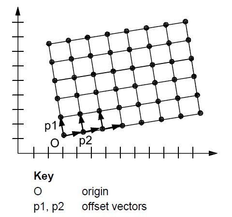
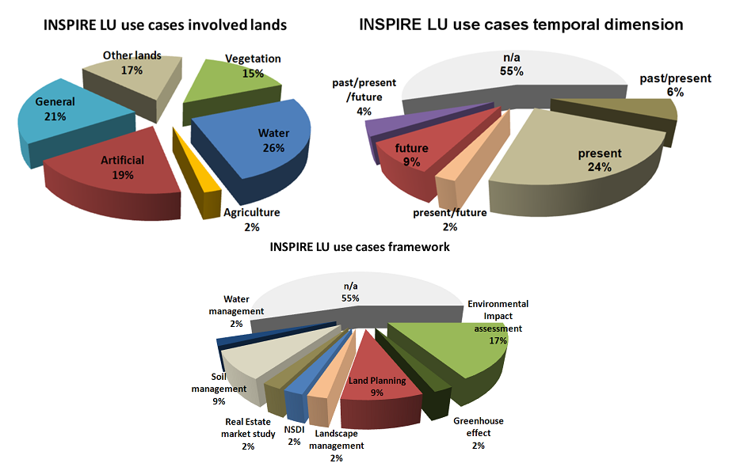

{width="1.3715277777777777in" height="0.9444444444444444in"}

{width="0.9770833333333333in" height="0.9708333333333333in"}

INSPIRE\
Infrastructure for Spatial Information in Europe

D2.8.III.4 Data Specification on *Land Use* -- Technical Guidelines

+-----------------+-------------------------------------------------------------------------------------------------------------------------------------------------------------------------------+
| **Title**       | D2.8.III.4 INSPIRE Data Specification on *Land Use* -- Technical Guidelines                                                                                                   |
+-----------------+-------------------------------------------------------------------------------------------------------------------------------------------------------------------------------+
| **Creator**     | INSPIRE Thematic Working Group *Land Use*                                                                                                                                     |
+-----------------+-------------------------------------------------------------------------------------------------------------------------------------------------------------------------------+
| **Date**        | 2013-12-10                                                                                                                                                                    |
+-----------------+-------------------------------------------------------------------------------------------------------------------------------------------------------------------------------+
| **Subject**     | INSPIRE Data Specification for the spatial data theme *Land Use*                                                                                                              |
+-----------------+-------------------------------------------------------------------------------------------------------------------------------------------------------------------------------+
| **Publisher**   | European Commission Joint Research Centre                                                                                                                                     |
+-----------------+-------------------------------------------------------------------------------------------------------------------------------------------------------------------------------+
| **Type**        | Text                                                                                                                                                                          |
+-----------------+-------------------------------------------------------------------------------------------------------------------------------------------------------------------------------+
| **Description** | This document describes the INSPIRE Data Specification for the spatial data theme *Land Use*                                                                                  |
+-----------------+-------------------------------------------------------------------------------------------------------------------------------------------------------------------------------+
| **Contributor** | ::: {custom-style="header"}                                                                                                                                                   |
|                 | Members of the INSPIRE Thematic Working Group *Land Use*                                                                                                                      |
|                 | :::                                                                                                                                                                           |
+-----------------+-------------------------------------------------------------------------------------------------------------------------------------------------------------------------------+
| **Format**      | Portable Document Format (pdf)                                                                                                                                                |
+-----------------+-------------------------------------------------------------------------------------------------------------------------------------------------------------------------------+
| **Source**      |                                                                                                                                                                               |
+-----------------+-------------------------------------------------------------------------------------------------------------------------------------------------------------------------------+
| **Rights**      | Public                                                                                                                                                                        |
+-----------------+-------------------------------------------------------------------------------------------------------------------------------------------------------------------------------+
| **Identifier**  | D2.8.III.4_v3.0                                                                                                                                                               |
+-----------------+-------------------------------------------------------------------------------------------------------------------------------------------------------------------------------+
| **Language**    | En                                                                                                                                                                            |
+-----------------+-------------------------------------------------------------------------------------------------------------------------------------------------------------------------------+
| **Relation**    | Directive 2007/2/EC of the European Parliament and of the Council of 14 March 2007 establishing an Infrastructure for Spatial Information in the European Community (INSPIRE) |
+-----------------+-------------------------------------------------------------------------------------------------------------------------------------------------------------------------------+
| **Coverage**    | Project duration                                                                                                                                                              |
+-----------------+-------------------------------------------------------------------------------------------------------------------------------------------------------------------------------+

**Foreword**

**How to read the document?**

This document describes the *"INSPIRE data specification on Land Use -- Technical Guidelines"* version 3.0 as developed by the Thematic Working Group (TWG) *LU* using both natural and a conceptual schema language.

The data specification is based on a common template[^1] used for all data specifications, which has been harmonised using the experience from the development of the Annex I, II and III data specifications.

This document provides guidelines for the implementation of the provisions laid down in the Implementing Rule for spatial data sets and services of the INSPIRE Directive. It also includes additional requirements and recommendations that, although not included in the Implementing Rule, are relevant to guarantee or to increase data interoperability.

Two executive summaries provide a quick overview of the INSPIRE data specification process in general, and the content of the data specification on *Land Use* in particular. We highly recommend that managers, decision makers, and all those new to the INSPIRE process and/or information modelling should read these executive summaries first.

The UML diagrams (in Chapter 5) offer a rapid way to see the main elements of the specifications and their relationships. The definition of the spatial object types, attributes, and relationships are included in the Feature Catalogue (also in Chapter 5). People having thematic expertise but not familiar with UML can fully understand the content of the data model focusing on the Feature Catalogue. Users might also find the Feature Catalogue especially useful to check if it contains the data necessary for the applications that they run. The technical details are expected to be of prime interest to those organisations that are responsible for implementing INSPIRE within the field of *Land Use*, but also to other stakeholders and users of the spatial data infrastructure.

The technical provisions and the underlying concepts are often illustrated by examples. Smaller examples are within the text of the specification, while longer explanatory examples and descriptions of selected use cases are attached in the annexes.

In order to distinguish the INSPIRE spatial data themes from the spatial object types, the INSPIRE spatial data themes are written in *italics.*

  ----------------------------------------------------------------------------------------------------------------------------------------------------------------------------------------------------
  The document will be publicly available as a 'non-paper'. It does not represent an official position of the European Commission, and as such cannot be invoked in the context of legal procedures.
  ----------------------------------------------------------------------------------------------------------------------------------------------------------------------------------------------------

**Legal Notice**

Neither the European Commission nor any person acting on behalf of the Commission is responsible for the use which might be made of this publication.

**Interoperability of Spatial Data Sets and Services --\
General Executive Summary**

The challenges regarding the lack of availability, quality, organisation, accessibility, and sharing of spatial information are common to a large number of policies and activities and are experienced across the various levels of public authority in Europe. In order to solve these problems it is necessary to take measures of coordination between the users and providers of spatial information. The Directive 2007/2/EC of the European Parliament and of the Council adopted on 14 March 2007 aims at establishing an Infrastructure for Spatial Information in the European Community (INSPIRE) for environmental policies, or policies and activities that have an impact on the environment.

INSPIRE is based on the infrastructures for spatial information that are created and maintained by the Member States. To support the establishment of a European infrastructure, Implementing Rules addressing the following components of the infrastructure have been specified: metadata, interoperability of spatial data sets (as described in Annexes I, II, III of the Directive) and spatial data services, network services, data and service sharing, and monitoring and reporting procedures.

INSPIRE does not require collection of new data. However, after the period specified in the Directive[^2] Member States have to make their data available according to the Implementing Rules.

Interoperability in INSPIRE means the possibility to combine spatial data and services from different sources across the European Community in a consistent way without involving specific efforts of humans or machines. It is important to note that "interoperability" is understood as providing access to spatial data sets through network services, typically via Internet. Interoperability may be achieved by either changing (harmonising) and storing existing data sets or transforming them via services for publication in the INSPIRE infrastructure. It is expected that users will spend less time and efforts on understanding and integrating data when they build their applications based on data delivered in accordance with INSPIRE.

In order to benefit from the endeavours of international standardisation bodies and organisations established under international law their standards and technical means have been utilised and referenced, whenever possible.

To facilitate the implementation of INSPIRE, it is important that all stakeholders have the opportunity to participate in specification and development. For this reason, the Commission has put in place a consensus building process involving data users, and providers together with representatives of industry, research and government. These stakeholders, organised through Spatial Data Interest Communities (SDIC) and Legally Mandated Organisations (LMO)[^3], have provided reference materials, participated in the user requirement and technical[^4] surveys, proposed experts for the Data Specification Drafting Team[^5], the Thematic Working Groups[^6] and other ad-hoc cross-thematic technical groups and participated in the public stakeholder consultations on draft versions of the data specifications. These consultations covered expert reviews as well as feasibility and fitness-for-purpose testing of the data specifications[^7].

This open and participatory approach was successfully used during the development of the data specifications on Annex I, II and III data themes as well as during the preparation of the Implementing Rule on Interoperability of Spatial Data Sets and Services[^8] for Annex I spatial data themes and of its amendment regarding the themes of Annex II and III.

The development framework elaborated by the Data Specification Drafting Team aims at keeping the data specifications of the different themes coherent. It summarises the methodology to be used for the development of the data specifications, providing a coherent set of requirements and recommendations to achieve interoperability. The pillars of the framework are the following technical documents[^9]:

-   The *Definition of Annex Themes and Scope* describes in greater detail the spatial data themes defined in the Directive, and thus provides a sound starting point for the thematic aspects of the data specification development.

-   The *Generic Conceptual Model* defines the elements necessary for interoperability and data harmonisation including cross-theme issues. It specifies requirements and recommendations with regard to data specification elements of common use, like the spatial and temporal schema, unique identifier management, object referencing, some common code lists, etc. Those requirements of the Generic Conceptual Model that are directly implementable are included in the Implementing Rule on Interoperability of Spatial Data Sets and Services.

-   The *Methodology for the Development of Data Specifications* defines a repeatable methodology. It describes how to arrive from user requirements to a data specification through a number of steps including use-case development, initial specification development and analysis of analogies and gaps for further specification refinement.

-   The *Guidelines for the Encoding of Spatial Data* defines how geographic information can be encoded to enable transfer processes between the systems of the data providers in the Member States. Even though it does not specify a mandatory encoding rule it sets GML (ISO 19136) as the default encoding for INSPIRE.

-   The *Guidelines for the use of Observations & Measurements and Sensor Web Enablement-related standards in INSPIRE Annex II and III data specification development* provides guidelines on how the "Observations and Measurements" standard (ISO 19156) is to be used within INSPIRE.

-   The *Common data models* are a set of documents that specify data models that are referenced by a number of different data specifications. These documents include generic data models for networks, coverages and activity complexes.

The structure of the data specifications is based on the "ISO 19131 Geographic information - Data product specifications" standard. They include the technical documentation of the application schema, the spatial object types with their properties, and other specifics of the spatial data themes using natural language as well as a formal conceptual schema language[^10].

A consolidated model repository, feature concept dictionary, and glossary are being maintained to support the consistent specification development and potential further reuse of specification elements. The consolidated model consists of the harmonised models of the relevant standards from the ISO 19100 series, the INSPIRE Generic Conceptual Model, and the application schemas[^11] developed for each spatial data theme. The multilingual INSPIRE Feature Concept Dictionary contains the definition and description of the INSPIRE themes together with the definition of the spatial object types present in the specification. The INSPIRE Glossary defines all the terms (beyond the spatial object types) necessary for understanding the INSPIRE documentation including the terminology of other components (metadata, network services, data sharing, and monitoring).

By listing a number of requirements and making the necessary recommendations, the data specifications enable full system interoperability across the Member States, within the scope of the application areas targeted by the Directive. The data specifications (in their version 3.0) are published as technical guidelines and provide the basis for the content of the Implementing Rule on Interoperability of Spatial Data Sets and Services[^12]. The content of the Implementing Rule is extracted from the data specifications, considering short- and medium-term feasibility as well as cost-benefit considerations. The requirements included in the Implementing Rule are legally binding for the Member States according to the timeline specified in the INSPIRE Directive.

In addition to providing a basis for the interoperability of spatial data in INSPIRE, the data specification development framework and the thematic data specifications can be reused in other environments at local, regional, national and global level contributing to improvements in the coherence and interoperability of data in spatial data infrastructures.

***Land Use* -- Executive Summary**

The cornerstone of the specification development was the fact that *Land Use shapes our environment in positive and negative ways. Productive land is a critical resource for food and biomass production and land use strongly influences soil erosion and soil functions such as carbon storage. Land management largely determines the beauty of Europe\'s landscapes. It is important therefore to monitor land cover and land-use change*[^13].

In the INSPIRE directive, *Land Use* is defined as Territory characterised according to its current and future planned functional dimension or socio-economic purpose (e.g. residential, industrial, commercial, agricultural, forestry, recreational). \[Directive 2007/2/EC\] It is the description of land in terms or its socio-economic and ecological purpose. The inland water bodies as well as coastal waters are considered within the connected piece of land and planning of the use of sea and the use of seabed has been taken into consideration.

*Land Use* is itself split up into two different types:

1.  The Existing *Land Use* (current land use in the above definition), which objectively depicts the use and functions of a territory as it has been and effectively still is in real life. Geographical data-sets that provide *Land Use* information, at the time of observation, are modeled according to three application schemas:

    a.  organized as a partition (in the mathematical sense) of a given area. Each element of the partition is homogeneous regarding the functional use of land. (ExistingLandUse application schema),

    b.  organized as a set of discrete observation points informing on the functional use at the exact location and/or at its surrounding at the time of observation, (SampledExistingLandUse application schema),

    c.  organized as a set of pixels informing on the functional use (GriddedExistingLandUse application schema)

2.  The Planned *Land Use* or PLU (future planned land use in the above definition), which corresponds to spatial plans, defined by spatial planning authorities, depicting the possible utilization of the land in the future. Planned land use is regulated by spatial planning documents elaborated at various levels of administration. *Land Use* regulation over a geographical area is in general composed of an overall strategic orientation, a textual regulation and a cartographic representation. Spatial planning documents result from the spatial planning process, once adopted and therefore which third parties must conform with. The scope of the INSPIRE *Land Use* Data Specification is giving the exact spatial dimension of all the elements a spatial plan is composed of. Planned *Land Use* application schema is mainly based on ZoningElement that depicts the zoning defined by spatial planners and SupplementaryRegulation that enables to inform on regulations that superimpose on the zoning.

The *Land Use* data specification supports two systems of classification:

-   the (obligatory) Hierarchical INSPIRE *Land Use* Classification System (HILUCS) which is a multi-level, classification system that will apply to both the existing and planned land use

-   the (optional) specific classification system in use in a member state.

*Land Use* has connexion with several other INSPIRE themes but it has been preferred not to include relationships with these themes in the model assuming that geometric functions of user information systems will enable to compute the spatial relationships. For example the inclusion of a feature from another theme in a *Land Use* feature or the overlap between them can be recomputed with spatial analysis tools.

In the *Land Use* data specification the description of the use of land will not provide the description of the geographical objects as done in the other theme. For example, an area in which energy is produced will be seen as a unique object in a *Land Use* datasets where in the Energy resource theme more detailed description of the plant may be provided including differentiation of its parts.

As stated by the INSPIRE directive, *Land Use* is different from Land Cover (LC, Annex II, theme number 2). The choice has been made to consider those two themes with different geometries.

Planned *Land Use* information is often overlaid on cadastral maps or other background mapping such as orthoimagery. The choice has been made to allow the data provider to inform on the version of the background map which the spatial plan has been drawn over without implementing direct relationships with the corresponding theme as described in the INSPIRE Data Specification .

Planned land use incorporate elements that in the real world can be related to other INSPIRE spatial data themes (see Figure 1) such as Area management/restriction/regulation zones and reporting units (AM, Annex III theme 11) or Natural Risk Zones (NZ, annex III theme 12). These will be seen as supplementary regulation in the *Land Use* data model (planned land Use) as soon as this information is incorporated in the legal spatial plan, i.e. only information that is geographical and legally binding in the spatial plan will be considered as a supplementary regulation although it may belong to another theme.

{width="5.0in" height="3.4479166666666665in"}

::: {custom-style="caption"}
Figure 1: Relation of the land use theme with the area management and natural risk zone theme.
:::

Comparable data on top of harmonised specification elements create additional value for achieving interoperability in INSPIRE. For this finality the data specification on *Land Use* includes recommendations on reporting data quality parameters.

Regardless whether these recommendations on data quality are met, the actual values of data quality elements should be published as metadata. These elements usually have to be published at the dataset level.

For visualisation purposes, simple rules for default portrayal are given by specifying the colour attached to classes of the Hierarchical INSPIRE *Land Use* Classification System.

The main value of the INSPIRE *Land Use* model is its simplicity, a yet flexible structure that allows data providers to publish their existing data in the most convenient way. It is expected that the effective use of the model will help explaining how to implement this data specification including how to use it for structure plans and construction plans.

**Acknowledgements**

Many individuals and organisations have contributed to the development of these Guidelines.

The Thematic Working Group *Land Use* (TWG-LU) included:

François Salgé (TWG Facilitator), Wilko Quak (TWG Editor), Aaro Mikkola, Anneloes van Noordt, Gerard Willem Hazeu, Isabel Goñi, Julián Delgado Hernández, Kai-Uwe Krause, Maria Andrzejewska, Marjo Kasanko, Walter Richter, Maria Vanda Nunes de Lima (European Commission contact point).

Other contributors to the INSPIRE data specifications are the Drafting Team Data Specifications, the JRC Data Specifications Team and the INSPIRE stakeholders - Spatial Data Interested Communities (SDICs) and Legally Mandated Organisations (LMOs).

**Contact information**

Maria Vanda Nunes de Lima & Michael Lutz

European Commission Joint Research Centre (JRC)

Institute for Environment and Sustainability

Unit H06: Digital Earth and Reference Data

*http://inspire.ec.europa.eu/index.cfm/pageid/2*

**\
Table of contents**

::: {custom-style="toc 1"}
[1]{custom-style="Hyperlink"} [Scope]{custom-style="Hyperlink"} 1
:::

::: {custom-style="toc 1"}
[2]{custom-style="Hyperlink"} [Overview]{custom-style="Hyperlink"} 1
:::

::: {custom-style="toc 2"}
[2.1]{custom-style="Hyperlink"} [Name]{custom-style="Hyperlink"} 1
:::

::: {custom-style="toc 2"}
[2.2]{custom-style="Hyperlink"} [Informal description]{custom-style="Hyperlink"} 1
:::

::: {custom-style="toc 3"}
[2.2.1]{custom-style="Hyperlink"} [Existing land use]{custom-style="Hyperlink"} 2
:::

::: {custom-style="toc 3"}
[2.2.2]{custom-style="Hyperlink"} [Planned land use]{custom-style="Hyperlink"} 4
:::

::: {custom-style="toc 3"}
[2.2.3]{custom-style="Hyperlink"} [Interrelationships with INSPIRE spatial data themes]{custom-style="Hyperlink"} 7
:::

::: {custom-style="toc 2"}
[2.3]{custom-style="Hyperlink"} [Normative References]{custom-style="Hyperlink"} 9
:::

::: {custom-style="toc 2"}
[2.4]{custom-style="Hyperlink"} [Terms and definitions]{custom-style="Hyperlink"} 9
:::

::: {custom-style="toc 2"}
[2.5]{custom-style="Hyperlink"} [Symbols and abbreviations]{custom-style="Hyperlink"} 10
:::

::: {custom-style="toc 2"}
[2.6]{custom-style="Hyperlink"} [XML Extensible Markup Language How the Technical Guidelines map to the Implementing Rules]{custom-style="Hyperlink"} 11
:::

::: {custom-style="toc 3"}
[2.6.1]{custom-style="Hyperlink"} [Requirements]{custom-style="Hyperlink"} 12
:::

::: {custom-style="toc 3"}
[2.6.2]{custom-style="Hyperlink"} [Recommendations]{custom-style="Hyperlink"} 12
:::

::: {custom-style="toc 3"}
[2.6.3]{custom-style="Hyperlink"} [Conformance]{custom-style="Hyperlink"} 12
:::

::: {custom-style="toc 1"}
[3]{custom-style="Hyperlink"} [Specification scopes]{custom-style="Hyperlink"} 13
:::

::: {custom-style="toc 1"}
[4]{custom-style="Hyperlink"} [Identification information]{custom-style="Hyperlink"} 13
:::

::: {custom-style="toc 1"}
[5]{custom-style="Hyperlink"} [Data content and structure]{custom-style="Hyperlink"} 13
:::

::: {custom-style="toc 2"}
[5.1]{custom-style="Hyperlink"} [Application schemas -- Overview]{custom-style="Hyperlink"} 13
:::

::: {custom-style="toc 3"}
[5.1.1]{custom-style="Hyperlink"} [Application schemas included in the IRs]{custom-style="Hyperlink"} 13
:::

::: {custom-style="toc 2"}
[5.2]{custom-style="Hyperlink"} [Basic notions]{custom-style="Hyperlink"} 15
:::

::: {custom-style="toc 3"}
[5.2.1]{custom-style="Hyperlink"} [Notation]{custom-style="Hyperlink"} 15
:::

::: {custom-style="toc 3"}
[5.2.2]{custom-style="Hyperlink"} [Voidable characteristics]{custom-style="Hyperlink"} 16
:::

::: {custom-style="toc 3"}
[5.2.3]{custom-style="Hyperlink"} [Enumerations]{custom-style="Hyperlink"} 17
:::

::: {custom-style="toc 3"}
[5.2.4]{custom-style="Hyperlink"} [Code lists]{custom-style="Hyperlink"} 17
:::

::: {custom-style="toc 3"}
[5.2.5]{custom-style="Hyperlink"} [Identifier management]{custom-style="Hyperlink"} 20
:::

::: {custom-style="toc 3"}
[5.2.6]{custom-style="Hyperlink"} [Geometry representation]{custom-style="Hyperlink"} 21
:::

::: {custom-style="toc 3"}
[5.2.7]{custom-style="Hyperlink"} [Temporality representation]{custom-style="Hyperlink"} 21
:::

::: {custom-style="toc 3"}
[5.2.8]{custom-style="Hyperlink"} [Coverages]{custom-style="Hyperlink"} 22
:::

::: {custom-style="toc 2"}
[5.3]{custom-style="Hyperlink"} [Application schema Land Use]{custom-style="Hyperlink"} 24
:::

::: {custom-style="toc 3"}
[5.3.1]{custom-style="Hyperlink"} [Description]{custom-style="Hyperlink"} 24
:::

::: {custom-style="toc 3"}
[5.3.2]{custom-style="Hyperlink"} [Land Use Nomenclature Feature catalogue]{custom-style="Hyperlink"} 46
:::

::: {custom-style="toc 3"}
[5.3.3]{custom-style="Hyperlink"} [Existing land use Feature catalogue]{custom-style="Hyperlink"} 49
:::

::: {custom-style="toc 3"}
[5.3.4]{custom-style="Hyperlink"} [Gridded land use Feature catalogue]{custom-style="Hyperlink"} 54
:::

::: {custom-style="toc 3"}
[5.3.5]{custom-style="Hyperlink"} [Sampled land use Feature catalogue]{custom-style="Hyperlink"} 56
:::

::: {custom-style="toc 3"}
[5.3.6]{custom-style="Hyperlink"} [Planned Land Use Feature catalogue]{custom-style="Hyperlink"} 61
:::

::: {custom-style="toc 1"}
[6]{custom-style="Hyperlink"} [Reference systems, units of measure and grids]{custom-style="Hyperlink"} 75
:::

::: {custom-style="toc 2"}
[6.1]{custom-style="Hyperlink"} [Default reference systems, units of measure and grid]{custom-style="Hyperlink"} 75
:::

::: {custom-style="toc 3"}
[6.1.1]{custom-style="Hyperlink"} [Coordinate reference systems]{custom-style="Hyperlink"} 76
:::

::: {custom-style="toc 3"}
[6.1.2]{custom-style="Hyperlink"} [Temporal reference system]{custom-style="Hyperlink"} 78
:::

::: {custom-style="toc 3"}
[6.1.3]{custom-style="Hyperlink"} [Units of measure]{custom-style="Hyperlink"} 79
:::

::: {custom-style="toc 3"}
[6.1.4]{custom-style="Hyperlink"} [Grids]{custom-style="Hyperlink"} 79
:::

::: {custom-style="toc 2"}
[6.2]{custom-style="Hyperlink"} [Theme-specific requirements and recommendations]{custom-style="Hyperlink"} 80
:::

::: {custom-style="toc 3"}
[6.2.1]{custom-style="Hyperlink"} [Coordinate reference systems]{custom-style="Hyperlink"} 80
:::

::: {custom-style="toc 1"}
[7]{custom-style="Hyperlink"} [Data quality]{custom-style="Hyperlink"} 80
:::

::: {custom-style="toc 2"}
[7.1]{custom-style="Hyperlink"} [Data quality elements]{custom-style="Hyperlink"} 81
:::

::: {custom-style="toc 3"}
[7.1.1]{custom-style="Hyperlink"} [Completeness -- Commission]{custom-style="Hyperlink"} 81
:::

::: {custom-style="toc 3"}
[7.1.2]{custom-style="Hyperlink"} [Completeness -- Omission]{custom-style="Hyperlink"} 82
:::

::: {custom-style="toc 3"}
[7.1.3]{custom-style="Hyperlink"} [Logical consistency -- Domain consistency]{custom-style="Hyperlink"} 83
:::

::: {custom-style="toc 3"}
[7.1.4]{custom-style="Hyperlink"} [Positional accuracy -- Absolute or external accuracy]{custom-style="Hyperlink"} 84
:::

::: {custom-style="toc 3"}
[7.1.5]{custom-style="Hyperlink"} [Thematic accuracy -- Classification correctness]{custom-style="Hyperlink"} 85
:::

::: {custom-style="toc 3"}
[7.1.6]{custom-style="Hyperlink"} [Thematic accuracy -- Non-quantitative attribute correctness]{custom-style="Hyperlink"} 85
:::

::: {custom-style="toc 2"}
[7.2]{custom-style="Hyperlink"} [Minimum data quality requirements]{custom-style="Hyperlink"} 86
:::

::: {custom-style="toc 2"}
[7.3]{custom-style="Hyperlink"} [Recommendation on data quality]{custom-style="Hyperlink"} 86
:::

::: {custom-style="toc 1"}
[8]{custom-style="Hyperlink"} [Dataset-level metadata]{custom-style="Hyperlink"} 86
:::

::: {custom-style="toc 2"}
[8.1]{custom-style="Hyperlink"} [Metadata elements defined in INSPIRE Metadata Regulation]{custom-style="Hyperlink"} 86
:::

::: {custom-style="toc 3"}
[8.1.1]{custom-style="Hyperlink"} [Conformity]{custom-style="Hyperlink"} 88
:::

::: {custom-style="toc 3"}
[8.1.2]{custom-style="Hyperlink"} [Lineage]{custom-style="Hyperlink"} 90
:::

::: {custom-style="toc 3"}
[8.1.3]{custom-style="Hyperlink"} [Temporal reference]{custom-style="Hyperlink"} 90
:::

::: {custom-style="toc 3"}
[8.1.4]{custom-style="Hyperlink"} [Keywords]{custom-style="Hyperlink"} 90
:::

::: {custom-style="toc 3"}
[8.1.5]{custom-style="Hyperlink"} [Spatial Resolution]{custom-style="Hyperlink"} 91
:::

::: {custom-style="toc 2"}
[8.2 Metadata elements for interoperability 91]{custom-style="Hyperlink"}
:::

::: {custom-style="toc 3"}
[8.2.1]{custom-style="Hyperlink"} [Coordinate Reference System]{custom-style="Hyperlink"} 92
:::

::: {custom-style="toc 3"}
[8.2.2]{custom-style="Hyperlink"} [Temporal Reference System]{custom-style="Hyperlink"} 93
:::

::: {custom-style="toc 3"}
[8.2.3]{custom-style="Hyperlink"} [Encoding]{custom-style="Hyperlink"} 94
:::

::: {custom-style="toc 3"}
[8.2.4]{custom-style="Hyperlink"} [Character Encoding]{custom-style="Hyperlink"} 94
:::

::: {custom-style="toc 3"}
[8.2.5]{custom-style="Hyperlink"} [Spatial representation type]{custom-style="Hyperlink"} 95
:::

::: {custom-style="toc 3"}
[8.2.6]{custom-style="Hyperlink"} [Data Quality -- Logical Consistency -- Topological Consistency]{custom-style="Hyperlink"} 95
:::

::: {custom-style="toc 2"}
[8.3]{custom-style="Hyperlink"} [Recommended theme-specific metadata elements]{custom-style="Hyperlink"} 95
:::

::: {custom-style="toc 3"}
[8.3.1]{custom-style="Hyperlink"} [Maintenance Information]{custom-style="Hyperlink"} 96
:::

::: {custom-style="toc 3"}
[8.3.2]{custom-style="Hyperlink"} [Metadata elements for reporting data quality]{custom-style="Hyperlink"} 96
:::

::: {custom-style="toc 1"}
[9]{custom-style="Hyperlink"} [Delivery]{custom-style="Hyperlink"} 99
:::

::: {custom-style="toc 2"}
[9.1]{custom-style="Hyperlink"} [Updates]{custom-style="Hyperlink"} 99
:::

::: {custom-style="toc 2"}
[9.2]{custom-style="Hyperlink"} [Delivery medium]{custom-style="Hyperlink"} 99
:::

::: {custom-style="toc 2"}
[9.3]{custom-style="Hyperlink"} [Encodings]{custom-style="Hyperlink"} 100
:::

::: {custom-style="toc 3"}
[9.3.1]{custom-style="Hyperlink"} [Default Encoding(s)]{custom-style="Hyperlink"} 100
:::

::: {custom-style="toc 2"}
[9.4]{custom-style="Hyperlink"} [Options for delivering coverage data]{custom-style="Hyperlink"} 101
:::

::: {custom-style="toc 1"}
[10]{custom-style="Hyperlink"} [Data Capture]{custom-style="Hyperlink"} 102
:::

::: {custom-style="toc 1"}
[11]{custom-style="Hyperlink"} [Portrayal]{custom-style="Hyperlink"} 103
:::

::: {custom-style="toc 2"}
[11.1]{custom-style="Hyperlink"} [Layers to be provided by INSPIRE view services]{custom-style="Hyperlink"} 104
:::

::: {custom-style="toc 3"}
[11.1.1]{custom-style="Hyperlink"} [Layers organisation]{custom-style="Hyperlink"} 104
:::

::: {custom-style="toc 2"}
[11.2]{custom-style="Hyperlink"} [Styles required to be supported by INSPIRE view services]{custom-style="Hyperlink"} 104
:::

::: {custom-style="toc 3"}
[11.2.1]{custom-style="Hyperlink"} [Styles for the layer LandUse.ExistingLandUse]{custom-style="Hyperlink"} 104
:::

::: {custom-style="toc 3"}
[11.2.2]{custom-style="Hyperlink"} [Styles for the layer LandUse.SpatialPlan]{custom-style="Hyperlink"} 106
:::

::: {custom-style="toc 3"}
[11.2.3]{custom-style="Hyperlink"} [Styles for the layer LandUse.ZoningElement]{custom-style="Hyperlink"} 107
:::

::: {custom-style="toc 3"}
[11.2.4]{custom-style="Hyperlink"} [Styles for the layer LandUse.SupplementaryRegulation]{custom-style="Hyperlink"} 108
:::

::: {custom-style="toc 2"}
[11.3]{custom-style="Hyperlink"} [Styles recommended to be supported by INSPIRE view services]{custom-style="Hyperlink"} 109
:::

::: {custom-style="toc 1"}
[Bibliography]{custom-style="Hyperlink"} 110
:::

::: {custom-style="toc 1"}
[Annex A (normative) Abstract Test Suite]{custom-style="Hyperlink"} 111
:::

::: {custom-style="toc 2"}
[A.1]{custom-style="Hyperlink"} [Application Schema Conformance Class]{custom-style="Hyperlink"} 114
:::

::: {custom-style="toc 3"}
[A.1.1]{custom-style="Hyperlink"} [Schema element denomination test]{custom-style="Hyperlink"} 114
:::

::: {custom-style="toc 3"}
[A.1.2]{custom-style="Hyperlink"} [Value type test]{custom-style="Hyperlink"} 114
:::

::: {custom-style="toc 3"}
[A.1.3]{custom-style="Hyperlink"} [Value test]{custom-style="Hyperlink"} 114
:::

::: {custom-style="toc 3"}
[A.1.4]{custom-style="Hyperlink"} [Attributes/associations completeness test]{custom-style="Hyperlink"} 115
:::

::: {custom-style="toc 3"}
[A.1.5]{custom-style="Hyperlink"} [Abstract spatial object test]{custom-style="Hyperlink"} 115
:::

::: {custom-style="toc 3"}
[A.1.6]{custom-style="Hyperlink"} [Constraints test]{custom-style="Hyperlink"} 115
:::

::: {custom-style="toc 3"}
[This test should include]{custom-style="Hyperlink"} 116
:::

::: {custom-style="toc 3"}
[A.1.7]{custom-style="Hyperlink"} [Geometry representation test]{custom-style="Hyperlink"} 116
:::

::: {custom-style="toc 2"}
[A.2]{custom-style="Hyperlink"} [Reference Systems Conformance Class]{custom-style="Hyperlink"} 116
:::

::: {custom-style="toc 3"}
[A.2.1]{custom-style="Hyperlink"} [Datum test]{custom-style="Hyperlink"} 116
:::

::: {custom-style="toc 3"}
[A.2.2]{custom-style="Hyperlink"} [Coordinate reference system test]{custom-style="Hyperlink"} 116
:::

::: {custom-style="toc 3"}
[A.2.3]{custom-style="Hyperlink"} [Grid test]{custom-style="Hyperlink"} 117
:::

::: {custom-style="toc 3"}
[A.2.4]{custom-style="Hyperlink"} [View service coordinate reference system test]{custom-style="Hyperlink"} 117
:::

::: {custom-style="toc 3"}
[A.2.5]{custom-style="Hyperlink"} [Temporal reference system test]{custom-style="Hyperlink"} 118
:::

::: {custom-style="toc 3"}
[A.2.6]{custom-style="Hyperlink"} [Units of measurements test]{custom-style="Hyperlink"} 118
:::

::: {custom-style="toc 2"}
[A.3]{custom-style="Hyperlink"} [Data Consistency Conformance Class]{custom-style="Hyperlink"} 118
:::

::: {custom-style="toc 3"}
[A.3.1]{custom-style="Hyperlink"} [Unique identifier persistency test]{custom-style="Hyperlink"} 118
:::

::: {custom-style="toc 3"}
[A.3.2]{custom-style="Hyperlink"} [Version consistency test]{custom-style="Hyperlink"} 118
:::

::: {custom-style="toc 3"}
[A.3.3]{custom-style="Hyperlink"} [Life cycle time sequence test]{custom-style="Hyperlink"} 119
:::

::: {custom-style="toc 3"}
[A.3.4]{custom-style="Hyperlink"} [Validity time sequence test]{custom-style="Hyperlink"} 119
:::

::: {custom-style="toc 3"}
[A.3.5]{custom-style="Hyperlink"} [Update frequency test]{custom-style="Hyperlink"} 119
:::

::: {custom-style="toc 2"}
[A.4]{custom-style="Hyperlink"} [Metadata IR Conformance Class]{custom-style="Hyperlink"} 119
:::

::: {custom-style="toc 3"}
[A.5.1]{custom-style="Hyperlink"} [Metadata for interoperability test]{custom-style="Hyperlink"} 120
:::

::: {custom-style="toc 2"}
[A.5]{custom-style="Hyperlink"} [Information Accessibility Conformance Class]{custom-style="Hyperlink"} 120
:::

::: {custom-style="toc 3"}
[A.6.1]{custom-style="Hyperlink"} [Code list publication test]{custom-style="Hyperlink"} 120
:::

::: {custom-style="toc 3"}
[A.6.2]{custom-style="Hyperlink"} [CRS publication test]{custom-style="Hyperlink"} 120
:::

::: {custom-style="toc 3"}
[A.6.3]{custom-style="Hyperlink"} [CRS identification test]{custom-style="Hyperlink"} 120
:::

::: {custom-style="toc 3"}
[A.6.4]{custom-style="Hyperlink"} [Grid identification test]{custom-style="Hyperlink"} 121
:::

::: {custom-style="toc 2"}
[A.6]{custom-style="Hyperlink"} [Data Delivery Conformance Class]{custom-style="Hyperlink"} 121
:::

::: {custom-style="toc 3"}
[A.6.1]{custom-style="Hyperlink"} [Encoding compliance test]{custom-style="Hyperlink"} 121
:::

::: {custom-style="toc 2"}
[A.7]{custom-style="Hyperlink"} [Portrayal Conformance Class]{custom-style="Hyperlink"} 121
:::

::: {custom-style="toc 3"}
[A.8.1]{custom-style="Hyperlink"} [Layer designation test]{custom-style="Hyperlink"} 121
:::

::: {custom-style="toc 2"}
[A.8]{custom-style="Hyperlink"} [Technical Guideline Conformance Class]{custom-style="Hyperlink"} 122
:::

::: {custom-style="toc 3"}
[A.8.1]{custom-style="Hyperlink"} [Multiplicity test]{custom-style="Hyperlink"} 122
:::

::: {custom-style="toc 3"}
[A.9.1]{custom-style="Hyperlink"} [CRS http URI test]{custom-style="Hyperlink"} 122
:::

::: {custom-style="toc 3"}
[A.9.2]{custom-style="Hyperlink"} [Metadata encoding schema validation test]{custom-style="Hyperlink"} 122
:::

::: {custom-style="toc 3"}
[A.9.3]{custom-style="Hyperlink"} [Metadata occurrence test]{custom-style="Hyperlink"} 122
:::

::: {custom-style="toc 3"}
[A.9.4]{custom-style="Hyperlink"} [Metadata consistency test]{custom-style="Hyperlink"} 123
:::

::: {custom-style="toc 3"}
[A.9.5]{custom-style="Hyperlink"} [Encoding schema validation test]{custom-style="Hyperlink"} 123
:::

::: {custom-style="toc 3"}
[A.9.6]{custom-style="Hyperlink"} [Coverage multipart representation test]{custom-style="Hyperlink"} 123
:::

::: {custom-style="toc 3"}
[A.9.7]{custom-style="Hyperlink"} [Coverage domain consistency test]{custom-style="Hyperlink"} 123
:::

::: {custom-style="toc 3"}
[A.9.8]{custom-style="Hyperlink"} [Style test]{custom-style="Hyperlink"} 124
:::

::: {custom-style="toc 1"}
[Annex B (informative) Use cases]{custom-style="Hyperlink"} 125
:::

::: {custom-style="toc 2"}
[B.1]{custom-style="Hyperlink"} [Introduction]{custom-style="Hyperlink"} 125
:::

::: {custom-style="toc 2"}
[B.2]{custom-style="Hyperlink"} [Land Planning]{custom-style="Hyperlink"} 126
:::

::: {custom-style="toc 3"}
[B.2.1]{custom-style="Hyperlink"} [Narrative description]{custom-style="Hyperlink"} 126
:::

::: {custom-style="toc 3"}
[B.2.2]{custom-style="Hyperlink"} [Involved actors]{custom-style="Hyperlink"} 127
:::

::: {custom-style="toc 3"}
[B.2.3]{custom-style="Hyperlink"} [Detailed description]{custom-style="Hyperlink"} 127
:::

::: {custom-style="toc 2"}
[B.3]{custom-style="Hyperlink"} [Analysis of land consumption]{custom-style="Hyperlink"} 129
:::

::: {custom-style="toc 3"}
[B.3.1]{custom-style="Hyperlink"} [Narrative description]{custom-style="Hyperlink"} 129
:::

::: {custom-style="toc 3"}
[B.3.2]{custom-style="Hyperlink"} [Involved actors]{custom-style="Hyperlink"} 130
:::

::: {custom-style="toc 3"}
[B.3.3]{custom-style="Hyperlink"} [Detailed description]{custom-style="Hyperlink"} 130
:::

::: {custom-style="toc 2"}
[B.4]{custom-style="Hyperlink"} [Ecological network map]{custom-style="Hyperlink"} 131
:::

::: {custom-style="toc 3"}
[B.4.1]{custom-style="Hyperlink"} [Narrative description]{custom-style="Hyperlink"} 131
:::

::: {custom-style="toc 3"}
[B.4.2]{custom-style="Hyperlink"} [Involved actors]{custom-style="Hyperlink"} 133
:::

::: {custom-style="toc 3"}
[B.4.3]{custom-style="Hyperlink"} [Detailed description]{custom-style="Hyperlink"} 133
:::

::: {custom-style="toc 2"}
[B.5]{custom-style="Hyperlink"} [Land Use and land-use change and forestry for greenhouse inventory reporting]{custom-style="Hyperlink"} 134
:::

::: {custom-style="toc 3"}
[B.5.1]{custom-style="Hyperlink"} [Narrative description]{custom-style="Hyperlink"} 134
:::

::: {custom-style="toc 3"}
[B.5.2]{custom-style="Hyperlink"} [Involved actors]{custom-style="Hyperlink"} 137
:::

::: {custom-style="toc 3"}
[B.5.3]{custom-style="Hyperlink"} [Detailed description]{custom-style="Hyperlink"} 137
:::

::: {custom-style="toc 2"}
[B.6]{custom-style="Hyperlink"} [Other use cases]{custom-style="Hyperlink"} 138
:::

::: {custom-style="toc 3"}
[B.6.1]{custom-style="Hyperlink"} [Land Use for environmental impact assessment]{custom-style="Hyperlink"} 138
:::

::: {custom-style="toc 3"}
[B.6.2]{custom-style="Hyperlink"} [Land Use for the flood directive]{custom-style="Hyperlink"} 138
:::

::: {custom-style="toc 3"}
[B.6.3]{custom-style="Hyperlink"} [Statistics for land use]{custom-style="Hyperlink"} 139
:::

::: {custom-style="toc 3"}
[B.6.4]{custom-style="Hyperlink"} [Land Use for soil management]{custom-style="Hyperlink"} 139
:::

::: {custom-style="toc 2"}
[B.7]{custom-style="Hyperlink"} [Existing land use data requirements]{custom-style="Hyperlink"} 140
:::

::: {custom-style="toc 3"}
[B.7.1]{custom-style="Hyperlink"} [Features]{custom-style="Hyperlink"} 141
:::

::: {custom-style="toc 3"}
[B.7.2]{custom-style="Hyperlink"} [Nomenclature]{custom-style="Hyperlink"} 141
:::

::: {custom-style="toc 3"}
[B.7.3]{custom-style="Hyperlink"} [Temporal dimension]{custom-style="Hyperlink"} 141
:::

::: {custom-style="toc 3"}
[B.7.4]{custom-style="Hyperlink"} [Quality control]{custom-style="Hyperlink"} 142
:::

::: {custom-style="toc 3"}
[B.7.5]{custom-style="Hyperlink"} [Identifiers]{custom-style="Hyperlink"} 142
:::

::: {custom-style="toc 3"}
[B.7.6]{custom-style="Hyperlink"} [Portrayal]{custom-style="Hyperlink"} 142
:::

::: {custom-style="toc 3"}
[B.7.7]{custom-style="Hyperlink"} [Metadata]{custom-style="Hyperlink"} 142
:::

::: {custom-style="toc 3"}
[B.7.8]{custom-style="Hyperlink"} [Consistency with other themes]{custom-style="Hyperlink"} 142
:::

::: {custom-style="toc 3"}
[B.7.9]{custom-style="Hyperlink"} [Detailed user's assessment from HLANDATA project]{custom-style="Hyperlink"} 142
:::

::: {custom-style="toc 2"}
[B.8]{custom-style="Hyperlink"} [Planned land use data requirements]{custom-style="Hyperlink"} 143
:::

::: {custom-style="toc 3"}
[B.8.1]{custom-style="Hyperlink"} [Features]{custom-style="Hyperlink"} 143
:::

::: {custom-style="toc 3"}
[B.8.2]{custom-style="Hyperlink"} [Nomenclature]{custom-style="Hyperlink"} 144
:::

::: {custom-style="toc 3"}
[B.8.3]{custom-style="Hyperlink"} [Temporal dimension]{custom-style="Hyperlink"} 144
:::

::: {custom-style="toc 3"}
[B.8.4]{custom-style="Hyperlink"} [Identifiers]{custom-style="Hyperlink"} 144
:::

::: {custom-style="toc 3"}
[B.8.5]{custom-style="Hyperlink"} [Quality control]{custom-style="Hyperlink"} 144
:::

::: {custom-style="toc 3"}
[B.8.6]{custom-style="Hyperlink"} [Portrayal]{custom-style="Hyperlink"} 144
:::

::: {custom-style="toc 3"}
[B.8.7]{custom-style="Hyperlink"} [Metadata]{custom-style="Hyperlink"} 144
:::

::: {custom-style="toc 3"}
[B.8.8]{custom-style="Hyperlink"} [Consistency with other themes]{custom-style="Hyperlink"} 144
:::

::: {custom-style="toc 1"}
[Annex C (normative) Code list values]{custom-style="Hyperlink"} 145
:::

::: {custom-style="toc 1"}
[Annex D (informative) Towards the Hierarchical INSPIRE Land Use nomenclature]{custom-style="Hyperlink"} 176
:::

::: {custom-style="toc 2"}
[D.1]{custom-style="Hyperlink"} [Investigated classification systems]{custom-style="Hyperlink"} 176
:::

::: {custom-style="toc 3"}
[D.1.1]{custom-style="Hyperlink"} [LUCAS (Land Use / Cover Area Frame Survey)]{custom-style="Hyperlink"} 177
:::

::: {custom-style="toc 3"}
[D.1.2]{custom-style="Hyperlink"} [Urban Atlas]{custom-style="Hyperlink"} 177
:::

::: {custom-style="toc 3"}
[D.1.3]{custom-style="Hyperlink"} [Plan4All]{custom-style="Hyperlink"} 178
:::

::: {custom-style="toc 3"}
[D.1.4]{custom-style="Hyperlink"} [FR-CNIG -- Plan local d'urbanisme -- Plan d'occupation des sols]{custom-style="Hyperlink"} 178
:::

::: {custom-style="toc 3"}
[D.1.5]{custom-style="Hyperlink"} [NL-BBG -- Bestand Bodemgebruik]{custom-style="Hyperlink"} 179
:::

::: {custom-style="toc 3"}
[D.1.6]{custom-style="Hyperlink"} [UK-National Land Use Database: Land Use and Land Cover Classification]{custom-style="Hyperlink"} 179
:::

::: {custom-style="toc 3"}
[D.1.7]{custom-style="Hyperlink"} [US-LBCS (Land-Based Classification Standards)]{custom-style="Hyperlink"} 180
:::

::: {custom-style="toc 2"}
[D.2]{custom-style="Hyperlink"} [Conclusions]{custom-style="Hyperlink"} 180
:::

::: {custom-style="toc 2"}
[D.3]{custom-style="Hyperlink"} [HILUCS]{custom-style="Hyperlink"} 181
:::

::: {custom-style="toc 2"}
[D.4]{custom-style="Hyperlink"} [Mapping HILUCS with LUCAS, NACE, SEEA and Urban Atlas]{custom-style="Hyperlink"} 181
:::

::: {custom-style="toc 2"}
[D.5]{custom-style="Hyperlink"} [HILUCS Frequently asked questions:]{custom-style="Hyperlink"} 186
:::

::: {custom-style="toc 2"}
[D.6]{custom-style="Hyperlink"} [Mapping HILUCS with some specific classification systems]{custom-style="Hyperlink"} 187
:::

::: {custom-style="toc 1"}
[Annex E (informative) Hierarchical Supplementary Regulation Code List]{custom-style="Hyperlink"} 209
:::

::: {custom-style="toc 2"}
[E.1]{custom-style="Hyperlink"} [Introduction]{custom-style="Hyperlink"} 209
:::

::: {custom-style="toc 2"}
[E.2]{custom-style="Hyperlink"} [Proposed Hierarchical Supplementary Regulation Code List (HSRCL)]{custom-style="Hyperlink"} 210
:::

::: {custom-style="toc 2"}
[E.3]{custom-style="Hyperlink"} [Examples of mapping HSRCL with national coding systems]{custom-style="Hyperlink"} 210
:::

::: {custom-style="toc 3"}
[Mapping with CNIG (France) code list]{custom-style="Hyperlink"} 210
:::

::: {custom-style="toc 3"}
[Mapping supplementary regulation in Germany with XPlanGML standard]{custom-style="Hyperlink"} 214
:::

::: {custom-style="toc 3"}
[Mapping supplementary regulation on structure plan level in Germany with XPlanGML standard]{custom-style="Hyperlink"} 220
:::

::: {custom-style="toc 1"}
[Annex F (informative) Land Use and Land Cover Relations]{custom-style="Hyperlink"} 229
:::

::: {custom-style="toc 2"}
[F.1]{custom-style="Hyperlink"} [Land cover and land use definitions]{custom-style="Hyperlink"} 229
:::

::: {custom-style="toc 2"}
[F.2]{custom-style="Hyperlink"} [Dependencies and consequences between land cover and land use]{custom-style="Hyperlink"} 230
:::

::: {custom-style="toc 2"}
[F.3]{custom-style="Hyperlink"} [Land unit]{custom-style="Hyperlink"} 230
:::

::: {custom-style="toc 1"}
[Annex G (informative) Proposed changes to D2.3 V3.0]{custom-style="Hyperlink"} 233
:::

::: {custom-style="toc 2"}
[G.1]{custom-style="Hyperlink"} [Land Use plans/land use regulation]{custom-style="Hyperlink"} 233
:::

::: {custom-style="toc 2"}
[G.2]{custom-style="Hyperlink"} [Functional land use -- according to socio-economic purpose]{custom-style="Hyperlink"} 234
:::

::: {custom-style="toc 2"}
[G.3]{custom-style="Hyperlink"} [Scope, use examples]{custom-style="Hyperlink"} 234
:::

::: {custom-style="toc 2"}
[G.4]{custom-style="Hyperlink"} [Important feature types and attributes]{custom-style="Hyperlink"} 235
:::

::: {custom-style="toc 2"}
[G.5]{custom-style="Hyperlink"} [Links and overlaps with other themes]{custom-style="Hyperlink"} 235
:::

::: {custom-style="toc 2"}
[G.6]{custom-style="Hyperlink"} [Reference documents]{custom-style="Hyperlink"} 236
:::

::: {custom-style="toc 1"}
[Annex H (informative) Ecological function of land]{custom-style="Hyperlink"} 237
:::

::: {custom-style="toc 1"}
[Annex I (informative) Use of PLU model for strategic planning in Germany]{custom-style="Hyperlink"} 238
:::

# 

# Scope

This document specifies a harmonised data specification for the spatial data theme *Land Use* as defined in Annex III of the INSPIRE Directive.

This data specification provides the basis for the drafting of Implementing Rules according to Article 7 (1) of the INSPIRE Directive \[Directive 2007/2/EC\]. The entire data specification is published as implementation guidelines accompanying these Implementing Rules.

# Overview

## Name

INSPIRE data specification for the theme *Land Use*.

## Informal description

**[Definition:]{.ul}**

Territory characterised according to its current and future planned functional dimension or socio--economic purpose (e.g. residential, industrial, commercial, agricultural, forestry, recreational). \[Directive 2007/2/EC\]

**[Description:]{.ul}**

The definition of the INSPIRE spatial data theme '*Land Use*' stresses two important parts of this theme:

First of all *Land Use* is defined as the **use** and **functions** of a territory. It is the description of land in terms of its socio-economic and ecological purpose. *Land Use* is different from Land Cover (Annex III, theme number 3), dedicated to the description of the surface of the earth by its (bio-)physical characteristics. Land Cover and *Land Use* are, however, related and often combined in practical applications. Data sets combining *Land Use* and Land Cover often emphasize land use aspects in intensively used areas and land cover aspects in extensively used areas. An example of the difference in description of the same piece of land would be an agricultural area with grass. In Land Cover it would be described as a pasture (the cover of the land is grass), while in *Land Use* it would be classified as agriculture (its use would be for grazing cattle).

Secondly *Land Use* is itself split up into two different types (see Table 1):

-   The existing land use (current land use in the above definition), which objectively depicts the use and functions of a territory as it has been and effectively still is in real life. Existing land use will be modeled according to three application schemas:

    -   The Existing *Land Use* or ELU composed of polygons,

    -   The Sampled *Land Use* or SLU which corresponds to the use and functions as observed around a set of locations sampled over a given area,

    -   The Gridded *Land Use* or GLU which correspond to a georeferenced gridded version of an existing land use dataset.

-   The Planned *Land Use* or PLU (future planned land use in the above definition), which is composed of spatial plans, defined by spatial planning authorities, depicting the possible utilization of the land in the future. The corresponding application schema contains either a vector data or a raster data.

+------------------------------------+------------------------------------+------------------------------------+
|                                    | ::: {custom-style="Table caption"} | ::: {custom-style="Table caption"} |
|                                    | Existing *Land Use*                | Planned *Land Use*                 |
|                                    | :::                                | :::                                |
+------------------------------------+------------------------------------+------------------------------------+
| ::: {custom-style="Table caption"} | ::: {custom-style="Table caption"} | ::: {custom-style="Table caption"} |
| Polygons or vector data            | ELU                                | PLU                                |
| :::                                | :::                                | :::                                |
+------------------------------------+------------------------------------+------------------------------------+
| ::: {custom-style="Table caption"} | ::: {custom-style="Table caption"} |                                    |
| Set of locations                   | SLU                                |                                    |
| :::                                | :::                                |                                    |
+------------------------------------+------------------------------------+------------------------------------+
| ::: {custom-style="Table caption"} | ::: {custom-style="Table caption"} | ::: {custom-style="Table caption"} |
| Raster data                        | GLU                                | PLU                                |
| :::                                | :::                                | :::                                |
+------------------------------------+------------------------------------+------------------------------------+

::: {custom-style="caption"}
Table 1-- different types of land use datasets and the corresponding application schemas
:::

To accommodate the wide variety of spatial information that is already available on *Land Use*, the application schemas described in chapter 5 are as open ended as possible. They are based on a common aspect which can be applied for ELU, SLU, GLU and PLU, and supports two different systems of classification. First of all there is the **H**ierarchical **I**NSPIRE ***Land Use*** **C**lassification System (HILUCS). This is a new, multi-level, classification system. It will be general enough for the member states to map their specific classification system to the appropriate level of HILUCS. This classification system will allow comparing the different data sets from different member states. It has been necessary to define HILUCS as no existing classification system was fulfilling the requirements for consistently describing existing and planned land use in Europe. The second possibility is to add the local classification system of the member state, or in the case of PLU, the authority issuing the plan. This local system should however be well documented, allowing users to use the data and compare it with datasets from other sources.

The scope of the theme *Land Use* does not only include the actual earth\'s surface (the use at ground level), but can also indicate which uses are directly below or above ground level, restricted to their physical impact at ground level. A mine for instance can be completely below the surface but still be the land use. Another example is a high rise set of buildings which includes shops on the ground floor and residences on the other floors.

In most cases human activities occur on areas that include the "infrastructures" necessary for the activity to take place (e.g. an industrial area includes the car-parks necessary for the staff and clients, gardens necessary for the "well fare", warehouses for the stocks, front office -- back office). The inland water bodies as well as coastal waters are considered within the connected piece of land as soon as they participate to the use or function of that connected piece of land, e.g. a harbour includes the water that is inside the harbour. More generally their use may be documented according to HILUCS.

Planning of the use of sea and the use of seabed has been taken into consideration. HILUCS is applicable although some further work is needed to construct the correspondence between HILUCS and the terminology used in this area of spatial planning.

### Existing land use 

Geographical data-sets that provide *Land Use* information, at the time of observation, are often organised as a partition (in the mathematical sense) of a given area (see Figure 2). They are called Existing *Land Use* (ELU). Each element of the partition (polygon) is homogeneous regarding the functional use of land. The fact that one land use is defined does not mean only one land use exists, the model will enable the possibility to also provide the other kinds of land use in the same area. The polygons do not overlap each other (i.e. \"polygons\" are mutually exclusive). The area covered by a *Land Use* data set may differ from the area managed by an authority. For example a local government may be responsible for the data set but the area covered by the data set may be smaller than the administrative boundaries of the local government or may have holes. That may be due to multiple reason including the data capture method (e.g. from imagery) or the legal context.

Geographical data-sets that provide *Land Use* information, at the time of observation, may also be organised as discrete set of points each of them being observed and associated with attributes describing the land use. It will be called Sampled *Land Use* (SLU) (see Figure 3)

Gridded *Land Use* (GLU) is a way of presenting existing land use in a raster form. (see Figure 4)

::: {custom-style="Figure caption"}
{width="3.375in" height="2.3854166666666665in"}{width="2.6875in" height="2.34375in"}
:::

::: {custom-style="caption"}
Figure 2 -- example of existing land use datasets\
left: Urban Atlas over Bruxelles, Belgium\
right: *Land Use* over the city of Espoo, Finland
:::

::: {custom-style="caption"}
{width="2.2395833333333335in" height="1.9791666666666667in"}
:::

::: {custom-style="caption"}
Figure 3 -- example of sampled land use of LUCAS 2009 in Luxembourg
:::

::: {custom-style="caption"}
{width="2.7916666666666665in" height="2.40625in"}{width="3.0625in" height="2.3958333333333335in"}
:::

::: {custom-style="caption"}
Figure 4 --examples of a gridded land use\
left from the area of Rouen (France)\
right from the Netherlands
:::

A nomenclature provides the functional uses that are taken into consideration; many nomenclatures exist in the world today, from those applicable at continental level, to those defined locally. For the INSPIRE *Land Use* theme the new HILUCS classification system will be used (e.g. area used for primary production such as agriculture or forestry, for secondary production such as industrial areas, for transport networks, logistics or other basic infrastructure, for residential etc.).

Each separate dataset of Existing *Land Use* will be a snapshot of a certain moment in time, the added value of these separate datasets with different timestamps is the fact that *Land Use* changes over time can be monitored if they are put together.

Associated with the nomenclature, the minimum unit of interest (also called minimum mapping unit or observation unit) defines the level of detail within the dataset, i.e. the minimum size of the polygons or the minimum distance between observation points that are in the dataset. This information is provided within the metadata associated with the dataset.

### Planned land use

In the context of INSPIRE, sharing land use information supports the requirements common in spatial planning. The spatial plans established at the various levels of administration need to be supported by other spatial plans made by public authorities at different levels or even with spatial plans across the border of a nation. Different zoning elements across borders can have a great influence on each other.

Planned land use is regulated by spatial planning documents elaborated at various levels of administration.

*Land Use* regulation over a geographical area (spatial planning documents resulting from the spatial planning process, once adopted and therefore which third parties must conform with) is often composed of three parts:

-   the overall strategic orientation that describes the development will of the competent administrative authority which is a textual document,

-   the textual regulation that affects each zone and orientates the planned land use. It is composed of articles and dictates what is possible and impossible with regard to the use of land,

-   the cartographic representation composed of elements that are binding (affecting the actual rights and constraints of cadastral parcels) or not binding (e.g. for illustration only).

Although the original planned *Land Use* documents are legally binding the derived INSPIRE dataset is not.

The scope of the INSPIRE *Land Use* Data Specification is giving the exact spatial dimension of all the elements a spatial plan is composed of. These elements can be based on other INSPIRE spatial data themes, like Cadastral Parcels, Area Management Zones or Natural Risk Zones. The main spatial objects of a spatial plan will be the zoning elements and the supplementary regulations that add regulations to the zoning elements. Additional information like the exact textual regulation will be linked to these objects.

Until now, there is no agreed nomenclature at the international level regarding planned land use. Like for the Existing *Land Use* the new HILUCS nomenclature will be mandatory to be used at the most appropriate level. But besides this mandatory classification system, any other system like the local system which is supposed to be well documented can also be added.

Spatial planning is performed at several governmental levels and the cartographic expression of the regulation differs in its graphical expression as well as the concepts that are represented. It is worth mentioning that due to the terms of the directive itself, the local governments being at the lower level of administration in any member state will have to make available their spatial plan only if a law imposes the responsibility on them to produce such spatial plans.

Below the illustrative description of structure plans -- zoning plans -- and constructions plans is an example reflecting the different levels of detail in which planned land use can be spatially represented. Other plan types may exist in the EU.

Plans on different administrative levels have different uses and therefore different values, but one is not better than the other. Structure plans give a different type of information as opposed to construction plans, more detail does not necessarily mean more value, especially when viewed on an European level. It is therefore important that plans on all levels can be exchanged using INSPIRE.

The area covered by a Planned *Land Use* data set may differ from the area managed by the local government responsible for. The area covered by the data set may be smaller than the administrative boundaries of the local government or may have holes. That may be due to multiple reason including the legal context.

**Structure plans.** At a level of a wide area (several thousands of km², i.e. a country, a state, or a region), spatial planning documents outline the spatial structures and development in pursuance of spatial planning goals (see Figure 5). All public bodies and planning authorities must ensure that planning and measures affecting spatial structures are strictly compliant with the spatial planning goals. In the INSPIRE context, they are seen as geographic information. The concepts cartographically represented include "areas loosing attractiveness", "areas that require controlled development", "economic area of metropolitan importance", "green heart", "green belt around cities", "peri-urban area with rural predominance", "ecological corridors", "liaison between ecological corridors" "limits and intensity of potential areas of urban expansion", "reinforcement project of public transportation networks". The cartographic expressions are not always binding when they are given for illustration only, although the textual parts are legally binding. In the INSPIRE context, these cartographic representation may be viewed as simple drawings, being either raster or vector. In case of legally binding georeferenced Structure Plans, it could be also implemented as any other spatial plan with its Zoning Elements, Supplementary Regulations and Official Documentation. Some suggestions on how structure plans can be modelled is given in Annex I of this document (based on testing reports).

::: {custom-style="Figure caption"}
{width="2.8645833333333335in" height="1.9895833333333333in"}{width="2.90625in" height="2.0208333333333335in"}\
{width="2.5208333333333335in" height="2.1458333333333335in"} {width="2.5729166666666665in" height="2.2708333333333335in"}
:::

::: {custom-style="caption"}
Figure 5 -- examples of cartographic representation of planned *Land Use* for a wide area\
Top: Directive territoriale d'aménagement du départment du Rhône\
Bottom: spatial structure plan of the federal state "Lower Saxony" and part of a regional plan in the federal state "Schleswig Holstein"
:::

**Zoning Plans.** At a level of a municipality or group of municipalities (i.e. several hundred of km²), the concepts cartographically represented includes the zoning and supplementary regulations (such as easements) (see Figure 6). Zoning refers to a partition where the planned land use is depicted. To each polygon are attached articles of the regulation that explicit the rights and prohibitions regarding new constructions or modification to existing constructions. Supplementary regulations overlap the zoning where it exists and provide additional information and/or limitations to the development of the area. The supplementary regulations can be for spatial planning reasons, or due to the need to formalise external regulations. They affect the constructability of cadastral parcels and therefore have "well-defined" boundaries. In the INSPIRE context, they are seen as geographic information.

::: {custom-style="Figure caption"}
{width="3.125in" height="2.1875in"} {width="2.7083333333333335in" height="2.1875in"}
:::

::: {custom-style="caption"}
Figure 6 --examples of cartographic representation of zoning and supplementary regulations\
left: Green lines represent the zoning overlaid on cadastre\
right: Supplementary regulations overlaid on cadastre and zoning
:::

**Construction Plans**. At a development area level (i.e. few km²) the concept cartographically represented are the actual geographical objects that will be created such as building, parking lots, gardens (see Figure 7). This detailed level is not really necessary to be exchanged on a European level, but may be exchanged between public authorities at a local level, perhaps even across borders of member states. In the INSPIRE context, they may be seen as geographic information or as simple drawings.

::: {custom-style="Figure caption"}
{width="2.375in" height="1.8958333333333333in"}{width="3.1666666666666665in" height="1.9166666666666667in"}
:::

::: {custom-style="caption"}
Figure 7 -- examples of cartographic representation of planned development area
:::

### Interrelationships with INSPIRE spatial data themes

#### Similarities between *Land Use* and other INSPIRE Themes

There is a similarity between the scope of *Land Use* (LU) and the following themes:

::: {custom-style="Body Text Indent 2"}
> Annex I: Protected Sites (PS) and Annex III: Area Management, Restriction and Regulation Zones (AM) and Natural Risk Zones (NZ)
:::

> Annex III: Land Cover (LC)
>
> Annex III: Agricultural and Aquacultural Facilities (AF), Production and Industrial Facilities (PF) and Utility and Governmental Services(US)
>
> Annex III: Building (BU)

**[Similarity between LU and PS, AM and NZ]{.ul}**

The key difference between LU and the three themes is that PS, AM and NZ are established to manage, regulate and restrict any activities in a given area where LU (planned land use) only considers these area as supplementary regulations only if they are bundled into the spatial plan as a whole. Thus when a zone has been established to regulate planned land use and defined within a legally binding spatial plan it falls within the scope of the *Land Use* theme and as such be encoded as a SupplementaryRegulation.

**[Similarity between LU and LC]{.ul}**

The key difference between LU and LC is that LC describes the surface of the earth by its (bio‑)physical characteristics where LU defines the **use** and **functions** of a territory in terms of its socio-economic and ecological purpose

**[Similarity between LU and AF, PF and US]{.ul}**

::: {custom-style="header"}
The key difference between LU and the three themes is that AF, PF and US describe in details the objects relevant to their theme such as a farm, a plant of a governmental office, where LU defines the piece of land which use corresponds to a primary, secondary or tertiary economic sector as defined by the HILUCS code attach to the piece of land.
:::

::: {custom-style="header"}
**[Similarity between LU and BU]{.ul}**
:::

::: {custom-style="header"}
The key difference between LU and BU is that BU does not take account of the surroundings of any building where LU incorporates inside a piece of land all the objects that contributes to the same socio-economic and ecological purpose.
:::

#### Interrelationships between *Land Use* and other INSPIRE Themes

Because of the wide heterogeneity of activities covered by HILUCS, several interrelationships with other INSPIRE spatial data themes exist.

**[Associations or relationships between spatial objects]{.ul}**

No associations have been defined between spatial object types of other themes to represent explicit relationships. It has been considered to expensive for producers to compute them and it has been preferred to let the users recompute them using the feature geometry.

**[*Land Use* shares the same geometry as another INSPIRE spatial object]{.ul}**

*Land Use* features are often defined based on the extent of another related spatial object such as cadastral parcels (planned land use) or land cover polygons (existing land use). These shared geometry has not been considered in the data model. Regarding cadastral parcels, the share of geometry is not stable with time as a spatial plan often refers to a cadastral map as it existed when the plan was adopted.

**[Definition:]{.ul}**

Territory characterised according to its current and future planned functional dimension or socio--economic purpose (e.g. residential, industrial, commercial, agricultural, forestry, recreational).

**[Description]{.ul}**

*Land Use* theme is defined as the use and functions of a territory and it is description of land in terms of its socio-economic and ecological purpose. *Land use* theme is itself split in two different types:

\- The Existing Land Use which objectively depicts the use and functions of a territory as it has been and effectively still is in real life

\- The Planned Land Use which corresponds to spatial plans, defined by spatial planning authorities, depicting the possible utilization of the land in the future.

Two types of classification systems are supported by *Land Use* theme, the (obligatory) Hierarchical INSPIRE Land Use Classification System which is a multi-level, classification system that will apply to the existing and planned land use; the (optional) specific classification system in use in a member state.

Entry in the INSPIRE registry: *http://inspire.ec.europa.eu/theme/lu/*

## Normative References

\[Directive 2007/2/EC\] Directive 2007/2/EC of the European Parliament and of the Council of 14 March 2007 establishing an Infrastructure for Spatial Information in the European Community (INSPIRE)

\[Directive 2007/60/EC\] Directive of the European Parliament and of the Council of 23 October 2007 on the assessment and management of flood risks

\[ISO 19105\] EN ISO 19105:2000, Geographic information \-- Conformance and testing

\[ISO 19107\] EN ISO 19107:2005, Geographic Information -- Spatial Schema

\[ISO 19111\] EN ISO 19111:2007 Geographic information - Spatial referencing by coordinates (ISO 19111:2007)

\[ISO 19115\] EN ISO 19115:2005, Geographic information -- Metadata (ISO 19115:2003)

\[ISO 19118\] EN ISO 19118:2006, Geographic information -- Encoding (ISO 19118:2005)

\[ISO 19123\] EN ISO 19123:2007, Geographic Information -- Schema for coverage geometry and functions

\[ISO 19135\] EN ISO 19135:2007 Geographic information -- Procedures for item registration (ISO 19135:2005)

\[ISO 19139\] ISO/TS 19139:2007, Geographic information -- Metadata -- XML schema implementation

\[ISO 19157\]    ISO/DIS 19157, Geographic information -- Data quality

\[Regulation 1205/2008/EC\] Regulation 1205/2008/EC implementing Directive 2007/2/EC of the European Parliament and of the Council as regards metadata

\[Regulation 976/2009/EC\] Commission Regulation (EC) No 976/2009 of 19 October 2009 implementing Directive 2007/2/EC of the European Parliament and of the Council as regards the Network Services

\[Regulation 1089/2010/EC\] Commission Regulation (EU) No 1089/2010 of 23 November 2010 implementing Directive 2007/2/EC of the European Parliament and of the Council as regards interoperability of spatial data sets and services

## Terms and definitions

General terms and definitions helpful for understanding the INSPIRE data specification documents are defined in the INSPIRE Glossary[^14].

Specifically, for the theme *Land Use*, the following terms are defined:

(1) **Coverage**

> Any data representation that assigns values (attributes) directly to a spatial position with regard to spatial, temporal or spatiotemporal aspects. In this data specification coverage is a **continuous coverage** which maps direct spatial positions to value records (i.e. raster data that has been georeferenced).

(2) **Easements\
    **Rights to use someone else\'s land for a public utility specified purpose.

(3) **Existing *Land Use*\
    **An objective depiction of the use and functions of a territory as it has been and effectively still is in real life.

(4) **Gridded *Land Use***\
    An objective depiction as a regular orthorectified grid (image) of the use and functions of a territory as it has been and effectively still is in real life.

(5) **Hierarchical INSPIRE *Land Use* Classification System (HILUCS)\
    **A multi-level classification system for *Land Use* whose use is mandatory at the most appropriate level.

(6) **Minimum Unit of Interest\
    **The smallest size of the land use objects taken into consideration in the data set.

(7) **Planned *Land Use*\
    **Spatial plans, defined by spatial planning authorities, depicting the possible utilization of the land in the future.

(8) **Sampled *Land Use***\
    An objective depiction of the use and functions of a territory \[as it has been and effectively still is\] in real life as observed in sampled location.

(9) **Supplementary regulations\
    **Geographic features providing supplementary information and/or limitation of the use of land. The supplementary regulations can be for spatial planning reasons or due to the need to formalise external regulations.

\(10\) **Zoning\
**A partition where the planned land use is depicted, making explicit the rights and prohibitions regarding new constructions that apply within each partition element.\
\
NOTE "Zoning is an important component of land-use planning. It commonly includes regulation of the kinds of activities which will be acceptable on particular lots (such as open spaces, residential, agricultural, commercial or industrial), the densities at which those activities can be performed, the amount of space structures may occupy, etc." : Spatial development glossary European Conference of Ministers responsible for Spatial/Regional Planning (CEMAT), *http://www.coe.int/t/dg4/cultureheritage/heritage/cemat/VersionGlossaire/Bilingue-en-fr.pdf*

## Symbols and abbreviations

ATS Abstract Test Suite

EC European Commission

EEA European Environment Agency

ELU Existing *Land Use*

ETRS89 European Terrestrial Reference System 1989

ETRS89-LAEA Lambert Azimuthal Equal Area

FAO Food and Agriculture Organization

GLU Gridded *Land Use*

GML Geography Markup Language

HILUCS Hierarchical INSPIRE *Land Use* Classification System

HSRCL Hierarchical Supplementary Regulation Code List

ISDSS interoperability of spatial data sets and services

ISIC International Standard Classification of All Economic Activities

ISO International Organization for Standardization

ITRS International Terrestrial Reference System

LBCS Land-Based Classification Standards

LGN Landelijk Grondgebruiksbestand Nederland

LUCAS *Land Use* / Cover Area Frame Survey

MCA Mapa de Cultivos y Aprovechamientos

MUI Minimum Unit of Interest

NACE Nomenclature des Activités de la Communauté Européenne

PLU Planned *Land Use*

SEEA System of Environmental Economic Accounts

SIOSE Sistema de información sobre Ocupación del Suelo de España

SLU Sampled *Land Use*

TG Technical Guidance

UML Unified Modeling Language

XML EXtensible Markup Language

## XML Extensible Markup Language How the Technical Guidelines map to the Implementing Rules

The schematic diagram in Figure 8 gives an overview of the relationships between the INSPIRE legal acts (the INSPIRE Directive and Implementing Rules) and the INSPIRE Technical Guidelines. The INSPIRE Directive and Implementing Rules include legally binding requirements that describe, usually on an abstract level, *what* Member States must implement.

In contrast, the Technical Guidelines define *how* Member States might implement the requirements included in the INSPIRE Implementing Rules. As such, they may include non-binding technical requirements that must be satisfied if a Member State data provider chooses to conform to the Technical Guidelines. Implementing these Technical Guidelines will maximise the interoperability of INSPIRE spatial data sets.

{width="6.2875in" height="3.90625in"}

::: {custom-style="caption"}
Figure 8 - Relationship between INSPIRE Implementing Rules and Technical Guidelines
:::

### Requirements

The purpose of these Technical Guidelines (Data specifications on *Land Use*) is to provide practical guidance for implementation that is guided by, and satisfies, the (legally binding) requirements included for the spatial data theme *Land Use* in the Regulation (Implementing Rules) on interoperability of spatial data sets and services. These requirements are highlighted in this document as follows:

> **IR Requirement**
>
> *Article / Annex / Section no.*
>
> **Title / Heading**
>
> This style is used for requirements contained in the Implementing Rules on interoperability of spatial data sets and services (Commission Regulation (EU) No 1089/2010).

::: {custom-style="header"}
For each of these IR requirements, these Technical Guidelines contain additional explanations and examples.
:::

::: {custom-style="header"}
NOTE The Abstract Test Suite (ATS) in Annex A contains conformance tests that directly check conformance with these IR requirements.
:::

::: {custom-style="header"}
Furthermore, these Technical Guidelines may propose a specific technical implementation for satisfying an IR requirement. In such cases, these Technical Guidelines may contain additional technical requirements that need to be met in order to be conformant with the corresponding IR requirement *when using this proposed implementation*. These technical requirements are highlighted as follows:
:::

> **TG Requirement X** This style is used for requirements for a specific technical solution proposed in these Technical Guidelines for an IR requirement.

::: {custom-style="header"}
NOTE 1 Conformance of a data set with the TG requirement(s) included in the ATS implies conformance with the corresponding IR requirement(s).
:::

NOTE 2 In addition to the requirements included in the Implementing Rules on interoperability of spatial data sets and services, the INSPIRE Directive includes further legally binding obligations that put additional requirements on data providers. For example, Art. 10(2) requires that Member States shall, where appropriate, decide by mutual consent on the depiction and position of geographical features whose location spans the frontier between two or more Member States. General guidance for how to meet these obligations is provided in the INSPIRE framework documents.

### Recommendations

::: {custom-style="header"}
In addition to IR and TG requirements, these Technical Guidelines may also include a number of recommendations for facilitating implementation or for further and coherent development of an interoperable infrastructure.
:::

> **Recommendation X** Recommendations are shown using this style.

NOTE The implementation of recommendations is not mandatory. Compliance with these Technical Guidelines or the legal obligation does not depend on the fulfilment of the recommendations.

### Conformance

Annex A includes the abstract test suite for checking conformance with the requirements included in these Technical Guidelines and the corresponding parts of the Implementing Rules (Commission Regulation (EU) No 1089/2010).

# Specification scopes

This data specification does not distinguish different specification scopes, but just considers one general scope.

NOTE For more information on specification scopes, see \[ISO 19131:2007\], clause 8 and Annex D.

# Identification information

These Technical Guidelines are identified by the following URI:

http://inspire.ec.europa.eu/tg/lu/3.0

NOTE ISO 19131 suggests further identification information to be included in this section, e.g. the title, abstract or spatial representation type. The proposed items are already described in the document metadata, executive summary, overview description (section 2) and descriptions of the application schemas (section 5). In order to avoid redundancy, they are not repeated here.

# Data content and structure

## Application schemas -- Overview 

### Application schemas included in the IRs

Articles 3, 4 and 5 of the Implementing Rules lay down the requirements for the content and structure of the data sets related to the INSPIRE Annex themes.

::: {custom-style="IR requirement grey"}
**IR Requirement**
:::

::: {custom-style="IR requirement grey"}
Article 4
:::

::: {custom-style="IR requirement grey"}
**Types for the Exchange and Classification of Spatial Objects**
:::

::: {custom-style="IR requirement grey"}
1\. For the exchange and classification of spatial objects from data sets meeting the conditions laid down in Article 4 of Directive 2007/2/EC, Member States shall use the spatial object types and associated data types, enumerations and code lists that are defined in Annexes II, III and IV for the themes the data sets relate to.
:::

::: {custom-style="IR requirement grey"}
2\. Spatial object types and data types shall comply with the definitions and constraints and include the attributes and association roles set out in the Annexes.
:::

::: {custom-style="IR requirement grey"}
3\. The enumerations and code lists used in attributes or association roles of spatial object types or data types shall comply with the definitions and include the values set out in Annex II. The enumeration and code list values are uniquely identified by language-neutral mnemonic codes for computers. The values may also include a language-specific name to be used for human interaction.
:::

The types to be used for the exchange and classification of spatial objects from data sets related to the spatial data theme *Land Use* are defined in the following application schemas (see following sections):

-   *Land Use* Nomenclature application schema

-   Existing *Land Use* application schema

-   Gridded *Land Use* application schema

-   Sampled *Land Use* application schema

-   Planned *Land Use* application schema

The application schemas specify requirements on the properties of each spatial object including its multiplicity, domain of valid values, constraints, etc.

NOTE The application schemas presented in this section contain some additional information that is not included in the Implementing Rules, in particular multiplicities of attributes and association roles.

1.  ::: {custom-style="TG Requirement grey"}
    Spatial object types and data types shall comply with the multiplicities defined for the attributes and association roles in this section.
    :::

An application schema may include references (e.g. in attributes or inheritance relationships) to common types or types defined in other spatial data themes. These types can be found in a sub-section called "Imported Types" at the end of each application schema section. The common types referred to from application schemas included in the IRs are addressed in Article 3.

::: {custom-style="IR requirement grey"}
**IR Requirement**
:::

::: {custom-style="IR requirement grey"}
*Article 3*
:::

::: {custom-style="IR requirement grey"}
**Common Types**
:::

::: {custom-style="IR requirement grey"}
Types that are common to several of the themes listed in Annexes I, II and III to Directive 2007/2/EC shall conform to the definitions and constraints and include the attributes and association roles set out in Annex I.
:::

NOTE Since the IRs contain the types for all INSPIRE spatial data themes in one document, Article 3 does not explicitly refer to types defined in other spatial data themes, but only to types defined in external data models.

Common types are described in detail in the Generic Conceptual Model \[DS-D2.7\], in the relevant international standards (e.g. of the ISO 19100 series) or in the documents on the common INSPIRE models \[DS-D2.10.x\]. For detailed descriptions of types defined in other spatial data themes, see the corresponding Data Specification TG document \[DS-D2.8.x\].

## Basic notions

This section explains some of the basic notions used in the INSPIRE application schemas. These explanations are based on the GCM \[DS-D2.5\].

### Notation

#### Unified Modeling Language (UML)

The application schemas included in this section are specified in UML, version 2.1. The spatial object types, their properties and associated types are shown in UML class diagrams.

NOTE For an overview of the UML notation, see Annex D in \[ISO 19103\].

The use of a common conceptual schema language (i.e. UML) allows for an automated processing of application schemas and the encoding, querying and updating of data based on the application schema -- across different themes and different levels of detail.

The following important rules related to class inheritance and abstract classes are included in the IRs.

::: {custom-style="IR requirement grey"}
**IR Requirement**
:::

::: {custom-style="IR requirement grey"}
Article 5
:::

::: {custom-style="IR requirement grey"}
**Types**
:::

::: {custom-style="IR requirement grey"}
(...)
:::

::: {custom-style="IR requirement grey"}
2\. Types that are a sub-type of another type shall also include all this type's attributes and association roles.
:::

::: {custom-style="IR requirement grey"}
3\. Abstract types shall not be instantiated.
:::

The use of UML conforms to ISO 19109 8.3 and ISO/TS 19103 with the exception that UML 2.1 instead of ISO/IEC 19501 is being used. The use of UML also conforms to ISO 19136 E.2.1.1.1-E.2.1.1.4.

NOTE ISO/TS 19103 and ISO 19109 specify a profile of UML to be used in conjunction with the ISO 19100 series. This includes in particular a list of stereotypes and basic types to be used in application schemas. ISO 19136 specifies a more restricted UML profile that allows for a direct encoding in XML Schema for data transfer purposes.

To model constraints on the spatial object types and their properties, in particular to express data/data set consistency rules, OCL (Object Constraint Language) is used as described in ISO/TS 19103, whenever possible. In addition, all constraints are described in the feature catalogue in English, too.

NOTE Since "void" is not a concept supported by OCL, OCL constraints cannot include expressions to test whether a value is a *void* value. Such constraints may only be expressed in natural language.

#### Stereotypes

In the application schemas in this section several stereotypes are used that have been defined as part of a UML profile for use in INSPIRE \[DS-D2.5\]. These are explained in Table 2 below.

::: {custom-style="caption"}
Table 2 -- Stereotypes (adapted from \[DS-D2.5\])
:::

  ------------------- ----------------------------- ------------------------------------------------------------------------------------------------------------------------------------------------------------------------------------------------------------------------------------------------------------------------------------------------
  **Stereotype**      **Model element**             **Description**
  applicationSchema   Package                       An INSPIRE application schema according to ISO 19109 and the Generic Conceptual Model.
  leaf                Package                       A package that is not an application schema and contains no packages.
  featureType         Class                         A spatial object type.
  type                Class                         A type that is not directly instantiable, but is used as an abstract collection of operation, attribute and relation signatures. This stereotype should usually not be used in INSPIRE application schemas as these are on a different conceptual level than classifiers with this stereotype.
  dataType            Class                         A structured data type without identity.
  union               Class                         A structured data type without identity where exactly one of the properties of the type is present in any instance.
  enumeration         Class                         An enumeration.
  codeList            Class                         A code list.
  import              Dependency                    The model elements of the supplier package are imported.
  voidable            Attribute, association role   A voidable attribute or association role (see section 5.2.2).
  lifeCycleInfo       Attribute, association role   If in an application schema a property is considered to be part of the life-cycle information of a spatial object type, the property shall receive this stereotype.
  version             Association role              If in an application schema an association role ends at a spatial object type, this stereotype denotes that the value of the property is meant to be a specific version of the spatial object, not the spatial object in general.
  ------------------- ----------------------------- ------------------------------------------------------------------------------------------------------------------------------------------------------------------------------------------------------------------------------------------------------------------------------------------------

### Voidable characteristics

The «voidable» stereotype is used to characterise those properties of a spatial object that may not be present in some spatial data sets, even though they may be present or applicable in the real world. This does *not* mean that it is optional to provide a value for those properties.

For all properties defined for a spatial object, a value has to be provided -- either the corresponding value (if available in the data set maintained by the data provider) or the value of *void.* A *void* value shall imply that no corresponding value is contained in the source spatial data set maintained by the data provider or no corresponding value can be derived from existing values at reasonable costs.

1.  ::: {custom-style="Recommendation grey"}
    The reason for a *void* value should be provided where possible using a listed value from the VoidReasonValue code list to indicate the reason for the missing value.
    :::

The VoidReasonValue type is a code list, which includes the following pre-defined values:

-   *Unpopulated*: The property is not part of the dataset maintained by the data provider. However, the characteristic may exist in the real world. For example when the "elevation of the water body above the sea level" has not been included in a dataset containing lake spatial objects, then the reason for a void value of this property would be 'Unpopulated'. The property receives this value for all spatial objects in the spatial data set.

-   *Unknown*: The correct value for the specific spatial object is not known to, and not computable by the data provider. However, a correct value may exist. For example when the "elevation of the water body above the sea level" *of a certain lake* has not been measured, then the reason for a void value of this property would be 'Unknown'. This value is applied only to those spatial objects where the property in question is not known.

-   *Withheld*: The characteristic may exist, but is confidential and not divulged by the data provider.

NOTE It is possible that additional reasons will be identified in the future, in particular to support reasons / special values in coverage ranges.

The «voidable» stereotype does not give any information on whether or not a characteristic exists in the real world. This is expressed using the multiplicity:

-   If a characteristic may or may not exist in the real world, its minimum cardinality shall be defined as 0. For example, if an Address may or may not have a house number, the multiplicity of the corresponding property shall be 0..1.

-   If at least one value for a certain characteristic exists in the real world, the minimum cardinality shall be defined as 1. For example, if an Administrative Unit always has at least one name, the multiplicity of the corresponding property shall be 1..\*.

In both cases, the «voidable» stereotype can be applied. In cases where the minimum multiplicity is 0, the absence of a value indicates that it is known that no value exists, whereas a value of void indicates that it is not known whether a value exists or not.

EXAMPLE If an address does not have a house number, the corresponding Address object should not have any value for the «voidable» attribute house number. If the house number is simply not known or not populated in the data set, the Address object should receive a value of *void* (with the corresponding void reason) for the house number attribute.

### Enumerations

Enumerations are modelled as classes in the application schemas. Their values are modelled as attributes of the enumeration class using the following modelling style:

-   No initial value, but only the attribute name part, is used.

-   The attribute name conforms to the rules for attributes names, i.e. is a lowerCamelCase name. Exceptions are words that consist of all uppercase letters (acronyms).

    ::: {custom-style="IR requirement grey"}
    **IR Requirement**
    :::

    ::: {custom-style="IR requirement grey"}
    Article 6
    :::

    ::: {custom-style="IR requirement grey"}
    **Code Lists and Enumerations**
    :::

    ::: {custom-style="IR requirement grey"}
    (...)
    :::

    ::: {custom-style="IR requirement grey"}
    5\) Attributes or association roles of spatial object types or data types that have an enumeration type may only take values from the lists specified for the enumeration type."
    :::

### Code lists

Code lists are modelled as classes in the application schemas. Their values, however, are managed outside of the application schema.

#### Code list types

The IRs distinguish the following types of code lists.

::: {custom-style="IR requirement grey"}
**IR Requirement**
:::

::: {custom-style="IR requirement grey"}
Article 6
:::

::: {custom-style="IR requirement grey"}
**Code Lists and Enumerations**
:::

::: {custom-style="IR requirement grey"}
1\) Code lists shall be of one of the following types, as specified in the Annexes:
:::

::: {custom-style="IR requirement grey"}
a\) code lists whose allowed values comprise only the values specified in this Regulation;
:::

::: {custom-style="IR requirement grey"}
b\) code lists whose allowed values comprise the values specified in this Regulation and narrower values defined by data providers;
:::

::: {custom-style="IR requirement grey"}
c\) code lists whose allowed values comprise the values specified in this Regulation and additional values at any level defined by data providers;
:::

::: {custom-style="IR requirement grey"}
d\) code lists, whose allowed values comprise any values defined by data providers.
:::

::: {custom-style="IR requirement grey"}
For the purposes of points (b), (c) and (d), in addition to the allowed values, data providers may use the values specified in the relevant INSPIRE Technical Guidance document available on the INSPIRE web site of the Joint Research Centre.
:::

The type of code list is represented in the UML model through the tagged value *extensibility*, which can take the following values:

-   *none*, representing code lists whose allowed values comprise only the values specified in the IRs (type a);

-   *narrower*, representing code lists whose allowed values comprise the values specified in the IRs and narrower values defined by data providers (type b);

-   *open*, representing code lists whose allowed values comprise the values specified in the IRs and additional values at any level defined by data providers (type c); and

-   *any*, representing code lists, for which the IRs do not specify any allowed values, i.e. whose allowed values comprise any values defined by data providers (type d).

2.  ::: {custom-style="Recommendation grey"}
    Additional values defined by data providers should not replace or redefine any value already specified in the IRs.
    :::

NOTE This data specification may specify recommended values for some of the code lists of type (b), (c) and (d) (see section 5.2.4.3). These recommended values are specified in a dedicated Annex.

In addition, code lists can be hierarchical, as explained in Article 6(2) of the IRs.

::: {custom-style="IR requirement grey"}
**IR Requirement**
:::

::: {custom-style="IR requirement grey"}
Article 6
:::

::: {custom-style="IR requirement grey"}
**Code Lists and Enumerations**
:::

::: {custom-style="IR requirement grey"}
(...)
:::

::: {custom-style="IR requirement grey"}
2\) Code lists may be hierarchical. Values of hierarchical code lists may have a more generic parent value. Where the valid values of a hierarchical code list are specified in a table in this Regulation, the parent values are listed in the last column.
:::

The type of code list and whether it is hierarchical or not is also indicated in the feature catalogues.

#### Obligations on data providers

::: {custom-style="IR requirement grey"}
**IR Requirement**
:::

::: {custom-style="IR requirement grey"}
Article 6
:::

::: {custom-style="IR requirement grey"}
**Code Lists and Enumerations**
:::

::: {custom-style="IR requirement grey"}
(....)
:::

::: {custom-style="IR requirement grey"}
3\) Where, for an attribute whose type is a code list as referred to in points (b), (c) or (d) of paragraph 1, a data provider provides a value that is not specified in this Regulation, that value and its definition shall be made available in a register.
:::

::: {custom-style="IR requirement grey"}
4\) Attributes or association roles of spatial object types or data types whose type is a code list may only take values that are allowed according to the specification of the code list.
:::

Article 6(4) obliges data providers to use only values that are allowed according to the specification of the code list. The "allowed values according to the specification of the code list" are the values explicitly defined in the IRs plus (in the case of code lists of type (b), (c) and (d)) additional values defined by data providers.

For attributes whose type is a code list of type (b), (c) or (d) data providers may use additional values that are not defined in the IRs. Article 6(3) requires that such additional values and their definition be made available in a register. This enables users of the data to look up the meaning of the additional values used in a data set, and also facilitates the re-use of additional values by other data providers (potentially across Member States).

NOTE Guidelines for setting up registers for additional values and how to register additional values in these registers is still an open discussion point between Member States and the Commission.

#### Recommended code list values

For code lists of type (b), (c) and (d), this data specification may propose additional values as a recommendation (in a dedicated Annex). These values will be included in the INSPIRE code list register. This will facilitate and encourage the usage of the recommended values by data providers since the obligation to make additional values defined by data providers available in a register (see section 5.2.4.2) is already met.

3.  ::: {custom-style="Recommendation grey"}
    Where these Technical Guidelines recommend values for a code list in addition to those specified in the IRs, these values should be used.
    :::

NOTE For some code lists of type (d), no values may be specified in these Technical Guidelines. In these cases, any additional value defined by data providers may be used.

#### Governance

The following two types of code lists are distinguished in INSPIRE:

-   *Code lists that are governed by INSPIRE (INSPIRE-governed code lists).* These code lists will be managed centrally in the INSPIRE code list register. Change requests to these code lists (e.g. to add, deprecate or supersede values) are processed and decided upon using the INSPIRE code list register's maintenance workflows.

> INSPIRE-governed code lists will be made available in the INSPIRE code list register at *http://inspire.ec.europa.eu/codelist/\<CodeListName*\>. They will be available in SKOS/RDF, XML and HTML. The maintenance will follow the procedures defined in ISO 19135. This means that the only allowed changes to a code list are the addition, deprecation or supersession of values, i.e. no value will ever be deleted, but only receive different statuses (valid, deprecated, superseded). Identifiers for values of INSPIRE-governed code lists are constructed using the pattern *http://inspire.ec.europa.eu/codelist/\<CodeListName*\>/\<value\>.

-   *Code lists that are governed by an organisation outside of INSPIRE (externally governed code lists).* These code lists are managed by an organisation outside of INSPIRE, e.g. the World Meteorological Organization (WMO) or the World Health Organization (WHO). Change requests to these code lists follow the maintenance workflows defined by the maintaining organisations. Note that in some cases, no such workflows may be formally defined.

> Since the updates of externally governed code lists is outside the control of INSPIRE, the IRs and these Technical Guidelines reference a specific version for such code lists.
>
> The tables describing externally governed code lists in this section contain the following columns:

-   The *Governance* column describes the external organisation that is responsible for maintaining the code list.

-   The *Source* column specifies a citation for the authoritative source for the values of the code list. For code lists, whose values are mandated in the IRs, this citation should include the version of the code list used in INSPIRE. The version can be specified using a version number or the publication date. For code list values recommended in these Technical Guidelines, the citation may refer to the "latest available version".

-   In some cases, for INSPIRE only a subset of an externally governed code list is relevant. The subset is specified using the *Subset* column.

-   The *Availability* column specifies from where (e.g. URL) the values of the externally governed code list are available, and in which formats. Formats can include machine-readable (e.g. SKOS/RDF, XML) or human-readable (e.g. HTML, PDF) ones.

> Code list values are encoded using http URIs and labels. Rules for generating these URIs and labels are specified in a separate table.

4.  ::: {custom-style="Recommendation grey"}
    The http URIs and labels used for encoding code list values should be taken from the INSPIRE code list registry for INSPIRE-governed code lists and generated according to the relevant rules specified for externally governed code lists.
    :::

NOTE Where practicable, the INSPIRE code list register could also provide http URIs and labels for externally governed code lists.

#### Vocabulary

For each code list, a tagged value called "vocabulary" is specified to define a URI identifying the values of the code list. For INSPIRE-governed code lists and externally governed code lists that do not have a persistent identifier, the URI is constructed following the pattern *http://inspire.ec.europa.eu/codelist/\<UpperCamelCaseName\>*.

If the value is missing or empty, this indicates an empty code list. If no sub-classes are defined for this empty code list, this means that any code list may be used that meets the given definition.

An empty code list may also be used as a super-class for a number of specific code lists whose values may be used to specify the attribute value. If the sub-classes specified in the model represent all valid extensions to the empty code list, the subtyping relationship is qualified with the standard UML constraint \"{complete,disjoint}\".

### Identifier management

::: {custom-style="IR requirement grey"}
**IR Requirement**
:::

::: {custom-style="IR requirement grey"}
*Article 9*
:::

::: {custom-style="IR requirement grey"}
**Identifier Management**
:::

::: {custom-style="IR requirement grey"}
1\. The data type Identifier defined in Section 2.1 of Annex I shall be used as a type for the external object identifier of a spatial object.
:::

::: {custom-style="IR requirement grey"}
2\. The external object identifier for the unique identification of spatial objects shall not be changed during the life-cycle of a spatial object.
:::

NOTE 1 An external object identifier is a unique object identifier which is published by the responsible body, which may be used by external applications to reference the spatial object. \[DS-D2.5\]

NOTE 2 Article 9(1) is implemented in each application schema by including the attribute *inspireId* of type Identifier.

NOTE 3 Article 9(2) is ensured if the *namespace* and *localId* attributes of the Identifier remains the same for different versions of a spatial object; the *version* attribute can of course change.

### Geometry representation

::: {custom-style="IR requirement grey"}
**IR Requirement**
:::

::: {custom-style="IR requirement grey"}
*Article 12*
:::

::: {custom-style="IR requirement grey"}
**Other Requirements & Rules**
:::

::: {custom-style="IR requirement grey"}
1\. The value domain of spatial properties defined in this Regulation shall be restricted to the Simple Feature spatial schema as defined in Herring, John R. (ed.), OpenGIS® Implementation Standard for Geographic information -- Simple feature access -- Part 1: Common architecture, version 1.2.1, Open Geospatial Consortium, 2011, unless specified otherwise for a specific spatial data theme or type.
:::

NOTE 1 The specification restricts the spatial schema to 0-, 1-, 2-, and 2.5-dimensional geometries where all curve interpolations are linear and surface interpolations are performed by triangles.

NOTE 2 The topological relations of two spatial objects based on their specific geometry and topology properties can in principle be investigated by invoking the operations of the types defined in ISO 19107 (or the methods specified in EN ISO 19125-1).

###  Temporality representation

The application schema(s) use(s) the derived attributes \"beginLifespanVersion\" and \"endLifespanVersion\" to record the lifespan of a spatial object.

The attributes \"beginLifespanVersion\" specifies the date and time at which this version of the spatial object was inserted or changed in the spatial data set. The attribute \"endLifespanVersion\" specifies the date and time at which this version of the spatial object was superseded or retired in the spatial data set.

NOTE 1 The attributes specify the beginning of the lifespan of the version in the spatial data set itself, which is different from the temporal characteristics of the real-world phenomenon described by the spatial object. This lifespan information, if available, supports mainly two requirements: First, knowledge about the spatial data set content at a specific time; second, knowledge about changes to a data set in a specific time frame. The lifespan information should be as detailed as in the data set (i.e., if the lifespan information in the data set includes seconds, the seconds should be represented in data published in INSPIRE) and include time zone information.

NOTE 2 Changes to the attribute \"endLifespanVersion\" does not trigger a change in the attribute \"beginLifespanVersion\".

::: {custom-style="IR requirement grey"}
**IR Requirement**
:::

::: {custom-style="IR requirement grey"}
*Article 10*
:::

::: {custom-style="IR requirement grey"}
**Life-cycle of Spatial Objects**
:::

::: {custom-style="IR requirement grey"}
(...)
:::

::: {custom-style="IR requirement grey"}
3\. Where the attributes beginLifespanVersion and endLifespanVersion are used, the value of endLifespanVersion shall not be before the value of beginLifespanVersion.
:::

NOTE The requirement expressed in the IR Requirement above will be included as constraints in the UML data models of all themes.

5.  ::: {custom-style="Recommendation"}
    If life-cycle information is not maintained as part of the spatial data set, all spatial objects belonging to this data set should provide a void value with a reason of \"unpopulated\".
    :::

#### Validity of the real-world phenomena

The application schema(s) use(s) the attributes \"validFrom\" and \"validTo\" to record the validity of the real-world phenomenon represented by a spatial object.

The attributes \"validFrom\" specifies the date and time at which the real-world phenomenon became valid in the real world. The attribute \"validTo\" specifies the date and time at which the real-world phenomenon is no longer valid in the real world.

Specific application schemas may give examples what "being valid" means for a specific real-world phenomenon represented by a spatial object.

::: {custom-style="IR requirement grey"}
**IR Requirement**
:::

::: {custom-style="IR requirement grey"}
*Article 12*
:::

::: {custom-style="IR requirement grey"}
**Other Requirements & Rules**
:::

::: {custom-style="IR requirement grey"}
(...)
:::

::: {custom-style="IR requirement grey"}
3\. Where the attributes validFrom and validTo are used, the value of validTo shall not be before the value of validFrom.
:::

NOTE The requirement expressed in the IR Requirement above will be included as constraints in the UML data models of all themes.

### Coverages

Coverage functions are used to describe characteristics of real-world phenomena that vary over space and/or time. Typical examples are temperature, elevation, precipitation, imagery. A coverage contains a set of such values, each associated with one of the elements in a spatial, temporal or spatio-temporal domain. Typical spatial domains are point sets (e.g. sensor locations), curve sets (e.g. isolines), grids (e.g. orthoimages, elevation models), etc.

In INSPIRE application schemas, coverage functions are defined as properties of spatial object types where the type of the property value is a realisation of one of the types specified in ISO 19123.

To improve alignment with coverage standards on the implementation level (e.g. ISO 19136 and the OGC Web Coverage Service) and to improve the cross-theme harmonisation on the use of coverages in INSPIRE, an application schema for coverage types is included in the Generic Conceptual Model in 9.9.4. This application schema contains the following coverage types:

-   *RectifiedGridCoverage*: coverage whose domain consists of a rectified grid -- a grid for which there is an affine transformation between the grid coordinates and the coordinates of a coordinate reference system (see Figure 9, left).

-   *ReferenceableGridCoverage*: coverage whose domain consists of a referenceable grid -- a grid associated with a transformation that can be used to convert grid coordinate values to values of coordinates referenced to a coordinate reference system (see Figure 9, right).

In addition, some themes make reference to the types TimeValuePair and Timeseries defined in Taylor, Peter (ed.), *OGC^®^ WaterML 2.0: Part 1 -- Timeseries, v2.0.0,* Open Geospatial Consortium, 2012. These provide a representation of the time instant/value pairs, i.e. time series (see Figure 10).

Where possible, only these coverage types (or a subtype thereof) are used in INSPIRE application schemas.

{width="2.3125in" height="2.15625in"} {width="3.21875in" height="2.1770833333333335in"}

(Source: ISO 19136:2007) (Source: GML 3.3.0)

::: {custom-style="caption"}
Figure 9 -- Examples of a rectified grid (left) and a referenceable grid (right)
:::

[\[CHART\]]{.chart}

::: {custom-style="caption"}
Figure 10 -- Example of a time series
:::

Conceptually the *Land Use* theme has a coverage component expressing the partition of a given area but technology is not yet fully operational and user communities not yet prepared to use coverages. Therefore it is recommended when the coverage technology will be widely implemented in operational tools to provide *Land Use* data according to coverages. In the meanwhile it is recommended to use a set of polygons with the constraint that these polygons do not overlap.

6.  ::: {custom-style="Recommendation"}
    The use of coverage for *Land Use* dataset will be recommended once the technology is effectively implemented in operational tools.
    :::

## Application schema [*Land Use*]{custom-style="Style Heading 2chapterHeading 2h2sub-clause 2H2ü2H21l2Headi..."}

### Description

#### Narrative description and UML Overview

There is a multitude of different ways to describe land use. This is partly due to the wide range of aspects of the functional use of land embraced by land use, partly due to the versatility of the land use data, and partly due to the confusion between land use and land cover in existing datasets. There is only one \"real world\" but many different descriptions of this world circulate (depending on the aims, methodology and terminology of the observer). A common application schema cannot support all uses across all computer environments.

Therefore many, sometimes incompatible, ways of describing land use will continue to exist. *Land Use* classification starts from a universe of discourse -- "the real world". This universe is analyzed according to a set of rules regarding the functional dimension of the land and water in terms of the economic activities in order to establish a classification system. A selected list of classes, also named LUTypes (possibly parameterized) from the classification system, generates a nomenclature (analogous to a Feature catalogue) as part of any particular Application schema.

Different classification systems can be matched and compared when they are well documented.

The solution used in this INSPIRE data specification is therefore to create an application schema (named *Land Use*) that defines feature types but is as open ended as possible with respect to particular classification systems. This approach assures that a wide range of data based on different land use classification systems can co-exist in INSPIRE, as long as these systems are sufficiently well documented. The application schema provides mechanisms to document several classification systems. In order to allow progress in the area of semantic interoperability, i.e. the capacity to compare datasets natively connected to various classification systems, the application schema proposes a hierarchical INSPIRE *Land Use* classification system (HILUCS), general enough to allow any *Land Use* feature to be linked to a *Land Use* type from the classification system. This applies to all land use datasets. This HILUCS is hierarchical in order to allow semantic generalisation and flexibility.

The *Land Use* theme is itself split up into four application schemas according to their temporal reference and definition (see Table 3):

-   The existing land use (current land use in the INSPIRE definition), which objectively depicts the use and functions of a territory as it has been and effectively still is in real life. Existing land use will be modelled according to three forms:

    -   The Existing *Land Use* or ELU composed of polygons which objectively depicts the use and functions of a territory as it has been and effectively still is in real life.

    -   The Sampled *Land Use* or SLU which corresponds to the use and functions as observed around a set of locations sampled over a given area.

    -   The Gridded *Land Use* or GLU which correspond to a geo-referenced gridded version of an existing land use dataset.

-   The Planned *Land Use* or PLU (Future Planned *Land Use* in the INSPIRE definition), which is composed of spatial plans, defined by spatial planning authorities, depicting the possible utilization of the land in the future. This information could be modelled either as polygons,lines and points or as raster data.

  -------------- ------------------------- ----------------------------- ----- -----
                 **Temporal reference**                                        
                 **Existing *Land Use***   **Planned *Land Use***              
  **Geometry**   **Vector data**           **Polygons**                  ELU   
                                           **Polygons, lines, points**         PLU
                                           **Points**                    SLU   
                 **Raster data**           GLU                           PLU   
  -------------- ------------------------- ----------------------------- ----- -----

::: {custom-style="caption"}
Table 3 -- Classification of the *Land Use* application schemas according to their temporal reference and geometry definition
:::

For building the *Land Use* application schemas, common aspects are first defined for *Land Use*, it includes the HILUCS principles (see section 5.3.1.1.1). These common aspects are then applied for the description of the existing land use application schema (present or past) (see section 5.3.1.1.2), the sampled land use application schema (see section 5.3.1.1.3), the gridded land use application schema (see section 5.3.1.1.4) and the planned land use application schema (see section 5.3.1.1.5).

##### Common aspects

The common aspects for *Land Use* corresponds to a *Land Use* dataset that covers an area and provides a partition of that area with polygons that are mutually exclusive or with pixels (see Figure 11). The area covered by a *Land Use* data set may differ from the area managed by an authority due to multiple reasons including the data capture method (e.g. from imagery) or the legal context. The common aspects are also valid for a *Land Use* dataset that provide *Land Use* information attached to a discrete set of location (samples) as shown in Figure 11. These polygons and locations are described by a land use category.

The covered area can be irregularly shaped and multipart. The covered area of a dataset, also called extent, is defined depending on the dataset type and form. It is defined as the boundary of the geometrical union of all the land use objects present in the dataset.

::: {custom-style="Caption1"}
{width="4.0625in" height="2.9166666666666665in"}
:::

::: {custom-style="WW-Légende"}
Figure 11 -- showing three types of datasets containing *Land Use* information:
:::

::: {custom-style="WW-Légende"}
Top left polygons overlaid on an orthophotography,
:::

::: {custom-style="WW-Légende"}
Top right pixels overlaid on administrative boundaries and water bodies,
:::

::: {custom-style="WW-Légende"}
Down left set of discrete location,
:::

::: {custom-style="WW-Légende"}
Down right classification system shown as a legend
:::

The common aspects enable the assignment of a land use category to each polygon, pixel or location from the hierarchical INSPIRE *Land Use* classification system (HILUCS) through HILUCS values and presences (see Figure 12).

{width="6.302083333333333in" height="4.479166666666667in"}

::: {custom-style="WW-Légende"}
Figure 12 -- UML Overview the common aspects
:::

::: {custom-style="WW-Légende"}
and the *Land Use* classification systems
:::

HILUCS will gradually evolve in a consistent way. The responsible body guiding this evolution is yet to be defined. The objective is to move towards a stable classification system at the European level. In order to ensure a minimum level of interoperability, it is mandatory to use the appropriate level of HILUCS that best fits the local nomenclatures.

> **IR Requirement**
>
> *Annex IV Section 4.8*
>
> **Theme specific requirements**
>
> Any *Land Use* data sets shall assign to each polygon, pixel or location a land use type from the Hierarchical INSPIRE *Land Use* Classification System (HILUCS) at the most appropriate and detailed level of the hierarchy.

The mandatory HILUCS code will allow to consistently visualise datasets from diverse sources with the same legend.

HILUCSValue has a «codeList» data type in order to connect to a register managed within INSPIRE.

The common aspects also enable the assignment of a land use category from at least one classification system that is stable and well-defined either at an international (such as SEEA from the UN, LUCAS from Eurostat), national or infra-national level, through specific values or presences. Mapping such a specific land use classification system with HILUCS will improve interoperability. Examples of such mapping is provided in annex D.

Any well-defined and stable classification system defined at a national or infra-national level shall be stored in a register managed by the member states. These code lists do not need to be translated in English but only the correspondence between the national codes and the HILUCS code shall be documented.

7.  ::: {custom-style="Recommendation"}
    If specific land use is provided, the authority managing any well-defined and stable Classification system should document a mapping with the Hierarchical INSPIRE *Land Use* Classification System (HILUCS).
    :::

In order to allow progress in the area of semantic interoperability, i.e. the capacity to compare datasets connected to various (national) classification systems, the proposed hierarchical INSPIRE *Land Use* classification system (HILUCS) is general enough to allow any *Land Use* features to be linked to a *Land Use* type from the classification system. This applies to any land use data sets. HILUCS is hierarchical in order to allow semantic generalisation and flexibility.

For the definition of HILUCS the following principles have been applied:

-   Completeness: the classification enables to cover the entire land area for all types of land use including land without specific use.

-   Absence of overlap: the classification enables to assign for each piece of land a land use descriptor that describes the land use.

-   Dominance: this is to account for multi-purpose nature of land-use. The use corresponds to the use of a piece of land as a whole. The use is not always easy to define and is most of the time based on pragmatic rules or on political will in the case of planned land use.

-   Independency of scale and data collection tools: the classification, mainly due to its hierarchical nature, enables the accommodation of data obtained from different sources and at any scale.

-   Strict logic: the classification has a sound foundation that is further explained in this section.

-   Time independency: as the *Land Use* Theme addresses both the existing and the planned land use, the classification enables the definition of both the land use at the time of observation and the land use that is planned by spatial planning authorities.

The HILUCS has tried to be as pragmatic and easy to understand as possible in order to promote a consistent terminology. Rules for describing and naming headings for classes have reused widely recognized rationale and definitions such as NACE, LUCAS, SEEA. As this is a first attempt in the INSPIRE context, there should be a mechanism to manage the evolution of HILUCS. The next step of HILUCS will add characteristics representing the socio-economic aspects of the use of land necessary for environmental impact assessment.

The hierarchical nature of HILUCS has been devised based on two dimensions: the land and water perspective, and the economic perspective (see Figure 13). The objective is to provide a list of generic classes that every country could implement in their *Land Use* datasets at costs as marginal as possible enabling a basic level of semantic interoperability between datasets from all countries.

Planning of the use of sea and the use of seabed has been taken into consideration. HILUCS is applicable although some further work is needed to construct the correspondence between HILUCS and the terminology used in this area of spatial planning.

It must be noted that the models are not meant to provide information on the use of the underground of land unless they indicate which uses are directly below or above ground level, restricted to their physical impact at ground level.

From the land perspective (and how territories function) three aspects have been taken into consideration:

-   Nature: it is the piece of land or water where most biodiversity (animal and vegetation) exists and develops. Obviously the agricultural land as well as forests and water bodies fall within nature as from a biodiversity point of view, animals use these areas for feeding or moving \[Oxford dictionary says: Nature is the phenomena of the physical world collectively, including plants, animals, the landscape, and other features and products of the earth\].

-   Networking: it is the piece of land enabling people to get connected to each other. Thus it includes roads, railways, canals and by extension electricity, gas and telecommunication networks.

-   Built up: these are the places where most of human activities take place when they are not in the natural environment or while travelling. Thus it includes residential areas as well as manufactures and mining & quarrying but also stadiums and sports area.

::: {custom-style="Constraint"}
From an economical perspective, modern economy distinguishes at a basic level three activity categories:
:::

-   The primary sector of the economy involves the extraction and production of raw materials, such as corn, coal, wood and iron.

-   The secondary sector of the economy involves the transformation of raw or intermediate materials into goods. This sector is often divided into light industry and heavy industry. Many of these industries consume large quantities of energy and require factories and machinery to convert the raw materials into goods and products. They also produce waste materials and waste heat that may pose environmental problems or cause pollution.

-   The tertiary sector of the economy involves the provision of services to consumers and businesses, activities where people offer their knowledge, skills and time to improve productivity, performance, potential, and sustainability. The basic characteristic of this sector is the production of services instead of end products. Services (also known as \"intangible goods\") include attention, advice, experience, and discussion. It includes a way to describe a knowledge-based part of the economy which typically includes services such as information generation and sharing, information technology, consultation, education, research and development, financial planning, and other knowledge-based services as well as government.

From an INSPIRE point of view most of the 34 themes actually directly or indirectly refer to geographical objects of the real world. These objects may be connected to land use. The list below is an indication of the INSPIRE themes connected to *Land Use*. HILUCS is not meant to describe the uses in the same detail as the other themes do.

-   annex I theme 7 and 8 is dealing with transport and hydrographical networks,

-   annex II theme 4 geology may be dealing with surface bed rocks,

-   annex III theme 2 building may enable to derive *Land Use* class from the information of activities occurring in buildings within a specific area

-   annex III theme 5 may include hospitals and clinics,

-   annex III theme 6 is dealing with Utility and government services,

-   annex III themes 8 and 9 with production, industrial, agricultural and aquaculture facilities,

-   annex III theme 18 with habitats and biotopes, and

-   annex III theme 20 and 21 with energy resources and mineral resources.

Combining the 3 categories of the Land perspective and the 3 categories of the economic perspective one can relate the different characteristics of *Land Use* that are relevant to each combination.

::: {custom-style="Caption1"}
{width="6.416666666666667in" height="4.75in"}
:::

::: {custom-style="WW-Légende"}
Figure 13 -- Land perspective and economic perspective in HILUCS
:::

The use of HILUCS (necessarily multi-language) is a first attempt. It will require revisiting within three years and it is recommended to place the maintenance under the auspices of CEMAT with potentially EEA as the actual secretariat and EIONET as the technical body to involve member states. An alternative would be to use EUROSTAT or DG Regio and ESPON to instrument the maintenance of HILUCS.

8.  ::: {custom-style="Recommendation"}
    It is recommended that a working party within INSPIRE shall be entrusted to propose an authority, a process and a mechanism for managing the evolution of HILUCS.
    :::

##### Existing land use

The Existing *Land Use* application schema (see Figure 14) corresponds to a dataset that depicts the reality of the land use at a certain time.

Usage of dataset depicting existing land use may require providing information on the same piece of land at different time. The application schema does not implement this requirement. It means that the existing land use on the same area at two different times will be provided as two different datasets.

The «featureType» ExistingLandUseDataset contains the ExistingLandUseObject that correspond to an area having a unique defined land use.

An ExistingLandUseDataset may be created from several sources. Thus each ExistingLandUseObject may be associated with the time the documented land use corresponds to (attribute observationDate of «featureType» ExistingLandUseObject in Figure 14).

{width="6.291666666666667in" height="2.5104166666666665in"}

::: {custom-style="Caption1"}
Figure 14 -- UML Overview of the Existing *Land Use* application schema
:::

The Existing *Land Use* application schema enables the provision of information on land uses inside one land use object. The ExistingLandUseObject may be associated with

-   1 to many hilucsLandUse that represents the *Land Use* for the polygon from the economical point of view. It makes possible the assignment of more than one hilucsLandUse existence when they cannot be managed by hilucsPresences.

-   0 to many «dataType» hilucsPresence and specificPresence to collect more than one hilucsLandUse existence perfectly identifiable by importance order or percentages.

-   1 to many specificLandUse from other well-defined and stable classification system (national or local).

-   0 to many «dataType» specificPresence, to collect more than one specificLandUse existence perfectly identifiable by importance order or percentages.

According to these possibilities, four situations are identified (see Table 4):

-   ::: {custom-style="Body Text Indent 2"}
    the land use object is associated with just one land use, its dominant land use: hilucsLandUse will have only one value (cardinality of 1) (see Figure 15 )
    :::

> {width="5.802083333333333in" height="4.229166666666667in"}

::: {custom-style="WW-Légende"}
Figure 15 -- *Land Use* object with only one hilucsLandUse value
:::

-   ::: {custom-style="Body Text Indent 2"}
    the land use object is associated with several land uses with no knowledge of relative importance: hilucsLandUse will have several values (cardinality greater than 1). This fact happens in different circumstances, when mapping between national classes and HILUCS is not complete for few detail in national classes (example A); or when information is supplied at different vertical levels (example B) or at different times (example C) (see Figure 16):
    :::

> {width="4.895833333333333in" height="3.1458333333333335in"}

{width="6.291666666666667in" height="2.6770833333333335in"}

> {width="3.875in" height="3.4479166666666665in"}

::: {custom-style="WW-Légende"}
Figure 16 -- *Land Use* object with several hilucsLandUse value with no knowledge of relative importance
:::

-   ::: {custom-style="Body Text Indent 2"}
    the land use object is associated with several land uses with the knowledge of relative importance but no knowledge of the proportion: HilucsLandUse will have one value (cardinality of 1) being the dominant land use and hilucsPresence will provide the ordered list of land use but without informing on percentages (see Figure 17),
    :::

> {width="5.25in" height="3.71875in"}

::: {custom-style="WW-Légende"}
Figure 17 -- *Land Use* object with several hilucsLandUse value with knowledge of relative importance
:::

-   ::: {custom-style="Body Text Indent 2"}
    the land use object is associated with several land uses with the knowledge of relative importance and proportion: HilucsLandUse will have one value (cardinality of 1) being the dominant land use, and hilucsPresence will provide the ordered list of land use together with percentages (see Figure 18),
    :::

> {width="5.65625in" height="3.1354166666666665in"}

::: {custom-style="WW-Légende"}
Figure 18 -- *Land Use* object with several hilucsLandUse value with knowledge of relative importance and propotion
:::

  ------------------- ------------------------------ ------------------------------- --------------- ----- -----
                      Cardinality of hilucsLandUse   Cardinality of hilucsPresence   Provision of\         
                                                                                     percentages           

  One land use        1                              0                               no                    

  Several land uses   No knowledge of\               No knowledge of\                ≥ 2             0     
                      relative importance            percentages                                           

                      Knowledge of\                                                  1 (dominant)    ≥ 2   
                      relative importance                                                                  

                                                     knowledge of\                                   ≥ 2   yes
                                                     percentages                                           
  ------------------- ------------------------------ ------------------------------- --------------- ----- -----

::: {custom-style="caption"}
Table 4 -- Options for representing land uses
:::

The opportunity of providing several land uses will not indicate the location of each land uses but it will enable the provision of their relative importance, and the opportunity of providing their respective percentages gives the possibility to enable calculations of the surface of each land use inside one area. But only one type of presence (importance orders or percentages) can be supplied at same time.

SpecificLandUse always has a constant cardinality of 1, only one specific value can be supplied. However specificPresence works similarity than hilucsPresence.

The two attributes \'percentage\' are given for both the hilucsPresence and the specificPresence as it is not expected that the Member States will redraw the ExistingLandUseObject limits. These are voidable as it may exist real situation where multiple uses exist in a given area without knowing their relative importance.

The extent of an ExistingLandUseDataset is defined as the boundary of the union of all the polygons (ExistingLandUseObject) that are a member of the ExistingLandUseDataset (see Figure 19)

{width="4.9375in" height="5.375in"}

::: {custom-style="Caption1"}
Figure 19 -- the dotted line defines the Extent of an ExistingLandUseDataset
:::

##### Sampled Land Use

The Sampled *Land Use* application schema (see Figure 20) corresponds to a dataset that depicts the reality of the land surface at discrete location on the earth. Often these datasets are collected for statistical purposes to provide estimates of land use over wider areas.

The «featureType» SampledExistingLandUseDataset contains the LandUseSample that corresponds to a location which land use information is gathered at.

A SampledExistingLandUseDataset may correspond to surveys done at different moment. Thus each LandUseSample may be associated with the time when the survey has been performed (attribute observationDate of «featureType» LandUseSample in Figure 20).

The Sampled *Land Use* application schema enables the provision of information on other land uses besides the dominant land use at the surveyed location. The LandUseSample may be associated with 1 to many hilucsLandUse, 0 to many «dataType» hilucsPresence, 1 to many specificLandUse and 0 to many «dataType» specificPresence. That will enable to provide importances and percentages in similar way than for Existing *Land Use*. The same four situations are identified (see Table 3 in 5.3.1.1.2).

{width="6.291666666666667in" height="2.5520833333333335in"}

::: {custom-style="Caption1"}
Figure 20 -- UML Overview of the Sampled *Land Use* application schema
:::

The extent of a SampledExistingLandUseDataset is defined as the convex hull that includes all the locations which land use information is gathered at (ExistingLandUseSample (see Figure 21)

{width="4.875in" height="3.65625in"}

::: {custom-style="Caption1"}
Figure 21 -- the dotted line defines the Extent of an SampledExistingLandUseDataset
:::

##### Gridded Land Use

The gridded land use application schema corresponds to a dataset that depicts land use with pixels, each pixel being associated with 1 hilucspresence or (exclusive) 1 specificPresence (see Figure 22 where range in the NOTE expresses the way this association is done).

The pixels are grouped in a coverage («featureType» LandUseGridCoverage in the UML overview in Figure 22). Coverage («featureType» CoverageByDomainAndRange::RectifiedGridCoverage) inherits the properties from the coverage as described in section 5.2.8. Only the GridCoverage subtypes of CoverageByDomainAndRange is permitted.

> **\
> IR Requirement**
>
> *Annex IV Section 4.8*
>
> **Theme specific requirements**
>
> The spatial object type CoverageByDomainAndRange must only be of subtypes of GridCoverage.

The definitions below are exported from the above mentioned document:

-   CoverageByDomainAndRange: coverage which provides the domain and range as separate properties.

-   MultiPointCoverage: coverage characterized by a finite domain consisting of points. Usually the

-   GridCoverage : coverage whose domain consists of a collection of grid points

{width="5.9375in" height="4.770833333333333in"}

::: {custom-style="WW-Légende1"}
Figure 22 -- UML Overview of the gridded land use coverage
:::

##### Planned land use

The planned land use conceptual schema (see Figure 23) corresponds to a dataset that corresponds to a spatial planning document. Geographical information as well as the informative or descriptive parts contained in a spatial planning documents are taken into consideration in the *Land Use* data application schema. Only the spatial planning documents that are or have to be legally adopted by an authority and are opposable to third parties are considered within INSPIRE.

A spatial planning document corresponds to the «featureType» SpatialPlan. It has specific attributes such as its name (planTypeName) and the level of the administrative hierarchy it has been adopted in (levelOfSpatialPlan). It is possible to attach other information such as the legislation reference or the date and reference of the legal act that make it entering into force (see UML overview in Figure 23).

The concept of zoning is part of Planned *Land Use* in many countries. The zoning is composed of polygons that are mutually exclusive. Zoning provides regulation on how LandUse can evolve. The «featureType» SpatialPlan contains the «featureType» ZoningElement which allow expressing the land use that the administrative authority plans through its attribute hilucsLandUse. ZoningElements have several specific attributes such as the nature of the regulation (regulationNature), indications on dimension rules that apply to the use of land and reference to the applicable regulation.The zoning elements are always viewed as polygons.

The nomenclature provides information on the type of land use that is permitted or forbidden inside each zoning element.

The attribute hilucsLandUse has a multiplicity of 1 to many because planners on the one hand reserve areas for the future installation of economic activities not knowing a priori which activities will be installed and on the other hand they more and more create areas for "non-conflicting" activities or "mixed zones". Thus providing several hilucsLandUse values enables to provide the list of HILUCSValue that may apply to a ZoningElement.

Where in a SpatialPlan, areas are not subject to zoning, it is up to the data provider to decide on one of the following solutions:

-   consider the area as a "hole"

-   consider the area as a ZoningElement with the HILUCS code corresponding to "notKnownLandUse"

{width="6.145833333333333in" height="5.864583333333333in"}

::: {custom-style="Caption1"}
Figure 23 -- UML Overview of the Planned *Land Use* application schema
:::

###### Supplementary regulation

Supplementary information is often present in spatial planning document and delimits locations where a specific regulation applies and supplements the regulations of the zoning. These supplementary regulations may be seen as a buffer around an object of the real world. A point or a line can bear the regulation. This supplementary information is implemented in the «featureType» SupplementaryRegulation.

For any given point within a SpatialPlan, the intended land use is given by the attributes of the Zon-ingElement it falls into. The FeatureType SupplementaryRegulation must be used if any intention or limitation also exists at this point.

A specific nomenclature indicates the types of Supplementary Regulations that may exist in the spatial plan. It is country-dependant as it directly links to legal articles. The application schema enables the documentation of the fact that a Supplementary Regulation exists at a certain location and allows to connect to the description on how it affects the land use via country-dependant mechanism. These Supplementary Regulations vary in nature inside any spatial plan.

Figure 24 illustrates Supplementary Regulations that may exist over a given area. The type of supplementary regulations is given by the attributes supplementaryRegulation (with values from a hierarchical supplementary regulation code list managed within INSPIRE) and localSupplementaryRegulation of the «featureType» SupplementaryRegulation (with values from a local code list). Mapping the equivalence between these values should be provided by data producers. Further work is though needed for achieving a European harmonisation on that matter; annex E provides the proposed hierarchical INSPIRE supplementary regulation code list (HSRCL).

NOTE1: by extension, any point or line that in a spatial plan provides information related to HILUCS should be modelled as a SupplementaryRegulation with the code corresponding to "other supplementary regulation" in the HSRCL.

NOTE2: Any information related to the use of the underground should be modelled as a SupplementaryRegulation.

NOTE3: Planned land use incorporate elements that in the real world can be related to other INSPIRE spatial data themes such as Area management/restriction/regulation zones and reporting units (AM, Annex III theme 11) or Natural Risk Zones (NZ, annex III theme 12). These will be seen as supplementary regulation in the *Land Use* data model (planned land Use) as soon as this information is incorporated in the legal spatial plan, i.e. only information that is geographical and legally binding in the spatial plan will be considered as a supplementary regulation although it may belong to another theme. For example, any Restriction/Regulation Zone that is not explicitly incorporated in a spatial plan belongs to the AM theme, and any Restriction/Regulation Zone that is incorporated in a spatial plan (i.e. whose geometry and attributes are included in the \"paper form\" spatial plan) will be modelled as supplementary regulation.

> **IR Requirement**
>
> *Annex IV Section 4.8*
>
> **Theme specific requirements**
>
> Where a zone has been established to regulate planned land use and defined within a legally binding spatial plan, it falls within the scope of the *Land Use* theme and shall be encoded as a SupplementaryRegulation. However, if the zone has been established by legislative requirement but not defined within a legally binding spatial plan, then it shall be encoded as a ManagementRestrictionOrRegulationZone.

9.  ::: {custom-style="Recommendation"}
    The codelist for SupplementaryRegulation (see annex C) is a first draft. It is recommended that Member states start the process of mapping their national code list with the proposed one and that a working party be established at the European level to make progress towards an improved European code list for supplementary regulations (HSRCL).
    :::

{width="4.5in" height="3.375in"}

::: {custom-style="Caption1"}
Figure 24 -- graphical representation of Supplementary Regulations overlaid on a topographic map
:::

###### Other aspects

Planned land use datasets are specific as they correspond to legal documents containing the regulations. The application schema implements the requirement to include inside the dataset the digital facsimile of the regulation («dataType» DocumentCitation). But the regulation itself may be attached to the spatial plan as well as to any Zoning Element or to any Supplementary Regulations. The «featureType» OfficialDocumentation implements that requirement. OffcialDocumentation can either be the text itself, the reference to the official journal that contains it or the URL of the document that contains it.

The scanned version of any maps included in spatial planning documents may also be associated to the spatial plan («dataType» DocumentCitation). The objective for the provision of scanned map is two fold:

-   allow the provision of the scanned version of the official spatial plan together with the vector SpatialPlan because only the paper based version is the official one in many member states,

-   allow the provision of spatial plans in digital form where no vector data exists.

The attribute planDocument of the feature type OfficialDocumentation must be used to provide scanned version of a spatial plan either as text, image or georeferenced image. The MIME extension should be used to inform on its format.

The PLU application schema also accommodates the situation where several spatial plans have already been aggregated into a single dataset as well as situation where several spatial plan has been aggregated into a single spatial plan itself being a single dataset.

The extent of a SpatialPlan is defined as the limit of the union of all the ZoningElements and the SupplementaryRegulation that are a member of the SpatialPlan (see Figure 25).

{width="6.010416666666667in" height="4.3125in"}

::: {custom-style="Caption2"}
Figure 25 -- the dotted line defines the Extent of a SpatialPlan where in blue are the SupplementaryRegulation and in red the ZoningElement
:::

Where a SpatialPlan only contains the scanned version of a paper map, the extent should be defined as the outer limit of the cartographic image of the spatial plan (see Figure 26)

::: {custom-style="Caption1"}
{width="6.489583333333333in" height="3.3958333333333335in"}
:::

::: {custom-style="Caption1"}
Figure 26 -- the dotted line defines the Extent of a SpatialPlan that only contains a scanned version of the spatial plan
:::

Figure 27 provides a UML overview of the code lists used in the Planned *Land Use* application schema

Figure 28 provides a UML overview of the data types used in the Planned *Land Use* application schema

**Figure 29** provides a UML overview of the data type LegislationReference from the generic conceptual model used in the Planned *Land Use* application schema.

{width="6.302083333333333in" height="4.34375in"}

::: {custom-style="WW-Légende1"}
Figure 27 -- UML Overview of the Planned *Land Use* code lists
:::

{width="6.072916666666667in" height="4.4375in"}

::: {custom-style="WW-Légende1"}
Figure 28 -- UML Overview of the Planned *Land Use* data types
:::

{width="6.229166666666667in" height="5.75in"}

**Figure 29 -- UML diagram of document and legislation citation from Generic Conceptual Model**

#### Consistency between spatial data sets

Spatial plans are often drawn on the backdrop of another map (e.g. cadastral parcels or topographic data or orthoimagery). However, the INSPIRE *Planned Land Use* data specification represents spatial plans as absolute, not relative geometries. That is, they have their own, absolute geometries and their geographical location is not dependent on other features (other than during their original delineation). This is because many Member States do not update their spatial plans if there are changes to the backdrop data, and in any case, the legal definition of a spatial plan remains fixed even if there are underlying changes to the backdrop data. Metadata may provide information on the backdrop that has been used at the time the spatial plan enters into force.

Existing *Land Use* data is often collected in combination with Land Cover data and in that case geometries in the two datasets will often be equivalent. Because there is no relationship in INSPIRE between *Land Use* and Land Cover this consistency will not be enforced.

It can be possible that different spatial plans (different datasets), for example of different levels (municipal and regional) or of different times (one from 1970 and one from 2010), are overlapping.

Data providers may solve the slivers[^15] between adjacent spatial plans if they provide such a combined data set. If slivers cannot be resolved, it is recommended to provide different datasets. INSPIRE will not thus solve the slivers issues.

At a regional level it is not necessary to take care of municipality borders, in contrast at the municipality level (e.g. preparatory land-use plans for the entire area) zoning elements should not overlay with zoning elements of a neighbouring municipality. It is up to data providers to possibly resolve such slivers. INSPIRE will not provide mechanisms for that level of harmonisation.

Annex I of this document provides example of spatial plans at state level modelled according to the planned land use data application schema.

#### Identifier management

The reason for having INSPIRE identifiers are twofold:

-   provide a stable identifier for users to liaise with their own information,

-   provide a stable identifier internal to the dataset in order to implement the relationships identified in the application schema.

Regarding ExistingLandUseDataSet and SampledExistingLandUseDataSet, stable identifiers are required when several datasets provide information over the same area but at different date. They ease the construction of how land use evolved through time.

At national level, Spatial plans usually have a unique identifier but sub-elements (e.g. ZoningElement and SupplementaryRegulation) may have identifiers that are only unique within the context of a given dataset. An inspireId can be constructed by combining the identifiers of the plan with the local identifier.

#### Modelling of object references

Spatial plans are legal documents that regulate what developments are allowed, allowed under certain circumstances and not allowed in an area. The various parts of the plan use the OfficialDocumentation object to make references to the legal text or a specific location in the legal document or even to other documents such as scanned versions of the plan.

Furthermore, Spatial Plans can be provided as scanned documents or structural drawing that are not always geo-referencable maps (See Figure 30 as an example).

{width="2.8229166666666665in" height="2.46875in"}

::: {custom-style="Caption1"}
Figure 30 -- example of a non-georeferencable map in a spatial plan (Scot Flandre-Dunkerque)
:::

A link to these documents can be provided via the officialDocumentation association (see Figure 23).

#### Temporality representation

In Existing *Land Use* the temporal attributes validFrom and validTo are used to indicate when the given object is valid in reality (as opposed to the beginLifespanVersion and endLifespanVersion that gives information on the validity of the object in the system). In many cases this information will not be known: It may be observed that an area has changed from one land use type to another, but not when the change happened. In this case the observationDate can be used to specify when the new type was observed.

In Planned *Land Use* a SpatialPlan describes the future and it has the attributes validFrom and validTo to define the validity of the SpatialPlan in reality, i.e. the time period during which the rules of the plan are legally valid. For spatial plans the end date of the legal validity may not be known, e.g. when a spatial plan is valid till it is superseded by a more recent plan. In that case the validTo date will have the void value. It is also possible that (part of) a spatial plan is annulled by a legal body. In that case the valid to date will be filled.

The application schemas also are usable for archived datasets although data providers may decide not to provide the corresponding data through INSPIRE.

### *Land Use* Nomenclature Feature catalogue

::: {custom-style="Normal (Web)"}
**Feature catalogue metadata**
:::

  Application Schema   INSPIRE Application Schema *Land Use* Nomenclature
  -------------------- ----------------------------------------------------
  Version number       3.0

::: {custom-style="Normal (Web)"}
**Types defined in the feature catalogue**
:::

  **Type**                     **Package**               **Stereotypes**
  ---------------------------- ------------------------- -----------------
  HILUCSPercentage             *Land Use* Nomenclature   «dataType»
  HILUCSPresence               *Land Use* Nomenclature   «union»
  HILUCSValue                  *Land Use* Nomenclature   «codeList»
  LandUseClassificationValue   *Land Use* Nomenclature   «codeList»
  SpecificPercentage           *Land Use* Nomenclature   «dataType»
  SpecificPresence             *Land Use* Nomenclature   «union»

#### Data types

##### HILUCSPercentage

+---------------------------------------------------------------------------------------------------------------------------------------------------------------------------+
| **HILUCSPercentage**                                                                                                                                                      |
+===========================================================================================================================================================================+
|   ------------------------------------------------------------------------------------------------------------------                                                      |
|       Name:          HILUCS percentage                                                                                                                                    |
|   --- -------------- -----------------------------------------------------------------------------------------------                                                      |
|       Definition:    Percentage of land use object that is covered by this HILUCS presence.                                                                               |
|                                                                                                                                                                           |
|       Description:   NOTE1:The percentage is according to the socio-economic or functional importance of the use.\                                                        |
|                      \                                                                                                                                                    |
|                      NOTE2:examples are provided in the narrative description part of the data specification.                                                             |
|                                                                                                                                                                           |
|       Stereotypes:   «dataType»                                                                                                                                           |
|   ------------------------------------------------------------------------------------------------------------------                                                      |
+---------------------------------------------------------------------------------------------------------------------------------------------------------------------------+
| ::: {custom-style="Normal (Web)"}                                                                                                                                         |
| **Attribute: hilucsValue**                                                                                                                                                |
| :::                                                                                                                                                                       |
|                                                                                                                                                                           |
|       Value type:     HILUCSValue                                                                                                                                         |
|   --- --------------- ---------------------------------------------                                                                                                       |
|       Definition:     HILUCS category for this HILUCS percentage.                                                                                                         |
|       Multiplicity:   1                                                                                                                                                   |
+---------------------------------------------------------------------------------------------------------------------------------------------------------------------------+
| ::: {custom-style="Normal (Web)"}                                                                                                                                         |
| **Attribute: percentage**                                                                                                                                                 |
| :::                                                                                                                                                                       |
|                                                                                                                                                                           |
|       Value type:     Integer                                                                                                                                             |
|   --- --------------- --------------------------------------------------------------------------------------------------------------------------------------------------- |
|       Definition:     Percentage of land use object that is covered by this specific presence.                                                                            |
|       Description:    NOTE The percentage is according to the socio-economic importance of the use. In section 5.2.1.1.2. examples of the use of percentages are given.   |
|       Multiplicity:   1                                                                                                                                                   |
+---------------------------------------------------------------------------------------------------------------------------------------------------------------------------+

##### HILUCSPresence

+----------------------------------------------------------------------------------------------------------------------------------------------------------------------------------------------------------------------------------------------------+
| **HILUCSPresence**                                                                                                                                                                                                                                 |
+====================================================================================================================================================================================================================================================+
|   ------------------------------------------------------------------------------------------------------------------------------------------------------------------------------------------------------------------------------------------------ |
|       Name:          HILUCS presence                                                                                                                                                                                                               |
|   --- -------------- ----------------------------------------------------------------------------------------------------------------------------------------------------------------------------------------------------------------------------- |
|       Definition:    Presence of one or several HILUCS values in an area, indicated either as the percentage covered for each value or as the values listed in their order of importance.                                                          |
|                                                                                                                                                                                                                                                    |
|       Description:   The HILUCS presence data type enables the provision of information on land uses inside one land use object in order to collect more than one land use existence perfectly identifiable by importance order or percentages.\   |
|                      NOTE 1: The order of land use value presence without percentages enable providing an order of dominance/importance of each land use present in the land use object\                                                           |
|                      NOTE 2: The sum of the percentages can be below 100%, or above. The order is provided according to the respective importance when the percentages are not known.                                                              |
|                                                                                                                                                                                                                                                    |
|       Stereotypes:   «union»                                                                                                                                                                                                                       |
|   ------------------------------------------------------------------------------------------------------------------------------------------------------------------------------------------------------------------------------------------------ |
+----------------------------------------------------------------------------------------------------------------------------------------------------------------------------------------------------------------------------------------------------+
| ::: {custom-style="Normal (Web)"}                                                                                                                                                                                                                  |
| **Attribute: orderedList**                                                                                                                                                                                                                         |
| :::                                                                                                                                                                                                                                                |
|                                                                                                                                                                                                                                                    |
|       Value type:     HILUCSValue                                                                                                                                                                                                                  |
|   --- --------------- -------------                                                                                                                                                                                                                |
|       Multiplicity:   1..\*                                                                                                                                                                                                                        |
+----------------------------------------------------------------------------------------------------------------------------------------------------------------------------------------------------------------------------------------------------+
| ::: {custom-style="Normal (Web)"}                                                                                                                                                                                                                  |
| **Attribute: percentageList**                                                                                                                                                                                                                      |
| :::                                                                                                                                                                                                                                                |
|                                                                                                                                                                                                                                                    |
|       Value type:     HILUCSPercentage                                                                                                                                                                                                             |
|   --- --------------- ------------------                                                                                                                                                                                                           |
|       Multiplicity:   1..\*                                                                                                                                                                                                                        |
+----------------------------------------------------------------------------------------------------------------------------------------------------------------------------------------------------------------------------------------------------+

##### SpecificPercentage

+---------------------------------------------------------------------------------------------------------------------------------------------------------------------------+
| **SpecificPercentage**                                                                                                                                                    |
+===========================================================================================================================================================================+
|       Name:          specific percentage                                                                                                                                  |
|   --- -------------- --------------------------------------------------------------------------                                                                           |
|       Definition:    Percentage of land use object that is covered by this specific presence.                                                                             |
|       Stereotypes:   «dataType»                                                                                                                                           |
+---------------------------------------------------------------------------------------------------------------------------------------------------------------------------+
| ::: {custom-style="Normal (Web)"}                                                                                                                                         |
| **Attribute: specificValue**                                                                                                                                              |
| :::                                                                                                                                                                       |
|                                                                                                                                                                           |
|       Value type:     LandUseClassificationValue                                                                                                                          |
|   --- --------------- -------------------------------------------------------                                                                                             |
|       Definition:     specific value category for this specific percentage.                                                                                               |
|       Multiplicity:   1                                                                                                                                                   |
+---------------------------------------------------------------------------------------------------------------------------------------------------------------------------+
| ::: {custom-style="Normal (Web)"}                                                                                                                                         |
| **Attribute: percentage**                                                                                                                                                 |
| :::                                                                                                                                                                       |
|                                                                                                                                                                           |
|       Value type:     Integer                                                                                                                                             |
|   --- --------------- --------------------------------------------------------------------------------------------------------------------------------------------------- |
|       Definition:     Percentage of land use object that is covered by a specific presence.                                                                               |
|       Description:    NOTE The percentage is according to the socio-economic importance of the use. In section 5.2.1.1.2. examples of the use of percentages are given.   |
|       Multiplicity:   1                                                                                                                                                   |
+---------------------------------------------------------------------------------------------------------------------------------------------------------------------------+

##### SpecificPresence

+-----------------------------------------------------------------------------------------------------------------------------------------------------------------------------------------------------------------------------------------------------------------------+
| **SpecificPresence**                                                                                                                                                                                                                                                  |
+=======================================================================================================================================================================================================================================================================+
|   ------------------------------------------------------------------------------------------------------------------------------------------------------------------------------------------------------------------------------------------------------------------- |
|       Name:          specific presence                                                                                                                                                                                                                                |
|   --- -------------- ------------------------------------------------------------------------------------------------------------------------------------------------------------------------------------------------------------------------------------------------ |
|       Definition:    Presence of one or several land use classification values in an area according to the code list provided by the data provider, indicated either as the percentage covered for each value or as the values listed in their order of importance.   |
|                                                                                                                                                                                                                                                                       |
|       Description:   NOTE 1: The order of land use value presence without percentages enable providing an order of dominance/importance of each land use present in the land use object\                                                                              |
|                      NOTE 2: The sum of the percentages can be below 100%, or above. The order is provided according to the respective importance when the percentages are not known.                                                                                 |
|                                                                                                                                                                                                                                                                       |
|       Stereotypes:   «union»                                                                                                                                                                                                                                          |
|   ------------------------------------------------------------------------------------------------------------------------------------------------------------------------------------------------------------------------------------------------------------------- |
+-----------------------------------------------------------------------------------------------------------------------------------------------------------------------------------------------------------------------------------------------------------------------+
| ::: {custom-style="Normal (Web)"}                                                                                                                                                                                                                                     |
| **Attribute: orderedList**                                                                                                                                                                                                                                            |
| :::                                                                                                                                                                                                                                                                   |
|                                                                                                                                                                                                                                                                       |
|       Value type:     LandUseClassificationValue                                                                                                                                                                                                                      |
|   --- --------------- ----------------------------                                                                                                                                                                                                                    |
|       Multiplicity:   1..\*                                                                                                                                                                                                                                           |
+-----------------------------------------------------------------------------------------------------------------------------------------------------------------------------------------------------------------------------------------------------------------------+
| ::: {custom-style="Normal (Web)"}                                                                                                                                                                                                                                     |
| **Attribute: percentageList**                                                                                                                                                                                                                                         |
| :::                                                                                                                                                                                                                                                                   |
|                                                                                                                                                                                                                                                                       |
|       Value type:     SpecificPercentage                                                                                                                                                                                                                              |
|   --- --------------- --------------------                                                                                                                                                                                                                            |
|       Multiplicity:   1..\*                                                                                                                                                                                                                                           |
+-----------------------------------------------------------------------------------------------------------------------------------------------------------------------------------------------------------------------------------------------------------------------+

#### Code lists

##### HILUCSValue

+------------------------------------------------------------------------------------------------------------------------------------------------------+
| **HILUCSValue**                                                                                                                                      |
+======================================================================================================================================================+
| +---+----------------+-----------------------------------------------------------------------------------------------------------------------------+ |
| |   | Name:          | HILUCS value                                                                                                                | |
| +===+================+=============================================================================================================================+ |
| |   | Definition:    | List of land use categories to be used in INSPIRE *Land Use* and agreed at the European level.                              | |
| +---+----------------+-----------------------------------------------------------------------------------------------------------------------------+ |
| |   | Description:   | This list is populated with the land use categories of the Hierarchical INSPIRE *Land Use* Classification System (HILUCS).\ | |
| |   |                | \                                                                                                                           | |
| |   |                | The elements of the list should be both applicable to existing land use and planned land use.                               | |
| +---+----------------+-----------------------------------------------------------------------------------------------------------------------------+ |
| |   | Extensibility: | none                                                                                                                        | |
| +---+----------------+-----------------------------------------------------------------------------------------------------------------------------+ |
| |   | Identifier:    | http://inspire.ec.europa.eu/codelist/HILUCSValue                                                                            | |
| +---+----------------+-----------------------------------------------------------------------------------------------------------------------------+ |
| |   | Values:        | ::: {custom-style="Normal (Web)"}                                                                                           | |
| |   |                | The allowed values for this code list comprise only the values specified in Annex C .                                       | |
| |   |                | :::                                                                                                                         | |
| +---+----------------+-----------------------------------------------------------------------------------------------------------------------------+ |
+------------------------------------------------------------------------------------------------------------------------------------------------------+

##### LandUseClassificationValue

+--------------------------------------------------------------------------------------------------------------------------------------------------------+
| **LandUseClassificationValue**                                                                                                                         |
+========================================================================================================================================================+
| +---+----------------+-------------------------------------------------------------------------------------------------------------------------------+ |
| |   | Name:          | land use classification value                                                                                                 | |
| +===+================+===============================================================================================================================+ |
| |   | Definition:    | List of land use categories to be used in INSPIRE *Land Use* and agreed at a national or local level.                         | |
| +---+----------------+-------------------------------------------------------------------------------------------------------------------------------+ |
| |   | Description:   | This CodeList is empty in the INSPIRE context and must be extended by each data provider in their national codeList register. | |
| +---+----------------+-------------------------------------------------------------------------------------------------------------------------------+ |
| |   | Extensibility: | any                                                                                                                           | |
| +---+----------------+-------------------------------------------------------------------------------------------------------------------------------+ |
| |   | Identifier:    | http://inspire.ec.europa.eu/codelist/LandUseClassificationValue                                                               | |
| +---+----------------+-------------------------------------------------------------------------------------------------------------------------------+ |
| |   | Values:        | ::: {custom-style="Normal (Web)"}                                                                                             | |
| |   |                | The allowed values for this code list comprise any values defined by data providers.                                          | |
| |   |                | :::                                                                                                                           | |
| +---+----------------+-------------------------------------------------------------------------------------------------------------------------------+ |
+--------------------------------------------------------------------------------------------------------------------------------------------------------+

#### Imported types (informative)

::: {custom-style="Normal (Web)"}
This section lists definitions for feature types, data types and enumerations and code lists that are defined in other application schemas. The section is purely informative and should help the reader understand the feature catalogue presented in the previous sections. For the normative documentation of these types, see the given references.
:::

##### Integer

+--------------------------------------------------------------------------------------------------+
| **Integer**                                                                                      |
+==================================================================================================+
|       Package:     Numerics                                                                      |
|   --- ------------ ----------------------------------------------------------------------------- |
|       Reference:   Geographic information \-- Conceptual schema language \[ISO/TS 19103:2005\]   |
+--------------------------------------------------------------------------------------------------+

### Existing land use Feature catalogue

::: {custom-style="Normal (Web)"}
**Feature catalogue metadata**
:::

  Application Schema   INSPIRE Application Schema Existing *Land Use*
  -------------------- ------------------------------------------------
  Version number       3.0

::: {custom-style="Normal (Web)"}
**Types defined in the feature catalogue**
:::

  **Type**                 **Package**           **Stereotypes**
  ------------------------ --------------------- -----------------
  ExistingLandUseDataSet   Existing *Land Use*   «featureType»
  ExistingLandUseObject    Existing *Land Use*   «featureType»

#### Spatial object types

##### ExistingLandUseDataSet

+----------------------------------------------------------------------------------------------------------------------------------------------------------------------------------------------------------------------------------------------------------------------------------------------------------------+
| **ExistingLandUseDataSet**                                                                                                                                                                                                                                                                                     |
+================================================================================================================================================================================================================================================================================================================+
|       Name:          existing land use data set                                                                                                                                                                                                                                                                |
|   --- -------------- -----------------------------------------------------------------------------------------------------------------------------------                                                                                                                                                       |
|       Definition:    An existing land use data set is a collection of areas for which information on existing (present or past) land uses is provided.                                                                                                                                                         |
|       Stereotypes:   «featureType»                                                                                                                                                                                                                                                                             |
+----------------------------------------------------------------------------------------------------------------------------------------------------------------------------------------------------------------------------------------------------------------------------------------------------------------+
| ::: {custom-style="Normal (Web)"}                                                                                                                                                                                                                                                                              |
| **Attribute: inspireId**                                                                                                                                                                                                                                                                                       |
| :::                                                                                                                                                                                                                                                                                                            |
|                                                                                                                                                                                                                                                                                                                |
|       Value type:     Identifier                                                                                                                                                                                                                                                                               |
|   --- --------------- ---------------------------------------------------------------------------------------------------------------------------------------------------------------------------------------------------------------------------------------------------------------------------------------- |
|       Definition:     External object identifier of the existing land use dataset.                                                                                                                                                                                                                             |
|       Description:    NOTE An external object identifier is a unique object identifier published by the responsible body, which may be used by external applications to reference the spatial object. The identifier is an identifier of the spatial object, not an identifier of the real-world phenomenon.   |
|       Multiplicity:   1                                                                                                                                                                                                                                                                                        |
+----------------------------------------------------------------------------------------------------------------------------------------------------------------------------------------------------------------------------------------------------------------------------------------------------------------+
| ::: {custom-style="Normal (Web)"}                                                                                                                                                                                                                                                                              |
| **Attribute: extent**                                                                                                                                                                                                                                                                                          |
| :::                                                                                                                                                                                                                                                                                                            |
|                                                                                                                                                                                                                                                                                                                |
|       Name:           existing land use data set                                                                                                                                                                                                                                                               |
|   --- --------------- ----------------------------------------------------------------------------------------------------------                                                                                                                                                                               |
|       Value type:     GM_MultiSurface                                                                                                                                                                                                                                                                          |
|       Definition:     Boundary of the geometrical union of all the instances of the spatial object type ExistingLandUseObject.                                                                                                                                                                                 |
|       Multiplicity:   1                                                                                                                                                                                                                                                                                        |
+----------------------------------------------------------------------------------------------------------------------------------------------------------------------------------------------------------------------------------------------------------------------------------------------------------------+
| ::: {custom-style="Normal (Web)"}                                                                                                                                                                                                                                                                              |
| **Attribute: beginLifespanVersion**                                                                                                                                                                                                                                                                            |
| :::                                                                                                                                                                                                                                                                                                            |
|                                                                                                                                                                                                                                                                                                                |
|       Value type:     DateTime                                                                                                                                                                                                                                                                                 |
|   --- --------------- ----------------------------------------------------------------------------------------------------------------------------                                                                                                                                                             |
|       Definition:     Date and time at which this version of the existing land use data set was inserted or changed in the provided set of data.                                                                                                                                                               |
|       Multiplicity:   1                                                                                                                                                                                                                                                                                        |
|       Stereotypes:    «lifeCycleInfo,voidable»                                                                                                                                                                                                                                                                 |
+----------------------------------------------------------------------------------------------------------------------------------------------------------------------------------------------------------------------------------------------------------------------------------------------------------------+
| ::: {custom-style="Normal (Web)"}                                                                                                                                                                                                                                                                              |
| **Attribute: endLifespanVersion**                                                                                                                                                                                                                                                                              |
| :::                                                                                                                                                                                                                                                                                                            |
|                                                                                                                                                                                                                                                                                                                |
|       Value type:     DateTime                                                                                                                                                                                                                                                                                 |
|   --- --------------- ------------------------------------------------------------------------------------------------------------------------------                                                                                                                                                           |
|       Definition:     Date and time at which this version of the existing land use data set was superseded or retired in the provided set of data.                                                                                                                                                             |
|       Multiplicity:   0..1                                                                                                                                                                                                                                                                                     |
|       Stereotypes:    «lifeCycleInfo,voidable»                                                                                                                                                                                                                                                                 |
+----------------------------------------------------------------------------------------------------------------------------------------------------------------------------------------------------------------------------------------------------------------------------------------------------------------+
| ::: {custom-style="Normal (Web)"}                                                                                                                                                                                                                                                                              |
| **Attribute: name**                                                                                                                                                                                                                                                                                            |
| :::                                                                                                                                                                                                                                                                                                            |
|                                                                                                                                                                                                                                                                                                                |
|       Value type:     CharacterString                                                                                                                                                                                                                                                                          |
|   --- --------------- --------------------------------------                                                                                                                                                                                                                                                   |
|       Definition:     Human readable name of the data set.                                                                                                                                                                                                                                                     |
|       Multiplicity:   1                                                                                                                                                                                                                                                                                        |
+----------------------------------------------------------------------------------------------------------------------------------------------------------------------------------------------------------------------------------------------------------------------------------------------------------------+
| ::: {custom-style="Normal (Web)"}                                                                                                                                                                                                                                                                              |
| **Attribute: validFrom**                                                                                                                                                                                                                                                                                       |
| :::                                                                                                                                                                                                                                                                                                            |
|                                                                                                                                                                                                                                                                                                                |
|       Value type:     Date                                                                                                                                                                                                                                                                                     |
|   --- --------------- ---------------------------------------------------------------------------------                                                                                                                                                                                                        |
|       Definition:     the time when the existing land use data set started to exist in the real world                                                                                                                                                                                                          |
|       Multiplicity:   0..1                                                                                                                                                                                                                                                                                     |
|       Stereotypes:    «voidable»                                                                                                                                                                                                                                                                               |
+----------------------------------------------------------------------------------------------------------------------------------------------------------------------------------------------------------------------------------------------------------------------------------------------------------------+
| ::: {custom-style="Normal (Web)"}                                                                                                                                                                                                                                                                              |
| **Attribute: validTo**                                                                                                                                                                                                                                                                                         |
| :::                                                                                                                                                                                                                                                                                                            |
|                                                                                                                                                                                                                                                                                                                |
|       Value type:     Date                                                                                                                                                                                                                                                                                     |
|   --- --------------- -----------------------------------------------------------------------------------------                                                                                                                                                                                                |
|       Definition:     The time from which this existing land use data set no longer exists in the real world.                                                                                                                                                                                                  |
|       Multiplicity:   0..1                                                                                                                                                                                                                                                                                     |
|       Stereotypes:    «voidable»                                                                                                                                                                                                                                                                               |
+----------------------------------------------------------------------------------------------------------------------------------------------------------------------------------------------------------------------------------------------------------------------------------------------------------------+
| ::: {custom-style="Normal (Web)"}                                                                                                                                                                                                                                                                              |
| **Association role: member**                                                                                                                                                                                                                                                                                   |
| :::                                                                                                                                                                                                                                                                                                            |
|                                                                                                                                                                                                                                                                                                                |
|       Value type:     ExistingLandUseObject                                                                                                                                                                                                                                                                    |
|   --- --------------- ---------------------------------------------------------------------------                                                                                                                                                                                                              |
|       Definition:     Existing land use objects that belong to this existing land use data set.                                                                                                                                                                                                                |
|       Multiplicity:   0..\*                                                                                                                                                                                                                                                                                    |
+----------------------------------------------------------------------------------------------------------------------------------------------------------------------------------------------------------------------------------------------------------------------------------------------------------------+

##### ExistingLandUseObject

+---------------------------------------------------------------------------------------------------------------------------------------------------------------------------------------------------------------------------------------------------------------------------------------------------------------------------------------------------------------------------------------------------------------------------------+
| **ExistingLandUseObject**                                                                                                                                                                                                                                                                                                                                                                                                       |
+=================================================================================================================================================================================================================================================================================================================================================================================================================================+
|       Name:          existing land use object                                                                                                                                                                                                                                                                                                                                                                                   |
|   --- -------------- -------------------------------------------------------------------------------------------------------------------                                                                                                                                                                                                                                                                                        |
|       Definition:    An existing land use object describes the land use of an area having a homogeneous combination of land use types.                                                                                                                                                                                                                                                                                          |
|       Stereotypes:   «featureType»                                                                                                                                                                                                                                                                                                                                                                                              |
+---------------------------------------------------------------------------------------------------------------------------------------------------------------------------------------------------------------------------------------------------------------------------------------------------------------------------------------------------------------------------------------------------------------------------------+
| ::: {custom-style="Normal (Web)"}                                                                                                                                                                                                                                                                                                                                                                                               |
| **Attribute: inspireId**                                                                                                                                                                                                                                                                                                                                                                                                        |
| :::                                                                                                                                                                                                                                                                                                                                                                                                                             |
|                                                                                                                                                                                                                                                                                                                                                                                                                                 |
|       Value type:     Identifier                                                                                                                                                                                                                                                                                                                                                                                                |
|   --- --------------- -----------------------------------------------------------------------------------------------------------------------------------------------------------------------------------------------------------------------------------------------------------------------------------                                                                                                                       |
|       Definition:     External object identifier of the existing land use object.                                                                                                                                                                                                                                                                                                                                               |
|       Description:    An external object identifier is a unique object identifier published by the responsible body, which may be used by external applications to reference the spatial object. The identifier is an identifier of the spatial object, not an identifier of the real-world phenomenon.                                                                                                                         |
|       Multiplicity:   1                                                                                                                                                                                                                                                                                                                                                                                                         |
+---------------------------------------------------------------------------------------------------------------------------------------------------------------------------------------------------------------------------------------------------------------------------------------------------------------------------------------------------------------------------------------------------------------------------------+
| ::: {custom-style="Normal (Web)"}                                                                                                                                                                                                                                                                                                                                                                                               |
| **Attribute: beginLifespanVersion**                                                                                                                                                                                                                                                                                                                                                                                             |
| :::                                                                                                                                                                                                                                                                                                                                                                                                                             |
|                                                                                                                                                                                                                                                                                                                                                                                                                                 |
|       Value type:     DateTime                                                                                                                                                                                                                                                                                                                                                                                                  |
|   --- --------------- ------------------------------------------------------------------------------------------------------------                                                                                                                                                                                                                                                                                              |
|       Definition:     Date and time at which this version of the spatial object was inserted or changed in the spatial data set.                                                                                                                                                                                                                                                                                                |
|       Multiplicity:   1                                                                                                                                                                                                                                                                                                                                                                                                         |
|       Stereotypes:    «lifeCycleInfo,voidable»                                                                                                                                                                                                                                                                                                                                                                                  |
+---------------------------------------------------------------------------------------------------------------------------------------------------------------------------------------------------------------------------------------------------------------------------------------------------------------------------------------------------------------------------------------------------------------------------------+
| ::: {custom-style="Normal (Web)"}                                                                                                                                                                                                                                                                                                                                                                                               |
| **Attribute: endLifespanVersion**                                                                                                                                                                                                                                                                                                                                                                                               |
| :::                                                                                                                                                                                                                                                                                                                                                                                                                             |
|                                                                                                                                                                                                                                                                                                                                                                                                                                 |
|       Value type:     DateTime                                                                                                                                                                                                                                                                                                                                                                                                  |
|   --- --------------- --------------------------------------------------------------------------------------------------------------                                                                                                                                                                                                                                                                                            |
|       Definition:     Date and time at which this version of the spatial object was superseded or retired in the spatial data set.                                                                                                                                                                                                                                                                                              |
|       Multiplicity:   0..1                                                                                                                                                                                                                                                                                                                                                                                                      |
|       Stereotypes:    «lifeCycleInfo,voidable»                                                                                                                                                                                                                                                                                                                                                                                  |
+---------------------------------------------------------------------------------------------------------------------------------------------------------------------------------------------------------------------------------------------------------------------------------------------------------------------------------------------------------------------------------------------------------------------------------+
| ::: {custom-style="Normal (Web)"}                                                                                                                                                                                                                                                                                                                                                                                               |
| **Attribute: geometry**                                                                                                                                                                                                                                                                                                                                                                                                         |
| :::                                                                                                                                                                                                                                                                                                                                                                                                                             |
|                                                                                                                                                                                                                                                                                                                                                                                                                                 |
|       Value type:     GM_MultiSurface                                                                                                                                                                                                                                                                                                                                                                                           |
|   --- --------------- --------------------------------------------------------------------------                                                                                                                                                                                                                                                                                                                                |
|       Definition:     Geometric representation of spatial area covered by this spatial object.                                                                                                                                                                                                                                                                                                                                  |
|       Multiplicity:   1                                                                                                                                                                                                                                                                                                                                                                                                         |
+---------------------------------------------------------------------------------------------------------------------------------------------------------------------------------------------------------------------------------------------------------------------------------------------------------------------------------------------------------------------------------------------------------------------------------+
| ::: {custom-style="Normal (Web)"}                                                                                                                                                                                                                                                                                                                                                                                               |
| **Attribute: hilucsLandUse**                                                                                                                                                                                                                                                                                                                                                                                                    |
| :::                                                                                                                                                                                                                                                                                                                                                                                                                             |
|                                                                                                                                                                                                                                                                                                                                                                                                                                 |
|       Value type:     HILUCSValue                                                                                                                                                                                                                                                                                                                                                                                               |
|   --- --------------- --------------------------------------------------------------------------------------------------------------------------------------------------------------------------------------------------------------------------------------------------------------------------------------------------------------------------------------------------------------------------------------------------------- |
|       Definition:     Land use HILUCS classes that are present in this existing land use object.                                                                                                                                                                                                                                                                                                                                |
|       Description:    NOTE The Existing *Land Use* model enables the provision of information on land uses inside one land use object. The ExistingLandUseObject may be associated with 1 to many HILUCSLandUse that represents the *Land Use*s for the polygon from the economical point of view. It makes possible the assignment of more than one HILUCSLandUse existences when they cannot be managed by HILUCSPresences.   |
|       Multiplicity:   1..\*                                                                                                                                                                                                                                                                                                                                                                                                     |
+---------------------------------------------------------------------------------------------------------------------------------------------------------------------------------------------------------------------------------------------------------------------------------------------------------------------------------------------------------------------------------------------------------------------------------+
| ::: {custom-style="Normal (Web)"}                                                                                                                                                                                                                                                                                                                                                                                               |
| **Attribute: hilucsPresence**                                                                                                                                                                                                                                                                                                                                                                                                   |
| :::                                                                                                                                                                                                                                                                                                                                                                                                                             |
|                                                                                                                                                                                                                                                                                                                                                                                                                                 |
|       Name:           land use presence                                                                                                                                                                                                                                                                                                                                                                                         |
|   --- --------------- -------------------------------------------------------------------------------                                                                                                                                                                                                                                                                                                                           |
|       Value type:     HILUCSPresence                                                                                                                                                                                                                                                                                                                                                                                            |
|       Definition:     Actual presence of a land use category according to HILUCS within the object.                                                                                                                                                                                                                                                                                                                             |
|       Multiplicity:   1                                                                                                                                                                                                                                                                                                                                                                                                         |
|       Stereotypes:    «voidable»                                                                                                                                                                                                                                                                                                                                                                                                |
+---------------------------------------------------------------------------------------------------------------------------------------------------------------------------------------------------------------------------------------------------------------------------------------------------------------------------------------------------------------------------------------------------------------------------------+
| ::: {custom-style="Normal (Web)"}                                                                                                                                                                                                                                                                                                                                                                                               |
| **Attribute: specificLandUse**                                                                                                                                                                                                                                                                                                                                                                                                  |
| :::                                                                                                                                                                                                                                                                                                                                                                                                                             |
|                                                                                                                                                                                                                                                                                                                                                                                                                                 |
|       Value type:     LandUseClassificationValue                                                                                                                                                                                                                                                                                                                                                                                |
|   --- --------------- -----------------------------------------------------------------------------------------------                                                                                                                                                                                                                                                                                                           |
|       Definition:     *Land Use* Category according to the nomenclature specific to this data set.                                                                                                                                                                                                                                                                                                                              |
|       Description:    Reference to an entry in the classfication that is part of the SpecificLandUseClassification.                                                                                                                                                                                                                                                                                                             |
|       Multiplicity:   1..\*                                                                                                                                                                                                                                                                                                                                                                                                     |
|       Stereotypes:    «voidable»                                                                                                                                                                                                                                                                                                                                                                                                |
+---------------------------------------------------------------------------------------------------------------------------------------------------------------------------------------------------------------------------------------------------------------------------------------------------------------------------------------------------------------------------------------------------------------------------------+
| ::: {custom-style="Normal (Web)"}                                                                                                                                                                                                                                                                                                                                                                                               |
| **Attribute: specificPresence**                                                                                                                                                                                                                                                                                                                                                                                                 |
| :::                                                                                                                                                                                                                                                                                                                                                                                                                             |
|                                                                                                                                                                                                                                                                                                                                                                                                                                 |
|       Name:           land use presence                                                                                                                                                                                                                                                                                                                                                                                         |
|   --- --------------- -----------------------------------------------------------                                                                                                                                                                                                                                                                                                                                               |
|       Value type:     SpecificPresence                                                                                                                                                                                                                                                                                                                                                                                          |
|       Definition:     Actual presence of a land use category within the object.                                                                                                                                                                                                                                                                                                                                                 |
|       Multiplicity:   1                                                                                                                                                                                                                                                                                                                                                                                                         |
|       Stereotypes:    «voidable»                                                                                                                                                                                                                                                                                                                                                                                                |
+---------------------------------------------------------------------------------------------------------------------------------------------------------------------------------------------------------------------------------------------------------------------------------------------------------------------------------------------------------------------------------------------------------------------------------+
| ::: {custom-style="Normal (Web)"}                                                                                                                                                                                                                                                                                                                                                                                               |
| **Attribute: observationDate**                                                                                                                                                                                                                                                                                                                                                                                                  |
| :::                                                                                                                                                                                                                                                                                                                                                                                                                             |
|                                                                                                                                                                                                                                                                                                                                                                                                                                 |
|       Name:           Observation Date.                                                                                                                                                                                                                                                                                                                                                                                         |
|   --- --------------- ---------------------------------------------------------------------------------------------------------------------------------------------------------------------------------------------------------------------------------------------------------------------------------------------------------------------                                                                                     |
|       Value type:     Date                                                                                                                                                                                                                                                                                                                                                                                                      |
|       Definition:     The observation date associated to a description.                                                                                                                                                                                                                                                                                                                                                         |
|       Description:    Defines the observation date of the description. It could be the date of an aerial/satellite acquisition or a field survey. The observation date allows the user to have accurate date of when the description was made in the real word. In a database, not all objects are necessarily captured at the same time.                                                                                       |
|       Multiplicity:   1                                                                                                                                                                                                                                                                                                                                                                                                         |
|       Stereotypes:    «voidable»                                                                                                                                                                                                                                                                                                                                                                                                |
+---------------------------------------------------------------------------------------------------------------------------------------------------------------------------------------------------------------------------------------------------------------------------------------------------------------------------------------------------------------------------------------------------------------------------------+
| ::: {custom-style="Normal (Web)"}                                                                                                                                                                                                                                                                                                                                                                                               |
| **Attribute: validFrom**                                                                                                                                                                                                                                                                                                                                                                                                        |
| :::                                                                                                                                                                                                                                                                                                                                                                                                                             |
|                                                                                                                                                                                                                                                                                                                                                                                                                                 |
|       Value type:     Date                                                                                                                                                                                                                                                                                                                                                                                                      |
|   --- --------------- ------------------------------------------------------------------                                                                                                                                                                                                                                                                                                                                        |
|       Definition:     The time when the phenomenon started to exist in the real world.                                                                                                                                                                                                                                                                                                                                          |
|       Multiplicity:   0..1                                                                                                                                                                                                                                                                                                                                                                                                      |
|       Stereotypes:    «voidable»                                                                                                                                                                                                                                                                                                                                                                                                |
+---------------------------------------------------------------------------------------------------------------------------------------------------------------------------------------------------------------------------------------------------------------------------------------------------------------------------------------------------------------------------------------------------------------------------------+
| ::: {custom-style="Normal (Web)"}                                                                                                                                                                                                                                                                                                                                                                                               |
| **Attribute: validTo**                                                                                                                                                                                                                                                                                                                                                                                                          |
| :::                                                                                                                                                                                                                                                                                                                                                                                                                             |
|                                                                                                                                                                                                                                                                                                                                                                                                                                 |
|       Value type:     Date                                                                                                                                                                                                                                                                                                                                                                                                      |
|   --- --------------- ------------------------------------------------------------------------                                                                                                                                                                                                                                                                                                                                  |
|       Definition:     The time from which the phenomenon no longer exists in the real world.                                                                                                                                                                                                                                                                                                                                    |
|       Multiplicity:   0..1                                                                                                                                                                                                                                                                                                                                                                                                      |
|       Stereotypes:    «voidable»                                                                                                                                                                                                                                                                                                                                                                                                |
+---------------------------------------------------------------------------------------------------------------------------------------------------------------------------------------------------------------------------------------------------------------------------------------------------------------------------------------------------------------------------------------------------------------------------------+
| ::: {custom-style="Normal (Web)"}                                                                                                                                                                                                                                                                                                                                                                                               |
| **Association role: dataset**                                                                                                                                                                                                                                                                                                                                                                                                   |
| :::                                                                                                                                                                                                                                                                                                                                                                                                                             |
|                                                                                                                                                                                                                                                                                                                                                                                                                                 |
|       Value type:     ExistingLandUseDataSet                                                                                                                                                                                                                                                                                                                                                                                    |
|   --- --------------- -------------------------------------------------------------------                                                                                                                                                                                                                                                                                                                                       |
|       Definition:     Existing land use data set to which this land use object belongs.                                                                                                                                                                                                                                                                                                                                         |
|       Multiplicity:   1                                                                                                                                                                                                                                                                                                                                                                                                         |
+---------------------------------------------------------------------------------------------------------------------------------------------------------------------------------------------------------------------------------------------------------------------------------------------------------------------------------------------------------------------------------------------------------------------------------+

#### Imported types (informative)

::: {custom-style="Normal (Web)"}
This section lists definitions for feature types, data types and enumerations and code lists that are defined in other application schemas. The section is purely informative and should help the reader understand the feature catalogue presented in the previous sections. For the normative documentation of these types, see the given references.
:::

##### CharacterString

+--------------------------------------------------------------------------------------------------+
| **CharacterString**                                                                              |
+==================================================================================================+
|       Package:     Text                                                                          |
|   --- ------------ ----------------------------------------------------------------------------- |
|       Reference:   Geographic information \-- Conceptual schema language \[ISO/TS 19103:2005\]   |
+--------------------------------------------------------------------------------------------------+

##### Date

+--------------------------------------------------------------------------------------------------+
| **Date**                                                                                         |
+==================================================================================================+
|       Package:     Date and Time                                                                 |
|   --- ------------ ----------------------------------------------------------------------------- |
|       Reference:   Geographic information \-- Conceptual schema language \[ISO/TS 19103:2005\]   |
+--------------------------------------------------------------------------------------------------+

##### DateTime

+--------------------------------------------------------------------------------------------------+
| **DateTime**                                                                                     |
+==================================================================================================+
|       Package:     Date and Time                                                                 |
|   --- ------------ ----------------------------------------------------------------------------- |
|       Reference:   Geographic information \-- Conceptual schema language \[ISO/TS 19103:2005\]   |
+--------------------------------------------------------------------------------------------------+

##### GM_MultiSurface

+-----------------------------------------------------------------------------------+
| **GM_MultiSurface**                                                               |
+===================================================================================+
|       Package:     Geometric aggregates                                           |
|   --- ------------ -------------------------------------------------------------- |
|       Reference:   Geographic information \-- Spatial schema \[ISO 19107:2003\]   |
+-----------------------------------------------------------------------------------+

##### HILUCSPresence

+----------------------------------------------------------------------------------------------------------------------------------------------------------------------------------------------------------------------------------------------------+
| **HILUCSPresence**                                                                                                                                                                                                                                 |
+====================================================================================================================================================================================================================================================+
|   ------------------------------------------------------------------------------------------------------------------------------------------------------------------------------------------------------------------------------------------------ |
|       Package:       *Land Use* Nomenclature                                                                                                                                                                                                       |
|   --- -------------- ----------------------------------------------------------------------------------------------------------------------------------------------------------------------------------------------------------------------------- |
|       Reference:     INSPIRE Data specification on *Land Use* \[DS-D2.8.III.4\]                                                                                                                                                                    |
|                                                                                                                                                                                                                                                    |
|       Definition:    Presence of one or several HILUCS values in an area, indicated either as the percentage covered for each value or as the values listed in their order of importance.                                                          |
|                                                                                                                                                                                                                                                    |
|       Description:   The HILUCS presence data type enables the provision of information on land uses inside one land use object in order to collect more than one land use existence perfectly identifiable by importance order or percentages.\   |
|                      NOTE 1: The order of land use value presence without percentages enable providing an order of dominance/importance of each land use present in the land use object\                                                           |
|                      NOTE 2: The sum of the percentages can be below 100%, or above. The order is provided according to the respective importance when the percentages are not known.                                                              |
|   ------------------------------------------------------------------------------------------------------------------------------------------------------------------------------------------------------------------------------------------------ |
+----------------------------------------------------------------------------------------------------------------------------------------------------------------------------------------------------------------------------------------------------+

##### HILUCSValue

+----------------------------------------------------------------------------------------------------------------------------------------------------+
| **HILUCSValue**                                                                                                                                    |
+====================================================================================================================================================+
|   ------------------------------------------------------------------------------------------------------------------------------------------------ |
|       Package:       *Land Use* Nomenclature                                                                                                       |
|   --- -------------- ----------------------------------------------------------------------------------------------------------------------------- |
|       Reference:     INSPIRE Data specification on *Land Use* \[DS-D2.8.III.4\]                                                                    |
|                                                                                                                                                    |
|       Definition:    List of land use categories to be used in INSPIRE *Land Use* and agreed at the European level.                                |
|                                                                                                                                                    |
|       Description:   This list is populated with the land use categories of the Hierarchical INSPIRE *Land Use* Classification System (HILUCS).\   |
|                      \                                                                                                                             |
|                      The elements of the list should be both applicable to existing land use and planned land use.                                 |
|   ------------------------------------------------------------------------------------------------------------------------------------------------ |
+----------------------------------------------------------------------------------------------------------------------------------------------------+

##### Identifier

+-----------------------------------------------------------------------------------------------------------------------------------------------------------------------------------------------------------+
| **Identifier**                                                                                                                                                                                            |
+===========================================================================================================================================================================================================+
|   ------------------------------------------------------------------------------------------------------------------------------------------------------------------------------------------------------- |
|       Package:       Base Types                                                                                                                                                                           |
|   --- -------------- ------------------------------------------------------------------------------------------------------------------------------------------------------------------------------------ |
|       Reference:     INSPIRE Generic Conceptual Model, version 3.4 \[DS-D2.5\]                                                                                                                            |
|                                                                                                                                                                                                           |
|       Definition:    External unique object identifier published by the responsible body, which may be used by external applications to reference the spatial object.                                     |
|                                                                                                                                                                                                           |
|       Description:   NOTE1 External object identifiers are distinct from thematic object identifiers.\                                                                                                    |
|                      \                                                                                                                                                                                    |
|                      NOTE 2 The voidable version identifier attribute is not part of the unique identifier of a spatial object and may be used to distinguish two versions of the same spatial object.\   |
|                      \                                                                                                                                                                                    |
|                      NOTE 3 The unique identifier will not change during the life-time of a spatial object.                                                                                               |
|   ------------------------------------------------------------------------------------------------------------------------------------------------------------------------------------------------------- |
+-----------------------------------------------------------------------------------------------------------------------------------------------------------------------------------------------------------+

##### LandUseClassificationValue

+------------------------------------------------------------------------------------------------------------------------------------------------------+
| **LandUseClassificationValue (abstract)**                                                                                                            |
+======================================================================================================================================================+
|       Package:       *Land Use* Nomenclature                                                                                                         |
|   --- -------------- ------------------------------------------------------------------------------------------------------------------------------- |
|       Reference:     INSPIRE Data specification on *Land Use* \[DS-D2.8.III.4\]                                                                      |
|       Definition:    List of land use categories to be used in INSPIRE *Land Use* and agreed at a national or local level.                           |
|       Description:   This CodeList is empty in the INSPIRE context and must be extended by each data provider in their national codeList register.   |
+------------------------------------------------------------------------------------------------------------------------------------------------------+

##### SpecificPresence

+-----------------------------------------------------------------------------------------------------------------------------------------------------------------------------------------------------------------------------------------------------------------------+
| **SpecificPresence**                                                                                                                                                                                                                                                  |
+=======================================================================================================================================================================================================================================================================+
|   ------------------------------------------------------------------------------------------------------------------------------------------------------------------------------------------------------------------------------------------------------------------- |
|       Package:       *Land Use* Nomenclature                                                                                                                                                                                                                          |
|   --- -------------- ------------------------------------------------------------------------------------------------------------------------------------------------------------------------------------------------------------------------------------------------ |
|       Reference:     INSPIRE Data specification on *Land Use* \[DS-D2.8.III.4\]                                                                                                                                                                                       |
|                                                                                                                                                                                                                                                                       |
|       Definition:    Presence of one or several land use classification values in an area according to the code list provided by the data provider, indicated either as the percentage covered for each value or as the values listed in their order of importance.   |
|                                                                                                                                                                                                                                                                       |
|       Description:   NOTE 1: The order of land use value presence without percentages enable providing an order of dominance/importance of each land use present in the land use object\                                                                              |
|                      NOTE 2: The sum of the percentages can be below 100%, or above. The order is provided according to the respective importance when the percentages are not known.                                                                                 |
|   ------------------------------------------------------------------------------------------------------------------------------------------------------------------------------------------------------------------------------------------------------------------- |
+-----------------------------------------------------------------------------------------------------------------------------------------------------------------------------------------------------------------------------------------------------------------------+

### Gridded land use Feature catalogue

::: {custom-style="Normal (Web)"}
**Feature catalogue metadata**
:::

  Application Schema   INSPIRE Application Schema Gridded *Land Use*
  -------------------- -----------------------------------------------
  Version number       3.0

::: {custom-style="Normal (Web)"}
**Types defined in the feature catalogue**
:::

  **Type**              **Package**          **Stereotypes**
  --------------------- -------------------- -----------------
  ExistingLandUseGrid   Gridded *Land Use*   «featureType»

#### Spatial object types

##### ExistingLandUseGrid

+----------------------------------------------------------------------------------------------------------------------------------------------------------------------------------------------------------------------------------------------------------------------------------------------------------------+
| **ExistingLandUseGrid**                                                                                                                                                                                                                                                                                        |
+================================================================================================================================================================================================================================================================================================================+
|       Name:          existing land use grid                                                                                                                                                                                                                                                                    |
|   --- -------------- -----------------------------------------------------------------------------------------------------------------------------------------------------------------------------------                                                                                                       |
|       Subtype of:    RectifiedGridCoverage                                                                                                                                                                                                                                                                     |
|       Definition:    An existing land use grid is a collection of pixels for which information on existing (present or past) land use is provided. The HILUCS system shall be used for classification.                                                                                                         |
|       Stereotypes:   «featureType»                                                                                                                                                                                                                                                                             |
+----------------------------------------------------------------------------------------------------------------------------------------------------------------------------------------------------------------------------------------------------------------------------------------------------------------+
| ::: {custom-style="Normal (Web)"}                                                                                                                                                                                                                                                                              |
| **Attribute: name**                                                                                                                                                                                                                                                                                            |
| :::                                                                                                                                                                                                                                                                                                            |
|                                                                                                                                                                                                                                                                                                                |
|       Value type:     CharacterString                                                                                                                                                                                                                                                                          |
|   --- --------------- --------------------------------------                                                                                                                                                                                                                                                   |
|       Definition:     Human readable name of the data set.                                                                                                                                                                                                                                                     |
|       Multiplicity:   1                                                                                                                                                                                                                                                                                        |
+----------------------------------------------------------------------------------------------------------------------------------------------------------------------------------------------------------------------------------------------------------------------------------------------------------------+
| ::: {custom-style="Normal (Web)"}                                                                                                                                                                                                                                                                              |
| **Attribute: inspireId**                                                                                                                                                                                                                                                                                       |
| :::                                                                                                                                                                                                                                                                                                            |
|                                                                                                                                                                                                                                                                                                                |
|       Value type:     Identifier                                                                                                                                                                                                                                                                               |
|   --- --------------- ---------------------------------------------------------------------------------------------------------------------------------------------------------------------------------------------------------------------------------------------------------------------------------------- |
|       Definition:     External object identifier of the sampled land use data grid.                                                                                                                                                                                                                            |
|       Description:    NOTE An external object identifier is a unique object identifier published by the responsible body, which may be used by external applications to reference the spatial object. The identifier is an identifier of the spatial object, not an identifier of the real-world phenomenon.   |
|       Multiplicity:   1                                                                                                                                                                                                                                                                                        |
+----------------------------------------------------------------------------------------------------------------------------------------------------------------------------------------------------------------------------------------------------------------------------------------------------------------+
| ::: {custom-style="Normal (Web)"}                                                                                                                                                                                                                                                                              |
| **Attribute: extent**                                                                                                                                                                                                                                                                                          |
| :::                                                                                                                                                                                                                                                                                                            |
|                                                                                                                                                                                                                                                                                                                |
|       Name:           extent                                                                                                                                                                                                                                                                                   |
|   --- --------------- -------------------------------------------------------------                                                                                                                                                                                                                            |
|       Value type:     EX_Extent                                                                                                                                                                                                                                                                                |
|       Definition:     Contains the extent of the data set.                                                                                                                                                                                                                                                     |
|       Description:    NOTE Extents may be specified in space, time or space-time.                                                                                                                                                                                                                              |
|       Multiplicity:   1                                                                                                                                                                                                                                                                                        |
+----------------------------------------------------------------------------------------------------------------------------------------------------------------------------------------------------------------------------------------------------------------------------------------------------------------+
| ::: {custom-style="Normal (Web)"}                                                                                                                                                                                                                                                                              |
| **Attribute: beginLifespanVersion**                                                                                                                                                                                                                                                                            |
| :::                                                                                                                                                                                                                                                                                                            |
|                                                                                                                                                                                                                                                                                                                |
|       Value type:     DateTime                                                                                                                                                                                                                                                                                 |
|   --- --------------- ------------------------------------------------------------------------------------------------------------                                                                                                                                                                             |
|       Definition:     Date and time at which this version of the spatial object was inserted or changed in the spatial data set.                                                                                                                                                                               |
|       Multiplicity:   1                                                                                                                                                                                                                                                                                        |
|       Stereotypes:    «lifeCycleInfo,voidable»                                                                                                                                                                                                                                                                 |
+----------------------------------------------------------------------------------------------------------------------------------------------------------------------------------------------------------------------------------------------------------------------------------------------------------------+
| ::: {custom-style="Normal (Web)"}                                                                                                                                                                                                                                                                              |
| **Attribute: endLifespanVersion**                                                                                                                                                                                                                                                                              |
| :::                                                                                                                                                                                                                                                                                                            |
|                                                                                                                                                                                                                                                                                                                |
|       Value type:     DateTime                                                                                                                                                                                                                                                                                 |
|   --- --------------- --------------------------------------------------------------------------------------------------------------                                                                                                                                                                           |
|       Definition:     Date and time at which this version of the spatial object was superseded or retired in the spatial data set.                                                                                                                                                                             |
|       Multiplicity:   0..1                                                                                                                                                                                                                                                                                     |
|       Stereotypes:    «lifeCycleInfo,voidable»                                                                                                                                                                                                                                                                 |
+----------------------------------------------------------------------------------------------------------------------------------------------------------------------------------------------------------------------------------------------------------------------------------------------------------------+
| ::: {custom-style="Normal (Web)"}                                                                                                                                                                                                                                                                              |
| **Attribute: validFrom**                                                                                                                                                                                                                                                                                       |
| :::                                                                                                                                                                                                                                                                                                            |
|                                                                                                                                                                                                                                                                                                                |
|       Value type:     Date                                                                                                                                                                                                                                                                                     |
|   --- --------------- ---------------------------------------------------------------------                                                                                                                                                                                                                    |
|       Definition:     First date at which this grid is a valid representation of reality.                                                                                                                                                                                                                      |
|       Multiplicity:   1                                                                                                                                                                                                                                                                                        |
|       Stereotypes:    «voidable»                                                                                                                                                                                                                                                                               |
+----------------------------------------------------------------------------------------------------------------------------------------------------------------------------------------------------------------------------------------------------------------------------------------------------------------+
| ::: {custom-style="Normal (Web)"}                                                                                                                                                                                                                                                                              |
| **Attribute: validTo**                                                                                                                                                                                                                                                                                         |
| :::                                                                                                                                                                                                                                                                                                            |
|                                                                                                                                                                                                                                                                                                                |
|       Value type:     Date                                                                                                                                                                                                                                                                                     |
|   --- --------------- ------------------------------------------------------------------------------                                                                                                                                                                                                           |
|       Definition:     The time from which the grid is no longer a valid representation of reality.                                                                                                                                                                                                             |
|       Multiplicity:   1                                                                                                                                                                                                                                                                                        |
|       Stereotypes:    «voidable»                                                                                                                                                                                                                                                                               |
+----------------------------------------------------------------------------------------------------------------------------------------------------------------------------------------------------------------------------------------------------------------------------------------------------------------+
| ::: {custom-style="Normal (Web)"}                                                                                                                                                                                                                                                                              |
| **Constraint: rangeIsCategoryOrNill**                                                                                                                                                                                                                                                                          |
| :::                                                                                                                                                                                                                                                                                                            |
|                                                                                                                                                                                                                                                                                                                |
|       Natural language:   rangeSet values shall be of type CategoryOrNilReason NOTE:Range is based on either HILUCS or on a specific land use classification sytem defined by the data provider                                                                                                                |
|   --- ------------------- -----------------------------------------------------------------------------------------------------------------------------------------------------------------------                                                                                                              |
|       OCL:                inv: rangeSet.forAll(oclIsKindOf(CategoryOrNilReason))                                                                                                                                                                                                                               |
+----------------------------------------------------------------------------------------------------------------------------------------------------------------------------------------------------------------------------------------------------------------------------------------------------------------+

#### Imported types (informative)

::: {custom-style="Normal (Web)"}
This section lists definitions for feature types, data types and enumerations and code lists that are defined in other application schemas. The section is purely informative and should help the reader understand the feature catalogue presented in the previous sections. For the normative documentation of these types, see the given references.
:::

##### CharacterString

+--------------------------------------------------------------------------------------------------+
| **CharacterString**                                                                              |
+==================================================================================================+
|       Package:     Text                                                                          |
|   --- ------------ ----------------------------------------------------------------------------- |
|       Reference:   Geographic information \-- Conceptual schema language \[ISO/TS 19103:2005\]   |
+--------------------------------------------------------------------------------------------------+

##### Date

+--------------------------------------------------------------------------------------------------+
| **Date**                                                                                         |
+==================================================================================================+
|       Package:     Date and Time                                                                 |
|   --- ------------ ----------------------------------------------------------------------------- |
|       Reference:   Geographic information \-- Conceptual schema language \[ISO/TS 19103:2005\]   |
+--------------------------------------------------------------------------------------------------+

##### DateTime

+--------------------------------------------------------------------------------------------------+
| **DateTime**                                                                                     |
+==================================================================================================+
|       Package:     Date and Time                                                                 |
|   --- ------------ ----------------------------------------------------------------------------- |
|       Reference:   Geographic information \-- Conceptual schema language \[ISO/TS 19103:2005\]   |
+--------------------------------------------------------------------------------------------------+

##### EX_Extent

+----------------------------------------------------------------------------------------+
| **EX_Extent**                                                                          |
+========================================================================================+
|       Package:     Extent information                                                  |
|   --- ------------ ------------------------------------------------------------------- |
|       Reference:   Geographic information \-- Metadata \[ISO 19115:2003/Cor 1:2006\]   |
+----------------------------------------------------------------------------------------+

##### Identifier

+-----------------------------------------------------------------------------------------------------------------------------------------------------------------------------------------------------------+
| **Identifier**                                                                                                                                                                                            |
+===========================================================================================================================================================================================================+
|   ------------------------------------------------------------------------------------------------------------------------------------------------------------------------------------------------------- |
|       Package:       Base Types                                                                                                                                                                           |
|   --- -------------- ------------------------------------------------------------------------------------------------------------------------------------------------------------------------------------ |
|       Reference:     INSPIRE Generic Conceptual Model, version 3.4 \[DS-D2.5\]                                                                                                                            |
|                                                                                                                                                                                                           |
|       Definition:    External unique object identifier published by the responsible body, which may be used by external applications to reference the spatial object.                                     |
|                                                                                                                                                                                                           |
|       Description:   NOTE1 External object identifiers are distinct from thematic object identifiers.\                                                                                                    |
|                      \                                                                                                                                                                                    |
|                      NOTE 2 The voidable version identifier attribute is not part of the unique identifier of a spatial object and may be used to distinguish two versions of the same spatial object.\   |
|                      \                                                                                                                                                                                    |
|                      NOTE 3 The unique identifier will not change during the life-time of a spatial object.                                                                                               |
|   ------------------------------------------------------------------------------------------------------------------------------------------------------------------------------------------------------- |
+-----------------------------------------------------------------------------------------------------------------------------------------------------------------------------------------------------------+

RectifiedGridCoverage

+-----------------------------------------------------------------------------------------------------------------------------------------------------------------------------------+
| **RectifiedGridCoverage**                                                                                                                                                         |
+===================================================================================================================================================================================+
|   ------------------------------------------------------------------------------------------------------------------------------------------------------------------------------- |
|       Package:       Coverages (Domain and Range)                                                                                                                                 |
|   --- -------------- ------------------------------------------------------------------------------------------------------------------------------------------------------------ |
|       Reference:     INSPIRE Data Specifications -- Base Models -- Coverage Types, version 1.0 \[DS-D2.10.2\]                                                                     |
|                                                                                                                                                                                   |
|       Definition:    Coverage whose domain consists of a rectified grid                                                                                                           |
|                                                                                                                                                                                   |
|       Description:   A rectified grid is a grid for which there is an affine transformation between the grid coordinates and the coordinates of a coordinate reference system.\   |
|                      \                                                                                                                                                            |
|                      NOTE This type can be used for both discrete and continuous coverages.                                                                                       |
|   ------------------------------------------------------------------------------------------------------------------------------------------------------------------------------- |
+-----------------------------------------------------------------------------------------------------------------------------------------------------------------------------------+

### Sampled land use Feature catalogue

::: {custom-style="Normal (Web)"}
**Feature catalogue metadata**
:::

  Application Schema   INSPIRE Application Schema Sampled *Land Use*
  -------------------- -----------------------------------------------
  Version number       3.0

::: {custom-style="Normal (Web)"}
**Types defined in the feature catalogue**
:::

  **Type**                        **Package**          **Stereotypes**
  ------------------------------- -------------------- -----------------
  ExistingLandUseSample           Sampled *Land Use*   «featureType»
  SampledExistingLandUseDataSet   Sampled *Land Use*   «featureType»

#### Spatial object types

##### ExistingLandUseSample

+-----------------------------------------------------------------------------------------------------------------------------------------------------------------------------------------------------------------------------------------------------------------------------------------------------------------------------------------------------------------------------------------------------------------------------------------+
| **ExistingLandUseSample**                                                                                                                                                                                                                                                                                                                                                                                                               |
+=========================================================================================================================================================================================================================================================================================================================================================================================================================================+
|       Name:          existing land use sample                                                                                                                                                                                                                                                                                                                                                                                           |
|   --- -------------- --------------------------------------------------------------------------------                                                                                                                                                                                                                                                                                                                                   |
|       Definition:    Description of the existing land use that is present at the specific location.                                                                                                                                                                                                                                                                                                                                     |
|       Stereotypes:   «featureType»                                                                                                                                                                                                                                                                                                                                                                                                      |
+-----------------------------------------------------------------------------------------------------------------------------------------------------------------------------------------------------------------------------------------------------------------------------------------------------------------------------------------------------------------------------------------------------------------------------------------+
| ::: {custom-style="Normal (Web)"}                                                                                                                                                                                                                                                                                                                                                                                                       |
| **Attribute: inspireId**                                                                                                                                                                                                                                                                                                                                                                                                                |
| :::                                                                                                                                                                                                                                                                                                                                                                                                                                     |
|                                                                                                                                                                                                                                                                                                                                                                                                                                         |
|       Value type:     Identifier                                                                                                                                                                                                                                                                                                                                                                                                        |
|   --- --------------- -----------------------------------------------------------------------------------------------------------------------------------------------------------------------------------------------------------------------------------------------------------------------------------                                                                                                                               |
|       Definition:     External object identifier of the land use sample.                                                                                                                                                                                                                                                                                                                                                                |
|       Description:    An external object identifier is a unique object identifier published by the responsible body, which may be used by external applications to reference the spatial object. The identifier is an identifier of the spatial object, not an identifier of the real-world phenomenon.                                                                                                                                 |
|       Multiplicity:   1                                                                                                                                                                                                                                                                                                                                                                                                                 |
+-----------------------------------------------------------------------------------------------------------------------------------------------------------------------------------------------------------------------------------------------------------------------------------------------------------------------------------------------------------------------------------------------------------------------------------------+
| ::: {custom-style="Normal (Web)"}                                                                                                                                                                                                                                                                                                                                                                                                       |
| **Attribute: location**                                                                                                                                                                                                                                                                                                                                                                                                                 |
| :::                                                                                                                                                                                                                                                                                                                                                                                                                                     |
|                                                                                                                                                                                                                                                                                                                                                                                                                                         |
|       Value type:     GM_Point                                                                                                                                                                                                                                                                                                                                                                                                          |
|   --- --------------- ----------------------------------------------                                                                                                                                                                                                                                                                                                                                                                    |
|       Definition:     Location where the land use sample is taken.                                                                                                                                                                                                                                                                                                                                                                      |
|       Multiplicity:   1                                                                                                                                                                                                                                                                                                                                                                                                                 |
+-----------------------------------------------------------------------------------------------------------------------------------------------------------------------------------------------------------------------------------------------------------------------------------------------------------------------------------------------------------------------------------------------------------------------------------------+
| ::: {custom-style="Normal (Web)"}                                                                                                                                                                                                                                                                                                                                                                                                       |
| **Attribute: beginLifespanVersion**                                                                                                                                                                                                                                                                                                                                                                                                     |
| :::                                                                                                                                                                                                                                                                                                                                                                                                                                     |
|                                                                                                                                                                                                                                                                                                                                                                                                                                         |
|       Value type:     DateTime                                                                                                                                                                                                                                                                                                                                                                                                          |
|   --- --------------- ------------------------------------------------------------------------------------------------------------                                                                                                                                                                                                                                                                                                      |
|       Definition:     Date and time at which this version of the spatial object was inserted or changed in the spatial data set.                                                                                                                                                                                                                                                                                                        |
|       Multiplicity:   1                                                                                                                                                                                                                                                                                                                                                                                                                 |
|       Stereotypes:    «lifeCycleInfo,voidable»                                                                                                                                                                                                                                                                                                                                                                                          |
+-----------------------------------------------------------------------------------------------------------------------------------------------------------------------------------------------------------------------------------------------------------------------------------------------------------------------------------------------------------------------------------------------------------------------------------------+
| ::: {custom-style="Normal (Web)"}                                                                                                                                                                                                                                                                                                                                                                                                       |
| **Attribute: hilucsLandUse**                                                                                                                                                                                                                                                                                                                                                                                                            |
| :::                                                                                                                                                                                                                                                                                                                                                                                                                                     |
|                                                                                                                                                                                                                                                                                                                                                                                                                                         |
|       Value type:     HILUCSValue                                                                                                                                                                                                                                                                                                                                                                                                       |
|   --- --------------- ----------------------------------------------------------------------------------------------------------------------------------------------------------------------------------------------------------------------------------------------------------------------------------------------------------------------------------------------------------------------------------------------------------------- |
|       Definition:     Land use HILUCS classes that are present in this existing land use sample.                                                                                                                                                                                                                                                                                                                                        |
|       Description:    NOTE The Sampled Existing *Land Use* model enables the provision of information on land uses inside one land use object. The ExistingLandUseObject may be associated with 1 to many HILUCSLandUse that represents the *Land Use*s for the polygon from the economical point of view. It makes possible the assignment of more than one HILUCSLandUse existences when they cannot be managed by HILUCSPresences.   |
|       Multiplicity:   1..\*                                                                                                                                                                                                                                                                                                                                                                                                             |
+-----------------------------------------------------------------------------------------------------------------------------------------------------------------------------------------------------------------------------------------------------------------------------------------------------------------------------------------------------------------------------------------------------------------------------------------+
| ::: {custom-style="Normal (Web)"}                                                                                                                                                                                                                                                                                                                                                                                                       |
| **Attribute: hilucsPresence**                                                                                                                                                                                                                                                                                                                                                                                                           |
| :::                                                                                                                                                                                                                                                                                                                                                                                                                                     |
|                                                                                                                                                                                                                                                                                                                                                                                                                                         |
|       Name:           land use presence                                                                                                                                                                                                                                                                                                                                                                                                 |
|   --- --------------- -------------------------------------------------------------------------------                                                                                                                                                                                                                                                                                                                                   |
|       Value type:     HILUCSPresence                                                                                                                                                                                                                                                                                                                                                                                                    |
|       Definition:     Actual presence of a land use category according to HILUCS within the object.                                                                                                                                                                                                                                                                                                                                     |
|       Multiplicity:   1                                                                                                                                                                                                                                                                                                                                                                                                                 |
|       Stereotypes:    «voidable»                                                                                                                                                                                                                                                                                                                                                                                                        |
+-----------------------------------------------------------------------------------------------------------------------------------------------------------------------------------------------------------------------------------------------------------------------------------------------------------------------------------------------------------------------------------------------------------------------------------------+
| ::: {custom-style="Normal (Web)"}                                                                                                                                                                                                                                                                                                                                                                                                       |
| **Attribute: specificLandUse**                                                                                                                                                                                                                                                                                                                                                                                                          |
| :::                                                                                                                                                                                                                                                                                                                                                                                                                                     |
|                                                                                                                                                                                                                                                                                                                                                                                                                                         |
|       Value type:     LandUseClassificationValue                                                                                                                                                                                                                                                                                                                                                                                        |
|   --- --------------- -----------------------------------------------------------------------------------------------------------------------------                                                                                                                                                                                                                                                                                     |
|       Definition:     *Land Use* Category according to the nomenclature specific to this data set.                                                                                                                                                                                                                                                                                                                                      |
|       Description:    Reference to an entry in the classfication that is part of the SpecificLandUseClassification provided by the data producer.                                                                                                                                                                                                                                                                                       |
|       Multiplicity:   1..\*                                                                                                                                                                                                                                                                                                                                                                                                             |
|       Stereotypes:    «voidable»                                                                                                                                                                                                                                                                                                                                                                                                        |
+-----------------------------------------------------------------------------------------------------------------------------------------------------------------------------------------------------------------------------------------------------------------------------------------------------------------------------------------------------------------------------------------------------------------------------------------+
| ::: {custom-style="Normal (Web)"}                                                                                                                                                                                                                                                                                                                                                                                                       |
| **Attribute: observationDate**                                                                                                                                                                                                                                                                                                                                                                                                          |
| :::                                                                                                                                                                                                                                                                                                                                                                                                                                     |
|                                                                                                                                                                                                                                                                                                                                                                                                                                         |
|       Name:           Observation Date.                                                                                                                                                                                                                                                                                                                                                                                                 |
|   --- --------------- ----------------------------------------------------------------------------------------------------------------------------------------------------------------------------------------------------------------------------------------------------------------------------------------------------------------------------------                                                                                |
|       Value type:     Date                                                                                                                                                                                                                                                                                                                                                                                                              |
|       Definition:     The observation date associated to a description.                                                                                                                                                                                                                                                                                                                                                                 |
|       Description:    Defines the observation date of the description. It could be the date of an aerial/satellital acquisition or a field survey. The observation date allows the user to have accurate date of when the description was made in the real word. In a database, not all object informations are necessarily captured at the same time.                                                                                  |
|       Multiplicity:   1                                                                                                                                                                                                                                                                                                                                                                                                                 |
|       Stereotypes:    «voidable»                                                                                                                                                                                                                                                                                                                                                                                                        |
+-----------------------------------------------------------------------------------------------------------------------------------------------------------------------------------------------------------------------------------------------------------------------------------------------------------------------------------------------------------------------------------------------------------------------------------------+
| ::: {custom-style="Normal (Web)"}                                                                                                                                                                                                                                                                                                                                                                                                       |
| **Attribute: specificPresence**                                                                                                                                                                                                                                                                                                                                                                                                         |
| :::                                                                                                                                                                                                                                                                                                                                                                                                                                     |
|                                                                                                                                                                                                                                                                                                                                                                                                                                         |
|       Value type:     SpecificPresence                                                                                                                                                                                                                                                                                                                                                                                                  |
|   --- --------------- -----------------------------------------------------------                                                                                                                                                                                                                                                                                                                                                       |
|       Definition:     Actual presence of a land use category within the object.                                                                                                                                                                                                                                                                                                                                                         |
|       Multiplicity:   1                                                                                                                                                                                                                                                                                                                                                                                                                 |
|       Stereotypes:    «voidable»                                                                                                                                                                                                                                                                                                                                                                                                        |
+-----------------------------------------------------------------------------------------------------------------------------------------------------------------------------------------------------------------------------------------------------------------------------------------------------------------------------------------------------------------------------------------------------------------------------------------+
| ::: {custom-style="Normal (Web)"}                                                                                                                                                                                                                                                                                                                                                                                                       |
| **Attribute: endLifespanVersion**                                                                                                                                                                                                                                                                                                                                                                                                       |
| :::                                                                                                                                                                                                                                                                                                                                                                                                                                     |
|                                                                                                                                                                                                                                                                                                                                                                                                                                         |
|       Value type:     DateTime                                                                                                                                                                                                                                                                                                                                                                                                          |
|   --- --------------- --------------------------------------------------------------------------------------------------------------                                                                                                                                                                                                                                                                                                    |
|       Definition:     Date and time at which this version of the spatial object was superseded or retired in the spatial data set.                                                                                                                                                                                                                                                                                                      |
|       Multiplicity:   0..1                                                                                                                                                                                                                                                                                                                                                                                                              |
|       Stereotypes:    «lifeCycleInfo,voidable»                                                                                                                                                                                                                                                                                                                                                                                          |
+-----------------------------------------------------------------------------------------------------------------------------------------------------------------------------------------------------------------------------------------------------------------------------------------------------------------------------------------------------------------------------------------------------------------------------------------+
| ::: {custom-style="Normal (Web)"}                                                                                                                                                                                                                                                                                                                                                                                                       |
| **Attribute: validFrom**                                                                                                                                                                                                                                                                                                                                                                                                                |
| :::                                                                                                                                                                                                                                                                                                                                                                                                                                     |
|                                                                                                                                                                                                                                                                                                                                                                                                                                         |
|       Value type:     Date                                                                                                                                                                                                                                                                                                                                                                                                              |
|   --- --------------- ------------------------------------------------------------------                                                                                                                                                                                                                                                                                                                                                |
|       Definition:     The time when the phenomenon started to exist in the real world.                                                                                                                                                                                                                                                                                                                                                  |
|       Multiplicity:   0..1                                                                                                                                                                                                                                                                                                                                                                                                              |
|       Stereotypes:    «voidable»                                                                                                                                                                                                                                                                                                                                                                                                        |
+-----------------------------------------------------------------------------------------------------------------------------------------------------------------------------------------------------------------------------------------------------------------------------------------------------------------------------------------------------------------------------------------------------------------------------------------+
| ::: {custom-style="Normal (Web)"}                                                                                                                                                                                                                                                                                                                                                                                                       |
| **Attribute: validTo**                                                                                                                                                                                                                                                                                                                                                                                                                  |
| :::                                                                                                                                                                                                                                                                                                                                                                                                                                     |
|                                                                                                                                                                                                                                                                                                                                                                                                                                         |
|       Value type:     Date                                                                                                                                                                                                                                                                                                                                                                                                              |
|   --- --------------- ------------------------------------------------------------------------                                                                                                                                                                                                                                                                                                                                          |
|       Definition:     The time from which the phenomenon no longer exists in the real world.                                                                                                                                                                                                                                                                                                                                            |
|       Multiplicity:   0..1                                                                                                                                                                                                                                                                                                                                                                                                              |
|       Stereotypes:    «voidable»                                                                                                                                                                                                                                                                                                                                                                                                        |
+-----------------------------------------------------------------------------------------------------------------------------------------------------------------------------------------------------------------------------------------------------------------------------------------------------------------------------------------------------------------------------------------------------------------------------------------+
| ::: {custom-style="Normal (Web)"}                                                                                                                                                                                                                                                                                                                                                                                                       |
| **Association role: dataset**                                                                                                                                                                                                                                                                                                                                                                                                           |
| :::                                                                                                                                                                                                                                                                                                                                                                                                                                     |
|                                                                                                                                                                                                                                                                                                                                                                                                                                         |
|       Value type:     SampledExistingLandUseDataSet                                                                                                                                                                                                                                                                                                                                                                                     |
|   --- --------------- ----------------------------------------                                                                                                                                                                                                                                                                                                                                                                          |
|       Definition:     Data set to which this sample belongs.                                                                                                                                                                                                                                                                                                                                                                            |
|       Multiplicity:   1                                                                                                                                                                                                                                                                                                                                                                                                                 |
+-----------------------------------------------------------------------------------------------------------------------------------------------------------------------------------------------------------------------------------------------------------------------------------------------------------------------------------------------------------------------------------------------------------------------------------------+

##### SampledExistingLandUseDataSet

+----------------------------------------------------------------------------------------------------------------------------------------------------------------------------------------------------------------------------------------------------------------------------------------------------------------+
| **SampledExistingLandUseDataSet**                                                                                                                                                                                                                                                                              |
+================================================================================================================================================================================================================================================================================================================+
|       Name:          sampled existing land use data set                                                                                                                                                                                                                                                        |
|   --- -------------- ----------------------------------------------------------------------------------------------------------------------------------------------                                                                                                                                            |
|       Definition:    A sampled existing land use data set is a collection of locations for which information on existing (present or past) land uses is provided.                                                                                                                                              |
|       Stereotypes:   «featureType»                                                                                                                                                                                                                                                                             |
+----------------------------------------------------------------------------------------------------------------------------------------------------------------------------------------------------------------------------------------------------------------------------------------------------------------+
| ::: {custom-style="Normal (Web)"}                                                                                                                                                                                                                                                                              |
| **Attribute: inspireId**                                                                                                                                                                                                                                                                                       |
| :::                                                                                                                                                                                                                                                                                                            |
|                                                                                                                                                                                                                                                                                                                |
|       Value type:     Identifier                                                                                                                                                                                                                                                                               |
|   --- --------------- ---------------------------------------------------------------------------------------------------------------------------------------------------------------------------------------------------------------------------------------------------------------------------------------- |
|       Definition:     External object identifier of the sampled land use data set.                                                                                                                                                                                                                             |
|       Description:    NOTE An external object identifier is a unique object identifier published by the responsible body, which may be used by external applications to reference the spatial object. The identifier is an identifier of the spatial object, not an identifier of the real-world phenomenon.   |
|       Multiplicity:   1                                                                                                                                                                                                                                                                                        |
+----------------------------------------------------------------------------------------------------------------------------------------------------------------------------------------------------------------------------------------------------------------------------------------------------------------+
| ::: {custom-style="Normal (Web)"}                                                                                                                                                                                                                                                                              |
| **Attribute: extent**                                                                                                                                                                                                                                                                                          |
| :::                                                                                                                                                                                                                                                                                                            |
|                                                                                                                                                                                                                                                                                                                |
|       Value type:     GM_MultiSurface                                                                                                                                                                                                                                                                          |
|   --- --------------- ----------------------------------------------------------------------------------------                                                                                                                                                                                                 |
|       Definition:     The convex hull of all the instances of the spatial object type ExistingLandUseSample.                                                                                                                                                                                                   |
|       Multiplicity:   1                                                                                                                                                                                                                                                                                        |
+----------------------------------------------------------------------------------------------------------------------------------------------------------------------------------------------------------------------------------------------------------------------------------------------------------------+
| ::: {custom-style="Normal (Web)"}                                                                                                                                                                                                                                                                              |
| **Attribute: name**                                                                                                                                                                                                                                                                                            |
| :::                                                                                                                                                                                                                                                                                                            |
|                                                                                                                                                                                                                                                                                                                |
|       Value type:     CharacterString                                                                                                                                                                                                                                                                          |
|   --- --------------- --------------------------------------                                                                                                                                                                                                                                                   |
|       Definition:     Human readable name of the data set.                                                                                                                                                                                                                                                     |
|       Multiplicity:   1                                                                                                                                                                                                                                                                                        |
+----------------------------------------------------------------------------------------------------------------------------------------------------------------------------------------------------------------------------------------------------------------------------------------------------------------+
| ::: {custom-style="Normal (Web)"}                                                                                                                                                                                                                                                                              |
| **Attribute: beginLifespanVersion**                                                                                                                                                                                                                                                                            |
| :::                                                                                                                                                                                                                                                                                                            |
|                                                                                                                                                                                                                                                                                                                |
|       Value type:     DateTime                                                                                                                                                                                                                                                                                 |
|   --- --------------- ------------------------------------------------------------------------------------------------------------                                                                                                                                                                             |
|       Definition:     Date and time at which this version of the spatial object was inserted or changed in the spatial data set.                                                                                                                                                                               |
|       Multiplicity:   1                                                                                                                                                                                                                                                                                        |
|       Stereotypes:    «lifeCycleInfo,voidable»                                                                                                                                                                                                                                                                 |
+----------------------------------------------------------------------------------------------------------------------------------------------------------------------------------------------------------------------------------------------------------------------------------------------------------------+
| ::: {custom-style="Normal (Web)"}                                                                                                                                                                                                                                                                              |
| **Attribute: endLifespanVersion**                                                                                                                                                                                                                                                                              |
| :::                                                                                                                                                                                                                                                                                                            |
|                                                                                                                                                                                                                                                                                                                |
|       Value type:     DateTime                                                                                                                                                                                                                                                                                 |
|   --- --------------- --------------------------------------------------------------------------------------------------------------                                                                                                                                                                           |
|       Definition:     Date and time at which this version of the spatial object was superseded or retired in the spatial data set.                                                                                                                                                                             |
|       Multiplicity:   0..1                                                                                                                                                                                                                                                                                     |
|       Stereotypes:    «lifeCycleInfo,voidable»                                                                                                                                                                                                                                                                 |
+----------------------------------------------------------------------------------------------------------------------------------------------------------------------------------------------------------------------------------------------------------------------------------------------------------------+
| ::: {custom-style="Normal (Web)"}                                                                                                                                                                                                                                                                              |
| **Attribute: validFrom**                                                                                                                                                                                                                                                                                       |
| :::                                                                                                                                                                                                                                                                                                            |
|                                                                                                                                                                                                                                                                                                                |
|       Value type:     Date                                                                                                                                                                                                                                                                                     |
|   --- --------------- --------------------------------------------------------                                                                                                                                                                                                                                 |
|       Definition:     First date at which this data set is valid in reality.                                                                                                                                                                                                                                   |
|       Multiplicity:   0..1                                                                                                                                                                                                                                                                                     |
|       Stereotypes:    «voidable»                                                                                                                                                                                                                                                                               |
+----------------------------------------------------------------------------------------------------------------------------------------------------------------------------------------------------------------------------------------------------------------------------------------------------------------+
| ::: {custom-style="Normal (Web)"}                                                                                                                                                                                                                                                                              |
| **Attribute: validTo**                                                                                                                                                                                                                                                                                         |
| :::                                                                                                                                                                                                                                                                                                            |
|                                                                                                                                                                                                                                                                                                                |
|       Value type:     Date                                                                                                                                                                                                                                                                                     |
|   --- --------------- ----------------------------------------------------------------------                                                                                                                                                                                                                   |
|       Definition:     The time from which the data set no longer exists in the real world.                                                                                                                                                                                                                     |
|       Multiplicity:   0..1                                                                                                                                                                                                                                                                                     |
|       Stereotypes:    «voidable»                                                                                                                                                                                                                                                                               |
+----------------------------------------------------------------------------------------------------------------------------------------------------------------------------------------------------------------------------------------------------------------------------------------------------------------+
| ::: {custom-style="Normal (Web)"}                                                                                                                                                                                                                                                                              |
| **Association role: member**                                                                                                                                                                                                                                                                                   |
| :::                                                                                                                                                                                                                                                                                                            |
|                                                                                                                                                                                                                                                                                                                |
|       Value type:     ExistingLandUseSample                                                                                                                                                                                                                                                                    |
|   --- --------------- ---------------------------------------------------------------------                                                                                                                                                                                                                    |
|       Definition:     Reference to the members of the sampled existing land use data set.                                                                                                                                                                                                                      |
|       Multiplicity:   0..\*                                                                                                                                                                                                                                                                                    |
+----------------------------------------------------------------------------------------------------------------------------------------------------------------------------------------------------------------------------------------------------------------------------------------------------------------+

#### Imported types (informative)

::: {custom-style="Normal (Web)"}
This section lists definitions for feature types, data types and enumerations and code lists that are defined in other application schemas. The section is purely informative and should help the reader understand the feature catalogue presented in the previous sections. For the normative documentation of these types, see the given references.
:::

##### CharacterString

+--------------------------------------------------------------------------------------------------+
| **CharacterString**                                                                              |
+==================================================================================================+
|       Package:     Text                                                                          |
|   --- ------------ ----------------------------------------------------------------------------- |
|       Reference:   Geographic information \-- Conceptual schema language \[ISO/TS 19103:2005\]   |
+--------------------------------------------------------------------------------------------------+

##### Date

+--------------------------------------------------------------------------------------------------+
| **Date**                                                                                         |
+==================================================================================================+
|       Package:     Date and Time                                                                 |
|   --- ------------ ----------------------------------------------------------------------------- |
|       Reference:   Geographic information \-- Conceptual schema language \[ISO/TS 19103:2005\]   |
+--------------------------------------------------------------------------------------------------+

##### DateTime

+--------------------------------------------------------------------------------------------------+
| **DateTime**                                                                                     |
+==================================================================================================+
|       Package:     Date and Time                                                                 |
|   --- ------------ ----------------------------------------------------------------------------- |
|       Reference:   Geographic information \-- Conceptual schema language \[ISO/TS 19103:2005\]   |
+--------------------------------------------------------------------------------------------------+

##### GM_MultiSurface

+-----------------------------------------------------------------------------------+
| **GM_MultiSurface**                                                               |
+===================================================================================+
|       Package:     Geometric aggregates                                           |
|   --- ------------ -------------------------------------------------------------- |
|       Reference:   Geographic information \-- Spatial schema \[ISO 19107:2003\]   |
+-----------------------------------------------------------------------------------+

##### GM_Point

+-----------------------------------------------------------------------------------+
| **GM_Point**                                                                      |
+===================================================================================+
|       Package:     Geometric primitive                                            |
|   --- ------------ -------------------------------------------------------------- |
|       Reference:   Geographic information \-- Spatial schema \[ISO 19107:2003\]   |
+-----------------------------------------------------------------------------------+

##### HILUCSPresence

+----------------------------------------------------------------------------------------------------------------------------------------------------------------------------------------------------------------------------------------------------+
| **HILUCSPresence**                                                                                                                                                                                                                                 |
+====================================================================================================================================================================================================================================================+
|   ------------------------------------------------------------------------------------------------------------------------------------------------------------------------------------------------------------------------------------------------ |
|       Package:       *Land Use* Nomenclature                                                                                                                                                                                                       |
|   --- -------------- ----------------------------------------------------------------------------------------------------------------------------------------------------------------------------------------------------------------------------- |
|       Reference:     INSPIRE Data specification on *Land Use* \[DS-D2.8.III.4\]                                                                                                                                                                    |
|                                                                                                                                                                                                                                                    |
|       Definition:    Presence of one or several HILUCS values in an area, indicated either as the percentage covered for each value or as the values listed in their order of importance.                                                          |
|                                                                                                                                                                                                                                                    |
|       Description:   The HILUCS presence data type enables the provision of information on land uses inside one land use object in order to collect more than one land use existence perfectly identifiable by importance order or percentages.\   |
|                      NOTE 1: The order of land use value presence without percentages enable providing an order of dominance/importance of each land use present in the land use object\                                                           |
|                      NOTE 2: The sum of the percentages can be below 100%, or above. The order is provided according to the respective importance when the percentages are not known.                                                              |
|   ------------------------------------------------------------------------------------------------------------------------------------------------------------------------------------------------------------------------------------------------ |
+----------------------------------------------------------------------------------------------------------------------------------------------------------------------------------------------------------------------------------------------------+

##### HILUCSValue

+----------------------------------------------------------------------------------------------------------------------------------------------------+
| **HILUCSValue**                                                                                                                                    |
+====================================================================================================================================================+
|   ------------------------------------------------------------------------------------------------------------------------------------------------ |
|       Package:       *Land Use* Nomenclature                                                                                                       |
|   --- -------------- ----------------------------------------------------------------------------------------------------------------------------- |
|       Reference:     INSPIRE Data specification on *Land Use* \[DS-D2.8.III.4\]                                                                    |
|                                                                                                                                                    |
|       Definition:    List of land use categories to be used in INSPIRE *Land Use* and agreed at the European level.                                |
|                                                                                                                                                    |
|       Description:   This list is populated with the land use categories of the Hierarchical INSPIRE *Land Use* Classification System (HILUCS).\   |
|                      \                                                                                                                             |
|                      The elements of the list should be both applicable to existing land use and planned land use.                                 |
|   ------------------------------------------------------------------------------------------------------------------------------------------------ |
+----------------------------------------------------------------------------------------------------------------------------------------------------+

##### Identifier

+-----------------------------------------------------------------------------------------------------------------------------------------------------------------------------------------------------------+
| **Identifier**                                                                                                                                                                                            |
+===========================================================================================================================================================================================================+
|   ------------------------------------------------------------------------------------------------------------------------------------------------------------------------------------------------------- |
|       Package:       Base Types                                                                                                                                                                           |
|   --- -------------- ------------------------------------------------------------------------------------------------------------------------------------------------------------------------------------ |
|       Reference:     INSPIRE Generic Conceptual Model, version 3.4 \[DS-D2.5\]                                                                                                                            |
|                                                                                                                                                                                                           |
|       Definition:    External unique object identifier published by the responsible body, which may be used by external applications to reference the spatial object.                                     |
|                                                                                                                                                                                                           |
|       Description:   NOTE1 External object identifiers are distinct from thematic object identifiers.\                                                                                                    |
|                      \                                                                                                                                                                                    |
|                      NOTE 2 The voidable version identifier attribute is not part of the unique identifier of a spatial object and may be used to distinguish two versions of the same spatial object.\   |
|                      \                                                                                                                                                                                    |
|                      NOTE 3 The unique identifier will not change during the life-time of a spatial object.                                                                                               |
|   ------------------------------------------------------------------------------------------------------------------------------------------------------------------------------------------------------- |
+-----------------------------------------------------------------------------------------------------------------------------------------------------------------------------------------------------------+

##### LandUseClassificationValue

+------------------------------------------------------------------------------------------------------------------------------------------------------+
| **LandUseClassificationValue (abstract)**                                                                                                            |
+======================================================================================================================================================+
|       Package:       *Land Use* Nomenclature                                                                                                         |
|   --- -------------- ------------------------------------------------------------------------------------------------------------------------------- |
|       Reference:     INSPIRE Data specification on *Land Use* \[DS-D2.8.III.4\]                                                                      |
|       Definition:    List of land use categories to be used in INSPIRE *Land Use* and agreed at a national or local level.                           |
|       Description:   This CodeList is empty in the INSPIRE context and must be extended by each data provider in their national codeList register.   |
+------------------------------------------------------------------------------------------------------------------------------------------------------+

##### SpecificPresence

+-----------------------------------------------------------------------------------------------------------------------------------------------------------------------------------------------------------------------------------------------------------------------+
| **SpecificPresence**                                                                                                                                                                                                                                                  |
+=======================================================================================================================================================================================================================================================================+
|   ------------------------------------------------------------------------------------------------------------------------------------------------------------------------------------------------------------------------------------------------------------------- |
|       Package:       *Land Use* Nomenclature                                                                                                                                                                                                                          |
|   --- -------------- ------------------------------------------------------------------------------------------------------------------------------------------------------------------------------------------------------------------------------------------------ |
|       Reference:     INSPIRE Data specification on *Land Use* \[DS-D2.8.III.4\]                                                                                                                                                                                       |
|                                                                                                                                                                                                                                                                       |
|       Definition:    Presence of one or several land use classification values in an area according to the code list provided by the data provider, indicated either as the percentage covered for each value or as the values listed in their order of importance.   |
|                                                                                                                                                                                                                                                                       |
|       Description:   NOTE 1: The order of land use value presence without percentages enable providing an order of dominance/importance of each land use present in the land use object\                                                                              |
|                      NOTE 2: The sum of the percentages can be below 100%, or above. The order is provided according to the respective importance when the percentages are not known.                                                                                 |
|   ------------------------------------------------------------------------------------------------------------------------------------------------------------------------------------------------------------------------------------------------------------------- |
+-----------------------------------------------------------------------------------------------------------------------------------------------------------------------------------------------------------------------------------------------------------------------+

### Planned *Land Use* Feature catalogue

::: {custom-style="Normal (Web)"}
**Feature catalogue metadata**
:::

  Application Schema   INSPIRE Application Schema Planned *Land Use*
  -------------------- -----------------------------------------------
  Version number       3.0

::: {custom-style="Normal (Web)"}
**Types defined in the feature catalogue**
:::

  **Type**                               **Package**          **Stereotypes**
  -------------------------------------- -------------------- -----------------
  BackgroundMapValue                     Planned *Land Use*   «dataType»
  DimensioningIndicationCharacterValue   Planned *Land Use*   «dataType»
  DimensioningIndicationIntegerValue     Planned *Land Use*   «dataType»
  DimensioningIndicationMeasureValue     Planned *Land Use*   «dataType»
  DimensioningIndicationRealValue        Planned *Land Use*   «dataType»
  DimensioningIndicationValue            Planned *Land Use*   «dataType»
  LevelOfSpatialPlanValue                Planned *Land Use*   «codeList»
  OfficialDocumentation                  Planned *Land Use*   «featureType»
  OrdinanceValue                         Planned *Land Use*   «dataType»
  PlanTypeNameValue                      Planned *Land Use*   «codeList»
  ProcessStepGeneralValue                Planned *Land Use*   «codeList»
  RegulationNatureValue                  Planned *Land Use*   «codeList»
  SpatialPlan                            Planned *Land Use*   «featureType»
  SpecificSupplementaryRegulationValue   Planned *Land Use*   «codeList»
  SupplementaryRegulation                Planned *Land Use*   «featureType»
  SupplementaryRegulationValue           Planned *Land Use*   «codeList»
  ZoningElement                          Planned *Land Use*   «featureType»

#### Spatial object types

##### OfficialDocumentation

+-------------------------------------------------------------------------------------------------------------------------------------------------------------------------------------------------------------------------------------------------------------------------------------------------------------------------------------------------------------------------------------------------------------------------------------------------------------------------------------------------------------------------------------------------------------------------------------------------------------------------------------------------+
| **OfficialDocumentation**                                                                                                                                                                                                                                                                                                                                                                                                                                                                                                                                                                                                                       |
+=================================================================================================================================================================================================================================================================================================================================================================================================================================================================================================================================================================================================================================================+
|       Name:          official documentation                                                                                                                                                                                                                                                                                                                                                                                                                                                                                                                                                                                                     |
|   --- -------------- -------------------------------------------------------------------------------------------------------------------------------------------------------------------------------------------------------------------------------------------------------------------------------------------------------------------------------------------------------------------------------------------------------------------------------------------------------------------------------------------------------------------------------------------------------------------------------------------------------------------------- |
|       Definition:    The official documentation that composes the spatial plan; it may be composed of, the applicable legislation, the regulations, cartographic elements, descriptive elements that may be associated with the complete spatial plan, a zoning element or a supplementary regulation . In some Member States the actual textual regulation will be part of the data set (and can be put in the regulationText attribute), in other Member States the text will not be part of the data set and will be referenced via a reference to a document or a legal act. At least one of the three voidable values shall be provided.   |
|       Description:   NOTE: The LegislationCitation is the value type of the attribute regulation reference. An example of a regulation reference would be: http://www2.vlaanderen.be /ruimtelijk/grup/00350/00362_00001/data/ 212_00362_00001_d\_0BVR.pdf.                                                                                                                                                                                                                                                                                                                                                                                      |
|       Stereotypes:   «featureType»                                                                                                                                                                                                                                                                                                                                                                                                                                                                                                                                                                                                              |
+-------------------------------------------------------------------------------------------------------------------------------------------------------------------------------------------------------------------------------------------------------------------------------------------------------------------------------------------------------------------------------------------------------------------------------------------------------------------------------------------------------------------------------------------------------------------------------------------------------------------------------------------------+
| ::: {custom-style="Normal (Web)"}                                                                                                                                                                                                                                                                                                                                                                                                                                                                                                                                                                                                               |
| **Attribute: inspireId**                                                                                                                                                                                                                                                                                                                                                                                                                                                                                                                                                                                                                        |
| :::                                                                                                                                                                                                                                                                                                                                                                                                                                                                                                                                                                                                                                             |
|                                                                                                                                                                                                                                                                                                                                                                                                                                                                                                                                                                                                                                                 |
|       Value type:     Identifier                                                                                                                                                                                                                                                                                                                                                                                                                                                                                                                                                                                                                |
|   --- --------------- ----------------------------------------------------------------------------------------------------------------------------------------------------------------------------------------------------------------------------------------------------------------------------------------                                                                                                                                                                                                                                                                                                                                  |
|       Definition:     External object identifier of this spatial textual regulation.                                                                                                                                                                                                                                                                                                                                                                                                                                                                                                                                                            |
|       Description:    NOTE An external object identifier is a unique object identifier published by the responsible body, which may be used by external applications to reference the spatial object. The identifier is an identifier of the spatial object, not an identifier of the real-world phenomenon.                                                                                                                                                                                                                                                                                                                                    |
|       Multiplicity:   1                                                                                                                                                                                                                                                                                                                                                                                                                                                                                                                                                                                                                         |
+-------------------------------------------------------------------------------------------------------------------------------------------------------------------------------------------------------------------------------------------------------------------------------------------------------------------------------------------------------------------------------------------------------------------------------------------------------------------------------------------------------------------------------------------------------------------------------------------------------------------------------------------------+
| ::: {custom-style="Normal (Web)"}                                                                                                                                                                                                                                                                                                                                                                                                                                                                                                                                                                                                               |
| **Attribute: legislationCitation**                                                                                                                                                                                                                                                                                                                                                                                                                                                                                                                                                                                                              |
| :::                                                                                                                                                                                                                                                                                                                                                                                                                                                                                                                                                                                                                                             |
|                                                                                                                                                                                                                                                                                                                                                                                                                                                                                                                                                                                                                                                 |
|       Value type:     LegislationCitation                                                                                                                                                                                                                                                                                                                                                                                                                                                                                                                                                                                                       |
|   --- --------------- ---------------------------------------------------------------------                                                                                                                                                                                                                                                                                                                                                                                                                                                                                                                                                     |
|       Definition:     Reference to the document that contains the text of the regulation.                                                                                                                                                                                                                                                                                                                                                                                                                                                                                                                                                       |
|       Multiplicity:   0..1                                                                                                                                                                                                                                                                                                                                                                                                                                                                                                                                                                                                                      |
|       Stereotypes:    «voidable»                                                                                                                                                                                                                                                                                                                                                                                                                                                                                                                                                                                                                |
+-------------------------------------------------------------------------------------------------------------------------------------------------------------------------------------------------------------------------------------------------------------------------------------------------------------------------------------------------------------------------------------------------------------------------------------------------------------------------------------------------------------------------------------------------------------------------------------------------------------------------------------------------+
| ::: {custom-style="Normal (Web)"}                                                                                                                                                                                                                                                                                                                                                                                                                                                                                                                                                                                                               |
| **Attribute: regulationText**                                                                                                                                                                                                                                                                                                                                                                                                                                                                                                                                                                                                                   |
| :::                                                                                                                                                                                                                                                                                                                                                                                                                                                                                                                                                                                                                                             |
|                                                                                                                                                                                                                                                                                                                                                                                                                                                                                                                                                                                                                                                 |
|       Value type:     CharacterString                                                                                                                                                                                                                                                                                                                                                                                                                                                                                                                                                                                                           |
|   --- --------------- -------------------------                                                                                                                                                                                                                                                                                                                                                                                                                                                                                                                                                                                                 |
|       Definition:     Text of the regulation.                                                                                                                                                                                                                                                                                                                                                                                                                                                                                                                                                                                                   |
|       Multiplicity:   0..1                                                                                                                                                                                                                                                                                                                                                                                                                                                                                                                                                                                                                      |
|       Stereotypes:    «voidable»                                                                                                                                                                                                                                                                                                                                                                                                                                                                                                                                                                                                                |
+-------------------------------------------------------------------------------------------------------------------------------------------------------------------------------------------------------------------------------------------------------------------------------------------------------------------------------------------------------------------------------------------------------------------------------------------------------------------------------------------------------------------------------------------------------------------------------------------------------------------------------------------------+
| ::: {custom-style="Normal (Web)"}                                                                                                                                                                                                                                                                                                                                                                                                                                                                                                                                                                                                               |
| **Attribute: planDocument**                                                                                                                                                                                                                                                                                                                                                                                                                                                                                                                                                                                                                     |
| :::                                                                                                                                                                                                                                                                                                                                                                                                                                                                                                                                                                                                                                             |
|                                                                                                                                                                                                                                                                                                                                                                                                                                                                                                                                                                                                                                                 |
|       Value type:     DocumentCitation                                                                                                                                                                                                                                                                                                                                                                                                                                                                                                                                                                                                          |
|   --- --------------- -------------------------------------------------------------------------------------------------------------------------------------------------------                                                                                                                                                                                                                                                                                                                                                                                                                                                                   |
|       Definition:     Citation of scanned plans and structural drawings which may sometimes be geo-referenced or not,. E.g. raster images, vector drawings or scanned text.                                                                                                                                                                                                                                                                                                                                                                                                                                                                     |
|       Multiplicity:   0..1                                                                                                                                                                                                                                                                                                                                                                                                                                                                                                                                                                                                                      |
|       Stereotypes:    «voidable»                                                                                                                                                                                                                                                                                                                                                                                                                                                                                                                                                                                                                |
+-------------------------------------------------------------------------------------------------------------------------------------------------------------------------------------------------------------------------------------------------------------------------------------------------------------------------------------------------------------------------------------------------------------------------------------------------------------------------------------------------------------------------------------------------------------------------------------------------------------------------------------------------+
| ::: {custom-style="Normal (Web)"}                                                                                                                                                                                                                                                                                                                                                                                                                                                                                                                                                                                                               |
| **Constraint: OneMustBeFilled**                                                                                                                                                                                                                                                                                                                                                                                                                                                                                                                                                                                                                 |
| :::                                                                                                                                                                                                                                                                                                                                                                                                                                                                                                                                                                                                                                             |
|                                                                                                                                                                                                                                                                                                                                                                                                                                                                                                                                                                                                                                                 |
|       Natural language:   \*\* At least one of the values must be populated with a non-void value                                                                                                                                                                                                                                                                                                                                                                                                                                                                                                                                               |
|   --- ------------------- -------------------------------------------------------------------------                                                                                                                                                                                                                                                                                                                                                                                                                                                                                                                                             |
|       OCL:                                                                                                                                                                                                                                                                                                                                                                                                                                                                                                                                                                                                                                      |
+-------------------------------------------------------------------------------------------------------------------------------------------------------------------------------------------------------------------------------------------------------------------------------------------------------------------------------------------------------------------------------------------------------------------------------------------------------------------------------------------------------------------------------------------------------------------------------------------------------------------------------------------------+

##### SpatialPlan

+---------------------------------------------------------------------------------------------------------------------------------------------------------------------------------------------------------------------------------------------------------------------------------------------------------------------------------------------------------------------------------------------------------------------------------------------------------------------------------------------------------------------+
| **SpatialPlan**                                                                                                                                                                                                                                                                                                                                                                                                                                                                                                     |
+=====================================================================================================================================================================================================================================================================================================================================================================================================================================================================================================================+
|       Name:          spatial plan                                                                                                                                                                                                                                                                                                                                                                                                                                                                                   |
|   --- -------------- ---------------------------------------------------------------------------------------------------------------------------------------------------------------------------------------------------------------------------------------------------------------------------------------------------------------------------------------------------------------------------------------------------------------------------------------------------------------------------------------------- |
|       Definition:    A set of documents that indicates a strategic direction for the development of a given geographic area, states the policies, priorities, programmes and land allocations that will implement the strategic direction and influences the distribution of people and activities in spaces of various scales. Spatial plans may be developed for urban planning, regional planning, environmental planning, landscape planning, national spatial plans, or spatial planning at the Union level.   |
|       Stereotypes:   «featureType»                                                                                                                                                                                                                                                                                                                                                                                                                                                                                  |
+---------------------------------------------------------------------------------------------------------------------------------------------------------------------------------------------------------------------------------------------------------------------------------------------------------------------------------------------------------------------------------------------------------------------------------------------------------------------------------------------------------------------+
| ::: {custom-style="Normal (Web)"}                                                                                                                                                                                                                                                                                                                                                                                                                                                                                   |
| **Attribute: inspireId**                                                                                                                                                                                                                                                                                                                                                                                                                                                                                            |
| :::                                                                                                                                                                                                                                                                                                                                                                                                                                                                                                                 |
|                                                                                                                                                                                                                                                                                                                                                                                                                                                                                                                     |
|       Value type:     Identifier                                                                                                                                                                                                                                                                                                                                                                                                                                                                                    |
|   --- --------------- ----------------------------------------------------------------------------------------------------------------------------------------------------------------------------------------------------------------------------------------------------------------------------------------                                                                                                                                                                                                      |
|       Definition:     External object identifier of the spatial plan.                                                                                                                                                                                                                                                                                                                                                                                                                                               |
|       Description:    NOTE An external object identifier is a unique object identifier published by the responsible body, which may be used by external applications to reference the spatial object. The identifier is an identifier of the spatial object, not an identifier of the real-world phenomenon.                                                                                                                                                                                                        |
|       Multiplicity:   1                                                                                                                                                                                                                                                                                                                                                                                                                                                                                             |
+---------------------------------------------------------------------------------------------------------------------------------------------------------------------------------------------------------------------------------------------------------------------------------------------------------------------------------------------------------------------------------------------------------------------------------------------------------------------------------------------------------------------+
| ::: {custom-style="Normal (Web)"}                                                                                                                                                                                                                                                                                                                                                                                                                                                                                   |
| **Attribute: extent**                                                                                                                                                                                                                                                                                                                                                                                                                                                                                               |
| :::                                                                                                                                                                                                                                                                                                                                                                                                                                                                                                                 |
|                                                                                                                                                                                                                                                                                                                                                                                                                                                                                                                     |
|       Value type:     GM_MultiSurface                                                                                                                                                                                                                                                                                                                                                                                                                                                                               |
|   --- --------------- -------------------------------------------------------------------------------------------------------------------------------------------------------------------------------------------------------------------------------------------------------------------------------------------------                                                                                                                                                                                             |
|       Definition:     Geometrical union of all the instances of the spatial objects ZoningElement and SupplementaryRegulation. When a SpatialPlan is only composed of a document, the attribute extent is the border of the cartographic image that contains the land use information (i.e. the land use map extent).                                                                                                                                                                                               |
|       Multiplicity:   1                                                                                                                                                                                                                                                                                                                                                                                                                                                                                             |
+---------------------------------------------------------------------------------------------------------------------------------------------------------------------------------------------------------------------------------------------------------------------------------------------------------------------------------------------------------------------------------------------------------------------------------------------------------------------------------------------------------------------+
| ::: {custom-style="Normal (Web)"}                                                                                                                                                                                                                                                                                                                                                                                                                                                                                   |
| **Attribute: beginLifespanVersion**                                                                                                                                                                                                                                                                                                                                                                                                                                                                                 |
| :::                                                                                                                                                                                                                                                                                                                                                                                                                                                                                                                 |
|                                                                                                                                                                                                                                                                                                                                                                                                                                                                                                                     |
|       Value type:     DateTime                                                                                                                                                                                                                                                                                                                                                                                                                                                                                      |
|   --- --------------- ------------------------------------------------------------------------------------------------------------                                                                                                                                                                                                                                                                                                                                                                                  |
|       Definition:     Date and time at which this version of the spatial object was inserted or changed in the spatial data set.                                                                                                                                                                                                                                                                                                                                                                                    |
|       Multiplicity:   1                                                                                                                                                                                                                                                                                                                                                                                                                                                                                             |
|       Stereotypes:    «lifeCycleInfo,voidable»                                                                                                                                                                                                                                                                                                                                                                                                                                                                      |
+---------------------------------------------------------------------------------------------------------------------------------------------------------------------------------------------------------------------------------------------------------------------------------------------------------------------------------------------------------------------------------------------------------------------------------------------------------------------------------------------------------------------+
| ::: {custom-style="Normal (Web)"}                                                                                                                                                                                                                                                                                                                                                                                                                                                                                   |
| **Attribute: officialTitle**                                                                                                                                                                                                                                                                                                                                                                                                                                                                                        |
| :::                                                                                                                                                                                                                                                                                                                                                                                                                                                                                                                 |
|                                                                                                                                                                                                                                                                                                                                                                                                                                                                                                                     |
|       Value type:     CharacterString                                                                                                                                                                                                                                                                                                                                                                                                                                                                               |
|   --- --------------- -------------------------------------                                                                                                                                                                                                                                                                                                                                                                                                                                                         |
|       Definition:     Official title of the spatial plan.                                                                                                                                                                                                                                                                                                                                                                                                                                                           |
|       Multiplicity:   1                                                                                                                                                                                                                                                                                                                                                                                                                                                                                             |
+---------------------------------------------------------------------------------------------------------------------------------------------------------------------------------------------------------------------------------------------------------------------------------------------------------------------------------------------------------------------------------------------------------------------------------------------------------------------------------------------------------------------+
| ::: {custom-style="Normal (Web)"}                                                                                                                                                                                                                                                                                                                                                                                                                                                                                   |
| **Attribute: levelOfSpatialPlan**                                                                                                                                                                                                                                                                                                                                                                                                                                                                                   |
| :::                                                                                                                                                                                                                                                                                                                                                                                                                                                                                                                 |
|                                                                                                                                                                                                                                                                                                                                                                                                                                                                                                                     |
|       Name:           level of spatial plan                                                                                                                                                                                                                                                                                                                                                                                                                                                                         |
|   --- --------------- ----------------------------------------------------------                                                                                                                                                                                                                                                                                                                                                                                                                                    |
|       Value type:     LevelOfSpatialPlanValue                                                                                                                                                                                                                                                                                                                                                                                                                                                                       |
|       Definition:     Level of the administrative units covered by the plan.                                                                                                                                                                                                                                                                                                                                                                                                                                        |
|       Description:    Member states should make a mapping to this enumeration.                                                                                                                                                                                                                                                                                                                                                                                                                                      |
|       Multiplicity:   1                                                                                                                                                                                                                                                                                                                                                                                                                                                                                             |
+---------------------------------------------------------------------------------------------------------------------------------------------------------------------------------------------------------------------------------------------------------------------------------------------------------------------------------------------------------------------------------------------------------------------------------------------------------------------------------------------------------------------+
| ::: {custom-style="Normal (Web)"}                                                                                                                                                                                                                                                                                                                                                                                                                                                                                   |
| **Attribute: endLifespanVersion**                                                                                                                                                                                                                                                                                                                                                                                                                                                                                   |
| :::                                                                                                                                                                                                                                                                                                                                                                                                                                                                                                                 |
|                                                                                                                                                                                                                                                                                                                                                                                                                                                                                                                     |
|       Value type:     DateTime                                                                                                                                                                                                                                                                                                                                                                                                                                                                                      |
|   --- --------------- --------------------------------------------------------------------------------------------------------------                                                                                                                                                                                                                                                                                                                                                                                |
|       Definition:     Date and time at which this version of the spatial object was superseded or retired in the spatial data set.                                                                                                                                                                                                                                                                                                                                                                                  |
|       Multiplicity:   0..1                                                                                                                                                                                                                                                                                                                                                                                                                                                                                          |
|       Stereotypes:    «lifeCycleInfo,voidable»                                                                                                                                                                                                                                                                                                                                                                                                                                                                      |
+---------------------------------------------------------------------------------------------------------------------------------------------------------------------------------------------------------------------------------------------------------------------------------------------------------------------------------------------------------------------------------------------------------------------------------------------------------------------------------------------------------------------+
| ::: {custom-style="Normal (Web)"}                                                                                                                                                                                                                                                                                                                                                                                                                                                                                   |
| **Attribute: validFrom**                                                                                                                                                                                                                                                                                                                                                                                                                                                                                            |
| :::                                                                                                                                                                                                                                                                                                                                                                                                                                                                                                                 |
|                                                                                                                                                                                                                                                                                                                                                                                                                                                                                                                     |
|       Value type:     Date                                                                                                                                                                                                                                                                                                                                                                                                                                                                                          |
|   --- --------------- ------------------------------------------------------------                                                                                                                                                                                                                                                                                                                                                                                                                                  |
|       Definition:     First date at which this spatial plan is valid in reality.                                                                                                                                                                                                                                                                                                                                                                                                                                    |
|       Multiplicity:   0..1                                                                                                                                                                                                                                                                                                                                                                                                                                                                                          |
|       Stereotypes:    «voidable»                                                                                                                                                                                                                                                                                                                                                                                                                                                                                    |
+---------------------------------------------------------------------------------------------------------------------------------------------------------------------------------------------------------------------------------------------------------------------------------------------------------------------------------------------------------------------------------------------------------------------------------------------------------------------------------------------------------------------+
| ::: {custom-style="Normal (Web)"}                                                                                                                                                                                                                                                                                                                                                                                                                                                                                   |
| **Attribute: validTo**                                                                                                                                                                                                                                                                                                                                                                                                                                                                                              |
| :::                                                                                                                                                                                                                                                                                                                                                                                                                                                                                                                 |
|                                                                                                                                                                                                                                                                                                                                                                                                                                                                                                                     |
|       Value type:     Date                                                                                                                                                                                                                                                                                                                                                                                                                                                                                          |
|   --- --------------- --------------------------------------------------------------------------                                                                                                                                                                                                                                                                                                                                                                                                                    |
|       Definition:     The time from which the spatial plan no longer exists in the real world.                                                                                                                                                                                                                                                                                                                                                                                                                      |
|       Multiplicity:   0..1                                                                                                                                                                                                                                                                                                                                                                                                                                                                                          |
|       Stereotypes:    «voidable»                                                                                                                                                                                                                                                                                                                                                                                                                                                                                    |
+---------------------------------------------------------------------------------------------------------------------------------------------------------------------------------------------------------------------------------------------------------------------------------------------------------------------------------------------------------------------------------------------------------------------------------------------------------------------------------------------------------------------+
| ::: {custom-style="Normal (Web)"}                                                                                                                                                                                                                                                                                                                                                                                                                                                                                   |
| **Attribute: alternativeTitle**                                                                                                                                                                                                                                                                                                                                                                                                                                                                                     |
| :::                                                                                                                                                                                                                                                                                                                                                                                                                                                                                                                 |
|                                                                                                                                                                                                                                                                                                                                                                                                                                                                                                                     |
|       Value type:     CharacterString                                                                                                                                                                                                                                                                                                                                                                                                                                                                               |
|   --- --------------- -----------------------------------------------------                                                                                                                                                                                                                                                                                                                                                                                                                                         |
|       Definition:     Alternative (unofficial) title of the spatial plan.                                                                                                                                                                                                                                                                                                                                                                                                                                           |
|       Multiplicity:   1                                                                                                                                                                                                                                                                                                                                                                                                                                                                                             |
|       Stereotypes:    «voidable»                                                                                                                                                                                                                                                                                                                                                                                                                                                                                    |
+---------------------------------------------------------------------------------------------------------------------------------------------------------------------------------------------------------------------------------------------------------------------------------------------------------------------------------------------------------------------------------------------------------------------------------------------------------------------------------------------------------------------+
| ::: {custom-style="Normal (Web)"}                                                                                                                                                                                                                                                                                                                                                                                                                                                                                   |
| **Attribute: planTypeName**                                                                                                                                                                                                                                                                                                                                                                                                                                                                                         |
| :::                                                                                                                                                                                                                                                                                                                                                                                                                                                                                                                 |
|                                                                                                                                                                                                                                                                                                                                                                                                                                                                                                                     |
|   --------------------------------------------------------------------------------------------------------------------------                                                                                                                                                                                                                                                                                                                                                                                        |
|       Value type:     PlanTypeName                                                                                                                                                                                                                                                                                                                                                                                                                                                                                  |
|   --- --------------- ------------------------------------------------------------------------------------------------------                                                                                                                                                                                                                                                                                                                                                                                        |
|       Definition:     Name of the type of plan that the Member State has given to the plan.                                                                                                                                                                                                                                                                                                                                                                                                                         |
|                                                                                                                                                                                                                                                                                                                                                                                                                                                                                                                     |
|       Description:    NOTE The admissible values for this attribute are managed at the member state level via a code list\                                                                                                                                                                                                                                                                                                                                                                                          |
|                       \                                                                                                                                                                                                                                                                                                                                                                                                                                                                                             |
|                       EXAMPLE:\                                                                                                                                                                                                                                                                                                                                                                                                                                                                                     |
|                       FR: DTA, SCOT, PLU, etc.\                                                                                                                                                                                                                                                                                                                                                                                                                                                                     |
|                       DE: Bebauungsplan, Flächennutzungsplan, Regionalplan, Landesentwicklungsplan\                                                                                                                                                                                                                                                                                                                                                                                                                 |
|                       NL: bestemmingsplan, structuurvisie.                                                                                                                                                                                                                                                                                                                                                                                                                                                          |
|                                                                                                                                                                                                                                                                                                                                                                                                                                                                                                                     |
|       Multiplicity:   1                                                                                                                                                                                                                                                                                                                                                                                                                                                                                             |
|   --------------------------------------------------------------------------------------------------------------------------                                                                                                                                                                                                                                                                                                                                                                                        |
+---------------------------------------------------------------------------------------------------------------------------------------------------------------------------------------------------------------------------------------------------------------------------------------------------------------------------------------------------------------------------------------------------------------------------------------------------------------------------------------------------------------------+
| ::: {custom-style="Normal (Web)"}                                                                                                                                                                                                                                                                                                                                                                                                                                                                                   |
| **Attribute: processStepGeneral**                                                                                                                                                                                                                                                                                                                                                                                                                                                                                   |
| :::                                                                                                                                                                                                                                                                                                                                                                                                                                                                                                                 |
|                                                                                                                                                                                                                                                                                                                                                                                                                                                                                                                     |
|       Value type:     ProcessStepGeneralValue                                                                                                                                                                                                                                                                                                                                                                                                                                                                       |
|   --- --------------- -------------------------------------------------------------------------------------                                                                                                                                                                                                                                                                                                                                                                                                         |
|       Definition:     General indication of the step of the planning process that the plan is undergoing.                                                                                                                                                                                                                                                                                                                                                                                                           |
|       Description:    NOTE This enumeration contains values that are common to most planning systems.                                                                                                                                                                                                                                                                                                                                                                                                               |
|       Multiplicity:   1                                                                                                                                                                                                                                                                                                                                                                                                                                                                                             |
|       Stereotypes:    «voidable»                                                                                                                                                                                                                                                                                                                                                                                                                                                                                    |
+---------------------------------------------------------------------------------------------------------------------------------------------------------------------------------------------------------------------------------------------------------------------------------------------------------------------------------------------------------------------------------------------------------------------------------------------------------------------------------------------------------------------+
| ::: {custom-style="Normal (Web)"}                                                                                                                                                                                                                                                                                                                                                                                                                                                                                   |
| **Attribute: backgroundMap**                                                                                                                                                                                                                                                                                                                                                                                                                                                                                        |
| :::                                                                                                                                                                                                                                                                                                                                                                                                                                                                                                                 |
|                                                                                                                                                                                                                                                                                                                                                                                                                                                                                                                     |
|       Name:           background map                                                                                                                                                                                                                                                                                                                                                                                                                                                                                |
|   --- --------------- -------------------------------------------------------------------------------------                                                                                                                                                                                                                                                                                                                                                                                                         |
|       Value type:     BackgroundMapValue                                                                                                                                                                                                                                                                                                                                                                                                                                                                            |
|       Definition:     Identification of the background map that has been used for constructing this Plan.                                                                                                                                                                                                                                                                                                                                                                                                           |
|       Multiplicity:   1                                                                                                                                                                                                                                                                                                                                                                                                                                                                                             |
|       Stereotypes:    «voidable»                                                                                                                                                                                                                                                                                                                                                                                                                                                                                    |
+---------------------------------------------------------------------------------------------------------------------------------------------------------------------------------------------------------------------------------------------------------------------------------------------------------------------------------------------------------------------------------------------------------------------------------------------------------------------------------------------------------------------+
| ::: {custom-style="Normal (Web)"}                                                                                                                                                                                                                                                                                                                                                                                                                                                                                   |
| **Attribute: ordinance**                                                                                                                                                                                                                                                                                                                                                                                                                                                                                            |
| :::                                                                                                                                                                                                                                                                                                                                                                                                                                                                                                                 |
|                                                                                                                                                                                                                                                                                                                                                                                                                                                                                                                     |
|       Value type:     OrdinanceValue                                                                                                                                                                                                                                                                                                                                                                                                                                                                                |
|   --- --------------- --------------------------------------------------------------------------------------------------------------------------------------------------------------------------------------------------------------------------------------------------------------------------------------------------------------------------------------------------                                                                                                                                            |
|       Definition:     Reference to relevant administrative ordinance.                                                                                                                                                                                                                                                                                                                                                                                                                                               |
|       Description:    NOTE This attribute is multiple because, independently from the current legal status of the plan, there can be references to more than one ordinance, in relation to the different steps that the planning process has already undergone (e.g. ordinance for the preparation of a new plan, ordinance of adoption, ordinance of approval, etc.).                                                                                                                                              |
|       Multiplicity:   1..\*                                                                                                                                                                                                                                                                                                                                                                                                                                                                                         |
|       Stereotypes:    «voidable»                                                                                                                                                                                                                                                                                                                                                                                                                                                                                    |
+---------------------------------------------------------------------------------------------------------------------------------------------------------------------------------------------------------------------------------------------------------------------------------------------------------------------------------------------------------------------------------------------------------------------------------------------------------------------------------------------------------------------+
| ::: {custom-style="Normal (Web)"}                                                                                                                                                                                                                                                                                                                                                                                                                                                                                   |
| **Association role: officialDocument**                                                                                                                                                                                                                                                                                                                                                                                                                                                                              |
| :::                                                                                                                                                                                                                                                                                                                                                                                                                                                                                                                 |
|                                                                                                                                                                                                                                                                                                                                                                                                                                                                                                                     |
|       Value type:     OfficialDocumentation                                                                                                                                                                                                                                                                                                                                                                                                                                                                         |
|   --- --------------- -----------------------------------------------------------------                                                                                                                                                                                                                                                                                                                                                                                                                             |
|       Definition:     Link to the official documents that relate to the spatial plan.                                                                                                                                                                                                                                                                                                                                                                                                                               |
|       Multiplicity:   1..\*                                                                                                                                                                                                                                                                                                                                                                                                                                                                                         |
|       Stereotypes:    «voidable»                                                                                                                                                                                                                                                                                                                                                                                                                                                                                    |
+---------------------------------------------------------------------------------------------------------------------------------------------------------------------------------------------------------------------------------------------------------------------------------------------------------------------------------------------------------------------------------------------------------------------------------------------------------------------------------------------------------------------+
| ::: {custom-style="Normal (Web)"}                                                                                                                                                                                                                                                                                                                                                                                                                                                                                   |
| **Association role: member**                                                                                                                                                                                                                                                                                                                                                                                                                                                                                        |
| :::                                                                                                                                                                                                                                                                                                                                                                                                                                                                                                                 |
|                                                                                                                                                                                                                                                                                                                                                                                                                                                                                                                     |
|       Value type:     ZoningElement                                                                                                                                                                                                                                                                                                                                                                                                                                                                                 |
|   --- --------------- -------------------------------------------------------------------                                                                                                                                                                                                                                                                                                                                                                                                                           |
|       Definition:     Reference to the ZoningElements which belong to this SpatialPlan.                                                                                                                                                                                                                                                                                                                                                                                                                             |
|       Multiplicity:   0..\*                                                                                                                                                                                                                                                                                                                                                                                                                                                                                         |
+---------------------------------------------------------------------------------------------------------------------------------------------------------------------------------------------------------------------------------------------------------------------------------------------------------------------------------------------------------------------------------------------------------------------------------------------------------------------------------------------------------------------+
| ::: {custom-style="Normal (Web)"}                                                                                                                                                                                                                                                                                                                                                                                                                                                                                   |
| **Association role: restriction**                                                                                                                                                                                                                                                                                                                                                                                                                                                                                   |
| :::                                                                                                                                                                                                                                                                                                                                                                                                                                                                                                                 |
|                                                                                                                                                                                                                                                                                                                                                                                                                                                                                                                     |
|       Value type:     SupplementaryRegulation                                                                                                                                                                                                                                                                                                                                                                                                                                                                       |
|   --- --------------- ----------------------------------------------------------------------------------------------------------------------------------------------------------------                                                                                                                                                                                                                                                                                                                              |
|       Definition:     Links to supplementary regulations providing information and/or limitations on the use of land/water that supplements the zoning as part of this spatial plan.                                                                                                                                                                                                                                                                                                                                |
|       Multiplicity:   0..\*                                                                                                                                                                                                                                                                                                                                                                                                                                                                                         |
+---------------------------------------------------------------------------------------------------------------------------------------------------------------------------------------------------------------------------------------------------------------------------------------------------------------------------------------------------------------------------------------------------------------------------------------------------------------------------------------------------------------------+

##### SupplementaryRegulation

+----------------------------------------------------------------------------------------------------------------------------------------------------------------------------------------------------------------------------------------------------------------------------------------------------------------------------------------------------------------------------------------------------------------------------------------------------------------------+
| **SupplementaryRegulation**                                                                                                                                                                                                                                                                                                                                                                                                                                          |
+======================================================================================================================================================================================================================================================================================================================================================================================================================================================================+
|   ----------------------------------------------------------------------------------------------------------------------------------------------------------------------------------------------------------------------------------------------------------------                                                                                                                                                                                                   |
|       Name:          supplementary regulation                                                                                                                                                                                                                                                                                                                                                                                                                        |
|   --- -------------- ---------------------------------------------------------------------------------------------------------------------------------------------------------------------------------------------------------------------------------------------                                                                                                                                                                                                   |
|       Definition:    A spatial object (point, line or polygon) of a spatial plan that provides supplementary information and/or limitation of the use of land/water necessary for spatial planning reasons or to formalise external rules defined in legal text.                                                                                                                                                                                                     |
|                                                                                                                                                                                                                                                                                                                                                                                                                                                                      |
|       Description:   NOTE the supplementary regulations affects all land use that overlap with the geometry\                                                                                                                                                                                                                                                                                                                                                         |
|                      EXAMPLE an air field generates restriction in its surroundings regarding aircraft landing, radar and telecommunication devices. It is the buffer around these artefacts that generates the supplementary regulation on the *Land Use*.                                                                                                                                                                                                          |
|                                                                                                                                                                                                                                                                                                                                                                                                                                                                      |
|       Stereotypes:   «featureType»                                                                                                                                                                                                                                                                                                                                                                                                                                   |
|   ----------------------------------------------------------------------------------------------------------------------------------------------------------------------------------------------------------------------------------------------------------------                                                                                                                                                                                                   |
+----------------------------------------------------------------------------------------------------------------------------------------------------------------------------------------------------------------------------------------------------------------------------------------------------------------------------------------------------------------------------------------------------------------------------------------------------------------------+
| ::: {custom-style="Normal (Web)"}                                                                                                                                                                                                                                                                                                                                                                                                                                    |
| **Attribute: validFrom**                                                                                                                                                                                                                                                                                                                                                                                                                                             |
| :::                                                                                                                                                                                                                                                                                                                                                                                                                                                                  |
|                                                                                                                                                                                                                                                                                                                                                                                                                                                                      |
|       Value type:     Date                                                                                                                                                                                                                                                                                                                                                                                                                                           |
|   --- --------------- ----------------------------------------------------------------------------------------                                                                                                                                                                                                                                                                                                                                                       |
|       Definition:     First date at which this version of this supplementary regulation is valid in reality.                                                                                                                                                                                                                                                                                                                                                         |
|       Multiplicity:   0..1                                                                                                                                                                                                                                                                                                                                                                                                                                           |
|       Stereotypes:    «voidable»                                                                                                                                                                                                                                                                                                                                                                                                                                     |
+----------------------------------------------------------------------------------------------------------------------------------------------------------------------------------------------------------------------------------------------------------------------------------------------------------------------------------------------------------------------------------------------------------------------------------------------------------------------+
| ::: {custom-style="Normal (Web)"}                                                                                                                                                                                                                                                                                                                                                                                                                                    |
| **Attribute: validTo**                                                                                                                                                                                                                                                                                                                                                                                                                                               |
| :::                                                                                                                                                                                                                                                                                                                                                                                                                                                                  |
|                                                                                                                                                                                                                                                                                                                                                                                                                                                                      |
|       Value type:     Date                                                                                                                                                                                                                                                                                                                                                                                                                                           |
|   --- --------------- ----------------------------------------------------------------------                                                                                                                                                                                                                                                                                                                                                                         |
|       Definition:     The time from which the supplementary regulation is no longer valid.                                                                                                                                                                                                                                                                                                                                                                           |
|       Multiplicity:   0..1                                                                                                                                                                                                                                                                                                                                                                                                                                           |
|       Stereotypes:    «voidable»                                                                                                                                                                                                                                                                                                                                                                                                                                     |
+----------------------------------------------------------------------------------------------------------------------------------------------------------------------------------------------------------------------------------------------------------------------------------------------------------------------------------------------------------------------------------------------------------------------------------------------------------------------+
| ::: {custom-style="Normal (Web)"}                                                                                                                                                                                                                                                                                                                                                                                                                                    |
| **Attribute: specificSupplementaryRegulation**                                                                                                                                                                                                                                                                                                                                                                                                                       |
| :::                                                                                                                                                                                                                                                                                                                                                                                                                                                                  |
|                                                                                                                                                                                                                                                                                                                                                                                                                                                                      |
|       Value type:     SpecificSupplementaryRegulationValue                                                                                                                                                                                                                                                                                                                                                                                                           |
|   --- --------------- -----------------------------------------------------------------------------------------------------------------------------------------------------                                                                                                                                                                                                                                                                                          |
|       Definition:     Reference to a category of supplementary regulation provided in a specific nomenclature of supplementary regulations provided by the data provider.                                                                                                                                                                                                                                                                                            |
|       Multiplicity:   1..\*                                                                                                                                                                                                                                                                                                                                                                                                                                          |
|       Stereotypes:    «voidable»                                                                                                                                                                                                                                                                                                                                                                                                                                     |
+----------------------------------------------------------------------------------------------------------------------------------------------------------------------------------------------------------------------------------------------------------------------------------------------------------------------------------------------------------------------------------------------------------------------------------------------------------------------+
| ::: {custom-style="Normal (Web)"}                                                                                                                                                                                                                                                                                                                                                                                                                                    |
| **Attribute: processStepGeneral**                                                                                                                                                                                                                                                                                                                                                                                                                                    |
| :::                                                                                                                                                                                                                                                                                                                                                                                                                                                                  |
|                                                                                                                                                                                                                                                                                                                                                                                                                                                                      |
|       Value type:     ProcessStepGeneralValue                                                                                                                                                                                                                                                                                                                                                                                                                        |
|   --- --------------- ---------------------------------------------------------------------------------------------------------                                                                                                                                                                                                                                                                                                                                      |
|       Definition:     General indication of the step of the planning process that the supplementary regulation is undergoing.                                                                                                                                                                                                                                                                                                                                        |
|       Description:    NOTE This enumeration contains values that are common to most planning systems.                                                                                                                                                                                                                                                                                                                                                                |
|       Multiplicity:   1                                                                                                                                                                                                                                                                                                                                                                                                                                              |
|       Stereotypes:    «voidable»                                                                                                                                                                                                                                                                                                                                                                                                                                     |
+----------------------------------------------------------------------------------------------------------------------------------------------------------------------------------------------------------------------------------------------------------------------------------------------------------------------------------------------------------------------------------------------------------------------------------------------------------------------+
| ::: {custom-style="Normal (Web)"}                                                                                                                                                                                                                                                                                                                                                                                                                                    |
| **Attribute: backgroundMap**                                                                                                                                                                                                                                                                                                                                                                                                                                         |
| :::                                                                                                                                                                                                                                                                                                                                                                                                                                                                  |
|                                                                                                                                                                                                                                                                                                                                                                                                                                                                      |
|       Name:           background map                                                                                                                                                                                                                                                                                                                                                                                                                                 |
|   --- --------------- --------------------------------------------------------------------------------------------------------                                                                                                                                                                                                                                                                                                                                       |
|       Value type:     BackgroundMapValue                                                                                                                                                                                                                                                                                                                                                                                                                             |
|       Definition:     Identification of the background map that has been used for constructing the supplementary regulation.                                                                                                                                                                                                                                                                                                                                         |
|       Multiplicity:   1                                                                                                                                                                                                                                                                                                                                                                                                                                              |
|       Stereotypes:    «voidable»                                                                                                                                                                                                                                                                                                                                                                                                                                     |
+----------------------------------------------------------------------------------------------------------------------------------------------------------------------------------------------------------------------------------------------------------------------------------------------------------------------------------------------------------------------------------------------------------------------------------------------------------------------+
| ::: {custom-style="Normal (Web)"}                                                                                                                                                                                                                                                                                                                                                                                                                                    |
| **Attribute: beginLifespanVersion**                                                                                                                                                                                                                                                                                                                                                                                                                                  |
| :::                                                                                                                                                                                                                                                                                                                                                                                                                                                                  |
|                                                                                                                                                                                                                                                                                                                                                                                                                                                                      |
|       Value type:     DateTime                                                                                                                                                                                                                                                                                                                                                                                                                                       |
|   --- --------------- ------------------------------------------------------------------------------------------------------------                                                                                                                                                                                                                                                                                                                                   |
|       Definition:     Date and time at which this version of the spatial object was inserted or changed in the spatial data set.                                                                                                                                                                                                                                                                                                                                     |
|       Multiplicity:   1                                                                                                                                                                                                                                                                                                                                                                                                                                              |
|       Stereotypes:    «lifeCycleInfo,voidable»                                                                                                                                                                                                                                                                                                                                                                                                                       |
+----------------------------------------------------------------------------------------------------------------------------------------------------------------------------------------------------------------------------------------------------------------------------------------------------------------------------------------------------------------------------------------------------------------------------------------------------------------------+
| ::: {custom-style="Normal (Web)"}                                                                                                                                                                                                                                                                                                                                                                                                                                    |
| **Attribute: dimensioningIndication**                                                                                                                                                                                                                                                                                                                                                                                                                                |
| :::                                                                                                                                                                                                                                                                                                                                                                                                                                                                  |
|                                                                                                                                                                                                                                                                                                                                                                                                                                                                      |
|       Value type:     DimensioningIndicationValue                                                                                                                                                                                                                                                                                                                                                                                                                    |
|   --- --------------- ------------------------------------------------------------------------------------------------------------------------------------------------------------                                                                                                                                                                                                                                                                                   |
|       Definition:     Specifications about the dimensioning that are added to the dimensioning of the zoning elements that overlap the geometry of the supplementary regulation.                                                                                                                                                                                                                                                                                     |
|       Multiplicity:   0..\*                                                                                                                                                                                                                                                                                                                                                                                                                                          |
|       Stereotypes:    «voidable»                                                                                                                                                                                                                                                                                                                                                                                                                                     |
+----------------------------------------------------------------------------------------------------------------------------------------------------------------------------------------------------------------------------------------------------------------------------------------------------------------------------------------------------------------------------------------------------------------------------------------------------------------------+
| ::: {custom-style="Normal (Web)"}                                                                                                                                                                                                                                                                                                                                                                                                                                    |
| **Attribute: inspireId**                                                                                                                                                                                                                                                                                                                                                                                                                                             |
| :::                                                                                                                                                                                                                                                                                                                                                                                                                                                                  |
|                                                                                                                                                                                                                                                                                                                                                                                                                                                                      |
|       Value type:     Identifier                                                                                                                                                                                                                                                                                                                                                                                                                                     |
|   --- --------------- ----------------------------------------------------------------------------------------------------------------------------------------------------------------------------------------------------------------------------------------------------------------------------------------                                                                                                                                                       |
|       Definition:     External object identifier of the spatial object.                                                                                                                                                                                                                                                                                                                                                                                              |
|       Description:    NOTE An external object identifier is a unique object identifier published by the responsible body, which may be used by external applications to reference the spatial object. The identifier is an identifier of the spatial object, not an identifier of the real-world phenomenon.                                                                                                                                                         |
|       Multiplicity:   1                                                                                                                                                                                                                                                                                                                                                                                                                                              |
+----------------------------------------------------------------------------------------------------------------------------------------------------------------------------------------------------------------------------------------------------------------------------------------------------------------------------------------------------------------------------------------------------------------------------------------------------------------------+
| ::: {custom-style="Normal (Web)"}                                                                                                                                                                                                                                                                                                                                                                                                                                    |
| **Attribute: endLifespanVersion**                                                                                                                                                                                                                                                                                                                                                                                                                                    |
| :::                                                                                                                                                                                                                                                                                                                                                                                                                                                                  |
|                                                                                                                                                                                                                                                                                                                                                                                                                                                                      |
|       Value type:     DateTime                                                                                                                                                                                                                                                                                                                                                                                                                                       |
|   --- --------------- --------------------------------------------------------------------------------------------------------------                                                                                                                                                                                                                                                                                                                                 |
|       Definition:     Date and time at which this version of the spatial object was superseded or retired in the spatial data set.                                                                                                                                                                                                                                                                                                                                   |
|       Multiplicity:   0..1                                                                                                                                                                                                                                                                                                                                                                                                                                           |
|       Stereotypes:    «lifeCycleInfo,voidable»                                                                                                                                                                                                                                                                                                                                                                                                                       |
+----------------------------------------------------------------------------------------------------------------------------------------------------------------------------------------------------------------------------------------------------------------------------------------------------------------------------------------------------------------------------------------------------------------------------------------------------------------------+
| ::: {custom-style="Normal (Web)"}                                                                                                                                                                                                                                                                                                                                                                                                                                    |
| **Attribute: geometry**                                                                                                                                                                                                                                                                                                                                                                                                                                              |
| :::                                                                                                                                                                                                                                                                                                                                                                                                                                                                  |
|                                                                                                                                                                                                                                                                                                                                                                                                                                                                      |
|       Value type:     GM_Object                                                                                                                                                                                                                                                                                                                                                                                                                                      |
|   --- --------------- ------------------------------------------------------------------------------                                                                                                                                                                                                                                                                                                                                                                 |
|       Definition:     Geometry of the piece of land on which the supplementary regulation applies.                                                                                                                                                                                                                                                                                                                                                                   |
|       Multiplicity:   1                                                                                                                                                                                                                                                                                                                                                                                                                                              |
+----------------------------------------------------------------------------------------------------------------------------------------------------------------------------------------------------------------------------------------------------------------------------------------------------------------------------------------------------------------------------------------------------------------------------------------------------------------------+
| ::: {custom-style="Normal (Web)"}                                                                                                                                                                                                                                                                                                                                                                                                                                    |
| **Attribute: inheritedFromOtherPlans**                                                                                                                                                                                                                                                                                                                                                                                                                               |
| :::                                                                                                                                                                                                                                                                                                                                                                                                                                                                  |
|                                                                                                                                                                                                                                                                                                                                                                                                                                                                      |
|       Name:           inherited from other plans                                                                                                                                                                                                                                                                                                                                                                                                                     |
|   --- --------------- -----------------------------------------------------------------------------------------                                                                                                                                                                                                                                                                                                                                                      |
|       Value type:     Boolean                                                                                                                                                                                                                                                                                                                                                                                                                                        |
|       Definition:     Indication whether the supplementary regulation is inherited from another spatial plan.                                                                                                                                                                                                                                                                                                                                                        |
|       Multiplicity:   1                                                                                                                                                                                                                                                                                                                                                                                                                                              |
|       Stereotypes:    «voidable»                                                                                                                                                                                                                                                                                                                                                                                                                                     |
+----------------------------------------------------------------------------------------------------------------------------------------------------------------------------------------------------------------------------------------------------------------------------------------------------------------------------------------------------------------------------------------------------------------------------------------------------------------------+
| ::: {custom-style="Normal (Web)"}                                                                                                                                                                                                                                                                                                                                                                                                                                    |
| **Attribute: specificRegulationNature**                                                                                                                                                                                                                                                                                                                                                                                                                              |
| :::                                                                                                                                                                                                                                                                                                                                                                                                                                                                  |
|                                                                                                                                                                                                                                                                                                                                                                                                                                                                      |
|   ------------------------------------------------------------------------------------------------------------------------------------------------------------------------------------------------------------------------------------------------------------------------------------------------------------------------------------------------------------------------------------------------------------------------------------------------------------------ |
|       Name:           specific regulation nature                                                                                                                                                                                                                                                                                                                                                                                                                     |
|   --- --------------- ---------------------------------------------------------------------------------------------------------------------------------------------------------------------------------------------------------------------------------------------------------------------------------------------------------------------------------------------------------------------------------------------------------------------------------------------- |
|       Value type:     CharacterString                                                                                                                                                                                                                                                                                                                                                                                                                                |
|                                                                                                                                                                                                                                                                                                                                                                                                                                                                      |
|       Definition:     Legal nature of the land use regulation from a national perspective.                                                                                                                                                                                                                                                                                                                                                                           |
|                                                                                                                                                                                                                                                                                                                                                                                                                                                                      |
|       Description:    On member state level the legal classification for plan regulations may be complex. A supplementary regulation may be principally \"bindingOnlyForAuthorities\" but according to national law this regulation have to be more specified to explain the specific degree of binding. (e.g. on state or regional planning level in Germany: principles of spatial planning, other spatial planning requirements or goals of spatial planning).\   |
|                       \                                                                                                                                                                                                                                                                                                                                                                                                                                              |
|                       NOTE This attribute complements the information provided by the attribute regulationNature.                                                                                                                                                                                                                                                                                                                                                    |
|                                                                                                                                                                                                                                                                                                                                                                                                                                                                      |
|       Multiplicity:   1                                                                                                                                                                                                                                                                                                                                                                                                                                              |
|                                                                                                                                                                                                                                                                                                                                                                                                                                                                      |
|       Stereotypes:    «voidable»                                                                                                                                                                                                                                                                                                                                                                                                                                     |
|   ------------------------------------------------------------------------------------------------------------------------------------------------------------------------------------------------------------------------------------------------------------------------------------------------------------------------------------------------------------------------------------------------------------------------------------------------------------------ |
+----------------------------------------------------------------------------------------------------------------------------------------------------------------------------------------------------------------------------------------------------------------------------------------------------------------------------------------------------------------------------------------------------------------------------------------------------------------------+
| ::: {custom-style="Normal (Web)"}                                                                                                                                                                                                                                                                                                                                                                                                                                    |
| **Attribute: name**                                                                                                                                                                                                                                                                                                                                                                                                                                                  |
| :::                                                                                                                                                                                                                                                                                                                                                                                                                                                                  |
|                                                                                                                                                                                                                                                                                                                                                                                                                                                                      |
|       Value type:     CharacterString                                                                                                                                                                                                                                                                                                                                                                                                                                |
|   --- --------------- -----------------------------------------------                                                                                                                                                                                                                                                                                                                                                                                                |
|       Definition:     Official name of the supplementary regulation                                                                                                                                                                                                                                                                                                                                                                                                  |
|       Multiplicity:   0..\*                                                                                                                                                                                                                                                                                                                                                                                                                                          |
|       Stereotypes:    «voidable»                                                                                                                                                                                                                                                                                                                                                                                                                                     |
+----------------------------------------------------------------------------------------------------------------------------------------------------------------------------------------------------------------------------------------------------------------------------------------------------------------------------------------------------------------------------------------------------------------------------------------------------------------------+
| ::: {custom-style="Normal (Web)"}                                                                                                                                                                                                                                                                                                                                                                                                                                    |
| **Attribute: regulationNature**                                                                                                                                                                                                                                                                                                                                                                                                                                      |
| :::                                                                                                                                                                                                                                                                                                                                                                                                                                                                  |
|                                                                                                                                                                                                                                                                                                                                                                                                                                                                      |
|       Value type:     RegulationNatureValue                                                                                                                                                                                                                                                                                                                                                                                                                          |
|   --- --------------- ---------------------------------------------------------------------------                                                                                                                                                                                                                                                                                                                                                                    |
|       Definition:     Legal nature of the land use regulation.                                                                                                                                                                                                                                                                                                                                                                                                       |
|       Description:    NOTE Indicates whether the land use regulation is legally binding or not.                                                                                                                                                                                                                                                                                                                                                                      |
|       Multiplicity:   1                                                                                                                                                                                                                                                                                                                                                                                                                                              |
+----------------------------------------------------------------------------------------------------------------------------------------------------------------------------------------------------------------------------------------------------------------------------------------------------------------------------------------------------------------------------------------------------------------------------------------------------------------------+
| ::: {custom-style="Normal (Web)"}                                                                                                                                                                                                                                                                                                                                                                                                                                    |
| **Attribute: supplementaryRegulation**                                                                                                                                                                                                                                                                                                                                                                                                                               |
| :::                                                                                                                                                                                                                                                                                                                                                                                                                                                                  |
|                                                                                                                                                                                                                                                                                                                                                                                                                                                                      |
|       Value type:     SupplementaryRegulationValue                                                                                                                                                                                                                                                                                                                                                                                                                   |
|   --- --------------- -----------------------------------------------------------------------------------------------------------------------------                                                                                                                                                                                                                                                                                                                  |
|       Definition:     Code of the supplementary regulation from the hierarchical supplementary regulation code list agreed at the European level.                                                                                                                                                                                                                                                                                                                    |
|       Multiplicity:   1..\*                                                                                                                                                                                                                                                                                                                                                                                                                                          |
+----------------------------------------------------------------------------------------------------------------------------------------------------------------------------------------------------------------------------------------------------------------------------------------------------------------------------------------------------------------------------------------------------------------------------------------------------------------------+
| ::: {custom-style="Normal (Web)"}                                                                                                                                                                                                                                                                                                                                                                                                                                    |
| **Association role: plan**                                                                                                                                                                                                                                                                                                                                                                                                                                           |
| :::                                                                                                                                                                                                                                                                                                                                                                                                                                                                  |
|                                                                                                                                                                                                                                                                                                                                                                                                                                                                      |
|       Value type:     SpatialPlan                                                                                                                                                                                                                                                                                                                                                                                                                                    |
|   --- --------------- ------------------------------------------------------------                                                                                                                                                                                                                                                                                                                                                                                   |
|       Definition:     Link to the plan this supplementary regulation is part of.                                                                                                                                                                                                                                                                                                                                                                                     |
|       Multiplicity:   1                                                                                                                                                                                                                                                                                                                                                                                                                                              |
+----------------------------------------------------------------------------------------------------------------------------------------------------------------------------------------------------------------------------------------------------------------------------------------------------------------------------------------------------------------------------------------------------------------------------------------------------------------------+
| ::: {custom-style="Normal (Web)"}                                                                                                                                                                                                                                                                                                                                                                                                                                    |
| **Association role: officialDocument**                                                                                                                                                                                                                                                                                                                                                                                                                               |
| :::                                                                                                                                                                                                                                                                                                                                                                                                                                                                  |
|                                                                                                                                                                                                                                                                                                                                                                                                                                                                      |
|       Value type:     OfficialDocumentation                                                                                                                                                                                                                                                                                                                                                                                                                          |
|   --- --------------- -----------------------------------------------------------------------------------                                                                                                                                                                                                                                                                                                                                                            |
|       Definition:     Link to the Textual regulations that correspond to this supplementary regulation.                                                                                                                                                                                                                                                                                                                                                              |
|       Multiplicity:   1..\*                                                                                                                                                                                                                                                                                                                                                                                                                                          |
|       Stereotypes:    «voidable»                                                                                                                                                                                                                                                                                                                                                                                                                                     |
+----------------------------------------------------------------------------------------------------------------------------------------------------------------------------------------------------------------------------------------------------------------------------------------------------------------------------------------------------------------------------------------------------------------------------------------------------------------------+

##### ZoningElement

+----------------------------------------------------------------------------------------------------------------------------------------------------------------------------------------------------------------------------------------------------------------------------------------------------------------------------------------------------------------------------------------------------------------------------------------------------------------------------------------------------------------------------------------------------------------------------------------------------------------------------+
| **ZoningElement**                                                                                                                                                                                                                                                                                                                                                                                                                                                                                                                                                                                                          |
+============================================================================================================================================================================================================================================================================================================================================================================================================================================================================================================================================================================================================================+
|       Name:          zoning element                                                                                                                                                                                                                                                                                                                                                                                                                                                                                                                                                                                        |
|   --- -------------- ----------------------------------------------------------------------------------------------------------------------------------------------------------------------------------------------------------------------------------------------------------------------------------------------------------------------------------------------------------------------------------------------------------------------------------------------------------------------------------------------------------------------------------------------------------------------------------------------------- |
|       Definition:    A spatial object which is homogeneous regarding the permitted uses of land based on zoning which separate one set of land uses from another.                                                                                                                                                                                                                                                                                                                                                                                                                                                          |
|       Description:   Zoning elements refer to the regulation of the kinds of activities which will be acceptable on particular lots (such as open space, residential, agricultural, commercial or industrial). The intensity of use at which those activities can be performed (from low-density housing such as single family homes to high-density such as high-rise apartment buildings), the height of buildings, the amount of space that structures may occupy, the proportions of the types of space on a lot, such as how much landscaped space, impervious surface, traffic lanes, and parking may be provided.   |
|       Stereotypes:   «featureType»                                                                                                                                                                                                                                                                                                                                                                                                                                                                                                                                                                                         |
+----------------------------------------------------------------------------------------------------------------------------------------------------------------------------------------------------------------------------------------------------------------------------------------------------------------------------------------------------------------------------------------------------------------------------------------------------------------------------------------------------------------------------------------------------------------------------------------------------------------------------+
| ::: {custom-style="Normal (Web)"}                                                                                                                                                                                                                                                                                                                                                                                                                                                                                                                                                                                          |
| **Attribute: inspireId**                                                                                                                                                                                                                                                                                                                                                                                                                                                                                                                                                                                                   |
| :::                                                                                                                                                                                                                                                                                                                                                                                                                                                                                                                                                                                                                        |
|                                                                                                                                                                                                                                                                                                                                                                                                                                                                                                                                                                                                                            |
|       Value type:     Identifier                                                                                                                                                                                                                                                                                                                                                                                                                                                                                                                                                                                           |
|   --- --------------- -----------------------------------------------------------------------------------------------------------------------------------------------------------------------------------------------------------------------------------------------------------------------------------                                                                                                                                                                                                                                                                                                                  |
|       Definition:     External object identifier of the spatial object.                                                                                                                                                                                                                                                                                                                                                                                                                                                                                                                                                    |
|       Description:    An external object identifier is a unique object identifier published by the responsible body, which may be used by external applications to reference the spatial object. The identifier is an identifier of the spatial object, not an identifier of the real-world phenomenon.                                                                                                                                                                                                                                                                                                                    |
|       Multiplicity:   1                                                                                                                                                                                                                                                                                                                                                                                                                                                                                                                                                                                                    |
+----------------------------------------------------------------------------------------------------------------------------------------------------------------------------------------------------------------------------------------------------------------------------------------------------------------------------------------------------------------------------------------------------------------------------------------------------------------------------------------------------------------------------------------------------------------------------------------------------------------------------+
| ::: {custom-style="Normal (Web)"}                                                                                                                                                                                                                                                                                                                                                                                                                                                                                                                                                                                          |
| **Attribute: geometry**                                                                                                                                                                                                                                                                                                                                                                                                                                                                                                                                                                                                    |
| :::                                                                                                                                                                                                                                                                                                                                                                                                                                                                                                                                                                                                                        |
|                                                                                                                                                                                                                                                                                                                                                                                                                                                                                                                                                                                                                            |
|       Value type:     GM_MultiSurface                                                                                                                                                                                                                                                                                                                                                                                                                                                                                                                                                                                      |
|   --- --------------- ---------------------------------                                                                                                                                                                                                                                                                                                                                                                                                                                                                                                                                                                    |
|       Definition:     Geometry of this zoning element                                                                                                                                                                                                                                                                                                                                                                                                                                                                                                                                                                      |
|       Multiplicity:   1                                                                                                                                                                                                                                                                                                                                                                                                                                                                                                                                                                                                    |
+----------------------------------------------------------------------------------------------------------------------------------------------------------------------------------------------------------------------------------------------------------------------------------------------------------------------------------------------------------------------------------------------------------------------------------------------------------------------------------------------------------------------------------------------------------------------------------------------------------------------------+
| ::: {custom-style="Normal (Web)"}                                                                                                                                                                                                                                                                                                                                                                                                                                                                                                                                                                                          |
| **Attribute: validFrom**                                                                                                                                                                                                                                                                                                                                                                                                                                                                                                                                                                                                   |
| :::                                                                                                                                                                                                                                                                                                                                                                                                                                                                                                                                                                                                                        |
|                                                                                                                                                                                                                                                                                                                                                                                                                                                                                                                                                                                                                            |
|       Value type:     Date                                                                                                                                                                                                                                                                                                                                                                                                                                                                                                                                                                                                 |
|   --- --------------- ------------------------------------------------------------------                                                                                                                                                                                                                                                                                                                                                                                                                                                                                                                                   |
|       Definition:     The date when the phenomenon started to exist in the real world.                                                                                                                                                                                                                                                                                                                                                                                                                                                                                                                                     |
|       Multiplicity:   0..1                                                                                                                                                                                                                                                                                                                                                                                                                                                                                                                                                                                                 |
|       Stereotypes:    «voidable»                                                                                                                                                                                                                                                                                                                                                                                                                                                                                                                                                                                           |
+----------------------------------------------------------------------------------------------------------------------------------------------------------------------------------------------------------------------------------------------------------------------------------------------------------------------------------------------------------------------------------------------------------------------------------------------------------------------------------------------------------------------------------------------------------------------------------------------------------------------------+
| ::: {custom-style="Normal (Web)"}                                                                                                                                                                                                                                                                                                                                                                                                                                                                                                                                                                                          |
| **Attribute: validTo**                                                                                                                                                                                                                                                                                                                                                                                                                                                                                                                                                                                                     |
| :::                                                                                                                                                                                                                                                                                                                                                                                                                                                                                                                                                                                                                        |
|                                                                                                                                                                                                                                                                                                                                                                                                                                                                                                                                                                                                                            |
|       Value type:     Date                                                                                                                                                                                                                                                                                                                                                                                                                                                                                                                                                                                                 |
|   --- --------------- ------------------------------------------------------------------------                                                                                                                                                                                                                                                                                                                                                                                                                                                                                                                             |
|       Definition:     The time from which the phenomenon no longer exists in the real world.                                                                                                                                                                                                                                                                                                                                                                                                                                                                                                                               |
|       Multiplicity:   0..1                                                                                                                                                                                                                                                                                                                                                                                                                                                                                                                                                                                                 |
|       Stereotypes:    «voidable»                                                                                                                                                                                                                                                                                                                                                                                                                                                                                                                                                                                           |
+----------------------------------------------------------------------------------------------------------------------------------------------------------------------------------------------------------------------------------------------------------------------------------------------------------------------------------------------------------------------------------------------------------------------------------------------------------------------------------------------------------------------------------------------------------------------------------------------------------------------------+
| ::: {custom-style="Normal (Web)"}                                                                                                                                                                                                                                                                                                                                                                                                                                                                                                                                                                                          |
| **Attribute: hilucsLandUse**                                                                                                                                                                                                                                                                                                                                                                                                                                                                                                                                                                                               |
| :::                                                                                                                                                                                                                                                                                                                                                                                                                                                                                                                                                                                                                        |
|                                                                                                                                                                                                                                                                                                                                                                                                                                                                                                                                                                                                                            |
|       Value type:     HILUCSValue                                                                                                                                                                                                                                                                                                                                                                                                                                                                                                                                                                                          |
|   --- --------------- -----------------------------------------------------------------                                                                                                                                                                                                                                                                                                                                                                                                                                                                                                                                    |
|       Definition:     Land use HILUCS class that is dominant in this land use object.                                                                                                                                                                                                                                                                                                                                                                                                                                                                                                                                      |
|       Multiplicity:   1..\*                                                                                                                                                                                                                                                                                                                                                                                                                                                                                                                                                                                                |
+----------------------------------------------------------------------------------------------------------------------------------------------------------------------------------------------------------------------------------------------------------------------------------------------------------------------------------------------------------------------------------------------------------------------------------------------------------------------------------------------------------------------------------------------------------------------------------------------------------------------------+
| ::: {custom-style="Normal (Web)"}                                                                                                                                                                                                                                                                                                                                                                                                                                                                                                                                                                                          |
| **Attribute: beginLifespanVersion**                                                                                                                                                                                                                                                                                                                                                                                                                                                                                                                                                                                        |
| :::                                                                                                                                                                                                                                                                                                                                                                                                                                                                                                                                                                                                                        |
|                                                                                                                                                                                                                                                                                                                                                                                                                                                                                                                                                                                                                            |
|       Value type:     DateTime                                                                                                                                                                                                                                                                                                                                                                                                                                                                                                                                                                                             |
|   --- --------------- ------------------------------------------------------------------------------------------------------------                                                                                                                                                                                                                                                                                                                                                                                                                                                                                         |
|       Definition:     Date and time at which this version of the spatial object was inserted or changed in the spatial data set.                                                                                                                                                                                                                                                                                                                                                                                                                                                                                           |
|       Multiplicity:   1                                                                                                                                                                                                                                                                                                                                                                                                                                                                                                                                                                                                    |
|       Stereotypes:    «lifeCycleInfo,voidable»                                                                                                                                                                                                                                                                                                                                                                                                                                                                                                                                                                             |
+----------------------------------------------------------------------------------------------------------------------------------------------------------------------------------------------------------------------------------------------------------------------------------------------------------------------------------------------------------------------------------------------------------------------------------------------------------------------------------------------------------------------------------------------------------------------------------------------------------------------------+
| ::: {custom-style="Normal (Web)"}                                                                                                                                                                                                                                                                                                                                                                                                                                                                                                                                                                                          |
| **Attribute: hilucsPresence**                                                                                                                                                                                                                                                                                                                                                                                                                                                                                                                                                                                              |
| :::                                                                                                                                                                                                                                                                                                                                                                                                                                                                                                                                                                                                                        |
|                                                                                                                                                                                                                                                                                                                                                                                                                                                                                                                                                                                                                            |
|       Name:           land use presence                                                                                                                                                                                                                                                                                                                                                                                                                                                                                                                                                                                    |
|   --- --------------- ------------------------------------------------------------------                                                                                                                                                                                                                                                                                                                                                                                                                                                                                                                                   |
|       Value type:     HILUCSPresence                                                                                                                                                                                                                                                                                                                                                                                                                                                                                                                                                                                       |
|       Definition:     Actual presence of a land use HILUCS category wihtin the object.                                                                                                                                                                                                                                                                                                                                                                                                                                                                                                                                     |
|       Multiplicity:   1                                                                                                                                                                                                                                                                                                                                                                                                                                                                                                                                                                                                    |
|       Stereotypes:    «voidable»                                                                                                                                                                                                                                                                                                                                                                                                                                                                                                                                                                                           |
+----------------------------------------------------------------------------------------------------------------------------------------------------------------------------------------------------------------------------------------------------------------------------------------------------------------------------------------------------------------------------------------------------------------------------------------------------------------------------------------------------------------------------------------------------------------------------------------------------------------------------+
| ::: {custom-style="Normal (Web)"}                                                                                                                                                                                                                                                                                                                                                                                                                                                                                                                                                                                          |
| **Attribute: specificLandUse**                                                                                                                                                                                                                                                                                                                                                                                                                                                                                                                                                                                             |
| :::                                                                                                                                                                                                                                                                                                                                                                                                                                                                                                                                                                                                                        |
|                                                                                                                                                                                                                                                                                                                                                                                                                                                                                                                                                                                                                            |
|       Value type:     LandUseClassificationValue                                                                                                                                                                                                                                                                                                                                                                                                                                                                                                                                                                           |
|   --- --------------- -----------------------------------------------------------------------------------------------                                                                                                                                                                                                                                                                                                                                                                                                                                                                                                      |
|       Definition:     *Land Use* Category according to the nomenclature specific to this data set.                                                                                                                                                                                                                                                                                                                                                                                                                                                                                                                         |
|       Description:    Reference to an entry in the classfication that is part of the SpecificLandUseClassification.                                                                                                                                                                                                                                                                                                                                                                                                                                                                                                        |
|       Multiplicity:   1..\*                                                                                                                                                                                                                                                                                                                                                                                                                                                                                                                                                                                                |
|       Stereotypes:    «voidable»                                                                                                                                                                                                                                                                                                                                                                                                                                                                                                                                                                                           |
+----------------------------------------------------------------------------------------------------------------------------------------------------------------------------------------------------------------------------------------------------------------------------------------------------------------------------------------------------------------------------------------------------------------------------------------------------------------------------------------------------------------------------------------------------------------------------------------------------------------------------+
| ::: {custom-style="Normal (Web)"}                                                                                                                                                                                                                                                                                                                                                                                                                                                                                                                                                                                          |
| **Attribute: specificPresence**                                                                                                                                                                                                                                                                                                                                                                                                                                                                                                                                                                                            |
| :::                                                                                                                                                                                                                                                                                                                                                                                                                                                                                                                                                                                                                        |
|                                                                                                                                                                                                                                                                                                                                                                                                                                                                                                                                                                                                                            |
|       Name:           land use presence                                                                                                                                                                                                                                                                                                                                                                                                                                                                                                                                                                                    |
|   --- --------------- -----------------------------------------------------------                                                                                                                                                                                                                                                                                                                                                                                                                                                                                                                                          |
|       Value type:     SpecificPresence                                                                                                                                                                                                                                                                                                                                                                                                                                                                                                                                                                                     |
|       Definition:     Actual presence of a land use category wihtin the object.                                                                                                                                                                                                                                                                                                                                                                                                                                                                                                                                            |
|       Multiplicity:   1                                                                                                                                                                                                                                                                                                                                                                                                                                                                                                                                                                                                    |
|       Stereotypes:    «voidable»                                                                                                                                                                                                                                                                                                                                                                                                                                                                                                                                                                                           |
+----------------------------------------------------------------------------------------------------------------------------------------------------------------------------------------------------------------------------------------------------------------------------------------------------------------------------------------------------------------------------------------------------------------------------------------------------------------------------------------------------------------------------------------------------------------------------------------------------------------------------+
| ::: {custom-style="Normal (Web)"}                                                                                                                                                                                                                                                                                                                                                                                                                                                                                                                                                                                          |
| **Attribute: regulationNature**                                                                                                                                                                                                                                                                                                                                                                                                                                                                                                                                                                                            |
| :::                                                                                                                                                                                                                                                                                                                                                                                                                                                                                                                                                                                                                        |
|                                                                                                                                                                                                                                                                                                                                                                                                                                                                                                                                                                                                                            |
|       Value type:     RegulationNatureValue                                                                                                                                                                                                                                                                                                                                                                                                                                                                                                                                                                                |
|   --- --------------- ---------------------------------------------------------------------------                                                                                                                                                                                                                                                                                                                                                                                                                                                                                                                          |
|       Definition:     Legal nature of the land use indication.                                                                                                                                                                                                                                                                                                                                                                                                                                                                                                                                                             |
|       Description:    NOTE Indicates whether the land use indication is legally binding or not.                                                                                                                                                                                                                                                                                                                                                                                                                                                                                                                            |
|       Multiplicity:   1                                                                                                                                                                                                                                                                                                                                                                                                                                                                                                                                                                                                    |
+----------------------------------------------------------------------------------------------------------------------------------------------------------------------------------------------------------------------------------------------------------------------------------------------------------------------------------------------------------------------------------------------------------------------------------------------------------------------------------------------------------------------------------------------------------------------------------------------------------------------------+
| ::: {custom-style="Normal (Web)"}                                                                                                                                                                                                                                                                                                                                                                                                                                                                                                                                                                                          |
| **Attribute: endLifespanVersion**                                                                                                                                                                                                                                                                                                                                                                                                                                                                                                                                                                                          |
| :::                                                                                                                                                                                                                                                                                                                                                                                                                                                                                                                                                                                                                        |
|                                                                                                                                                                                                                                                                                                                                                                                                                                                                                                                                                                                                                            |
|       Value type:     DateTime                                                                                                                                                                                                                                                                                                                                                                                                                                                                                                                                                                                             |
|   --- --------------- --------------------------------------------------------------------------------------------------------------                                                                                                                                                                                                                                                                                                                                                                                                                                                                                       |
|       Definition:     Date and time at which this version of the spatial object was superseded or retired in the spatial data set.                                                                                                                                                                                                                                                                                                                                                                                                                                                                                         |
|       Multiplicity:   0..1                                                                                                                                                                                                                                                                                                                                                                                                                                                                                                                                                                                                 |
|       Stereotypes:    «lifeCycleInfo,voidable»                                                                                                                                                                                                                                                                                                                                                                                                                                                                                                                                                                             |
+----------------------------------------------------------------------------------------------------------------------------------------------------------------------------------------------------------------------------------------------------------------------------------------------------------------------------------------------------------------------------------------------------------------------------------------------------------------------------------------------------------------------------------------------------------------------------------------------------------------------------+
| ::: {custom-style="Normal (Web)"}                                                                                                                                                                                                                                                                                                                                                                                                                                                                                                                                                                                          |
| **Attribute: processStepGeneral**                                                                                                                                                                                                                                                                                                                                                                                                                                                                                                                                                                                          |
| :::                                                                                                                                                                                                                                                                                                                                                                                                                                                                                                                                                                                                                        |
|                                                                                                                                                                                                                                                                                                                                                                                                                                                                                                                                                                                                                            |
|       Value type:     ProcessStepGeneralValue                                                                                                                                                                                                                                                                                                                                                                                                                                                                                                                                                                              |
|   --- --------------- -----------------------------------------------------------------------------------------------                                                                                                                                                                                                                                                                                                                                                                                                                                                                                                      |
|       Definition:     General indication of the step of the planning process that the zoning element is undergoing.                                                                                                                                                                                                                                                                                                                                                                                                                                                                                                        |
|       Description:    NOTE This enumeration contains values that are common to most planning systems.                                                                                                                                                                                                                                                                                                                                                                                                                                                                                                                      |
|       Multiplicity:   1                                                                                                                                                                                                                                                                                                                                                                                                                                                                                                                                                                                                    |
|       Stereotypes:    «voidable»                                                                                                                                                                                                                                                                                                                                                                                                                                                                                                                                                                                           |
+----------------------------------------------------------------------------------------------------------------------------------------------------------------------------------------------------------------------------------------------------------------------------------------------------------------------------------------------------------------------------------------------------------------------------------------------------------------------------------------------------------------------------------------------------------------------------------------------------------------------------+
| ::: {custom-style="Normal (Web)"}                                                                                                                                                                                                                                                                                                                                                                                                                                                                                                                                                                                          |
| **Attribute: backgroundMap**                                                                                                                                                                                                                                                                                                                                                                                                                                                                                                                                                                                               |
| :::                                                                                                                                                                                                                                                                                                                                                                                                                                                                                                                                                                                                                        |
|                                                                                                                                                                                                                                                                                                                                                                                                                                                                                                                                                                                                                            |
|       Name:           background map                                                                                                                                                                                                                                                                                                                                                                                                                                                                                                                                                                                       |
|   --- --------------- -----------------------------------------------------------------------------------------------                                                                                                                                                                                                                                                                                                                                                                                                                                                                                                      |
|       Value type:     BackgroundMapValue                                                                                                                                                                                                                                                                                                                                                                                                                                                                                                                                                                                   |
|       Definition:     Identification of the background map that has been used for constructing this zoning element.                                                                                                                                                                                                                                                                                                                                                                                                                                                                                                        |
|       Multiplicity:   1                                                                                                                                                                                                                                                                                                                                                                                                                                                                                                                                                                                                    |
|       Stereotypes:    «voidable»                                                                                                                                                                                                                                                                                                                                                                                                                                                                                                                                                                                           |
+----------------------------------------------------------------------------------------------------------------------------------------------------------------------------------------------------------------------------------------------------------------------------------------------------------------------------------------------------------------------------------------------------------------------------------------------------------------------------------------------------------------------------------------------------------------------------------------------------------------------------+
| ::: {custom-style="Normal (Web)"}                                                                                                                                                                                                                                                                                                                                                                                                                                                                                                                                                                                          |
| **Attribute: dimensioningIndication**                                                                                                                                                                                                                                                                                                                                                                                                                                                                                                                                                                                      |
| :::                                                                                                                                                                                                                                                                                                                                                                                                                                                                                                                                                                                                                        |
|                                                                                                                                                                                                                                                                                                                                                                                                                                                                                                                                                                                                                            |
|       Value type:     DimensioningIndicationValue                                                                                                                                                                                                                                                                                                                                                                                                                                                                                                                                                                          |
|   --- --------------- ------------------------------------------------------------------                                                                                                                                                                                                                                                                                                                                                                                                                                                                                                                                   |
|       Definition:     Specifications about the dimensioning of the urban developments.                                                                                                                                                                                                                                                                                                                                                                                                                                                                                                                                     |
|       Multiplicity:   0..\*                                                                                                                                                                                                                                                                                                                                                                                                                                                                                                                                                                                                |
|       Stereotypes:    «voidable»                                                                                                                                                                                                                                                                                                                                                                                                                                                                                                                                                                                           |
+----------------------------------------------------------------------------------------------------------------------------------------------------------------------------------------------------------------------------------------------------------------------------------------------------------------------------------------------------------------------------------------------------------------------------------------------------------------------------------------------------------------------------------------------------------------------------------------------------------------------------+
| ::: {custom-style="Normal (Web)"}                                                                                                                                                                                                                                                                                                                                                                                                                                                                                                                                                                                          |
| **Association role: plan**                                                                                                                                                                                                                                                                                                                                                                                                                                                                                                                                                                                                 |
| :::                                                                                                                                                                                                                                                                                                                                                                                                                                                                                                                                                                                                                        |
|                                                                                                                                                                                                                                                                                                                                                                                                                                                                                                                                                                                                                            |
|       Value type:     SpatialPlan                                                                                                                                                                                                                                                                                                                                                                                                                                                                                                                                                                                          |
|   --- --------------- --------------------------------------------------                                                                                                                                                                                                                                                                                                                                                                                                                                                                                                                                                   |
|       Definition:     SpatialPlan which this ZoningElement belongs to.                                                                                                                                                                                                                                                                                                                                                                                                                                                                                                                                                     |
|       Multiplicity:   1                                                                                                                                                                                                                                                                                                                                                                                                                                                                                                                                                                                                    |
+----------------------------------------------------------------------------------------------------------------------------------------------------------------------------------------------------------------------------------------------------------------------------------------------------------------------------------------------------------------------------------------------------------------------------------------------------------------------------------------------------------------------------------------------------------------------------------------------------------------------------+
| ::: {custom-style="Normal (Web)"}                                                                                                                                                                                                                                                                                                                                                                                                                                                                                                                                                                                          |
| **Association role: officialDocument**                                                                                                                                                                                                                                                                                                                                                                                                                                                                                                                                                                                     |
| :::                                                                                                                                                                                                                                                                                                                                                                                                                                                                                                                                                                                                                        |
|                                                                                                                                                                                                                                                                                                                                                                                                                                                                                                                                                                                                                            |
|       Value type:     OfficialDocumentation                                                                                                                                                                                                                                                                                                                                                                                                                                                                                                                                                                                |
|   --- --------------- ---------------------------------------------------------                                                                                                                                                                                                                                                                                                                                                                                                                                                                                                                                            |
|       Definition:     Textual Regulation that is part of this zoning element.                                                                                                                                                                                                                                                                                                                                                                                                                                                                                                                                              |
|       Multiplicity:   1..\*                                                                                                                                                                                                                                                                                                                                                                                                                                                                                                                                                                                                |
|       Stereotypes:    «voidable»                                                                                                                                                                                                                                                                                                                                                                                                                                                                                                                                                                                           |
+----------------------------------------------------------------------------------------------------------------------------------------------------------------------------------------------------------------------------------------------------------------------------------------------------------------------------------------------------------------------------------------------------------------------------------------------------------------------------------------------------------------------------------------------------------------------------------------------------------------------------+

#### Data types

##### BackgroundMapValue

+------------------------------------------------------------------------------------------------------------------------------------------------------------------------------+
| **BackgroundMapValue**                                                                                                                                                       |
+==============================================================================================================================================================================+
|       Definition:    Information regarding the map that has been used as a background in the definition of a spatial plan, a zoning element or a supplementary regulation.   |
|   --- -------------- ------------------------------------------------------------------------------------------------------------------------------------------------------- |
|       Stereotypes:   «dataType»                                                                                                                                              |
+------------------------------------------------------------------------------------------------------------------------------------------------------------------------------+
| ::: {custom-style="Normal (Web)"}                                                                                                                                            |
| **Attribute: backgroundMapDate**                                                                                                                                             |
| :::                                                                                                                                                                          |
|                                                                                                                                                                              |
|       Name:           background map date                                                                                                                                    |
|   --- --------------- ----------------------------------                                                                                                                     |
|       Value type:     DateTime                                                                                                                                               |
|       Definition:     Date of the background map used.                                                                                                                       |
|       Multiplicity:   1                                                                                                                                                      |
+------------------------------------------------------------------------------------------------------------------------------------------------------------------------------+
| ::: {custom-style="Normal (Web)"}                                                                                                                                            |
| **Attribute: backgroundMapReference**                                                                                                                                        |
| :::                                                                                                                                                                          |
|                                                                                                                                                                              |
|       Value type:     CharacterString                                                                                                                                        |
|   --- --------------- -----------------------------------------------------                                                                                                  |
|       Definition:     Reference to the background map that has been used.                                                                                                    |
|       Multiplicity:   1                                                                                                                                                      |
+------------------------------------------------------------------------------------------------------------------------------------------------------------------------------+
| ::: {custom-style="Normal (Web)"}                                                                                                                                            |
| **Attribute: backgroudMapURI**                                                                                                                                               |
| :::                                                                                                                                                                          |
|                                                                                                                                                                              |
|       Name:           background map URI                                                                                                                                     |
|   --- --------------- --------------------------------------------------------                                                                                               |
|       Value type:     URI                                                                                                                                                    |
|       Definition:     URI referring to service that provides background map.                                                                                                 |
|       Multiplicity:   1                                                                                                                                                      |
|       Stereotypes:    «voidable»                                                                                                                                             |
+------------------------------------------------------------------------------------------------------------------------------------------------------------------------------+

##### DimensioningIndicationCharacterValue

+----------------------------------------------------------------------------------------+
| **DimensioningIndicationCharacterValue**                                               |
+========================================================================================+
|       Name:          dimension indication character value                              |
|   --- -------------- ----------------------------------------------------------------- |
|       Subtype of:    DimensioningIndicationValue                                       |
|       Definition:    Dimensioning indication whose value is of type CharacterString.   |
|       Stereotypes:   «dataType»                                                        |
+----------------------------------------------------------------------------------------+
| ::: {custom-style="Normal (Web)"}                                                      |
| **Attribute: value**                                                                   |
| :::                                                                                    |
|                                                                                        |
|       Value type:     CharacterString                                                  |
|   --- --------------- -------------------------------------                            |
|       Definition:     value of the dimension indications.                              |
|       Multiplicity:   1                                                                |
+----------------------------------------------------------------------------------------+

##### DimensioningIndicationIntegerValue

+--------------------------------------------------------------------------------+
| **DimensioningIndicationIntegerValue**                                         |
+================================================================================+
|       Name:          dimension indication integer value                        |
|   --- -------------- --------------------------------------------------------- |
|       Subtype of:    DimensioningIndicationValue                               |
|       Definition:    Dimensioning indication whose value is of type integer.   |
|       Stereotypes:   «dataType»                                                |
+--------------------------------------------------------------------------------+
| ::: {custom-style="Normal (Web)"}                                              |
| **Attribute: value**                                                           |
| :::                                                                            |
|                                                                                |
|       Value type:     Integer                                                  |
|   --- --------------- ---------                                                |
|       Multiplicity:   1                                                        |
+--------------------------------------------------------------------------------+

##### DimensioningIndicationMeasureValue

+--------------------------------------------------------------------------+
| **DimensioningIndicationMeasureValue**                                   |
+==========================================================================+
|       Name:          dimension indication measure value                  |
|   --- -------------- --------------------------------------------------- |
|       Subtype of:    DimensioningIndicationValue                         |
|       Definition:    Dimensioning indication whose value is a measure.   |
|       Stereotypes:   «dataType»                                          |
+--------------------------------------------------------------------------+
| ::: {custom-style="Normal (Web)"}                                        |
| **Attribute: value**                                                     |
| :::                                                                      |
|                                                                          |
|       Value type:     Measure                                            |
|   --- --------------- ---------                                          |
|       Multiplicity:   1                                                  |
+--------------------------------------------------------------------------+

##### DimensioningIndicationRealValue

+----------------------------------------------------------------------------------------+
| **DimensioningIndicationRealValue**                                                    |
+========================================================================================+
|       Name:          dimension indication real value                                   |
|   --- -------------- ----------------------------------------------------------------- |
|       Subtype of:    DimensioningIndicationValue                                       |
|       Definition:    Dimensioning indication whose value is a floating point number.   |
|       Stereotypes:   «dataType»                                                        |
+----------------------------------------------------------------------------------------+
| ::: {custom-style="Normal (Web)"}                                                      |
| **Attribute: value**                                                                   |
| :::                                                                                    |
|                                                                                        |
|       Value type:     Real                                                             |
|   --- --------------- ------                                                           |
|       Multiplicity:   1                                                                |
+----------------------------------------------------------------------------------------+

##### DimensioningIndicationValue

+-----------------------------------------------------------------------------------------+
| **DimensioningIndicationValue**                                                         |
+=========================================================================================+
|       Name:          Dimension Indication                                               |
|   --- -------------- ------------------------------------------------------------------ |
|       Definition:    Specifications about the dimensioning of the urban developments.   |
|       Stereotypes:   «dataType»                                                         |
+-----------------------------------------------------------------------------------------+
| ::: {custom-style="Normal (Web)"}                                                       |
| **Attribute: indicationReference**                                                      |
| :::                                                                                     |
|                                                                                         |
|       Value type:     CharacterString                                                   |
|   --- --------------- ------------------------------------------                        |
|       Definition:     Description of the dimension indication.                          |
|       Multiplicity:   1                                                                 |
+-----------------------------------------------------------------------------------------+

##### OrdinanceValue

+---------------------------------------------------------------------------------------------------------------------------------------------------------------------------------------------------------------------------------------------------------------------------------------------------------------------------------------------------------------------------------------+
| **OrdinanceValue**                                                                                                                                                                                                                                                                                                                                                                    |
+=======================================================================================================================================================================================================================================================================================================================================================================================+
|       Definition:    Reference to administrative ordinance. Ordinance is a regulation/rule that is adopted by an authority that is legally mandated to take such ordinance.                                                                                                                                                                                                           |
|   --- -------------- --------------------------------------------------------------------------------------------------------------------------------------------------------                                                                                                                                                                                                         |
|       Stereotypes:   «dataType»                                                                                                                                                                                                                                                                                                                                                       |
+---------------------------------------------------------------------------------------------------------------------------------------------------------------------------------------------------------------------------------------------------------------------------------------------------------------------------------------------------------------------------------------+
| ::: {custom-style="Normal (Web)"}                                                                                                                                                                                                                                                                                                                                                     |
| **Attribute: ordinanceDate**                                                                                                                                                                                                                                                                                                                                                          |
| :::                                                                                                                                                                                                                                                                                                                                                                                   |
|                                                                                                                                                                                                                                                                                                                                                                                       |
|       Value type:     DateTime                                                                                                                                                                                                                                                                                                                                                        |
|   --- --------------- --------------------------------------------------------------------------------------------------------------------------------------------------------------------------------------------------------------------------------------------------------------------------------------------------------------------------------------------------------------- |
|       Definition:     Date of the relevant administrative ordinance.                                                                                                                                                                                                                                                                                                                  |
|       Description:    NOTE This attribute is multiple because, independently from the current legal status of the plan, there can be references to the dates of more than one ordinance, in relation to the different steps that the planning process has already undergone (e.g. ordinance for the preparation of a new plan, ordinance of adoption, ordinance of approval, etc.).   |
|       Multiplicity:   1                                                                                                                                                                                                                                                                                                                                                               |
+---------------------------------------------------------------------------------------------------------------------------------------------------------------------------------------------------------------------------------------------------------------------------------------------------------------------------------------------------------------------------------------+
| ::: {custom-style="Normal (Web)"}                                                                                                                                                                                                                                                                                                                                                     |
| **Attribute: ordinanceReference**                                                                                                                                                                                                                                                                                                                                                     |
| :::                                                                                                                                                                                                                                                                                                                                                                                   |
|                                                                                                                                                                                                                                                                                                                                                                                       |
|       Value type:     CharacterString                                                                                                                                                                                                                                                                                                                                                 |
|   --- --------------- --------------------------------------------------------------------------------------------------------------------------------------------------------------------------------------------------------------------------------------------------------------------------------------------------------------------------------------------------              |
|       Definition:     Reference to relevant administrative ordinance.                                                                                                                                                                                                                                                                                                                 |
|       Description:    NOTE This attribute is multiple because, independently from the current legal status of the plan, there can be references to more than one ordinance, in relation to the different steps that the planning process has already undergone (e.g. ordinance for the preparation of a new plan, ordinance of adoption, ordinance of approval, etc.).                |
|       Multiplicity:   1                                                                                                                                                                                                                                                                                                                                                               |
+---------------------------------------------------------------------------------------------------------------------------------------------------------------------------------------------------------------------------------------------------------------------------------------------------------------------------------------------------------------------------------------+

#### Code lists

##### LevelOfSpatialPlanValue

+---------------------------------------------------------------------------------------------------------------------------------------------+
| **LevelOfSpatialPlanValue**                                                                                                                 |
+=============================================================================================================================================+
| +---+----------------+--------------------------------------------------------------------------------------------------------------------+ |
| |   | Name:          | level of spatial plan                                                                                              | |
| +===+================+====================================================================================================================+ |
| |   | Definition:    | Territorial hierarchy of plan.                                                                                     | |
| +---+----------------+--------------------------------------------------------------------------------------------------------------------+ |
| |   | Extensibility: | none                                                                                                               | |
| +---+----------------+--------------------------------------------------------------------------------------------------------------------+ |
| |   | Identifier:    | http://inspire.ec.europa.eu/codelist/LevelOfSpatialPlanValue                                                       | |
| +---+----------------+--------------------------------------------------------------------------------------------------------------------+ |
| |   | Values:        | ::: {custom-style="Normal (Web)"}                                                                                  | |
| |   |                | The allowed values for this code list comprise only the values specified in Annex C . []{custom-style="Hyperlink"} | |
| |   |                | :::                                                                                                                | |
| +---+----------------+--------------------------------------------------------------------------------------------------------------------+ |
+---------------------------------------------------------------------------------------------------------------------------------------------+

##### PlanTypeNameValue

+---------------------------------------------------------------------------------------------------------------------------------------------------------------+
| **PlanTypeNameValue**                                                                                                                                         |
+===============================================================================================================================================================+
| +---+----------------+--------------------------------------------------------------------------------------------------------------------------------------+ |
| |   | Name:          | plan type name value                                                                                                                 | |
| +===+================+======================================================================================================================================+ |
| |   | Definition:    | Types of plans as defined in the Member States. The allowed values for this code list comprise any values defined by data providers. | |
| +---+----------------+--------------------------------------------------------------------------------------------------------------------------------------+ |
| |   | Description:   | NOTE For each plan type name a level of spatial plan must be provided using the enumeration LevelOfSpatialPlanValue                  | |
| +---+----------------+--------------------------------------------------------------------------------------------------------------------------------------+ |
| |   | Extensibility: | any                                                                                                                                  | |
| +---+----------------+--------------------------------------------------------------------------------------------------------------------------------------+ |
| |   | Identifier:    | http://inspire.ec.europa.eu/codelist/PlanTypeNameValue                                                                               | |
| +---+----------------+--------------------------------------------------------------------------------------------------------------------------------------+ |
| |   | Values:        | ::: {custom-style="Normal (Web)"}                                                                                                    | |
| |   |                | The allowed values for this code list comprise any values defined by data providers.                                                 | |
| |   |                | :::                                                                                                                                  | |
| +---+----------------+--------------------------------------------------------------------------------------------------------------------------------------+ |
+---------------------------------------------------------------------------------------------------------------------------------------------------------------+

##### ProcessStepGeneralValue

+---------------------------------------------------------------------------------------------------------------------------------------------+
| **ProcessStepGeneralValue**                                                                                                                 |
+=============================================================================================================================================+
| +---+----------------+--------------------------------------------------------------------------------------------------------------------+ |
| |   | Name:          | process step general                                                                                               | |
| +===+================+====================================================================================================================+ |
| |   | Definition:    | General indication of the step of the planning process that the plan is undergoing.                                | |
| +---+----------------+--------------------------------------------------------------------------------------------------------------------+ |
| |   | Description:   | NOTE This enumeration contains values that are common to most planning systems.                                    | |
| +---+----------------+--------------------------------------------------------------------------------------------------------------------+ |
| |   | Extensibility: | none                                                                                                               | |
| +---+----------------+--------------------------------------------------------------------------------------------------------------------+ |
| |   | Identifier:    | http://inspire.ec.europa.eu/codelist/ProcessStepGeneralValue                                                       | |
| +---+----------------+--------------------------------------------------------------------------------------------------------------------+ |
| |   | Values:        | ::: {custom-style="Normal (Web)"}                                                                                  | |
| |   |                | The allowed values for this code list comprise only the values specified in Annex C . []{custom-style="Hyperlink"} | |
| |   |                | :::                                                                                                                | |
| +---+----------------+--------------------------------------------------------------------------------------------------------------------+ |
+---------------------------------------------------------------------------------------------------------------------------------------------+

##### RegulationNatureValue

+---------------------------------------------------------------------------------------------------------------------------------------------+
| **RegulationNatureValue**                                                                                                                   |
+=============================================================================================================================================+
| +---+----------------+--------------------------------------------------------------------------------------------------------------------+ |
| |   | Name:          | regulation nature                                                                                                  | |
| +===+================+====================================================================================================================+ |
| |   | Definition:    | Legal nature of the land use indication.                                                                           | |
| +---+----------------+--------------------------------------------------------------------------------------------------------------------+ |
| |   | Extensibility: | none                                                                                                               | |
| +---+----------------+--------------------------------------------------------------------------------------------------------------------+ |
| |   | Identifier:    | http://inspire.ec.europa.eu/codelist/RegulationNatureValue                                                         | |
| +---+----------------+--------------------------------------------------------------------------------------------------------------------+ |
| |   | Values:        | ::: {custom-style="Normal (Web)"}                                                                                  | |
| |   |                | The allowed values for this code list comprise only the values specified in Annex C . []{custom-style="Hyperlink"} | |
| |   |                | :::                                                                                                                | |
| +---+----------------+--------------------------------------------------------------------------------------------------------------------+ |
+---------------------------------------------------------------------------------------------------------------------------------------------+

##### SpecificSupplementaryRegulationValue

+----------------------------------------------------------------------------------------------------------------------------------------------------------------------------------------------------------------------------------------------------+
| **SpecificSupplementaryRegulationValue**                                                                                                                                                                                                           |
+====================================================================================================================================================================================================================================================+
| +---+----------------+---------------------------------------------------------------------------------------------------------------------------------------------------------------------------------------------------------------------------+ |
| |   | Name:          | specific supplementary regulation value                                                                                                                                                                                   | |
| +===+================+===========================================================================================================================================================================================================================+ |
| |   | Definition:    | Category of supplementary regulation provided in a specific nomenclature of supplementary regulations provided by the data provider. The allowed values for this code list comprise any values defined by data providers. | |
| +---+----------------+---------------------------------------------------------------------------------------------------------------------------------------------------------------------------------------------------------------------------+ |
| |   | Extensibility: | any                                                                                                                                                                                                                       | |
| +---+----------------+---------------------------------------------------------------------------------------------------------------------------------------------------------------------------------------------------------------------------+ |
| |   | Identifier:    | http://inspire.ec.europa.eu/codelist/SpecificSupplementaryRegulationValue                                                                                                                                                 | |
| +---+----------------+---------------------------------------------------------------------------------------------------------------------------------------------------------------------------------------------------------------------------+ |
| |   | Values:        | ::: {custom-style="Normal (Web)"}                                                                                                                                                                                         | |
| |   |                | The allowed values for this code list comprise any values defined by data providers.                                                                                                                                      | |
| |   |                | :::                                                                                                                                                                                                                       | |
| +---+----------------+---------------------------------------------------------------------------------------------------------------------------------------------------------------------------------------------------------------------------+ |
+----------------------------------------------------------------------------------------------------------------------------------------------------------------------------------------------------------------------------------------------------+

##### SupplementaryRegulationValue

+-----------------------------------------------------------------------------------------------------------------------------------------------------------------------------------------+
| **SupplementaryRegulationValue**                                                                                                                                                        |
+=========================================================================================================================================================================================+
| +---+----------------+----------------------------------------------------------------------------------------------------------------------------------------------------------------+ |
| |   | Name:          | supplementary regulation value                                                                                                                                 | |
| +===+================+================================================================================================================================================================+ |
| |   | Definition:    | Types of conditions and constraints in spatial plans.                                                                                                          | |
| +---+----------------+----------------------------------------------------------------------------------------------------------------------------------------------------------------+ |
| |   | Description:   | This list is populated with the categories of the Hierarchical Supplementary Regulation Code List (HSRCL).                                                     | |
| +---+----------------+----------------------------------------------------------------------------------------------------------------------------------------------------------------+ |
| |   | Extensibility: | any                                                                                                                                                            | |
| +---+----------------+----------------------------------------------------------------------------------------------------------------------------------------------------------------+ |
| |   | Identifier:    | http://inspire.ec.europa.eu/codelist/SupplementaryRegulationValue                                                                                              | |
| +---+----------------+----------------------------------------------------------------------------------------------------------------------------------------------------------------+ |
| |   | Values:        | ::: {custom-style="Normal (Web)"}                                                                                                                              | |
| |   |                | The allowed values for this code list comprise any values defined by data providers. *Annex C* includes recommended values that may be used by data providers. | |
| |   |                | :::                                                                                                                                                            | |
| +---+----------------+----------------------------------------------------------------------------------------------------------------------------------------------------------------+ |
+-----------------------------------------------------------------------------------------------------------------------------------------------------------------------------------------+

#### Imported types (informative)

::: {custom-style="Normal (Web)"}
This section lists definitions for feature types, data types and enumerations and code lists that are defined in other application schemas. The section is purely informative and should help the reader understand the feature catalogue presented in the previous sections. For the normative documentation of these types, see the given references.
:::

##### Boolean

+--------------------------------------------------------------------------------------------------+
| **Boolean**                                                                                      |
+==================================================================================================+
|       Package:     Truth                                                                         |
|   --- ------------ ----------------------------------------------------------------------------- |
|       Reference:   Geographic information \-- Conceptual schema language \[ISO/TS 19103:2005\]   |
+--------------------------------------------------------------------------------------------------+

##### CharacterString

+--------------------------------------------------------------------------------------------------+
| **CharacterString**                                                                              |
+==================================================================================================+
|       Package:     Text                                                                          |
|   --- ------------ ----------------------------------------------------------------------------- |
|       Reference:   Geographic information \-- Conceptual schema language \[ISO/TS 19103:2005\]   |
+--------------------------------------------------------------------------------------------------+

##### Date

+--------------------------------------------------------------------------------------------------+
| **Date**                                                                                         |
+==================================================================================================+
|       Package:     Date and Time                                                                 |
|   --- ------------ ----------------------------------------------------------------------------- |
|       Reference:   Geographic information \-- Conceptual schema language \[ISO/TS 19103:2005\]   |
+--------------------------------------------------------------------------------------------------+

##### DateTime

+--------------------------------------------------------------------------------------------------+
| **DateTime**                                                                                     |
+==================================================================================================+
|       Package:     Date and Time                                                                 |
|   --- ------------ ----------------------------------------------------------------------------- |
|       Reference:   Geographic information \-- Conceptual schema language \[ISO/TS 19103:2005\]   |
+--------------------------------------------------------------------------------------------------+

##### DocumentCitation

+------------------------------------------------------------------------------------------+
| **DocumentCitation**                                                                     |
+==========================================================================================+
|       Package:      Base Types 2                                                         |
|   --- ------------- -------------------------------------------------------------------- |
|       Reference:    INSPIRE Generic Conceptual Model, version 3.4 \[DS-D2.5\]            |
|       Definition:   Citation for the purposes of unambiguously referencing a document.   |
+------------------------------------------------------------------------------------------+

##### GM_MultiSurface

+-----------------------------------------------------------------------------------+
| **GM_MultiSurface**                                                               |
+===================================================================================+
|       Package:     Geometric aggregates                                           |
|   --- ------------ -------------------------------------------------------------- |
|       Reference:   Geographic information \-- Spatial schema \[ISO 19107:2003\]   |
+-----------------------------------------------------------------------------------+

##### GM_Object

+-----------------------------------------------------------------------------------+
| **GM_Object (abstract)**                                                          |
+===================================================================================+
|       Package:     Geometry root                                                  |
|   --- ------------ -------------------------------------------------------------- |
|       Reference:   Geographic information \-- Spatial schema \[ISO 19107:2003\]   |
+-----------------------------------------------------------------------------------+

##### HILUCSPresence

+----------------------------------------------------------------------------------------------------------------------------------------------------------------------------------------------------------------------------------------------------+
| **HILUCSPresence**                                                                                                                                                                                                                                 |
+====================================================================================================================================================================================================================================================+
|   ------------------------------------------------------------------------------------------------------------------------------------------------------------------------------------------------------------------------------------------------ |
|       Package:       *Land Use* Nomenclature                                                                                                                                                                                                       |
|   --- -------------- ----------------------------------------------------------------------------------------------------------------------------------------------------------------------------------------------------------------------------- |
|       Reference:     INSPIRE Data specification on *Land Use* \[DS-D2.8.III.4\]                                                                                                                                                                    |
|                                                                                                                                                                                                                                                    |
|       Definition:    Presence of one or several HILUCS values in an area, indicated either as the percentage covered for each value or as the values listed in their order of importance.                                                          |
|                                                                                                                                                                                                                                                    |
|       Description:   The HILUCS presence data type enables the provision of information on land uses inside one land use object in order to collect more than one land use existence perfectly identifiable by importance order or percentages.\   |
|                      NOTE 1: The order of land use value presence without percentages enable providing an order of dominance/importance of each land use present in the land use object\                                                           |
|                      NOTE 2: The sum of the percentages can be below 100%, or above. The order is provided according to the respective importance when the percentages are not known.                                                              |
|   ------------------------------------------------------------------------------------------------------------------------------------------------------------------------------------------------------------------------------------------------ |
+----------------------------------------------------------------------------------------------------------------------------------------------------------------------------------------------------------------------------------------------------+

##### HILUCSValue

+----------------------------------------------------------------------------------------------------------------------------------------------------+
| **HILUCSValue**                                                                                                                                    |
+====================================================================================================================================================+
|   ------------------------------------------------------------------------------------------------------------------------------------------------ |
|       Package:       *Land Use* Nomenclature                                                                                                       |
|   --- -------------- ----------------------------------------------------------------------------------------------------------------------------- |
|       Reference:     INSPIRE Data specification on *Land Use* \[DS-D2.8.III.4\]                                                                    |
|                                                                                                                                                    |
|       Definition:    List of land use categories to be used in INSPIRE *Land Use* and agreed at the European level.                                |
|                                                                                                                                                    |
|       Description:   This list is populated with the land use categories of the Hierarchical INSPIRE *Land Use* Classification System (HILUCS).\   |
|                      \                                                                                                                             |
|                      The elements of the list should be both applicable to existing land use and planned land use.                                 |
|   ------------------------------------------------------------------------------------------------------------------------------------------------ |
+----------------------------------------------------------------------------------------------------------------------------------------------------+

##### Identifier

+-----------------------------------------------------------------------------------------------------------------------------------------------------------------------------------------------------------+
| **Identifier**                                                                                                                                                                                            |
+===========================================================================================================================================================================================================+
|   ------------------------------------------------------------------------------------------------------------------------------------------------------------------------------------------------------- |
|       Package:       Base Types                                                                                                                                                                           |
|   --- -------------- ------------------------------------------------------------------------------------------------------------------------------------------------------------------------------------ |
|       Reference:     INSPIRE Generic Conceptual Model, version 3.4 \[DS-D2.5\]                                                                                                                            |
|                                                                                                                                                                                                           |
|       Definition:    External unique object identifier published by the responsible body, which may be used by external applications to reference the spatial object.                                     |
|                                                                                                                                                                                                           |
|       Description:   NOTE1 External object identifiers are distinct from thematic object identifiers.\                                                                                                    |
|                      \                                                                                                                                                                                    |
|                      NOTE 2 The voidable version identifier attribute is not part of the unique identifier of a spatial object and may be used to distinguish two versions of the same spatial object.\   |
|                      \                                                                                                                                                                                    |
|                      NOTE 3 The unique identifier will not change during the life-time of a spatial object.                                                                                               |
|   ------------------------------------------------------------------------------------------------------------------------------------------------------------------------------------------------------- |
+-----------------------------------------------------------------------------------------------------------------------------------------------------------------------------------------------------------+

##### Integer

+--------------------------------------------------------------------------------------------------+
| **Integer**                                                                                      |
+==================================================================================================+
|       Package:     Numerics                                                                      |
|   --- ------------ ----------------------------------------------------------------------------- |
|       Reference:   Geographic information \-- Conceptual schema language \[ISO/TS 19103:2005\]   |
+--------------------------------------------------------------------------------------------------+

##### LandUseClassificationValue

+------------------------------------------------------------------------------------------------------------------------------------------------------+
| **LandUseClassificationValue (abstract)**                                                                                                            |
+======================================================================================================================================================+
|       Package:       *Land Use* Nomenclature                                                                                                         |
|   --- -------------- ------------------------------------------------------------------------------------------------------------------------------- |
|       Reference:     INSPIRE Data specification on *Land Use* \[DS-D2.8.III.4\]                                                                      |
|       Definition:    List of land use categories to be used in INSPIRE *Land Use* and agreed at a national or local level.                           |
|       Description:   This CodeList is empty in the INSPIRE context and must be extended by each data provider in their national codeList register.   |
+------------------------------------------------------------------------------------------------------------------------------------------------------+

##### LegislationCitation

+-----------------------------------------------------------------------------------------------------------------------------+
| **LegislationCitation**                                                                                                     |
+=============================================================================================================================+
|       Package:      Base Types 2                                                                                            |
|   --- ------------- ------------------------------------------------------------------------------------------------------- |
|       Reference:    INSPIRE Generic Conceptual Model, version 3.4 \[DS-D2.5\]                                               |
|       Definition:   Citation for the purposes of unambiguously referencing a legal act or a specific part of a legal act.   |
+-----------------------------------------------------------------------------------------------------------------------------+

##### Measure

+------------------------------------------------------------------------------------------------------------+
| **Measure**                                                                                                |
+============================================================================================================+
|       Package:      ProductionAndIndustrialFacilitiesExtension                                             |
|   --- ------------- -------------------------------------------------------------------------------------- |
|       Reference:    INSPIRE Data specification on Production and Industrial Facilities \[DS-D2.8.III.8\]   |
|       Definition:   Declared or measured quantity of any kind of physical entity.                          |
+------------------------------------------------------------------------------------------------------------+

##### PlanTypeName

+-------------------------------------------+
| **PlanTypeName**                          |
+===========================================+
|   --- ---------- ------------------------ |
|       Package:   NOT FOUND PlanTypeName   |
|   --- ---------- ------------------------ |
+-------------------------------------------+

##### Real

+--------------------------------------------------------------------------------------------------+
| **Real**                                                                                         |
+==================================================================================================+
|       Package:     Numerics                                                                      |
|   --- ------------ ----------------------------------------------------------------------------- |
|       Reference:   Geographic information \-- Conceptual schema language \[ISO/TS 19103:2005\]   |
+--------------------------------------------------------------------------------------------------+

##### SpecificPresence

+-----------------------------------------------------------------------------------------------------------------------------------------------------------------------------------------------------------------------------------------------------------------------+
| **SpecificPresence**                                                                                                                                                                                                                                                  |
+=======================================================================================================================================================================================================================================================================+
|   ------------------------------------------------------------------------------------------------------------------------------------------------------------------------------------------------------------------------------------------------------------------- |
|       Package:       *Land Use* Nomenclature                                                                                                                                                                                                                          |
|   --- -------------- ------------------------------------------------------------------------------------------------------------------------------------------------------------------------------------------------------------------------------------------------ |
|       Reference:     INSPIRE Data specification on *Land Use* \[DS-D2.8.III.4\]                                                                                                                                                                                       |
|                                                                                                                                                                                                                                                                       |
|       Definition:    Presence of one or several land use classification values in an area according to the code list provided by the data provider, indicated either as the percentage covered for each value or as the values listed in their order of importance.   |
|                                                                                                                                                                                                                                                                       |
|       Description:   NOTE 1: The order of land use value presence without percentages enable providing an order of dominance/importance of each land use present in the land use object\                                                                              |
|                      NOTE 2: The sum of the percentages can be below 100%, or above. The order is provided according to the respective importance when the percentages are not known.                                                                                 |
|   ------------------------------------------------------------------------------------------------------------------------------------------------------------------------------------------------------------------------------------------------------------------- |
+-----------------------------------------------------------------------------------------------------------------------------------------------------------------------------------------------------------------------------------------------------------------------+

URI

+----------------------------------------------------------------------------------------------------+
| **URI**                                                                                            |
+====================================================================================================+
|       Package:     basicTypes                                                                      |
|   --- ------------ ------------------------------------------------------------------------------- |
|       Reference:   Geographic information \-- Geography Markup Language (GML) \[ISO 19136:2007\]   |
+----------------------------------------------------------------------------------------------------+

# Reference systems, units of measure and grids

## Default reference systems, units of measure and grid

The reference systems, units of measure and geographic grid systems included in this sub-section are the defaults to be used for all INSPIRE data sets, unless theme-specific exceptions and/or additional requirements are defined in section 6.2.

### Coordinate reference systems

#### Datum

::: {custom-style="IR requirement grey"}
**IR Requirement**
:::

::: {custom-style="IR requirement grey"}
*Annex II, Section 1.2*
:::

::: {custom-style="IR requirement grey"}
**Datum for three-dimensional and two-dimensional coordinate reference systems**
:::

::: {custom-style="IR requirement grey"}
For the three-dimensional and two-dimensional coordinate reference systems and the horizontal component of compound coordinate reference systems used for making spatial data sets available, the datum shall be the datum of the European Terrestrial Reference System 1989 (ETRS89) in areas within its geographical scope, or the datum of the International Terrestrial Reference System (ITRS) or other geodetic coordinate reference systems compliant with ITRS in areas that are outside the geographical scope of ETRS89. Compliant with the ITRS means that the system definition is based on the definition of the ITRS and there is a well documented relationship between both systems, according to EN ISO 19111.
:::

#### Coordinate reference systems

::: {custom-style="IR requirement grey"}
**IR Requirement**
:::

::: {custom-style="IR requirement grey"}
*Annex II, Section 1.3*
:::

::: {custom-style="IR requirement grey"}
**Coordinate Reference Systems**
:::

::: {custom-style="IR requirement grey"}
Spatial data sets shall be made available using at least one of the coordinate reference systems specified in sections 1.3.1, 1.3.2 and 1.3.3, unless one of the conditions specified in section 1.3.4 holds.
:::

::: {custom-style="IR requirement grey"}
**1.3.1. Three-dimensional Coordinate Reference Systems**
:::

-   ::: {custom-style="IR requirement grey"}
    > Three-dimensional Cartesian coordinates based on a datum specified in 1.2 and using the parameters of the Geodetic Reference System 1980 (GRS80) ellipsoid.
    :::

-   ::: {custom-style="IR requirement grey"}
    > Three-dimensional geodetic coordinates (latitude, longitude and ellipsoidal height) based on a datum specified in 1.2 and using the parameters of the GRS80 ellipsoid.
    :::

    ::: {custom-style="IR requirement grey"}
    **1.3.2. Two-dimensional Coordinate Reference Systems**
    :::

-   ::: {custom-style="IR requirement grey"}
    > Two-dimensional geodetic coordinates (latitude and longitude) based on a datum specified in 1.2 and using the parameters of the GRS80 ellipsoid.
    :::

-   ::: {custom-style="IR requirement grey"}
    > Plane coordinates using the ETRS89 Lambert Azimuthal Equal Area coordinate reference system.
    :::

-   ::: {custom-style="IR requirement grey"}
    > Plane coordinates using the ETRS89 Lambert Conformal Conic coordinate reference system.
    :::

-   ::: {custom-style="IR requirement grey"}
    > Plane coordinates using the ETRS89 Transverse Mercator coordinate reference system.
    :::

    ::: {custom-style="IR requirement grey"}
    **1.3.3. Compound Coordinate Reference Systems**
    :::

    ::: {custom-style="IR requirement grey"}
    1\. For the horizontal component of the compound coordinate reference system, one of the coordinate reference systems specified in section 1.3.2 shall be used.
    :::

    ::: {custom-style="IR requirement grey"}
    2\. For the vertical component, one of the following coordinate reference systems shall be used:
    :::

-   ::: {custom-style="IR requirement grey"}
    > For the vertical component on land, the European Vertical Reference System (EVRS) shall be used to express gravity-related heights within its geographical scope. Other vertical reference systems related to the Earth gravity field shall be used to express gravity-related heights in areas that are outside the geographical scope of EVRS.
    :::

-   ::: {custom-style="IR requirement grey"}
    > For the vertical component in the free atmosphere, barometric pressure, converted to height using ISO 2533:1975 International Standard Atmosphere, or other linear or parametric reference systems shall be used. Where other parametric reference systems are used, these shall be described in an accessible reference using EN ISO 19111-2:2012.
    :::

-   ::: {custom-style="IR requirement grey"}
    > For the vertical component in marine areas where there is an appreciable tidal range (tidal waters), the Lowest Astronomical Tide (LAT) shall be used as the reference surface.
    :::

-   ::: {custom-style="IR requirement grey"}
    > For the vertical component in marine areas without an appreciable tidal range, in open oceans and effectively in waters that are deeper than 200 meters, the Mean Sea Level (MSL) or a well-defined reference level close to the MSL shall be used as the reference surface.
    :::

    ::: {custom-style="IR requirement grey"}
    **1.3.4. Other Coordinate Reference Systems**
    :::

    ::: {custom-style="IR requirement grey"}
    Exceptions, where other coordinate reference systems than those listed in 1.3.1, 1.3.2 or 1.3.3 may be used, are:
    :::

    ::: {custom-style="IR requirement grey"}
    1\. Other coordinate reference systems may be specified for specific spatial data themes in this Annex.
    :::

    ::: {custom-style="IR requirement grey"}
    2\. For regions outside of continental Europe, Member States may define suitable coordinate reference systems.
    :::

    ::: {custom-style="IR requirement grey"}
    The geodetic codes and parameters needed to describe these coordinate reference systems and to allow conversion and transformation operations shall be documented and an identifier shall be created, according to EN ISO 19111 and ISO 19127.
    :::

#### Display

::: {custom-style="IR requirement grey"}
**IR Requirement**
:::

::: {custom-style="IR requirement grey"}
*Annex II, Section 1.4*
:::

::: {custom-style="IR requirement grey"}
**Coordinate Reference Systems used in the View Network Service**
:::

::: {custom-style="IR requirement grey"}
For the display of spatial data sets with the view network service as specified in Regulation No 976/2009, at least the coordinate reference systems for two-dimensional geodetic coordinates (latitude, longitude) shall be available.
:::

#### Identifiers for coordinate reference systems

::: {custom-style="IR requirement grey"}
**IR Requirement**
:::

::: {custom-style="IR requirement grey"}
*Annex II, Section 1.5*
:::

::: {custom-style="IR requirement grey"}
**Coordinate Reference System Identifiers**
:::

::: {custom-style="IR requirement grey"}
1\. Coordinate reference system parameters and identifiers shall be managed in one or several common registers for coordinate reference systems.
:::

::: {custom-style="IR requirement grey"}
2\. Only identifiers contained in a common register shall be used for referring to the coordinate reference systems listed in this Section.
:::

These Technical Guidelines propose to use the http URIs provided by the Open Geospatial Consortium as coordinate reference system identifiers (see identifiers for the default CRSs below). These are based on and redirect to the definition in the EPSG Geodetic Parameter Registry (http:/*/www.epsg-registry.org/*[).]{custom-style="Hyperlink"}

The identifiers listed in Table 5 shall be used for referring to the coordinate reference systems used in a data set.

NOTE CRS identifiers may be used e.g. in:

data encoding,

data set and service metadata, and

requests to INSPIRE network services.

Table 5. http URIs for the default coordinate reference systems

  **Coordinate reference system**                                **Short name**      **http URI identifier**
  -------------------------------------------------------------- ------------------- ----------------------------------------------
  3D Cartesian in ETRS89                                         ETRS89-XYZ          *http://www.opengis.net/def/crs/EPSG/0/4936*
  3D geodetic in ETRS89 on GRS80                                 ETRS89-GRS80h       *http://www.opengis.net/def/crs/EPSG/0/4937*
  2D geodetic in ETRS89 on GRS80                                 ETRS89-GRS80        *http://www.opengis.net/def/crs/EPSG/0/4258*
  2D LAEA projection in ETRS89 on GRS80                          ETRS89-LAEA         *http://www.opengis.net/def/crs/EPSG/0/3035*
  2D LCC projection in ETRS89 on GRS80                           ETRS89-LCC          *http://www.opengis.net/def/crs/EPSG/0/3034*
  2D TM projection in ETRS89 on GRS80, zone 26N (30°W to 24°W)   ETRS89-TM26N        *http://www.opengis.net/def/crs/EPSG/0/3038*
  2D TM projection in ETRS89 on GRS80, zone 27N (24°W to 18°W)   ETRS89-TM27N        *http://www.opengis.net/def/crs/EPSG/0/3039*
  2D TM projection in ETRS89 on GRS80, zone 28N (18°W to 12°W)   ETRS89-TM28N        *http://www.opengis.net/def/crs/EPSG/0/3040*
  2D TM projection in ETRS89 on GRS80, zone 29N (12°W to 6°W)    ETRS89-TM29N        *http://www.opengis.net/def/crs/EPSG/0/3041*
  2D TM projection in ETRS89 on GRS80, zone 30N (6°W to 0°)      ETRS89-TM30N        *http://www.opengis.net/def/crs/EPSG/0/3042*
  2D TM projection in ETRS89 on GRS80, zone 31N (0° to 6°E)      ETRS89-TM31N        *http://www.opengis.net/def/crs/EPSG/0/3043*
  2D TM projection in ETRS89 on GRS80, zone 32N (6°E to 12°E)    ETRS89-TM32N        *http://www.opengis.net/def/crs/EPSG/0/3044*
  2D TM projection in ETRS89 on GRS80, zone 33N (12°E to 18°E)   ETRS89-TM33N        *http://www.opengis.net/def/crs/EPSG/0/3045*
  2D TM projection in ETRS89 on GRS80, zone 34N (18°E to 24°E)   ETRS89-TM34N        *http://www.opengis.net/def/crs/EPSG/0/3046*
  2D TM projection in ETRS89 on GRS80, zone 35N (24°E to 30°E)   ETRS89-TM35N        *http://www.opengis.net/def/crs/EPSG/0/3047*
  2D TM projection in ETRS89 on GRS80, zone 36N (30°E to 36°E)   ETRS89-TM36N        *http://www.opengis.net/def/crs/EPSG/0/3048*
  2D TM projection in ETRS89 on GRS80, zone 37N (36°E to 42°E)   ETRS89-TM37N        *http://www.opengis.net/def/crs/EPSG/0/3049*
  2D TM projection in ETRS89 on GRS80, zone 38N (42°E to 48°E)   ETRS89-TM38N        *http://www.opengis.net/def/crs/EPSG/0/3050*
  2D TM projection in ETRS89 on GRS80, zone 39N (48°E to 54°E)   ETRS89-TM39N        *http://www.opengis.net/def/crs/EPSG/0/3051*
  Height in EVRS                                                 EVRS                *http://www.opengis.net/def/crs/EPSG/0/5730*
  3D compound: 2D geodetic in ETRS89 on GRS80, and EVRS height   ETRS89-GRS80-EVRS   *http://www.opengis.net/def/crs/EPSG/0/7409*

### Temporal reference system

::: {custom-style="IR requirement grey"}
**IR Requirement**
:::

::: {custom-style="IR requirement grey"}
*Article 11*
:::

::: {custom-style="IR requirement grey"}
**Temporal Reference Systems**
:::

::: {custom-style="IR requirement grey"}
1\. The default temporal reference system referred to in point 5 of part B of the Annex to Commission Regulation (EC) No 1205/2008 ([^16]) shall be used, unless other temporal reference systems are specified for a specific spatial data theme in Annex II.
:::

NOTE 1 Point 5 of part B of the Annex to Commission Regulation (EC) No 1205/2008 (the INSPIRE Metadata IRs) states that the default reference system shall be the Gregorian calendar, with dates expressed in accordance with ISO 8601.

NOTE 2 ISO 8601 *Data elements and interchange formats -- Information interchange -- Representation of dates and times* is an international standard covering the exchange of date and time-related data. The purpose of this standard is to provide an unambiguous and well-defined method of representing dates and times, so as to avoid misinterpretation of numeric representations of dates and times, particularly when data is transferred between countries with different conventions for writing numeric dates and times. The standard organizes the data so the largest temporal term (the year) appears first in the data string and progresses to the smallest term (the second). It also provides for a standardized method of communicating time-based information across time zones by attaching an offset to Coordinated Universal Time (UTC).

EXAMPLE 1997 (the year 1997), 1997-07-16 (16th July 1997), 1997-07-16T19:20:30+01:00 (16th July 1997, 19h 20' 30'', time zone: UTC+1)

### Units of measure

::: {custom-style="IR requirement grey"}
**IR Requirement**
:::

::: {custom-style="IR requirement grey"}
*Article 12*
:::

::: {custom-style="IR requirement grey"}
**Other Requirements & Rules**
:::

::: {custom-style="IR requirement grey"}
(...)
:::

::: {custom-style="IR requirement grey"}
2\. All measurement values shall be expressed using SI units or non-SI units accepted for use with the International System of Units, unless specified otherwise for a specific spatial data theme or type.
:::

### Grids

::: {custom-style="IR requirement grey"}
**IR Requirement**
:::

::: {custom-style="IR requirement grey"}
*Annex II, Section 2.2*
:::

::: {custom-style="IR requirement grey"}
**Grids**
:::

::: {custom-style="IR requirement grey"}
Either of the grids with fixed and unambiguously defined locations defined in Sections 2.2.1 and 2.2.2 shall be used as a geo-referencing framework to make gridded data available in INSPIRE, unless one of the following conditions holds:
:::

::: {custom-style="IR requirement grey"}
\(1\) Other grids may be specified for specific spatial data themes in Annexes II-IV. In this case, data exchanged using such a theme-specific grid shall use standards in which the grid definition is either included with the data, or linked by reference.
:::

::: {custom-style="IR requirement grey"}
\(2\) For grid referencing in regions outside of continental Europe Member States may define their own grid based on a geodetic coordinate reference system compliant with ITRS and a Lambert Azimuthal Equal Area projection, following the same principles as laid down for the grid specified in Section 2.2.1. In this case, an identifier for the coordinate reference system shall be created.
:::

::: {custom-style="IR requirement grey"}
**2.2 Equal Area Grid**
:::

::: {custom-style="IR requirement grey"}
The grid is based on the ETRS89 Lambert Azimuthal Equal Area (ETRS89-LAEA) coordinate reference system with the centre of the projection at the point 52^o^ N, 10^o^ E and false easting: x~0~ = 4321000 m, false northing: y~0~ = 3210000 m.
:::

::: {custom-style="IR requirement grey"}
The origin of the grid coincides with the false origin of the ETRS89-LAEA coordinate reference system (x=0, y=0).
:::

::: {custom-style="IR requirement grey"}
Grid points of grids based on ETRS89-LAEA shall coincide with grid points of the grid.
:::

::: {custom-style="IR requirement grey"}
The grid is hierarchical, with resolutions of 1m, 10m, 100m, 1000m, 10000m and 100000m.
:::

::: {custom-style="IR requirement grey"}
The grid orientation is south-north, west-east.
:::

::: {custom-style="IR requirement grey"}
The grid is designated as Grid_ETRS89-LAEA. For identification of an individual resolution level the cell size in metres is appended.
:::

::: {custom-style="IR requirement grey"}
For the unambiguous referencing and identification of a grid cell, the cell code composed of the size of the cell and the coordinates of the lower left cell corner in ETRS89-LAEA shall be used. The cell size shall be denoted in metres ("m") for cell sizes up to 100m or kilometres ("km") for cell sizes of 1000m and above. Values for northing and easting shall be divided by 10^n^, where *n* is the number of trailing zeros in the cell size value.
:::

## Theme-specific requirements and recommendations

### Coordinate reference systems

> **IR Requirement**
>
> *Annex IV Section 4.8*
>
> **Theme specific requirements**
>
> Based on the INSPIRE horizontal coordinate reference system, each Member State shall define a projection or a set of projections suitable for working with the underlying cadastral parcels on national territory and cross-border areas where applicable for a SpatialPlan. A projection is suitable if it offers few linear alterations (ideally less than 50 cm per 500 m) and so enables users to measure distances and surfaces in meaningful way. This projection or set of projections has to be defined in agreement with neighbouring countries. This projection or set of projections must be well documented to allow the conversion from and to the common Coordinate Reference System. The documentation shall be provided according to ISO 19111, which states how a projected coordinate reference system must be described.

# Data quality

This chapter includes a description of the data quality elements and sub-elements as well as the corresponding data quality measures that should be used to evaluate and document data quality for data sets related to the spatial data theme *Land Use* (section 7.1).

It may also define requirements or recommendations about the targeted data quality results applicable for data sets related to the spatial data theme *Land Use* (sections 7.2 and 7.3).

In particular, the data quality elements, sub-elements and measures specified in section 7.1 should be used for

-   evaluating and documenting data quality properties and constraints of spatial objects, where such properties or constraints are defined as part of the application schema(s) (see section 5);

-   evaluating and documenting data quality metadata elements of spatial data sets (see section 8); and/or

-   specifying requirements or recommendations about the targeted data quality results applicable for data sets related to the spatial data theme *Land Use* (see sections 7.2 and 7.3).

The descriptions of the elements and measures are based on Annex D of ISO/DIS 19157 Geographic information -- Data quality.

## Data quality elements

Table 6 lists all data quality elements and sub-elements that are being used in this specification. Data quality information can be evaluated at level of spatial object, spatial object type, dataset or dataset series. The level at which the evaluation is performed is given in the "Evaluation Scope" column.

The measures to be used for each of the listed data quality sub-elements are defined in the following sub-sections.

::: {custom-style="caption"}
Table 6 -- Data quality elements used in the spatial data theme *Land Use*
:::

  ------------- -------------------------- ---------------------------------------- ----------------------------------------------------------------------------------------------- --------------------------------------------------------------
  **Section**   **Data quality element**   **Data quality sub-element**             **Definition**                                                                                  **Evaluation Scope**
  7.1.1         Completeness               Commission                               excess data present in the dataset, as described by the scope                                   dataset
  7.1.2         Completeness               Omission                                 data absent from the dataset, as described by the scope                                         dataset
  7.1.3         Logical consistency        Domain consistency                       adherence of values to the value domains                                                        dataset
  7.1.4         Positional accuracy        Absolute or external accuracy            closeness of reported coordinate values to values accepted as or being true                     dataset
  7.1.5         Thematic accuracy          Classification correctness               comparison of the classes assigned to features or their attributes to a universe of discourse   dataset series; dataset; spatial object type; spatial object
  7.1.6         Thematic accuracy          Non-quantitative attribute correctness   correctness of non-quantitative attributes                                                      dataset series; dataset; spatial object type; spatial object
  ------------- -------------------------- ---------------------------------------- ----------------------------------------------------------------------------------------------- --------------------------------------------------------------

10. ::: {custom-style="Recommendation grey"}
    Where it is impossible to express the evaluation of a data quality element in a quantitative way, the evaluation of the element should be expressed with a textual statement as a data quality descriptive result.
    :::

### Completeness -- Commission

11. ::: {custom-style="Recommendation"}
    Commission should be evaluated and documented using rate of excess as specified in the table below.
    :::

+------------------------------+----------------------------------------------------------------------------------------------------------------------------------------------------------------------------------------------------+
| **Name**                     | **Rate of excess**                                                                                                                                                                                 |
+------------------------------+----------------------------------------------------------------------------------------------------------------------------------------------------------------------------------------------------+
| Alternative name             | *-*                                                                                                                                                                                                |
+------------------------------+----------------------------------------------------------------------------------------------------------------------------------------------------------------------------------------------------+
| Data quality element         | Completeness                                                                                                                                                                                       |
+------------------------------+----------------------------------------------------------------------------------------------------------------------------------------------------------------------------------------------------+
| Data quality sub-element     | Commission                                                                                                                                                                                         |
+------------------------------+----------------------------------------------------------------------------------------------------------------------------------------------------------------------------------------------------+
| Data quality basic measure   | Error rate                                                                                                                                                                                         |
+------------------------------+----------------------------------------------------------------------------------------------------------------------------------------------------------------------------------------------------+
| Definition                   | Number of excess items in the dataset in relation to the number of items that should have been present.                                                                                            |
+------------------------------+----------------------------------------------------------------------------------------------------------------------------------------------------------------------------------------------------+
| Description                  | ::: {custom-style="Default"}                                                                                                                                                                       |
|                              | This data quality element is not applicable to SLU or GLU.                                                                                                                                         |
|                              | :::                                                                                                                                                                                                |
|                              |                                                                                                                                                                                                    |
|                              | ::: {custom-style="Default"}                                                                                                                                                                       |
|                              | For ELU and PLU, the land use features (ExistingLandUseObject and ZoningElement)are mutually exclusive, therefore possible existence of polygons' excess can be managed by topological principles. |
|                              | :::                                                                                                                                                                                                |
|                              |                                                                                                                                                                                                    |
|                              | ::: {custom-style="Default"}                                                                                                                                                                       |
|                              | This data quality element applies only for SupplementaryRegulation in PLU                                                                                                                          |
|                              | :::                                                                                                                                                                                                |
+------------------------------+----------------------------------------------------------------------------------------------------------------------------------------------------------------------------------------------------+
| Evaluation scope             | Data set                                                                                                                                                                                           |
+------------------------------+----------------------------------------------------------------------------------------------------------------------------------------------------------------------------------------------------+
| Reporting scope              | Data set                                                                                                                                                                                           |
+------------------------------+----------------------------------------------------------------------------------------------------------------------------------------------------------------------------------------------------+
| Parameter                    | \-                                                                                                                                                                                                 |
+------------------------------+----------------------------------------------------------------------------------------------------------------------------------------------------------------------------------------------------+
| Data quality value type      | Real                                                                                                                                                                                               |
+------------------------------+----------------------------------------------------------------------------------------------------------------------------------------------------------------------------------------------------+
| Data quality value structure | Single value                                                                                                                                                                                       |
+------------------------------+----------------------------------------------------------------------------------------------------------------------------------------------------------------------------------------------------+
| Source reference             | ISO/DIS 19157 Geographic information -- Data quality                                                                                                                                               |
+------------------------------+----------------------------------------------------------------------------------------------------------------------------------------------------------------------------------------------------+
| Example                      | Value 1,89 (measured or estimated value) means that 1,89 % of all features in SupplementaryRegulation element are excess items.                                                                    |
+------------------------------+----------------------------------------------------------------------------------------------------------------------------------------------------------------------------------------------------+
| Measure identifier           | 3 (ISO 19157)                                                                                                                                                                                      |
+------------------------------+----------------------------------------------------------------------------------------------------------------------------------------------------------------------------------------------------+

### Completeness -- Omission

12. ::: {custom-style="Recommendation"}
    Omission should be evaluated and documented using rate of missing items as specified in the table below.
    :::

+------------------------------+----------------------------------------------------------------------------------------------------------------------------------------+
| **Name**                     | **Rate of missing items**                                                                                                              |
+------------------------------+----------------------------------------------------------------------------------------------------------------------------------------+
| Alternative name             | *-*                                                                                                                                    |
+------------------------------+----------------------------------------------------------------------------------------------------------------------------------------+
| Data quality element         | Completeness                                                                                                                           |
+------------------------------+----------------------------------------------------------------------------------------------------------------------------------------+
| Data quality sub-element     | Omission                                                                                                                               |
+------------------------------+----------------------------------------------------------------------------------------------------------------------------------------+
| Data quality basic measure   | Error rate                                                                                                                             |
+------------------------------+----------------------------------------------------------------------------------------------------------------------------------------+
| Definition                   | Number of missing items in the dataset in relation to the number of items that should have been present.                               |
+------------------------------+----------------------------------------------------------------------------------------------------------------------------------------+
| Description                  | ::: {custom-style="Default"}                                                                                                           |
|                              | All land use features in schemas (ELU, PLU, SLU, GLU) should have at least one land use type defined as HILUCS value.                  |
|                              | :::                                                                                                                                    |
|                              |                                                                                                                                        |
|                              | ::: {custom-style="Default"}                                                                                                           |
|                              | Rate of missing items shows the known or estimated rate of the missing HILUCS values in relation to all land use features in a schema. |
|                              | :::                                                                                                                                    |
+------------------------------+----------------------------------------------------------------------------------------------------------------------------------------+
| Evaluation scope             | Data set                                                                                                                               |
+------------------------------+----------------------------------------------------------------------------------------------------------------------------------------+
| Reporting scope              | Data set                                                                                                                               |
+------------------------------+----------------------------------------------------------------------------------------------------------------------------------------+
| Parameter                    | \-                                                                                                                                     |
+------------------------------+----------------------------------------------------------------------------------------------------------------------------------------+
| Data quality value type      | Real                                                                                                                                   |
+------------------------------+----------------------------------------------------------------------------------------------------------------------------------------+
| Data quality value structure | Single value                                                                                                                           |
+------------------------------+----------------------------------------------------------------------------------------------------------------------------------------+
| Source reference             | ISO/DIS 19157 Geographic information -- Data quality                                                                                   |
+------------------------------+----------------------------------------------------------------------------------------------------------------------------------------+
| Example                      | Rate of missing items is set to 1.89 for ELU meaning that 1.89 % of all polygons are missing the HILUCS value.                         |
|                              |                                                                                                                                        |
|                              | Rate of missing items for GLU dataset is set to 5 meaning 5 % of pixels are classified as "nodata".                                    |
|                              |                                                                                                                                        |
|                              | Rate of missing items values 0 % are not reported (data is complete).                                                                  |
+------------------------------+----------------------------------------------------------------------------------------------------------------------------------------+
| Measure identifier           | 5 (ISO 19157)                                                                                                                          |
+------------------------------+----------------------------------------------------------------------------------------------------------------------------------------+

+------------------------------+-----------------------------------------------------------------------------------------------------------------------------------------------------------------------------------------------------------------------------------------------------------------------------------------------------------+
| **Name**                     | **Missing item**                                                                                                                                                                                                                                                                                          |
+------------------------------+-----------------------------------------------------------------------------------------------------------------------------------------------------------------------------------------------------------------------------------------------------------------------------------------------------------+
| Alternative name             | *-*                                                                                                                                                                                                                                                                                                       |
+------------------------------+-----------------------------------------------------------------------------------------------------------------------------------------------------------------------------------------------------------------------------------------------------------------------------------------------------------+
| Data quality element         | Completeness                                                                                                                                                                                                                                                                                              |
+------------------------------+-----------------------------------------------------------------------------------------------------------------------------------------------------------------------------------------------------------------------------------------------------------------------------------------------------------+
| Data quality sub-element     | Omission                                                                                                                                                                                                                                                                                                  |
+------------------------------+-----------------------------------------------------------------------------------------------------------------------------------------------------------------------------------------------------------------------------------------------------------------------------------------------------------+
| Data quality basic measure   | Error indicator                                                                                                                                                                                                                                                                                           |
+------------------------------+-----------------------------------------------------------------------------------------------------------------------------------------------------------------------------------------------------------------------------------------------------------------------------------------------------------+
| Definition                   | ::: {custom-style="Default"}                                                                                                                                                                                                                                                                              |
|                              | Indicator that shows that a specific item is missing in the data.                                                                                                                                                                                                                                         |
|                              | :::                                                                                                                                                                                                                                                                                                       |
+------------------------------+-----------------------------------------------------------------------------------------------------------------------------------------------------------------------------------------------------------------------------------------------------------------------------------------------------------+
| Description                  | ::: {custom-style="Default"}                                                                                                                                                                                                                                                                              |
|                              | Indicator shall have value "true" when a certain land use type (HILUCS class) is missing in the dataset (data not collected) but that specific land use type exists (in real world) in the area the dataset covers and the data producer knows / recognizes that existence.                               |
|                              | :::                                                                                                                                                                                                                                                                                                       |
|                              |                                                                                                                                                                                                                                                                                                           |
|                              | ::: {custom-style="Default"}                                                                                                                                                                                                                                                                              |
|                              | Indicator shall have value "false" when a certain land use type is missing in the dataset and that land use type does not exist in the real world either.                                                                                                                                                 |
|                              | :::                                                                                                                                                                                                                                                                                                       |
+------------------------------+-----------------------------------------------------------------------------------------------------------------------------------------------------------------------------------------------------------------------------------------------------------------------------------------------------------+
| Evaluation scope             | Data set                                                                                                                                                                                                                                                                                                  |
+------------------------------+-----------------------------------------------------------------------------------------------------------------------------------------------------------------------------------------------------------------------------------------------------------------------------------------------------------+
| Reporting scope              | Data set                                                                                                                                                                                                                                                                                                  |
+------------------------------+-----------------------------------------------------------------------------------------------------------------------------------------------------------------------------------------------------------------------------------------------------------------------------------------------------------+
| Parameter                    | \-                                                                                                                                                                                                                                                                                                        |
+------------------------------+-----------------------------------------------------------------------------------------------------------------------------------------------------------------------------------------------------------------------------------------------------------------------------------------------------------+
| Data quality value type      | ::: {custom-style="Default"}                                                                                                                                                                                                                                                                              |
|                              | Boolean (true indicates that an item is missing, false indicates that an item is missing in data and also in the real world)                                                                                                                                                                              |
|                              | :::                                                                                                                                                                                                                                                                                                       |
+------------------------------+-----------------------------------------------------------------------------------------------------------------------------------------------------------------------------------------------------------------------------------------------------------------------------------------------------------+
| Data quality value structure | Single value                                                                                                                                                                                                                                                                                              |
+------------------------------+-----------------------------------------------------------------------------------------------------------------------------------------------------------------------------------------------------------------------------------------------------------------------------------------------------------+
| Source reference             | ISO/DIS 19157 Geographic information -- Data quality                                                                                                                                                                                                                                                      |
+------------------------------+-----------------------------------------------------------------------------------------------------------------------------------------------------------------------------------------------------------------------------------------------------------------------------------------------------------+
| Example                      | HILUCS class 3 "Services" does not exist in the dataset. When the data producer knows that this class occurs in the area the dataset covers he sets the missing item value for this class "true". That indication covers also the sub-classes (3.1, 3.1.1. etc).                                          |
|                              |                                                                                                                                                                                                                                                                                                           |
|                              | HILUCS class 1.2 "Forestry use" data exists in the dataset but the sub-classes 1.2.1, 1.2.2 and 1.2.3 do not. Data producer knows that classes 1.2.2 and 1.2.3 exist in the area but 1.2.1 does not. Missing item will have value "true" for HILUCS classes 1.2.2 and 1.2.3 and a value "false" to 1.2.1. |
|                              |                                                                                                                                                                                                                                                                                                           |
|                              | HILUCS class 1.2 "Forestry use" data exists in the dataset but sub-classes 1.2.1, 1.2.2 and 1.2.3 do not. Data producer does not know whether there exist sub-classes 1.2.1 - 1.2.3 in the area or not. Values for missing items are not set.                                                             |
+------------------------------+-----------------------------------------------------------------------------------------------------------------------------------------------------------------------------------------------------------------------------------------------------------------------------------------------------------+
| Measure identifier           | 7 (ISO 19157)                                                                                                                                                                                                                                                                                             |
+------------------------------+-----------------------------------------------------------------------------------------------------------------------------------------------------------------------------------------------------------------------------------------------------------------------------------------------------------+

### Logical consistency -- Domain consistency

The Application Schema conformance class of the Abstract Test Suite in Annex A defines a number of tests to evaluate the domain consistency (tests A1.10-A.1.12) of a data set.

13. ::: {custom-style="Recommendation"}
    For the tests on domain consistency, it is recommended to use the *Logical consistency -- Domain consistency* data quality sub-element and the measure *Number of items not in conformance with their value domain* as specified in the table below.
    :::

+----------------------------+---------------------------------------------------------------------------------------+
| **Name**                   | **Number of items not in conformance with their value domain**                        |
+----------------------------+---------------------------------------------------------------------------------------+
| Alternative name           | \-                                                                                    |
+----------------------------+---------------------------------------------------------------------------------------+
| Data quality element       | logical consistency                                                                   |
+----------------------------+---------------------------------------------------------------------------------------+
| Data quality sub-element   | domain consistency                                                                    |
+----------------------------+---------------------------------------------------------------------------------------+
| Data quality basic measure | error count                                                                           |
+----------------------------+---------------------------------------------------------------------------------------+
| Definition                 | count of all items in the dataset that are not in conformance with their value domain |
+----------------------------+---------------------------------------------------------------------------------------+
| Description                |                                                                                       |
+----------------------------+---------------------------------------------------------------------------------------+
| Evaluation scope           | spatial object / spatial object type                                                  |
+----------------------------+---------------------------------------------------------------------------------------+
| Reporting scope            | data set                                                                              |
+----------------------------+---------------------------------------------------------------------------------------+
| Parameter                  | \-                                                                                    |
+----------------------------+---------------------------------------------------------------------------------------+
| Data quality value type    | ::: {custom-style="Default"}                                                          |
|                            | integer                                                                               |
|                            | :::                                                                                   |
+----------------------------+---------------------------------------------------------------------------------------+

### Positional accuracy -- Absolute or external accuracy

14. ::: {custom-style="Recommendation"}
    Absolute or external accuracy should be evaluated and documented using mean value of positional uncertainties (2D) as specified in the table below.
    :::

+------------------------------+--------------------------------------------------------------------------------------------------------------------------------------------------------------------------------------------------------------------------------------------------------------------------------------------------------------+
| **Name**                     | **Mean value of positional uncertainties (2D)**                                                                                                                                                                                                                                                              |
+------------------------------+--------------------------------------------------------------------------------------------------------------------------------------------------------------------------------------------------------------------------------------------------------------------------------------------------------------+
| Alternative name             | *-*                                                                                                                                                                                                                                                                                                          |
+------------------------------+--------------------------------------------------------------------------------------------------------------------------------------------------------------------------------------------------------------------------------------------------------------------------------------------------------------+
| Data quality element         | Positional accuracy                                                                                                                                                                                                                                                                                          |
+------------------------------+--------------------------------------------------------------------------------------------------------------------------------------------------------------------------------------------------------------------------------------------------------------------------------------------------------------+
| Data quality sub-element     | Absolute or external accuracy                                                                                                                                                                                                                                                                                |
+------------------------------+--------------------------------------------------------------------------------------------------------------------------------------------------------------------------------------------------------------------------------------------------------------------------------------------------------------+
| Data quality basic measure   | Not applicable                                                                                                                                                                                                                                                                                               |
+------------------------------+--------------------------------------------------------------------------------------------------------------------------------------------------------------------------------------------------------------------------------------------------------------------------------------------------------------+
| Definition                   | ::: {custom-style="Default"}                                                                                                                                                                                                                                                                                 |
|                              | Mean value of the positional uncertainties for a set of positions where the positional uncertainties are defined as the distance between a measured position and what is considered as the corresponding true position.                                                                                      |
|                              | :::                                                                                                                                                                                                                                                                                                          |
+------------------------------+--------------------------------------------------------------------------------------------------------------------------------------------------------------------------------------------------------------------------------------------------------------------------------------------------------------+
| Description                  | Element is valid only for land use schemas ELU and PLU. Measurement unit is meters.                                                                                                                                                                                                                          |
|                              |                                                                                                                                                                                                                                                                                                              |
|                              | For ELU a estimation of positional error in sampled points can be evaluated:                                                                                                                                                                                                                                 |
|                              |                                                                                                                                                                                                                                                                                                              |
|                              | For a number of points (N), the measured positions are given as xmi, ymi and zmi coordinates depending on the dimension in which the position of the point is measured. A corresponding set of coordinates, xti, yti and zti, are considered to represent the true positions. The errors are calculated as   |
|                              |                                                                                                                                                                                                                                                                                                              |
|                              | {width="1.7395833333333333in" height="0.375in"}                                                                                                                                                                                                                                        |
|                              |                                                                                                                                                                                                                                                                                                              |
|                              | The mean positional uncertainties of the horizontal absolute or external positions is then calculated as                                                                                                                                                                                                     |
|                              |                                                                                                                                                                                                                                                                                                              |
|                              | {width="0.8020833333333334in" height="0.4583333333333333in"}                                                                                                                                                                                                                           |
|                              |                                                                                                                                                                                                                                                                                                              |
|                              | A criterion for the establishing of correspondence should also be stated (e.g. allowing for correspondence to the closest position, correspondence on vertices or along lines, etc.). The criterion/criteria for finding the corresponding points shall be reported with the data quality evaluation result. |
|                              |                                                                                                                                                                                                                                                                                                              |
|                              | NOTE: This data quality measure is different than the standard deviation.                                                                                                                                                                                                                                    |
|                              |                                                                                                                                                                                                                                                                                                              |
|                              | For PLU (polygons) the positional accuracy is portrayed as an estimated value based to the scale of the data as follows:                                                                                                                                                                                     |
|                              |                                                                                                                                                                                                                                                                                                              |
|                              |   **Scale, 1:n**   **Estimated geometric accuracy; normal data quality**                                                                                                                                                                                                                                     |
|                              |   ---------------- -------------------------------------------------------                                                                                                                                                                                                                                   |
|                              |   1 000 000        500 m                                                                                                                                                                                                                                                                                     |
|                              |   500 000          250 m                                                                                                                                                                                                                                                                                     |
|                              |   250 000          125 m                                                                                                                                                                                                                                                                                     |
|                              |   100 000          50 m                                                                                                                                                                                                                                                                                      |
|                              |   50 000           25 m                                                                                                                                                                                                                                                                                      |
|                              |   20 000           10 m                                                                                                                                                                                                                                                                                      |
|                              |   10 000           5 m                                                                                                                                                                                                                                                                                       |
|                              |   5 000            2,5 m                                                                                                                                                                                                                                                                                     |
|                              |   2 000            1 m                                                                                                                                                                                                                                                                                       |
|                              |   1 000            0,5 m                                                                                                                                                                                                                                                                                     |
+------------------------------+--------------------------------------------------------------------------------------------------------------------------------------------------------------------------------------------------------------------------------------------------------------------------------------------------------------+
| Evaluation scope             | Data set                                                                                                                                                                                                                                                                                                     |
+------------------------------+--------------------------------------------------------------------------------------------------------------------------------------------------------------------------------------------------------------------------------------------------------------------------------------------------------------+
| Reporting scope              | Data set                                                                                                                                                                                                                                                                                                     |
+------------------------------+--------------------------------------------------------------------------------------------------------------------------------------------------------------------------------------------------------------------------------------------------------------------------------------------------------------+
| Parameter                    | \-                                                                                                                                                                                                                                                                                                           |
+------------------------------+--------------------------------------------------------------------------------------------------------------------------------------------------------------------------------------------------------------------------------------------------------------------------------------------------------------+
| Data quality value type      | Measure or real                                                                                                                                                                                                                                                                                              |
+------------------------------+--------------------------------------------------------------------------------------------------------------------------------------------------------------------------------------------------------------------------------------------------------------------------------------------------------------+
| Data quality value structure | \-                                                                                                                                                                                                                                                                                                           |
+------------------------------+--------------------------------------------------------------------------------------------------------------------------------------------------------------------------------------------------------------------------------------------------------------------------------------------------------------+
| Source reference             | ISO/DIS 19157 Geographic information -- Data quality                                                                                                                                                                                                                                                         |
+------------------------------+--------------------------------------------------------------------------------------------------------------------------------------------------------------------------------------------------------------------------------------------------------------------------------------------------------------+
| Example                      | Value 30.5 for ELU dataset means that the mean positional uncertainty of a land use type (position of the outer limit) is ± 30.5 meters compared to the true position.                                                                                                                                       |
|                              |                                                                                                                                                                                                                                                                                                              |
|                              | Value 50 for PLU dataset means that dataset's estimated positional accuracy corresponds to the 1:100 000 scale.                                                                                                                                                                                              |
+------------------------------+--------------------------------------------------------------------------------------------------------------------------------------------------------------------------------------------------------------------------------------------------------------------------------------------------------------+
| Measure identifier           | 28 (ISO 19157)                                                                                                                                                                                                                                                                                               |
+------------------------------+--------------------------------------------------------------------------------------------------------------------------------------------------------------------------------------------------------------------------------------------------------------------------------------------------------------+

### Thematic accuracy -- Classification correctness

15. ::: {custom-style="Recommendation"}
    Classification correctness should be evaluated and documented using misclassification rate as specified in the table below.
    :::

+------------------------------+-------------------------------------------------------------------------------------------------------------------------------------------------------------------------+
| **Name**                     | **Misclassification rate**                                                                                                                                              |
+------------------------------+-------------------------------------------------------------------------------------------------------------------------------------------------------------------------+
| Alternative name             | *-*                                                                                                                                                                     |
+------------------------------+-------------------------------------------------------------------------------------------------------------------------------------------------------------------------+
| Data quality element         | Thematic accuracy                                                                                                                                                       |
+------------------------------+-------------------------------------------------------------------------------------------------------------------------------------------------------------------------+
| Data quality sub-element     | Classification correctness                                                                                                                                              |
+------------------------------+-------------------------------------------------------------------------------------------------------------------------------------------------------------------------+
| Data quality basic measure   | Error rate                                                                                                                                                              |
+------------------------------+-------------------------------------------------------------------------------------------------------------------------------------------------------------------------+
| Definition                   | ::: {custom-style="Default"}                                                                                                                                            |
|                              | Number of incorrectly classified features relative to the number of features that should be there.                                                                      |
|                              | :::                                                                                                                                                                     |
+------------------------------+-------------------------------------------------------------------------------------------------------------------------------------------------------------------------+
| Description                  | *Land Use* type classes in dataset in relation to the land use types in the real world.                                                                                 |
|                              |                                                                                                                                                                         |
|                              | This element is used only for existing land use: ELU, SLU, GLU.                                                                                                         |
+------------------------------+-------------------------------------------------------------------------------------------------------------------------------------------------------------------------+
| Evaluation scope             | Data set                                                                                                                                                                |
+------------------------------+-------------------------------------------------------------------------------------------------------------------------------------------------------------------------+
| Reporting scope              | Data set                                                                                                                                                                |
+------------------------------+-------------------------------------------------------------------------------------------------------------------------------------------------------------------------+
| Parameter                    | \-                                                                                                                                                                      |
+------------------------------+-------------------------------------------------------------------------------------------------------------------------------------------------------------------------+
| Data quality value type      | Real                                                                                                                                                                    |
+------------------------------+-------------------------------------------------------------------------------------------------------------------------------------------------------------------------+
| Data quality value structure |                                                                                                                                                                         |
+------------------------------+-------------------------------------------------------------------------------------------------------------------------------------------------------------------------+
| Source reference             | ISO/DIS 19157 Geographic information -- Data quality                                                                                                                    |
+------------------------------+-------------------------------------------------------------------------------------------------------------------------------------------------------------------------+
| Example                      | Value 1.89 indicates that 1.89 % of all features in a dataset (polygons, points or pixels) have different land use type than the corresponding feature in a real world. |
+------------------------------+-------------------------------------------------------------------------------------------------------------------------------------------------------------------------+
| Measure identifier           | 61 (ISO 19157)                                                                                                                                                          |
+------------------------------+-------------------------------------------------------------------------------------------------------------------------------------------------------------------------+

### Thematic accuracy -- Non-quantitative attribute correctness

16. ::: {custom-style="Recommendation"}
    Non-quantitative attribute correctness should be evaluated and documented using rate of incorrect attribute values as specified in the table below.
    :::

+------------------------------+----------------------------------------------------------------------------------------------------------------------------------------------------------------------------------------------------------------------------------------------+
| **Name**                     | **Rate of incorrect attribute values**                                                                                                                                                                                                       |
+------------------------------+----------------------------------------------------------------------------------------------------------------------------------------------------------------------------------------------------------------------------------------------+
| Alternative name             | *-*                                                                                                                                                                                                                                          |
+------------------------------+----------------------------------------------------------------------------------------------------------------------------------------------------------------------------------------------------------------------------------------------+
| Data quality element         | Thematic accuracy                                                                                                                                                                                                                            |
+------------------------------+----------------------------------------------------------------------------------------------------------------------------------------------------------------------------------------------------------------------------------------------+
| Data quality sub-element     | Non-quantitative attribute correctness                                                                                                                                                                                                       |
+------------------------------+----------------------------------------------------------------------------------------------------------------------------------------------------------------------------------------------------------------------------------------------+
| Data quality basic measure   | Error rate                                                                                                                                                                                                                                   |
+------------------------------+----------------------------------------------------------------------------------------------------------------------------------------------------------------------------------------------------------------------------------------------+
| Definition                   | ::: {custom-style="Default"}                                                                                                                                                                                                                 |
|                              | Number of attribute values where incorrect values are assigned in relation to the total number of attribute values.                                                                                                                          |
|                              | :::                                                                                                                                                                                                                                          |
+------------------------------+----------------------------------------------------------------------------------------------------------------------------------------------------------------------------------------------------------------------------------------------+
| Description                  | ::: {custom-style="Default"}                                                                                                                                                                                                                 |
|                              | This element is used only for planned land use: PLU (Zoning Element and SupplementaryRegulation) features and is used to non-quantitative attributes like Inspire-id, RegulationNature, ProcessStepGeneral and SupplementaryRegulationValue. |
|                              | :::                                                                                                                                                                                                                                          |
+------------------------------+----------------------------------------------------------------------------------------------------------------------------------------------------------------------------------------------------------------------------------------------+
| Evaluation scope             | Data set                                                                                                                                                                                                                                     |
+------------------------------+----------------------------------------------------------------------------------------------------------------------------------------------------------------------------------------------------------------------------------------------+
| Reporting scope              | Data set                                                                                                                                                                                                                                     |
+------------------------------+----------------------------------------------------------------------------------------------------------------------------------------------------------------------------------------------------------------------------------------------+
| Parameter                    | \-                                                                                                                                                                                                                                           |
+------------------------------+----------------------------------------------------------------------------------------------------------------------------------------------------------------------------------------------------------------------------------------------+
| Data quality value type      | Real ; percentage                                                                                                                                                                                                                            |
+------------------------------+----------------------------------------------------------------------------------------------------------------------------------------------------------------------------------------------------------------------------------------------+
| Data quality value structure |                                                                                                                                                                                                                                              |
+------------------------------+----------------------------------------------------------------------------------------------------------------------------------------------------------------------------------------------------------------------------------------------+
| Source reference             | ISO/DIS 19157 Geographic information -- Data quality                                                                                                                                                                                         |
+------------------------------+----------------------------------------------------------------------------------------------------------------------------------------------------------------------------------------------------------------------------------------------+
| Example                      | Value 1.89 means that 1.89 % of all non-quantitative attributes have incorrect value.                                                                                                                                                        |
+------------------------------+----------------------------------------------------------------------------------------------------------------------------------------------------------------------------------------------------------------------------------------------+
| Measure identifier           | 67 (ISO 19157)                                                                                                                                                                                                                               |
+------------------------------+----------------------------------------------------------------------------------------------------------------------------------------------------------------------------------------------------------------------------------------------+

## Minimum data quality requirements

No minimum data quality requirements are defined for the spatial data theme *Land Use*.

## Recommendation on data quality

17. ::: {custom-style="Recommendation"}
    For the data quality elements listed in Table 7, all data sets related to the spatial data theme *Land Use* should meet the specified target results.
    :::

::: {custom-style="caption"}
Table 7 -- Recommended minimum data quality results for spatial data theme *Land Use*
:::

  ------------- ----------------------------------------------------- -------------------------------- ------------------------------------------------- ---------------
  **Section**   **Data quality element and sub-element**              **Measure name(s)**              **Target result(s)**                              **Condition**
  7.1.1         Completeness - Commission                             Error rate                       0 %                                               
  7.1.2         Completeness - Omission                               Rate of missing items            0 %                                               
  7.1.3         Logical consistency - Domain consistency              Correct items rate               Min 95 %                                          
  7.1.4         Positional accuracy - Absolute or external accuracy   Estimation of positional error   Corresponding normal data quality (table above)   
  7.1.5         Thematic accuracy - classification correctness        Error rate                       Max 5 %                                           
  ------------- ----------------------------------------------------- -------------------------------- ------------------------------------------------- ---------------

# Dataset-level metadata

::: {custom-style="annotation text"}
This section specifies dataset-level metadata elements, which should be used for documenting metadata for a complete dataset or dataset series.
:::

::: {custom-style="annotation text"}
NOTE Metadata can also be reported for each individual spatial object (spatial object-level metadata). Spatial object-level metadata is fully described in the application schema(s) (section 5).
:::

For some dataset-level metadata elements, in particular those for reporting data quality and maintenance, a more specific scope can be specified. This allows the definition of metadata at sub-dataset level, e.g. separately for each spatial object type (see instructions for the relevant metadata element).

## Metadata elements defined in INSPIRE Metadata Regulation

Table 8 gives an overview of the metadata elements specified in Regulation 1205/2008/EC (implementing Directive 2007/2/EC of the European Parliament and of the Council as regards metadata).

::: {custom-style="annotation text"}
The table contains the following information:
:::

-   ::: {custom-style="annotation text"}
    The first column provides a reference to the relevant section in the Metadata Regulation, which contains a more detailed description.
    :::

-   ::: {custom-style="annotation text"}
    The second column specifies the name of the metadata element.
    :::

-   ::: {custom-style="annotation text"}
    The third column specifies the multiplicity.
    :::

-   ::: {custom-style="annotation text"}
    The fourth column specifies the condition, under which the given element becomes mandatory.
    :::

::: {custom-style="caption"}
Table 8 -- Metadata for spatial datasets and spatial dataset series specified in Regulation 1205/2008/EC
:::

  --------------------------------- ------------------------------- ------------------ ---------------------------------------------------------------------------------------------------------------
  **Metadata Regulation Section**   **Metadata element**            **Multiplicity**   **Condition**
  1.1                               Resource title                  1                  
  1.2                               Resource abstract               1                  
  1.3                               Resource type                   1                  
  1.4                               Resource locator                0..\*              Mandatory if a URL is available to obtain more information on the resource, and/or access related services.
  1.5                               Unique resource identifier      1..\*              
  1.7                               Resource language               0..\*              Mandatory if the resource includes textual information.
  2.1                               Topic category                  1..\*              
  3                                 Keyword                         1..\*              
  4.1                               Geographic bounding box         1..\*              
  5                                 Temporal reference              1..\*              
  6.1                               Lineage                         1                  
  6.2                               Spatial resolution              0..\*              Mandatory for data sets and data set series if an equivalent scale or a resolution distance can be specified.
  7                                 Conformity                      1..\*              
  8.1                               Conditions for access and use   1..\*              
  8.2                               Limitations on public access    1..\*              
  9                                 Responsible organisation        1..\*              
  10.1                              Metadata point of contact       1..\*              
  10.2                              Metadata date                   1                  
  10.3                              Metadata language               1                  
  --------------------------------- ------------------------------- ------------------ ---------------------------------------------------------------------------------------------------------------

Generic guidelines for implementing these elements using ISO 19115 and 19119 are available at http:/*/inspire.jrc.ec.europa.eu/index.cfm/pageid/101*[.]{custom-style="Hyperlink"} The following sections describe additional theme-specific recommendations and requirements for implementing these elements.

### Conformity

The *Conformity* metadata element defined in Regulation 1205/2008/EC requires to report the conformance with the Implementing Rule for interoperability of spatial data sets and services. In addition, it may be used also to document the conformance to another specification.

18. ::: {custom-style="Recommendation grey"}
    Dataset metadata should include a statement on the overall conformance of the dataset with this data specification (i.e. conformance with all requirements).
    :::

19. ::: {custom-style="Recommendation grey"}
    The *Conformity* metadata element should be used to document conformance with this data specification (as a whole), with a specific conformance class defined in the Abstract Test Suite in Annex A and/or with another specification.
    :::

The *Conformity* element includes two sub-elements, the *Specification* (a citation of the Implementing Rule for interoperability of spatial data sets and services or other specification), and the *Degree* of conformity. The *Degree* can be *Conformant* (if the dataset is fully conformant with the cited specification), *Not Conformant* (if the dataset does not conform to the cited specification) or *Not Evaluated* (if the conformance has not been evaluated).

20. ::: {custom-style="Recommendation grey"}
    If a dataset is not yet conformant with all requirements of this data specification, it is recommended to include information on the conformance with the individual conformance classes specified in the Abstract Test Suite in Annex A.
    :::

21. ::: {custom-style="Recommendation grey"}
    If a dataset is produced or transformed according to an external specification that includes specific quality assurance procedures, the conformity with this specification should be documented using the *Conformity* metadata element.
    :::

22. ::: {custom-style="Recommendation grey"}
    If minimum data quality recommendations are defined then the statement on the conformity with these requirements should be included using the *Conformity* metadata element and referring to the relevant data quality conformance class in the Abstract Test Suite.
    :::

NOTE Currently no minimum data quality requirements are included in the IRs. The recommendation above should be included as a requirement in the IRs if minimum data quality requirements are defined at some point in the future.

23. ::: {custom-style="Recommendation grey"}
    When documenting conformance with this data specification or one of the conformance classes defined in the Abstract Test Suite, the *Specification* sub-element should be given using the http URI identifier of the conformance class or using a citation including the following elements:
    :::

    ::: {custom-style="Recommendation grey"}
    \- title: "INSPIRE Data Specification on *Land Use* -- Technical Guidelines -- \<name of the conformance class\>"
    :::

    ::: {custom-style="Recommendation grey"}
    \- date:
    :::

    ::: {custom-style="Recommendation grey"}
    \- dateType: publication
    :::

    ::: {custom-style="Recommendation grey"}
    \- date: 2013-04-10
    :::

EXAMPLE 1: The XML snippets below show how to fill the *Specification* sub-element for documenting conformance with the whole data specification on Addresses v3.0.1.

\<gmd:DQ_ConformanceResult\>

**\<gmd:specification href=\"http://inspire.ec.europa.eu/conformanceClass/ad/3.0.1/tg\" /\>**

\<gmd:explanation\> (\...) \</gmd:explanation\>

\<gmd:pass\> (\...) \</gmd:pass\>

\</gmd:DQ_ConformanceResult\>

or (using a citation):

\<gmd:DQ_ConformanceResult\>

**\<gmd:specification\>**

\<gmd:CI_Citation\>

**\<gmd:title\>**

**\<gco:CharacterString\>INSPIRE Data Specification on *Land Use* -- Technical Guidelines\</gco:CharacterString\>**

**\</gmd:title\>**

\<gmd:date\>

\<gmd:date\>

**\<gco:Date\>2013-04-10\</gco:Date\>**

\</gmd:date\>

\<gmd:dateType\>

**\<gmd:CI_DateTypeCode codeList=\"http://standards.iso.org/ittf/PubliclyAvailableStandards/ISO_19139_Schemas/resou**

**rces/Codelist/ML_gmxCodelists.xml\#CI_DateTypeCode\" codeListValue=\"publication\"\>publication\</gmd:CI_DateTypeCode\>**

\</gmd:dateType\>

\</gmd:date\>

\</gmd:CI_Citation\>

**\</gmd:specification\>**

\<gmd:explanation\> (\...) \</gmd:explanation\>

\<gmd:pass\> (\...) \</gmd:pass\>

\</gmd:DQ_ConformanceResult\>

EXAMPLE 2: The XML snippets below show how to fill the *Specification* sub-element for documenting conformance with the CRS conformance class of the data specification on Addresses v3.0.1.

\<gmd:DQ_ConformanceResult\>

**\<gmd:specification href=\"http://inspire.ec.europa.eu/conformanceClass/ad/3.0.1/crs\" /\>**

\<gmd:explanation\> (\...) \</gmd:explanation\>

\<gmd:pass\> (\...) \</gmd:pass\>

\</gmd:DQ_ConformanceResult\>

or (using a citation):

\<gmd:DQ_ConformanceResult\>

**\<gmd:specification\>**

\<gmd:CI_Citation\>

**\<gmd:title\>**

**\<gco:CharacterString\>INSPIRE Data Specification on *Land Use* -- Technical Guidelines -- CRS\</gco:CharacterString\>**

**\</gmd:title\>**

\<gmd:date\>

\<gmd:date\>

**\<gco:Date\>2013-04-10\</gco:Date\>**

\</gmd:date\>

\<gmd:dateType\>

**\<gmd:CI_DateTypeCode codeList=\"http://standards.iso.org/ittf/PubliclyAvailableStandards/ISO_19139_Schemas/resou**

**rces/Codelist/ML_gmxCodelists.xml\#CI_DateTypeCode\" codeListValue=\"publication\"\>publication\</gmd:CI_DateTypeCode\>**

\</gmd:dateType\>

\</gmd:date\>

\</gmd:CI_Citation\>

**\</gmd:specification\>**

\<gmd:explanation\> (\...) \</gmd:explanation\>

\<gmd:pass\> (\...) \</gmd:pass\>

\</gmd:DQ_ConformanceResult\>

### Lineage

24. ::: {custom-style="Recommendation"}
    Following the ISO/DIS 19157 Quality principles, if a data provider has a procedure for the quality management of their spatial data sets then the appropriate data quality elements and measures defined in ISO/DIS 19157 should be used to evaluate and report (in the metadata) the results. If not, the *Lineage* metadata element (defined in Regulation 1205/2008/EC) should be used to describe the overall quality of a spatial data set.
    :::

According to Regulation 1205/2008/EC, lineage "is a statement on process history and/or overall quality of the spatial data set. Where appropriate it may include a statement whether the data set has been validated or quality assured, whether it is the official version (if multiple versions exist), and whether it has legal validity. The value domain of this metadata element is free text".

The Metadata Technical Guidelines based on EN ISO 19115 and EN ISO 19119 specifies that the statement sub-element of LI_Lineage (EN ISO 19115) should be used to implement the lineage metadata element.

25. ::: {custom-style="Recommendation"}
    To describe the transformation steps and related source data, it is recommended to use the following sub-elements of LI_Lineage:
    :::

    ::: {custom-style="Recommendation further paragraph"}
    \- For the description of the transformation process of the local to the common INSPIRE data structures, the LI_ProcessStep sub-element should be used.
    :::

    ::: {custom-style="Recommendation further paragraph"}
    \- For the description of the source data the LI_Source sub-element should be used.
    :::

NOTE 1 In order to improve the interoperability, domain templates and instructions for using these free text elements (descriptive statements) may be specified here and/or in an Annex of this data specification.

### Temporal reference

According to Regulation 1205/2008/EC, at least one of the following temporal reference metadata sub-elements shall be provided: temporal extent, date of publication, date of last revision, date of creation.

26. ::: {custom-style="Recommendation"}
    It is recommended that at least the date of the last revision of a spatial data set should be reported using the *Date of last revision* metadata sub-element.
    :::

### Keywords

Keywords are used to classify resource to facilitate effective discovery and thematic discovery. The keyword value is a commonly used word, formalised word or phrase used to describe the subject and thus help narrowing a full text search and they allow for structured keyword search.

> **IR Requirement**
>
> *Annex IV Section 4.8*
>
> **Theme specific requirements**
>
> Data providers shall include the following keywords in addition to the mandatory keywords defined in Regulation (EC) No 1205/2008/EC:
>
> \(a\) One of the following language-neutral keywords to describe the type of land use data set: ExistingLandUse, SampledExistingLandUse, GriddedExistingLandUse, PlannedLandUse.
>
> \(b\) If the data set contains SpatialPlan objects, one keyword describing the level of the administrative units covered by the plan, as defined in the LevelOfSpatialPlan code list.

### Spatial Resolution

Guidelines may provide further information on how to use common metadata

elements or how to restrict the use of common metadata elements according

to the metadata regulation.

> **IR Requirement**
>
> *Annex IV Section 4.8*
>
> **Theme specific requirements**
>
> The use of the common metadata element "Spatial Resolution" (according to Section 6.2 of part B of the Annex to Regulation (EC) No 1205/2008) shall be restricted to providing a resolution distance.

NOTE The \"minimum unit of interest\" concept directly indicated the size of the smallest polygonal area for *Land Use* types to be found in the dataset. That information is transferred to the user via the \"spatial resolution\" MD-element and may be dependent on HILUCS categories.

## Metadata elements for interoperability

::: {custom-style="IR requirement grey"}
**IR Requirement**
:::

::: {custom-style="IR requirement grey"}
Article 13
:::

::: {custom-style="IR requirement grey"}
**Metadata required for Interoperability**
:::

::: {custom-style="IR requirement grey"}
The metadata describing a spatial data set shall include the following metadata elements required for interoperability:
:::

::: {custom-style="IR requirement grey"}
1\. Coordinate Reference System: Description of the coordinate reference system(s) used in the data set.
:::

::: {custom-style="IR requirement grey"}
2\. Temporal Reference System: Description of the temporal reference system(s) used in the data set.
:::

::: {custom-style="IR requirement grey"}
This element is mandatory only if the spatial data set contains temporal information that does not refer to the default temporal reference system.
:::

::: {custom-style="IR requirement grey"}
3\. Encoding: Description of the computer language construct(s) specifying the representation of data objects in a record, file, message, storage device or transmission channel.
:::

::: {custom-style="IR requirement grey"}
4\. Topological Consistency: Correctness of the explicitly encoded topological characteristics of the data set as described by the scope.
:::

::: {custom-style="IR requirement grey"}
This element is mandatory only if the data set includes types from the Generic Network Model and does not assure centreline topology (connectivity of centrelines) for the network.
:::

::: {custom-style="IR requirement grey"}
5\. Character Encoding: The character encoding used in the data set.
:::

::: {custom-style="IR requirement grey"}
This element is mandatory only if an encoding is used that is not based on UTF-8.
:::

::: {custom-style="IR requirement grey"}
6\. Spatial Representation Type: The method used to spatially represent geographic information.
:::

These Technical Guidelines propose to implement the required metadata elements based on ISO 19115 and ISO/TS 19139.

The following TG requirements need to be met in order to be conformant with the proposed encoding.

2.  ::: {custom-style="TG Requirement grey"}
    Metadata instance (XML) documents shall validate without error against the used ISO 19139 XML schema.
    :::

NOTE Section 2.1.2 of the Metadata Technical Guidelines discusses the different ISO 19139 XML schemas that are currently available.

3.  ::: {custom-style="TG Requirement grey"}
    Metadata instance (XML) documents shall contain the elements and meet the INSPIRE multiplicity specified in the sections below.
    :::

4.  ::: {custom-style="TG Requirement grey"}
    The elements specified below shall be available in the specified ISO/TS 19139 path.
    :::

```{=html}
<!-- -->
```
27. ::: {custom-style="Recommendation grey"}
    The metadata elements for interoperability should be made available together with the metadata elements defined in the Metadata Regulation through an INSPIRE discovery service.
    :::

NOTE While this not explicitly required by any of the INSPIRE Implementing Rules, making all metadata of a data set available together and through one service simplifies implementation and usability.

### Coordinate Reference System

+-----------------------------------------+----------------------------------------------------------------------------------------------------------------------------------------------------------------------------------------------------------------------------+
| ::: {custom-style="annotation subject"} | **Coordinate Reference System**                                                                                                                                                                                            |
| Metadata element name                   |                                                                                                                                                                                                                            |
| :::                                     |                                                                                                                                                                                                                            |
+=========================================+============================================================================================================================================================================================================================+
| Definition                              | Description of the coordinate reference system used in the dataset.                                                                                                                                                        |
+-----------------------------------------+----------------------------------------------------------------------------------------------------------------------------------------------------------------------------------------------------------------------------+
| ISO 19115 number and name               | 13\. referenceSystemInfo                                                                                                                                                                                                   |
+-----------------------------------------+----------------------------------------------------------------------------------------------------------------------------------------------------------------------------------------------------------------------------+
| ISO/TS 19139 path                       | referenceSystemInfo                                                                                                                                                                                                        |
+-----------------------------------------+----------------------------------------------------------------------------------------------------------------------------------------------------------------------------------------------------------------------------+
| INSPIRE obligation / condition          | mandatory                                                                                                                                                                                                                  |
+-----------------------------------------+----------------------------------------------------------------------------------------------------------------------------------------------------------------------------------------------------------------------------+
| INSPIRE multiplicity                    | 1..\*                                                                                                                                                                                                                      |
+-----------------------------------------+----------------------------------------------------------------------------------------------------------------------------------------------------------------------------------------------------------------------------+
| Data type(and ISO 19115 no.)            | 186\. MD_ReferenceSystem                                                                                                                                                                                                   |
+-----------------------------------------+----------------------------------------------------------------------------------------------------------------------------------------------------------------------------------------------------------------------------+
| Domain                                  | To identify the reference system, the referenceSystemIdentifier (RS_Identifier) shall be provided.                                                                                                                         |
|                                         |                                                                                                                                                                                                                            |
|                                         | NOTE More specific instructions, in particular on pre-defined values for filling the referenceSystemIdentifier attribute should be agreed among Member States during the implementation phase to support interoperability. |
+-----------------------------------------+----------------------------------------------------------------------------------------------------------------------------------------------------------------------------------------------------------------------------+
| Implementing instructions               |                                                                                                                                                                                                                            |
+-----------------------------------------+----------------------------------------------------------------------------------------------------------------------------------------------------------------------------------------------------------------------------+
| Example                                 | referenceSystemIdentifier:                                                                                                                                                                                                 |
|                                         |                                                                                                                                                                                                                            |
|                                         | code: ETRS_89                                                                                                                                                                                                              |
|                                         |                                                                                                                                                                                                                            |
|                                         | codeSpace: INSPIRE RS registry                                                                                                                                                                                             |
+-----------------------------------------+----------------------------------------------------------------------------------------------------------------------------------------------------------------------------------------------------------------------------+
| Example XML encoding                    | \<gmd:referenceSystemInfo\>                                                                                                                                                                                                |
|                                         |                                                                                                                                                                                                                            |
|                                         | \<gmd:MD_ReferenceSystem\>                                                                                                                                                                                                 |
|                                         |                                                                                                                                                                                                                            |
|                                         | \<gmd:referenceSystemIdentifier\>                                                                                                                                                                                          |
|                                         |                                                                                                                                                                                                                            |
|                                         | \<gmd:RS_Identifier\>                                                                                                                                                                                                      |
|                                         |                                                                                                                                                                                                                            |
|                                         | \<gmd:code\>                                                                                                                                                                                                               |
|                                         |                                                                                                                                                                                                                            |
|                                         | \<gco:CharacterString\>ETRS89 \</gco:CharacterString\>                                                                                                                                                                     |
|                                         |                                                                                                                                                                                                                            |
|                                         | \</gmd:code\>                                                                                                                                                                                                              |
|                                         |                                                                                                                                                                                                                            |
|                                         | \<gmd:codeSpace\>                                                                                                                                                                                                          |
|                                         |                                                                                                                                                                                                                            |
|                                         | \<gco:CharacterString\>INSPIRE RS registry\</gco:CharacterString\>                                                                                                                                                         |
|                                         |                                                                                                                                                                                                                            |
|                                         | \</gmd:codeSpace\>                                                                                                                                                                                                         |
|                                         |                                                                                                                                                                                                                            |
|                                         | \</gmd:RS_Identifier\>                                                                                                                                                                                                     |
|                                         |                                                                                                                                                                                                                            |
|                                         | \</gmd:referenceSystemIdentifier\>                                                                                                                                                                                         |
|                                         |                                                                                                                                                                                                                            |
|                                         | \</gmd:MD_ReferenceSystem\>                                                                                                                                                                                                |
|                                         |                                                                                                                                                                                                                            |
|                                         | \</gmd:referenceSystemInfo\>                                                                                                                                                                                               |
+-----------------------------------------+----------------------------------------------------------------------------------------------------------------------------------------------------------------------------------------------------------------------------+
| Comments                                |                                                                                                                                                                                                                            |
+-----------------------------------------+----------------------------------------------------------------------------------------------------------------------------------------------------------------------------------------------------------------------------+

### Temporal Reference System

+-----------------------------------------+----------------------------------------------------------------------------------------------------------------------------------------------------------------------------------------------------------------------------+
| ::: {custom-style="annotation subject"} | **Temporal Reference System**                                                                                                                                                                                              |
| Metadata element name                   |                                                                                                                                                                                                                            |
| :::                                     |                                                                                                                                                                                                                            |
+=========================================+============================================================================================================================================================================================================================+
| Definition                              | Description of the temporal reference systems used in the dataset.                                                                                                                                                         |
+-----------------------------------------+----------------------------------------------------------------------------------------------------------------------------------------------------------------------------------------------------------------------------+
| ISO 19115 number and name               | 13\. referenceSystemInfo                                                                                                                                                                                                   |
+-----------------------------------------+----------------------------------------------------------------------------------------------------------------------------------------------------------------------------------------------------------------------------+
| ISO/TS 19139 path                       | referenceSystemInfo                                                                                                                                                                                                        |
+-----------------------------------------+----------------------------------------------------------------------------------------------------------------------------------------------------------------------------------------------------------------------------+
| INSPIRE obligation / condition          | Mandatory, if the spatial data set or one of its feature types contains temporal information that does not refer to the Gregorian Calendar or the Coordinated Universal Time.                                              |
+-----------------------------------------+----------------------------------------------------------------------------------------------------------------------------------------------------------------------------------------------------------------------------+
| INSPIRE multiplicity                    | 0..\*                                                                                                                                                                                                                      |
+-----------------------------------------+----------------------------------------------------------------------------------------------------------------------------------------------------------------------------------------------------------------------------+
| Data type(and ISO 19115 no.)            | 186\. MD_ReferenceSystem                                                                                                                                                                                                   |
+-----------------------------------------+----------------------------------------------------------------------------------------------------------------------------------------------------------------------------------------------------------------------------+
| Domain                                  | No specific type is defined in ISO 19115 for temporal reference systems. Thus, the generic MD_ReferenceSystem element and its reference SystemIdentifier (RS_Identifier) property shall be provided.                       |
|                                         |                                                                                                                                                                                                                            |
|                                         | NOTE More specific instructions, in particular on pre-defined values for filling the referenceSystemIdentifier attribute should be agreed among Member States during the implementation phase to support interoperability. |
+-----------------------------------------+----------------------------------------------------------------------------------------------------------------------------------------------------------------------------------------------------------------------------+
| Implementing instructions               |                                                                                                                                                                                                                            |
+-----------------------------------------+----------------------------------------------------------------------------------------------------------------------------------------------------------------------------------------------------------------------------+
| Example                                 | referenceSystemIdentifier:                                                                                                                                                                                                 |
|                                         |                                                                                                                                                                                                                            |
|                                         | code: GregorianCalendar                                                                                                                                                                                                    |
|                                         |                                                                                                                                                                                                                            |
|                                         | codeSpace: INSPIRE RS registry                                                                                                                                                                                             |
+-----------------------------------------+----------------------------------------------------------------------------------------------------------------------------------------------------------------------------------------------------------------------------+
| Example XML encoding                    | \<gmd:referenceSystemInfo\>                                                                                                                                                                                                |
|                                         |                                                                                                                                                                                                                            |
|                                         | \<gmd:MD_ReferenceSystem\>                                                                                                                                                                                                 |
|                                         |                                                                                                                                                                                                                            |
|                                         | \<gmd:referenceSystemIdentifier\>                                                                                                                                                                                          |
|                                         |                                                                                                                                                                                                                            |
|                                         | \<gmd:RS_Identifier\>                                                                                                                                                                                                      |
|                                         |                                                                                                                                                                                                                            |
|                                         | \<gmd:code\>                                                                                                                                                                                                               |
|                                         |                                                                                                                                                                                                                            |
|                                         | \<gco:CharacterString\>GregorianCalendar \</gco:CharacterString\>                                                                                                                                                          |
|                                         |                                                                                                                                                                                                                            |
|                                         | \</gmd:code\>                                                                                                                                                                                                              |
|                                         |                                                                                                                                                                                                                            |
|                                         | \<gmd:codeSpace\>                                                                                                                                                                                                          |
|                                         |                                                                                                                                                                                                                            |
|                                         | \<gco:CharacterString\>INSPIRE RS registry\</gco:CharacterString\>                                                                                                                                                         |
|                                         |                                                                                                                                                                                                                            |
|                                         | \</gmd:codeSpace\>                                                                                                                                                                                                         |
|                                         |                                                                                                                                                                                                                            |
|                                         | \</gmd:RS_Identifier\>                                                                                                                                                                                                     |
|                                         |                                                                                                                                                                                                                            |
|                                         | \</gmd:referenceSystemIdentifier\>                                                                                                                                                                                         |
|                                         |                                                                                                                                                                                                                            |
|                                         | \</gmd:MD_ReferenceSystem\>                                                                                                                                                                                                |
|                                         |                                                                                                                                                                                                                            |
|                                         | \</gmd:referenceSystemInfo\>                                                                                                                                                                                               |
+-----------------------------------------+----------------------------------------------------------------------------------------------------------------------------------------------------------------------------------------------------------------------------+
| Comments                                |                                                                                                                                                                                                                            |
+-----------------------------------------+----------------------------------------------------------------------------------------------------------------------------------------------------------------------------------------------------------------------------+

### Encoding

+-----------------------------------------+---------------------------------------------------------------------------------------------------------------------------------------------------------------------+
| ::: {custom-style="annotation subject"} | **Encoding**                                                                                                                                                        |
| Metadata element name                   |                                                                                                                                                                     |
| :::                                     |                                                                                                                                                                     |
+=========================================+=====================================================================================================================================================================+
| Definition                              | Description of the computer language construct that specifies the representation of data objects in a record, file, message, storage device or transmission channel |
+-----------------------------------------+---------------------------------------------------------------------------------------------------------------------------------------------------------------------+
| ISO 19115 number and name               | 271\. distributionFormat                                                                                                                                            |
+-----------------------------------------+---------------------------------------------------------------------------------------------------------------------------------------------------------------------+
| ISO/TS 19139 path                       | distributionInfo/MD_Distribution/distributionFormat                                                                                                                 |
+-----------------------------------------+---------------------------------------------------------------------------------------------------------------------------------------------------------------------+
| INSPIRE obligation / condition          | mandatory                                                                                                                                                           |
+-----------------------------------------+---------------------------------------------------------------------------------------------------------------------------------------------------------------------+
| INSPIRE multiplicity                    | 1..\*                                                                                                                                                               |
+-----------------------------------------+---------------------------------------------------------------------------------------------------------------------------------------------------------------------+
| Data type (and ISO 19115 no.)           | 284\. MD_Format                                                                                                                                                     |
+-----------------------------------------+---------------------------------------------------------------------------------------------------------------------------------------------------------------------+
| Domain                                  | See B.2.10.4. The property values (name, version, specification) specified in section 5 shall be used to document the default and alternative encodings.            |
+-----------------------------------------+---------------------------------------------------------------------------------------------------------------------------------------------------------------------+
| Implementing instructions               |                                                                                                                                                                     |
+-----------------------------------------+---------------------------------------------------------------------------------------------------------------------------------------------------------------------+
| Example                                 | name: \<Application schema name\> GML application schema                                                                                                            |
|                                         |                                                                                                                                                                     |
|                                         | version: version 3.0                                                                                                                                                |
|                                         |                                                                                                                                                                     |
|                                         | specification: D2.8.III.4 Data Specification on *Land Use* -- Technical Guidelines                                                                                  |
+-----------------------------------------+---------------------------------------------------------------------------------------------------------------------------------------------------------------------+
| Example XML encoding                    | \<gmd:MD_Format\>                                                                                                                                                   |
|                                         |                                                                                                                                                                     |
|                                         | \<gmd:name\>                                                                                                                                                        |
|                                         |                                                                                                                                                                     |
|                                         | \<gco:CharacterString\>SomeApplicationSchema GML application schema\</gco:CharacterString\>                                                                         |
|                                         |                                                                                                                                                                     |
|                                         | \</gmd:name\>                                                                                                                                                       |
|                                         |                                                                                                                                                                     |
|                                         | \<gmd:version\>                                                                                                                                                     |
|                                         |                                                                                                                                                                     |
|                                         | \<gco:CharacterString\>3.0\</gco:CharacterString\>                                                                                                                  |
|                                         |                                                                                                                                                                     |
|                                         | \</gmd:version\>                                                                                                                                                    |
|                                         |                                                                                                                                                                     |
|                                         | \<gmd:specification\>                                                                                                                                               |
|                                         |                                                                                                                                                                     |
|                                         | \<gco:CharacterString\>D2.8.III.4 Data Specification on *Land Use* -- Technical Guidelines\</gco:CharacterString\>                                                  |
|                                         |                                                                                                                                                                     |
|                                         | \</gmd:specification\>                                                                                                                                              |
|                                         |                                                                                                                                                                     |
|                                         | \</gmd:MD_Format\>                                                                                                                                                  |
+-----------------------------------------+---------------------------------------------------------------------------------------------------------------------------------------------------------------------+
| Comments                                |                                                                                                                                                                     |
+-----------------------------------------+---------------------------------------------------------------------------------------------------------------------------------------------------------------------+

### Character Encoding

+-----------------------------------------+--------------------------------------------------------------------------------------------------------------------------------------------------------------------------------------------------------------------------------------------+
| ::: {custom-style="annotation subject"} | **Character Encoding**                                                                                                                                                                                                                     |
| Metadata element name                   |                                                                                                                                                                                                                                            |
| :::                                     |                                                                                                                                                                                                                                            |
+=========================================+============================================================================================================================================================================================================================================+
| Definition                              | The character encoding used in the data set.                                                                                                                                                                                               |
+-----------------------------------------+--------------------------------------------------------------------------------------------------------------------------------------------------------------------------------------------------------------------------------------------+
| ISO 19115 number and name               |                                                                                                                                                                                                                                            |
+-----------------------------------------+--------------------------------------------------------------------------------------------------------------------------------------------------------------------------------------------------------------------------------------------+
| ISO/TS 19139 path                       |                                                                                                                                                                                                                                            |
+-----------------------------------------+--------------------------------------------------------------------------------------------------------------------------------------------------------------------------------------------------------------------------------------------+
| INSPIRE obligation / condition          | Mandatory, if an encoding is used that is not based on UTF-8.                                                                                                                                                                              |
+-----------------------------------------+--------------------------------------------------------------------------------------------------------------------------------------------------------------------------------------------------------------------------------------------+
| INSPIRE multiplicity                    | 0..\*                                                                                                                                                                                                                                      |
+-----------------------------------------+--------------------------------------------------------------------------------------------------------------------------------------------------------------------------------------------------------------------------------------------+
| Data type (and ISO 19115 no.)           |                                                                                                                                                                                                                                            |
+-----------------------------------------+--------------------------------------------------------------------------------------------------------------------------------------------------------------------------------------------------------------------------------------------+
| Domain                                  |                                                                                                                                                                                                                                            |
+-----------------------------------------+--------------------------------------------------------------------------------------------------------------------------------------------------------------------------------------------------------------------------------------------+
| Implementing instructions               |                                                                                                                                                                                                                                            |
+-----------------------------------------+--------------------------------------------------------------------------------------------------------------------------------------------------------------------------------------------------------------------------------------------+
| Example                                 | \-                                                                                                                                                                                                                                         |
+-----------------------------------------+--------------------------------------------------------------------------------------------------------------------------------------------------------------------------------------------------------------------------------------------+
| Example XML encoding                    | \<gmd:characterSet\>                                                                                                                                                                                                                       |
|                                         |                                                                                                                                                                                                                                            |
|                                         | \<gmd:MD_CharacterSetCode codeListValue=\"8859part2\" codeList=\"http://standards.iso.org/ittf/PubliclyAvailableStandards/ISO_19139_Schemas/resources/Codelist/ML_gmxCodelists.xml\#CharacterSetCode\"\>8859-2\</gmd:MD_CharacterSetCode\> |
|                                         |                                                                                                                                                                                                                                            |
|                                         | \</gmd:characterSet\>                                                                                                                                                                                                                      |
+-----------------------------------------+--------------------------------------------------------------------------------------------------------------------------------------------------------------------------------------------------------------------------------------------+
| Comments                                |                                                                                                                                                                                                                                            |
+-----------------------------------------+--------------------------------------------------------------------------------------------------------------------------------------------------------------------------------------------------------------------------------------------+

### Spatial representation type

+-----------------------------------------+----------------------------------------------------------------------------------------------------------------------------------------------------+
| ::: {custom-style="annotation subject"} | **Spatial representation type**                                                                                                                    |
| Metadata element name                   |                                                                                                                                                    |
| :::                                     |                                                                                                                                                    |
+=========================================+====================================================================================================================================================+
| Definition                              | The method used to spatially represent geographic information.                                                                                     |
+-----------------------------------------+----------------------------------------------------------------------------------------------------------------------------------------------------+
| ISO 19115 number and name               | 37\. spatialRepresentationType                                                                                                                     |
+-----------------------------------------+----------------------------------------------------------------------------------------------------------------------------------------------------+
| ISO/TS 19139 path                       |                                                                                                                                                    |
+-----------------------------------------+----------------------------------------------------------------------------------------------------------------------------------------------------+
| INSPIRE obligation / condition          | Mandatory                                                                                                                                          |
+-----------------------------------------+----------------------------------------------------------------------------------------------------------------------------------------------------+
| INSPIRE multiplicity                    | 1..\*                                                                                                                                              |
+-----------------------------------------+----------------------------------------------------------------------------------------------------------------------------------------------------+
| Data type (and ISO 19115 no.)           | B.5.26 MD_SpatialRepresentationTypeCode                                                                                                            |
+-----------------------------------------+----------------------------------------------------------------------------------------------------------------------------------------------------+
| Domain                                  |                                                                                                                                                    |
+-----------------------------------------+----------------------------------------------------------------------------------------------------------------------------------------------------+
| Implementing instructions               | Of the values included in the code list in ISO 19115 (vector, grid, textTable, tin, stereoModel, video), only vector, grid and tin should be used. |
|                                         |                                                                                                                                                    |
|                                         | NOTE Additional code list values may be defined based on feedback from implementation.                                                             |
+-----------------------------------------+----------------------------------------------------------------------------------------------------------------------------------------------------+
| Example                                 | \-                                                                                                                                                 |
+-----------------------------------------+----------------------------------------------------------------------------------------------------------------------------------------------------+
| Example XML encoding                    |                                                                                                                                                    |
+-----------------------------------------+----------------------------------------------------------------------------------------------------------------------------------------------------+
| Comments                                |                                                                                                                                                    |
+-----------------------------------------+----------------------------------------------------------------------------------------------------------------------------------------------------+

### Data Quality -- Logical Consistency -- Topological Consistency

See section 8.3.2 for instructions on how to implement metadata elements for reporting data quality.

## Recommended theme-specific metadata elements

28. ::: {custom-style="Recommendation grey"}
    The metadata describing a spatial data set or a spatial data set series related to the theme *Land Use* should comprise the theme-specific metadata elements specified in Table 9.
    :::

::: {custom-style="annotation text"}
The table contains the following information:
:::

-   ::: {custom-style="annotation text"}
    The first column provides a reference to a more detailed description.
    :::

-   ::: {custom-style="annotation text"}
    The second column specifies the name of the metadata element.
    :::

-   ::: {custom-style="annotation text"}
    The third column specifies the multiplicity.
    :::

::: {custom-style="caption"}
Table 9 -- Optional theme-specific metadata elements for the theme *Land Use*
:::

  ------------- ----------------------------------------------- ------------------
  **Section**   **Metadata element**                            **Multiplicity**
  8.3.1         Maintenance Information                         0..1
  8.3.2         Logical Consistency -- Conceptual Consistency   0..\*
  8.3.2         Logical Consistency -- Domain Consistency       0..\*
  8.3.2         Other DQ elements from chapter 7                0..\*
  ------------- ----------------------------------------------- ------------------

29. ::: {custom-style="Recommendation grey"}
    For implementing the metadata elements included in this section using ISO 19115, ISO/DIS 19157 and ISO/TS 19139, the instructions included in the relevant sub-sections should be followed.
    :::

### Maintenance Information

+-----------------------------------------+---------------------------------------------------------------------------------------------------------------------------------------------------------------------------------------------------+
| ::: {custom-style="annotation subject"} | **Maintenance information**                                                                                                                                                                       |
| Metadata element name                   |                                                                                                                                                                                                   |
| :::                                     |                                                                                                                                                                                                   |
+=========================================+===================================================================================================================================================================================================+
| Definition                              | Information about the scope and frequency of updating                                                                                                                                             |
+-----------------------------------------+---------------------------------------------------------------------------------------------------------------------------------------------------------------------------------------------------+
| ISO 19115 number and name               | 30\. resourceMaintenance                                                                                                                                                                          |
+-----------------------------------------+---------------------------------------------------------------------------------------------------------------------------------------------------------------------------------------------------+
| ISO/TS 19139 path                       | identificationInfo/MD_Identification/resourceMaintenance                                                                                                                                          |
+-----------------------------------------+---------------------------------------------------------------------------------------------------------------------------------------------------------------------------------------------------+
| INSPIRE obligation / condition          | optional                                                                                                                                                                                          |
+-----------------------------------------+---------------------------------------------------------------------------------------------------------------------------------------------------------------------------------------------------+
| INSPIRE multiplicity                    | 0..1                                                                                                                                                                                              |
+-----------------------------------------+---------------------------------------------------------------------------------------------------------------------------------------------------------------------------------------------------+
| Data type(and ISO 19115 no.)            | 142\. MD_MaintenanceInformation                                                                                                                                                                   |
+-----------------------------------------+---------------------------------------------------------------------------------------------------------------------------------------------------------------------------------------------------+
| Domain                                  | This is a complex type (lines 143-148 from ISO 19115).                                                                                                                                            |
|                                         |                                                                                                                                                                                                   |
|                                         | At least the following elements should be used (the multiplicity according to ISO 19115 is shown in parentheses):                                                                                 |
|                                         |                                                                                                                                                                                                   |
|                                         | -   maintenanceAndUpdateFrequency \[1\]: frequency with which changes and additions are made to the resource after the initial resource is completed / domain value: MD_MaintenanceFrequencyCode: |
|                                         |                                                                                                                                                                                                   |
|                                         | -   updateScope \[0..\*\]: scope of data to which maintenance is applied / domain value: MD_ScopeCode                                                                                             |
|                                         |                                                                                                                                                                                                   |
|                                         | -   maintenanceNote \[0..\*\]: information regarding specific requirements for maintaining the resource / domain value: free text                                                                 |
+-----------------------------------------+---------------------------------------------------------------------------------------------------------------------------------------------------------------------------------------------------+
| Implementing instructions               |                                                                                                                                                                                                   |
+-----------------------------------------+---------------------------------------------------------------------------------------------------------------------------------------------------------------------------------------------------+
| Example                                 |                                                                                                                                                                                                   |
+-----------------------------------------+---------------------------------------------------------------------------------------------------------------------------------------------------------------------------------------------------+
| Example XML encoding                    |                                                                                                                                                                                                   |
+-----------------------------------------+---------------------------------------------------------------------------------------------------------------------------------------------------------------------------------------------------+
| Comments                                |                                                                                                                                                                                                   |
+-----------------------------------------+---------------------------------------------------------------------------------------------------------------------------------------------------------------------------------------------------+

### [Metadata elements for reporting data quality]{custom-style="Style Heading 3H3Subparagraafh3sub-clause 3hd3ü3 + Red"}

30. ::: {custom-style="Recommendation"}
    For reporting the results of the data quality evaluation, the data quality elements, sub-elements and (for quantitative evaluation) measures defined in chapter 7 should be used.
    :::

31. ::: {custom-style="Recommendation grey"}
    The metadata elements specified in the following sections should be used to report the results of the data quality evaluation. At least the information included in the row "Implementation instructions" should be provided.
    :::

The first section applies to reporting quantitative results (using the element DQ_QuantitativeResult), while the second section applies to reporting non-quantitative results (using the element DQ_DescriptiveResult).

32. ::: {custom-style="Recommendation"}
    If a dataset does not pass the tests of the Application schema conformance class (defined in Annex A), the results of each test should be reported using one of the options described in sections 8.3.2.1 and 8.3.2.2.
    :::

NOTE 1 If using non-quantitative description, the results of several tests do not have to be reported separately, but may be combined into one descriptive statement.

NOTE 2 The sections 8.3.2.1 and 8.3.2.2 may need to be updated once the XML schemas for ISO 19157 have been finalised.

The scope for reporting may be different from the scope for evaluating data quality (see section 7). If data quality is reported at the data set or spatial object type level, the results are usually derived or aggregated.

33. ::: {custom-style="Recommendation grey"}
    The scope element (of type DQ_Scope) of the DQ_DataQuality subtype should be used to encode the reporting scope.
    :::

    ::: {custom-style="Recommendation grey"}
    Only the following values should be used for the level element of DQ_Scope: Series, Dataset, featureType.
    :::

    ::: {custom-style="Recommendation grey"}
    If the level is featureType the levelDescription/MDScopeDescription/features element (of type Set\< GF_FeatureType\>) shall be used to list the feature type names.
    :::

NOTE In the level element of DQ_Scope, the value featureType is used to denote spatial object type.

#### Guidelines for reporting quantitative results of the data quality evaluation

+-----------------------------------------+---------------------------------------------------------------------------------------------------------------------------------------------------------------------------------------------------------------------+
| ::: {custom-style="annotation subject"} | **See chapter 7**                                                                                                                                                                                                   |
| Metadata element name                   |                                                                                                                                                                                                                     |
| :::                                     |                                                                                                                                                                                                                     |
+=========================================+=====================================================================================================================================================================================================================+
| Definition                              | See chapter 7                                                                                                                                                                                                       |
+-----------------------------------------+---------------------------------------------------------------------------------------------------------------------------------------------------------------------------------------------------------------------+
| ISO/DIS 19157 number and name           | 3\. report                                                                                                                                                                                                          |
+-----------------------------------------+---------------------------------------------------------------------------------------------------------------------------------------------------------------------------------------------------------------------+
| ISO/TS 19139 path                       | dataQualityInfo/\*/report                                                                                                                                                                                           |
+-----------------------------------------+---------------------------------------------------------------------------------------------------------------------------------------------------------------------------------------------------------------------+
| INSPIRE obligation / condition          | optional                                                                                                                                                                                                            |
+-----------------------------------------+---------------------------------------------------------------------------------------------------------------------------------------------------------------------------------------------------------------------+
| INSPIRE multiplicity                    | 0..\*                                                                                                                                                                                                               |
+-----------------------------------------+---------------------------------------------------------------------------------------------------------------------------------------------------------------------------------------------------------------------+
| Data type (and ISO/DIS 19157 no.)       | Corresponding DQ_xxx subelement from ISO/DIS 19157, e.g. 12. DQ_CompletenessCommission                                                                                                                              |
+-----------------------------------------+---------------------------------------------------------------------------------------------------------------------------------------------------------------------------------------------------------------------+
| Domain                                  | Lines 7-9 from ISO/DIS 19157                                                                                                                                                                                        |
|                                         |                                                                                                                                                                                                                     |
|                                         | ::: {custom-style="Default"}                                                                                                                                                                                        |
|                                         | 7\. DQ_MeasureReference (C.2.1.3)                                                                                                                                                                                   |
|                                         | :::                                                                                                                                                                                                                 |
|                                         |                                                                                                                                                                                                                     |
|                                         | ::: {custom-style="Default"}                                                                                                                                                                                        |
|                                         | 8\. DQ_EvaluationMethod (C.2.1.4.)                                                                                                                                                                                  |
|                                         | :::                                                                                                                                                                                                                 |
|                                         |                                                                                                                                                                                                                     |
|                                         | ::: {custom-style="Default"}                                                                                                                                                                                        |
|                                         | 9\. DQ_Result (C2.1.5.)                                                                                                                                                                                             |
|                                         | :::                                                                                                                                                                                                                 |
+-----------------------------------------+---------------------------------------------------------------------------------------------------------------------------------------------------------------------------------------------------------------------+
| Implementing instructions               | 39\. nameOfMeasure                                                                                                                                                                                                  |
|                                         |                                                                                                                                                                                                                     |
|                                         | NOTE This should be the name as defined in Chapter 7.                                                                                                                                                               |
|                                         |                                                                                                                                                                                                                     |
|                                         | 42\. evaluationMethodType                                                                                                                                                                                           |
|                                         |                                                                                                                                                                                                                     |
|                                         | 43\. evaluationMethodDescription                                                                                                                                                                                    |
|                                         |                                                                                                                                                                                                                     |
|                                         | NOTE If the reported data quality results are derived or aggregated (i.e. the scope levels for evaluation and reporting are different), the derivation or aggregation should also be specified using this property. |
|                                         |                                                                                                                                                                                                                     |
|                                         | 46\. dateTime                                                                                                                                                                                                       |
|                                         |                                                                                                                                                                                                                     |
|                                         | NOTE This should be data or range of dates on which the data quality measure was applied.                                                                                                                           |
|                                         |                                                                                                                                                                                                                     |
|                                         | 63\. DQ_QuantitativeResult / 64. value                                                                                                                                                                              |
|                                         |                                                                                                                                                                                                                     |
|                                         | NOTE The DQ_Result type should be DQ_QuantitativeResult and the value(s) represent(s) the application of the data quality measure (39.) using the specified evaluation method (42-43.)                              |
+-----------------------------------------+---------------------------------------------------------------------------------------------------------------------------------------------------------------------------------------------------------------------+
| Example                                 | See Table E.12 --- Reporting commission as metadata (ISO/DIS 19157)                                                                                                                                                 |
+-----------------------------------------+---------------------------------------------------------------------------------------------------------------------------------------------------------------------------------------------------------------------+
| Example XML encoding                    |                                                                                                                                                                                                                     |
+-----------------------------------------+---------------------------------------------------------------------------------------------------------------------------------------------------------------------------------------------------------------------+

#### Guidelines for reporting descriptive results of the Data Quality evaluation

+-----------------------------------------+-------------------------------------------------------------------------------------------------------------------------------------------------------------------------+
| ::: {custom-style="annotation subject"} | **See chapter 7**                                                                                                                                                       |
| Metadata element name                   |                                                                                                                                                                         |
| :::                                     |                                                                                                                                                                         |
+=========================================+=========================================================================================================================================================================+
| Definition                              | See chapter 7                                                                                                                                                           |
+-----------------------------------------+-------------------------------------------------------------------------------------------------------------------------------------------------------------------------+
| ISO/DIS 19157 number and name           | 3\. report                                                                                                                                                              |
+-----------------------------------------+-------------------------------------------------------------------------------------------------------------------------------------------------------------------------+
| ISO/TS 19139 path                       | dataQualityInfo/\*/report                                                                                                                                               |
+-----------------------------------------+-------------------------------------------------------------------------------------------------------------------------------------------------------------------------+
| INSPIRE obligation / condition          | optional                                                                                                                                                                |
+-----------------------------------------+-------------------------------------------------------------------------------------------------------------------------------------------------------------------------+
| INSPIRE multiplicity                    | 0..\*                                                                                                                                                                   |
+-----------------------------------------+-------------------------------------------------------------------------------------------------------------------------------------------------------------------------+
| Data type (and ISO/DIS 19157 no.)       | Corresponding DQ_xxx subelement from ISO/DIS 19157, e.g. 12. DQ_CompletenessCommission                                                                                  |
+-----------------------------------------+-------------------------------------------------------------------------------------------------------------------------------------------------------------------------+
| Domain                                  | Line 9 from ISO/DIS 19157                                                                                                                                               |
|                                         |                                                                                                                                                                         |
|                                         | ::: {custom-style="Default"}                                                                                                                                            |
|                                         | 9\. DQ_Result (C2.1.5.)                                                                                                                                                 |
|                                         | :::                                                                                                                                                                     |
+-----------------------------------------+-------------------------------------------------------------------------------------------------------------------------------------------------------------------------+
| Implementing instructions               | 67\. DQ_DescripitveResult / 68. statement                                                                                                                               |
|                                         |                                                                                                                                                                         |
|                                         | NOTE The DQ_Result type should be DQ_DescriptiveResult and in the statement (68.) the evaluation of the selected DQ sub-element should be expressed in a narrative way. |
+-----------------------------------------+-------------------------------------------------------------------------------------------------------------------------------------------------------------------------+
| Example                                 | See Table E.15 --- Reporting descriptive result as metadata (ISO/DIS 19157)                                                                                             |
+-----------------------------------------+-------------------------------------------------------------------------------------------------------------------------------------------------------------------------+
| Example XML encoding                    |                                                                                                                                                                         |
+-----------------------------------------+-------------------------------------------------------------------------------------------------------------------------------------------------------------------------+

#  Delivery

## Updates

::: {custom-style="IR requirement"}
**IR Requirement**
:::

::: {custom-style="IR requirement"}
*Article 8*
:::

::: {custom-style="IR requirement"}
**Updates**
:::

::: {custom-style="IR requirement"}
1\. Member States shall make available updates of data on a regular basis.
:::

::: {custom-style="IR requirement"}
2\. All updates shall be made available at the latest 6 months after the change was applied in the source data set, unless a different period is specified for a specific spatial data theme in Annex II.
:::

NOTE In this data specification, no exception is specified, so all updates shall be made available at the latest 6 months after the change was applied in the source data set.

## Delivery medium

According to Article 11(1) of the INSPIRE Directive, Member States shall establish and operate a network of services for INSPIRE spatial data sets and services. The relevant network service types for making spatial data available are:

-   *view services* making it possible, as a minimum, to display, navigate, zoom in/out, pan, or overlay viewable spatial data sets and to display legend information and any relevant content of metadata;

-   *download services*, enabling copies of spatial data sets, or parts of such sets, to be downloaded and, where practicable, accessed directly;

-   *transformation services*, enabling spatial data sets to be transformed with a view to achieving interoperability.

NOTE For the relevant requirements and recommendations for network services, see the relevant Implementing Rules and Technical Guidelines[^17].

EXAMPLE 1 Through the Get Spatial Objects function, a download service can either download a pre-defined data set or pre-defined part of a data set (non-direct access download service), or give direct access to the spatial objects contained in the data set, and download selections of spatial objects based upon a query (direct access download service). To execute such a request, some of the following information might be required:

-   ::: {custom-style="Dash"}
    the list of spatial object types and/or predefined data sets that are offered by the download service (to be provided through the Get Download Service Metadata operation),
    :::

-   ::: {custom-style="Dash"}
    and the query capabilities section advertising the types of predicates that may be used to form a query expression (to be provided through the Get Download Service Metadata operation, where applicable),
    :::

-   ::: {custom-style="Dash"}
    a description of spatial object types offered by a download service instance (to be provided through the Describe Spatial Object Types operation).
    :::

EXAMPLE 2 Through the Transform function, a transformation service carries out data content transformations from native data forms to the INSPIRE-compliant form and vice versa. If this operation is directly called by an application to transform source data (e.g. obtained through a download service) that is not yet conformant with this data specification, the following parameters are required:

Input data (mandatory). The data set to be transformed.

-   ::: {custom-style="Dash"}
    Source model (mandatory, if cannot be determined from the input data). The model in which the input data is provided.
    :::

-   ::: {custom-style="Dash"}
    Target model (mandatory). The model in which the results are expected.
    :::

-   ::: {custom-style="Dash"}
    Model mapping (mandatory, unless a default exists). Detailed description of how the transformation is to be carried out.
    :::

## Encodings

The IRs contain the following two requirements for the encoding to be used to make data available.

::: {custom-style="IR requirement grey"}
**IR Requirement**
:::

::: {custom-style="IR requirement grey"}
*Article 7*
:::

::: {custom-style="IR requirement grey"}
**Encoding**
:::

::: {custom-style="IR requirement grey"}
1\. Every encoding rule used to encode spatial data shall conform to EN ISO 19118. In particular, it shall specify schema conversion rules for all spatial object types and all attributes and association roles and the output data structure used.
:::

::: {custom-style="IR requirement grey"}
2\. Every encoding rule used to encode spatial data shall be made available.
:::

NOTE ISO 19118:2011 specifies the requirements for defining encoding rules used for interchange of geographic data within the set of International Standards known as the "ISO 19100 series". An encoding rule allows geographic information defined by application schemas and standardized schemas to be coded into a system-independent data structure suitable for transport and storage. The encoding rule specifies the types of data being coded and the syntax, structure and coding schemes used in the resulting data structure. Specifically, ISO 19118:2011 includes

-   requirements for creating encoding rules based on UML schemas,

-   requirements for creating encoding services, and

-   requirements for XML-based encoding rules for neutral interchange of data.

While the IRs do not oblige the usage of a specific encoding, these Technical Guidelines propose to make data related to the spatial data theme *Land Use* available at least in the default encoding(s) specified in section 0. In this section, a number of TG requirements are listed that need to be met in order to be conformant with the default encoding(s).

The proposed default encoding(s) meet the requirements in Article 7 of the IRs, i.e. they are conformant with ISO 19118 and (since they are included in this specification) publicly available.

### Default Encoding(s)

#### Specific requirements for GML encoding

This data specification proposes the use of GML as the default encoding, as recommended in sections 7.2 and 7.3 of \[DS-D2.7\]. GML is an XML encoding in compliance with ISO 19118, as required in Article 7(1). For details, see \[ISO 19136\], and in particular Annex E (UML-to-GML application schema encoding rules).

The following TG requirements need to be met in order to be conformant with GML encodings.

5.  ::: {custom-style="TG Requirement grey"}
    Data instance (XML) documents shall validate without error against the provided XML schema.
    :::

NOTE 1 Not all constraints defined in the application schemas can be mapped to XML. Therefore, the following requirement is necessary.

NOTE 2 The obligation to use only the allowed code list values specified for attributes and most of the constraints defined in the application schemas [cannot]{.ul} be mapped to the XML sch. They can therefore [not]{.ul} be enforced through schema validation. It may be possible to express some of these constraints using other schema or rule languages (e.g. Schematron), in order to enable automatic validation.

#### Default encoding(s) for application schema [*Land Use*]{custom-style="Style Heading 3H3Subparagraafh3sub-clause 3hd3ü3 + Red"}

**Name: Existing *Land Use* GML Application Schema**

Version: version 3.0,

Specification: D2.8.III.4 Data Specification on *Land Use* -- Technical Guidelines

Character set: UTF-8

The xml schema document is available from http://inspire.ec.europa.eu/schemas/elu/3.0/ExistingLandUse.xsd.

**Name: Gridded *Land Use* GML Application Schema**

Version: version 3.0,

Specification: D2.8.III.4 Data Specification on *Land Use* -- Technical Guidelines

Character set: UTF-8

The xml schema document is available from *http://inspire.ec.europa.eu/schemas/glu/3.0/GriddedExistingLandUse.xsd*.

**Name: Sampled *Land Use* Application Schema**

Version: version 3.0,

Specification: D2.8.III.4 Data Specification on *Land Use* -- Technical Guidelines

Character set: UTF-8

The xml schema document is available from http://inspire.ec.europa.eu/schemas/slu/3.0/SampledExistingLandUse.xsd.

**Name: Planned *Land Use* GML Application Schema**

Version: version 3.0,

Specification: D2.8.III.4 Data Specification on *Land Use* -- Technical Guidelines

Character set: UTF-8

The xml schema document is available from http://inspire.ec.europa.eu/schemas/plu/3.0/PlannedLandUse.xsd.

1.  ::: {custom-style="Open issue"}
    > Encoding of Gridded *Land Use* should be harmonized with the Land\
    > cover theme.
    :::

## Options for delivering coverage data

For coverages, different encodings may be used for the domain and the range of the coverage. There are several options for packaging the domain and range encoding when delivering coverage data through a download service, as discussed below[^18].

**Multipart representation**

For performance reasons, binary file formats are usually preferred to text-based formats such as XML for storing large amounts of coverage data. However, they cannot directly constitute an alternative to pure GML, since their own data structure might often not support all the ISO 19123 elements used to describe coverages in the conceptual model.

The OGC standard GML Application Schema for coverages \[OGC 09-146r2\] offers a format encoding which combines these two approaches. The first part consists of a GML document representing all coverage components except the range set, which is contained in the second part in some other encoding format such as 'well known' binary formats'. Some information in the second part may be redundant with the GML content of the first part. In this case, consistency must be necessarily ensured, for example by defining a GML mapping of the additional encoding format.

The advantage of this multipart representation is that coverage constituents are not handled individually but as a whole. This is not really the case with GML which also allows the encoding of the value side of the coverage in external binary files, but via references to remote locations.

6.  ::: {custom-style="TG Requirement grey"}
    Coverage data encoded as multipart messages shall comply with the multipart representation conformance class defined in GML Application Schema for Coverages \[OGC 09-146r2\].
    :::

NOTE The GML Application Schema for Coverages establishes a one-to-one relationship between coverages and multipart document instances.

**Reference to an external file**

The range set can be encoded within the XML structure as an external binary file using the gml:File element. This has the benefit of efficiently storing the range set data within an external file that is of a well-known format type, for example TIFF or GeoTIFF. This method of encoding is of most use for the storage of large files.

**Encoding the range inline**

This option encodes the range set data within the XML inline. This is encoded as a DataBlock element. This encoding provides much greater visibility for the range set values, however, this comes at the cost of reduced efficiency. This method of encoding would therefore only be suitable for small datasets.

**Encoding the domain inside a JPEG 2000 file**

This option consists in packaging all the components of one or several coverages, including the domain expressed in GML, in a single JPEG 2000 file. It is based on the OGC standard GML in JPEG 2000 for Geographic Imagery \[OGC 05-047r2\], also known as GMLJP2, which specifies how to use GML within the XML boxes of JPEG 2000 files.

7.  ::: {custom-style="TG Requirement grey"}
    Coverage data encoded in standalone JPEG 2000 files shall comply with the OGC standard GML in JPEG 2000 for Geographic Imagery \[OGC 05-047r2\].
    :::

TG Requirement 7 implies that all the encoding rules presented in GMLJP2 shall be strictly followed for including GML within JPEG 2000 data files correctly. For the sake of harmonization, the encoding rules adopted for the multipart message encoding should also apply to the GMLJP2 encoding.

34. ::: {custom-style="Recommendation grey"}
    The encoding of coverage components in GMLJP2 within a JPEG 2000 file should conform to the rules specified in the Guidelines for the encoding of spatial data \[DS-D2.7\].
    :::

# Data Capture

There is no specific guidance required with respect to data capture.

# Portrayal

This clause defines the rules for layers and styles to be used for portrayal of the spatial object types defined for this theme. Portrayal is regulated in Article 14 of the IRs.

::: {custom-style="IR requirement grey"}
**IR Requirement**
:::

::: {custom-style="IR requirement grey"}
*Article 14*
:::

::: {custom-style="IR requirement grey"}
**Portrayal**
:::

::: {custom-style="IR requirement grey"}
1\. For the portrayal of spatial data sets using a view network service as specified in Commission Regulation No 976/2009 ([^19]), the following shall be available:
:::

::: {custom-style="IR requirement grey"}
\(a\) the layers specified in Annex II for the theme or themes the data set is related to;
:::

::: {custom-style="IR requirement grey"}
\(b\) for each layer at least a default portrayal style, with as a minimum an associated title and a unique identifier.
:::

::: {custom-style="IR requirement grey"}
2\. For each layer, Annex II defines the following:
:::

::: {custom-style="IR requirement grey"}
\(a\) a human readable title of the layer to be used for display in user interface;
:::

::: {custom-style="IR requirement grey"}
\(b\) the spatial object type(s), or sub-set thereof, that constitute(s) the content of the layer.
:::

In section 11.1, the *types* of layers are defined that are to be used for the portrayal of the spatial object types defined in this specification. A view service may offer several layers of the same type, one for each dataset that it offers data on a specific topic.

NOTE The layer specification in the IRs only contains the name, a human readable title and the (subset(s) of) spatial object type(s), that constitute(s) the content of the layer. In addition, these Technical Guidelines suggest keywords for describing the layer.

35. ::: {custom-style="Recommendation grey"}
    It is recommended to use the keywords specified in section 11.1 in the *Layers Metadata parameters* of the INSPIRE View service (see Annex III, Part A, section 2.2.4 in Commission Regulation (EC) No 976/2009).
    :::

Section 11.2 specifies one style for each of these layers. It is proposed that INSPIRE view services support this style as the default style required by Article 14(1b).

8.  ::: {custom-style="TG Requirement grey"}
    For each layer specified in this section, the styles defined in section 11.2 shall be available.
    :::

NOTE The default style should be used for portrayal by the view network service if no user-defined style is specified in a portrayal request for a specific layer.

In section 11.3, further styles can be specified that represent examples of styles typically used in a thematic domain. It is recommended that also these styles should be supported by INSPIRE view services, where applicable.

36. ::: {custom-style="Recommendation"}
    In addition, it is recommended that, where applicable, INSPIRE view services also support the styles defined in section 11.3.
    :::

Where XML fragments are used in the following sections, the following namespace prefixes apply:

-   sld=\"http://www.opengis.net/sld\" (WMS/SLD 1.1)

-   se=\"http://www.opengis.net/se\" (SE 1.1)

-   ogc=\"http://www.opengis.net/ogc\" (FE 1.1)

## Layers to be provided by INSPIRE view services

  **Layer Name**               **Layer Title**                                                                                                                        **Spatial object type(s)**   **Keywords**
  ---------------------------- -------------------------------------------------------------------------------------------------------------------------------------- ---------------------------- -------------------------------------------
  LU.ExistingLandUse           Existing *Land Use* objects according to the Hierarchical INSPIRE *Land Use* Classification System at the most appropriate level       ExistingLandUseObject        *Land Use*
  LU.SpatialPlan               Extent of a spatial plan                                                                                                               SpatialPlan                  *Land Use*, Spatial Plan
  LU.ZoningElement             Spatial planning Zoning objects according to the Hierarchical INSPIRE *Land Use* Classification System at the most appropriate level   ZoningElement                *Land Use*, Spatial Plan, zoning
  LU.SupplementaryRegulation   Regulations that supplement the zoning and that affect the use of land                                                                 SupplementaryRegulation      *Land Use*, Spatial Plan, regulation zone

NOTE The table above contains several layers for some spatial object types, which can be further classified using a code list-valued attribute. Such sets of layers are specified as described in Article 14(3) of the IRs.

::: {custom-style="IR requirement grey"}
**IR Requirement**
:::

::: {custom-style="IR requirement grey"}
*Article 14*
:::

::: {custom-style="IR requirement grey"}
**Portrayal**
:::

::: {custom-style="IR requirement grey"}
(...)
:::

::: {custom-style="IR requirement grey"}
3\. For spatial object types whose objects can be further classified using a code list-valued attribute, several layers may be defined. Each of these layers shall include the spatial objects corresponding to one specific code list value. In the definition of such sets of layers in Annexes II-IV,
:::

::: {custom-style="IR requirement grey"}
\(a\) the placeholder \<CodeListValue\> shall represent the values of the relevant code list, with the first letter in upper case,
:::

::: {custom-style="IR requirement grey"}
\(b\) the placeholder \<human-readable name\> shall represent the human-readable name of the code list values;
:::

::: {custom-style="IR requirement grey"}
\(c\) the spatial object type shall include the relevant attribute and code list, in parentheses;
:::

::: {custom-style="IR requirement grey"}
\(d\) one example of a layer shall be given.
:::

### Layers organisation

None.

## Styles required to be supported by INSPIRE view services

### Styles for the layer LandUse.ExistingLandUse

+------------------------------+------------------------------------------------------------------------------------------------------------------------------------------------------------------------------------------------------------------------------------------------------------------------------+
| **Style Name**               | **LandUse.ExistingLandUse.Default**                                                                                                                                                                                                                                          |
+==============================+==============================================================================================================================================================================================================================================================================+
| **Default Style**            | yes                                                                                                                                                                                                                                                                          |
+------------------------------+------------------------------------------------------------------------------------------------------------------------------------------------------------------------------------------------------------------------------------------------------------------------------+
| **Style Title**              | Existing *Land Use* Default Style                                                                                                                                                                                                                                            |
+------------------------------+------------------------------------------------------------------------------------------------------------------------------------------------------------------------------------------------------------------------------------------------------------------------------+
| **Style Abstract**           | Existing *Land Use* objects filled with a colour depending on the value of the attribute from HILUCS level 1 nomenclature and their boundaries as black lines of 2 pixels                                                                                                    |
|                              |                                                                                                                                                                                                                                                                              |
|                              | +------------------------------------------+-----------+---------------------------+-------+------+                                                                                                                                                                          |
|                              | | *HILUCS level 1*                         | *coulour* | *red*                     | Green | blue |                                                                                                                                                                          |
|                              | +==========================================+===========+===========================+=======+======+                                                                                                                                                                          |
|                              | | 1_PrimaryProduction                      |           | ::: {custom-style="List"} | 230   | 110  |                                                                                                                                                                          |
|                              | |                                          |           | 180                       |       |      |                                                                                                                                                                          |
|                              | |                                          |           | :::                       |       |      |                                                                                                                                                                          |
|                              | +------------------------------------------+-----------+---------------------------+-------+------+                                                                                                                                                                          |
|                              | | 2_SecondaryProduction                    |           | 100                       | 100   | 100  |                                                                                                                                                                          |
|                              | +------------------------------------------+-----------+---------------------------+-------+------+                                                                                                                                                                          |
|                              | | 3_TertiaryProduction                     |           | 150                       | 150   | 150  |                                                                                                                                                                          |
|                              | +------------------------------------------+-----------+---------------------------+-------+------+                                                                                                                                                                          |
|                              | | 4_TransportNetworkdLogisticsAndUtilities |           | 180                       | 120   | 240  |                                                                                                                                                                          |
|                              | +------------------------------------------+-----------+---------------------------+-------+------+                                                                                                                                                                          |
|                              | | 5_ResidentialUse                         |           | 240                       | 120   | 100  |                                                                                                                                                                          |
|                              | +------------------------------------------+-----------+---------------------------+-------+------+                                                                                                                                                                          |
|                              | | 6_OtherUses                              |           | 220                       | 220   | 220  |                                                                                                                                                                          |
|                              | +------------------------------------------+-----------+---------------------------+-------+------+                                                                                                                                                                          |
|                              |                                                                                                                                                                                                                                                                              |
|                              | > Some data providers may be willing to make adjustments to the above colour chart in order to provide a better interpretation of the different land uses at first sight. These adjustments should be as limited as possible and should stick to the color convention above. |
|                              | >                                                                                                                                                                                                                                                                            |
|                              | > For example one may differentiate agricultural use from the forestry use, depict the water bodies underneath or differentiate the various type of other uses. The possible adjustments are given below:                                                                    |
|                              |                                                                                                                                                                                                                                                                              |
|                              | +------------------------------------------+-----------+---------------------------+-------+------+                                                                                                                                                                          |
|                              | | *HILUCS level 2*                         | *coulour* | *red*                     | Green | blue |                                                                                                                                                                          |
|                              | +==========================================+===========+===========================+=======+======+                                                                                                                                                                          |
|                              | | 1_PrimaryProduction                      |           | ::: {custom-style="List"} | 230   | 110  |                                                                                                                                                                          |
|                              | |                                          |           | 180                       |       |      |                                                                                                                                                                          |
|                              | |                                          |           | :::                       |       |      |                                                                                                                                                                          |
|                              | +------------------------------------------+-----------+---------------------------+-------+------+                                                                                                                                                                          |
|                              | | > 1_1\_AgriculturalUse                   |           | ::: {custom-style="List"} | 230   | 110  |                                                                                                                                                                          |
|                              | |                                          |           | 230                       |       |      |                                                                                                                                                                          |
|                              | |                                          |           | :::                       |       |      |                                                                                                                                                                          |
|                              | +------------------------------------------+-----------+---------------------------+-------+------+                                                                                                                                                                          |
|                              | | > 1_2\_Forestry                          |           | ::: {custom-style="List"} | 230   | 110  |                                                                                                                                                                          |
|                              | |                                          |           | 110                       |       |      |                                                                                                                                                                          |
|                              | |                                          |           | :::                       |       |      |                                                                                                                                                                          |
|                              | +------------------------------------------+-----------+---------------------------+-------+------+                                                                                                                                                                          |
|                              | | 2_SecondaryProduction                    |           | 100                       | 100   | 100  |                                                                                                                                                                          |
|                              | +------------------------------------------+-----------+---------------------------+-------+------+                                                                                                                                                                          |
|                              | | 3_TertiaryProduction                     |           | 150                       | 150   | 150  |                                                                                                                                                                          |
|                              | +------------------------------------------+-----------+---------------------------+-------+------+                                                                                                                                                                          |
|                              | | 4_TransportNetworkdLogisticsAndUtilities |           | 180                       | 120   | 240  |                                                                                                                                                                          |
|                              | +------------------------------------------+-----------+---------------------------+-------+------+                                                                                                                                                                          |
|                              | | > 4_1\_4_WaterTraffic                    |           | 140                       | 120   | 240  |                                                                                                                                                                          |
|                              | +------------------------------------------+-----------+---------------------------+-------+------+                                                                                                                                                                          |
|                              | | 5_ResidentialUse                         |           | 240                       | 120   | 100  |                                                                                                                                                                          |
|                              | +------------------------------------------+-----------+---------------------------+-------+------+                                                                                                                                                                          |
|                              | | 6_OtherUses                              |           | 220                       | 220   | 220  |                                                                                                                                                                          |
|                              | +------------------------------------------+-----------+---------------------------+-------+------+                                                                                                                                                                          |
|                              | | > 6_3\_1_LandAreasInNaturalUse           |           | 200                       | 255   | 200  |                                                                                                                                                                          |
|                              | +------------------------------------------+-----------+---------------------------+-------+------+                                                                                                                                                                          |
|                              | | > 6_3\_2_WaterAreasInNaturalUse          |           | 200                       | 200   | 255  |                                                                                                                                                                          |
|                              | +------------------------------------------+-----------+---------------------------+-------+------+                                                                                                                                                                          |
+------------------------------+------------------------------------------------------------------------------------------------------------------------------------------------------------------------------------------------------------------------------------------------------------------------------+
| **Symbology**                | The SLD specifying the symbology is distributed in a file separately from the data specification document.                                                                                                                                                                   |
+------------------------------+------------------------------------------------------------------------------------------------------------------------------------------------------------------------------------------------------------------------------------------------------------------------------+
| **Minimum & maximum scales** | to be provided by the data provider (it depends on the Minimum Unit of Interest (MUI) as provided in the Metadata)                                                                                                                                                           |
+------------------------------+------------------------------------------------------------------------------------------------------------------------------------------------------------------------------------------------------------------------------------------------------------------------------+
| **Example**                  | {width="5.84375in" height="3.4895833333333335in"}                                                                                                                                                                                         |
+------------------------------+------------------------------------------------------------------------------------------------------------------------------------------------------------------------------------------------------------------------------------------------------------------------------+

### Styles for the layer LandUse.SpatialPlan

  **Style Name**                 **LandUse.SpatialPlan.Default**
  ------------------------------ --------------------------------------------------------------------------------------------------------------------------------------
  **Default Style**              yes
  **Style Title**                Planned *Land Use* Default Style
  **Style Abstract**             Spatial plan extent provided by black lines of 2 pixels
  **Symbology**                  The SLD specifying the symbology is distributed in a file separately from the data specification document.
  **Minimum & maximum scales**   to be provided by the data provider (it depends on the type of spatial plan, i.e. structural plan, zoning plan or construction plan)
  **Example**                    {width="5.84375in" height="3.6666666666666665in"}

### Styles for the layer LandUse.ZoningElement

+------------------------------+------------------------------------------------------------------------------------------------------------------------------------------------------------------------------------------------------------------------------------------------------------------------------+
| **Style Name**               | **LandUse.ZoningElement.Default**                                                                                                                                                                                                                                            |
+==============================+==============================================================================================================================================================================================================================================================================+
| **Default Style**            | yes                                                                                                                                                                                                                                                                          |
+------------------------------+------------------------------------------------------------------------------------------------------------------------------------------------------------------------------------------------------------------------------------------------------------------------------+
| **Style Title**              | Planned Zoning Element Default Style                                                                                                                                                                                                                                         |
+------------------------------+------------------------------------------------------------------------------------------------------------------------------------------------------------------------------------------------------------------------------------------------------------------------------+
| **Style Abstract**           | Planned *Land Use* zoning elements filled with a colour depending on the value of the attribute from HILUCS level 1 nomenclature and their boundaries as black lines of 2 pixels                                                                                             |
|                              |                                                                                                                                                                                                                                                                              |
|                              | +------------------------------------------+-----------+---------------------------+-------+------+                                                                                                                                                                          |
|                              | | *HILUCS level 1*                         | *coulour* | *red*                     | Green | blue |                                                                                                                                                                          |
|                              | +==========================================+===========+===========================+=======+======+                                                                                                                                                                          |
|                              | | 1_PrimaryProduction                      |           | ::: {custom-style="List"} | 230   | 110  |                                                                                                                                                                          |
|                              | |                                          |           | 180                       |       |      |                                                                                                                                                                          |
|                              | |                                          |           | :::                       |       |      |                                                                                                                                                                          |
|                              | +------------------------------------------+-----------+---------------------------+-------+------+                                                                                                                                                                          |
|                              | | 2_SecondaryProduction                    |           | 100                       | 100   | 100  |                                                                                                                                                                          |
|                              | +------------------------------------------+-----------+---------------------------+-------+------+                                                                                                                                                                          |
|                              | | 3_TertiaryProduction                     |           | 150                       | 150   | 150  |                                                                                                                                                                          |
|                              | +------------------------------------------+-----------+---------------------------+-------+------+                                                                                                                                                                          |
|                              | | 4_TransportNetworkdLogisticsAndUtilities |           | 180                       | 120   | 240  |                                                                                                                                                                          |
|                              | +------------------------------------------+-----------+---------------------------+-------+------+                                                                                                                                                                          |
|                              | | 5_ResidentialUse                         |           | 240                       | 120   | 100  |                                                                                                                                                                          |
|                              | +------------------------------------------+-----------+---------------------------+-------+------+                                                                                                                                                                          |
|                              | | 6_OtherUses                              |           | 220                       | 220   | 220  |                                                                                                                                                                          |
|                              | +------------------------------------------+-----------+---------------------------+-------+------+                                                                                                                                                                          |
|                              |                                                                                                                                                                                                                                                                              |
|                              | > Some data providers may be willing to make adjustments to the above colour chart in order to provide a better interpretation of the different land uses at first sight. These adjustments should be as limited as possible and should stick to the color convention above. |
|                              | >                                                                                                                                                                                                                                                                            |
|                              | > For example one may differentiate agricultural use from the forestry use, depict the water bodies underneath or differentiate the various type of other uses. The possible adjustments are given below:                                                                    |
|                              |                                                                                                                                                                                                                                                                              |
|                              | +------------------------------------------+-----------+---------------------------+-------+------+                                                                                                                                                                          |
|                              | | *HILUCS level 2*                         | *coulour* | *red*                     | Green | blue |                                                                                                                                                                          |
|                              | +==========================================+===========+===========================+=======+======+                                                                                                                                                                          |
|                              | | 1_PrimaryProduction                      |           | ::: {custom-style="List"} | 230   | 110  |                                                                                                                                                                          |
|                              | |                                          |           | 180                       |       |      |                                                                                                                                                                          |
|                              | |                                          |           | :::                       |       |      |                                                                                                                                                                          |
|                              | +------------------------------------------+-----------+---------------------------+-------+------+                                                                                                                                                                          |
|                              | | > 1_1\_AgriculturalUse                   |           | ::: {custom-style="List"} | 230   | 110  |                                                                                                                                                                          |
|                              | |                                          |           | 230                       |       |      |                                                                                                                                                                          |
|                              | |                                          |           | :::                       |       |      |                                                                                                                                                                          |
|                              | +------------------------------------------+-----------+---------------------------+-------+------+                                                                                                                                                                          |
|                              | | > 1_2\_Forestry                          |           | ::: {custom-style="List"} | 230   | 110  |                                                                                                                                                                          |
|                              | |                                          |           | 110                       |       |      |                                                                                                                                                                          |
|                              | |                                          |           | :::                       |       |      |                                                                                                                                                                          |
|                              | +------------------------------------------+-----------+---------------------------+-------+------+                                                                                                                                                                          |
|                              | | 2_SecondaryProduction                    |           | 100                       | 100   | 100  |                                                                                                                                                                          |
|                              | +------------------------------------------+-----------+---------------------------+-------+------+                                                                                                                                                                          |
|                              | | 3_TertiaryProduction                     |           | 150                       | 150   | 150  |                                                                                                                                                                          |
|                              | +------------------------------------------+-----------+---------------------------+-------+------+                                                                                                                                                                          |
|                              | | 4_TransportNetworkdLogisticsAndUtilities |           | 180                       | 120   | 240  |                                                                                                                                                                          |
|                              | +------------------------------------------+-----------+---------------------------+-------+------+                                                                                                                                                                          |
|                              | | > 4_1\_4_WaterTraffic                    |           | 140                       | 120   | 240  |                                                                                                                                                                          |
|                              | +------------------------------------------+-----------+---------------------------+-------+------+                                                                                                                                                                          |
|                              | | 5_ResidentialUse                         |           | 240                       | 120   | 100  |                                                                                                                                                                          |
|                              | +------------------------------------------+-----------+---------------------------+-------+------+                                                                                                                                                                          |
|                              | | 6_OtherUses                              |           | 220                       | 220   | 220  |                                                                                                                                                                          |
|                              | +------------------------------------------+-----------+---------------------------+-------+------+                                                                                                                                                                          |
|                              | | > 6_3\_1_LandAreasInNaturalUse           |           | 200                       | 255   | 200  |                                                                                                                                                                          |
|                              | +------------------------------------------+-----------+---------------------------+-------+------+                                                                                                                                                                          |
|                              | | > 6_3\_2_WaterAreasInNaturalUse          |           | 200                       | 200   | 255  |                                                                                                                                                                          |
|                              | +------------------------------------------+-----------+---------------------------+-------+------+                                                                                                                                                                          |
+------------------------------+------------------------------------------------------------------------------------------------------------------------------------------------------------------------------------------------------------------------------------------------------------------------------+
| **Symbology**                | The SLD specifying the symbology is distributed in a file separately from the data specification document.                                                                                                                                                                   |
+------------------------------+------------------------------------------------------------------------------------------------------------------------------------------------------------------------------------------------------------------------------------------------------------------------------+
| **Minimum & maximum scales** | to be provided by the data provider (it depends on the type of spatial plan, i.e. structural plan, zoning plan or construction plan)                                                                                                                                         |
+------------------------------+------------------------------------------------------------------------------------------------------------------------------------------------------------------------------------------------------------------------------------------------------------------------------+
| **Example**                  | {width="5.854166666666667in" height="4.625in"}                                                                                                                                                                                            |
+------------------------------+------------------------------------------------------------------------------------------------------------------------------------------------------------------------------------------------------------------------------------------------------------------------------+

### Styles for the layer LandUse.SupplementaryRegulation

+------------------------------+-----------------------------------------------------------------------------------------------------------------------------------------------------------------+
| **Style Name**               | **LandUse.SupplementaryRegulation.Default**                                                                                                                     |
+==============================+=================================================================================================================================================================+
| **Default Style**            | yes                                                                                                                                                             |
+------------------------------+-----------------------------------------------------------------------------------------------------------------------------------------------------------------+
| **Style Title**              | Supplementary Regulation Default Style                                                                                                                          |
+------------------------------+-----------------------------------------------------------------------------------------------------------------------------------------------------------------+
| **Style Abstract**           | Contour or line of the Supplementary regulation depicted by a colour line of two pixels, colour depending of the value of the attribute supplementaryRegulation |
|                              |                                                                                                                                                                 |
|                              | +-----------------------------------------+-----------+---------------------------+-------+------+                                                              |
|                              | | *HSRCL level 1*                         | *coulour* | *red*                     | Green | blue |                                                              |
|                              | +=========================================+===========+===========================+=======+======+                                                              |
|                              | | 1_ImpactOnEnvironment                   |           | ::: {custom-style="List"} | 160   | 80   |                                                              |
|                              | |                                         |           | 120                       |       |      |                                                              |
|                              | |                                         |           | :::                       |       |      |                                                              |
|                              | +-----------------------------------------+-----------+---------------------------+-------+------+                                                              |
|                              | | 2_RiskExposure                          |           | 70                        | 70    | 100  |                                                              |
|                              | +-----------------------------------------+-----------+---------------------------+-------+------+                                                              |
|                              | | 3_HeritageProtection                    |           | 120                       | 80    | 60   |                                                              |
|                              | +-----------------------------------------+-----------+---------------------------+-------+------+                                                              |
|                              | | 4_GeneralInterest                       |           | 120                       | 80    | 180  |                                                              |
|                              | +-----------------------------------------+-----------+---------------------------+-------+------+                                                              |
|                              | | 5_LandPropertyRight                     |           | 180                       | 0     | 50   |                                                              |
|                              | +-----------------------------------------+-----------+---------------------------+-------+------+                                                              |
|                              | | 6_RegulationsOnBuildings                |           | 255                       | 80    | 80   |                                                              |
|                              | +-----------------------------------------+-----------+---------------------------+-------+------+                                                              |
|                              | | 7_LocalRegionalStateDevelopmentPolicies |           | 210                       | 220   | 20   |                                                              |
|                              | +-----------------------------------------+-----------+---------------------------+-------+------+                                                              |
|                              | | 8_SocialHealthChoices                   |           | 80                        | 255   | 200  |                                                              |
|                              | +-----------------------------------------+-----------+---------------------------+-------+------+                                                              |
|                              | | 9_RegulatedActivities                   |           | 220                       | 60    | 240  |                                                              |
|                              | +-----------------------------------------+-----------+---------------------------+-------+------+                                                              |
|                              | | 10_OtherSupplementaryRegulation         |           | 140                       | 20    | 90   |                                                              |
|                              | +-----------------------------------------+-----------+---------------------------+-------+------+                                                              |
|                              |                                                                                                                                                                 |
|                              | Symbol for point supplementary regulation                                                                                                                       |
+------------------------------+-----------------------------------------------------------------------------------------------------------------------------------------------------------------+
| **Symbology**                | The SLD specifying the symbology is distributed in a file separately from the data specification document.                                                      |
+------------------------------+-----------------------------------------------------------------------------------------------------------------------------------------------------------------+
| **Minimum & maximum scales** | to be provided by the data provider (it depends on the type of spatial plan, i.e. structural plan, zoning plan or construction plan)                            |
+------------------------------+-----------------------------------------------------------------------------------------------------------------------------------------------------------------+
| **Example**                  | {width="5.15625in" height="3.0833333333333335in"}                                                                             |
+------------------------------+-----------------------------------------------------------------------------------------------------------------------------------------------------------------+

## Styles recommended to be supported by INSPIRE view services

None.

#  Bibliography {#bibliography .list-paragraph}

\[DS-D2.3\] INSPIRE DS-D2.3, Definition of Annex Themes and Scope, v3.0, *http://inspire.jrc.ec.europa.eu/reports/ImplementingRules/DataSpecifications/D2.3_Definition_of_Annex_Themes_and_scope_v3.0.pdf*

\[DS-D2.5\] INSPIRE DS-D2.5, Generic Conceptual Model, v3.3, *http://inspire.jrc.ec.europa.eu/documents/Data_Specifications/D2.5_v3_3.pdf*

\[DS-D2.6\] INSPIRE DS-D2.6, Methodology for the development of data specifications, v3.0, *http://inspire.jrc.ec.europa.eu/reports/ImplementingRules/DataSpecifications/D2.6_v3.0.pdf*

\[DS-D2.7\] INSPIRE DS-D2.7, Guidelines for the encoding of spatial data, v3.2, *http://inspire.jrc.ec.europa.eu/documents/Data_Specifications/D2.7_v3.2.pdf*

\[ISO 19101\] EN ISO 19101:2005 Geographic information -- Reference model (ISO 19101:2002)

\[ISO 19103\] ISO/TS 19103:2005, Geographic information -- Conceptual schema language

\[ISO 19107\] EN ISO 19107:2005, Geographic information -- Spatial schema (ISO 19107:2003)

\[ISO 19108\] EN ISO 19108:2005 Geographic information - Temporal schema (ISO 19108:2002)

\[ISO 19111\] EN ISO 19111:2007 Geographic information - Spatial referencing by coordinates (ISO 19111:2007)

\[ISO 19115\] EN ISO 19115:2005, Geographic information -- Metadata (ISO 19115:2003)

\[ISO 19118\] EN ISO 19118:2006, Geographic information -- Encoding (ISO 19118:2005)

\[ISO 19135\] EN ISO 19135:2007 Geographic information -- Procedures for item registration (ISO 19135:2005)

\[ISO 19139\] ISO/TS 19139:2007, Geographic information -- Metadata -- XML schema implementation

A.  ::: {custom-style="ANNEX"}
    \
    (normative)\
    \
    Abstract Test Suite
    :::

> **Disclaimer**
>
> While this Annex refers to the Commission Regulation (EU) No 1089/2010 of 23 November 2010 implementing Directive 2007/2/EC of the European Parliament and of the Council as regards interoperability of spatial data sets and services, it does not replace the legal act or any part of it.

The objective of the Abstract Test Suite (ATS) included in this Annex is to help the conformance testing process. It includes a set of tests to be applied on a data set to evaluate whether it fulfils the requirements included in this data specification and the corresponding parts of Commission Regulation No 1089/2010 (implementing rule as regards interoperability of spatial datasets and services, further referred to as ISDSS Regulation). This is to help data providers in declaring the conformity of a data set to the "degree of conformity, with implementing rules adopted under Article 7(1) of Directive 2007/2/EC", which is required to be provided in the data set metadata according to Commission Regulation (EC) No 2008/1205 (the Metadata Regulation).

**Part 1** of this ATS includes tests that provide **input for assessing conformity with the ISDSS regulation.** In order to make visible which requirements are addressed by a specific test, references to the corresponding articles of the legal act are given. The way how the cited requirements apply to lu specification is described under the testing method.

In addition to the requirements included in ISDSS Regulation this Technical guideline contains TG requirements too. TG requirements are technical provisions that need to be fulfilled in order to be conformant with the corresponding IR requirement when the specific technical implementation proposed in this document is used. Such requirements relate for example to the default encoding described in section 9. **Part 2** of the ATS presents tests necessary for assessing the **conformity with TG requirements**.

::: {custom-style="header"}
NOTE Conformance of a data set with the TG requirement(s) included in this ATS implies conformance with the corresponding IR requirement(s).
:::

The **ATS is applicable to the data sets that** **have been transformed** to be made available through INSPIRE download services (i.e. the data returned as a response to the mandatory "Get Spatial Dataset" operation) rather than the original "source" data sets.

The requirements to be tested are grouped in several *conformance classes*. Each of these classes covers a specific aspect: one conformance class contains tests reflecting the requirements on the application schema, another on the reference systems, etc. **Each conformance class is identified by a URI** (uniform resource identifier) according to the following pattern:

http://inspire.ec.europa.eu/conformance-class/ir/lu/\<conformance class identifier\>

::: {custom-style="annotation text"}
EXAMPLE 1 The URI *http://inspire.ec.europa.eu/conformance-class/ir/ef/rs* identifies the Reference Systems ISDSS conformance class of the Environmental Monitoring Facilities (EF) data theme.
:::

The results of the tests should be published referring to the relevant conformance class (using its URI).

When an INSPIRE data specification contains **more than one application schema,** the requirements tested in a conformance class may differ depending on the application schema used as a target for the transformation of the data set. This will always be the case for the application schema conformance class. However, also other conformance classes could have different requirements for different application schemas. In such cases, a separate conformance class is defined for each application schema, and they are distinguished by specific URIs according to the following pattern:

http://inspire.ec.europa.eu/conformance-class/ir/lu/\<conformance class identifier\>/\
\<application schema namespace prefix\>

EXAMPLE 2 The URI *http://inspire.ec.europa.eu/conformance-class/ir/el/as/el-vec* identifies the conformity with the application schema (*as*) conformance class for the Elevation Vector Elements (*el-vec*) application schema.

An overview of the conformance classes and the associated tests is given in the table below.

::: {custom-style="toc 2"}
[A.1]{custom-style="Hyperlink"} [Application Schema Conformance Class]{custom-style="Hyperlink"} 114
:::

::: {custom-style="toc 3"}
[A.1.1]{custom-style="Hyperlink"} [Schema element denomination test]{custom-style="Hyperlink"} 114
:::

::: {custom-style="toc 3"}
[A.1.2]{custom-style="Hyperlink"} [Value type test]{custom-style="Hyperlink"} 114
:::

::: {custom-style="toc 3"}
[A.1.3]{custom-style="Hyperlink"} [Value test]{custom-style="Hyperlink"} 114
:::

::: {custom-style="toc 3"}
[A.1.4]{custom-style="Hyperlink"} [Attributes/associations completeness test]{custom-style="Hyperlink"} 115
:::

::: {custom-style="toc 3"}
[A.1.5]{custom-style="Hyperlink"} [Abstract spatial object test]{custom-style="Hyperlink"} 115
:::

::: {custom-style="toc 3"}
[A.1.6]{custom-style="Hyperlink"} [Constraints test]{custom-style="Hyperlink"} 115
:::

::: {custom-style="toc 3"}
[This test should include]{custom-style="Hyperlink"} 116
:::

::: {custom-style="toc 3"}
[A.1.7]{custom-style="Hyperlink"} [Geometry representation test]{custom-style="Hyperlink"} 116
:::

::: {custom-style="toc 2"}
[A.2]{custom-style="Hyperlink"} [Reference Systems Conformance Class]{custom-style="Hyperlink"} 116
:::

::: {custom-style="toc 3"}
[A.2.1]{custom-style="Hyperlink"} [Datum test]{custom-style="Hyperlink"} 116
:::

::: {custom-style="toc 3"}
[A.2.2]{custom-style="Hyperlink"} [Coordinate reference system test]{custom-style="Hyperlink"} 116
:::

::: {custom-style="toc 3"}
[A.2.3]{custom-style="Hyperlink"} [Grid test]{custom-style="Hyperlink"} 117
:::

::: {custom-style="toc 3"}
[A.2.4]{custom-style="Hyperlink"} [View service coordinate reference system test]{custom-style="Hyperlink"} 117
:::

::: {custom-style="toc 3"}
[A.2.5]{custom-style="Hyperlink"} [Temporal reference system test]{custom-style="Hyperlink"} 118
:::

::: {custom-style="toc 3"}
[A.2.6]{custom-style="Hyperlink"} [Units of measurements test]{custom-style="Hyperlink"} 118
:::

::: {custom-style="toc 2"}
[A.3]{custom-style="Hyperlink"} [Data Consistency Conformance Class]{custom-style="Hyperlink"} 118
:::

::: {custom-style="toc 3"}
[A.3.1]{custom-style="Hyperlink"} [Unique identifier persistency test]{custom-style="Hyperlink"} 118
:::

::: {custom-style="toc 3"}
[A.3.2]{custom-style="Hyperlink"} [Version consistency test]{custom-style="Hyperlink"} 118
:::

::: {custom-style="toc 3"}
[A.3.3]{custom-style="Hyperlink"} [Life cycle time sequence test]{custom-style="Hyperlink"} 119
:::

::: {custom-style="toc 3"}
[A.3.4]{custom-style="Hyperlink"} [Validity time sequence test]{custom-style="Hyperlink"} 119
:::

::: {custom-style="toc 3"}
[A.3.5]{custom-style="Hyperlink"} [Update frequency test]{custom-style="Hyperlink"} 119
:::

::: {custom-style="toc 2"}
[A.4]{custom-style="Hyperlink"} [Metadata IR Conformance Class]{custom-style="Hyperlink"} 119
:::

::: {custom-style="toc 3"}
[A.5.1]{custom-style="Hyperlink"} [Metadata for interoperability test]{custom-style="Hyperlink"} 120
:::

::: {custom-style="toc 2"}
[A.5]{custom-style="Hyperlink"} [Information Accessibility Conformance Class]{custom-style="Hyperlink"} 120
:::

::: {custom-style="toc 3"}
[A.6.1]{custom-style="Hyperlink"} [Code list publication test]{custom-style="Hyperlink"} 120
:::

::: {custom-style="toc 3"}
[A.6.2]{custom-style="Hyperlink"} [CRS publication test]{custom-style="Hyperlink"} 120
:::

::: {custom-style="toc 3"}
[A.6.3]{custom-style="Hyperlink"} [CRS identification test]{custom-style="Hyperlink"} 120
:::

::: {custom-style="toc 3"}
[A.6.4]{custom-style="Hyperlink"} [Grid identification test]{custom-style="Hyperlink"} 121
:::

::: {custom-style="toc 2"}
[A.6]{custom-style="Hyperlink"} [Data Delivery Conformance Class]{custom-style="Hyperlink"} 121
:::

::: {custom-style="toc 3"}
[A.6.1]{custom-style="Hyperlink"} [Encoding compliance test]{custom-style="Hyperlink"} 121
:::

::: {custom-style="toc 2"}
[A.7]{custom-style="Hyperlink"} [Portrayal Conformance Class]{custom-style="Hyperlink"} 121
:::

::: {custom-style="toc 3"}
[A.8.1]{custom-style="Hyperlink"} [Layer designation test]{custom-style="Hyperlink"} 121
:::

::: {custom-style="toc 2"}
[A.8]{custom-style="Hyperlink"} [Technical Guideline Conformance Class]{custom-style="Hyperlink"} 122
:::

::: {custom-style="toc 3"}
[A.8.1]{custom-style="Hyperlink"} [Multiplicity test]{custom-style="Hyperlink"} 122
:::

::: {custom-style="toc 3"}
[A.9.1]{custom-style="Hyperlink"} [CRS http URI test]{custom-style="Hyperlink"} 122
:::

::: {custom-style="toc 3"}
[A.9.2]{custom-style="Hyperlink"} [Metadata encoding schema validation test]{custom-style="Hyperlink"} 122
:::

::: {custom-style="toc 3"}
[A.9.3]{custom-style="Hyperlink"} [Metadata occurrence test]{custom-style="Hyperlink"} 122
:::

::: {custom-style="toc 3"}
[A.9.4]{custom-style="Hyperlink"} [Metadata consistency test]{custom-style="Hyperlink"} 123
:::

::: {custom-style="toc 3"}
[A.9.5]{custom-style="Hyperlink"} [Encoding schema validation test]{custom-style="Hyperlink"} 123
:::

::: {custom-style="toc 3"}
[A.9.6]{custom-style="Hyperlink"} [Coverage multipart representation test]{custom-style="Hyperlink"} 123
:::

::: {custom-style="toc 3"}
[A.9.7]{custom-style="Hyperlink"} [Coverage domain consistency test]{custom-style="Hyperlink"} 123
:::

::: {custom-style="toc 3"}
[A.9.8]{custom-style="Hyperlink"} [Style test]{custom-style="Hyperlink"} 124
:::

In order to be conformant to a conformance class, a data set has to pass **all** tests defined for that conformance class.

In order to be conformant with the ISDSS regulation the inspected data set needs to be conformant to **all** conformance classes in Part 1. The conformance class for overall conformity with the ISDSS regulation is identified by the URI *http://inspire.ec.europa.eu/conformance-class/ir/lu/.*

In order to be conformant with the Technical Guidelines, the dataset under inspection needs to be conformant to all conformance classes included both in Part 1 and 2. Chapter 8 describes in detail how to publish the result of testing regarding overall conformity and conformity with the conformance classes as metadata. The conformance class for overall conformity with the Technical Guidelines is identified by the URI *http://inspire.ec.europa.eu/conformance-class/tg/lu/3.0.*

It should be noted that data providers are not obliged to integrate / decompose the original structure of the source data sets when they deliver them for INSPIRE. It means that a conformant dataset can contain less or more spatial object / data types than specified in the ISDSS Regulation.

**A dataset that contains less spatial object and/or data types** can be regarded conformant when the corresponding types of the source datasets after the necessary transformations fulfil the requirements set out in the ISDSS Regulation.

A **dataset that contain more spatial object and/or data types** may be regarded as conformant when

-   all the spatial object / data types that have corresponding types in the source dataset after the necessary transformations fulfil the requirements set out in the ISDSS Regulation and

-   all additional elements of the source model (spatial object types, data types, attributes, constraints, code lists and enumerations together with their values) do not conflict with any rule defined in the interoperability target specifications defined for any theme within INSPIRE.

2.  ::: {custom-style="Open issue"}
    Even though the last condition can be derived from Art. 8(4) of the Directive, the ISDSS Regulation does not contain requirements concerning the above issue. Therefore, no specific tests have been included in this abstract suite for testing conformity of extended application schemas. Annex F of the Generic Conceptual Model (D2.5) provides an example how to extend INSPIRE application schemas in a compliant way.
    :::

The ATS contains a detailed list of abstract tests. It should be noted that some tests in the Application schema conformance class can be automated by utilising xml **schema validation tools.** It should be noted that failing such validation test does not necessary reflect non-compliance to the application schema; it may be the results of erroneous encoding.

Each test in this suite follows the same structure:

-   Requirement: citation from the legal texts (ISDSS requirements) or the Technical Guidelines (TG requirements);

-   Purpose: definition of the scope of the test;

-   Reference: link to any material that may be useful during the test;

-   Test method: description of the testing procedure.

According to ISO 19105:2000 all tests in this ATS are basic tests. Therefore, this statement is not repeated each time.

**Part 1\
**(normative)

**\
Conformity with Commission Regulation No 1089/2010**

## Application Schema Conformance Class {#application-schema-conformance-class .a2}

**Conformance class:**

http://inspire.ec.europa.eu/conformance-class/ir/lu/as/*Land Use*

### Schema element denomination test {#schema-element-denomination-test .a3}

a\) [Purpose]{.ul}: Verification whether each element of the dataset under inspection carries a name specified in the target application schema(s).

b\) [Reference]{.ul}: Art. 3 and Art.4 of Commission Regulation No 1089/2010

c\) [Test Method]{.ul}: Examine whether the corresponding elements of the source schema (spatial object types, data types, attributes, association roles, code lists, and enumerations) are mapped to the target schema with the correct designation of mnemonic names.

NOTE Further technical information is in the Feature catalogue and UML diagram of the application schema(s) in section 5.2.

### Value type test {#value-type-test .a3}

a\) [Purpose]{.ul}: Verification whether all attributes or association roles use the corresponding value types specified in the application schema(s).

b\) [Reference]{.ul}: Art. 3, Art.4, Art.6(1), Art.6(4), Art.6(5) and Art.9(1)of Commission Regulation No 1089/2010.

c\) [Test Method]{.ul}: Examine whether the value type of each provided attribute or association role adheres to the corresponding value type specified in the target specification.

NOTE 1 This test comprises testing the value types of INSPIRE identifiers, the value types of attributes and association roles that should be taken from enumeration and code lists, and the coverage domains.

NOTE 2 Further technical information is in the Feature catalogue and UML diagram of the application schema(s) in section 5.2.

### Value test {#value-test .a3}

a\) [Purpose]{.ul}: Verify whether all attributes or association roles whose value type is a code list or enumeration take the values set out therein.

b\) [Reference]{.ul}: Art.4 (3) of Commission Regulation No 1089/2010.

c\) [Test Method]{.ul}: When an attribute / association role has an enumeration or code list as its type, compare the values of each instance with those provided in the application schema. To pass this tests any instance of an attribute / association role

-   Shall not take any other value than defined in the enumeration table when its type is an enumeration.

-   Shall take only values explicitly specified in the code list when the code list's extensibility is "none".

-   Shall take only a value explicitly specified in the code list or shall take a value that is narrower (i.e. more specific) than those explicitly specified in the application schema when the code list's extensibility is "narrower".

-   Any *Land Use* data sets shall assign to each polygon, pixel or location a land use type from the HILUCS at the most appropriate and detailed level of the hierarchy.

NOTE 1 This test is not applicable to code lists with extensibility "open" or "any".

NOTE 2 When a data provider only uses code lists with narrower (more specific values) this test can be fully performed based on internal information.

### Attributes/associations completeness test {#attributesassociations-completeness-test .a3}

a\) [Purpose]{.ul}: Verification whether each instance of spatial object type and data types include all attributes and association roles as defined in the target application schema.

b\) [Reference]{.ul}: Art. 3, Art.4(1), Art.4(2), and Art.5(2) of Commission Regulation No 1089/2010.

c\) [Test Method]{.ul}: Examine whether all attributes and association roles defined for a spatial object type or data type are present for each instance in the dataset.

NOTE 1 Further technical information is in the Feature catalogue and UML diagram of the application schema(s) in section 5.2.

NOTE 2 For all properties defined for a spatial object, a value has to be provided if it exists in or applies to the real world entity -- either the corresponding value (if available in the data set maintained by the data provider) or the value of *void.* If the characteristic described by the attribute or association role does not exist in or apply to the real world entity, the attribute or association role does not need to be present in the data set.

### Abstract spatial object test {#abstract-spatial-object-test .a3}

a\) [Purpose]{.ul}: Verification whether the dataset does NOT contain abstract spatial object / data types defined in the target application schema(s).

b\) [Reference]{.ul}: Art.5(3) of Commission Regulation No 1089/2010

c\) [Test Method]{.ul}: Examine that there are NO instances of abstract spatial object / data types in the dataset provided.

NOTE Further technical information is in the Feature catalogue and UML diagram of the application schema(s) in section 5.2.

### Constraints test {#constraints-test .a3}

a\) [Purpose]{.ul}: Verification whether the instances of spatial object and/or data types provided in the dataset adhere to the constraints specified in the target application schema(s).

b\) [Reference]{.ul}: Art. 3, Art.4(1), and Art.4(2) of Commission Regulation No 1089/2010.

c\) [Test Method]{.ul}: Examine all instances of data for the constraints specified for the corresponding spatial object / data type. Each instance shall adhere to all constraints specified in the target application schema(s).

> Examine if the spatial object type CoverageByDomainAndRange is provided and if is a subtype of GridCoverage.

NOTE Further technical information is in the Feature catalogue and UML diagram of the application schema(s) in section 5.2.

### This test should include {#this-test-should-include .list-paragraph .a3}

\(2\) The spatial object type CoverageByDomainAndRange must only be of subtypes of GridCoverage.

### Geometry representation test {#geometry-representation-test .a3}

a\) [Purpose]{.ul}: Verification whether the value domain of spatial properties is restricted as specified in the Commission Regulation No 1089/2010.

b\) [Reference]{.ul}: Art.12(1), Annex IV Section 4 of Commission Regulation No 1089/2010

[c) Test Method]{.ul}: Check whether all spatial properties only use 0, 1 and 2-dimensional geometric objects that exist in the right 2-, 3- or 4-dimensional coordinate space, and where all curve interpolations respect the rules specified in the reference documents.

NOTE Further technical information is in OGC Simple Feature spatial schema v1.2.1 \[06-103r4\].

## [Reference Systems Conformance Class]{custom-style="Style Outline numbered 14 pt Bold"} {#reference-systems-conformance-class .a2}

**Conformance class:**

http://inspire.ec.europa.eu/conformance-class/ir/lu/rs

### Datum test {#datum-test .a3}

a\) [Purpose]{.ul}: Verify whether each instance of a spatial object type is given with reference to one of the (geodetic) datums specified in the target specification.

c\) [Reference]{.ul}: Annex II Section 1.2 of Commission Regulation No 1089/2010

b\) [Test Method]{.ul}: Check whether each instance of a spatial object type specified in the application schema(s) in section 5 has been expressed using:

-   the European Terrestrial Reference System 1989 (ETRS89) within its geographical scope; or

-   the International Terrestrial Reference System (ITRS) for areas beyond the ETRS89 geographical scope; or

-   other geodetic coordinate reference systems compliant with the ITRS. Compliant with the ITRS means that the system definition is based on the definition of ITRS and there is a well-established and described relationship between both systems, according to the EN ISO 19111.

NOTE Further technical information is given in Section 6 of this document.

### Coordinate reference system test {#coordinate-reference-system-test .a3}

a\) [Purpose]{.ul}: Verify whether the two- and three-dimensional coordinate reference systems are used as defined in section 6.

b\) [Reference]{.ul}: Section 6 of Commission Regulation 1089/2010.

c\) [Test Method]{.ul}: Inspect whether the horizontal and vertical components of coordinates one of the corresponding coordinate reference system has been:

-   Three-dimensional Cartesian coordinates based on a datum specified in 1.2 and using the parameters of the Geodetic Reference System 1980 (GRS80) ellipsoid.

-   Three-dimensional geodetic coordinates (latitude, longitude and ellipsoidal height) based on a datum specified in 1.2 and using the parameters of the GRS80 ellipsoid.

-   Two-dimensional geodetic coordinates (latitude and longitude) based on a datum specified in 1.2 and using the parameters of the GRS80 ellipsoid.

-   Plane coordinates using the ETRS89 Lambert Azimuthal Equal Area coordinate reference system.

-   Plane coordinates using the ETRS89 Lambert Conformal Conic coordinate reference system.

-   Plane coordinates using the ETRS89 Transverse Mercator coordinate reference system.

-   For the vertical component on land, the European Vertical Reference System (EVRS) shall be used to express gravity-related heights within its geographical scope. Other vertical reference systems related to the Earth gravity field shall be used to express gravity-related heights in areas that are outside the geographical scope of EVRS.

-   For the vertical component in marine areas where there is an appreciable tidal range (tidal waters), the Lowest Astronomical Tide (LAT) shall be used as the reference surface.

-   For the vertical component in marine areas without an appreciable tidal range, in open oceans and effectively in waters that are deeper than 200 meters, the Mean Sea Level (MSL) or a well-defined reference level close to the MSL shall be used as the reference surface."

-   For the vertical component in the free atmosphere, barometric pressure, converted to height using ISO 2533:1975 International Standard Atmosphere, or other linear or parametric reference systems shall be used. Where other parametric reference systems are used, these shall be described in an accessible reference using EN ISO 19111-2:2012.

-   Member State shall define a projection or a set of projections suitable for working with the underlying cadastral parcels on national territory and cross-border areas where applicable for a SpatialPlan. This projection or set of projections must be well documented to allow the conversion from and to the common Coordinate Reference System. The documentation shall be provided according to ISO 19111, which states how a projected coordinate reference system must be described.

NOTE Further technical information is given in Section 6 of this document.

### Grid test {#grid-test .a3}

a\) [Purpose]{.ul}: Verify that gridded data related are available using the grid compatible with one of the coordinate reference systems defined in Commission Regulation No 1089/2010

b\) [Reference]{.ul}: Annex II Section 2.1 and 2.2 of Commission Regulation 1089/2010.

c\) [Test Method]{.ul}: Check whether the dataset defined as a grid is compatible with one of the coordinate reference.

-   Grid_ETRS89_GRS80 based on two-dimensional geodetic coordinates using the parameters of the GRS80 ellipsoid

-   Grid_ETRS89_GRS80zn based on two-dimensional geodetic coordinates with zoning,

-   Plane coordinates using the Lambert Azimuthal Equal Area projection and the parameters of the GRS80 ellipsoid (ETRS89-LAEA)

-   Plane coordinates using the Lambert Conformal Conic projection and the parameters of the GRS80 ellipsoid (ETRS89-LCC)

-   Plane coordinates using the Transverse Mercator projection and the parameters of the GRS80 ellipsoid (ETRS89-TMzn)

NOTE Further technical information is given in Section 6 of this document.

### View service coordinate reference system test {#view-service-coordinate-reference-system-test .a3}

a\) [Purpose]{.ul}: Verify whether the spatial data set is available in the two dimensional geodetic coordinate system for their display with the INSPIRE View Service.

b\) [Reference]{.ul}: Annex II Section 1.4 of Commission Regulation 1089/2010

c\) [Test Method]{.ul}: Check that each instance of a spatial object types specified in the application schema(s) in section 5 is available in the two-dimensional geodetic coordinate system

NOTE Further technical information is given in Section 6 of this document.

### Temporal reference system test {#temporal-reference-system-test .a3}

a\) [Purpose]{.ul}: Verify whether date and time values are given as specified in Commission Regulation No 1089/2010.

b\) [Reference]{.ul}: Art.11(1) of Commission Regulation 1089/2010

c\) [Test Method]{.ul}: Check whether:

-   the Gregorian calendar is used as a reference system for date values;

-   the Universal Time Coordinated (UTC) or the local time including the time zone as an offset from UTC are used as a reference system for time values.

NOTE Further technical information is given in Section 6 of this document.

### Units of measurements test {#units-of-measurements-test .a3}

a\) [Purpose]{.ul}: Verify whether all measurements are expressed as specified in Commission Regulation No 1089/2010.

b\) [Reference]{.ul}: Art.12(2) of Commission Regulation 1089/2010

c\) [Test Method]{.ul}: Check whether all measurements are expressed in SI units or non-SI units accepted for use with the International System of Units.

NOTE 1 Further technical information is given in ISO 80000-1:2009.

NOTE 2 Degrees, minutes and seconds are non-SI units accepted for use with the International System of Units for expressing measurements of angles.

## [Data Consistency Conformance Class]{custom-style="Style Outline numbered 14 pt Bold"} {#data-consistency-conformance-class .a2}

**Conformance class:**

http://inspire.ec.europa.eu/conformance-class/ir/lu/dc

### Unique identifier persistency test {#unique-identifier-persistency-test .a3}

a\) [Purpose]{.ul}: Verify whether the namespace and localId attributes of the external object identifier remain the same for different versions of a spatial object.

b\) [Reference]{.ul}: Art. 9 of Commission Regulation 1089/2010.

c\) [Test Method]{.ul}: Compare the namespace and localId attributes of the external object identifiers in the previous version(s) of the dataset with the namespace and localId attributes of the external object identifiers of current version for the same instances of spatial object / data types; To pass the test, neither the namespace, nor the localId shall be changed during the life-cycle of a spatial object.

NOTE 1 This test can be performed exclusively on the basis of the information available in the database of the data providers.

NOTE 2 When using URI this test includes the verification whether no part of the construct has been changed during the life cycle of the instances of spatial object / data types.

NOTE 3 Further technical information is given in section 14.2 of the INSPIRE Generic Conceptual Model.

### Version consistency test {#version-consistency-test .a3}

a\) [Purpose]{.ul}: Verify whether different versions of the same spatial object / data type instance belong to the same type.

b\) [Reference]{.ul}: Art. 9 of Commission Regulation 1089/2010.

c\) [Test Method]{.ul}: Compare the types of different versions for each instance of spatial object / data type

NOTE 1 This test can be performed exclusively on the basis of the information available in the database of the data providers.

### Life cycle time sequence test {#life-cycle-time-sequence-test .a3}

a\) [Purpose]{.ul}: Verification whether the value of the attribute beginLifespanVersion refers to an earlier moment of time than the value of the attribute endLifespanVersion for every spatial object / object type where this property is specified.

b\) [Reference]{.ul}: Art.10(3) of Commission Regulation 1089/2010.

c\) [Test Method]{.ul}: Compare the value of the attribute beginLifespanVersion with attribute endLifespanVersion. The test is passed when the beginLifespanVersion value is before endLifespanVersion value for each instance of all spatial object/data types for which this attribute has been defined.

NOTE 1 This test can be performed exclusively on the basis of the information available in the database of the data providers.

### Validity time sequence test {#validity-time-sequence-test .a3}

a\) [Purpose]{.ul}: Verification whether the value of the attribute validFrom refers to an earlier moment of time than the value of the attribute validTo for every spatial object / object type where this property is specified.

b\) [Reference]{.ul}: Art.12(3) of Commission Regulation 1089/2010.

c\) [Test Method]{.ul}: Compare the value of the attribute validFrom with attribute validTo. The test is passed when the validFrom value is before validTo value for each instance of all spatial object/data types for which this attribute has been defined.

NOTE 1 This test can be performed exclusively on the basis of the information available in the database of the data providers.

### Update frequency test {#update-frequency-test .a3}

a\) [Purpose]{.ul}: Verify whether all the updates in the source dataset(s) have been transmitted to the dataset(s) which can be retrieved for the LU data theme using INSPIRE download services.

b\) [Reference]{.ul}: Art.8 (2) of Commission Regulation 1089/2010.

c\) [Test Method]{.ul}: Compare the values of beginning of life cycle information in the source and the target datasets for each instance of corresponding spatial object / object types. The test is passed when the difference between the corresponding values is less than 6 months.

NOTE 1 This test can be performed exclusively on the basis of the information available in the database of the data providers.

## [Metadata IR Conformance Class]{custom-style="Style Outline numbered 14 pt Bold"} {#metadata-ir-conformance-class .a2}

**Conformance class:**

http://inspire.ec.europa.eu/conformance-class/ir/lu/md

### Metadata for interoperability test {#metadata-for-interoperability-test .a3}

a\) [Purpose]{.ul}: Verify whether the metadata for interoperability of spatial data sets and services described in 1089/2010 Commission Regulation have been created and published for each dataset related to the LU data theme.

b\) [Reference]{.ul}: Art.13 of Commission Regulation 1089/2010

c\) Test Method: Inspect whether metadata describing the coordinate reference systems, encoding, [topological consistency]{custom-style="Instruction"} and spatial representation type have been created and published. If the spatial data set contains temporal information that does not refer to the default temporal reference system, inspect whether metadata describing the temporal reference system have been created and published. If an encoding is used that is not based on UTF-8, inspect whether metadata describing the character encoding have been created.

d\) Inspect if the common metadata element "Spatial Resolution" is restricted to provide a resolution distance.

e\) Inspect if the following keywords in addition to the mandatory keywords are provided:

> \(1\) One of the following language-neutral keywords to describe the type of land use data set: ExistingLandUse, SampledExistingLandUse, GriddedExistingLandUse, PlannedLandUse.
>
> \(2\) If the data set contains SpatialPlan objects, one keyword describing the level of the administrative units covered by the plan, as defined in the LevelOfSpatialPlan code list.

NOTE Further technical information is given in section 8 of this document.

## [Information Accessibility Conformance Class]{custom-style="Style Outline numbered 14 pt Bold"} {#information-accessibility-conformance-class .a2}

**Conformance class:**

http://inspire.ec.europa.eu/conformance-class/ir/lu/ia

### Code list publication test {#code-list-publication-test .a3}

a\) [Purpose]{.ul}: Verify whether all additional values used in the data sets for attributes, for which narrower values or any other value than specified in Commission Regulation 1089/2010 are allowed, are published in a register.

b\) [Reference]{.ul}: Art.6(3) and Annex IV Section 4.

c\) Test method: For each additional value used in the data sets for code list-valued attributes, check whether it is published in a register.

NOTE Further technical information is given in section 5 of this document.

### CRS publication test {#crs-publication-test .a3}

a\) [Purpose]{.ul}: Verify whether the identifiers and the parameters of coordinate reference system are published in common registers.

> b\) [Reference]{.ul}: Annex II Section 1.5

c\) [Test method]{.ul}: Check whether the identifier and the parameter of the CRS used for the dataset are included in a register. .

NOTE Further technical information is given in section 6 of this document.

### CRS identification test {#crs-identification-test .a3}

a\) [Purpose]{.ul}: Verify whether identifiers for other coordinate reference systems than specified in Commission Regulation 1089/2010 have been created and their parameters have been described according to EN ISO 19111 and ISO 19127.

> b\) [Reference]{.ul}: Annex II Section 1.3.4

c\) [Test method]{.ul}: Check whether the register with the identifiers of the coordinate reference systems is accessible.

NOTE Further technical information is given in section 6 of this document.

### Grid identification test {#grid-identification-test .a3}

a\) Purpose: Verify whether identifiers for other geographic grid systems than specified in Commission Regulation 1089/2010 have been created and their definitions have been either described with the data or referenced.

b\) [Reference]{.ul}: Annex II Section 2.1 and 2.2

c\) [Test Method]{.ul}: Check whether the identifiers for grids have been created. Inspect the dataset and/or the metadata for inclusion of grid definition.

NOTE Further technical information is given in section 6 of this document.

## [Data Delivery Conformance Class]{custom-style="Style Outline numbered 14 pt Bold"} {#data-delivery-conformance-class .a2}

**Conformance class:**

http://inspire.ec.europa.eu/conformance-class/ir/lu/de

### Encoding compliance test {#encoding-compliance-test .a3}

a\) [Purpose]{.ul}: Verify whether the encoding used to deliver the dataset comply with EN ISO 19118.

b\) [Reference]{.ul}: Art.7 (1) of Commission Regulation 1089/2010.

c\) [Test Method]{.ul}: Follow the steps of the Abstract Test Suit provided in EN ISO 19118.

NOTE 1 Datasets using the default encoding specified in Section 9 fulfil this requirement.

NOTE 2 Further technical information is given in Section 9 of this document.

## [Portrayal Conformance Class]{custom-style="Style Outline numbered 14 pt Bold"} {#portrayal-conformance-class .a2}

**Conformance class:**

http://inspire.ec.europa.eu/conformance-class/ir/lu/po

### Layer designation test {#layer-designation-test .a3}

a\) [Purpose]{.ul}: verify whether each spatial object type has been assigned to the layer designated according to Commission Regulation 1089/2010.

b\) Reference: Art. 14(1), Art14(2) and Annex IV Section 4.

c\) [Test Method]{.ul}: Check whether data is made available for the view network service using the specified layers respectively:

-   LU.ExistingLandUse

-   LU.SpatialPlan

-   LU.ZoningElement

```{=html}
<!-- -->
```
-   LU.SupplementaryRegulation

NOTE Further technical information is given in section 11 of this document.

**\
Part 2\
**(informative)

**Conformity with the technical guideline (TG) Requirements**

## [Technical Guideline Conformance Class]{custom-style="Style Outline numbered 14 pt Bold"} {#technical-guideline-conformance-class .a2}

**Conformance class:**

*http://inspire.ec.europa.eu/conformance-class/tg/lu/3.0*

### Multiplicity test {#multiplicity-test .a3}

a\) [Purpose]{.ul}: Verify whether each instance of an attribute or association role specified in the application schema(s) does not include fewer or more occurrences than specified in section 5.

c\) [Reference]{.ul}: Feature catalogue and UML diagram of the application schema(s) in section 5 of this guideline.

b\) [Test Method]{.ul}: Examine that the number of occurrences of each attribute and/or association role for each instance of a spatial object type or data type provided in the dataset corresponds to the number of occurrences of the attribute / association role that is specified in the application schema(s) in section 5.

### CRS http URI test {#crs-http-uri-test .a3}

a\) [Purpose]{.ul}: Verify whether the coordinate reference system used to deliver data for INSPIRE network services has been identified by URIs according to the EPSG register.

c\) [Reference]{.ul}: Table 5 in Section 6 of this technical guideline

b\) [Test Method]{.ul}: Compare the URI of the dataset with the URIs in the table.

NOTE 1 Passing this test implies the fulfilment of test A6.2

NOTE 2 Further reference please see *http://www.epsg.org/geodetic.html*

### Metadata encoding schema validation test {#metadata-encoding-schema-validation-test .a3}

a\) [Purpose]{.ul}: Verify whether the metadata follows an XML schema specified in ISO/TS 19139.

c\) [Reference]{.ul}: Section 8 of this technical guideline, ISO/TS 19139

b\) [Test Method]{.ul}: Inspect whether provided XML schema is conformant to the encoding specified in ISO 19139 for each metadata instance.

NOTE 1 Section 2.1.2 of the Metadata Technical Guidelines discusses the different ISO 19139 XML schemas that are currently available.

### Metadata occurrence test {#metadata-occurrence-test .a3}

a\) [Purpose]{.ul}: Verify whether the occurrence of each metadata element corresponds to those specified in section 8.

c\) [Reference]{.ul}: Section 8 of this technical guideline

b\) [Test Method]{.ul}: Examine the number of occurrences for each metadata element. The number of occurrences shall be compared with its occurrence specified in Section 8:

NOTE 1 Section 2.1.2 of the Metadata Technical Guidelines discusses the different ISO 19139 XML schema.

### Metadata consistency test {#metadata-consistency-test .a3}

a\) [Purpose]{.ul}: Verify whether the metadata elements follow the path specified in ISO/TS 19139.

c\) [Reference]{.ul}: Section 8 of this technical guideline, ISO/TS 19139

b\) [Test Method]{.ul}: Compare the XML schema of each metadata element with the path provide in ISO/TS 19137.

NOTE 1 This test does not apply to the metadata elements that are not included in ISO/TS 19139.

### Encoding schema validation test {#encoding-schema-validation-test .a3}

a\) [Purpose]{.ul}: Verify whether the provided dataset follows the rules of default encoding specified in section 9 of this document

c\) [Reference]{.ul}: section 9 of this technical guideline

b\) [Test Method]{.ul}: Inspect whether provided encoding(s) is conformant to the encoding(s) for the relevant application schema(s) as defined in section 9:

NOTE 1 Applying this test to the default encoding schema described in section 9 facilitates testing conformity with the application schema specified in section 5. In such cases running this test with positive result may replace tests from A1.1 to A1.4 provided in this abstract test suite.

NOTE 2 Using Schematron or other schema validation tool may significantly improve the validation process, because some some complex constraints of the schema cannot be validated using the simple XSD validation process. On the contrary to XSDs Schematron rules are not delivered together with the INSPIRE data specifications. Automating the process of validation (e.g. creation of Schematron rules) is therefore a task and an opportunity for data providers.

### Coverage multipart representation test {#coverage-multipart-representation-test .a3}

a\) [Purpose]{.ul}: Verify whether coverage data encoded as multipart messages comply with the multipart representation conformance class defined in GML Application Schema for Coverages \[OGC 09-146r2\].

b\) [Reference]{.ul}: OGC standard GML Application Schema for Coverages \[OGC 09-146r2\].

c\) [Test Method]{.ul}: Inspect whether coverage data encoded as multipart messages comply with the multipart representation conformance class defined in GML Application Schema for Coverages \[OGC 09-146r2\].

NOTE further information is provided in section 9.4 of this technical guideline.

### Coverage domain consistency test {#coverage-domain-consistency-test .a3}

a\) [Purpose]{.ul}: Verify whether the encoded coverage domain is consistent with the information provided in the GML application schema.

b\) [Reference]{.ul}: Section 9.4.1.2 of this technical guideline.

c\) [Test Method]{.ul}: For multipart coverage messages compare the encoded coverage domain with the description of the coverage component in the GML application schema

NOTE 1 This test applies only to those multipart messages, where the coverage range is encoded together with the coverage domain (some binary formats).

NOTE 2 .This test does not apply to multipart messages where the coverage range is embedded without describing the data structure (e.g. text based formats).

### Style test {#style-test .a3}

a\) [Purpose]{.ul}: Verify whether the styles defined in section 11.2 have been made available for each specified layer.

b\) [Reference]{.ul}: section 11.2.

c\) [Test Method]{.ul}: Check whether the styles defined in section 11.2 have been made available for each specified layer.

B.  ::: {custom-style="ANNEX"}
    (informative)\
    Use cases
    :::

    1.  ## Introduction {#introduction .a2}

The use cases section intends to sum up the understanding of the Thematic Working Group on *Land Use* after having reviewed 47 use cases and 26 reference materials provided by the SDICs and the LMOs and after having conducted interviews to ascertain the user requirements. The objective of a use case is to give a description of situations where land use datasets are required to perform a given task. These use cases are documented in order to understand how the requirements have been filtered in view of designing a conceptual model generic enough to cover potential use cases and simple enough to minimise the burden on the shoulder of data producers and uses.

Sections B2 to B5 identify the use cases considered relevant and express the requirements in broad terms. Four use cases have been selected as representative of those reported by SDICS and LMOs to the land use thematic working group:

-   land planning,

-   analysis of land consumption,

-   ecological network mapping,

-   greenhouse inventory reporting.

Users' information collection was sometimes heterogeneous, for these reason these four use cases have been fully documented using the INSPIRE template to reach a harmonization with other themes. Figure 31 provides an overview of the use cases regarding the type of land use that is required, the temporality of the required land use data, (either past, present of future land use) and the type of activities that requires land use data.

{width="2.2395833333333335in" height="1.5729166666666667in"}{width="2.6875in" height="1.5729166666666667in"}{width="2.3541666666666665in" height="1.5729166666666667in"}

::: {custom-style="WW-Légende"}
Figure 31 -- Graphs of use cases study about lands involved, temporal dimension and context of use (framework).
:::

Four other use cases are also presented although less detailed in section B6: *Land Use* for environmental impact assessment, *Land Use* for the flood directive, Statistics for *Land Use*, *Land Use* for soil management

Sections B7 to B8 sum up the data requirements as resulting from the use case analysis. They are presented for both existing and planned land use. It expresses the main requirements regarding the features that need to be taken into consideration, the nomenclature to be used, the temporal dimension, identifiers, portrayal, metadata and requirements for consistency with other themes. It also identifies requirements that have been omitted mainly due to expected difficulties in meeting them.

The previous 'use cases' presentation are based on the current process of data management, and the resulting requirements imperfectly reflect the real user needs. In practice the users handle the accessible data that are most suitable for their objectives but not necessarily the optimal data that best meet their requirements. In many cases optimal data are not available because they may not exist, have technical limitations or are unaffordable. So a complementary review of actual users' requirements has been used to improve the data specification: the detailed requirements inventory from ICT PSP HLANDATA[^20] project about creation of value-added services based on Harmonized *Land Use* and Land Cover Datasets.

As an INSPIRE theme, *Land Use* belongs to a domain where little standardisation has occurred in Europe. *Land Use* is also often mixed with Land Cover both in term of available datasets and user requirements.

*Land Use* is perceived as the actual existing land use as it can be observed in reality as well as the intention of authorities for the future land use expressed via spatial plans.

The Nomenclature issue is one of the key requirements. It is felt important to: on the one hand make progress towards a simple but agreed nomenclature applicable throughout Europe; and on the other hand be able to accommodate local nomenclatures that correspond to local usage and culture.

1.  ## Land Planning {#land-planning .a2}

    1.  ### Narrative description {#narrative-description .a3}

Regional/spatial planning is a "scientific discipline, an administrative technique and a policy developed as an interdisciplinary and comprehensive approach directed towards a balanced regional development and the physical organisation of space according to an overall strategy[^21]".

The spatial planning process produces *Land Use* regulation. Three main steps are usually defined:

-   the elaboration step which includes diagnostics of the current situation of a given area and proposed scenarios for its development

-   the adoption step that usually involves a democratic discussion on the selected scenario

-   the "opposition to third parties" step when the *Land Use* regulation comes into force and is applicable to any further changes to the physical organisation and use of space.

Once adopted, the *Land Use* regulation (Spatial Plan) is an instrument to implement the choices regarding the spatial-structural development of a certain area. It orders the land use and is composed of two binding parts: a graphic map that indicates on which area the plan is applied and the belonging textual planning requirements. For the majority of the European countries, with the notable exception of the Netherlands, the spatial plan printed on paper and signed by the appropriate authority is the only document that is "opposable to third parties" its digital form having no legal status.

As far as the elaboration step and the adoption step are concerned, the main *Land Use* requirement is related to the datasets that describe existing *Land Use* at present and in the past. The issue is related to the understanding of the driving forces that shaped the land, i.e. understanding why the land looks like it is in the reality. Having the trajectory of the land changes with time allows modelling what land tends to be in the future.

Planned *Land Use* is the result of the planning process. It provides the graphical and textual regulation that will control the future shaping of the land through the land uses that will be permitted or forbidden.

The usage of Planned *Land Use* is twofold:

-   On the one hand the "land law enforcement[^22]" (or land right implementation) is the process of delivering the appropriate authorisation needed for constructing a building, a road, a railway, or any human built artefact. The full land use regulation (spatial plan) is required for the process to be fully legal and to minimize the number of disputes. Having access to the digital facsimile of the legal document may avoid going back to the paper. Users are to be identified as the citizen, the architect, the promoter, or any person or organisation that requests the authorisation to build something, but also the entity that instructs and delivers the authorisation.

-   On the other hand the "land monitoring study" is the process of understanding the land evolution through time and the effect of land policies on land. The full land use regulation (spatial plan) is not requested, only the graphic map is often required with some degree of simplification. Users are professionals such as land planners, geographers, and decision makers including the elected people.

    1.  ### Involved actors {#involved-actors .a3}

{width="5.90625in" height="2.75in"}

### Detailed description {#detailed-description .a3}

+---------------------------------------------+-------------------------------------------------------------------------------------------------------------------------------------------------------------------------------------------------------------------------------------------------------------------------------------------------------------------------------------------------------------------+
| ::: {custom-style="TableCell (Header)"}     |                                                                                                                                                                                                                                                                                                                                                                   |
| Use Case Description                        |                                                                                                                                                                                                                                                                                                                                                                   |
| :::                                         |                                                                                                                                                                                                                                                                                                                                                                   |
+---------------------------------------------+-------------------------------------------------------------------------------------------------------------------------------------------------------------------------------------------------------------------------------------------------------------------------------------------------------------------------------------------------------------------+
| Name                                        | ::: {custom-style="Normal Indent1"}                                                                                                                                                                                                                                                                                                                               |
|                                             | Spatial planning documents                                                                                                                                                                                                                                                                                                                                        |
|                                             | :::                                                                                                                                                                                                                                                                                                                                                               |
+---------------------------------------------+-------------------------------------------------------------------------------------------------------------------------------------------------------------------------------------------------------------------------------------------------------------------------------------------------------------------------------------------------------------------+
| Priority                                    | ::: {custom-style="Normal Indent1"}                                                                                                                                                                                                                                                                                                                               |
|                                             | High                                                                                                                                                                                                                                                                                                                                                              |
|                                             | :::                                                                                                                                                                                                                                                                                                                                                               |
+---------------------------------------------+-------------------------------------------------------------------------------------------------------------------------------------------------------------------------------------------------------------------------------------------------------------------------------------------------------------------------------------------------------------------+
| Description                                 | ::: {custom-style="Normal Indent1"}                                                                                                                                                                                                                                                                                                                               |
|                                             | Graphical representations of regulations that have a spatial extent, i.e. applicable to a piece of land, as well as facilities and constructions that pre-exist in the real world are needed to provide a map background for orientation and to understand spatial relationships.                                                                                 |
|                                             | :::                                                                                                                                                                                                                                                                                                                                                               |
|                                             |                                                                                                                                                                                                                                                                                                                                                                   |
|                                             | ::: {custom-style="Normal Indent1"}                                                                                                                                                                                                                                                                                                                               |
|                                             | It usually includes the representation of zoning elements, buffer zones around geographical objects that create restriction on neighbouring parcels as well as cadastral boundaries and topographic elements like e.g. hydrographical elements (surface waters), infrastructure, settlements, administrative units, geographical names, existing *Land Use*, etc. |
|                                             | :::                                                                                                                                                                                                                                                                                                                                                               |
|                                             |                                                                                                                                                                                                                                                                                                                                                                   |
|                                             | ::: {custom-style="Normal Indent1"}                                                                                                                                                                                                                                                                                                                               |
|                                             | One of the main purposes of maps is to communicate spatial information to the general public and/or experts in an understandable form and to support communication.                                                                                                                                                                                               |
|                                             | :::                                                                                                                                                                                                                                                                                                                                                               |
+---------------------------------------------+-------------------------------------------------------------------------------------------------------------------------------------------------------------------------------------------------------------------------------------------------------------------------------------------------------------------------------------------------------------------+
| ::: {custom-style="TableCell (Left)"}       | ::: {custom-style="Normal Indent1"}                                                                                                                                                                                                                                                                                                                               |
| Pre-condition                               | Feature classification as reference data or defined rules to choose reference elements (features, dimensions).                                                                                                                                                                                                                                                    |
| :::                                         | :::                                                                                                                                                                                                                                                                                                                                                               |
|                                             |                                                                                                                                                                                                                                                                                                                                                                   |
|                                             | ::: {custom-style="Normal Indent1"}                                                                                                                                                                                                                                                                                                                               |
|                                             | Portrayal: Generalisation and symbol assignment rules for reference data and spatial planning related information                                                                                                                                                                                                                                                 |
|                                             | :::                                                                                                                                                                                                                                                                                                                                                               |
|                                             |                                                                                                                                                                                                                                                                                                                                                                   |
|                                             | ::: {custom-style="Normal Indent1"}                                                                                                                                                                                                                                                                                                                               |
|                                             | Another possibility could be to have a set of previous existing spatial plan as raster data.                                                                                                                                                                                                                                                                      |
|                                             | :::                                                                                                                                                                                                                                                                                                                                                               |
+---------------------------------------------+-------------------------------------------------------------------------------------------------------------------------------------------------------------------------------------------------------------------------------------------------------------------------------------------------------------------------------------------------------------------+
| ::: {custom-style="TableCell (Header)"}     |                                                                                                                                                                                                                                                                                                                                                                   |
| Flow of Events -- 1- Elaboration Path       |                                                                                                                                                                                                                                                                                                                                                                   |
| :::                                         |                                                                                                                                                                                                                                                                                                                                                                   |
+---------------------------------------------+-------------------------------------------------------------------------------------------------------------------------------------------------------------------------------------------------------------------------------------------------------------------------------------------------------------------------------------------------------------------+
| ::: {custom-style="Table Bullet"}           | ::: {custom-style="Normal Indent1"}                                                                                                                                                                                                                                                                                                                               |
| Step 1.                                     | Spatial planner request required geographical data from partners in order to create diagnostic map stating the current status of his area of interest, to devise scenarios for future development and to provide them to local government decision makers for comment                                                                                             |
| :::                                         | :::                                                                                                                                                                                                                                                                                                                                                               |
+---------------------------------------------+-------------------------------------------------------------------------------------------------------------------------------------------------------------------------------------------------------------------------------------------------------------------------------------------------------------------------------------------------------------------+
| ::: {custom-style="Table Bullet"}           | ::: {custom-style="Normal Indent1"}                                                                                                                                                                                                                                                                                                                               |
| Step 2                                      | Interested body to access proposed and preferred scenarios for future area development and provide comments                                                                                                                                                                                                                                                       |
| :::                                         | :::                                                                                                                                                                                                                                                                                                                                                               |
+---------------------------------------------+-------------------------------------------------------------------------------------------------------------------------------------------------------------------------------------------------------------------------------------------------------------------------------------------------------------------------------------------------------------------+
| ::: {custom-style="Table Bullet"}           | ::: {custom-style="Normal Indent1"}                                                                                                                                                                                                                                                                                                                               |
| Step 3                                      | Decision maker to provide selected development scenario for public hearing and interested parties in view of adopting final spatial plan that enter into force at a given date                                                                                                                                                                                    |
| :::                                         | :::                                                                                                                                                                                                                                                                                                                                                               |
+---------------------------------------------+-------------------------------------------------------------------------------------------------------------------------------------------------------------------------------------------------------------------------------------------------------------------------------------------------------------------------------------------------------------------+
| ::: {custom-style="TableCell (Header)"}     |                                                                                                                                                                                                                                                                                                                                                                   |
| Flow of Events -- 2- entry into force Paths |                                                                                                                                                                                                                                                                                                                                                                   |
| :::                                         |                                                                                                                                                                                                                                                                                                                                                                   |
+---------------------------------------------+-------------------------------------------------------------------------------------------------------------------------------------------------------------------------------------------------------------------------------------------------------------------------------------------------------------------------------------------------------------------+
| ::: {custom-style="Table Bullet"}           | ::: {custom-style="Normal Indent1"}                                                                                                                                                                                                                                                                                                                               |
| Step 4                                      | Landlords, mandated body, construction permit instructor to access enforced spatial plan in order to check compatibility between construction projects at a given address or on a given parcel and applicable regulation from the enforced spatial plan                                                                                                           |
| :::                                         | :::                                                                                                                                                                                                                                                                                                                                                               |
+---------------------------------------------+-------------------------------------------------------------------------------------------------------------------------------------------------------------------------------------------------------------------------------------------------------------------------------------------------------------------------------------------------------------------+
| ::: {custom-style="Table Bullet"}           | ::: {custom-style="Normal Indent1"}                                                                                                                                                                                                                                                                                                                               |
| Step 5                                      | Any other interested body to access enforced spatial plans for spatial analysis                                                                                                                                                                                                                                                                                   |
| :::                                         | :::                                                                                                                                                                                                                                                                                                                                                               |
+---------------------------------------------+-------------------------------------------------------------------------------------------------------------------------------------------------------------------------------------------------------------------------------------------------------------------------------------------------------------------------------------------------------------------+
| ::: {custom-style="Table Bullet"}           | ::: {custom-style="Normal Indent1"}                                                                                                                                                                                                                                                                                                                               |
| Step 6                                      | Delivery of seamless and as far as possible harmonized requested spatial planning documents                                                                                                                                                                                                                                                                       |
| :::                                         | :::                                                                                                                                                                                                                                                                                                                                                               |
+---------------------------------------------+-------------------------------------------------------------------------------------------------------------------------------------------------------------------------------------------------------------------------------------------------------------------------------------------------------------------------------------------------------------------+
| ::: {custom-style="TableCell (Left)"}       | ::: {custom-style="Normal Indent1"}                                                                                                                                                                                                                                                                                                                               |
| Post-condition                              | Layers coming from different thematic DB must be merged into a seamless and harmonized way                                                                                                                                                                                                                                                                        |
| :::                                         | :::                                                                                                                                                                                                                                                                                                                                                               |
+---------------------------------------------+-------------------------------------------------------------------------------------------------------------------------------------------------------------------------------------------------------------------------------------------------------------------------------------------------------------------------------------------------------------------+
| ::: {custom-style="TableCell (Header)"}     |                                                                                                                                                                                                                                                                                                                                                                   |
| Data source: Topographic Reference Data     |                                                                                                                                                                                                                                                                                                                                                                   |
| :::                                         |                                                                                                                                                                                                                                                                                                                                                                   |
+---------------------------------------------+-------------------------------------------------------------------------------------------------------------------------------------------------------------------------------------------------------------------------------------------------------------------------------------------------------------------------------------------------------------------+
| ::: {custom-style="Table Bullet"}           | ::: {custom-style="Normal Indent1"}                                                                                                                                                                                                                                                                                                                               |
| Description                                 | Topographic and cadastral reference data                                                                                                                                                                                                                                                                                                                          |
| :::                                         | :::                                                                                                                                                                                                                                                                                                                                                               |
|                                             |                                                                                                                                                                                                                                                                                                                                                                   |
|                                             | There are 2 levels --or roles- in which topographical data are required:                                                                                                                                                                                                                                                                                          |
|                                             |                                                                                                                                                                                                                                                                                                                                                                   |
|                                             | > Topographic data as a visual background. The aim is here to help locating any zone in its surrounding.                                                                                                                                                                                                                                                          |
|                                             | >                                                                                                                                                                                                                                                                                                                                                                 |
|                                             | > Topographic data as a tool for spatial analysis.                                                                                                                                                                                                                                                                                                                |
+---------------------------------------------+-------------------------------------------------------------------------------------------------------------------------------------------------------------------------------------------------------------------------------------------------------------------------------------------------------------------------------------------------------------------+
| ::: {custom-style="Table Bullet"}           | ::: {custom-style="Normal Indent1"}                                                                                                                                                                                                                                                                                                                               |
| Data provider                               | Mapping and cadastral agency (national or local governments).                                                                                                                                                                                                                                                                                                     |
| :::                                         | :::                                                                                                                                                                                                                                                                                                                                                               |
+---------------------------------------------+-------------------------------------------------------------------------------------------------------------------------------------------------------------------------------------------------------------------------------------------------------------------------------------------------------------------------------------------------------------------+
| ::: {custom-style="TableCell (Left)"}       | ::: {custom-style="Normal Indent1"}                                                                                                                                                                                                                                                                                                                               |
| Geographic scope                            | Various (regional, local)                                                                                                                                                                                                                                                                                                                                         |
| :::                                         | :::                                                                                                                                                                                                                                                                                                                                                               |
+---------------------------------------------+-------------------------------------------------------------------------------------------------------------------------------------------------------------------------------------------------------------------------------------------------------------------------------------------------------------------------------------------------------------------+
| ::: {custom-style="TableCell (Left)"}       | ::: {custom-style="Normal Indent1"}                                                                                                                                                                                                                                                                                                                               |
| Thematic scope                              | Spatial information supporting orientation on maps and understanding of spatial relationships. The aim of topographic data is to help locate phenomena in its surrounding.                                                                                                                                                                                        |
| :::                                         | :::                                                                                                                                                                                                                                                                                                                                                               |
+---------------------------------------------+-------------------------------------------------------------------------------------------------------------------------------------------------------------------------------------------------------------------------------------------------------------------------------------------------------------------------------------------------------------------+
| ::: {custom-style="TableCell (Left)"}       | ::: {custom-style="Normal Indent1"}                                                                                                                                                                                                                                                                                                                               |
| Scale, resolution                           | The scale of data depends on the spatial planning level. At the municipal level it ranges from 1:25 000 to 1:5 000. The data can be modelled in 2D geometry. There are no specific topological constraints on these data.                                                                                                                                         |
| :::                                         | :::                                                                                                                                                                                                                                                                                                                                                               |
+---------------------------------------------+-------------------------------------------------------------------------------------------------------------------------------------------------------------------------------------------------------------------------------------------------------------------------------------------------------------------------------------------------------------------+
| ::: {custom-style="TableCell (Left)"}       | ::: {custom-style="Normal Indent1"}                                                                                                                                                                                                                                                                                                                               |
| Delivery                                    | GIS-Raster files, GIS-Vector-files                                                                                                                                                                                                                                                                                                                                |
| :::                                         | :::                                                                                                                                                                                                                                                                                                                                                               |
+---------------------------------------------+-------------------------------------------------------------------------------------------------------------------------------------------------------------------------------------------------------------------------------------------------------------------------------------------------------------------------------------------------------------------+
| ::: {custom-style="TableCell (Left)"}       | ::: {custom-style="Normal Indent1"}                                                                                                                                                                                                                                                                                                                               |
| Documentation                               | Metadata                                                                                                                                                                                                                                                                                                                                                          |
| :::                                         | :::                                                                                                                                                                                                                                                                                                                                                               |
+---------------------------------------------+-------------------------------------------------------------------------------------------------------------------------------------------------------------------------------------------------------------------------------------------------------------------------------------------------------------------------------------------------------------------+
| ::: {custom-style="TableCell (Header)"}     |                                                                                                                                                                                                                                                                                                                                                                   |
| Data source: Thematic information           |                                                                                                                                                                                                                                                                                                                                                                   |
| :::                                         |                                                                                                                                                                                                                                                                                                                                                                   |
+---------------------------------------------+-------------------------------------------------------------------------------------------------------------------------------------------------------------------------------------------------------------------------------------------------------------------------------------------------------------------------------------------------------------------+
| ::: {custom-style="Table Bullet"}           | ::: {custom-style="Normal Indent1"}                                                                                                                                                                                                                                                                                                                               |
| Description                                 | Various sorts of thematic information such as census data, economic information                                                                                                                                                                                                                                                                                   |
| :::                                         | :::                                                                                                                                                                                                                                                                                                                                                               |
+---------------------------------------------+-------------------------------------------------------------------------------------------------------------------------------------------------------------------------------------------------------------------------------------------------------------------------------------------------------------------------------------------------------------------+
| ::: {custom-style="Table Bullet"}           | ::: {custom-style="Normal Indent1"}                                                                                                                                                                                                                                                                                                                               |
| Data provider                               | Competent authorities including local governments                                                                                                                                                                                                                                                                                                                 |
| :::                                         | :::                                                                                                                                                                                                                                                                                                                                                               |
+---------------------------------------------+-------------------------------------------------------------------------------------------------------------------------------------------------------------------------------------------------------------------------------------------------------------------------------------------------------------------------------------------------------------------+
| ::: {custom-style="TableCell (Left)"}       | ::: {custom-style="Normal Indent1"}                                                                                                                                                                                                                                                                                                                               |
| Geographic scope                            | Various (regional, local)                                                                                                                                                                                                                                                                                                                                         |
| :::                                         | :::                                                                                                                                                                                                                                                                                                                                                               |
+---------------------------------------------+-------------------------------------------------------------------------------------------------------------------------------------------------------------------------------------------------------------------------------------------------------------------------------------------------------------------------------------------------------------------+
| ::: {custom-style="TableCell (Left)"}       | ::: {custom-style="Normal Indent1"}                                                                                                                                                                                                                                                                                                                               |
| Thematic scope                              | Various (depends on the purpose)                                                                                                                                                                                                                                                                                                                                  |
| :::                                         | :::                                                                                                                                                                                                                                                                                                                                                               |
+---------------------------------------------+-------------------------------------------------------------------------------------------------------------------------------------------------------------------------------------------------------------------------------------------------------------------------------------------------------------------------------------------------------------------+
| ::: {custom-style="TableCell (Left)"}       | ::: {custom-style="Normal Indent1"}                                                                                                                                                                                                                                                                                                                               |
| Scale, resolution                           | Various (depends on the purpose)                                                                                                                                                                                                                                                                                                                                  |
| :::                                         | :::                                                                                                                                                                                                                                                                                                                                                               |
+---------------------------------------------+-------------------------------------------------------------------------------------------------------------------------------------------------------------------------------------------------------------------------------------------------------------------------------------------------------------------------------------------------------------------+
| ::: {custom-style="TableCell (Left)"}       | ::: {custom-style="Normal Indent1"}                                                                                                                                                                                                                                                                                                                               |
| Delivery                                    | GIS-Raster files, GIS-Vector-files, GML-files, WFS                                                                                                                                                                                                                                                                                                                |
| :::                                         | :::                                                                                                                                                                                                                                                                                                                                                               |
+---------------------------------------------+-------------------------------------------------------------------------------------------------------------------------------------------------------------------------------------------------------------------------------------------------------------------------------------------------------------------------------------------------------------------+
| ::: {custom-style="TableCell (Left)"}       | ::: {custom-style="Normal Indent1"}                                                                                                                                                                                                                                                                                                                               |
| Documentation                               | Metadata, Model description                                                                                                                                                                                                                                                                                                                                       |
| :::                                         | :::                                                                                                                                                                                                                                                                                                                                                               |
+---------------------------------------------+-------------------------------------------------------------------------------------------------------------------------------------------------------------------------------------------------------------------------------------------------------------------------------------------------------------------------------------------------------------------+

+------------------------------------------------------------------------------------+--------------+----------+-------------------------------------------------------------------------------------------------------+
| **TWG**                                                                            | **Affected** | **path** | **Datasets affected**                                                                                 |
+------------------------------------------------------------------------------------+--------------+----------+-------------------------------------------------------------------------------------------------------+
| Administrative Units (AU)                                                          | Yes          | both     | > Boundaries of administrative units from the municipal to national borders, including geo-names.     |
+------------------------------------------------------------------------------------+--------------+----------+-------------------------------------------------------------------------------------------------------+
| Addresses (AD)                                                                     | Yes          | both     | > Address of entities                                                                                 |
+------------------------------------------------------------------------------------+--------------+----------+-------------------------------------------------------------------------------------------------------+
| Area management/restriction/regulation zones and reporting units (AM)              | Yes          | both     | > Restriction zones                                                                                   |
|                                                                                    |              |          | >                                                                                                     |
|                                                                                    |              |          | > Regulation zones                                                                                    |
+------------------------------------------------------------------------------------+--------------+----------+-------------------------------------------------------------------------------------------------------+
| Cadastral Parcels (CP)                                                             | Yes          | both     | > Identification of properties                                                                        |
+------------------------------------------------------------------------------------+--------------+----------+-------------------------------------------------------------------------------------------------------+
| Coordinate reference systems                                                       | Yes          | both     | > Local reference system enabling easy distance measurement                                           |
+------------------------------------------------------------------------------------+--------------+----------+-------------------------------------------------------------------------------------------------------+
| LandUse (LU)                                                                       | Yes          | both     | > residential areas / zones/districts // rural communities                                            |
|                                                                                    |              |          | >                                                                                                     |
|                                                                                    |              |          | > industrial areas                                                                                    |
|                                                                                    |              |          | >                                                                                                     |
|                                                                                    |              |          | > agriculture                                                                                         |
|                                                                                    |              |          | >                                                                                                     |
|                                                                                    |              |          | > forest                                                                                              |
+------------------------------------------------------------------------------------+--------------+----------+-------------------------------------------------------------------------------------------------------+
| Protected Sites (PS)                                                               | Yes          | both     | > Ecologic landscape heritage                                                                         |
+------------------------------------------------------------------------------------+--------------+----------+-------------------------------------------------------------------------------------------------------+
| TransportNetwork (TN)                                                              | Yes          | both     | > inland waterway (channels)                                                                          |
|                                                                                    |              |          | >                                                                                                     |
|                                                                                    |              |          | > Roads                                                                                               |
|                                                                                    |              |          | >                                                                                                     |
|                                                                                    |              |          | > Railways                                                                                            |
+------------------------------------------------------------------------------------+--------------+----------+-------------------------------------------------------------------------------------------------------+
| Orthoimagery (OI)                                                                  | Yes          | both     | > orthophotos                                                                                         |
|                                                                                    |              |          | >                                                                                                     |
|                                                                                    |              |          | > (Georeferenced) historical (ortho)photos                                                            |
+------------------------------------------------------------------------------------+--------------+----------+-------------------------------------------------------------------------------------------------------+
| Agricultural and aquacultural facilities (AF)                                      | Yes          | 1        | > with regards to adverse consequences for economic activities and environment (accidental pollution) |
|                                                                                    |              |          | >                                                                                                     |
|                                                                                    |              |          | > with regards to economic capacity                                                                   |
+------------------------------------------------------------------------------------+--------------+----------+-------------------------------------------------------------------------------------------------------+
| Bio-geographical regions + Habitats and biotopes + Species distribution (BR-HB-SD) | Yes          | 1        | > with regards to protection of the environment                                                       |
+------------------------------------------------------------------------------------+--------------+----------+-------------------------------------------------------------------------------------------------------+
| Buildings                                                                          | Yes          | 1        | > Contour, height, Use (e.g. agriculture, industrial, commerce, service, etc.)                        |
|                                                                                    |              |          | >                                                                                                     |
|                                                                                    |              |          | > Bridges, tunnels                                                                                    |
|                                                                                    |              |          | >                                                                                                     |
|                                                                                    |              |          | > levees, dikes, dams                                                                                 |
+------------------------------------------------------------------------------------+--------------+----------+-------------------------------------------------------------------------------------------------------+
| Elevation (EL)                                                                     | Yes          | 1        | > contour lines (lines that join points of equal elevation)                                           |
|                                                                                    |              |          | >                                                                                                     |
|                                                                                    |              |          | > slope/hillside profile                                                                              |
|                                                                                    |              |          | >                                                                                                     |
|                                                                                    |              |          | > fall/gradient of slope, base slope                                                                  |
|                                                                                    |              |          | >                                                                                                     |
|                                                                                    |              |          | > coastline                                                                                           |
+------------------------------------------------------------------------------------+--------------+----------+-------------------------------------------------------------------------------------------------------+
| Energy Resources                                                                   | Yes          | 1        | > any                                                                                                 |
+------------------------------------------------------------------------------------+--------------+----------+-------------------------------------------------------------------------------------------------------+
| Geographical grid systems                                                          | Yes          | 1        | > Population density or similar coverage information                                                  |
+------------------------------------------------------------------------------------+--------------+----------+-------------------------------------------------------------------------------------------------------+
| Geographical names (GN)                                                            | Yes          | 1        | > name of locations/areas                                                                             |
+------------------------------------------------------------------------------------+--------------+----------+-------------------------------------------------------------------------------------------------------+
| Geology + Mineral resources (GE-MR)                                                | marginal     | 1        | > geology: rock (Limestone, chalk, sandstone), Permeability                                           |
|                                                                                    |              |          | >                                                                                                     |
|                                                                                    |              |          | > Landforms (geomorphology                                                                            |
+------------------------------------------------------------------------------------+--------------+----------+-------------------------------------------------------------------------------------------------------+
| Hydrography (HY)                                                                   | Yes          | 1        | > Physical waters (watercourses, lakes)                                                               |
|                                                                                    |              |          | >                                                                                                     |
|                                                                                    |              |          | > dams                                                                                                |
+------------------------------------------------------------------------------------+--------------+----------+-------------------------------------------------------------------------------------------------------+
| LandCover (LC)                                                                     | Yes          | 1        | > All classes                                                                                         |
+------------------------------------------------------------------------------------+--------------+----------+-------------------------------------------------------------------------------------------------------+
| Natural Risk Zones                                                                 | Yes          | 1        | > Risk maps                                                                                           |
|                                                                                    |              |          | >                                                                                                     |
|                                                                                    |              |          | > Risk prevention plans                                                                               |
+------------------------------------------------------------------------------------+--------------+----------+-------------------------------------------------------------------------------------------------------+
| Production and industrial facilities (PF)                                          | Yes          | 1        | > with regards to economic activities                                                                 |
|                                                                                    |              |          | >                                                                                                     |
|                                                                                    |              |          | > with regards to economic assets                                                                     |
+------------------------------------------------------------------------------------+--------------+----------+-------------------------------------------------------------------------------------------------------+
| Statistical Units + Population distribution, demography (SU-PD)                    | Yes          | 1        | > Census data (\> population density etc.) and other population distribution data                     |
+------------------------------------------------------------------------------------+--------------+----------+-------------------------------------------------------------------------------------------------------+
| Utility and governmental services (US)                                             | Yes          | 1        | > Water supply                                                                                        |
|                                                                                    |              |          | >                                                                                                     |
|                                                                                    |              |          | > Sewerage system                                                                                     |
|                                                                                    |              |          | >                                                                                                     |
|                                                                                    |              |          | > Energy supply                                                                                       |
|                                                                                    |              |          | >                                                                                                     |
|                                                                                    |              |          | > Cable communication networks                                                                        |
|                                                                                    |              |          | >                                                                                                     |
|                                                                                    |              |          | > Administration centres/infrastructure                                                               |
|                                                                                    |              |          | >                                                                                                     |
|                                                                                    |              |          | > Maintenance of supply and vulnerability                                                             |
+------------------------------------------------------------------------------------+--------------+----------+-------------------------------------------------------------------------------------------------------+
| Soil (SO)                                                                          | marginal     |          | > Permeability/Surface Sealing                                                                        |
+------------------------------------------------------------------------------------+--------------+----------+-------------------------------------------------------------------------------------------------------+

1.  ## Analysis of land consumption {#analysis-of-land-consumption .a2}

    1.  ### Narrative description {#narrative-description-1 .a3}

The analysis of land consumption is required in many countries as the urban sprawl operates over the agricultural and natural areas. In some countries, municipalities will have to set objectives limiting the land consumption by urban area with mechanism to monitor the way the objectives are met. In the context of sustainable development where economic, social and environmental concerns are balanced, it is important to evaluate the justification of the land consumption by the urban sprawl. It is thus important to have knowledge of the existing land use and the area where the spatial plans project to open area for settlements and commercial or industrial activities and the like and for new communication links.

Urban sprawl is an intrinsic dimension of urbanization, which underlies the processes of spatial diffusion occurring in most developed countries. As modern cities become more complex also the phenomena of urban sprawl become increasingly faceted and diversified. One major aspect of novelty in the current trends is that sprawl does not only affect the use of land but has also an impact on the social, functional and economic spheres of urban life. It may also extend on different spatial levels, affecting not only cities and their surrounding areas but also whole metropolitan regions. Urban economists tend to examine urban sprawl as the aggregate extent of urban land use or as the average urban land use density. It has been shown that urban sprawl can increase the aggregate urban land use and lower the average land use density while at the same time lowering average commuting travel times and increasing discretionary mobility

In Europe several projects aim at detecting changes in existing land cover/use vector data (e.g. DeCOVER2 is a German project to develop algorithms in that area for updating the ATKIS-DLM digital landscape model of Germany, BNTK biotopes and land use map by the federal agency of environment in Germany). Remote sensing data is often used to do the change detection. Because the input and output datasets use different classifications interoperability knowledge on mapping between classifications using ontologies is required.

### Involved actors {#involved-actors-1 .a3}

{width="5.90625in" height="2.75in"}

### Detailed description {#detailed-description-1 .a3}

+-----------------------------------------+---------------------------------------------------------------------------------------------------------------------------------------------------------------------------------------------------------------------------------------------------------------------------------------------------------------------------------------------------------------------------------------------------------------------------------------------------------------------------------------------------------------------------------------+
| ::: {custom-style="TableCell (Header)"} |                                                                                                                                                                                                                                                                                                                                                                                                                                                                                                                                       |
| Use Case Description                    |                                                                                                                                                                                                                                                                                                                                                                                                                                                                                                                                       |
| :::                                     |                                                                                                                                                                                                                                                                                                                                                                                                                                                                                                                                       |
+-----------------------------------------+---------------------------------------------------------------------------------------------------------------------------------------------------------------------------------------------------------------------------------------------------------------------------------------------------------------------------------------------------------------------------------------------------------------------------------------------------------------------------------------------------------------------------------------+
| Name                                    | ::: {custom-style="Normal Indent1"}                                                                                                                                                                                                                                                                                                                                                                                                                                                                                                   |
|                                         | Land consumption mapping                                                                                                                                                                                                                                                                                                                                                                                                                                                                                                              |
|                                         | :::                                                                                                                                                                                                                                                                                                                                                                                                                                                                                                                                   |
+-----------------------------------------+---------------------------------------------------------------------------------------------------------------------------------------------------------------------------------------------------------------------------------------------------------------------------------------------------------------------------------------------------------------------------------------------------------------------------------------------------------------------------------------------------------------------------------------+
| Priority                                | ::: {custom-style="Normal Indent1"}                                                                                                                                                                                                                                                                                                                                                                                                                                                                                                   |
|                                         | High                                                                                                                                                                                                                                                                                                                                                                                                                                                                                                                                  |
|                                         | :::                                                                                                                                                                                                                                                                                                                                                                                                                                                                                                                                   |
+-----------------------------------------+---------------------------------------------------------------------------------------------------------------------------------------------------------------------------------------------------------------------------------------------------------------------------------------------------------------------------------------------------------------------------------------------------------------------------------------------------------------------------------------------------------------------------------------+
| Description                             | ::: {custom-style="Normal Indent1"}                                                                                                                                                                                                                                                                                                                                                                                                                                                                                                   |
|                                         | Land consumption monitoring enables to monitor the land parcels that change their usage. The issue is both to detect the changes and to understand for a given parcel from which usage it is turned into a new usage. It is thus an issue where comparison of land use maps over time at the parcel level is important.                                                                                                                                                                                                               |
|                                         | :::                                                                                                                                                                                                                                                                                                                                                                                                                                                                                                                                   |
|                                         |                                                                                                                                                                                                                                                                                                                                                                                                                                                                                                                                       |
|                                         | ::: {custom-style="Normal Indent1"}                                                                                                                                                                                                                                                                                                                                                                                                                                                                                                   |
|                                         | Urban sprawl is considered acceptable when the rate of urban sprawling is similar to the population increase.                                                                                                                                                                                                                                                                                                                                                                                                                         |
|                                         | :::                                                                                                                                                                                                                                                                                                                                                                                                                                                                                                                                   |
+-----------------------------------------+---------------------------------------------------------------------------------------------------------------------------------------------------------------------------------------------------------------------------------------------------------------------------------------------------------------------------------------------------------------------------------------------------------------------------------------------------------------------------------------------------------------------------------------+
| ::: {custom-style="TableCell (Left)"}   | ::: {custom-style="Normal Indent1"}                                                                                                                                                                                                                                                                                                                                                                                                                                                                                                   |
| Pre-condition                           | Feature classification as reference data or defined rules to choose reference elements (features, dimensions).                                                                                                                                                                                                                                                                                                                                                                                                                        |
| :::                                     | :::                                                                                                                                                                                                                                                                                                                                                                                                                                                                                                                                   |
|                                         |                                                                                                                                                                                                                                                                                                                                                                                                                                                                                                                                       |
|                                         | ::: {custom-style="Normal Indent1"}                                                                                                                                                                                                                                                                                                                                                                                                                                                                                                   |
|                                         | Portrayal: Generalisation and symbol assignment rules for reference data and *Land Use* related information                                                                                                                                                                                                                                                                                                                                                                                                                           |
|                                         | :::                                                                                                                                                                                                                                                                                                                                                                                                                                                                                                                                   |
+-----------------------------------------+---------------------------------------------------------------------------------------------------------------------------------------------------------------------------------------------------------------------------------------------------------------------------------------------------------------------------------------------------------------------------------------------------------------------------------------------------------------------------------------------------------------------------------------+
| ::: {custom-style="TableCell (Header)"} |                                                                                                                                                                                                                                                                                                                                                                                                                                                                                                                                       |
| Flow of Events -- 1- Path               |                                                                                                                                                                                                                                                                                                                                                                                                                                                                                                                                       |
| :::                                     |                                                                                                                                                                                                                                                                                                                                                                                                                                                                                                                                       |
+-----------------------------------------+---------------------------------------------------------------------------------------------------------------------------------------------------------------------------------------------------------------------------------------------------------------------------------------------------------------------------------------------------------------------------------------------------------------------------------------------------------------------------------------------------------------------------------------+
| ::: {custom-style="Table Bullet"}       | ::: {custom-style="Normal Indent1"}                                                                                                                                                                                                                                                                                                                                                                                                                                                                                                   |
| Step 1.                                 | The user is requesting two existing land use datasets with their specific classification systems covering a given area but providing information at a different time. He may also requests recent orthophotos                                                                                                                                                                                                                                                                                                                         |
| :::                                     | :::                                                                                                                                                                                                                                                                                                                                                                                                                                                                                                                                   |
+-----------------------------------------+---------------------------------------------------------------------------------------------------------------------------------------------------------------------------------------------------------------------------------------------------------------------------------------------------------------------------------------------------------------------------------------------------------------------------------------------------------------------------------------------------------------------------------------+
| ::: {custom-style="Table Bullet"}       | ::: {custom-style="Normal Indent1"}                                                                                                                                                                                                                                                                                                                                                                                                                                                                                                   |
| Step 2                                  | Based on the specific classification systems he groups the various classes into equivalent more generic classes as well as classes representing the urban nature of land use                                                                                                                                                                                                                                                                                                                                                          |
| :::                                     | :::                                                                                                                                                                                                                                                                                                                                                                                                                                                                                                                                   |
+-----------------------------------------+---------------------------------------------------------------------------------------------------------------------------------------------------------------------------------------------------------------------------------------------------------------------------------------------------------------------------------------------------------------------------------------------------------------------------------------------------------------------------------------------------------------------------------------+
| ::: {custom-style="Table Bullet"}       | ::: {custom-style="Normal Indent1"}                                                                                                                                                                                                                                                                                                                                                                                                                                                                                                   |
| Step 3                                  | Applying the generic classes to each datasets and overlaying them on top of the orthophoto the user can then build a new dataset in which for each polygon the generic land use is attached at time T1 and at time T2. He can then produce a map and statistics showing how the land use has evolved between the two time slots. Based on the urban nature classes and the population information, the user can assess whether the area has been densified or sprawling regarding the change of population distribution and increase. |
| :::                                     | :::                                                                                                                                                                                                                                                                                                                                                                                                                                                                                                                                   |
+-----------------------------------------+---------------------------------------------------------------------------------------------------------------------------------------------------------------------------------------------------------------------------------------------------------------------------------------------------------------------------------------------------------------------------------------------------------------------------------------------------------------------------------------------------------------------------------------+
| ::: {custom-style="TableCell (Left)"}   | ::: {custom-style="Normal Indent1"}                                                                                                                                                                                                                                                                                                                                                                                                                                                                                                   |
| Post-condition                          | Layers coming from different thematic DB must be merged into a seamless and harmonized way                                                                                                                                                                                                                                                                                                                                                                                                                                            |
| :::                                     | :::                                                                                                                                                                                                                                                                                                                                                                                                                                                                                                                                   |
+-----------------------------------------+---------------------------------------------------------------------------------------------------------------------------------------------------------------------------------------------------------------------------------------------------------------------------------------------------------------------------------------------------------------------------------------------------------------------------------------------------------------------------------------------------------------------------------------+
| ::: {custom-style="TableCell (Header)"} |                                                                                                                                                                                                                                                                                                                                                                                                                                                                                                                                       |
| Data source: *Land Use* Data            |                                                                                                                                                                                                                                                                                                                                                                                                                                                                                                                                       |
| :::                                     |                                                                                                                                                                                                                                                                                                                                                                                                                                                                                                                                       |
+-----------------------------------------+---------------------------------------------------------------------------------------------------------------------------------------------------------------------------------------------------------------------------------------------------------------------------------------------------------------------------------------------------------------------------------------------------------------------------------------------------------------------------------------------------------------------------------------+
| ::: {custom-style="Table Bullet"}       | Existing land use data sets at two different dates are required. The scale range should be at the parcel level in order to draw an accurate urban extent. Key land classes must be considered such as agricultural use, forestry use, natural space, built-up area, etc.                                                                                                                                                                                                                                                              |
| Description                             |                                                                                                                                                                                                                                                                                                                                                                                                                                                                                                                                       |
| :::                                     |                                                                                                                                                                                                                                                                                                                                                                                                                                                                                                                                       |
+-----------------------------------------+---------------------------------------------------------------------------------------------------------------------------------------------------------------------------------------------------------------------------------------------------------------------------------------------------------------------------------------------------------------------------------------------------------------------------------------------------------------------------------------------------------------------------------------+
| ::: {custom-style="Table Bullet"}       | ::: {custom-style="Normal Indent1"}                                                                                                                                                                                                                                                                                                                                                                                                                                                                                                   |
| Data provider                           | Mapping and cadastral agency (national or local governments).                                                                                                                                                                                                                                                                                                                                                                                                                                                                         |
| :::                                     | :::                                                                                                                                                                                                                                                                                                                                                                                                                                                                                                                                   |
+-----------------------------------------+---------------------------------------------------------------------------------------------------------------------------------------------------------------------------------------------------------------------------------------------------------------------------------------------------------------------------------------------------------------------------------------------------------------------------------------------------------------------------------------------------------------------------------------+
| ::: {custom-style="TableCell (Left)"}   | ::: {custom-style="Normal Indent1"}                                                                                                                                                                                                                                                                                                                                                                                                                                                                                                   |
| Geographic scope                        | Various (regional, local)                                                                                                                                                                                                                                                                                                                                                                                                                                                                                                             |
| :::                                     | :::                                                                                                                                                                                                                                                                                                                                                                                                                                                                                                                                   |
+-----------------------------------------+---------------------------------------------------------------------------------------------------------------------------------------------------------------------------------------------------------------------------------------------------------------------------------------------------------------------------------------------------------------------------------------------------------------------------------------------------------------------------------------------------------------------------------------+
| ::: {custom-style="TableCell (Left)"}   | ::: {custom-style="Normal Indent1"}                                                                                                                                                                                                                                                                                                                                                                                                                                                                                                   |
| Thematic scope                          | *Land Use*                                                                                                                                                                                                                                                                                                                                                                                                                                                                                                                            |
| :::                                     | :::                                                                                                                                                                                                                                                                                                                                                                                                                                                                                                                                   |
+-----------------------------------------+---------------------------------------------------------------------------------------------------------------------------------------------------------------------------------------------------------------------------------------------------------------------------------------------------------------------------------------------------------------------------------------------------------------------------------------------------------------------------------------------------------------------------------------+
| ::: {custom-style="TableCell (Left)"}   | ::: {custom-style="Normal Indent1"}                                                                                                                                                                                                                                                                                                                                                                                                                                                                                                   |
| Scale, resolution                       | For land consumption analysis the scale range is around 1:25.000, for the resulting urban sprawl map 1:100.000 may be preferred                                                                                                                                                                                                                                                                                                                                                                                                       |
| :::                                     | :::                                                                                                                                                                                                                                                                                                                                                                                                                                                                                                                                   |
+-----------------------------------------+---------------------------------------------------------------------------------------------------------------------------------------------------------------------------------------------------------------------------------------------------------------------------------------------------------------------------------------------------------------------------------------------------------------------------------------------------------------------------------------------------------------------------------------+
| ::: {custom-style="TableCell (Left)"}   | ::: {custom-style="Normal Indent1"}                                                                                                                                                                                                                                                                                                                                                                                                                                                                                                   |
| Delivery                                | GIS-Raster files, GIS-Vector-files                                                                                                                                                                                                                                                                                                                                                                                                                                                                                                    |
| :::                                     | :::                                                                                                                                                                                                                                                                                                                                                                                                                                                                                                                                   |
+-----------------------------------------+---------------------------------------------------------------------------------------------------------------------------------------------------------------------------------------------------------------------------------------------------------------------------------------------------------------------------------------------------------------------------------------------------------------------------------------------------------------------------------------------------------------------------------------+
| ::: {custom-style="TableCell (Left)"}   | ::: {custom-style="Normal Indent1"}                                                                                                                                                                                                                                                                                                                                                                                                                                                                                                   |
| Documentation                           | Metadata                                                                                                                                                                                                                                                                                                                                                                                                                                                                                                                              |
| :::                                     | :::                                                                                                                                                                                                                                                                                                                                                                                                                                                                                                                                   |
+-----------------------------------------+---------------------------------------------------------------------------------------------------------------------------------------------------------------------------------------------------------------------------------------------------------------------------------------------------------------------------------------------------------------------------------------------------------------------------------------------------------------------------------------------------------------------------------------+
| ::: {custom-style="TableCell (Header)"} |                                                                                                                                                                                                                                                                                                                                                                                                                                                                                                                                       |
| Data source: Thematic information       |                                                                                                                                                                                                                                                                                                                                                                                                                                                                                                                                       |
| :::                                     |                                                                                                                                                                                                                                                                                                                                                                                                                                                                                                                                       |
+-----------------------------------------+---------------------------------------------------------------------------------------------------------------------------------------------------------------------------------------------------------------------------------------------------------------------------------------------------------------------------------------------------------------------------------------------------------------------------------------------------------------------------------------------------------------------------------------+
| ::: {custom-style="Table Bullet"}       | ::: {custom-style="Normal Indent1"}                                                                                                                                                                                                                                                                                                                                                                                                                                                                                                   |
| Description                             | Population distribution and activity figures (such as local GNP measure or VAT figures)                                                                                                                                                                                                                                                                                                                                                                                                                                               |
| :::                                     | :::                                                                                                                                                                                                                                                                                                                                                                                                                                                                                                                                   |
+-----------------------------------------+---------------------------------------------------------------------------------------------------------------------------------------------------------------------------------------------------------------------------------------------------------------------------------------------------------------------------------------------------------------------------------------------------------------------------------------------------------------------------------------------------------------------------------------+
| ::: {custom-style="Table Bullet"}       | ::: {custom-style="Normal Indent1"}                                                                                                                                                                                                                                                                                                                                                                                                                                                                                                   |
| Data provider                           | Competent authorities including local governments                                                                                                                                                                                                                                                                                                                                                                                                                                                                                     |
| :::                                     | :::                                                                                                                                                                                                                                                                                                                                                                                                                                                                                                                                   |
+-----------------------------------------+---------------------------------------------------------------------------------------------------------------------------------------------------------------------------------------------------------------------------------------------------------------------------------------------------------------------------------------------------------------------------------------------------------------------------------------------------------------------------------------------------------------------------------------+
| ::: {custom-style="TableCell (Left)"}   | ::: {custom-style="Normal Indent1"}                                                                                                                                                                                                                                                                                                                                                                                                                                                                                                   |
| Geographic scope                        | Various (regional, local)                                                                                                                                                                                                                                                                                                                                                                                                                                                                                                             |
| :::                                     | :::                                                                                                                                                                                                                                                                                                                                                                                                                                                                                                                                   |
+-----------------------------------------+---------------------------------------------------------------------------------------------------------------------------------------------------------------------------------------------------------------------------------------------------------------------------------------------------------------------------------------------------------------------------------------------------------------------------------------------------------------------------------------------------------------------------------------+
| ::: {custom-style="TableCell (Left)"}   | ::: {custom-style="Normal Indent1"}                                                                                                                                                                                                                                                                                                                                                                                                                                                                                                   |
| Thematic scope                          | Various (depends on the purpose)                                                                                                                                                                                                                                                                                                                                                                                                                                                                                                      |
| :::                                     | :::                                                                                                                                                                                                                                                                                                                                                                                                                                                                                                                                   |
+-----------------------------------------+---------------------------------------------------------------------------------------------------------------------------------------------------------------------------------------------------------------------------------------------------------------------------------------------------------------------------------------------------------------------------------------------------------------------------------------------------------------------------------------------------------------------------------------+
| ::: {custom-style="TableCell (Left)"}   | ::: {custom-style="Normal Indent1"}                                                                                                                                                                                                                                                                                                                                                                                                                                                                                                   |
| Scale, resolution                       | Various (depends on the purpose)                                                                                                                                                                                                                                                                                                                                                                                                                                                                                                      |
| :::                                     | :::                                                                                                                                                                                                                                                                                                                                                                                                                                                                                                                                   |
+-----------------------------------------+---------------------------------------------------------------------------------------------------------------------------------------------------------------------------------------------------------------------------------------------------------------------------------------------------------------------------------------------------------------------------------------------------------------------------------------------------------------------------------------------------------------------------------------+
| ::: {custom-style="TableCell (Left)"}   | ::: {custom-style="Normal Indent1"}                                                                                                                                                                                                                                                                                                                                                                                                                                                                                                   |
| Delivery                                | GIS-Raster files, GIS-Vector-files, GML-files, WFS                                                                                                                                                                                                                                                                                                                                                                                                                                                                                    |
| :::                                     | :::                                                                                                                                                                                                                                                                                                                                                                                                                                                                                                                                   |
+-----------------------------------------+---------------------------------------------------------------------------------------------------------------------------------------------------------------------------------------------------------------------------------------------------------------------------------------------------------------------------------------------------------------------------------------------------------------------------------------------------------------------------------------------------------------------------------------+
| ::: {custom-style="TableCell (Left)"}   | ::: {custom-style="Normal Indent1"}                                                                                                                                                                                                                                                                                                                                                                                                                                                                                                   |
| Documentation                           | Metadata, Model description                                                                                                                                                                                                                                                                                                                                                                                                                                                                                                           |
| :::                                     | :::                                                                                                                                                                                                                                                                                                                                                                                                                                                                                                                                   |
+-----------------------------------------+---------------------------------------------------------------------------------------------------------------------------------------------------------------------------------------------------------------------------------------------------------------------------------------------------------------------------------------------------------------------------------------------------------------------------------------------------------------------------------------------------------------------------------------+

+-----------------------------------------------------------------+--------------+-------------------------------------------------------------------------------------------------+
| **TWG**                                                         | **Affected** | **Datasets affected**                                                                           |
+-----------------------------------------------------------------+--------------+-------------------------------------------------------------------------------------------------+
| Administrative Units (AU)                                       | Yes          | Boundaries of administrative units from the municipal to national borders, including toponyms.  |
+-----------------------------------------------------------------+--------------+-------------------------------------------------------------------------------------------------+
| Buildings                                                       | Yes          | Contour, height, Use                                                                            |
+-----------------------------------------------------------------+--------------+-------------------------------------------------------------------------------------------------+
| Cadastral Parcels (CP)                                          | Yes          | Identification of parcel limits                                                                 |
+-----------------------------------------------------------------+--------------+-------------------------------------------------------------------------------------------------+
| Elevation (EL)                                                  | Yes          | slope/hillside profile                                                                          |
+-----------------------------------------------------------------+--------------+-------------------------------------------------------------------------------------------------+
| Geographical grid systems                                       | Yes          | Population density or similar coverage information                                              |
+-----------------------------------------------------------------+--------------+-------------------------------------------------------------------------------------------------+
| Land Cover (LC)                                                 | Yes          | All classes                                                                                     |
+-----------------------------------------------------------------+--------------+-------------------------------------------------------------------------------------------------+
| *Land Use* (LU)                                                 | Yes          | residential areas / zones/districts // rural communities, industrial areas, agriculture, forest |
+-----------------------------------------------------------------+--------------+-------------------------------------------------------------------------------------------------+
| Natural Risk Zones                                              | Yes          | Risk maps                                                                                       |
+-----------------------------------------------------------------+--------------+-------------------------------------------------------------------------------------------------+
| Orthoimagery (OI)                                               | Yes          | orthoimages                                                                                     |
|                                                                 |              |                                                                                                 |
|                                                                 |              | (Georeferenced) historical orthophotos                                                          |
+-----------------------------------------------------------------+--------------+-------------------------------------------------------------------------------------------------+
| Production and industrial facilities (PF)                       | Yes          | with regards to economic activities                                                             |
+-----------------------------------------------------------------+--------------+-------------------------------------------------------------------------------------------------+
| Protected Sites (PS)                                            | Yes          | Ecologic landscape heritage                                                                     |
+-----------------------------------------------------------------+--------------+-------------------------------------------------------------------------------------------------+
| Statistical Units + Population distribution, demography (SU-PD) | Yes          | Census data (\> population density etc.) and other population distribution data                 |
+-----------------------------------------------------------------+--------------+-------------------------------------------------------------------------------------------------+
| Transpor Network (TN)                                           | Yes          | inland waterway (channels), Roads, Railways, Bridges, tunnels                                   |
+-----------------------------------------------------------------+--------------+-------------------------------------------------------------------------------------------------+

2.  ## Ecological network map {#ecological-network-map .a2}

    1.  ### Narrative description {#narrative-description-2 .a3}

Ecological network is a system of the most valuable sites, important for protection of threatened species, habitat types, ecological systems or landscapes. Ecological network sites must be relatively close to each other and connected with corridors, which allow them to communicate and exchange species.

In order for ecological network to function, all of its parts must be designated:

-   ***Core areas*** -- areas with ecological conditions that enable preservation of important ecosystems, habitat types and species;

-   ***Corridors*** -- features that connect core areas like "bridges", enabling species to migrate and communicate. There are 3 types of corridors:

    -   Linear corridors -- continuous elements distinctively different from the surrounding nature parts and not intensively used (rivers, tree lines, hedges etc.)

    -   Landscape corridors -- landscape belts connecting core areas

    -   Stepping stone corridors -- not continuous in structure but enabling ecological network to function (system of water habitat types important for migratory birds etc.)

-   ***Buffer zones*** -- protecting ecological network from negative surrounding influences (pollution, drainage etc.);

-   ***Restoration areas*** -- occasionally it is necessary to restore or re-establish degraded habitat types as parts of ecological network, in order for it to function

> {width="3.5416666666666665in" height="3.5416666666666665in"}

[The legal basis of the ecological network programs includes]{custom-style="titleblue"}

-   NATURA 2000 -- Habitat Directive (Council Directive 92/43/EEC)

-   Emerald Network -- The Convention on the Conservation of European Wildlife and Natural Habitats (Bern Convention)

-   National Ecological Network -- national nature protection legislation

Ecological networks are structured hierarchically. That means its parts (core areas, corridors, buffer zones and restoration areas) can be distinguished on different levels: International, Regional, National, Local. Each part of the ecological network has a different role depending on the network level. For example, core areas of the local ecological network (small zoological reserve, forest etc.) can be only a part of the higher-level ecological network corridor.

The methodology for creating ecological network is based on the analysis of 'key' (usually threatened) species and habitat types distribution. Starting point for this analysis is a mapping process, which is best to be done using GIS technology. By overlapping species distribution maps, maps of habitat types and maps of protected areas, one can determine areas with highest density of priority species and habitats and evaluate those areas from the nature protection point of view. That way one can determine whether or not those areas are situated within existing boundaries of protected areas; if the boundaries of protected areas are appropriate for biological diversity protection or if they should be modified; if buffer zones around core areas are being created; if corridors for key species communication are being planned and eventually if restoration areas, where needed, are being established.

::: {custom-style="Body Text"}
{width="2.2291666666666665in" height="1.65625in"}
:::

### Involved actors {#involved-actors-2 .a3}

{width="5.90625in" height="2.75in"}

### Detailed description {#detailed-description-2 .a3}

+-----------------------------------------+------------------------------------------------------------------------------------------------------------------------------------------------------------------------------------------------------------------------------------------------------------------------------------------------------------------------------+
| ::: {custom-style="TableCell (Header)"} |                                                                                                                                                                                                                                                                                                                              |
| Use Case Description                    |                                                                                                                                                                                                                                                                                                                              |
| :::                                     |                                                                                                                                                                                                                                                                                                                              |
+-----------------------------------------+------------------------------------------------------------------------------------------------------------------------------------------------------------------------------------------------------------------------------------------------------------------------------------------------------------------------------+
| Name                                    | ::: {custom-style="Normal Indent1"}                                                                                                                                                                                                                                                                                          |
|                                         | Ecological network mapping                                                                                                                                                                                                                                                                                                   |
|                                         | :::                                                                                                                                                                                                                                                                                                                          |
+-----------------------------------------+------------------------------------------------------------------------------------------------------------------------------------------------------------------------------------------------------------------------------------------------------------------------------------------------------------------------------+
| Priority                                | ::: {custom-style="Normal Indent1"}                                                                                                                                                                                                                                                                                          |
|                                         | High                                                                                                                                                                                                                                                                                                                         |
|                                         | :::                                                                                                                                                                                                                                                                                                                          |
+-----------------------------------------+------------------------------------------------------------------------------------------------------------------------------------------------------------------------------------------------------------------------------------------------------------------------------------------------------------------------------+
| Description                             | ::: {custom-style="Normal Indent1"}                                                                                                                                                                                                                                                                                          |
|                                         | Determination of biodiversity reservoirs, corridors, buffer zones and restoration area                                                                                                                                                                                                                                       |
|                                         | :::                                                                                                                                                                                                                                                                                                                          |
+-----------------------------------------+------------------------------------------------------------------------------------------------------------------------------------------------------------------------------------------------------------------------------------------------------------------------------------------------------------------------------+
| ::: {custom-style="TableCell (Left)"}   | ::: {custom-style="Normal Indent1"}                                                                                                                                                                                                                                                                                          |
| Pre-condition                           | analysis of 'key' (usually threatened) species and habitat types distribution. By overlapping species distribution maps, maps of habitat types and maps of protected areas, one can determine areas with highest density of priority species and habitats and evaluate those areas from the nature protection point of view. |
| :::                                     | :::                                                                                                                                                                                                                                                                                                                          |
+-----------------------------------------+------------------------------------------------------------------------------------------------------------------------------------------------------------------------------------------------------------------------------------------------------------------------------------------------------------------------------+
| ::: {custom-style="TableCell (Header)"} |                                                                                                                                                                                                                                                                                                                              |
| Flow of Events -- 1- Path               |                                                                                                                                                                                                                                                                                                                              |
| :::                                     |                                                                                                                                                                                                                                                                                                                              |
+-----------------------------------------+------------------------------------------------------------------------------------------------------------------------------------------------------------------------------------------------------------------------------------------------------------------------------------------------------------------------------+
| ::: {custom-style="Table Bullet"}       | ::: {custom-style="Normal Indent1"}                                                                                                                                                                                                                                                                                          |
| Step 1.                                 | Determination of the biodiversity reservoirs (Forest environments, Xeric open habitats, Wetlands, Water bodies, Semi-extensive farming community, Coastal environments) and identification of corridors (agricultural areas and natural open space)                                                                          |
| :::                                     | :::                                                                                                                                                                                                                                                                                                                          |
+-----------------------------------------+------------------------------------------------------------------------------------------------------------------------------------------------------------------------------------------------------------------------------------------------------------------------------------------------------------------------------+
| ::: {custom-style="Table Bullet"}       | ::: {custom-style="Normal Indent1"}                                                                                                                                                                                                                                                                                          |
| Step 2                                  | Determination of geographical elements that fragment the corridors (built up areas, main linear transport network, dams) and determination of conflictual zones                                                                                                                                                              |
| :::                                     | :::                                                                                                                                                                                                                                                                                                                          |
+-----------------------------------------+------------------------------------------------------------------------------------------------------------------------------------------------------------------------------------------------------------------------------------------------------------------------------------------------------------------------------+
| ::: {custom-style="Table Bullet"}       | ::: {custom-style="Normal Indent1"}                                                                                                                                                                                                                                                                                          |
| Step 3                                  | Identification of buffer zones (identifying the human pressure on land) and restoration area (area that require special attention to restore a more favourable condition for biodiversity)                                                                                                                                   |
| :::                                     | :::                                                                                                                                                                                                                                                                                                                          |
+-----------------------------------------+------------------------------------------------------------------------------------------------------------------------------------------------------------------------------------------------------------------------------------------------------------------------------------------------------------------------------+
| ::: {custom-style="Table Bullet"}       | ::: {custom-style="Normal Indent1"}                                                                                                                                                                                                                                                                                          |
| Step 4                                  | Mapping of the ecological network overlaid on a topographic elements and geonames                                                                                                                                                                                                                                            |
| :::                                     | :::                                                                                                                                                                                                                                                                                                                          |
+-----------------------------------------+------------------------------------------------------------------------------------------------------------------------------------------------------------------------------------------------------------------------------------------------------------------------------------------------------------------------------+
| ::: {custom-style="TableCell (Left)"}   | ::: {custom-style="Normal Indent1"}                                                                                                                                                                                                                                                                                          |
| Post-condition                          | Layers coming from different thematic DB must be merged into a seamless and harmonized way                                                                                                                                                                                                                                   |
| :::                                     | :::                                                                                                                                                                                                                                                                                                                          |
+-----------------------------------------+------------------------------------------------------------------------------------------------------------------------------------------------------------------------------------------------------------------------------------------------------------------------------------------------------------------------------+
| ::: {custom-style="TableCell (Header)"} |                                                                                                                                                                                                                                                                                                                              |
| Data source: *Land Use* Data            |                                                                                                                                                                                                                                                                                                                              |
| :::                                     |                                                                                                                                                                                                                                                                                                                              |
+-----------------------------------------+------------------------------------------------------------------------------------------------------------------------------------------------------------------------------------------------------------------------------------------------------------------------------------------------------------------------------+
| ::: {custom-style="Table Bullet"}       | Existing land use data sets identifying the agricultural and forestry uses, and the usage that fragment the land (industrial area, services zones, residential area, networks) as well as the land not in use.                                                                                                               |
| Description                             |                                                                                                                                                                                                                                                                                                                              |
| :::                                     |                                                                                                                                                                                                                                                                                                                              |
+-----------------------------------------+------------------------------------------------------------------------------------------------------------------------------------------------------------------------------------------------------------------------------------------------------------------------------------------------------------------------------+
| ::: {custom-style="Table Bullet"}       | ::: {custom-style="Normal Indent1"}                                                                                                                                                                                                                                                                                          |
| > Data provider                         | Mapping and cadastral agency (national or local governments).                                                                                                                                                                                                                                                                |
| :::                                     | :::                                                                                                                                                                                                                                                                                                                          |
+-----------------------------------------+------------------------------------------------------------------------------------------------------------------------------------------------------------------------------------------------------------------------------------------------------------------------------------------------------------------------------+
| ::: {custom-style="TableCell (Left)"}   | ::: {custom-style="Normal Indent1"}                                                                                                                                                                                                                                                                                          |
| > Geographic scope                      | Various (regional, local)                                                                                                                                                                                                                                                                                                    |
| :::                                     | :::                                                                                                                                                                                                                                                                                                                          |
+-----------------------------------------+------------------------------------------------------------------------------------------------------------------------------------------------------------------------------------------------------------------------------------------------------------------------------------------------------------------------------+
| ::: {custom-style="TableCell (Left)"}   | ::: {custom-style="Normal Indent1"}                                                                                                                                                                                                                                                                                          |
| > Thematic scope                        | *Land Use*                                                                                                                                                                                                                                                                                                                   |
| :::                                     | :::                                                                                                                                                                                                                                                                                                                          |
+-----------------------------------------+------------------------------------------------------------------------------------------------------------------------------------------------------------------------------------------------------------------------------------------------------------------------------------------------------------------------------+
| ::: {custom-style="TableCell (Left)"}   | ::: {custom-style="Normal Indent1"}                                                                                                                                                                                                                                                                                          |
| > Scale, resolution                     | For ecological network analysis the scale range is around 1:100.000 for the a vision at regional scale that need to be taken into account in spatial planning documents at operational level,                                                                                                                                |
| :::                                     | :::                                                                                                                                                                                                                                                                                                                          |
+-----------------------------------------+------------------------------------------------------------------------------------------------------------------------------------------------------------------------------------------------------------------------------------------------------------------------------------------------------------------------------+
| ::: {custom-style="TableCell (Left)"}   | ::: {custom-style="Normal Indent1"}                                                                                                                                                                                                                                                                                          |
| > Delivery                              | GIS-Raster files, GIS-Vector-files                                                                                                                                                                                                                                                                                           |
| :::                                     | :::                                                                                                                                                                                                                                                                                                                          |
+-----------------------------------------+------------------------------------------------------------------------------------------------------------------------------------------------------------------------------------------------------------------------------------------------------------------------------------------------------------------------------+
| ::: {custom-style="TableCell (Left)"}   | ::: {custom-style="Normal Indent1"}                                                                                                                                                                                                                                                                                          |
| > Documentation                         | Metadata                                                                                                                                                                                                                                                                                                                     |
| :::                                     | :::                                                                                                                                                                                                                                                                                                                          |
+-----------------------------------------+------------------------------------------------------------------------------------------------------------------------------------------------------------------------------------------------------------------------------------------------------------------------------------------------------------------------------+
| ::: {custom-style="TableCell (Header)"} |                                                                                                                                                                                                                                                                                                                              |
| Data source: reference information      |                                                                                                                                                                                                                                                                                                                              |
| :::                                     |                                                                                                                                                                                                                                                                                                                              |
+-----------------------------------------+------------------------------------------------------------------------------------------------------------------------------------------------------------------------------------------------------------------------------------------------------------------------------------------------------------------------------+
| ::: {custom-style="Table Bullet"}       | ::: {custom-style="Normal Indent1"}                                                                                                                                                                                                                                                                                          |
| > Description                           | Topographic data                                                                                                                                                                                                                                                                                                             |
| :::                                     | :::                                                                                                                                                                                                                                                                                                                          |
+-----------------------------------------+------------------------------------------------------------------------------------------------------------------------------------------------------------------------------------------------------------------------------------------------------------------------------------------------------------------------------+
| ::: {custom-style="Table Bullet"}       | ::: {custom-style="Normal Indent1"}                                                                                                                                                                                                                                                                                          |
| > Data provider                         | Mapping agencies                                                                                                                                                                                                                                                                                                             |
| :::                                     | :::                                                                                                                                                                                                                                                                                                                          |
+-----------------------------------------+------------------------------------------------------------------------------------------------------------------------------------------------------------------------------------------------------------------------------------------------------------------------------------------------------------------------------+
| ::: {custom-style="TableCell (Left)"}   | ::: {custom-style="Normal Indent1"}                                                                                                                                                                                                                                                                                          |
| > Geographic scope                      | Various (regional, local)                                                                                                                                                                                                                                                                                                    |
| :::                                     | :::                                                                                                                                                                                                                                                                                                                          |
+-----------------------------------------+------------------------------------------------------------------------------------------------------------------------------------------------------------------------------------------------------------------------------------------------------------------------------------------------------------------------------+
| ::: {custom-style="TableCell (Left)"}   | ::: {custom-style="Normal Indent1"}                                                                                                                                                                                                                                                                                          |
| > Thematic scope                        | Various (depends on the purpose)                                                                                                                                                                                                                                                                                             |
| :::                                     | :::                                                                                                                                                                                                                                                                                                                          |
+-----------------------------------------+------------------------------------------------------------------------------------------------------------------------------------------------------------------------------------------------------------------------------------------------------------------------------------------------------------------------------+
| ::: {custom-style="TableCell (Left)"}   | ::: {custom-style="Normal Indent1"}                                                                                                                                                                                                                                                                                          |
| > Scale, resolution                     | Various (depends on the purpose)                                                                                                                                                                                                                                                                                             |
| :::                                     | :::                                                                                                                                                                                                                                                                                                                          |
+-----------------------------------------+------------------------------------------------------------------------------------------------------------------------------------------------------------------------------------------------------------------------------------------------------------------------------------------------------------------------------+
| ::: {custom-style="TableCell (Left)"}   | ::: {custom-style="Normal Indent1"}                                                                                                                                                                                                                                                                                          |
| > Delivery                              | GIS-Raster files, GIS-Vector-files, GML-files, WFS                                                                                                                                                                                                                                                                           |
| :::                                     | :::                                                                                                                                                                                                                                                                                                                          |
+-----------------------------------------+------------------------------------------------------------------------------------------------------------------------------------------------------------------------------------------------------------------------------------------------------------------------------------------------------------------------------+
| ::: {custom-style="TableCell (Left)"}   | ::: {custom-style="Normal Indent1"}                                                                                                                                                                                                                                                                                          |
| > Documentation                         | Metadata, Model description                                                                                                                                                                                                                                                                                                  |
| :::                                     | :::                                                                                                                                                                                                                                                                                                                          |
+-----------------------------------------+------------------------------------------------------------------------------------------------------------------------------------------------------------------------------------------------------------------------------------------------------------------------------------------------------------------------------+

+------------------------------------------------------------------------------------+--------------+-------------------------------------------------------------------------------+
| **TWG**                                                                            | **Affected** | **Datasets affected**                                                         |
+------------------------------------------------------------------------------------+--------------+-------------------------------------------------------------------------------+
| Elevation (EL)                                                                     | Yes          | slope/hillside profile                                                        |
|                                                                                    |              |                                                                               |
|                                                                                    |              | altitude                                                                      |
+------------------------------------------------------------------------------------+--------------+-------------------------------------------------------------------------------+
| LandCover (LC)                                                                     | Yes          | All classes                                                                   |
+------------------------------------------------------------------------------------+--------------+-------------------------------------------------------------------------------+
| LandUse (LU)                                                                       | Yes          | All classes                                                                   |
+------------------------------------------------------------------------------------+--------------+-------------------------------------------------------------------------------+
| Production and industrial facilities (PF)                                          | Yes          | with regards to economic activities an pressure on the environment            |
+------------------------------------------------------------------------------------+--------------+-------------------------------------------------------------------------------+
| Protected Sites (PS)                                                               | Yes          | ::: {custom-style="Normal Indent1"}                                           |
|                                                                                    |              | boundaries of protected areas appropriate for biological diversity protection |
|                                                                                    |              | :::                                                                           |
+------------------------------------------------------------------------------------+--------------+-------------------------------------------------------------------------------+
| TransportNetwork (TN)                                                              | Yes          | inland waterway (channels)                                                    |
|                                                                                    |              |                                                                               |
|                                                                                    |              | Roads                                                                         |
|                                                                                    |              |                                                                               |
|                                                                                    |              | Railways                                                                      |
|                                                                                    |              |                                                                               |
|                                                                                    |              | Bridges, tunnels                                                              |
+------------------------------------------------------------------------------------+--------------+-------------------------------------------------------------------------------+
| Agricultural and aquacultural facilities (AF)                                      | yes          |                                                                               |
+------------------------------------------------------------------------------------+--------------+-------------------------------------------------------------------------------+
| Area management/restriction/regulation zones and reporting units (AM)              | yes          |                                                                               |
+------------------------------------------------------------------------------------+--------------+-------------------------------------------------------------------------------+
| Bio-geographical regions + Habitats and biotopes + Species distribution (BR-HB-SD) | yes          |                                                                               |
+------------------------------------------------------------------------------------+--------------+-------------------------------------------------------------------------------+
| Geographical names (GN)                                                            | yes          |                                                                               |
+------------------------------------------------------------------------------------+--------------+-------------------------------------------------------------------------------+
| Hydrography (HY)                                                                   | yes          |                                                                               |
+------------------------------------------------------------------------------------+--------------+-------------------------------------------------------------------------------+

1.  ## *Land Use* and land-use change and forestry for greenhouse inventory reporting {#land-use-and-land-use-change-and-forestry-for-greenhouse-inventory-reporting .a2}

    1.  ### Narrative description {#narrative-description-3 .a3}

This Use Case describes shortly the employment of National and International Land Cover and *Land Use* Changes databases, according to the obligations of UN's FCCC[^23] and Kyoto protocol, with the objective to calculate environmental indicators. LULUCF[^24] is defined by the UN Climate Change Secretariat as \"A greenhouse gas inventory sector that covers emissions and removals of greenhouse gases resulting from direct human-induced land use, land-use change and forestry activities".

Note: The term '*Land Use*', here can be considered according to two Inspire themes: Land Cover and *Land Use*, because there is a mixture of land cover and land use concepts and terms in UN' FCCC and Kyoto protocol, especially when considering land 'use' changes categories.

Considering the different categories in land use and land use changes for GI according to IPCC[^25], in each country it is necessary to select the most appropriate method for identifying and representing land areas as consistently as possible in inventory calculations. These categories and subcategories are described in the Good Practices guidelines for LULUCF and necessary for GHG[^26] inventory reporting:

-   Forest land (F): All land with woody vegetation consistent with thresholds used to define forest land in the national GHG inventory, sub-divided into managed and unmanaged.

-   Cropland (C): Arable and tillage land, and agro-forestry systems where vegetation falls below the thresholds used for the forest land category.

-   Grassland (G): Range lands and pasture land that is not considered as cropland. It also includes systems with vegetation that fall below the threshold used in the forest land category, without human intervention. It also includes all grassland from wild lands to recreational areas as well as agricultural and silvi-pastoral systems, managed and unmanaged.

-   Wetlands (W): Managed and unmanaged land that is covered or saturated by water for all or part of the year and that does not fall into the forest land, cropland, grassland or settlements categories. It includes reservoirs, rivers and lakes.

-   Settlements (S): All developed land, including transportation infrastructure and human settlements of any size.

-   Other land (O): It includes bare soil, rock, ice, and all unmanaged land areas that do not fall into any of the other five categories

And the subsequent subcategories defined for in *Land Use* Changes:

  ---- ----------------------------------- ---- --------------------------------
  FF   forest land remaining forest land   LF   lands converted to forest land
  GG   grassland remaining grassland       LG   lands converted to grassland
  CC   cropland remaining cropland         LC   lands converted to cropland
  WW   wetlands remaining wetlands         LW   lands converted to wetlands
  SS   settlements remaining settlements   LS   lands converted to settlements
  OO   other land remaining other land     LO   lands converted to other land
  ---- ----------------------------------- ---- --------------------------------

The way to proceed in each country will be (step by step)

1.  Choice of estimation method within the context of the IPCC Guidelines. Where three possible approaches can be identified, depending on availability and accuracy of National GI:

    -   Use of Basic *Land Use* data, which can or can not cover the whole territory. It is recommended to have an account of the land data for the different *Land Use* categories, one for each reference year, but without further explanation of land use changes from one category to another. Only a global flow of gains and losses for each class can be estimated, but no inter-categories changes are identified.

    -   Survey of *Land Use* and *Land Use* change provides a national or regional-scale assessment of inter-categories changes, not only gains and losses. Tracking land use changes in this explicit manner will normally require estimation of initial and final land use categories, as well as of total area of unchanged land by category. The final result of this approach can be presented as a non-spatially explicit land use change matrix.

    -   Use of geographically explicit land use data. Approach 3 is comprehensive and relatively simple conceptually but data intensive to implement. The target area is subdivided into spatial units such as grid cells or polygons appropriate to the scale of land use variation and the unit size required for sampling or complete enumeration. The spatial units must be used consistently over time or bias will be introduced into the sampling. The spatial units should be sampled using pre-existing map data (usually within GIS[^27]) and/or in the field and the land uses should be observed or inferred and recorded at the time intervals required. Observations may be from remote sensing, site visits, oral interviews, or questionnaires. Sampling units may be points or areas from 0.1 ha to a square kilometre or more, depending on the sample design. Units can be sampled statistically on a sparser interval than would be used for the complete coverage, chosen at regular or irregular intervals, and can be concentrated in areas where land use change is expected. *Land Use* recorded data could be at a point or within a sampling unit, but could also include land use change data within a sampling unit between the sampling years.

2.  LULUCF inventory compilation, according to the selected approach for each country. To estimate the land areas in each land use category for time period required, and with these values to assess which non-CO2 gases and carbon pools are significant, and prioritise such pools in terms of methodological choice. Obtaining as result a quantification of emissions and removals. There is abundant number of methods[^28] to get these estimation values depending on LU categories and origin of changes, but as general approximation can be interpreted like product of covered surface by each LU category ~ij~ and rates of gains and losses.

{width="4.75in" height="1.7083333333333333in"}

3.  Quality assurance and quality control procedures to provide cross-checks during the inventory compilation. National inventories can have different level of precision, accuracy and levels of bias. Moreover, the estimates are influenced by the quality and consistency of data and information available in a country, as well as gaps in knowledge; the estimations can be affected by different sources of errors. It is good practice to execute quality control checks through Quality Assurance (QA) and Quality Control (QC) procedures. Agencies which collect data are responsible for reviewing the data collection methods, checking the data to ensure that they are collected and aggregated or disaggregated correctly, and cross-checking the data with other data sources and with previous years to ensure that the data are realistic, complete and consistent over time.

4.  Documentation of all data and information used, archived and reported to facilitate review and assessment of inventory estimates. Elaborations on pool definition should be reported, and definitions relevant to determining the extent of the managed land included in the inventory, together with evidence that these definitions have been applied consistently over time. Documentation is also needed for demonstrating completeness, consistency of time series data and methods for interpolating between samples and methods for interpolating between samples and years, and for recalculating, and avoidance of double counting as well as for performing QA/QC. The inventory should therefore include summaries of approaches and methods used, and references to source of data such that the reported emissions estimates are transparent and steps adopted in their calculation may be retraced.

5.  Quantification of uncertainties at the source or sink category level and for the inventory as a whole, so that resources available can be directed toward reducing uncertainties over time, and the improvement can be tracked.

In addition, GPG[^29]-LULUCF provides guidance related to the specific features of the LULUCF sector on consistent representation of land areas, sampling for area estimates and for estimating emissions and removals, verification, and guidance on how to complement the Convention reporting for the LULUCF sector to meet the supplementary requirements under the Kyoto Protocol.

### Involved actors {#involved-actors-3 .a3}

{width="4.333333333333333in" height="4.364583333333333in"}

### Detailed description {#detailed-description-3 .a3}

+------------------------------------------------------+------------------------------------------------------------------------------------------------------------------------------------------------------------------------------------------------------------------------------------------------------------------------------------------------------------------------------------------------------------------------------------------------------------------------------------------------------------+
| ::: {custom-style="TableCell (Header)"}              |                                                                                                                                                                                                                                                                                                                                                                                                                                                            |
| Use Case Description                                 |                                                                                                                                                                                                                                                                                                                                                                                                                                                            |
| :::                                                  |                                                                                                                                                                                                                                                                                                                                                                                                                                                            |
+------------------------------------------------------+------------------------------------------------------------------------------------------------------------------------------------------------------------------------------------------------------------------------------------------------------------------------------------------------------------------------------------------------------------------------------------------------------------------------------------------------------------+
| ::: {custom-style="TableCell (Left)"}                | ::: {custom-style="Normal after"}                                                                                                                                                                                                                                                                                                                                                                                                                          |
| Name                                                 | Use of LC and LU Changes data for Greenhouse Inventory Reporting obligations (UNFCCC & Kyoto Protocol)                                                                                                                                                                                                                                                                                                                                                     |
| :::                                                  | :::                                                                                                                                                                                                                                                                                                                                                                                                                                                        |
+------------------------------------------------------+------------------------------------------------------------------------------------------------------------------------------------------------------------------------------------------------------------------------------------------------------------------------------------------------------------------------------------------------------------------------------------------------------------------------------------------------------------+
| ::: {custom-style="TableCell (Left)"}                | ::: {custom-style="Normal after"}                                                                                                                                                                                                                                                                                                                                                                                                                          |
| Priority                                             | High                                                                                                                                                                                                                                                                                                                                                                                                                                                       |
| :::                                                  | :::                                                                                                                                                                                                                                                                                                                                                                                                                                                        |
+------------------------------------------------------+------------------------------------------------------------------------------------------------------------------------------------------------------------------------------------------------------------------------------------------------------------------------------------------------------------------------------------------------------------------------------------------------------------------------------------------------------------+
| ::: {custom-style="TableCell (Left)"}                | ::: {custom-style="Normal Indent1"}                                                                                                                                                                                                                                                                                                                                                                                                                        |
| Description                                          | Employment of National and International Land Cover and *Land Use* Changes databases, according to the obligations of UN's FCCC and Kyoto protocol, with the objective to calculate environmental indicators. LULUCF is defined by the UN Climate Change Secretariat as \"A greenhouse gas inventory sector that covers emissions and removals of greenhouse gases resulting from direct human-induced land use, land-use change and forestry activities". |
| :::                                                  | :::                                                                                                                                                                                                                                                                                                                                                                                                                                                        |
+------------------------------------------------------+------------------------------------------------------------------------------------------------------------------------------------------------------------------------------------------------------------------------------------------------------------------------------------------------------------------------------------------------------------------------------------------------------------------------------------------------------------+
| ::: {custom-style="TableCell (Left)"}                |                                                                                                                                                                                                                                                                                                                                                                                                                                                            |
| Pre-condition                                        |                                                                                                                                                                                                                                                                                                                                                                                                                                                            |
| :::                                                  |                                                                                                                                                                                                                                                                                                                                                                                                                                                            |
+------------------------------------------------------+------------------------------------------------------------------------------------------------------------------------------------------------------------------------------------------------------------------------------------------------------------------------------------------------------------------------------------------------------------------------------------------------------------------------------------------------------------+
| ::: {custom-style="TableCell (Header)"}              |                                                                                                                                                                                                                                                                                                                                                                                                                                                            |
| Flow of Events -- Basic Path                         |                                                                                                                                                                                                                                                                                                                                                                                                                                                            |
| :::                                                  |                                                                                                                                                                                                                                                                                                                                                                                                                                                            |
+------------------------------------------------------+------------------------------------------------------------------------------------------------------------------------------------------------------------------------------------------------------------------------------------------------------------------------------------------------------------------------------------------------------------------------------------------------------------------------------------------------------------+
| Step 1                                               | Choice of estimation method                                                                                                                                                                                                                                                                                                                                                                                                                                |
+------------------------------------------------------+------------------------------------------------------------------------------------------------------------------------------------------------------------------------------------------------------------------------------------------------------------------------------------------------------------------------------------------------------------------------------------------------------------------------------------------------------------+
| Step 2                                               | LULUCF inventory compilation                                                                                                                                                                                                                                                                                                                                                                                                                               |
+------------------------------------------------------+------------------------------------------------------------------------------------------------------------------------------------------------------------------------------------------------------------------------------------------------------------------------------------------------------------------------------------------------------------------------------------------------------------------------------------------------------------+
| Step 3                                               | Quality assurance and quality control procedures                                                                                                                                                                                                                                                                                                                                                                                                           |
+------------------------------------------------------+------------------------------------------------------------------------------------------------------------------------------------------------------------------------------------------------------------------------------------------------------------------------------------------------------------------------------------------------------------------------------------------------------------------------------------------------------------+
| Step 4                                               | Documentation                                                                                                                                                                                                                                                                                                                                                                                                                                              |
+------------------------------------------------------+------------------------------------------------------------------------------------------------------------------------------------------------------------------------------------------------------------------------------------------------------------------------------------------------------------------------------------------------------------------------------------------------------------------------------------------------------------+
| Step 5                                               | Quantification of uncertainties                                                                                                                                                                                                                                                                                                                                                                                                                            |
+------------------------------------------------------+------------------------------------------------------------------------------------------------------------------------------------------------------------------------------------------------------------------------------------------------------------------------------------------------------------------------------------------------------------------------------------------------------------------------------------------------------------+
| ::: {custom-style="TableCell (Header)"}              |                                                                                                                                                                                                                                                                                                                                                                                                                                                            |
| Data source: National LC/LU databases or inventories |                                                                                                                                                                                                                                                                                                                                                                                                                                                            |
| :::                                                  |                                                                                                                                                                                                                                                                                                                                                                                                                                                            |
+------------------------------------------------------+------------------------------------------------------------------------------------------------------------------------------------------------------------------------------------------------------------------------------------------------------------------------------------------------------------------------------------------------------------------------------------------------------------------------------------------------------------+
| ::: {custom-style="Table Bullet"}                    | National Land Cover & Use, Forest, Crops Inventories; Agricultural and Forest Surveys                                                                                                                                                                                                                                                                                                                                                                      |
| Description                                          |                                                                                                                                                                                                                                                                                                                                                                                                                                                            |
| :::                                                  |                                                                                                                                                                                                                                                                                                                                                                                                                                                            |
+------------------------------------------------------+------------------------------------------------------------------------------------------------------------------------------------------------------------------------------------------------------------------------------------------------------------------------------------------------------------------------------------------------------------------------------------------------------------------------------------------------------------+
| ::: {custom-style="Table Bullet"}                    | Mapping Agencies, National Forest & Agriculture Institutions, NRC on Land Cover, NRC on *Land Use* & Spatial Planning.                                                                                                                                                                                                                                                                                                                                     |
| Data provider                                        |                                                                                                                                                                                                                                                                                                                                                                                                                                                            |
| :::                                                  |                                                                                                                                                                                                                                                                                                                                                                                                                                                            |
+------------------------------------------------------+------------------------------------------------------------------------------------------------------------------------------------------------------------------------------------------------------------------------------------------------------------------------------------------------------------------------------------------------------------------------------------------------------------------------------------------------------------+
| ::: {custom-style="TableCell (Left)"}                | Global, National                                                                                                                                                                                                                                                                                                                                                                                                                                           |
| Geographic scope                                     |                                                                                                                                                                                                                                                                                                                                                                                                                                                            |
| :::                                                  |                                                                                                                                                                                                                                                                                                                                                                                                                                                            |
+------------------------------------------------------+------------------------------------------------------------------------------------------------------------------------------------------------------------------------------------------------------------------------------------------------------------------------------------------------------------------------------------------------------------------------------------------------------------------------------------------------------------+
| ::: {custom-style="TableCell (Left)"}                | Land Cover, *Land Use*                                                                                                                                                                                                                                                                                                                                                                                                                                     |
| Thematic scope                                       |                                                                                                                                                                                                                                                                                                                                                                                                                                                            |
| :::                                                  |                                                                                                                                                                                                                                                                                                                                                                                                                                                            |
+------------------------------------------------------+------------------------------------------------------------------------------------------------------------------------------------------------------------------------------------------------------------------------------------------------------------------------------------------------------------------------------------------------------------------------------------------------------------------------------------------------------------+
| ::: {custom-style="TableCell (Left)"}                | 1:100.000 to 1:10.000; MMU from 0,1 to 1 ha.                                                                                                                                                                                                                                                                                                                                                                                                               |
| Scale, resolution                                    |                                                                                                                                                                                                                                                                                                                                                                                                                                                            |
| :::                                                  | No geospatial information can be also managed, if theirs statistics are addressed to admissible administrative units for LULUCF computing and the accuracy principles are assured.                                                                                                                                                                                                                                                                         |
+------------------------------------------------------+------------------------------------------------------------------------------------------------------------------------------------------------------------------------------------------------------------------------------------------------------------------------------------------------------------------------------------------------------------------------------------------------------------------------------------------------------------+
| ::: {custom-style="TableCell (Left)"}                | Documentation reports                                                                                                                                                                                                                                                                                                                                                                                                                                      |
| Delivery                                             |                                                                                                                                                                                                                                                                                                                                                                                                                                                            |
| :::                                                  |                                                                                                                                                                                                                                                                                                                                                                                                                                                            |
+------------------------------------------------------+------------------------------------------------------------------------------------------------------------------------------------------------------------------------------------------------------------------------------------------------------------------------------------------------------------------------------------------------------------------------------------------------------------------------------------------------------------+
| ::: {custom-style="TableCell (Left)"}                | Good Practice Guidance for *Land Use*, *Land Use* Change and Forestry                                                                                                                                                                                                                                                                                                                                                                                      |
| Documentation                                        |                                                                                                                                                                                                                                                                                                                                                                                                                                                            |
| :::                                                  | http://www.ipcc-nggip.iges.or.jp/public/gpglulucf/gpglulucf.html                                                                                                                                                                                                                                                                                                                                                                                           |
+------------------------------------------------------+------------------------------------------------------------------------------------------------------------------------------------------------------------------------------------------------------------------------------------------------------------------------------------------------------------------------------------------------------------------------------------------------------------------------------------------------------------+

1.  ## Other use cases {#other-use-cases .a2}

    1.  ### *Land Use* for environmental impact assessment {#land-use-for-environmental-impact-assessment .a3}

An environmental impact assessment (EIA) is an assessment of the possible impact---positive or negative---that a proposed project may have on the environment, together consisting of the natural, social and economic aspects. The International Association for Impact Assessment (IAIA) defines an environmental impact assessment as \"the process of identifying, predicting, evaluating and mitigating the biophysical, social, and other relevant effects of development proposals prior to major decisions being taken and commitments made.\"[^30]\[1\]. The International Organization for Standardization (ISO) Standard 14011 covers EIA and includes key steps for carrying out the assessment. As well as direct effects, developments cause a multitude of indirect effects through consumption of goods and services, production of building materials and machinery, additional land use for activities of various manufacturing and industrial services, mining of resources etc.

### *Land Use* for the flood directive {#land-use-for-the-flood-directive .a3}

The Floods Directive will be implemented by Member States at the level of River Basin districts/units of management as follows:

-   Art 4-5 (Preliminary Flood Risk Assessment) -- provide maps of the river basin district at the appropriate scale including the borders of the river basins, sub-basins and, where existing, coastal areas, showing topography and land use (main classes);

-   Art 6 (Flood hazard and risk maps). Part of assessment and part of reporting. Maps to be produced at \"the appropriate level\", according previous assessment maps. Identifying: floods probability, flood extension and inhabitants affected

-   Art 7 -- Flood risk management plans. *Land Use* to be taken into account. Measures could include: changed land use, spatial planning measures, set aside of lands

The floods directive requires data on the Existing *Land Use* relevant for identifying the stakes existing in the risks area, planned land use relevant for potential future stakes (art 4, 5 and 6) and management of risk (art 7). Flood risk management plans and maps may include zoning information but that may differ in member states. No minimum size is fixed. No European LU classification exists for the moment, and it will depend on MS national data.

Requirements include different types of economic activities (referring to NACE or national correlated equivalent codes), knowledge of areas used for flood water storage (temporarily used, permanently set aside for this purpose) and transport routes. Hydrography may include temporarily dry water courses.

For modelling purposes the complete *Land Use* coverage in a single layer is required (i.e. no overlaps, no gaps, no missing or duplicate polygons).

Temporal information such as the period of the land use plan is required. *Land Use* changes are useful information for modelling (for example to assess if there is a need to update results derived from modelling and associated risk maps etc.). In terms of degree of dependence it's important to know the actuality of features (date of last update or date its represent the reality).

There is a requirement to relate *Land Use* elements to potential significant flood risk areas, flooded areas, flood extent areas included in flood maps and planned flood measures.

An identifier would be helpful, for example it should enable to identify which objects from detailed *Land Use* datasets (provided by mapping agencies) are aggregated to/are part of or are represented by which object(s) in less detailed *Land Use* dataset like CORINE Land cover.

Consistency with other themes such as Utility and Government Services, Production and Industrial Facilities, Agricultural and Aquaculture Facilities, Transport, Area management/restriction/regulation zones and reporting units should be achieved

Differentiating existing *Land Use* (that exists in reality) from the Planned *Land Use* (the one authorities are planning to develop) is required. In preliminary assessment of flood risk by determination of areas exposed to flood risk, the impact of future changes in land use in regional scale is taken into consideration in order to evaluate the potential increase/decrease of flood risk.

On flood hazard maps 8 categories of land use elements may be defined: "residential, industrial, communication, forests, parks and recreation, agricultural, water bodies, other". Two additional categories are required : buildings and address points.

The most wanted attribute is the number of people on specific area.

### Statistics for land use {#statistics-for-land-use .a3}

Regulation (EC) No 223/2009 of the European Parliament and of the Council of 11 March 2009 on European statistics constitutes the legal basis for the preparation of the European statistical programme, providing the framework for the development, production and dissemination of European statistics, the main fields and the objectives of the actions envisaged for a period not exceeding five years. The current programme covers the period 2008-2012. It was established by the Council Decision 1578/2007/EC of 11 December 2007. The five-year programmes are backed up by annual programmes that set more detailed objectives for each year. The following actors are involved: Eurostat (the Statistical Office of the European Commission), (Data provider, data co-ordinator, data user), DG Environment (Data user), DG Agriculture (Data User), DG Enterprise (Data user), European Environment Agency (Data user), Other European Commission services (Data user).

Eurostat collects land cover/use data mainly through the LUCAS survey, which is directly implemented by Eurostat. LUCAS stands for *Land Use* and Cover Area frame Survey. The aim of the LUCAS survey is to gather harmonised data on land use/cover in the EU countries. In addition the survey provides in-situ information facilitating the analysis of the interactions between land, environment and human activities. In the 2008/2009 LUCAS survey 265,000 geo-referenced points were visited by more than 500 field surveyors on the spot. The points were selected from a standard 2 km grid including in total around 1 million points all over the EU. Land cover and use data is collected from each point according to the LUCAS nomenclature, which consists of a separate land cover nomenclature and of a separate land use nomenclature. In addition the LUCAS database contains approximately 1 million landscape photos and data on agro-environmental features. The final database consists of all surveyed variables on all points. Harmonised land cover and land use statistics are based on this dataset. The data and results are published on Eurostat website and widely used by many Commission services. Eurostat also attempts to collect land cover/use data directly from the Member States. Due to different definitions, classification systems and nomenclatures in the 27 EU Member States this requires a lot of preparatory work in the field of definition and data harmonisation. This is the area where Eurostat will work intensively in the future.

### *Land Use* for soil management {#land-use-for-soil-management .a3}

Soil is defined as the top layer of the earth's crust. It is formed by mineral particles, organic matter, water, air and living organisms. It is in fact an extremely complex, variable and living medium. The interface between the earth, the air and the water, soil is a non-renewable resource which performs many vital functions: food and other biomass production, storage, filtration and transformation of many substances including water, carbon, nitrogen. Soil has a role as a habitat and gene pool, serves as a platform for human activities, landscape and heritage and acts as a provider of raw materials. These functions are worthy of protection because of their socio-economic as well as environmental importance.

Erosion, loss of organic matter, compaction, salinisation, landslides, contamination, sealing... Soil degradation is accelerating, with negative effects on human health, natural ecosystems and climate change, as well as on our economy. At the moment, only nine EU Member States have specific legislation on soil protection (especially on contamination).

The Commission adopted a Soil Thematic Strategy (COM(2006) 231) and a proposal for a Soil Framework Directive (COM(2006) 232) on 22 September 2006 with the objective to protect soils across the EU. The Strategy and the proposal have been sent to the other European Institutions for the further steps in the decision-making process. The proposed Directive will require Member States to identify risk areas on the basis of common elements to be taken into account, set risk reduction targets for those areas and establish programmes of measures to achieve them.

::: {custom-style="Body Text"}
{width="3.9375in" height="2.84375in"}
:::

On the basis of a common definition of contaminated sites (i.e. sites which pose significant risk to human health and the environment), its application by the Member States, and a common list of potentially polluting activities, Member States will be required by the proposed directive to identify the contaminated sites on their territory and establish a national remediation strategy. In order to achieve a more rational use of soil, Member States will be required to take appropriate measures to limit sealing by rehabilitating brownfield sites and to mitigate its effects by using construction techniques that allow maintaining as many soil functions as possible.

Despite the efforts of several Presidencies, the Council has so far been unable to reach a qualified majority on this legislative proposal due to the opposition of a number of Member States constituting a blocking minority. In general terms, a majority of delegations support a Framework Directive on soil protection. They hold the view that it is needed in order to fill a gap in Union environmental legislation and to provide a more holistic approach to soil protection. This view is also upheld by the Commission. Several delegations, however, remain highly critical of the proposed Directive. These delegations oppose the proposal on grounds of the subsidiarity and proportionality principles, expected costs and administrative burden. Furthermore, they question its added-value in relation to existing Union law.

As far as land use is concerned, erosion, sealing and contaminated sites determination may require knowledge of the Existing *Land Use* at different time period.

## Existing land use data requirements {#existing-land-use-data-requirements .a2}

The first step while designing data specifications or products is to identify the final users and their real requirements and needs. These should act as rules during the design phase because they will guarantee the final result usefulness.

The following chapter provides a set of requirements as derived from the INSPIRE users' information collection enriched with experiences gathered in the requirements repository of the ICT PSP HLANDATA project, from a modelling and data specification redaction point of view.

The main objective of the HLANDATA project was to demonstrate the feasibility of a European level harmonization of *Land Use* and Land Cover datasets taking into account both the data categorization and the data models, for any of their possible uses and users, through the development of user oriented value-added services. After the evaluation and comparison of users' information from HLANDATA project and INSPIRE, the results affirm that both initiatives share a similar users understanding and framework. HLANDATA users' requirements involve tasks carried out in the documented INSPIRE uses cases. This last section deals with HLANDATA requirements' collection and offers more detailed results about real users' preferences.

### Features {#features .a3}

Most of the use cases require a complete coverage of the area of interest with information regarding the use of land. The concept of dominant land use for each piece of land is acceptable although it may be often required to have information on other possible land uses. It is often required to identify the land use components over a user-defined area which has no connection to the limits of homogeneous land use area.

The intensity of use is also very important for many use cases in order to evaluate the human pressure on the environment (i.e. residential human density, intensity of crops production, etc.).

About scopes covered by data demanded by users, there is a preference for natural areas potentially regulated by environmental plans or risk zones, such as wetlands, waters or river shores.

*Land Use* and Land cover are nonetheless concepts on which the use cases have difficulties to differentiate. It comes from the actual databases where both concepts are mixed. INSPIRE Land Cover and *Land Use* data specification must reflect the independence between land use and land cover, but must not impose new data production.

Level of detail or minimum mapping unit (mmu) in existing land use data sets plays a crucial element for the data usability. Users choose or reject information based on it. After analysis it have been extracted that this factor also is related with the typology of user. Organizations with National territory competence requires data at around 1:25.000 scale (mmu 2ha), meanwhile Regional or Local institutions prefer more accurate data at around 1:5.000 scale (mmu 0.5ha).

For modelling purposes the complete land use coverage in a single layer is required (i.e. no overlaps, no gaps, no missing or duplicate polygons).

There is a requirement to relate land use elements to other geographical objects that are visible in the reality but it is seldom required to implement geometric relationships with these objects.

### Nomenclature {#nomenclature .a3}

No commonly agreed nomenclature has been identified during the use case analysis. Nonetheless there is a practical agreement to use a multi-level hierarchical nomenclature separating the land use from land cover. There is a requirement to refer to different types of economic activities (referring to NACE or national correlated equivalent codes).

Alternative modelling taking account more than one presence of land use category per piece of land (object oriented philosophy) is considered complex as a unique harmonization methodology.

### Temporal dimension {#temporal-dimension .a3}

Temporal information is often quoted as an important issue to be dealt with. Comparing the existing land use through time is important and raises the issue of solving inconsistencies between the respective geometries of LU data sets over the same area but at different dates (how to deal with slivers?). It has been thought that the issue needs to be solved either at the producer level (e.g. in providing existing land use datasets based on a stable geometric delineation of polygons) or at the user level in his information system (e.g. in considering the respective positional accuracy of the datasets.

A dataset providing only changes in land use between two dates has not been required by the analyzed use cases.

After a review of required update frequency, most of the users asked for a high updating frequency for land use databases because currently there are many land inventories that undertake yearly updates.

### Quality control {#quality-control .a3}

It has been recognised that the issue needs to be solved either at the producer level (e.g. in providing existing land use datasets based on a stable geometric delineation of polygons) or at the user level in his information system (e.g. in considering the respective positional accuracy of the datasets

### Identifiers {#identifiers .a3}

Identifiers would be helpful, for example they should enable to identify which objects from detailed *Land Use* datasets are aggregated to/are part of or are represented by which object(s) in less detailed *Land Use* dataset like CORINE Land Cover.

### Portrayal {#portrayal-1 .a3}

A consistent portrayal for Existing *Land Use* is often quoted as useful in case of visualisation of adjacent datasets provided by different producers, preferably based on a harmonized land use nomenclature for the entire Europe..

### Metadata {#metadata .a3}

Normal metadata are required such as who produced the data set, when and for what purpose, date of recording (remote sensing data) respectively date of data collection (surveying and mapping), etc. Metadata at feature level might be useful but it has been thought difficult to implement it in the proposed data specification.

In terms of degree of dependence it's important to know the actuality of features (date of last update or date representing the reality).

### Consistency with other themes {#consistency-with-other-themes .a3}

The consistency with other INSPIRE themes such as land cover, Utility and Government Services, Production and Industrial Facilities, Agricultural and Aquaculture Facilities, Transport, Area management/restriction/regulation zones and reporting units is important. But it seems that the models should not implement relationships between existing land use polygons and the geographical objects of other themes as the link can be computed using the geometry. Also the same geometry from National databases can serve to several INSPIRE data themes, for example a polygon in a National LC/LU database could be used for both INSPIRE themes.

### Detailed user's assessment from HLANDATA project  {#detailed-users-assessment-from-hlandata-project .a3}

The first step of the HLANDATA project dealt with the assessment of the current European situation regarding the harmonization of the Land Cover and *Land Use* data. An assessment of the end users and their needs from the point of view of data harmonization was carried out [^31]. In detail users' assessment report includes the catalogue of user requirements, involving information recompilation about: general and basic information about the user (i.e competence area, thematic ambit, legal frame, typology, etc.); current used databases and aspects related with acquisition, utilization, satisfaction or dissemination of data; current used webservices, distinguishing between type and frequency of service; and a detailed list of needed data.

Al project partners where requested to be involved in the collection through their particular knowledge of users and used databases in their countries. To obtain these information, a set of questionnaires were elaborated in order to gather all the information needed to carry out the LC/LU users assessments. Each questionnaire were filled by each partner as they were the only ones aware of the inside of the project. Due to the characteristics and level of detail of the forms, they had to be completed in close communication with involved users, via meeting or via telephone. All partners collaborated with questionnaires, so a global European overview was reached from national study evaluations, following bottom-up dimensioning.

As a summary of Requirements Inventory some key comments are given in the following. Analysed organizations can demand more than one requirement; especially there are organizations with 5-8 items and others with only 1 or 2, to reach a total of 216 needs. A better way to understand each concrete interest is to review numeric reports over filled questionnaires, and an overview on themes, frequency of update, scales or minimum mapping unit can be done to extract general considerations.

In a general view, Environmental lands predominate, 23 Wetlands (10,65%) and 23 Forests (10,65%); together with 20 Settlements (9,26%). The frequency for update required for users of 1 year (107, i.e. 49,54%). Concerning geometric aspects, the demanded scale is 1:25.000 for 113 cases (52,31%) and the minimum polygon size is 1 ha (89 i.e. 41,2%), vector information is the most commonly used (118 i.e. 54,63%) and shapefile the preferred format (106 i.e. 49,07%). Regarding land categories needed for the users in the catalogue the main groups of land type, which are mostly required, are given in the following table:

  ----------------------------------------------------------------------------------------- ------------------------------- -------------------------- ------------------------------ ----------------------
  Land Theme                                                                                Users requiring                 Update frequency (years)   Scale                          MMU
  Forest / Unique trees / Vegetation / Riverbank formation / others                         13 / 1 / 1 / 2 ; and more       1 to 5, but mostly 1       1.25.000 (mostly) to 1:5.000   0,1 to 2,5 ha
  Waters / Rivers / Hydrography resources / Water treatment plants / Hydrography / others   10 / 1 / 1 / 1 / 2 ; and more   1 to 5, but mostly 1       1.25.000 (mostly) to 1:5.000   2 to 0,5 ha
  Settlements / Urban areas/ Artificial areas / others                                      9 / 3 / 6 ; and more            1 to 5, but mostly 1       1.25.000 (mostly) to 1:5.000   2 to 0,5 ha
  Croplands / Agricultural areas / Irrigated crops / others                                 9 / 5 / 4 ; and more            1 to 5, but mostly 1       1.25.000 (mostly) to 1:5.000   2 (mostly) to 0,5 ha
  Grasslands / others                                                                       8                               1 year                     1.25.000 (mostly) to 1:5.000   2 to 0,5 ha
  Natural areas / others                                                                    3                               2 to 5                     1.25.000                       2 ha
  ----------------------------------------------------------------------------------------- ------------------------------- -------------------------- ------------------------------ ----------------------

Table of required land information by users

2.  ## Planned land use data requirements {#planned-land-use-data-requirements .a2}

    1.  ### Features {#features-1 .a3}

The use case imply to have access to the zoning elements and the areas where supplementary regulation that are present in spatial plans, as well as a graphic map that indicates on which area the plan is applied and the textual planning requirements. Geometric delimitation of zoning elements and supplementary regulation is given by spatial plan requirements, not by mapping rules.

When converted into a vector format, the requirements include the following layers:

-   A geometrically accurate polygon layer with polygons that are collectively exhaustive and mutually exclusive (over the area that is mapped), provides the information on zoning. Each polygon has an attribute which refers to the text of the zoning regulation. A direct link to the pdf-file may be available.

-   A *g*eometrically accurate polygon layer, with possible overlapping geometry provides information on restrictions that affect land areas. Each polygon has an attribute which refers to the text of the constraint regulation. A direct link to the pdf-file may be required

-   A geometrically **not** accurate polygon layer provides complementary information on projected areas

-   A geometrically accurate line layer provides information on existing line infrastructure such as roads, railways

-   A geometrically **not** accurate line layer provides information on projected line infrastructure with its exact position being not yet known

-   A geometrically accurate point layer

-   A geometrically **not** accurate point layer

-   A polygon layer with the contour of the whole plan

-   A polygon layer with the contour of parts of the plan

In most of the European countries old plans are not always converted into polygon features. These plans are however (or most of them) required as a geo-referenced raster image.

Information on the step reached by the spatial planning process is often required, e.g. when a new plan has been ratified by the appropriate authority, when a plan has replaced another or when updates due to other reasons need to take place, or if a new plan is under preparation, scrutiny or approval.

### Nomenclature {#nomenclature-1 .a3}

Some European countries have their national nomenclature for Planned *Land Use*, but for many of them, the nomenclature is standardised at the regional or municipal level. Examples of nomenclatures are provided in annex C.

### Temporal dimension {#temporal-dimension-1 .a3}

Temporal information is often required. Land predestinations and post destinations can be allocated to land portion, that is why overlapping polygons are required

### Identifiers {#identifiers-1 .a3}

A general unique code for each article of the textual regulation is requested, enabling to assign with no ambiguity which regulation apply on which polygon of the zoning. Identifiers for each polygon are not necessary.

### Quality control {#quality-control-1 .a3}

Stable geometric delimitation should be guaranteed in the spatial plan definition by competent planer administration.

### Portrayal {#portrayal-2 .a3}

A non geo-referenced legend file (tiff or pdf) must be exchanged for each plan, which enumerates all the used symbols on the plan and their title. For getting more detailed information on the meaning of the symbol set the textual part itself has to be consulted.

### Metadata {#metadata-1 .a3}

Each individual plan must have a metadata fiche. This gives information about the contents, origins, projection system and quality.

### Consistency with other themes {#consistency-with-other-themes-1 .a3}

In case expropriation of owners of certain parcels, the exact parcel number and address is required.

Other rules and regulations that apply to that zone need to be considered with the zoning plan (Area management/restriction/regulation zones and reporting units).

C.  ::: {custom-style="ANNEX"}
    (normative)\
    Code list values
    :::

::: {custom-style="Normal (Web)"}
**INSPIRE Application Schema \'*Land Use* Nomenclature\'**
:::

  **Code List**
  ---------------
  HILUCSValue

HILUCSValue

+--------------------------------------------------------------------------------------------------------------------------------------------------+
|   ---------------------------------------------------------------------------------------------------------------------------------------------- |
|   Name:            HILUCS value                                                                                                                  |
|   ---------------- ----------------------------------------------------------------------------------------------------------------------------- |
|   Definition:      List of land use categories to be used in INSPIRE *Land Use* and agreed at the European level.                                |
|                                                                                                                                                  |
|   Description:     This list is populated with the land use categories of the Hierarchical INSPIRE *Land Use* Classification System (HILUCS).\   |
|                    \                                                                                                                             |
|                    The elements of the list should be both applicable to existing land use and planned land use.                                 |
|                                                                                                                                                  |
|   Extensibility:   none                                                                                                                          |
|                                                                                                                                                  |
|   Identifier:      http://inspire.ec.europa.eu/codelist/HILUCSValue                                                                              |
|                                                                                                                                                  |
|   Values:          The allowed values for this code list comprise only the values specified in the table below.                                  |
|   ---------------------------------------------------------------------------------------------------------------------------------------------- |
+--------------------------------------------------------------------------------------------------------------------------------------------------+

+---------------------------------------------------------------------------------------------------------------------------------------------------------------------------------------------------------------------------------------------------------------------------------------------------------------------------------------------------------------------------------------------------------------------------------------------------------------------------------------------------------------------------------------------------------------------------------------------------------------------------------------------------------------------------------------------------------------------------------------------------------------+
| 1_PrimaryProduction                                                                                                                                                                                                                                                                                                                                                                                                                                                                                                                                                                                                                                                                                                                                           |
|                                                                                                                                                                                                                                                                                                                                                                                                                                                                                                                                                                                                                                                                                                                                                               |
|       Name:         primary production                                                                                                                                                                                                                                                                                                                                                                                                                                                                                                                                                                                                                                                                                                                        |
|   --- ------------- ---------------------------------------------------------------------------------------------------------------------------------------------------------------------------------------------------------------------------------------------------------------------------------------------------------------------------------------------------------------------------------------------------------------------------------------------------------------------------------------------------------------------------------------------------------------------------------------------------------------------------------------------------------------------------------------------------------------------------               |
|       Definition:   Areas where the production of goods is directly based on local natural resources. The primary sector transforms natural resources into primary products. Most products from this sector are either raw materials for other industries (e.g. food, metal, wood industry), or are directly consumed by end-users. Major subsectors of primary production are agriculture, animal husbandry, agribusiness, fishing, forestry and mining and quarrying activities\\n\\nAreas where the manufacturing industries aggregate, package, purify or process the primary products close to the primary producers are to be included, especially if the raw material is unsuitable for sale or difficult to transport long distances.                 |
+===============================================================================================================================================================================================================================================================================================================================================================================================================================================================================================================================================================================================================================================================================================================================================================+
| 1_1\_Agriculture                                                                                                                                                                                                                                                                                                                                                                                                                                                                                                                                                                                                                                                                                                                                              |
|                                                                                                                                                                                                                                                                                                                                                                                                                                                                                                                                                                                                                                                                                                                                                               |
|       Name:         agriculture                                                                                                                                                                                                                                                                                                                                                                                                                                                                                                                                                                                                                                                                                                                               |
|   --- ------------- ---------------------------------------------------------------------------------------------------------------------------------------------------------------------------------------------------------------------------------------------------------------------------------------------------------------------------------------------------------------------------------------------------------------------------------------------------------------------------------------------------------                                                                                                                                                                                                                                 |
|       Definition:   Production of crop (plants, fungi, etc.) and animal products for food, for sale, own consumption or industrial purposes. It includes plants for biofuels and growing of crops in open fields as well as in greenhouses. Also set-aside fallow land in the crop rotation belongs to this class. The preparation of products for the primary markets is included, field construction (e.g. agricultural land terracing, drainage, preparing rice paddies etc.) as well as landscape care and maintenance.                                                                                                                                                                                                                                   |
|       Parent:       1_PrimaryProduction                                                                                                                                                                                                                                                                                                                                                                                                                                                                                                                                                                                                                                                                                                                       |
+---------------------------------------------------------------------------------------------------------------------------------------------------------------------------------------------------------------------------------------------------------------------------------------------------------------------------------------------------------------------------------------------------------------------------------------------------------------------------------------------------------------------------------------------------------------------------------------------------------------------------------------------------------------------------------------------------------------------------------------------------------------+
| 1_1\_1_CommercialAgriculturalProduction                                                                                                                                                                                                                                                                                                                                                                                                                                                                                                                                                                                                                                                                                                                       |
|                                                                                                                                                                                                                                                                                                                                                                                                                                                                                                                                                                                                                                                                                                                                                               |
|       Name:         commercial agricultural production                                                                                                                                                                                                                                                                                                                                                                                                                                                                                                                                                                                                                                                                                                        |
|   --- ------------- --------------------------------------------------------------------------------------------------------------------------------------------------------------------------------                                                                                                                                                                                                                                                                                                                                                                                                                                                                                                                                                          |
|       Definition:   Arable land, permanent crops and grasslands in agricultural use (both sown and natural grassland). The products can be used for human or animal feed or bio-energy production.                                                                                                                                                                                                                                                                                                                                                                                                                                                                                                                                                            |
|       Parent:       1_1\_Agriculture                                                                                                                                                                                                                                                                                                                                                                                                                                                                                                                                                                                                                                                                                                                          |
+---------------------------------------------------------------------------------------------------------------------------------------------------------------------------------------------------------------------------------------------------------------------------------------------------------------------------------------------------------------------------------------------------------------------------------------------------------------------------------------------------------------------------------------------------------------------------------------------------------------------------------------------------------------------------------------------------------------------------------------------------------------+
| 1_1\_2_FarmingInfrastructure                                                                                                                                                                                                                                                                                                                                                                                                                                                                                                                                                                                                                                                                                                                                  |
|                                                                                                                                                                                                                                                                                                                                                                                                                                                                                                                                                                                                                                                                                                                                                               |
|       Name:         farming infrastructure                                                                                                                                                                                                                                                                                                                                                                                                                                                                                                                                                                                                                                                                                                                    |
|   --- ------------- --------------------------------------------------------------------------------------------------------------------------------------------------------------------------------------------------------------------------------------                                                                                                                                                                                                                                                                                                                                                                                                                                                                                                    |
|       Definition:   Farm dwellings, animal husbandry infrastructure (animal dwellings and processing infrastructure linked to farms), manure storage and other farming infrastructure (e.g. buildings linked to plant handling and processing in farms).                                                                                                                                                                                                                                                                                                                                                                                                                                                                                                      |
|       Parent:       1_1\_Agriculture                                                                                                                                                                                                                                                                                                                                                                                                                                                                                                                                                                                                                                                                                                                          |
+---------------------------------------------------------------------------------------------------------------------------------------------------------------------------------------------------------------------------------------------------------------------------------------------------------------------------------------------------------------------------------------------------------------------------------------------------------------------------------------------------------------------------------------------------------------------------------------------------------------------------------------------------------------------------------------------------------------------------------------------------------------+
| 1_1\_3\_**AgriculturalProductionForOwnConsumption**                                                                                                                                                                                                                                                                                                                                                                                                                                                                                                                                                                                                                                                                                                           |
|                                                                                                                                                                                                                                                                                                                                                                                                                                                                                                                                                                                                                                                                                                                                                               |
|       Name:         agricultural production for own consumption                                                                                                                                                                                                                                                                                                                                                                                                                                                                                                                                                                                                                                                                                               |
|   --- ------------- --------------------------------------------------------------------------------------------------                                                                                                                                                                                                                                                                                                                                                                                                                                                                                                                                                                                                                                        |
|       Definition:   Production of plants or animals for own consumption (kitchen gardens, private animal sheds etc.)                                                                                                                                                                                                                                                                                                                                                                                                                                                                                                                                                                                                                                          |
|       Parent:       1_1\_Agriculture                                                                                                                                                                                                                                                                                                                                                                                                                                                                                                                                                                                                                                                                                                                          |
+---------------------------------------------------------------------------------------------------------------------------------------------------------------------------------------------------------------------------------------------------------------------------------------------------------------------------------------------------------------------------------------------------------------------------------------------------------------------------------------------------------------------------------------------------------------------------------------------------------------------------------------------------------------------------------------------------------------------------------------------------------------+
| 1_2\_Forestry                                                                                                                                                                                                                                                                                                                                                                                                                                                                                                                                                                                                                                                                                                                                                 |
|                                                                                                                                                                                                                                                                                                                                                                                                                                                                                                                                                                                                                                                                                                                                                               |
|       Name:         forestry                                                                                                                                                                                                                                                                                                                                                                                                                                                                                                                                                                                                                                                                                                                                  |
|   --- ------------- ---------------------------------------------------------------------------------------------------------------------------------------------------------------------------------------------------------------------------------------------------------------------------------------------------------------------------------------------------------------------------------------------------------------------------------------------------------------------------------                                                                                                                                                                                                                                                         |
|       Definition:   Production of round wood and other wood based primary products. Besides the production of timber, forestry activities result in products that undergo little processing, such as firewood, charcoal and round wood used in an unprocessed form (e.g. pit-props, pulpwood etc.). Forest tree nurseries, storage and transport areas linked to logging trees and woody plants for bio fuels are also included. These activities can be carried out in natural or planted forests.                                                                                                                                                                                                                                                           |
|       Parent:       1_PrimaryProduction                                                                                                                                                                                                                                                                                                                                                                                                                                                                                                                                                                                                                                                                                                                       |
+---------------------------------------------------------------------------------------------------------------------------------------------------------------------------------------------------------------------------------------------------------------------------------------------------------------------------------------------------------------------------------------------------------------------------------------------------------------------------------------------------------------------------------------------------------------------------------------------------------------------------------------------------------------------------------------------------------------------------------------------------------------+
| 1_2\_1_ForestryBasedOnShortRotation                                                                                                                                                                                                                                                                                                                                                                                                                                                                                                                                                                                                                                                                                                                           |
|                                                                                                                                                                                                                                                                                                                                                                                                                                                                                                                                                                                                                                                                                                                                                               |
|       Name:         forestry based on short rotation                                                                                                                                                                                                                                                                                                                                                                                                                                                                                                                                                                                                                                                                                                          |
|   --- ------------- --------------------------------------------------------------------------------------------------------------------------------------------------------------------------------------------------------------------------------------------------------------------------------------                                                                                                                                                                                                                                                                                                                                                                                                                                                    |
|       Definition:   Forestry areas where the rotation period of a tree generation is 50 years or less, after which the forest is regenerated naturally or artificially with planting or seeding. Tree plantations (pulp-wood production) and wood used for biomass production also belong to this class.                                                                                                                                                                                                                                                                                                                                                                                                                                                      |
|       Parent:       1_2\_Forestry                                                                                                                                                                                                                                                                                                                                                                                                                                                                                                                                                                                                                                                                                                                             |
+---------------------------------------------------------------------------------------------------------------------------------------------------------------------------------------------------------------------------------------------------------------------------------------------------------------------------------------------------------------------------------------------------------------------------------------------------------------------------------------------------------------------------------------------------------------------------------------------------------------------------------------------------------------------------------------------------------------------------------------------------------------+
| 1_2\_2_ForestryBasedOnIntermediateOrLongRotation                                                                                                                                                                                                                                                                                                                                                                                                                                                                                                                                                                                                                                                                                                              |
|                                                                                                                                                                                                                                                                                                                                                                                                                                                                                                                                                                                                                                                                                                                                                               |
|       Name:         forestry based on intermediate or long rotation                                                                                                                                                                                                                                                                                                                                                                                                                                                                                                                                                                                                                                                                                           |
|   --- ------------- --------------------------------------------------------------------------------------------------------------------------------------------------------------------------                                                                                                                                                                                                                                                                                                                                                                                                                                                                                                                                                                |
|       Definition:   Forestry areas where the rotation period of a tree generation is over 50 years after which the forest is regenerated naturally or artificiallywi th planting or seeding.                                                                                                                                                                                                                                                                                                                                                                                                                                                                                                                                                                  |
|       Parent:       1_2\_Forestry                                                                                                                                                                                                                                                                                                                                                                                                                                                                                                                                                                                                                                                                                                                             |
+---------------------------------------------------------------------------------------------------------------------------------------------------------------------------------------------------------------------------------------------------------------------------------------------------------------------------------------------------------------------------------------------------------------------------------------------------------------------------------------------------------------------------------------------------------------------------------------------------------------------------------------------------------------------------------------------------------------------------------------------------------------+
| 1_2\_3\_**ForestryBasedOnContinuousCover**                                                                                                                                                                                                                                                                                                                                                                                                                                                                                                                                                                                                                                                                                                                    |
|                                                                                                                                                                                                                                                                                                                                                                                                                                                                                                                                                                                                                                                                                                                                                               |
|       Name:         forestry based on continuous cover                                                                                                                                                                                                                                                                                                                                                                                                                                                                                                                                                                                                                                                                                                        |
|   --- ------------- --------------------------------------------------------------------------------------------------                                                                                                                                                                                                                                                                                                                                                                                                                                                                                                                                                                                                                                        |
|       Definition:   Forestry areas where forest management and regeneration is based on continuous growing of trees.                                                                                                                                                                                                                                                                                                                                                                                                                                                                                                                                                                                                                                          |
|       Parent:       1_2\_Forestry                                                                                                                                                                                                                                                                                                                                                                                                                                                                                                                                                                                                                                                                                                                             |
+---------------------------------------------------------------------------------------------------------------------------------------------------------------------------------------------------------------------------------------------------------------------------------------------------------------------------------------------------------------------------------------------------------------------------------------------------------------------------------------------------------------------------------------------------------------------------------------------------------------------------------------------------------------------------------------------------------------------------------------------------------------+
| 1_3\_MiningAndQuarrying                                                                                                                                                                                                                                                                                                                                                                                                                                                                                                                                                                                                                                                                                                                                       |
|                                                                                                                                                                                                                                                                                                                                                                                                                                                                                                                                                                                                                                                                                                                                                               |
|       Name:         mining and quarrying                                                                                                                                                                                                                                                                                                                                                                                                                                                                                                                                                                                                                                                                                                                      |
|   --- ------------- -----------------------------------------------------------------------------------------------------------------------------------------------------------------------------------------------------------------------------------------------------------------------------------------------------------------------------------                                                                                                                                                                                                                                                                                                                                                                                                       |
|       Definition:   Mining and quarrying in the form ofáthe extraction of minerals and materials occurring naturally as solids (coal, ores, gravel, sand, salt), liquids (petroleum), gases (natural gas) or biomass (peat). Extraction can be achieved by different methods such as underground or surface mining or extraction, well operation etc.                                                                                                                                                                                                                                                                                                                                                                                                         |
|       Parent:       1_PrimaryProduction                                                                                                                                                                                                                                                                                                                                                                                                                                                                                                                                                                                                                                                                                                                       |
+---------------------------------------------------------------------------------------------------------------------------------------------------------------------------------------------------------------------------------------------------------------------------------------------------------------------------------------------------------------------------------------------------------------------------------------------------------------------------------------------------------------------------------------------------------------------------------------------------------------------------------------------------------------------------------------------------------------------------------------------------------------+
| 1_3\_1_MiningOfEnergyProducingMaterials                                                                                                                                                                                                                                                                                                                                                                                                                                                                                                                                                                                                                                                                                                                       |
|                                                                                                                                                                                                                                                                                                                                                                                                                                                                                                                                                                                                                                                                                                                                                               |
|       Name:         mining of energy producing materials                                                                                                                                                                                                                                                                                                                                                                                                                                                                                                                                                                                                                                                                                                      |
|   --- ------------- --------------------------------------------------------------------------------------------                                                                                                                                                                                                                                                                                                                                                                                                                                                                                                                                                                                                                                              |
|       Definition:   Mining and extraction of coal, lignite, peat, petroleum, natural gas, uranium and thorium.                                                                                                                                                                                                                                                                                                                                                                                                                                                                                                                                                                                                                                                |
|       Parent:       1_3\_MiningAndQuarrying                                                                                                                                                                                                                                                                                                                                                                                                                                                                                                                                                                                                                                                                                                                   |
+---------------------------------------------------------------------------------------------------------------------------------------------------------------------------------------------------------------------------------------------------------------------------------------------------------------------------------------------------------------------------------------------------------------------------------------------------------------------------------------------------------------------------------------------------------------------------------------------------------------------------------------------------------------------------------------------------------------------------------------------------------------+
| 1_3\_2_MiningOfMetalOres                                                                                                                                                                                                                                                                                                                                                                                                                                                                                                                                                                                                                                                                                                                                      |
|                                                                                                                                                                                                                                                                                                                                                                                                                                                                                                                                                                                                                                                                                                                                                               |
|       Name:         mining of metal ores                                                                                                                                                                                                                                                                                                                                                                                                                                                                                                                                                                                                                                                                                                                      |
|   --- ------------- -------------------------------------------------------------------------------                                                                                                                                                                                                                                                                                                                                                                                                                                                                                                                                                                                                                                                           |
|       Definition:   Mining of iron and other non-ferrous metal ores (except uranium and thorium).                                                                                                                                                                                                                                                                                                                                                                                                                                                                                                                                                                                                                                                             |
|       Parent:       1_3\_MiningAndQuarrying                                                                                                                                                                                                                                                                                                                                                                                                                                                                                                                                                                                                                                                                                                                   |
+---------------------------------------------------------------------------------------------------------------------------------------------------------------------------------------------------------------------------------------------------------------------------------------------------------------------------------------------------------------------------------------------------------------------------------------------------------------------------------------------------------------------------------------------------------------------------------------------------------------------------------------------------------------------------------------------------------------------------------------------------------------+
| 1_3\_3\_**OtherMiningAndQuarrying**                                                                                                                                                                                                                                                                                                                                                                                                                                                                                                                                                                                                                                                                                                                           |
|                                                                                                                                                                                                                                                                                                                                                                                                                                                                                                                                                                                                                                                                                                                                                               |
|       Name:         other mining and quarrying                                                                                                                                                                                                                                                                                                                                                                                                                                                                                                                                                                                                                                                                                                                |
|   --- ------------- -----------------------------------------------------------------------------------------------------------------------                                                                                                                                                                                                                                                                                                                                                                                                                                                                                                                                                                                                                   |
|       Definition:   Quarrying of stone, sand, clay, chemical, fertilizer minerals, the production of salt and other mining and quarrying.                                                                                                                                                                                                                                                                                                                                                                                                                                                                                                                                                                                                                     |
|       Parent:       1_3\_MiningAndQuarrying                                                                                                                                                                                                                                                                                                                                                                                                                                                                                                                                                                                                                                                                                                                   |
+---------------------------------------------------------------------------------------------------------------------------------------------------------------------------------------------------------------------------------------------------------------------------------------------------------------------------------------------------------------------------------------------------------------------------------------------------------------------------------------------------------------------------------------------------------------------------------------------------------------------------------------------------------------------------------------------------------------------------------------------------------------+
| 1_4\_AquacultureAndFishing                                                                                                                                                                                                                                                                                                                                                                                                                                                                                                                                                                                                                                                                                                                                    |
|                                                                                                                                                                                                                                                                                                                                                                                                                                                                                                                                                                                                                                                                                                                                                               |
|       Name:         aquaculture and fishing                                                                                                                                                                                                                                                                                                                                                                                                                                                                                                                                                                                                                                                                                                                   |
|   --- ------------- ---------------------------------------                                                                                                                                                                                                                                                                                                                                                                                                                                                                                                                                                                                                                                                                                                   |
|       Definition:   Professional fishing and aquaculture.                                                                                                                                                                                                                                                                                                                                                                                                                                                                                                                                                                                                                                                                                                     |
|       Parent:       1_PrimaryProduction                                                                                                                                                                                                                                                                                                                                                                                                                                                                                                                                                                                                                                                                                                                       |
+---------------------------------------------------------------------------------------------------------------------------------------------------------------------------------------------------------------------------------------------------------------------------------------------------------------------------------------------------------------------------------------------------------------------------------------------------------------------------------------------------------------------------------------------------------------------------------------------------------------------------------------------------------------------------------------------------------------------------------------------------------------+
| 1_4\_1_Aquaculture                                                                                                                                                                                                                                                                                                                                                                                                                                                                                                                                                                                                                                                                                                                                            |
|                                                                                                                                                                                                                                                                                                                                                                                                                                                                                                                                                                                                                                                                                                                                                               |
|       Name:         aquaculture                                                                                                                                                                                                                                                                                                                                                                                                                                                                                                                                                                                                                                                                                                                               |
|   --- ------------- ---------------------------------------------                                                                                                                                                                                                                                                                                                                                                                                                                                                                                                                                                                                                                                                                                             |
|       Definition:   Fish hatcheries and managed grow-out sites.                                                                                                                                                                                                                                                                                                                                                                                                                                                                                                                                                                                                                                                                                               |
|       Parent:       1_4\_AquacultureAndFishing                                                                                                                                                                                                                                                                                                                                                                                                                                                                                                                                                                                                                                                                                                                |
+---------------------------------------------------------------------------------------------------------------------------------------------------------------------------------------------------------------------------------------------------------------------------------------------------------------------------------------------------------------------------------------------------------------------------------------------------------------------------------------------------------------------------------------------------------------------------------------------------------------------------------------------------------------------------------------------------------------------------------------------------------------+
| 1_4\_2\_**ProfessionalFishing**                                                                                                                                                                                                                                                                                                                                                                                                                                                                                                                                                                                                                                                                                                                               |
|                                                                                                                                                                                                                                                                                                                                                                                                                                                                                                                                                                                                                                                                                                                                                               |
|       Name:         professional fishing                                                                                                                                                                                                                                                                                                                                                                                                                                                                                                                                                                                                                                                                                                                      |
|   --- ------------- --------------------------------------------                                                                                                                                                                                                                                                                                                                                                                                                                                                                                                                                                                                                                                                                                              |
|       Definition:   Water areas used for professional fishing.                                                                                                                                                                                                                                                                                                                                                                                                                                                                                                                                                                                                                                                                                                |
|       Parent:       1_4\_AquacultureAndFishing                                                                                                                                                                                                                                                                                                                                                                                                                                                                                                                                                                                                                                                                                                                |
+---------------------------------------------------------------------------------------------------------------------------------------------------------------------------------------------------------------------------------------------------------------------------------------------------------------------------------------------------------------------------------------------------------------------------------------------------------------------------------------------------------------------------------------------------------------------------------------------------------------------------------------------------------------------------------------------------------------------------------------------------------------+
| 1_5\_OtherPrimaryProduction                                                                                                                                                                                                                                                                                                                                                                                                                                                                                                                                                                                                                                                                                                                                   |
|                                                                                                                                                                                                                                                                                                                                                                                                                                                                                                                                                                                                                                                                                                                                                               |
|       Name:         other primary production                                                                                                                                                                                                                                                                                                                                                                                                                                                                                                                                                                                                                                                                                                                  |
|   --- ------------- ----------------------------------------------------------------------------------------------------------------------------------------------------------------------------------------------------------------------------------------------------------------------------------------------                                                                                                                                                                                                                                                                                                                                                                                                                                            |
|       Definition:   Professional hunting, gathering of wild growing non-wood forestry products, husbandry of migratory animals and any other primary production not included in the values 1_1\_Agriculture, 1_2\_Forestry, 1_3\_MiningAndQuarrying, 1_4\_AquacultureAndFishing or any of their narrower values.                                                                                                                                                                                                                                                                                                                                                                                                                                              |
|       Parent:       1_PrimaryProduction                                                                                                                                                                                                                                                                                                                                                                                                                                                                                                                                                                                                                                                                                                                       |
+---------------------------------------------------------------------------------------------------------------------------------------------------------------------------------------------------------------------------------------------------------------------------------------------------------------------------------------------------------------------------------------------------------------------------------------------------------------------------------------------------------------------------------------------------------------------------------------------------------------------------------------------------------------------------------------------------------------------------------------------------------------+
| 1_5\_1_Hunting                                                                                                                                                                                                                                                                                                                                                                                                                                                                                                                                                                                                                                                                                                                                                |
|                                                                                                                                                                                                                                                                                                                                                                                                                                                                                                                                                                                                                                                                                                                                                               |
|       Name:         hunting                                                                                                                                                                                                                                                                                                                                                                                                                                                                                                                                                                                                                                                                                                                                   |
|   --- ------------- --------------------------------------------------------                                                                                                                                                                                                                                                                                                                                                                                                                                                                                                                                                                                                                                                                                  |
|       Definition:   Professional hunting. The areas can be fenced or open.                                                                                                                                                                                                                                                                                                                                                                                                                                                                                                                                                                                                                                                                                    |
|       Parent:       1_5\_OtherPrimaryProduction                                                                                                                                                                                                                                                                                                                                                                                                                                                                                                                                                                                                                                                                                                               |
+---------------------------------------------------------------------------------------------------------------------------------------------------------------------------------------------------------------------------------------------------------------------------------------------------------------------------------------------------------------------------------------------------------------------------------------------------------------------------------------------------------------------------------------------------------------------------------------------------------------------------------------------------------------------------------------------------------------------------------------------------------------+
| 1_5\_2_ManagementOfMigratoryAnimals                                                                                                                                                                                                                                                                                                                                                                                                                                                                                                                                                                                                                                                                                                                           |
|                                                                                                                                                                                                                                                                                                                                                                                                                                                                                                                                                                                                                                                                                                                                                               |
|       Name:         management of migratory animals                                                                                                                                                                                                                                                                                                                                                                                                                                                                                                                                                                                                                                                                                                           |
|   --- ------------- ------------------------------------------------------------------                                                                                                                                                                                                                                                                                                                                                                                                                                                                                                                                                                                                                                                                        |
|       Definition:   Keeping and feeding migratory animals such as reindeer and deer.                                                                                                                                                                                                                                                                                                                                                                                                                                                                                                                                                                                                                                                                          |
|       Parent:       1_5\_OtherPrimaryProduction                                                                                                                                                                                                                                                                                                                                                                                                                                                                                                                                                                                                                                                                                                               |
+---------------------------------------------------------------------------------------------------------------------------------------------------------------------------------------------------------------------------------------------------------------------------------------------------------------------------------------------------------------------------------------------------------------------------------------------------------------------------------------------------------------------------------------------------------------------------------------------------------------------------------------------------------------------------------------------------------------------------------------------------------------+
| 1_5\_**3_PickingOfNaturalProducts**                                                                                                                                                                                                                                                                                                                                                                                                                                                                                                                                                                                                                                                                                                                           |
|                                                                                                                                                                                                                                                                                                                                                                                                                                                                                                                                                                                                                                                                                                                                                               |
|       Name:         picking of natural products                                                                                                                                                                                                                                                                                                                                                                                                                                                                                                                                                                                                                                                                                                               |
|   --- ------------- -------------------------------------------------------------------------------------------------------------------------                                                                                                                                                                                                                                                                                                                                                                                                                                                                                                                                                                                                                 |
|       Definition:   Picking up natural non wood based products such as non-cultivated berries, mosses, lichen etc. for commercial purposes.                                                                                                                                                                                                                                                                                                                                                                                                                                                                                                                                                                                                                   |
|       Parent:       1_5\_OtherPrimaryProduction                                                                                                                                                                                                                                                                                                                                                                                                                                                                                                                                                                                                                                                                                                               |
+---------------------------------------------------------------------------------------------------------------------------------------------------------------------------------------------------------------------------------------------------------------------------------------------------------------------------------------------------------------------------------------------------------------------------------------------------------------------------------------------------------------------------------------------------------------------------------------------------------------------------------------------------------------------------------------------------------------------------------------------------------------+
| 2_SecondaryProduction                                                                                                                                                                                                                                                                                                                                                                                                                                                                                                                                                                                                                                                                                                                                         |
|                                                                                                                                                                                                                                                                                                                                                                                                                                                                                                                                                                                                                                                                                                                                                               |
|       Name:         secondary production                                                                                                                                                                                                                                                                                                                                                                                                                                                                                                                                                                                                                                                                                                                      |
|   --- ------------- ----------------------------------------------------------------------------------------------------------------------------------------------------------------------------------------------------------------------------------------------------------------------------------------------------------------------------------------------------------------------------------------------------------------------------------------------------------------------------------------------------------------------------------------------------------------------------------------------------------------------------------------------------------------------------------------------------------------------------------------- |
|       Definition:   Industrial and manufacturing activities which take the output of the primary sector and manufacture finished goods and intermediate products for other business. It also includes the storage and transport areas linked directly to manufacturing activities.\\n\\nThe branches of industries covered by this class are the processing of: food, textile, leather, wood and wood product, pulp, paper, publishing, printing, recording, petroleum and other fuels, chemicals, chemical products, man-made fibers, rubber and plastic products, non metallic mineral products, basic metals and metal products, fabricated metal product, machinery and equipment, electrical and optical equipment, transport equipment and furniture.   |
+---------------------------------------------------------------------------------------------------------------------------------------------------------------------------------------------------------------------------------------------------------------------------------------------------------------------------------------------------------------------------------------------------------------------------------------------------------------------------------------------------------------------------------------------------------------------------------------------------------------------------------------------------------------------------------------------------------------------------------------------------------------+
| 2_1\_RawIndustry                                                                                                                                                                                                                                                                                                                                                                                                                                                                                                                                                                                                                                                                                                                                              |
|                                                                                                                                                                                                                                                                                                                                                                                                                                                                                                                                                                                                                                                                                                                                                               |
|       Name:         raw industry                                                                                                                                                                                                                                                                                                                                                                                                                                                                                                                                                                                                                                                                                                                              |
|   --- ------------- ----------------------------------------------------------------------------------------------                                                                                                                                                                                                                                                                                                                                                                                                                                                                                                                                                                                                                                            |
|       Definition:   Industrial activities transforming the output primary sector into manufactured raw products.                                                                                                                                                                                                                                                                                                                                                                                                                                                                                                                                                                                                                                              |
|       Parent:       2_SecondaryProduction                                                                                                                                                                                                                                                                                                                                                                                                                                                                                                                                                                                                                                                                                                                     |
+---------------------------------------------------------------------------------------------------------------------------------------------------------------------------------------------------------------------------------------------------------------------------------------------------------------------------------------------------------------------------------------------------------------------------------------------------------------------------------------------------------------------------------------------------------------------------------------------------------------------------------------------------------------------------------------------------------------------------------------------------------------+
| 2_1\_1_ManufacturingOfTextileProducts                                                                                                                                                                                                                                                                                                                                                                                                                                                                                                                                                                                                                                                                                                                         |
|                                                                                                                                                                                                                                                                                                                                                                                                                                                                                                                                                                                                                                                                                                                                                               |
|       Name:         manufacturing of textile products                                                                                                                                                                                                                                                                                                                                                                                                                                                                                                                                                                                                                                                                                                         |
|   --- ------------- ---------------------------------------------------------------------------------------------------------------                                                                                                                                                                                                                                                                                                                                                                                                                                                                                                                                                                                                                           |
|       Definition:   Preparation and spinning of textile fibres, sewing threads, textile weaving, tanning and dressing of leather.                                                                                                                                                                                                                                                                                                                                                                                                                                                                                                                                                                                                                             |
|       Parent:       2_1\_RawIndustry                                                                                                                                                                                                                                                                                                                                                                                                                                                                                                                                                                                                                                                                                                                          |
+---------------------------------------------------------------------------------------------------------------------------------------------------------------------------------------------------------------------------------------------------------------------------------------------------------------------------------------------------------------------------------------------------------------------------------------------------------------------------------------------------------------------------------------------------------------------------------------------------------------------------------------------------------------------------------------------------------------------------------------------------------------+
| 2_1\_2_ManufacturingOfWoodAndWoodBasedProducts                                                                                                                                                                                                                                                                                                                                                                                                                                                                                                                                                                                                                                                                                                                |
|                                                                                                                                                                                                                                                                                                                                                                                                                                                                                                                                                                                                                                                                                                                                                               |
|       Name:         manufacturing of wood and wood based products                                                                                                                                                                                                                                                                                                                                                                                                                                                                                                                                                                                                                                                                                             |
|   --- ------------- ------------------------------------------------------------------------------------------------------------------------------------------------------------------                                                                                                                                                                                                                                                                                                                                                                                                                                                                                                                                                                        |
|       Definition:   Sawmilling and planning of wood, manufacturing of veneer sheets, plywood, laming boards, fibre boards, carpentry and joinery, cork, straw and plaiting products.                                                                                                                                                                                                                                                                                                                                                                                                                                                                                                                                                                          |
|       Parent:       2_1\_RawIndustry                                                                                                                                                                                                                                                                                                                                                                                                                                                                                                                                                                                                                                                                                                                          |
+---------------------------------------------------------------------------------------------------------------------------------------------------------------------------------------------------------------------------------------------------------------------------------------------------------------------------------------------------------------------------------------------------------------------------------------------------------------------------------------------------------------------------------------------------------------------------------------------------------------------------------------------------------------------------------------------------------------------------------------------------------------+
| 2_1\_3_ManufacturingOfPulpPaperAndPaperProducts                                                                                                                                                                                                                                                                                                                                                                                                                                                                                                                                                                                                                                                                                                               |
|                                                                                                                                                                                                                                                                                                                                                                                                                                                                                                                                                                                                                                                                                                                                                               |
|       Name:         manufacturing of pulp paper and paper products                                                                                                                                                                                                                                                                                                                                                                                                                                                                                                                                                                                                                                                                                            |
|   --- ------------- ----------------------------------------------------------------------------------                                                                                                                                                                                                                                                                                                                                                                                                                                                                                                                                                                                                                                                        |
|       Definition:   Manufacturing of pulp, paper, paperboard, paper based sanitary goods, wallpapers                                                                                                                                                                                                                                                                                                                                                                                                                                                                                                                                                                                                                                                          |
|       Parent:       2_1\_RawIndustry                                                                                                                                                                                                                                                                                                                                                                                                                                                                                                                                                                                                                                                                                                                          |
+---------------------------------------------------------------------------------------------------------------------------------------------------------------------------------------------------------------------------------------------------------------------------------------------------------------------------------------------------------------------------------------------------------------------------------------------------------------------------------------------------------------------------------------------------------------------------------------------------------------------------------------------------------------------------------------------------------------------------------------------------------------+
| 2_1\_4_ManufacturingOfCokeRefinedPetroleumProductsAndNuclearFuel                                                                                                                                                                                                                                                                                                                                                                                                                                                                                                                                                                                                                                                                                              |
|                                                                                                                                                                                                                                                                                                                                                                                                                                                                                                                                                                                                                                                                                                                                                               |
|       Name:         manufacturing of coke refined petroleum products and nuclear fuel                                                                                                                                                                                                                                                                                                                                                                                                                                                                                                                                                                                                                                                                         |
|   --- ------------- --------------------------------------------------------------------------                                                                                                                                                                                                                                                                                                                                                                                                                                                                                                                                                                                                                                                                |
|       Definition:   Manufacturing of coke, refined petroleum and processing of nuclear fuel.                                                                                                                                                                                                                                                                                                                                                                                                                                                                                                                                                                                                                                                                  |
|       Parent:       2_1\_RawIndustry                                                                                                                                                                                                                                                                                                                                                                                                                                                                                                                                                                                                                                                                                                                          |
+---------------------------------------------------------------------------------------------------------------------------------------------------------------------------------------------------------------------------------------------------------------------------------------------------------------------------------------------------------------------------------------------------------------------------------------------------------------------------------------------------------------------------------------------------------------------------------------------------------------------------------------------------------------------------------------------------------------------------------------------------------------+
| 2_1\_5_ManufacturingOfChemicalsChemicalProductsManMadeFibers                                                                                                                                                                                                                                                                                                                                                                                                                                                                                                                                                                                                                                                                                                  |
|                                                                                                                                                                                                                                                                                                                                                                                                                                                                                                                                                                                                                                                                                                                                                               |
|       Name:         manufacturing of chemicals chemical products man made fibers                                                                                                                                                                                                                                                                                                                                                                                                                                                                                                                                                                                                                                                                              |
|   --- ------------- -------------------------------------------------------------------------------------------------------------------------------------------------                                                                                                                                                                                                                                                                                                                                                                                                                                                                                                                                                                                         |
|       Definition:   Manufacturing of basic chemicals, agro-chemicals, paints, pharmaceuticals, soap, detergents, glues, other chemical products and man-made fibers                                                                                                                                                                                                                                                                                                                                                                                                                                                                                                                                                                                           |
|       Parent:       2_1\_RawIndustry                                                                                                                                                                                                                                                                                                                                                                                                                                                                                                                                                                                                                                                                                                                          |
+---------------------------------------------------------------------------------------------------------------------------------------------------------------------------------------------------------------------------------------------------------------------------------------------------------------------------------------------------------------------------------------------------------------------------------------------------------------------------------------------------------------------------------------------------------------------------------------------------------------------------------------------------------------------------------------------------------------------------------------------------------------+
| 2_1\_6_ManufacturingOfBasicMetalsAndFabricatedMetals                                                                                                                                                                                                                                                                                                                                                                                                                                                                                                                                                                                                                                                                                                          |
|                                                                                                                                                                                                                                                                                                                                                                                                                                                                                                                                                                                                                                                                                                                                                               |
|       Name:         manufacturing of basic metals and fabricated metals                                                                                                                                                                                                                                                                                                                                                                                                                                                                                                                                                                                                                                                                                       |
|   --- ------------- -------------------------------------------------------------------------------------------------------------------------------------------------------                                                                                                                                                                                                                                                                                                                                                                                                                                                                                                                                                                                   |
|       Definition:   Manufacturing, processing and casting of iron, steel and basic precious and non-ferrous metals. It also includes the manufacturing of metal products.                                                                                                                                                                                                                                                                                                                                                                                                                                                                                                                                                                                     |
|       Parent:       2_1\_RawIndustry                                                                                                                                                                                                                                                                                                                                                                                                                                                                                                                                                                                                                                                                                                                          |
+---------------------------------------------------------------------------------------------------------------------------------------------------------------------------------------------------------------------------------------------------------------------------------------------------------------------------------------------------------------------------------------------------------------------------------------------------------------------------------------------------------------------------------------------------------------------------------------------------------------------------------------------------------------------------------------------------------------------------------------------------------------+
| 2_1\_7_ManufacturingOfNonMetallicMineralProducts                                                                                                                                                                                                                                                                                                                                                                                                                                                                                                                                                                                                                                                                                                              |
|                                                                                                                                                                                                                                                                                                                                                                                                                                                                                                                                                                                                                                                                                                                                                               |
|       Name:         manufacturing of non metallic mineral products                                                                                                                                                                                                                                                                                                                                                                                                                                                                                                                                                                                                                                                                                            |
|   --- ------------- --------------------------------------------------------------------------------------------------------------------------------------------------                                                                                                                                                                                                                                                                                                                                                                                                                                                                                                                                                                                        |
|       Definition:   Manufacturing of glass, bricks, ceramics, concrete, cement, lime, plaster, cutting and shaping of stone and other non-metallic mineral products.                                                                                                                                                                                                                                                                                                                                                                                                                                                                                                                                                                                          |
|       Parent:       2_1\_RawIndustry                                                                                                                                                                                                                                                                                                                                                                                                                                                                                                                                                                                                                                                                                                                          |
+---------------------------------------------------------------------------------------------------------------------------------------------------------------------------------------------------------------------------------------------------------------------------------------------------------------------------------------------------------------------------------------------------------------------------------------------------------------------------------------------------------------------------------------------------------------------------------------------------------------------------------------------------------------------------------------------------------------------------------------------------------------+
| 2_1\_8_ManufacturingOfRubberPlasticProducts                                                                                                                                                                                                                                                                                                                                                                                                                                                                                                                                                                                                                                                                                                                   |
|                                                                                                                                                                                                                                                                                                                                                                                                                                                                                                                                                                                                                                                                                                                                                               |
|       Name:         manufacturing of rubber plastic products                                                                                                                                                                                                                                                                                                                                                                                                                                                                                                                                                                                                                                                                                                  |
|   --- ------------- ---------------------------------------------------------------------------------------------                                                                                                                                                                                                                                                                                                                                                                                                                                                                                                                                                                                                                                             |
|       Definition:   Manufacturing of tyres, tubes, plastic packing goods and other rubber and plastic products.                                                                                                                                                                                                                                                                                                                                                                                                                                                                                                                                                                                                                                               |
|       Parent:       2_1\_RawIndustry                                                                                                                                                                                                                                                                                                                                                                                                                                                                                                                                                                                                                                                                                                                          |
+---------------------------------------------------------------------------------------------------------------------------------------------------------------------------------------------------------------------------------------------------------------------------------------------------------------------------------------------------------------------------------------------------------------------------------------------------------------------------------------------------------------------------------------------------------------------------------------------------------------------------------------------------------------------------------------------------------------------------------------------------------------+
| 2_1\_9\_**ManufacturingOfOtherRawMaterials**                                                                                                                                                                                                                                                                                                                                                                                                                                                                                                                                                                                                                                                                                                                  |
|                                                                                                                                                                                                                                                                                                                                                                                                                                                                                                                                                                                                                                                                                                                                                               |
|       Name:         manufacturing of other raw materials                                                                                                                                                                                                                                                                                                                                                                                                                                                                                                                                                                                                                                                                                                      |
|   --- ------------- ---------------------------------------------------------------------------------------------------                                                                                                                                                                                                                                                                                                                                                                                                                                                                                                                                                                                                                                       |
|       Definition:   Production of raw materials not included in any other of the narrower values of 2_1\_RawIndustry.                                                                                                                                                                                                                                                                                                                                                                                                                                                                                                                                                                                                                                         |
|       Parent:       2_1\_RawIndustry                                                                                                                                                                                                                                                                                                                                                                                                                                                                                                                                                                                                                                                                                                                          |
+---------------------------------------------------------------------------------------------------------------------------------------------------------------------------------------------------------------------------------------------------------------------------------------------------------------------------------------------------------------------------------------------------------------------------------------------------------------------------------------------------------------------------------------------------------------------------------------------------------------------------------------------------------------------------------------------------------------------------------------------------------------+
| 2_2\_HeavyEndProductIndustry                                                                                                                                                                                                                                                                                                                                                                                                                                                                                                                                                                                                                                                                                                                                  |
|                                                                                                                                                                                                                                                                                                                                                                                                                                                                                                                                                                                                                                                                                                                                                               |
|       Name:         heavy end product industry                                                                                                                                                                                                                                                                                                                                                                                                                                                                                                                                                                                                                                                                                                                |
|   --- ------------- -------------------------------------------------------------------------------------                                                                                                                                                                                                                                                                                                                                                                                                                                                                                                                                                                                                                                                     |
|       Definition:   Activities transforming raw manufactured products into heavy manufactured products.                                                                                                                                                                                                                                                                                                                                                                                                                                                                                                                                                                                                                                                       |
|       Parent:       2_SecondaryProduction                                                                                                                                                                                                                                                                                                                                                                                                                                                                                                                                                                                                                                                                                                                     |
+---------------------------------------------------------------------------------------------------------------------------------------------------------------------------------------------------------------------------------------------------------------------------------------------------------------------------------------------------------------------------------------------------------------------------------------------------------------------------------------------------------------------------------------------------------------------------------------------------------------------------------------------------------------------------------------------------------------------------------------------------------------+
| 2_2\_1_ManufacturingOfMachinery                                                                                                                                                                                                                                                                                                                                                                                                                                                                                                                                                                                                                                                                                                                               |
|                                                                                                                                                                                                                                                                                                                                                                                                                                                                                                                                                                                                                                                                                                                                                               |
|       Name:         manufacturing of machinery                                                                                                                                                                                                                                                                                                                                                                                                                                                                                                                                                                                                                                                                                                                |
|   --- ------------- ---------------------------------------------------------------------------------------------------------------------------------------------------------------------------                                                                                                                                                                                                                                                                                                                                                                                                                                                                                                                                                               |
|       Definition:   Manufacturing of production, agricultural, forestry and other machinery (excluding aircrafts and vehicles), manufacturing of weapons, ammunition and domestic appliances.                                                                                                                                                                                                                                                                                                                                                                                                                                                                                                                                                                 |
|       Parent:       2_2\_HeavyEndProductIndustry                                                                                                                                                                                                                                                                                                                                                                                                                                                                                                                                                                                                                                                                                                              |
+---------------------------------------------------------------------------------------------------------------------------------------------------------------------------------------------------------------------------------------------------------------------------------------------------------------------------------------------------------------------------------------------------------------------------------------------------------------------------------------------------------------------------------------------------------------------------------------------------------------------------------------------------------------------------------------------------------------------------------------------------------------+
| 2_2\_2_ManufacturingOfVehiclesAndTransportEquipment                                                                                                                                                                                                                                                                                                                                                                                                                                                                                                                                                                                                                                                                                                           |
|                                                                                                                                                                                                                                                                                                                                                                                                                                                                                                                                                                                                                                                                                                                                                               |
|       Name:         manufacturing of vehicles and transport equipment                                                                                                                                                                                                                                                                                                                                                                                                                                                                                                                                                                                                                                                                                         |
|   --- ------------- -------------------------------------------------------------------------------------------------------------------------------------------------------------                                                                                                                                                                                                                                                                                                                                                                                                                                                                                                                                                                             |
|       Definition:   Manufacturing of motor vehicles, aircrafts, space crafts, ships, boats, railway and tramway equipment, motorcycles, bicycles and other transport equipment.                                                                                                                                                                                                                                                                                                                                                                                                                                                                                                                                                                               |
|       Parent:       2_2\_HeavyEndProductIndustry                                                                                                                                                                                                                                                                                                                                                                                                                                                                                                                                                                                                                                                                                                              |
+---------------------------------------------------------------------------------------------------------------------------------------------------------------------------------------------------------------------------------------------------------------------------------------------------------------------------------------------------------------------------------------------------------------------------------------------------------------------------------------------------------------------------------------------------------------------------------------------------------------------------------------------------------------------------------------------------------------------------------------------------------------+
| 2_2\_3\_**ManufacturingOfOtherHeavyEndProducts**                                                                                                                                                                                                                                                                                                                                                                                                                                                                                                                                                                                                                                                                                                              |
|                                                                                                                                                                                                                                                                                                                                                                                                                                                                                                                                                                                                                                                                                                                                                               |
|       Name:         manufacturing of other heavy end products                                                                                                                                                                                                                                                                                                                                                                                                                                                                                                                                                                                                                                                                                                 |
|   --- ------------- ----------------------------------------------------------------------------------------------------------------------------                                                                                                                                                                                                                                                                                                                                                                                                                                                                                                                                                                                                              |
|       Definition:   Production of other heavy end products not included in any other of the narrower values of\\n2_2\_HeavyEndProductIndustry.                                                                                                                                                                                                                                                                                                                                                                                                                                                                                                                                                                                                                |
|       Parent:       2_2\_HeavyEndProductIndustry                                                                                                                                                                                                                                                                                                                                                                                                                                                                                                                                                                                                                                                                                                              |
+---------------------------------------------------------------------------------------------------------------------------------------------------------------------------------------------------------------------------------------------------------------------------------------------------------------------------------------------------------------------------------------------------------------------------------------------------------------------------------------------------------------------------------------------------------------------------------------------------------------------------------------------------------------------------------------------------------------------------------------------------------------+
| 2_3\_LightEndProductIndustry                                                                                                                                                                                                                                                                                                                                                                                                                                                                                                                                                                                                                                                                                                                                  |
|                                                                                                                                                                                                                                                                                                                                                                                                                                                                                                                                                                                                                                                                                                                                                               |
|       Name:         light end product industry                                                                                                                                                                                                                                                                                                                                                                                                                                                                                                                                                                                                                                                                                                                |
|   --- ------------- ------------------------------------------------------------------------------------                                                                                                                                                                                                                                                                                                                                                                                                                                                                                                                                                                                                                                                      |
|       Definition:   Activities transforming raw manufactured products into light manufactured products                                                                                                                                                                                                                                                                                                                                                                                                                                                                                                                                                                                                                                                        |
|       Parent:       2_SecondaryProduction                                                                                                                                                                                                                                                                                                                                                                                                                                                                                                                                                                                                                                                                                                                     |
+---------------------------------------------------------------------------------------------------------------------------------------------------------------------------------------------------------------------------------------------------------------------------------------------------------------------------------------------------------------------------------------------------------------------------------------------------------------------------------------------------------------------------------------------------------------------------------------------------------------------------------------------------------------------------------------------------------------------------------------------------------------+
| 2_3\_1_ManufacturingOfFoodBeveragesAndTobaccoProducts                                                                                                                                                                                                                                                                                                                                                                                                                                                                                                                                                                                                                                                                                                         |
|                                                                                                                                                                                                                                                                                                                                                                                                                                                                                                                                                                                                                                                                                                                                                               |
|       Name:         manufacturing of food beverages and tobacco products                                                                                                                                                                                                                                                                                                                                                                                                                                                                                                                                                                                                                                                                                      |
|   --- ------------- -------------------------------------------------------------------------------------------------------------------------------------------------------------------------------------------------------------------                                                                                                                                                                                                                                                                                                                                                                                                                                                                                                                       |
|       Definition:   Manufacturing of meat, fish, fruit and vegetables, oils and fats or derived products, dairy products, grain mill and starch products, prepared animal feeds, other food products, beverages and tobacco products.                                                                                                                                                                                                                                                                                                                                                                                                                                                                                                                         |
|       Parent:       2_3\_LightEndProductIndustry                                                                                                                                                                                                                                                                                                                                                                                                                                                                                                                                                                                                                                                                                                              |
+---------------------------------------------------------------------------------------------------------------------------------------------------------------------------------------------------------------------------------------------------------------------------------------------------------------------------------------------------------------------------------------------------------------------------------------------------------------------------------------------------------------------------------------------------------------------------------------------------------------------------------------------------------------------------------------------------------------------------------------------------------------+
| 2_3\_2_ManufacturingOfClothesAndLeather                                                                                                                                                                                                                                                                                                                                                                                                                                                                                                                                                                                                                                                                                                                       |
|                                                                                                                                                                                                                                                                                                                                                                                                                                                                                                                                                                                                                                                                                                                                                               |
|       Name:         manufacturing of clothes and leather                                                                                                                                                                                                                                                                                                                                                                                                                                                                                                                                                                                                                                                                                                      |
|   --- ------------- -----------------------------------------------------------------------------------------------------------------------------------------------------------------                                                                                                                                                                                                                                                                                                                                                                                                                                                                                                                                                                         |
|       Definition:   Manufacturing of wearing apparel, leather clothes, dressing, accessories, dyeing of fur and manufacturing of fur products, luggage, bags, saddles and footwear.                                                                                                                                                                                                                                                                                                                                                                                                                                                                                                                                                                           |
|       Parent:       2_3\_LightEndProductIndustry                                                                                                                                                                                                                                                                                                                                                                                                                                                                                                                                                                                                                                                                                                              |
+---------------------------------------------------------------------------------------------------------------------------------------------------------------------------------------------------------------------------------------------------------------------------------------------------------------------------------------------------------------------------------------------------------------------------------------------------------------------------------------------------------------------------------------------------------------------------------------------------------------------------------------------------------------------------------------------------------------------------------------------------------------+
| 2_3\_3_PublishingAndPrinting                                                                                                                                                                                                                                                                                                                                                                                                                                                                                                                                                                                                                                                                                                                                  |
|                                                                                                                                                                                                                                                                                                                                                                                                                                                                                                                                                                                                                                                                                                                                                               |
|       Name:         publishing and printing                                                                                                                                                                                                                                                                                                                                                                                                                                                                                                                                                                                                                                                                                                                   |
|   --- ------------- -----------------------------------------------------------------------------------------------------------------                                                                                                                                                                                                                                                                                                                                                                                                                                                                                                                                                                                                                         |
|       Definition:   Publishing and printing of books, newspapers, journals and the publishing and reproduction of sound recordings.                                                                                                                                                                                                                                                                                                                                                                                                                                                                                                                                                                                                                           |
|       Parent:       2_3\_LightEndProductIndustry                                                                                                                                                                                                                                                                                                                                                                                                                                                                                                                                                                                                                                                                                                              |
+---------------------------------------------------------------------------------------------------------------------------------------------------------------------------------------------------------------------------------------------------------------------------------------------------------------------------------------------------------------------------------------------------------------------------------------------------------------------------------------------------------------------------------------------------------------------------------------------------------------------------------------------------------------------------------------------------------------------------------------------------------------+
| 2_3\_4_ManufacturingOfElectricalAndOpticalEquipment                                                                                                                                                                                                                                                                                                                                                                                                                                                                                                                                                                                                                                                                                                           |
|                                                                                                                                                                                                                                                                                                                                                                                                                                                                                                                                                                                                                                                                                                                                                               |
|       Name:         manufacturing of electrical and optical equipment                                                                                                                                                                                                                                                                                                                                                                                                                                                                                                                                                                                                                                                                                         |
|   --- ------------- -----------------------------------------------------------------------------------------------------------------------------------------------------------------------------------------------------------------------------------------------------------------------------------------------------------------------                                                                                                                                                                                                                                                                                                                                                                                                                   |
|       Definition:   Manufacturing of office machinery, computers, motors, generators, electricity distribution and control apparatus, wires and cables, accumulators, batteries, lamps, radios, TVs, phones, electronic valves and tubes, medical, precision and optical instruments, watches and other electrical and optical equipment.                                                                                                                                                                                                                                                                                                                                                                                                                     |
|       Parent:       2_3\_LightEndProductIndustry                                                                                                                                                                                                                                                                                                                                                                                                                                                                                                                                                                                                                                                                                                              |
+---------------------------------------------------------------------------------------------------------------------------------------------------------------------------------------------------------------------------------------------------------------------------------------------------------------------------------------------------------------------------------------------------------------------------------------------------------------------------------------------------------------------------------------------------------------------------------------------------------------------------------------------------------------------------------------------------------------------------------------------------------------+
| 2_3\_5\_**ManufacturingOfOtherLightEndProducts**                                                                                                                                                                                                                                                                                                                                                                                                                                                                                                                                                                                                                                                                                                              |
|                                                                                                                                                                                                                                                                                                                                                                                                                                                                                                                                                                                                                                                                                                                                                               |
|       Name:         manufacturing of other light end products                                                                                                                                                                                                                                                                                                                                                                                                                                                                                                                                                                                                                                                                                                 |
|   --- ------------- -------------------------------------------------------------------------------------------------------------------------                                                                                                                                                                                                                                                                                                                                                                                                                                                                                                                                                                                                                 |
|       Definition:   Manufacturing of furniture, jewellery, musical instruments, sports goods, games, toys and other miscellaneous products.                                                                                                                                                                                                                                                                                                                                                                                                                                                                                                                                                                                                                   |
|       Parent:       2_3\_LightEndProductIndustry                                                                                                                                                                                                                                                                                                                                                                                                                                                                                                                                                                                                                                                                                                              |
+---------------------------------------------------------------------------------------------------------------------------------------------------------------------------------------------------------------------------------------------------------------------------------------------------------------------------------------------------------------------------------------------------------------------------------------------------------------------------------------------------------------------------------------------------------------------------------------------------------------------------------------------------------------------------------------------------------------------------------------------------------------+
| 2_4\_EnergyProduction                                                                                                                                                                                                                                                                                                                                                                                                                                                                                                                                                                                                                                                                                                                                         |
|                                                                                                                                                                                                                                                                                                                                                                                                                                                                                                                                                                                                                                                                                                                                                               |
|       Name:         energy production                                                                                                                                                                                                                                                                                                                                                                                                                                                                                                                                                                                                                                                                                                                         |
|   --- ------------- -----------------------                                                                                                                                                                                                                                                                                                                                                                                                                                                                                                                                                                                                                                                                                                                   |
|       Definition:   Production of energy.                                                                                                                                                                                                                                                                                                                                                                                                                                                                                                                                                                                                                                                                                                                     |
|       Parent:       2_SecondaryProduction                                                                                                                                                                                                                                                                                                                                                                                                                                                                                                                                                                                                                                                                                                                     |
+---------------------------------------------------------------------------------------------------------------------------------------------------------------------------------------------------------------------------------------------------------------------------------------------------------------------------------------------------------------------------------------------------------------------------------------------------------------------------------------------------------------------------------------------------------------------------------------------------------------------------------------------------------------------------------------------------------------------------------------------------------------+
| 2_4\_1_NuclearBasedEnergyProduction                                                                                                                                                                                                                                                                                                                                                                                                                                                                                                                                                                                                                                                                                                                           |
|                                                                                                                                                                                                                                                                                                                                                                                                                                                                                                                                                                                                                                                                                                                                                               |
|       Name:         nuclear based energy production                                                                                                                                                                                                                                                                                                                                                                                                                                                                                                                                                                                                                                                                                                           |
|   --- ------------- ---------------------------------                                                                                                                                                                                                                                                                                                                                                                                                                                                                                                                                                                                                                                                                                                         |
|       Definition:   Nuclear power plants.                                                                                                                                                                                                                                                                                                                                                                                                                                                                                                                                                                                                                                                                                                                     |
|       Parent:       2_4\_EnergyProduction                                                                                                                                                                                                                                                                                                                                                                                                                                                                                                                                                                                                                                                                                                                     |
+---------------------------------------------------------------------------------------------------------------------------------------------------------------------------------------------------------------------------------------------------------------------------------------------------------------------------------------------------------------------------------------------------------------------------------------------------------------------------------------------------------------------------------------------------------------------------------------------------------------------------------------------------------------------------------------------------------------------------------------------------------------+
| 2_4\_2_FossilFuelBasedEnergyProduction                                                                                                                                                                                                                                                                                                                                                                                                                                                                                                                                                                                                                                                                                                                        |
|                                                                                                                                                                                                                                                                                                                                                                                                                                                                                                                                                                                                                                                                                                                                                               |
|       Name:         fossil fuel based energy production                                                                                                                                                                                                                                                                                                                                                                                                                                                                                                                                                                                                                                                                                                       |
|   --- ------------- ----------------------------------------------------------------------------------------                                                                                                                                                                                                                                                                                                                                                                                                                                                                                                                                                                                                                                                  |
|       Definition:   Power plants using fossil fuels (coal, oil, natural gas, peat and other fossil fuels).                                                                                                                                                                                                                                                                                                                                                                                                                                                                                                                                                                                                                                                    |
|       Parent:       2_4\_EnergyProduction                                                                                                                                                                                                                                                                                                                                                                                                                                                                                                                                                                                                                                                                                                                     |
+---------------------------------------------------------------------------------------------------------------------------------------------------------------------------------------------------------------------------------------------------------------------------------------------------------------------------------------------------------------------------------------------------------------------------------------------------------------------------------------------------------------------------------------------------------------------------------------------------------------------------------------------------------------------------------------------------------------------------------------------------------------+
| 2_4\_3_BiomassBasedEnergyProduction                                                                                                                                                                                                                                                                                                                                                                                                                                                                                                                                                                                                                                                                                                                           |
|                                                                                                                                                                                                                                                                                                                                                                                                                                                                                                                                                                                                                                                                                                                                                               |
|       Name:         biomass based energy production                                                                                                                                                                                                                                                                                                                                                                                                                                                                                                                                                                                                                                                                                                           |
|   --- ------------- -----------------------------------------------------------------------------------------------------------------------------------                                                                                                                                                                                                                                                                                                                                                                                                                                                                                                                                                                                                       |
|       Definition:   Combustion power plants using biomass based fuels (wood and other plant based solid and liquid fuels, biogas and other biofuels).                                                                                                                                                                                                                                                                                                                                                                                                                                                                                                                                                                                                         |
|       Parent:       2_4\_EnergyProduction                                                                                                                                                                                                                                                                                                                                                                                                                                                                                                                                                                                                                                                                                                                     |
+---------------------------------------------------------------------------------------------------------------------------------------------------------------------------------------------------------------------------------------------------------------------------------------------------------------------------------------------------------------------------------------------------------------------------------------------------------------------------------------------------------------------------------------------------------------------------------------------------------------------------------------------------------------------------------------------------------------------------------------------------------------+
| 2_4\_4\_**RenewableEnergyProduction**                                                                                                                                                                                                                                                                                                                                                                                                                                                                                                                                                                                                                                                                                                                         |
|                                                                                                                                                                                                                                                                                                                                                                                                                                                                                                                                                                                                                                                                                                                                                               |
|       Name:         renewable energy production                                                                                                                                                                                                                                                                                                                                                                                                                                                                                                                                                                                                                                                                                                               |
|   --- ------------- ----------------------------------------------------------------------------------------------------------------------------------------------------------------------------------------------------                                                                                                                                                                                                                                                                                                                                                                                                                                                                                                                                      |
|       Definition:   Hydro-, solar, wind, thermal (aero, geo and hydro), tidal, wave etc. energy and other renewable energy (except biomass energy, which is covered by the value 2_4\_3_BiomassBasedEnergyProduction).                                                                                                                                                                                                                                                                                                                                                                                                                                                                                                                                        |
|       Parent:       2_4\_EnergyProduction                                                                                                                                                                                                                                                                                                                                                                                                                                                                                                                                                                                                                                                                                                                     |
+---------------------------------------------------------------------------------------------------------------------------------------------------------------------------------------------------------------------------------------------------------------------------------------------------------------------------------------------------------------------------------------------------------------------------------------------------------------------------------------------------------------------------------------------------------------------------------------------------------------------------------------------------------------------------------------------------------------------------------------------------------------+
| 2_5\_**OtherIndustry**                                                                                                                                                                                                                                                                                                                                                                                                                                                                                                                                                                                                                                                                                                                                        |
|                                                                                                                                                                                                                                                                                                                                                                                                                                                                                                                                                                                                                                                                                                                                                               |
|       Name:         other industry                                                                                                                                                                                                                                                                                                                                                                                                                                                                                                                                                                                                                                                                                                                            |
|   --- ------------- --------------------------------------------------------------------------------------------------------------------                                                                                                                                                                                                                                                                                                                                                                                                                                                                                                                                                                                                                      |
|       Definition:   Production of other industrial products not included in any other of the narrower values of 2_SecondaryProduction.                                                                                                                                                                                                                                                                                                                                                                                                                                                                                                                                                                                                                        |
|       Parent:       2_SecondaryProduction                                                                                                                                                                                                                                                                                                                                                                                                                                                                                                                                                                                                                                                                                                                     |
+---------------------------------------------------------------------------------------------------------------------------------------------------------------------------------------------------------------------------------------------------------------------------------------------------------------------------------------------------------------------------------------------------------------------------------------------------------------------------------------------------------------------------------------------------------------------------------------------------------------------------------------------------------------------------------------------------------------------------------------------------------------+
| 3_TertiaryProduction                                                                                                                                                                                                                                                                                                                                                                                                                                                                                                                                                                                                                                                                                                                                          |
|                                                                                                                                                                                                                                                                                                                                                                                                                                                                                                                                                                                                                                                                                                                                                               |
|       Name:         tertiary production                                                                                                                                                                                                                                                                                                                                                                                                                                                                                                                                                                                                                                                                                                                       |
|   --- ------------- ----------------------------------------------------------------------------------------------------------------------------------------------------------------------------------------------------------------------------------------------------------------------------------------------------------------------------------------------------------------------------------------------------                                                                                                                                                                                                                                                                                                                                      |
|       Definition:   Services that are products for other businesses and consumers both private and public services. It encompasses whole sale and retail trade, repair services, hotels and restaurants, financial services,áreal estate, business services, rental services, public administration, defence and social security, education, health and social work and other community, social and personal services.                                                                                                                                                                                                                                                                                                                                        |
+---------------------------------------------------------------------------------------------------------------------------------------------------------------------------------------------------------------------------------------------------------------------------------------------------------------------------------------------------------------------------------------------------------------------------------------------------------------------------------------------------------------------------------------------------------------------------------------------------------------------------------------------------------------------------------------------------------------------------------------------------------------+
| 3_1\_CommercialServices                                                                                                                                                                                                                                                                                                                                                                                                                                                                                                                                                                                                                                                                                                                                       |
|                                                                                                                                                                                                                                                                                                                                                                                                                                                                                                                                                                                                                                                                                                                                                               |
|       Name:         commercial services                                                                                                                                                                                                                                                                                                                                                                                                                                                                                                                                                                                                                                                                                                                       |
|   --- ------------- ---------------------------------                                                                                                                                                                                                                                                                                                                                                                                                                                                                                                                                                                                                                                                                                                         |
|       Definition:   Provision of commercial servies                                                                                                                                                                                                                                                                                                                                                                                                                                                                                                                                                                                                                                                                                                           |
|       Parent:       3_TertiaryProduction                                                                                                                                                                                                                                                                                                                                                                                                                                                                                                                                                                                                                                                                                                                      |
+---------------------------------------------------------------------------------------------------------------------------------------------------------------------------------------------------------------------------------------------------------------------------------------------------------------------------------------------------------------------------------------------------------------------------------------------------------------------------------------------------------------------------------------------------------------------------------------------------------------------------------------------------------------------------------------------------------------------------------------------------------------+
| 3_1\_1_WholesaleAndRetailTradeAndRepairOfVehiclesAndPersonalAndHouseholdGoods                                                                                                                                                                                                                                                                                                                                                                                                                                                                                                                                                                                                                                                                                 |
|                                                                                                                                                                                                                                                                                                                                                                                                                                                                                                                                                                                                                                                                                                                                                               |
|       Name:         wholesale and retail trade and repair of vehicles and personal and household goods                                                                                                                                                                                                                                                                                                                                                                                                                                                                                                                                                                                                                                                        |
|   --- ------------- ----------------------------------------------------------------------------------------------------------------------------------------------------------------------------------------------------------------------------------------------------------------------------------------------------------------------------------------------------------------------------------------                                                                                                                                                                                                                                                                                                                                                  |
|       Definition:   Wholesale and retail sale of motor vehicles, fuel, agricultural raw materials, live animals, ores, metals, chemicals, timber , machinery, ships, furniture, household goods, textiles, food,\\nbeverages, tobacco products,pharmaceutical products, second hand goods, other products, waste and scrap. This class also includes the repair of vehicles, personal and household goods.                                                                                                                                                                                                                                                                                                                                                    |
|       Parent:       3_1\_CommercialServices                                                                                                                                                                                                                                                                                                                                                                                                                                                                                                                                                                                                                                                                                                                   |
+---------------------------------------------------------------------------------------------------------------------------------------------------------------------------------------------------------------------------------------------------------------------------------------------------------------------------------------------------------------------------------------------------------------------------------------------------------------------------------------------------------------------------------------------------------------------------------------------------------------------------------------------------------------------------------------------------------------------------------------------------------------+
| 3_1\_2_RealEstateServices                                                                                                                                                                                                                                                                                                                                                                                                                                                                                                                                                                                                                                                                                                                                     |
|                                                                                                                                                                                                                                                                                                                                                                                                                                                                                                                                                                                                                                                                                                                                                               |
|       Name:         real estate services                                                                                                                                                                                                                                                                                                                                                                                                                                                                                                                                                                                                                                                                                                                      |
|   --- ------------- ------------------------------------------------                                                                                                                                                                                                                                                                                                                                                                                                                                                                                                                                                                                                                                                                                          |
|       Definition:   Provision of real estate and renting services.                                                                                                                                                                                                                                                                                                                                                                                                                                                                                                                                                                                                                                                                                            |
|       Parent:       3_1\_CommercialServices                                                                                                                                                                                                                                                                                                                                                                                                                                                                                                                                                                                                                                                                                                                   |
+---------------------------------------------------------------------------------------------------------------------------------------------------------------------------------------------------------------------------------------------------------------------------------------------------------------------------------------------------------------------------------------------------------------------------------------------------------------------------------------------------------------------------------------------------------------------------------------------------------------------------------------------------------------------------------------------------------------------------------------------------------------+
| 3_1\_3_AccommodationAndFoodServices                                                                                                                                                                                                                                                                                                                                                                                                                                                                                                                                                                                                                                                                                                                           |
|                                                                                                                                                                                                                                                                                                                                                                                                                                                                                                                                                                                                                                                                                                                                                               |
|       Name:         accommodation and food services                                                                                                                                                                                                                                                                                                                                                                                                                                                                                                                                                                                                                                                                                                           |
|   --- ------------- -----------------------------------------------------------------------------                                                                                                                                                                                                                                                                                                                                                                                                                                                                                                                                                                                                                                                             |
|       Definition:   Hotel, holiday village, camping site, restaurant, bar and canteen services.                                                                                                                                                                                                                                                                                                                                                                                                                                                                                                                                                                                                                                                               |
|       Parent:       3_1\_CommercialServices                                                                                                                                                                                                                                                                                                                                                                                                                                                                                                                                                                                                                                                                                                                   |
+---------------------------------------------------------------------------------------------------------------------------------------------------------------------------------------------------------------------------------------------------------------------------------------------------------------------------------------------------------------------------------------------------------------------------------------------------------------------------------------------------------------------------------------------------------------------------------------------------------------------------------------------------------------------------------------------------------------------------------------------------------------+
| 3_1\_4\_**OtherCommercialServices**                                                                                                                                                                                                                                                                                                                                                                                                                                                                                                                                                                                                                                                                                                                           |
|                                                                                                                                                                                                                                                                                                                                                                                                                                                                                                                                                                                                                                                                                                                                                               |
|       Name:         other commercial services                                                                                                                                                                                                                                                                                                                                                                                                                                                                                                                                                                                                                                                                                                                 |
|   --- ------------- -----------------------------------------------------------------------------------------------------------------------------------------------                                                                                                                                                                                                                                                                                                                                                                                                                                                                                                                                                                                           |
|       Definition:   Other commercial services not included in any other of the narrower values of 3_1\_CommercialServices, such as beauty and wellbeing services.                                                                                                                                                                                                                                                                                                                                                                                                                                                                                                                                                                                             |
|       Parent:       3_1\_CommercialServices                                                                                                                                                                                                                                                                                                                                                                                                                                                                                                                                                                                                                                                                                                                   |
+---------------------------------------------------------------------------------------------------------------------------------------------------------------------------------------------------------------------------------------------------------------------------------------------------------------------------------------------------------------------------------------------------------------------------------------------------------------------------------------------------------------------------------------------------------------------------------------------------------------------------------------------------------------------------------------------------------------------------------------------------------------+
| 3_2\_FinancialProfessionalAndInformationServices                                                                                                                                                                                                                                                                                                                                                                                                                                                                                                                                                                                                                                                                                                              |
|                                                                                                                                                                                                                                                                                                                                                                                                                                                                                                                                                                                                                                                                                                                                                               |
|       Name:         financial professional and information services                                                                                                                                                                                                                                                                                                                                                                                                                                                                                                                                                                                                                                                                                           |
|   --- ------------- ---------------------------------------------------------------                                                                                                                                                                                                                                                                                                                                                                                                                                                                                                                                                                                                                                                                           |
|       Definition:   Provision of financial, professional or information services.                                                                                                                                                                                                                                                                                                                                                                                                                                                                                                                                                                                                                                                                             |
|       Parent:       3_TertiaryProduction                                                                                                                                                                                                                                                                                                                                                                                                                                                                                                                                                                                                                                                                                                                      |
+---------------------------------------------------------------------------------------------------------------------------------------------------------------------------------------------------------------------------------------------------------------------------------------------------------------------------------------------------------------------------------------------------------------------------------------------------------------------------------------------------------------------------------------------------------------------------------------------------------------------------------------------------------------------------------------------------------------------------------------------------------------+
| 3_2\_1_FinancialAndInsuranceServices                                                                                                                                                                                                                                                                                                                                                                                                                                                                                                                                                                                                                                                                                                                          |
|                                                                                                                                                                                                                                                                                                                                                                                                                                                                                                                                                                                                                                                                                                                                                               |
|       Name:         financial and insurance services                                                                                                                                                                                                                                                                                                                                                                                                                                                                                                                                                                                                                                                                                                          |
|   --- ------------- -------------------------------------------------------------------------------------------                                                                                                                                                                                                                                                                                                                                                                                                                                                                                                                                                                                                                                               |
|       Definition:   Areas used for the provision of banking, credit, insurance, and other financial services.                                                                                                                                                                                                                                                                                                                                                                                                                                                                                                                                                                                                                                                 |
|       Parent:       3_2\_FinancialProfessionalAndInformationServices                                                                                                                                                                                                                                                                                                                                                                                                                                                                                                                                                                                                                                                                                          |
+---------------------------------------------------------------------------------------------------------------------------------------------------------------------------------------------------------------------------------------------------------------------------------------------------------------------------------------------------------------------------------------------------------------------------------------------------------------------------------------------------------------------------------------------------------------------------------------------------------------------------------------------------------------------------------------------------------------------------------------------------------------+
| 3_2\_2_ProfessionalTechnicalAndScientificServices                                                                                                                                                                                                                                                                                                                                                                                                                                                                                                                                                                                                                                                                                                             |
|                                                                                                                                                                                                                                                                                                                                                                                                                                                                                                                                                                                                                                                                                                                                                               |
|       Name:         professional technical and scientific services                                                                                                                                                                                                                                                                                                                                                                                                                                                                                                                                                                                                                                                                                            |
|   --- ------------- ------------------------------------------------------------------------------------------------------------------------------------------------------------------------------------------------------------------                                                                                                                                                                                                                                                                                                                                                                                                                                                                                                                        |
|       Definition:   IT consulting, data processing, research and development, legal, accountancy, business management, architectural, engineering, advertising, testing, investigation, consulting, and other professional services.                                                                                                                                                                                                                                                                                                                                                                                                                                                                                                                          |
|       Parent:       3_2\_FinancialProfessionalAndInformationServices                                                                                                                                                                                                                                                                                                                                                                                                                                                                                                                                                                                                                                                                                          |
+---------------------------------------------------------------------------------------------------------------------------------------------------------------------------------------------------------------------------------------------------------------------------------------------------------------------------------------------------------------------------------------------------------------------------------------------------------------------------------------------------------------------------------------------------------------------------------------------------------------------------------------------------------------------------------------------------------------------------------------------------------------+
| 3_2\_3_InformationAndCommunicationServices                                                                                                                                                                                                                                                                                                                                                                                                                                                                                                                                                                                                                                                                                                                    |
|                                                                                                                                                                                                                                                                                                                                                                                                                                                                                                                                                                                                                                                                                                                                                               |
|       Name:         information and communication services                                                                                                                                                                                                                                                                                                                                                                                                                                                                                                                                                                                                                                                                                                    |
|   --- ------------- ---------------------------------------------------------------------------------------------------------------------------------------------------                                                                                                                                                                                                                                                                                                                                                                                                                                                                                                                                                                                       |
|       Definition:   Publishing, sound recording, TV-programme, motion picture, radio broadcasting, post and telecommunication, computer and data processing services.                                                                                                                                                                                                                                                                                                                                                                                                                                                                                                                                                                                         |
|       Parent:       3_2\_FinancialProfessionalAndInformationServices                                                                                                                                                                                                                                                                                                                                                                                                                                                                                                                                                                                                                                                                                          |
+---------------------------------------------------------------------------------------------------------------------------------------------------------------------------------------------------------------------------------------------------------------------------------------------------------------------------------------------------------------------------------------------------------------------------------------------------------------------------------------------------------------------------------------------------------------------------------------------------------------------------------------------------------------------------------------------------------------------------------------------------------------+
| 3_2\_4_AdministrativeAndSupportServices                                                                                                                                                                                                                                                                                                                                                                                                                                                                                                                                                                                                                                                                                                                       |
|                                                                                                                                                                                                                                                                                                                                                                                                                                                                                                                                                                                                                                                                                                                                                               |
|       Name:         administrative and support services                                                                                                                                                                                                                                                                                                                                                                                                                                                                                                                                                                                                                                                                                                       |
|   --- ------------- ------------------------------------------------------------------------------------------                                                                                                                                                                                                                                                                                                                                                                                                                                                                                                                                                                                                                                                |
|       Definition:   Travel agency, rental, cleaning, security and other administrative and support services.                                                                                                                                                                                                                                                                                                                                                                                                                                                                                                                                                                                                                                                  |
|       Parent:       3_2\_FinancialProfessionalAndInformationServices                                                                                                                                                                                                                                                                                                                                                                                                                                                                                                                                                                                                                                                                                          |
+---------------------------------------------------------------------------------------------------------------------------------------------------------------------------------------------------------------------------------------------------------------------------------------------------------------------------------------------------------------------------------------------------------------------------------------------------------------------------------------------------------------------------------------------------------------------------------------------------------------------------------------------------------------------------------------------------------------------------------------------------------------+
| 3_2\_5\_**OtherFinancialProfessionalAndInformationServices**                                                                                                                                                                                                                                                                                                                                                                                                                                                                                                                                                                                                                                                                                                  |
|                                                                                                                                                                                                                                                                                                                                                                                                                                                                                                                                                                                                                                                                                                                                                               |
|       Name:         other financial professional and information services                                                                                                                                                                                                                                                                                                                                                                                                                                                                                                                                                                                                                                                                                     |
|   --- ------------- -----------------------------------------------------------------------------------------------------------------------------------------------------------------                                                                                                                                                                                                                                                                                                                                                                                                                                                                                                                                                                         |
|       Definition:   Other financial, professional and information services not included in any other of the narrower values of 3_2\_FinancialProfessionalAndInformati\\nonServices.                                                                                                                                                                                                                                                                                                                                                                                                                                                                                                                                                                           |
|       Parent:       3_2\_FinancialProfessionalAndInformationServices                                                                                                                                                                                                                                                                                                                                                                                                                                                                                                                                                                                                                                                                                          |
+---------------------------------------------------------------------------------------------------------------------------------------------------------------------------------------------------------------------------------------------------------------------------------------------------------------------------------------------------------------------------------------------------------------------------------------------------------------------------------------------------------------------------------------------------------------------------------------------------------------------------------------------------------------------------------------------------------------------------------------------------------------+
| 3_3\_CommunityServices                                                                                                                                                                                                                                                                                                                                                                                                                                                                                                                                                                                                                                                                                                                                        |
|                                                                                                                                                                                                                                                                                                                                                                                                                                                                                                                                                                                                                                                                                                                                                               |
|       Name:         community services                                                                                                                                                                                                                                                                                                                                                                                                                                                                                                                                                                                                                                                                                                                        |
|   --- ------------- ------------------------------------------                                                                                                                                                                                                                                                                                                                                                                                                                                                                                                                                                                                                                                                                                                |
|       Definition:   Provision of services for the community.                                                                                                                                                                                                                                                                                                                                                                                                                                                                                                                                                                                                                                                                                                  |
|       Parent:       3_TertiaryProduction                                                                                                                                                                                                                                                                                                                                                                                                                                                                                                                                                                                                                                                                                                                      |
+---------------------------------------------------------------------------------------------------------------------------------------------------------------------------------------------------------------------------------------------------------------------------------------------------------------------------------------------------------------------------------------------------------------------------------------------------------------------------------------------------------------------------------------------------------------------------------------------------------------------------------------------------------------------------------------------------------------------------------------------------------------+
| 3_3\_1_PublicAdministrationDefenseAndSocialSecurityServices                                                                                                                                                                                                                                                                                                                                                                                                                                                                                                                                                                                                                                                                                                   |
|                                                                                                                                                                                                                                                                                                                                                                                                                                                                                                                                                                                                                                                                                                                                                               |
|       Name:         public administration defense and social security services                                                                                                                                                                                                                                                                                                                                                                                                                                                                                                                                                                                                                                                                                |
|   --- ------------- -----------------------------------------------------------------------------------------------------------------------                                                                                                                                                                                                                                                                                                                                                                                                                                                                                                                                                                                                                   |
|       Definition:   Provision of generic administrative, defence, justice, public security, fire and compulsory social security services.                                                                                                                                                                                                                                                                                                                                                                                                                                                                                                                                                                                                                     |
|       Parent:       3_3\_CommunityServices                                                                                                                                                                                                                                                                                                                                                                                                                                                                                                                                                                                                                                                                                                                    |
+---------------------------------------------------------------------------------------------------------------------------------------------------------------------------------------------------------------------------------------------------------------------------------------------------------------------------------------------------------------------------------------------------------------------------------------------------------------------------------------------------------------------------------------------------------------------------------------------------------------------------------------------------------------------------------------------------------------------------------------------------------------+
| 3_3\_2_EducationalServices                                                                                                                                                                                                                                                                                                                                                                                                                                                                                                                                                                                                                                                                                                                                    |
|                                                                                                                                                                                                                                                                                                                                                                                                                                                                                                                                                                                                                                                                                                                                                               |
|       Name:         educational services                                                                                                                                                                                                                                                                                                                                                                                                                                                                                                                                                                                                                                                                                                                      |
|   --- ------------- --------------------------------------------------------------------------------                                                                                                                                                                                                                                                                                                                                                                                                                                                                                                                                                                                                                                                          |
|       Definition:   Provision of primary, secondary, higher, adult and other educational services.                                                                                                                                                                                                                                                                                                                                                                                                                                                                                                                                                                                                                                                            |
|       Parent:       3_3\_CommunityServices                                                                                                                                                                                                                                                                                                                                                                                                                                                                                                                                                                                                                                                                                                                    |
+---------------------------------------------------------------------------------------------------------------------------------------------------------------------------------------------------------------------------------------------------------------------------------------------------------------------------------------------------------------------------------------------------------------------------------------------------------------------------------------------------------------------------------------------------------------------------------------------------------------------------------------------------------------------------------------------------------------------------------------------------------------+
| 3_3\_3_HealthAndSocialServices                                                                                                                                                                                                                                                                                                                                                                                                                                                                                                                                                                                                                                                                                                                                |
|                                                                                                                                                                                                                                                                                                                                                                                                                                                                                                                                                                                                                                                                                                                                                               |
|       Name:         health and social services                                                                                                                                                                                                                                                                                                                                                                                                                                                                                                                                                                                                                                                                                                                |
|   --- ------------- ----------------------------------------------------------------                                                                                                                                                                                                                                                                                                                                                                                                                                                                                                                                                                                                                                                                          |
|       Definition:   Provision of human and animal health and social work services.                                                                                                                                                                                                                                                                                                                                                                                                                                                                                                                                                                                                                                                                            |
|       Parent:       3_3\_CommunityServices                                                                                                                                                                                                                                                                                                                                                                                                                                                                                                                                                                                                                                                                                                                    |
+---------------------------------------------------------------------------------------------------------------------------------------------------------------------------------------------------------------------------------------------------------------------------------------------------------------------------------------------------------------------------------------------------------------------------------------------------------------------------------------------------------------------------------------------------------------------------------------------------------------------------------------------------------------------------------------------------------------------------------------------------------------+
| 3_3\_4_ReligiousServices                                                                                                                                                                                                                                                                                                                                                                                                                                                                                                                                                                                                                                                                                                                                      |
|                                                                                                                                                                                                                                                                                                                                                                                                                                                                                                                                                                                                                                                                                                                                                               |
|       Name:         religious services                                                                                                                                                                                                                                                                                                                                                                                                                                                                                                                                                                                                                                                                                                                        |
|   --- ------------- ----------------------------------                                                                                                                                                                                                                                                                                                                                                                                                                                                                                                                                                                                                                                                                                                        |
|       Definition:   Provision of religious services.                                                                                                                                                                                                                                                                                                                                                                                                                                                                                                                                                                                                                                                                                                          |
|       Parent:       3_3\_CommunityServices                                                                                                                                                                                                                                                                                                                                                                                                                                                                                                                                                                                                                                                                                                                    |
+---------------------------------------------------------------------------------------------------------------------------------------------------------------------------------------------------------------------------------------------------------------------------------------------------------------------------------------------------------------------------------------------------------------------------------------------------------------------------------------------------------------------------------------------------------------------------------------------------------------------------------------------------------------------------------------------------------------------------------------------------------------+
| 3_3\_5\_**OtherCommunityServices**                                                                                                                                                                                                                                                                                                                                                                                                                                                                                                                                                                                                                                                                                                                            |
|                                                                                                                                                                                                                                                                                                                                                                                                                                                                                                                                                                                                                                                                                                                                                               |
|       Name:         other community services                                                                                                                                                                                                                                                                                                                                                                                                                                                                                                                                                                                                                                                                                                                  |
|   --- ------------- ---------------------------------------------                                                                                                                                                                                                                                                                                                                                                                                                                                                                                                                                                                                                                                                                                             |
|       Definition:   Other community services (e.g. cemeteries).                                                                                                                                                                                                                                                                                                                                                                                                                                                                                                                                                                                                                                                                                               |
|       Parent:       3_3\_CommunityServices                                                                                                                                                                                                                                                                                                                                                                                                                                                                                                                                                                                                                                                                                                                    |
+---------------------------------------------------------------------------------------------------------------------------------------------------------------------------------------------------------------------------------------------------------------------------------------------------------------------------------------------------------------------------------------------------------------------------------------------------------------------------------------------------------------------------------------------------------------------------------------------------------------------------------------------------------------------------------------------------------------------------------------------------------------+
| 3_4\_CulturalEntertainmentAndRecreationalServices                                                                                                                                                                                                                                                                                                                                                                                                                                                                                                                                                                                                                                                                                                             |
|                                                                                                                                                                                                                                                                                                                                                                                                                                                                                                                                                                                                                                                                                                                                                               |
|       Name:         cultural entertainment and recreational services                                                                                                                                                                                                                                                                                                                                                                                                                                                                                                                                                                                                                                                                                          |
|   --- ------------- ---------------------------------------------------------------                                                                                                                                                                                                                                                                                                                                                                                                                                                                                                                                                                                                                                                                           |
|       Definition:   Provision of cultural, entertainment or recreational services                                                                                                                                                                                                                                                                                                                                                                                                                                                                                                                                                                                                                                                                             |
|       Parent:       3_TertiaryProduction                                                                                                                                                                                                                                                                                                                                                                                                                                                                                                                                                                                                                                                                                                                      |
+---------------------------------------------------------------------------------------------------------------------------------------------------------------------------------------------------------------------------------------------------------------------------------------------------------------------------------------------------------------------------------------------------------------------------------------------------------------------------------------------------------------------------------------------------------------------------------------------------------------------------------------------------------------------------------------------------------------------------------------------------------------+
| 3_4\_1_CulturalServices                                                                                                                                                                                                                                                                                                                                                                                                                                                                                                                                                                                                                                                                                                                                       |
|                                                                                                                                                                                                                                                                                                                                                                                                                                                                                                                                                                                                                                                                                                                                                               |
|       Name:         cultural services                                                                                                                                                                                                                                                                                                                                                                                                                                                                                                                                                                                                                                                                                                                         |
|   --- ------------- ----------------------------------------------------------------------------------------------------------------                                                                                                                                                                                                                                                                                                                                                                                                                                                                                                                                                                                                                          |
|       Definition:   Provision of artistic, library, museum, zoos, botanical gardens, historical sites and other cultural services.                                                                                                                                                                                                                                                                                                                                                                                                                                                                                                                                                                                                                            |
|       Parent:       3_4\_CulturalEntertainmentAndRecreationalServices                                                                                                                                                                                                                                                                                                                                                                                                                                                                                                                                                                                                                                                                                         |
+---------------------------------------------------------------------------------------------------------------------------------------------------------------------------------------------------------------------------------------------------------------------------------------------------------------------------------------------------------------------------------------------------------------------------------------------------------------------------------------------------------------------------------------------------------------------------------------------------------------------------------------------------------------------------------------------------------------------------------------------------------------+
| 3_4\_2_EntertainmentServices                                                                                                                                                                                                                                                                                                                                                                                                                                                                                                                                                                                                                                                                                                                                  |
|                                                                                                                                                                                                                                                                                                                                                                                                                                                                                                                                                                                                                                                                                                                                                               |
|       Name:         entertainment services                                                                                                                                                                                                                                                                                                                                                                                                                                                                                                                                                                                                                                                                                                                    |
|   --- ------------- ---------------------------------------------------------------------------------------------------                                                                                                                                                                                                                                                                                                                                                                                                                                                                                                                                                                                                                                       |
|       Definition:   Amusement parks, , theme parks, betting and gambling activities and other entertainment services.                                                                                                                                                                                                                                                                                                                                                                                                                                                                                                                                                                                                                                         |
|       Parent:       3_4\_CulturalEntertainmentAndRecreationalServices                                                                                                                                                                                                                                                                                                                                                                                                                                                                                                                                                                                                                                                                                         |
+---------------------------------------------------------------------------------------------------------------------------------------------------------------------------------------------------------------------------------------------------------------------------------------------------------------------------------------------------------------------------------------------------------------------------------------------------------------------------------------------------------------------------------------------------------------------------------------------------------------------------------------------------------------------------------------------------------------------------------------------------------------+
| 3_4\_3_SportsInfrastructure                                                                                                                                                                                                                                                                                                                                                                                                                                                                                                                                                                                                                                                                                                                                   |
|                                                                                                                                                                                                                                                                                                                                                                                                                                                                                                                                                                                                                                                                                                                                                               |
|       Name:         sports infrastructure                                                                                                                                                                                                                                                                                                                                                                                                                                                                                                                                                                                                                                                                                                                     |
|   --- ------------- -------------------------------------------------------------------------------------------------------------------------------------------------------                                                                                                                                                                                                                                                                                                                                                                                                                                                                                                                                                                                   |
|       Definition:   Sports infrastructure, such as stadiums, sports halls, swimming pools, fitness facilities, ski resorts, golf courses and other sports infrastructure.                                                                                                                                                                                                                                                                                                                                                                                                                                                                                                                                                                                     |
|       Parent:       3_4\_CulturalEntertainmentAndRecreationalServices                                                                                                                                                                                                                                                                                                                                                                                                                                                                                                                                                                                                                                                                                         |
+---------------------------------------------------------------------------------------------------------------------------------------------------------------------------------------------------------------------------------------------------------------------------------------------------------------------------------------------------------------------------------------------------------------------------------------------------------------------------------------------------------------------------------------------------------------------------------------------------------------------------------------------------------------------------------------------------------------------------------------------------------------+
| 3_4\_4_OpenAirRecreationalAreas                                                                                                                                                                                                                                                                                                                                                                                                                                                                                                                                                                                                                                                                                                                               |
|                                                                                                                                                                                                                                                                                                                                                                                                                                                                                                                                                                                                                                                                                                                                                               |
|       Name:         open air recreational areas                                                                                                                                                                                                                                                                                                                                                                                                                                                                                                                                                                                                                                                                                                               |
|   --- ------------- ---------------------------------------------------------------------------------------------------------------------------------------------------------------------------------------------------------------------                                                                                                                                                                                                                                                                                                                                                                                                                                                                                                                     |
|       Definition:   Open air recreational areas, e.g. urban parks, playgrounds, national parks, and natural areas used for recreational purposes (e.g. forests, heathland, moors, mountains, agricultural areas, ponds, lakes, rivers).                                                                                                                                                                                                                                                                                                                                                                                                                                                                                                                       |
|       Parent:       3_4\_CulturalEntertainmentAndRecreationalServices                                                                                                                                                                                                                                                                                                                                                                                                                                                                                                                                                                                                                                                                                         |
+---------------------------------------------------------------------------------------------------------------------------------------------------------------------------------------------------------------------------------------------------------------------------------------------------------------------------------------------------------------------------------------------------------------------------------------------------------------------------------------------------------------------------------------------------------------------------------------------------------------------------------------------------------------------------------------------------------------------------------------------------------------+
| 3_4\_5\_**OtherRecreationalServices**                                                                                                                                                                                                                                                                                                                                                                                                                                                                                                                                                                                                                                                                                                                         |
|                                                                                                                                                                                                                                                                                                                                                                                                                                                                                                                                                                                                                                                                                                                                                               |
|       Name:         other recreational services                                                                                                                                                                                                                                                                                                                                                                                                                                                                                                                                                                                                                                                                                                               |
|   --- ------------- ------------------------------------------------------------------------------------------------------------------------------------                                                                                                                                                                                                                                                                                                                                                                                                                                                                                                                                                                                                      |
|       Definition:   Other recreational services not included in any of the other narrower values of 3_4\_CulturalEntertainmentAndRecreationalServices.                                                                                                                                                                                                                                                                                                                                                                                                                                                                                                                                                                                                        |
|       Parent:       3_4\_CulturalEntertainmentAndRecreationalServices                                                                                                                                                                                                                                                                                                                                                                                                                                                                                                                                                                                                                                                                                         |
+---------------------------------------------------------------------------------------------------------------------------------------------------------------------------------------------------------------------------------------------------------------------------------------------------------------------------------------------------------------------------------------------------------------------------------------------------------------------------------------------------------------------------------------------------------------------------------------------------------------------------------------------------------------------------------------------------------------------------------------------------------------+
| 3_5\_**OtherServices**                                                                                                                                                                                                                                                                                                                                                                                                                                                                                                                                                                                                                                                                                                                                        |
|                                                                                                                                                                                                                                                                                                                                                                                                                                                                                                                                                                                                                                                                                                                                                               |
|       Name:         other services                                                                                                                                                                                                                                                                                                                                                                                                                                                                                                                                                                                                                                                                                                                            |
|   --- ------------- -------------------------------------------------------------------------------------------------------                                                                                                                                                                                                                                                                                                                                                                                                                                                                                                                                                                                                                                   |
|       Definition:   Provision of other services not included in any of the other narrower values of 3_TertiaryProduction.                                                                                                                                                                                                                                                                                                                                                                                                                                                                                                                                                                                                                                     |
|       Parent:       3_TertiaryProduction                                                                                                                                                                                                                                                                                                                                                                                                                                                                                                                                                                                                                                                                                                                      |
+---------------------------------------------------------------------------------------------------------------------------------------------------------------------------------------------------------------------------------------------------------------------------------------------------------------------------------------------------------------------------------------------------------------------------------------------------------------------------------------------------------------------------------------------------------------------------------------------------------------------------------------------------------------------------------------------------------------------------------------------------------------+
| 4_TransportNetworksLogisticsAndUtilities                                                                                                                                                                                                                                                                                                                                                                                                                                                                                                                                                                                                                                                                                                                      |
|                                                                                                                                                                                                                                                                                                                                                                                                                                                                                                                                                                                                                                                                                                                                                               |
|       Name:         transport networks logistics and utilities                                                                                                                                                                                                                                                                                                                                                                                                                                                                                                                                                                                                                                                                                                |
|   --- ------------- ------------------------------------------------------------------------------------------------------------------------------------------------------------------------------------------------------------------------------------------------------------------------------------------------------------------------------------------------------                                                                                                                                                                                                                                                                                                                                                                                    |
|       Definition:   Basic infrastructure and networks of the society. All the other sectors are using the infrastructure and networks to produce the goods and services and they are aslo vital for residential areas.á It includes land used for water supply, collection, treatment and recycling of sewage and waste,átransport, networks, storage and communication.                                                                                                                                                                                                                                                                                                                                                                                      |
+---------------------------------------------------------------------------------------------------------------------------------------------------------------------------------------------------------------------------------------------------------------------------------------------------------------------------------------------------------------------------------------------------------------------------------------------------------------------------------------------------------------------------------------------------------------------------------------------------------------------------------------------------------------------------------------------------------------------------------------------------------------+
| 4_1\_TransportNetworks                                                                                                                                                                                                                                                                                                                                                                                                                                                                                                                                                                                                                                                                                                                                        |
|                                                                                                                                                                                                                                                                                                                                                                                                                                                                                                                                                                                                                                                                                                                                                               |
|       Name:         transport networks                                                                                                                                                                                                                                                                                                                                                                                                                                                                                                                                                                                                                                                                                                                        |
|   --- ------------- ------------------------------------------                                                                                                                                                                                                                                                                                                                                                                                                                                                                                                                                                                                                                                                                                                |
|       Definition:   Infrastructure related to transport                                                                                                                                                                                                                                                                                                                                                                                                                                                                                                                                                                                                                                                                                                       |
|       Parent:       4_TransportNetworksLogisticsAndUtilities                                                                                                                                                                                                                                                                                                                                                                                                                                                                                                                                                                                                                                                                                                  |
+---------------------------------------------------------------------------------------------------------------------------------------------------------------------------------------------------------------------------------------------------------------------------------------------------------------------------------------------------------------------------------------------------------------------------------------------------------------------------------------------------------------------------------------------------------------------------------------------------------------------------------------------------------------------------------------------------------------------------------------------------------------+
| 4_1\_1_RoadTransport                                                                                                                                                                                                                                                                                                                                                                                                                                                                                                                                                                                                                                                                                                                                          |
|                                                                                                                                                                                                                                                                                                                                                                                                                                                                                                                                                                                                                                                                                                                                                               |
|       Name:         road transport                                                                                                                                                                                                                                                                                                                                                                                                                                                                                                                                                                                                                                                                                                                            |
|   --- ------------- ----------------------------------------------------------------------------                                                                                                                                                                                                                                                                                                                                                                                                                                                                                                                                                                                                                                                              |
|       Definition:   Areas used for road transport, e.g. roads, parking areas, service stations                                                                                                                                                                                                                                                                                                                                                                                                                                                                                                                                                                                                                                                                |
|       Parent:       4_1\_TransportNetworks                                                                                                                                                                                                                                                                                                                                                                                                                                                                                                                                                                                                                                                                                                                    |
+---------------------------------------------------------------------------------------------------------------------------------------------------------------------------------------------------------------------------------------------------------------------------------------------------------------------------------------------------------------------------------------------------------------------------------------------------------------------------------------------------------------------------------------------------------------------------------------------------------------------------------------------------------------------------------------------------------------------------------------------------------------+
| 4_1\_2_RailwayTransport                                                                                                                                                                                                                                                                                                                                                                                                                                                                                                                                                                                                                                                                                                                                       |
|                                                                                                                                                                                                                                                                                                                                                                                                                                                                                                                                                                                                                                                                                                                                                               |
|       Name:         railway transport                                                                                                                                                                                                                                                                                                                                                                                                                                                                                                                                                                                                                                                                                                                         |
|   --- ------------- ----------------------------------------------------------------------------                                                                                                                                                                                                                                                                                                                                                                                                                                                                                                                                                                                                                                                              |
|       Definition:   Areas used for rail transport, e.g. rails, railway stations and yards etc.                                                                                                                                                                                                                                                                                                                                                                                                                                                                                                                                                                                                                                                                |
|       Parent:       4_1\_TransportNetworks                                                                                                                                                                                                                                                                                                                                                                                                                                                                                                                                                                                                                                                                                                                    |
+---------------------------------------------------------------------------------------------------------------------------------------------------------------------------------------------------------------------------------------------------------------------------------------------------------------------------------------------------------------------------------------------------------------------------------------------------------------------------------------------------------------------------------------------------------------------------------------------------------------------------------------------------------------------------------------------------------------------------------------------------------------+
| 4_1\_3_AirTransport                                                                                                                                                                                                                                                                                                                                                                                                                                                                                                                                                                                                                                                                                                                                           |
|                                                                                                                                                                                                                                                                                                                                                                                                                                                                                                                                                                                                                                                                                                                                                               |
|       Name:         air transport                                                                                                                                                                                                                                                                                                                                                                                                                                                                                                                                                                                                                                                                                                                             |
|   --- ------------- -------------------------------------------------------------------                                                                                                                                                                                                                                                                                                                                                                                                                                                                                                                                                                                                                                                                       |
|       Definition:   Areas used for air transport, e.g. airports and related services.                                                                                                                                                                                                                                                                                                                                                                                                                                                                                                                                                                                                                                                                         |
|       Parent:       4_1\_TransportNetworks                                                                                                                                                                                                                                                                                                                                                                                                                                                                                                                                                                                                                                                                                                                    |
+---------------------------------------------------------------------------------------------------------------------------------------------------------------------------------------------------------------------------------------------------------------------------------------------------------------------------------------------------------------------------------------------------------------------------------------------------------------------------------------------------------------------------------------------------------------------------------------------------------------------------------------------------------------------------------------------------------------------------------------------------------------+
| 4_1\_4_WaterTransport                                                                                                                                                                                                                                                                                                                                                                                                                                                                                                                                                                                                                                                                                                                                         |
|                                                                                                                                                                                                                                                                                                                                                                                                                                                                                                                                                                                                                                                                                                                                                               |
|       Name:         water transport                                                                                                                                                                                                                                                                                                                                                                                                                                                                                                                                                                                                                                                                                                                           |
|   --- ------------- ---------------------------------------------------------------------------------                                                                                                                                                                                                                                                                                                                                                                                                                                                                                                                                                                                                                                                         |
|       Definition:   Areas used for water transport, e.g. ports, rivers, docks and related services.                                                                                                                                                                                                                                                                                                                                                                                                                                                                                                                                                                                                                                                           |
|       Parent:       4_1\_TransportNetworks                                                                                                                                                                                                                                                                                                                                                                                                                                                                                                                                                                                                                                                                                                                    |
+---------------------------------------------------------------------------------------------------------------------------------------------------------------------------------------------------------------------------------------------------------------------------------------------------------------------------------------------------------------------------------------------------------------------------------------------------------------------------------------------------------------------------------------------------------------------------------------------------------------------------------------------------------------------------------------------------------------------------------------------------------------+
| 4_1\_5\_**OtherTransportNetwork**                                                                                                                                                                                                                                                                                                                                                                                                                                                                                                                                                                                                                                                                                                                             |
|                                                                                                                                                                                                                                                                                                                                                                                                                                                                                                                                                                                                                                                                                                                                                               |
|       Name:         other transport network                                                                                                                                                                                                                                                                                                                                                                                                                                                                                                                                                                                                                                                                                                                   |
|   --- ------------- ------------------------------------------------------------------------------------------------------------                                                                                                                                                                                                                                                                                                                                                                                                                                                                                                                                                                                                                              |
|       Definition:   Areas used for other transport not included in any of the other narrower values of 4_1\_TransportNetworks.                                                                                                                                                                                                                                                                                                                                                                                                                                                                                                                                                                                                                                |
|       Parent:       4_1\_TransportNetworks                                                                                                                                                                                                                                                                                                                                                                                                                                                                                                                                                                                                                                                                                                                    |
+---------------------------------------------------------------------------------------------------------------------------------------------------------------------------------------------------------------------------------------------------------------------------------------------------------------------------------------------------------------------------------------------------------------------------------------------------------------------------------------------------------------------------------------------------------------------------------------------------------------------------------------------------------------------------------------------------------------------------------------------------------------+
| 4_2\_LogisticalAndStorageServices                                                                                                                                                                                                                                                                                                                                                                                                                                                                                                                                                                                                                                                                                                                             |
|                                                                                                                                                                                                                                                                                                                                                                                                                                                                                                                                                                                                                                                                                                                                                               |
|       Name:         logistical and storage services                                                                                                                                                                                                                                                                                                                                                                                                                                                                                                                                                                                                                                                                                                           |
|   --- ------------- -------------------------------------------------------------------------------------------------------                                                                                                                                                                                                                                                                                                                                                                                                                                                                                                                                                                                                                                   |
|       Definition:   Areas used for separate (not linked directly to industries) storage services and logistical services.                                                                                                                                                                                                                                                                                                                                                                                                                                                                                                                                                                                                                                     |
|       Parent:       4_TransportNetworksLogisticsAndUtilities                                                                                                                                                                                                                                                                                                                                                                                                                                                                                                                                                                                                                                                                                                  |
+---------------------------------------------------------------------------------------------------------------------------------------------------------------------------------------------------------------------------------------------------------------------------------------------------------------------------------------------------------------------------------------------------------------------------------------------------------------------------------------------------------------------------------------------------------------------------------------------------------------------------------------------------------------------------------------------------------------------------------------------------------------+
| 4_3\_Utilities                                                                                                                                                                                                                                                                                                                                                                                                                                                                                                                                                                                                                                                                                                                                                |
|                                                                                                                                                                                                                                                                                                                                                                                                                                                                                                                                                                                                                                                                                                                                                               |
|       Name:         utilities                                                                                                                                                                                                                                                                                                                                                                                                                                                                                                                                                                                                                                                                                                                                 |
|   --- ------------- ------------------------------------------                                                                                                                                                                                                                                                                                                                                                                                                                                                                                                                                                                                                                                                                                                |
|       Definition:   Infrastructure related to facilities.                                                                                                                                                                                                                                                                                                                                                                                                                                                                                                                                                                                                                                                                                                     |
|       Parent:       4_TransportNetworksLogisticsAndUtilities                                                                                                                                                                                                                                                                                                                                                                                                                                                                                                                                                                                                                                                                                                  |
+---------------------------------------------------------------------------------------------------------------------------------------------------------------------------------------------------------------------------------------------------------------------------------------------------------------------------------------------------------------------------------------------------------------------------------------------------------------------------------------------------------------------------------------------------------------------------------------------------------------------------------------------------------------------------------------------------------------------------------------------------------------+
| 4_3\_1_ElectricityGasAndThermalPowerDistributionServices                                                                                                                                                                                                                                                                                                                                                                                                                                                                                                                                                                                                                                                                                                      |
|                                                                                                                                                                                                                                                                                                                                                                                                                                                                                                                                                                                                                                                                                                                                                               |
|       Name:         electricity gas and thermal power distribution services                                                                                                                                                                                                                                                                                                                                                                                                                                                                                                                                                                                                                                                                                   |
|   --- ------------- --------------------------------------------------------------------------------------------------------------------------------------                                                                                                                                                                                                                                                                                                                                                                                                                                                                                                                                                                                                    |
|       Definition:   Areas used distribution of electricity, gas and thermal energy. This class includes the pipelines used for transporting oil and gas.                                                                                                                                                                                                                                                                                                                                                                                                                                                                                                                                                                                                      |
|       Parent:       4_3\_Utilities                                                                                                                                                                                                                                                                                                                                                                                                                                                                                                                                                                                                                                                                                                                            |
+---------------------------------------------------------------------------------------------------------------------------------------------------------------------------------------------------------------------------------------------------------------------------------------------------------------------------------------------------------------------------------------------------------------------------------------------------------------------------------------------------------------------------------------------------------------------------------------------------------------------------------------------------------------------------------------------------------------------------------------------------------------+
| 4_3\_2_WaterAndSewageInfrastructure                                                                                                                                                                                                                                                                                                                                                                                                                                                                                                                                                                                                                                                                                                                           |
|                                                                                                                                                                                                                                                                                                                                                                                                                                                                                                                                                                                                                                                                                                                                                               |
|       Name:         water and sewage infrastructure                                                                                                                                                                                                                                                                                                                                                                                                                                                                                                                                                                                                                                                                                                           |
|   --- ------------- -------------------------------------------------------------------------------------------------------------------------------------------------------------                                                                                                                                                                                                                                                                                                                                                                                                                                                                                                                                                                             |
|       Definition:   Areas used for the extraction, collection, purification storage and distribution of water and collection and treatment of sewage (including the pipelines).                                                                                                                                                                                                                                                                                                                                                                                                                                                                                                                                                                               |
|       Parent:       4_3\_Utilities                                                                                                                                                                                                                                                                                                                                                                                                                                                                                                                                                                                                                                                                                                                            |
+---------------------------------------------------------------------------------------------------------------------------------------------------------------------------------------------------------------------------------------------------------------------------------------------------------------------------------------------------------------------------------------------------------------------------------------------------------------------------------------------------------------------------------------------------------------------------------------------------------------------------------------------------------------------------------------------------------------------------------------------------------------+
| 4_3\_3_WasteTreatment                                                                                                                                                                                                                                                                                                                                                                                                                                                                                                                                                                                                                                                                                                                                         |
|                                                                                                                                                                                                                                                                                                                                                                                                                                                                                                                                                                                                                                                                                                                                                               |
|       Name:         waste treatment                                                                                                                                                                                                                                                                                                                                                                                                                                                                                                                                                                                                                                                                                                                           |
|   --- ------------- ------------------------------------------------------------------------------------------------------------------------------------------------------------------                                                                                                                                                                                                                                                                                                                                                                                                                                                                                                                                                                        |
|       Definition:   Areas used for the collection, treatment and recycling of waste (dumpsites, waste incineration, composting, hazardous waste treatment and recycling facilities).                                                                                                                                                                                                                                                                                                                                                                                                                                                                                                                                                                          |
|       Parent:       4_3\_Utilities                                                                                                                                                                                                                                                                                                                                                                                                                                                                                                                                                                                                                                                                                                                            |
+---------------------------------------------------------------------------------------------------------------------------------------------------------------------------------------------------------------------------------------------------------------------------------------------------------------------------------------------------------------------------------------------------------------------------------------------------------------------------------------------------------------------------------------------------------------------------------------------------------------------------------------------------------------------------------------------------------------------------------------------------------------+
| 4_3\_**4_OtherUtilities**                                                                                                                                                                                                                                                                                                                                                                                                                                                                                                                                                                                                                                                                                                                                     |
|                                                                                                                                                                                                                                                                                                                                                                                                                                                                                                                                                                                                                                                                                                                                                               |
|       Name:         other utilities                                                                                                                                                                                                                                                                                                                                                                                                                                                                                                                                                                                                                                                                                                                           |
|   --- ------------- ----------------------------------------------------------------------------------------------------                                                                                                                                                                                                                                                                                                                                                                                                                                                                                                                                                                                                                                      |
|       Definition:   Areas used for other utilities not included in any of the other narrower values of 4_3\_Utilities.                                                                                                                                                                                                                                                                                                                                                                                                                                                                                                                                                                                                                                        |
|       Parent:       4_3\_Utilities                                                                                                                                                                                                                                                                                                                                                                                                                                                                                                                                                                                                                                                                                                                            |
+---------------------------------------------------------------------------------------------------------------------------------------------------------------------------------------------------------------------------------------------------------------------------------------------------------------------------------------------------------------------------------------------------------------------------------------------------------------------------------------------------------------------------------------------------------------------------------------------------------------------------------------------------------------------------------------------------------------------------------------------------------------+
| 5_ResidentialUse                                                                                                                                                                                                                                                                                                                                                                                                                                                                                                                                                                                                                                                                                                                                              |
|                                                                                                                                                                                                                                                                                                                                                                                                                                                                                                                                                                                                                                                                                                                                                               |
|       Name:         residential use                                                                                                                                                                                                                                                                                                                                                                                                                                                                                                                                                                                                                                                                                                                           |
|   --- ------------- ----------------------------------------------------------------------------------------------------------------------------------------------------------------------------------------------------------------------------------------------------------------------------------------------------------------------------------------------------------------------------------------------------------------------------------------------------------------------------------------------------------                                                                                                                                                                                                                                |
|       Definition:   Areas used dominantly for housing of people. The forms of housing vary significantly between, and through, residential areas. These areas include single family housing, multi-family residential, or mobile homes in cities, towns and rural districts if they are not linked to primary production. It permits high density land use and low density uses. This class also includes residential areas mixed with other non-conflicting uses and other residential areas (e.g. temporarily used areas).                                                                                                                                                                                                                                  |
+---------------------------------------------------------------------------------------------------------------------------------------------------------------------------------------------------------------------------------------------------------------------------------------------------------------------------------------------------------------------------------------------------------------------------------------------------------------------------------------------------------------------------------------------------------------------------------------------------------------------------------------------------------------------------------------------------------------------------------------------------------------+
| 5_1\_PermanentResidentialUse                                                                                                                                                                                                                                                                                                                                                                                                                                                                                                                                                                                                                                                                                                                                  |
|                                                                                                                                                                                                                                                                                                                                                                                                                                                                                                                                                                                                                                                                                                                                                               |
|       Name:         permanent residential use                                                                                                                                                                                                                                                                                                                                                                                                                                                                                                                                                                                                                                                                                                                 |
|   --- ------------- ----------------------------------------------------------------------------------------------------------------------------------------------------------------------------------------------------------------------------                                                                                                                                                                                                                                                                                                                                                                                                                                                                                                              |
|       Definition:   Residential areas dominated by detached houses surrounded by gardens and/or yards, a mix of single houses, semi-detached houses, terraced houses, town houses, row houses and blocks of flats used as permanent residence.                                                                                                                                                                                                                                                                                                                                                                                                                                                                                                                |
|       Parent:       5_ResidentialUse                                                                                                                                                                                                                                                                                                                                                                                                                                                                                                                                                                                                                                                                                                                          |
+---------------------------------------------------------------------------------------------------------------------------------------------------------------------------------------------------------------------------------------------------------------------------------------------------------------------------------------------------------------------------------------------------------------------------------------------------------------------------------------------------------------------------------------------------------------------------------------------------------------------------------------------------------------------------------------------------------------------------------------------------------------+
| 5_2\_ResidentialUseWithOtherCompatibleUses                                                                                                                                                                                                                                                                                                                                                                                                                                                                                                                                                                                                                                                                                                                    |
|                                                                                                                                                                                                                                                                                                                                                                                                                                                                                                                                                                                                                                                                                                                                                               |
|       Name:         residential use with other compatible uses                                                                                                                                                                                                                                                                                                                                                                                                                                                                                                                                                                                                                                                                                                |
|   --- ------------- ---------------------------------------------------------------------------------------------------------                                                                                                                                                                                                                                                                                                                                                                                                                                                                                                                                                                                                                                 |
|       Definition:   Residential areas mixed with other non-conflicting uses (e.g. various services, light industries etc.).                                                                                                                                                                                                                                                                                                                                                                                                                                                                                                                                                                                                                                   |
|       Parent:       5_ResidentialUse                                                                                                                                                                                                                                                                                                                                                                                                                                                                                                                                                                                                                                                                                                                          |
+---------------------------------------------------------------------------------------------------------------------------------------------------------------------------------------------------------------------------------------------------------------------------------------------------------------------------------------------------------------------------------------------------------------------------------------------------------------------------------------------------------------------------------------------------------------------------------------------------------------------------------------------------------------------------------------------------------------------------------------------------------------+
| 5_3\_**OtherResidentialUse**                                                                                                                                                                                                                                                                                                                                                                                                                                                                                                                                                                                                                                                                                                                                  |
|                                                                                                                                                                                                                                                                                                                                                                                                                                                                                                                                                                                                                                                                                                                                                               |
|       Name:         other residential use                                                                                                                                                                                                                                                                                                                                                                                                                                                                                                                                                                                                                                                                                                                     |
|   --- ------------- -------------------------------------------------------------------------------------------------------------------                                                                                                                                                                                                                                                                                                                                                                                                                                                                                                                                                                                                                       |
|       Definition:   Areas domantly used for temporary dwellings (camps of migrant people), holiday residences (summer cottages), etc.                                                                                                                                                                                                                                                                                                                                                                                                                                                                                                                                                                                                                         |
|       Parent:       5_ResidentialUse                                                                                                                                                                                                                                                                                                                                                                                                                                                                                                                                                                                                                                                                                                                          |
+---------------------------------------------------------------------------------------------------------------------------------------------------------------------------------------------------------------------------------------------------------------------------------------------------------------------------------------------------------------------------------------------------------------------------------------------------------------------------------------------------------------------------------------------------------------------------------------------------------------------------------------------------------------------------------------------------------------------------------------------------------------+
| 6_OtherUses                                                                                                                                                                                                                                                                                                                                                                                                                                                                                                                                                                                                                                                                                                                                                   |
|                                                                                                                                                                                                                                                                                                                                                                                                                                                                                                                                                                                                                                                                                                                                                               |
|       Name:         other uses                                                                                                                                                                                                                                                                                                                                                                                                                                                                                                                                                                                                                                                                                                                                |
|   --- ------------- -----------------------------------------------------------------------------------------------------------------------------------------------------------------------------------------------------------------------------                                                                                                                                                                                                                                                                                                                                                                                                                                                                                                             |
|       Definition:   Areas not included in the values 1_PrimaryProduction, 2_SecondaryProduction, 3_TertiaryProduction, 4_TransportNetworksLogisticsAndUtilities, 5_ResidentialUse or any of their narrower values, or areas under construction.                                                                                                                                                                                                                                                                                                                                                                                                                                                                                                               |
+---------------------------------------------------------------------------------------------------------------------------------------------------------------------------------------------------------------------------------------------------------------------------------------------------------------------------------------------------------------------------------------------------------------------------------------------------------------------------------------------------------------------------------------------------------------------------------------------------------------------------------------------------------------------------------------------------------------------------------------------------------------+
| 6_1\_TransitionalAreas                                                                                                                                                                                                                                                                                                                                                                                                                                                                                                                                                                                                                                                                                                                                        |
|                                                                                                                                                                                                                                                                                                                                                                                                                                                                                                                                                                                                                                                                                                                                                               |
|       Name:         transitional areas                                                                                                                                                                                                                                                                                                                                                                                                                                                                                                                                                                                                                                                                                                                        |
|   --- ------------- --------------------------------------------------------------------------------------------------------------                                                                                                                                                                                                                                                                                                                                                                                                                                                                                                                                                                                                                            |
|       Definition:   Areas under construction. This class should be used only for existing land use and not for planned land use.                                                                                                                                                                                                                                                                                                                                                                                                                                                                                                                                                                                                                              |
|       Parent:       6_OtherUses                                                                                                                                                                                                                                                                                                                                                                                                                                                                                                                                                                                                                                                                                                                               |
+---------------------------------------------------------------------------------------------------------------------------------------------------------------------------------------------------------------------------------------------------------------------------------------------------------------------------------------------------------------------------------------------------------------------------------------------------------------------------------------------------------------------------------------------------------------------------------------------------------------------------------------------------------------------------------------------------------------------------------------------------------------+
| 6_2\_AbandonedAreas                                                                                                                                                                                                                                                                                                                                                                                                                                                                                                                                                                                                                                                                                                                                           |
|                                                                                                                                                                                                                                                                                                                                                                                                                                                                                                                                                                                                                                                                                                                                                               |
|       Name:         abandoned areas                                                                                                                                                                                                                                                                                                                                                                                                                                                                                                                                                                                                                                                                                                                           |
|   --- ------------- -----------------------------------------------------------------------------------------------------------------------------------------------------------------------------------------------------------------------------------------------------------                                                                                                                                                                                                                                                                                                                                                                                                                                                                               |
|       Definition:   Abandoned agricultural, residential and industrial, transport and basic infrastructure areas. The area belongs to the abandoned class if it isánot in use and can no longer be used for the original purpose without major reparation or renovation work.                                                                                                                                                                                                                                                                                                                                                                                                                                                                                 |
|       Parent:       6_OtherUses                                                                                                                                                                                                                                                                                                                                                                                                                                                                                                                                                                                                                                                                                                                               |
+---------------------------------------------------------------------------------------------------------------------------------------------------------------------------------------------------------------------------------------------------------------------------------------------------------------------------------------------------------------------------------------------------------------------------------------------------------------------------------------------------------------------------------------------------------------------------------------------------------------------------------------------------------------------------------------------------------------------------------------------------------------+
| 6_3\_NaturalAreasNotInOtherEconomicUse                                                                                                                                                                                                                                                                                                                                                                                                                                                                                                                                                                                                                                                                                                                        |
|                                                                                                                                                                                                                                                                                                                                                                                                                                                                                                                                                                                                                                                                                                                                                               |
|       Name:         natural areas not in other economic use                                                                                                                                                                                                                                                                                                                                                                                                                                                                                                                                                                                                                                                                                                   |
|   --- ------------- -----------------------------------------------------------------                                                                                                                                                                                                                                                                                                                                                                                                                                                                                                                                                                                                                                                                         |
|       Definition:   Areas which are in natural state and not in other economic use.                                                                                                                                                                                                                                                                                                                                                                                                                                                                                                                                                                                                                                                                           |
|       Parent:       6_OtherUses                                                                                                                                                                                                                                                                                                                                                                                                                                                                                                                                                                                                                                                                                                                               |
+---------------------------------------------------------------------------------------------------------------------------------------------------------------------------------------------------------------------------------------------------------------------------------------------------------------------------------------------------------------------------------------------------------------------------------------------------------------------------------------------------------------------------------------------------------------------------------------------------------------------------------------------------------------------------------------------------------------------------------------------------------------+
| 6_3\_1_LandAreasNotInOtherEconomicUse                                                                                                                                                                                                                                                                                                                                                                                                                                                                                                                                                                                                                                                                                                                         |
|                                                                                                                                                                                                                                                                                                                                                                                                                                                                                                                                                                                                                                                                                                                                                               |
|       Name:         land areas not in other economic use                                                                                                                                                                                                                                                                                                                                                                                                                                                                                                                                                                                                                                                                                                      |
|   --- ------------- ----------------------------------------------------------------------------------------------------------------------------------------------------------------------------------------------------------------------------------------------------------------------------------------------------------------------------------------------------------------------------------------------------                                                                                                                                                                                                                                                                                                                                      |
|       Definition:   Areas which are in natural state, e.g. woodland, shrubland, grassland, wetland, bare land, which are not in any other socio-economic use. This includes the areas with a planning status ænatural areaÆ. Protected areas can belong to this class or, if other uses are present, also to other classes. Protected areas are always tagged with a supplementary regulation status æprotected areaÆ.                                                                                                                                                                                                                                                                                                                                        |
|       Parent:       6_3\_NaturalAreasNotInOtherEconomicUse                                                                                                                                                                                                                                                                                                                                                                                                                                                                                                                                                                                                                                                                                                    |
+---------------------------------------------------------------------------------------------------------------------------------------------------------------------------------------------------------------------------------------------------------------------------------------------------------------------------------------------------------------------------------------------------------------------------------------------------------------------------------------------------------------------------------------------------------------------------------------------------------------------------------------------------------------------------------------------------------------------------------------------------------------+
| 6_3\_2\_**WaterAreasNotInOtherEconomicUse**                                                                                                                                                                                                                                                                                                                                                                                                                                                                                                                                                                                                                                                                                                                   |
|                                                                                                                                                                                                                                                                                                                                                                                                                                                                                                                                                                                                                                                                                                                                                               |
|       Name:         water areas not in other economic use                                                                                                                                                                                                                                                                                                                                                                                                                                                                                                                                                                                                                                                                                                     |
|   --- ------------- --------------------------------------------------------------------------------------------------------------------------                                                                                                                                                                                                                                                                                                                                                                                                                                                                                                                                                                                                                |
|       Definition:   Water areas which are not in other any socio-economic use (e.g. lakes, rivers, and permanent snow or ice covered areas).                                                                                                                                                                                                                                                                                                                                                                                                                                                                                                                                                                                                                  |
|       Parent:       6_3\_NaturalAreasNotInOtherEconomicUse                                                                                                                                                                                                                                                                                                                                                                                                                                                                                                                                                                                                                                                                                                    |
+---------------------------------------------------------------------------------------------------------------------------------------------------------------------------------------------------------------------------------------------------------------------------------------------------------------------------------------------------------------------------------------------------------------------------------------------------------------------------------------------------------------------------------------------------------------------------------------------------------------------------------------------------------------------------------------------------------------------------------------------------------------+
| 6_4\_AreasWhereAnyUseAllowed                                                                                                                                                                                                                                                                                                                                                                                                                                                                                                                                                                                                                                                                                                                                  |
|                                                                                                                                                                                                                                                                                                                                                                                                                                                                                                                                                                                                                                                                                                                                                               |
|       Name:         areas where any use allowed                                                                                                                                                                                                                                                                                                                                                                                                                                                                                                                                                                                                                                                                                                               |
|   --- ------------- ---------------------------------------------------------------                                                                                                                                                                                                                                                                                                                                                                                                                                                                                                                                                                                                                                                                           |
|       Definition:   Areas where any use is allowed in the Planned land use (PLU).                                                                                                                                                                                                                                                                                                                                                                                                                                                                                                                                                                                                                                                                             |
|       Parent:       6_OtherUses                                                                                                                                                                                                                                                                                                                                                                                                                                                                                                                                                                                                                                                                                                                               |
+---------------------------------------------------------------------------------------------------------------------------------------------------------------------------------------------------------------------------------------------------------------------------------------------------------------------------------------------------------------------------------------------------------------------------------------------------------------------------------------------------------------------------------------------------------------------------------------------------------------------------------------------------------------------------------------------------------------------------------------------------------------+
| 6_5\_AreasWithoutAnySpecifiedPlannedUse                                                                                                                                                                                                                                                                                                                                                                                                                                                                                                                                                                                                                                                                                                                       |
|                                                                                                                                                                                                                                                                                                                                                                                                                                                                                                                                                                                                                                                                                                                                                               |
|       Name:         areas without any specified planned use                                                                                                                                                                                                                                                                                                                                                                                                                                                                                                                                                                                                                                                                                                   |
|   --- ------------- ----------------------------------------------------------------------------------------------------------                                                                                                                                                                                                                                                                                                                                                                                                                                                                                                                                                                                                                                |
|       Definition:   Areas where no use is specified in the Planned land use (PLU), e.g. areas outside the scope of the plan.                                                                                                                                                                                                                                                                                                                                                                                                                                                                                                                                                                                                                                  |
|       Parent:       6_OtherUses                                                                                                                                                                                                                                                                                                                                                                                                                                                                                                                                                                                                                                                                                                                               |
+---------------------------------------------------------------------------------------------------------------------------------------------------------------------------------------------------------------------------------------------------------------------------------------------------------------------------------------------------------------------------------------------------------------------------------------------------------------------------------------------------------------------------------------------------------------------------------------------------------------------------------------------------------------------------------------------------------------------------------------------------------------+
| 6_6\_NotKnownUse                                                                                                                                                                                                                                                                                                                                                                                                                                                                                                                                                                                                                                                                                                                                              |
|                                                                                                                                                                                                                                                                                                                                                                                                                                                                                                                                                                                                                                                                                                                                                               |
|       Name:         not known use                                                                                                                                                                                                                                                                                                                                                                                                                                                                                                                                                                                                                                                                                                                             |
|   --- ------------- --------------------------------------                                                                                                                                                                                                                                                                                                                                                                                                                                                                                                                                                                                                                                                                                                    |
|       Definition:   Areas where the land use is unknown.                                                                                                                                                                                                                                                                                                                                                                                                                                                                                                                                                                                                                                                                                                      |
|       Parent:       6_OtherUses                                                                                                                                                                                                                                                                                                                                                                                                                                                                                                                                                                                                                                                                                                                               |
+---------------------------------------------------------------------------------------------------------------------------------------------------------------------------------------------------------------------------------------------------------------------------------------------------------------------------------------------------------------------------------------------------------------------------------------------------------------------------------------------------------------------------------------------------------------------------------------------------------------------------------------------------------------------------------------------------------------------------------------------------------------+

::: {custom-style="Normal (Web)"}
**INSPIRE Application Schema \'Planned *Land Use*\'**
:::

  **Code List**
  --------------------------------
  *LevelOfSpatialPlanValue*
  *ProcessStepGeneralValue*
  *RegulationNatureValue*
  *SupplementaryRegulationValue*

::: {custom-style="Normal (Web)"}
**LevelOfSpatialPlanValue**
:::

+-------------------------------------------------------------------------------------------------------------------+
|   Name:            level of spatial plan                                                                          |
|   ---------------- ---------------------------------------------------------------------------------------------- |
|   Definition:      Territorial hierarchy of plan.                                                                 |
|   Extensibility:   none                                                                                           |
|   Identifier:      http://inspire.ec.europa.eu/codelist/LevelOfSpatialPlanValue                                   |
|   Values:          The allowed values for this code list comprise only the values specified in the table below.   |
+-------------------------------------------------------------------------------------------------------------------+

+-----------------------------------------------------------------------------------------------------------------------------------------------------------------------------------------------------------------------------------------------------------+
| **infraLocal**                                                                                                                                                                                                                                            |
|                                                                                                                                                                                                                                                           |
|       Name:         infra-local                                                                                                                                                                                                                           |
|   --- ------------- -------------------------------------------------                                                                                                                                                                                     |
|       Definition:   A plan that covers only part of a municipality.                                                                                                                                                                                       |
+===========================================================================================================================================================================================================================================================+
| **local**                                                                                                                                                                                                                                                 |
|                                                                                                                                                                                                                                                           |
|       Name:         local                                                                                                                                                                                                                                 |
|   --- ------------- ------------------------------------------------------------------------------------------------------------------------------------------------------------------------------------------------------------------------------------- |
|       Definition:   Plan at municipal level, corresponding to the lower level of administration equivalent to LAU2 as laid down in Annex III to Regulation (EC) No 1059/2003 of the European Parliament and of the Council (OJ L 154, 21.6.2003, p. 1.)   |
+-----------------------------------------------------------------------------------------------------------------------------------------------------------------------------------------------------------------------------------------------------------+
| **supraLocal**                                                                                                                                                                                                                                            |
|                                                                                                                                                                                                                                                           |
|       Name:         supra-local                                                                                                                                                                                                                           |
|   --- ------------- ----------------------------------------------------------------------                                                                                                                                                                |
|       Definition:   A plan that overlaps several municipalities (entirely or partially).                                                                                                                                                                  |
+-----------------------------------------------------------------------------------------------------------------------------------------------------------------------------------------------------------------------------------------------------------+
| **infraRegional**                                                                                                                                                                                                                                         |
|                                                                                                                                                                                                                                                           |
|       Name:         infra-regional                                                                                                                                                                                                                        |
|   --- ------------- ---------------------------------------------------------------------------------------                                                                                                                                               |
|       Definition:   A plan that overlaps several infra-administrative units in one administrative region.                                                                                                                                                 |
+-----------------------------------------------------------------------------------------------------------------------------------------------------------------------------------------------------------------------------------------------------------+
| **regional**                                                                                                                                                                                                                                              |
|                                                                                                                                                                                                                                                           |
|       Name:         regional                                                                                                                                                                                                                              |
|   --- ------------- --------------------------------------------------------------------------------------------------------------------------------------------                                                                                          |
|       Definition:   Plan at regional level (equivalent to NUTS2 of EUROSTAT nomenclature of statistical units as established in Regulation (EC) No 1059/2003).                                                                                            |
+-----------------------------------------------------------------------------------------------------------------------------------------------------------------------------------------------------------------------------------------------------------+
| **supraRegional**                                                                                                                                                                                                                                         |
|                                                                                                                                                                                                                                                           |
|       Name:         supra-regional                                                                                                                                                                                                                        |
|   --- ------------- ------------------------------------------------------                                                                                                                                                                                |
|       Definition:   A plan that overlaps several administrative regions.                                                                                                                                                                                  |
+-----------------------------------------------------------------------------------------------------------------------------------------------------------------------------------------------------------------------------------------------------------+
| **national**                                                                                                                                                                                                                                              |
|                                                                                                                                                                                                                                                           |
|       Name:         national                                                                                                                                                                                                                              |
|   --- ------------- -----------------------------                                                                                                                                                                                                         |
|       Definition:   Plan at Member State level.                                                                                                                                                                                                           |
+-----------------------------------------------------------------------------------------------------------------------------------------------------------------------------------------------------------------------------------------------------------+
| **other**                                                                                                                                                                                                                                                 |
|                                                                                                                                                                                                                                                           |
|       Name:         other                                                                                                                                                                                                                                 |
|   --- ------------- ------------------------------                                                                                                                                                                                                        |
|       Definition:   Other level of spatial plan.                                                                                                                                                                                                          |
+-----------------------------------------------------------------------------------------------------------------------------------------------------------------------------------------------------------------------------------------------------------+

::: {custom-style="Normal (Web)"}
**ProcessStepGeneralValue**
:::

+-------------------------------------------------------------------------------------------------------------------+
|   Name:            process step general                                                                           |
|   ---------------- ---------------------------------------------------------------------------------------------- |
|   Definition:      General indication of the step of the planning process that the plan is undergoing.            |
|   Description:     NOTE This enumeration contains values that are common to most planning systems.                |
|   Extensibility:   none                                                                                           |
|   Identifier:      http://inspire.ec.europa.eu/codelist/ProcessStepGeneralValue                                   |
|   Values:          The allowed values for this code list comprise only the values specified in the table below.   |
+-------------------------------------------------------------------------------------------------------------------+

+-------------------------------------------------------------------------------------------------------+
| **adoption**                                                                                          |
|                                                                                                       |
|       Name:         adoption                                                                          |
|   --- ------------- -----------------------------------------------                                   |
|       Definition:   Plan in the process of being legally adopted.                                     |
+=======================================================================================================+
| **elaboration**                                                                                       |
|                                                                                                       |
|       Name:         elaboration                                                                       |
|   --- ------------- -------------------------                                                         |
|       Definition:   Plan under elaboration.                                                           |
+-------------------------------------------------------------------------------------------------------+
| **legalForce**                                                                                        |
|                                                                                                       |
|       Name:         legalForce                                                                        |
|   --- ------------- -----------------------------------------------------------                       |
|       Definition:   Plan already adopted and being legally binding or active.                         |
+-------------------------------------------------------------------------------------------------------+
| **obsolete**                                                                                          |
|                                                                                                       |
|       Name:         obsolete                                                                          |
|   --- ------------- --------------------------------------------------------------------------------- |
|       Definition:   Plan having been substituted by another plan, or not being any longer in force.   |
+-------------------------------------------------------------------------------------------------------+

::: {custom-style="Normal (Web)"}
**RegulationNatureValue**
:::

+-------------------------------------------------------------------------------------------------------------------+
|   Name:            regulation nature                                                                              |
|   ---------------- ---------------------------------------------------------------------------------------------- |
|   Definition:      Legal nature of the land use indication.                                                       |
|   Extensibility:   none                                                                                           |
|   Identifier:      http://inspire.ec.europa.eu/codelist/RegulationNatureValue                                     |
|   Values:          The allowed values for this code list comprise only the values specified in the table below.   |
+-------------------------------------------------------------------------------------------------------------------+

+---------------------------------------------------------------------------------------------------------------+
| **bindingForDevelopers**                                                                                      |
|                                                                                                               |
|       Name:         binding for developers                                                                    |
|   --- ------------- ----------------------------------------------------------------------------------------- |
|       Definition:   The land use indication is binding only for the entity in charge of developing an area.   |
+===============================================================================================================+
| **bindingOnlyForAuthorities**                                                                                 |
|                                                                                                               |
|       Name:         binding only for authorities                                                              |
|   --- ------------- ------------------------------------------------------------------                        |
|       Definition:   The land use indication is binding only for certain authorities.                          |
+---------------------------------------------------------------------------------------------------------------+
| **generallyBinding**                                                                                          |
|                                                                                                               |
|       Name:         generally binding                                                                         |
|   --- ------------- ---------------------------------------------------                                       |
|       Definition:   The land use indication is binding for everybody.                                         |
+---------------------------------------------------------------------------------------------------------------+
| **nonBinding**                                                                                                |
|                                                                                                               |
|       Name:         not binding                                                                               |
|   --- ------------- -----------------------------------------                                                 |
|       Definition:   The land use indication is not binding.                                                   |
+---------------------------------------------------------------------------------------------------------------+
| **definedInLegislation**                                                                                      |
|                                                                                                               |
|       Name:         defined in legislation                                                                    |
|   --- ------------- --------------------------------------------------------                                  |
|       Definition:   The land use indication is defined by the legislation.                                    |
+---------------------------------------------------------------------------------------------------------------+

::: {custom-style="Normal (Web)"}
**SupplementaryRegulationValue**
:::

+---------------------------------------------------------------------------------------------------------------------------------+
|   Name:            supplementary regulation value                                                                               |
|   ---------------- ------------------------------------------------------------------------------------------------------------ |
|   Definition:      Types of conditions and constraints in spatial plans.                                                        |
|   Description:     This list is populated with the categories of the Hierarchical Supplementary Regulation Code List (HSRCL).   |
|   Extensibility:   any                                                                                                          |
|   Identifier:      http://inspire.ec.europa.eu/codelist/SupplementaryRegulationValue                                            |
|   Values:          The allowed values for this code list comprise any values defined by data providers.                         |
+---------------------------------------------------------------------------------------------------------------------------------+

The table below includes recommended values that may be used by data providers. Before creating new terms, please check if one of them can be used.

+------------------------------------------------------------------------------------------------------------------------------------------------------------------------------------------------------------------------------------------------------------------------------------------------------------------------------------------------------------------------------------------------------------------------------------------------------------------------------------------------------------------------------------------------------------------------------------------------------------------------------------------------------------------------------------------------------------------------------------------+
| **1_ImpactOnEnvironment**                                                                                                                                                                                                                                                                                                                                                                                                                                                                                                                                                                                                                                                                                                                |
|                                                                                                                                                                                                                                                                                                                                                                                                                                                                                                                                                                                                                                                                                                                                          |
|       Name:         impact on environment                                                                                                                                                                                                                                                                                                                                                                                                                                                                                                                                                                                                                                                                                                |
|   --- ------------- ----------------------------------------------------------------------------------------------------------------------------------------                                                                                                                                                                                                                                                                                                                                                                                                                                                                                                                                                                             |
|       Definition:   supplementary regulation related to the impact on the environment as defined by a competent authority and reported in the spatial plan                                                                                                                                                                                                                                                                                                                                                                                                                                                                                                                                                                               |
+==========================================================================================================================================================================================================================================================================================================================================================================================================================================================================================================================================================================================================================================================================================================================================+
| **1_1\_NoiseManagementZone**                                                                                                                                                                                                                                                                                                                                                                                                                                                                                                                                                                                                                                                                                                             |
|                                                                                                                                                                                                                                                                                                                                                                                                                                                                                                                                                                                                                                                                                                                                          |
|   --------------------------------------------------------------------------------------------------------------------------------------                                                                                                                                                                                                                                                                                                                                                                                                                                                                                                                                                                                                 |
|       Name:          noise management zone                                                                                                                                                                                                                                                                                                                                                                                                                                                                                                                                                                                                                                                                                               |
|   --- -------------- -------------------------------------------------------------------------------------------------------------------                                                                                                                                                                                                                                                                                                                                                                                                                                                                                                                                                                                                 |
|       Definition:    An area where measures have been established to mitigate noise pollution.                                                                                                                                                                                                                                                                                                                                                                                                                                                                                                                                                                                                                                           |
|                                                                                                                                                                                                                                                                                                                                                                                                                                                                                                                                                                                                                                                                                                                                          |
|       Description:   \"NOTE: Noise Management Areas or Zones may encompass areas surrounding airports, roads or entertainment venues.\                                                                                                                                                                                                                                                                                                                                                                                                                                                                                                                                                                                                   |
|                      (from AM DS V2.0)\"                                                                                                                                                                                                                                                                                                                                                                                                                                                                                                                                                                                                                                                                                                 |
|                                                                                                                                                                                                                                                                                                                                                                                                                                                                                                                                                                                                                                                                                                                                          |
|       Parent:        1_ImpactOnEnvironment                                                                                                                                                                                                                                                                                                                                                                                                                                                                                                                                                                                                                                                                                               |
|   --------------------------------------------------------------------------------------------------------------------------------------                                                                                                                                                                                                                                                                                                                                                                                                                                                                                                                                                                                                 |
+------------------------------------------------------------------------------------------------------------------------------------------------------------------------------------------------------------------------------------------------------------------------------------------------------------------------------------------------------------------------------------------------------------------------------------------------------------------------------------------------------------------------------------------------------------------------------------------------------------------------------------------------------------------------------------------------------------------------------------------+
| **1_1\_1_NoiseProtectionArea**                                                                                                                                                                                                                                                                                                                                                                                                                                                                                                                                                                                                                                                                                                           |
|                                                                                                                                                                                                                                                                                                                                                                                                                                                                                                                                                                                                                                                                                                                                          |
|       Name:         noise protection area                                                                                                                                                                                                                                                                                                                                                                                                                                                                                                                                                                                                                                                                                                |
|   --- ------------- ---------------------------------------------------------------------------------------                                                                                                                                                                                                                                                                                                                                                                                                                                                                                                                                                                                                                              |
|       Definition:   area inside which specific measure regarding the protection against noise are enacted                                                                                                                                                                                                                                                                                                                                                                                                                                                                                                                                                                                                                                |
|       Parent:       1_1\_NoiseManagementZone                                                                                                                                                                                                                                                                                                                                                                                                                                                                                                                                                                                                                                                                                             |
+------------------------------------------------------------------------------------------------------------------------------------------------------------------------------------------------------------------------------------------------------------------------------------------------------------------------------------------------------------------------------------------------------------------------------------------------------------------------------------------------------------------------------------------------------------------------------------------------------------------------------------------------------------------------------------------------------------------------------------------+
| **1_2\_EmissionControlArea**                                                                                                                                                                                                                                                                                                                                                                                                                                                                                                                                                                                                                                                                                                             |
|                                                                                                                                                                                                                                                                                                                                                                                                                                                                                                                                                                                                                                                                                                                                          |
|       Name:         emission control area                                                                                                                                                                                                                                                                                                                                                                                                                                                                                                                                                                                                                                                                                                |
|   --- ------------- ------------------------------------------------------------------------                                                                                                                                                                                                                                                                                                                                                                                                                                                                                                                                                                                                                                             |
|       Definition:   An area where measures have been established to control air pollution.                                                                                                                                                                                                                                                                                                                                                                                                                                                                                                                                                                                                                                               |
|       Parent:       1_ImpactOnEnvironment                                                                                                                                                                                                                                                                                                                                                                                                                                                                                                                                                                                                                                                                                                |
+------------------------------------------------------------------------------------------------------------------------------------------------------------------------------------------------------------------------------------------------------------------------------------------------------------------------------------------------------------------------------------------------------------------------------------------------------------------------------------------------------------------------------------------------------------------------------------------------------------------------------------------------------------------------------------------------------------------------------------------+
| **1_2\_1_AirQualityManagementZone**                                                                                                                                                                                                                                                                                                                                                                                                                                                                                                                                                                                                                                                                                                      |
|                                                                                                                                                                                                                                                                                                                                                                                                                                                                                                                                                                                                                                                                                                                                          |
|       Name:          air quality management zone                                                                                                                                                                                                                                                                                                                                                                                                                                                                                                                                                                                                                                                                                         |
|   --- -------------- ---------------------------------------------------------------------------------------------------------------------------------------                                                                                                                                                                                                                                                                                                                                                                                                                                                                                                                                                                             |
|       Definition:    Part of the territory of a Member State, as delimited by that Member State for the purposes of air quality assessment and management.                                                                                                                                                                                                                                                                                                                                                                                                                                                                                                                                                                               |
|       Description:   SOURCE: CAFE Directive (2008/50/EC).                                                                                                                                                                                                                                                                                                                                                                                                                                                                                                                                                                                                                                                                                |
+------------------------------------------------------------------------------------------------------------------------------------------------------------------------------------------------------------------------------------------------------------------------------------------------------------------------------------------------------------------------------------------------------------------------------------------------------------------------------------------------------------------------------------------------------------------------------------------------------------------------------------------------------------------------------------------------------------------------------------------+
| **1_3\_RenewableEnergyArea**                                                                                                                                                                                                                                                                                                                                                                                                                                                                                                                                                                                                                                                                                                             |
|                                                                                                                                                                                                                                                                                                                                                                                                                                                                                                                                                                                                                                                                                                                                          |
|       Name:         renewable energy area                                                                                                                                                                                                                                                                                                                                                                                                                                                                                                                                                                                                                                                                                                |
|   --- ------------- ------------------------------------                                                                                                                                                                                                                                                                                                                                                                                                                                                                                                                                                                                                                                                                                 |
|       Definition:   area suitable for renewable energy                                                                                                                                                                                                                                                                                                                                                                                                                                                                                                                                                                                                                                                                                   |
|       Parent:       1_ImpactOnEnvironment                                                                                                                                                                                                                                                                                                                                                                                                                                                                                                                                                                                                                                                                                                |
+------------------------------------------------------------------------------------------------------------------------------------------------------------------------------------------------------------------------------------------------------------------------------------------------------------------------------------------------------------------------------------------------------------------------------------------------------------------------------------------------------------------------------------------------------------------------------------------------------------------------------------------------------------------------------------------------------------------------------------------+
| **1_4\_NatureProtection**                                                                                                                                                                                                                                                                                                                                                                                                                                                                                                                                                                                                                                                                                                                |
|                                                                                                                                                                                                                                                                                                                                                                                                                                                                                                                                                                                                                                                                                                                                          |
|       Name:         nature protection                                                                                                                                                                                                                                                                                                                                                                                                                                                                                                                                                                                                                                                                                                    |
|   --- ------------- ------------------------------------------------                                                                                                                                                                                                                                                                                                                                                                                                                                                                                                                                                                                                                                                                     |
|       Definition:   area which relates to the protection of nature                                                                                                                                                                                                                                                                                                                                                                                                                                                                                                                                                                                                                                                                       |
|       Parent:       1_ImpactOnEnvironment                                                                                                                                                                                                                                                                                                                                                                                                                                                                                                                                                                                                                                                                                                |
+------------------------------------------------------------------------------------------------------------------------------------------------------------------------------------------------------------------------------------------------------------------------------------------------------------------------------------------------------------------------------------------------------------------------------------------------------------------------------------------------------------------------------------------------------------------------------------------------------------------------------------------------------------------------------------------------------------------------------------------+
| **1_4\_1_EcologicalCorridor**                                                                                                                                                                                                                                                                                                                                                                                                                                                                                                                                                                                                                                                                                                            |
|                                                                                                                                                                                                                                                                                                                                                                                                                                                                                                                                                                                                                                                                                                                                          |
|       Name:         ecological corridor                                                                                                                                                                                                                                                                                                                                                                                                                                                                                                                                                                                                                                                                                                  |
|   --- ------------- ------------------------------------------------------------------------------------------------------------------------                                                                                                                                                                                                                                                                                                                                                                                                                                                                                                                                                                                             |
|       Definition:   area of habitat connecting wildlife populations separated by human activities (such as roads, development, or logging)                                                                                                                                                                                                                                                                                                                                                                                                                                                                                                                                                                                               |
|       Parent:       1_4\_NatureProtection                                                                                                                                                                                                                                                                                                                                                                                                                                                                                                                                                                                                                                                                                                |
+------------------------------------------------------------------------------------------------------------------------------------------------------------------------------------------------------------------------------------------------------------------------------------------------------------------------------------------------------------------------------------------------------------------------------------------------------------------------------------------------------------------------------------------------------------------------------------------------------------------------------------------------------------------------------------------------------------------------------------------+
| **1_4\_2_BiodiversityReservoir**                                                                                                                                                                                                                                                                                                                                                                                                                                                                                                                                                                                                                                                                                                         |
|                                                                                                                                                                                                                                                                                                                                                                                                                                                                                                                                                                                                                                                                                                                                          |
|       Name:         biodiversity reservoir                                                                                                                                                                                                                                                                                                                                                                                                                                                                                                                                                                                                                                                                                               |
|   --- ------------- -----------------------------------------------------------------------------------------------                                                                                                                                                                                                                                                                                                                                                                                                                                                                                                                                                                                                                      |
|       Definition:   geographic area with a significant reservoir of biodiversity that is under threat from humans                                                                                                                                                                                                                                                                                                                                                                                                                                                                                                                                                                                                                        |
|       Parent:       1_4\_NatureProtection                                                                                                                                                                                                                                                                                                                                                                                                                                                                                                                                                                                                                                                                                                |
+------------------------------------------------------------------------------------------------------------------------------------------------------------------------------------------------------------------------------------------------------------------------------------------------------------------------------------------------------------------------------------------------------------------------------------------------------------------------------------------------------------------------------------------------------------------------------------------------------------------------------------------------------------------------------------------------------------------------------------------+
| **1_4\_3_ProtectedWoodedArea**                                                                                                                                                                                                                                                                                                                                                                                                                                                                                                                                                                                                                                                                                                           |
|                                                                                                                                                                                                                                                                                                                                                                                                                                                                                                                                                                                                                                                                                                                                          |
|       Name:         protected wooded area                                                                                                                                                                                                                                                                                                                                                                                                                                                                                                                                                                                                                                                                                                |
|   --- ------------- -------------------------------                                                                                                                                                                                                                                                                                                                                                                                                                                                                                                                                                                                                                                                                                      |
|       Definition:   wooded area that is protected                                                                                                                                                                                                                                                                                                                                                                                                                                                                                                                                                                                                                                                                                        |
|       Parent:       1_4\_NatureProtection                                                                                                                                                                                                                                                                                                                                                                                                                                                                                                                                                                                                                                                                                                |
+------------------------------------------------------------------------------------------------------------------------------------------------------------------------------------------------------------------------------------------------------------------------------------------------------------------------------------------------------------------------------------------------------------------------------------------------------------------------------------------------------------------------------------------------------------------------------------------------------------------------------------------------------------------------------------------------------------------------------------------+
| **1_4\_4_ProtectedUrbanPeriurbanAgriculturalOrNaturalArea**                                                                                                                                                                                                                                                                                                                                                                                                                                                                                                                                                                                                                                                                              |
|                                                                                                                                                                                                                                                                                                                                                                                                                                                                                                                                                                                                                                                                                                                                          |
|       Name:         protected urban periurban agricultural or natural area                                                                                                                                                                                                                                                                                                                                                                                                                                                                                                                                                                                                                                                               |
|   --- ------------- ------------------------------------------------------------------------------                                                                                                                                                                                                                                                                                                                                                                                                                                                                                                                                                                                                                                       |
|       Definition:   Agricultural or Natural Area in Urban or peri-urban space which is protected                                                                                                                                                                                                                                                                                                                                                                                                                                                                                                                                                                                                                                         |
|       Parent:       1_4\_NatureProtection                                                                                                                                                                                                                                                                                                                                                                                                                                                                                                                                                                                                                                                                                                |
+------------------------------------------------------------------------------------------------------------------------------------------------------------------------------------------------------------------------------------------------------------------------------------------------------------------------------------------------------------------------------------------------------------------------------------------------------------------------------------------------------------------------------------------------------------------------------------------------------------------------------------------------------------------------------------------------------------------------------------------+
| **1_4\_5_ProtectedWetland**                                                                                                                                                                                                                                                                                                                                                                                                                                                                                                                                                                                                                                                                                                              |
|                                                                                                                                                                                                                                                                                                                                                                                                                                                                                                                                                                                                                                                                                                                                          |
|       Name:         protected wetland                                                                                                                                                                                                                                                                                                                                                                                                                                                                                                                                                                                                                                                                                                    |
|   --- ------------- --------------------------------------------------------------------------------------------------                                                                                                                                                                                                                                                                                                                                                                                                                                                                                                                                                                                                                   |
|       Definition:   area where the main factor of influence on habitat and its biota is waterland which is protected                                                                                                                                                                                                                                                                                                                                                                                                                                                                                                                                                                                                                     |
|       Parent:       1_4\_NatureProtection                                                                                                                                                                                                                                                                                                                                                                                                                                                                                                                                                                                                                                                                                                |
+------------------------------------------------------------------------------------------------------------------------------------------------------------------------------------------------------------------------------------------------------------------------------------------------------------------------------------------------------------------------------------------------------------------------------------------------------------------------------------------------------------------------------------------------------------------------------------------------------------------------------------------------------------------------------------------------------------------------------------------+
| **1_4\_6_PlantHealthProtectionZone**                                                                                                                                                                                                                                                                                                                                                                                                                                                                                                                                                                                                                                                                                                     |
|                                                                                                                                                                                                                                                                                                                                                                                                                                                                                                                                                                                                                                                                                                                                          |
|       Name:          plant health protection zone                                                                                                                                                                                                                                                                                                                                                                                                                                                                                                                                                                                                                                                                                        |
|   --- -------------- ----------------------------------------------------------------------------------------------------------------------------------------------------------------------                                                                                                                                                                                                                                                                                                                                                                                                                                                                                                                                              |
|       Definition:    Protection zone within which protective measures are established against the introduction of organisms harmful to plants or plant products and against their spread.                                                                                                                                                                                                                                                                                                                                                                                                                                                                                                                                                |
|       Description:   SOURCE: COMMISSION REGULATION (EC) No 690/2008.                                                                                                                                                                                                                                                                                                                                                                                                                                                                                                                                                                                                                                                                     |
|       Parent:        1_4\_NatureProtection                                                                                                                                                                                                                                                                                                                                                                                                                                                                                                                                                                                                                                                                                               |
+------------------------------------------------------------------------------------------------------------------------------------------------------------------------------------------------------------------------------------------------------------------------------------------------------------------------------------------------------------------------------------------------------------------------------------------------------------------------------------------------------------------------------------------------------------------------------------------------------------------------------------------------------------------------------------------------------------------------------------------+
| **1_4\_7_OtherNatureProtectionArea**                                                                                                                                                                                                                                                                                                                                                                                                                                                                                                                                                                                                                                                                                                     |
|                                                                                                                                                                                                                                                                                                                                                                                                                                                                                                                                                                                                                                                                                                                                          |
|       Name:         other nature protection area                                                                                                                                                                                                                                                                                                                                                                                                                                                                                                                                                                                                                                                                                         |
|   --- ------------- --------------------------------------------------------------                                                                                                                                                                                                                                                                                                                                                                                                                                                                                                                                                                                                                                                       |
|       Definition:   area which relates to the protection of nature of other type                                                                                                                                                                                                                                                                                                                                                                                                                                                                                                                                                                                                                                                         |
|       Parent:       1_4\_NatureProtection                                                                                                                                                                                                                                                                                                                                                                                                                                                                                                                                                                                                                                                                                                |
+------------------------------------------------------------------------------------------------------------------------------------------------------------------------------------------------------------------------------------------------------------------------------------------------------------------------------------------------------------------------------------------------------------------------------------------------------------------------------------------------------------------------------------------------------------------------------------------------------------------------------------------------------------------------------------------------------------------------------------------+
| **1_5\_ClimateProtection**                                                                                                                                                                                                                                                                                                                                                                                                                                                                                                                                                                                                                                                                                                               |
|                                                                                                                                                                                                                                                                                                                                                                                                                                                                                                                                                                                                                                                                                                                                          |
|       Name:         climate protection                                                                                                                                                                                                                                                                                                                                                                                                                                                                                                                                                                                                                                                                                                   |
|   --- ------------- ----------------------------------------------------------------------------------                                                                                                                                                                                                                                                                                                                                                                                                                                                                                                                                                                                                                                   |
|       Definition:   An area where measures have been established to mitigate climate change effects.                                                                                                                                                                                                                                                                                                                                                                                                                                                                                                                                                                                                                                     |
|       Parent:       1_ImpactOnEnvironment                                                                                                                                                                                                                                                                                                                                                                                                                                                                                                                                                                                                                                                                                                |
+------------------------------------------------------------------------------------------------------------------------------------------------------------------------------------------------------------------------------------------------------------------------------------------------------------------------------------------------------------------------------------------------------------------------------------------------------------------------------------------------------------------------------------------------------------------------------------------------------------------------------------------------------------------------------------------------------------------------------------------+
| **1_6\_WaterProtection**                                                                                                                                                                                                                                                                                                                                                                                                                                                                                                                                                                                                                                                                                                                 |
|                                                                                                                                                                                                                                                                                                                                                                                                                                                                                                                                                                                                                                                                                                                                          |
|       Name:         water protection                                                                                                                                                                                                                                                                                                                                                                                                                                                                                                                                                                                                                                                                                                     |
|   --- ------------- ---------------------------------------------------------------                                                                                                                                                                                                                                                                                                                                                                                                                                                                                                                                                                                                                                                      |
|       Definition:   An area where measures have been established to protect water                                                                                                                                                                                                                                                                                                                                                                                                                                                                                                                                                                                                                                                        |
|       Parent:       1_1\_NoiseManagementZone                                                                                                                                                                                                                                                                                                                                                                                                                                                                                                                                                                                                                                                                                             |
+------------------------------------------------------------------------------------------------------------------------------------------------------------------------------------------------------------------------------------------------------------------------------------------------------------------------------------------------------------------------------------------------------------------------------------------------------------------------------------------------------------------------------------------------------------------------------------------------------------------------------------------------------------------------------------------------------------------------------------------+
| **1_6\_1_DesignatedWaters**                                                                                                                                                                                                                                                                                                                                                                                                                                                                                                                                                                                                                                                                                                              |
|                                                                                                                                                                                                                                                                                                                                                                                                                                                                                                                                                                                                                                                                                                                                          |
|   ------------------------------------------------------------------------------------------------------------------------------------------------------------------------------------------------------------------                                                                                                                                                                                                                                                                                                                                                                                                                                                                                                                     |
|       Name:          designated waters                                                                                                                                                                                                                                                                                                                                                                                                                                                                                                                                                                                                                                                                                                   |
|   --- -------------- -----------------------------------------------------------------------------------------------------------------------------------------------------------------------------------------------                                                                                                                                                                                                                                                                                                                                                                                                                                                                                                                     |
|       Definition:    Marine, coastal or surface waters designated by Member States as needing protection or improvement in order to support fish life.                                                                                                                                                                                                                                                                                                                                                                                                                                                                                                                                                                                   |
|                                                                                                                                                                                                                                                                                                                                                                                                                                                                                                                                                                                                                                                                                                                                          |
|       Description:   NOTE: Member States are required to define designated waters to protect freshwater fish and shellfish by the Fisheries Directive (2006/44/EC) and Shellfish Waters Directive (2006/113/EEC).\                                                                                                                                                                                                                                                                                                                                                                                                                                                                                                                       |
|                      (from AM DS V2.0)                                                                                                                                                                                                                                                                                                                                                                                                                                                                                                                                                                                                                                                                                                   |
|                                                                                                                                                                                                                                                                                                                                                                                                                                                                                                                                                                                                                                                                                                                                          |
|       Parent:        1_6\_WaterProtection                                                                                                                                                                                                                                                                                                                                                                                                                                                                                                                                                                                                                                                                                                |
|   ------------------------------------------------------------------------------------------------------------------------------------------------------------------------------------------------------------------                                                                                                                                                                                                                                                                                                                                                                                                                                                                                                                     |
+------------------------------------------------------------------------------------------------------------------------------------------------------------------------------------------------------------------------------------------------------------------------------------------------------------------------------------------------------------------------------------------------------------------------------------------------------------------------------------------------------------------------------------------------------------------------------------------------------------------------------------------------------------------------------------------------------------------------------------------+
| **1_6\_2_NitrateVulnerableZone**                                                                                                                                                                                                                                                                                                                                                                                                                                                                                                                                                                                                                                                                                                         |
|                                                                                                                                                                                                                                                                                                                                                                                                                                                                                                                                                                                                                                                                                                                                          |
|       Name:          nitrate vulnerable zone                                                                                                                                                                                                                                                                                                                                                                                                                                                                                                                                                                                                                                                                                             |
|   --- -------------- -----------------------------------------------------------------------------------------------------------------------------------------------------------------------                                                                                                                                                                                                                                                                                                                                                                                                                                                                                                                                             |
|       Definition:    Areas of land which drain into polluted or threatened waters and which contribute to nitrate pollution.                                                                                                                                                                                                                                                                                                                                                                                                                                                                                                                                                                                                             |
|       Description:   SOURCE: Art 3 of Council Directive 91/676/EEC of 12 December 1991 concerning the protection of waters against pollution caused by nitrates from agricultural sources.                                                                                                                                                                                                                                                                                                                                                                                                                                                                                                                                               |
|       Parent:        1_6\_WaterProtection                                                                                                                                                                                                                                                                                                                                                                                                                                                                                                                                                                                                                                                                                                |
+------------------------------------------------------------------------------------------------------------------------------------------------------------------------------------------------------------------------------------------------------------------------------------------------------------------------------------------------------------------------------------------------------------------------------------------------------------------------------------------------------------------------------------------------------------------------------------------------------------------------------------------------------------------------------------------------------------------------------------------+
| **1_6\_3_SensitiveArea**                                                                                                                                                                                                                                                                                                                                                                                                                                                                                                                                                                                                                                                                                                                 |
|                                                                                                                                                                                                                                                                                                                                                                                                                                                                                                                                                                                                                                                                                                                                          |
|       Name:          sensitive area                                                                                                                                                                                                                                                                                                                                                                                                                                                                                                                                                                                                                                                                                                      |
|   --- -------------- -------------------------------------------------------------------------------------------------------------------------------                                                                                                                                                                                                                                                                                                                                                                                                                                                                                                                                                                                     |
|       Definition:    Sensitive areas are surface waters (freshwater, estuaries and coastal waters) that require protection against eutrophication.                                                                                                                                                                                                                                                                                                                                                                                                                                                                                                                                                                                       |
|       Description:   SOURCE: Urban Waste Water Treatment Directive (91/271/EEC).                                                                                                                                                                                                                                                                                                                                                                                                                                                                                                                                                                                                                                                         |
|       Parent:        1_6\_WaterProtection                                                                                                                                                                                                                                                                                                                                                                                                                                                                                                                                                                                                                                                                                                |
+------------------------------------------------------------------------------------------------------------------------------------------------------------------------------------------------------------------------------------------------------------------------------------------------------------------------------------------------------------------------------------------------------------------------------------------------------------------------------------------------------------------------------------------------------------------------------------------------------------------------------------------------------------------------------------------------------------------------------------------+
| **1_6\_4_BathingWaters**                                                                                                                                                                                                                                                                                                                                                                                                                                                                                                                                                                                                                                                                                                                 |
|                                                                                                                                                                                                                                                                                                                                                                                                                                                                                                                                                                                                                                                                                                                                          |
|   ------------------------------------------------------------------------------------------------------------------------------------------------------------------------------------------------                                                                                                                                                                                                                                                                                                                                                                                                                                                                                                                                       |
|       Name:          bathing waters                                                                                                                                                                                                                                                                                                                                                                                                                                                                                                                                                                                                                                                                                                      |
|   --- -------------- -----------------------------------------------------------------------------------------------------------------------------------------------------------------------------                                                                                                                                                                                                                                                                                                                                                                                                                                                                                                                                       |
|       Definition:    Coastal waters or inland waters (rivers, lakes) explicitly authorised, or not prohibited for recreational bathing by large numbers of people.                                                                                                                                                                                                                                                                                                                                                                                                                                                                                                                                                                       |
|                                                                                                                                                                                                                                                                                                                                                                                                                                                                                                                                                                                                                                                                                                                                          |
|       Description:   \"NOTE: Bathing waters are set limits for physical, chemical and microbiological parameters to ensuring clean bathing waters to protect public health and the environment.\                                                                                                                                                                                                                                                                                                                                                                                                                                                                                                                                         |
|                      (from AM DS V2.0)\"                                                                                                                                                                                                                                                                                                                                                                                                                                                                                                                                                                                                                                                                                                 |
|                                                                                                                                                                                                                                                                                                                                                                                                                                                                                                                                                                                                                                                                                                                                          |
|       Parent:        1_6\_WaterProtection                                                                                                                                                                                                                                                                                                                                                                                                                                                                                                                                                                                                                                                                                                |
|   ------------------------------------------------------------------------------------------------------------------------------------------------------------------------------------------------                                                                                                                                                                                                                                                                                                                                                                                                                                                                                                                                       |
+------------------------------------------------------------------------------------------------------------------------------------------------------------------------------------------------------------------------------------------------------------------------------------------------------------------------------------------------------------------------------------------------------------------------------------------------------------------------------------------------------------------------------------------------------------------------------------------------------------------------------------------------------------------------------------------------------------------------------------------+
| **1_6\_5_DrinkingWaterProtectionArea**                                                                                                                                                                                                                                                                                                                                                                                                                                                                                                                                                                                                                                                                                                   |
|                                                                                                                                                                                                                                                                                                                                                                                                                                                                                                                                                                                                                                                                                                                                          |
|   -------------------------------------------------------------------------------------------------------------------------------------------------------------------------------------------------------------------------------------------------------------------------------------------------------------------------------------------------------------------------------                                                                                                                                                                                                                                                                                                                                                        |
|       Name:          drinking water protection area                                                                                                                                                                                                                                                                                                                                                                                                                                                                                                                                                                                                                                                                                      |
|   --- -------------- ------------------------------------------------------------------------------------------------------------------------------------------------------------------------------------------------------------------------------------------------------------------------------------------------------------------------------------------------------------                                                                                                                                                                                                                                                                                                                                                        |
|       Definition:    Area in which waste water leakage, use of fertilizer or pesticides, or establishment of waste disposal sites are prohibited.                                                                                                                                                                                                                                                                                                                                                                                                                                                                                                                                                                                        |
|                                                                                                                                                                                                                                                                                                                                                                                                                                                                                                                                                                                                                                                                                                                                          |
|       Description:   \"EXAMPLE: From Directive 80/778, relating to the quality of water intended for human consumption. According to the article 8 providing that Member States shall take all the necessary measures to ensure that any substances used in the preparation of water for human consumption do not remain in concentrations higher than the maximum admissible.\                                                                                                                                                                                                                                                                                                                                                          |
|                      (from AM DS V2.0)\"                                                                                                                                                                                                                                                                                                                                                                                                                                                                                                                                                                                                                                                                                                 |
|                                                                                                                                                                                                                                                                                                                                                                                                                                                                                                                                                                                                                                                                                                                                          |
|       Parent:        1_6\_WaterProtection                                                                                                                                                                                                                                                                                                                                                                                                                                                                                                                                                                                                                                                                                                |
|   -------------------------------------------------------------------------------------------------------------------------------------------------------------------------------------------------------------------------------------------------------------------------------------------------------------------------------------------------------------------------------                                                                                                                                                                                                                                                                                                                                                        |
+------------------------------------------------------------------------------------------------------------------------------------------------------------------------------------------------------------------------------------------------------------------------------------------------------------------------------------------------------------------------------------------------------------------------------------------------------------------------------------------------------------------------------------------------------------------------------------------------------------------------------------------------------------------------------------------------------------------------------------------+
| **1_7\_ForestManagementArea**                                                                                                                                                                                                                                                                                                                                                                                                                                                                                                                                                                                                                                                                                                            |
|                                                                                                                                                                                                                                                                                                                                                                                                                                                                                                                                                                                                                                                                                                                                          |
|       Name:         forest management area                                                                                                                                                                                                                                                                                                                                                                                                                                                                                                                                                                                                                                                                                               |
|   --- ------------- -----------------------------------------------------------------------------------                                                                                                                                                                                                                                                                                                                                                                                                                                                                                                                                                                                                                                  |
|       Definition:   Area designated for the sustainable management of forest resources and functions.                                                                                                                                                                                                                                                                                                                                                                                                                                                                                                                                                                                                                                    |
|       Parent:       1_ImpactOnEnvironment                                                                                                                                                                                                                                                                                                                                                                                                                                                                                                                                                                                                                                                                                                |
+------------------------------------------------------------------------------------------------------------------------------------------------------------------------------------------------------------------------------------------------------------------------------------------------------------------------------------------------------------------------------------------------------------------------------------------------------------------------------------------------------------------------------------------------------------------------------------------------------------------------------------------------------------------------------------------------------------------------------------------+
| **1_8\_OtherImpactOnEnvironment**                                                                                                                                                                                                                                                                                                                                                                                                                                                                                                                                                                                                                                                                                                        |
|                                                                                                                                                                                                                                                                                                                                                                                                                                                                                                                                                                                                                                                                                                                                          |
|       Name:         other impact on environment                                                                                                                                                                                                                                                                                                                                                                                                                                                                                                                                                                                                                                                                                          |
|   --- ------------- ------------------------------------------------------------------------------------------------------------------------------------------------------                                                                                                                                                                                                                                                                                                                                                                                                                                                                                                                                                               |
|       Definition:   supplementary regulation of other type related to the impact on the environment as defined by a competent authority and reported in the spatial plan                                                                                                                                                                                                                                                                                                                                                                                                                                                                                                                                                                 |
|       Parent:       1_ImpactOnEnvironment                                                                                                                                                                                                                                                                                                                                                                                                                                                                                                                                                                                                                                                                                                |
+------------------------------------------------------------------------------------------------------------------------------------------------------------------------------------------------------------------------------------------------------------------------------------------------------------------------------------------------------------------------------------------------------------------------------------------------------------------------------------------------------------------------------------------------------------------------------------------------------------------------------------------------------------------------------------------------------------------------------------------+
| **2_RiskExposure**                                                                                                                                                                                                                                                                                                                                                                                                                                                                                                                                                                                                                                                                                                                       |
|                                                                                                                                                                                                                                                                                                                                                                                                                                                                                                                                                                                                                                                                                                                                          |
|   -------------------------------------------------------------------------------------------------------------------------------------------------------------------------------------------------------------------------------------------------------------------------------------------------------------------------------------------------------------------------------------------------------------------------------------------------------------------------------------------------------------------------------------------------------------------------------------------------------------------------------------------------------------------------------------------------------------------------------------- |
|       Name:          risk exposure                                                                                                                                                                                                                                                                                                                                                                                                                                                                                                                                                                                                                                                                                                       |
|   --- -------------- ------------------------------------------------------------------------------------------------------------------------------------------------------------------------------------------------------------------------------------------------------------------------------------------------------------------------------------------------------------------------------------------------------------------------------------------------------------------------------------------------------------------------------------------------------------------------------------------------------------------------------------------------------------------------------------------------------------------- |
|       Definition:    supplementary regulation related to the exposure to risk of any nature as defined by a competent authority and reported in the spatial plan                                                                                                                                                                                                                                                                                                                                                                                                                                                                                                                                                                         |
|                                                                                                                                                                                                                                                                                                                                                                                                                                                                                                                                                                                                                                                                                                                                          |
|       Description:   \"NOTE1: Numerous natural events represent a risk for the living, built and natural environment as they threaten human and animal life and may cause serious damages to settlements. For that reason, human settlements have to be protected, as far as possible, against risks through adapted prevention measures. According to their intensity, impacts and damages, these natural events (or hazards) may be considered as natural disasters. A natural disaster is therefore the consequence of the combination of a natural hazard and human activities. Main natural hazards are: avalanches, drought, earthquakes, floods, land slides, volcanic eruptions, tsunamis, tornado, cyclones, wildfires, etc.\   |
|                      \                                                                                                                                                                                                                                                                                                                                                                                                                                                                                                                                                                                                                                                                                                                   |
|                      NOTE 2: Technological risk / Technological hazard A technological risk is necessarily related to human activities in the fields of manufacturing and energy production, transport, buildings, public works, etc. Risks due to industrial, nuclear, mining and subterranean activities or risks due to the transport of hazardous substances (by land, river or sea) or the threat of a dam rupture are all considered major technological risks.\                                                                                                                                                                                                                                                                   |
|                      \                                                                                                                                                                                                                                                                                                                                                                                                                                                                                                                                                                                                                                                                                                                   |
|                      SOURCE: CEMAT\"                                                                                                                                                                                                                                                                                                                                                                                                                                                                                                                                                                                                                                                                                                     |
|   -------------------------------------------------------------------------------------------------------------------------------------------------------------------------------------------------------------------------------------------------------------------------------------------------------------------------------------------------------------------------------------------------------------------------------------------------------------------------------------------------------------------------------------------------------------------------------------------------------------------------------------------------------------------------------------------------------------------------------------- |
+------------------------------------------------------------------------------------------------------------------------------------------------------------------------------------------------------------------------------------------------------------------------------------------------------------------------------------------------------------------------------------------------------------------------------------------------------------------------------------------------------------------------------------------------------------------------------------------------------------------------------------------------------------------------------------------------------------------------------------------+
| **2_1\_FloodRisks**                                                                                                                                                                                                                                                                                                                                                                                                                                                                                                                                                                                                                                                                                                                      |
|                                                                                                                                                                                                                                                                                                                                                                                                                                                                                                                                                                                                                                                                                                                                          |
|       Name:         flood risks                                                                                                                                                                                                                                                                                                                                                                                                                                                                                                                                                                                                                                                                                                          |
|   --- ------------- -----------------------------------------------------------                                                                                                                                                                                                                                                                                                                                                                                                                                                                                                                                                                                                                                                          |
|       Definition:   supplementary regulation related to the exposure to Flood                                                                                                                                                                                                                                                                                                                                                                                                                                                                                                                                                                                                                                                            |
|       Parent:       2_RiskExposure                                                                                                                                                                                                                                                                                                                                                                                                                                                                                                                                                                                                                                                                                                       |
+------------------------------------------------------------------------------------------------------------------------------------------------------------------------------------------------------------------------------------------------------------------------------------------------------------------------------------------------------------------------------------------------------------------------------------------------------------------------------------------------------------------------------------------------------------------------------------------------------------------------------------------------------------------------------------------------------------------------------------------+
| **2_1\_1_AreaExposedToFloodRisk**                                                                                                                                                                                                                                                                                                                                                                                                                                                                                                                                                                                                                                                                                                        |
|                                                                                                                                                                                                                                                                                                                                                                                                                                                                                                                                                                                                                                                                                                                                          |
|       Name:         area exposed to flood risk                                                                                                                                                                                                                                                                                                                                                                                                                                                                                                                                                                                                                                                                                           |
|   --- ------------- -------------------------------------------------                                                                                                                                                                                                                                                                                                                                                                                                                                                                                                                                                                                                                                                                    |
|       Definition:   area which is defined as exposed to flood risks                                                                                                                                                                                                                                                                                                                                                                                                                                                                                                                                                                                                                                                                      |
|       Parent:       2_1\_FloodRisks                                                                                                                                                                                                                                                                                                                                                                                                                                                                                                                                                                                                                                                                                                      |
+------------------------------------------------------------------------------------------------------------------------------------------------------------------------------------------------------------------------------------------------------------------------------------------------------------------------------------------------------------------------------------------------------------------------------------------------------------------------------------------------------------------------------------------------------------------------------------------------------------------------------------------------------------------------------------------------------------------------------------------+
| **2_1\_2_FloodRiskManagementZone**                                                                                                                                                                                                                                                                                                                                                                                                                                                                                                                                                                                                                                                                                                       |
|                                                                                                                                                                                                                                                                                                                                                                                                                                                                                                                                                                                                                                                                                                                                          |
|   -----------------------------------------------------------------------------------------------------------------------------------------------------------------------------------------------                                                                                                                                                                                                                                                                                                                                                                                                                                                                                                                                        |
|       Name:          flood risk management zone                                                                                                                                                                                                                                                                                                                                                                                                                                                                                                                                                                                                                                                                                          |
|   --- -------------- ----------------------------------------------------------------------------------------------------------------------------------------------------------------------------                                                                                                                                                                                                                                                                                                                                                                                                                                                                                                                                        |
|       Definition:    Coastal areas or individual river basins assigned as the unit of management established for the assessment and management of flood risk.                                                                                                                                                                                                                                                                                                                                                                                                                                                                                                                                                                            |
|                                                                                                                                                                                                                                                                                                                                                                                                                                                                                                                                                                                                                                                                                                                                          |
|       Description:   NOTE: These are coastal areas or individual river basins assigned as a unit of management different from those assigned pursuant to Article 3(1) of Directive 2000/60/EC.\                                                                                                                                                                                                                                                                                                                                                                                                                                                                                                                                          |
|                      SOURCE: 2007/60/EC Art 3(2)b.                                                                                                                                                                                                                                                                                                                                                                                                                                                                                                                                                                                                                                                                                       |
|                                                                                                                                                                                                                                                                                                                                                                                                                                                                                                                                                                                                                                                                                                                                          |
|       Parent:        2_1\_FloodRisks                                                                                                                                                                                                                                                                                                                                                                                                                                                                                                                                                                                                                                                                                                     |
|   -----------------------------------------------------------------------------------------------------------------------------------------------------------------------------------------------                                                                                                                                                                                                                                                                                                                                                                                                                                                                                                                                        |
+------------------------------------------------------------------------------------------------------------------------------------------------------------------------------------------------------------------------------------------------------------------------------------------------------------------------------------------------------------------------------------------------------------------------------------------------------------------------------------------------------------------------------------------------------------------------------------------------------------------------------------------------------------------------------------------------------------------------------------------+
| **2_2\_IndustrialRisk**                                                                                                                                                                                                                                                                                                                                                                                                                                                                                                                                                                                                                                                                                                                  |
|                                                                                                                                                                                                                                                                                                                                                                                                                                                                                                                                                                                                                                                                                                                                          |
|       Name:         industrial risk                                                                                                                                                                                                                                                                                                                                                                                                                                                                                                                                                                                                                                                                                                      |
|   --- ------------- ---------------------------------------------                                                                                                                                                                                                                                                                                                                                                                                                                                                                                                                                                                                                                                                                        |
|       Definition:   area at risk of dangerous material exposure                                                                                                                                                                                                                                                                                                                                                                                                                                                                                                                                                                                                                                                                          |
|       Parent:       2_RiskExposure                                                                                                                                                                                                                                                                                                                                                                                                                                                                                                                                                                                                                                                                                                       |
+------------------------------------------------------------------------------------------------------------------------------------------------------------------------------------------------------------------------------------------------------------------------------------------------------------------------------------------------------------------------------------------------------------------------------------------------------------------------------------------------------------------------------------------------------------------------------------------------------------------------------------------------------------------------------------------------------------------------------------------+
| **2_2\_1_Lead**                                                                                                                                                                                                                                                                                                                                                                                                                                                                                                                                                                                                                                                                                                                          |
|                                                                                                                                                                                                                                                                                                                                                                                                                                                                                                                                                                                                                                                                                                                                          |
|       Name:         lead                                                                                                                                                                                                                                                                                                                                                                                                                                                                                                                                                                                                                                                                                                                 |
|   --- ------------- -------------------------------                                                                                                                                                                                                                                                                                                                                                                                                                                                                                                                                                                                                                                                                                      |
|       Definition:   area at risk of lead exposure                                                                                                                                                                                                                                                                                                                                                                                                                                                                                                                                                                                                                                                                                        |
|       Parent:       2_2\_IndustrialRisk                                                                                                                                                                                                                                                                                                                                                                                                                                                                                                                                                                                                                                                                                                  |
+------------------------------------------------------------------------------------------------------------------------------------------------------------------------------------------------------------------------------------------------------------------------------------------------------------------------------------------------------------------------------------------------------------------------------------------------------------------------------------------------------------------------------------------------------------------------------------------------------------------------------------------------------------------------------------------------------------------------------------------+
| **2_2\_2_RestrictedZonesAroundContaminatedSites**                                                                                                                                                                                                                                                                                                                                                                                                                                                                                                                                                                                                                                                                                        |
|                                                                                                                                                                                                                                                                                                                                                                                                                                                                                                                                                                                                                                                                                                                                          |
|   -----------------------------------------------------------------------------------------------------------------------------------------------------------------------------------------------------------                                                                                                                                                                                                                                                                                                                                                                                                                                                                                                                            |
|       Name:          restricted zones around contaminated sites                                                                                                                                                                                                                                                                                                                                                                                                                                                                                                                                                                                                                                                                          |
|   --- -------------- ----------------------------------------------------------------------------------------------------------------------------------------------------------------------------------------                                                                                                                                                                                                                                                                                                                                                                                                                                                                                                                            |
|       Definition:    Zones established to protect human, plant and animal health and control movement and development within a contaminated site.                                                                                                                                                                                                                                                                                                                                                                                                                                                                                                                                                                                        |
|                                                                                                                                                                                                                                                                                                                                                                                                                                                                                                                                                                                                                                                                                                                                          |
|       Description:   EXAMPLE1: Chernobyl Nuclear Power Plant Exclusion Zone which was established to evacuate the local population and to prevent people from entering the heavily contaminated territory.\                                                                                                                                                                                                                                                                                                                                                                                                                                                                                                                              |
|                      EXAMPLE2: Zone established around an area suffering from soil contamination to restrict development and protect human health.\                                                                                                                                                                                                                                                                                                                                                                                                                                                                                                                                                                                      |
|                      \                                                                                                                                                                                                                                                                                                                                                                                                                                                                                                                                                                                                                                                                                                                   |
|                      (from AM DS V2.0)                                                                                                                                                                                                                                                                                                                                                                                                                                                                                                                                                                                                                                                                                                   |
|                                                                                                                                                                                                                                                                                                                                                                                                                                                                                                                                                                                                                                                                                                                                          |
|       Parent:        2_2\_IndustrialRisk                                                                                                                                                                                                                                                                                                                                                                                                                                                                                                                                                                                                                                                                                                 |
|   -----------------------------------------------------------------------------------------------------------------------------------------------------------------------------------------------------------                                                                                                                                                                                                                                                                                                                                                                                                                                                                                                                            |
+------------------------------------------------------------------------------------------------------------------------------------------------------------------------------------------------------------------------------------------------------------------------------------------------------------------------------------------------------------------------------------------------------------------------------------------------------------------------------------------------------------------------------------------------------------------------------------------------------------------------------------------------------------------------------------------------------------------------------------------+
| **2_2\_3_BrownfieldLand**                                                                                                                                                                                                                                                                                                                                                                                                                                                                                                                                                                                                                                                                                                                |
|                                                                                                                                                                                                                                                                                                                                                                                                                                                                                                                                                                                                                                                                                                                                          |
|       Name:          brownfield land                                                                                                                                                                                                                                                                                                                                                                                                                                                                                                                                                                                                                                                                                                     |
|   --- -------------- ------------------------------------------------------------------------------------------------------------------------------------------------------------------------------------------------------------------------------------------------------------------------------------------------------------------------------------------------------------------------------------------------------------------------                                                                                                                                                                                                                                                                                            |
|       Definition:    Brownfield land is land previously used for industrial purposes or certain commercial uses and that may be contaminated by low concentrations of hazardous waste or pollution and has the potential to be re-used once it is cleaned up4. Sometimes, the concept of brownfield land is also used for designating areas which were previously developed and have become obsolete, but are not necessarily contaminated.                                                                                                                                                                                                                                                                                              |
|       Description:   SOURCE Spatial development glossary European Conference of Ministers responsible for Spatial/Regional Planning (CEMAT)                                                                                                                                                                                                                                                                                                                                                                                                                                                                                                                                                                                              |
|       Parent:        2_2\_IndustrialRisk                                                                                                                                                                                                                                                                                                                                                                                                                                                                                                                                                                                                                                                                                                 |
+------------------------------------------------------------------------------------------------------------------------------------------------------------------------------------------------------------------------------------------------------------------------------------------------------------------------------------------------------------------------------------------------------------------------------------------------------------------------------------------------------------------------------------------------------------------------------------------------------------------------------------------------------------------------------------------------------------------------------------------+
| **2_2\_4_ExclusionAreaAroundSevesoSites**                                                                                                                                                                                                                                                                                                                                                                                                                                                                                                                                                                                                                                                                                                |
|                                                                                                                                                                                                                                                                                                                                                                                                                                                                                                                                                                                                                                                                                                                                          |
|       Name:         exclusion area around seveso sites                                                                                                                                                                                                                                                                                                                                                                                                                                                                                                                                                                                                                                                                                   |
|   --- ------------- --------------------------------------------------------------------                                                                                                                                                                                                                                                                                                                                                                                                                                                                                                                                                                                                                                                 |
|       Definition:   area within a regulatory distance from a site classified as Seveso                                                                                                                                                                                                                                                                                                                                                                                                                                                                                                                                                                                                                                                   |
|       Parent:       2_2\_IndustrialRisk                                                                                                                                                                                                                                                                                                                                                                                                                                                                                                                                                                                                                                                                                                  |
+------------------------------------------------------------------------------------------------------------------------------------------------------------------------------------------------------------------------------------------------------------------------------------------------------------------------------------------------------------------------------------------------------------------------------------------------------------------------------------------------------------------------------------------------------------------------------------------------------------------------------------------------------------------------------------------------------------------------------------------+
| **2_3\_Mining**                                                                                                                                                                                                                                                                                                                                                                                                                                                                                                                                                                                                                                                                                                                          |
|                                                                                                                                                                                                                                                                                                                                                                                                                                                                                                                                                                                                                                                                                                                                          |
|       Name:         mining                                                                                                                                                                                                                                                                                                                                                                                                                                                                                                                                                                                                                                                                                                               |
|   --- ------------- --------------------------------------------------                                                                                                                                                                                                                                                                                                                                                                                                                                                                                                                                                                                                                                                                   |
|       Definition:   area which is defined as exposed to mining risks                                                                                                                                                                                                                                                                                                                                                                                                                                                                                                                                                                                                                                                                     |
|       Parent:       2_RiskExposure                                                                                                                                                                                                                                                                                                                                                                                                                                                                                                                                                                                                                                                                                                       |
+------------------------------------------------------------------------------------------------------------------------------------------------------------------------------------------------------------------------------------------------------------------------------------------------------------------------------------------------------------------------------------------------------------------------------------------------------------------------------------------------------------------------------------------------------------------------------------------------------------------------------------------------------------------------------------------------------------------------------------------+
| **2_4\_Erosion**                                                                                                                                                                                                                                                                                                                                                                                                                                                                                                                                                                                                                                                                                                                         |
|                                                                                                                                                                                                                                                                                                                                                                                                                                                                                                                                                                                                                                                                                                                                          |
|       Name:         erosion                                                                                                                                                                                                                                                                                                                                                                                                                                                                                                                                                                                                                                                                                                              |
|   --- ------------- ----------------------------------------------------                                                                                                                                                                                                                                                                                                                                                                                                                                                                                                                                                                                                                                                                 |
|       Definition:   area which is defined as exposed to erosion risks.                                                                                                                                                                                                                                                                                                                                                                                                                                                                                                                                                                                                                                                                   |
|       Parent:       2_RiskExposure                                                                                                                                                                                                                                                                                                                                                                                                                                                                                                                                                                                                                                                                                                       |
+------------------------------------------------------------------------------------------------------------------------------------------------------------------------------------------------------------------------------------------------------------------------------------------------------------------------------------------------------------------------------------------------------------------------------------------------------------------------------------------------------------------------------------------------------------------------------------------------------------------------------------------------------------------------------------------------------------------------------------------+
| **2_5\_OtherRiskExposure**                                                                                                                                                                                                                                                                                                                                                                                                                                                                                                                                                                                                                                                                                                               |
|                                                                                                                                                                                                                                                                                                                                                                                                                                                                                                                                                                                                                                                                                                                                          |
|       Name:         other risk exposure                                                                                                                                                                                                                                                                                                                                                                                                                                                                                                                                                                                                                                                                                                  |
|   --- ------------- ----------------------------------------------                                                                                                                                                                                                                                                                                                                                                                                                                                                                                                                                                                                                                                                                       |
|       Definition:   area defined by other type of risk exposure.                                                                                                                                                                                                                                                                                                                                                                                                                                                                                                                                                                                                                                                                         |
|       Parent:       2_RiskExposure                                                                                                                                                                                                                                                                                                                                                                                                                                                                                                                                                                                                                                                                                                       |
+------------------------------------------------------------------------------------------------------------------------------------------------------------------------------------------------------------------------------------------------------------------------------------------------------------------------------------------------------------------------------------------------------------------------------------------------------------------------------------------------------------------------------------------------------------------------------------------------------------------------------------------------------------------------------------------------------------------------------------------+
| **3_HeritageProtection**                                                                                                                                                                                                                                                                                                                                                                                                                                                                                                                                                                                                                                                                                                                 |
|                                                                                                                                                                                                                                                                                                                                                                                                                                                                                                                                                                                                                                                                                                                                          |
|       Name:          heritage protection                                                                                                                                                                                                                                                                                                                                                                                                                                                                                                                                                                                                                                                                                                 |
|   --- -------------- ---------------------------------------------------------------------------------------------------------------------------------------------------------------------------------------------------------------------------------------------------------------------------------------------------------------------------------------------------------------------------------------------------------------------------------------------------------------------------------------------------------------------------------------------------------------------------------------------------------------                                                                                                     |
|       Definition:    supplementary regulation related to any heritage protection be it natural, landscape or built up, as defined by a competent authority and reported in the spatial plan                                                                                                                                                                                                                                                                                                                                                                                                                                                                                                                                              |
|       Description:   \"NOTE: heritage is the legacy of physical artefacts that are inherited from past generations, maintained in the present and bestowed for the benefit of future generations. Heritage includes tangible culture (such as buildings, monuments, landscapes and natural heritage (including culturally-significant landscapes, and biodiversity). The deliberate act of keeping cultural heritage from the present for the future is known as Conservation (British English). Cultural heritage is often unique and irreplaceable, which places the responsibility of preservation on the current generation.\"                                                                                                       |
+------------------------------------------------------------------------------------------------------------------------------------------------------------------------------------------------------------------------------------------------------------------------------------------------------------------------------------------------------------------------------------------------------------------------------------------------------------------------------------------------------------------------------------------------------------------------------------------------------------------------------------------------------------------------------------------------------------------------------------------+
| **3_1\_NaturalHeritageProtection**                                                                                                                                                                                                                                                                                                                                                                                                                                                                                                                                                                                                                                                                                                       |
|                                                                                                                                                                                                                                                                                                                                                                                                                                                                                                                                                                                                                                                                                                                                          |
|       Name:         natural heritage protection                                                                                                                                                                                                                                                                                                                                                                                                                                                                                                                                                                                                                                                                                          |
|   --- ------------- -------------------------------------------------------------------------                                                                                                                                                                                                                                                                                                                                                                                                                                                                                                                                                                                                                                            |
|       Definition:   surrounding of an area protected due to its natural heritage importance                                                                                                                                                                                                                                                                                                                                                                                                                                                                                                                                                                                                                                              |
|       Parent:       3_HeritageProtection                                                                                                                                                                                                                                                                                                                                                                                                                                                                                                                                                                                                                                                                                                 |
+------------------------------------------------------------------------------------------------------------------------------------------------------------------------------------------------------------------------------------------------------------------------------------------------------------------------------------------------------------------------------------------------------------------------------------------------------------------------------------------------------------------------------------------------------------------------------------------------------------------------------------------------------------------------------------------------------------------------------------------+
| **3_1\_1_BiodiversityProtection**                                                                                                                                                                                                                                                                                                                                                                                                                                                                                                                                                                                                                                                                                                        |
|                                                                                                                                                                                                                                                                                                                                                                                                                                                                                                                                                                                                                                                                                                                                          |
|       Name:         biodiversity protection                                                                                                                                                                                                                                                                                                                                                                                                                                                                                                                                                                                                                                                                                              |
|   --- ------------- ------------------------------------------------------------------                                                                                                                                                                                                                                                                                                                                                                                                                                                                                                                                                                                                                                                   |
|       Definition:   including flora and fauna, scientifically known as biodiversity,                                                                                                                                                                                                                                                                                                                                                                                                                                                                                                                                                                                                                                                     |
|       Parent:       3_1\_NaturalHeritageProtection                                                                                                                                                                                                                                                                                                                                                                                                                                                                                                                                                                                                                                                                                       |
+------------------------------------------------------------------------------------------------------------------------------------------------------------------------------------------------------------------------------------------------------------------------------------------------------------------------------------------------------------------------------------------------------------------------------------------------------------------------------------------------------------------------------------------------------------------------------------------------------------------------------------------------------------------------------------------------------------------------------------------+
| **3_1\_2_GeodiversityProtection**                                                                                                                                                                                                                                                                                                                                                                                                                                                                                                                                                                                                                                                                                                        |
|                                                                                                                                                                                                                                                                                                                                                                                                                                                                                                                                                                                                                                                                                                                                          |
|       Name:          geodiversity protection                                                                                                                                                                                                                                                                                                                                                                                                                                                                                                                                                                                                                                                                                             |
|   --- -------------- -----------------------------------------------------------------------------------------------------------------------------------------------------------------------------------------------------------------------------------------------------------------------------                                                                                                                                                                                                                                                                                                                                                                                                                                       |
|       Definition:    including mineralogical, geomorphological, paleontological, etc., scientifically known as geodiversity.                                                                                                                                                                                                                                                                                                                                                                                                                                                                                                                                                                                                             |
|       Description:   \"NOTE: These kind of heritage sites often serve as an important component in a country\'s tourist industry, attracting many visitors from abroad as well as locally. Heritage can also include cultural landscapes (natural features that may have cultural attributes).\"                                                                                                                                                                                                                                                                                                                                                                                                                                         |
|       Parent:        3_1\_NaturalHeritageProtection                                                                                                                                                                                                                                                                                                                                                                                                                                                                                                                                                                                                                                                                                      |
+------------------------------------------------------------------------------------------------------------------------------------------------------------------------------------------------------------------------------------------------------------------------------------------------------------------------------------------------------------------------------------------------------------------------------------------------------------------------------------------------------------------------------------------------------------------------------------------------------------------------------------------------------------------------------------------------------------------------------------------+
| **3_2\_LandscapeAreaProtection**                                                                                                                                                                                                                                                                                                                                                                                                                                                                                                                                                                                                                                                                                                         |
|                                                                                                                                                                                                                                                                                                                                                                                                                                                                                                                                                                                                                                                                                                                                          |
|   ----------------------------------------------------------------------------------------------------------------------------------------------------------------------------------------------------------------------------                                                                                                                                                                                                                                                                                                                                                                                                                                                                                                           |
|       Name:          landscape area protection                                                                                                                                                                                                                                                                                                                                                                                                                                                                                                                                                                                                                                                                                           |
|   --- -------------- ---------------------------------------------------------------------------------------------------------------------------------------------------------------------------------------------------------                                                                                                                                                                                                                                                                                                                                                                                                                                                                                                           |
|       Definition:    area in which the landscape is protected,                                                                                                                                                                                                                                                                                                                                                                                                                                                                                                                                                                                                                                                                           |
|                                                                                                                                                                                                                                                                                                                                                                                                                                                                                                                                                                                                                                                                                                                                          |
|       Description:   \"NOTE: According to the European Landscape convention, ôlandscape means an area, as perceived by people, whose character is the result of the action and interaction of natural and/or human factorsö\                                                                                                                                                                                                                                                                                                                                                                                                                                                                                                             |
|                      SOURCE: CEMAT\"                                                                                                                                                                                                                                                                                                                                                                                                                                                                                                                                                                                                                                                                                                     |
|                                                                                                                                                                                                                                                                                                                                                                                                                                                                                                                                                                                                                                                                                                                                          |
|       Parent:        3_HeritageProtection                                                                                                                                                                                                                                                                                                                                                                                                                                                                                                                                                                                                                                                                                                |
|   ----------------------------------------------------------------------------------------------------------------------------------------------------------------------------------------------------------------------------                                                                                                                                                                                                                                                                                                                                                                                                                                                                                                           |
+------------------------------------------------------------------------------------------------------------------------------------------------------------------------------------------------------------------------------------------------------------------------------------------------------------------------------------------------------------------------------------------------------------------------------------------------------------------------------------------------------------------------------------------------------------------------------------------------------------------------------------------------------------------------------------------------------------------------------------------+
| **3_3\_BuiltHeritageProtection**                                                                                                                                                                                                                                                                                                                                                                                                                                                                                                                                                                                                                                                                                                         |
|                                                                                                                                                                                                                                                                                                                                                                                                                                                                                                                                                                                                                                                                                                                                          |
|       Name:          built heritage protection                                                                                                                                                                                                                                                                                                                                                                                                                                                                                                                                                                                                                                                                                           |
|   --- -------------- -----------------------------------------------------------------------------------------------------------------------------------------------------------------------------------------------------------------------------------------                                                                                                                                                                                                                                                                                                                                                                                                                                                                           |
|       Definition:    surrounding of any protected monument within which the building rights are restricted                                                                                                                                                                                                                                                                                                                                                                                                                                                                                                                                                                                                                               |
|       Description:   \"NOTE Architectural conservation describes the process through which the material, historical, and design integrity of mankind\'s built heritage are prolonged through carefully planned interventions including in its surroundings\"                                                                                                                                                                                                                                                                                                                                                                                                                                                                             |
|       Parent:        3_HeritageProtection                                                                                                                                                                                                                                                                                                                                                                                                                                                                                                                                                                                                                                                                                                |
+------------------------------------------------------------------------------------------------------------------------------------------------------------------------------------------------------------------------------------------------------------------------------------------------------------------------------------------------------------------------------------------------------------------------------------------------------------------------------------------------------------------------------------------------------------------------------------------------------------------------------------------------------------------------------------------------------------------------------------------+
| **3_4\_ArcheologicalProtection**                                                                                                                                                                                                                                                                                                                                                                                                                                                                                                                                                                                                                                                                                                         |
|                                                                                                                                                                                                                                                                                                                                                                                                                                                                                                                                                                                                                                                                                                                                          |
|       Name:          archeological protection                                                                                                                                                                                                                                                                                                                                                                                                                                                                                                                                                                                                                                                                                            |
|   --- -------------- ----------------------------------------------------------------------------------------------------------------------------------------------------------------------------------------------------------------------------------------------------------------------------------------------------------------                                                                                                                                                                                                                                                                                                                                                                                                    |
|       Definition:    surrounding of an archaeological site within which the building rights are restricted                                                                                                                                                                                                                                                                                                                                                                                                                                                                                                                                                                                                                               |
|       Description:   \"NOTE: An archaeological site is a place (or group of physical sites) in which evidence of past activity is preserved (either prehistoric or historic or contemporary), and which has been, or may be, investigated using the discipline of archaeology and represents a part of the archaeological record.\"                                                                                                                                                                                                                                                                                                                                                                                                      |
|       Parent:        3_HeritageProtection                                                                                                                                                                                                                                                                                                                                                                                                                                                                                                                                                                                                                                                                                                |
+------------------------------------------------------------------------------------------------------------------------------------------------------------------------------------------------------------------------------------------------------------------------------------------------------------------------------------------------------------------------------------------------------------------------------------------------------------------------------------------------------------------------------------------------------------------------------------------------------------------------------------------------------------------------------------------------------------------------------------------+
| **3_5\_OtherHeritageProtection**                                                                                                                                                                                                                                                                                                                                                                                                                                                                                                                                                                                                                                                                                                         |
|                                                                                                                                                                                                                                                                                                                                                                                                                                                                                                                                                                                                                                                                                                                                          |
|       Name:         other heritage protection                                                                                                                                                                                                                                                                                                                                                                                                                                                                                                                                                                                                                                                                                            |
|   --- ------------- ---------------------------------------------------------------------                                                                                                                                                                                                                                                                                                                                                                                                                                                                                                                                                                                                                                                |
|       Definition:   other supplementary regulation that relates to heritage protection.                                                                                                                                                                                                                                                                                                                                                                                                                                                                                                                                                                                                                                                  |
|       Parent:       3_HeritageProtection                                                                                                                                                                                                                                                                                                                                                                                                                                                                                                                                                                                                                                                                                                 |
+------------------------------------------------------------------------------------------------------------------------------------------------------------------------------------------------------------------------------------------------------------------------------------------------------------------------------------------------------------------------------------------------------------------------------------------------------------------------------------------------------------------------------------------------------------------------------------------------------------------------------------------------------------------------------------------------------------------------------------------+
| **4_GeneralInterest**                                                                                                                                                                                                                                                                                                                                                                                                                                                                                                                                                                                                                                                                                                                    |
|                                                                                                                                                                                                                                                                                                                                                                                                                                                                                                                                                                                                                                                                                                                                          |
|       Name:         general interest                                                                                                                                                                                                                                                                                                                                                                                                                                                                                                                                                                                                                                                                                                     |
|   --- ------------- --------------------------------------------------------------------------------------------------------------------------------------------------                                                                                                                                                                                                                                                                                                                                                                                                                                                                                                                                                                   |
|       Definition:   supplementary regulation related to the general interest such as easements, as defined by a competent authority and reported in the spatial plan                                                                                                                                                                                                                                                                                                                                                                                                                                                                                                                                                                     |
+------------------------------------------------------------------------------------------------------------------------------------------------------------------------------------------------------------------------------------------------------------------------------------------------------------------------------------------------------------------------------------------------------------------------------------------------------------------------------------------------------------------------------------------------------------------------------------------------------------------------------------------------------------------------------------------------------------------------------------------+
| **4_1\_PublicEasement**                                                                                                                                                                                                                                                                                                                                                                                                                                                                                                                                                                                                                                                                                                                  |
|                                                                                                                                                                                                                                                                                                                                                                                                                                                                                                                                                                                                                                                                                                                                          |
|       Name:          public easement                                                                                                                                                                                                                                                                                                                                                                                                                                                                                                                                                                                                                                                                                                     |
|   --- -------------- ------------------------------------------------------------------------------------------------------------------------------------------------------------------------------------------------------------------------------------------------------------------------------------------------                                                                                                                                                                                                                                                                                                                                                                                                                    |
|       Definition:    An easement is a certain right to use the real property of another or to restrict the use of a real property without possessing it. The rights of an easement holder vary substantially among jurisdictions. A public easement grants an easement for a public use or for the general interest                                                                                                                                                                                                                                                                                                                                                                                                                      |
|       Description:   SOURCE: WIKIPEDIA                                                                                                                                                                                                                                                                                                                                                                                                                                                                                                                                                                                                                                                                                                   |
|       Parent:        4_GeneralInterest                                                                                                                                                                                                                                                                                                                                                                                                                                                                                                                                                                                                                                                                                                   |
+------------------------------------------------------------------------------------------------------------------------------------------------------------------------------------------------------------------------------------------------------------------------------------------------------------------------------------------------------------------------------------------------------------------------------------------------------------------------------------------------------------------------------------------------------------------------------------------------------------------------------------------------------------------------------------------------------------------------------------------+
| **4_1\_1_AirportEasement**                                                                                                                                                                                                                                                                                                                                                                                                                                                                                                                                                                                                                                                                                                               |
|                                                                                                                                                                                                                                                                                                                                                                                                                                                                                                                                                                                                                                                                                                                                          |
|       Name:         airport easement                                                                                                                                                                                                                                                                                                                                                                                                                                                                                                                                                                                                                                                                                                     |
|   --- ------------- ------------------------------------------------------------------------------------------------------------------------------                                                                                                                                                                                                                                                                                                                                                                                                                                                                                                                                                                                       |
|       Definition:   area around airports where constructability is restricted for safety reason (clearance of obstacle for take-off and landing)                                                                                                                                                                                                                                                                                                                                                                                                                                                                                                                                                                                         |
|       Parent:       4_1\_PublicEasement                                                                                                                                                                                                                                                                                                                                                                                                                                                                                                                                                                                                                                                                                                  |
+------------------------------------------------------------------------------------------------------------------------------------------------------------------------------------------------------------------------------------------------------------------------------------------------------------------------------------------------------------------------------------------------------------------------------------------------------------------------------------------------------------------------------------------------------------------------------------------------------------------------------------------------------------------------------------------------------------------------------------------+
| **4_1\_2_RailroadEasement**                                                                                                                                                                                                                                                                                                                                                                                                                                                                                                                                                                                                                                                                                                              |
|                                                                                                                                                                                                                                                                                                                                                                                                                                                                                                                                                                                                                                                                                                                                          |
|       Name:         railroad easement                                                                                                                                                                                                                                                                                                                                                                                                                                                                                                                                                                                                                                                                                                    |
|   --- ------------- -----------------------------------------------------------------------------------------------------------------------------------------                                                                                                                                                                                                                                                                                                                                                                                                                                                                                                                                                                            |
|       Definition:   right-of-way as a strip of land that is granted, through an easement, for the purposes of maintenance or expansion of existing services                                                                                                                                                                                                                                                                                                                                                                                                                                                                                                                                                                              |
|       Parent:       4_1\_PublicEasement                                                                                                                                                                                                                                                                                                                                                                                                                                                                                                                                                                                                                                                                                                  |
+------------------------------------------------------------------------------------------------------------------------------------------------------------------------------------------------------------------------------------------------------------------------------------------------------------------------------------------------------------------------------------------------------------------------------------------------------------------------------------------------------------------------------------------------------------------------------------------------------------------------------------------------------------------------------------------------------------------------------------------+
| **4_1\_3_UtilityEasement**                                                                                                                                                                                                                                                                                                                                                                                                                                                                                                                                                                                                                                                                                                               |
|                                                                                                                                                                                                                                                                                                                                                                                                                                                                                                                                                                                                                                                                                                                                          |
|       Name:         utility easement                                                                                                                                                                                                                                                                                                                                                                                                                                                                                                                                                                                                                                                                                                     |
|   --- ------------- ---------------------------------------------------------------------------------------------------------------------------                                                                                                                                                                                                                                                                                                                                                                                                                                                                                                                                                                                          |
|       Definition:   strip of land that is granted, through an easement, where constructability is restricted for safety of maintenance reason                                                                                                                                                                                                                                                                                                                                                                                                                                                                                                                                                                                            |
|       Parent:       4_1\_PublicEasement                                                                                                                                                                                                                                                                                                                                                                                                                                                                                                                                                                                                                                                                                                  |
+------------------------------------------------------------------------------------------------------------------------------------------------------------------------------------------------------------------------------------------------------------------------------------------------------------------------------------------------------------------------------------------------------------------------------------------------------------------------------------------------------------------------------------------------------------------------------------------------------------------------------------------------------------------------------------------------------------------------------------------+
| **4_1\_3_1\_RainWaterEasement**                                                                                                                                                                                                                                                                                                                                                                                                                                                                                                                                                                                                                                                                                                          |
|                                                                                                                                                                                                                                                                                                                                                                                                                                                                                                                                                                                                                                                                                                                                          |
|       Name:         rain water easement                                                                                                                                                                                                                                                                                                                                                                                                                                                                                                                                                                                                                                                                                                  |
|   --- ------------- ---------------------------------------------------------------------------------------------                                                                                                                                                                                                                                                                                                                                                                                                                                                                                                                                                                                                                        |
|       Definition:   An easement to carry rainwater to a river, wetland, detention pond, or other body of water.                                                                                                                                                                                                                                                                                                                                                                                                                                                                                                                                                                                                                          |
|       Parent:       4_1\_3_UtilityEasement                                                                                                                                                                                                                                                                                                                                                                                                                                                                                                                                                                                                                                                                                               |
+------------------------------------------------------------------------------------------------------------------------------------------------------------------------------------------------------------------------------------------------------------------------------------------------------------------------------------------------------------------------------------------------------------------------------------------------------------------------------------------------------------------------------------------------------------------------------------------------------------------------------------------------------------------------------------------------------------------------------------------+
| **4_1\_3_2\_SanitarySewerEasement**                                                                                                                                                                                                                                                                                                                                                                                                                                                                                                                                                                                                                                                                                                      |
|                                                                                                                                                                                                                                                                                                                                                                                                                                                                                                                                                                                                                                                                                                                                          |
|       Name:         sanitary sewer easement                                                                                                                                                                                                                                                                                                                                                                                                                                                                                                                                                                                                                                                                                              |
|   --- ------------- --------------------------------------------------------------                                                                                                                                                                                                                                                                                                                                                                                                                                                                                                                                                                                                                                                       |
|       Definition:   An easement to carry used water to a sewage treatment plant.                                                                                                                                                                                                                                                                                                                                                                                                                                                                                                                                                                                                                                                         |
|       Parent:       4_1\_3_UtilityEasement                                                                                                                                                                                                                                                                                                                                                                                                                                                                                                                                                                                                                                                                                               |
+------------------------------------------------------------------------------------------------------------------------------------------------------------------------------------------------------------------------------------------------------------------------------------------------------------------------------------------------------------------------------------------------------------------------------------------------------------------------------------------------------------------------------------------------------------------------------------------------------------------------------------------------------------------------------------------------------------------------------------------+
| **4_1\_3_3\_ElectricalPowerLineEasement**                                                                                                                                                                                                                                                                                                                                                                                                                                                                                                                                                                                                                                                                                                |
|                                                                                                                                                                                                                                                                                                                                                                                                                                                                                                                                                                                                                                                                                                                                          |
|       Name:         electrical power line easement                                                                                                                                                                                                                                                                                                                                                                                                                                                                                                                                                                                                                                                                                       |
|   --- ------------- ------------------------------------------------------------                                                                                                                                                                                                                                                                                                                                                                                                                                                                                                                                                                                                                                                         |
|       Definition:   An easement related to the high voltage electrical network                                                                                                                                                                                                                                                                                                                                                                                                                                                                                                                                                                                                                                                           |
|       Parent:       4_1\_3_UtilityEasement                                                                                                                                                                                                                                                                                                                                                                                                                                                                                                                                                                                                                                                                                               |
+------------------------------------------------------------------------------------------------------------------------------------------------------------------------------------------------------------------------------------------------------------------------------------------------------------------------------------------------------------------------------------------------------------------------------------------------------------------------------------------------------------------------------------------------------------------------------------------------------------------------------------------------------------------------------------------------------------------------------------------+
| **4_1\_3_4\_TelephoneLineEasement**                                                                                                                                                                                                                                                                                                                                                                                                                                                                                                                                                                                                                                                                                                      |
|                                                                                                                                                                                                                                                                                                                                                                                                                                                                                                                                                                                                                                                                                                                                          |
|       Name:         telephone line easement                                                                                                                                                                                                                                                                                                                                                                                                                                                                                                                                                                                                                                                                                              |
|   --- ------------- ----------------------------------------------                                                                                                                                                                                                                                                                                                                                                                                                                                                                                                                                                                                                                                                                       |
|       Definition:   An easement related to the telephone network                                                                                                                                                                                                                                                                                                                                                                                                                                                                                                                                                                                                                                                                         |
|       Parent:       4_1\_3_UtilityEasement                                                                                                                                                                                                                                                                                                                                                                                                                                                                                                                                                                                                                                                                                               |
+------------------------------------------------------------------------------------------------------------------------------------------------------------------------------------------------------------------------------------------------------------------------------------------------------------------------------------------------------------------------------------------------------------------------------------------------------------------------------------------------------------------------------------------------------------------------------------------------------------------------------------------------------------------------------------------------------------------------------------------+
| **4_1\_3_5\_RadioElectricalEasement**                                                                                                                                                                                                                                                                                                                                                                                                                                                                                                                                                                                                                                                                                                    |
|                                                                                                                                                                                                                                                                                                                                                                                                                                                                                                                                                                                                                                                                                                                                          |
|       Name:          radio electrical easement                                                                                                                                                                                                                                                                                                                                                                                                                                                                                                                                                                                                                                                                                           |
|   --- -------------- ----------------------------------------------------------------------------------------------------------------------------------                                                                                                                                                                                                                                                                                                                                                                                                                                                                                                                                                                                  |
|       Definition:    An easement restricting the constructability around Radio-electrical devices in order to avoid radio masks or radio interference                                                                                                                                                                                                                                                                                                                                                                                                                                                                                                                                                                                    |
|       Description:   NOTE: also called communications easement. This easement is used for wireless communications towers                                                                                                                                                                                                                                                                                                                                                                                                                                                                                                                                                                                                                 |
|       Parent:        4_1\_3_UtilityEasement                                                                                                                                                                                                                                                                                                                                                                                                                                                                                                                                                                                                                                                                                              |
+------------------------------------------------------------------------------------------------------------------------------------------------------------------------------------------------------------------------------------------------------------------------------------------------------------------------------------------------------------------------------------------------------------------------------------------------------------------------------------------------------------------------------------------------------------------------------------------------------------------------------------------------------------------------------------------------------------------------------------------+
| **4_1\_3_6\_FuelGasPipeEasement**                                                                                                                                                                                                                                                                                                                                                                                                                                                                                                                                                                                                                                                                                                        |
|                                                                                                                                                                                                                                                                                                                                                                                                                                                                                                                                                                                                                                                                                                                                          |
|       Name:         fuel gas pipe easement                                                                                                                                                                                                                                                                                                                                                                                                                                                                                                                                                                                                                                                                                               |
|   --- ------------- -------------------------------------------------------------------                                                                                                                                                                                                                                                                                                                                                                                                                                                                                                                                                                                                                                                  |
|       Definition:   an easement related to the security around gas-lines or pipelines                                                                                                                                                                                                                                                                                                                                                                                                                                                                                                                                                                                                                                                    |
|       Parent:       4_1\_3_UtilityEasement                                                                                                                                                                                                                                                                                                                                                                                                                                                                                                                                                                                                                                                                                               |
+------------------------------------------------------------------------------------------------------------------------------------------------------------------------------------------------------------------------------------------------------------------------------------------------------------------------------------------------------------------------------------------------------------------------------------------------------------------------------------------------------------------------------------------------------------------------------------------------------------------------------------------------------------------------------------------------------------------------------------------+
| **4_1\_4_BeachAccess**                                                                                                                                                                                                                                                                                                                                                                                                                                                                                                                                                                                                                                                                                                                   |
|                                                                                                                                                                                                                                                                                                                                                                                                                                                                                                                                                                                                                                                                                                                                          |
|       Name:         beach access                                                                                                                                                                                                                                                                                                                                                                                                                                                                                                                                                                                                                                                                                                         |
|   --- ------------- ----------------------------------------------------------------------------------------------------------------------------------------------------------------------------------------------------------------------------------------------------------------------------------------------------------------------                                                                                                                                                                                                                                                                                                                                                                                               |
|       Definition:   Some jurisdictions permit residents to access a public lake or beach by crossing adjacent private property. Similarly, there may be a private easement to cross a private lake to reach a remote private property, or an easement to cross private property during high tide to reach remote beach property on foot.                                                                                                                                                                                                                                                                                                                                                                                                 |
|       Parent:       4_1\_PublicEasement                                                                                                                                                                                                                                                                                                                                                                                                                                                                                                                                                                                                                                                                                                  |
+------------------------------------------------------------------------------------------------------------------------------------------------------------------------------------------------------------------------------------------------------------------------------------------------------------------------------------------------------------------------------------------------------------------------------------------------------------------------------------------------------------------------------------------------------------------------------------------------------------------------------------------------------------------------------------------------------------------------------------------+
| **4_1\_5_ConservationEasement**                                                                                                                                                                                                                                                                                                                                                                                                                                                                                                                                                                                                                                                                                                          |
|                                                                                                                                                                                                                                                                                                                                                                                                                                                                                                                                                                                                                                                                                                                                          |
|       Name:         conservation easement                                                                                                                                                                                                                                                                                                                                                                                                                                                                                                                                                                                                                                                                                                |
|   --- ------------- -----------------------------------------------------------------------------------------                                                                                                                                                                                                                                                                                                                                                                                                                                                                                                                                                                                                                            |
|       Definition:   Grants rights to a land trust to limit development in order to protect the environment.                                                                                                                                                                                                                                                                                                                                                                                                                                                                                                                                                                                                                              |
|       Parent:       4_1\_PublicEasement                                                                                                                                                                                                                                                                                                                                                                                                                                                                                                                                                                                                                                                                                                  |
+------------------------------------------------------------------------------------------------------------------------------------------------------------------------------------------------------------------------------------------------------------------------------------------------------------------------------------------------------------------------------------------------------------------------------------------------------------------------------------------------------------------------------------------------------------------------------------------------------------------------------------------------------------------------------------------------------------------------------------------+
| **4_1\_6_HistoricPreservationEasement**                                                                                                                                                                                                                                                                                                                                                                                                                                                                                                                                                                                                                                                                                                  |
|                                                                                                                                                                                                                                                                                                                                                                                                                                                                                                                                                                                                                                                                                                                                          |
|       Name:         historic preservation easement                                                                                                                                                                                                                                                                                                                                                                                                                                                                                                                                                                                                                                                                                       |
|   --- ------------- ---------------------------------------------------------------------------------------------------------------------------------------------------------------------------------------------                                                                                                                                                                                                                                                                                                                                                                                                                                                                                                                        |
|       Definition:   Similar to the conservation easement, typically grants rights to a historic preservation organization to enforce restrictions on alteration of a historic building\'s exterior or interior.                                                                                                                                                                                                                                                                                                                                                                                                                                                                                                                          |
|       Parent:       4_1\_PublicEasement                                                                                                                                                                                                                                                                                                                                                                                                                                                                                                                                                                                                                                                                                                  |
+------------------------------------------------------------------------------------------------------------------------------------------------------------------------------------------------------------------------------------------------------------------------------------------------------------------------------------------------------------------------------------------------------------------------------------------------------------------------------------------------------------------------------------------------------------------------------------------------------------------------------------------------------------------------------------------------------------------------------------------+
| **4_1\_7_OtherPublicEasement**                                                                                                                                                                                                                                                                                                                                                                                                                                                                                                                                                                                                                                                                                                           |
|                                                                                                                                                                                                                                                                                                                                                                                                                                                                                                                                                                                                                                                                                                                                          |
|       Name:         other public easement                                                                                                                                                                                                                                                                                                                                                                                                                                                                                                                                                                                                                                                                                                |
|   --- ------------- -------------------------------------------------------------                                                                                                                                                                                                                                                                                                                                                                                                                                                                                                                                                                                                                                                        |
|       Definition:   Other supplementary regulation related to a public easement                                                                                                                                                                                                                                                                                                                                                                                                                                                                                                                                                                                                                                                          |
|       Parent:       4_1\_PublicEasement                                                                                                                                                                                                                                                                                                                                                                                                                                                                                                                                                                                                                                                                                                  |
+------------------------------------------------------------------------------------------------------------------------------------------------------------------------------------------------------------------------------------------------------------------------------------------------------------------------------------------------------------------------------------------------------------------------------------------------------------------------------------------------------------------------------------------------------------------------------------------------------------------------------------------------------------------------------------------------------------------------------------------+
| **4_2\_OtherEasement**                                                                                                                                                                                                                                                                                                                                                                                                                                                                                                                                                                                                                                                                                                                   |
|                                                                                                                                                                                                                                                                                                                                                                                                                                                                                                                                                                                                                                                                                                                                          |
|       Name:         other easement                                                                                                                                                                                                                                                                                                                                                                                                                                                                                                                                                                                                                                                                                                       |
|   --- ------------- -----------------------------------------------------------                                                                                                                                                                                                                                                                                                                                                                                                                                                                                                                                                                                                                                                          |
|       Definition:   other supplementary regulation that relates to easements.                                                                                                                                                                                                                                                                                                                                                                                                                                                                                                                                                                                                                                                            |
+------------------------------------------------------------------------------------------------------------------------------------------------------------------------------------------------------------------------------------------------------------------------------------------------------------------------------------------------------------------------------------------------------------------------------------------------------------------------------------------------------------------------------------------------------------------------------------------------------------------------------------------------------------------------------------------------------------------------------------------+
| **4_3\_OtherReservedAreasServingGeneralInterest**                                                                                                                                                                                                                                                                                                                                                                                                                                                                                                                                                                                                                                                                                        |
|                                                                                                                                                                                                                                                                                                                                                                                                                                                                                                                                                                                                                                                                                                                                          |
|       Name:         other reserved areas serving general interest                                                                                                                                                                                                                                                                                                                                                                                                                                                                                                                                                                                                                                                                        |
|   --- ------------- -----------------------------------------------------------------------------------------------------------------------------------------------------                                                                                                                                                                                                                                                                                                                                                                                                                                                                                                                                                                |
|       Definition:   supplementary regulation related to the general interest other than easements, as defined by a competent authority and reported in the spatial plan                                                                                                                                                                                                                                                                                                                                                                                                                                                                                                                                                                  |
|       Parent:       4_GeneralInterest                                                                                                                                                                                                                                                                                                                                                                                                                                                                                                                                                                                                                                                                                                    |
+------------------------------------------------------------------------------------------------------------------------------------------------------------------------------------------------------------------------------------------------------------------------------------------------------------------------------------------------------------------------------------------------------------------------------------------------------------------------------------------------------------------------------------------------------------------------------------------------------------------------------------------------------------------------------------------------------------------------------------------+
| **5_LandPropertyRight**                                                                                                                                                                                                                                                                                                                                                                                                                                                                                                                                                                                                                                                                                                                  |
|                                                                                                                                                                                                                                                                                                                                                                                                                                                                                                                                                                                                                                                                                                                                          |
|       Name:         land property right                                                                                                                                                                                                                                                                                                                                                                                                                                                                                                                                                                                                                                                                                                  |
|   --- ------------- -----------------------------------------------------------------------------------------------------------------------------------                                                                                                                                                                                                                                                                                                                                                                                                                                                                                                                                                                                  |
|       Definition:   supplementary regulation related that affect the right of the owner regarding its land properties, as defined in the spatial plan                                                                                                                                                                                                                                                                                                                                                                                                                                                                                                                                                                                    |
+------------------------------------------------------------------------------------------------------------------------------------------------------------------------------------------------------------------------------------------------------------------------------------------------------------------------------------------------------------------------------------------------------------------------------------------------------------------------------------------------------------------------------------------------------------------------------------------------------------------------------------------------------------------------------------------------------------------------------------------+
| **5_1\_UsableBuildingArea**                                                                                                                                                                                                                                                                                                                                                                                                                                                                                                                                                                                                                                                                                                              |
|                                                                                                                                                                                                                                                                                                                                                                                                                                                                                                                                                                                                                                                                                                                                          |
|       Name:          usable building area                                                                                                                                                                                                                                                                                                                                                                                                                                                                                                                                                                                                                                                                                                |
|   --- -------------- ----------------------------------------------------------------------------------------------------------------------------------                                                                                                                                                                                                                                                                                                                                                                                                                                                                                                                                                                                  |
|       Definition:    permissible built area of a lot/plot                                                                                                                                                                                                                                                                                                                                                                                                                                                                                                                                                                                                                                                                                |
|       Description:   \"Encyclopedic Dictionary of Landscape and Urban Planning, Multilingual Reference Book in English, Spanish, French, and German\"                                                                                                                                                                                                                                                                                                                                                                                                                                                                                                                                                                                    |
|       Parent:        5_LandPropertyRight                                                                                                                                                                                                                                                                                                                                                                                                                                                                                                                                                                                                                                                                                                 |
+------------------------------------------------------------------------------------------------------------------------------------------------------------------------------------------------------------------------------------------------------------------------------------------------------------------------------------------------------------------------------------------------------------------------------------------------------------------------------------------------------------------------------------------------------------------------------------------------------------------------------------------------------------------------------------------------------------------------------------------+
| **5_2\_AreaReservedForPreEmptingParcels**                                                                                                                                                                                                                                                                                                                                                                                                                                                                                                                                                                                                                                                                                                |
|                                                                                                                                                                                                                                                                                                                                                                                                                                                                                                                                                                                                                                                                                                                                          |
|       Name:         area reserved for pre empting parcels                                                                                                                                                                                                                                                                                                                                                                                                                                                                                                                                                                                                                                                                                |
|   --- ------------- ------------------------------------------------------------------------------------------------------------------------------------------------------------------------------------------------------------------------------------------------------------------------------------                                                                                                                                                                                                                                                                                                                                                                                                                                 |
|       Definition:   Area defined in the spatial plan where the local government define a ôRight of first refusalö (ROFR or RFR) that gives him the option to enter a business transaction with the owner of a property before the owner is entitled to enter into that transaction with a third party.                                                                                                                                                                                                                                                                                                                                                                                                                                   |
|       Parent:       5_LandPropertyRight                                                                                                                                                                                                                                                                                                                                                                                                                                                                                                                                                                                                                                                                                                  |
+------------------------------------------------------------------------------------------------------------------------------------------------------------------------------------------------------------------------------------------------------------------------------------------------------------------------------------------------------------------------------------------------------------------------------------------------------------------------------------------------------------------------------------------------------------------------------------------------------------------------------------------------------------------------------------------------------------------------------------------+
| **5_3\_AreaReservedForRestructuringParcels**                                                                                                                                                                                                                                                                                                                                                                                                                                                                                                                                                                                                                                                                                             |
|                                                                                                                                                                                                                                                                                                                                                                                                                                                                                                                                                                                                                                                                                                                                          |
|       Name:          area reserved for restructuring parcels                                                                                                                                                                                                                                                                                                                                                                                                                                                                                                                                                                                                                                                                             |
|   --- -------------- -------------------------------------------------------------------------------------------------------------------------------------------------------------------------------------------------------------------------------------------------------------                                                                                                                                                                                                                                                                                                                                                                                                                                                       |
|       Definition:    Reorganization of land holdings or subdivisions in a plan area as designated on a legally-binding plan for the redistribution of developed or undeveloped \[p\]lots of land such that their shape and size comply with future land development or rezoning.                                                                                                                                                                                                                                                                                                                                                                                                                                                         |
|       Description:   \"Encyclopedic Dictionary of Landscape and Urban Planning, Multilingual Reference Book in English, Spanish, French, and German\"                                                                                                                                                                                                                                                                                                                                                                                                                                                                                                                                                                                    |
|       Parent:        5_LandPropertyRight                                                                                                                                                                                                                                                                                                                                                                                                                                                                                                                                                                                                                                                                                                 |
+------------------------------------------------------------------------------------------------------------------------------------------------------------------------------------------------------------------------------------------------------------------------------------------------------------------------------------------------------------------------------------------------------------------------------------------------------------------------------------------------------------------------------------------------------------------------------------------------------------------------------------------------------------------------------------------------------------------------------------------+
| **5_4\_ReconstructionAreas**                                                                                                                                                                                                                                                                                                                                                                                                                                                                                                                                                                                                                                                                                                             |
|                                                                                                                                                                                                                                                                                                                                                                                                                                                                                                                                                                                                                                                                                                                                          |
|       Name:         reconstruction areas                                                                                                                                                                                                                                                                                                                                                                                                                                                                                                                                                                                                                                                                                                 |
|   --- ------------- ----------------------------------------------------------------------------------------------------------------------------------------------------------------------------------------------                                                                                                                                                                                                                                                                                                                                                                                                                                                                                                                       |
|       Definition:   Sectors where the issuance of building permits may be subject to the demolition of all or part of the existing buildings on the land where the implementation of the construction is planned                                                                                                                                                                                                                                                                                                                                                                                                                                                                                                                         |
|       Parent:       5_LandPropertyRight                                                                                                                                                                                                                                                                                                                                                                                                                                                                                                                                                                                                                                                                                                  |
+------------------------------------------------------------------------------------------------------------------------------------------------------------------------------------------------------------------------------------------------------------------------------------------------------------------------------------------------------------------------------------------------------------------------------------------------------------------------------------------------------------------------------------------------------------------------------------------------------------------------------------------------------------------------------------------------------------------------------------------+
| **5_5\_StandByLandResources**                                                                                                                                                                                                                                                                                                                                                                                                                                                                                                                                                                                                                                                                                                            |
|                                                                                                                                                                                                                                                                                                                                                                                                                                                                                                                                                                                                                                                                                                                                          |
|       Name:         stand by land resources                                                                                                                                                                                                                                                                                                                                                                                                                                                                                                                                                                                                                                                                                              |
|   --- ------------- ----------------------------------------------------------                                                                                                                                                                                                                                                                                                                                                                                                                                                                                                                                                                                                                                                           |
|       Definition:   Lands affected by the location of future infrastructures                                                                                                                                                                                                                                                                                                                                                                                                                                                                                                                                                                                                                                                             |
|       Parent:       5_LandPropertyRight                                                                                                                                                                                                                                                                                                                                                                                                                                                                                                                                                                                                                                                                                                  |
+------------------------------------------------------------------------------------------------------------------------------------------------------------------------------------------------------------------------------------------------------------------------------------------------------------------------------------------------------------------------------------------------------------------------------------------------------------------------------------------------------------------------------------------------------------------------------------------------------------------------------------------------------------------------------------------------------------------------------------------+
| **5_6\_OtherLandPropertyRight**                                                                                                                                                                                                                                                                                                                                                                                                                                                                                                                                                                                                                                                                                                          |
|                                                                                                                                                                                                                                                                                                                                                                                                                                                                                                                                                                                                                                                                                                                                          |
|       Name:         other land property right                                                                                                                                                                                                                                                                                                                                                                                                                                                                                                                                                                                                                                                                                            |
|   --- ------------- ----------------------------------------------------------------                                                                                                                                                                                                                                                                                                                                                                                                                                                                                                                                                                                                                                                     |
|       Definition:   Other supplementary regulation that relates to a land property                                                                                                                                                                                                                                                                                                                                                                                                                                                                                                                                                                                                                                                       |
|       Parent:       5_LandPropertyRight                                                                                                                                                                                                                                                                                                                                                                                                                                                                                                                                                                                                                                                                                                  |
+------------------------------------------------------------------------------------------------------------------------------------------------------------------------------------------------------------------------------------------------------------------------------------------------------------------------------------------------------------------------------------------------------------------------------------------------------------------------------------------------------------------------------------------------------------------------------------------------------------------------------------------------------------------------------------------------------------------------------------------+
| **6_RegulationsOnBuildings**                                                                                                                                                                                                                                                                                                                                                                                                                                                                                                                                                                                                                                                                                                             |
|                                                                                                                                                                                                                                                                                                                                                                                                                                                                                                                                                                                                                                                                                                                                          |
|       Name:         regulations on buildings                                                                                                                                                                                                                                                                                                                                                                                                                                                                                                                                                                                                                                                                                             |
|   --- ------------- --------------------------------------------------------------------------------------------------------------------------------------------------------------------------------------------------------------------------------------------------------------------------------------------------------                                                                                                                                                                                                                                                                                                                                                                                                             |
|       Definition:   supplementary regulation related to restriction and guidance on buildings (e.g. area where height limitation are imposed near airports, area where density ratio over land parcel is limited), as defined by the competent authority responsible for the spatial plan and reported in the spatial plan                                                                                                                                                                                                                                                                                                                                                                                                               |
+------------------------------------------------------------------------------------------------------------------------------------------------------------------------------------------------------------------------------------------------------------------------------------------------------------------------------------------------------------------------------------------------------------------------------------------------------------------------------------------------------------------------------------------------------------------------------------------------------------------------------------------------------------------------------------------------------------------------------------------+
| **6_1\_BuildingLine**                                                                                                                                                                                                                                                                                                                                                                                                                                                                                                                                                                                                                                                                                                                    |
|                                                                                                                                                                                                                                                                                                                                                                                                                                                                                                                                                                                                                                                                                                                                          |
|       Name:         building line                                                                                                                                                                                                                                                                                                                                                                                                                                                                                                                                                                                                                                                                                                        |
|   --- ------------- ---------------------------------------------------------------------------------------------------------------------------------------------------------------------------                                                                                                                                                                                                                                                                                                                                                                                                                                                                                                                                          |
|       Definition:   Any new buildings must be placed behind the line determined by the alignment plan. If the owner built or rebuilt a house or boundary wall, it must respect the alignment.                                                                                                                                                                                                                                                                                                                                                                                                                                                                                                                                            |
|       Parent:       6_RegulationsOnBuildings                                                                                                                                                                                                                                                                                                                                                                                                                                                                                                                                                                                                                                                                                             |
+------------------------------------------------------------------------------------------------------------------------------------------------------------------------------------------------------------------------------------------------------------------------------------------------------------------------------------------------------------------------------------------------------------------------------------------------------------------------------------------------------------------------------------------------------------------------------------------------------------------------------------------------------------------------------------------------------------------------------------------+
| **6_2\_BoundaryLine**                                                                                                                                                                                                                                                                                                                                                                                                                                                                                                                                                                                                                                                                                                                    |
|                                                                                                                                                                                                                                                                                                                                                                                                                                                                                                                                                                                                                                                                                                                                          |
|       Name:         boundary line                                                                                                                                                                                                                                                                                                                                                                                                                                                                                                                                                                                                                                                                                                        |
|   --- ------------- --------------------------------------                                                                                                                                                                                                                                                                                                                                                                                                                                                                                                                                                                                                                                                                               |
|       Definition:   perimeter adjacent to infrastructure                                                                                                                                                                                                                                                                                                                                                                                                                                                                                                                                                                                                                                                                                 |
|       Parent:       6_RegulationsOnBuildings                                                                                                                                                                                                                                                                                                                                                                                                                                                                                                                                                                                                                                                                                             |
+------------------------------------------------------------------------------------------------------------------------------------------------------------------------------------------------------------------------------------------------------------------------------------------------------------------------------------------------------------------------------------------------------------------------------------------------------------------------------------------------------------------------------------------------------------------------------------------------------------------------------------------------------------------------------------------------------------------------------------------+
| **6_3\_SpatialDesign**                                                                                                                                                                                                                                                                                                                                                                                                                                                                                                                                                                                                                                                                                                                   |
|                                                                                                                                                                                                                                                                                                                                                                                                                                                                                                                                                                                                                                                                                                                                          |
|       Name:         spatial design                                                                                                                                                                                                                                                                                                                                                                                                                                                                                                                                                                                                                                                                                                       |
|   --- ------------- -----------------------------------------------------------------                                                                                                                                                                                                                                                                                                                                                                                                                                                                                                                                                                                                                                                    |
|       Definition:   Area where buildings have to conform to spatial design guidance                                                                                                                                                                                                                                                                                                                                                                                                                                                                                                                                                                                                                                                      |
|       Parent:       6_RegulationsOnBuildings                                                                                                                                                                                                                                                                                                                                                                                                                                                                                                                                                                                                                                                                                             |
+------------------------------------------------------------------------------------------------------------------------------------------------------------------------------------------------------------------------------------------------------------------------------------------------------------------------------------------------------------------------------------------------------------------------------------------------------------------------------------------------------------------------------------------------------------------------------------------------------------------------------------------------------------------------------------------------------------------------------------------+
| **6_4\_SecondaryStructureArea**                                                                                                                                                                                                                                                                                                                                                                                                                                                                                                                                                                                                                                                                                                          |
|                                                                                                                                                                                                                                                                                                                                                                                                                                                                                                                                                                                                                                                                                                                                          |
|       Name:          secondary structure area                                                                                                                                                                                                                                                                                                                                                                                                                                                                                                                                                                                                                                                                                            |
|   --- -------------- ----------------------------------------------------------------------------------------------------------------------------------------------------------------------------------------------------------                                                                                                                                                                                                                                                                                                                                                                                                                                                                                                          |
|       Definition:    spaces for secondary structures which are required in accordance with other regulations on the use of land, such as play, leisure and recreational areas, and car-parking spaces, garages and drive-ways                                                                                                                                                                                                                                                                                                                                                                                                                                                                                                            |
|       Description:   \"Encyclopedic Dictionary of Landscape and Urban Planning, Multilingual Reference Book in English, Spanish, French, and German\"                                                                                                                                                                                                                                                                                                                                                                                                                                                                                                                                                                                    |
|       Parent:        6_RegulationsOnBuildings                                                                                                                                                                                                                                                                                                                                                                                                                                                                                                                                                                                                                                                                                            |
+------------------------------------------------------------------------------------------------------------------------------------------------------------------------------------------------------------------------------------------------------------------------------------------------------------------------------------------------------------------------------------------------------------------------------------------------------------------------------------------------------------------------------------------------------------------------------------------------------------------------------------------------------------------------------------------------------------------------------------------+
| **6_5\_CollectiveFacility**                                                                                                                                                                                                                                                                                                                                                                                                                                                                                                                                                                                                                                                                                                              |
|                                                                                                                                                                                                                                                                                                                                                                                                                                                                                                                                                                                                                                                                                                                                          |
|       Name:         collective facility                                                                                                                                                                                                                                                                                                                                                                                                                                                                                                                                                                                                                                                                                                  |
|   --- ------------- -------------------------------------------------------------------------------------------------                                                                                                                                                                                                                                                                                                                                                                                                                                                                                                                                                                                                                    |
|       Definition:   Constraints intended to promote a social life at the group home to which they are incorporated.                                                                                                                                                                                                                                                                                                                                                                                                                                                                                                                                                                                                                      |
|       Parent:       6_RegulationsOnBuildings                                                                                                                                                                                                                                                                                                                                                                                                                                                                                                                                                                                                                                                                                             |
+------------------------------------------------------------------------------------------------------------------------------------------------------------------------------------------------------------------------------------------------------------------------------------------------------------------------------------------------------------------------------------------------------------------------------------------------------------------------------------------------------------------------------------------------------------------------------------------------------------------------------------------------------------------------------------------------------------------------------------------+
| **6_6\_BuildingHeightRegulation**                                                                                                                                                                                                                                                                                                                                                                                                                                                                                                                                                                                                                                                                                                        |
|                                                                                                                                                                                                                                                                                                                                                                                                                                                                                                                                                                                                                                                                                                                                          |
|       Name:         building height regulation                                                                                                                                                                                                                                                                                                                                                                                                                                                                                                                                                                                                                                                                                           |
|   --- ------------- ---------------------------------------------------------                                                                                                                                                                                                                                                                                                                                                                                                                                                                                                                                                                                                                                                            |
|       Definition:   Area where buildings have to conform to height guidance                                                                                                                                                                                                                                                                                                                                                                                                                                                                                                                                                                                                                                                              |
|       Parent:       6_RegulationsOnBuildings                                                                                                                                                                                                                                                                                                                                                                                                                                                                                                                                                                                                                                                                                             |
+------------------------------------------------------------------------------------------------------------------------------------------------------------------------------------------------------------------------------------------------------------------------------------------------------------------------------------------------------------------------------------------------------------------------------------------------------------------------------------------------------------------------------------------------------------------------------------------------------------------------------------------------------------------------------------------------------------------------------------------+
| **6_7\_BuildingDensityRegulation**                                                                                                                                                                                                                                                                                                                                                                                                                                                                                                                                                                                                                                                                                                       |
|                                                                                                                                                                                                                                                                                                                                                                                                                                                                                                                                                                                                                                                                                                                                          |
|       Name:         building density regulation                                                                                                                                                                                                                                                                                                                                                                                                                                                                                                                                                                                                                                                                                          |
|   --- ------------- ----------------------------------------------------------                                                                                                                                                                                                                                                                                                                                                                                                                                                                                                                                                                                                                                                           |
|       Definition:   Area where buildings have to conform to density guidance                                                                                                                                                                                                                                                                                                                                                                                                                                                                                                                                                                                                                                                             |
|       Parent:       6_RegulationsOnBuildings                                                                                                                                                                                                                                                                                                                                                                                                                                                                                                                                                                                                                                                                                             |
+------------------------------------------------------------------------------------------------------------------------------------------------------------------------------------------------------------------------------------------------------------------------------------------------------------------------------------------------------------------------------------------------------------------------------------------------------------------------------------------------------------------------------------------------------------------------------------------------------------------------------------------------------------------------------------------------------------------------------------------+
| **6_8\_MinimumHousingSize**                                                                                                                                                                                                                                                                                                                                                                                                                                                                                                                                                                                                                                                                                                              |
|                                                                                                                                                                                                                                                                                                                                                                                                                                                                                                                                                                                                                                                                                                                                          |
|       Name:         minimum housing size                                                                                                                                                                                                                                                                                                                                                                                                                                                                                                                                                                                                                                                                                                 |
|   --- ------------- -----------------------------------                                                                                                                                                                                                                                                                                                                                                                                                                                                                                                                                                                                                                                                                                  |
|       Definition:   area with minimum size of housing                                                                                                                                                                                                                                                                                                                                                                                                                                                                                                                                                                                                                                                                                    |
|       Parent:       6_RegulationsOnBuildings                                                                                                                                                                                                                                                                                                                                                                                                                                                                                                                                                                                                                                                                                             |
+------------------------------------------------------------------------------------------------------------------------------------------------------------------------------------------------------------------------------------------------------------------------------------------------------------------------------------------------------------------------------------------------------------------------------------------------------------------------------------------------------------------------------------------------------------------------------------------------------------------------------------------------------------------------------------------------------------------------------------------+
| **6_9\_OtherRegulationsOnBuildings**                                                                                                                                                                                                                                                                                                                                                                                                                                                                                                                                                                                                                                                                                                     |
|                                                                                                                                                                                                                                                                                                                                                                                                                                                                                                                                                                                                                                                                                                                                          |
|       Name:         other regulations on buildings                                                                                                                                                                                                                                                                                                                                                                                                                                                                                                                                                                                                                                                                                       |
|   --- ------------- ----------------------------------------------------------                                                                                                                                                                                                                                                                                                                                                                                                                                                                                                                                                                                                                                                           |
|       Definition:   other supplementary regulation that relates to buildings                                                                                                                                                                                                                                                                                                                                                                                                                                                                                                                                                                                                                                                             |
|       Parent:       6_RegulationsOnBuildings                                                                                                                                                                                                                                                                                                                                                                                                                                                                                                                                                                                                                                                                                             |
+------------------------------------------------------------------------------------------------------------------------------------------------------------------------------------------------------------------------------------------------------------------------------------------------------------------------------------------------------------------------------------------------------------------------------------------------------------------------------------------------------------------------------------------------------------------------------------------------------------------------------------------------------------------------------------------------------------------------------------------+
| **7_LocalRegionalStateDevelopmentPolicies**                                                                                                                                                                                                                                                                                                                                                                                                                                                                                                                                                                                                                                                                                              |
|                                                                                                                                                                                                                                                                                                                                                                                                                                                                                                                                                                                                                                                                                                                                          |
|       Name:         local regional state development policies                                                                                                                                                                                                                                                                                                                                                                                                                                                                                                                                                                                                                                                                            |
|   --- ------------- ------------------------------------------------------------------------------------------------------------------------------------------------------------------------------------------------------------------------------------------------------------------------------------------------------------------------------                                                                                                                                                                                                                                                                                                                                                                                       |
|       Definition:   supplementary regulation related to local/regional/state spatial development policies (e.g. area reserved for the construction of road infrastructures development axes, central places / population growth center, suitable area for development,\...) as defined by a competent authority and reported in the spatial plan                                                                                                                                                                                                                                                                                                                                                                                         |
+------------------------------------------------------------------------------------------------------------------------------------------------------------------------------------------------------------------------------------------------------------------------------------------------------------------------------------------------------------------------------------------------------------------------------------------------------------------------------------------------------------------------------------------------------------------------------------------------------------------------------------------------------------------------------------------------------------------------------------------+
| **7_1\_SettlementStructure**                                                                                                                                                                                                                                                                                                                                                                                                                                                                                                                                                                                                                                                                                                             |
|                                                                                                                                                                                                                                                                                                                                                                                                                                                                                                                                                                                                                                                                                                                                          |
|       Name:          settlement structure                                                                                                                                                                                                                                                                                                                                                                                                                                                                                                                                                                                                                                                                                                |
|   --- -------------- --------------------------------------------------------------------------------------------------------------------------------------------------------                                                                                                                                                                                                                                                                                                                                                                                                                                                                                                                                                            |
|       Definition:    Settlement structure is the quantitative and qualitative pattern of distribution of housing, places of work, and infrastructure within a certain area.                                                                                                                                                                                                                                                                                                                                                                                                                                                                                                                                                              |
|       Description:   \"SOURCE: INTERREG III B project COMMIN, http://commin.org/en/commin/\"                                                                                                                                                                                                                                                                                                                                                                                                                                                                                                                                                                                                                                             |
|       Parent:        7_LocalRegionalStateDevelopmentPolicies                                                                                                                                                                                                                                                                                                                                                                                                                                                                                                                                                                                                                                                                             |
+------------------------------------------------------------------------------------------------------------------------------------------------------------------------------------------------------------------------------------------------------------------------------------------------------------------------------------------------------------------------------------------------------------------------------------------------------------------------------------------------------------------------------------------------------------------------------------------------------------------------------------------------------------------------------------------------------------------------------------------+
| **7_1\_1_CentralPlaces**                                                                                                                                                                                                                                                                                                                                                                                                                                                                                                                                                                                                                                                                                                                 |
|                                                                                                                                                                                                                                                                                                                                                                                                                                                                                                                                                                                                                                                                                                                                          |
|       Name:          central places                                                                                                                                                                                                                                                                                                                                                                                                                                                                                                                                                                                                                                                                                                      |
|   --- -------------- ------------------------------------------------------------------------------------------------------------------------------------------------------------------------------------------------------------------------------------------------------------------------------------------------------------------------------------------------------------------------------------------------------------------------------------------------------------------------------------------------------------------------------------------------------------------------------------------------------------------------------------------------------------------------------------------------------              |
|       Definition:    The central-place classificatory system is an important tool in state and regional planning, and is laid down in spatial structure plans. In addition to supplying the needs of its own population, a central place performs service and development functions for the population of its catchment area. The central place system constitutes a hierarchy of basic, lower-order or small centres, middle-order centres, and high-order centres as determined at the different levels of state spatial planning. Some states insert intermediate categories in the hierarchy. Depending on their assignment to a central place, catchment areas are defined as local, intermediate or extended areas.                |
|       Description:   \"SOURCE: INTERREG III B project COMMIN, http://commin.org/en/commin/\"                                                                                                                                                                                                                                                                                                                                                                                                                                                                                                                                                                                                                                             |
|       Parent:        7_1\_SettlementStructure                                                                                                                                                                                                                                                                                                                                                                                                                                                                                                                                                                                                                                                                                            |
+------------------------------------------------------------------------------------------------------------------------------------------------------------------------------------------------------------------------------------------------------------------------------------------------------------------------------------------------------------------------------------------------------------------------------------------------------------------------------------------------------------------------------------------------------------------------------------------------------------------------------------------------------------------------------------------------------------------------------------------+
| **7_1\_1_1\_Basic**                                                                                                                                                                                                                                                                                                                                                                                                                                                                                                                                                                                                                                                                                                                      |
|                                                                                                                                                                                                                                                                                                                                                                                                                                                                                                                                                                                                                                                                                                                                          |
|       Name:         basic                                                                                                                                                                                                                                                                                                                                                                                                                                                                                                                                                                                                                                                                                                                |
|   --- ------------- ------------------------------------------------------------------------------------------------------------------------------                                                                                                                                                                                                                                                                                                                                                                                                                                                                                                                                                                                       |
|       Definition:   basic centres supplying the basic daily needs of the population and providing a minimum of public and private infrastructure                                                                                                                                                                                                                                                                                                                                                                                                                                                                                                                                                                                         |
|       Parent:       7_1\_1_CentralPlaces                                                                                                                                                                                                                                                                                                                                                                                                                                                                                                                                                                                                                                                                                                 |
+------------------------------------------------------------------------------------------------------------------------------------------------------------------------------------------------------------------------------------------------------------------------------------------------------------------------------------------------------------------------------------------------------------------------------------------------------------------------------------------------------------------------------------------------------------------------------------------------------------------------------------------------------------------------------------------------------------------------------------------+
| **7_1\_1_2\_LowerOrderCentre**                                                                                                                                                                                                                                                                                                                                                                                                                                                                                                                                                                                                                                                                                                           |
|                                                                                                                                                                                                                                                                                                                                                                                                                                                                                                                                                                                                                                                                                                                                          |
|       Name:          lower order centre                                                                                                                                                                                                                                                                                                                                                                                                                                                                                                                                                                                                                                                                                                  |
|   --- -------------- --------------------------------------------------------------------------------------------------------------------------------------------------------------------------------------------------------------------------------------------------------------------------------------------------------------------------------------------------------------------------------                                                                                                                                                                                                                                                                                                                                    |
|       Definition:    The lowest level in the hierarchy is occupied by basic centres (low-order centres, small centres) with a local catchment area. They are designated in regional plans, and their functions include supplying the basic daily needs of the population and providing a minimum of public and private infrastructure (general secondary school, doctor, chemist, tradesmen, etc.).                                                                                                                                                                                                                                                                                                                                      |
|       Description:   \"SOURCE: INTERREG III B project COMMIN, http://commin.org/en/commin/\"                                                                                                                                                                                                                                                                                                                                                                                                                                                                                                                                                                                                                                             |
|       Parent:        7_1\_1_CentralPlaces                                                                                                                                                                                                                                                                                                                                                                                                                                                                                                                                                                                                                                                                                                |
+------------------------------------------------------------------------------------------------------------------------------------------------------------------------------------------------------------------------------------------------------------------------------------------------------------------------------------------------------------------------------------------------------------------------------------------------------------------------------------------------------------------------------------------------------------------------------------------------------------------------------------------------------------------------------------------------------------------------------------------+
| **7_1\_1_3\_MiddleOrderCentre**                                                                                                                                                                                                                                                                                                                                                                                                                                                                                                                                                                                                                                                                                                          |
|                                                                                                                                                                                                                                                                                                                                                                                                                                                                                                                                                                                                                                                                                                                                          |
|       Name:          middle order centre                                                                                                                                                                                                                                                                                                                                                                                                                                                                                                                                                                                                                                                                                                 |
|   --- -------------- ------------------------------------------------------------------------------------------------------------------------------------------------------------------------------------------------------------------------------------------------------------------------------------------------------------------------------------------------------------                                                                                                                                                                                                                                                                                                                                                        |
|       Definition:    Middle-order centres are central places that meet more demanding, medium-term needs of the population in the intermediate catchment area (secondary schools leading to university entrance, hospitals, a variety of shopping amenities, etc.), and are designated by state spatial planning. They are also labour-market centres for their catchment area.                                                                                                                                                                                                                                                                                                                                                          |
|       Description:   \"SOURCE: INTERREG III B project COMMIN, http://commin.org/en/commin/\"                                                                                                                                                                                                                                                                                                                                                                                                                                                                                                                                                                                                                                             |
|       Parent:        7_1\_1_CentralPlaces                                                                                                                                                                                                                                                                                                                                                                                                                                                                                                                                                                                                                                                                                                |
+------------------------------------------------------------------------------------------------------------------------------------------------------------------------------------------------------------------------------------------------------------------------------------------------------------------------------------------------------------------------------------------------------------------------------------------------------------------------------------------------------------------------------------------------------------------------------------------------------------------------------------------------------------------------------------------------------------------------------------------+
| **7_1\_1_4\_HighOrderCentre**                                                                                                                                                                                                                                                                                                                                                                                                                                                                                                                                                                                                                                                                                                            |
|                                                                                                                                                                                                                                                                                                                                                                                                                                                                                                                                                                                                                                                                                                                                          |
|       Name:          high order centre                                                                                                                                                                                                                                                                                                                                                                                                                                                                                                                                                                                                                                                                                                   |
|   --- -------------- -----------------------------------------------------------------------------------------------------------------------------------------------------------------------------------------------------------------------------------------------------------------------------------------------------------------------------------------------                                                                                                                                                                                                                                                                                                                                                                     |
|       Definition:    High-order centres are also designated by state spatial planning and meet demanding, specialised requirements of the population in the extended catchment area (technical colleges / universities, specialised clinics, large department stores, etc.). High-order centres also have a greater supply of highly qualified and skilled labour.                                                                                                                                                                                                                                                                                                                                                                       |
|       Description:   \"SOURCE: INTERREG III B project COMMIN, http://commin.org/en/commin/\"                                                                                                                                                                                                                                                                                                                                                                                                                                                                                                                                                                                                                                             |
|       Parent:        7_1\_1_CentralPlaces                                                                                                                                                                                                                                                                                                                                                                                                                                                                                                                                                                                                                                                                                                |
+------------------------------------------------------------------------------------------------------------------------------------------------------------------------------------------------------------------------------------------------------------------------------------------------------------------------------------------------------------------------------------------------------------------------------------------------------------------------------------------------------------------------------------------------------------------------------------------------------------------------------------------------------------------------------------------------------------------------------------------+
| **7_1\_2_Axes**                                                                                                                                                                                                                                                                                                                                                                                                                                                                                                                                                                                                                                                                                                                          |
|                                                                                                                                                                                                                                                                                                                                                                                                                                                                                                                                                                                                                                                                                                                                          |
|       Name:          axes                                                                                                                                                                                                                                                                                                                                                                                                                                                                                                                                                                                                                                                                                                                |
|   --- -------------- ---------------------------------------------------------------------------------------------------------------------------------------------------------------------------------------------------------------------                                                                                                                                                                                                                                                                                                                                                                                                                                                                                               |
|       Definition:    Important elements in spatial planning, axes are constituted by a concentration of transport and supply routes (linear infrastructure) and a relatively close succession of development centres and central places.                                                                                                                                                                                                                                                                                                                                                                                                                                                                                                 |
|       Description:   \"SOURCE: INTERREG III B project COMMIN, http://commin.org/en/commin/\"                                                                                                                                                                                                                                                                                                                                                                                                                                                                                                                                                                                                                                             |
|       Parent:        7_1\_SettlementStructure                                                                                                                                                                                                                                                                                                                                                                                                                                                                                                                                                                                                                                                                                            |
+------------------------------------------------------------------------------------------------------------------------------------------------------------------------------------------------------------------------------------------------------------------------------------------------------------------------------------------------------------------------------------------------------------------------------------------------------------------------------------------------------------------------------------------------------------------------------------------------------------------------------------------------------------------------------------------------------------------------------------------+
| **7_1\_2_1\_SettlementAxes**                                                                                                                                                                                                                                                                                                                                                                                                                                                                                                                                                                                                                                                                                                             |
|                                                                                                                                                                                                                                                                                                                                                                                                                                                                                                                                                                                                                                                                                                                                          |
|       Name:          settlement axes                                                                                                                                                                                                                                                                                                                                                                                                                                                                                                                                                                                                                                                                                                     |
|   --- -------------- -----------------------------------------------------------------------------------------------------------------------------------------------------------                                                                                                                                                                                                                                                                                                                                                                                                                                                                                                                                                         |
|       Definition:    Settlement axes are axes in agglomerations formed by a close succession of settlements along the routes of existing or planned public transport services.                                                                                                                                                                                                                                                                                                                                                                                                                                                                                                                                                           |
|       Description:   \"SOURCE: INTERREG III B project COMMIN, http://commin.org/en/commin/\"                                                                                                                                                                                                                                                                                                                                                                                                                                                                                                                                                                                                                                             |
|       Parent:        7_1\_2_Axes                                                                                                                                                                                                                                                                                                                                                                                                                                                                                                                                                                                                                                                                                                         |
+------------------------------------------------------------------------------------------------------------------------------------------------------------------------------------------------------------------------------------------------------------------------------------------------------------------------------------------------------------------------------------------------------------------------------------------------------------------------------------------------------------------------------------------------------------------------------------------------------------------------------------------------------------------------------------------------------------------------------------------+
| **7_1\_2_2\_SupralocalAxes**                                                                                                                                                                                                                                                                                                                                                                                                                                                                                                                                                                                                                                                                                                             |
|                                                                                                                                                                                                                                                                                                                                                                                                                                                                                                                                                                                                                                                                                                                                          |
|       Name:          supralocal axes                                                                                                                                                                                                                                                                                                                                                                                                                                                                                                                                                                                                                                                                                                     |
|   --- -------------- ---------------------------------------------------------------------------------------------------------------------------------------------------------------------------------------------                                                                                                                                                                                                                                                                                                                                                                                                                                                                                                                       |
|       Definition:    Supralocal axes connect differently ranking central places and offer locational advantages at transport interchanges or nodes. Supralocal axes are national or European communication axes.                                                                                                                                                                                                                                                                                                                                                                                                                                                                                                                         |
|       Description:   \"SOURCE: INTERREG III B project COMMIN, http://commin.org/en/commin/\"                                                                                                                                                                                                                                                                                                                                                                                                                                                                                                                                                                                                                                             |
|       Parent:        7_1\_2_Axes                                                                                                                                                                                                                                                                                                                                                                                                                                                                                                                                                                                                                                                                                                         |
+------------------------------------------------------------------------------------------------------------------------------------------------------------------------------------------------------------------------------------------------------------------------------------------------------------------------------------------------------------------------------------------------------------------------------------------------------------------------------------------------------------------------------------------------------------------------------------------------------------------------------------------------------------------------------------------------------------------------------------------+
| **7_1\_3_AssignmentOfFunctions**                                                                                                                                                                                                                                                                                                                                                                                                                                                                                                                                                                                                                                                                                                         |
|                                                                                                                                                                                                                                                                                                                                                                                                                                                                                                                                                                                                                                                                                                                                          |
|       Name:          assignment of functions                                                                                                                                                                                                                                                                                                                                                                                                                                                                                                                                                                                                                                                                                             |
|   --- -------------- ------------------------------------------------------------------------------------------------------------------------------------------------------------------------------------------------------------------------------------------------------------------------                                                                                                                                                                                                                                                                                                                                                                                                                                            |
|       Definition:    Tasks assigned specifically to individual municipalities or regions by state spatial planning are referred to as functions. The aim is the functional/structural (or spatial/functional) division of responsibilities and labour among component territorial entities.                                                                                                                                                                                                                                                                                                                                                                                                                                              |
|       Description:   \"SOURCE: INTERREG III B project COMMIN, http://commin.org/en/commin/\"                                                                                                                                                                                                                                                                                                                                                                                                                                                                                                                                                                                                                                             |
|       Parent:        7_1\_SettlementStructure                                                                                                                                                                                                                                                                                                                                                                                                                                                                                                                                                                                                                                                                                            |
+------------------------------------------------------------------------------------------------------------------------------------------------------------------------------------------------------------------------------------------------------------------------------------------------------------------------------------------------------------------------------------------------------------------------------------------------------------------------------------------------------------------------------------------------------------------------------------------------------------------------------------------------------------------------------------------------------------------------------------------+
| **7_1\_3_1\_Housing**                                                                                                                                                                                                                                                                                                                                                                                                                                                                                                                                                                                                                                                                                                                    |
|                                                                                                                                                                                                                                                                                                                                                                                                                                                                                                                                                                                                                                                                                                                                          |
|       Name:          housing                                                                                                                                                                                                                                                                                                                                                                                                                                                                                                                                                                                                                                                                                                             |
|   --- -------------- -------------------------------------------------------------------------------------------------------------------------------                                                                                                                                                                                                                                                                                                                                                                                                                                                                                                                                                                                     |
|       Definition:    Housing is an adequate complex of premises, an isolated room, a shelter, an apartment or a private house for permanent living                                                                                                                                                                                                                                                                                                                                                                                                                                                                                                                                                                                       |
|       Description:   \"SOURCE: INTERREG III B project COMMIN, http://commin.org/en/commin/\"                                                                                                                                                                                                                                                                                                                                                                                                                                                                                                                                                                                                                                             |
|       Parent:        7_1\_3_AssignmentOfFunctions                                                                                                                                                                                                                                                                                                                                                                                                                                                                                                                                                                                                                                                                                        |
+------------------------------------------------------------------------------------------------------------------------------------------------------------------------------------------------------------------------------------------------------------------------------------------------------------------------------------------------------------------------------------------------------------------------------------------------------------------------------------------------------------------------------------------------------------------------------------------------------------------------------------------------------------------------------------------------------------------------------------------+
| **7_1\_3_2\_CommerceIndustry**                                                                                                                                                                                                                                                                                                                                                                                                                                                                                                                                                                                                                                                                                                           |
|                                                                                                                                                                                                                                                                                                                                                                                                                                                                                                                                                                                                                                                                                                                                          |
|       Name:         commerce industry                                                                                                                                                                                                                                                                                                                                                                                                                                                                                                                                                                                                                                                                                                    |
|   --- ------------- -------------------------------------------------------------------------------------------------------------------                                                                                                                                                                                                                                                                                                                                                                                                                                                                                                                                                                                                  |
|       Definition:   commerce and industry key functions associated with municipalities or regions on regional or state level planning                                                                                                                                                                                                                                                                                                                                                                                                                                                                                                                                                                                                    |
|       Parent:       7_1\_3_AssignmentOfFunctions                                                                                                                                                                                                                                                                                                                                                                                                                                                                                                                                                                                                                                                                                         |
+------------------------------------------------------------------------------------------------------------------------------------------------------------------------------------------------------------------------------------------------------------------------------------------------------------------------------------------------------------------------------------------------------------------------------------------------------------------------------------------------------------------------------------------------------------------------------------------------------------------------------------------------------------------------------------------------------------------------------------------+
| **7_1\_3_3\_Services**                                                                                                                                                                                                                                                                                                                                                                                                                                                                                                                                                                                                                                                                                                                   |
|                                                                                                                                                                                                                                                                                                                                                                                                                                                                                                                                                                                                                                                                                                                                          |
|       Name:         services                                                                                                                                                                                                                                                                                                                                                                                                                                                                                                                                                                                                                                                                                                             |
|   --- ------------- -----------------------------------------------------------------------------------------------------                                                                                                                                                                                                                                                                                                                                                                                                                                                                                                                                                                                                                |
|       Definition:   service key functions associated with municipalities or regions on regional or state level planning                                                                                                                                                                                                                                                                                                                                                                                                                                                                                                                                                                                                                  |
|       Parent:       7_1\_3_AssignmentOfFunctions                                                                                                                                                                                                                                                                                                                                                                                                                                                                                                                                                                                                                                                                                         |
+------------------------------------------------------------------------------------------------------------------------------------------------------------------------------------------------------------------------------------------------------------------------------------------------------------------------------------------------------------------------------------------------------------------------------------------------------------------------------------------------------------------------------------------------------------------------------------------------------------------------------------------------------------------------------------------------------------------------------------------+
| **7_1\_3_4\_Tourism**                                                                                                                                                                                                                                                                                                                                                                                                                                                                                                                                                                                                                                                                                                                    |
|                                                                                                                                                                                                                                                                                                                                                                                                                                                                                                                                                                                                                                                                                                                                          |
|       Name:         tourism                                                                                                                                                                                                                                                                                                                                                                                                                                                                                                                                                                                                                                                                                                              |
|   --- ------------- -----------------------------------------------------------------------------------------------------                                                                                                                                                                                                                                                                                                                                                                                                                                                                                                                                                                                                                |
|       Definition:   tourism key functions associated with municipalities or regions on regional or state level planning                                                                                                                                                                                                                                                                                                                                                                                                                                                                                                                                                                                                                  |
|       Parent:       7_1\_3_AssignmentOfFunctions                                                                                                                                                                                                                                                                                                                                                                                                                                                                                                                                                                                                                                                                                         |
+------------------------------------------------------------------------------------------------------------------------------------------------------------------------------------------------------------------------------------------------------------------------------------------------------------------------------------------------------------------------------------------------------------------------------------------------------------------------------------------------------------------------------------------------------------------------------------------------------------------------------------------------------------------------------------------------------------------------------------------+
| **7_1\_3_5\_Agriculture**                                                                                                                                                                                                                                                                                                                                                                                                                                                                                                                                                                                                                                                                                                                |
|                                                                                                                                                                                                                                                                                                                                                                                                                                                                                                                                                                                                                                                                                                                                          |
|       Name:         agriculture                                                                                                                                                                                                                                                                                                                                                                                                                                                                                                                                                                                                                                                                                                          |
|   --- ------------- ---------------------------------------------------------------------------------------------------------                                                                                                                                                                                                                                                                                                                                                                                                                                                                                                                                                                                                            |
|       Definition:   agriculture key functions associated with municipalities or regions on regional or state level planning                                                                                                                                                                                                                                                                                                                                                                                                                                                                                                                                                                                                              |
|       Parent:       7_1\_3_AssignmentOfFunctions                                                                                                                                                                                                                                                                                                                                                                                                                                                                                                                                                                                                                                                                                         |
+------------------------------------------------------------------------------------------------------------------------------------------------------------------------------------------------------------------------------------------------------------------------------------------------------------------------------------------------------------------------------------------------------------------------------------------------------------------------------------------------------------------------------------------------------------------------------------------------------------------------------------------------------------------------------------------------------------------------------------------+
| **7_1\_3_6\_Forestry**                                                                                                                                                                                                                                                                                                                                                                                                                                                                                                                                                                                                                                                                                                                   |
|                                                                                                                                                                                                                                                                                                                                                                                                                                                                                                                                                                                                                                                                                                                                          |
|       Name:         forestry                                                                                                                                                                                                                                                                                                                                                                                                                                                                                                                                                                                                                                                                                                             |
|   --- ------------- ------------------------------------------------------------------------------------------------------                                                                                                                                                                                                                                                                                                                                                                                                                                                                                                                                                                                                               |
|       Definition:   forestry functions key associated with municipalities or regions on regional or state level planning                                                                                                                                                                                                                                                                                                                                                                                                                                                                                                                                                                                                                 |
|       Parent:       7_1\_3_AssignmentOfFunctions                                                                                                                                                                                                                                                                                                                                                                                                                                                                                                                                                                                                                                                                                         |
+------------------------------------------------------------------------------------------------------------------------------------------------------------------------------------------------------------------------------------------------------------------------------------------------------------------------------------------------------------------------------------------------------------------------------------------------------------------------------------------------------------------------------------------------------------------------------------------------------------------------------------------------------------------------------------------------------------------------------------------+
| **7_1\_3_7\_BusinessPark**                                                                                                                                                                                                                                                                                                                                                                                                                                                                                                                                                                                                                                                                                                               |
|                                                                                                                                                                                                                                                                                                                                                                                                                                                                                                                                                                                                                                                                                                                                          |
|       Name:          business park                                                                                                                                                                                                                                                                                                                                                                                                                                                                                                                                                                                                                                                                                                       |
|   --- -------------- ----------------------------------------------------------------------------------------------------------------------------------------------------------------------------------------------------------------------------------------------------------------------------                                                                                                                                                                                                                                                                                                                                                                                                                                        |
|       Definition:    area of land in which many office and commercial buildings are grouped together5. Business parks are groupings of tertiary activities and differ from industrial parks (manufacturing activities) or technology parks (research and technological development activities).                                                                                                                                                                                                                                                                                                                                                                                                                                          |
|       Description:   SOURCE: CEMAT                                                                                                                                                                                                                                                                                                                                                                                                                                                                                                                                                                                                                                                                                                       |
|       Parent:        7_1\_3_AssignmentOfFunctions                                                                                                                                                                                                                                                                                                                                                                                                                                                                                                                                                                                                                                                                                        |
+------------------------------------------------------------------------------------------------------------------------------------------------------------------------------------------------------------------------------------------------------------------------------------------------------------------------------------------------------------------------------------------------------------------------------------------------------------------------------------------------------------------------------------------------------------------------------------------------------------------------------------------------------------------------------------------------------------------------------------------+
| **7_1\_3_8\_Technopole**                                                                                                                                                                                                                                                                                                                                                                                                                                                                                                                                                                                                                                                                                                                 |
|                                                                                                                                                                                                                                                                                                                                                                                                                                                                                                                                                                                                                                                                                                                                          |
|       Name:          technopole                                                                                                                                                                                                                                                                                                                                                                                                                                                                                                                                                                                                                                                                                                          |
|   --- -------------- ----------------------------------------------------------------------------------------------------------------------------------------------------------------------------------------------------------------------------------------------------------------------------------------------------------------------------------------------------------------------------------------------------------------------------------------------------------------------------------------------------------------                                                                                                                                                                                                    |
|       Definition:    (also called technology centre, technology park or science park) areas where numerous private and public activities pertaining to research and development, technological development, technology transfer, high-level scientific education, high-tech manufacturing activities and services, etc. are concentrated. In numerous cases, technopoles encompass one or several specialised cluster(s) of high-tech enterprises, incubators for startups, a business and innovation centre, consultancy clusters.                                                                                                                                                                                                      |
|       Description:   SOURCE: CEMAT                                                                                                                                                                                                                                                                                                                                                                                                                                                                                                                                                                                                                                                                                                       |
|       Parent:        7_1\_3_AssignmentOfFunctions                                                                                                                                                                                                                                                                                                                                                                                                                                                                                                                                                                                                                                                                                        |
+------------------------------------------------------------------------------------------------------------------------------------------------------------------------------------------------------------------------------------------------------------------------------------------------------------------------------------------------------------------------------------------------------------------------------------------------------------------------------------------------------------------------------------------------------------------------------------------------------------------------------------------------------------------------------------------------------------------------------------------+
| **7_1\_3_9\_HarborActivities**                                                                                                                                                                                                                                                                                                                                                                                                                                                                                                                                                                                                                                                                                                           |
|                                                                                                                                                                                                                                                                                                                                                                                                                                                                                                                                                                                                                                                                                                                                          |
|       Name:         harbor activities                                                                                                                                                                                                                                                                                                                                                                                                                                                                                                                                                                                                                                                                                                    |
|   --- ------------- ----------------------------------------------------------------------------------------------------                                                                                                                                                                                                                                                                                                                                                                                                                                                                                                                                                                                                                 |
|       Definition:   harbor key functions associated with municipalities or regions on regional or state level planning                                                                                                                                                                                                                                                                                                                                                                                                                                                                                                                                                                                                                   |
|       Parent:       7_1\_3_AssignmentOfFunctions                                                                                                                                                                                                                                                                                                                                                                                                                                                                                                                                                                                                                                                                                         |
+------------------------------------------------------------------------------------------------------------------------------------------------------------------------------------------------------------------------------------------------------------------------------------------------------------------------------------------------------------------------------------------------------------------------------------------------------------------------------------------------------------------------------------------------------------------------------------------------------------------------------------------------------------------------------------------------------------------------------------------+
| **7_1\_3_10_AirportActivities**                                                                                                                                                                                                                                                                                                                                                                                                                                                                                                                                                                                                                                                                                                          |
|                                                                                                                                                                                                                                                                                                                                                                                                                                                                                                                                                                                                                                                                                                                                          |
|       Name:         airport activities                                                                                                                                                                                                                                                                                                                                                                                                                                                                                                                                                                                                                                                                                                   |
|   --- ------------- -----------------------------------------------------------------------------------------------------                                                                                                                                                                                                                                                                                                                                                                                                                                                                                                                                                                                                                |
|       Definition:   airport key functions associated with municipalities or regions on regional or state level planning                                                                                                                                                                                                                                                                                                                                                                                                                                                                                                                                                                                                                  |
|       Parent:       7_1\_3_AssignmentOfFunctions                                                                                                                                                                                                                                                                                                                                                                                                                                                                                                                                                                                                                                                                                         |
+------------------------------------------------------------------------------------------------------------------------------------------------------------------------------------------------------------------------------------------------------------------------------------------------------------------------------------------------------------------------------------------------------------------------------------------------------------------------------------------------------------------------------------------------------------------------------------------------------------------------------------------------------------------------------------------------------------------------------------------+
| **7_1\_4_SpatialOrderCategories**                                                                                                                                                                                                                                                                                                                                                                                                                                                                                                                                                                                                                                                                                                        |
|                                                                                                                                                                                                                                                                                                                                                                                                                                                                                                                                                                                                                                                                                                                                          |
|       Name:          spatial order categories                                                                                                                                                                                                                                                                                                                                                                                                                                                                                                                                                                                                                                                                                            |
|   --- -------------- ---------------------------------------------------------------------------------------------------------------------------------------------------------------------                                                                                                                                                                                                                                                                                                                                                                                                                                                                                                                                               |
|       Definition:    Spatial order categories are areas defined in terms of specific criteria in which comparable structures exist and where similar spatial planning goals are pursued.                                                                                                                                                                                                                                                                                                                                                                                                                                                                                                                                                 |
|       Description:   \"SOURCE: INTERREG III B project COMMIN, http://commin.org/en/commin/\"                                                                                                                                                                                                                                                                                                                                                                                                                                                                                                                                                                                                                                             |
|       Parent:        7_1\_SettlementStructure                                                                                                                                                                                                                                                                                                                                                                                                                                                                                                                                                                                                                                                                                            |
+------------------------------------------------------------------------------------------------------------------------------------------------------------------------------------------------------------------------------------------------------------------------------------------------------------------------------------------------------------------------------------------------------------------------------------------------------------------------------------------------------------------------------------------------------------------------------------------------------------------------------------------------------------------------------------------------------------------------------------------+
| **7_1\_4_1\_RuralArea**                                                                                                                                                                                                                                                                                                                                                                                                                                                                                                                                                                                                                                                                                                                  |
|                                                                                                                                                                                                                                                                                                                                                                                                                                                                                                                                                                                                                                                                                                                                          |
|       Name:          rural area                                                                                                                                                                                                                                                                                                                                                                                                                                                                                                                                                                                                                                                                                                          |
|   --- -------------- ------------------------------------------------------------------------------------------------------------------------------------------------------------------------------------------------                                                                                                                                                                                                                                                                                                                                                                                                                                                                                                                    |
|       Definition:    sparsely settled areas without significant large city or town. The countryside refers to certain forms of landscapes and land uses where agriculture and natural areas play an important part.                                                                                                                                                                                                                                                                                                                                                                                                                                                                                                                      |
|       Description:   SOURCE: CEMAT                                                                                                                                                                                                                                                                                                                                                                                                                                                                                                                                                                                                                                                                                                       |
|       Parent:        7_1\_4_SpatialOrderCategories                                                                                                                                                                                                                                                                                                                                                                                                                                                                                                                                                                                                                                                                                       |
+------------------------------------------------------------------------------------------------------------------------------------------------------------------------------------------------------------------------------------------------------------------------------------------------------------------------------------------------------------------------------------------------------------------------------------------------------------------------------------------------------------------------------------------------------------------------------------------------------------------------------------------------------------------------------------------------------------------------------------------+
| **7_1\_4_2\_RuralDevelopmentPole**                                                                                                                                                                                                                                                                                                                                                                                                                                                                                                                                                                                                                                                                                                       |
|                                                                                                                                                                                                                                                                                                                                                                                                                                                                                                                                                                                                                                                                                                                                          |
|       Name:          rural development pole                                                                                                                                                                                                                                                                                                                                                                                                                                                                                                                                                                                                                                                                                              |
|   --- -------------- -----------------------------------------------------------------------------------------------------------------------------------------------------------------------------------------------------------------------------------------------------------------------------------------------------------------------------------------------------------------------------------------------------------------------------------------------------------------------------------------------------------------------------------------------------------------------------------------------------------------------                                                                                             |
|       Definition:    an inhabited, significantly rural area where the social, economic and territorial evolutions are led within the framework of an integrated and prospective development plan. A rural pole is not an agglomeration, but a rural territory as a whole, which may include one or more small towns. The territorial development plan determines the objectives of results in short, medium and long terms. It specifies the guidelines for development, the human and material means to achieve the results targeted. The civil society, public and private actors must be partner for its development and its assessment                                                                                               |
|       Description:   SOURCE: CEMAT                                                                                                                                                                                                                                                                                                                                                                                                                                                                                                                                                                                                                                                                                                       |
|       Parent:        7_1\_4_SpatialOrderCategories                                                                                                                                                                                                                                                                                                                                                                                                                                                                                                                                                                                                                                                                                       |
+------------------------------------------------------------------------------------------------------------------------------------------------------------------------------------------------------------------------------------------------------------------------------------------------------------------------------------------------------------------------------------------------------------------------------------------------------------------------------------------------------------------------------------------------------------------------------------------------------------------------------------------------------------------------------------------------------------------------------------------+
| **7_1\_4_3\_CityAndOuterConurbationArea**                                                                                                                                                                                                                                                                                                                                                                                                                                                                                                                                                                                                                                                                                                |
|                                                                                                                                                                                                                                                                                                                                                                                                                                                                                                                                                                                                                                                                                                                                          |
|       Name:          city and outer conurbation area                                                                                                                                                                                                                                                                                                                                                                                                                                                                                                                                                                                                                                                                                     |
|   --- -------------- ------------------------------------------------------------------------------------------------------------------------------------------------------------------------                                                                                                                                                                                                                                                                                                                                                                                                                                                                                                                                            |
|       Definition:    aggregation or continuous network of urban communities which have physically merged through population growth and expansion. It is a polycentric form of agglomeration                                                                                                                                                                                                                                                                                                                                                                                                                                                                                                                                              |
|       Description:   SOURCE: CEMAT                                                                                                                                                                                                                                                                                                                                                                                                                                                                                                                                                                                                                                                                                                       |
|       Parent:        7_1\_4_SpatialOrderCategories                                                                                                                                                                                                                                                                                                                                                                                                                                                                                                                                                                                                                                                                                       |
+------------------------------------------------------------------------------------------------------------------------------------------------------------------------------------------------------------------------------------------------------------------------------------------------------------------------------------------------------------------------------------------------------------------------------------------------------------------------------------------------------------------------------------------------------------------------------------------------------------------------------------------------------------------------------------------------------------------------------------------+
| **7_1\_4_4\_UrbanArea**                                                                                                                                                                                                                                                                                                                                                                                                                                                                                                                                                                                                                                                                                                                  |
|                                                                                                                                                                                                                                                                                                                                                                                                                                                                                                                                                                                                                                                                                                                                          |
|       Name:          urban area                                                                                                                                                                                                                                                                                                                                                                                                                                                                                                                                                                                                                                                                                                          |
|   --- -------------- ------------------------------------------------------------------------------------------------------------------------------------------------------------------------------------------------------------------------------------------------------------------------------------------------------------------------------------------------------------------------------                                                                                                                                                                                                                                                                                                                                      |
|       Definition:    area which physically forms part of a town or city and is characterised by an important share of built-up surfaces, high density of population and employment and significant amounts of transport and other infrastructure (as opposed to rural areas). Urban areas may also comprise non built-up, green areas generally used for recreational purposes by urban dwellers.                                                                                                                                                                                                                                                                                                                                        |
|       Description:   SOURCE: CEMAT                                                                                                                                                                                                                                                                                                                                                                                                                                                                                                                                                                                                                                                                                                       |
|       Parent:        7_1\_4_SpatialOrderCategories                                                                                                                                                                                                                                                                                                                                                                                                                                                                                                                                                                                                                                                                                       |
+------------------------------------------------------------------------------------------------------------------------------------------------------------------------------------------------------------------------------------------------------------------------------------------------------------------------------------------------------------------------------------------------------------------------------------------------------------------------------------------------------------------------------------------------------------------------------------------------------------------------------------------------------------------------------------------------------------------------------------------+
| **7_1\_4_5\_MetropolitanArea**                                                                                                                                                                                                                                                                                                                                                                                                                                                                                                                                                                                                                                                                                                           |
|                                                                                                                                                                                                                                                                                                                                                                                                                                                                                                                                                                                                                                                                                                                                          |
|       Name:          metropolitan area                                                                                                                                                                                                                                                                                                                                                                                                                                                                                                                                                                                                                                                                                                   |
|   --- -------------- ----------------------------------------------------------------------------------------------------------------------------------------------------------------------------------------------------------------------------------------------------------------------------------------------------------------                                                                                                                                                                                                                                                                                                                                                                                                    |
|       Definition:    a settlement system consisting of a large city (together with its suburbs) and its adjacent zones of influence, which may comprise various urban centres of different sizes. These adjacent zones are generally the so-called commuter belt. Interstitial open spaces also form part of the metropolitan area.                                                                                                                                                                                                                                                                                                                                                                                                      |
|       Description:   SOURCE: CEMAT                                                                                                                                                                                                                                                                                                                                                                                                                                                                                                                                                                                                                                                                                                       |
|       Parent:        7_1\_4_SpatialOrderCategories                                                                                                                                                                                                                                                                                                                                                                                                                                                                                                                                                                                                                                                                                       |
+------------------------------------------------------------------------------------------------------------------------------------------------------------------------------------------------------------------------------------------------------------------------------------------------------------------------------------------------------------------------------------------------------------------------------------------------------------------------------------------------------------------------------------------------------------------------------------------------------------------------------------------------------------------------------------------------------------------------------------------+
| **7_1\_4_6\_FunctionalUrbanArea**                                                                                                                                                                                                                                                                                                                                                                                                                                                                                                                                                                                                                                                                                                        |
|                                                                                                                                                                                                                                                                                                                                                                                                                                                                                                                                                                                                                                                                                                                                          |
|       Name:          functional urban area                                                                                                                                                                                                                                                                                                                                                                                                                                                                                                                                                                                                                                                                                               |
|   --- -------------- ---------------------------------------------------------------------------------------------------------------------------------------------------------------------------------------------------------------------------------------------------------------------------------------------------------------------------------------------------------------------------------------------------------------------------------------------------------------------------------------------------------------------------                                                                                                                                                                                         |
|       Definition:    area of influence of a city. It is generally delineated on the basis of statistics (for instance commuter flows). Most European States have definitions of Functional Urban Areas or similar concepts, such as travel to-work-areas, commuting catchment areas, commuting zones or functional urban regions. In the context of the ESPON I Programme, an attempt has been made to produce an identification and delineation of functional urban areas (FUA) at European level, using a harmonised statistical definition.                                                                                                                                                                                           |
|       Description:   SOURCE: CEMAT                                                                                                                                                                                                                                                                                                                                                                                                                                                                                                                                                                                                                                                                                                       |
|       Parent:        7_1\_4_SpatialOrderCategories                                                                                                                                                                                                                                                                                                                                                                                                                                                                                                                                                                                                                                                                                       |
+------------------------------------------------------------------------------------------------------------------------------------------------------------------------------------------------------------------------------------------------------------------------------------------------------------------------------------------------------------------------------------------------------------------------------------------------------------------------------------------------------------------------------------------------------------------------------------------------------------------------------------------------------------------------------------------------------------------------------------------+
| **7_1\_4_7\_PeriUrbanAreas**                                                                                                                                                                                                                                                                                                                                                                                                                                                                                                                                                                                                                                                                                                             |
|                                                                                                                                                                                                                                                                                                                                                                                                                                                                                                                                                                                                                                                                                                                                          |
|       Name:          peri urban areas                                                                                                                                                                                                                                                                                                                                                                                                                                                                                                                                                                                                                                                                                                    |
|   --- -------------- -----------------------------------------------------------------------------------------------------------------------------------------------------------------------------------------------------------------------------------------------------------------------------------                                                                                                                                                                                                                                                                                                                                                                                                                                 |
|       Definition:    areas that are in some form of transition from strictly rural to urban. These areas often form the immediate urban-rural interface and may eventually evolve into being fully urban. Peri-urban areas are places where people are key components: they are lived-in environments.                                                                                                                                                                                                                                                                                                                                                                                                                                   |
|       Description:   SOURCE: CEMAT                                                                                                                                                                                                                                                                                                                                                                                                                                                                                                                                                                                                                                                                                                       |
|       Parent:        7_1\_4_SpatialOrderCategories                                                                                                                                                                                                                                                                                                                                                                                                                                                                                                                                                                                                                                                                                       |
+------------------------------------------------------------------------------------------------------------------------------------------------------------------------------------------------------------------------------------------------------------------------------------------------------------------------------------------------------------------------------------------------------------------------------------------------------------------------------------------------------------------------------------------------------------------------------------------------------------------------------------------------------------------------------------------------------------------------------------------+
| **7_1\_4_8\_PolycentricSpatialStructure**                                                                                                                                                                                                                                                                                                                                                                                                                                                                                                                                                                                                                                                                                                |
|                                                                                                                                                                                                                                                                                                                                                                                                                                                                                                                                                                                                                                                                                                                                          |
|       Name:         polycentric spatial structure                                                                                                                                                                                                                                                                                                                                                                                                                                                                                                                                                                                                                                                                                        |
|   --- ------------- ----------------------------------------------------------------------------------------------------------------------------------------------------------------------------------------------------------------------------------------------------------------------------------------------------------------------------------------------------------------------------------------------------------------------------------------------------------------------------------------------                                                                                                                                                                                                                       |
|       Definition:   A polycentric spatial structure refers to the morphology of the settlement system. It assumes that a plurality of urban agglomerations of similar size exist at the various levels of the urban hierarchy, as opposed to situations where a single large urban centre dominates each level and even eliminates the presence of intermediary levels. The principle of polycentric spatial structure can be applied at the various geographical scales, from the European to the regional one.                                                                                                                                                                                                                         |
|       Parent:       7_1\_4_SpatialOrderCategories                                                                                                                                                                                                                                                                                                                                                                                                                                                                                                                                                                                                                                                                                        |
+------------------------------------------------------------------------------------------------------------------------------------------------------------------------------------------------------------------------------------------------------------------------------------------------------------------------------------------------------------------------------------------------------------------------------------------------------------------------------------------------------------------------------------------------------------------------------------------------------------------------------------------------------------------------------------------------------------------------------------------+
| **7_1\_4_9\_EurocorridorOrPanEuropeanCorridor**                                                                                                                                                                                                                                                                                                                                                                                                                                                                                                                                                                                                                                                                                          |
|                                                                                                                                                                                                                                                                                                                                                                                                                                                                                                                                                                                                                                                                                                                                          |
|       Name:          eurocorridor or pan european corridor                                                                                                                                                                                                                                                                                                                                                                                                                                                                                                                                                                                                                                                                               |
|   --- -------------- -----------------------------------------------------------------------------------------------------------------------------------------------------------------------------------------------------------------------------------------------------------------------------------------------------------------------------------------------------------------------------------------------------------------------                                                                                                                                                                                                                                                                                             |
|       Definition:    category of space of linear nature connecting large agglomerations over various national borders. They are areas of rapid and large-scale spatial dynamics within a Europe of vanishing national borders. Four interrelated dimensions can be distinguished in Eurocorridors: infrastructure and transport (mainly the Trans-European Networks), urbanisation, economic development and environmental sustainability.                                                                                                                                                                                                                                                                                               |
|       Description:   SOURCE: CEMAT                                                                                                                                                                                                                                                                                                                                                                                                                                                                                                                                                                                                                                                                                                       |
|       Parent:        7_1\_4_SpatialOrderCategories                                                                                                                                                                                                                                                                                                                                                                                                                                                                                                                                                                                                                                                                                       |
+------------------------------------------------------------------------------------------------------------------------------------------------------------------------------------------------------------------------------------------------------------------------------------------------------------------------------------------------------------------------------------------------------------------------------------------------------------------------------------------------------------------------------------------------------------------------------------------------------------------------------------------------------------------------------------------------------------------------------------------+
| **7_1\_5_SpatialDevelopmentProjects**                                                                                                                                                                                                                                                                                                                                                                                                                                                                                                                                                                                                                                                                                                    |
|                                                                                                                                                                                                                                                                                                                                                                                                                                                                                                                                                                                                                                                                                                                                          |
|       Name:          spatial development projects                                                                                                                                                                                                                                                                                                                                                                                                                                                                                                                                                                                                                                                                                        |
|   --- -------------- ---------------------------------------------------------------------------------------------------------------------------------------------------------------------------------------------------------------------------------------------------------------------------------------------------------------------------------------------                                                                                                                                                                                                                                                                                                                                                                       |
|       Definition:    Area for projects generated or controlled by public bodies which contribute positively to territorial development at different scales. Spatial development projects may comprise infrastructure works, the economic promotion and development of specific areas, urban rehabilitation measures, the restoration of damaged ecosystems, etc.                                                                                                                                                                                                                                                                                                                                                                         |
|       Description:   SOURCE: CEMAT                                                                                                                                                                                                                                                                                                                                                                                                                                                                                                                                                                                                                                                                                                       |
|       Parent:        7_1\_SettlementStructure                                                                                                                                                                                                                                                                                                                                                                                                                                                                                                                                                                                                                                                                                            |
+------------------------------------------------------------------------------------------------------------------------------------------------------------------------------------------------------------------------------------------------------------------------------------------------------------------------------------------------------------------------------------------------------------------------------------------------------------------------------------------------------------------------------------------------------------------------------------------------------------------------------------------------------------------------------------------------------------------------------------------+
| **7_1\_6_OtherSettlementStructureDevelopmentPolicies**                                                                                                                                                                                                                                                                                                                                                                                                                                                                                                                                                                                                                                                                                   |
|                                                                                                                                                                                                                                                                                                                                                                                                                                                                                                                                                                                                                                                                                                                                          |
|       Name:         other settlement structure development policies                                                                                                                                                                                                                                                                                                                                                                                                                                                                                                                                                                                                                                                                      |
|   --- ------------- ------------------------------------------------------------------------------------------                                                                                                                                                                                                                                                                                                                                                                                                                                                                                                                                                                                                                           |
|       Definition:   other supplementary regulation that relates to settlement structure development policies                                                                                                                                                                                                                                                                                                                                                                                                                                                                                                                                                                                                                             |
|       Parent:       7_1\_SettlementStructure                                                                                                                                                                                                                                                                                                                                                                                                                                                                                                                                                                                                                                                                                             |
+------------------------------------------------------------------------------------------------------------------------------------------------------------------------------------------------------------------------------------------------------------------------------------------------------------------------------------------------------------------------------------------------------------------------------------------------------------------------------------------------------------------------------------------------------------------------------------------------------------------------------------------------------------------------------------------------------------------------------------------+
| **7_2\_OpenSpaceStructure**                                                                                                                                                                                                                                                                                                                                                                                                                                                                                                                                                                                                                                                                                                              |
|                                                                                                                                                                                                                                                                                                                                                                                                                                                                                                                                                                                                                                                                                                                                          |
|       Name:          open space structure                                                                                                                                                                                                                                                                                                                                                                                                                                                                                                                                                                                                                                                                                                |
|   --- -------------- ------------------------------------------------------------------------------------------------------------------------------------------------------                                                                                                                                                                                                                                                                                                                                                                                                                                                                                                                                                              |
|       Definition:    The term open-space structure refers to the quantitative and qualitative pattern or distribution of land uses and functions in a near-natural state.                                                                                                                                                                                                                                                                                                                                                                                                                                                                                                                                                                |
|       Description:   \"SOURCE: INTERREG III B project COMMIN, http://commin.org/en/commin/\"                                                                                                                                                                                                                                                                                                                                                                                                                                                                                                                                                                                                                                             |
|       Parent:        7_LocalRegionalStateDevelopmentPolicies                                                                                                                                                                                                                                                                                                                                                                                                                                                                                                                                                                                                                                                                             |
+------------------------------------------------------------------------------------------------------------------------------------------------------------------------------------------------------------------------------------------------------------------------------------------------------------------------------------------------------------------------------------------------------------------------------------------------------------------------------------------------------------------------------------------------------------------------------------------------------------------------------------------------------------------------------------------------------------------------------------------+
| **7_2\_1_Agriculture**                                                                                                                                                                                                                                                                                                                                                                                                                                                                                                                                                                                                                                                                                                                   |
|                                                                                                                                                                                                                                                                                                                                                                                                                                                                                                                                                                                                                                                                                                                                          |
|       Name:         agriculture                                                                                                                                                                                                                                                                                                                                                                                                                                                                                                                                                                                                                                                                                                          |
|   --- ------------- ------------------------------------                                                                                                                                                                                                                                                                                                                                                                                                                                                                                                                                                                                                                                                                                 |
|       Definition:   open space assigned to agriculture                                                                                                                                                                                                                                                                                                                                                                                                                                                                                                                                                                                                                                                                                   |
|       Parent:       7_2\_OpenSpaceStructure                                                                                                                                                                                                                                                                                                                                                                                                                                                                                                                                                                                                                                                                                              |
+------------------------------------------------------------------------------------------------------------------------------------------------------------------------------------------------------------------------------------------------------------------------------------------------------------------------------------------------------------------------------------------------------------------------------------------------------------------------------------------------------------------------------------------------------------------------------------------------------------------------------------------------------------------------------------------------------------------------------------------+
| **7_2\_2_Forest**                                                                                                                                                                                                                                                                                                                                                                                                                                                                                                                                                                                                                                                                                                                        |
|                                                                                                                                                                                                                                                                                                                                                                                                                                                                                                                                                                                                                                                                                                                                          |
|       Name:         forest                                                                                                                                                                                                                                                                                                                                                                                                                                                                                                                                                                                                                                                                                                               |
|   --- ------------- -------------------------------                                                                                                                                                                                                                                                                                                                                                                                                                                                                                                                                                                                                                                                                                      |
|       Definition:   open space assigned to forest                                                                                                                                                                                                                                                                                                                                                                                                                                                                                                                                                                                                                                                                                        |
|       Parent:       7_2\_OpenSpaceStructure                                                                                                                                                                                                                                                                                                                                                                                                                                                                                                                                                                                                                                                                                              |
+------------------------------------------------------------------------------------------------------------------------------------------------------------------------------------------------------------------------------------------------------------------------------------------------------------------------------------------------------------------------------------------------------------------------------------------------------------------------------------------------------------------------------------------------------------------------------------------------------------------------------------------------------------------------------------------------------------------------------------------+
| **7_2\_3_Recreation**                                                                                                                                                                                                                                                                                                                                                                                                                                                                                                                                                                                                                                                                                                                    |
|                                                                                                                                                                                                                                                                                                                                                                                                                                                                                                                                                                                                                                                                                                                                          |
|       Name:         recreation                                                                                                                                                                                                                                                                                                                                                                                                                                                                                                                                                                                                                                                                                                           |
|   --- ------------- --------------------------------------------------                                                                                                                                                                                                                                                                                                                                                                                                                                                                                                                                                                                                                                                                   |
|       Definition:   leisure, recreation and other outdoor activities                                                                                                                                                                                                                                                                                                                                                                                                                                                                                                                                                                                                                                                                     |
|       Parent:       7_2\_OpenSpaceStructure                                                                                                                                                                                                                                                                                                                                                                                                                                                                                                                                                                                                                                                                                              |
+------------------------------------------------------------------------------------------------------------------------------------------------------------------------------------------------------------------------------------------------------------------------------------------------------------------------------------------------------------------------------------------------------------------------------------------------------------------------------------------------------------------------------------------------------------------------------------------------------------------------------------------------------------------------------------------------------------------------------------------+
| **7_2\_4_Tourism**                                                                                                                                                                                                                                                                                                                                                                                                                                                                                                                                                                                                                                                                                                                       |
|                                                                                                                                                                                                                                                                                                                                                                                                                                                                                                                                                                                                                                                                                                                                          |
|       Name:         tourism                                                                                                                                                                                                                                                                                                                                                                                                                                                                                                                                                                                                                                                                                                              |
|   --- ------------- --------------------------------                                                                                                                                                                                                                                                                                                                                                                                                                                                                                                                                                                                                                                                                                     |
|       Definition:   open space assigned to tourism                                                                                                                                                                                                                                                                                                                                                                                                                                                                                                                                                                                                                                                                                       |
|       Parent:       7_2\_OpenSpaceStructure                                                                                                                                                                                                                                                                                                                                                                                                                                                                                                                                                                                                                                                                                              |
+------------------------------------------------------------------------------------------------------------------------------------------------------------------------------------------------------------------------------------------------------------------------------------------------------------------------------------------------------------------------------------------------------------------------------------------------------------------------------------------------------------------------------------------------------------------------------------------------------------------------------------------------------------------------------------------------------------------------------------------+
| **7_2\_5_GreenBelt**                                                                                                                                                                                                                                                                                                                                                                                                                                                                                                                                                                                                                                                                                                                     |
|                                                                                                                                                                                                                                                                                                                                                                                                                                                                                                                                                                                                                                                                                                                                          |
|       Name:         green belt                                                                                                                                                                                                                                                                                                                                                                                                                                                                                                                                                                                                                                                                                                           |
|   --- ------------- -----------------------------------------------------------------------------------------------------------------------------------------------------------------------------------------------------------------------------------------------------------------------------------------------------------------------------------------------------------------------------------------------------------------------------------                                                                                                                                                                                                                                                                                  |
|       Definition:   land use designation to retain areas of largely undeveloped, wild, or agricultural land surrounding or neighbouring urban areas. Similar concepts are greenways or green wedges which have a linear character and may run through an urban area instead of around it. In essence, a green belt is an invisible line encircling a certain area, preventing development of the area allowing wildlife to return and be established.                                                                                                                                                                                                                                                                                    |
|       Parent:       7_2\_OpenSpaceStructure                                                                                                                                                                                                                                                                                                                                                                                                                                                                                                                                                                                                                                                                                              |
+------------------------------------------------------------------------------------------------------------------------------------------------------------------------------------------------------------------------------------------------------------------------------------------------------------------------------------------------------------------------------------------------------------------------------------------------------------------------------------------------------------------------------------------------------------------------------------------------------------------------------------------------------------------------------------------------------------------------------------------+
| **7_2\_6_GreenBreak**                                                                                                                                                                                                                                                                                                                                                                                                                                                                                                                                                                                                                                                                                                                    |
|                                                                                                                                                                                                                                                                                                                                                                                                                                                                                                                                                                                                                                                                                                                                          |
|       Name:          green break                                                                                                                                                                                                                                                                                                                                                                                                                                                                                                                                                                                                                                                                                                         |
|   --- -------------- -----------------------------------------------------------------------------------------------------------------------------------------------------------------------------------------------------------------------------------------------------------------------------------------------------------------------------------------------------------------                                                                                                                                                                                                                                                                                                                                                   |
|       Definition:    Green breaks or divides are smaller protected open spaces areas close to settlements to be kept free of development for local recreational purposes and in order to break up densely built-up areas. Green breaks should link up with the open countryside and act as a climatic corridor and habitat, as both refuge and exchange area for plants and animals.                                                                                                                                                                                                                                                                                                                                                     |
|       Description:   \"SOURCE: INTERREG III B project COMMIN, http://commin.org/en/commin/\"                                                                                                                                                                                                                                                                                                                                                                                                                                                                                                                                                                                                                                             |
|       Parent:        7_2\_OpenSpaceStructure                                                                                                                                                                                                                                                                                                                                                                                                                                                                                                                                                                                                                                                                                             |
+------------------------------------------------------------------------------------------------------------------------------------------------------------------------------------------------------------------------------------------------------------------------------------------------------------------------------------------------------------------------------------------------------------------------------------------------------------------------------------------------------------------------------------------------------------------------------------------------------------------------------------------------------------------------------------------------------------------------------------------+
| **7_2\_7_RawMaterials**                                                                                                                                                                                                                                                                                                                                                                                                                                                                                                                                                                                                                                                                                                                  |
|                                                                                                                                                                                                                                                                                                                                                                                                                                                                                                                                                                                                                                                                                                                                          |
|       Name:         raw materials                                                                                                                                                                                                                                                                                                                                                                                                                                                                                                                                                                                                                                                                                                        |
|   --- ------------- -----------------------------------------------------------                                                                                                                                                                                                                                                                                                                                                                                                                                                                                                                                                                                                                                                          |
|       Definition:   open space assigned to prospection or dumping of material                                                                                                                                                                                                                                                                                                                                                                                                                                                                                                                                                                                                                                                            |
|       Parent:       7_2\_OpenSpaceStructure                                                                                                                                                                                                                                                                                                                                                                                                                                                                                                                                                                                                                                                                                              |
+------------------------------------------------------------------------------------------------------------------------------------------------------------------------------------------------------------------------------------------------------------------------------------------------------------------------------------------------------------------------------------------------------------------------------------------------------------------------------------------------------------------------------------------------------------------------------------------------------------------------------------------------------------------------------------------------------------------------------------------+
| **7_2\_7_1\_ProspectingAndMiningPermitArea**                                                                                                                                                                                                                                                                                                                                                                                                                                                                                                                                                                                                                                                                                             |
|                                                                                                                                                                                                                                                                                                                                                                                                                                                                                                                                                                                                                                                                                                                                          |
|   --------------------------------------------------------------------------------------------------------------------------------------------------------------------------------------------------------------------------------------------------------------------------------------------------------------------------------------------------------------------------------------------------------------------------------------------------------------                                                                                                                                                                                                                                                                         |
|       Name:          prospecting and mining permit area                                                                                                                                                                                                                                                                                                                                                                                                                                                                                                                                                                                                                                                                                  |
|   --- -------------- -------------------------------------------------------------------------------------------------------------------------------------------------------------------------------------------------------------------------------------------------------------------------------------------------------------------------------------------------------------------------------------------------------------------------------------------                                                                                                                                                                                                                                                                         |
|       Definition:    The area on which the prospection or extraction of any mineral has been authorised and for which that right or permit is granted.                                                                                                                                                                                                                                                                                                                                                                                                                                                                                                                                                                                   |
|                                                                                                                                                                                                                                                                                                                                                                                                                                                                                                                                                                                                                                                                                                                                          |
|       Description:   \"EXAMPLE: Directive 94/22/EC on conditions for granting and using authorisations for the prospection, exploration and production of hydrocarbons, stipulates that the limits of the geographical areas covered by an authorisation and the duration of that authorisation must be determined in proportion to what is justified in terms of the best possible exercise of the activities from an economic and technical point of view.á\                                                                                                                                                                                                                                                                           |
|                      (from AM DS V2.0)\"                                                                                                                                                                                                                                                                                                                                                                                                                                                                                                                                                                                                                                                                                                 |
|                                                                                                                                                                                                                                                                                                                                                                                                                                                                                                                                                                                                                                                                                                                                          |
|       Parent:        7_2\_7_RawMaterials                                                                                                                                                                                                                                                                                                                                                                                                                                                                                                                                                                                                                                                                                                 |
|   --------------------------------------------------------------------------------------------------------------------------------------------------------------------------------------------------------------------------------------------------------------------------------------------------------------------------------------------------------------------------------------------------------------------------------------------------------------                                                                                                                                                                                                                                                                         |
+------------------------------------------------------------------------------------------------------------------------------------------------------------------------------------------------------------------------------------------------------------------------------------------------------------------------------------------------------------------------------------------------------------------------------------------------------------------------------------------------------------------------------------------------------------------------------------------------------------------------------------------------------------------------------------------------------------------------------------------+
| **7_2\_7_2\_AreaForDumpingOfWaste**                                                                                                                                                                                                                                                                                                                                                                                                                                                                                                                                                                                                                                                                                                      |
|                                                                                                                                                                                                                                                                                                                                                                                                                                                                                                                                                                                                                                                                                                                                          |
|       Name:          area for dumping of waste                                                                                                                                                                                                                                                                                                                                                                                                                                                                                                                                                                                                                                                                                           |
|   --- -------------- -------------------------------------------------------------------------------------------------------------------------------                                                                                                                                                                                                                                                                                                                                                                                                                                                                                                                                                                                     |
|       Definition:    Area affected by uncontrolled disposal of waste as defined in Waste Framework Directive (2006/12/EC) Art 4.( from AM DS V2.0)                                                                                                                                                                                                                                                                                                                                                                                                                                                                                                                                                                                       |
|       Description:   (from AM DS V2.0)                                                                                                                                                                                                                                                                                                                                                                                                                                                                                                                                                                                                                                                                                                   |
|       Parent:        7_2\_7_RawMaterials                                                                                                                                                                                                                                                                                                                                                                                                                                                                                                                                                                                                                                                                                                 |
+------------------------------------------------------------------------------------------------------------------------------------------------------------------------------------------------------------------------------------------------------------------------------------------------------------------------------------------------------------------------------------------------------------------------------------------------------------------------------------------------------------------------------------------------------------------------------------------------------------------------------------------------------------------------------------------------------------------------------------------+
| **7_2\_8_Recultivation**                                                                                                                                                                                                                                                                                                                                                                                                                                                                                                                                                                                                                                                                                                                 |
|                                                                                                                                                                                                                                                                                                                                                                                                                                                                                                                                                                                                                                                                                                                                          |
|       Name:         recultivation                                                                                                                                                                                                                                                                                                                                                                                                                                                                                                                                                                                                                                                                                                        |
|   --- ------------- --------------------------------------                                                                                                                                                                                                                                                                                                                                                                                                                                                                                                                                                                                                                                                                               |
|       Definition:   open space assigned to recultivation                                                                                                                                                                                                                                                                                                                                                                                                                                                                                                                                                                                                                                                                                 |
|       Parent:       7_2\_OpenSpaceStructure                                                                                                                                                                                                                                                                                                                                                                                                                                                                                                                                                                                                                                                                                              |
+------------------------------------------------------------------------------------------------------------------------------------------------------------------------------------------------------------------------------------------------------------------------------------------------------------------------------------------------------------------------------------------------------------------------------------------------------------------------------------------------------------------------------------------------------------------------------------------------------------------------------------------------------------------------------------------------------------------------------------------+
| **7_2\_9_Water**                                                                                                                                                                                                                                                                                                                                                                                                                                                                                                                                                                                                                                                                                                                         |
|                                                                                                                                                                                                                                                                                                                                                                                                                                                                                                                                                                                                                                                                                                                                          |
|       Name:         water                                                                                                                                                                                                                                                                                                                                                                                                                                                                                                                                                                                                                                                                                                                |
|   --- ------------- -------------------------                                                                                                                                                                                                                                                                                                                                                                                                                                                                                                                                                                                                                                                                                            |
|       Definition:   water in open space                                                                                                                                                                                                                                                                                                                                                                                                                                                                                                                                                                                                                                                                                                  |
|       Parent:       7_2\_OpenSpaceStructure                                                                                                                                                                                                                                                                                                                                                                                                                                                                                                                                                                                                                                                                                              |
+------------------------------------------------------------------------------------------------------------------------------------------------------------------------------------------------------------------------------------------------------------------------------------------------------------------------------------------------------------------------------------------------------------------------------------------------------------------------------------------------------------------------------------------------------------------------------------------------------------------------------------------------------------------------------------------------------------------------------------------+
| **7_2\_10_OtherOpenSpaceStructures**                                                                                                                                                                                                                                                                                                                                                                                                                                                                                                                                                                                                                                                                                                     |
|                                                                                                                                                                                                                                                                                                                                                                                                                                                                                                                                                                                                                                                                                                                                          |
|       Name:         other open space structures                                                                                                                                                                                                                                                                                                                                                                                                                                                                                                                                                                                                                                                                                          |
|   --- ------------- ----------------------------------------------------------------------                                                                                                                                                                                                                                                                                                                                                                                                                                                                                                                                                                                                                                               |
|       Definition:   Other supplementary regulation that relates to open space structures                                                                                                                                                                                                                                                                                                                                                                                                                                                                                                                                                                                                                                                 |
|       Parent:       7_2\_OpenSpaceStructure                                                                                                                                                                                                                                                                                                                                                                                                                                                                                                                                                                                                                                                                                              |
+------------------------------------------------------------------------------------------------------------------------------------------------------------------------------------------------------------------------------------------------------------------------------------------------------------------------------------------------------------------------------------------------------------------------------------------------------------------------------------------------------------------------------------------------------------------------------------------------------------------------------------------------------------------------------------------------------------------------------------------+
| **7_2\_9_1\_CoastalZoneManagementArea**                                                                                                                                                                                                                                                                                                                                                                                                                                                                                                                                                                                                                                                                                                  |
|                                                                                                                                                                                                                                                                                                                                                                                                                                                                                                                                                                                                                                                                                                                                          |
|   --------------------------------------------------------------------------------------------------------------------------------------------------------------------------------------------------------------------------------------------------------------------------------------------------------------------------------------------------------------------------------------------------------------------------------------------------------------------------------------------------------------------------------------------------                                                                                                                                                                                     |
|       Name:          coastal zone management area                                                                                                                                                                                                                                                                                                                                                                                                                                                                                                                                                                                                                                                                                        |
|   --- -------------- -------------------------------------------------------------------------------------------------------------------------------------------------------------------------------------------------------------------------------------------------------------------------------------------------------------------------------------------------------------------------------------------------------------------------------------------------------------------------------------------------------------------------------                                                                                                                                                                                     |
|       Definition:    Area in which \"\"\"\"integrated coastal zone management\"\"\"\" takes place.                                                                                                                                                                                                                                                                                                                                                                                                                                                                                                                                                                                                                                       |
|                                                                                                                                                                                                                                                                                                                                                                                                                                                                                                                                                                                                                                                                                                                                          |
|       Description:   \"DEFINITION: \"\"\"\"Integrated coastal zone managementö is a dynamic process for the sustainable management and use of coastal zones, taking into account at the same time the fragility of coastal ecosystems and landscapes, the diversity of activities and uses, their interactions, the maritime orientation of certain activities and uses and their impact on both the marine and land parts. SOURCE: Protocol on Integrated Coastal Zone Management in the Mediterranean - signed in Madrid on 20-21 January 2008.\                                                                                                                                                                                       |
|                      (from AM DS V2.0)\"                                                                                                                                                                                                                                                                                                                                                                                                                                                                                                                                                                                                                                                                                                 |
|                                                                                                                                                                                                                                                                                                                                                                                                                                                                                                                                                                                                                                                                                                                                          |
|       Parent:        7_2\_9_Water                                                                                                                                                                                                                                                                                                                                                                                                                                                                                                                                                                                                                                                                                                        |
|   --------------------------------------------------------------------------------------------------------------------------------------------------------------------------------------------------------------------------------------------------------------------------------------------------------------------------------------------------------------------------------------------------------------------------------------------------------------------------------------------------------------------------------------------------                                                                                                                                                                                     |
+------------------------------------------------------------------------------------------------------------------------------------------------------------------------------------------------------------------------------------------------------------------------------------------------------------------------------------------------------------------------------------------------------------------------------------------------------------------------------------------------------------------------------------------------------------------------------------------------------------------------------------------------------------------------------------------------------------------------------------------+
| **7_3\_Infrastructure**                                                                                                                                                                                                                                                                                                                                                                                                                                                                                                                                                                                                                                                                                                                  |
|                                                                                                                                                                                                                                                                                                                                                                                                                                                                                                                                                                                                                                                                                                                                          |
|       Name:         infrastructure                                                                                                                                                                                                                                                                                                                                                                                                                                                                                                                                                                                                                                                                                                       |
|   --- ------------- -----------------------------------------------------------------------------------------------------------------------------------------------------------------------------------------------------------------------------------------------------------------------------------------------------------------------------                                                                                                                                                                                                                                                                                                                                                                                        |
|       Definition:   technical structures that support a society, such as roads, water supply, sewers, electrical grids, telecommunications, and so forth, and can be defined as \"\"\"\"the physical components of interrelated systems providing commodities and services essential to enable, sustain, or enhance societal living conditions.                                                                                                                                                                                                                                                                                                                                                                                          |
|       Parent:       7_LocalRegionalStateDevelopmentPolicies                                                                                                                                                                                                                                                                                                                                                                                                                                                                                                                                                                                                                                                                              |
+------------------------------------------------------------------------------------------------------------------------------------------------------------------------------------------------------------------------------------------------------------------------------------------------------------------------------------------------------------------------------------------------------------------------------------------------------------------------------------------------------------------------------------------------------------------------------------------------------------------------------------------------------------------------------------------------------------------------------------------+
| **7_3\_1_Network**                                                                                                                                                                                                                                                                                                                                                                                                                                                                                                                                                                                                                                                                                                                       |
|                                                                                                                                                                                                                                                                                                                                                                                                                                                                                                                                                                                                                                                                                                                                          |
|       Name:         network                                                                                                                                                                                                                                                                                                                                                                                                                                                                                                                                                                                                                                                                                                              |
|   --- ------------- ------------------------------------------------------------                                                                                                                                                                                                                                                                                                                                                                                                                                                                                                                                                                                                                                                         |
|       Definition:   the infrastructure and installations for transfer of goods                                                                                                                                                                                                                                                                                                                                                                                                                                                                                                                                                                                                                                                           |
|       Parent:       7_3\_Infrastructure                                                                                                                                                                                                                                                                                                                                                                                                                                                                                                                                                                                                                                                                                                  |
+------------------------------------------------------------------------------------------------------------------------------------------------------------------------------------------------------------------------------------------------------------------------------------------------------------------------------------------------------------------------------------------------------------------------------------------------------------------------------------------------------------------------------------------------------------------------------------------------------------------------------------------------------------------------------------------------------------------------------------------+
| **7_3\_1_1\_Road**                                                                                                                                                                                                                                                                                                                                                                                                                                                                                                                                                                                                                                                                                                                       |
|                                                                                                                                                                                                                                                                                                                                                                                                                                                                                                                                                                                                                                                                                                                                          |
|       Name:         road                                                                                                                                                                                                                                                                                                                                                                                                                                                                                                                                                                                                                                                                                                                 |
|   --- ------------- ----------------                                                                                                                                                                                                                                                                                                                                                                                                                                                                                                                                                                                                                                                                                                     |
|       Definition:   by road                                                                                                                                                                                                                                                                                                                                                                                                                                                                                                                                                                                                                                                                                                              |
|       Parent:       7_3\_1_Network                                                                                                                                                                                                                                                                                                                                                                                                                                                                                                                                                                                                                                                                                                       |
+------------------------------------------------------------------------------------------------------------------------------------------------------------------------------------------------------------------------------------------------------------------------------------------------------------------------------------------------------------------------------------------------------------------------------------------------------------------------------------------------------------------------------------------------------------------------------------------------------------------------------------------------------------------------------------------------------------------------------------------+
| **7_3\_1_2\_RailRoad**                                                                                                                                                                                                                                                                                                                                                                                                                                                                                                                                                                                                                                                                                                                   |
|                                                                                                                                                                                                                                                                                                                                                                                                                                                                                                                                                                                                                                                                                                                                          |
|       Name:         rail road                                                                                                                                                                                                                                                                                                                                                                                                                                                                                                                                                                                                                                                                                                            |
|   --- ------------- ----------------                                                                                                                                                                                                                                                                                                                                                                                                                                                                                                                                                                                                                                                                                                     |
|       Definition:   by rail                                                                                                                                                                                                                                                                                                                                                                                                                                                                                                                                                                                                                                                                                                              |
|       Parent:       7_3\_1_Network                                                                                                                                                                                                                                                                                                                                                                                                                                                                                                                                                                                                                                                                                                       |
+------------------------------------------------------------------------------------------------------------------------------------------------------------------------------------------------------------------------------------------------------------------------------------------------------------------------------------------------------------------------------------------------------------------------------------------------------------------------------------------------------------------------------------------------------------------------------------------------------------------------------------------------------------------------------------------------------------------------------------------+
| **7_3\_1_3\_WaterInfrastructure**                                                                                                                                                                                                                                                                                                                                                                                                                                                                                                                                                                                                                                                                                                        |
|                                                                                                                                                                                                                                                                                                                                                                                                                                                                                                                                                                                                                                                                                                                                          |
|       Name:         water infrastructure                                                                                                                                                                                                                                                                                                                                                                                                                                                                                                                                                                                                                                                                                                 |
|   --- ------------- ----------------------                                                                                                                                                                                                                                                                                                                                                                                                                                                                                                                                                                                                                                                                                               |
|       Definition:   by navigable water                                                                                                                                                                                                                                                                                                                                                                                                                                                                                                                                                                                                                                                                                                   |
|       Parent:       7_3\_1_Network                                                                                                                                                                                                                                                                                                                                                                                                                                                                                                                                                                                                                                                                                                       |
+------------------------------------------------------------------------------------------------------------------------------------------------------------------------------------------------------------------------------------------------------------------------------------------------------------------------------------------------------------------------------------------------------------------------------------------------------------------------------------------------------------------------------------------------------------------------------------------------------------------------------------------------------------------------------------------------------------------------------------------+
| **7_3\_1_4\_OtherNetworkInfrastructure**                                                                                                                                                                                                                                                                                                                                                                                                                                                                                                                                                                                                                                                                                                 |
|                                                                                                                                                                                                                                                                                                                                                                                                                                                                                                                                                                                                                                                                                                                                          |
|       Name:         other network infrastructure                                                                                                                                                                                                                                                                                                                                                                                                                                                                                                                                                                                                                                                                                         |
|   --- ------------- ----------------------------------------------                                                                                                                                                                                                                                                                                                                                                                                                                                                                                                                                                                                                                                                                       |
|       Definition:   by other mean such as powerlines, pipelinesà                                                                                                                                                                                                                                                                                                                                                                                                                                                                                                                                                                                                                                                                         |
|       Parent:       7_3\_1_Network                                                                                                                                                                                                                                                                                                                                                                                                                                                                                                                                                                                                                                                                                                       |
+------------------------------------------------------------------------------------------------------------------------------------------------------------------------------------------------------------------------------------------------------------------------------------------------------------------------------------------------------------------------------------------------------------------------------------------------------------------------------------------------------------------------------------------------------------------------------------------------------------------------------------------------------------------------------------------------------------------------------------------+
| **7_3\_1_5\_RegulatedFairwayAtSeaOrLargeInlandWater**                                                                                                                                                                                                                                                                                                                                                                                                                                                                                                                                                                                                                                                                                    |
|                                                                                                                                                                                                                                                                                                                                                                                                                                                                                                                                                                                                                                                                                                                                          |
|       Name:          regulated fairway at sea or large inland water                                                                                                                                                                                                                                                                                                                                                                                                                                                                                                                                                                                                                                                                      |
|   --- -------------- ----------------------------------------------------------------------------------------------------------------------------------------------------------------------------------------------------------------------------------------------------------------------------------------------------------------------------------------                                                                                                                                                                                                                                                                                                                                                                            |
|       Definition:    Regulated navigation areas port-to-port established in accordance with Decision 884/2004/EC of the European Parliament and Council of 29 April 2004 amending Decision No 1692/96/EC on Community guidelines for the development of the trans - European transport network to organise sailing traffic, prevent accident and pollution.                                                                                                                                                                                                                                                                                                                                                                              |
|       Description:   (from AM DS V2.0)                                                                                                                                                                                                                                                                                                                                                                                                                                                                                                                                                                                                                                                                                                   |
|       Parent:        7_3\_1_Network                                                                                                                                                                                                                                                                                                                                                                                                                                                                                                                                                                                                                                                                                                      |
+------------------------------------------------------------------------------------------------------------------------------------------------------------------------------------------------------------------------------------------------------------------------------------------------------------------------------------------------------------------------------------------------------------------------------------------------------------------------------------------------------------------------------------------------------------------------------------------------------------------------------------------------------------------------------------------------------------------------------------------+
| **7_3\_2_Supply**                                                                                                                                                                                                                                                                                                                                                                                                                                                                                                                                                                                                                                                                                                                        |
|                                                                                                                                                                                                                                                                                                                                                                                                                                                                                                                                                                                                                                                                                                                                          |
|       Name:          supply                                                                                                                                                                                                                                                                                                                                                                                                                                                                                                                                                                                                                                                                                                              |
|   --- -------------- ----------------------------------------------------------------------------------------------------------------------------------                                                                                                                                                                                                                                                                                                                                                                                                                                                                                                                                                                                  |
|       Definition:    Entire range of installations which serve to provide the population of an area with goods and services.                                                                                                                                                                                                                                                                                                                                                                                                                                                                                                                                                                                                             |
|       Description:   \"Encyclopedic Dictionary of Landscape and Urban Planning, Multilingual Reference Book in English, Spanish, French, and German\"                                                                                                                                                                                                                                                                                                                                                                                                                                                                                                                                                                                    |
|       Parent:        7_3\_Infrastructure                                                                                                                                                                                                                                                                                                                                                                                                                                                                                                                                                                                                                                                                                                 |
+------------------------------------------------------------------------------------------------------------------------------------------------------------------------------------------------------------------------------------------------------------------------------------------------------------------------------------------------------------------------------------------------------------------------------------------------------------------------------------------------------------------------------------------------------------------------------------------------------------------------------------------------------------------------------------------------------------------------------------------+
| **7_3\_3_Disposal**                                                                                                                                                                                                                                                                                                                                                                                                                                                                                                                                                                                                                                                                                                                      |
|                                                                                                                                                                                                                                                                                                                                                                                                                                                                                                                                                                                                                                                                                                                                          |
|       Name:          disposal                                                                                                                                                                                                                                                                                                                                                                                                                                                                                                                                                                                                                                                                                                            |
|   --- -------------- -----------------------------------------------------------------------------------------------------------------------------------------------------------------------------------------                                                                                                                                                                                                                                                                                                                                                                                                                                                                                                                           |
|       Definition:    Discarding of all no usable solid waste from the economic cycle, reprocessing of reusable material or interim storage and hauling to a disposal site for public health and convenience.                                                                                                                                                                                                                                                                                                                                                                                                                                                                                                                             |
|       Description:   \"Encyclopedic Dictionary of Landscape and Urban Planning, Multilingual Reference Book in English, Spanish, French, and German\"                                                                                                                                                                                                                                                                                                                                                                                                                                                                                                                                                                                    |
|       Parent:        7_3\_Infrastructure                                                                                                                                                                                                                                                                                                                                                                                                                                                                                                                                                                                                                                                                                                 |
+------------------------------------------------------------------------------------------------------------------------------------------------------------------------------------------------------------------------------------------------------------------------------------------------------------------------------------------------------------------------------------------------------------------------------------------------------------------------------------------------------------------------------------------------------------------------------------------------------------------------------------------------------------------------------------------------------------------------------------------+
| **7_3\_4_Communication**                                                                                                                                                                                                                                                                                                                                                                                                                                                                                                                                                                                                                                                                                                                 |
|                                                                                                                                                                                                                                                                                                                                                                                                                                                                                                                                                                                                                                                                                                                                          |
|       Name:         communication                                                                                                                                                                                                                                                                                                                                                                                                                                                                                                                                                                                                                                                                                                        |
|   --- ------------- -------------------------------------------------                                                                                                                                                                                                                                                                                                                                                                                                                                                                                                                                                                                                                                                                    |
|       Definition:   communication (voice image etc.) infrastructure                                                                                                                                                                                                                                                                                                                                                                                                                                                                                                                                                                                                                                                                      |
|       Parent:       7_3\_Infrastructure                                                                                                                                                                                                                                                                                                                                                                                                                                                                                                                                                                                                                                                                                                  |
+------------------------------------------------------------------------------------------------------------------------------------------------------------------------------------------------------------------------------------------------------------------------------------------------------------------------------------------------------------------------------------------------------------------------------------------------------------------------------------------------------------------------------------------------------------------------------------------------------------------------------------------------------------------------------------------------------------------------------------------+
| **7_3\_5_OtherInfrastructure**                                                                                                                                                                                                                                                                                                                                                                                                                                                                                                                                                                                                                                                                                                           |
|                                                                                                                                                                                                                                                                                                                                                                                                                                                                                                                                                                                                                                                                                                                                          |
|       Name:         other infrastructure                                                                                                                                                                                                                                                                                                                                                                                                                                                                                                                                                                                                                                                                                                 |
|   --- ------------- --------------------------------------------------                                                                                                                                                                                                                                                                                                                                                                                                                                                                                                                                                                                                                                                                   |
|       Definition:   Other supplementary regulation to infrastructure                                                                                                                                                                                                                                                                                                                                                                                                                                                                                                                                                                                                                                                                     |
|       Parent:       7_3\_Infrastructure                                                                                                                                                                                                                                                                                                                                                                                                                                                                                                                                                                                                                                                                                                  |
+------------------------------------------------------------------------------------------------------------------------------------------------------------------------------------------------------------------------------------------------------------------------------------------------------------------------------------------------------------------------------------------------------------------------------------------------------------------------------------------------------------------------------------------------------------------------------------------------------------------------------------------------------------------------------------------------------------------------------------------+
| **7_4\_UrbanReshapingAndDevelopmentArea**                                                                                                                                                                                                                                                                                                                                                                                                                                                                                                                                                                                                                                                                                                |
|                                                                                                                                                                                                                                                                                                                                                                                                                                                                                                                                                                                                                                                                                                                                          |
|       Name:          urban reshaping and development area                                                                                                                                                                                                                                                                                                                                                                                                                                                                                                                                                                                                                                                                                |
|   --- -------------- --------------------------------------------------------------------------------------------------------------------------------------------------------------------------------------------------------------------------------------------------------------------------------------------------------------------------------------------------------------------                                                                                                                                                                                                                                                                                                                                                |
|       Definition:    Cities are confronted to both the ageing of their fabric and built-up areas and to changes in their economic functions and in the social characteristics of their population. In order to maintain a harmonious living environment, a buoyant economy and a balanced social structure, a number of public (and sometimes public-private) activities are necessary.                                                                                                                                                                                                                                                                                                                                                  |
|       Description:   SOURCE: CEMAT                                                                                                                                                                                                                                                                                                                                                                                                                                                                                                                                                                                                                                                                                                       |
|       Parent:        7_LocalRegionalStateDevelopmentPolicies                                                                                                                                                                                                                                                                                                                                                                                                                                                                                                                                                                                                                                                                             |
+------------------------------------------------------------------------------------------------------------------------------------------------------------------------------------------------------------------------------------------------------------------------------------------------------------------------------------------------------------------------------------------------------------------------------------------------------------------------------------------------------------------------------------------------------------------------------------------------------------------------------------------------------------------------------------------------------------------------------------------+
| **7_4\_1_UrbanRenewal**                                                                                                                                                                                                                                                                                                                                                                                                                                                                                                                                                                                                                                                                                                                  |
|                                                                                                                                                                                                                                                                                                                                                                                                                                                                                                                                                                                                                                                                                                                                          |
|       Name:          urban renewal                                                                                                                                                                                                                                                                                                                                                                                                                                                                                                                                                                                                                                                                                                       |
|   --- -------------- -------------------------------------------------------------------------------------------------------------------------------------------------------------------------------------------------------------------------------------------------------------------------------------------------------------------------------------------                                                                                                                                                                                                                                                                                                                                                                         |
|       Definition:    area where impoverished urban neighbourhoods and derelict areas are replaced by large-scale projects related to housing, services, transport systems, recreation areas, etc. Sometimes, the costs of urban renewal for living communities is high and this type of activity is nowadays less frequently carried out than some decades ago                                                                                                                                                                                                                                                                                                                                                                           |
|       Description:   SOURCE: CEMAT                                                                                                                                                                                                                                                                                                                                                                                                                                                                                                                                                                                                                                                                                                       |
|       Parent:        7_4\_UrbanReshapingAndDevelopmentArea                                                                                                                                                                                                                                                                                                                                                                                                                                                                                                                                                                                                                                                                               |
+------------------------------------------------------------------------------------------------------------------------------------------------------------------------------------------------------------------------------------------------------------------------------------------------------------------------------------------------------------------------------------------------------------------------------------------------------------------------------------------------------------------------------------------------------------------------------------------------------------------------------------------------------------------------------------------------------------------------------------------+
| **7_4\_2_UrbanRegenerationAndRevitalisation**                                                                                                                                                                                                                                                                                                                                                                                                                                                                                                                                                                                                                                                                                            |
|                                                                                                                                                                                                                                                                                                                                                                                                                                                                                                                                                                                                                                                                                                                                          |
|       Name:          urban regeneration and revitalisation                                                                                                                                                                                                                                                                                                                                                                                                                                                                                                                                                                                                                                                                               |
|   --- -------------- ----------------------------------------------------------------------------------------------------------------------------------------------------------------------------------------------------------------------------------------------------------------------------------------------------------------                                                                                                                                                                                                                                                                                                                                                                                                    |
|       Definition:    Area defined for transforming the obsolete socio-economic base of certain urban areas into a more sustainable socio-economic base through the attraction of new activities and companies, modernisation of the urban fabric, improvement of the urban environment and diversification of the social structure;                                                                                                                                                                                                                                                                                                                                                                                                      |
|       Description:   SOURCE: CEMAT                                                                                                                                                                                                                                                                                                                                                                                                                                                                                                                                                                                                                                                                                                       |
|       Parent:        7_4\_UrbanReshapingAndDevelopmentArea                                                                                                                                                                                                                                                                                                                                                                                                                                                                                                                                                                                                                                                                               |
+------------------------------------------------------------------------------------------------------------------------------------------------------------------------------------------------------------------------------------------------------------------------------------------------------------------------------------------------------------------------------------------------------------------------------------------------------------------------------------------------------------------------------------------------------------------------------------------------------------------------------------------------------------------------------------------------------------------------------------------+
| **7_4\_3_UrbanRehabilitationAndRestoration**                                                                                                                                                                                                                                                                                                                                                                                                                                                                                                                                                                                                                                                                                             |
|                                                                                                                                                                                                                                                                                                                                                                                                                                                                                                                                                                                                                                                                                                                                          |
|       Name:          urban rehabilitation and restoration                                                                                                                                                                                                                                                                                                                                                                                                                                                                                                                                                                                                                                                                                |
|   --- -------------- ------------------------------------------------------------------------------------------------------------------------------------------------------------------------------------------------------------------------------------------------------------------------------------------------------------------------------------------------------                                                                                                                                                                                                                                                                                                                                                              |
|       Definition:    area devoted to regenerating and conserving the built heritage or the urban environment, including the ecosystems. In addition to the refurbishment of historical buildings and townscapes, such activities also comprise the modernisation and upgrading of technical facilities and the respect of environmental and security norms and standards.                                                                                                                                                                                                                                                                                                                                                                |
|       Description:   SOURCE: CEMAT                                                                                                                                                                                                                                                                                                                                                                                                                                                                                                                                                                                                                                                                                                       |
|       Parent:        7_4\_UrbanReshapingAndDevelopmentArea                                                                                                                                                                                                                                                                                                                                                                                                                                                                                                                                                                                                                                                                               |
+------------------------------------------------------------------------------------------------------------------------------------------------------------------------------------------------------------------------------------------------------------------------------------------------------------------------------------------------------------------------------------------------------------------------------------------------------------------------------------------------------------------------------------------------------------------------------------------------------------------------------------------------------------------------------------------------------------------------------------------+
| **7_4\_4_CommercialDevelopmentArea**                                                                                                                                                                                                                                                                                                                                                                                                                                                                                                                                                                                                                                                                                                     |
|                                                                                                                                                                                                                                                                                                                                                                                                                                                                                                                                                                                                                                                                                                                                          |
|       Name:         commercial development area                                                                                                                                                                                                                                                                                                                                                                                                                                                                                                                                                                                                                                                                                          |
|   --- ------------- --------------------------------------------------                                                                                                                                                                                                                                                                                                                                                                                                                                                                                                                                                                                                                                                                   |
|       Definition:   Area where a commercial development plan applies                                                                                                                                                                                                                                                                                                                                                                                                                                                                                                                                                                                                                                                                     |
|       Parent:       7_4\_UrbanReshapingAndDevelopmentArea                                                                                                                                                                                                                                                                                                                                                                                                                                                                                                                                                                                                                                                                                |
+------------------------------------------------------------------------------------------------------------------------------------------------------------------------------------------------------------------------------------------------------------------------------------------------------------------------------------------------------------------------------------------------------------------------------------------------------------------------------------------------------------------------------------------------------------------------------------------------------------------------------------------------------------------------------------------------------------------------------------------+
| **7_4\_5_AfterZoning**                                                                                                                                                                                                                                                                                                                                                                                                                                                                                                                                                                                                                                                                                                                   |
|                                                                                                                                                                                                                                                                                                                                                                                                                                                                                                                                                                                                                                                                                                                                          |
|       Name:         after zoning                                                                                                                                                                                                                                                                                                                                                                                                                                                                                                                                                                                                                                                                                                         |
|   --- ------------- ----------------------------------------------------------------------------------                                                                                                                                                                                                                                                                                                                                                                                                                                                                                                                                                                                                                                   |
|       Definition:   after the ending of the current zoning the zoning will be forest/nature/housingà                                                                                                                                                                                                                                                                                                                                                                                                                                                                                                                                                                                                                                     |
|       Parent:       7_4\_UrbanReshapingAndDevelopmentArea                                                                                                                                                                                                                                                                                                                                                                                                                                                                                                                                                                                                                                                                                |
+------------------------------------------------------------------------------------------------------------------------------------------------------------------------------------------------------------------------------------------------------------------------------------------------------------------------------------------------------------------------------------------------------------------------------------------------------------------------------------------------------------------------------------------------------------------------------------------------------------------------------------------------------------------------------------------------------------------------------------------+
| **7_5\_SpecificArea**                                                                                                                                                                                                                                                                                                                                                                                                                                                                                                                                                                                                                                                                                                                    |
|                                                                                                                                                                                                                                                                                                                                                                                                                                                                                                                                                                                                                                                                                                                                          |
|       Name:         specific area                                                                                                                                                                                                                                                                                                                                                                                                                                                                                                                                                                                                                                                                                                        |
|   --- ------------- -----------------------------------------                                                                                                                                                                                                                                                                                                                                                                                                                                                                                                                                                                                                                                                                            |
|       Definition:   areas for specific development policies                                                                                                                                                                                                                                                                                                                                                                                                                                                                                                                                                                                                                                                                              |
|       Parent:       7_LocalRegionalStateDevelopmentPolicies                                                                                                                                                                                                                                                                                                                                                                                                                                                                                                                                                                                                                                                                              |
+------------------------------------------------------------------------------------------------------------------------------------------------------------------------------------------------------------------------------------------------------------------------------------------------------------------------------------------------------------------------------------------------------------------------------------------------------------------------------------------------------------------------------------------------------------------------------------------------------------------------------------------------------------------------------------------------------------------------------------------+
| **7_5\_1_DerelictArea**                                                                                                                                                                                                                                                                                                                                                                                                                                                                                                                                                                                                                                                                                                                  |
|                                                                                                                                                                                                                                                                                                                                                                                                                                                                                                                                                                                                                                                                                                                                          |
|       Name:          derelict area                                                                                                                                                                                                                                                                                                                                                                                                                                                                                                                                                                                                                                                                                                       |
|   --- -------------- ------------------------------------------------------------------------------------------------------------------------------------------------------------------------------------------------------------------------------------------------------------------------------------------------------------------------------------------------------------------------                                                                                                                                                                                                                                                                                                                                            |
|       Definition:    areas which have suffered a significant downturn, with declining or abandoned industries, closed businesses and houses, vacant storefronts, a degraded environment and virtually empty streets at night. Some derelict areas are also contaminated and can be considered as brownfields sites. Derelict areas are a major cause of environmental stress in urban areas                                                                                                                                                                                                                                                                                                                                              |
|       Description:   SOURCE: CEMAT                                                                                                                                                                                                                                                                                                                                                                                                                                                                                                                                                                                                                                                                                                       |
|       Parent:        7_5\_SpecificArea                                                                                                                                                                                                                                                                                                                                                                                                                                                                                                                                                                                                                                                                                                   |
+------------------------------------------------------------------------------------------------------------------------------------------------------------------------------------------------------------------------------------------------------------------------------------------------------------------------------------------------------------------------------------------------------------------------------------------------------------------------------------------------------------------------------------------------------------------------------------------------------------------------------------------------------------------------------------------------------------------------------------------+
| **7_5\_2_ParkingObligationArea**                                                                                                                                                                                                                                                                                                                                                                                                                                                                                                                                                                                                                                                                                                         |
|                                                                                                                                                                                                                                                                                                                                                                                                                                                                                                                                                                                                                                                                                                                                          |
|       Name:         parking obligation area                                                                                                                                                                                                                                                                                                                                                                                                                                                                                                                                                                                                                                                                                              |
|   --- ------------- -------------------------------------------------------------------------------------------------------------------------------------------------------------------------------------------------------------------------------------------------------------------------------------------------------------------------------------------------------------------                                                                                                                                                                                                                                                                                                                                                  |
|       Definition:   areas within which the conditions of service by regular public transport can reduce or eliminate the obligations imposed in the realization of parking, especially during the construction of office buildings, or within which the local plan sets a maximum number of parking spaces to achieve during the construction of buildings for other than residential                                                                                                                                                                                                                                                                                                                                                    |
|       Parent:       7_5\_SpecificArea                                                                                                                                                                                                                                                                                                                                                                                                                                                                                                                                                                                                                                                                                                    |
+------------------------------------------------------------------------------------------------------------------------------------------------------------------------------------------------------------------------------------------------------------------------------------------------------------------------------------------------------------------------------------------------------------------------------------------------------------------------------------------------------------------------------------------------------------------------------------------------------------------------------------------------------------------------------------------------------------------------------------------+
| **7_5\_3_DemolitionProvisionsAreas**                                                                                                                                                                                                                                                                                                                                                                                                                                                                                                                                                                                                                                                                                                     |
|                                                                                                                                                                                                                                                                                                                                                                                                                                                                                                                                                                                                                                                                                                                                          |
|       Name:         demolition provisions areas                                                                                                                                                                                                                                                                                                                                                                                                                                                                                                                                                                                                                                                                                          |
|   --- ------------- -----------------------------------------------------------------------                                                                                                                                                                                                                                                                                                                                                                                                                                                                                                                                                                                                                                              |
|       Definition:   Areas which provisions relating to the demolition permit exist within                                                                                                                                                                                                                                                                                                                                                                                                                                                                                                                                                                                                                                                |
|       Parent:       7_5\_SpecificArea                                                                                                                                                                                                                                                                                                                                                                                                                                                                                                                                                                                                                                                                                                    |
+------------------------------------------------------------------------------------------------------------------------------------------------------------------------------------------------------------------------------------------------------------------------------------------------------------------------------------------------------------------------------------------------------------------------------------------------------------------------------------------------------------------------------------------------------------------------------------------------------------------------------------------------------------------------------------------------------------------------------------------+
| **7_5\_4_EnergySavingArea**                                                                                                                                                                                                                                                                                                                                                                                                                                                                                                                                                                                                                                                                                                              |
|                                                                                                                                                                                                                                                                                                                                                                                                                                                                                                                                                                                                                                                                                                                                          |
|       Name:         energy saving area                                                                                                                                                                                                                                                                                                                                                                                                                                                                                                                                                                                                                                                                                                   |
|   --- ------------- ------------------------------------------------------                                                                                                                                                                                                                                                                                                                                                                                                                                                                                                                                                                                                                                                               |
|       Definition:   priority perimeter for the development energy saving                                                                                                                                                                                                                                                                                                                                                                                                                                                                                                                                                                                                                                                                 |
|       Parent:       7_5\_SpecificArea                                                                                                                                                                                                                                                                                                                                                                                                                                                                                                                                                                                                                                                                                                    |
+------------------------------------------------------------------------------------------------------------------------------------------------------------------------------------------------------------------------------------------------------------------------------------------------------------------------------------------------------------------------------------------------------------------------------------------------------------------------------------------------------------------------------------------------------------------------------------------------------------------------------------------------------------------------------------------------------------------------------------------+
| **7_5\_5_RulingDeferring**                                                                                                                                                                                                                                                                                                                                                                                                                                                                                                                                                                                                                                                                                                               |
|                                                                                                                                                                                                                                                                                                                                                                                                                                                                                                                                                                                                                                                                                                                                          |
|       Name:         ruling deferring                                                                                                                                                                                                                                                                                                                                                                                                                                                                                                                                                                                                                                                                                                     |
|   --- ------------- -----------------------------------------------------------------------------------------------                                                                                                                                                                                                                                                                                                                                                                                                                                                                                                                                                                                                                      |
|       Definition:   areas within which the competent authority may defer ruling on applications for authorization                                                                                                                                                                                                                                                                                                                                                                                                                                                                                                                                                                                                                        |
|       Parent:       7_5\_SpecificArea                                                                                                                                                                                                                                                                                                                                                                                                                                                                                                                                                                                                                                                                                                    |
+------------------------------------------------------------------------------------------------------------------------------------------------------------------------------------------------------------------------------------------------------------------------------------------------------------------------------------------------------------------------------------------------------------------------------------------------------------------------------------------------------------------------------------------------------------------------------------------------------------------------------------------------------------------------------------------------------------------------------------------+
| **7_6\_StudyPlanRequest**                                                                                                                                                                                                                                                                                                                                                                                                                                                                                                                                                                                                                                                                                                                |
|                                                                                                                                                                                                                                                                                                                                                                                                                                                                                                                                                                                                                                                                                                                                          |
|       Name:         study plan request                                                                                                                                                                                                                                                                                                                                                                                                                                                                                                                                                                                                                                                                                                   |
|   --- ------------- ------------------------------------------------                                                                                                                                                                                                                                                                                                                                                                                                                                                                                                                                                                                                                                                                     |
|       Definition:   areas where specific studies must be performed                                                                                                                                                                                                                                                                                                                                                                                                                                                                                                                                                                                                                                                                       |
|       Parent:       7_LocalRegionalStateDevelopmentPolicies                                                                                                                                                                                                                                                                                                                                                                                                                                                                                                                                                                                                                                                                              |
+------------------------------------------------------------------------------------------------------------------------------------------------------------------------------------------------------------------------------------------------------------------------------------------------------------------------------------------------------------------------------------------------------------------------------------------------------------------------------------------------------------------------------------------------------------------------------------------------------------------------------------------------------------------------------------------------------------------------------------------+
| **8_SocialHealthChoices**                                                                                                                                                                                                                                                                                                                                                                                                                                                                                                                                                                                                                                                                                                                |
|                                                                                                                                                                                                                                                                                                                                                                                                                                                                                                                                                                                                                                                                                                                                          |
|       Name:         social health choices                                                                                                                                                                                                                                                                                                                                                                                                                                                                                                                                                                                                                                                                                                |
|   --- ------------- -------------------------------------------------------------------------------------------------------------------------------------------------------------------------------------------------------------------------------------------------                                                                                                                                                                                                                                                                                                                                                                                                                                                                    |
|       Definition:   supplementary regulation related to social choices and health protection decided by the responsible authority of the plan(e.g. area reserved with social housing ratios) as defined by the competent authority responsible for the spatial plan                                                                                                                                                                                                                                                                                                                                                                                                                                                                      |
+------------------------------------------------------------------------------------------------------------------------------------------------------------------------------------------------------------------------------------------------------------------------------------------------------------------------------------------------------------------------------------------------------------------------------------------------------------------------------------------------------------------------------------------------------------------------------------------------------------------------------------------------------------------------------------------------------------------------------------------+
| **8_1\_CompositionOfLocalResidentialPopulation**                                                                                                                                                                                                                                                                                                                                                                                                                                                                                                                                                                                                                                                                                         |
|                                                                                                                                                                                                                                                                                                                                                                                                                                                                                                                                                                                                                                                                                                                                          |
|       Name:          composition of local residential population                                                                                                                                                                                                                                                                                                                                                                                                                                                                                                                                                                                                                                                                         |
|   --- -------------- -----------------------------------------------------------------------------------------------------------------------------------------------------------------------------------------------------------------------------------------------------------------------------------                                                                                                                                                                                                                                                                                                                                                                                                                                 |
|       Definition:    Preservation of physical structures and of the specific urban character of an area in order to maintain the composition of the local residential population. Might be adopted to counteract the threat of displacement in an inner-city residential area owing to gentrification.                                                                                                                                                                                                                                                                                                                                                                                                                                   |
|       Description:   \"SOURCE: INTERREG III B project COMMIN, http://commin.org/en/commin/\"                                                                                                                                                                                                                                                                                                                                                                                                                                                                                                                                                                                                                                             |
|       Parent:        8_SocialHealthChoices                                                                                                                                                                                                                                                                                                                                                                                                                                                                                                                                                                                                                                                                                               |
+------------------------------------------------------------------------------------------------------------------------------------------------------------------------------------------------------------------------------------------------------------------------------------------------------------------------------------------------------------------------------------------------------------------------------------------------------------------------------------------------------------------------------------------------------------------------------------------------------------------------------------------------------------------------------------------------------------------------------------------+
| **8_2\_PubliclySubsidisedHousingArea**                                                                                                                                                                                                                                                                                                                                                                                                                                                                                                                                                                                                                                                                                                   |
|                                                                                                                                                                                                                                                                                                                                                                                                                                                                                                                                                                                                                                                                                                                                          |
|       Name:          publicly subsidised housing area                                                                                                                                                                                                                                                                                                                                                                                                                                                                                                                                                                                                                                                                                    |
|   --- -------------- ----------------------------------------------------------------------------------------------------------------------------------                                                                                                                                                                                                                                                                                                                                                                                                                                                                                                                                                                                  |
|       Definition:    Housing area reserved for dwellings which are subsidized by state or local government for persons and families with low incomes                                                                                                                                                                                                                                                                                                                                                                                                                                                                                                                                                                                     |
|       Description:   \"Encyclopedic Dictionary of Landscape and Urban Planning, Multilingual Reference Book in English, Spanish, French, and German\"                                                                                                                                                                                                                                                                                                                                                                                                                                                                                                                                                                                    |
|       Parent:        8_SocialHealthChoices                                                                                                                                                                                                                                                                                                                                                                                                                                                                                                                                                                                                                                                                                               |
+------------------------------------------------------------------------------------------------------------------------------------------------------------------------------------------------------------------------------------------------------------------------------------------------------------------------------------------------------------------------------------------------------------------------------------------------------------------------------------------------------------------------------------------------------------------------------------------------------------------------------------------------------------------------------------------------------------------------------------------+
| **9_RegulatedActivities**                                                                                                                                                                                                                                                                                                                                                                                                                                                                                                                                                                                                                                                                                                                |
|                                                                                                                                                                                                                                                                                                                                                                                                                                                                                                                                                                                                                                                                                                                                          |
|       Name:         regulated activities                                                                                                                                                                                                                                                                                                                                                                                                                                                                                                                                                                                                                                                                                                 |
|   --- ------------- -------------------------------------------------------------------------------------------------------------------------------------------------------------------------------------------------------------------------------------------------------                                                                                                                                                                                                                                                                                                                                                                                                                                                              |
|       Definition:   supplementary regulation related to restricting, permitting or forbidding activities (e.g. area reserved or forbidding commercial activities) or where activities are suitable as defined by the competent authority responsible for the spatial plan                                                                                                                                                                                                                                                                                                                                                                                                                                                                |
+------------------------------------------------------------------------------------------------------------------------------------------------------------------------------------------------------------------------------------------------------------------------------------------------------------------------------------------------------------------------------------------------------------------------------------------------------------------------------------------------------------------------------------------------------------------------------------------------------------------------------------------------------------------------------------------------------------------------------------------+
| **9_1\_RestrictedActivities**                                                                                                                                                                                                                                                                                                                                                                                                                                                                                                                                                                                                                                                                                                            |
|                                                                                                                                                                                                                                                                                                                                                                                                                                                                                                                                                                                                                                                                                                                                          |
|       Name:         restricted activities                                                                                                                                                                                                                                                                                                                                                                                                                                                                                                                                                                                                                                                                                                |
|   --- ------------- ---------------------------------------------------------------------------------------------------------------------                                                                                                                                                                                                                                                                                                                                                                                                                                                                                                                                                                                                |
|       Definition:   area in which specific activities have restrictions. The NACE code should be used to list the restricted activities                                                                                                                                                                                                                                                                                                                                                                                                                                                                                                                                                                                                  |
|       Parent:       9_RegulatedActivities                                                                                                                                                                                                                                                                                                                                                                                                                                                                                                                                                                                                                                                                                                |
+------------------------------------------------------------------------------------------------------------------------------------------------------------------------------------------------------------------------------------------------------------------------------------------------------------------------------------------------------------------------------------------------------------------------------------------------------------------------------------------------------------------------------------------------------------------------------------------------------------------------------------------------------------------------------------------------------------------------------------------+
| **9_2\_PermittedActivities**                                                                                                                                                                                                                                                                                                                                                                                                                                                                                                                                                                                                                                                                                                             |
|                                                                                                                                                                                                                                                                                                                                                                                                                                                                                                                                                                                                                                                                                                                                          |
|       Name:         permitted activities                                                                                                                                                                                                                                                                                                                                                                                                                                                                                                                                                                                                                                                                                                 |
|   --- ------------- -----------------------------------------------------------------------------------------------------------------------------------------------------                                                                                                                                                                                                                                                                                                                                                                                                                                                                                                                                                                |
|       Definition:   area in which specific activities are permitted the other activities being forbidden. The NACE code should be used to list the permitted activities                                                                                                                                                                                                                                                                                                                                                                                                                                                                                                                                                                  |
|       Parent:       9_RegulatedActivities                                                                                                                                                                                                                                                                                                                                                                                                                                                                                                                                                                                                                                                                                                |
+------------------------------------------------------------------------------------------------------------------------------------------------------------------------------------------------------------------------------------------------------------------------------------------------------------------------------------------------------------------------------------------------------------------------------------------------------------------------------------------------------------------------------------------------------------------------------------------------------------------------------------------------------------------------------------------------------------------------------------------+
| **9_3\_ForbiddenActivities**                                                                                                                                                                                                                                                                                                                                                                                                                                                                                                                                                                                                                                                                                                             |
|                                                                                                                                                                                                                                                                                                                                                                                                                                                                                                                                                                                                                                                                                                                                          |
|       Name:         forbidden activities                                                                                                                                                                                                                                                                                                                                                                                                                                                                                                                                                                                                                                                                                                 |
|   --- ------------- -----------------------------------------------------------------------------------------------------------------------------------------------------                                                                                                                                                                                                                                                                                                                                                                                                                                                                                                                                                                |
|       Definition:   area in which specific activities are forbidden the other activities being permitted. The NACE code should be used to list the forbidden activities                                                                                                                                                                                                                                                                                                                                                                                                                                                                                                                                                                  |
|       Parent:       9_RegulatedActivities                                                                                                                                                                                                                                                                                                                                                                                                                                                                                                                                                                                                                                                                                                |
+------------------------------------------------------------------------------------------------------------------------------------------------------------------------------------------------------------------------------------------------------------------------------------------------------------------------------------------------------------------------------------------------------------------------------------------------------------------------------------------------------------------------------------------------------------------------------------------------------------------------------------------------------------------------------------------------------------------------------------------+
| **9_4\_SuitableActivities**                                                                                                                                                                                                                                                                                                                                                                                                                                                                                                                                                                                                                                                                                                              |
|                                                                                                                                                                                                                                                                                                                                                                                                                                                                                                                                                                                                                                                                                                                                          |
|       Name:         suitable activities                                                                                                                                                                                                                                                                                                                                                                                                                                                                                                                                                                                                                                                                                                  |
|   --- ------------- --------------------------------------------------------------------------------------------------------------                                                                                                                                                                                                                                                                                                                                                                                                                                                                                                                                                                                                       |
|       Definition:   area in which specific activities are suitable. The NACE code should be used to list the suitable activities                                                                                                                                                                                                                                                                                                                                                                                                                                                                                                                                                                                                         |
|       Parent:       9_RegulatedActivities                                                                                                                                                                                                                                                                                                                                                                                                                                                                                                                                                                                                                                                                                                |
+------------------------------------------------------------------------------------------------------------------------------------------------------------------------------------------------------------------------------------------------------------------------------------------------------------------------------------------------------------------------------------------------------------------------------------------------------------------------------------------------------------------------------------------------------------------------------------------------------------------------------------------------------------------------------------------------------------------------------------------+
| **10_OtherSupplementaryRegulation**                                                                                                                                                                                                                                                                                                                                                                                                                                                                                                                                                                                                                                                                                                      |
|                                                                                                                                                                                                                                                                                                                                                                                                                                                                                                                                                                                                                                                                                                                                          |
|       Name:         other supplementary regulation                                                                                                                                                                                                                                                                                                                                                                                                                                                                                                                                                                                                                                                                                       |
|   --- ------------- ---------------------------------------------------------                                                                                                                                                                                                                                                                                                                                                                                                                                                                                                                                                                                                                                                            |
|       Definition:   Supplementary regulation of other types, not yet listed                                                                                                                                                                                                                                                                                                                                                                                                                                                                                                                                                                                                                                                              |
+------------------------------------------------------------------------------------------------------------------------------------------------------------------------------------------------------------------------------------------------------------------------------------------------------------------------------------------------------------------------------------------------------------------------------------------------------------------------------------------------------------------------------------------------------------------------------------------------------------------------------------------------------------------------------------------------------------------------------------------+

D.  ::: {custom-style="ANNEX"}
    (informative)\
    Towards the Hierarchical INSPIRE *Land Use* nomenclature
    :::

In order to determine the nomenclature that should be used in the data specifications of the INSPIRE theme land use several existing nomenclatures have been reviewed to evaluate if it is possible to adopt one of these existing nomenclatures or whether it is necessary to make a new one. The difficulty in composing a nomenclature for land use is the fact that the INSPIRE theme deals with two different views on land use; one deals with the existing land use including from a statistical point of view, while the other deals with the future land use from a planners point of view. This means that besides deciding which nomenclature should be used; there is also a decision about whether or not the same nomenclature for both types of land use should be adopted.

The list of nomenclatures below is not meant to be exhaustive. The choice of investigated nomenclatures is solely based on the fact that these nomenclatures were known by the members of the TWG or provided as reference material. For each classification system the main categories are mentioned to enable comparison.

## Investigated classification systems {#investigated-classification-systems .a2}

*A.1.1 ISIC Rev.3 (International Standard Classification of All Economic Activities)*

The ISIC classification was drawn up by the United Nations (approved by the Statistical Commission in 1989) and recommended for use throughout the world. The ISIC is intended to be a standard classification of productive economic activities. This classification is integrated in the sense that it ensures a full harmonization with another main branch of economic classifications: the classifications of products (ICPC Central Product Classification) which are fundamental for foreign trade statistics, statistics of production and consumption, energy statistics, etc. The ISIC classification may therefore be appropriate to characterise land use percentages for administrative units. The ISIC Rev. 3, is fully compatible with the EU NACE Rev. 1 (Nomenclature des Activités de la Communauté Européenne) system for the first two levels. (System replaced by 1.1.2008, see references). The ISIC Rev.3 uses 4 levels of classification: 17 sections, which are further divided into 62 divisions. The third level consists of groups, while the fourth level is further divided into classes.

The ISIC system is however not in use within the spatial planners community mainly because it does not provide entries for "residential area", "recreation areas", "mix residential-activity area" that are common in spatial planning documents.

::: {custom-style="Default"}
> SECTION A Agriculture, Hunting and Forestry
:::

::: {custom-style="Default"}
> SECTION B Fishing
:::

::: {custom-style="Default"}
> SECTION C Mining and Quarrying
:::

::: {custom-style="Default"}
> SECTION D Manufacturing
:::

::: {custom-style="Default"}
> SECTION E Electricity, Gas and Water Supply
:::

::: {custom-style="Default"}
> SECTION F Construction
:::

::: {custom-style="Default"}
> SECTION G Wholesale and Retail Trade, Repair of motor vehicles, motorcycles and Personal and household goods
:::

::: {custom-style="Default"}
> SECTION H Hotels and Restaurants
:::

::: {custom-style="Default"}
> SECTION I Transport, Storage and Communication
:::

::: {custom-style="Default"}
> SECTION J Financial intermediation
:::

::: {custom-style="Default"}
> SECTION K Real estate, Renting and Business activities
:::

::: {custom-style="Default"}
> SECTION L Public Administration and Defence, Compulsory social security
:::

::: {custom-style="Default"}
> SECTION M Education
:::

::: {custom-style="Default"}
> SECTION N Health and Social work
:::

::: {custom-style="Default"}
> SECTION O Other Community, Social and Personal Service Activities
:::

::: {custom-style="Default"}
> SECTION P Private Households with Employed Persons
:::

::: {custom-style="Default"}
> SECTION Q Extra-territorial Organizations and Bodies
:::

### LUCAS (*Land Use* / Cover Area Frame Survey) {#lucas-land-use-cover-area-frame-survey .a3}

The LUCAS nomenclature used to be applied for surveys focused on agriculture. Since 2008 the scope has been enlarged to land cover/use in general. The main aim of the LUCAS survey is to gather harmonised information on land use/cover and their changes over time. In addition the survey provides territorial information facilitating the analysis of the interactions between agriculture, environment and countryside. The LUCAS nomenclature has separate classification systems for land cover and land use. Land cover is defined as the physical cover of the earth's surface and land use is the socio-economic function of the land.. *Land Use* has 15 main categories. It has altogether 34 classes, which are indicated by the combination of the letter "U" and three digits. The same nomenclature is applied in all EU countries in the LUCAS survey. It also allows comparisons in time (since LUCAS 2006 survey). It is as much as possible compatible with the existing land cover/use systems (e.g. FAO, NACE and Farm Structure Survey).

The LUCAS classification is used for statistical purposes and is therefore more difficult to adopt for planned land use. The biggest problem seems to be the lack of mixed land uses.

> U110 AGRICULTURE
>
> U120 FORESTRY
>
> U130 FISHING
>
> U140 MINING AND QUARRYING
>
> U210 ENERGY PRODUCTION
>
> U220 INDUSTRY AND MANUFACTURING
>
> U310 TRANSPORT, COMMUNICATION NETWORKS, STORAGE, PROTECTIVE WORKS
>
> U320 WATER AND WASTE TREATMENT
>
> U330 CONSTRUCTION
>
> U340 COMMERCE, FINANCE, BUSINESS
>
> U350 COMMUNITY SERVICES
>
> U360 RECREATION, LEISURE, SPORT
>
> U370 RESIDENTIAL
>
> U400 UNUSED

### Urban Atlas {#urban-atlas .a3}

The Urban Atlas is providing pan-European comparable land use and land cover data for Large Urban Zones with more than 100.000 inhabitants as defined by the Urban Audit. The GIS data can be downloaded together with a map for each urban area covered and a report with the metadata.

Earth observation data are the basis for interpretation. Topographic maps in digital form with precise geo-coding are used for interpretation of objects. Application of automatic classification routines, as segmentation and clustering are applied whenever appropriate: Automated segmentation and classification to achieve a first differentiation into basic land cover/land use classes (urban vs. forest vs. water vs. other land cover/land use).

The Urban Atlas nomenclature mixes land use classes with land cover classes. It has a hierarchical nature.

> 1 Artificial surfaces
>
> 1.1 Urban fabric
>
> 1.1.1 Continuous Urban fabric (soil sealing \>80%)
>
> 1.1.2 Discontinuous urban fabric
>
> 1.1.2.1 Discontinuous dense urban fabric (soil sealing 50% - 80%)
>
> 1.1.2.2 Discontinuous medium urban fabric (soil sealing 30% - 50%)
>
> 1.1.2.3 Discontinuous low urban fabric (soil sealing 10% - 30%)
>
> 1.1.2.4 Discontinuous very low urban fabric (soil sealing \<10%)
>
> 1.1.3 Isolated structure
>
> 1.2 Industrial, commercial, public, military, private and transports units
>
> 1.2.1 Industrial, commercial, public, military, private units
>
> 1.2.2 Road and rail network and associated units
>
> 1.2.2.1 Fast transit roads and associated land
>
> 1.2.2.2 Other roads and associated land
>
> 1.2.2.3 Railways and associated land
>
> 1.2.3 Port areas
>
> 1.2.4 Airports
>
> 1.3 Mine, dumps and construction sites
>
> 1.3.1 Mineral extraction and dump sites
>
> 1.3.3 Construction sites
>
> 1.3.4 Land without current use
>
> 1.4 Artificial non-agricultural vegetated areas
>
> 1.4.1 Green urban areas
>
> 1.4.2 Sport and leisure facilities
>
> 2 Agricultural areas, semi-natural areas and wetlands
>
> 3 Forests
>
> 4 Water

### Plan4All {#plan4all .a3}

Plan4all is a European project co-funded by the Community programme *eContentplus*. The main aim of the project is to harmonise spatial planning data and related metadata according to the INSPIRE principles. The aim of work package 4 is to define data models for several INSPIRE themes including land use. First of all they have compared several different models from different countries. The second step was to make an overall data model including classifications. The data model for land use uses four different classifications: 'LUCAS', 'MacroClassificationOfLand, 'GeneralLandUseType and 'SpecificLandUseType'. 'LUCAS' uses the LUCAS classification, and the 'specific land use type' uses the classification used in each country/region. This classification should (if used) be uploaded into the model.

The Plan4all model is based on land use form a planner's point of view, so it is less useful for the existing land use. Besides this it is also a complicated model with a lot of detailing.

Macroclassification:

> Urbanised
>
> ToBeUrbanised
>
> Rural
>
> Natural
>
> Other

GeneralLandUseType:

> Residential
>
> IndustrialCommercial
>
> ServicesOfGeneralInterest
>
> Green
>
> AreasOfNaturalInterest
>
> Agriculture
>
> Water
>
> RoadTrafficInfrastructure
>
> RailwayTrafficInfrastructure
>
> OtherTrafficInfrastructure
>
> SpecialDevelopmentZone
>
> Mining
>
> Quarrying
>
> TechnicalInfrastructure
>
> Other

### FR-CNIG -- Plan local d'urbanisme -- Plan d'occupation des sols {#fr-cnig-plan-local-durbanisme-plan-doccupation-des-sols .a3}

The standard aims at defining a standard way of converting spatial planning documents at the parcel level into a digital form. It defines a nomenclature of planned land use that is applicable by all local governments. A fist version was finalised in 2006 and updated in 2010. The approach is significantly different to the approaches such as LBCS, NLUD or LUCAS as it provides a nomenclature for planned land use.

Two levels are defined:

-   a "simplified zone type" with only 5 main classes (built-up area, to be built-up area (divided into two sub-classes), agriculture area, natural area, natural area that can be built-up (divided into two sub-classes)

-   the dominant vocation of the area divided into 11 classes (not applicable, residential, activity, residential/activity mix, leisure and tourism, amenities, agriculture activity, natural space, remarkable space, quarrying, other)

The standard also provides a nomenclature for prescriptions that are superimposed on land-use area providing supplementary regulations on the possibility to change land-use. 25 categories are provided (e.g. classified woodland, sector with provision of reconstruction / demolition, specific limitation for building implementation, placeholder, area with development guidelines, etc.)

### NL-BBG -- Bestand Bodemgebruik {#nl-bbg-bestand-bodemgebruik .a3}

Since the 1940's the statistics department of The Netherlands is periodically compiling an overview of the land use in The Netherlands. The geometry is based on the topographical map. The functional classification is made up out of two levels.

The classification seems to be quite generic, grouping residential areas, service oriented areas and industry into one category of built-up area. BBG also gives great attention to the main class of water.

> 1 Transport
>
> 2 Built-up area
>
> 3 Semi built-up area
>
> 4 Recreation
>
> 5 Agriculture
>
> 6 Woodland and nature
>
> 7 Inland water
>
> 8 Tidal waters
>
> 9 Foreign countries

### UK-National *Land Use* Database: *Land Use* and Land Cover Classification {#uk-national-land-use-database-land-use-and-land-cover-classification .a3}

The NLUD classification is intended to provide in the United Kingdom a framework for harmonising existing classifications, to facilitate consistent collection and reporting of land use and land cover information, and to provide the basis for the creation of national data sets. It has been designed to serve as a standard classification available for adoption by bodies involved in the routine collection of land use and land cover data. NLUD definition of *Land Use*: \"land use relates to the activity or socio-economic function for which land is used\". An interesting aspect that is mentioned is \'mixing\' or \'different combination of classes\', which is divided into three different types: two dimensional (juxtaposition), three dimensional (superposition) and temporal. That implies a more complicated data model, may be using an object oriented data model, to assign different classes to polygons or parcels. This nomenclature uses a two-tier approach with the possibility to add third level tiers at local level.

This approach is similar to the LUCAS classification. It is also mainly used for statistical purposes and is therefore more difficult to adopt for planned land use. The biggest problem seems to be the lack of mixed land uses.

> U010 U110 AGRICULTURE
>
> U120 FORESTRY
>
> U130 AQUACULTURE AND FISHING
>
> U140 MINING AND QUARRYING
>
> U210 ENERGY PRODUCTION
>
> U220 INDUSTRY AND MANUFACTURING
>
> U310 TRANSPORT, COMMUNICATION NETWORKS, STORAGE, PROTECTIVE WORKS
>
> U320 WATER AND WASTE TREATMENT
>
> U330 CONSTRUCTION
>
> U340 COMMERCE, FINANCE, BUSINESS
>
> U350 COMMUNITY SERVICES
>
> U360 RECREATION, LEISURE, SPORT
>
> U370 RESIDENTIAL
>
> U400 UNUSED AND ABANDONED AREAS

### US-LBCS (Land-Based Classification Standards) {#us-lbcs-land-based-classification-standards .a3}

In 1994, the American Planning Association (APA) reported on the findings of a survey of federal, state, regional, and local needs for an updated land-use classification standard in USA. Then, in May 1996, APA, along with the participation of six other federal agencies, initiated the Land-Based Classification Standards (LBCS) project. Through this project, APA and its partners produced a new land classification system to allow jurisdictions, agencies, and institutions at the local, regional, state, and national level to share land-based data. The first version of LBCS was released in 2000, and the standards have been updated periodically in the intervening years. The model extends the notion of classifying land uses by refining traditional categories into multiple dimensions. The 5 dimensions are: activity, function, structure, site and ownership. Each dimension has its own set of categories and subcategories, giving in total the possibility to use up to 4 levels of detail. These multiple dimensions allow users to have precise control over land use classifications

LBCS is an interesting model for land use classification. Because of the different dimensions a very detailed and accurate picture of the actual land use can be made. This provides the advantage of flexibility (one of the recommendations in D2.6) for the Member States to adapt to the data specifications. They will then have the choice which (combination) of dimensions they want to use or are compliant to their own data model. The dimension \'function\' would be the most important (and maybe also most easy) to use because it is more similar to nomenclatures used by land use planners and also similar to the nomenclatures of LUCAS. It could therefore be an option to make this dimension mandatory and the other ones optional. On the other side of the coin, INSPIRE implementation rules should be careful in providing models that are too detailed or to complex to implement for the member states. As no new data will be collected by the Member States to be compliant with the data specifications, it is assumed that existing data will be transformed to the general model. LBCS model is a bit confusing and not simple in use.

Overall there is too much detail and the whole system is too complex.

> 1000 Residence or accommodation function
>
> 2000 General sales or services
>
> 3000 Manufacturing and wholesale trade
>
> 4000 Transportation, communication, information and utilities
>
> 5000 Arts, entertainment and recreation
>
> 6000 Education, public administration, health care and other institution
>
> 7000 Construction-related business
>
> 8000 Mining and extraction establishments
>
> 9000 Agriculture, forestry, fishing and hunting

## Conclusions {#conclusions .a2}

For the INSPIRE *Land Use* theme it is desirable to work with one nomenclature for both the existing and the planned land use. For this reason it has been chosen to start from the LUCAS nomenclature, since this is the most widely spread used nomenclature and other classifications can be matched to the LUCAS classes. The Plan4All workgroup has also advised in its data model the use of LUCAS as one of the classifications. As stated above however there remains the difficulty of mixed zones for planned land use. This problem could be avoided if new classes would be added to the LUCAS nomenclature for the use in the INSPIRE land use theme. The TWG advises to adopt a hierarchical land use classification system for INSPIRE. It is further developed from the LUCAS classification and clearly more hierarchical.

The advantage of using the same nomenclature for both the existing and planned land use would be that it is possible to make comparisons between different years and between present and future. This comparison between existing and planned land use is not to be confused with temporal dimension: planned is the expected or foreseen land use (to be built), while existing is the real land use (past or present). The planned land use may not always become the existing land use, plans may not be executed or illegal activities may occur. The temporal dimension is used in the existing land use as time stamps for each data set. It will have versioning, change control and evolutions, used for study of temporal attributes with a unique identifier for polygons. An example of this is the CORINE 90-00-06 land cover.

For Land Cover, a density of buildings/trees is a physical characteristic, For *Land Use* density refers to the intensity of activities (agriculture, farming, manufacturing, services\...)

As a general guide, the identification and recording of land use should be at the smallest spatial unit that resources will permit. This provides the greatest flexibility and ability to aggregate to larger spatial units if required by other applications. Therefore the "minimum unit of interest" shall be documented.

## HILUCS {#hilucs .a2}

The HILUCS code list is provided in Annex C.

## Mapping HILUCS with LUCAS, NACE, SEEA and Urban Atlas {#mapping-hilucs-with-lucas-nace-seea-and-urban-atlas .a2}

This section shows through examples how to map HILUCS with a specific classification system. LUCAS, NACE and Urban Atlas have been selected because they are European. The SYSTEM OF

ENVIRONMENTAL-ECONOMIC ACCOUNTS (SEEA) has been selected as it has been prepared under the auspices of the United Nations Committee of Experts on Environmental-Economic Accounting

Mapping from LUCAS to HILUCS

+-------------------------------+------------------------------------------------------------------------------------+---------------------------------+
| **LUCAS code and Definition** | **HILUCS code**                                                                    |                                 |
+===============================+====================================================================================+=================================+
| U111                          | Agriculture (excluding fallow land, kitchen garden and personal consumption areas) | ::: {custom-style="header"}     |
|                               |                                                                                    | 1_1                             |
|                               |                                                                                    | :::                             |
+-------------------------------+------------------------------------------------------------------------------------+---------------------------------+
| U112                          | Fallow land and abonded land in agriculture                                        | ::: {custom-style="Table text"} |
|                               |                                                                                    | 1_1                             |
|                               |                                                                                    | :::                             |
+-------------------------------+------------------------------------------------------------------------------------+---------------------------------+
| U113                          | Kitchen garden                                                                     | 1_1                             |
+-------------------------------+------------------------------------------------------------------------------------+---------------------------------+
| U120                          | Forestry                                                                           | 1_2                             |
+-------------------------------+------------------------------------------------------------------------------------+---------------------------------+
| U130                          | Fishing                                                                            | 1_4                             |
+-------------------------------+------------------------------------------------------------------------------------+---------------------------------+
| U140                          | Mining and Quarrying                                                               | 1_3                             |
+-------------------------------+------------------------------------------------------------------------------------+---------------------------------+
| U210                          | Energy Production                                                                  | 2_4                             |
+-------------------------------+------------------------------------------------------------------------------------+---------------------------------+
| U221                          | Manufacturing of food, beverages and tobacco products                              | 2_3\_1                          |
+-------------------------------+------------------------------------------------------------------------------------+---------------------------------+
| U222                          | Manufacturing of textile products                                                  | 2_1\_1                          |
|                               |                                                                                    |                                 |
|                               |                                                                                    | 2_3\_2                          |
+-------------------------------+------------------------------------------------------------------------------------+---------------------------------+
| U223                          | Coal, oil and metal processing                                                     | 2_1\_4                          |
|                               |                                                                                    |                                 |
|                               |                                                                                    | 2_1\_6                          |
+-------------------------------+------------------------------------------------------------------------------------+---------------------------------+
| U224                          | Production of non-metal mineral goods                                              | 2_1\_7                          |
+-------------------------------+------------------------------------------------------------------------------------+---------------------------------+
| U225                          | Chemical and allied industries and manufacturing                                   | 2_1\_5                          |
+-------------------------------+------------------------------------------------------------------------------------+---------------------------------+
| U226                          | Machinery and equipment                                                            | 2_2\_1                          |
|                               |                                                                                    |                                 |
|                               |                                                                                    | 2_2\_2                          |
+-------------------------------+------------------------------------------------------------------------------------+---------------------------------+
| U227                          | Wood based products                                                                | 2_1\_2                          |
|                               |                                                                                    |                                 |
|                               |                                                                                    | 2_1\_3                          |
+-------------------------------+------------------------------------------------------------------------------------+---------------------------------+
| U311                          | Railways                                                                           | 4_1\_2                          |
+-------------------------------+------------------------------------------------------------------------------------+---------------------------------+
| U312                          | Roads                                                                              | 4_1\_1                          |
+-------------------------------+------------------------------------------------------------------------------------+---------------------------------+
| U313                          | Water transport                                                                    | 4_1\_4                          |
+-------------------------------+------------------------------------------------------------------------------------+---------------------------------+
| U314                          | Air transport                                                                      | 4_1\_3                          |
+-------------------------------+------------------------------------------------------------------------------------+---------------------------------+
| U315                          | Transport via pipelines                                                            | 4_3\_1                          |
+-------------------------------+------------------------------------------------------------------------------------+---------------------------------+
| U316                          | Telecommunication                                                                  | 3_2\_3                          |
+-------------------------------+------------------------------------------------------------------------------------+---------------------------------+
| U317                          | Storage                                                                            | 4_2                             |
+-------------------------------+------------------------------------------------------------------------------------+---------------------------------+
| U318                          | Protection infrastructure                                                          | 4_3\_4                          |
+-------------------------------+------------------------------------------------------------------------------------+---------------------------------+
| U321                          | Water supply and treatment                                                         | 4_3\_2                          |
+-------------------------------+------------------------------------------------------------------------------------+---------------------------------+
| U322                          | Waste treatment                                                                    | 4_3\_3                          |
+-------------------------------+------------------------------------------------------------------------------------+---------------------------------+
| U330                          | Construction                                                                       | 6_1                             |
+-------------------------------+------------------------------------------------------------------------------------+---------------------------------+
| U340                          | Commerce, Finance, Business                                                        | 3_1                             |
|                               |                                                                                    |                                 |
|                               |                                                                                    | 3_2                             |
+-------------------------------+------------------------------------------------------------------------------------+---------------------------------+
| U350                          | Community services                                                                 | 3_3                             |
+-------------------------------+------------------------------------------------------------------------------------+---------------------------------+
| U361                          | Amenities, museums, leisure                                                        | 3_4                             |
+-------------------------------+------------------------------------------------------------------------------------+---------------------------------+
| U362                          | Sport                                                                              | 3_4                             |
+-------------------------------+------------------------------------------------------------------------------------+---------------------------------+
| U363                          | Holiday camps                                                                      | 3_1\_3                          |
|                               |                                                                                    |                                 |
|                               |                                                                                    | 5_3                             |
+-------------------------------+------------------------------------------------------------------------------------+---------------------------------+
| U364                          | Nature reserves                                                                    | Supplementary Regulation        |
+-------------------------------+------------------------------------------------------------------------------------+---------------------------------+
| U370                          | Residential                                                                        | 5_1                             |
+-------------------------------+------------------------------------------------------------------------------------+---------------------------------+
| U400                          | Unused                                                                             | 6_3                             |
+-------------------------------+------------------------------------------------------------------------------------+---------------------------------+

Mapping from NACE (level 2) to HILUCS

+------------------------+---------------------------------------------------------------------------------------------------------------------------------+--------+
| **TemplateCode Value** | **HILUCS code**                                                                                                                 |        |
+========================+=================================================================================================================================+========+
| A                      | Agriculture, forestry and fishing                                                                                               |        |
+------------------------+---------------------------------------------------------------------------------------------------------------------------------+--------+
| A1                     | Crop and animal production, hunting and related service activities                                                              | 1_1    |
|                        |                                                                                                                                 |        |
|                        |                                                                                                                                 | 1_5\_1 |
+------------------------+---------------------------------------------------------------------------------------------------------------------------------+--------+
| A2                     | Forestry and logging                                                                                                            | 1_2    |
+------------------------+---------------------------------------------------------------------------------------------------------------------------------+--------+
| A3                     | Fishing and aquaculture                                                                                                         | 1_4    |
+------------------------+---------------------------------------------------------------------------------------------------------------------------------+--------+
| B                      | Mining and quarrying                                                                                                            |        |
+------------------------+---------------------------------------------------------------------------------------------------------------------------------+--------+
| B5                     | Mining of coal and lignite                                                                                                      | 1_3\_1 |
+------------------------+---------------------------------------------------------------------------------------------------------------------------------+--------+
| B6                     | Extraction of crude petroleum and natural gas                                                                                   | 1_3\_1 |
+------------------------+---------------------------------------------------------------------------------------------------------------------------------+--------+
| B7                     | Mining of metal ores                                                                                                            | 1_3\_2 |
+------------------------+---------------------------------------------------------------------------------------------------------------------------------+--------+
| B8                     | Other mining and quarrying                                                                                                      | 1_3\_3 |
+------------------------+---------------------------------------------------------------------------------------------------------------------------------+--------+
| B9                     | Mining support service activities                                                                                               | 1_3\_3 |
+------------------------+---------------------------------------------------------------------------------------------------------------------------------+--------+
| C                      | Manufacturing                                                                                                                   |        |
+------------------------+---------------------------------------------------------------------------------------------------------------------------------+--------+
| C10                    | Manufacture of food products                                                                                                    | 2_3\_1 |
+------------------------+---------------------------------------------------------------------------------------------------------------------------------+--------+
| C11                    | Manufacture of beverages                                                                                                        | 2_3\_1 |
+------------------------+---------------------------------------------------------------------------------------------------------------------------------+--------+
| C12                    | Manufacture of tobacco products                                                                                                 | 2_3\_1 |
+------------------------+---------------------------------------------------------------------------------------------------------------------------------+--------+
| C13                    | Manufacture of textiles                                                                                                         | 2_1\_1 |
+------------------------+---------------------------------------------------------------------------------------------------------------------------------+--------+
| C14                    | Manufacture of wearing apparel                                                                                                  | 2_3\_2 |
+------------------------+---------------------------------------------------------------------------------------------------------------------------------+--------+
| C15                    | Manufacture of leather and related products                                                                                     | 2_3\_2 |
+------------------------+---------------------------------------------------------------------------------------------------------------------------------+--------+
| C16                    | Manufacture of wood and of products of wood and cork, except furniture; manufacture of articles of straw and plaiting materials | 2_1\_2 |
+------------------------+---------------------------------------------------------------------------------------------------------------------------------+--------+
| C17                    | Manufacture of paper and paper products                                                                                         | 2_1\_2 |
+------------------------+---------------------------------------------------------------------------------------------------------------------------------+--------+
| C18                    | Printing and reproduction of recorded media                                                                                     | 2_3\_3 |
+------------------------+---------------------------------------------------------------------------------------------------------------------------------+--------+
| C19                    | Manufacture of coke and refined petroleum products                                                                              | 2_1\_4 |
+------------------------+---------------------------------------------------------------------------------------------------------------------------------+--------+
| C20                    | Manufacture of chemicals and chemical products                                                                                  | 2_1\_5 |
+------------------------+---------------------------------------------------------------------------------------------------------------------------------+--------+
| C21                    | Manufacture of basic pharmaceutical products and pharmaceutical preparations                                                    | 2_3\_5 |
+------------------------+---------------------------------------------------------------------------------------------------------------------------------+--------+
| C22                    | Manufacture of rubber and plastic products                                                                                      | 2_1\_8 |
+------------------------+---------------------------------------------------------------------------------------------------------------------------------+--------+
| C23                    | Manufacture of other non-metallic mineral products                                                                              | 2_1\_7 |
+------------------------+---------------------------------------------------------------------------------------------------------------------------------+--------+
| C24                    | Manufacture of basic metals                                                                                                     | 2_1\_6 |
+------------------------+---------------------------------------------------------------------------------------------------------------------------------+--------+
| C25                    | Manufacture of fabricated metal products, except machinery and equipment                                                        | 2_1\_6 |
+------------------------+---------------------------------------------------------------------------------------------------------------------------------+--------+
| C26                    | Manufacture of computer, electronic and optical products                                                                        | 2_3\_4 |
+------------------------+---------------------------------------------------------------------------------------------------------------------------------+--------+
| C27                    | Manufacture of electrical equipment                                                                                             | 2_3\_4 |
+------------------------+---------------------------------------------------------------------------------------------------------------------------------+--------+
| C28                    | Manufacture of machinery and equipment                                                                                          | 2_2\_1 |
+------------------------+---------------------------------------------------------------------------------------------------------------------------------+--------+
| C29                    | Manufacture of motor vehicles, trailers and semi-trailers                                                                       | 2_2\_2 |
+------------------------+---------------------------------------------------------------------------------------------------------------------------------+--------+
| C30                    | Manufacture of other transport equipment                                                                                        | 2_2\_2 |
+------------------------+---------------------------------------------------------------------------------------------------------------------------------+--------+
| C31                    | Manufacture of furniture                                                                                                        | 2_3\_5 |
+------------------------+---------------------------------------------------------------------------------------------------------------------------------+--------+
| C32                    | Other manufacturing                                                                                                             | 2_1\_9 |
|                        |                                                                                                                                 |        |
|                        |                                                                                                                                 | 2_2\_3 |
|                        |                                                                                                                                 |        |
|                        |                                                                                                                                 | 2_3\_5 |
+------------------------+---------------------------------------------------------------------------------------------------------------------------------+--------+
| C33                    | Repair and installation of machinery and equipment                                                                              | 3_1\_1 |
+------------------------+---------------------------------------------------------------------------------------------------------------------------------+--------+
| D                      | Electricity, gas, steam and air conditioning supply                                                                             |        |
+------------------------+---------------------------------------------------------------------------------------------------------------------------------+--------+
| D35                    | Electricity, gas, steam and air conditioning supply                                                                             | 2_4    |
+------------------------+---------------------------------------------------------------------------------------------------------------------------------+--------+
| E                      | Water supply; sewerage; waste managment and remediation activities                                                              |        |
+------------------------+---------------------------------------------------------------------------------------------------------------------------------+--------+
| E36                    | Water collection, treatment and supply                                                                                          | 4_3\_2 |
+------------------------+---------------------------------------------------------------------------------------------------------------------------------+--------+
| E37                    | Sewerage                                                                                                                        | 4_3\_2 |
+------------------------+---------------------------------------------------------------------------------------------------------------------------------+--------+
| E38                    | Waste collection, treatment and disposal activities; materials recovery                                                         | 4_3\_3 |
+------------------------+---------------------------------------------------------------------------------------------------------------------------------+--------+
| E39                    | Remediation activities and other waste management services                                                                      | 4_3\_3 |
+------------------------+---------------------------------------------------------------------------------------------------------------------------------+--------+
| F                      | Construction                                                                                                                    |        |
+------------------------+---------------------------------------------------------------------------------------------------------------------------------+--------+
| F41                    | Construction of buildings                                                                                                       | 6_1    |
+------------------------+---------------------------------------------------------------------------------------------------------------------------------+--------+
| F42                    | Civil engineering                                                                                                               | 6_1    |
+------------------------+---------------------------------------------------------------------------------------------------------------------------------+--------+
| F43                    | Specialised construction activities                                                                                             | 6_1    |
+------------------------+---------------------------------------------------------------------------------------------------------------------------------+--------+
| G                      | Wholesale and retail trade; repair of motor vehicles and motorcycles                                                            |        |
+------------------------+---------------------------------------------------------------------------------------------------------------------------------+--------+
| G45                    | Wholesale and retail trade and repair of motor vehicles and motorcycles                                                         | 3_1\_1 |
+------------------------+---------------------------------------------------------------------------------------------------------------------------------+--------+
| G46                    | Wholesale trade, except of motor vehicles and motorcycles                                                                       | 3_1\_1 |
+------------------------+---------------------------------------------------------------------------------------------------------------------------------+--------+
| G47                    | Retail trade, except of motor vehicles and motorcycles                                                                          | 3_1\_1 |
+------------------------+---------------------------------------------------------------------------------------------------------------------------------+--------+
| H                      | Transporting and storage                                                                                                        |        |
+------------------------+---------------------------------------------------------------------------------------------------------------------------------+--------+
| H49                    | Land transport and transport via pipelines                                                                                      | 4_1\_1 |
|                        |                                                                                                                                 |        |
|                        |                                                                                                                                 | 4_1\_2 |
+------------------------+---------------------------------------------------------------------------------------------------------------------------------+--------+
| H50                    | Water transport                                                                                                                 | 4_1\_4 |
+------------------------+---------------------------------------------------------------------------------------------------------------------------------+--------+
| H51                    | Air transport                                                                                                                   | 4_1\_3 |
+------------------------+---------------------------------------------------------------------------------------------------------------------------------+--------+
| H52                    | Warehousing and support activities for transportation                                                                           | 4_2    |
+------------------------+---------------------------------------------------------------------------------------------------------------------------------+--------+
| H53                    | Postal and courier activities                                                                                                   | 3_2\_3 |
+------------------------+---------------------------------------------------------------------------------------------------------------------------------+--------+
| I                      | Accommodation and food service activities                                                                                       |        |
+------------------------+---------------------------------------------------------------------------------------------------------------------------------+--------+
| I55                    | Accommodation                                                                                                                   | 3_1\_3 |
+------------------------+---------------------------------------------------------------------------------------------------------------------------------+--------+
| I56                    | Food and beverage service activities                                                                                            | 3_1\_3 |
+------------------------+---------------------------------------------------------------------------------------------------------------------------------+--------+
| J                      | Information and communication                                                                                                   |        |
+------------------------+---------------------------------------------------------------------------------------------------------------------------------+--------+
| J58                    | Publishing activities                                                                                                           | 3_2\_3 |
+------------------------+---------------------------------------------------------------------------------------------------------------------------------+--------+
| J59                    | Motion picture, video and television programme production, sound recording and music publishing activities                      | 3_2\_3 |
+------------------------+---------------------------------------------------------------------------------------------------------------------------------+--------+
| J60                    | Programming and broadcasting activities                                                                                         | 3_2\_3 |
+------------------------+---------------------------------------------------------------------------------------------------------------------------------+--------+
| J61                    | Telecommunications                                                                                                              | 3_2\_3 |
+------------------------+---------------------------------------------------------------------------------------------------------------------------------+--------+
| J62                    | Computer programming, consultancy and related activities                                                                        | 3_2\_3 |
+------------------------+---------------------------------------------------------------------------------------------------------------------------------+--------+
| J63                    | Information service activities                                                                                                  | 3_2\_3 |
+------------------------+---------------------------------------------------------------------------------------------------------------------------------+--------+
| K                      | Financial and insurance activities                                                                                              |        |
+------------------------+---------------------------------------------------------------------------------------------------------------------------------+--------+
| K64                    | Financial service activities, except insurance and pension funding                                                              | 3_2\_1 |
+------------------------+---------------------------------------------------------------------------------------------------------------------------------+--------+
| K65                    | Insurance, reinsurance and pension funding, except compulsory social security                                                   | 3_2\_1 |
+------------------------+---------------------------------------------------------------------------------------------------------------------------------+--------+
| K66                    | Activities auxiliary to financial services and insurance activities                                                             | 3_2\_1 |
+------------------------+---------------------------------------------------------------------------------------------------------------------------------+--------+
| L                      | Real estate activities                                                                                                          |        |
+------------------------+---------------------------------------------------------------------------------------------------------------------------------+--------+
| L68                    | Real estate activities                                                                                                          | 3_1\_2 |
+------------------------+---------------------------------------------------------------------------------------------------------------------------------+--------+
| M                      | Professional, scientific and technical activities                                                                               |        |
+------------------------+---------------------------------------------------------------------------------------------------------------------------------+--------+
| M69                    | Legal and accounting activities                                                                                                 | 3_2\_2 |
+------------------------+---------------------------------------------------------------------------------------------------------------------------------+--------+
| M70                    | Activities of head offices; management consultancy activities                                                                   | 3_2\_2 |
+------------------------+---------------------------------------------------------------------------------------------------------------------------------+--------+
| M71                    | Architectural and engineering activities; technical testing and analysis                                                        | 3_2\_2 |
+------------------------+---------------------------------------------------------------------------------------------------------------------------------+--------+
| M72                    | Scientific research and development                                                                                             | 3_2\_2 |
+------------------------+---------------------------------------------------------------------------------------------------------------------------------+--------+
| M73                    | Advertising and market research                                                                                                 | 3_2\_2 |
+------------------------+---------------------------------------------------------------------------------------------------------------------------------+--------+
| M74                    | Other professional, scientific and technical activities                                                                         | 3_2\_2 |
+------------------------+---------------------------------------------------------------------------------------------------------------------------------+--------+
| M75                    | Veterinary activities                                                                                                           | 3_3\_3 |
+------------------------+---------------------------------------------------------------------------------------------------------------------------------+--------+
| N                      | Administrative and support service activities                                                                                   |        |
+------------------------+---------------------------------------------------------------------------------------------------------------------------------+--------+
| N77                    | Rental and leasing activities                                                                                                   | 3_2\_4 |
+------------------------+---------------------------------------------------------------------------------------------------------------------------------+--------+
| N78                    | Employment activities                                                                                                           | 3_2\_4 |
+------------------------+---------------------------------------------------------------------------------------------------------------------------------+--------+
| N79                    | Travel agency, tour operator and other reservation service and related activities                                               | 3_2\_4 |
+------------------------+---------------------------------------------------------------------------------------------------------------------------------+--------+
| N80                    | Security and investigation activities                                                                                           | 3_2\_4 |
+------------------------+---------------------------------------------------------------------------------------------------------------------------------+--------+
| N81                    | Services to buildings and landscape activities                                                                                  | 3_2\_4 |
+------------------------+---------------------------------------------------------------------------------------------------------------------------------+--------+
| N82                    | Office administrative, office support and other business support activities                                                     | 3_2\_4 |
+------------------------+---------------------------------------------------------------------------------------------------------------------------------+--------+
| O                      | Public administration and defence; compulsory social security                                                                   |        |
+------------------------+---------------------------------------------------------------------------------------------------------------------------------+--------+
| O84                    | Public administration and defence; compulsory social security                                                                   | 3_3\_1 |
+------------------------+---------------------------------------------------------------------------------------------------------------------------------+--------+
| P                      | Education                                                                                                                       |        |
+------------------------+---------------------------------------------------------------------------------------------------------------------------------+--------+
| P85                    | Education                                                                                                                       | 3_3\_2 |
+------------------------+---------------------------------------------------------------------------------------------------------------------------------+--------+
| Q                      | Human health and social work activities                                                                                         |        |
+------------------------+---------------------------------------------------------------------------------------------------------------------------------+--------+
| Q86                    | Human health activities                                                                                                         | 3_3\_3 |
+------------------------+---------------------------------------------------------------------------------------------------------------------------------+--------+
| Q87                    | Residential care activities                                                                                                     | 3_3\_3 |
|                        |                                                                                                                                 |        |
|                        |                                                                                                                                 | 5_1    |
+------------------------+---------------------------------------------------------------------------------------------------------------------------------+--------+
| Q88                    | Social work activities without accommodation                                                                                    | 3_3\_3 |
+------------------------+---------------------------------------------------------------------------------------------------------------------------------+--------+
| R                      | Arts, entertainment and recreation                                                                                              |        |
+------------------------+---------------------------------------------------------------------------------------------------------------------------------+--------+
| R90                    | Creative, arts and entertainment activities                                                                                     | 3_4\_1 |
+------------------------+---------------------------------------------------------------------------------------------------------------------------------+--------+
| R91                    | Libraries, archives, museums and other cultural activities                                                                      | 3_4\_1 |
+------------------------+---------------------------------------------------------------------------------------------------------------------------------+--------+
| R92                    | Gambling and betting activities                                                                                                 | 3_4\_2 |
+------------------------+---------------------------------------------------------------------------------------------------------------------------------+--------+
| R93                    | Sports activities and amusement and recreation activities                                                                       | 3_4\_3 |
+------------------------+---------------------------------------------------------------------------------------------------------------------------------+--------+
| S                      | Other services activities                                                                                                       |        |
+------------------------+---------------------------------------------------------------------------------------------------------------------------------+--------+
| S94                    | Activities of membership organisations                                                                                          | 3_2\_4 |
+------------------------+---------------------------------------------------------------------------------------------------------------------------------+--------+
| S95                    | Repair of computers and personal and household goods                                                                            | 3_1\_1 |
+------------------------+---------------------------------------------------------------------------------------------------------------------------------+--------+
| S96                    | Other personal service activities                                                                                               | 3_1\_4 |
+------------------------+---------------------------------------------------------------------------------------------------------------------------------+--------+
| T                      | Activities of households as employers; undifferentiated goods and services producing activities of households for own use       |        |
+------------------------+---------------------------------------------------------------------------------------------------------------------------------+--------+
| T97                    | Activities of households as employers of domestic personnel                                                                     | 3_1\_4 |
+------------------------+---------------------------------------------------------------------------------------------------------------------------------+--------+
| T98                    | Undifferentiated goods- and services-producing activities of private households for own use                                     | 3_1\_4 |
+------------------------+---------------------------------------------------------------------------------------------------------------------------------+--------+
| U                      | Activities of extraterritorial organisations and bodies                                                                         |        |
+------------------------+---------------------------------------------------------------------------------------------------------------------------------+--------+
| U99                    | Activities of extraterritorial organisations and bodies                                                                         | 3_2\_4 |
+------------------------+---------------------------------------------------------------------------------------------------------------------------------+--------+

Mapping from SEEA to HILUCS

+-----------------------------------+---------------------------------------------------------------------------------+--------------------------+
| **SEEA code and definition**      | **HILUCS code**                                                                 |                          |
+-----------------------------------+---------------------------------------------------------------------------------+--------------------------+
| LAND                              |                                                                                 |                          |
+-----------------------------------+---------------------------------------------------------------------------------+--------------------------+
| ::: {custom-style="Table text"}   | 1_1                                                                             |                          |
| Agriculture                       |                                                                                 |                          |
| :::                               |                                                                                 |                          |
+-----------------------------------+---------------------------------------------------------------------------------+--------------------------+
|                                   | Land under temporary crops                                                      | 1_1                      |
+-----------------------------------+---------------------------------------------------------------------------------+--------------------------+
|                                   | Land under temporary meadows and pastures                                       | 1_1                      |
+-----------------------------------+---------------------------------------------------------------------------------+--------------------------+
|                                   | Land with temporary fallow                                                      | 1_1                      |
+-----------------------------------+---------------------------------------------------------------------------------+--------------------------+
|                                   | Land under permanent crops                                                      | 1_1                      |
+-----------------------------------+---------------------------------------------------------------------------------+--------------------------+
|                                   | Land under permanent meadows and pastures                                       | 1_1                      |
+-----------------------------------+---------------------------------------------------------------------------------+--------------------------+
|                                   | Land under protective cover                                                     | 1_1                      |
+-----------------------------------+---------------------------------------------------------------------------------+--------------------------+
| Forestry                          | 1_2                                                                             |                          |
+-----------------------------------+---------------------------------------------------------------------------------+--------------------------+
|                                   | Forest land                                                                     | 1_2                      |
+-----------------------------------+---------------------------------------------------------------------------------+--------------------------+
|                                   | *Primary regenerated forest*                                                    | 1_2\_3                   |
+-----------------------------------+---------------------------------------------------------------------------------+--------------------------+
|                                   | *Other naturally regenerated forest*                                            | 1_2\_2                   |
+-----------------------------------+---------------------------------------------------------------------------------+--------------------------+
|                                   | *Planted forest*                                                                | 1_2\_1                   |
+-----------------------------------+---------------------------------------------------------------------------------+--------------------------+
|                                   | Other wooded land                                                               | 1_2                      |
+-----------------------------------+---------------------------------------------------------------------------------+--------------------------+
| *Land Use*d for aquaculture       | 1_4                                                                             |                          |
+-----------------------------------+---------------------------------------------------------------------------------+--------------------------+
|                                   | *Land Use*d for hatcheries                                                      | 1_4                      |
+-----------------------------------+---------------------------------------------------------------------------------+--------------------------+
|                                   | Managed grow-out sites on land                                                  | 1_4                      |
+-----------------------------------+---------------------------------------------------------------------------------+--------------------------+
| Use of built-up and related areas |                                                                                 |                          |
+-----------------------------------+---------------------------------------------------------------------------------+--------------------------+
|                                   | Mining and quarrying                                                            | 1_3                      |
+-----------------------------------+---------------------------------------------------------------------------------+--------------------------+
|                                   | Construction                                                                    | Tbd (6_1?)               |
+-----------------------------------+---------------------------------------------------------------------------------+--------------------------+
|                                   | Manufacturing                                                                   | 2                        |
|                                   |                                                                                 |                          |
|                                   |                                                                                 | 3                        |
+-----------------------------------+---------------------------------------------------------------------------------+--------------------------+
|                                   | Technical infrastructure                                                        | 4_3                      |
+-----------------------------------+---------------------------------------------------------------------------------+--------------------------+
|                                   | Transport and storage                                                           | 4_1                      |
|                                   |                                                                                 |                          |
|                                   |                                                                                 | 4_2                      |
+-----------------------------------+---------------------------------------------------------------------------------+--------------------------+
|                                   | Commercial, financial and public services                                       | 3_1                      |
|                                   |                                                                                 |                          |
|                                   |                                                                                 | 3_2                      |
|                                   |                                                                                 |                          |
|                                   |                                                                                 | 3_3                      |
+-----------------------------------+---------------------------------------------------------------------------------+--------------------------+
|                                   | Recreational facilities                                                         | 3_4                      |
+-----------------------------------+---------------------------------------------------------------------------------+--------------------------+
|                                   | Residential                                                                     | 5\.                      |
+-----------------------------------+---------------------------------------------------------------------------------+--------------------------+
|                                   | *Land Use*d for maintenance and restoration of environmental functions          | Supplementary regulation |
+-----------------------------------+---------------------------------------------------------------------------------+--------------------------+
|                                   | Other uses of land n.e.c.                                                       | 6_6                      |
+-----------------------------------+---------------------------------------------------------------------------------+--------------------------+
| Land not in use                   | 6_3\_1                                                                          |                          |
+-----------------------------------+---------------------------------------------------------------------------------+--------------------------+
| INLAND WATER                      |                                                                                 |                          |
+-----------------------------------+---------------------------------------------------------------------------------+--------------------------+
|                                   | Inland waters used for aquaculture or holding facilities                        | 1_4                      |
+-----------------------------------+---------------------------------------------------------------------------------+--------------------------+
|                                   | Inland water used for maintenance and restoration of environmental functions    | Supplementary regulation |
+-----------------------------------+---------------------------------------------------------------------------------+--------------------------+
|                                   | Other uses of inland water n.e.c.                                               | 6_6                      |
+-----------------------------------+---------------------------------------------------------------------------------+--------------------------+
|                                   | Inland water not in use                                                         | 6_3\_2                   |
+-----------------------------------+---------------------------------------------------------------------------------+--------------------------+
| INTERNAL WATERS                   |                                                                                 |                          |
+-----------------------------------+---------------------------------------------------------------------------------+--------------------------+
|                                   | ::: {custom-style="Tabellenbeschriftung"}                                       | 1_4                      |
|                                   | Internal waters used for aquaculture or holding facilities                      |                          |
|                                   | :::                                                                             |                          |
+-----------------------------------+---------------------------------------------------------------------------------+--------------------------+
|                                   | Internal waters used for maintenance and restoration of environmental functions | Supplementary regulation |
+-----------------------------------+---------------------------------------------------------------------------------+--------------------------+
|                                   | Other uses of internal waters n.e.c.                                            | 6_6                      |
+-----------------------------------+---------------------------------------------------------------------------------+--------------------------+
|                                   | Internal waters not in use                                                      | 6_3\_2                   |
+-----------------------------------+---------------------------------------------------------------------------------+--------------------------+
| EXCLUSIVE ECONOMIC ZONE           |                                                                                 |                          |
+-----------------------------------+---------------------------------------------------------------------------------+--------------------------+
|                                   | EEZ areas used for aquaculture or holding facilities                            | 1_4                      |
+-----------------------------------+---------------------------------------------------------------------------------+--------------------------+
|                                   | EEZ areas used for maintenance and restoration of environmental functions       | Supplementary regulation |
+-----------------------------------+---------------------------------------------------------------------------------+--------------------------+
|                                   | Other uses of EEZ areas n.e.c.                                                  | 6_6                      |
+-----------------------------------+---------------------------------------------------------------------------------+--------------------------+
|                                   | EEZ areas not in use                                                            | 6_3\_2                   |
+-----------------------------------+---------------------------------------------------------------------------------+--------------------------+

Mapping from Urban Atlas to HILUCS

+-------------------------------------+------------------------------------------------------------+--------------------------------------+
| **Urban Atlas code and definition** | **HILUCS code**                                            |                                      |
+=====================================+============================================================+======================================+
| 1.1.1                               | Continuous Urban fabric (soil sealing \>80%)               | 5                                    |
+-------------------------------------+------------------------------------------------------------+--------------------------------------+
| 1.1.2.1                             | Discontinuous dense urban fabric (soil sealing 50% - 80%)  | 5                                    |
+-------------------------------------+------------------------------------------------------------+--------------------------------------+
| 1.1.2.2                             | Discontinuous medium urban fabric (soil sealing 30% - 50%) | 5                                    |
+-------------------------------------+------------------------------------------------------------+--------------------------------------+
| 1.1.2.3                             | Discontinuous low urban fabric (soil sealing 10% - 30%)    | 5                                    |
+-------------------------------------+------------------------------------------------------------+--------------------------------------+
| 1.1.2.4                             | Discontinuous very low urban fabric (soil sealing \<10%)   | 5                                    |
+-------------------------------------+------------------------------------------------------------+--------------------------------------+
| 1.1.3                               | Isolated structure                                         | 5                                    |
+-------------------------------------+------------------------------------------------------------+--------------------------------------+
| 1.2.1                               | Industrial, commercial, public, military, private units    | 2                                    |
|                                     |                                                            |                                      |
|                                     |                                                            | 3                                    |
+-------------------------------------+------------------------------------------------------------+--------------------------------------+
| 1.2.2.1                             | Fast transit roads and associated land                     | 4_1\_1                               |
+-------------------------------------+------------------------------------------------------------+--------------------------------------+
| 1.2.2.2                             | Other roads ans associated land                            | 4_1\_1                               |
+-------------------------------------+------------------------------------------------------------+--------------------------------------+
| 1.2.2.3                             | Railways and associated land                               | 4_1\_2                               |
+-------------------------------------+------------------------------------------------------------+--------------------------------------+
| 1.2.3                               | Port areas                                                 | 4_1\_4                               |
+-------------------------------------+------------------------------------------------------------+--------------------------------------+
| 1.2.4                               | Airports                                                   | 4_1\_3                               |
+-------------------------------------+------------------------------------------------------------+--------------------------------------+
| 1.3.1                               | Mineral extraction and dump sites                          | 1_3                                  |
|                                     |                                                            |                                      |
|                                     |                                                            | 4_3\_3                               |
+-------------------------------------+------------------------------------------------------------+--------------------------------------+
| 1.3.3                               | Construction sites                                         | 6_1                                  |
+-------------------------------------+------------------------------------------------------------+--------------------------------------+
| 1.3.4                               | Land without current use                                   | 6_3\_1                               |
|                                     |                                                            |                                      |
|                                     |                                                            | 6_3\_2                               |
+-------------------------------------+------------------------------------------------------------+--------------------------------------+
| 1.4.1                               | Green urban ares                                           | 3_4\_4                               |
+-------------------------------------+------------------------------------------------------------+--------------------------------------+
| 1.4.2                               | Sport and leasure facilities                               | 3_4\_3                               |
+-------------------------------------+------------------------------------------------------------+--------------------------------------+
| 2                                   | Agricultural areas, semi-natural areas and wetlands        | 1_1                                  |
|                                     |                                                            |                                      |
|                                     |                                                            | and several other classes            |
+-------------------------------------+------------------------------------------------------------+--------------------------------------+
| 3                                   | Forests                                                    | 1_2                                  |
+-------------------------------------+------------------------------------------------------------+--------------------------------------+
| 4                                   | Water                                                      | several classes according to the use |
+-------------------------------------+------------------------------------------------------------+--------------------------------------+

## HILUCS Frequently asked questions: {#hilucs-frequently-asked-questions .a2}

This list of questions and answers helps the HILUCS user to identify the proper class for rare, specific or borderline land use cases:

  --------------------------------------------------------------------------------------------------------------------------------------------------------------------------------------------------------------------------------------------------- -------------------------------------------------------------------------------------------------------------------------------------------------------------------------------------------------------------------------------------------
  Q1: Under which class cemeteries belong?                                                                                                                                                                                                            A1: Cemeteries are part of class 3.3.5 \'Other community services\'
  Q2: How can protected areas be classified?                                                                                                                                                                                                          A2: They are classified according to the land use (e.g. if forestry is allowed under 1.2). If no use is allowed they are classified under 6.3.1 'Land areas not in other use'. A supplementary regulation \'protected\' is always needed.
  Q3: Under which class irrigation ponds belong?                                                                                                                                                                                                      A3: They belong to class 1.1.1 \'Commercial agricultural protection\'.
  Q4: How to classify industrial storage areas?                                                                                                                                                                                                       A4: They are part of the main industry branch, if adjacent to the industrial plant. Only pure storage and logistical services are classified under 4.2.
  Q5: How to classify summer and other secondary residences?                                                                                                                                                                                          A5: If they are privately owned they fall into 5.3 \'Other residential use\' if they are rented and linked to services they fall under class 3.1.3 'Accommodation services'.
  Q6: where to map filling stations to                                                                                                                                                                                                                A6: filling station for vehicles will have two codes 3.1.1 because filling stations are wholesale and retail trade for fuel and 4.1.1. because they are road transport facilities (service station)
  Q7: How to classify pedestrian zones, home zones or bikeways?                                                                                                                                                                                       A7: They belong to class 4.1.5 'Other transport network\'
  Q8: How to classify areas for dumping of earth?                                                                                                                                                                                                     A8: They belong to class 6 \'Other uses\'
  Q9: How to classify areas for mitigation and replacement measures as compensation for disturbance of a landscape area to restore or recreate the structural and functional character of the natural habitat and the necessary ecological balance?   A9: They belong to class 6.3 \'Natural areas not in other economic use\'
  Q10:How to classify areas where occurs other primary productions which are not professional hunting, gathering of wild growing non-wood forestry products, or husbandry of migratory animals?                                                       A10: They belong to class 1_5\_OtherPrimaryProduction
  --------------------------------------------------------------------------------------------------------------------------------------------------------------------------------------------------------------------------------------------------- -------------------------------------------------------------------------------------------------------------------------------------------------------------------------------------------------------------------------------------------

## Mapping HILUCS with some specific classification systems {#mapping-hilucs-with-some-specific-classification-systems .a2}

Mapping from Flanders Codex RO categories to HILUCS

+---------------------------------------------------------------------------------------------------------+-----------------------------+
| **TemplateCode Value**                                                                                  | **HILUCS code**             |
+=========================================================================================================+=============================+
| WON = 'wonen' (cfr. Codex RO art. 2.2.3.§1, 1°)                                                         | ::: {custom-style="header"} |
|                                                                                                         | 5_1                         |
|                                                                                                         | :::                         |
+---------------------------------------------------------------------------------------------------------+-----------------------------+
| WOO = 'woongebied' (cfr. Codex RO art. 2.2.3.§1, 1°, a )                                                | 5                           |
+---------------------------------------------------------------------------------------------------------+-----------------------------+
| WEL = 'gebied voor wonen en voor landbouw' (cfr. Codex RO art. 2.2.3.§1, 1°, b )                        | 5_2                         |
+---------------------------------------------------------------------------------------------------------+-----------------------------+
| BED = 'bedrijvigheid' (cfr. Codex RO art. 2.2.3.§1, 2°)                                                 | 2                           |
|                                                                                                         |                             |
|                                                                                                         | 3                           |
+---------------------------------------------------------------------------------------------------------+-----------------------------+
| REC = 'recreatie' (cfr. Codex RO art. 2.2.3.§1, 3°)                                                     | 3_4                         |
+---------------------------------------------------------------------------------------------------------+-----------------------------+
| LDB = 'landbouw' (cfr. Codex RO art. 2.2.3.§1, 4°)                                                      | 1_1                         |
+---------------------------------------------------------------------------------------------------------+-----------------------------+
| AGG = 'agrarisch gebied' (cfr. Codex RO art. 2.2.3.§1, 4°, a)                                           | 1_1                         |
+---------------------------------------------------------------------------------------------------------+-----------------------------+
| ABG = 'agrarische bedrijvenzone' (cfr. Codex RO art. 2.2.3.§1, 4°, b)                                   | 2_3\_1                      |
+---------------------------------------------------------------------------------------------------------+-----------------------------+
| BAG = 'bouwvrij agrarisch gebied' (cfr. Codex RO art. 2.2.3.§1, 4°, c)                                  | 1_1                         |
+---------------------------------------------------------------------------------------------------------+-----------------------------+
| BOS = 'bos' (cfr. Codex RO art. 2.2.3.§1, 5°)                                                           | 1_2                         |
+---------------------------------------------------------------------------------------------------------+-----------------------------+
| OVG = 'overig groen' (cfr. Codex RO art. 2.2.3.§1, 6°)                                                  | 3_5                         |
+---------------------------------------------------------------------------------------------------------+-----------------------------+
| GOG = 'gemengd openruimtegebied' (cfr. Codex RO art. 2.2.3.§1, 6°, a)                                   | 3_5                         |
+---------------------------------------------------------------------------------------------------------+-----------------------------+
| PAG = 'parkgebied' (cfr. Codex RO art. 2.2.3.§1, 6°, b)                                                 | 3_4\_4                      |
+---------------------------------------------------------------------------------------------------------+-----------------------------+
| NAT = 'reservaat en natuur' (cfr. Codex RO art. 2.2.3.§1, 7°)                                           | 6_3                         |
+---------------------------------------------------------------------------------------------------------+-----------------------------+
| LNI = 'lijninfrastructuur' (cfr. Codex RO art. 2.2.3.§1, 8°)                                            | 4                           |
+---------------------------------------------------------------------------------------------------------+-----------------------------+
| GNV = 'gemeenschaps- en nutsvoorzieningen' (cfr. Codex RO art. 2.2.3.§1, 9°)                            | 3_3                         |
|                                                                                                         |                             |
|                                                                                                         | 4_3                         |
+---------------------------------------------------------------------------------------------------------+-----------------------------+
| OWA = 'ontginning en waterwinning' (cfr. Codex RO art. 2.2.3.§1, 10°)                                   | 1_3                         |
+---------------------------------------------------------------------------------------------------------+-----------------------------+
| IDW = 'gebied voor infrastructuur voor duurzame watervoorziening' (cfr. Codex RO art. 2.2.3.§1, 10°, a) | 4_3\_2                      |
+---------------------------------------------------------------------------------------------------------+-----------------------------+
| ONT = 'gebied voor de winning van oppervlaktedelfstoffen' (cfr. Codex RO art. 2.2.3.§1, 10°,b)          | 1_3                         |
+---------------------------------------------------------------------------------------------------------+-----------------------------+
| GVO = 'gebied voor de verwerking van oppervlaktedelfstoffen' (cfr. Codex RO art. 2.2.3.§1,10°, c)       | 2_1                         |
+---------------------------------------------------------------------------------------------------------+-----------------------------+

Mapping from CNIG (France) to HILUCS

Vocation principale d\'une zone d\'un document d\'urbanisme de type POS et PLU.

  **CNIG Value**                                                **HILUCS code**
  ------------------------------------------------------------- -----------------------------------
  00 : sans objet                                               6_5
  01 : habitat                                                  5_1
  02 : activité                                                 2 and 3
  03 : destination mixte                                        5_2
  04 : loisirs et tourisme                                      3_4
  05 : équipement                                               4\.
  07 : activité agricole                                        1_1
  08 : espace naturel                                           1_2 and 6_3
  09 : espace remarquable (littoral L146-6 / montagne L145-7)   6_3 with supplementary regulation
  10 : secteur de carrière                                      1_3
  99 : autre                                                    6

Mapping from German 3A data model based on TN classification system to HILUCS. First a translation table from 3A-code to 3A-feature class is given. In the following table a mapping to HILUCS is given.

+-------------------------------------------+-------------------------------------------+
| **3A-code**                               | **3A-feature class**                      |
+===========================================+===========================================+
| ::: {custom-style="Vorformatierter Text"} | ::: {custom-style="Vorformatierter Text"} |
| 41001                                     | AX_Wohnbaufläche                          |
| :::                                       | :::                                       |
+-------------------------------------------+-------------------------------------------+
| ::: {custom-style="Vorformatierter Text"} | ::: {custom-style="Vorformatierter Text"} |
| 41002                                     | AX_IndustrieUndGewerbeflaeche             |
| :::                                       | :::                                       |
+-------------------------------------------+-------------------------------------------+
| ::: {custom-style="Vorformatierter Text"} | ::: {custom-style="Vorformatierter Text"} |
| 41003                                     | AX_Halde                                  |
| :::                                       | :::                                       |
+-------------------------------------------+-------------------------------------------+
| ::: {custom-style="Vorformatierter Text"} | ::: {custom-style="Vorformatierter Text"} |
| 41004                                     | AX_Bergbaubetrieb                         |
| :::                                       | :::                                       |
+-------------------------------------------+-------------------------------------------+
| ::: {custom-style="Vorformatierter Text"} | ::: {custom-style="Vorformatierter Text"} |
| 41005                                     | AX_TagebauGrubeSteinbruch                 |
| :::                                       | :::                                       |
+-------------------------------------------+-------------------------------------------+
| ::: {custom-style="Vorformatierter Text"} | ::: {custom-style="Vorformatierter Text"} |
| 41006                                     | AX_FlaecheGemischterNutzung               |
| :::                                       | :::                                       |
+-------------------------------------------+-------------------------------------------+
| ::: {custom-style="Vorformatierter Text"} | ::: {custom-style="Vorformatierter Text"} |
| 41007                                     | AX_FlaecheBesondererFunktionalerPraegung  |
| :::                                       | :::                                       |
+-------------------------------------------+-------------------------------------------+
| ::: {custom-style="Vorformatierter Text"} | ::: {custom-style="Vorformatierter Text"} |
| 41008                                     | AX_SportFreizeitUndErholungsflaeche       |
| :::                                       | :::                                       |
+-------------------------------------------+-------------------------------------------+
| ::: {custom-style="Vorformatierter Text"} | ::: {custom-style="Vorformatierter Text"} |
| 41009                                     | AX_Friedhof                               |
| :::                                       | :::                                       |
+-------------------------------------------+-------------------------------------------+
| ::: {custom-style="Vorformatierter Text"} | ::: {custom-style="Vorformatierter Text"} |
| 42001                                     | AX_Strassenverkehr                        |
| :::                                       | :::                                       |
+-------------------------------------------+-------------------------------------------+
| ::: {custom-style="Vorformatierter Text"} | ::: {custom-style="Vorformatierter Text"} |
| 42006                                     | AX_Weg                                    |
| :::                                       | :::                                       |
+-------------------------------------------+-------------------------------------------+
| ::: {custom-style="Vorformatierter Text"} | ::: {custom-style="Vorformatierter Text"} |
| 42009                                     | AX_Platz                                  |
| :::                                       | :::                                       |
+-------------------------------------------+-------------------------------------------+
| ::: {custom-style="Vorformatierter Text"} | ::: {custom-style="Vorformatierter Text"} |
| 42010                                     | AX_Bahnverkehr                            |
| :::                                       | :::                                       |
+-------------------------------------------+-------------------------------------------+
| ::: {custom-style="Vorformatierter Text"} | ::: {custom-style="Vorformatierter Text"} |
| 42015                                     | AX_Flugverkehr                            |
| :::                                       | :::                                       |
+-------------------------------------------+-------------------------------------------+
| ::: {custom-style="Vorformatierter Text"} | ::: {custom-style="Vorformatierter Text"} |
| 42016                                     | AX_Schiffsverkehr                         |
| :::                                       | :::                                       |
+-------------------------------------------+-------------------------------------------+
| ::: {custom-style="Vorformatierter Text"} | ::: {custom-style="Vorformatierter Text"} |
| 43001                                     | AX_Landwirtschaft                         |
| :::                                       | :::                                       |
+-------------------------------------------+-------------------------------------------+
| ::: {custom-style="Vorformatierter Text"} | ::: {custom-style="Vorformatierter Text"} |
| 43002                                     | AX_Wald                                   |
| :::                                       | :::                                       |
+-------------------------------------------+-------------------------------------------+
| ::: {custom-style="Vorformatierter Text"} | ::: {custom-style="Vorformatierter Text"} |
| 43003                                     | AX_Gehoelz                                |
| :::                                       | :::                                       |
+-------------------------------------------+-------------------------------------------+
| ::: {custom-style="Vorformatierter Text"} | ::: {custom-style="Vorformatierter Text"} |
| 43004                                     | AX_Heide                                  |
| :::                                       | :::                                       |
+-------------------------------------------+-------------------------------------------+
| ::: {custom-style="Vorformatierter Text"} | ::: {custom-style="Vorformatierter Text"} |
| 43005                                     | AX_Moor                                   |
| :::                                       | :::                                       |
+-------------------------------------------+-------------------------------------------+
| ::: {custom-style="Vorformatierter Text"} | ::: {custom-style="Vorformatierter Text"} |
| 43006                                     | AX_Sumpf                                  |
| :::                                       | :::                                       |
+-------------------------------------------+-------------------------------------------+
| ::: {custom-style="Vorformatierter Text"} | ::: {custom-style="Vorformatierter Text"} |
| 43007                                     | AX_UnlandVegetationsloseFlaeche           |
| :::                                       | :::                                       |
+-------------------------------------------+-------------------------------------------+
| ::: {custom-style="Vorformatierter Text"} | ::: {custom-style="Vorformatierter Text"} |
| 43008                                     | AX_FlaecheZurZeitUnbestimmbar             |
| :::                                       | :::                                       |
+-------------------------------------------+-------------------------------------------+
| ::: {custom-style="Vorformatierter Text"} | ::: {custom-style="Vorformatierter Text"} |
| 44001                                     | AX_Fliessgewaesser                        |
| :::                                       | :::                                       |
+-------------------------------------------+-------------------------------------------+
| ::: {custom-style="Vorformatierter Text"} | ::: {custom-style="Vorformatierter Text"} |
| 44005                                     | AX_Hafenbecken                            |
| :::                                       | :::                                       |
+-------------------------------------------+-------------------------------------------+
| ::: {custom-style="Vorformatierter Text"} | ::: {custom-style="Vorformatierter Text"} |
| 44006                                     | AX_StehendesGewaesser                     |
| :::                                       | :::                                       |
+-------------------------------------------+-------------------------------------------+
| ::: {custom-style="Vorformatierter Text"} | ::: {custom-style="Vorformatierter Text"} |
| 44007                                     | AX_Meer                                   |
| :::                                       | :::                                       |
+-------------------------------------------+-------------------------------------------+

Mapping from 3A-code to HILUCS

+-------------------------------------------+--------------------------------------------------------------------------------+-------------------------------------------+-------------------------------------------+
| **3A-code**                               | **attribute 1:\                                                                | **attribute 2:**                          | **HILIUCS code**                          |
|                                           | attribute=value (meaning)**                                                    |                                           |                                           |
|                                           |                                                                                | **attribute=value (meaning)**             |                                           |
+===========================================+================================================================================+===========================================+===========================================+
| ::: {custom-style="Vorformatierter Text"} |                                                                                |                                           | ::: {custom-style="Vorformatierter Text"} |
| 41001                                     |                                                                                |                                           | 5_1                                       |
| :::                                       |                                                                                |                                           | :::                                       |
+-------------------------------------------+--------------------------------------------------------------------------------+-------------------------------------------+-------------------------------------------+
| ::: {custom-style="Vorformatierter Text"} | ::: {custom-style="Vorformatierter Text"}                                      |                                           | ::: {custom-style="Vorformatierter Text"} |
| 41001                                     | ZUS=2100 (Außer Betrieb, stillgelegt, verlassen)                               |                                           | 6_2                                       |
| :::                                       | :::                                                                            |                                           | :::                                       |
+-------------------------------------------+--------------------------------------------------------------------------------+-------------------------------------------+-------------------------------------------+
| ::: {custom-style="Vorformatierter Text"} | ::: {custom-style="Vorformatierter Text"}                                      |                                           | ::: {custom-style="Vorformatierter Text"} |
| 41001                                     | ZUS=8000 (Erweiterung, Neuansiedlung)                                          |                                           | 6_1                                       |
| :::                                       | :::                                                                            |                                           | :::                                       |
+-------------------------------------------+--------------------------------------------------------------------------------+-------------------------------------------+-------------------------------------------+
| ::: {custom-style="Vorformatierter Text"} | ::: {custom-style="Vorformatierter Text"}                                      |                                           | ::: {custom-style="Vorformatierter Text"} |
| 41002                                     | FKT=NULL                                                                       |                                           | 2                                         |
| :::                                       | :::                                                                            |                                           | :::                                       |
+-------------------------------------------+--------------------------------------------------------------------------------+-------------------------------------------+-------------------------------------------+
| ::: {custom-style="Vorformatierter Text"} | ::: {custom-style="Vorformatierter Text"}                                      |                                           | ::: {custom-style="Vorformatierter Text"} |
| 41002                                     | FKT=1400 (Handel und Dienstleistung)                                           |                                           | 3                                         |
| :::                                       | :::                                                                            |                                           | :::                                       |
+-------------------------------------------+--------------------------------------------------------------------------------+-------------------------------------------+-------------------------------------------+
| ::: {custom-style="Vorformatierter Text"} | ::: {custom-style="Vorformatierter Text"}                                      |                                           | ::: {custom-style="Vorformatierter Text"} |
| 41002                                     | FKT=1410 (Verwaltung, freie Berufe)                                            |                                           | 3                                         |
| :::                                       | :::                                                                            |                                           | :::                                       |
+-------------------------------------------+--------------------------------------------------------------------------------+-------------------------------------------+-------------------------------------------+
| ::: {custom-style="Vorformatierter Text"} | ::: {custom-style="Vorformatierter Text"}                                      |                                           | ::: {custom-style="Vorformatierter Text"} |
| 41002                                     | FKT=1420 (Bank, Kredit)                                                        |                                           | 3_2\_1                                    |
| :::                                       | :::                                                                            |                                           | :::                                       |
+-------------------------------------------+--------------------------------------------------------------------------------+-------------------------------------------+-------------------------------------------+
| ::: {custom-style="Vorformatierter Text"} | ::: {custom-style="Vorformatierter Text"}                                      |                                           | ::: {custom-style="Vorformatierter Text"} |
| 41002                                     | FKT=1430 (Versicherung)                                                        |                                           | 3_2\_1                                    |
| :::                                       | :::                                                                            |                                           | :::                                       |
+-------------------------------------------+--------------------------------------------------------------------------------+-------------------------------------------+-------------------------------------------+
| ::: {custom-style="Vorformatierter Text"} | ::: {custom-style="Vorformatierter Text"}                                      |                                           | ::: {custom-style="Vorformatierter Text"} |
| 41002                                     | FKT=1440 (Handel)                                                              |                                           | 3_1\_1                                    |
| :::                                       | :::                                                                            |                                           | :::                                       |
+-------------------------------------------+--------------------------------------------------------------------------------+-------------------------------------------+-------------------------------------------+
| ::: {custom-style="Vorformatierter Text"} | ::: {custom-style="Vorformatierter Text"}                                      |                                           | ::: {custom-style="Vorformatierter Text"} |
| 41002                                     | FKT=1450 (Ausstellung, Messe)                                                  |                                           | 3_2\_5                                    |
| :::                                       | :::                                                                            |                                           | :::                                       |
+-------------------------------------------+--------------------------------------------------------------------------------+-------------------------------------------+-------------------------------------------+
| ::: {custom-style="Vorformatierter Text"} | ::: {custom-style="Vorformatierter Text"}                                      |                                           | ::: {custom-style="Vorformatierter Text"} |
| 41002                                     | FKT=1460 (Beherbergung)                                                        |                                           | 3_1\_3                                    |
| :::                                       | :::                                                                            |                                           | :::                                       |
+-------------------------------------------+--------------------------------------------------------------------------------+-------------------------------------------+-------------------------------------------+
| ::: {custom-style="Vorformatierter Text"} | ::: {custom-style="Vorformatierter Text"}                                      |                                           | ::: {custom-style="Vorformatierter Text"} |
| 41002                                     | FKT=1470 (Restauration)                                                        |                                           | 3_1\_3                                    |
| :::                                       | :::                                                                            |                                           | :::                                       |
+-------------------------------------------+--------------------------------------------------------------------------------+-------------------------------------------+-------------------------------------------+
| ::: {custom-style="Vorformatierter Text"} | ::: {custom-style="Vorformatierter Text"}                                      |                                           | ::: {custom-style="Vorformatierter Text"} |
| 41002                                     | FKT=1480 (Vergnügung)                                                          |                                           | 3_4\_2                                    |
| :::                                       | :::                                                                            |                                           | :::                                       |
+-------------------------------------------+--------------------------------------------------------------------------------+-------------------------------------------+-------------------------------------------+
| ::: {custom-style="Vorformatierter Text"} | ::: {custom-style="Vorformatierter Text"}                                      |                                           | ::: {custom-style="Vorformatierter Text"} |
| 41002                                     | FKT=1490 (Gärtnerei)                                                           |                                           | 3_1\_1                                    |
| :::                                       | :::                                                                            |                                           | :::                                       |
+-------------------------------------------+--------------------------------------------------------------------------------+-------------------------------------------+-------------------------------------------+
| ::: {custom-style="Vorformatierter Text"} | ::: {custom-style="Vorformatierter Text"}                                      |                                           | ::: {custom-style="Vorformatierter Text"} |
| 41002                                     | FKT=1700 (Industrie und Gewerbe)                                               |                                           | 2                                         |
| :::                                       | :::                                                                            |                                           | :::                                       |
+-------------------------------------------+--------------------------------------------------------------------------------+-------------------------------------------+-------------------------------------------+
| ::: {custom-style="Vorformatierter Text"} | ::: {custom-style="Vorformatierter Text"}                                      |                                           | ::: {custom-style="Vorformatierter Text"} |
| 41002                                     | FKT=1701 (Gebäude- und Freifläche Industrie und Gewerbe)                       |                                           | 2                                         |
| :::                                       | :::                                                                            |                                           | :::                                       |
+-------------------------------------------+--------------------------------------------------------------------------------+-------------------------------------------+-------------------------------------------+
| ::: {custom-style="Vorformatierter Text"} | ::: {custom-style="Vorformatierter Text"}                                      |                                           | ::: {custom-style="Vorformatierter Text"} |
| 41002                                     | FKT=1710 (Produktion)                                                          |                                           | 2                                         |
| :::                                       | :::                                                                            |                                           | :::                                       |
+-------------------------------------------+--------------------------------------------------------------------------------+-------------------------------------------+-------------------------------------------+
| ::: {custom-style="Vorformatierter Text"} | ::: {custom-style="Vorformatierter Text"}                                      |                                           | ::: {custom-style="Vorformatierter Text"} |
| 41002                                     | FKT=1720 (Handwerk)                                                            |                                           | 2                                         |
| :::                                       | :::                                                                            |                                           | :::                                       |
+-------------------------------------------+--------------------------------------------------------------------------------+-------------------------------------------+-------------------------------------------+
| ::: {custom-style="Vorformatierter Text"} | ::: {custom-style="Vorformatierter Text"}                                      |                                           | ::: {custom-style="Vorformatierter Text"} |
| 41002                                     | FKT=1730 (Tankstelle)                                                          |                                           | 3_1\_1                                    |
| :::                                       | :::                                                                            |                                           | :::                                       |
+-------------------------------------------+--------------------------------------------------------------------------------+-------------------------------------------+-------------------------------------------+
| ::: {custom-style="Vorformatierter Text"} | ::: {custom-style="Vorformatierter Text"}                                      | ::: {custom-style="Vorformatierter Text"} | ::: {custom-style="Vorformatierter Text"} |
| 41002                                     | FKT=1740 (Lagerplatz)                                                          | LGT=NULL                                  | 2                                         |
| :::                                       | :::                                                                            | :::                                       | :::                                       |
+-------------------------------------------+--------------------------------------------------------------------------------+-------------------------------------------+-------------------------------------------+
| ::: {custom-style="Vorformatierter Text"} | ::: {custom-style="Vorformatierter Text"}                                      | ::: {custom-style="Vorformatierter Text"} | ::: {custom-style="Vorformatierter Text"} |
| 41002                                     | FKT=1740 (Lagerplatz)                                                          | LGT=NULL                                  | 4_2                                       |
| :::                                       | :::                                                                            | :::                                       | :::                                       |
+-------------------------------------------+--------------------------------------------------------------------------------+-------------------------------------------+-------------------------------------------+
| ::: {custom-style="Vorformatierter Text"} | ::: {custom-style="Vorformatierter Text"}                                      | ::: {custom-style="Vorformatierter Text"} | ::: {custom-style="Vorformatierter Text"} |
| 41002                                     | FKT=1740 (Lagerplatz)                                                          | LGT=1000 (Baustoffe)                      | 4_2                                       |
| :::                                       | :::                                                                            | :::                                       | :::                                       |
+-------------------------------------------+--------------------------------------------------------------------------------+-------------------------------------------+-------------------------------------------+
| ::: {custom-style="Vorformatierter Text"} | ::: {custom-style="Vorformatierter Text"}                                      | ::: {custom-style="Vorformatierter Text"} | ::: {custom-style="Vorformatierter Text"} |
| 41002                                     | FKT=1740 (Lagerplatz)                                                          | LGT=2000 (Kohle)                          | 1_3\_1                                    |
| :::                                       | :::                                                                            | :::                                       | :::                                       |
+-------------------------------------------+--------------------------------------------------------------------------------+-------------------------------------------+-------------------------------------------+
| ::: {custom-style="Vorformatierter Text"} | ::: {custom-style="Vorformatierter Text"}                                      | ::: {custom-style="Vorformatierter Text"} | ::: {custom-style="Vorformatierter Text"} |
| 41002                                     | FKT=1740 (Lagerplatz)                                                          | LGT=3000 (Öl)                             | 1_3\_1                                    |
| :::                                       | :::                                                                            | :::                                       | :::                                       |
+-------------------------------------------+--------------------------------------------------------------------------------+-------------------------------------------+-------------------------------------------+
| ::: {custom-style="Vorformatierter Text"} | ::: {custom-style="Vorformatierter Text"}                                      | ::: {custom-style="Vorformatierter Text"} | ::: {custom-style="Vorformatierter Text"} |
| 41002                                     | FKT=1740 (Lagerplatz)                                                          | LGT=4000 (Erde)                           | 1_3\_3                                    |
| :::                                       | :::                                                                            | :::                                       | :::                                       |
+-------------------------------------------+--------------------------------------------------------------------------------+-------------------------------------------+-------------------------------------------+
| ::: {custom-style="Vorformatierter Text"} | ::: {custom-style="Vorformatierter Text"}                                      | ::: {custom-style="Vorformatierter Text"} | ::: {custom-style="Vorformatierter Text"} |
| 41002                                     | FKT=1740 (Lagerplatz)                                                          | LGT=5000 (Schutt)                         | 1_3\_3                                    |
| :::                                       | :::                                                                            | :::                                       | :::                                       |
+-------------------------------------------+--------------------------------------------------------------------------------+-------------------------------------------+-------------------------------------------+
| ::: {custom-style="Vorformatierter Text"} | ::: {custom-style="Vorformatierter Text"}                                      | ::: {custom-style="Vorformatierter Text"} | ::: {custom-style="Vorformatierter Text"} |
| 41002                                     | FKT=1740 (Lagerplatz)                                                          | LGT=6000 (Schlacke)                       | 1_3\_2                                    |
| :::                                       | :::                                                                            | :::                                       | :::                                       |
+-------------------------------------------+--------------------------------------------------------------------------------+-------------------------------------------+-------------------------------------------+
| ::: {custom-style="Vorformatierter Text"} | ::: {custom-style="Vorformatierter Text"}                                      | ::: {custom-style="Vorformatierter Text"} | ::: {custom-style="Vorformatierter Text"} |
| 41002                                     | FKT=1740 (Lagerplatz)                                                          | LGT=7000 (Abraum)                         | 1_3\_3                                    |
| :::                                       | :::                                                                            | :::                                       | :::                                       |
+-------------------------------------------+--------------------------------------------------------------------------------+-------------------------------------------+-------------------------------------------+
| ::: {custom-style="Vorformatierter Text"} | ::: {custom-style="Vorformatierter Text"}                                      | ::: {custom-style="Vorformatierter Text"} | ::: {custom-style="Vorformatierter Text"} |
| 41002                                     | FKT=1740 (Lagerplatz)                                                          | LGT=8000 (Schrott, Altmaterial)           | 4_2                                       |
| :::                                       | :::                                                                            | :::                                       | :::                                       |
+-------------------------------------------+--------------------------------------------------------------------------------+-------------------------------------------+-------------------------------------------+
| ::: {custom-style="Vorformatierter Text"} | ::: {custom-style="Vorformatierter Text"}                                      | ::: {custom-style="Vorformatierter Text"} | ::: {custom-style="Vorformatierter Text"} |
| 41002                                     | FKT=1740 (Lagerplatz)                                                          | LGT=9999 (Sonstiges)                      | 4_2                                       |
| :::                                       | :::                                                                            | :::                                       | :::                                       |
+-------------------------------------------+--------------------------------------------------------------------------------+-------------------------------------------+-------------------------------------------+
| ::: {custom-style="Vorformatierter Text"} | ::: {custom-style="Vorformatierter Text"}                                      |                                           | ::: {custom-style="Vorformatierter Text"} |
| 41002                                     | FKT=1750 (Transport)                                                           |                                           | 2                                         |
| :::                                       | :::                                                                            |                                           | :::                                       |
+-------------------------------------------+--------------------------------------------------------------------------------+-------------------------------------------+-------------------------------------------+
| ::: {custom-style="Vorformatierter Text"} | ::: {custom-style="Vorformatierter Text"}                                      |                                           | ::: {custom-style="Vorformatierter Text"} |
| 41002                                     | FKT=1760 (Forschung)                                                           |                                           | 2                                         |
| :::                                       | :::                                                                            |                                           | :::                                       |
+-------------------------------------------+--------------------------------------------------------------------------------+-------------------------------------------+-------------------------------------------+
| ::: {custom-style="Vorformatierter Text"} | ::: {custom-style="Vorformatierter Text"}                                      |                                           | ::: {custom-style="Vorformatierter Text"} |
| 41002                                     | FKT=1770 (Grundstoff)                                                          |                                           | 2                                         |
| :::                                       | :::                                                                            |                                           | :::                                       |
+-------------------------------------------+--------------------------------------------------------------------------------+-------------------------------------------+-------------------------------------------+
| ::: {custom-style="Vorformatierter Text"} | ::: {custom-style="Vorformatierter Text"}                                      |                                           | ::: {custom-style="Vorformatierter Text"} |
| 41002                                     | FKT=1780 (Betriebliche Sozialeinrichtungen)                                    |                                           | 3_3\_3                                    |
| :::                                       | :::                                                                            |                                           | :::                                       |
+-------------------------------------------+--------------------------------------------------------------------------------+-------------------------------------------+-------------------------------------------+
| ::: {custom-style="Vorformatierter Text"} | ::: {custom-style="Vorformatierter Text"}                                      |                                           | ::: {custom-style="Vorformatierter Text"} |
| 41002                                     | FKT=1790 (Werft)                                                               |                                           | 2_2\_2                                    |
| :::                                       | :::                                                                            |                                           | :::                                       |
+-------------------------------------------+--------------------------------------------------------------------------------+-------------------------------------------+-------------------------------------------+
| ::: {custom-style="Vorformatierter Text"} | ::: {custom-style="Vorformatierter Text"}                                      |                                           | ::: {custom-style="Vorformatierter Text"} |
| 41002                                     | ZUS=2100 (Außer Betrieb, stillgelegt, verlassen)                               |                                           | 6_2                                       |
| :::                                       | :::                                                                            |                                           | :::                                       |
+-------------------------------------------+--------------------------------------------------------------------------------+-------------------------------------------+-------------------------------------------+
| ::: {custom-style="Vorformatierter Text"} | ::: {custom-style="Vorformatierter Text"}                                      |                                           | ::: {custom-style="Vorformatierter Text"} |
| 41002                                     | FKT=2500 (Versorgungsanlagen)                                                  |                                           | 4_3\_1                                    |
| :::                                       | :::                                                                            |                                           | :::                                       |
+-------------------------------------------+--------------------------------------------------------------------------------+-------------------------------------------+-------------------------------------------+
| ::: {custom-style="Vorformatierter Text"} | ::: {custom-style="Vorformatierter Text"}                                      |                                           | ::: {custom-style="Vorformatierter Text"} |
| 41002                                     | FKT=2501 (Gebäude- und Freifläche Versorgungsanlagen)                          |                                           | 4_3\_1                                    |
| :::                                       | :::                                                                            |                                           | :::                                       |
+-------------------------------------------+--------------------------------------------------------------------------------+-------------------------------------------+-------------------------------------------+
| ::: {custom-style="Vorformatierter Text"} | ::: {custom-style="Vorformatierter Text"}                                      |                                           | ::: {custom-style="Vorformatierter Text"} |
| 41002                                     | FKT=2502 (Betriebliche Versorgungsanlage)                                      |                                           | 4_3\_1                                    |
| :::                                       | :::                                                                            |                                           | :::                                       |
+-------------------------------------------+--------------------------------------------------------------------------------+-------------------------------------------+-------------------------------------------+
| ::: {custom-style="Vorformatierter Text"} | ::: {custom-style="Vorformatierter Text"}                                      | ::: {custom-style="Vorformatierter Text"} | ::: {custom-style="Vorformatierter Text"} |
| 41002                                     | FKT=2510 (Förderanlage)                                                        | FGT=1000 (Erdöl)                          | 1_3\_1                                    |
| :::                                       | :::                                                                            | :::                                       | :::                                       |
+-------------------------------------------+--------------------------------------------------------------------------------+-------------------------------------------+-------------------------------------------+
| ::: {custom-style="Vorformatierter Text"} | ::: {custom-style="Vorformatierter Text"}                                      | ::: {custom-style="Vorformatierter Text"} | ::: {custom-style="Vorformatierter Text"} |
| 41002                                     | FKT=2510 (Förderanlage)                                                        | FGT=2000 (Erdgas)                         | 1_3\_1                                    |
| :::                                       | :::                                                                            | :::                                       | :::                                       |
+-------------------------------------------+--------------------------------------------------------------------------------+-------------------------------------------+-------------------------------------------+
| ::: {custom-style="Vorformatierter Text"} | ::: {custom-style="Vorformatierter Text"}                                      | ::: {custom-style="Vorformatierter Text"} | ::: {custom-style="Vorformatierter Text"} |
| 41002                                     | FKT=2510 (Förderanlage)                                                        | FGT=3000 (Sole, Lauge)                    | 1_3\_3                                    |
| :::                                       | :::                                                                            | :::                                       | :::                                       |
+-------------------------------------------+--------------------------------------------------------------------------------+-------------------------------------------+-------------------------------------------+
| ::: {custom-style="Vorformatierter Text"} | ::: {custom-style="Vorformatierter Text"}                                      | ::: {custom-style="Vorformatierter Text"} | ::: {custom-style="Vorformatierter Text"} |
| 41002                                     | FKT=2510 (Förderanlage)                                                        | FGT=4000 (Kohlensäure)                    | 1_3\_3                                    |
| :::                                       | :::                                                                            | :::                                       | :::                                       |
+-------------------------------------------+--------------------------------------------------------------------------------+-------------------------------------------+-------------------------------------------+
| ::: {custom-style="Vorformatierter Text"} | ::: {custom-style="Vorformatierter Text"}                                      | ::: {custom-style="Vorformatierter Text"} | ::: {custom-style="Vorformatierter Text"} |
| 41002                                     | FKT=2510 (Förderanlage)                                                        | FGT=5000 (Erdwärme)                       | 2_4\_4                                    |
| :::                                       | :::                                                                            | :::                                       | :::                                       |
+-------------------------------------------+--------------------------------------------------------------------------------+-------------------------------------------+-------------------------------------------+
| ::: {custom-style="Vorformatierter Text"} | ::: {custom-style="Vorformatierter Text"}                                      |                                           | ::: {custom-style="Vorformatierter Text"} |
| 41002                                     | FKT=2520 (Wasserwerk)                                                          |                                           | 4_3\_2                                    |
| :::                                       | :::                                                                            |                                           | :::                                       |
+-------------------------------------------+--------------------------------------------------------------------------------+-------------------------------------------+-------------------------------------------+
| ::: {custom-style="Vorformatierter Text"} | ::: {custom-style="Vorformatierter Text"}                                      |                                           | ::: {custom-style="Vorformatierter Text"} |
| 41002                                     | FKT=2521 (Gebäude- und Freifläche Versorgungsanlage, Wasser)                   |                                           | 4_3\_2                                    |
| :::                                       | :::                                                                            |                                           | :::                                       |
+-------------------------------------------+--------------------------------------------------------------------------------+-------------------------------------------+-------------------------------------------+
| ::: {custom-style="Vorformatierter Text"} | ::: {custom-style="Vorformatierter Text"}                                      |                                           | ::: {custom-style="Vorformatierter Text"} |
| 41002                                     | FKT=2522 (Betriebsfläche Versorgungsanlage, Wasser)                            |                                           | 4_3\_2                                    |
| :::                                       | :::                                                                            |                                           | :::                                       |
+-------------------------------------------+--------------------------------------------------------------------------------+-------------------------------------------+-------------------------------------------+
| ::: {custom-style="Vorformatierter Text"} | ::: {custom-style="Vorformatierter Text"}                                      | ::: {custom-style="Vorformatierter Text"} | ::: {custom-style="Vorformatierter Text"} |
| 41002                                     | FKT=2530 (Kraftwerk)                                                           | PEG=NULL                                  | 2_4                                       |
| :::                                       | :::                                                                            | :::                                       | :::                                       |
+-------------------------------------------+--------------------------------------------------------------------------------+-------------------------------------------+-------------------------------------------+
| ::: {custom-style="Vorformatierter Text"} | ::: {custom-style="Vorformatierter Text"}                                      | ::: {custom-style="Vorformatierter Text"} | ::: {custom-style="Vorformatierter Text"} |
| 41002                                     | FKT=2530 (Kraftwerk)                                                           | PEG=1000 (Wasser)                         | 2_4\_4                                    |
| :::                                       | :::                                                                            | :::                                       | :::                                       |
+-------------------------------------------+--------------------------------------------------------------------------------+-------------------------------------------+-------------------------------------------+
| ::: {custom-style="Vorformatierter Text"} | ::: {custom-style="Vorformatierter Text"}                                      | ::: {custom-style="Vorformatierter Text"} | ::: {custom-style="Vorformatierter Text"} |
| 41002                                     | FKT=2530 (Kraftwerk)                                                           | PEG=2000 (Kernkraft)                      | 2_4\_1                                    |
| :::                                       | :::                                                                            | :::                                       | :::                                       |
+-------------------------------------------+--------------------------------------------------------------------------------+-------------------------------------------+-------------------------------------------+
| ::: {custom-style="Vorformatierter Text"} | ::: {custom-style="Vorformatierter Text"}                                      | ::: {custom-style="Vorformatierter Text"} | ::: {custom-style="Vorformatierter Text"} |
| 41002                                     | FKT=2530 (Kraftwerk)                                                           | PEG=3000 (Sonne)                          | 2_4\_4                                    |
| :::                                       | :::                                                                            | :::                                       | :::                                       |
+-------------------------------------------+--------------------------------------------------------------------------------+-------------------------------------------+-------------------------------------------+
| ::: {custom-style="Vorformatierter Text"} | ::: {custom-style="Vorformatierter Text"}                                      | ::: {custom-style="Vorformatierter Text"} | ::: {custom-style="Vorformatierter Text"} |
| 41002                                     | FKT=2530 (Kraftwerk)                                                           | PEG=4000 (Wind)                           | 2_4\_4                                    |
| :::                                       | :::                                                                            | :::                                       | :::                                       |
+-------------------------------------------+--------------------------------------------------------------------------------+-------------------------------------------+-------------------------------------------+
| ::: {custom-style="Vorformatierter Text"} | ::: {custom-style="Vorformatierter Text"}                                      | ::: {custom-style="Vorformatierter Text"} | ::: {custom-style="Vorformatierter Text"} |
| 41002                                     | FKT=2530 (Kraftwerk)                                                           | PEG=5000 (Gezeiten)                       | 2_4\_4                                    |
| :::                                       | :::                                                                            | :::                                       | :::                                       |
+-------------------------------------------+--------------------------------------------------------------------------------+-------------------------------------------+-------------------------------------------+
| ::: {custom-style="Vorformatierter Text"} | ::: {custom-style="Vorformatierter Text"}                                      | ::: {custom-style="Vorformatierter Text"} | ::: {custom-style="Vorformatierter Text"} |
| 41002                                     | FKT=2530 (Kraftwerk)                                                           | PEG=6000 (Erdwärme)                       | 2_4\_4                                    |
| :::                                       | :::                                                                            | :::                                       | :::                                       |
+-------------------------------------------+--------------------------------------------------------------------------------+-------------------------------------------+-------------------------------------------+
| ::: {custom-style="Vorformatierter Text"} | ::: {custom-style="Vorformatierter Text"}                                      | ::: {custom-style="Vorformatierter Text"} | ::: {custom-style="Vorformatierter Text"} |
| 41002                                     | FKT=2530 (Kraftwerk)                                                           | PEG=7000 (Verbrennung)                    | 2_4\_2                                    |
| :::                                       | :::                                                                            | :::                                       | :::                                       |
+-------------------------------------------+--------------------------------------------------------------------------------+-------------------------------------------+-------------------------------------------+
| ::: {custom-style="Vorformatierter Text"} | ::: {custom-style="Vorformatierter Text"}                                      | ::: {custom-style="Vorformatierter Text"} | ::: {custom-style="Vorformatierter Text"} |
| 41002                                     | FKT=2530 (Kraftwerk)                                                           | PEG=7100 (Kohle)                          | 2_4\_2                                    |
| :::                                       | :::                                                                            | :::                                       | :::                                       |
+-------------------------------------------+--------------------------------------------------------------------------------+-------------------------------------------+-------------------------------------------+
| ::: {custom-style="Vorformatierter Text"} | ::: {custom-style="Vorformatierter Text"}                                      | ::: {custom-style="Vorformatierter Text"} | ::: {custom-style="Vorformatierter Text"} |
| 41002                                     | FKT=2530 (Kraftwerk)                                                           | PEG=7200 (Öl)                             | 2_4\_2                                    |
| :::                                       | :::                                                                            | :::                                       | :::                                       |
+-------------------------------------------+--------------------------------------------------------------------------------+-------------------------------------------+-------------------------------------------+
| ::: {custom-style="Vorformatierter Text"} | ::: {custom-style="Vorformatierter Text"}                                      | ::: {custom-style="Vorformatierter Text"} | ::: {custom-style="Vorformatierter Text"} |
| 41002                                     | FKT=2530 (Kraftwerk)                                                           | PEG=7300 (Gas)                            | 2_4\_2                                    |
| :::                                       | :::                                                                            | :::                                       | :::                                       |
+-------------------------------------------+--------------------------------------------------------------------------------+-------------------------------------------+-------------------------------------------+
| ::: {custom-style="Vorformatierter Text"} | ::: {custom-style="Vorformatierter Text"}                                      | ::: {custom-style="Vorformatierter Text"} | ::: {custom-style="Vorformatierter Text"} |
| 41002                                     | FKT=2530 (Kraftwerk)                                                           | PEG=7400 (Müll, Abfall)                   | 2_4\_2                                    |
| :::                                       | :::                                                                            | :::                                       | :::                                       |
+-------------------------------------------+--------------------------------------------------------------------------------+-------------------------------------------+-------------------------------------------+
| ::: {custom-style="Vorformatierter Text"} | ::: {custom-style="Vorformatierter Text"}                                      |                                           | ::: {custom-style="Vorformatierter Text"} |
| 41002                                     | FKT=2531 (Gebäude- und Freifläche Versorgungsanlagen, Elektrizität)            |                                           | 4_3\_1                                    |
| :::                                       | :::                                                                            |                                           | :::                                       |
+-------------------------------------------+--------------------------------------------------------------------------------+-------------------------------------------+-------------------------------------------+
| ::: {custom-style="Vorformatierter Text"} | ::: {custom-style="Vorformatierter Text"}                                      |                                           | ::: {custom-style="Vorformatierter Text"} |
| 41002                                     | FKT=2532 (Betriebsfläche Versorgungsanlage, Elektrizität)                      |                                           | 4_3\_1                                    |
| :::                                       | :::                                                                            |                                           | :::                                       |
+-------------------------------------------+--------------------------------------------------------------------------------+-------------------------------------------+-------------------------------------------+
| ::: {custom-style="Vorformatierter Text"} | ::: {custom-style="Vorformatierter Text"}                                      |                                           | ::: {custom-style="Vorformatierter Text"} |
| 41002                                     | FKT=2540 (Umspannstation)                                                      |                                           | 4_3\_1                                    |
| :::                                       | :::                                                                            |                                           | :::                                       |
+-------------------------------------------+--------------------------------------------------------------------------------+-------------------------------------------+-------------------------------------------+
| ::: {custom-style="Vorformatierter Text"} | ::: {custom-style="Vorformatierter Text"}                                      |                                           | ::: {custom-style="Vorformatierter Text"} |
| 41002                                     | FKT=2550 (Raffinerie)                                                          |                                           | 2_1\_4                                    |
| :::                                       | :::                                                                            |                                           | :::                                       |
+-------------------------------------------+--------------------------------------------------------------------------------+-------------------------------------------+-------------------------------------------+
| ::: {custom-style="Vorformatierter Text"} | ::: {custom-style="Vorformatierter Text"}                                      |                                           | ::: {custom-style="Vorformatierter Text"} |
| 41002                                     | FKT=2551 (Gebäude- und Freifläche Versorgungsanlage, Öl)                       |                                           | 2_1\_4                                    |
| :::                                       | :::                                                                            |                                           | :::                                       |
+-------------------------------------------+--------------------------------------------------------------------------------+-------------------------------------------+-------------------------------------------+
| ::: {custom-style="Vorformatierter Text"} | ::: {custom-style="Vorformatierter Text"}                                      |                                           | ::: {custom-style="Vorformatierter Text"} |
| 41002                                     | FKT=2552 (Betriebsfläche Versorgungsanlage, Öl)                                |                                           | 2_1\_4                                    |
| :::                                       | :::                                                                            |                                           | :::                                       |
+-------------------------------------------+--------------------------------------------------------------------------------+-------------------------------------------+-------------------------------------------+
| ::: {custom-style="Vorformatierter Text"} | ::: {custom-style="Vorformatierter Text"}                                      |                                           | ::: {custom-style="Vorformatierter Text"} |
| 41002                                     | FKT=2560 (Gaswerk)                                                             |                                           | 4_3\_1                                    |
| :::                                       | :::                                                                            |                                           | :::                                       |
+-------------------------------------------+--------------------------------------------------------------------------------+-------------------------------------------+-------------------------------------------+
| ::: {custom-style="Vorformatierter Text"} | ::: {custom-style="Vorformatierter Text"}                                      |                                           | ::: {custom-style="Vorformatierter Text"} |
| 41002                                     | FKT=2561 (Gebäude- und Freifläche Versorgungsanlage, Gas)                      |                                           | 4_3\_1                                    |
| :::                                       | :::                                                                            |                                           | :::                                       |
+-------------------------------------------+--------------------------------------------------------------------------------+-------------------------------------------+-------------------------------------------+
| ::: {custom-style="Vorformatierter Text"} | ::: {custom-style="Vorformatierter Text"}                                      |                                           | ::: {custom-style="Vorformatierter Text"} |
| 41002                                     | FKT=2562 (Betriebsfläche Versorgungsanlage, Gas)                               |                                           | 4_3\_1                                    |
| :::                                       | :::                                                                            |                                           | :::                                       |
+-------------------------------------------+--------------------------------------------------------------------------------+-------------------------------------------+-------------------------------------------+
| ::: {custom-style="Vorformatierter Text"} | ::: {custom-style="Vorformatierter Text"}                                      | ::: {custom-style="Vorformatierter Text"} | ::: {custom-style="Vorformatierter Text"} |
| 41002                                     | FKT=2570 (Heizwerk)                                                            | PEG=NULL                                  | 2_4                                       |
| :::                                       | :::                                                                            | :::                                       | :::                                       |
+-------------------------------------------+--------------------------------------------------------------------------------+-------------------------------------------+-------------------------------------------+
| ::: {custom-style="Vorformatierter Text"} | ::: {custom-style="Vorformatierter Text"}                                      | ::: {custom-style="Vorformatierter Text"} | ::: {custom-style="Vorformatierter Text"} |
| 41002                                     | FKT=2570 (Heizwerk)                                                            | PEG=1000 (Wasser)                         | 2_4\_4                                    |
| :::                                       | :::                                                                            | :::                                       | :::                                       |
+-------------------------------------------+--------------------------------------------------------------------------------+-------------------------------------------+-------------------------------------------+
| ::: {custom-style="Vorformatierter Text"} | ::: {custom-style="Vorformatierter Text"}                                      | ::: {custom-style="Vorformatierter Text"} | ::: {custom-style="Vorformatierter Text"} |
| 41002                                     | FKT=2570 (Heizwerk)                                                            | PEG=3000 (Sonne)                          | 2_4\_4                                    |
| :::                                       | :::                                                                            | :::                                       | :::                                       |
+-------------------------------------------+--------------------------------------------------------------------------------+-------------------------------------------+-------------------------------------------+
| ::: {custom-style="Vorformatierter Text"} | ::: {custom-style="Vorformatierter Text"}                                      | ::: {custom-style="Vorformatierter Text"} | ::: {custom-style="Vorformatierter Text"} |
| 41002                                     | FKT=2570 (Heizwerk)                                                            | PEG=4000 (Wind)                           | 2_4\_4                                    |
| :::                                       | :::                                                                            | :::                                       | :::                                       |
+-------------------------------------------+--------------------------------------------------------------------------------+-------------------------------------------+-------------------------------------------+
| ::: {custom-style="Vorformatierter Text"} | ::: {custom-style="Vorformatierter Text"}                                      | ::: {custom-style="Vorformatierter Text"} | ::: {custom-style="Vorformatierter Text"} |
| 41002                                     | FKT=2570 (Heizwerk)                                                            | PEG=5000 (Gezeiten)                       | 2_4\_4                                    |
| :::                                       | :::                                                                            | :::                                       | :::                                       |
+-------------------------------------------+--------------------------------------------------------------------------------+-------------------------------------------+-------------------------------------------+
| ::: {custom-style="Vorformatierter Text"} | ::: {custom-style="Vorformatierter Text"}                                      | ::: {custom-style="Vorformatierter Text"} | ::: {custom-style="Vorformatierter Text"} |
| 41002                                     | FKT=2570 (Heizwerk)                                                            | PEG=6000 (Erdwärme)                       | 2_4\_4                                    |
| :::                                       | :::                                                                            | :::                                       | :::                                       |
+-------------------------------------------+--------------------------------------------------------------------------------+-------------------------------------------+-------------------------------------------+
| ::: {custom-style="Vorformatierter Text"} | ::: {custom-style="Vorformatierter Text"}                                      | ::: {custom-style="Vorformatierter Text"} | ::: {custom-style="Vorformatierter Text"} |
| 41002                                     | FKT=2570 (Heizwerk)                                                            | PEG=7000 (Verbrennung)                    | 2_4\_2                                    |
| :::                                       | :::                                                                            | :::                                       | :::                                       |
+-------------------------------------------+--------------------------------------------------------------------------------+-------------------------------------------+-------------------------------------------+
| ::: {custom-style="Vorformatierter Text"} | ::: {custom-style="Vorformatierter Text"}                                      | ::: {custom-style="Vorformatierter Text"} | ::: {custom-style="Vorformatierter Text"} |
| 41002                                     | FKT=2570 (Heizwerk)                                                            | PEG=7100 (Kohle)                          | 2_4\_2                                    |
| :::                                       | :::                                                                            | :::                                       | :::                                       |
+-------------------------------------------+--------------------------------------------------------------------------------+-------------------------------------------+-------------------------------------------+
| ::: {custom-style="Vorformatierter Text"} | ::: {custom-style="Vorformatierter Text"}                                      | ::: {custom-style="Vorformatierter Text"} | ::: {custom-style="Vorformatierter Text"} |
| 41002                                     | FKT=2570 (Heizwerk)                                                            | PEG=7200 (Öl)                             | 2_4\_2                                    |
| :::                                       | :::                                                                            | :::                                       | :::                                       |
+-------------------------------------------+--------------------------------------------------------------------------------+-------------------------------------------+-------------------------------------------+
| ::: {custom-style="Vorformatierter Text"} | ::: {custom-style="Vorformatierter Text"}                                      | ::: {custom-style="Vorformatierter Text"} | ::: {custom-style="Vorformatierter Text"} |
| 41002                                     | FKT=2570 (Heizwerk)                                                            | PEG=7300 (Gas)                            | 2_4\_2                                    |
| :::                                       | :::                                                                            | :::                                       | :::                                       |
+-------------------------------------------+--------------------------------------------------------------------------------+-------------------------------------------+-------------------------------------------+
| ::: {custom-style="Vorformatierter Text"} | ::: {custom-style="Vorformatierter Text"}                                      | ::: {custom-style="Vorformatierter Text"} | ::: {custom-style="Vorformatierter Text"} |
| 41002                                     | FKT=2570 (Heizwerk)                                                            | PEG=7400 (Müll, Abfall)                   | 2_4\_2                                    |
| :::                                       | :::                                                                            | :::                                       | :::                                       |
+-------------------------------------------+--------------------------------------------------------------------------------+-------------------------------------------+-------------------------------------------+
| ::: {custom-style="Vorformatierter Text"} | ::: {custom-style="Vorformatierter Text"}                                      |                                           | ::: {custom-style="Vorformatierter Text"} |
| 41002                                     | FKT=2571 (Gebäude- und Freifläche Versorgungsanlage, Wärme)                    |                                           | 4_3\_1                                    |
| :::                                       | :::                                                                            |                                           | :::                                       |
+-------------------------------------------+--------------------------------------------------------------------------------+-------------------------------------------+-------------------------------------------+
| ::: {custom-style="Vorformatierter Text"} | ::: {custom-style="Vorformatierter Text"}                                      |                                           | ::: {custom-style="Vorformatierter Text"} |
| 41002                                     | FKT=2572 (Betriebsfläche Versorgungsanlage, Wärme)                             |                                           | 4_3\_1                                    |
| :::                                       | :::                                                                            |                                           | :::                                       |
+-------------------------------------------+--------------------------------------------------------------------------------+-------------------------------------------+-------------------------------------------+
| ::: {custom-style="Vorformatierter Text"} | ::: {custom-style="Vorformatierter Text"}                                      |                                           | ::: {custom-style="Vorformatierter Text"} |
| 41002                                     | FKT=2580 (Funk- und Fernmeldeanlage)                                           |                                           | 4_3\_4                                    |
| :::                                       | :::                                                                            |                                           | :::                                       |
+-------------------------------------------+--------------------------------------------------------------------------------+-------------------------------------------+-------------------------------------------+
| ::: {custom-style="Vorformatierter Text"} | ::: {custom-style="Vorformatierter Text"}                                      |                                           | ::: {custom-style="Vorformatierter Text"} |
| 41002                                     | FKT=2581 (Gebäude- und Freifläche Versorgungsanlage, Funk- und Fernmeldewesen) |                                           | 4_3\_4                                    |
| :::                                       | :::                                                                            |                                           | :::                                       |
+-------------------------------------------+--------------------------------------------------------------------------------+-------------------------------------------+-------------------------------------------+
| ::: {custom-style="Vorformatierter Text"} | ::: {custom-style="Vorformatierter Text"}                                      |                                           | ::: {custom-style="Vorformatierter Text"} |
| 41002                                     | FKT=2582 (Betriebsfläche Versorgungsanlage. Funk- und Fernmeldewesen)          |                                           | 4_3\_4                                    |
| :::                                       | :::                                                                            |                                           | :::                                       |
+-------------------------------------------+--------------------------------------------------------------------------------+-------------------------------------------+-------------------------------------------+
| ::: {custom-style="Vorformatierter Text"} | ::: {custom-style="Vorformatierter Text"}                                      |                                           | ::: {custom-style="Vorformatierter Text"} |
| 41002                                     | FKT=2600 (Entsorgung)                                                          |                                           | 4_3\_3                                    |
| :::                                       | :::                                                                            |                                           | :::                                       |
+-------------------------------------------+--------------------------------------------------------------------------------+-------------------------------------------+-------------------------------------------+
| ::: {custom-style="Vorformatierter Text"} | ::: {custom-style="Vorformatierter Text"}                                      |                                           | ::: {custom-style="Vorformatierter Text"} |
| 41002                                     | FKT=2601 (Gebäude- und Freifläche Entsorgungsanlage)                           |                                           | 4_3\_3                                    |
| :::                                       | :::                                                                            |                                           | :::                                       |
+-------------------------------------------+--------------------------------------------------------------------------------+-------------------------------------------+-------------------------------------------+
| ::: {custom-style="Vorformatierter Text"} | ::: {custom-style="Vorformatierter Text"}                                      |                                           | ::: {custom-style="Vorformatierter Text"} |
| 41002                                     | FKT=2602 (Betriebsfläche Entsorgungsanlage)                                    |                                           | 4_3\_3                                    |
| :::                                       | :::                                                                            |                                           | :::                                       |
+-------------------------------------------+--------------------------------------------------------------------------------+-------------------------------------------+-------------------------------------------+
| ::: {custom-style="Vorformatierter Text"} | ::: {custom-style="Vorformatierter Text"}                                      |                                           | ::: {custom-style="Vorformatierter Text"} |
| 41002                                     | FKT=2610 (Kläranlage, Klärwerk)                                                |                                           | 4_3\_2                                    |
| :::                                       | :::                                                                            |                                           | :::                                       |
+-------------------------------------------+--------------------------------------------------------------------------------+-------------------------------------------+-------------------------------------------+
| ::: {custom-style="Vorformatierter Text"} | ::: {custom-style="Vorformatierter Text"}                                      |                                           | ::: {custom-style="Vorformatierter Text"} |
| 41002                                     | FKT=2611 (Gebäude- und Freifläche Entsorgungsanlage, Abwasserbeseitigung)      |                                           | 4_3\_2                                    |
| :::                                       | :::                                                                            |                                           | :::                                       |
+-------------------------------------------+--------------------------------------------------------------------------------+-------------------------------------------+-------------------------------------------+
| ::: {custom-style="Vorformatierter Text"} | ::: {custom-style="Vorformatierter Text"}                                      |                                           | ::: {custom-style="Vorformatierter Text"} |
| 41002                                     | FKT=2612 (Betriebsfläche Entsorgungsanlage, Abwasserbeseitigung)               |                                           | 4_3\_2                                    |
| :::                                       | :::                                                                            |                                           | :::                                       |
+-------------------------------------------+--------------------------------------------------------------------------------+-------------------------------------------+-------------------------------------------+
| ::: {custom-style="Vorformatierter Text"} | ::: {custom-style="Vorformatierter Text"}                                      |                                           | ::: {custom-style="Vorformatierter Text"} |
| 41002                                     | FKT=2620 (Abfallbehandlungsanlage)                                             |                                           | 4_3\_3                                    |
| :::                                       | :::                                                                            |                                           | :::                                       |
+-------------------------------------------+--------------------------------------------------------------------------------+-------------------------------------------+-------------------------------------------+
| ::: {custom-style="Vorformatierter Text"} | ::: {custom-style="Vorformatierter Text"}                                      |                                           | ::: {custom-style="Vorformatierter Text"} |
| 41002                                     | FKT=2621 (Gebäude- und Freifläche Entsorgungsanlage, Abfallbeseitigung)        |                                           | 4_3\_3                                    |
| :::                                       | :::                                                                            |                                           | :::                                       |
+-------------------------------------------+--------------------------------------------------------------------------------+-------------------------------------------+-------------------------------------------+
| ::: {custom-style="Vorformatierter Text"} | ::: {custom-style="Vorformatierter Text"}                                      |                                           | ::: {custom-style="Vorformatierter Text"} |
| 41002                                     | FKT=2622 (Betriebsfläche Entsorgungsanlage, Abfallbeseitigung)                 |                                           | 4_3\_3                                    |
| :::                                       | :::                                                                            |                                           | :::                                       |
+-------------------------------------------+--------------------------------------------------------------------------------+-------------------------------------------+-------------------------------------------+
| ::: {custom-style="Vorformatierter Text"} | ::: {custom-style="Vorformatierter Text"}                                      |                                           | ::: {custom-style="Vorformatierter Text"} |
| 41002                                     | FKT=2623 (Betriebsfläche Entsorgungsanlage, Schlamm)                           |                                           | 4_3\_3                                    |
| :::                                       | :::                                                                            |                                           | :::                                       |
+-------------------------------------------+--------------------------------------------------------------------------------+-------------------------------------------+-------------------------------------------+
| ::: {custom-style="Vorformatierter Text"} | ::: {custom-style="Vorformatierter Text"}                                      |                                           | ::: {custom-style="Vorformatierter Text"} |
| 41002                                     | FKT=2630 (Deponie (oberirdisch))                                               |                                           | 4_3\_3                                    |
| :::                                       | :::                                                                            |                                           | :::                                       |
+-------------------------------------------+--------------------------------------------------------------------------------+-------------------------------------------+-------------------------------------------+
| ::: {custom-style="Vorformatierter Text"} | ::: {custom-style="Vorformatierter Text"}                                      |                                           | ::: {custom-style="Vorformatierter Text"} |
| 41002                                     | FKT=2640 (Deponie (unterirdisch))                                              |                                           | 4_3\_3                                    |
| :::                                       | :::                                                                            |                                           | :::                                       |
+-------------------------------------------+--------------------------------------------------------------------------------+-------------------------------------------+-------------------------------------------+
| ::: {custom-style="Vorformatierter Text"} | ::: {custom-style="Vorformatierter Text"}                                      |                                           | ::: {custom-style="Vorformatierter Text"} |
| 41002                                     | ZUS=8000 (Erweiterung, Neuansiedlung)                                          |                                           | 6_1                                       |
| :::                                       | :::                                                                            |                                           | :::                                       |
+-------------------------------------------+--------------------------------------------------------------------------------+-------------------------------------------+-------------------------------------------+
| ::: {custom-style="Vorformatierter Text"} | ::: {custom-style="Vorformatierter Text"}                                      |                                           | ::: {custom-style="Vorformatierter Text"} |
| 41003                                     | LGT=NULL                                                                       |                                           | 4_2                                       |
| :::                                       | :::                                                                            |                                           | :::                                       |
+-------------------------------------------+--------------------------------------------------------------------------------+-------------------------------------------+-------------------------------------------+
| ::: {custom-style="Vorformatierter Text"} | ::: {custom-style="Vorformatierter Text"}                                      |                                           | ::: {custom-style="Vorformatierter Text"} |
| 41003                                     | LGT=1000 (Baustoffe)                                                           |                                           | 4_2                                       |
| :::                                       | :::                                                                            |                                           | :::                                       |
+-------------------------------------------+--------------------------------------------------------------------------------+-------------------------------------------+-------------------------------------------+
| ::: {custom-style="Vorformatierter Text"} | ::: {custom-style="Vorformatierter Text"}                                      |                                           | ::: {custom-style="Vorformatierter Text"} |
| 41003                                     | LGT=2000 (Kohle)                                                               |                                           | 1_3\_1                                    |
| :::                                       | :::                                                                            |                                           | :::                                       |
+-------------------------------------------+--------------------------------------------------------------------------------+-------------------------------------------+-------------------------------------------+
| ::: {custom-style="Vorformatierter Text"} | ::: {custom-style="Vorformatierter Text"}                                      |                                           | ::: {custom-style="Vorformatierter Text"} |
| 41003                                     | ZUS=2100 (Außer Betrieb, stillgelegt, verlassen)                               |                                           | 6_2                                       |
| :::                                       | :::                                                                            |                                           | :::                                       |
+-------------------------------------------+--------------------------------------------------------------------------------+-------------------------------------------+-------------------------------------------+
| ::: {custom-style="Vorformatierter Text"} | ::: {custom-style="Vorformatierter Text"}                                      |                                           | ::: {custom-style="Vorformatierter Text"} |
| 41003                                     | LGT=4000 (Erde)                                                                |                                           | 1_3\_3                                    |
| :::                                       | :::                                                                            |                                           | :::                                       |
+-------------------------------------------+--------------------------------------------------------------------------------+-------------------------------------------+-------------------------------------------+
| ::: {custom-style="Vorformatierter Text"} | ::: {custom-style="Vorformatierter Text"}                                      |                                           | ::: {custom-style="Vorformatierter Text"} |
| 41003                                     | LGT=5000 (Schutt)                                                              |                                           | 1_3\_3                                    |
| :::                                       | :::                                                                            |                                           | :::                                       |
+-------------------------------------------+--------------------------------------------------------------------------------+-------------------------------------------+-------------------------------------------+
| ::: {custom-style="Vorformatierter Text"} | ::: {custom-style="Vorformatierter Text"}                                      |                                           | ::: {custom-style="Vorformatierter Text"} |
| 41003                                     | LGT=6000 (Schlacke)                                                            |                                           | 1_3\_2                                    |
| :::                                       | :::                                                                            |                                           | :::                                       |
+-------------------------------------------+--------------------------------------------------------------------------------+-------------------------------------------+-------------------------------------------+
| ::: {custom-style="Vorformatierter Text"} | ::: {custom-style="Vorformatierter Text"}                                      |                                           | ::: {custom-style="Vorformatierter Text"} |
| 41003                                     | LGT=7000 (Abraum)                                                              |                                           | 1_3\_3                                    |
| :::                                       | :::                                                                            |                                           | :::                                       |
+-------------------------------------------+--------------------------------------------------------------------------------+-------------------------------------------+-------------------------------------------+
| ::: {custom-style="Vorformatierter Text"} | ::: {custom-style="Vorformatierter Text"}                                      |                                           | ::: {custom-style="Vorformatierter Text"} |
| 41003                                     | LGT=8000 (Schrott, Altmaterial)                                                |                                           | 4_2                                       |
| :::                                       | :::                                                                            |                                           | :::                                       |
+-------------------------------------------+--------------------------------------------------------------------------------+-------------------------------------------+-------------------------------------------+
| ::: {custom-style="Vorformatierter Text"} | ::: {custom-style="Vorformatierter Text"}                                      |                                           | ::: {custom-style="Vorformatierter Text"} |
| 41003                                     | ZUS=8000 (Erweiterung, Neuansiedlung)                                          |                                           | 6_1                                       |
| :::                                       | :::                                                                            |                                           | :::                                       |
+-------------------------------------------+--------------------------------------------------------------------------------+-------------------------------------------+-------------------------------------------+
| ::: {custom-style="Vorformatierter Text"} | ::: {custom-style="Vorformatierter Text"}                                      |                                           | ::: {custom-style="Vorformatierter Text"} |
| 41003                                     | LGT=9999 (Sonstiges)                                                           |                                           | 4_2                                       |
| :::                                       | :::                                                                            |                                           | :::                                       |
+-------------------------------------------+--------------------------------------------------------------------------------+-------------------------------------------+-------------------------------------------+
| ::: {custom-style="Vorformatierter Text"} | ::: {custom-style="Vorformatierter Text"}                                      |                                           | ::: {custom-style="Vorformatierter Text"} |
| 41004                                     | AGT=NULL                                                                       |                                           | 1_3                                       |
| :::                                       | :::                                                                            |                                           | :::                                       |
+-------------------------------------------+--------------------------------------------------------------------------------+-------------------------------------------+-------------------------------------------+
| ::: {custom-style="Vorformatierter Text"} | ::: {custom-style="Vorformatierter Text"}                                      |                                           | ::: {custom-style="Vorformatierter Text"} |
| 41004                                     | AGT=1000 (Erden, Lockergestein)                                                |                                           | 1_3\_3                                    |
| :::                                       | :::                                                                            |                                           | :::                                       |
+-------------------------------------------+--------------------------------------------------------------------------------+-------------------------------------------+-------------------------------------------+
| ::: {custom-style="Vorformatierter Text"} | ::: {custom-style="Vorformatierter Text"}                                      |                                           | ::: {custom-style="Vorformatierter Text"} |
| 41004                                     | AGT=1001 (Ton)                                                                 |                                           | 1_3\_3                                    |
| :::                                       | :::                                                                            |                                           | :::                                       |
+-------------------------------------------+--------------------------------------------------------------------------------+-------------------------------------------+-------------------------------------------+
| ::: {custom-style="Vorformatierter Text"} | ::: {custom-style="Vorformatierter Text"}                                      |                                           | ::: {custom-style="Vorformatierter Text"} |
| 41004                                     | AGT=1007 (Kalk, Kalktuff, Kreide)                                              |                                           | 1_3\_3                                    |
| :::                                       | :::                                                                            |                                           | :::                                       |
+-------------------------------------------+--------------------------------------------------------------------------------+-------------------------------------------+-------------------------------------------+
| ::: {custom-style="Vorformatierter Text"} | ::: {custom-style="Vorformatierter Text"}                                      |                                           | ::: {custom-style="Vorformatierter Text"} |
| 41004                                     | AGT=2000 (Steine, Gestein, Festgestein)                                        |                                           | 1_3\_3                                    |
| :::                                       | :::                                                                            |                                           | :::                                       |
+-------------------------------------------+--------------------------------------------------------------------------------+-------------------------------------------+-------------------------------------------+
| ::: {custom-style="Vorformatierter Text"} | ::: {custom-style="Vorformatierter Text"}                                      |                                           | ::: {custom-style="Vorformatierter Text"} |
| 41004                                     | AGT=2002 (Schiefer, Dachschiefer)                                              |                                           | 1_3\_3                                    |
| :::                                       | :::                                                                            |                                           | :::                                       |
+-------------------------------------------+--------------------------------------------------------------------------------+-------------------------------------------+-------------------------------------------+
| ::: {custom-style="Vorformatierter Text"} | ::: {custom-style="Vorformatierter Text"}                                      |                                           | ::: {custom-style="Vorformatierter Text"} |
| 41004                                     | AGT=2003 (Metamorpher Schiefer)                                                |                                           | 1_3\_3                                    |
| :::                                       | :::                                                                            |                                           | :::                                       |
+-------------------------------------------+--------------------------------------------------------------------------------+-------------------------------------------+-------------------------------------------+
| ::: {custom-style="Vorformatierter Text"} | ::: {custom-style="Vorformatierter Text"}                                      |                                           | ::: {custom-style="Vorformatierter Text"} |
| 41004                                     | AGT=2005 (Kalkstein)                                                           |                                           | 1_3\_3                                    |
| :::                                       | :::                                                                            |                                           | :::                                       |
+-------------------------------------------+--------------------------------------------------------------------------------+-------------------------------------------+-------------------------------------------+
| ::: {custom-style="Vorformatierter Text"} | ::: {custom-style="Vorformatierter Text"}                                      |                                           | ::: {custom-style="Vorformatierter Text"} |
| 41004                                     | AGT=2006 (Dolomitstein)                                                        |                                           | 1_3\_3                                    |
| :::                                       | :::                                                                            |                                           | :::                                       |
+-------------------------------------------+--------------------------------------------------------------------------------+-------------------------------------------+-------------------------------------------+
| ::: {custom-style="Vorformatierter Text"} | ::: {custom-style="Vorformatierter Text"}                                      |                                           | ::: {custom-style="Vorformatierter Text"} |
| 41004                                     | AGT=2013 (Basalt, Diabas)                                                      |                                           | 1_3\_3                                    |
| :::                                       | :::                                                                            |                                           | :::                                       |
+-------------------------------------------+--------------------------------------------------------------------------------+-------------------------------------------+-------------------------------------------+
| ::: {custom-style="Vorformatierter Text"} | ::: {custom-style="Vorformatierter Text"}                                      |                                           | ::: {custom-style="Vorformatierter Text"} |
| 41004                                     | AGT=2021 (Talkschiefer, Speckstein)                                            |                                           | 1_3\_3                                    |
| :::                                       | :::                                                                            |                                           | :::                                       |
+-------------------------------------------+--------------------------------------------------------------------------------+-------------------------------------------+-------------------------------------------+
| ::: {custom-style="Vorformatierter Text"} | ::: {custom-style="Vorformatierter Text"}                                      |                                           | ::: {custom-style="Vorformatierter Text"} |
| 41004                                     | ZUS=2100 (Außer Betrieb, stillgelegt, verlassen)                               |                                           | 6_2                                       |
| :::                                       | :::                                                                            |                                           | :::                                       |
+-------------------------------------------+--------------------------------------------------------------------------------+-------------------------------------------+-------------------------------------------+
| ::: {custom-style="Vorformatierter Text"} | ::: {custom-style="Vorformatierter Text"}                                      |                                           | ::: {custom-style="Vorformatierter Text"} |
| 41004                                     | AGT=3000 (Erze)                                                                |                                           | 1_3\_2                                    |
| :::                                       | :::                                                                            |                                           | :::                                       |
+-------------------------------------------+--------------------------------------------------------------------------------+-------------------------------------------+-------------------------------------------+
| ::: {custom-style="Vorformatierter Text"} | ::: {custom-style="Vorformatierter Text"}                                      |                                           | ::: {custom-style="Vorformatierter Text"} |
| 41004                                     | AGT=3001 (Eisen)                                                               |                                           | 1_3\_2                                    |
| :::                                       | :::                                                                            |                                           | :::                                       |
+-------------------------------------------+--------------------------------------------------------------------------------+-------------------------------------------+-------------------------------------------+
| ::: {custom-style="Vorformatierter Text"} | ::: {custom-style="Vorformatierter Text"}                                      |                                           | ::: {custom-style="Vorformatierter Text"} |
| 41004                                     | AGT=3002 (Buntmetallerze)                                                      |                                           | 1_3\_2                                    |
| :::                                       | :::                                                                            |                                           | :::                                       |
+-------------------------------------------+--------------------------------------------------------------------------------+-------------------------------------------+-------------------------------------------+
| ::: {custom-style="Vorformatierter Text"} | ::: {custom-style="Vorformatierter Text"}                                      |                                           | ::: {custom-style="Vorformatierter Text"} |
| 41004                                     | AGT=3003 (Kupfer)                                                              |                                           | 1_3\_2                                    |
| :::                                       | :::                                                                            |                                           | :::                                       |
+-------------------------------------------+--------------------------------------------------------------------------------+-------------------------------------------+-------------------------------------------+
| ::: {custom-style="Vorformatierter Text"} | ::: {custom-style="Vorformatierter Text"}                                      |                                           | ::: {custom-style="Vorformatierter Text"} |
| 41004                                     | AGT=3004 (Blei)                                                                |                                           | 1_3\_2                                    |
| :::                                       | :::                                                                            |                                           | :::                                       |
+-------------------------------------------+--------------------------------------------------------------------------------+-------------------------------------------+-------------------------------------------+
| ::: {custom-style="Vorformatierter Text"} | ::: {custom-style="Vorformatierter Text"}                                      |                                           | ::: {custom-style="Vorformatierter Text"} |
| 41004                                     | AGT=3005 (Zink)                                                                |                                           | 1_3\_2                                    |
| :::                                       | :::                                                                            |                                           | :::                                       |
+-------------------------------------------+--------------------------------------------------------------------------------+-------------------------------------------+-------------------------------------------+
| ::: {custom-style="Vorformatierter Text"} | ::: {custom-style="Vorformatierter Text"}                                      |                                           | ::: {custom-style="Vorformatierter Text"} |
| 41004                                     | AGT=3006 (Zinn)                                                                |                                           | 1_3\_2                                    |
| :::                                       | :::                                                                            |                                           | :::                                       |
+-------------------------------------------+--------------------------------------------------------------------------------+-------------------------------------------+-------------------------------------------+
| ::: {custom-style="Vorformatierter Text"} | ::: {custom-style="Vorformatierter Text"}                                      |                                           | ::: {custom-style="Vorformatierter Text"} |
| 41004                                     | AGT=3007 (Wismut, Kobalt, Nickel)                                              |                                           | 1_3\_2                                    |
| :::                                       | :::                                                                            |                                           | :::                                       |
+-------------------------------------------+--------------------------------------------------------------------------------+-------------------------------------------+-------------------------------------------+
| ::: {custom-style="Vorformatierter Text"} | ::: {custom-style="Vorformatierter Text"}                                      |                                           | ::: {custom-style="Vorformatierter Text"} |
| 41004                                     | AGT=3008 (Uran)                                                                |                                           | 1_3\_1                                    |
| :::                                       | :::                                                                            |                                           | :::                                       |
+-------------------------------------------+--------------------------------------------------------------------------------+-------------------------------------------+-------------------------------------------+
| ::: {custom-style="Vorformatierter Text"} | ::: {custom-style="Vorformatierter Text"}                                      |                                           | ::: {custom-style="Vorformatierter Text"} |
| 41004                                     | AGT=3009 (Mangan)                                                              |                                           | 1_3\_2                                    |
| :::                                       | :::                                                                            |                                           | :::                                       |
+-------------------------------------------+--------------------------------------------------------------------------------+-------------------------------------------+-------------------------------------------+
| ::: {custom-style="Vorformatierter Text"} | ::: {custom-style="Vorformatierter Text"}                                      |                                           | ::: {custom-style="Vorformatierter Text"} |
| 41004                                     | AGT=3010 (Antimon)                                                             |                                           | 1_3\_2                                    |
| :::                                       | :::                                                                            |                                           | :::                                       |
+-------------------------------------------+--------------------------------------------------------------------------------+-------------------------------------------+-------------------------------------------+
| ::: {custom-style="Vorformatierter Text"} | ::: {custom-style="Vorformatierter Text"}                                      |                                           | ::: {custom-style="Vorformatierter Text"} |
| 41004                                     | AGT=3011 (Edelmetallerze)                                                      |                                           | 1_3\_2                                    |
| :::                                       | :::                                                                            |                                           | :::                                       |
+-------------------------------------------+--------------------------------------------------------------------------------+-------------------------------------------+-------------------------------------------+
| ::: {custom-style="Vorformatierter Text"} | ::: {custom-style="Vorformatierter Text"}                                      |                                           | ::: {custom-style="Vorformatierter Text"} |
| 41004                                     | AGT=4000 (Treib- und Brennstoffe)                                              |                                           | 1_3\_1                                    |
| :::                                       | :::                                                                            |                                           | :::                                       |
+-------------------------------------------+--------------------------------------------------------------------------------+-------------------------------------------+-------------------------------------------+
| ::: {custom-style="Vorformatierter Text"} | ::: {custom-style="Vorformatierter Text"}                                      |                                           | ::: {custom-style="Vorformatierter Text"} |
| 41004                                     | AGT=4020 (Kohle)                                                               |                                           | 1_3\_1                                    |
| :::                                       | :::                                                                            |                                           | :::                                       |
+-------------------------------------------+--------------------------------------------------------------------------------+-------------------------------------------+-------------------------------------------+
| ::: {custom-style="Vorformatierter Text"} | ::: {custom-style="Vorformatierter Text"}                                      |                                           | ::: {custom-style="Vorformatierter Text"} |
| 41004                                     | AGT=4021 (Braunkohle)                                                          |                                           | 1_3\_1                                    |
| :::                                       | :::                                                                            |                                           | :::                                       |
+-------------------------------------------+--------------------------------------------------------------------------------+-------------------------------------------+-------------------------------------------+
| ::: {custom-style="Vorformatierter Text"} | ::: {custom-style="Vorformatierter Text"}                                      |                                           | ::: {custom-style="Vorformatierter Text"} |
| 41004                                     | AGT=4022 (Steinkohle)                                                          |                                           | 1_3\_1                                    |
| :::                                       | :::                                                                            |                                           | :::                                       |
+-------------------------------------------+--------------------------------------------------------------------------------+-------------------------------------------+-------------------------------------------+
| ::: {custom-style="Vorformatierter Text"} | ::: {custom-style="Vorformatierter Text"}                                      |                                           | ::: {custom-style="Vorformatierter Text"} |
| 41004                                     | AGT=4030 (Ölschiefer)                                                          |                                           | 1_3\_1                                    |
| :::                                       | :::                                                                            |                                           | :::                                       |
+-------------------------------------------+--------------------------------------------------------------------------------+-------------------------------------------+-------------------------------------------+
| ::: {custom-style="Vorformatierter Text"} | ::: {custom-style="Vorformatierter Text"}                                      |                                           | ::: {custom-style="Vorformatierter Text"} |
| 41004                                     | AGT=5000 (Industrieminerale, Salze)                                            |                                           | 1_3\_3                                    |
| :::                                       | :::                                                                            |                                           | :::                                       |
+-------------------------------------------+--------------------------------------------------------------------------------+-------------------------------------------+-------------------------------------------+
| ::: {custom-style="Vorformatierter Text"} | ::: {custom-style="Vorformatierter Text"}                                      |                                           | ::: {custom-style="Vorformatierter Text"} |
| 41004                                     | AGT=5001 (Gipsstein)                                                           |                                           | 1_3\_3                                    |
| :::                                       | :::                                                                            |                                           | :::                                       |
+-------------------------------------------+--------------------------------------------------------------------------------+-------------------------------------------+-------------------------------------------+
| ::: {custom-style="Vorformatierter Text"} | ::: {custom-style="Vorformatierter Text"}                                      |                                           | ::: {custom-style="Vorformatierter Text"} |
| 41004                                     | AGT=5002 (Anhydritstein)                                                       |                                           | 1_3\_3                                    |
| :::                                       | :::                                                                            |                                           | :::                                       |
+-------------------------------------------+--------------------------------------------------------------------------------+-------------------------------------------+-------------------------------------------+
| ::: {custom-style="Vorformatierter Text"} | ::: {custom-style="Vorformatierter Text"}                                      |                                           | ::: {custom-style="Vorformatierter Text"} |
| 41004                                     | AGT=5003 (Steinsalz)                                                           |                                           | 1_3\_3                                    |
| :::                                       | :::                                                                            |                                           | :::                                       |
+-------------------------------------------+--------------------------------------------------------------------------------+-------------------------------------------+-------------------------------------------+
| ::: {custom-style="Vorformatierter Text"} | ::: {custom-style="Vorformatierter Text"}                                      |                                           | ::: {custom-style="Vorformatierter Text"} |
| 41004                                     | AGT=5004 (Kalisalz)                                                            |                                           | 1_3\_3                                    |
| :::                                       | :::                                                                            |                                           | :::                                       |
+-------------------------------------------+--------------------------------------------------------------------------------+-------------------------------------------+-------------------------------------------+
| ::: {custom-style="Vorformatierter Text"} | ::: {custom-style="Vorformatierter Text"}                                      |                                           | ::: {custom-style="Vorformatierter Text"} |
| 41004                                     | AGT=5005 (Kalkspat)                                                            |                                           | 1_3\_3                                    |
| :::                                       | :::                                                                            |                                           | :::                                       |
+-------------------------------------------+--------------------------------------------------------------------------------+-------------------------------------------+-------------------------------------------+
| ::: {custom-style="Vorformatierter Text"} | ::: {custom-style="Vorformatierter Text"}                                      |                                           | ::: {custom-style="Vorformatierter Text"} |
| 41004                                     | AGT=5006 (Flussspat)                                                           |                                           | 1_3\_3                                    |
| :::                                       | :::                                                                            |                                           | :::                                       |
+-------------------------------------------+--------------------------------------------------------------------------------+-------------------------------------------+-------------------------------------------+
| ::: {custom-style="Vorformatierter Text"} | ::: {custom-style="Vorformatierter Text"}                                      |                                           | ::: {custom-style="Vorformatierter Text"} |
| 41004                                     | AGT=5007 (Schwerspat)                                                          |                                           | 1_3\_3                                    |
| :::                                       | :::                                                                            |                                           | :::                                       |
+-------------------------------------------+--------------------------------------------------------------------------------+-------------------------------------------+-------------------------------------------+
| ::: {custom-style="Vorformatierter Text"} | ::: {custom-style="Vorformatierter Text"}                                      |                                           | ::: {custom-style="Vorformatierter Text"} |
| 41004                                     | AGT=5011 (Graphit)                                                             |                                           | 1_3\_3                                    |
| :::                                       | :::                                                                            |                                           | :::                                       |
+-------------------------------------------+--------------------------------------------------------------------------------+-------------------------------------------+-------------------------------------------+
| ::: {custom-style="Vorformatierter Text"} | ::: {custom-style="Vorformatierter Text"}                                      |                                           | ::: {custom-style="Vorformatierter Text"} |
| 41004                                     | ZUS=8000 (Erweiterung, Neuansiedlung)                                          |                                           | 6_1                                       |
| :::                                       | :::                                                                            |                                           | :::                                       |
+-------------------------------------------+--------------------------------------------------------------------------------+-------------------------------------------+-------------------------------------------+
| ::: {custom-style="Vorformatierter Text"} | ::: {custom-style="Vorformatierter Text"}                                      |                                           | ::: {custom-style="Vorformatierter Text"} |
| 41005                                     | AGT=NULL                                                                       |                                           | 1_3                                       |
| :::                                       | :::                                                                            |                                           | :::                                       |
+-------------------------------------------+--------------------------------------------------------------------------------+-------------------------------------------+-------------------------------------------+
| ::: {custom-style="Vorformatierter Text"} | ::: {custom-style="Vorformatierter Text"}                                      |                                           | ::: {custom-style="Vorformatierter Text"} |
| 41005                                     | AGT=1000 (Erden, Lockergestein)                                                |                                           | 1_3\_3                                    |
| :::                                       | :::                                                                            |                                           | :::                                       |
+-------------------------------------------+--------------------------------------------------------------------------------+-------------------------------------------+-------------------------------------------+
| ::: {custom-style="Vorformatierter Text"} | ::: {custom-style="Vorformatierter Text"}                                      |                                           | ::: {custom-style="Vorformatierter Text"} |
| 41005                                     | AGT=1001 (Ton)                                                                 |                                           | 1_3\_3                                    |
| :::                                       | :::                                                                            |                                           | :::                                       |
+-------------------------------------------+--------------------------------------------------------------------------------+-------------------------------------------+-------------------------------------------+
| ::: {custom-style="Vorformatierter Text"} | ::: {custom-style="Vorformatierter Text"}                                      |                                           | ::: {custom-style="Vorformatierter Text"} |
| 41005                                     | AGT=1002 (Bentonit)                                                            |                                           | 1_3\_3                                    |
| :::                                       | :::                                                                            |                                           | :::                                       |
+-------------------------------------------+--------------------------------------------------------------------------------+-------------------------------------------+-------------------------------------------+
| ::: {custom-style="Vorformatierter Text"} | ::: {custom-style="Vorformatierter Text"}                                      |                                           | ::: {custom-style="Vorformatierter Text"} |
| 41005                                     | AGT=1003 (Kaolin)                                                              |                                           | 1_3\_3                                    |
| :::                                       | :::                                                                            |                                           | :::                                       |
+-------------------------------------------+--------------------------------------------------------------------------------+-------------------------------------------+-------------------------------------------+
| ::: {custom-style="Vorformatierter Text"} | ::: {custom-style="Vorformatierter Text"}                                      |                                           | ::: {custom-style="Vorformatierter Text"} |
| 41005                                     | AGT=1004 (Lehm)                                                                |                                           | 1_3\_3                                    |
| :::                                       | :::                                                                            |                                           | :::                                       |
+-------------------------------------------+--------------------------------------------------------------------------------+-------------------------------------------+-------------------------------------------+
| ::: {custom-style="Vorformatierter Text"} | ::: {custom-style="Vorformatierter Text"}                                      |                                           | ::: {custom-style="Vorformatierter Text"} |
| 41005                                     | AGT=1005 (Löß, Lößlehm)                                                        |                                           | 1_3\_3                                    |
| :::                                       | :::                                                                            |                                           | :::                                       |
+-------------------------------------------+--------------------------------------------------------------------------------+-------------------------------------------+-------------------------------------------+
| ::: {custom-style="Vorformatierter Text"} | ::: {custom-style="Vorformatierter Text"}                                      |                                           | ::: {custom-style="Vorformatierter Text"} |
| 41005                                     | AGT=1006 (Mergel)                                                              |                                           | 1_3\_3                                    |
| :::                                       | :::                                                                            |                                           | :::                                       |
+-------------------------------------------+--------------------------------------------------------------------------------+-------------------------------------------+-------------------------------------------+
| ::: {custom-style="Vorformatierter Text"} | ::: {custom-style="Vorformatierter Text"}                                      |                                           | ::: {custom-style="Vorformatierter Text"} |
| 41005                                     | AGT=1007 (Kalk, Kalktuff, Kreide)                                              |                                           | 1_3\_3                                    |
| :::                                       | :::                                                                            |                                           | :::                                       |
+-------------------------------------------+--------------------------------------------------------------------------------+-------------------------------------------+-------------------------------------------+
| ::: {custom-style="Vorformatierter Text"} | ::: {custom-style="Vorformatierter Text"}                                      |                                           | ::: {custom-style="Vorformatierter Text"} |
| 41005                                     | AGT=1008 (Sand)                                                                |                                           | 1_3\_3                                    |
| :::                                       | :::                                                                            |                                           | :::                                       |
+-------------------------------------------+--------------------------------------------------------------------------------+-------------------------------------------+-------------------------------------------+
| ::: {custom-style="Vorformatierter Text"} | ::: {custom-style="Vorformatierter Text"}                                      |                                           | ::: {custom-style="Vorformatierter Text"} |
| 41005                                     | AGT=1009 (Kies, Kiessand)                                                      |                                           | 1_3\_3                                    |
| :::                                       | :::                                                                            |                                           | :::                                       |
+-------------------------------------------+--------------------------------------------------------------------------------+-------------------------------------------+-------------------------------------------+
| ::: {custom-style="Vorformatierter Text"} | ::: {custom-style="Vorformatierter Text"}                                      |                                           | ::: {custom-style="Vorformatierter Text"} |
| 41005                                     | AGT=1011 (Farberden)                                                           |                                           | 1_3\_3                                    |
| :::                                       | :::                                                                            |                                           | :::                                       |
+-------------------------------------------+--------------------------------------------------------------------------------+-------------------------------------------+-------------------------------------------+
| ::: {custom-style="Vorformatierter Text"} | ::: {custom-style="Vorformatierter Text"}                                      |                                           | ::: {custom-style="Vorformatierter Text"} |
| 41005                                     | AGT=1012 (Quarzsand)                                                           |                                           | 1_3\_3                                    |
| :::                                       | :::                                                                            |                                           | :::                                       |
+-------------------------------------------+--------------------------------------------------------------------------------+-------------------------------------------+-------------------------------------------+
| ::: {custom-style="Vorformatierter Text"} | ::: {custom-style="Vorformatierter Text"}                                      |                                           | ::: {custom-style="Vorformatierter Text"} |
| 41005                                     | AGT=1013 (Kieselerde)                                                          |                                           | 1_3\_3                                    |
| :::                                       | :::                                                                            |                                           | :::                                       |
+-------------------------------------------+--------------------------------------------------------------------------------+-------------------------------------------+-------------------------------------------+
| ::: {custom-style="Vorformatierter Text"} | ::: {custom-style="Vorformatierter Text"}                                      |                                           | ::: {custom-style="Vorformatierter Text"} |
| 41005                                     | AGT=2000 (Steine, Gestein, Festgestein)                                        |                                           | 1_3\_3                                    |
| :::                                       | :::                                                                            |                                           | :::                                       |
+-------------------------------------------+--------------------------------------------------------------------------------+-------------------------------------------+-------------------------------------------+
| ::: {custom-style="Vorformatierter Text"} | ::: {custom-style="Vorformatierter Text"}                                      |                                           | ::: {custom-style="Vorformatierter Text"} |
| 41005                                     | AGT=2001 (Tonstein)                                                            |                                           | 1_3\_3                                    |
| :::                                       | :::                                                                            |                                           | :::                                       |
+-------------------------------------------+--------------------------------------------------------------------------------+-------------------------------------------+-------------------------------------------+
| ::: {custom-style="Vorformatierter Text"} | ::: {custom-style="Vorformatierter Text"}                                      |                                           | ::: {custom-style="Vorformatierter Text"} |
| 41005                                     | AGT=2002 (Schiefer, Dachschiefer)                                              |                                           | 1_3\_3                                    |
| :::                                       | :::                                                                            |                                           | :::                                       |
+-------------------------------------------+--------------------------------------------------------------------------------+-------------------------------------------+-------------------------------------------+
| ::: {custom-style="Vorformatierter Text"} | ::: {custom-style="Vorformatierter Text"}                                      |                                           | ::: {custom-style="Vorformatierter Text"} |
| 41005                                     | AGT=2003 (Metamorpher Schiefer)                                                |                                           | 1_3\_3                                    |
| :::                                       | :::                                                                            |                                           | :::                                       |
+-------------------------------------------+--------------------------------------------------------------------------------+-------------------------------------------+-------------------------------------------+
| ::: {custom-style="Vorformatierter Text"} | ::: {custom-style="Vorformatierter Text"}                                      |                                           | ::: {custom-style="Vorformatierter Text"} |
| 41005                                     | AGT=2004 (Mergelstein)                                                         |                                           | 1_3\_3                                    |
| :::                                       | :::                                                                            |                                           | :::                                       |
+-------------------------------------------+--------------------------------------------------------------------------------+-------------------------------------------+-------------------------------------------+
| ::: {custom-style="Vorformatierter Text"} | ::: {custom-style="Vorformatierter Text"}                                      |                                           | ::: {custom-style="Vorformatierter Text"} |
| 41005                                     | AGT=2005 (Kalkstein)                                                           |                                           | 1_3\_3                                    |
| :::                                       | :::                                                                            |                                           | :::                                       |
+-------------------------------------------+--------------------------------------------------------------------------------+-------------------------------------------+-------------------------------------------+
| ::: {custom-style="Vorformatierter Text"} | ::: {custom-style="Vorformatierter Text"}                                      |                                           | ::: {custom-style="Vorformatierter Text"} |
| 41005                                     | AGT=2006 (Dolomitstein)                                                        |                                           | 1_3\_3                                    |
| :::                                       | :::                                                                            |                                           | :::                                       |
+-------------------------------------------+--------------------------------------------------------------------------------+-------------------------------------------+-------------------------------------------+
| ::: {custom-style="Vorformatierter Text"} | ::: {custom-style="Vorformatierter Text"}                                      |                                           | ::: {custom-style="Vorformatierter Text"} |
| 41005                                     | AGT=2007 (Travertin)                                                           |                                           | 1_3\_3                                    |
| :::                                       | :::                                                                            |                                           | :::                                       |
+-------------------------------------------+--------------------------------------------------------------------------------+-------------------------------------------+-------------------------------------------+
| ::: {custom-style="Vorformatierter Text"} | ::: {custom-style="Vorformatierter Text"}                                      |                                           | ::: {custom-style="Vorformatierter Text"} |
| 41005                                     | AGT=2008 (Marmor)                                                              |                                           | 1_3\_3                                    |
| :::                                       | :::                                                                            |                                           | :::                                       |
+-------------------------------------------+--------------------------------------------------------------------------------+-------------------------------------------+-------------------------------------------+
| ::: {custom-style="Vorformatierter Text"} | ::: {custom-style="Vorformatierter Text"}                                      |                                           | ::: {custom-style="Vorformatierter Text"} |
| 41005                                     | AGT=2009 (Sandstein)                                                           |                                           | 1_3\_3                                    |
| :::                                       | :::                                                                            |                                           | :::                                       |
+-------------------------------------------+--------------------------------------------------------------------------------+-------------------------------------------+-------------------------------------------+
| ::: {custom-style="Vorformatierter Text"} | ::: {custom-style="Vorformatierter Text"}                                      |                                           | ::: {custom-style="Vorformatierter Text"} |
| 41005                                     | AGT=2010 (Grauwacke)                                                           |                                           | 1_3\_3                                    |
| :::                                       | :::                                                                            |                                           | :::                                       |
+-------------------------------------------+--------------------------------------------------------------------------------+-------------------------------------------+-------------------------------------------+
| ::: {custom-style="Vorformatierter Text"} | ::: {custom-style="Vorformatierter Text"}                                      |                                           | ::: {custom-style="Vorformatierter Text"} |
| 41005                                     | AGT=2011 (Quarzit)                                                             |                                           | 1_3\_3                                    |
| :::                                       | :::                                                                            |                                           | :::                                       |
+-------------------------------------------+--------------------------------------------------------------------------------+-------------------------------------------+-------------------------------------------+
| ::: {custom-style="Vorformatierter Text"} | ::: {custom-style="Vorformatierter Text"}                                      |                                           | ::: {custom-style="Vorformatierter Text"} |
| 41005                                     | AGT=2012 (Gneis)                                                               |                                           | 1_3\_3                                    |
| :::                                       | :::                                                                            |                                           | :::                                       |
+-------------------------------------------+--------------------------------------------------------------------------------+-------------------------------------------+-------------------------------------------+
| ::: {custom-style="Vorformatierter Text"} | ::: {custom-style="Vorformatierter Text"}                                      |                                           | ::: {custom-style="Vorformatierter Text"} |
| 41005                                     | AGT=2013 (Basalt, Diabas)                                                      |                                           | 1_3\_3                                    |
| :::                                       | :::                                                                            |                                           | :::                                       |
+-------------------------------------------+--------------------------------------------------------------------------------+-------------------------------------------+-------------------------------------------+
| ::: {custom-style="Vorformatierter Text"} | ::: {custom-style="Vorformatierter Text"}                                      |                                           | ::: {custom-style="Vorformatierter Text"} |
| 41005                                     | AGT=2014 (Andesit)                                                             |                                           | 1_3\_3                                    |
| :::                                       | :::                                                                            |                                           | :::                                       |
+-------------------------------------------+--------------------------------------------------------------------------------+-------------------------------------------+-------------------------------------------+
| ::: {custom-style="Vorformatierter Text"} | ::: {custom-style="Vorformatierter Text"}                                      |                                           | ::: {custom-style="Vorformatierter Text"} |
| 41005                                     | AGT=2015 (Porphyr, Quarzporphyr)                                               |                                           | 1_3\_3                                    |
| :::                                       | :::                                                                            |                                           | :::                                       |
+-------------------------------------------+--------------------------------------------------------------------------------+-------------------------------------------+-------------------------------------------+
| ::: {custom-style="Vorformatierter Text"} | ::: {custom-style="Vorformatierter Text"}                                      |                                           | ::: {custom-style="Vorformatierter Text"} |
| 41005                                     | AGT=2016 (Granit)                                                              |                                           | 1_3\_3                                    |
| :::                                       | :::                                                                            |                                           | :::                                       |
+-------------------------------------------+--------------------------------------------------------------------------------+-------------------------------------------+-------------------------------------------+
| ::: {custom-style="Vorformatierter Text"} | ::: {custom-style="Vorformatierter Text"}                                      |                                           | ::: {custom-style="Vorformatierter Text"} |
| 41005                                     | AGT=2017 (Granodiorit)                                                         |                                           | 1_3\_3                                    |
| :::                                       | :::                                                                            |                                           | :::                                       |
+-------------------------------------------+--------------------------------------------------------------------------------+-------------------------------------------+-------------------------------------------+
| ::: {custom-style="Vorformatierter Text"} | ::: {custom-style="Vorformatierter Text"}                                      |                                           | ::: {custom-style="Vorformatierter Text"} |
| 41005                                     | AGT=2018 (Tuff-, Bimsstein)                                                    |                                           | 1_3\_3                                    |
| :::                                       | :::                                                                            |                                           | :::                                       |
+-------------------------------------------+--------------------------------------------------------------------------------+-------------------------------------------+-------------------------------------------+
| ::: {custom-style="Vorformatierter Text"} | ::: {custom-style="Vorformatierter Text"}                                      |                                           | ::: {custom-style="Vorformatierter Text"} |
| 41005                                     | AGT=2019 (Trass)                                                               |                                           | 1_3\_3                                    |
| :::                                       | :::                                                                            |                                           | :::                                       |
+-------------------------------------------+--------------------------------------------------------------------------------+-------------------------------------------+-------------------------------------------+
| ::: {custom-style="Vorformatierter Text"} | ::: {custom-style="Vorformatierter Text"}                                      |                                           | ::: {custom-style="Vorformatierter Text"} |
| 41005                                     | AGT=2020 (Lavaschlacke)                                                        |                                           | 1_3\_3                                    |
| :::                                       | :::                                                                            |                                           | :::                                       |
+-------------------------------------------+--------------------------------------------------------------------------------+-------------------------------------------+-------------------------------------------+
| ::: {custom-style="Vorformatierter Text"} | ::: {custom-style="Vorformatierter Text"}                                      |                                           | ::: {custom-style="Vorformatierter Text"} |
| 41005                                     | AGT=2021 (Talkschiefer, Speckstein)                                            |                                           | 1_3\_3                                    |
| :::                                       | :::                                                                            |                                           | :::                                       |
+-------------------------------------------+--------------------------------------------------------------------------------+-------------------------------------------+-------------------------------------------+
| ::: {custom-style="Vorformatierter Text"} | ::: {custom-style="Vorformatierter Text"}                                      |                                           | ::: {custom-style="Vorformatierter Text"} |
| 41005                                     | ZUS=2100 (Außer Betrieb, stillgelegt, verlassen)                               |                                           | 6_2                                       |
| :::                                       | :::                                                                            |                                           | :::                                       |
+-------------------------------------------+--------------------------------------------------------------------------------+-------------------------------------------+-------------------------------------------+
| ::: {custom-style="Vorformatierter Text"} | ::: {custom-style="Vorformatierter Text"}                                      |                                           | ::: {custom-style="Vorformatierter Text"} |
| 41005                                     | AGT=4000 (Treib- und Brennstoffe)                                              |                                           | 1_3\_1                                    |
| :::                                       | :::                                                                            |                                           | :::                                       |
+-------------------------------------------+--------------------------------------------------------------------------------+-------------------------------------------+-------------------------------------------+
| ::: {custom-style="Vorformatierter Text"} | ::: {custom-style="Vorformatierter Text"}                                      |                                           | ::: {custom-style="Vorformatierter Text"} |
| 41005                                     | AGT=4010 (Torf)                                                                |                                           | 1_3\_1                                    |
| :::                                       | :::                                                                            |                                           | :::                                       |
+-------------------------------------------+--------------------------------------------------------------------------------+-------------------------------------------+-------------------------------------------+
| ::: {custom-style="Vorformatierter Text"} | ::: {custom-style="Vorformatierter Text"}                                      |                                           | ::: {custom-style="Vorformatierter Text"} |
| 41005                                     | AGT=4020 (Kohle)                                                               |                                           | 1_3\_1                                    |
| :::                                       | :::                                                                            |                                           | :::                                       |
+-------------------------------------------+--------------------------------------------------------------------------------+-------------------------------------------+-------------------------------------------+
| ::: {custom-style="Vorformatierter Text"} | ::: {custom-style="Vorformatierter Text"}                                      |                                           | ::: {custom-style="Vorformatierter Text"} |
| 41005                                     | AGT=4021 (Braunkohle)                                                          |                                           | 1_3\_1                                    |
| :::                                       | :::                                                                            |                                           | :::                                       |
+-------------------------------------------+--------------------------------------------------------------------------------+-------------------------------------------+-------------------------------------------+
| ::: {custom-style="Vorformatierter Text"} | ::: {custom-style="Vorformatierter Text"}                                      |                                           | ::: {custom-style="Vorformatierter Text"} |
| 41005                                     | AGT=4022 (Steinkohle)                                                          |                                           | 1_3\_1                                    |
| :::                                       | :::                                                                            |                                           | :::                                       |
+-------------------------------------------+--------------------------------------------------------------------------------+-------------------------------------------+-------------------------------------------+
| ::: {custom-style="Vorformatierter Text"} | ::: {custom-style="Vorformatierter Text"}                                      |                                           | ::: {custom-style="Vorformatierter Text"} |
| 41005                                     | AGT=4030 (Ölschiefer)                                                          |                                           | 1_3\_1                                    |
| :::                                       | :::                                                                            |                                           | :::                                       |
+-------------------------------------------+--------------------------------------------------------------------------------+-------------------------------------------+-------------------------------------------+
| ::: {custom-style="Vorformatierter Text"} | ::: {custom-style="Vorformatierter Text"}                                      |                                           | ::: {custom-style="Vorformatierter Text"} |
| 41005                                     | AGT=5000 (Industrieminerale, Salze)                                            |                                           | 1_3\_3                                    |
| :::                                       | :::                                                                            |                                           | :::                                       |
+-------------------------------------------+--------------------------------------------------------------------------------+-------------------------------------------+-------------------------------------------+
| ::: {custom-style="Vorformatierter Text"} | ::: {custom-style="Vorformatierter Text"}                                      |                                           | ::: {custom-style="Vorformatierter Text"} |
| 41005                                     | AGT=5001 (Gipsstein)                                                           |                                           | 1_3\_3                                    |
| :::                                       | :::                                                                            |                                           | :::                                       |
+-------------------------------------------+--------------------------------------------------------------------------------+-------------------------------------------+-------------------------------------------+
| ::: {custom-style="Vorformatierter Text"} | ::: {custom-style="Vorformatierter Text"}                                      |                                           | ::: {custom-style="Vorformatierter Text"} |
| 41005                                     | AGT=5002 (Anhydritstein)                                                       |                                           | 1_3\_3                                    |
| :::                                       | :::                                                                            |                                           | :::                                       |
+-------------------------------------------+--------------------------------------------------------------------------------+-------------------------------------------+-------------------------------------------+
| ::: {custom-style="Vorformatierter Text"} | ::: {custom-style="Vorformatierter Text"}                                      |                                           | ::: {custom-style="Vorformatierter Text"} |
| 41005                                     | AGT=5005 (Kalkspat)                                                            |                                           | 1_3\_3                                    |
| :::                                       | :::                                                                            |                                           | :::                                       |
+-------------------------------------------+--------------------------------------------------------------------------------+-------------------------------------------+-------------------------------------------+
| ::: {custom-style="Vorformatierter Text"} | ::: {custom-style="Vorformatierter Text"}                                      |                                           | ::: {custom-style="Vorformatierter Text"} |
| 41005                                     | AGT=5007 (Schwerspat)                                                          |                                           | 1_3\_3                                    |
| :::                                       | :::                                                                            |                                           | :::                                       |
+-------------------------------------------+--------------------------------------------------------------------------------+-------------------------------------------+-------------------------------------------+
| ::: {custom-style="Vorformatierter Text"} | ::: {custom-style="Vorformatierter Text"}                                      |                                           | ::: {custom-style="Vorformatierter Text"} |
| 41005                                     | AGT=5008 (Quarz)                                                               |                                           | 1_3\_3                                    |
| :::                                       | :::                                                                            |                                           | :::                                       |
+-------------------------------------------+--------------------------------------------------------------------------------+-------------------------------------------+-------------------------------------------+
| ::: {custom-style="Vorformatierter Text"} | ::: {custom-style="Vorformatierter Text"}                                      |                                           | ::: {custom-style="Vorformatierter Text"} |
| 41005                                     | AGT=5009 (Feldspat)                                                            |                                           | 1_3\_3                                    |
| :::                                       | :::                                                                            |                                           | :::                                       |
+-------------------------------------------+--------------------------------------------------------------------------------+-------------------------------------------+-------------------------------------------+
| ::: {custom-style="Vorformatierter Text"} | ::: {custom-style="Vorformatierter Text"}                                      |                                           | ::: {custom-style="Vorformatierter Text"} |
| 41005                                     | AGT=5010 (Pegmatitsand)                                                        |                                           | 1_3\_3                                    |
| :::                                       | :::                                                                            |                                           | :::                                       |
+-------------------------------------------+--------------------------------------------------------------------------------+-------------------------------------------+-------------------------------------------+
| ::: {custom-style="Vorformatierter Text"} | ::: {custom-style="Vorformatierter Text"}                                      |                                           | ::: {custom-style="Vorformatierter Text"} |
| 41005                                     | ZUS=8000 (Erweiterung, Neuansiedlung)                                          |                                           | 6_1                                       |
| :::                                       | :::                                                                            |                                           | :::                                       |
+-------------------------------------------+--------------------------------------------------------------------------------+-------------------------------------------+-------------------------------------------+
| ::: {custom-style="Vorformatierter Text"} | ::: {custom-style="Vorformatierter Text"}                                      |                                           | ::: {custom-style="Vorformatierter Text"} |
| 41006                                     | FKT=NULL                                                                       |                                           | 5_2                                       |
| :::                                       | :::                                                                            |                                           | :::                                       |
+-------------------------------------------+--------------------------------------------------------------------------------+-------------------------------------------+-------------------------------------------+
| ::: {custom-style="Vorformatierter Text"} | ::: {custom-style="Vorformatierter Text"}                                      |                                           | ::: {custom-style="Vorformatierter Text"} |
| 41006                                     | FKT=2100 (Gebäude- und Freifläche, Mischnutzung mit Wohnen)                    |                                           | 5_2                                       |
| :::                                       | :::                                                                            |                                           | :::                                       |
+-------------------------------------------+--------------------------------------------------------------------------------+-------------------------------------------+-------------------------------------------+
| ::: {custom-style="Vorformatierter Text"} | ::: {custom-style="Vorformatierter Text"}                                      |                                           | ::: {custom-style="Vorformatierter Text"} |
| 41006                                     | ZUS=2100 (Außer Betrieb, stillgelegt, verlassen)                               |                                           | 6_2                                       |
| :::                                       | :::                                                                            |                                           | :::                                       |
+-------------------------------------------+--------------------------------------------------------------------------------+-------------------------------------------+-------------------------------------------+
| ::: {custom-style="Vorformatierter Text"} | ::: {custom-style="Vorformatierter Text"}                                      |                                           | ::: {custom-style="Vorformatierter Text"} |
| 41006                                     | FKT=2110 (Wohnen mit Öffentlich)                                               |                                           | 5_2                                       |
| :::                                       | :::                                                                            |                                           | :::                                       |
|                                           |                                                                                |                                           |                                           |
|                                           |                                                                                |                                           | ::: {custom-style="Vorformatierter Text"} |
|                                           |                                                                                |                                           | 5_1                                       |
|                                           |                                                                                |                                           | :::                                       |
|                                           |                                                                                |                                           |                                           |
|                                           |                                                                                |                                           | ::: {custom-style="Vorformatierter Text"} |
|                                           |                                                                                |                                           | 3_3                                       |
|                                           |                                                                                |                                           | :::                                       |
+-------------------------------------------+--------------------------------------------------------------------------------+-------------------------------------------+-------------------------------------------+
| ::: {custom-style="Vorformatierter Text"} | ::: {custom-style="Vorformatierter Text"}                                      |                                           | ::: {custom-style="Vorformatierter Text"} |
| 41006                                     | FKT=2120 (Wohnen mit Handel und Dienstleistung)                                |                                           | 5_2                                       |
| :::                                       | :::                                                                            |                                           | :::                                       |
|                                           |                                                                                |                                           |                                           |
|                                           |                                                                                |                                           | ::: {custom-style="Vorformatierter Text"} |
|                                           |                                                                                |                                           | 5_1                                       |
|                                           |                                                                                |                                           | :::                                       |
|                                           |                                                                                |                                           |                                           |
|                                           |                                                                                |                                           | ::: {custom-style="Vorformatierter Text"} |
|                                           |                                                                                |                                           | 3_1                                       |
|                                           |                                                                                |                                           | :::                                       |
+-------------------------------------------+--------------------------------------------------------------------------------+-------------------------------------------+-------------------------------------------+
| ::: {custom-style="Vorformatierter Text"} | ::: {custom-style="Vorformatierter Text"}                                      |                                           | ::: {custom-style="Vorformatierter Text"} |
| 41006                                     | FKT=2130 (Wohnen mit Gewerbe und Industrie)                                    |                                           | 5_2                                       |
| :::                                       | :::                                                                            |                                           | :::                                       |
|                                           |                                                                                |                                           |                                           |
|                                           |                                                                                |                                           | ::: {custom-style="Vorformatierter Text"} |
|                                           |                                                                                |                                           | 5_1                                       |
|                                           |                                                                                |                                           | :::                                       |
|                                           |                                                                                |                                           |                                           |
|                                           |                                                                                |                                           | ::: {custom-style="Vorformatierter Text"} |
|                                           |                                                                                |                                           | 3_1                                       |
|                                           |                                                                                |                                           | :::                                       |
+-------------------------------------------+--------------------------------------------------------------------------------+-------------------------------------------+-------------------------------------------+
| ::: {custom-style="Vorformatierter Text"} | ::: {custom-style="Vorformatierter Text"}                                      |                                           | ::: {custom-style="Vorformatierter Text"} |
| 41006                                     | FKT=2140 (Öffentlich mit Wohnen)                                               |                                           | 3_3\_1                                    |
| :::                                       | :::                                                                            |                                           | :::                                       |
|                                           |                                                                                |                                           |                                           |
|                                           |                                                                                |                                           | ::: {custom-style="Vorformatierter Text"} |
|                                           |                                                                                |                                           | 3_3                                       |
|                                           |                                                                                |                                           | :::                                       |
|                                           |                                                                                |                                           |                                           |
|                                           |                                                                                |                                           | ::: {custom-style="Vorformatierter Text"} |
|                                           |                                                                                |                                           | 5_1                                       |
|                                           |                                                                                |                                           | :::                                       |
+-------------------------------------------+--------------------------------------------------------------------------------+-------------------------------------------+-------------------------------------------+
| ::: {custom-style="Vorformatierter Text"} | ::: {custom-style="Vorformatierter Text"}                                      |                                           | ::: {custom-style="Vorformatierter Text"} |
| 41006                                     | FKT=2150 (Handel und Dienstleistung mit Wohnen)                                |                                           | 3                                         |
| :::                                       | :::                                                                            |                                           | :::                                       |
|                                           |                                                                                |                                           |                                           |
|                                           |                                                                                |                                           | ::: {custom-style="Vorformatierter Text"} |
|                                           |                                                                                |                                           | 3_1                                       |
|                                           |                                                                                |                                           | :::                                       |
|                                           |                                                                                |                                           |                                           |
|                                           |                                                                                |                                           | ::: {custom-style="Vorformatierter Text"} |
|                                           |                                                                                |                                           | 5_1                                       |
|                                           |                                                                                |                                           | :::                                       |
+-------------------------------------------+--------------------------------------------------------------------------------+-------------------------------------------+-------------------------------------------+
| ::: {custom-style="Vorformatierter Text"} | ::: {custom-style="Vorformatierter Text"}                                      |                                           | ::: {custom-style="Vorformatierter Text"} |
| 41006                                     | FKT=2160 (Gewerbe und Industrie mit Wohnen)                                    |                                           | 2                                         |
| :::                                       | :::                                                                            |                                           | :::                                       |
|                                           |                                                                                |                                           |                                           |
|                                           |                                                                                |                                           | ::: {custom-style="Vorformatierter Text"} |
|                                           |                                                                                |                                           | 2_3                                       |
|                                           |                                                                                |                                           | :::                                       |
|                                           |                                                                                |                                           |                                           |
|                                           |                                                                                |                                           | ::: {custom-style="Vorformatierter Text"} |
|                                           |                                                                                |                                           | 5_1                                       |
|                                           |                                                                                |                                           | :::                                       |
+-------------------------------------------+--------------------------------------------------------------------------------+-------------------------------------------+-------------------------------------------+
| ::: {custom-style="Vorformatierter Text"} | ::: {custom-style="Vorformatierter Text"}                                      |                                           | ::: {custom-style="Vorformatierter Text"} |
| 41006                                     | FKT=2700 (Gebäude- und Freifläche Land- und Forstwirtschaft)                   |                                           | 1_1\_2                                    |
| :::                                       | :::                                                                            |                                           | :::                                       |
+-------------------------------------------+--------------------------------------------------------------------------------+-------------------------------------------+-------------------------------------------+
| ::: {custom-style="Vorformatierter Text"} | ::: {custom-style="Vorformatierter Text"}                                      |                                           | ::: {custom-style="Vorformatierter Text"} |
| 41006                                     | FKT=2710 (Wohnen)                                                              |                                           | 5_2                                       |
| :::                                       | :::                                                                            |                                           | :::                                       |
+-------------------------------------------+--------------------------------------------------------------------------------+-------------------------------------------+-------------------------------------------+
| ::: {custom-style="Vorformatierter Text"} | ::: {custom-style="Vorformatierter Text"}                                      |                                           | ::: {custom-style="Vorformatierter Text"} |
| 41006                                     | FKT=2720 (Betrieb)                                                             |                                           | 1_1\_2                                    |
| :::                                       | :::                                                                            |                                           | :::                                       |
+-------------------------------------------+--------------------------------------------------------------------------------+-------------------------------------------+-------------------------------------------+
| ::: {custom-style="Vorformatierter Text"} | ::: {custom-style="Vorformatierter Text"}                                      |                                           | ::: {custom-style="Vorformatierter Text"} |
| 41006                                     | FKT=2730 (Wohnen und Betrieb)                                                  |                                           | 5_2                                       |
| :::                                       | :::                                                                            |                                           | :::                                       |
|                                           |                                                                                |                                           |                                           |
|                                           |                                                                                |                                           | ::: {custom-style="Vorformatierter Text"} |
|                                           |                                                                                |                                           | 5_1                                       |
|                                           |                                                                                |                                           | :::                                       |
|                                           |                                                                                |                                           |                                           |
|                                           |                                                                                |                                           | ::: {custom-style="Vorformatierter Text"} |
|                                           |                                                                                |                                           | 1_1                                       |
|                                           |                                                                                |                                           | :::                                       |
+-------------------------------------------+--------------------------------------------------------------------------------+-------------------------------------------+-------------------------------------------+
| ::: {custom-style="Vorformatierter Text"} | ::: {custom-style="Vorformatierter Text"}                                      |                                           | ::: {custom-style="Vorformatierter Text"} |
| 41006                                     | FKT=6800 (Landwirtschaftliche Betriebsfläche)                                  |                                           | 1_1\_2                                    |
| :::                                       | :::                                                                            |                                           | :::                                       |
+-------------------------------------------+--------------------------------------------------------------------------------+-------------------------------------------+-------------------------------------------+
| ::: {custom-style="Vorformatierter Text"} | ::: {custom-style="Vorformatierter Text"}                                      |                                           | ::: {custom-style="Vorformatierter Text"} |
| 41006                                     | FKT=7600 (Forstwirtschaftliche Betriebsfläche)                                 |                                           | 1_2                                       |
| :::                                       | :::                                                                            |                                           | :::                                       |
+-------------------------------------------+--------------------------------------------------------------------------------+-------------------------------------------+-------------------------------------------+
| ::: {custom-style="Vorformatierter Text"} | ::: {custom-style="Vorformatierter Text"}                                      |                                           | ::: {custom-style="Vorformatierter Text"} |
| 41006                                     | ZUS=8000 (Erweiterung, Neuansiedlung)                                          |                                           | 6_1                                       |
| :::                                       | :::                                                                            |                                           | :::                                       |
+-------------------------------------------+--------------------------------------------------------------------------------+-------------------------------------------+-------------------------------------------+
| ::: {custom-style="Vorformatierter Text"} | ::: {custom-style="Vorformatierter Text"}                                      |                                           | ::: {custom-style="Vorformatierter Text"} |
| 41007                                     | FKT=NULL                                                                       |                                           | 3                                         |
| :::                                       | :::                                                                            |                                           | :::                                       |
+-------------------------------------------+--------------------------------------------------------------------------------+-------------------------------------------+-------------------------------------------+
| ::: {custom-style="Vorformatierter Text"} | ::: {custom-style="Vorformatierter Text"}                                      |                                           | ::: {custom-style="Vorformatierter Text"} |
| 41007                                     | FKT=1100 (Öffentliche Zwecke)                                                  |                                           | 3_3\_1                                    |
| :::                                       | :::                                                                            |                                           | :::                                       |
+-------------------------------------------+--------------------------------------------------------------------------------+-------------------------------------------+-------------------------------------------+
| ::: {custom-style="Vorformatierter Text"} | ::: {custom-style="Vorformatierter Text"}                                      |                                           | ::: {custom-style="Vorformatierter Text"} |
| 41007                                     | FKT=1110 (Verwaltung)                                                          |                                           | 3_3\_1                                    |
| :::                                       | :::                                                                            |                                           | :::                                       |
+-------------------------------------------+--------------------------------------------------------------------------------+-------------------------------------------+-------------------------------------------+
| ::: {custom-style="Vorformatierter Text"} | ::: {custom-style="Vorformatierter Text"}                                      |                                           | ::: {custom-style="Vorformatierter Text"} |
| 41007                                     | FKT=1120 (Bildung und Forschung)                                               |                                           | 3_3\_2                                    |
| :::                                       | :::                                                                            |                                           | :::                                       |
+-------------------------------------------+--------------------------------------------------------------------------------+-------------------------------------------+-------------------------------------------+
| ::: {custom-style="Vorformatierter Text"} | ::: {custom-style="Vorformatierter Text"}                                      |                                           | ::: {custom-style="Vorformatierter Text"} |
| 41007                                     | FKT=1130 (Kultur)                                                              |                                           | 3_4\_1                                    |
| :::                                       | :::                                                                            |                                           | :::                                       |
+-------------------------------------------+--------------------------------------------------------------------------------+-------------------------------------------+-------------------------------------------+
| ::: {custom-style="Vorformatierter Text"} | ::: {custom-style="Vorformatierter Text"}                                      |                                           | ::: {custom-style="Vorformatierter Text"} |
| 41007                                     | FKT=1140 (Religiöse Einrichtung)                                               |                                           | 3_3\_4                                    |
| :::                                       | :::                                                                            |                                           | :::                                       |
+-------------------------------------------+--------------------------------------------------------------------------------+-------------------------------------------+-------------------------------------------+
| ::: {custom-style="Vorformatierter Text"} | ::: {custom-style="Vorformatierter Text"}                                      |                                           | ::: {custom-style="Vorformatierter Text"} |
| 41007                                     | FKT=1150 (Gesundheit, Kur)                                                     |                                           | 3_3\_3                                    |
| :::                                       | :::                                                                            |                                           | :::                                       |
+-------------------------------------------+--------------------------------------------------------------------------------+-------------------------------------------+-------------------------------------------+
| ::: {custom-style="Vorformatierter Text"} | ::: {custom-style="Vorformatierter Text"}                                      |                                           | ::: {custom-style="Vorformatierter Text"} |
| 41007                                     | FKT=1160 (Soziales)                                                            |                                           | 3_3\_3                                    |
| :::                                       | :::                                                                            |                                           | :::                                       |
+-------------------------------------------+--------------------------------------------------------------------------------+-------------------------------------------+-------------------------------------------+
| ::: {custom-style="Vorformatierter Text"} | ::: {custom-style="Vorformatierter Text"}                                      |                                           | ::: {custom-style="Vorformatierter Text"} |
| 41007                                     | FKT=1170 (Sicherheit und Ordnung)                                              |                                           | 3_3\_1                                    |
| :::                                       | :::                                                                            |                                           | :::                                       |
+-------------------------------------------+--------------------------------------------------------------------------------+-------------------------------------------+-------------------------------------------+
| ::: {custom-style="Vorformatierter Text"} | ::: {custom-style="Vorformatierter Text"}                                      |                                           | ::: {custom-style="Vorformatierter Text"} |
| 41007                                     | FKT=1200 (Parken)                                                              |                                           | 4_1\_1                                    |
| :::                                       | :::                                                                            |                                           | :::                                       |
+-------------------------------------------+--------------------------------------------------------------------------------+-------------------------------------------+-------------------------------------------+
| ::: {custom-style="Vorformatierter Text"} | ::: {custom-style="Vorformatierter Text"}                                      |                                           | ::: {custom-style="Vorformatierter Text"} |
| 41007                                     | FKT=1300 (Historische Anlagen)                                                 |                                           | 3_4\_1                                    |
| :::                                       | :::                                                                            |                                           | :::                                       |
+-------------------------------------------+--------------------------------------------------------------------------------+-------------------------------------------+-------------------------------------------+
| ::: {custom-style="Vorformatierter Text"} | ::: {custom-style="Vorformatierter Text"}                                      |                                           | ::: {custom-style="Vorformatierter Text"} |
| 41007                                     | FKT=1310 (Burg-, Festungsanlage)                                               |                                           | 3_4\_1                                    |
| :::                                       | :::                                                                            |                                           | :::                                       |
+-------------------------------------------+--------------------------------------------------------------------------------+-------------------------------------------+-------------------------------------------+
| ::: {custom-style="Vorformatierter Text"} | ::: {custom-style="Vorformatierter Text"}                                      |                                           | ::: {custom-style="Vorformatierter Text"} |
| 41007                                     | FKT=1320 (Schlossanlage)                                                       |                                           | 3_4\_1                                    |
| :::                                       | :::                                                                            |                                           | :::                                       |
+-------------------------------------------+--------------------------------------------------------------------------------+-------------------------------------------+-------------------------------------------+
| ::: {custom-style="Vorformatierter Text"} | ::: {custom-style="Vorformatierter Text"}                                      |                                           | ::: {custom-style="Vorformatierter Text"} |
| 41007                                     | ZUS=2100 (Außer Betrieb, stillgelegt, verlassen)                               |                                           | 6_2                                       |
| :::                                       | :::                                                                            |                                           | :::                                       |
+-------------------------------------------+--------------------------------------------------------------------------------+-------------------------------------------+-------------------------------------------+
| ::: {custom-style="Vorformatierter Text"} | ::: {custom-style="Vorformatierter Text"}                                      |                                           | ::: {custom-style="Vorformatierter Text"} |
| 41007                                     | ZUS=8000 (Erweiterung, Neuansiedlung)                                          |                                           | 6_1                                       |
| :::                                       | :::                                                                            |                                           | :::                                       |
+-------------------------------------------+--------------------------------------------------------------------------------+-------------------------------------------+-------------------------------------------+
| ::: {custom-style="Vorformatierter Text"} | ::: {custom-style="Vorformatierter Text"}                                      |                                           | ::: {custom-style="Vorformatierter Text"} |
| 41008                                     | FKT=NULL                                                                       |                                           | 3_4                                       |
| :::                                       | :::                                                                            |                                           | :::                                       |
+-------------------------------------------+--------------------------------------------------------------------------------+-------------------------------------------+-------------------------------------------+
| ::: {custom-style="Vorformatierter Text"} | ::: {custom-style="Vorformatierter Text"}                                      |                                           | ::: {custom-style="Vorformatierter Text"} |
| 41008                                     | ZUS=2100 (Außer Betrieb, stillgelegt, verlassen)                               |                                           | 6_2                                       |
| :::                                       | :::                                                                            |                                           | :::                                       |
+-------------------------------------------+--------------------------------------------------------------------------------+-------------------------------------------+-------------------------------------------+
| ::: {custom-style="Vorformatierter Text"} | ::: {custom-style="Vorformatierter Text"}                                      |                                           | ::: {custom-style="Vorformatierter Text"} |
| 41008                                     | FKT=4001 (Gebäude- und Freifläche Sport, Freizeit und Erholung)                |                                           | 3_4\_3                                    |
| :::                                       | :::                                                                            |                                           | :::                                       |
+-------------------------------------------+--------------------------------------------------------------------------------+-------------------------------------------+-------------------------------------------+
| ::: {custom-style="Vorformatierter Text"} | ::: {custom-style="Vorformatierter Text"}                                      |                                           | ::: {custom-style="Vorformatierter Text"} |
| 41008                                     | FKT=4100 (Sportanlage)                                                         |                                           | 3_4\_3                                    |
| :::                                       | :::                                                                            |                                           | :::                                       |
+-------------------------------------------+--------------------------------------------------------------------------------+-------------------------------------------+-------------------------------------------+
| ::: {custom-style="Vorformatierter Text"} | ::: {custom-style="Vorformatierter Text"}                                      |                                           | ::: {custom-style="Vorformatierter Text"} |
| 41008                                     | FKT=4101 (Gebäude- und Freifläche Erholung , Sport)                            |                                           | 3_4\_3                                    |
| :::                                       | :::                                                                            |                                           | :::                                       |
+-------------------------------------------+--------------------------------------------------------------------------------+-------------------------------------------+-------------------------------------------+
| ::: {custom-style="Vorformatierter Text"} | ::: {custom-style="Vorformatierter Text"}                                      |                                           | ::: {custom-style="Vorformatierter Text"} |
| 41008                                     | FKT=4110 (Golfplatz)                                                           |                                           | 3_4\_3                                    |
| :::                                       | :::                                                                            |                                           | :::                                       |
+-------------------------------------------+--------------------------------------------------------------------------------+-------------------------------------------+-------------------------------------------+
| ::: {custom-style="Vorformatierter Text"} | ::: {custom-style="Vorformatierter Text"}                                      |                                           | ::: {custom-style="Vorformatierter Text"} |
| 41008                                     | FKT=4120 (Sportplatz)                                                          |                                           | 3_4\_3                                    |
| :::                                       | :::                                                                            |                                           | :::                                       |
+-------------------------------------------+--------------------------------------------------------------------------------+-------------------------------------------+-------------------------------------------+
| ::: {custom-style="Vorformatierter Text"} | ::: {custom-style="Vorformatierter Text"}                                      |                                           | ::: {custom-style="Vorformatierter Text"} |
| 41008                                     | FKT=4130 (Rennbahn)                                                            |                                           | 3_4\_3                                    |
| :::                                       | :::                                                                            |                                           | :::                                       |
+-------------------------------------------+--------------------------------------------------------------------------------+-------------------------------------------+-------------------------------------------+
| ::: {custom-style="Vorformatierter Text"} | ::: {custom-style="Vorformatierter Text"}                                      |                                           | ::: {custom-style="Vorformatierter Text"} |
| 41008                                     | FKT=4140 (Reitplatz)                                                           |                                           | 3_4\_3                                    |
| :::                                       | :::                                                                            |                                           | :::                                       |
+-------------------------------------------+--------------------------------------------------------------------------------+-------------------------------------------+-------------------------------------------+
| ::: {custom-style="Vorformatierter Text"} | ::: {custom-style="Vorformatierter Text"}                                      |                                           | ::: {custom-style="Vorformatierter Text"} |
| 41008                                     | FKT=4150 (Schießanlage)                                                        |                                           | 3_4\_3                                    |
| :::                                       | :::                                                                            |                                           | :::                                       |
+-------------------------------------------+--------------------------------------------------------------------------------+-------------------------------------------+-------------------------------------------+
| ::: {custom-style="Vorformatierter Text"} | ::: {custom-style="Vorformatierter Text"}                                      |                                           | ::: {custom-style="Vorformatierter Text"} |
| 41008                                     | FKT=4160 (Eis-, Rollschuhbahn)                                                 |                                           | 3_4\_3                                    |
| :::                                       | :::                                                                            |                                           | :::                                       |
+-------------------------------------------+--------------------------------------------------------------------------------+-------------------------------------------+-------------------------------------------+
| ::: {custom-style="Vorformatierter Text"} | ::: {custom-style="Vorformatierter Text"}                                      |                                           | ::: {custom-style="Vorformatierter Text"} |
| 41008                                     | FKT=4170 (Tennisplatz)                                                         |                                           | 3_4\_3                                    |
| :::                                       | :::                                                                            |                                           | :::                                       |
+-------------------------------------------+--------------------------------------------------------------------------------+-------------------------------------------+-------------------------------------------+
| ::: {custom-style="Vorformatierter Text"} | ::: {custom-style="Vorformatierter Text"}                                      |                                           | ::: {custom-style="Vorformatierter Text"} |
| 41008                                     | FKT=4200 (Freizeitanlage)                                                      |                                           | 3_4\_2                                    |
| :::                                       | :::                                                                            |                                           | :::                                       |
+-------------------------------------------+--------------------------------------------------------------------------------+-------------------------------------------+-------------------------------------------+
| ::: {custom-style="Vorformatierter Text"} | ::: {custom-style="Vorformatierter Text"}                                      |                                           | ::: {custom-style="Vorformatierter Text"} |
| 41008                                     | FKT=4210 (Zoo)                                                                 |                                           | 3_4\_1                                    |
| :::                                       | :::                                                                            |                                           | :::                                       |
+-------------------------------------------+--------------------------------------------------------------------------------+-------------------------------------------+-------------------------------------------+
| ::: {custom-style="Vorformatierter Text"} | ::: {custom-style="Vorformatierter Text"}                                      |                                           | ::: {custom-style="Vorformatierter Text"} |
| 41008                                     | FKT=4211 (Gebäude- u. Freifläche Erholung, Zoologie)                           |                                           | 3_4\_1                                    |
| :::                                       | :::                                                                            |                                           | :::                                       |
+-------------------------------------------+--------------------------------------------------------------------------------+-------------------------------------------+-------------------------------------------+
| ::: {custom-style="Vorformatierter Text"} | ::: {custom-style="Vorformatierter Text"}                                      |                                           | ::: {custom-style="Vorformatierter Text"} |
| 41008                                     | FKT=4220 (Safaripark, Wildpark)                                                |                                           | 3_4\_1                                    |
| :::                                       | :::                                                                            |                                           | :::                                       |
+-------------------------------------------+--------------------------------------------------------------------------------+-------------------------------------------+-------------------------------------------+
| ::: {custom-style="Vorformatierter Text"} | ::: {custom-style="Vorformatierter Text"}                                      |                                           | ::: {custom-style="Vorformatierter Text"} |
| 41008                                     | FKT=4230 (Freizeitpark)                                                        |                                           | 3_4\_2                                    |
| :::                                       | :::                                                                            |                                           | :::                                       |
+-------------------------------------------+--------------------------------------------------------------------------------+-------------------------------------------+-------------------------------------------+
| ::: {custom-style="Vorformatierter Text"} | ::: {custom-style="Vorformatierter Text"}                                      |                                           | ::: {custom-style="Vorformatierter Text"} |
| 41008                                     | FKT=4240 (Freilichttheater)                                                    |                                           | 3_4\_1                                    |
| :::                                       | :::                                                                            |                                           | :::                                       |
+-------------------------------------------+--------------------------------------------------------------------------------+-------------------------------------------+-------------------------------------------+
| ::: {custom-style="Vorformatierter Text"} | ::: {custom-style="Vorformatierter Text"}                                      |                                           | ::: {custom-style="Vorformatierter Text"} |
| 41008                                     | FKT=4250 (Freilichtmuseum)                                                     |                                           | 3_4\_1                                    |
| :::                                       | :::                                                                            |                                           | :::                                       |
+-------------------------------------------+--------------------------------------------------------------------------------+-------------------------------------------+-------------------------------------------+
| ::: {custom-style="Vorformatierter Text"} | ::: {custom-style="Vorformatierter Text"}                                      |                                           | ::: {custom-style="Vorformatierter Text"} |
| 41008                                     | FKT=4260 (Autokino, Freilichtkino)                                             |                                           | 3_4\_2                                    |
| :::                                       | :::                                                                            |                                           | :::                                       |
+-------------------------------------------+--------------------------------------------------------------------------------+-------------------------------------------+-------------------------------------------+
| ::: {custom-style="Vorformatierter Text"} | ::: {custom-style="Vorformatierter Text"}                                      |                                           | ::: {custom-style="Vorformatierter Text"} |
| 41008                                     | FKT=4270 (Verkehrsübungsplatz)                                                 |                                           | 3_3\_2                                    |
| :::                                       | :::                                                                            |                                           | :::                                       |
+-------------------------------------------+--------------------------------------------------------------------------------+-------------------------------------------+-------------------------------------------+
| ::: {custom-style="Vorformatierter Text"} | ::: {custom-style="Vorformatierter Text"}                                      |                                           | ::: {custom-style="Vorformatierter Text"} |
| 41008                                     | FKT=4280 (Hundeübungsplatz)                                                    |                                           | 3_4\_3                                    |
| :::                                       | :::                                                                            |                                           | :::                                       |
+-------------------------------------------+--------------------------------------------------------------------------------+-------------------------------------------+-------------------------------------------+
| ::: {custom-style="Vorformatierter Text"} | ::: {custom-style="Vorformatierter Text"}                                      |                                           | ::: {custom-style="Vorformatierter Text"} |
| 41008                                     | FKT=4290 (Modellflugplatz)                                                     |                                           | 3_4\_3                                    |
| :::                                       | :::                                                                            |                                           | :::                                       |
+-------------------------------------------+--------------------------------------------------------------------------------+-------------------------------------------+-------------------------------------------+
| ::: {custom-style="Vorformatierter Text"} | ::: {custom-style="Vorformatierter Text"}                                      |                                           | ::: {custom-style="Vorformatierter Text"} |
| 41008                                     | FKT=4300 (Erholungsfläche)                                                     |                                           | 3_4\_4                                    |
| :::                                       | :::                                                                            |                                           | :::                                       |
+-------------------------------------------+--------------------------------------------------------------------------------+-------------------------------------------+-------------------------------------------+
| ::: {custom-style="Vorformatierter Text"} | ::: {custom-style="Vorformatierter Text"}                                      |                                           | ::: {custom-style="Vorformatierter Text"} |
| 41008                                     | FKT=4301 (Gebäude- und Freifläche Erholung)                                    |                                           | 3_4\_4                                    |
| :::                                       | :::                                                                            |                                           | :::                                       |
+-------------------------------------------+--------------------------------------------------------------------------------+-------------------------------------------+-------------------------------------------+
| ::: {custom-style="Vorformatierter Text"} | ::: {custom-style="Vorformatierter Text"}                                      |                                           | ::: {custom-style="Vorformatierter Text"} |
| 41008                                     | FKT=4310 (Wochenend- und Ferienhäuser)                                         |                                           | 3_1\_3                                    |
| :::                                       | :::                                                                            |                                           | :::                                       |
+-------------------------------------------+--------------------------------------------------------------------------------+-------------------------------------------+-------------------------------------------+
| ::: {custom-style="Vorformatierter Text"} | ::: {custom-style="Vorformatierter Text"}                                      |                                           | ::: {custom-style="Vorformatierter Text"} |
| 41008                                     | FKT=4320 (Schwimmbad, Freibad)                                                 |                                           | 3_4\_3                                    |
| :::                                       | :::                                                                            |                                           | :::                                       |
+-------------------------------------------+--------------------------------------------------------------------------------+-------------------------------------------+-------------------------------------------+
| ::: {custom-style="Vorformatierter Text"} | ::: {custom-style="Vorformatierter Text"}                                      |                                           | ::: {custom-style="Vorformatierter Text"} |
| 41008                                     | FKT=4321 (Gebäude- und Freifläche Erholung, Bad)                               |                                           | 3_4\_3                                    |
| :::                                       | :::                                                                            |                                           | :::                                       |
+-------------------------------------------+--------------------------------------------------------------------------------+-------------------------------------------+-------------------------------------------+
| ::: {custom-style="Vorformatierter Text"} | ::: {custom-style="Vorformatierter Text"}                                      |                                           | ::: {custom-style="Vorformatierter Text"} |
| 41008                                     | FKT=4330 (Campingplatz)                                                        |                                           | 3_1\_3                                    |
| :::                                       | :::                                                                            |                                           | :::                                       |
+-------------------------------------------+--------------------------------------------------------------------------------+-------------------------------------------+-------------------------------------------+
| ::: {custom-style="Vorformatierter Text"} | ::: {custom-style="Vorformatierter Text"}                                      |                                           | ::: {custom-style="Vorformatierter Text"} |
| 41008                                     | FKT=4331 (Gebäude- und Freifläche Erholung, Camping)                           |                                           | 3_1\_3                                    |
| :::                                       | :::                                                                            |                                           | :::                                       |
+-------------------------------------------+--------------------------------------------------------------------------------+-------------------------------------------+-------------------------------------------+
| ::: {custom-style="Vorformatierter Text"} | ::: {custom-style="Vorformatierter Text"}                                      |                                           | ::: {custom-style="Vorformatierter Text"} |
| 41008                                     | FKT=4400 (Grünanlage)                                                          |                                           | 3_4\_4                                    |
| :::                                       | :::                                                                            |                                           | :::                                       |
+-------------------------------------------+--------------------------------------------------------------------------------+-------------------------------------------+-------------------------------------------+
| ::: {custom-style="Vorformatierter Text"} | ::: {custom-style="Vorformatierter Text"}                                      |                                           | ::: {custom-style="Vorformatierter Text"} |
| 41008                                     | FKT=4410 (Grünfläche)                                                          |                                           | 3_4\_4                                    |
| :::                                       | :::                                                                            |                                           | :::                                       |
+-------------------------------------------+--------------------------------------------------------------------------------+-------------------------------------------+-------------------------------------------+
| ::: {custom-style="Vorformatierter Text"} | ::: {custom-style="Vorformatierter Text"}                                      |                                           | ::: {custom-style="Vorformatierter Text"} |
| 41008                                     | FKT=4420 (Park)                                                                |                                           | 3_4\_4                                    |
| :::                                       | :::                                                                            |                                           | :::                                       |
+-------------------------------------------+--------------------------------------------------------------------------------+-------------------------------------------+-------------------------------------------+
| ::: {custom-style="Vorformatierter Text"} | ::: {custom-style="Vorformatierter Text"}                                      |                                           | ::: {custom-style="Vorformatierter Text"} |
| 41008                                     | FKT=4430 (Botanischer Garten)                                                  |                                           | 3_4\_1                                    |
| :::                                       | :::                                                                            |                                           | :::                                       |
+-------------------------------------------+--------------------------------------------------------------------------------+-------------------------------------------+-------------------------------------------+
| ::: {custom-style="Vorformatierter Text"} | ::: {custom-style="Vorformatierter Text"}                                      |                                           | ::: {custom-style="Vorformatierter Text"} |
| 41008                                     | FKT=4431 (Gebäude- und Freifläche Erholung, Botanik)                           |                                           | 3_4\_1                                    |
| :::                                       | :::                                                                            |                                           | :::                                       |
+-------------------------------------------+--------------------------------------------------------------------------------+-------------------------------------------+-------------------------------------------+
| ::: {custom-style="Vorformatierter Text"} | ::: {custom-style="Vorformatierter Text"}                                      |                                           | ::: {custom-style="Vorformatierter Text"} |
| 41008                                     | FKT=4440 (Kleingarten)                                                         |                                           | 3_4\_4                                    |
| :::                                       | :::                                                                            |                                           | :::                                       |
+-------------------------------------------+--------------------------------------------------------------------------------+-------------------------------------------+-------------------------------------------+
| ::: {custom-style="Vorformatierter Text"} | ::: {custom-style="Vorformatierter Text"}                                      |                                           | ::: {custom-style="Vorformatierter Text"} |
| 41008                                     | FKT=4450 (Wochenendplatz)                                                      |                                           | 3_4\_4                                    |
| :::                                       | :::                                                                            |                                           | :::                                       |
+-------------------------------------------+--------------------------------------------------------------------------------+-------------------------------------------+-------------------------------------------+
| ::: {custom-style="Vorformatierter Text"} | ::: {custom-style="Vorformatierter Text"}                                      |                                           | ::: {custom-style="Vorformatierter Text"} |
| 41008                                     | FKT=4460 (Garten)                                                              |                                           | 1_1\_3                                    |
| :::                                       | :::                                                                            |                                           | :::                                       |
+-------------------------------------------+--------------------------------------------------------------------------------+-------------------------------------------+-------------------------------------------+
| ::: {custom-style="Vorformatierter Text"} | ::: {custom-style="Vorformatierter Text"}                                      |                                           | ::: {custom-style="Vorformatierter Text"} |
| 41008                                     | FKT=4470 (Spielplatz, Bolzplatz)                                               |                                           | 3_4\_4                                    |
| :::                                       | :::                                                                            |                                           | :::                                       |
+-------------------------------------------+--------------------------------------------------------------------------------+-------------------------------------------+-------------------------------------------+
| ::: {custom-style="Vorformatierter Text"} | ::: {custom-style="Vorformatierter Text"}                                      |                                           | ::: {custom-style="Vorformatierter Text"} |
| 41008                                     | ZUS=8000 (Erweiterung, Neuansiedlung)                                          |                                           | 6_1                                       |
| :::                                       | :::                                                                            |                                           | :::                                       |
+-------------------------------------------+--------------------------------------------------------------------------------+-------------------------------------------+-------------------------------------------+
| ::: {custom-style="Vorformatierter Text"} | ::: {custom-style="Vorformatierter Text"}                                      |                                           | ::: {custom-style="Vorformatierter Text"} |
| 41008                                     | FKT=9999 (Sonstiges)                                                           |                                           | 3_4\_5                                    |
| :::                                       | :::                                                                            |                                           | :::                                       |
+-------------------------------------------+--------------------------------------------------------------------------------+-------------------------------------------+-------------------------------------------+
| ::: {custom-style="Vorformatierter Text"} | ::: {custom-style="Vorformatierter Text"}                                      |                                           | ::: {custom-style="Vorformatierter Text"} |
| 41009                                     | FKT=NULL                                                                       |                                           | 3_3\_4                                    |
| :::                                       | :::                                                                            |                                           | :::                                       |
+-------------------------------------------+--------------------------------------------------------------------------------+-------------------------------------------+-------------------------------------------+
| ::: {custom-style="Vorformatierter Text"} | ::: {custom-style="Vorformatierter Text"}                                      |                                           | ::: {custom-style="Vorformatierter Text"} |
| 41009                                     | FKT=9401 (Gebäude- und Freifläche Friedhof)                                    |                                           | 3_3\_4                                    |
| :::                                       | :::                                                                            |                                           | :::                                       |
+-------------------------------------------+--------------------------------------------------------------------------------+-------------------------------------------+-------------------------------------------+
| ::: {custom-style="Vorformatierter Text"} | ::: {custom-style="Vorformatierter Text"}                                      |                                           | ::: {custom-style="Vorformatierter Text"} |
| 41009                                     | FKT=9402 (Friedhof (ohne Gebäude))                                             |                                           | 3_3\_4                                    |
| :::                                       | :::                                                                            |                                           | :::                                       |
+-------------------------------------------+--------------------------------------------------------------------------------+-------------------------------------------+-------------------------------------------+
| ::: {custom-style="Vorformatierter Text"} | ::: {custom-style="Vorformatierter Text"}                                      |                                           | ::: {custom-style="Vorformatierter Text"} |
| 41009                                     | FKT=9403 (Friedhof (Park))                                                     |                                           | 3_3\_4                                    |
| :::                                       | :::                                                                            |                                           | :::                                       |
+-------------------------------------------+--------------------------------------------------------------------------------+-------------------------------------------+-------------------------------------------+
| ::: {custom-style="Vorformatierter Text"} | ::: {custom-style="Vorformatierter Text"}                                      |                                           | ::: {custom-style="Vorformatierter Text"} |
| 41009                                     | FKT=9404 (Historischer Friedhof)                                               |                                           | 3_4\_1                                    |
| :::                                       | :::                                                                            |                                           | :::                                       |
+-------------------------------------------+--------------------------------------------------------------------------------+-------------------------------------------+-------------------------------------------+
| ::: {custom-style="Vorformatierter Text"} | ::: {custom-style="Vorformatierter Text"}                                      |                                           | ::: {custom-style="Vorformatierter Text"} |
| 42001                                     | FKT=NULL                                                                       |                                           | 4_1\_1                                    |
| :::                                       | :::                                                                            |                                           | :::                                       |
+-------------------------------------------+--------------------------------------------------------------------------------+-------------------------------------------+-------------------------------------------+
| ::: {custom-style="Vorformatierter Text"} | ::: {custom-style="Vorformatierter Text"}                                      |                                           | ::: {custom-style="Vorformatierter Text"} |
| 42001                                     | ZUS=2100 (Außer Betrieb, stillgelegt, verlassen)                               |                                           | 6_2                                       |
| :::                                       | :::                                                                            |                                           | :::                                       |
+-------------------------------------------+--------------------------------------------------------------------------------+-------------------------------------------+-------------------------------------------+
| ::: {custom-style="Vorformatierter Text"} | ::: {custom-style="Vorformatierter Text"}                                      |                                           | ::: {custom-style="Vorformatierter Text"} |
| 42001                                     | FKT=2311 (Gebäude- und Freifläche zu Verkehrsanlagen, Straße)                  |                                           | 4_1\_1                                    |
| :::                                       | :::                                                                            |                                           | :::                                       |
+-------------------------------------------+--------------------------------------------------------------------------------+-------------------------------------------+-------------------------------------------+
| ::: {custom-style="Vorformatierter Text"} | ::: {custom-style="Vorformatierter Text"}                                      |                                           | ::: {custom-style="Vorformatierter Text"} |
| 42001                                     | FKT=2312 (Verkehrsbegleitfläche Straße)                                        |                                           | 4_1\_1                                    |
| :::                                       | :::                                                                            |                                           | :::                                       |
+-------------------------------------------+--------------------------------------------------------------------------------+-------------------------------------------+-------------------------------------------+
| ::: {custom-style="Vorformatierter Text"} | ::: {custom-style="Vorformatierter Text"}                                      |                                           | ::: {custom-style="Vorformatierter Text"} |
| 42001                                     | FKT=2313 (Straßenentwässerungsanlage)                                          |                                           | 4_1\_1                                    |
| :::                                       | :::                                                                            |                                           | :::                                       |
+-------------------------------------------+--------------------------------------------------------------------------------+-------------------------------------------+-------------------------------------------+
| ::: {custom-style="Vorformatierter Text"} | ::: {custom-style="Vorformatierter Text"}                                      |                                           | ::: {custom-style="Vorformatierter Text"} |
| 42001                                     | ZUS=4000 (Im Bau)                                                              |                                           | 6_1                                       |
| :::                                       | :::                                                                            |                                           | :::                                       |
+-------------------------------------------+--------------------------------------------------------------------------------+-------------------------------------------+-------------------------------------------+
| ::: {custom-style="Vorformatierter Text"} | ::: {custom-style="Vorformatierter Text"}                                      |                                           | ::: {custom-style="Vorformatierter Text"} |
| 42001                                     | FKT=5130 (Fußgängerzone)                                                       |                                           | 4_1\_1                                    |
| :::                                       | :::                                                                            |                                           | :::                                       |
+-------------------------------------------+--------------------------------------------------------------------------------+-------------------------------------------+-------------------------------------------+
| ::: {custom-style="Vorformatierter Text"} | ::: {custom-style="Vorformatierter Text"}                                      |                                           | ::: {custom-style="Vorformatierter Text"} |
| 42006                                     | FKT=NULL                                                                       |                                           | 4_1\_1                                    |
| :::                                       | :::                                                                            |                                           | :::                                       |
+-------------------------------------------+--------------------------------------------------------------------------------+-------------------------------------------+-------------------------------------------+
| ::: {custom-style="Vorformatierter Text"} | ::: {custom-style="Vorformatierter Text"}                                      |                                           | ::: {custom-style="Vorformatierter Text"} |
| 42006                                     | FKT=5210 (Fahrweg)                                                             |                                           | 4_1\_1                                    |
| :::                                       | :::                                                                            |                                           | :::                                       |
+-------------------------------------------+--------------------------------------------------------------------------------+-------------------------------------------+-------------------------------------------+
| ::: {custom-style="Vorformatierter Text"} | ::: {custom-style="Vorformatierter Text"}                                      |                                           | ::: {custom-style="Vorformatierter Text"} |
| 42006                                     | FKT=5211 (Hauptwirtschaftsweg)                                                 |                                           | 4_1\_1                                    |
| :::                                       | :::                                                                            |                                           | :::                                       |
+-------------------------------------------+--------------------------------------------------------------------------------+-------------------------------------------+-------------------------------------------+
| ::: {custom-style="Vorformatierter Text"} | ::: {custom-style="Vorformatierter Text"}                                      |                                           | ::: {custom-style="Vorformatierter Text"} |
| 42006                                     | FKT=5212 (Wirtschaftsweg)                                                      |                                           | 4_1\_1                                    |
| :::                                       | :::                                                                            |                                           | :::                                       |
+-------------------------------------------+--------------------------------------------------------------------------------+-------------------------------------------+-------------------------------------------+
| ::: {custom-style="Vorformatierter Text"} | ::: {custom-style="Vorformatierter Text"}                                      |                                           | ::: {custom-style="Vorformatierter Text"} |
| 42006                                     | FKT=5220 (Fußweg)                                                              |                                           | 4_1\_1                                    |
| :::                                       | :::                                                                            |                                           | :::                                       |
+-------------------------------------------+--------------------------------------------------------------------------------+-------------------------------------------+-------------------------------------------+
| ::: {custom-style="Vorformatierter Text"} | ::: {custom-style="Vorformatierter Text"}                                      |                                           | ::: {custom-style="Vorformatierter Text"} |
| 42006                                     | FKT=5230 (Gang)                                                                |                                           | 4_1\_1                                    |
| :::                                       | :::                                                                            |                                           | :::                                       |
+-------------------------------------------+--------------------------------------------------------------------------------+-------------------------------------------+-------------------------------------------+
| ::: {custom-style="Vorformatierter Text"} | ::: {custom-style="Vorformatierter Text"}                                      |                                           | ::: {custom-style="Vorformatierter Text"} |
| 42006                                     | FKT=5240 (Radweg)                                                              |                                           | 4_1\_1                                    |
| :::                                       | :::                                                                            |                                           | :::                                       |
+-------------------------------------------+--------------------------------------------------------------------------------+-------------------------------------------+-------------------------------------------+
| ::: {custom-style="Vorformatierter Text"} | ::: {custom-style="Vorformatierter Text"}                                      |                                           | ::: {custom-style="Vorformatierter Text"} |
| 42006                                     | FKT=5250 (Rad- und Fußweg)                                                     |                                           | 4_1\_1                                    |
| :::                                       | :::                                                                            |                                           | :::                                       |
+-------------------------------------------+--------------------------------------------------------------------------------+-------------------------------------------+-------------------------------------------+
| ::: {custom-style="Vorformatierter Text"} | ::: {custom-style="Vorformatierter Text"}                                      |                                           | ::: {custom-style="Vorformatierter Text"} |
| 42006                                     | FKT=5260 (Reitweg)                                                             |                                           | 4_1\_1                                    |
| :::                                       | :::                                                                            |                                           | :::                                       |
+-------------------------------------------+--------------------------------------------------------------------------------+-------------------------------------------+-------------------------------------------+
| ::: {custom-style="Vorformatierter Text"} | ::: {custom-style="Vorformatierter Text"}                                      |                                           | ::: {custom-style="Vorformatierter Text"} |
| 42006                                     | FKT=9999 (Sonstiges)                                                           |                                           | 4_1\_1                                    |
| :::                                       | :::                                                                            |                                           | :::                                       |
+-------------------------------------------+--------------------------------------------------------------------------------+-------------------------------------------+-------------------------------------------+
| ::: {custom-style="Vorformatierter Text"} | ::: {custom-style="Vorformatierter Text"}                                      |                                           | ::: {custom-style="Vorformatierter Text"} |
| 42009                                     | FKT=NULL                                                                       |                                           | 4_1\_1                                    |
| :::                                       | :::                                                                            |                                           | :::                                       |
+-------------------------------------------+--------------------------------------------------------------------------------+-------------------------------------------+-------------------------------------------+
| ::: {custom-style="Vorformatierter Text"} | ::: {custom-style="Vorformatierter Text"}                                      |                                           | ::: {custom-style="Vorformatierter Text"} |
| 42009                                     | FKT=5130 (Fußgängerzone)                                                       |                                           | 4_1\_1                                    |
| :::                                       | :::                                                                            |                                           | :::                                       |
+-------------------------------------------+--------------------------------------------------------------------------------+-------------------------------------------+-------------------------------------------+
| ::: {custom-style="Vorformatierter Text"} | ::: {custom-style="Vorformatierter Text"}                                      |                                           | ::: {custom-style="Vorformatierter Text"} |
| 42009                                     | FKT=5310 (Parkplatz)                                                           |                                           | 4_1\_1                                    |
| :::                                       | :::                                                                            |                                           | :::                                       |
+-------------------------------------------+--------------------------------------------------------------------------------+-------------------------------------------+-------------------------------------------+
| ::: {custom-style="Vorformatierter Text"} | ::: {custom-style="Vorformatierter Text"}                                      |                                           | ::: {custom-style="Vorformatierter Text"} |
| 42009                                     | FKT=5320 (Rastplatz)                                                           |                                           | 4_1\_1                                    |
| :::                                       | :::                                                                            |                                           | :::                                       |
+-------------------------------------------+--------------------------------------------------------------------------------+-------------------------------------------+-------------------------------------------+
| ::: {custom-style="Vorformatierter Text"} | ::: {custom-style="Vorformatierter Text"}                                      |                                           | ::: {custom-style="Vorformatierter Text"} |
| 42009                                     | FKT=5330 (Raststätte)                                                          |                                           | 4_1\_1                                    |
| :::                                       | :::                                                                            |                                           | :::                                       |
+-------------------------------------------+--------------------------------------------------------------------------------+-------------------------------------------+-------------------------------------------+
| ::: {custom-style="Vorformatierter Text"} | ::: {custom-style="Vorformatierter Text"}                                      |                                           | ::: {custom-style="Vorformatierter Text"} |
| 42009                                     | FKT=5340 (Marktplatz)                                                          |                                           | 4_1\_1                                    |
| :::                                       | :::                                                                            |                                           | :::                                       |
+-------------------------------------------+--------------------------------------------------------------------------------+-------------------------------------------+-------------------------------------------+
| ::: {custom-style="Vorformatierter Text"} | ::: {custom-style="Vorformatierter Text"}                                      |                                           | ::: {custom-style="Vorformatierter Text"} |
| 42009                                     | FKT=5350 (Festplatz)                                                           |                                           | 3_4\_2                                    |
| :::                                       | :::                                                                            |                                           | :::                                       |
+-------------------------------------------+--------------------------------------------------------------------------------+-------------------------------------------+-------------------------------------------+
| ::: {custom-style="Vorformatierter Text"} | ::: {custom-style="Vorformatierter Text"}                                      |                                           | ::: {custom-style="Vorformatierter Text"} |
| 42010                                     | FKT=NULL                                                                       |                                           | 4_1\_2                                    |
| :::                                       | :::                                                                            |                                           | :::                                       |
+-------------------------------------------+--------------------------------------------------------------------------------+-------------------------------------------+-------------------------------------------+
| ::: {custom-style="Vorformatierter Text"} | ::: {custom-style="Vorformatierter Text"}                                      |                                           | ::: {custom-style="Vorformatierter Text"} |
| 42010                                     | BKT=NULL                                                                       |                                           | 4_1\_2                                    |
| :::                                       | :::                                                                            |                                           | :::                                       |
+-------------------------------------------+--------------------------------------------------------------------------------+-------------------------------------------+-------------------------------------------+
| ::: {custom-style="Vorformatierter Text"} | ::: {custom-style="Vorformatierter Text"}                                      |                                           | ::: {custom-style="Vorformatierter Text"} |
| 42010                                     | BKT=1100 (Eisenbahn)                                                           |                                           | 4_1\_2                                    |
| :::                                       | :::                                                                            |                                           | :::                                       |
+-------------------------------------------+--------------------------------------------------------------------------------+-------------------------------------------+-------------------------------------------+
| ::: {custom-style="Vorformatierter Text"} | ::: {custom-style="Vorformatierter Text"}                                      |                                           | ::: {custom-style="Vorformatierter Text"} |
| 42010                                     | BKT=1102 (Güterverkehr)                                                        |                                           | 4_1\_2                                    |
| :::                                       | :::                                                                            |                                           | :::                                       |
+-------------------------------------------+--------------------------------------------------------------------------------+-------------------------------------------+-------------------------------------------+
| ::: {custom-style="Vorformatierter Text"} | ::: {custom-style="Vorformatierter Text"}                                      |                                           | ::: {custom-style="Vorformatierter Text"} |
| 42010                                     | BKT=1104 (S-Bahn)                                                              |                                           | 4_1\_2                                    |
| :::                                       | :::                                                                            |                                           | :::                                       |
+-------------------------------------------+--------------------------------------------------------------------------------+-------------------------------------------+-------------------------------------------+
| ::: {custom-style="Vorformatierter Text"} | ::: {custom-style="Vorformatierter Text"}                                      |                                           | ::: {custom-style="Vorformatierter Text"} |
| 42010                                     | BKT=1200 (Stadtbahn)                                                           |                                           | 4_1\_2                                    |
| :::                                       | :::                                                                            |                                           | :::                                       |
+-------------------------------------------+--------------------------------------------------------------------------------+-------------------------------------------+-------------------------------------------+
| ::: {custom-style="Vorformatierter Text"} | ::: {custom-style="Vorformatierter Text"}                                      |                                           | ::: {custom-style="Vorformatierter Text"} |
| 42010                                     | BKT=1201 (Straßenbahn)                                                         |                                           | 4_1\_2                                    |
| :::                                       | :::                                                                            |                                           | :::                                       |
+-------------------------------------------+--------------------------------------------------------------------------------+-------------------------------------------+-------------------------------------------+
| ::: {custom-style="Vorformatierter Text"} | ::: {custom-style="Vorformatierter Text"}                                      |                                           | ::: {custom-style="Vorformatierter Text"} |
| 42010                                     | BKT=1202 (U-Bahn)                                                              |                                           | 4_1\_2                                    |
| :::                                       | :::                                                                            |                                           | :::                                       |
+-------------------------------------------+--------------------------------------------------------------------------------+-------------------------------------------+-------------------------------------------+
| ::: {custom-style="Vorformatierter Text"} | ::: {custom-style="Vorformatierter Text"}                                      |                                           | ::: {custom-style="Vorformatierter Text"} |
| 42010                                     | BKT=1300 (Seilbahn, Bergbahn)                                                  |                                           | 4_1\_2                                    |
| :::                                       | :::                                                                            |                                           | :::                                       |
+-------------------------------------------+--------------------------------------------------------------------------------+-------------------------------------------+-------------------------------------------+
| ::: {custom-style="Vorformatierter Text"} | ::: {custom-style="Vorformatierter Text"}                                      |                                           | ::: {custom-style="Vorformatierter Text"} |
| 42010                                     | BKT=1301 (Zahnradbahn)                                                         |                                           | 4_1\_2                                    |
| :::                                       | :::                                                                            |                                           | :::                                       |
+-------------------------------------------+--------------------------------------------------------------------------------+-------------------------------------------+-------------------------------------------+
| ::: {custom-style="Vorformatierter Text"} | ::: {custom-style="Vorformatierter Text"}                                      |                                           | ::: {custom-style="Vorformatierter Text"} |
| 42010                                     | BKT=1302 (Standseilbahn)                                                       |                                           | 4_1\_2                                    |
| :::                                       | :::                                                                            |                                           | :::                                       |
+-------------------------------------------+--------------------------------------------------------------------------------+-------------------------------------------+-------------------------------------------+
| ::: {custom-style="Vorformatierter Text"} | ::: {custom-style="Vorformatierter Text"}                                      |                                           | ::: {custom-style="Vorformatierter Text"} |
| 42010                                     | BKT=1400 (Museumsbahn)                                                         |                                           | 3_4\_1                                    |
| :::                                       | :::                                                                            |                                           | :::                                       |
+-------------------------------------------+--------------------------------------------------------------------------------+-------------------------------------------+-------------------------------------------+
| ::: {custom-style="Vorformatierter Text"} | ::: {custom-style="Vorformatierter Text"}                                      |                                           | ::: {custom-style="Vorformatierter Text"} |
| 42010                                     | BKT=1500 (Bahn im Freizeitpark)                                                |                                           | 3_4\_2                                    |
| :::                                       | :::                                                                            |                                           | :::                                       |
+-------------------------------------------+--------------------------------------------------------------------------------+-------------------------------------------+-------------------------------------------+
| ::: {custom-style="Vorformatierter Text"} | ::: {custom-style="Vorformatierter Text"}                                      |                                           | ::: {custom-style="Vorformatierter Text"} |
| 42010                                     | BKT=1600 (Magnetschwebebahn)                                                   |                                           | 4_1\_2                                    |
| :::                                       | :::                                                                            |                                           | :::                                       |
+-------------------------------------------+--------------------------------------------------------------------------------+-------------------------------------------+-------------------------------------------+
| ::: {custom-style="Vorformatierter Text"} | ::: {custom-style="Vorformatierter Text"}                                      |                                           | ::: {custom-style="Vorformatierter Text"} |
| 42010                                     | ZUS=2100 (Außer Betrieb, stillgelegt, verlassen)                               |                                           | 6_2                                       |
| :::                                       | :::                                                                            |                                           | :::                                       |
+-------------------------------------------+--------------------------------------------------------------------------------+-------------------------------------------+-------------------------------------------+
| ::: {custom-style="Vorformatierter Text"} | ::: {custom-style="Vorformatierter Text"}                                      |                                           | ::: {custom-style="Vorformatierter Text"} |
| 42010                                     | FKT=2321 (Gebäude- und Freifläche zu Verkehrsanlagen, Schiene)                 |                                           | 4_1\_2                                    |
| :::                                       | :::                                                                            |                                           | :::                                       |
+-------------------------------------------+--------------------------------------------------------------------------------+-------------------------------------------+-------------------------------------------+
| ::: {custom-style="Vorformatierter Text"} | ::: {custom-style="Vorformatierter Text"}                                      |                                           | ::: {custom-style="Vorformatierter Text"} |
| 42010                                     | FKT=2322 (Verkehrsbegleitfläche Bahnverkehr)                                   |                                           | 4_1\_2                                    |
| :::                                       | :::                                                                            |                                           | :::                                       |
+-------------------------------------------+--------------------------------------------------------------------------------+-------------------------------------------+-------------------------------------------+
| ::: {custom-style="Vorformatierter Text"} | ::: {custom-style="Vorformatierter Text"}                                      |                                           | ::: {custom-style="Vorformatierter Text"} |
| 42010                                     | ZUS=4000 (Im Bau)                                                              |                                           | 6_1                                       |
| :::                                       | :::                                                                            |                                           | :::                                       |
+-------------------------------------------+--------------------------------------------------------------------------------+-------------------------------------------+-------------------------------------------+
| ::: {custom-style="Vorformatierter Text"} | ::: {custom-style="Vorformatierter Text"}                                      |                                           | ::: {custom-style="Vorformatierter Text"} |
| 42015                                     | FKT=NULL                                                                       |                                           | 4_1\_3                                    |
| :::                                       | :::                                                                            |                                           | :::                                       |
+-------------------------------------------+--------------------------------------------------------------------------------+-------------------------------------------+-------------------------------------------+
| ::: {custom-style="Vorformatierter Text"} | ::: {custom-style="Vorformatierter Text"}                                      |                                           | ::: {custom-style="Vorformatierter Text"} |
| 42015                                     | ART=NULL                                                                       |                                           | 4_1\_3                                    |
| :::                                       | :::                                                                            |                                           | :::                                       |
+-------------------------------------------+--------------------------------------------------------------------------------+-------------------------------------------+-------------------------------------------+
| ::: {custom-style="Vorformatierter Text"} | ::: {custom-style="Vorformatierter Text"}                                      |                                           | ::: {custom-style="Vorformatierter Text"} |
| 42015                                     | ZUS=2100 (Außer Betrieb, stillgelegt, verlassen)                               |                                           | 6_2                                       |
| :::                                       | :::                                                                            |                                           | :::                                       |
+-------------------------------------------+--------------------------------------------------------------------------------+-------------------------------------------+-------------------------------------------+
| ::: {custom-style="Vorformatierter Text"} | ::: {custom-style="Vorformatierter Text"}                                      |                                           | ::: {custom-style="Vorformatierter Text"} |
| 42015                                     | ZUS=4000 (Im Bau)                                                              |                                           | 6_1                                       |
| :::                                       | :::                                                                            |                                           | :::                                       |
+-------------------------------------------+--------------------------------------------------------------------------------+-------------------------------------------+-------------------------------------------+
| ::: {custom-style="Vorformatierter Text"} | ::: {custom-style="Vorformatierter Text"}                                      |                                           | ::: {custom-style="Vorformatierter Text"} |
| 42015                                     | FKT=5501 (Gebäude- und Freifläche zu Verkehrsanlagen, Luftfahrt)               |                                           | 4_1\_3                                    |
| :::                                       | :::                                                                            |                                           | :::                                       |
+-------------------------------------------+--------------------------------------------------------------------------------+-------------------------------------------+-------------------------------------------+
| ::: {custom-style="Vorformatierter Text"} | ::: {custom-style="Vorformatierter Text"}                                      |                                           | ::: {custom-style="Vorformatierter Text"} |
| 42015                                     | ART=5510 (Flughafen)                                                           |                                           | 4_1\_3                                    |
| :::                                       | :::                                                                            |                                           | :::                                       |
+-------------------------------------------+--------------------------------------------------------------------------------+-------------------------------------------+-------------------------------------------+
| ::: {custom-style="Vorformatierter Text"} | ::: {custom-style="Vorformatierter Text"}                                      |                                           | ::: {custom-style="Vorformatierter Text"} |
| 42015                                     | ART=5511 (Internationaler Flughafen)                                           |                                           | 4_1\_3                                    |
| :::                                       | :::                                                                            |                                           | :::                                       |
+-------------------------------------------+--------------------------------------------------------------------------------+-------------------------------------------+-------------------------------------------+
| ::: {custom-style="Vorformatierter Text"} | ::: {custom-style="Vorformatierter Text"}                                      |                                           | ::: {custom-style="Vorformatierter Text"} |
| 42015                                     | ART=5512 (Regionalflughafen)                                                   |                                           | 4_1\_3                                    |
| :::                                       | :::                                                                            |                                           | :::                                       |
+-------------------------------------------+--------------------------------------------------------------------------------+-------------------------------------------+-------------------------------------------+
| ::: {custom-style="Vorformatierter Text"} | ::: {custom-style="Vorformatierter Text"}                                      |                                           | ::: {custom-style="Vorformatierter Text"} |
| 42015                                     | ART=5520 (Verkehrslandeplatz)                                                  |                                           | 4_1\_3                                    |
| :::                                       | :::                                                                            |                                           | :::                                       |
+-------------------------------------------+--------------------------------------------------------------------------------+-------------------------------------------+-------------------------------------------+
| ::: {custom-style="Vorformatierter Text"} | ::: {custom-style="Vorformatierter Text"}                                      |                                           | ::: {custom-style="Vorformatierter Text"} |
| 42015                                     | ART=5530 (Hubschrauberflugplatz)                                               |                                           | 4_1\_3                                    |
| :::                                       | :::                                                                            |                                           | :::                                       |
+-------------------------------------------+--------------------------------------------------------------------------------+-------------------------------------------+-------------------------------------------+
| ::: {custom-style="Vorformatierter Text"} | ::: {custom-style="Vorformatierter Text"}                                      |                                           | ::: {custom-style="Vorformatierter Text"} |
| 42015                                     | ART=5540 (Landeplatz, Sonderlandeplatz)                                        |                                           | 4_1\_3                                    |
| :::                                       | :::                                                                            |                                           | :::                                       |
+-------------------------------------------+--------------------------------------------------------------------------------+-------------------------------------------+-------------------------------------------+
| ::: {custom-style="Vorformatierter Text"} | ::: {custom-style="Vorformatierter Text"}                                      |                                           | ::: {custom-style="Vorformatierter Text"} |
| 42015                                     | ART=5550 (Segelfluggelände)                                                    |                                           | 4_1\_3                                    |
| :::                                       | :::                                                                            |                                           | :::                                       |
+-------------------------------------------+--------------------------------------------------------------------------------+-------------------------------------------+-------------------------------------------+
| ::: {custom-style="Vorformatierter Text"} | ::: {custom-style="Vorformatierter Text"}                                      |                                           | ::: {custom-style="Vorformatierter Text"} |
| 42016                                     | FKT=NULL                                                                       |                                           | 4_1\_4                                    |
| :::                                       | :::                                                                            |                                           | :::                                       |
+-------------------------------------------+--------------------------------------------------------------------------------+-------------------------------------------+-------------------------------------------+
| ::: {custom-style="Vorformatierter Text"} | ::: {custom-style="Vorformatierter Text"}                                      |                                           | ::: {custom-style="Vorformatierter Text"} |
| 42016                                     | ZUS=2100 (Außer Betrieb, stillgelegt, verlassen)                               |                                           | 6_2                                       |
| :::                                       | :::                                                                            |                                           | :::                                       |
+-------------------------------------------+--------------------------------------------------------------------------------+-------------------------------------------+-------------------------------------------+
| ::: {custom-style="Vorformatierter Text"} | ::: {custom-style="Vorformatierter Text"}                                      |                                           | ::: {custom-style="Vorformatierter Text"} |
| 42016                                     | FKT=2341 (Gebäude- und Freifläche zu Verkehrsanlagen, Schifffahrt)             |                                           | 4_1\_4                                    |
| :::                                       | :::                                                                            |                                           | :::                                       |
+-------------------------------------------+--------------------------------------------------------------------------------+-------------------------------------------+-------------------------------------------+
| ::: {custom-style="Vorformatierter Text"} | ::: {custom-style="Vorformatierter Text"}                                      |                                           | ::: {custom-style="Vorformatierter Text"} |
| 42016                                     | ZUS=4000 (Im Bau)                                                              |                                           | 6_1                                       |
| :::                                       | :::                                                                            |                                           | :::                                       |
+-------------------------------------------+--------------------------------------------------------------------------------+-------------------------------------------+-------------------------------------------+
| ::: {custom-style="Vorformatierter Text"} | ::: {custom-style="Vorformatierter Text"}                                      |                                           | ::: {custom-style="Vorformatierter Text"} |
| 42016                                     | FKT=5610 (Hafenanlage (Landfläche))                                            |                                           | 4_1\_4                                    |
| :::                                       | :::                                                                            |                                           | :::                                       |
+-------------------------------------------+--------------------------------------------------------------------------------+-------------------------------------------+-------------------------------------------+
| ::: {custom-style="Vorformatierter Text"} | ::: {custom-style="Vorformatierter Text"}                                      |                                           | ::: {custom-style="Vorformatierter Text"} |
| 42016                                     | FKT=5620 (Schleuse (Landfläche))                                               |                                           | 4_1\_4                                    |
| :::                                       | :::                                                                            |                                           | :::                                       |
+-------------------------------------------+--------------------------------------------------------------------------------+-------------------------------------------+-------------------------------------------+
| ::: {custom-style="Vorformatierter Text"} | ::: {custom-style="Vorformatierter Text"}                                      |                                           | ::: {custom-style="Vorformatierter Text"} |
| 42016                                     | FKT=5630 (Anlegestelle)                                                        |                                           | 4_1\_4                                    |
| :::                                       | :::                                                                            |                                           | :::                                       |
+-------------------------------------------+--------------------------------------------------------------------------------+-------------------------------------------+-------------------------------------------+
| ::: {custom-style="Vorformatierter Text"} | ::: {custom-style="Vorformatierter Text"}                                      |                                           | ::: {custom-style="Vorformatierter Text"} |
| 42016                                     | FKT=5640 (Fähranlage)                                                          |                                           | 4_1\_4                                    |
| :::                                       | :::                                                                            |                                           | :::                                       |
+-------------------------------------------+--------------------------------------------------------------------------------+-------------------------------------------+-------------------------------------------+
| ::: {custom-style="Vorformatierter Text"} | ::: {custom-style="Vorformatierter Text"}                                      |                                           | ::: {custom-style="Vorformatierter Text"} |
| 43001                                     | VEG=NULL                                                                       |                                           | 1_1\_1                                    |
| :::                                       | :::                                                                            |                                           | :::                                       |
+-------------------------------------------+--------------------------------------------------------------------------------+-------------------------------------------+-------------------------------------------+
| ::: {custom-style="Vorformatierter Text"} | ::: {custom-style="Vorformatierter Text"}                                      |                                           | ::: {custom-style="Vorformatierter Text"} |
| 43001                                     | VEG=1010 (Ackerland)                                                           |                                           | 1_1\_1                                    |
| :::                                       | :::                                                                            |                                           | :::                                       |
+-------------------------------------------+--------------------------------------------------------------------------------+-------------------------------------------+-------------------------------------------+
| ::: {custom-style="Vorformatierter Text"} | ::: {custom-style="Vorformatierter Text"}                                      |                                           | ::: {custom-style="Vorformatierter Text"} |
| 43001                                     | VEG=1011 (Streuobstacker)                                                      |                                           | 1_1\_1                                    |
| :::                                       | :::                                                                            |                                           | :::                                       |
+-------------------------------------------+--------------------------------------------------------------------------------+-------------------------------------------+-------------------------------------------+
| ::: {custom-style="Vorformatierter Text"} | ::: {custom-style="Vorformatierter Text"}                                      |                                           | ::: {custom-style="Vorformatierter Text"} |
| 43001                                     | VEG=1012 (Hopfen)                                                              |                                           | 1_1\_1                                    |
| :::                                       | :::                                                                            |                                           | :::                                       |
+-------------------------------------------+--------------------------------------------------------------------------------+-------------------------------------------+-------------------------------------------+
| ::: {custom-style="Vorformatierter Text"} | ::: {custom-style="Vorformatierter Text"}                                      |                                           | ::: {custom-style="Vorformatierter Text"} |
| 43001                                     | VEG=1013 (Spargel)                                                             |                                           | 1_1\_1                                    |
| :::                                       | :::                                                                            |                                           | :::                                       |
+-------------------------------------------+--------------------------------------------------------------------------------+-------------------------------------------+-------------------------------------------+
| ::: {custom-style="Vorformatierter Text"} | ::: {custom-style="Vorformatierter Text"}                                      |                                           | ::: {custom-style="Vorformatierter Text"} |
| 43001                                     | VEG=1020 (Grünland)                                                            |                                           | 1_1\_1                                    |
| :::                                       | :::                                                                            |                                           | :::                                       |
+-------------------------------------------+--------------------------------------------------------------------------------+-------------------------------------------+-------------------------------------------+
| ::: {custom-style="Vorformatierter Text"} | ::: {custom-style="Vorformatierter Text"}                                      |                                           | ::: {custom-style="Vorformatierter Text"} |
| 43001                                     | VEG=1021 (Streuobstwiese)                                                      |                                           | 1_1\_1                                    |
| :::                                       | :::                                                                            |                                           | :::                                       |
+-------------------------------------------+--------------------------------------------------------------------------------+-------------------------------------------+-------------------------------------------+
| ::: {custom-style="Vorformatierter Text"} | ::: {custom-style="Vorformatierter Text"}                                      |                                           | ::: {custom-style="Vorformatierter Text"} |
| 43001                                     | VEG=1030 (Gartenland)                                                          |                                           | 1_1\_1                                    |
| :::                                       | :::                                                                            |                                           | :::                                       |
+-------------------------------------------+--------------------------------------------------------------------------------+-------------------------------------------+-------------------------------------------+
| ::: {custom-style="Vorformatierter Text"} | ::: {custom-style="Vorformatierter Text"}                                      |                                           | ::: {custom-style="Vorformatierter Text"} |
| 43001                                     | VEG=1031 (Baumschule)                                                          |                                           | 1_1\_1                                    |
| :::                                       | :::                                                                            |                                           | :::                                       |
+-------------------------------------------+--------------------------------------------------------------------------------+-------------------------------------------+-------------------------------------------+
| ::: {custom-style="Vorformatierter Text"} | ::: {custom-style="Vorformatierter Text"}                                      |                                           | ::: {custom-style="Vorformatierter Text"} |
| 43001                                     | VEG=1040 (Weingarten)                                                          |                                           | 1_1\_1                                    |
| :::                                       | :::                                                                            |                                           | :::                                       |
+-------------------------------------------+--------------------------------------------------------------------------------+-------------------------------------------+-------------------------------------------+
| ::: {custom-style="Vorformatierter Text"} | ::: {custom-style="Vorformatierter Text"}                                      |                                           | ::: {custom-style="Vorformatierter Text"} |
| 43001                                     | VEG=1050 (Obstplantage)                                                        |                                           | 1_1\_1                                    |
| :::                                       | :::                                                                            |                                           | :::                                       |
+-------------------------------------------+--------------------------------------------------------------------------------+-------------------------------------------+-------------------------------------------+
| ::: {custom-style="Vorformatierter Text"} | ::: {custom-style="Vorformatierter Text"}                                      |                                           | ::: {custom-style="Vorformatierter Text"} |
| 43001                                     | VEG=1051 (Obstbaumplantage)                                                    |                                           | 1_1\_1                                    |
| :::                                       | :::                                                                            |                                           | :::                                       |
+-------------------------------------------+--------------------------------------------------------------------------------+-------------------------------------------+-------------------------------------------+
| ::: {custom-style="Vorformatierter Text"} | ::: {custom-style="Vorformatierter Text"}                                      |                                           | ::: {custom-style="Vorformatierter Text"} |
| 43001                                     | VEG=1052 (Obststrauchplantage)                                                 |                                           | 1_1\_1                                    |
| :::                                       | :::                                                                            |                                           | :::                                       |
+-------------------------------------------+--------------------------------------------------------------------------------+-------------------------------------------+-------------------------------------------+
| ::: {custom-style="Vorformatierter Text"} | ::: {custom-style="Vorformatierter Text"}                                      |                                           | ::: {custom-style="Vorformatierter Text"} |
| 43001                                     | VEG=1200 (Brachland)                                                           |                                           | 1_1\_1                                    |
| :::                                       | :::                                                                            |                                           | :::                                       |
+-------------------------------------------+--------------------------------------------------------------------------------+-------------------------------------------+-------------------------------------------+
| ::: {custom-style="Vorformatierter Text"} | ::: {custom-style="Vorformatierter Text"}                                      |                                           | ::: {custom-style="Vorformatierter Text"} |
| 43002                                     | VEG=NULL                                                                       |                                           | 1_2                                       |
| :::                                       | :::                                                                            |                                           | :::                                       |
+-------------------------------------------+--------------------------------------------------------------------------------+-------------------------------------------+-------------------------------------------+
| ::: {custom-style="Vorformatierter Text"} | ::: {custom-style="Vorformatierter Text"}                                      |                                           | ::: {custom-style="Vorformatierter Text"} |
| 43002                                     | VEG=1100 (Laubholz)                                                            |                                           | 1_2                                       |
| :::                                       | :::                                                                            |                                           | :::                                       |
+-------------------------------------------+--------------------------------------------------------------------------------+-------------------------------------------+-------------------------------------------+
| ::: {custom-style="Vorformatierter Text"} | ::: {custom-style="Vorformatierter Text"}                                      |                                           | ::: {custom-style="Vorformatierter Text"} |
| 43002                                     | VEG=1200 (Nadelholz)                                                           |                                           | 1_2                                       |
| :::                                       | :::                                                                            |                                           | :::                                       |
+-------------------------------------------+--------------------------------------------------------------------------------+-------------------------------------------+-------------------------------------------+
| ::: {custom-style="Vorformatierter Text"} | ::: {custom-style="Vorformatierter Text"}                                      |                                           | ::: {custom-style="Vorformatierter Text"} |
| 43002                                     | VEG=1300 (Laub- und Nadelholz)                                                 |                                           | 1_2                                       |
| :::                                       | :::                                                                            |                                           | :::                                       |
+-------------------------------------------+--------------------------------------------------------------------------------+-------------------------------------------+-------------------------------------------+
| ::: {custom-style="Vorformatierter Text"} | ::: {custom-style="Vorformatierter Text"}                                      |                                           | ::: {custom-style="Vorformatierter Text"} |
| 43002                                     | VEG=1310 (Laubwald mit Nadelholz)                                              |                                           | 1_2                                       |
| :::                                       | :::                                                                            |                                           | :::                                       |
+-------------------------------------------+--------------------------------------------------------------------------------+-------------------------------------------+-------------------------------------------+
| ::: {custom-style="Vorformatierter Text"} | ::: {custom-style="Vorformatierter Text"}                                      |                                           | ::: {custom-style="Vorformatierter Text"} |
| 43002                                     | VEG=1320 (Nadelwald mit Laubholz)                                              |                                           | 1_2                                       |
| :::                                       | :::                                                                            |                                           | :::                                       |
+-------------------------------------------+--------------------------------------------------------------------------------+-------------------------------------------+-------------------------------------------+
| ::: {custom-style="Vorformatierter Text"} | ::: {custom-style="Vorformatierter Text"}                                      |                                           | ::: {custom-style="Vorformatierter Text"} |
| 43003                                     | VEG=NULL                                                                       |                                           | 1_2                                       |
| :::                                       | :::                                                                            |                                           | :::                                       |
+-------------------------------------------+--------------------------------------------------------------------------------+-------------------------------------------+-------------------------------------------+
| ::: {custom-style="Vorformatierter Text"} | ::: {custom-style="Vorformatierter Text"}                                      |                                           | ::: {custom-style="Vorformatierter Text"} |
| 43003                                     | VEG=1400 (Latschenkiefer)                                                      |                                           | 1_2                                       |
| :::                                       | :::                                                                            |                                           | :::                                       |
+-------------------------------------------+--------------------------------------------------------------------------------+-------------------------------------------+-------------------------------------------+
| ::: {custom-style="Vorformatierter Text"} |                                                                                |                                           | ::: {custom-style="Vorformatierter Text"} |
| 43004                                     |                                                                                |                                           | 6_3\_1                                    |
| :::                                       |                                                                                |                                           | :::                                       |
+-------------------------------------------+--------------------------------------------------------------------------------+-------------------------------------------+-------------------------------------------+
| ::: {custom-style="Vorformatierter Text"} |                                                                                |                                           | ::: {custom-style="Vorformatierter Text"} |
| 43005                                     |                                                                                |                                           | 6_3\_1                                    |
| :::                                       |                                                                                |                                           | :::                                       |
+-------------------------------------------+--------------------------------------------------------------------------------+-------------------------------------------+-------------------------------------------+
| ::: {custom-style="Vorformatierter Text"} |                                                                                |                                           | ::: {custom-style="Vorformatierter Text"} |
| 43006                                     |                                                                                |                                           | 6_3\_1                                    |
| :::                                       |                                                                                |                                           | :::                                       |
+-------------------------------------------+--------------------------------------------------------------------------------+-------------------------------------------+-------------------------------------------+
| ::: {custom-style="Vorformatierter Text"} | ::: {custom-style="Vorformatierter Text"}                                      |                                           | ::: {custom-style="Vorformatierter Text"} |
| 43007                                     | FKT=NULL                                                                       |                                           | 6_3\_1                                    |
| :::                                       | :::                                                                            |                                           | :::                                       |
+-------------------------------------------+--------------------------------------------------------------------------------+-------------------------------------------+-------------------------------------------+
| ::: {custom-style="Vorformatierter Text"} | ::: {custom-style="Vorformatierter Text"}                                      | ::: {custom-style="Vorformatierter Text"} | ::: {custom-style="Vorformatierter Text"} |
| 43007                                     | FKT=1000 (Vegetationslose Fläche)                                              | OFM=NULL                                  | 6_3\_1                                    |
| :::                                       | :::                                                                            | :::                                       | :::                                       |
+-------------------------------------------+--------------------------------------------------------------------------------+-------------------------------------------+-------------------------------------------+
| ::: {custom-style="Vorformatierter Text"} | ::: {custom-style="Vorformatierter Text"}                                      | ::: {custom-style="Vorformatierter Text"} | ::: {custom-style="Vorformatierter Text"} |
| 43007                                     | FKT=1000 (Vegetationslose Fläche)                                              | OFM=1010 (Fels)                           | 6_3\_1                                    |
| :::                                       | :::                                                                            | :::                                       | :::                                       |
+-------------------------------------------+--------------------------------------------------------------------------------+-------------------------------------------+-------------------------------------------+
| ::: {custom-style="Vorformatierter Text"} | ::: {custom-style="Vorformatierter Text"}                                      | ::: {custom-style="Vorformatierter Text"} | ::: {custom-style="Vorformatierter Text"} |
| 43007                                     | FKT=1000 (Vegetationslose Fläche)                                              | OFM=1020 (Steine, Schotter)               | 6_3\_1                                    |
| :::                                       | :::                                                                            | :::                                       | :::                                       |
+-------------------------------------------+--------------------------------------------------------------------------------+-------------------------------------------+-------------------------------------------+
| ::: {custom-style="Vorformatierter Text"} | ::: {custom-style="Vorformatierter Text"}                                      | ::: {custom-style="Vorformatierter Text"} | ::: {custom-style="Vorformatierter Text"} |
| 43007                                     | FKT=1000 (Vegetationslose Fläche)                                              | OFM=1030 (Geröll)                         | 6_3\_1                                    |
| :::                                       | :::                                                                            | :::                                       | :::                                       |
+-------------------------------------------+--------------------------------------------------------------------------------+-------------------------------------------+-------------------------------------------+
| ::: {custom-style="Vorformatierter Text"} | ::: {custom-style="Vorformatierter Text"}                                      | ::: {custom-style="Vorformatierter Text"} | ::: {custom-style="Vorformatierter Text"} |
| 43007                                     | FKT=1000 (Vegetationslose Fläche)                                              | OFM=1040 (Sand)                           | 6_3\_1                                    |
| :::                                       | :::                                                                            | :::                                       | :::                                       |
+-------------------------------------------+--------------------------------------------------------------------------------+-------------------------------------------+-------------------------------------------+
| ::: {custom-style="Vorformatierter Text"} | ::: {custom-style="Vorformatierter Text"}                                      | ::: {custom-style="Vorformatierter Text"} | ::: {custom-style="Vorformatierter Text"} |
| 43007                                     | FKT=1000 (Vegetationslose Fläche)                                              | OFM=1110 (Schnee)                         | 6_3\_1                                    |
| :::                                       | :::                                                                            | :::                                       | :::                                       |
+-------------------------------------------+--------------------------------------------------------------------------------+-------------------------------------------+-------------------------------------------+
| ::: {custom-style="Vorformatierter Text"} | ::: {custom-style="Vorformatierter Text"}                                      | ::: {custom-style="Vorformatierter Text"} | ::: {custom-style="Vorformatierter Text"} |
| 43007                                     | FKT=1000 (Vegetationslose Fläche)                                              | OFM=1120 (Eis, Firn)                      | 6_3\_2                                    |
| :::                                       | :::                                                                            | :::                                       | :::                                       |
+-------------------------------------------+--------------------------------------------------------------------------------+-------------------------------------------+-------------------------------------------+
| ::: {custom-style="Vorformatierter Text"} | ::: {custom-style="Vorformatierter Text"}                                      |                                           | ::: {custom-style="Vorformatierter Text"} |
| 43007                                     | FKT=1100 (Gewässerbegleitfläche)                                               |                                           | 4_1\_4                                    |
| :::                                       | :::                                                                            |                                           | :::                                       |
+-------------------------------------------+--------------------------------------------------------------------------------+-------------------------------------------+-------------------------------------------+
| ::: {custom-style="Vorformatierter Text"} | ::: {custom-style="Vorformatierter Text"}                                      |                                           | ::: {custom-style="Vorformatierter Text"} |
| 43007                                     | FKT=1110 (Bebaute Gewässerbegleitfläche)                                       |                                           | 4_1\_4                                    |
| :::                                       | :::                                                                            |                                           | :::                                       |
+-------------------------------------------+--------------------------------------------------------------------------------+-------------------------------------------+-------------------------------------------+
| ::: {custom-style="Vorformatierter Text"} | ::: {custom-style="Vorformatierter Text"}                                      |                                           | ::: {custom-style="Vorformatierter Text"} |
| 43007                                     | FKT=1120 (Unbebaute Gewässerbegleitfläche)                                     |                                           | 4_1\_4                                    |
| :::                                       | :::                                                                            |                                           | :::                                       |
+-------------------------------------------+--------------------------------------------------------------------------------+-------------------------------------------+-------------------------------------------+
| ::: {custom-style="Vorformatierter Text"} | ::: {custom-style="Vorformatierter Text"}                                      |                                           | ::: {custom-style="Vorformatierter Text"} |
| 43007                                     | FKT=1200 (Sukzessionsfläche)                                                   |                                           | 6_3\_1                                    |
| :::                                       | :::                                                                            |                                           | :::                                       |
+-------------------------------------------+--------------------------------------------------------------------------------+-------------------------------------------+-------------------------------------------+
| ::: {custom-style="Vorformatierter Text"} |                                                                                |                                           | ::: {custom-style="Vorformatierter Text"} |
| 43008                                     |                                                                                |                                           | 6_6                                       |
| :::                                       |                                                                                |                                           | :::                                       |
+-------------------------------------------+--------------------------------------------------------------------------------+-------------------------------------------+-------------------------------------------+
| ::: {custom-style="Vorformatierter Text"} | ::: {custom-style="Vorformatierter Text"}                                      |                                           | ::: {custom-style="Vorformatierter Text"} |
| 44001                                     | FKT=NULL                                                                       |                                           | 4_1\_4                                    |
| :::                                       | :::                                                                            |                                           | :::                                       |
+-------------------------------------------+--------------------------------------------------------------------------------+-------------------------------------------+-------------------------------------------+
| ::: {custom-style="Vorformatierter Text"} | ::: {custom-style="Vorformatierter Text"}                                      |                                           | ::: {custom-style="Vorformatierter Text"} |
| 44001                                     | ZUS=2100 (Außer Betrieb, stillgelegt, verlassen)                               |                                           | 6_2                                       |
| :::                                       | :::                                                                            |                                           | :::                                       |
+-------------------------------------------+--------------------------------------------------------------------------------+-------------------------------------------+-------------------------------------------+
| ::: {custom-style="Vorformatierter Text"} | ::: {custom-style="Vorformatierter Text"}                                      |                                           | ::: {custom-style="Vorformatierter Text"} |
| 44001                                     | ZUS=4000 (Im Bau)                                                              |                                           | 6_1                                       |
| :::                                       | :::                                                                            |                                           | :::                                       |
+-------------------------------------------+--------------------------------------------------------------------------------+-------------------------------------------+-------------------------------------------+
| ::: {custom-style="Vorformatierter Text"} | ::: {custom-style="Vorformatierter Text"}                                      |                                           | ::: {custom-style="Vorformatierter Text"} |
| 44001                                     | FKT=8200 (Fluss)                                                               |                                           | 4_1\_4                                    |
| :::                                       | :::                                                                            |                                           | :::                                       |
+-------------------------------------------+--------------------------------------------------------------------------------+-------------------------------------------+-------------------------------------------+
| ::: {custom-style="Vorformatierter Text"} | ::: {custom-style="Vorformatierter Text"}                                      |                                           | ::: {custom-style="Vorformatierter Text"} |
| 44001                                     | FKT=8210 (Altwasser)                                                           |                                           | 6_3\_2                                    |
| :::                                       | :::                                                                            |                                           | :::                                       |
+-------------------------------------------+--------------------------------------------------------------------------------+-------------------------------------------+-------------------------------------------+
| ::: {custom-style="Vorformatierter Text"} | ::: {custom-style="Vorformatierter Text"}                                      |                                           | ::: {custom-style="Vorformatierter Text"} |
| 44001                                     | FKT=8220 (Altarm)                                                              |                                           | 6_3\_2                                    |
| :::                                       | :::                                                                            |                                           | :::                                       |
+-------------------------------------------+--------------------------------------------------------------------------------+-------------------------------------------+-------------------------------------------+
| ::: {custom-style="Vorformatierter Text"} | ::: {custom-style="Vorformatierter Text"}                                      |                                           | ::: {custom-style="Vorformatierter Text"} |
| 44001                                     | FKT=8230 (Flussmündungstrichter)                                               |                                           | 4_1\_4                                    |
| :::                                       | :::                                                                            |                                           | :::                                       |
+-------------------------------------------+--------------------------------------------------------------------------------+-------------------------------------------+-------------------------------------------+
| ::: {custom-style="Vorformatierter Text"} | ::: {custom-style="Vorformatierter Text"}                                      |                                           | ::: {custom-style="Vorformatierter Text"} |
| 44001                                     | FKT=8300 (Kanal)                                                               |                                           | 4_1\_4                                    |
| :::                                       | :::                                                                            |                                           | :::                                       |
+-------------------------------------------+--------------------------------------------------------------------------------+-------------------------------------------+-------------------------------------------+
| ::: {custom-style="Vorformatierter Text"} | ::: {custom-style="Vorformatierter Text"}                                      |                                           | ::: {custom-style="Vorformatierter Text"} |
| 44001                                     | FKT=8400 (Graben)                                                              |                                           | 6_3\_2                                    |
| :::                                       | :::                                                                            |                                           | :::                                       |
+-------------------------------------------+--------------------------------------------------------------------------------+-------------------------------------------+-------------------------------------------+
| ::: {custom-style="Vorformatierter Text"} | ::: {custom-style="Vorformatierter Text"}                                      |                                           | ::: {custom-style="Vorformatierter Text"} |
| 44001                                     | FKT=8410 (Fleet)                                                               |                                           | 4_1\_4                                    |
| :::                                       | :::                                                                            |                                           | :::                                       |
+-------------------------------------------+--------------------------------------------------------------------------------+-------------------------------------------+-------------------------------------------+
| ::: {custom-style="Vorformatierter Text"} | ::: {custom-style="Vorformatierter Text"}                                      |                                           | ::: {custom-style="Vorformatierter Text"} |
| 44001                                     | FKT=8500 (Bach)                                                                |                                           | 6_3\_2                                    |
| :::                                       | :::                                                                            |                                           | :::                                       |
+-------------------------------------------+--------------------------------------------------------------------------------+-------------------------------------------+-------------------------------------------+
| ::: {custom-style="Vorformatierter Text"} | ::: {custom-style="Vorformatierter Text"}                                      |                                           | ::: {custom-style="Vorformatierter Text"} |
| 44005                                     | FKT=NULL                                                                       |                                           | 4_1\_4                                    |
| :::                                       | :::                                                                            |                                           | :::                                       |
+-------------------------------------------+--------------------------------------------------------------------------------+-------------------------------------------+-------------------------------------------+
| ::: {custom-style="Vorformatierter Text"} | ::: {custom-style="Vorformatierter Text"}                                      |                                           | ::: {custom-style="Vorformatierter Text"} |
| 44005                                     | FKT=8810 (Sporthafenbecken)                                                    |                                           | 4_1\_4                                    |
| :::                                       | :::                                                                            |                                           | :::                                       |
+-------------------------------------------+--------------------------------------------------------------------------------+-------------------------------------------+-------------------------------------------+
| ::: {custom-style="Vorformatierter Text"} | ::: {custom-style="Vorformatierter Text"}                                      |                                           | ::: {custom-style="Vorformatierter Text"} |
| 44006                                     | FKT=NULL                                                                       |                                           | 6_3\_2                                    |
| :::                                       | :::                                                                            |                                           | :::                                       |
+-------------------------------------------+--------------------------------------------------------------------------------+-------------------------------------------+-------------------------------------------+
| ::: {custom-style="Vorformatierter Text"} | ::: {custom-style="Vorformatierter Text"}                                      |                                           | ::: {custom-style="Vorformatierter Text"} |
| 44006                                     | FKT=8610 (See)                                                                 |                                           | 6_3\_2                                    |
| :::                                       | :::                                                                            |                                           | :::                                       |
+-------------------------------------------+--------------------------------------------------------------------------------+-------------------------------------------+-------------------------------------------+
| ::: {custom-style="Vorformatierter Text"} | ::: {custom-style="Vorformatierter Text"}                                      |                                           | ::: {custom-style="Vorformatierter Text"} |
| 44006                                     | FKT=8620 (Teich)                                                               |                                           | 3_4\_4                                    |
| :::                                       | :::                                                                            |                                           | :::                                       |
+-------------------------------------------+--------------------------------------------------------------------------------+-------------------------------------------+-------------------------------------------+
| ::: {custom-style="Vorformatierter Text"} | ::: {custom-style="Vorformatierter Text"}                                      |                                           | ::: {custom-style="Vorformatierter Text"} |
| 44006                                     | FKT=8630 (Stausee)                                                             |                                           | 4_3\_2                                    |
| :::                                       | :::                                                                            |                                           | :::                                       |
+-------------------------------------------+--------------------------------------------------------------------------------+-------------------------------------------+-------------------------------------------+
| ::: {custom-style="Vorformatierter Text"} | ::: {custom-style="Vorformatierter Text"}                                      |                                           | ::: {custom-style="Vorformatierter Text"} |
| 44006                                     | FKT=8631 (Speicherbecken)                                                      |                                           | 4_3\_2                                    |
| :::                                       | :::                                                                            |                                           | :::                                       |
+-------------------------------------------+--------------------------------------------------------------------------------+-------------------------------------------+-------------------------------------------+
| ::: {custom-style="Vorformatierter Text"} | ::: {custom-style="Vorformatierter Text"}                                      |                                           | ::: {custom-style="Vorformatierter Text"} |
| 44006                                     | FKT=8640 (Baggersee)                                                           |                                           | 1_3\_3                                    |
| :::                                       | :::                                                                            |                                           | :::                                       |
+-------------------------------------------+--------------------------------------------------------------------------------+-------------------------------------------+-------------------------------------------+
| ::: {custom-style="Vorformatierter Text"} | ::: {custom-style="Vorformatierter Text"}                                      |                                           | ::: {custom-style="Vorformatierter Text"} |
| 44006                                     | FKT=9999 (Sonstiges)                                                           |                                           | 6_3\_2                                    |
| :::                                       | :::                                                                            |                                           | :::                                       |
+-------------------------------------------+--------------------------------------------------------------------------------+-------------------------------------------+-------------------------------------------+
| ::: {custom-style="Vorformatierter Text"} | ::: {custom-style="Vorformatierter Text"}                                      |                                           | ::: {custom-style="Vorformatierter Text"} |
| 44007                                     | FKT=NULL                                                                       |                                           | 6_3\_2                                    |
| :::                                       | :::                                                                            |                                           | :::                                       |
+-------------------------------------------+--------------------------------------------------------------------------------+-------------------------------------------+-------------------------------------------+
| ::: {custom-style="Vorformatierter Text"} | ::: {custom-style="Vorformatierter Text"}                                      |                                           | ::: {custom-style="Vorformatierter Text"} |
| 44007                                     | FKT=8710 (Küstengewässer)                                                      |                                           | 4_1\_4                                    |
| :::                                       | :::                                                                            |                                           | :::                                       |
+-------------------------------------------+--------------------------------------------------------------------------------+-------------------------------------------+-------------------------------------------+

Mapping from German XPlanGML standard to HILUCS

  **XPlanGML class**                    **HILUCSValue**
  ------------------------------------- -------------------------------------------------------------
  **BP_AufschuettungsFlaeche**          6_OtherUse
  **FP_AufschuettungsFlaeche**          6_OtherUse
  **BP_AbgrabungsFlaeche**              1_3\_Miningandquarrying
  **FP_AbgrabungsFlaeche**              1_3\_Miningandquarrying
  **BP_BodenschaetzeFlaeche**           1_3\_Miningandquarrying
  **FP_BodenschaetzeFlaeche**           1_3\_Miningandquarrying
  **BP_RekultivierungsFlaeche**         6_OtherUse
  **BP_BaugebietsTeilFlaeche**           
  Kleinsiedlungsgebiet                  5_3\_OtherResidentialUse
  ReinesWohngebiet                      5_1\_PureResidentialUse
  AllgWohngebiet                        5_ResidentialUse
  BesonderesWohngebiet                  5_3\_OtherResidentialUse
  Dorfgebiet                            5_3\_OtherResidentialUse
                                        1_1\_2_FarmingInfrastructure
  Mischgebiet                           5_2\_ResidentialUseWithOtherCompatibleUse
  Kerngebiet                            3_1\_CommercialServices
                                        3_2\_FinancialProfessionalAndInformationServices
                                        3_4\_CulturalEntertainmentAndRecreationServices
  Gewerbegebiet                         2_3\_LightEndProductIndustry
  Industriegebiet                       2_1\_RawIndustry
  SondergebietErholung                  5_3\_OtherResidentialUse
  SondergebietSonst                     3_5\_OtherServices
  Wochenendhausgebiet                   5_3\_OtherResidentialUse
  Sondergebiet                          3_5\_OtherServices
  SonstigesGebiet                       3_5\_OtherServices
  **FP_BebauungsFlaeche**                
  **allgArtDerBaulNutzung**              
  WohnBauflaeche                        5_ResidentialUse
  GemischteBauflaeche                   5_2\_ResidentialUseWithOtherCompatibleUse
  GewerblicheBauflaeche                 2_SecondaryProduction
  SonderBauflaeche                      6_OtherUse
  SonstigeBauflaeche                    6_OtherUse
  **besondereArtDerBaulNutzung**         
  Kleinsiedlungsgebiet                  5_3\_OtherResidentialUse
  ReinesWohngebiet                      5_1\_PureResidentialUse
  AllgWohngebiet                        5_ResidentialUse
  BesonderesWohngebiet                  5_3\_OtherResidentialUse
  Dorfgebiet                            5_3\_OtherResidentialUse
                                        1_1\_2_FarmingInfrastructure
  Mischgebiet                           5_2\_ResidentialUseWithOtherCompatibleUse
  Kerngebiet                            3_1\_CommercialServices
                                        3_2\_FinancialProfessionalAndInformationServices
                                        3_3\_CommunityServices
  Gewerbegebiet                         2_3\_LightEndProductIndustry
  Industriegebiet                       2_SecondaryProduction
  SondergebietErholung                  5_3\_OtherResidentialUse
  SondergebietSonst                     3_5\_OtherServices
  Wochenendhausgebiet                   5_3\_OtherResidentialUse
  Sondergebiet                          6_OtherUse
  SonstigesGebiet                       6_OtherUse
  **BP_BesondererNutzungszwecke**       6_OtherUse
  **Flaeche**                            
  **BP_GemeinbedarfsFlaeche**           3_3\_CommunityServices
  OffentlicheVerwaltung                 3_3\_1_PublicAdministrationDefenseAndSocialSecurityServices
  BildungForschung                      3_3\_2_EducationalServices
  Kirche                                3_3\_4_ReligiousServices
  Sozial                                3_3\_3_HealthAndSocialServices
  Gesundheit                            3_3\_3_HealthAndSocialServices
  Kultur                                3_4\_1_CulturalServices
  Sport                                 3_4\_3_SportsInfrastructure
  SicherheitOrdnung                     3_3\_1_PublicAdministrationDefenseAndSocialSecurityServices
  Infrastruktur                         4_3\_Utilities
  Sonstiges                             3_5\_OtherServices
  **FP_Gemeinbedarf**                   3_3\_CommunityServices
  OffentlicheVerwaltung                 3_3\_1_PublicAdministrationDefenseAndSocialSecurityServices
  BildungForschung                      3_3\_2_EducationalServices
  Kirche                                3_3\_4_ReligiousServices
  Sozial                                3_3\_3_HealthAndSocialServices
  Gesundheit                            3_3\_3_HealthAndSocialServices
  Kultur                                3_4\_1_CulturalServices
  Sport                                 3_4\_3_SportsInfrastructure
  SicherheitOrdnung                     3_3\_1_PublicAdministrationDefenseAndSocialSecurityServices
  Infrastruktur                         4_3\_Utilities
  Sonstiges                             3_5\_OtherServices
  **BP_SpielSportanlagenFlaeche**       3_4\_3_SportsInfrastructure
  Sportanlage                           3_4\_3_SportsInfrastructure
  Spielanlage                           3_4\_3_SportsInfrastructure
  SpielSportanlage                      3_4\_3_SportsInfrastructure
  Sonstiges                             3_4\_3_SportsInfrastructure
  **FP_SpielSportanlage**               3_4\_3_SportsInfrastructure
  Sportanlage                           3_4\_3_SportsInfrastructure
  Spielanlage                           3_4\_3_SportsInfrastructure
  SpielSportanlage                      3_4\_3_SportsInfrastructure
  Sonstiges                             3_4\_3_SportsInfrastructure
  **BP_GruenFlaeche**                   3_4\_4_OpenAirRecreationalAreas
  Parkanlage                            3_4\_4_OpenAirRecreationalAreas
  Dauerkleingaerten                     3_4\_4_OpenAirRecreationalAreas
  Sportplatz                            3_4\_3_SportsInfrastructure
  Spielplatz                            3_4\_4_OpenAirRecreationalAreas
  Zeltplatz                             3_4\_4_OpenAirRecreationalAreas
  Badeplatz                             3_4\_4_OpenAirRecreationalAreas
  FreizeitErholung                      3_4\_4_OpenAirRecreationalAreas
  SpezGruenflaeche                      3_4\_4_OpenAirRecreationalAreas
  Friedhof                              3_5\_OtherServices
  Sonstiges                             3_4\_4_OpenAirRecreationalAreas
  **FP_Gruen**                          3_4\_4_OpenAirRecreationalAreas
  Parkanlage                            3_4\_4_OpenAirRecreationalAreas
  Dauerkleingaerten                     3_4\_4_OpenAirRecreationalAreas
  Sportplatz                            3_4\_3_SportsInfrastructure
  Spielplatz                            3_4\_4_OpenAirRecreationalAreas
  Zeltplatz                             3_4\_4_OpenAirRecreationalAreas
  Badeplatz                             3_4\_4_OpenAirRecreationalAreas
  FreizeitErholung                      3_4\_4_OpenAirRecreationalAreas
  SpezGruenflaeche                      3_4\_4_OpenAirRecreationalAreas
  Friedhof                              3_5\_OtherServices
  Sonstiges                             3_4\_4_OpenAirRecreationalAreas
  **BP_Landwirtschaft**                 1_1\_Agriculture
  LandwirtschaftAllgemein               1_1\_Agriculture
  Ackerbau                              1_1\_1_CommercialAgriculturalProduction
  WiesenWeidewirtschaft                 1_1\_1_CommercialAgriculturalProduction
  GartenbaulicheErzeugung               1_1\_1_CommercialAgriculturalProduction
  Obstbau                               1_1\_1_CommercialAgriculturalProduction
  Weinbau                               1_1\_1_CommercialAgriculturalProduction
  Imkerei                               1_1\_1_CommercialAgriculturalProduction
  Binnenfischerei                       1_4\_2_ProfessionalFishing
  Sonstiges                             1_1\_Agriculture
  **FP_LandwirtschaftsFlaeche**         1_1\_Agriculture
  LandwirtschaftAllgemein               1_1\_Agriculture
  Ackerbau                              1_1\_1_CommercialAgriculturalProduction
  WiesenWeidewirtschaft                 1_1\_1_CommercialAgriculturalProduction
  GartenbaulicheErzeugung               1_1\_1_CommercialAgriculturalProduction
  Obstbau                               1_1\_1_CommercialAgriculturalProduction
  Weinbau                               1_1\_1_CommercialAgriculturalProduction
  Imkerei                               1_1\_1_CommercialAgriculturalProduction
  Binnenfischerei                       1_4\_2_ProfessionalFishing
  Sonstiges                             1_1\_Agriculture
  **BP_WaldFlaeche**                    1_2\_Forestry
  Naturwald                             6_3\_1_LandAreasInNaturalUse
  Nutzwald                              1_2\_Forestry
  Erholungswald                         3_4\_4_OpenAirRecreationalAreas
  Schutzwald                            6_3\_1_LandAreasInNaturalUse
  FlaecheForstwirtschaft                1_2\_Forestry
  Sonstiges                             1_2\_Forestry
  **FP_Wald**                           1_2\_Forestry
  Naturwald                             6_3\_1_LandAreasInNaturalUse
  Nutzwald                              1_2\_Forestry
  Erholungswald                         3_4\_4_OpenAirRecreationalAreas
  Schutzwald                            6_3\_1_LandAreasInNaturalUse
  FlaecheForstwirtschaft                1_2\_Forestry
  Sonstiges                             1_2\_Forestry
  **BP_KleintierhaltungFlaeche**        1_1\_3_AgriculturalProductionForOwnComsumption
  **BP_Schutzgebiet**                   6_OtherUse
  **SO_SchutzgebietNaturschutzrecht**   6_OtherUse
  **BP_SchutzPflege**                   6_OtherUse
  **Entwicklungsmassnahme**              
  **BP_AusgleichsMassnahme**            6_OtherUse
  **BP_AnpflanzungBindungErhaltung**    6_OtherUse
  **BP_SchutzPflegeEntwicklungs**       6_OtherUse
  **Flaeche**                            
  **BP_AusgleichsFlaeche**              6_OtherUse
  **FP_AusgleichsFlaeche**              6_OtherUse
  **FP_SchutzPflegeEntwicklung**        6_OtherUse
  **BP_KennzeichnungsFlaeche**          6_OtherUse
  **FP_Kennzeichnung**                  6_OtherUse
  **BP_GenerischesObjekt**              6_OtherUse
  **BP_UnverbindlicheVormerkung**       6_OtherUse
  **FP_UnverbindlicheVormerkung**       6_OtherUse
  **FP_GenerischesObjekt**              6_OtherUse
  **FP_VorbehalteFlaeche**              6_OtherUse
  **FP_PrivilegiertesVorhaben**         6_OtherUse
  **BP_VerEntsorgung**                  4_3\_Utilities
  Elektrizitaet                         4_3\_1_ElectricityGasAndThemalPowerDistributionServices
  Gas                                   4_3\_1_ElectricityGasAndThemalPowerDistributionServices
  Erdoel                                4_3\_1_ElectricityGasAndThemalPowerDistributionServices
  Waermeversorgung                      4_3\_1_ElectricityGasAndThemalPowerDistributionServices
  Trinkwasser                           4_3\_2_WaterAndSewageInfrastructure
  Abwasser                              4_3\_2_WaterAndSewageInfrastructure
  Regenwasser                           4_3\_2_WaterAndSewageInfrastructure
  Abfallentsorgung                      4_3\_3_WasteTreatment
  Ablagerung                            4_3\_3_WasteTreatment
  Telekommunikation                     4_3\_4_OtherUtilities
  Sonstiges                             4_3\_4_OtherUtilities
  **FP_VerEntsorgung**                  4_3\_Utilities
  Elektrizitaet                         4_3\_1_ElectricityGasAndThemalPowerDistributionServices
  Gas                                   4_3\_1_ElectricityGasAndThemalPowerDistributionServices
  Erdoel                                4_3\_1_ElectricityGasAndThemalPowerDistributionServices
  Waermeversorgung                      4_3\_1_ElectricityGasAndThemalPowerDistributionServices
  Trinkwasser                           4_3\_2_WaterAndSewageInfrastructure
  Abwasser                              4_3\_2_WaterAndSewageInfrastructure
  Regenwasser                           4_3\_2_WaterAndSewageInfrastructure
  Abfallentsorgung                      4_3\_3_WasteTreatment
  Ablagerung                            4_3\_3_WasteTreatment
  Telekommunikation                     4_3\_4_OtherUtilities
  Sonstiges                             4_3\_4_OtherUtilities
  **BP_Verkehrsflaeche**                4_1\_5_OtherTransportNetwork
  **BesondererZweckbestimmung**          
  Parkierungsflaeche                    4_1\_5_OtherTransportNetwork
  Fussgaengerbereich                    4_1\_5_OtherTransportNetwork
  VerkehrsberuhigterBereich             4_1\_5_OtherTransportNetwork
  RadFussweg                            4_1\_5_OtherTransportNetwork
  Radweg                                4_1\_5_OtherTransportNetwork
  Fussweg                               4_1\_5_OtherTransportNetwork
  Wanderweg                             4_1\_5_OtherTransportNetwork
  Wirtschaftsweg                        4_1\_5_OtherTransportNetwork
  FahrradAbstellplatz                   4_1\_5_OtherTransportNetwork
  UeberfuehrenderVerkehrsweg            4_1\_5_OtherTransportNetwork
  UnterfuehrenderVerkehrsweg            4_1\_5_OtherTransportNetwork
  P_RAnlage                             4_1\_5_OtherTransportNetwork
  Platz                                 4_1\_5_OtherTransportNetwork
  Anschlussflaeche                      4_1\_5_OtherTransportNetwork
  LandwirtschaftlicherVerkehr           4_1\_5_OtherTransportNetwork
  Verkehrsgruen                         4_1\_5_OtherTransportNetwork
  Sonstiges                             4_1\_5_OtherTransportNetwork
  **FP_Strassenverkehr**                4_1\_1_RoadTraffic
  Autobahn                              4_1\_1_RoadTraffic
  Hauptverkehrsstrasse                  4_1\_1_RoadTraffic
  SonstigerVerkehrswegAnlage            4_1\_1_RoadTraffic
  RuhenderVerkehr                       4_1\_1_RoadTraffic
  Sonstiges                             4_1\_1_RoadTraffic
  **SO_Strassenverkehrsrecht**          4_1\_1_RoadTraffic
  Bundesautobahn                        4_1\_1_RoadTraffic
  Bundesstrasse                         4_1\_1_RoadTraffic
  LandesStaatsstrasse                   4_1\_1_RoadTraffic
  Kreisstrasse                          4_1\_1_RoadTraffic
  SonstOeffentlStrasse                  4_1\_1_RoadTraffic
  **BP_StrassenVerkehrsFlaeche**        4_1\_1_RoadTraffic
  **SO_Schienenverkehrsrecht**          4_1\_2_RailwayTraffic
  Bahnanlage                            4_1\_2_RailwayTraffic
  Bahnlinie                             4_1\_2_RailwayTraffic
  OEPNV                                 4_1\_2_RailwayTraffic
  Sonstiges                             4_1\_2_RailwayTraffic
  **SO_Luftverkehrsrecht**              4_1\_3_AirTraffic
  Flughafen                             4_1\_3_AirTraffic
  Landeplatz                            4_1\_3_AirTraffic
  Segelfluggelaende                     4_1\_3_AirTraffic
  HubschrauberLandeplatz                4_1\_3_AirTraffic
  Ballonstartplatz                      4_1\_3_AirTraffic
  Haengegleiter                         4_1\_3_AirTraffic
  Gleitsegler                           4_1\_3_AirTraffic
  Sonstiges                             4_1\_3_AirTraffic
  **BP_GewaesserFlaeche**               6_3\_2_WaterAreasInNaturalUse
  Hafen                                 4_1\_4_WaterTraffic
  Wasserflaeche                         6_3\_2_WaterAreasInNaturalUse
  Fliessgewaesser                       6_3\_2_WaterAreasInNaturalUse
  Sonstiges                             6_3\_2_WaterAreasInNaturalUse
  **FP_Gewaesser**                      6_3\_2_WaterAreasInNaturalUse
  Hafen                                 4_1\_4_WaterTraffic
  Wasserflaeche                         6_3\_2_WaterAreasInNaturalUse
  Fliessgewaesser                       6_3\_2_WaterAreasInNaturalUse
  Sonstiges                             6_3\_2_WaterAreasInNaturalUse
  **BP_WasserwirtschaftsFlaeche**       6_OtherUse
  **FP_Wasserwirtschaft**               6_OtherUse
  **SO_Wasserrecht**                    6_OtherUse
  Gewaesser1Ordnung                     6_3\_2_WaterAreasInNaturalUse
  Gewaesser2Ordnung                     6_3\_2_WaterAreasInNaturalUse
  Gewaesser3Ordnung                     6_3\_2_WaterAreasInNaturalUse
  Ueberschwemmungsgebiet                6_OtherUse
  Festgesetztes                         6_OtherUse
  Ueberschwemmungsgebiet                 
  NochNichtFestgesetztes                6_OtherUse
  Ueberschwemmungsgebiet                 
  UeberschwemmGefaehrdetesGebiet        6_OtherUse
  Sonstiges                             6_OtherUse
  **SO_SchutzgebietWasserrecht**        6_OtherUse
  **SO_Denkmalschutzrecht**             6_OtherUse
  **SO_Forstrecht**                     6_OtherUse
  **SO_Bodenschutzrecht**               6_OtherUse
  **SO_SonstigesRecht**                 6_OtherUse
  Bauschutzbereich                      6_OtherUse
  Berggesetz                            6_OtherUse
  Richtfunkverbindung                   6_OtherUse
  Truppenuebungsplatz                   3_3\_1_PublicAdministrationDefenseAndSocialSecurityServices
  VermessungsKatasterrecht              6_OtherUse
  Sonstiges                             6_OtherUse
  **SO_SchutzgebietSonstRecht**         6_OtherUse
  **SO_Gebiet**                         6_OtherUse

Mapping from Dutch LGN to HILUCS

+----------------------------------------------------------------+-----------------+
| **LGN: Code (Main class/Sub class) Class**                     | **HILUCS code** |
+================================================================+=================+
| 1: (Agriculture) pasture                                       | 1_1\_1          |
+----------------------------------------------------------------+-----------------+
| 2: (Agriculture) maize                                         | 1_1\_1          |
+----------------------------------------------------------------+-----------------+
| 3: (Agriculture) potatoes                                      | 1_1\_1          |
+----------------------------------------------------------------+-----------------+
| 4: (Agriculture) sugar beet                                    | 1_1\_1          |
+----------------------------------------------------------------+-----------------+
| 5: (Agriculture) cereals                                       | 1_1\_1          |
+----------------------------------------------------------------+-----------------+
| 6: (Agriculture) other agricultural crops                      | 1_1\_1          |
+----------------------------------------------------------------+-----------------+
| 61: (Agriculture) tree nurseries                               | 1_1\_1          |
+----------------------------------------------------------------+-----------------+
| 62: (Agriculture) fruit cultivation                            | 1_1\_1          |
+----------------------------------------------------------------+-----------------+
| 8: (Agriculture) greenhouses                                   | 1_1\_1          |
+----------------------------------------------------------------+-----------------+
| 9: (Agriculture) orchards                                      | 1_1\_1          |
+----------------------------------------------------------------+-----------------+
| 10: (Agriculture) flower bulbs                                 | 1_1\_1          |
+----------------------------------------------------------------+-----------------+
| 26: (Agriculture) built-up areas outside urban areas           | 5_1             |
+----------------------------------------------------------------+-----------------+
| 11: (Forest) deciduous forest                                  | 1_2             |
+----------------------------------------------------------------+-----------------+
| 12: (Forest) coniferous forest                                 | 1_2             |
+----------------------------------------------------------------+-----------------+
| 16: (Water) fresh water                                        | 6_3\_2          |
|                                                                |                 |
|                                                                | 4_1\_4          |
+----------------------------------------------------------------+-----------------+
| 17: (Water) salt water                                         | 6_3\_2          |
+----------------------------------------------------------------+-----------------+
| 18: (Urban) urban built-up areas                               | 5_1             |
|                                                                |                 |
|                                                                | 3_2             |
|                                                                |                 |
|                                                                | 3_1             |
|                                                                |                 |
|                                                                | 2               |
+----------------------------------------------------------------+-----------------+
| 19: (Urban) semi urban built-up areas                          | 3_3             |
|                                                                |                 |
|                                                                | 5_2             |
|                                                                |                 |
|                                                                | 4_3             |
+----------------------------------------------------------------+-----------------+
| 20: (Urban) forest in built-up areas                           | 3_4\_4          |
|                                                                |                 |
|                                                                | 5_2             |
+----------------------------------------------------------------+-----------------+
| 22: (Urban) forest in semi built-up areas                      | 3_4\_4          |
|                                                                |                 |
|                                                                | 5_2             |
+----------------------------------------------------------------+-----------------+
| 23: (Urban) grass in built-up areas                            | 5_2             |
|                                                                |                 |
|                                                                | 3_2             |
|                                                                |                 |
|                                                                | 3_1             |
|                                                                |                 |
|                                                                | 2               |
+----------------------------------------------------------------+-----------------+
| 24: (Urban) bare soil in built-up areas                        | 5_3             |
+----------------------------------------------------------------+-----------------+
| 28: (Urban) grass in semi built-up areas                       | 3_4\_4          |
|                                                                |                 |
|                                                                | 5_2             |
|                                                                |                 |
|                                                                | 1_3\_3          |
|                                                                |                 |
|                                                                | 3_3             |
|                                                                |                 |
|                                                                | 4_3             |
+----------------------------------------------------------------+-----------------+
| 25: (Infrastructure) main roads & railways                     | 4_1\_1          |
|                                                                |                 |
|                                                                | 4_1\_2          |
+----------------------------------------------------------------+-----------------+
| 30: (Natural/Coastal) mudflats                                 | 6_3\_1          |
+----------------------------------------------------------------+-----------------+
| 31: (Natural/Coastal) coastal sands                            | 6_3\_1          |
+----------------------------------------------------------------+-----------------+
| 32: (Natural/Coastal) dune areas with low vegetation           | 6_3\_1          |
+----------------------------------------------------------------+-----------------+
| 33: (Natural/Coastal) dune areas with high vegetation          | 6_3\_1          |
+----------------------------------------------------------------+-----------------+
| 34: (Natural/Coastal) heathland in coastal areas               | 6_3\_1          |
+----------------------------------------------------------------+-----------------+
| 35: (Natural/Moors&heathland) drifting sands / river sandbanks | 6_3\_1          |
+----------------------------------------------------------------+-----------------+
| 36: (Natural/Moors&heathland) heathland                        | 6_3\_1          |
+----------------------------------------------------------------+-----------------+
| 37: (Natural/Moors&heathland) grassy heathland                 | 6_3\_1          |
+----------------------------------------------------------------+-----------------+
| 38: (Natural/Moors&heathland) very grassy heathland            | 6_3\_1          |
+----------------------------------------------------------------+-----------------+
| 39: (Natural/Peat bogs) raised bogs                            | 6_3\_1          |
+----------------------------------------------------------------+-----------------+
| 40: (Natural/Peat bogs) forest in raised bogs                  | 6_3\_1          |
+----------------------------------------------------------------+-----------------+
| 41: (Natural/Swamp) other swamp vegetation                     | 6_3\_1          |
+----------------------------------------------------------------+-----------------+
| 42: (Natural/Swamp) reeds                                      | 6_3\_1          |
+----------------------------------------------------------------+-----------------+
| 43: (Natural/Swamp)forest in swamp areas                       | 6_3\_1          |
+----------------------------------------------------------------+-----------------+
| 45:natural grasslands                                          | 6_3\_1          |
+----------------------------------------------------------------+-----------------+

Mapping from Dutch BBG to HILUCS

+----------------------------------------+-----------------+
| **TemplateCode Value**                 | **HILUCS code** |
+========================================+=================+
| 1 Transport                            |                 |
+----------------------------------------+-----------------+
| 10: Railroad                           | 4_1\_2          |
+----------------------------------------+-----------------+
| 11: Main road                          | 4_1\_1          |
+----------------------------------------+-----------------+
| 12: Airport                            | 4_1\_3          |
+----------------------------------------+-----------------+
|  2 Built-up area                       |                 |
+----------------------------------------+-----------------+
| 20: Residential                        | 5               |
+----------------------------------------+-----------------+
| 21: Retail trade, hotel and catering   | 3_1\_1          |
+----------------------------------------+-----------------+
| 22: Public institutions                | 4_3\_2          |
|                                        |                 |
|                                        | 3_3\_1          |
|                                        |                 |
|                                        | 4_3\_1          |
+----------------------------------------+-----------------+
| 23: Socio-cultural facility            | 3_3\_2          |
|                                        |                 |
|                                        | 3_3\_3          |
|                                        |                 |
|                                        | 3_4\_1          |
|                                        |                 |
|                                        | 3_4\_2          |
+----------------------------------------+-----------------+
| 24: Industrial area and offices        | 3_2             |
|                                        |                 |
|                                        | 2               |
+----------------------------------------+-----------------+
|  3 Semi built-up                       |                 |
+----------------------------------------+-----------------+
| 30: Dumping site                       | 4_3\_3          |
+----------------------------------------+-----------------+
| 31: Car wreck site                     | 4_3\_3          |
+----------------------------------------+-----------------+
| 32: Cemetery                           | 3_3\_5          |
+----------------------------------------+-----------------+
| 33: Mining area                        | 1_3\_3          |
+----------------------------------------+-----------------+
| 34: Building site                      | 6_1             |
+----------------------------------------+-----------------+
| 35: Other semi built-up area           | 6_5             |
+----------------------------------------+-----------------+
| 4 Recreation                           |                 |
+----------------------------------------+-----------------+
| 40: Park and public garden             | 3_4\_4          |
+----------------------------------------+-----------------+
| 41: Sports ground (incl. car parks)    | 3_4\_3          |
+----------------------------------------+-----------------+
| 42: Allotment garden                   | 3_4\_4          |
|                                        |                 |
|                                        | 1_1\_3          |
+----------------------------------------+-----------------+
| 43: Area for daytrips                  | 3_4\_4          |
+----------------------------------------+-----------------+
| 44: Holiday recreation                 | 3_4\_5          |
|                                        |                 |
|                                        | 5_3             |
+----------------------------------------+-----------------+
| 5 Agriculture                          |                 |
+----------------------------------------+-----------------+
| 50: Greenhouses                        | 1_1\_1          |
+----------------------------------------+-----------------+
| 51: Other agricultural usage           | 1_1\_1          |
+----------------------------------------+-----------------+
| 6 Woodland and Nature                  |                 |
+----------------------------------------+-----------------+
| 60: Woodland                           | 1_2             |
+----------------------------------------+-----------------+
| 61: Dry natural area                   | 6_3\_1          |
+----------------------------------------+-----------------+
| 62: Wet natural area                   | 6_3\_1          |
+----------------------------------------+-----------------+
|  7 Inland water                        |                 |
+----------------------------------------+-----------------+
| 70: "IJsselmeer/Markermeer"            | 6_3\_2          |
+----------------------------------------+-----------------+
| 71: Enclosed estuary                   | 6_3\_2          |
+----------------------------------------+-----------------+
| 72: "Rijn & Maas"                      | 4_1\_4          |
+----------------------------------------+-----------------+
| 73: "Randmeer "                        | 6_3\_2          |
+----------------------------------------+-----------------+
| 74: Water reservoir                    | 4_3\_2          |
+----------------------------------------+-----------------+
| 75: Water with recreational usage      | 3_4\_4          |
+----------------------------------------+-----------------+
| 76: Water where minerals are extracted | 1_3\_3          |
+----------------------------------------+-----------------+
| 77: Area for storing industrial water  | 4_3\_3          |
+----------------------------------------+-----------------+
| 78: Other inland water                 | 6_3\_2          |
+----------------------------------------+-----------------+
|  8 Tidal waters                        |                 |
+----------------------------------------+-----------------+
| 80: "Waddenzee, Eems, Dollard"         | 6_3\_2          |
+----------------------------------------+-----------------+
| 81: "Oosterschelde"                    | 6_3\_2          |
+----------------------------------------+-----------------+
| 82: "Westerschelde"                    | 6_3\_2          |
+----------------------------------------+-----------------+
| 83: "Noordzee"                         | 6_3\_2          |
+----------------------------------------+-----------------+
| 9 Foreign countries                    |                 |
+----------------------------------------+-----------------+
| 90: Foreign countries                  |                 |
+----------------------------------------+-----------------+

Mapping from SIOSE classes (Spain) to HILUCS

  -------------------------------------------------------------------------------------------------------------------------------------------------------
  **SIOSE Class (Español / English)**                                                       **HILUCS code**
  ----------------------------------------------------------------------------------------- -------------------------------------------------------------
  Cultivo de arroz / Rice                                                                   1_1\_1_CommercialAgriculturalProduction

  Cultivos herbaceos distintos de arroz / Herbaceous other than rice                        1_1\_1_CommercialAgriculturalProduction

  Cultivos leñosos de frutales cítricos / Citrus fruit trees                                1_1\_1_CommercialAgriculturalProduction

  Cultivos leñosos de frutales no cítricos / Non-citrus fruit trees                         1_1\_1_CommercialAgriculturalProduction

  Viñedo / Vineyard                                                                         1_1\_1_CommercialAgriculturalProduction

  Olivar / Olive grove                                                                      1_1\_1_CommercialAgriculturalProduction

  Otros cultivos leñosos / Other woody crops                                                1_1\_1_CommercialAgriculturalProduction

  Prados / Pastures                                                                         1_1\_1_CommercialAgriculturalProduction

  Olivar y Viñedo / Olive grove-vineyard                                                    1_1\_1_CommercialAgriculturalProduction

  Agrícola-Ganadero / Farming                                                               1_1\_2_FarmingInfrastructure

  Asentamiento agrícola residencial / Agricultural settlement                               1_1\_3_AgriculturalProductionForOwnComsumption

  Huerta familiar / Home orchard                                                            1_1\_3_AgriculturalProductionForOwnComsumption

  Primario forestal / Logging                                                               1_2\_Forestry

  Attribute: Función de cortafuegos / firebreak function                                    1_2\_Forestry

  Attribute: Cortas / clear cuts                                                            1_2\_Forestry

  Minero-extractivo / Mining                                                                1_3\_Mining and quarrying

  Piscifactoría / Fish farming                                                              1_4\_1_Aquaculture

  Polígono industrial ordenado / Planned industrial park                                    2_SecondaryProduction

  Polígono industrial sin ordenar / Non-planned industrial park                             2_SecondaryProduction

  Industria aislada / Isolated industry                                                     2_SecondaryProduction

  Nuclear / Nuclear                                                                         2_4\_1_Nuclear

  Térmica / Thermal                                                                         2_4\_2_Fossil

  Eólica / Wind power                                                                       2_4\_4_Renewable

  Solar / Solar                                                                             2_4\_4_Renewable

  Hidroeléctrica / Hydroelectric                                                            2_4\_4_Renewable

  Comercial y oficinas / Commercial and business park                                       3_1\_CommercialServices

  Telecomunicaciones / Telecommunications                                                   3_2\_3_InformationAndCommunicationServices

  Administrativo Institucional / Government                                                 3_3\_1_PublicAdministrationDefenseAndSocialSecurityServices

  Penintenciario / Penitentiary                                                             3_3\_1_PublicAdministrationDefenseAndSocialSecurityServices

  Educación / Educational                                                                   3_3\_2_EducationalServices

  Sanitario / Health                                                                        3_3\_3_HealthAndSocialServices

  Religioso / Religious                                                                     3_3\_4_ReligiousServices

  Cementerio / Cemetery                                                                     3_3\_5_OtherCommunityServices

  Cultural / Cultural                                                                       3_4\_1_CulturalServices

  Parque recreativo / Amusement park                                                        3_4\_2_EntertainmentServices

  Deportivo / Sports                                                                        3_4\_3_SportsInfrastructure

  Campo de golf / Golf course                                                               3_4\_3_SportsInfrastructure

  Camping / Campsite                                                                        3_4\_4_OpenAirRecreationalAreas

  Parque urbano / Urban park                                                                3_4\_4_OpenAirRecreationalAreas

  Zona verde artificial / Green urban area                                                  3_4\_4_OpenAirRecreationalAreas

  Complejo hotelero / Hotel resort                                                          3_5\_OtherServices

  Red viaria / Road network                                                                 4_1\_1_RoadTraffic

  Vial, aparcamiento o zona peatonal / Roads, parking lots and other artificial surfaces    4_1\_1_RoadTraffic

  Red ferroviaria / Rail network                                                            4_1\_2_RailwayTraffic

  Aeroportuario / Airport                                                                   4_1\_3_AirTraffic

  Portuario / Port                                                                          4_1\_4_WaterTraffic

  Eléctrica / Electric                                                                      4_3\_1_Electricity_GasAndThemalPowerDistributionServices

  Gaseoducto-Oleoducto / Pipeline                                                           4_3\_1_Electricity_GasAndThemalPowerDistributionServices

  Depuradoras y potabilizadoras / Water treatment                                           4_3\_2_WaterAndSewageInfrastructure

  Conducciones y canales / Water supply network                                             4_3\_2_WaterAndSewageInfrastructure

  Desalinizadora / Desalination plant                                                       4_3\_2_WaterAndSewageInfrastructure

  Vertederos y escombreras / Dump site                                                      4_3\_3_WasteTreatment

  Plantas de tratamiento / Waste treatment plant                                            4_3\_3_WasteTreatment

  Depending on density(=percentage) of residential buildings and other uses\' buildings:\   5_1\_PureResidentialUse\
  Urbano discontinuo / Discontinuous                                                        5_2\_ResidentialUseWithOtherCompatibleUse

  Depending on density(=percentage) of residential buildings and other uses\' buildings:\   5_1\_PureResidentialUse\
  Ensanche urbano / Urban expansion area                                                    5_2\_ResidentialUseWithOtherCompatibleUse

  Depending on density(=percentage) of residential buildings and other uses\' buildings:\   5_1\_PureResidentialUse\
  Casco urbano / Town centre                                                                5_2\_ResidentialUseWithOtherCompatibleUse

  Attribute: En construcción / under construction                                           6_1\_TransitionalAreas

  Playas, dunas y arenales / Beaches, dunes and sand plains                                 6_3\_1_LandAreasNotInOtherUse

  Rambla / Dry riverbed                                                                     6_3\_1_LandAreasNotInOtherUse

  Zonas pantanosas / Marshes                                                                6_3\_1_LandAreasNotInOtherUse

  Turberas / Peat bogs                                                                      6_3\_1_LandAreasNotInOtherUse

  Salinas continentales / Inland salines                                                    6_3\_1_LandAreasNotInOtherUse

  Marismas / Coastal marshes                                                                6_3\_1_LandAreasNotInOtherUse

  Salinas marinas / Coastal salines                                                         6_3\_1_LandAreasNotInOtherUse

  Dehesa / Dehesa                                                                           6_3\_1_LandAreasNotInOtherUse

  Pastizal / Grassland                                                                      6_3\_1_LandAreasNotInOtherUse

  Frondosas caducifolias / Deciduous broad-leaved                                           6_3\_1_LandAreasNotInOtherUse

  Frondosas perennifolias / Evergreen broad-leaved                                          6_3\_1_LandAreasNotInOtherUse

  Coníferas / Coniferous                                                                    6_3\_1_LandAreasNotInOtherUse

  Matorral / Shrub                                                                          6_3\_1_LandAreasNotInOtherUse

  Suelo desnudo / Bare soil                                                                 6_3\_1_LandAreasNotInOtherUse

  Zonas quemadas / Burnt areas                                                              6_3\_1_LandAreasNotInOtherUse

  Glaciares y nieves perpetuas / Glaciers and perpetual snow                                6_3\_1_LandAreasNotInOtherUse

  Acantilados marinos / Sea cliff                                                           6_3\_1_LandAreasNotInOtherUse

  Afloramientos rocosos y roquedo / Outcrop                                                 6_3\_1_LandAreasNotInOtherUse

  Canchales / Scree                                                                         6_3\_1_LandAreasNotInOtherUse

  Colada lávica / Quaternary lava flow                                                      6_3\_1_LandAreasNotInOtherUse

  Cursos de agua / Water courses                                                            6_3\_2_WaterAreasNotInOtherUse

  Lagos y lagunas / Lakes and lagoons                                                       6_3\_2_WaterAreasNotInOtherUse

  Embalse / Reservoir                                                                       6_3\_2_WaterAreasNotInOtherUse

  Lagunas costeras / Coastal lagoons                                                        6_3\_2_WaterAreasNotInOtherUse

  Estuario / Estuaries                                                                      6_3\_2_WaterAreasNotInOtherUse

  Mares y océanos / Sea and ocean                                                           6_3\_2_WaterAreasNotInOtherUse

  Edificación / Buildings                                                                   6_6\_NotKnownUse

  Lámina de agua artificial / Artificial water body                                         6_6\_NotKnownUse

  Otras construcciones / Other constructions                                                6_6\_NotKnownUse

  Suelo no edificado / Non-built soil                                                       6_6\_NotKnownUse

  Zonas de extracción o vertido / Extraction and dumping                                    6_6\_NotKnownUse
  -------------------------------------------------------------------------------------------------------------------------------------------------------

Mapping from MCA of Navarra (Spain) to HILUCS

  -------------------------------------------------------------------------------------------------------------------------------------------------------
  **MCA Class (Español / English)**                                                         **HILUCS code**
  ----------------------------------------------------------------------------------------- -------------------------------------------------------------
  Cultivos herbaceos / Herbaceous                                                           1_1\_1_CommercialAgriculturalProduction

  Aromáticas/ Aromatics                                                                     1_1\_1_CommercialAgriculturalProduction

  Invernaderos/Forced crops                                                                 1_1\_1_CommercialAgriculturalProduction

  Albaricoque/Apricot tree                                                                  1_1\_1_CommercialAgriculturalProduction

  Almendro/Almond tree                                                                      1_1\_1_CommercialAgriculturalProduction

  Cerezo/Cherry tree                                                                        1_1\_1_CommercialAgriculturalProduction

  Ciruelo/Plum tree                                                                         1_1\_1_CommercialAgriculturalProduction

  Kiwi/Kiwi                                                                                 1_1\_1_CommercialAgriculturalProduction

  Manzano/Apple Tree                                                                        1_1\_1_CommercialAgriculturalProduction

  Membrillo/Quince Tree                                                                     1_1\_1_CommercialAgriculturalProduction

  Melocotón/Peach Tree                                                                      1_1\_1_CommercialAgriculturalProduction

  Nogal/Walnut tree                                                                         1_1\_1_CommercialAgriculturalProduction

  Peral/Pear tree                                                                           1_1\_1_CommercialAgriculturalProduction

  Vivero viña/Vine nursery                                                                  1_1\_1_CommercialAgriculturalProduction

  Vivero forestal/Forestry nursery                                                          1_1\_1_CommercialAgriculturalProduction

  Pacharán/Sloe bush                                                                        1_1\_1_CommercialAgriculturalProduction

  Viñedo / Vineyard                                                                         1_1\_1_CommercialAgriculturalProduction

  Olivar / Olive grove                                                                      1_1\_1_CommercialAgriculturalProduction

  Prados / Pastures                                                                         1_1\_1_CommercialAgriculturalProduction

  Agrícola-Ganadero / Farming                                                               1_1\_2_FarmingInfrastructure

  Asentamiento agrícola residencial / Agricultural settlement                               1_1\_3_AgriculturalProductionForOwnComsumption

  Huerta familiar / Home orchard                                                            1_1\_3_AgriculturalProductionForOwnComsumption

  Primario forestal / Logging                                                               1_2\_Forestry

  Minero-extractivo / Mining                                                                1_3\_Mining and quarrying

  Piscifactoría / Fish farming                                                              1_4\_1_Aquaculture

  Polígono industrial ordenado / Planned industrial park                                    2_SecondaryProduction

  Polígono industrial sin ordenar / Non-planned industrial park                             2_SecondaryProduction

  Industria aislada / Isolated industry                                                     2_SecondaryProduction

  Nuclear / Nuclear                                                                         2_4\_1_Nuclear

  Térmica / Thermal                                                                         2_4\_2_Fossil

  Eólica / Wind power                                                                       2_4\_4_Renewable

  Solar / Solar                                                                             2_4\_4_Renewable

  Hidroeléctrica / Hydroelectric                                                            2_4\_4_Renewable

  Comercial y oficinas / Commercial and business park                                       3_1\_CommercialServices

  Telecomunicaciones / Telecommunications                                                   3_2\_3_Information_and communication services

  Administrativo Institucional / Government                                                 3_3\_1_PublicAdministrationDefenseAndSocialSecurityServices

  Penintenciario / Penitentiary                                                             3_3\_1_PublicAdministrationDefenseAndSocialSecurityServices

  Educación / Educational                                                                   3_3\_2_EducationalServices

  Sanitario / Health                                                                        3_3\_3_HealthAndSocialServices

  Religioso / Religious                                                                     3_3\_4_ReligiousServices

  Cementerio / Cemetery                                                                     3_3\_5_OtherCommunityServices

  Cultural / Cultural                                                                       3_4\_1_CulturalServices

  Parque recreativo / Amusement park                                                        3_4\_2_EntertainmentServices

  Deportivo / Sports                                                                        3_4\_3_SportsInfrastructure

  Campo de golf / Golf course                                                               3_4\_3_SportsInfrastructure

  Camping / Campsite                                                                        3_4\_4_OpenAirRecreationalAreas

  Parque urbano / Urban park                                                                3_4\_4_OpenAirRecreationalAreas

  Zona verde artificial / Green urban area                                                  3_4\_4_OpenAirRecreationalAreas

  Complejo hotelero / Hotel resort                                                          3_5\_OtherServices

  Red viaria / Road network                                                                 4_1\_1_RoadTraffic

  Vial, aparcamiento o zona peatonal / Roads, parking lots and other artificial surfaces    4_1\_1_RoadTraffic

  Red ferroviaria / Rail network                                                            4_1\_2_RailwayTraffic

  Aeroportuario / Airport                                                                   4_1\_3_AirTraffic

  Portuario / Port                                                                          4_1\_4_WaterTraffic

  Eléctrica / Electric                                                                      4_3\_1_Electricity_GasAndThemalPowerDistributionServices

  Gaseoducto-Oleoducto / Pipeline                                                           4_3\_1_Electricity_GasAndThemalPowerDistributionServices

  Depuradoras y potabilizadoras / Water treatment                                           4_3\_2_WaterAndSewageInfrastructure

  Conducciones y canales / Water supply network                                             4_3\_2_WaterAndSewageInfrastructure

  Vertederos y escombreras / Dump site                                                      4_3\_3_WasteTreatment

  Plantas de tratamiento / Waste treatment plant                                            4_3\_3_WasteTreatment

  Depending on density(=percentage) of residential buildings and other uses\' buildings:\   5_1\_PureResidentialUse\
  Urbano discontinuo / Discontinuous                                                        5_2\_ResidentialUseWithOtherCompatibleUse

  Depending on density(=percentage) of residential buildings and other uses\' buildings:\   5_1\_PureResidentialUse\
  Ensanche urbano / Urban expansion area                                                    5_2\_ResidentialUseWithOtherCompatibleUse

  Depending on density(=percentage) of residential buildings and other uses\' buildings:\   5_1\_PureResidentialUse\
  Casco urbano / Town centre                                                                5_2\_ResidentialUseWithOtherCompatibleUse

  Attribute: En construcción / under construction                                           6_1\_TransitionalAreas

  Salinas continentales / Inland salines                                                    6_3\_1_LandAreasNotInOtherUse

  Pastizal / Grassland                                                                      6_3\_1_LandAreasNotInOtherUse

  Suelo desnudo / Bare soil                                                                 6_3\_1_LandAreasNotInOtherUse

  Zonas quemadas / Burnt areas                                                              6_3\_1_LandAreasNotInOtherUse

  Glaciares y nieves perpetuas / Glaciers and perpetual snow                                6_3\_1_LandAreasNotInOtherUse

  Acantilados marinos / Sea cliff                                                           6_3\_1_LandAreasNotInOtherUse

  Afloramientos rocosos y roquedo / Outcrop                                                 6_3\_1_LandAreasNotInOtherUse

  Canchales / Scree                                                                         6_3\_1_LandAreasNotInOtherUse

  Helechal/ (Pteridium aquilinum)                                                           6_3\_1_LandAreasNotInOtherUse

  Brezal/Heather-Gorse                                                                      6_3\_1_LandAreasNotInOtherUse

  Bojeral/(Buxus sempervirens)                                                              6_3\_1_LandAreasNotInOtherUse

  Carrizal/(Phragmites australis)                                                           6_3\_1_LandAreasNotInOtherUse

  Coscojar/(Quercus coccifera)                                                              6_3\_1_LandAreasNotInOtherUse

  Enebral/(Juniperus sp.)                                                                   6_3\_1_LandAreasNotInOtherUse

  Espartal/(Lygeum spartum)                                                                 6_3\_1_LandAreasNotInOtherUse

  Matorral mediterráneo/Mediterranean scrubland                                             6_3\_1_LandAreasNotInOtherUse

  Retamar/(Cytisus scoparius)                                                               6_3\_1_LandAreasNotInOtherUse

  Matorral zarzas/Thornbush-Brambles                                                        6_3\_1_LandAreasNotInOtherUse

  Pastos de alta montaña/High mountain pasture                                              6_3\_1_LandAreasNotInOtherUse

  Juncal/(Juncus sp.)                                                                       6_3\_1_LandAreasNotInOtherUse

  Cornejo/(Cornus sp.)                                                                      6_3\_1_LandAreasNotInOtherUse

  Lentisco/(Pistacia lentiscus)                                                             6_3\_1_LandAreasNotInOtherUse

  Majuelo/(Crataegus sp.)                                                                   6_3\_1_LandAreasNotInOtherUse

  Otabera/(Genista occidentalis)                                                            6_3\_1_LandAreasNotInOtherUse

  Zumaque/(Rhus coriaria)                                                                   6_3\_1_LandAreasNotInOtherUse

  Arce (Acer sp.)                                                                           6_3\_1_LandAreasNotInOtherUse

  Aliso (Alnus sp.)                                                                         6_3\_1_LandAreasNotInOtherUse

  Madroño (Arbutus unedo)                                                                   6_3\_1_LandAreasNotInOtherUse

  Abedul (Betula celtiberica, B.pendula)                                                    6_3\_1_LandAreasNotInOtherUse

  Avellano (Corylus avellana)                                                               6_3\_1_LandAreasNotInOtherUse

  Carpe (Carpinus betulus)                                                                  6_3\_1_LandAreasNotInOtherUse

  Espino (Crataegus sp.)                                                                    6_3\_1_LandAreasNotInOtherUse

  Castaño (Castanea sativa)                                                                 6_3\_1_LandAreasNotInOtherUse

  Fresno de hoja estrecha (Fraxinus angustifolia)                                           6_3\_1_LandAreasNotInOtherUse

  Fresno común (Fraxinus excelsior)                                                         6_3\_1_LandAreasNotInOtherUse

  Haya (Fagus sylvatica)                                                                    6_3\_1_LandAreasNotInOtherUse

  Acebo (Ilex aquifolium)                                                                   6_3\_1_LandAreasNotInOtherUse

  Labiérnago (Phillyrea sp.)                                                                6_3\_1_LandAreasNotInOtherUse

  Plátano (Platanus hybrida)                                                                6_3\_1_LandAreasNotInOtherUse

  Chopo y álamo (Populus sp.)                                                               6_3\_1_LandAreasNotInOtherUse

  Quejigo (Quercus faginea)                                                                 6_3\_1_LandAreasNotInOtherUse

  Encina (Quercus ilex)                                                                     6_3\_1_LandAreasNotInOtherUse

  Roble pubescente (Quercus pubescens)                                                      6_3\_1_LandAreasNotInOtherUse

  Roble albar (Quercus petraea)                                                             6_3\_1_LandAreasNotInOtherUse

  Marojo (Quercus pyrenaica)                                                                6_3\_1_LandAreasNotInOtherUse

  Roble pedunculado (Quercus robur)                                                         6_3\_1_LandAreasNotInOtherUse

  Carrasca (Quercus rotundifolia)                                                           6_3\_1_LandAreasNotInOtherUse

  Roble americano (Quercus rubra)                                                           6_3\_1_LandAreasNotInOtherUse

  Acacia (Robinia pseudoacacia)                                                             6_3\_1_LandAreasNotInOtherUse

  Sauce (Salix sp.)                                                                         6_3\_1_LandAreasNotInOtherUse

  Tamariz (Tamarix sp.)                                                                     6_3\_1_LandAreasNotInOtherUse

  Tilo (Tilia platyph                                                                       6_3\_1_LandAreasNotInOtherUse

  Olmo (Ulmus sp.)                                                                          6_3\_1_LandAreasNotInOtherUse

  Serbal (Sorbus sp.)                                                                       6_3\_1_LandAreasNotInOtherUse

  Cerezo (Prunus sp.)                                                                       6_3\_1_LandAreasNotInOtherUse

  Nogal (Juglans regia)                                                                     6_3\_1_LandAreasNotInOtherUse

  Avellano/Hazlenut                                                                         6_3\_1_LandAreasNotInOtherUse

  Chopera/Poplar                                                                            6_3\_1_LandAreasNotInOtherUse

  Árbol del paraíso (Eleagnus angustifolia)                                                 6_3\_1_LandAreasNotInOtherUse

  Almez (Celtis australis)                                                                  6_3\_1_LandAreasNotInOtherUse

  Abeto blanco (Abies alba)                                                                 6_3\_1_LandAreasNotInOtherUse

  Cedro (Cedrus sp.)                                                                        6_3\_1_LandAreasNotInOtherUse

  Ciprés de Lawson (Chamaecyparis lawsoniana)                                               6_3\_1_LandAreasNotInOtherUse

  Ciprés (Cupressus sp.)                                                                    6_3\_1_LandAreasNotInOtherUse

  Enebro común (Juniperus communis)                                                         6_3\_1_LandAreasNotInOtherUse

  Enebro de la miera (Juniperus oxycedrus)                                                  6_3\_1_LandAreasNotInOtherUse

  Sabina negra (Juniperus phoenicea)                                                        6_3\_1_LandAreasNotInOtherUse

  Alerce (Larix sp.)                                                                        6_3\_1_LandAreasNotInOtherUse

  Abeto rojo (Picea abies)                                                                  6_3\_1_LandAreasNotInOtherUse

  Pino banksiana (Pinus banksiana)                                                          6_3\_1_LandAreasNotInOtherUse

  Pino carrasco (Pinus halepensis)                                                          6_3\_1_LandAreasNotInOtherUse

  Abeto Douglas (Pseudotsuga menziesii)                                                     6_3\_1_LandAreasNotInOtherUse

  Pino laricio (Pinus nigra)                                                                6_3\_1_LandAreasNotInOtherUse

  Pino piñonero (Pinus pinea)                                                               6_3\_1_LandAreasNotInOtherUse

  Pino insigne (Pinus radiata)                                                              6_3\_1_LandAreasNotInOtherUse

  Pino silvestre (Pinus sylvestris)                                                         6_3\_1_LandAreasNotInOtherUse

  Picea de Sitka (Picea sitchensis)                                                         6_3\_1_LandAreasNotInOtherUse

  Pino estrobus (Pinus strobus)                                                             6_3\_1_LandAreasNotInOtherUse

  Pino negro (Pinus uncinata)                                                               6_3\_1_LandAreasNotInOtherUse

  Tejo (Taxus baccata)                                                                      6_3\_1_LandAreasNotInOtherUse

  Sequoia (Sequoia sempervirens)                                                            6_3\_1_LandAreasNotInOtherUse

  Criptomeria (Criptomeria japonica)                                                        6_3\_1_LandAreasNotInOtherUse

  Cursos de agua / Water courses                                                            6_3\_2_WaterAreasNotInOtherUse

  Lagos y lagunas / Lakes and lagoons                                                       6_3\_2_WaterAreasNotInOtherUse

  Embalse / Reservoir                                                                       6_3\_2_WaterAreasNotInOtherUse

  Balsa de riego/irrigation pool                                                            6_3\_2_WaterAreasNotInOtherUse

  Edificación / Buildings                                                                   6_6\_NotKnownUse

  Lámina de agua artificial / Artificial water body                                         6_6\_NotKnownUse

  Otras construcciones / Other constructions                                                6_6\_NotKnownUse

  Suelo no edificado / Non-built soil                                                       6_6\_NotKnownUse

  Zonas de extracción o vertido / Extraction and dumping                                    6_6\_NotKnownUse
  -------------------------------------------------------------------------------------------------------------------------------------------------------

E.  ::: {custom-style="ANNEX"}
    (informative)\
    Hierarchical Supplementary Regulation Code List
    :::

    1.  ## Introduction {#introduction-1 .a2}

During the consultation process, comments have been provided related to the possible values for the attribute supplementaryRegulation. In the testing material, CZ, FR and DE provided files showing the matching between national code list and the list provided in the LU data specification version 2.0. The analysis of the testing report also provides other input and the code list associated with the attribute zoneTypeCode of the feature ManagementRestrictionOrRegulationZone in the AM data specification influences the list philosophy.

The next section provides the first draft of the future INSPIRE Hierarchical supplementary Regulation code list provided in this LU data specification.

Three entries from the AM data specification have been set aside (riverBasinDistrict[^32], marineRegion[^33] and animalHealthRestrictionZone[^34]) as not being perceived as a supplementary regulation.

Two main categories of supplementary regulation can be defined from the current list:

-   Supplementary regulation that is imported in the spatial plan from regulations that externally condition the spatial plan often due to legislations other than spatial planning laws (1_ImpactOnEnvironement, 2_RiskExposure, 3_HeritageProtection, 4_GeneralInterest

-   Supplementary regulation that is defined within the spatial plan by the competent authority responsible for the spatial plan (5_LandPropertyRight, 6_RegulationsOnBuildings, 7_LocalRegionalStateDevelopmentPolicies, 8_SocialHealthChoices, 9_RegulatedActivities)

A last category 10_OtherSupplementaryRegulation is provided in order to enable room for supplementary regulation types that has not been foreseen.

Supplementary regulation that is inherited from spatial plan that have legal precedence (e.g. area of a zoning plan where restrictions are imposed by a structure plan) (previously 10_PlansWithLegalPrecedence in LU-DS 2.0) is now seen as a qualifier for any supplementary regulation. In the PLU data model a boolean attribute of the feature type "SupplementaryRegulation" called "inheritedFromPlanWithLegalPrecedence" implements the qualifier.

## Proposed Hierarchical Supplementary Regulation Code List (HSRCL) {#proposed-hierarchical-supplementary-regulation-code-list-hsrcl .a2}

The code list is provided in Annex C.

## Examples of mapping HSRCL with national coding systems {#examples-of-mapping-hsrcl-with-national-coding-systems .a2}

This section is a contribution of the experts of the TWG-LU. IT is their vision of how national code lists could be mapped with HSRCL. Note that the national terminology is kept in the national language as well as the definition of terms where applicable.

### *Mapping with CNIG (France) code list* {#mapping-with-cnig-france-code-list .list-paragraph .a3}

  ------------------------------------------------------------------------------------------------------------------------------------------------------------------------------------ ---------- ------------------------------------------------------------------------------------------------------------------------------------------------------------------------------------------------------------------------------------------------------------------------------------------------------------------------------------------------------------------------------------------------------------------------------------------------------------------------------------------------------------------------------------------------------------------------------------------------------------------------------------------------------ ----------------
  **Value**                                                                                                                                                                            **Code**   **Definition**                                                                                                                                                                                                                                                                                                                                                                                                                                                                                                                                                                                                                                         **HSRCL code**
  **PrescriptionUrbaType**                                                                                                                                                             ** **      **Nature de la contrainte imposée par une prescription figurant dans un document d\'urbanisme**                                                                                                                                                                                                                                                                                                                                                                                                                                                                                                                                                        ** **
  espace boisé classé (R123-11 a)                                                                                                                                                      1          .                                                                                                                                                                                                                                                                                                                                                                                                                                                                                                                                                                                                                                                      1_4\_3
  secteur avec limitation de la constructibilité ou de l'occupation pour des raisons de nuisances ou de risques (R123-11b)                                                             2          Secteurs où les nécessités du fonctionnement des services publics, de l\'hygiène, de la protection contre les nuisances et de la préservation des ressources naturelles ou l\'existence de risques naturels, tels que inondations, incendies de forêt, érosion, affaissements, éboulements, avalanches, ou de risques technologiques justifient que soient interdites ou soumises à des conditions spéciales les constructions et installations de toute nature, permanentes ou non, les plantations, dépôts, affouillements, forages et exhaussements des sols                                                                                        2
  secteur avec disposition de reconstruction /démolition (R123-1 10 et R123-11 f)                                                                                                      3          Secteurs dans lesquels la délivrance du permis de construire peut être subordonnée à la démolition de tout ou partie des bâtiments existants sur le terrain où l\'implantation de la construction est envisagée                                                                                                                                                                                                                                                                                                                                                                                                                                        5_4
  périmètre issu des PDU sur obligation de stationnement (R123-11 g)                                                                                                                   4          Périmètres, tels que délimités par le plan de déplacements urbains en application de l\'article 28-1-2 de la loi nº82-1153 du 30 décembre 1982 modifiée, à l\'intérieur desquels les conditions de desserte par les transports publics réguliers permettent de réduire ou de supprimer les obligations imposées en matière de réalisation d\'aires de stationnement, notamment lors de la construction d\'immeubles de bureaux, ou à l\'intérieur desquels le plan local d\'urbanisme fixe un nombre maximum d\'aires de stationnement à réaliser lors de la construction de bâtiments à usage autre que d\'habitation                                 7_5\_2
  emplacement réservé (L123-1 8 et R123-11 d)                                                                                                                                          5          Emplacements réservés aux voies et ouvrages publics, aux installations d\'intérêt général et aux espaces verts, en précisant leur destination et les collectivités, services et organismes publics bénéficiaires                                                                                                                                                                                                                                                                                                                                                                                                                                       7_3
  secteur à densité maximale pour les reconstructions ou aménagements de bâtiments existants (L123-1-5 et R123-11 e)                                                                   6          Secteurs dans lesquels, pour des motifs d\'urbanisme ou d\'architecture, la reconstruction sur place ou l\'aménagement de bâtiments existants peut être imposé ou autorisé avec une densité au plus égale à celle qui existait antérieurement, nonobstant le ou les coefficients d\'occupation du sol fixés pour la zone ou le secteur                                                                                                                                                                                                                                                                                                                 6_7
  élément de paysage (bâti et espaces), de patrimoine, point de vue à protéger, à conserver (L123-1 9 et R123-11 h)                                                                    7          Éléments de paysage, les quartiers, îlots, immeubles, espaces publics, monuments, sites et secteurs à protéger ou à mettre en valeur pour des motifs d\'ordre culturel, historique ou écologique, et notamment les secteurs dans lesquels la démolition des immeubles est subordonnée à la délivrance d\'un permis de démolir                                                                                                                                                                                                                                                                                                                          3
  terrain cultivé à protéger en zone urbaine (L123-1 9 et R123-12 1a)                                                                                                                  8          Terrains cultivés à protéger et inconstructibles délimités en application du 9º de l\'article L. 123-1                                                                                                                                                                                                                                                                                                                                                                                                                                                                                                                                                 1_4\_4
  emplacement réservé logement social/mixité sociale (L123-2b et R123‑12 1c)                                                                                                           9          Emplacements réservés en application du b de l\'article L. 123-2 en vue de la réalisation, dans le respect des objectifs de mixité sociale, de programmes de logements en précisant la nature de ces programmes                                                                                                                                                                                                                                                                                                                                                                                                                                        8_2
  pré-emplacement réservé pour des équipements (R123-11 d)                                                                                                                             10         Terrains concernés par la localisation des équipements mentionnés au d de l\'article L. 123-2                                                                                                                                                                                                                                                                                                                                                                                                                                                                                                                                                          5_6
  limitations particulières d\'implantation des constructions (bande constructible, marge de recul, zone non aedificandi, alignement, emprise de construction\...)                     11         Règles d\'implantation issues de sources telles que les règlements de ZAC, les règles de réciprocité\...                                                                                                                                                                                                                                                                                                                                                                                                                                                                                                                                               6\.
  secteur de projet en attente d'un projet d'aménagement global (R123-2 a et R123-12 1b)                                                                                               12         Secteurs délimités en application du a de l\'article L. 123-2 en précisant à partir de quelle surface les constructions ou installations sont interdites et la date à laquelle la servitude sera levée                                                                                                                                                                                                                                                                                                                                                                                                                                                 7_4
  zone à aménager en vue de la pratique du ski (L123-1 6 et R123-11 i)                                                                                                                 13         Zones qui sont ou peuvent être aménagées en vue de la pratique du ski et les secteurs réservés aux remontées mécaniques en indiquant, le cas échéant, les équipements et aménagements susceptibles d\'y être prévus                                                                                                                                                                                                                                                                                                                                                                                                                                    7_2\_3
  secteur de plan de masse (R123-12 4)                                                                                                                                                 14         Secteurs pour lesquels un plan de masse coté à trois dimensions définit des règles spéciales                                                                                                                                                                                                                                                                                                                                                                                                                                                                                                                                                           6_3
  règles d\'implantation des constructions par rapport aux voies et limites séparatives (R123-9 6° et 7°, et R123‑11)                                                                  15         Implantation des constructions par rapport aux voies, emprises publiques et limites séparatives (R123-9 et R123-11)                                                                                                                                                                                                                                                                                                                                                                                                                                                                                                                                    6_1
  bâtiment agricole susceptible de changer de destination (R123-12 2)                                                                                                                  16         Bâtiments agricoles qui, en raison de leur intérêt architectural ou patrimonial, peuvent faire l\'objet d\'un changement de destination, dès lors que ce changement de destination ne compromet pas l\'exploitation agricole                                                                                                                                                                                                                                                                                                                                                                                                                           3_3
  secteur à programme de logements mixité sociale en Zone U et AU et secteur soumis à un quota de logements locatifs (L123-1 16 et L123-2 d)                                           17         Secteurs délimités en application du d de l'article L. 123-2 dans lesquels, en cas de réalisation d'un programme de logements, un pourcentage de ce programme doit être affecté à des catégories de logements locatifs qu'il définit dans le respect des objectifs de mixité sociale                                                                                                                                                                                                                                                                                                                                                                   8_1
  secteur comportant des orientations d'aménagement (L123-1 et R123-3 1)                                                                                                               18         Les orientations d\'aménagement peuvent, par quartier ou par secteur, prévoir les actions et opérations d\'aménagement                                                                                                                                                                                                                                                                                                                                                                                                                                                                                                                                 7_6
  secteur protégé en raison de la richesse du sol et du sous-sol                                                                                                                       19         Secteurs protégés en raison de la richesse du sol ou du sous-sol, dans lesquels les constructions et installations nécessaires à la mise en valeur de ces ressources naturelles sont autorisées                                                                                                                                                                                                                                                                                                                                                                                                                                                        7_2\_7
  secteur à transfert de COS en zone N (L123-4 et R123-12 3)                                                                                                                           20         Secteurs protégés en raison de la qualité de leur paysage où est applicable le transfert des possibilités de construction prévu à l\'article L. 123-4                                                                                                                                                                                                                                                                                                                                                                                                                                                                                                  3_2
  terrain concerné par la localisation d\'équipements en zone U, voies, ouvrages publics, espaces verts (L123-2c et R123-12 1d)                                                        21         Localisation et caractéristiques des voies et ouvrages publics, ainsi que les installations d\'intérêt général et les espaces verts à créer ou à modifier (L123-2c et R123-12 1d)                                                                                                                                                                                                                                                                                                                                                                                                                                                                      4_2
  secteur de diversité commerciale à protéger (L123-1 7bis)                                                                                                                            22         Secteur délimitant les quartiers, îlots, voies dans lesquels doit être préservée ou développée la diversité commerciale, notamment à travers les commerces de détail et de proximité (L123-1-7bis)                                                                                                                                                                                                                                                                                                                                                                                                                                                     7_1\_3_2
  secteur avec taille minimale des logements en zone U et AU (L123-1 15)                                                                                                               23         Secteurs, dans les zones urbaines ou à urbaniser, pour lesquels les programmes de logements doivent comporter une proportion de logements d\'une taille minimale (L123-1-15)                                                                                                                                                                                                                                                                                                                                                                                                                                                                           6_8
  voies, chemins, transport public à conserver et à créer (L123-1 6)                                                                                                                   24         Localisation et caractéristiques des voies de circulation à conserver, à modifier ou à créer (L123-1-6)                                                                                                                                                                                                                                                                                                                                                                                                                                                                                                                                                7_3\_1_1
  autre                                                                                                                                                                                99                                                                                                                                                                                                                                                                                                                                                                                                                                                                                                                                                                                                                                                                10
  **InformationUrbaType**                                                                                                                                                              ** **      **Nature du périmètre d\'information figurant dans un document d\'urbanisme**                                                                                                                                                                                                                                                                                                                                                                                                                                                                                                                                                                          ** **
  secteur sauvegardé (L313-1 et R123-13 1)                                                                                                                                             1          Secteurs sauvegardés, délimités en application des articles L. 313-1 et suivants                                                                                                                                                                                                                                                                                                                                                                                                                                                                                                                                                                       3
  zone d'aménagement concerté (R123-13 2)                                                                                                                                              2          Zones d\'aménagement concerté ZAC                                                                                                                                                                                                                                                                                                                                                                                                                                                                                                                                                                                                                      7_4\_1
  zone de préemption dans un espace naturel et sensible (R123-13 3)                                                                                                                    3          Zones de préemption délimitées en application de l\'article L. 142-1 dans sa rédaction antérieure à la loi nº85-729 du 18 juillet 1985 relative à la définition et à la mise en oeuvre de principes d\'aménagement et de l\'article L. 142-3 dans sa rédaction issue de la même loi                                                                                                                                                                                                                                                                                                                                                                    3_1
  périmètre de droit de préemption urbain (R123-13 4)                                                                                                                                  4          Périmètres à l\'intérieur desquels s\'applique le droit de préemption urbain défini par les articles L. 211-1 et suivants                                                                                                                                                                                                                                                                                                                                                                                                                                                                                                                              5_2
  zone d'aménagement différé (R123-13 4)                                                                                                                                               5          Périmètres provisoires ou définitifs des zones d\'aménagement différé ZAD                                                                                                                                                                                                                                                                                                                                                                                                                                                                                                                                                                              7_4\_2
  zone d'obligation du permis de démolir (R123-13 5)                                                                                                                                   6          Zones délimitées en application de l\'article L. 430-1 à l\'intérieur desquelles s\'appliquent les dispositions relatives au permis de démolir prévues aux articles L. 430-2 et suivants                                                                                                                                                                                                                                                                                                                                                                                                                                                               7_5\_3
  périmètre de développement prioritaire économie d'énergie (R123-13 6)                                                                                                                7          Périmètres de développement prioritaires délimités en application de la loi nº80-531 du 15 juillet 1980 relative aux économies d\'énergie et à l\'utilisation de la chaleur                                                                                                                                                                                                                                                                                                                                                                                                                                                                            7_5\_4
  périmètre forestier : interdiction ou réglementation des plantations (code rural), plantations à réaliser (R123-13 7)                                                                8          Périmètres d\'interdiction ou de réglementation des plantations et semis d\'essences forestières, les périmètres d\'actions forestières et les périmètres de zones dégradées à faible taux de boisement, délimités en application des 1º, 2º et 3º de l\'article L. 126-1 du code rural                                                                                                                                                                                                                                                                                                                                                                1_4\_3
  périmètre minier de concession pour l'exploitation ou le stockage (R123-13 8)                                                                                                        9          Périmètres miniers définis en application des titres II, III et V du livre Ier du code minier                                                                                                                                                                                                                                                                                                                                                                                                                                                                                                                                                          7_2\_7_1
  zone de recherche et d'exploitation de carrière (R123-13 9)                                                                                                                          10         Périmètres de zones spéciales de recherche et d\'exploitation de carrières et des zones d\'exploitation et d\'aménagement coordonné de carrières, délimités en application des articles 109 et 109-1 du code minier                                                                                                                                                                                                                                                                                                                                                                                                                                    7_2\_7_1
  périmètre des zones délimitées - divisions foncières soumises à déclaration préalable (R123-13 10)                                                                                   11         Périmètres des zones délimitées en application de l\'article L. 111-5-2 à l\'intérieur desquelles certaines divisions foncières sont soumises à déclaration préalable                                                                                                                                                                                                                                                                                                                                                                                                                                                                                  5_3
  périmètre de sursis à statuer (R123-13 11)                                                                                                                                           12         Périmètres à l\'intérieur desquels l\'autorité compétente peut surseoir à statuer sur les demandes d\'autorisation en application de l\'article L. 111-10                                                                                                                                                                                                                                                                                                                                                                                                                                                                                              7_5
  secteur de programme d'aménagement d'ensemble (R123-13 12)                                                                                                                           13         Périmètres des secteurs dans lesquels un programme d\'aménagement d\'ensemble a été approuvé en application de l\'article L. 332-9                                                                                                                                                                                                                                                                                                                                                                                                                                                                                                                     7_4\_3
  périmètre de voisinage d'infrastructure de transport terrestre (R123-13 12)                                                                                                          14         Périmètres des secteurs situés au voisinage des infrastructures de transports terrestres, dans lesquels des prescriptions d\'isolement acoustique ont été édictées en application de l\'article L. 571-10 du code de l\'environnement                                                                                                                                                                                                                                                                                                                                                                                                                  6_2
  zone agricole protégée (R123-14 8)                                                                                                                                                   15         Zones agricoles protégées délimitées en application de l\'article L. 112-2 du code rural                                                                                                                                                                                                                                                                                                                                                                                                                                                                                                                                                               1_4\_4
  site archéologique                                                                                                                                                                   16         Sites contenant des vestiges archéologiques concernés par le décret n°2004-490 relatif aux procédures administratives et financières en matière d\'archéologie préventive -- art. 1 : « les opérations d\'aménagement, de construction d\'ouvrages ou de travaux qui, en raison de leur localisation, de leur nature ou de leur importance, affectent ou sont susceptibles d\'affecter des éléments du patrimoine archéologique ne peuvent être entreprises que dans le respect de détection et, le cas échéant, de conservation et de sauvegarde par l\'étude scientifique ainsi que des demandes de modification de la consistance des opérations.   3_4
  zone à risque d'exposition au plomb (R123-13 14)                                                                                                                                     17         Périmètres des zones à risque d\'exposition au plomb                                                                                                                                                                                                                                                                                                                                                                                                                                                                                                                                                                                                   2_2\_1
  zone humide (L 146-6 et R 146-1)                                                                                                                                                     18         Espaces et milieux à préserver en fonction de l\'intérêt écologique qu\'ils présentent : les marais, les vasières, les zones humides et milieux temporairement immergés\... (L 146-6 et R 146-1)                                                                                                                                                                                                                                                                                                                                                                                                                                                       1_4\_5
  zone d\'assainissement collectif / non collectif / eaux usées/eaux pluviales, schéma de réseaux eau et assainissement, systèmes d'élimination des déchets (L123-1 11 et R123-14 3)   19         Schémas de réseaux eau et zonages assainissement, systèmes d'élimination des déchets existants ou en cours de réalisation, en précisant les emplacements retenus pour le captage, le traitement et le stockage des eaux destinées à la consommation, les stations d\'épuration des eaux usées et le stockage et le traitement des déchets (R123-14 3)                                                                                                                                                                                                                                                                                                  7_3\_3
  Zone de Protection Rapprochée-ZPétendue (R123-14 6)                                                                                                                                  20         Zones de publicité restreinte, zones de publicité élargie (R123-14 6)                                                                                                                                                                                                                                                                                                                                                                                                                                                                                                                                                                                  2_2\_4
  projet de PPRN et PPRM (R123-14 7)                                                                                                                                                   21         Projet de plan de prévention des risques naturels prévisibles en application de l\'article L. 562-2 du code de l\'environnement et les dispositions d\'un projet de plan de prévention des risques miniers établi en application de l\'article 94 du code minier (R123-14 7)                                                                                                                                                                                                                                                                                                                                                                           2\.
  protection des rives des plans d\'eau en zone de montagne (L146-6 et R146-1)                                                                                                         22         Les parties naturelles des rives des plans d\'eau naturels ou artificiels d\'une superficie inférieure à mille hectares sont protégées sur une distance de trois cent mètres à compter de la rive ; y sont interdits toutes constructions, installations et routes nouvelles ainsi que toutes extractions et tous affouillements (L146-6 et R146-1)                                                                                                                                                                                                                                                                                                    1_6
  arrêté du préfet coordonnateur de massif/zone unités touristiques nouvelles en zone de montagne (L145-5 et R123-14 9)                                                                23         Par exception aux dispositions de l\'alinéa précédent, des constructions et aménagements peuvent être admis, en fonction des spécificités locales, dans certains secteurs délimités avec l\'accord du préfet, après avis de la commission départementale compétente en matière de nature, de paysages et de sites, et au vu d\'une étude justifiant que l\'aménagement et l\'urbanisation de ces secteurs sont compatibles avec la prise en compte de la qualité de l\'environnement et des paysages (R123-14 9 - L145-5)                                                                                                                              1_8
  document d'aménagement commercial (L123-1)                                                                                                                                           24         Dans les cas visés au cinquième alinéa du II de l\'article L. 752-1 du code de commerce, les plans locaux d\'urbanisme peuvent comporter le document d\'aménagement commercial                                                                                                                                                                                                                                                                                                                                                                                                                                                                         7_2
  périmètre de protection des espaces agricoles et naturels péri-urbains (L143-1 et R123-13 15)                                                                                        25         Les périmètres d\'intervention pour la protection et la mise en valeur des espaces agricoles et naturels péri-urbains permettent l\'élaboration et la mise en oeuvre d\'un programme d\'actions qui précise des aménagements et des orientations de gestion des espaces agricoles, forestiers, naturels, paysagers.                                                                                                                                                                                                                                                                                                                                    1_4\_4
  lotissement (R123-14 2 et L 315-2-1)                                                                                                                                                 26         Périmètres des lotissements dont les règles d\'urbanisme ont été maintenues en application du deuxième alinéa de l\'article L. 315-2-1                                                                                                                                                                                                                                                                                                                                                                                                                                                                                                                 7_1\_3_1
  plan d'exposition au bruit des aérodromes (L147-1 à L147-6 et R123-13 4)                                                                                                             27         Plan d\'exposition au bruit des aérodromes (PEB A)                                                                                                                                                                                                                                                                                                                                                                                                                                                                                                                                                                                                     1_1
  autre                                                                                                                                                                                99                                                                                                                                                                                                                                                                                                                                                                                                                                                                                                                                                                                                                                                                10
  ------------------------------------------------------------------------------------------------------------------------------------------------------------------------------------ ---------- ------------------------------------------------------------------------------------------------------------------------------------------------------------------------------------------------------------------------------------------------------------------------------------------------------------------------------------------------------------------------------------------------------------------------------------------------------------------------------------------------------------------------------------------------------------------------------------------------------------------------------------------------------ ----------------

### *Mapping supplementary regulation in Germany with XPlanGML standard* {#mapping-supplementary-regulation-in-germany-with-xplangml-standard .list-paragraph .a3}

+--------------------------------------------+-----------------------------------------------+
| **XPlanGML class**                         | **HSRCL code**                                |
+============================================+===============================================+
| **BP_AufschuettungsFlaeche**               | 10_OtherSupplementaryRegulation               |
+--------------------------------------------+-----------------------------------------------+
| **FP_AufschuettungsFlaeche**               | 10_OtherSupplementaryRegulation               |
+--------------------------------------------+-----------------------------------------------+
| **BP_AbgrabungsFlaeche**                   | 10_OtherSupplementaryRegulation               |
+--------------------------------------------+-----------------------------------------------+
| **FP_AbgrabungsFlaeche**                   | 10_OtherSupplementaryRegulation               |
+--------------------------------------------+-----------------------------------------------+
| **BP_BodenschaetzeFlaeche**                | 10_OtherSupplementaryRegulation               |
+--------------------------------------------+-----------------------------------------------+
| **FP_BodenschaetzeFlaeche**                | 10_OtherSupplementaryRegulation               |
+--------------------------------------------+-----------------------------------------------+
| **BP_RekultivierungsFlaeche**              | 10_OtherSupplementaryRegulation               |
+--------------------------------------------+-----------------------------------------------+
| **BP_BesondererNutzungszweckFlaeche**      | 10_OtherSupplementaryRegulation               |
+--------------------------------------------+-----------------------------------------------+
| **BP_PersGruppenBestimmteFlaeche**         | 8_2\_PubliclySubsidisedHousingArea            |
+--------------------------------------------+-----------------------------------------------+
| **BP_GebaeudeFlaeche**                     | 10_OtherSupplementaryRegulation               |
+--------------------------------------------+-----------------------------------------------+
| **BP_FoerderungsFlaeche**                  | 8_2\_PubliclySubsidisedHousingArea            |
+--------------------------------------------+-----------------------------------------------+
| **BP_FirstRichtungsLinie**                 | 6_RegulationsOnBuildings                      |
+--------------------------------------------+-----------------------------------------------+
| **BP_BauLinie**                            | 6_1\_BuildingLine                             |
+--------------------------------------------+-----------------------------------------------+
| **BP_BauGrenze**                           | 6_1\_BuildingLine                             |
+--------------------------------------------+-----------------------------------------------+
| **BP_UeberbaubareGrundstuecksFlaeche**     | 5_1\_UsableBuildingArea                       |
+--------------------------------------------+-----------------------------------------------+
| **BP_AbstandsFlaeche**                     | 6_3\_SpatialDesign                            |
+--------------------------------------------+-----------------------------------------------+
| **BP_SpezielleBauweise**                   | 6_3\_SpatialDesign                            |
+--------------------------------------------+-----------------------------------------------+
| typ                                        |                                               |
+--------------------------------------------+-----------------------------------------------+
| Durchfahrt                                 | 6_3\_SpatialDesign                            |
+--------------------------------------------+-----------------------------------------------+
| Durchgang                                  | 6_3\_SpatialDesign                            |
+--------------------------------------------+-----------------------------------------------+
| DurchfahrtDurchgang                        | 6_3\_SpatialDesign                            |
+--------------------------------------------+-----------------------------------------------+
| Auskragung                                 | 6_3\_SpatialDesign                            |
+--------------------------------------------+-----------------------------------------------+
| Arkade                                     | 6_3\_SpatialDesign                            |
+--------------------------------------------+-----------------------------------------------+
| Luftgeschoss                               | 6_3\_SpatialDesign                            |
+--------------------------------------------+-----------------------------------------------+
| Sonstiges                                  | 6_3\_SpatialDesign                            |
+--------------------------------------------+-----------------------------------------------+
| **BP_NebenanlagenFlaeche**                 | 6_4\_SecondaryStructuraArea                   |
+--------------------------------------------+-----------------------------------------------+
| zweckbestimmung                            |                                               |
+--------------------------------------------+-----------------------------------------------+
| Stellplaetze                               | 6_4\_SecondaryStructuraArea                   |
+--------------------------------------------+-----------------------------------------------+
| Garagen                                    | 6_4\_SecondaryStructuraArea                   |
+--------------------------------------------+-----------------------------------------------+
| Spielplatz                                 | 6_4\_SecondaryStructuraArea                   |
+--------------------------------------------+-----------------------------------------------+
| Carport                                    | 6_4\_SecondaryStructuraArea                   |
+--------------------------------------------+-----------------------------------------------+
| Tiefgarage                                 | 6_4\_SecondaryStructuraArea                   |
+--------------------------------------------+-----------------------------------------------+
| Nebengebaeude                              | 6_4\_SecondaryStructuraArea                   |
+--------------------------------------------+-----------------------------------------------+
| AbfallSammelanlagen                        | 6_4\_SecondaryStructuraArea                   |
+--------------------------------------------+-----------------------------------------------+
| EnergieVerteilungsanlagen                  | 6_4\_SecondaryStructuraArea                   |
+--------------------------------------------+-----------------------------------------------+
| AbfallWertstoffbehaelter                   | 6_4\_SecondaryStructuraArea                   |
+--------------------------------------------+-----------------------------------------------+
| Sonstiges                                  | 6_4\_SecondaryStructuraArea                   |
+--------------------------------------------+-----------------------------------------------+
| **BP_NebenanlagenAusschlussFlaeche**       |                                               |
+--------------------------------------------+-----------------------------------------------+
| typ                                        | 6_4\_SecondaryStructuraArea                   |
+--------------------------------------------+-----------------------------------------------+
| Einschraenkung                             | 6_4\_SecondaryStructuraArea                   |
+--------------------------------------------+-----------------------------------------------+
| Ausschluss                                 | 6_4\_SecondaryStructuraArea                   |
+--------------------------------------------+-----------------------------------------------+
| **BP_GemeinschaftsanlagenFlaeche**         | 6_5\_CollectiveFacility                       |
+--------------------------------------------+-----------------------------------------------+
| zweckbestimmung                            |                                               |
+--------------------------------------------+-----------------------------------------------+
| Gemeinschaftsstellplaetze                  | 6_5\_CollectiveFacility                       |
+--------------------------------------------+-----------------------------------------------+
| Gemeinschaftsgaragen                       | 6_5\_CollectiveFacility                       |
+--------------------------------------------+-----------------------------------------------+
| Spielplatz                                 | 6_5\_CollectiveFacility                       |
+--------------------------------------------+-----------------------------------------------+
| Carport                                    | 6_5\_CollectiveFacility                       |
+--------------------------------------------+-----------------------------------------------+
| GemeinschaftsTiefgarage                    | 6_5\_CollectiveFacility                       |
+--------------------------------------------+-----------------------------------------------+
| Nebengebaeude                              | 6_5\_CollectiveFacility                       |
+--------------------------------------------+-----------------------------------------------+
| AbfallSammelanlagen                        | 6_5\_CollectiveFacility                       |
+--------------------------------------------+-----------------------------------------------+
| EnergieVerteilungsanlagen                  | 6_5\_CollectiveFacility                       |
+--------------------------------------------+-----------------------------------------------+
| AbfallWertstoffbehaelter                   | 6_5\_CollectiveFacility                       |
+--------------------------------------------+-----------------------------------------------+
| Freizeiteinrichtungen                      | 6_5\_CollectiveFacility                       |
+--------------------------------------------+-----------------------------------------------+
| Laermschutzanlagen                         | 6_5\_CollectiveFacility                       |
+--------------------------------------------+-----------------------------------------------+
| AbwasserRegenwasser                        | 6_5\_CollectiveFacility                       |
+--------------------------------------------+-----------------------------------------------+
| Ausgleichsmassnahmen                       | 6_5\_CollectiveFacility                       |
+--------------------------------------------+-----------------------------------------------+
| Sonstiges                                  | 6_5\_CollectiveFacility                       |
+--------------------------------------------+-----------------------------------------------+
| **BP_GemeinschaftsanlagenZuordnung**       | 6_5\_CollectiveFacility                       |
+--------------------------------------------+-----------------------------------------------+
| **FP_KeineZentrale**                       | 10_OtherSupplementaryRegulation               |
+--------------------------------------------+-----------------------------------------------+
| **AbwasserBeseitigungFlaeche**             |                                               |
+--------------------------------------------+-----------------------------------------------+
| **BP_ErhaltungsBereichFlaeche**            |                                               |
+--------------------------------------------+-----------------------------------------------+
| grund                                      |                                               |
+--------------------------------------------+-----------------------------------------------+
| StaedtebaulicheGestalt                     | 3_3\_BuiltHeritageProtection                  |
+--------------------------------------------+-----------------------------------------------+
| Wohnbevoelkerung                           | 8_1\_CompositionOfLocalResidentialPopulation  |
+--------------------------------------------+-----------------------------------------------+
| Umstrukturierung                           | 8_1\_CompositionOfLocalResidentialPopulation  |
+--------------------------------------------+-----------------------------------------------+
| **BP_DenkmalschutzEnsembleFlaeche**        | 4_1\_6_Historic_preservation_easement         |
+--------------------------------------------+-----------------------------------------------+
| **BP_DenkmalschutzEinzelanlage**           | 4_1\_6_Historic_preservation_easement         |
+--------------------------------------------+-----------------------------------------------+
| **FP_Gemeinbedarf**                        | 10_OtherSupplementaryRegulation               |
+--------------------------------------------+-----------------------------------------------+
| **FP_SpielSportanlage**                    | 10_OtherSupplementaryRegulation               |
+--------------------------------------------+-----------------------------------------------+
| **FP_Gruen**                               | 10_OtherSupplementaryRegulation               |
+--------------------------------------------+-----------------------------------------------+
| **BP_Schutzgebiet**                        | 3_HeritageProtection                          |
+--------------------------------------------+-----------------------------------------------+
| zweckbestimmung                            |                                               |
+--------------------------------------------+-----------------------------------------------+
| Naturschutzgebiet                          | 1_4\_NatureProtection                         |
+--------------------------------------------+-----------------------------------------------+
| Nationalpark                               | 1_4\_NatureProtection                         |
+--------------------------------------------+-----------------------------------------------+
| Biosphaerenreservat                        | 1_4\_2_BiodiversityReservoir                  |
+--------------------------------------------+-----------------------------------------------+
| Landschaftsschutzgebiet                    | 3_2\_LandscapeAreaProtection                  |
+--------------------------------------------+-----------------------------------------------+
| Naturpark                                  | 3_1\_2_GeodiversityProtection                 |
+--------------------------------------------+-----------------------------------------------+
| Naturdenkmal                               | 3_1\_NaturalHeritageProtection                |
+--------------------------------------------+-----------------------------------------------+
| GeschuetzterLandschaftsBestandteil         | 3_2\_LandscapeAreaProtection                  |
+--------------------------------------------+-----------------------------------------------+
| GesetzlichGeschuetztesBiotop               | 3_1\_1_BiodiversityProtection                 |
+--------------------------------------------+-----------------------------------------------+
| Natura2000                                 | 1_4\_NatureProtection                         |
+--------------------------------------------+-----------------------------------------------+
| GebietGemeinschaftlicher- Bedeutung        | 1_4\_NatureProtection                         |
+--------------------------------------------+-----------------------------------------------+
| EuropaeischesVogelschutzgebiet             | 1_4\_NatureProtection                         |
+--------------------------------------------+-----------------------------------------------+
| NationalesNaturmonument                    | 3_2\_LandscapeAreaProtection                  |
+--------------------------------------------+-----------------------------------------------+
| Sonstiges                                  | 3_HeritageProtection                          |
+--------------------------------------------+-----------------------------------------------+
| **SO_SchutzgebietNaturschutzrecht**        | 3_HeritageProtection                          |
+--------------------------------------------+-----------------------------------------------+
| artDerFestlegung                           |                                               |
+--------------------------------------------+-----------------------------------------------+
| Naturschutzgebiet                          | 1_4\_NatureProtection                         |
+--------------------------------------------+-----------------------------------------------+
| Nationalpark                               | 1_4\_NatureProtection                         |
+--------------------------------------------+-----------------------------------------------+
| Biosphaerenreservat                        | 1_4\_2_BiodiversityReservoir                  |
+--------------------------------------------+-----------------------------------------------+
| Landschaftsschutzgebiet                    | 3_2\_LandscapeAreaProtection                  |
+--------------------------------------------+-----------------------------------------------+
| Naturpark                                  | 3_1\_2_GeodiversityProtection                 |
+--------------------------------------------+-----------------------------------------------+
| Naturdenkmal                               | 3_1\_NaturalHeritageProtection                |
+--------------------------------------------+-----------------------------------------------+
| GeschuetzterLandschaftsBestandteil         | 3_2\_LandscapeAreaProtection                  |
+--------------------------------------------+-----------------------------------------------+
| GesetzlichGeschuetztesBiotop               | 3_1\_1_BiodiversityProtection                 |
+--------------------------------------------+-----------------------------------------------+
| Natura2000                                 | 1_4\_NatureProtection                         |
+--------------------------------------------+-----------------------------------------------+
| GebietGemeinschaftlicherBedeutung          | 1_4\_NatureProtection                         |
+--------------------------------------------+-----------------------------------------------+
| EuropaeischesVogelschutzgebiet             | 1_4\_NatureProtection                         |
+--------------------------------------------+-----------------------------------------------+
| NationalesNaturmonument                    | 3_2\_LandscapeAreaProtection                  |
+--------------------------------------------+-----------------------------------------------+
| Sonstiges                                  | 3_HeritageProtection                          |
+--------------------------------------------+-----------------------------------------------+
| **BP_SchutzPflege**                        | 9_2\_PermittedActivities                      |
+--------------------------------------------+-----------------------------------------------+
| **Entwicklungsmassnahme**                  |                                               |
+--------------------------------------------+-----------------------------------------------+
| **BP_AusgleichsMassnahme**                 | 1_8\_OtherImpactofEnvironmemt                 |
+--------------------------------------------+-----------------------------------------------+
| **BP_Anpflanzung-BindungErhaltung**        |                                               |
+--------------------------------------------+-----------------------------------------------+
| BindungErhaltung                           | 3_1\_NaturalHeritageProtection                |
+--------------------------------------------+-----------------------------------------------+
| Anpflanzung                                | 9_2\_PermittedActivities                      |
+--------------------------------------------+-----------------------------------------------+
| **BP_SchutzPflege- EntwicklungsFlaeche**   | 9_2\_PermittedActivities                      |
+--------------------------------------------+-----------------------------------------------+
| **BP_AusgleichsFlaeche**                   | 9_2\_PermittedActivities                      |
+--------------------------------------------+-----------------------------------------------+
| **BP_EingriffsBereich**                    | 9_2\_PermittedActivities                      |
+--------------------------------------------+-----------------------------------------------+
| **FP_AusgleichsFlaeche**                   | 9_2\_PermittedActivities                      |
+--------------------------------------------+-----------------------------------------------+
| **FP_SchutzPflegeEntwicklung**             | 9_2\_PermittedActivities                      |
+--------------------------------------------+-----------------------------------------------+
| **BP_KennzeichnungsFlaeche**               | 10_OtherSupplementaryRegulation               |
+--------------------------------------------+-----------------------------------------------+
| zweckbestimmung                            |                                               |
+--------------------------------------------+-----------------------------------------------+
| Naturgewalten                              | 2_RiskExposure                                |
+--------------------------------------------+-----------------------------------------------+
| Abbauflaeche                               | 2_3\_Mining                                   |
+--------------------------------------------+-----------------------------------------------+
| AeussereEinwirkungen                       | 2_RiskExposure                                |
+--------------------------------------------+-----------------------------------------------+
| SchadstoffBelastBoden                      | 2_2\_2_RestrictedZonesAroundContaminatedSites |
+--------------------------------------------+-----------------------------------------------+
| LaermBelastung                             | 1_1\_1_NoiseProtectionArea                    |
+--------------------------------------------+-----------------------------------------------+
| Bergbau                                    | 2_3\_Mining                                   |
+--------------------------------------------+-----------------------------------------------+
| Bodenordnung                               | 5_3\_AreaReservedForRestructuringParcels      |
+--------------------------------------------+-----------------------------------------------+
| AndereGesetzlVorschriften                  | 10_OtherSupplementaryRegulation               |
+--------------------------------------------+-----------------------------------------------+
| **FP_Kennzeichnung**                       | 10_OtherSupplementaryRegulation               |
+--------------------------------------------+-----------------------------------------------+
| zweckbestimmung                            |                                               |
+--------------------------------------------+-----------------------------------------------+
| Naturgewalten                              | 2_RiskExposure                                |
+--------------------------------------------+-----------------------------------------------+
| Abbauflaeche                               | 2_3\_Mining                                   |
+--------------------------------------------+-----------------------------------------------+
| AeussereEinwirkungen                       | 2_RiskExposure                                |
+--------------------------------------------+-----------------------------------------------+
| SchadstoffBelastBoden                      | 2_2\_2_RestrictedZonesAroundContaminatedSites |
+--------------------------------------------+-----------------------------------------------+
| LaermBelastung                             | 1_1\_1_NoiseProtectionArea                    |
+--------------------------------------------+-----------------------------------------------+
| Bergbau                                    | 2_3\_Mining                                   |
+--------------------------------------------+-----------------------------------------------+
| Bodenordnung                               | 5_3\_AreaReservedForRestructuringParcels      |
+--------------------------------------------+-----------------------------------------------+
| AndereGesetzlVorschriften                  | 10_OtherSupplementaryRegulation               |
+--------------------------------------------+-----------------------------------------------+
| **BP_Veraenderungssperre**                 | 9_3\_ForbidenActivities                       |
+--------------------------------------------+-----------------------------------------------+
| **BP_FreiFlaeche**                         | 9_1\_RestrictedActivities                     |
+--------------------------------------------+-----------------------------------------------+
| **BP_TextlicheFestsetzungsFlaeche**        | 9_2\_PermittedActivities                      |
+--------------------------------------------+-----------------------------------------------+
| **FP_TextlicheDarstellungsFlaeche**        | 9_2\_PermittedActivities                      |
+--------------------------------------------+-----------------------------------------------+
| **BP_AbstandsMass**                        | 6_RegulationsOnBuildings                      |
+--------------------------------------------+-----------------------------------------------+
| **BP_HoehenMass**                          | 6_6\_BuildingHightRegulation                  |
+--------------------------------------------+-----------------------------------------------+
| **BP_Wegerecht**                           | 4_1\_PublicEasement                           |
+--------------------------------------------+-----------------------------------------------+
| typ                                        |                                               |
+--------------------------------------------+-----------------------------------------------+
| Gehrecht                                   | 4_1\_PublicEasement                           |
+--------------------------------------------+-----------------------------------------------+
| Fahrrecht                                  | 4_1\_PublicEasement                           |
+--------------------------------------------+-----------------------------------------------+
| GehFahrrecht                               | 4_1\_PublicEasement                           |
+--------------------------------------------+-----------------------------------------------+
| Leitungsrecht                              | 4_1\_3_UtilityEasement                        |
+--------------------------------------------+-----------------------------------------------+
| GehFahrLeitungsrecht                       | 4_1\_PublicEasement                           |
+--------------------------------------------+-----------------------------------------------+
| **BP_GenerischesObjekt**                   | 10_OtherSupplementaryRegulation               |
+--------------------------------------------+-----------------------------------------------+
| **FP_GenerischesObjekt**                   | 10_OtherSupplementaryRegulation               |
+--------------------------------------------+-----------------------------------------------+
| **BP_UnverbindlicheVormerkung**            | 10_OtherSupplementaryRegulation               |
+--------------------------------------------+-----------------------------------------------+
| **FP_UnverbindlicheVormerkung**            | 10_OtherSupplementaryRegulation               |
+--------------------------------------------+-----------------------------------------------+
| **FP_VorbehalteFlaeche**                   | 9_1\_RestrictedActivities                     |
+--------------------------------------------+-----------------------------------------------+
| **BP_NutzungsartenGrenze**                 | 10_OtherSupplementaryRegulation               |
+--------------------------------------------+-----------------------------------------------+
| **FP_PriveligiertesVorhaben**              | 9_4\_SuitableActivities                       |
+--------------------------------------------+-----------------------------------------------+
| **FP_NutzungsbeschraenkungFlaeche**        | 9_1\_RestrictedActivities                     |
+--------------------------------------------+-----------------------------------------------+
| **BP_LuftreinhalteFlaeche**                | 1_2\_1_AirQualityManagementZone               |
+--------------------------------------------+-----------------------------------------------+
| **BP_ErneuerbareEnergieFlaeche**           | 1_3\_RewenableEnergyArea                      |
+--------------------------------------------+-----------------------------------------------+
| **BP_Immissionsschutz**                    | 1_5\_ClimateProtection                        |
+--------------------------------------------+-----------------------------------------------+
| **BP_VerEntsorgung**                       | 10_OtherSupplementaryRegulation               |
+--------------------------------------------+-----------------------------------------------+
| **FP_VerEntsorgung**                       | 10_OtherSupplementaryRegulation               |
+--------------------------------------------+-----------------------------------------------+
| **BP_StrassenbegrenzungsLinie**            | 6_2\_BoundaryLine                             |
+--------------------------------------------+-----------------------------------------------+
| **BP_EinfahrtsbereichLinie**               | 9_2\_PermittedActivities                      |
+--------------------------------------------+-----------------------------------------------+
| **BP_BereichOhneEinAusfahrtLinie**         | 9_1\_RestrictedActivities                     |
+--------------------------------------------+-----------------------------------------------+
| **BP_EinfahrtPunkt**                       | 9_2\_PermittedActivities                      |
+--------------------------------------------+-----------------------------------------------+
| **BP_Strassenkoerper**                     | 10_OtherSupplementaryRegulation               |
+--------------------------------------------+-----------------------------------------------+
| **FP_Strassenverkehr**                     | 10_OtherSupplementaryRegulation               |
+--------------------------------------------+-----------------------------------------------+
| **SO_Strassenverkehrsrecht**               | 10_OtherSupplementaryRegulation               |
+--------------------------------------------+-----------------------------------------------+
| **SO_Schienenverkehrsrecht**               | 10_OtherSupplementaryRegulation               |
+--------------------------------------------+-----------------------------------------------+
| **SO_Luftverkehrsrecht**                   | 10_OtherSupplementaryRegulation               |
+--------------------------------------------+-----------------------------------------------+
| **FP_Gewaesser**                           | 10_OtherSupplementaryRegulation               |
+--------------------------------------------+-----------------------------------------------+
| **FP_Wasserwirtschaft**                    | 2_RiskExposure                                |
+--------------------------------------------+-----------------------------------------------+
| HochwasserRueckhaltebecken                 | 2_RiskExposure                                |
+--------------------------------------------+-----------------------------------------------+
| Ueberschwemmgebiet                         | 2_1\_FloodRisks                               |
+--------------------------------------------+-----------------------------------------------+
| Versickerungsflaeche                       | 2_RiskExposure                                |
+--------------------------------------------+-----------------------------------------------+
| Entwaesserungsgraben                       | 2_RiskExposure                                |
+--------------------------------------------+-----------------------------------------------+
| Sonstiges                                  | 2_RiskExposure                                |
+--------------------------------------------+-----------------------------------------------+
| **BP_WasserwirtschaftsFlaeche**            | 2_RiskExposure                                |
+--------------------------------------------+-----------------------------------------------+
| HochwasserRueckhaltebecken                 | 2_RiskExposure                                |
+--------------------------------------------+-----------------------------------------------+
| Ueberschwemmgebiet                         | 2_1\_FloodRisks                               |
+--------------------------------------------+-----------------------------------------------+
| Versickerungsflaeche                       | 2_RiskExposure                                |
+--------------------------------------------+-----------------------------------------------+
| Entwaesserungsgraben                       | 2_RiskExposure                                |
+--------------------------------------------+-----------------------------------------------+
| Sonstiges                                  | 2_RiskExposure                                |
+--------------------------------------------+-----------------------------------------------+
| **SO_Wasserrecht**                         | 10_OtherSupplementaryRegulation               |
+--------------------------------------------+-----------------------------------------------+
| Gewaesser1Ordnung                          | 10_OtherSupplementaryRegulation               |
+--------------------------------------------+-----------------------------------------------+
| Gewaesser2Ordnung                          | 10_OtherSupplementaryRegulation               |
+--------------------------------------------+-----------------------------------------------+
| Gewaesser3Ordnung                          | 10_OtherSupplementaryRegulation               |
+--------------------------------------------+-----------------------------------------------+
| Ueberschwemmungsgebiet                     | 2_1\_FloodRisks                               |
+--------------------------------------------+-----------------------------------------------+
| Festgesetztes-                             | 2_1\_FloodRisks                               |
|                                            |                                               |
| Ueberschwemmungsgebiet                     |                                               |
+--------------------------------------------+-----------------------------------------------+
| NochNichtFestgesetztes-                    | 2_1\_FloodRisks                               |
|                                            |                                               |
| Ueberschwemmungsgebiet                     |                                               |
+--------------------------------------------+-----------------------------------------------+
| UeberschwemmGefaehrdetesGebiet             | 2_1\_FloodRisks                               |
+--------------------------------------------+-----------------------------------------------+
| Sonstiges                                  | 10_OtherSupplementaryRegulation               |
+--------------------------------------------+-----------------------------------------------+
| **SO_SchutzgebietWasserrecht**             | 1_4\_3_ProtectedWoodedArea                    |
+--------------------------------------------+-----------------------------------------------+
| Wasserschutzgebiet                         | 1_4\_3_ProtectedWoodedArea                    |
+--------------------------------------------+-----------------------------------------------+
| QuellGrundwasserSchutzgebiet               | 1_4\_3_ProtectedWoodedArea                    |
+--------------------------------------------+-----------------------------------------------+
| OberflaechengewaesserSchutzgebiet          | 1_4\_3_ProtectedWoodedArea                    |
+--------------------------------------------+-----------------------------------------------+
| Heilquellenschutzgebiet                    | 1_4\_3_ProtectedWoodedArea                    |
+--------------------------------------------+-----------------------------------------------+
| Sonstiges                                  | 1_4\_3_ProtectedWoodedArea                    |
+--------------------------------------------+-----------------------------------------------+
| **SO_Denkmalschutzrecht**                  | 3_HeritageProtection                          |
+--------------------------------------------+-----------------------------------------------+
| DenkmalschutzEnsemble                      | 3_HeritageProtection                          |
+--------------------------------------------+-----------------------------------------------+
| DenkmalschutzEinzelanlage                  | 3_HeritageProtection                          |
+--------------------------------------------+-----------------------------------------------+
| Grabungsschutzgebiet                       | 3_HeritageProtection                          |
+--------------------------------------------+-----------------------------------------------+
| Sonstiges                                  | 3_HeritageProtection                          |
+--------------------------------------------+-----------------------------------------------+
| **SO_Forstrecht**                          | 9_RegulatedActivities                         |
+--------------------------------------------+-----------------------------------------------+
| **SO_Bodenschutzrecht**                    | 2_RiskExposure                                |
+--------------------------------------------+-----------------------------------------------+
| SchaedlicheBodenveraenderung               | 2_RiskExposure                                |
+--------------------------------------------+-----------------------------------------------+
| Altlast                                    | 2_RiskExposure                                |
+--------------------------------------------+-----------------------------------------------+
| Altablagerung                              | 2_RiskExposure                                |
+--------------------------------------------+-----------------------------------------------+
| Altstandort                                | 2_RiskExposure                                |
+--------------------------------------------+-----------------------------------------------+
| AltstandortAufAltablagerung                | 2_RiskExposure                                |
+--------------------------------------------+-----------------------------------------------+
| **SO_SonstigesRecht**                      | 9_RegulatedActivities                         |
+--------------------------------------------+-----------------------------------------------+
| Bauschutzbereich                           | 6_RegulationsOnBuildings                      |
+--------------------------------------------+-----------------------------------------------+
| Berggesetz                                 | 2_RiskExposure                                |
+--------------------------------------------+-----------------------------------------------+
| Richtfunkverbindung                        | 4_GeneralInterest                             |
+--------------------------------------------+-----------------------------------------------+
| Truppenuebungsplatz                        | 4_GeneralInterest                             |
+--------------------------------------------+-----------------------------------------------+
| VermessungsKatasterrecht                   | 5_LandPropertyRight                           |
+--------------------------------------------+-----------------------------------------------+
| Sonstiges                                  | 10_OtherSupplementaryRegulation               |
+--------------------------------------------+-----------------------------------------------+
| **SO_SchutzgebietSonstRecht**              |                                               |
+--------------------------------------------+-----------------------------------------------+
| Laermschutzbereich                         | 1_ImpactOnEnvironment                         |
+--------------------------------------------+-----------------------------------------------+
| SchutzzoneLeitungstrasse                   | 4_GeneralInterest                             |
+--------------------------------------------+-----------------------------------------------+
| Sonstiges                                  |                                               |
+--------------------------------------------+-----------------------------------------------+
| **SO_Gebiet**                              | 9_RegulatedActivities                         |
+--------------------------------------------+-----------------------------------------------+
| Umlegungsgebiet                            | 5_3\_AreaReservedForRestructuringParcels      |
+--------------------------------------------+-----------------------------------------------+
| StaedtebaulicheSanierung                   | 7_4\_3_UrbanRehabilitationAndRestoration\_    |
+--------------------------------------------+-----------------------------------------------+
| StaedtebaulicheEntwicklungsmassnahme       | 7_4\_1_UrbanRenewal\_                         |
+--------------------------------------------+-----------------------------------------------+
| Stadtumbaugebiet                           | 7_4\_2_UrbanRegenerationAndRevitalisation\_   |
+--------------------------------------------+-----------------------------------------------+
| SozialeStadt                               | 8_SocialHealthChoices                         |
+--------------------------------------------+-----------------------------------------------+
| BusinessImprovementDestrict                | 9_2\_PermittedActivities                      |
+--------------------------------------------+-----------------------------------------------+
| HousingImprovementDestrict                 | 9_2\_PermittedActivities                      |
+--------------------------------------------+-----------------------------------------------+
| Erhaltungsverordnung-StaedebaulicheGestalt | 3_3\_BuiltHeritageProtection                  |
+--------------------------------------------+-----------------------------------------------+
|                                            | 9_1\_RestrictedActivities                     |
+--------------------------------------------+-----------------------------------------------+
| Erhaltungsverordnung-Wohnbevoelkerung      | 8_1\_CompositionOfLocalResidentialPopulation  |
+--------------------------------------------+-----------------------------------------------+
|                                            | 9_1\_RestrictedActivities                     |
+--------------------------------------------+-----------------------------------------------+
| Erhaltungsverordnung-Umstrukturierung      | 9_1\_RestrictedActivities                     |
+--------------------------------------------+-----------------------------------------------+
| Sonstiges                                  | 10_OtherSupplementaryRegulation               |
+--------------------------------------------+-----------------------------------------------+

### *Mapping supplementary regulation on structure plan level in Germany with XPlanGML standard* {#mapping-supplementary-regulation-on-structure-plan-level-in-germany-with-xplangml-standard .list-paragraph .a3}

+----------------------------------------------+----------------------------------------------------+
| **XPlanGML Klasse**                          | **HSRCL code**                                     |
+==============================================+====================================================+
| Klasse                                       | SupplementrayRegulationValue                       |
+----------------------------------------------+----------------------------------------------------+
| **RP_NaturLandschaft**                       | 3_HeritageProtection                               |
+----------------------------------------------+----------------------------------------------------+
| **xplanNSM:RP_NSM_Naturschutz**              |                                                    |
+----------------------------------------------+----------------------------------------------------+
| GruenlandBewirtschaftungPflegeEntwicklung    | 1_4\_NatureProtection                              |
+----------------------------------------------+----------------------------------------------------+
| Natura2000                                   | 1_4\_NatureProtection                              |
+----------------------------------------------+----------------------------------------------------+
| NaturschutzLandschaftspflege                 | 1_4\_NatureProtection                              |
+----------------------------------------------+----------------------------------------------------+
| NaturschutzLandschaftspflegeAufGewaessern    | 1_4\_NatureProtection                              |
+----------------------------------------------+----------------------------------------------------+
| **xplanNSM:RP_NSM_Landschaftsschutz**        |                                                    |
+----------------------------------------------+----------------------------------------------------+
| VerbesserungLandschaftsstrukturNaturhaushalt | 3_2\_LandscapeAreaProtection                       |
+----------------------------------------------+----------------------------------------------------+
| Biotopverbundachse                           | 3_2\_LandscapeAreaProtection                       |
+----------------------------------------------+----------------------------------------------------+
| KompensationEntwicklung                      | 3_2\_LandscapeAreaProtection                       |
+----------------------------------------------+----------------------------------------------------+
| **RP_Wasserschutz**                          |                                                    |
+----------------------------------------------+----------------------------------------------------+
| zone                                         |                                                    |
+----------------------------------------------+----------------------------------------------------+
| Zone_1                                       | 9_3\_ForbidenActivities                            |
+----------------------------------------------+----------------------------------------------------+
| Zone_2                                       | 9_1\_RestrictedActivities                          |
+----------------------------------------------+----------------------------------------------------+
| Zone_3                                       | 9_1\_RestrictedActivities                          |
+----------------------------------------------+----------------------------------------------------+
| zweckbestimmungWA                            |                                                    |
+----------------------------------------------+----------------------------------------------------+
| Grundwasserschutz                            | 1_6\_5_DrinkingWaterProtectionArea                 |
+----------------------------------------------+----------------------------------------------------+
| Trinkwasserschutz                            | 1_6\_5_DrinkingWaterProtectionArea                 |
+----------------------------------------------+----------------------------------------------------+
| Heilquelle                                   | 1_6\_5_DrinkingWaterProtectionArea                 |
+----------------------------------------------+----------------------------------------------------+
| **RP_Rohstoffsicherung**                     | 7_2\_7_1\_ProspectingAndMiningPermitArea           |
+----------------------------------------------+----------------------------------------------------+
| **xplanNSM:RP_NSM_Oberflaechennahe**         |                                                    |
|                                              |                                                    |
| **Bodenschaetze**                            |                                                    |
+----------------------------------------------+----------------------------------------------------+
| **xplanNSM:folgenutzung**                    |                                                    |
+----------------------------------------------+----------------------------------------------------+
| Landwirtschaft                               | 7_4\_5_Post_Zoning                                 |
+----------------------------------------------+----------------------------------------------------+
|                                              | 7_2\_1_Agriculture                                 |
+----------------------------------------------+----------------------------------------------------+
| Forstwirtschaft                              | 7_4\_5_Post_Zoning                                 |
+----------------------------------------------+----------------------------------------------------+
|                                              | 7_2\_2_Forest                                      |
+----------------------------------------------+----------------------------------------------------+
| Gruenlandberirtschaftung                     | 7_4\_5_Post_Zoning                                 |
+----------------------------------------------+----------------------------------------------------+
| NaturUndLandschaft                           | 7_4\_5_Post_Zoning                                 |
+----------------------------------------------+----------------------------------------------------+
|                                              | 3_2\_LandscapeAreaProtection                       |
+----------------------------------------------+----------------------------------------------------+
| Naturschutz                                  | 7_4\_5_Post_Zoning                                 |
+----------------------------------------------+----------------------------------------------------+
|                                              | 1_4\_NatureProtection                              |
+----------------------------------------------+----------------------------------------------------+
| Erholung                                     | 7_4\_5_Post_Zoning                                 |
+----------------------------------------------+----------------------------------------------------+
|                                              | 7_2\_3_Recreation                                  |
+----------------------------------------------+----------------------------------------------------+
| Sonstiges                                    | 7_4\_5_Post_Zoning                                 |
+----------------------------------------------+----------------------------------------------------+
| **xplanNSM:zeitstufe**                       |                                                    |
+----------------------------------------------+----------------------------------------------------+
| Zeitstufe_1                                  | 7_4\_5_Post_Zoning                                 |
+----------------------------------------------+----------------------------------------------------+
| Zeitstufe_2                                  | 7_4\_5_Post_Zoning                                 |
+----------------------------------------------+----------------------------------------------------+
| **xplanNSM:RP_NSM_TiefliegendeRohstoffe**    | 7_2\_7_RawMaterials                                |
+----------------------------------------------+----------------------------------------------------+
| **RP_Windenergienutzung**                    | 1_3\_RewenableEnergyArea                           |
+----------------------------------------------+----------------------------------------------------+
| **RP_Landwirtschaft**                        | 7_1\_3_5\_Agriculture                              |
+----------------------------------------------+----------------------------------------------------+
| AufGrundHohenErtragspotentials               | 7_1\_3_5\_Agriculture                              |
+----------------------------------------------+----------------------------------------------------+
| AufGrundBesondererFunktionen                 | 7_1\_3_5\_Agriculture                              |
+----------------------------------------------+----------------------------------------------------+
| Fischerei                                    | 7_1\_3_5\_Agriculture                              |
+----------------------------------------------+----------------------------------------------------+
| **RP_Forstwirtschaft**                       | 7_1\_3_6\_Forestry                                 |
+----------------------------------------------+----------------------------------------------------+
| Wald                                         | 7_1\_3_6\_Forestry                                 |
+----------------------------------------------+----------------------------------------------------+
| VergroesserungDesWaldanteils                 | 7_1\_3_6\_Forestry                                 |
+----------------------------------------------+----------------------------------------------------+
| VonAuffortungFreizuhaltendesGebiet           | 7_1\_3_6\_Forestry                                 |
+----------------------------------------------+----------------------------------------------------+
| BesondereSchutzfunktionDesWaldes             | 7_1\_3_6\_Forestry                                 |
+----------------------------------------------+----------------------------------------------------+
| **RP_FreizeitErholung**                      | 7_2\_3_Recreation                                  |
+----------------------------------------------+----------------------------------------------------+
| **xplanNSM:RP_NSM_Erholung**                 |                                                    |
+----------------------------------------------+----------------------------------------------------+
| Erholung                                     | 7_2\_3_Recreation                                  |
+----------------------------------------------+----------------------------------------------------+
| SchwerpunktbereichErholung                   | 7_2\_3_Recreation                                  |
+----------------------------------------------+----------------------------------------------------+
| KernbereichErholung                          | 7_2\_3_Recreation                                  |
+----------------------------------------------+----------------------------------------------------+
| RuhigeErholungInNaturUndLandschaft           | 7_2\_3_Recreation                                  |
+----------------------------------------------+----------------------------------------------------+
| ErholungMitStarkerInabspruchnahme            | 7_2\_3_Recreation                                  |
|                                              |                                                    |
| DurchBevoelkerung                            |                                                    |
+----------------------------------------------+----------------------------------------------------+
| BesondereEntwicklungsaufgabeErholung         | 7_2\_3_Recreation                                  |
+----------------------------------------------+----------------------------------------------------+
| BesondereEntwicklungsaufgabeTourismus        | 7_2\_3_Recreation                                  |
+----------------------------------------------+----------------------------------------------------+
| RegionalBedeutsamerErholungsschwerpunkt      | 7_2\_3_Recreation                                  |
+----------------------------------------------+----------------------------------------------------+
| Erholungswald                                | 7_2\_3_Recreation                                  |
+----------------------------------------------+----------------------------------------------------+
| **xplanNSM:RP_NSM_Regional**                 |                                                    |
|                                              |                                                    |
| **BedeutsameSportanlage**                    |                                                    |
+----------------------------------------------+----------------------------------------------------+
| RegionalBedeutsameSportanlage                | 7_2\_3_Recreation                                  |
+----------------------------------------------+----------------------------------------------------+
| RegionalBedeutsameSportanlage_Wassersport    | 7_2\_3_Recreation                                  |
+----------------------------------------------+----------------------------------------------------+
| RegionalBedeutsameSportanlage_Motorsport     | 7_2\_3_Recreation                                  |
+----------------------------------------------+----------------------------------------------------+
| RegionalBedeutsameSportanlage_Flugsport      | 7_2\_3_Recreation                                  |
+----------------------------------------------+----------------------------------------------------+
| RegionalBedeutsameSportanlage_Reitsport      | 7_2\_3_Recreation                                  |
+----------------------------------------------+----------------------------------------------------+
| RegionalBedeutsameSportanlage_Golfsport      | 7_2\_3_Recreation                                  |
+----------------------------------------------+----------------------------------------------------+
| RegionalBedeutsameSportanlage_Sportzentrum   | 7_2\_3_Recreation                                  |
+----------------------------------------------+----------------------------------------------------+
| **xplanNSM:RP_NSM_Regional**                 |                                                    |
|                                              |                                                    |
| **BedeutsamerWanderweg**                     |                                                    |
+----------------------------------------------+----------------------------------------------------+
| RegionalBedeutsamerWanderweg                 | 7_3\_1_4\_OtherNetworkInfrastructure               |
+----------------------------------------------+----------------------------------------------------+
| RegionalBedeutsamerWanderweg\_               | 7_3\_1_4\_OtherNetworkInfrastructure               |
|                                              |                                                    |
| Radwandern                                   |                                                    |
+----------------------------------------------+----------------------------------------------------+
| RegionalBedeutsamerWanderweg\_               | 7_3\_1_4\_OtherNetworkInfrastructure               |
|                                              |                                                    |
| Radwandern_geplant                           |                                                    |
+----------------------------------------------+----------------------------------------------------+
| Fernradweg                                   | 7_3\_1_4\_OtherNetworkInfrastructure               |
+----------------------------------------------+----------------------------------------------------+
| RegionalBedeutsamerWanderweg_Reiten          | 7_3\_1_4\_OtherNetworkInfrastructure               |
+----------------------------------------------+----------------------------------------------------+
| RegionalBedeutsamerWanderweg_Wandern         | 7_3\_1_4\_OtherNetworkInfrastructure               |
+----------------------------------------------+----------------------------------------------------+
| Fernwanderweg                                | 7_3\_1_4\_OtherNetworkInfrastructure               |
+----------------------------------------------+----------------------------------------------------+
| RegionalBedeutsamerWanderweg\_               | 7_3\_1_4\_OtherNetworkInfrastructure               |
|                                              |                                                    |
| Wasserwandern                                |                                                    |
+----------------------------------------------+----------------------------------------------------+
| **xplanNSM:RP_NSM_Tourismus**                |                                                    |
+----------------------------------------------+----------------------------------------------------+
| TourismusErholung                            | 7_1\_3_4\_Tourism                                  |
+----------------------------------------------+----------------------------------------------------+
| SchwerpunktbereichErholung                   | 7_1\_3_4\_Tourism                                  |
+----------------------------------------------+----------------------------------------------------+
| EntwicklungsgebietTourismusErholung          | 7_1\_3_4\_Tourism                                  |
+----------------------------------------------+----------------------------------------------------+
| KernbereichTourismusErholung                 | 7_1\_3_4\_Tourism                                  |
+----------------------------------------------+----------------------------------------------------+
| KernbereichTourismus                         | 7_1\_3_4\_Tourism                                  |
+----------------------------------------------+----------------------------------------------------+
| TourismusKuestenraum                         | 7_1\_3_4\_Tourism                                  |
+----------------------------------------------+----------------------------------------------------+
| **RP_Bodenschutz**                           | 7_2\_8_Recultivation                               |
+----------------------------------------------+----------------------------------------------------+
| BeseitigungErheblicherBodenbelastungen       | 7_2\_8_Recultivation                               |
+----------------------------------------------+----------------------------------------------------+
| SicherungSanierungVonAltlasten               | 7_2\_8_Recultivation                               |
+----------------------------------------------+----------------------------------------------------+
| **RP_VorbHochwasserschutz**                  | 2_1\_FloodRisks                                    |
+----------------------------------------------+----------------------------------------------------+
| Sperrwerk                                    | 2_1\_FloodRisks                                    |
+----------------------------------------------+----------------------------------------------------+
| Hochwasserrueckhaltebecken_Bauwerk           | 2_1\_FloodRisks                                    |
+----------------------------------------------+----------------------------------------------------+
| Hochwasserrueckhaltebecken                   | 2_1\_FloodRisks                                    |
+----------------------------------------------+----------------------------------------------------+
| Kuestenhochwasserschutz                      | 7_2\_9_1\_ CoastalZoneManagementArea               |
+----------------------------------------------+----------------------------------------------------+
| Deich                                        | 2_1\_FloodRisks                                    |
+----------------------------------------------+----------------------------------------------------+
| Hochwasserschutz                             | 2_1\_FloodRisks                                    |
+----------------------------------------------+----------------------------------------------------+
| HochwGefaerhrdeteKuestenniederung            | 7_2\_9_1\_ CoastalZoneManagementArea               |
+----------------------------------------------+----------------------------------------------------+
| **RP_Klimaschutz**                           | 1_5\_ClimateProtection                             |
+----------------------------------------------+----------------------------------------------------+
| **RP_GruenzugGruenzaesur**                   | 7_2\_6_GreenBreak                                  |
+----------------------------------------------+----------------------------------------------------+
| **RP_SonstFreiraumstruktur**                 | 7_2\_OpenSpaceStructure                            |
+----------------------------------------------+----------------------------------------------------+
| **RP_NaturschutzrechtlichesSchutzgebiet**    |                                                    |
+----------------------------------------------+----------------------------------------------------+
| Naturschutzgebiet                            | 1_4\_NatureProtection                              |
+----------------------------------------------+----------------------------------------------------+
| Nationalpark                                 | 1_4\_NatureProtection                              |
+----------------------------------------------+----------------------------------------------------+
| Biosphaerenreservat                          | 1_4\_2_BiodiversityReservoir                       |
+----------------------------------------------+----------------------------------------------------+
| Landschaftsschutzgebiet                      | 3_2\_LandscapeAreaProtection                       |
+----------------------------------------------+----------------------------------------------------+
| Naturpark                                    | 3_1\_2_GeodiversityProtection                      |
+----------------------------------------------+----------------------------------------------------+
| Naturdenkmal                                 | 3_1\_NaturalHeritageProtection                     |
+----------------------------------------------+----------------------------------------------------+
| GeschuetzterLandschaftsBestandteil           | 3_2\_LandscapeAreaProtection                       |
+----------------------------------------------+----------------------------------------------------+
| GesetzlichGeschuetztesBiotop                 | 3_1\_1_BiodiversityProtection                      |
+----------------------------------------------+----------------------------------------------------+
| Natura2000                                   | 1_4\_NatureProtection                              |
+----------------------------------------------+----------------------------------------------------+
| GebietGemeinschaftlicherBedeutung            | 1_4\_NatureProtection                              |
+----------------------------------------------+----------------------------------------------------+
| EuropaeischesVogelschutzgebiet               | 1_4\_NatureProtection                              |
+----------------------------------------------+----------------------------------------------------+
| NationalesNaturmonument                      | 3_2\_LandscapeAreaProtection                       |
+----------------------------------------------+----------------------------------------------------+
| Sonstiges                                    | 3_1\_NaturalHeritageProtection                     |
+----------------------------------------------+----------------------------------------------------+
| **xplanNSM:besondereZweckbestimmungNSG**     |                                                    |
+----------------------------------------------+----------------------------------------------------+
| Kernzone                                     | 9_RegulatedActivities                              |
+----------------------------------------------+----------------------------------------------------+
| **RP_Gewaesser**                             | 7_2\_9_Water                                       |
+----------------------------------------------+----------------------------------------------------+
| **RP_KulturellesSachgut**                    | 3_HeritageProtection                               |
+----------------------------------------------+----------------------------------------------------+
| **RP_Verkehr**                               |                                                    |
+----------------------------------------------+----------------------------------------------------+
| Schienenverkehr                              | 7_3\_1_2\_RailRoad                                 |
+----------------------------------------------+----------------------------------------------------+
| Strassenverkehr                              | 7_3\_1_1\_Road                                     |
+----------------------------------------------+----------------------------------------------------+
| Luftverkehr                                  | 7_3\_1_Network                                     |
+----------------------------------------------+----------------------------------------------------+
| Wasserverkehr                                | 7_3\_1_3\_WaterInfrastructure                      |
+----------------------------------------------+----------------------------------------------------+
| SonstigerVerkehr                             | 7_3\_1_Network                                     |
+----------------------------------------------+----------------------------------------------------+
| **xplanNSM:RP_NSM_Strassenverkehr**          |                                                    |
+----------------------------------------------+----------------------------------------------------+
| Autobahn_sechsstreifig                       | 7_3\_1_1\_Road                                     |
+----------------------------------------------+----------------------------------------------------+
| Autobahn_vierstreifig                        | 7_3\_1_1\_Road                                     |
+----------------------------------------------+----------------------------------------------------+
| GrossraeumigesStrassennetz                   | 7_3\_1_1\_Road                                     |
+----------------------------------------------+----------------------------------------------------+
| Hauptverkehrsstrasse_vierstreifig            | 7_3\_1_1\_Road                                     |
+----------------------------------------------+----------------------------------------------------+
| Hauptverkehrsstrasse                         | 7_3\_1_1\_Road                                     |
+----------------------------------------------+----------------------------------------------------+
| UeberregionalesStrassennetz                  | 7_3\_1_1\_Road                                     |
+----------------------------------------------+----------------------------------------------------+
| Hauptverkehrsstrasse_Problembereich          | 7_3\_1_1\_Road                                     |
+----------------------------------------------+----------------------------------------------------+
| StrasseVonRegionalerBedeutung                | 7_3\_1_1\_Road                                     |
+----------------------------------------------+----------------------------------------------------+
| RegionalesStrassennetz                       | 7_3\_1_1\_Road                                     |
+----------------------------------------------+----------------------------------------------------+
| StrasseVonRegionalerBedeutung\_              | 7_3\_1_1\_Road                                     |
|                                              |                                                    |
| Problembereich                               |                                                    |
+----------------------------------------------+----------------------------------------------------+
| BedeutsamesFlaechenerschliessendes           | 7_3\_1_1\_Road                                     |
|                                              |                                                    |
| Strassennetz                                 |                                                    |
+----------------------------------------------+----------------------------------------------------+
| Faehrverbindung                              | 7_3\_1_1\_Road                                     |
+----------------------------------------------+----------------------------------------------------+
| Anschlussstelle                              | 7_3\_1_1\_Road                                     |
+----------------------------------------------+----------------------------------------------------+
| Strassentunnel                               | 7_3\_1_1\_Road                                     |
+----------------------------------------------+----------------------------------------------------+
| **xplanNSM:RP_NSM_Schienenverkehr**          |                                                    |
+----------------------------------------------+----------------------------------------------------+
| Haupteisenbahnstrecke                        | 7_3\_1_2\_RailRoad                                 |
+----------------------------------------------+----------------------------------------------------+
| Haupteisenbahnstrecke_Zwei_Mehrgleisig       | 7_3\_1_2\_RailRoad                                 |
+----------------------------------------------+----------------------------------------------------+
| Haupteisenbahnstrecke_Eingleisig             | 7_3\_1_2\_RailRoad                                 |
+----------------------------------------------+----------------------------------------------------+
| GrossraeumigesSchienennetz                   | 7_3\_1_2\_RailRoad                                 |
+----------------------------------------------+----------------------------------------------------+
| UeberregionalesSchienennetz                  | 7_3\_1_2\_RailRoad                                 |
+----------------------------------------------+----------------------------------------------------+
| SonstigeEisenbahnstrecke                     | 7_3\_1_2\_RailRoad                                 |
+----------------------------------------------+----------------------------------------------------+
| RegionalesSchienennetz                       | 7_3\_1_2\_RailRoad                                 |
+----------------------------------------------+----------------------------------------------------+
| OhneBetrieb_Trassensicherung                 | 7_3\_1_2\_RailRoad                                 |
+----------------------------------------------+----------------------------------------------------+
| Stadtbahn                                    | 7_3\_1_2\_RailRoad                                 |
+----------------------------------------------+----------------------------------------------------+
| **xplanNSM:RP_NSM_Wasserverkehr**            |                                                    |
+----------------------------------------------+----------------------------------------------------+
| Seehafen_Binnenhafen                         | 7_1\_3_9\_HarborActivities                         |
+----------------------------------------------+----------------------------------------------------+
| HafenVonUeberregionalerBedeutung             | 7_1\_3_9\_HarborActivities                         |
+----------------------------------------------+----------------------------------------------------+
| HafenVorRegionalerBedeutung                  | 7_1\_3_9\_HarborActivities                         |
+----------------------------------------------+----------------------------------------------------+
| Hafen                                        | 7_1\_3_9\_HarborActivities                         |
+----------------------------------------------+----------------------------------------------------+
| Sportboothafen                               | 7_1\_3_9\_HarborActivities                         |
+----------------------------------------------+----------------------------------------------------+
| Umschlagplatz                                | 7_1\_3_9\_HarborActivities                         |
+----------------------------------------------+----------------------------------------------------+
| Schleuse_Hebewerk                            | 7_3\_1_3\_WaterInfrastructure                      |
+----------------------------------------------+----------------------------------------------------+
| Schifffahrt                                  | 7_3\_1_5\_ RegulatedFairwayAtSeaOrLargeInlandWater |
+----------------------------------------------+----------------------------------------------------+
| Wichtiger_Schifffahrtsweg                    | 7_3\_1_5\_ RegulatedFairwayAtSeaOrLargeInlandWater |
+----------------------------------------------+----------------------------------------------------+
| Sonstiger_Schifffahrtsweg                    | 7_3\_1_5\_ RegulatedFairwayAtSeaOrLargeInlandWater |
+----------------------------------------------+----------------------------------------------------+
| UeberregionaleFaehrverbindung                | 7_3\_1_5\_ RegulatedFairwayAtSeaOrLargeInlandWater |
+----------------------------------------------+----------------------------------------------------+
| Reede                                        | 7_3\_1_5\_ RegulatedFairwayAtSeaOrLargeInlandWater |
+----------------------------------------------+----------------------------------------------------+
| **xplanNSM:RP_NSM_Luftverkehr**              |                                                    |
+----------------------------------------------+----------------------------------------------------+
| Flughafen                                    | 7_1\_3_1\_0AirportActivities                       |
+----------------------------------------------+----------------------------------------------------+
| Verkehrsflughafen                            | 7_1\_3_1\_0AirportActivities                       |
+----------------------------------------------+----------------------------------------------------+
| Regionalflughafen                            | 7_1\_3_1\_0AirportActivities                       |
+----------------------------------------------+----------------------------------------------------+
| Verkehrslandeplatz                           | 7_1\_3_1\_0AirportActivities                       |
+----------------------------------------------+----------------------------------------------------+
| Regionalflugplatz                            | 7_1\_3_1\_0AirportActivities                       |
+----------------------------------------------+----------------------------------------------------+
| SonstigerFlugplatz                           | 7_1\_3_1\_0AirportActivities                       |
+----------------------------------------------+----------------------------------------------------+
| Bauschutzbereich                             | 6_6\_BuildingHightRegulation                       |
+----------------------------------------------+----------------------------------------------------+
| **RP_Entsorgung**                            |                                                    |
+----------------------------------------------+----------------------------------------------------+
| Abfallwirtschaft                             | 7_3\_3_Disposal                                    |
+----------------------------------------------+----------------------------------------------------+
| Abwasserwirtschaft                           | 7_3\_3_Disposal                                    |
+----------------------------------------------+----------------------------------------------------+
| SonstigeEntsorgung                           | 7_3\_3_Disposal                                    |
+----------------------------------------------+----------------------------------------------------+
| **xplanNSM:RP_NSM_Abwasser**                 |                                                    |
+----------------------------------------------+----------------------------------------------------+
| ZentraleKlaeranlage                          | 7_3\_3_Disposal                                    |
+----------------------------------------------+----------------------------------------------------+
| Grossklaerwerk                               | 7_3\_3_Disposal                                    |
+----------------------------------------------+----------------------------------------------------+
| Hauptabwasserleitung                         | 7_3\_3_Disposal                                    |
+----------------------------------------------+----------------------------------------------------+
| Abwasserverwertungsflaeche                   | 7_3\_3_Disposal                                    |
+----------------------------------------------+----------------------------------------------------+
| **xplanNSM:RP_NSM_Abfallentsorgung**         |                                                    |
+----------------------------------------------+----------------------------------------------------+
| SicherungVonStandortenFuer                   | 7_3\_3_Disposal                                    |
|                                              |                                                    |
| Siedlungsabfalldeponien                      |                                                    |
+----------------------------------------------+----------------------------------------------------+
| ZentraleAbfallbeseitigungsAnlage             | 7_3\_3_Disposal                                    |
+----------------------------------------------+----------------------------------------------------+
| ZentraleAbfallverwertung_Deponie             | 7_3\_3_Disposal                                    |
+----------------------------------------------+----------------------------------------------------+
| ZentraleAbfallverwertung\_                   | 7_3\_3_Disposal                                    |
|                                              |                                                    |
| Siedlungsabfalldeponie                       |                                                    |
+----------------------------------------------+----------------------------------------------------+
| ZentraleAbfallverwertung\_                   | 7_3\_3_Disposal                                    |
|                                              |                                                    |
| Mineralstoffdeponie                          |                                                    |
+----------------------------------------------+----------------------------------------------------+
| ZentraleAbfallverwertung\_                   | 7_3\_3_Disposal                                    |
|                                              |                                                    |
| Kompostierung                                |                                                    |
+----------------------------------------------+----------------------------------------------------+
| ZentraleAbfallverwertung\_                   | 7_3\_3_Disposal                                    |
|                                              |                                                    |
| Verbrennung                                  |                                                    |
+----------------------------------------------+----------------------------------------------------+
| ZentraleAbfallverwertung\_                   | 7_3\_3_Disposal                                    |
|                                              |                                                    |
| Behandlung                                   |                                                    |
+----------------------------------------------+----------------------------------------------------+
| ZentraleAbfallverwertung\_                   | 7_3\_3_Disposal                                    |
|                                              |                                                    |
| Untertageeinlagerung                         |                                                    |
+----------------------------------------------+----------------------------------------------------+
| Sonderabfallbeseitigung                      | 7_3\_3_Disposal                                    |
|                                              |                                                    |
| Sonderabfallbehandlung                       |                                                    |
+----------------------------------------------+----------------------------------------------------+
| EntsorgungRadioaktiverAbfälle                | 7_3\_3_Disposal                                    |
+----------------------------------------------+----------------------------------------------------+
| **RP_Energieversorgung**                     |                                                    |
+----------------------------------------------+----------------------------------------------------+
| Hochspannungsleitung                         | 7_3\_2_Supply                                      |
+----------------------------------------------+----------------------------------------------------+
| Pipeline                                     | 7_3\_2_Supply                                      |
+----------------------------------------------+----------------------------------------------------+
| Kraftwerk                                    | 7_3\_2_Supply                                      |
+----------------------------------------------+----------------------------------------------------+
| EnergieSpeicherung                           | 7_3\_2_Supply                                      |
+----------------------------------------------+----------------------------------------------------+
| Umspannwerk                                  | 7_3\_2_Supply                                      |
+----------------------------------------------+----------------------------------------------------+
| SonstigeEnergieversorgung                    | 7_3\_2_Supply                                      |
+----------------------------------------------+----------------------------------------------------+
| Leitungstrasse                               | 7_3\_2_Supply                                      |
+----------------------------------------------+----------------------------------------------------+
| Leitungstrasse_110KV                         | 7_3\_2_Supply                                      |
+----------------------------------------------+----------------------------------------------------+
| Leitungstrasse_220KV                         | 7_3\_2_Supply                                      |
+----------------------------------------------+----------------------------------------------------+
| Leitungstrasse_380KV                         | 7_3\_2_Supply                                      |
+----------------------------------------------+----------------------------------------------------+
| Kabeltrasse_Netzanbindung                    | 7_3\_2_Supply                                      |
+----------------------------------------------+----------------------------------------------------+
| Rohrfernleitung_Erdoel                       | 7_3\_2_Supply                                      |
+----------------------------------------------+----------------------------------------------------+
| Rohrfernleitung_Gas                          | 7_3\_2_Supply                                      |
+----------------------------------------------+----------------------------------------------------+
| Rohrfernleitung_Fernwaerme                   | 7_3\_2_Supply                                      |
+----------------------------------------------+----------------------------------------------------+
| Rohrfernleitung_Kraftstoff                   | 7_3\_2_Supply                                      |
+----------------------------------------------+----------------------------------------------------+
| UebergabestationFerngas                      | 7_3\_2_Supply                                      |
+----------------------------------------------+----------------------------------------------------+
| Kraftwerk_Kohle                              | 7_3\_2_Supply                                      |
+----------------------------------------------+----------------------------------------------------+
| Kraftwerk_Gas                                | 7_3\_2_Supply                                      |
+----------------------------------------------+----------------------------------------------------+
| Kraftwerk_Erdoel                             | 7_3\_2_Supply                                      |
+----------------------------------------------+----------------------------------------------------+
| Kraftwerk_Wasser                             | 7_3\_2_Supply                                      |
+----------------------------------------------+----------------------------------------------------+
| Kraftwerk_Kernenergie                        | 7_3\_2_Supply                                      |
+----------------------------------------------+----------------------------------------------------+
| Kraftwerk_Reststoffverwertung                | 7_3\_2_Supply                                      |
+----------------------------------------------+----------------------------------------------------+
| Grosskraftwerk                               | 7_3\_2_Supply                                      |
+----------------------------------------------+----------------------------------------------------+
| Grosskraftwerk_Kohle                         | 7_3\_2_Supply                                      |
+----------------------------------------------+----------------------------------------------------+
| Grosskraftwerk_Gas                           | 7_3\_2_Supply                                      |
+----------------------------------------------+----------------------------------------------------+
| Grosskraftwerk_Erdoel                        | 7_3\_2_Supply                                      |
+----------------------------------------------+----------------------------------------------------+
| Grosskraftwerk_Wasser                        | 7_3\_2_Supply                                      |
+----------------------------------------------+----------------------------------------------------+
| Grosskraftwerk_Kernenergie                   | 7_3\_2_Supply                                      |
+----------------------------------------------+----------------------------------------------------+
| Grosskraftwerk_Reststoffverwertung           | 7_3\_2_Supply                                      |
+----------------------------------------------+----------------------------------------------------+
| Energiegewinnung                             | 7_3\_2_Supply                                      |
+----------------------------------------------+----------------------------------------------------+
| Energiegewinnung_Kohle                       | 7_3\_2_Supply                                      |
+----------------------------------------------+----------------------------------------------------+
| Energiegewinnung_Gas                         | 7_3\_2_Supply                                      |
+----------------------------------------------+----------------------------------------------------+
| Energiegewinnung_Erdoel                      | 7_3\_2_Supply                                      |
+----------------------------------------------+----------------------------------------------------+
| Energiegewinnung_Wasser                      | 7_3\_2_Supply                                      |
+----------------------------------------------+----------------------------------------------------+
| Energiegewinnung_Kernenergie                 | 7_3\_2_Supply                                      |
+----------------------------------------------+----------------------------------------------------+
| SpeicherungPrimaerenergie_Erdoel             | 7_3\_2_Supply                                      |
+----------------------------------------------+----------------------------------------------------+
| SpeicherungPrimaerenergie_Gas                | 7_3\_2_Supply                                      |
+----------------------------------------------+----------------------------------------------------+
| VerstetigungSpeicherungRegenerativeEnergie   | 1_3\_RewenableEnergyArea                           |
+----------------------------------------------+----------------------------------------------------+
| Untergrundspeicher                           | 1_3\_RewenableEnergyArea                           |
+----------------------------------------------+----------------------------------------------------+
| Windenergienutzung                           | 1_3\_RewenableEnergyArea                           |
+----------------------------------------------+----------------------------------------------------+
| ErneuerbareEnergien                          | 1_3\_RewenableEnergyArea                           |
+----------------------------------------------+----------------------------------------------------+
| **RP_Laermschutzbereich**                    |                                                    |
+----------------------------------------------+----------------------------------------------------+
| Laermbereich                                 | 1_1\_NoiseManagementZone                           |
+----------------------------------------------+----------------------------------------------------+
| Laermschutzbereich                           | 1_1\_1_NoiseProtectionArea                         |
+----------------------------------------------+----------------------------------------------------+
| Siedlungsbeschraenkungsbereich               | 1_1\_NoiseManagementZone                           |
+----------------------------------------------+----------------------------------------------------+
| Siedlungszaesur                              | 1_1\_NoiseManagementZone                           |
+----------------------------------------------+----------------------------------------------------+
| **RP_Wasserwirtschaft**                      |                                                    |
+----------------------------------------------+----------------------------------------------------+
| Wasserleitung                                | 7_3\_2_Supply                                      |
+----------------------------------------------+----------------------------------------------------+
| Wasserwerk                                   | 7_3\_2_Supply                                      |
+----------------------------------------------+----------------------------------------------------+
| TalsperreStaudammDeich                       | 7_3\_2_Supply                                      |
+----------------------------------------------+----------------------------------------------------+
| TalsperreSpeicherbecken                      | 7_3\_2_Supply                                      |
+----------------------------------------------+----------------------------------------------------+
| Rückhaltebecken                              | 7_3\_2_Supply                                      |
+----------------------------------------------+----------------------------------------------------+
| SonstigeWasserwirtschaft                     | 7_3\_2_Supply                                      |
+----------------------------------------------+----------------------------------------------------+
| **RP_SozialeInfrastruktur**                  |                                                    |
+----------------------------------------------+----------------------------------------------------+
| Kultur                                       | 7_3\_5_OtherInfrastructure                         |
+----------------------------------------------+----------------------------------------------------+
| Sozialeinrichtung                            | 7_3\_5_OtherInfrastructure                         |
+----------------------------------------------+----------------------------------------------------+
| Gesundheit                                   | 7_3\_5_OtherInfrastructure                         |
+----------------------------------------------+----------------------------------------------------+
| Bildung                                      | 7_3\_5_OtherInfrastructure                         |
+----------------------------------------------+----------------------------------------------------+
| SonstigeSozialeInfrastruktur                 | 7_3\_5_OtherInfrastructure                         |
+----------------------------------------------+----------------------------------------------------+
| **RP_SonstigeInfrastruktur**                 | 7_3\_Infrastructure\_                              |
+----------------------------------------------+----------------------------------------------------+
| **RP_Raumkategorie**                         | 7_1\_4_SpatialOrderCategories\_                    |
+----------------------------------------------+----------------------------------------------------+
| Ordnungsraum                                 | 7_1\_4_7\_PeriUrbanAreas                           |
+----------------------------------------------+----------------------------------------------------+
| OrdnungsraumTourismusErholung                | 7_1\_4_7\_PeriUrbanAreas                           |
+----------------------------------------------+----------------------------------------------------+
| Verdichtungsraum                             | 7_1\_4_3\_CityAndOuterConurbationArea              |
+----------------------------------------------+----------------------------------------------------+
| LaendlicheRaum                               | 7_1\_4_1\_RuralArea                                |
+----------------------------------------------+----------------------------------------------------+
| StadtUmlandRaum                              | 7_1\_4_6\_FunctionalUrbanArea                      |
+----------------------------------------------+----------------------------------------------------+
| StadtUmlandBereichLaendlRaum                 | 7_1\_4_6\_FunctionalUrbanArea                      |
+----------------------------------------------+----------------------------------------------------+
| AbgrenzungOrdnungsraum                       | 7_1\_6_OtherSettlementStructureDevelopmentPolicies |
+----------------------------------------------+----------------------------------------------------+
| Oberbereichsgrenze                           | 7_1\_6_OtherSettlementStructureDevelopmentPolicies |
+----------------------------------------------+----------------------------------------------------+
| Mittelbereichsgrenze                         | 7_1\_6_OtherSettlementStructureDevelopmentPolicies |
+----------------------------------------------+----------------------------------------------------+
| Nahbereichsgrenze                            | 7_1\_6_OtherSettlementStructureDevelopmentPolicies |
+----------------------------------------------+----------------------------------------------------+
| DuennbesiedeltesAbgelegenesGebiet            | 7_1\_6_OtherSettlementStructureDevelopmentPolicies |
+----------------------------------------------+----------------------------------------------------+
| Umkreis_10_Km                                | 7_1\_6_OtherSettlementStructureDevelopmentPolicies |
+----------------------------------------------+----------------------------------------------------+
| **RP_Sperrgebiet**                           | 9_1\_RestrictedActivities                          |
+----------------------------------------------+----------------------------------------------------+
| SondergebietBund                             | 9_1\_RestrictedActivities                          |
+----------------------------------------------+----------------------------------------------------+
| GrosseMilitaerischeAnlage                    | 9_1\_RestrictedActivities                          |
+----------------------------------------------+----------------------------------------------------+
| Warngebiet                                   | 9_1\_RestrictedActivities                          |
+----------------------------------------------+----------------------------------------------------+
| **RP_ZentralerOrt**                          |                                                    |
+----------------------------------------------+----------------------------------------------------+
| Oberzentrum                                  | 7_1\_1_4\_HighOrderCentre                          |
+----------------------------------------------+----------------------------------------------------+
| Mittelzentrum                                | 7_1\_1_3\_MiddleOrderCentre                        |
+----------------------------------------------+----------------------------------------------------+
| Grundzentrum                                 | 7_1\_1_2\_LowerOrderCentre                         |
+----------------------------------------------+----------------------------------------------------+
| Kleinzentrum                                 | 7_1\_1_1\_Basic                                    |
+----------------------------------------------+----------------------------------------------------+
| SonstigeFunktion                             | 7_1\_1_CentralPlaces                               |
+----------------------------------------------+----------------------------------------------------+
| GemeinsamesOberzentrum                       | 7_1\_1_4\_HighOrderCentre                          |
+----------------------------------------------+----------------------------------------------------+
| MittelzentrumMitOberzentralerTeilfunktion    | 7_1\_1_3\_MiddleOrderCentre                        |
+----------------------------------------------+----------------------------------------------------+
| MittelzentrumImVerdichtungsraum              | 7_1\_1_3\_MiddleOrderCentre                        |
+----------------------------------------------+----------------------------------------------------+
| GrundzentrumMitMittelzentralerTeilfunktion   | 7_1\_1_2\_LowerOrderCentre                         |
+----------------------------------------------+----------------------------------------------------+
| Unterzentrum                                 | 7_1\_1_1\_Basic                                    |
+----------------------------------------------+----------------------------------------------------+
| UnterzentrumMitMittelzentralerTeilfunktion   | 7_1\_1_1\_Basic                                    |
+----------------------------------------------+----------------------------------------------------+
| Stadtrandkern_1\_Ordnung                     | 7_1\_6_OtherSettlementStructureDevelopmentPolicies |
+----------------------------------------------+----------------------------------------------------+
| Stadtrandkern_1\_Ordnung                     | 7_1\_6_OtherSettlementStructureDevelopmentPolicies |
|                                              |                                                    |
| MitMittelzentralerTeilfunktion               |                                                    |
+----------------------------------------------+----------------------------------------------------+
| Stadtrandkern_2\_Ordnung                     | 7_1\_6_OtherSettlementStructureDevelopmentPolicies |
+----------------------------------------------+----------------------------------------------------+
| LaendlicherZentralort                        | 7_1\_6_OtherSettlementStructureDevelopmentPolicies |
+----------------------------------------------+----------------------------------------------------+
| ZentralesSiedlungsgebiet                     | 7_1\_6_OtherSettlementStructureDevelopmentPolicies |
+----------------------------------------------+----------------------------------------------------+
| **RP_GemeindeFunktion**                      |                                                    |
|                                              |                                                    |
| **Siedlungsentwicklung**                     |                                                    |
+----------------------------------------------+----------------------------------------------------+
| Wohnen                                       | 7_1\_3_1\_Housing                                  |
+----------------------------------------------+----------------------------------------------------+
| Arbeiten                                     | 7_1\_3_2\_CommerceIndustry                         |
+----------------------------------------------+----------------------------------------------------+
| Landwirtschaft                               | 7_1\_3_5\_Agriculture                              |
+----------------------------------------------+----------------------------------------------------+
| Einzelhandel                                 | 7_1\_3_3\_Services                                 |
+----------------------------------------------+----------------------------------------------------+
| ErholungFrendenverkehr                       | 7_1\_3_4\_Tourism                                  |
+----------------------------------------------+----------------------------------------------------+
| Verteidigung                                 | 7_1\_3_AssignmentOfFunctions\_                     |
+----------------------------------------------+----------------------------------------------------+
| SonstigeNutzung                              | 7_1\_3_AssignmentOfFunctions\_                     |
+----------------------------------------------+----------------------------------------------------+
| **xplanNSM:RP_NSM_ASM**                      |                                                    |
+----------------------------------------------+----------------------------------------------------+
| Wohnfunktion                                 | 7_1\_3_1\_Housing                                  |
+----------------------------------------------+----------------------------------------------------+
| GewerbeDienstleistungsfunktion               | 7_1\_3_2\_CommerceIndustry                         |
+----------------------------------------------+----------------------------------------------------+
| WohnGewerbeDienstLeistungsfunktion           | 7_1\_3_1\_Housing                                  |
+----------------------------------------------+----------------------------------------------------+
| UeberoertlVersorgungsfunktionLaendlRaum      | 7_1\_3_3\_Services                                 |
+----------------------------------------------+----------------------------------------------------+
| Baugebietsgrenze                             | 7_LocalRegionalStateDevelopmentPolicies            |
+----------------------------------------------+----------------------------------------------------+
| Siedlungsgebiet                              | 7_LocalRegionalStateDevelopmentPolicies            |
+----------------------------------------------+----------------------------------------------------+
| Siedlungsschwerpunkt                         | 7_1\_SettlementStructure                           |
+----------------------------------------------+----------------------------------------------------+
| **RP_Achse**                                 |                                                    |
+----------------------------------------------+----------------------------------------------------+
| Siedlungsachse                               | 7_1\_2_1\_SettlementAxes                           |
+----------------------------------------------+----------------------------------------------------+
| GrossraeumigeAchse                           | 7_1\_2_2\_SupralocalAxes                           |
+----------------------------------------------+----------------------------------------------------+
| SonstigeAchse                                | 7_1\_2_Axes                                        |
+----------------------------------------------+----------------------------------------------------+
| Siedlungsachse                               | 7_1\_2_1\_SettlementAxes                           |
+----------------------------------------------+----------------------------------------------------+
| Landesentwicklungsachse                      | 7_1\_2_2\_SupralocalAxes                           |
+----------------------------------------------+----------------------------------------------------+

F.  ::: {custom-style="ANNEX"}
    (informative)\
    *Land Use* and Land Cover Relations
    :::

Land Cover and *Land Use* have been considered for decades as remarkable aspects for describing and understanding land's physiognomy and utilization. Land Cover and *Land Use* information is important background information for environmental issues related to the land surface such as habitats, biodiversity, catchments hydrology, and climate change[^35]

The three main and essential features in the context of describing the interrelation between Land Cover and *Land Use* are: (1) the concepts of Land Cover and *Land Use*, (2) the questions of land units, and (3) the available sources of data for feeding such a component. The third feature will not be commented in the following paragraphs.

## Land cover and land use definitions {#land-cover-and-land-use-definitions .a2}

Definition for Land Cover and *Land Use* concepts is widely known in many of land nomenclatures and projects, and INSPIRE 2007/2/CE Directive mainly defines them as bio-physical and functional range on land, respectively.

-   Land Cover: Physical and biological cover of the earth\'s surface including artificial surfaces, agricultural areas, forests, (semi-)natural areas, wetlands, water bodies.

-   *Land Use*: Territory characterised according to its current and future planned functional dimension or socio-economic purpose.

There are also more definitions available from UN FAO, UE CORINE and LUCAS projects or national databases that complement and clarify in detail their definitions. In particular it is remarkable that both definitions are feasible for different scopes: 1) on, above or below of surface, and 2) terrestrial, marine and aerial areas.

The relation between Land Cover and *Land Use* is strong and indissoluble, because the existence of use implies causes and consequences on cover and vice versa. Land Cover and *Land Use* are essential components of the land as for each location one type of Land Cover and one type of *Land Use* can be identified. However, definitions of Land cover and *Land Use* in many existing information systems and nomenclatures are often mixed, they are even sometimes seen as the same phenomenon. Notwithstanding to reach a complete solution of both components, initially Land Cover and *Land Use* should be treated in parallel way for finally inferring the joint vision. They describe quite distinct dimensions of the land surface and should be separately defined and classified to prevent ambiguous interpretations.

Furthermore it is important to remind that, contrarily to Land Cover, many *Land Use*s cannot be directly extracted using land monitoring techniques such as aerial photography, and require direct field observation or the use of ancillary (planning) data.

There are various approaches that describe the concept of *Land Use* in different ways. In the literature the following aspects are often quoted

-   "Functional" corresponds to the description of land in terms of its socio-economic purpose (agricultural, residential, forestry etc.) and links with Land Cover are possible. It could be simply identified as "activities"

-   "Sequential" corresponds to a series of operations on land, carried out by humans, with the intention to obtain products and/or benefits through using land resources. It could be simply identified as "results form activities".

In the *Land Use* data specification three main aspects have been modelled as feature types:

-   "Existing" or material *Land Use* in the time of observation. Traditionally, activities effectively carried out are taken into consideration. These activities are collected from land observation and monitoring projects.

-   "Planned" *Land Use* regulated by spatial planning documents elaborated at various levels of administration.

-   "Supplementary regulations" are information and/or limitations on *Land Use* activities according to regulations. It restricts or conditions the exercise of the freedom to use one's land property

The choice has been made to incorporate the "Functional" and "Sequential" aspects into the *Land Use* nomenclatures.

  ---------- --------------------------- ----------------------------------
  Existing   Activity                    Functional (activity\'s essence)
                                         Sequential (activity\'s result)
  Planned    Activity                    Functional (activity\'s essence)
                                         Sequential (activity\'s result)
             Supplementary regulations   Functional (activity\'s essence)
  ---------- --------------------------- ----------------------------------

*LU Branches in INSPIRE data specifications*

## Dependencies and consequences between land cover and land use {#dependencies-and-consequences-between-land-cover-and-land-use .a2}

Due to the close relation between Land Cover and *Land Use* the presence of a particular Land Cover often conditions the *Land Use* type and can prevent other land uses. Also the other way round is possible, the present Land Cover can be deduced or the future Land Cover can be predicted from a specific *Land Use* type. In this way, rules of inference could be established for different applications to identify trends or changes.

For example, a parcel of land covered by field crops can reasonably be associated with agricultural use, or a river area will only be used for transport and fishing. A residential area will be made up of a mosaic of land cover types including dwellings, other buildings, gardens, roads, paths, woodland and bare surfaces. Similarly, an area used for managed forestry would be expected to be covered by trees. If it were not, then it may be inferred that the woodland had been felled or the land was being prepared for forestation. Or a parcel designated in a plan to be urban park will contain vegetation coverage in the future instead artificial structures.

Another important aspect regarding Land Cover and *Land Use* is the thematic level of detail of each no-menclature. For reaching favourable results relating Land Cover and *Land Use* data, there have to be comparable classes with a similar level of thematic detail in each nomenclature.

## Land unit {#land-unit .a2}

'Land' is a widely-used and often loosely-defined term, but classifications are closely tied to the uses which will be made of land data collected. Land Unit can be defined as *"A delineable area of the earth\'s terrestrial surface, embracing all attributes of the biosphere immediately above or below this surface, including those of the near surface climate, the soil and terrain forms, the surface hydrology including shallow lakes, rivers, marshes and swamps, the near-surface sedimentary layers and associated groundwater and geohydrological reserves, the plant and animal populations, the human settlement pattern and physical results of past and present human activity (terracing, water storage or drainage structures, roads, buildings, etc.)"*[^36]

However the delineation of Land Cover and *Land Use* types is often difficult as there are no easily identifiable natural 'units' or 'objects' that form the basis for identification of Land Cover and *Land Use* types. Where an object has a physical boundary (e.g. factory, dwelling, plot of grazing land) due to its man-made origin, it is easily identifiable. However, identifying objects and delineating boundaries in semi-natural environments or complex buildings is more intractable. Even more complicated is the delineation of objects with multiple uses to be identified vertically, i.e. use above and below ground level at the same location.

A spatial information system regarding Land Cover or *Land Use* needs spatial units that are represented by geometry like a polygon or a grid cell. For defining a Land Unit, two fundamental principles are important:

-   Land Units should represent homogeneous and continuous Land Cover or *Land Use*.

-   Land Units should be conformed to cartographic restrictions as Minimum Mapping Unit, and/or shape of land unit (e.g. minimum width).

When the complexity of the real world is simple both principles can be maintained to delineate the Land Cover or *Land Use*. However, when the reality is more complex the correct identification can't meet both principles. Normally, for simplifying the management of information, the second principle takes preference over the first, resulting in mixtures of land use types in horizontal, vertical or temporal dimension.

Horizontal mixing by 'juxtaposition' is strongly dependant on the scale and unit of observation e.g. the mixing of sports facilities with other recreational areas within an outdoor amenity space or the assemblage of uses within a defined industrial site. These configurations are usually handled through definition and application of rules. Rules of 'preferences' usually are employed for *Land Use*,. An example is the 'main activity' rule which determines the activity on which other activities or uses depend and without which they would loose their purpose. This is illustrated by a manufacturing plant that accommodates several uses additional to, but dependent on, manufacturing, such as storage, car and lorry parking and offices.

{width="2.5in" height="1.8229166666666667in"}

*Horizontal mixing 'juxtaposition'*

Vertical mixing in the third dimension is caused by 'superposition' of different covers or uses. Mixing in the third dimension is independent of scale of observation and requires a rule so that elements are correctly identified and recorded. Blocks of offices and/or flats with shops at ground level provide a classic case of mixing by superposition. 'Mapping' rules such as 'majority use' or 'ground floor use' are sometimes used in land use surveys to cartographically depict *Land Use*. However, in both cases there is a loss of information which could be significant for user related purposes. Recording all uses at all levels provides a more generic approach that can serve multiple applications and still allows, if necessary, the subsequent application of a mapping rule to simplify the occurrence of multiple uses for display purposes.

{width="2.96875in" height="2.1666666666666665in"}

*Vertical mixing 'superposition'*

Temporal mixing is used to describe instances where the land accommodates more than one cover or use and is highly dependent on the time of observation. Temporal mixing can be virtually simultaneous, for example, forestry and recreation, water storage and recreation, or can occur over longer cycles, for example, weekday car park and weekend market. Again the application of a 'mapping' rule such as 'primary use' that seeks to identify a single or primary use for each piece of land will result in a loss of information. Recording all instances of use is usually preferred.

{width="4.1875in" height="1.9895833333333333in"}

*Temporal mixing*

With the previous definition of the Land Unit it is clear that different geometries for LU and LC exist. The relation between these geometries depends on the complexity of the land information system. The simplest relationship between the LC and LU is the superposition of both geometries that will not fit 1:1 in most cases.

G.  ::: {custom-style="ANNEX"}
    (informative)\
    Proposed changes to D2.3 V3.0
    :::

::: {custom-style="Default"}
There are two main land use definitions, a **functional** one and **sequential** one (Duhamel, 1998). The functional definition defines land use as *the description of land in terms or its socio-economic purpose (agricultural, residential, forestry etc.)*. The sequential definition describes land use as *a series of operations on land, carried out by humans, with the intention to obtain products and/or benefits through using land resources. However, examples given for the sequential definition of land use are limited to operation sequences decided by farmers over years: ploughing, seeding, weeding, fertilizing, weeding, harvesting for maize the first year, etc. This concept would need more clarification in non agricultural domain. This sequential approach is rather complex since the majority of attributes are not inherent features of land use, the proposed system is tailored uniquely towards agricultural uses and introduces a difficult component of time (reference period of observation and cycles). Providing such detailed information would raise many questions: who needs this information, how to design a cost-efficient system at such a detailed level? In addition, links with land cover classification could not be ensured.*
:::

::: {custom-style="Default"}
*Therefore the functional definition of Land Use will be used for defining the relevant INSPIRE theme. One of the key component of INSPIRE Land Use theme will be the nomenclature that defines the socio-economic purpose taken into consideration and the level of detail to be retained as well as the question of extensive use versus intensive use of land, e.g. regarding agriculture practices, level of social mix, or density of houses.*
:::

## *Land Use* plans/land use regulation {#land-use-plansland-use-regulation .a2}

::: {custom-style="Default"}
The land use plans regulate actual and future use of areas. The land use plans commonly have significant textual regulations to each area/land category or specific areas. The land use plans are of varying detail; Municipal land use plans, detailed regulation plans for blocks or smaller areas within urban areas.
:::

-   ::: {custom-style="Default"}
    *Land Use* may be seen as divisions at a nationwide level, e.g. distinguishing between private and state owned land.
    :::

-   ::: {custom-style="Default"}
    *Land Use* plan is commonly made at regional levels as kinds of master plans, e.g. covering the full extent of several municipalities, the borders of areas defined in the map being fuzzy
    :::

-   ::: {custom-style="Default"}
    Land regulation plans at detailed low level may cover populated areas or areas of specific economic or social interest. The plans may direct utilization level, the % of building coverage within areas, height regulations or functional regulations, and maps produced apply to the cadastral,parcels.
    :::

::: {custom-style="Default"}
It is a very diverse situation concerning land regulation/land use plans as these spatial data commonly are based on national or regional legislation or other kinds of regulation. The documents/maps are frequently seen as legal documents, and the categories remain for decades as rights directing use land and property. These documents are opposable to third parties in their paper form and their digital versions have no legal status in many European countries. Does INSPIRE have to deal with the textual regulation, necessarily written in the national languages? Focussing on the broader categories, but the option is left open for countries to add a hyperlink to the full land use regulation text. Categories of land use follow such regulations. Furthermore, operational plans may for some areas be old and based on older legislation, and their nomenclature may be obsolete. Operational land use plans may be as old as 100 years or more. Also plans being proposed and being in a process or public/sectoral hearing can be relevant for dissemination in the infrastructure. The time dimension is also related to the process of devising a spatial planning document as well as the relation between past land use zoning and the actual changes in the land use observed long time after plan is approved.
:::

It is possible to allocate three different land uses to one parcel: the pre-destination, the destination and the after-destination. For example an agricultural area is allowed to keep on existing until 2012, after which it will be turned into a mining area, after the mining has finished the land will be converted into a nature reserve.

## Functional land use -- according to socio-economic purpose {#functional-land-use-according-to-socio-economic-purpose .a2}

::: {custom-style="Default"}
Functional areas within urban or rural areas may be mapped through fieldwork, register information or through modelling using socio-economic input data in a GIS. A classification of the land use phenomenon may be based on the ISIC Rev.3 (International Standard Classification of All Economic Activities) classification drawn up by the United Nations (approved by the Statistical Commission in 1989) and recommended for use throughout the world. This classification is integrated in the sense that it ensures a full harmonization with another main branch of economic classifications: the classifications of products (ICPC Central Product Classification) which are fundamental for foreign trade statistics, statistics of production and consumption, energy statistics, etc. The ISIC classification may therefore be appropriate to characterise land use percentages for administrative units. The ISIC Rev. 3, is fully compatible with the EU NACE Rev. 1 (Nomenclature des Activités de la Communauté Européenne) system for the first two levels. (System replaced by 1.1.2008, see references). On the other hand the ISIC system is not in use within the spatial planers community mainly because is does not provide entries for "residential area", "recreation areas", "mix residential-activity area" that are common in spatial planning documents.
:::

::: {custom-style="Default"}
Whichever system will be recommended in the INSPIRE Context, member states will have to develop their own mapping from national classification to it. The question remains with the planners' usage regarding land use classes. Being contacted, the International Society of City and Regional Planners (ISOCARP) has not developed any such classification scheme.
:::

## Scope, use examples {#scope-use-examples .a2}

::: {custom-style="Default"}
Many of the management and planning activities at local level require detailed data. Proper location, the geographical position, is important. The level of accuracy needed in location varies, the need for (and will to produce) accurate data being higher in urban or built-up areas and lower in rural and natural/semi-natural environments. Data producers may be requested to provide information on the positional accuracy and the exhaustivity of their LU datasets. The concept of "minimum LU unit" questions the mandatory provision of the size of the MLU unit by the producer. Similarly, interest in frequent updating decreases with distance from central areas. The detailed area planning covers both land and sea/coastal areas including inland and some off shore water bodies.
:::

::: {custom-style="Default"}
*Land Use* is important for impact assessment and monitoring of implementation of policies and legal instruments for sustainable management of the environment, like Natura2000.
:::

::: {custom-style="Default"}
**Policies:**
:::

::: {custom-style="Default"}
6EAP, EIA guidelines. Several policies and strategies give highlight the value of regional approaches with integrated land/area management, such as the Integrated Coastal Zone Management, Communication on planning and environment, Water Framework Directive and the Communication on risk prevention.
:::

::: {custom-style="Default"}
Environmental Impact Assessments (EIAs) for projects and Strategic Environmental Assessment (SEAs) for policies, plans and programmes ensure that significant environmental impacts are identified, assessed and taken into account in decision-making process to which the public can participate.
:::

::: {custom-style="Default"}
Others European policies and issues including the climate change policy, sea level rise, Urban sprawl, soil directive, polluted soil, regional policies and related relevant national policies will require *Land Use* information.
:::

## Important feature types and attributes {#important-feature-types-and-attributes .a2}

::: {custom-style="Default"}
Kinds of features depend on kind of land use and land use plan. A representation of a land use plan may be structured as a layered dataset.
:::

-   ::: {custom-style="Default"}
    boundary of plan/regulation
    :::

-   ::: {custom-style="Default"}
    land use category area
    :::

-   ::: {custom-style="Default"}
    land use regulation area or prescription regarding land use
    :::

-   ::: {custom-style="Default"}
    land use restriction area or constraints regarding land use (in connection with the Area management/restriction/regulation zones and reporting units theme)
    :::

-   ::: {custom-style="Default"}
    elements within a plan (road boundaries, building boundaries, forest/agricultural land boundaries etc.)
    :::

::: {custom-style="Default"}
Does the "back-ground" or reference material over which the zoning map is created be part of the *Land Use* theme? Is it an information to be documented in the Metadata associated with LU datasets? This raise the issue of relative positional accuracy of two layers to be superimposed.
:::

::: {custom-style="Default"}
Important attributes
:::

-   ::: {custom-style="Default"}
    land use category
    :::

-   ::: {custom-style="Default"}
    land use regulation category
    :::

-   ::: {custom-style="Default"}
    land use restriction category
    :::

-   ::: {custom-style="Default"}
    present/existing or proposed/planned/future
    :::

-   ::: {custom-style="Default"}
    legal reference
    :::

-   ::: {custom-style="Default"}
    date of entry into force
    :::

-   ::: {custom-style="Default"}
    link to text regulations for each area
    :::

    1.  ## Links and overlaps with other themes {#links-and-overlaps-with-other-themes .a2}

```{=html}
<!-- -->
```
-   ::: {custom-style="Default"}
    Cadastral parcels as a possible back-ground for a given *Land Use* datasets: relative positioning
    :::

-   ::: {custom-style="Default"}
    Administrative units that are concerned with a given *Land Use* dataset: Geometric overlap
    :::

-   ::: {custom-style="Default"}
    Statistical units that are concerned with a given *Land Use* dataset:: Geometric overlap
    :::

-   ::: {custom-style="Default"}
    Geographical names associated with land use area: Geometric overlap
    :::

-   ::: {custom-style="Default"}
    Hydrography as elements within a plan: Geometric overlap
    :::

-   ::: {custom-style="Default"}
    Transport networks as elements within a plan: Geometric overlap
    :::

-   ::: {custom-style="Default"}
    Protected sites as elements within a plan: Geometric overlap
    :::

-   ::: {custom-style="Default"}
    Land cover as a possible back-ground for a given *Land Use* datasets: relative positioning
    :::

-   ::: {custom-style="Default"}
    Buildings as elements within a plan: Geometric overlap
    :::

-   ::: {custom-style="Default"}
    Human health and safety as elements within a plan: Sharing nomenclature and geometric overlap
    :::

-   ::: {custom-style="Default"}
    Utility and governmental services as elements within a plan: Sharing nomenclature and geometric overlap
    :::

-   ::: {custom-style="Default"}
    Production and industrial facilities as elements within a plan: Sharing nomenclature and geometric overlap
    :::

-   ::: {custom-style="Default"}
    Agricultural and aquacultural facilities as elements within a plan: Sharing nomenclature and geometric overlap
    :::

-   ::: {custom-style="Default"}
    Population distribution -- demography as input to the spatial planing process:
    :::

-   ::: {custom-style="Default"}
    Area management/restriction/regulation zones and reporting units as elements within a plan: Sharing nomenclature and geometric overlap
    :::

-   ::: {custom-style="Default"}
    Natural risk zones as elements within a plan: Sharing nomenclature and geometric overlap
    :::

-   ::: {custom-style="Default"}
    Habitats and biotopes as elements within a plan: Sharing nomenclature and geometric overlap
    :::

-   ::: {custom-style="Default"}
    Energy resources as elements within a plan: Sharing nomenclature and geometric overlap
    :::

-   ::: {custom-style="Default"}
    Mineral resources as elements within a plan: Sharing nomenclature and geometric overlap
    :::

    1.  ## Reference documents {#reference-documents .a2}

Christophe Duhamel (1998) First approximation of a reference land use classification, Report to the FAO

CNIG: Annexe 5 -- Liste des données géographiques de référence en domaine littoral (France)

CORINE as a European *Land Use* nomenclature (e.g. urban sprawl MOLAND).

Council Regulation (EEC) no. 3037/90 concerning the statistical classification of economic activities in the European Community (NACE rev.1) is repealed by Regulation (EC) no. 1893/2006 of the European Parliament and of the Council of 20 December 2006 establishing the statistical classification of economic activities NACE revision 2 and amending Council Regulation (EEC) No 3037/90 as well as certain EC Regulations on specific statistical domains. (NACE rev. 2) This Regulation shall apply from 1 January 2008. As a consequence NACE rev.1 as well as ISIC Rev. 3 is not applicable from 1 January 2008 onwards.

EuroGeographics: EuroRegionalMap Specification 4.0 and Data Catalogue

INTESA-GIS: 1n1007_1-2 - Specifiche per la realizzazione dei data base topografici di interesse generale. Il catalogo degli oggetti (v.3_3). (Italy)

Nomenclature statistique des Activités économiques dans la Communauté Européenne (NACE), revision 1.1, at : *http://www.fifoost.org/database/nace/index_en.php*

Norwegian feature catalogue including different chapters and UML models for land use planning/masterplan, land cover (with a land use component) See URLs: *http://www.statkart.no/sosi/UMLfullmodell/Plan/Plan.htm*

*http://www.statkart.no/sosi/UMLfullmodell/Markslag/Markslag.htm*

RAVI:NEN3610 by "Ministry of Housing, Spatial Planning and Environment (VROM), Information model *Land Use* plans (Informatiemodel Ruimtelijke Ordening), 2012,

[http://ro-standaarden.geonovum.nl/2012/IMRO/1.2/IMRO2012-v1.2.pdf]{custom-style="Hyperlink"}

United Nations, International Standard Industrial Classification (ISIC), Rev. 3, at: *http://unstats.un.org/unsd/cr/registry/regcst.asp?Cl=2*

H.  ::: {custom-style="ANNEX"}
    (informative)\
    Ecological function of land
    :::

According to the INSPIRE definition land use is described as a functional dimension or socio-economic purpose. This view on land use raises the question if nature / protecting biodiversity / the ecological function of land can be seen as a human activity and thus can be classified as land use. It is arguable that nature does not serve an economic function for humans. In this light, nature areas should be classified as areas with no use. There is however another view that should be taken into account, which defines land use as the description of land in terms of its socio-economic and ecological purpose.

Nature 2000 is a European agreement to create a European Ecological Network. In this agreement existing nature is protected and new nature is realized. To form this network ecological corridors and stepping stones are created in order to let species more easily spread from one area to another. The existing nature in Europe is however not something that just exists without interference of humans, this nature must be actively protected. Local, regional and national governments and associations try to enhance the biodiversity in those areas. New nature is created, for example by digging away fertile, overly fertilized top soils and revealing the poor soil underneath or by making sure the groundwater levels don't fall beneath a certain level. By doing this environments are created to attract endangered species, to give them a place where a stable community can survive.

Nature management plans are made to provide the right circumstances for target species to keep on living in a specific area. Other areas can be modified to create conditions to attract new (endangered) species. Take the example of a grassland or meadow, to make sure that rare grass-species keep on existing it is essential that the grass is often and at the right time cut. Otherwise trees will start growing that will push away the grasses and flowers. Heath or moorland is also often a created 'natural area'. If the human activity that created it stops, heath will soon become forest.

And even if nothing had to be done to make sure nature thrives in nature areas, humans still need to actively protect these areas. Without the protection or legal regulation, other (economically more interesting) functions would soon take over. Biodiversity would be at risk.

Besides the dominant land use 'nature area' these sites are often also 'used' for other human activities. They can be used as recreation area or as places to educate people. Besides direct use green environments also have a positive influence on our health, physically and mentally. Finally, all these nature areas also have an (indirect) economic value: larger numbers of plant species means a greater variety of crops (possibly useful for people in the future)

Nature areas also influence the space next to it. Green environments have a proven positive effect on humans therefore increasing the 'livability' in areas adjacent to it. Besides the positive effect on residential areas it is also interesting for the economy, having nature or green areas in the neighborhood increases the value of the property next to it. Of course it can also devaluate the property next to it when strict regulations are in place to make sure other land uses do not have a negative effect on nature. As a final remark it can be stated that greater species diversity ensures natural sustainability for all life forms and healthy ecosystems can better withstand and recover from a variety of disasters.

If you take the definition of the FAO: *Land Use* is \"the total of arrangements, activities, and inputs that people undertake in a certain land cover type", Nature or preserving nature, as argued above is definitely a form of land use.

I.  ::: {custom-style="ANNEX"}
    (informative)\
    Use of PLU model for strategic planning in Germany
    :::

In Germany the essential purposes of spatial planning on regional and state level are elaborated and implemented by a range of tools on three levels:

::: {custom-style="List Bullet"}
federal spatial planning,
:::

::: {custom-style="List Bullet"}
state spatial planning,
:::

::: {custom-style="List Bullet"}
regional spatial planning.
:::

On federal spatial planning level there is no binding development plan provided for controlling and developing the national territory as a whole. The Federal Ministry of Transport, Building and Urban Affairs establish a development plan for the exclusive economic zone beyond coastal waters (200 mile zone).

State spatial planning addresses spatial development in the state as a whole, while regional planning is concerned with subdivisions of a state. State spatial planning authorities have to ensure that the goals and principles of national spatial planning and state spatial planning are respected and taken into account in local government planning. In a system of mixed top-down/bottom-up planning (principle of countervailing influence), they accept suggestions from local authorities and are required to coordinate local development goals with superordinate planning goals. The aim is to ensure that urban land-use planning does not cross the development aims of state spatial planning but supports them, thus avoiding investment mistakes. The function of these plans (name differ from state to state like state development plan or state development programme) is to coordinate the spatially relevant planning and projects of all competent organisational units and to tie them in with the conceptual aims of state spatial planning itself. In the city-states of Berlin, Bremen, and Hamburg a preparatory land-use plan pursuant to Section 5 of the Building Code can perform the same function.

Below state level of spatial planning, regional planning is concerned with the detailed elaboration, sectoral integration, and implementation of the goals of state spatial planning. It accordingly mediates between state spatial planning and local urban land-use planning. Regional planning must conform with federal and state spatial planning.

Municipalities are autonomous and responsible for spatial planning in their territory according to the principles and guidelines defined by higher levels.

Spatial plans on regional and state level should contain e.g. specifications concerning the spatial structure, especially with respect to:

-   the desired settlement structure (HSRCL code 7.1.) which may include

    -   central places (HSRCL code 7.1.1.),

    -   development axes (HSRCL code 7.1.2.),

    -   assignment of functions (HSRCL code 7.1.3.),

    -   spatial order categories (HSRCL code 7.1.4.),

-   the desired open space structure (HSRCL code 7.2.) which may include

    -   inter-regionally significant open spaces (HSRCL code 7.2.1. -- 7.2.6.),

    -   uses of open space, such as sites designated to safeguard supplies of and

    -   systematically search for and extract location-specific raw materials (HSRCL code 7.2.7.),

-   the desired infrastructure locations and routes (HSRCL code 7.3.) which may include

    -   traffic infrastructure and installations for transfer of goods (HSRCL code 7.3.1.)

    -   public utility and waste disposal infrastructure (HSRCL code 7.3.2.).

Using the state development plan of the northern German state of Schleswig-Holstein as an example the following pictures exemplarily illustrate a mapping from national spatial regulations (such as desired settlement structure) to the INSPIRE HSRCL codes.

7.1.1. CentralPlaces

{width="5.90625in" height="4.375in"}

7.1.2. Axes

{width="5.90625in" height="4.34375in"}

7.1.3. AssignmentOfFunctions

{width="5.90625in" height="4.354166666666667in"}

7.1.4. SpatialOrderCategories

{width="5.90625in" height="4.375in"}

[^1]: ::: {custom-style="footnote text"}
    []{custom-style="footnote reference"} The common document template is available in the "Framework documents" section of the data specifications web page at [[http://inspire.jrc.ec.europa.eu/index.cfm/pageid/2]{custom-style="Hyperlink"}](http://inspire.jrc.ec.europa.eu/index.cfm/pageid/2)
    :::

[^2]: ::: {custom-style="footer"}
    []{custom-style="footnote reference"} For all 34 Annex I,II and III data themes: within two years of the adoption of the corresponding Implementing Rules for newly collected and extensively restructured data and within 5 years for other data in electronic format still in use
    :::

[^3]: ::: {custom-style="HTML Preformatted"}
    [ ]{custom-style="footnote reference"}The current status of registered SDICs/LMOs is available via INSPIRE website: [[http://inspire.jrc.ec.europa.eu/index.cfm/pageid/42]{custom-style="Hyperlink"}](http://inspire.jrc.ec.europa.eu/index.cfm/pageid/42)
    :::

[^4]: ::: {custom-style="footer"}
    [ ]{custom-style="footnote reference"}Surveys on unique identifiers and usage of the elements of the spatial and temporal schema,
    :::

[^5]: ::: {custom-style="footer"}
    [ ]{custom-style="footnote reference"}The Data Specification Drafting Team has been composed of experts from Austria, Belgium, Czech Republic, France, Germany, Greece, Italy, Netherlands, Norway, Poland, Switzerland, UK, and the European Environment Agency
    :::

[^6]: ::: {custom-style="footer"}
    []{custom-style="footnote reference"} The Thematic Working Groups have been composed of experts from Austria, Australia, Belgium, Bulgaria, Czech Republic, Denmark, Finland, France, Germany, Hungary, Ireland, Italy, Latvia, Netherlands, Norway, Poland, Romania, Slovakia, Spain, Slovenia, Sweden, Switzerland, Turkey, UK, the European Environment Agency and the European Commission.
    :::

[^7]: ::: {custom-style="footnote text"}
    []{custom-style="footnote reference"} For Annex II+III, the consultation and testing phase lasted from 20 June to 21 October 2011.
    :::

[^8]: ::: {custom-style="footnote text"}
    []{custom-style="footnote reference"} [Commission Regulation (EU) No 1089/2010]{custom-style="Strong"} [[implementing Directive 2007/2/EC of the European Parliament and of the Council as regards interoperability of spatial data sets and services,]{custom-style="Hyperlink"}](http://eur-lex.europa.eu/JOHtml.do?uri=OJ:L:2010:323:SOM:EN:HTML) [published in the Official Journal of the European Union on 8^th^ of December 2010.]{custom-style="Strong"}
    :::

[^9]: ::: {custom-style="footnote text"}
    []{custom-style="footnote reference"} The framework documents are available in the "Framework documents" section of the data specifications web page at [[http://inspire.jrc.ec.europa.eu/index.cfm/pageid/2]{custom-style="Hyperlink"}](http://inspire.jrc.ec.europa.eu/index.cfm/pageid/2)
    :::

[^10]: ::: {custom-style="footer"}
    [ ]{custom-style="footnote reference"}UML -- Unified Modelling Language
    :::

[^11]: ::: {custom-style="footer"}
    []{custom-style="footnote reference"} Conceptual models related to specific areas (e.g. INSPIRE themes)
    :::

[^12]: ::: {custom-style="footnote text"}
    []{custom-style="footnote reference"} In the case of the Annex II+III data specifications, the extracted requirements are used to formulate an amendment to the existing Implementing Rule.
    :::

[^13]: ::: {custom-style="footnote text"}
    []{custom-style="Caractères de note de bas de page"} SOER Synthesis, 2010. The European environment --- state and outlook 2010: synthesis. European Environment Agency, Copenhagen.
    :::

[^14]: ::: {custom-style="footnote text"}
    []{custom-style="footnote reference"} The INSPIRE Glossary is available from http://inspire-registry.jrc.ec.europa.eu/registers/GLOSSARY
    :::

[^15]: ::: {custom-style="footnote text"}
    []{custom-style="footnote reference"} Slivers are small polygons generated by overlapping two adjacent plans where the same line in reality has a different geometry in each dataset.
    :::

[^16]: ::: {custom-style="footnote text"}
    []{custom-style="footnote reference"} OJ L 326, 4.12.2008, p. 12.
    :::

[^17]: ::: {custom-style="footnote text"}
    []{custom-style="footnote reference"}The Implementing Rules and Technical Guidelines on INSPIRE Network Services are available at http://inspire.jrc.ec.europa.eu/index.cfm/pageid/5
    :::

[^18]: ::: {custom-style="footnote text"}
    []{custom-style="footnote reference"} Further details and examples will be included in a future version of the Guidelines for the encoding of spatial data \[DS-D2.7\].
    :::

[^19]: ::: {custom-style="footnote text"}
    []{custom-style="footnote reference"} OJ L 274, 20.10.2009, p. 9.
    :::

[^20]: ::: {custom-style="footnote text"}
    []{custom-style="footnote reference"} [[www.hlandata.eu]{custom-style="Hyperlink"}](http://www.hlandata.eu)
    :::

[^21]: ::: {custom-style="footnote text"}
    []{custom-style="Caractères de note de bas de page"} From the European Regional/Spatial Planning Charter adopted in 1983 by CEMAT the European Conference of Ministers responsible for Regional Planning
    :::

[^22]: ::: {custom-style="footnote text"}
    []{custom-style="Caractères de note de bas de page"} application du droit des dols
    :::

[^23]: ::: {custom-style="footnote text"}
    []{custom-style="Caractères de note de bas de page"} *United Nations Framework Convention for Climate Change (UNFCCC)*
    :::

[^24]: ::: {custom-style="footnote text"}
    []{custom-style="Caractères de note de bas de page"} *Land Use and Land-Use Change and Forestry (LULUCF)*
    :::

[^25]: ::: {custom-style="footnote text"}
    []{custom-style="Caractères de note de bas de page"} *Intergovernmental Panel on Climate Change (IPCC)*
    :::

[^26]: ::: {custom-style="footnote text"}
    []{custom-style="Caractères de note de bas de page"} G*reenhouse Gas (GHG)*
    :::

[^27]: ::: {custom-style="footnote text"}
    []{custom-style="Caractères de note de bas de page"} *Geographic Information System*
    :::

[^28]: ::: {custom-style="footnote text"}
    []{custom-style="Caractères de note de bas de page"} *Methods documented in "IPCC Good Practice Guidance for LULUCF"*
    :::

[^29]: ::: {custom-style="footnote text"}
    []{custom-style="Caractères de note de bas de page"} *Good Practice Guidance*
    :::

[^30]: ::: {custom-style="footnote text"}
    []{custom-style="Caractères de note de bas de page"} \"Principle of Environmental Impact Assessment Best Practice.\" International Association for Impact Assessment. 1999.
    :::

[^31]: ::: {custom-style="footnote text"}
    []{custom-style="footnote reference"} Deliverables of Work Package 1 (Diagnostic of users and databases) at [[http://www.hlandata.eu/]{custom-style="Hyperlink"}](http://www.hlandata.eu/)
    :::

[^32]: ::: {custom-style="footnote text"}
    []{custom-style="footnote reference"} Area of land and sea, made up of one or more neighbouring river basins together with their associated ground waters and coastal waters, identified under Article 3(1) as the main unit for management of river basins.
    :::

    ::: {custom-style="footnote text"}
    SOURCE: Art 2 (15) of DIRECTIVE 2000/60/EC OF THE EUROPEAN PARLIAMENT AND OF THE COUNCIL of 23 October 2000 establishing a framework for Community action in the field of water policy.
    :::

[^33]: ::: {custom-style="footnote text"}
    []{custom-style="footnote reference"} Marine regions and their subregions are sea regions designated for the purpose of assessment, management and regulation.
    :::

    ::: {custom-style="footnote text"}
    For each Marine Region a marine strategy shall be developed and implemented to maintain and improve good environmental status.
    :::

    ::: {custom-style="footnote text"}
    SOURCE: Marine Strategy Framework Directive (2008/56/EC).
    :::

[^34]: ::: {custom-style="footnote text"}
    []{custom-style="footnote reference"} Restriction zones established for the control and eradiation of notifiable animal diseases
    :::

    ::: {custom-style="footnote text"}
    EXAMPLE: Bluetongue Restriction Zones (Council Directive 2000/75/EC).
    :::

    ::: {custom-style="footnote text"}
    EXAMPLE: Avian Influenza Restriction Zones (Council Directive 2005/94/EC).
    :::

    ::: {custom-style="footnote text"}
    EXAMPLE: African Horse Sickness (Council Directive 92/35/EEC).
    :::

[^35]: ::: {custom-style="footnote text"}
    []{custom-style="footnote reference"} Main references:
    :::

    ::: {custom-style="footnote text"}
    •National *Land Use* Data Base (NLUD). 2006. Office of the Deputy Primer Minister. United Kingdom.
    :::

    ::: {custom-style="footnote text"}
    •First approximation of a reference land use classification. Christophe Duhamel. 1998. UN-FAO
    :::

    ::: {custom-style="footnote text"}
    •Outcome Paper for Global Consultation. Issue\#19a: *Land Use* classification. System of integrated Environmental and Economic Accounting (SEEA). UN-Statistical Division
    :::

    ::: {custom-style="footnote text"}
    •*Land Use* classification proposed to be used in the SEEA. Gong, Marklund, Tsuji. 2009. UN-FAO
    :::

[^36]: ::: {custom-style="footnote text"}
    []{custom-style="Caractères de note de bas de page"} IDWG-LUP at UN-FAO, 1994
    :::
