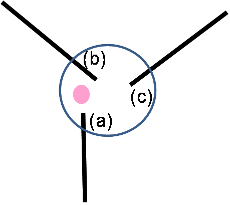
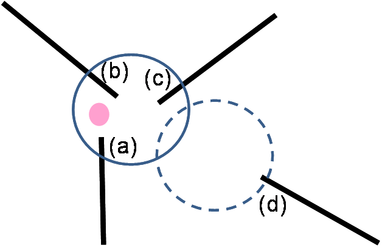

{width="1.3715277777777777in" height="0.9444444444444444in"}

{width="0.9770833333333333in" height="0.9708333333333333in"}

INSPIRE\
Infrastructure for Spatial Information in Europe

D2.8.I.7 Data Specification on Transport Networks -- Technical Guidelines

+-----------------+-------------------------------------------------------------------------------------------------------------------------------------------------------------------------------+
| **Title**       | D2.8.I.7 Data Specification on *Transport* Networks -- Technical Guidelines                                                                                                   |
+-----------------+-------------------------------------------------------------------------------------------------------------------------------------------------------------------------------+
| **Creator**     | INSPIRE Thematic Working Group *Transport* Networks                                                                                                                           |
+-----------------+-------------------------------------------------------------------------------------------------------------------------------------------------------------------------------+
| **Date**        | 2014-04-17                                                                                                                                                                    |
+-----------------+-------------------------------------------------------------------------------------------------------------------------------------------------------------------------------+
| **Subject**     | INSPIRE Data Specification for the spatial data theme *Transport* Networks                                                                                                    |
+-----------------+-------------------------------------------------------------------------------------------------------------------------------------------------------------------------------+
| **Publisher**   | European Commission Joint Research Centre                                                                                                                                     |
+-----------------+-------------------------------------------------------------------------------------------------------------------------------------------------------------------------------+
| **Type**        | Text                                                                                                                                                                          |
+-----------------+-------------------------------------------------------------------------------------------------------------------------------------------------------------------------------+
| **Description** | This document describes the INSPIRE Data Specification for the spatial data theme *Transport* Networks                                                                        |
+-----------------+-------------------------------------------------------------------------------------------------------------------------------------------------------------------------------+
| **Contributor** | ::: {custom-style="header"}                                                                                                                                                   |
|                 | Members of the INSPIRE Thematic Working Group *Transport* Networks                                                                                                            |
|                 | :::                                                                                                                                                                           |
+-----------------+-------------------------------------------------------------------------------------------------------------------------------------------------------------------------------+
| **Format**      | Portable Document Format (pdf)                                                                                                                                                |
+-----------------+-------------------------------------------------------------------------------------------------------------------------------------------------------------------------------+
| **Source**      |                                                                                                                                                                               |
+-----------------+-------------------------------------------------------------------------------------------------------------------------------------------------------------------------------+
| **Rights**      | Public                                                                                                                                                                        |
+-----------------+-------------------------------------------------------------------------------------------------------------------------------------------------------------------------------+
| **Identifier**  | D2.8.I.7_v3.2                                                                                                                                                                 |
+-----------------+-------------------------------------------------------------------------------------------------------------------------------------------------------------------------------+
| **Language**    | En                                                                                                                                                                            |
+-----------------+-------------------------------------------------------------------------------------------------------------------------------------------------------------------------------+
| **Relation**    | Directive 2007/2/EC of the European Parliament and of the Council of 14 March 2007 establishing an Infrastructure for Spatial Information in the European Community (INSPIRE) |
+-----------------+-------------------------------------------------------------------------------------------------------------------------------------------------------------------------------+
| **Coverage**    | Project duration                                                                                                                                                              |
+-----------------+-------------------------------------------------------------------------------------------------------------------------------------------------------------------------------+

**Foreword**

**How to read the document?**

This document describes the *"INSPIRE data specification on Transport Networks -- Technical Guidelines"* version 3.2rc1 as developed by the Thematic Working Group (TWG) *Transport Networks* using both natural and a conceptual schema language.

The data specification is based on a common template[^1] used for all data specifications, which has been harmonised using the experience from the development of the Annex I, II and III data specifications.

This document provides guidelines for the implementation of the provisions laid down in the Implementing Rule for spatial data sets and services of the INSPIRE Directive. It also includes additional requirements and recommendations that, although not included in the Implementing Rule, are relevant to guarantee or to increase data interoperability.

Two executive summaries provide a quick overview of the INSPIRE data specification process in general, and the content of the data specification on *Transport Networks* in particular. We highly recommend that managers, decision makers, and all those new to the INSPIRE process and/or information modelling should read these executive summaries first.

The UML diagrams (in Chapter 5) offer a rapid way to see the main elements of the specifications and their relationships. The definition of the spatial object types, attributes, and relationships are included in the Feature Catalogue (also in Chapter 5). People having thematic expertise but not familiar with UML can fully understand the content of the data model focusing on the Feature Catalogue. Users might also find the Feature Catalogue especially useful to check if it contains the data necessary for the applications that they run. The technical details are expected to be of prime interest to those organisations that are responsible for implementing INSPIRE within the field of *Transport Networks*, but also to other stakeholders and users of the spatial data infrastructure.

The technical provisions and the underlying concepts are often illustrated by examples. Smaller examples are within the text of the specification, while longer explanatory examples and descriptions of selected use cases are attached in the annexes.

In order to distinguish the INSPIRE spatial data themes from the spatial object types, the INSPIRE spatial data themes are written in *italics.*

  ----------------------------------------------------------------------------------------------------------------------------------------------------------------------------------------------------
  The document will be publicly available as a 'non-paper'. It does not represent an official position of the European Commission, and as such cannot be invoked in the context of legal procedures.
  ----------------------------------------------------------------------------------------------------------------------------------------------------------------------------------------------------

**Legal Notice**

Neither the European Commission nor any person acting on behalf of the Commission is responsible for the use which might be made of this publication.

**Interoperability of Spatial Data Sets and Services --\
General Executive Summary**

The challenges regarding the lack of availability, quality, organisation, accessibility, and sharing of spatial information are common to a large number of policies and activities and are experienced across the various levels of public authority in Europe. In order to solve these problems it is necessary to take measures of coordination between the users and providers of spatial information. The Directive 2007/2/EC of the European Parliament and of the Council adopted on 14 March 2007 aims at establishing an Infrastructure for Spatial Information in the European Community (INSPIRE) for environmental policies, or policies and activities that have an impact on the environment.

INSPIRE is based on the infrastructures for spatial information that are created and maintained by the Member States. To support the establishment of a European infrastructure, Implementing Rules addressing the following components of the infrastructure have been specified: metadata, interoperability of spatial data sets (as described in Annexes I, II, III of the Directive) and spatial data services, network services, data and service sharing, and monitoring and reporting procedures.

INSPIRE does not require collection of new data. However, after the period specified in the Directive[^2] Member States have to make their data available according to the Implementing Rules.

Interoperability in INSPIRE means the possibility to combine spatial data and services from different sources across the European Community in a consistent way without involving specific efforts of humans or machines. It is important to note that "interoperability" is understood as providing access to spatial data sets through network services, typically via Internet. Interoperability may be achieved by either changing (harmonising) and storing existing data sets or transforming them via services for publication in the INSPIRE infrastructure. It is expected that users will spend less time and efforts on understanding and integrating data when they build their applications based on data delivered in accordance with INSPIRE.

In order to benefit from the endeavours of international standardisation bodies and organisations established under international law their standards and technical means have been utilised and referenced, whenever possible.

To facilitate the implementation of INSPIRE, it is important that all stakeholders have the opportunity to participate in specification and development. For this reason, the Commission has put in place a consensus building process involving data users, and providers together with representatives of industry, research and government. These stakeholders, organised through Spatial Data Interest Communities (SDIC) and Legally Mandated Organisations (LMO)[^3], have provided reference materials, participated in the user requirement and technical[^4] surveys, proposed experts for the Data Specification Drafting Team[^5], the Thematic Working Groups[^6] and other ad-hoc cross-thematic technical groups and participated in the public stakeholder consultations on draft versions of the data specifications. These consultations covered expert reviews as well as feasibility and fitness-for-purpose testing of the data specifications[^7].

This open and participatory approach was successfully used during the development of the data specifications on Annex I, II and III data themes as well as during the preparation of the Implementing Rule on Interoperability of Spatial Data Sets and Services[^8] for Annex I spatial data themes and of its amendment regarding the themes of Annex II and III.

The development framework elaborated by the Data Specification Drafting Team aims at keeping the data specifications of the different themes coherent. It summarises the methodology to be used for the development of the data specifications, providing a coherent set of requirements and recommendations to achieve interoperability. The pillars of the framework are the following technical documents[^9]:

-   The *Definition of Annex Themes and Scope* describes in greater detail the spatial data themes defined in the Directive, and thus provides a sound starting point for the thematic aspects of the data specification development.

-   The *Generic Conceptual Model* defines the elements necessary for interoperability and data harmonisation including cross-theme issues. It specifies requirements and recommendations with regard to data specification elements of common use, like the spatial and temporal schema, unique identifier management, object referencing, some common code lists, etc. Those requirements of the Generic Conceptual Model that are directly implementable are included in the Implementing Rule on Interoperability of Spatial Data Sets and Services.

-   The *Methodology for the Development of Data Specifications* defines a repeatable methodology. It describes how to arrive from user requirements to a data specification through a number of steps including use-case development, initial specification development and analysis of analogies and gaps for further specification refinement.

-   The *Guidelines for the Encoding of Spatial Data* defines how geographic information can be encoded to enable transfer processes between the systems of the data providers in the Member States. Even though it does not specify a mandatory encoding rule it sets GML (ISO 19136) as the default encoding for INSPIRE.

-   The *Guidelines for the use of Observations & Measurements and Sensor Web Enablement-related standards in INSPIRE Annex II and III data specification development* provides guidelines on how the "Observations and Measurements" standard (ISO 19156) is to be used within INSPIRE.

-   The *Common data models* are a set of documents that specify data models that are referenced by a number of different data specifications. These documents include generic data models for networks, coverages and activity complexes.

The structure of the data specifications is based on the "ISO 19131 Geographic information - Data product specifications" standard. They include the technical documentation of the application schema, the spatial object types with their properties, and other specifics of the spatial data themes using natural language as well as a formal conceptual schema language[^10].

A consolidated model repository, feature concept dictionary, and glossary are being maintained to support the consistent specification development and potential further reuse of specification elements. The consolidated model consists of the harmonised models of the relevant standards from the ISO 19100 series, the INSPIRE Generic Conceptual Model, and the application schemas[^11] developed for each spatial data theme. The multilingual INSPIRE Feature Concept Dictionary contains the definition and description of the INSPIRE themes together with the definition of the spatial object types present in the specification. The INSPIRE Glossary defines all the terms (beyond the spatial object types) necessary for understanding the INSPIRE documentation including the terminology of other components (metadata, network services, data sharing, and monitoring).

By listing a number of requirements and making the necessary recommendations, the data specifications enable full system interoperability across the Member States, within the scope of the application areas targeted by the Directive. The data specifications (in their version 3.0) are published as technical guidelines and provide the basis for the content of the Implementing Rule on Interoperability of Spatial Data Sets and Services[^12]. The content of the Implementing Rule is extracted from the data specifications, considering short- and medium-term feasibility as well as cost-benefit considerations. The requirements included in the Implementing Rule are legally binding for the Member States according to the timeline specified in the INSPIRE Directive.

In addition to providing a basis for the interoperability of spatial data in INSPIRE, the data specification development framework and the thematic data specifications can be reused in other environments at local, regional, national and global level contributing to improvements in the coherence and interoperability of data in spatial data infrastructures.

**Transport Networks -- Executive Summary**

**Purpose**

INSPIRE Directive (2007/2/EC, 14.03.2007) defines the spatial data theme ("theme") Transport Networks as: "Road, rail, air and water transport networks and related infrastructure. Includes links between different networks. Also includes the trans-European transport network as defined in Decision 1692/96/EC of the European Parliament and of the Council of 23 July 1996 on Community guidelines for the development of the trans-European transport network ([^13]) and future revisions of that Decision."

This version (3.2) of the data specification on Transport networks provides:

-   the basis for the development of the part of the Implementing Rules, defined in the Article 7(1) of the INSPIRE Directive, related to the spatial data theme Transport networks and

-   the implementation guidelines that will accompany the Implementing Rule on the Interoperability of Spatial Data Sets and Services according to Article 7(1) of the INSPIRE Directive.

The data specification has been prepared by the INSPIRE Thematic Working Group Transport Networks (TWG-TN), a multinational team of experts in the field drawn from different parts of the European Union ([^14]), in the frame of the common and transparent development process.

This version of the INSPIRE data specification for Transport networks has been compiled from reference material submitted by the Spatial Data Interest Communities (SDICs) and Legally Mandated Organisation (LMOs) of INSPIRE, plus the responses to the User Requirements Survey and a set of agreed use cases - some of which have been specifically prepared by the TWG-TN based on their knowledge and experience, like environmental impact assessment, noise mapping, speed limits (related to the in-car information systems) and journey planning.

A large amount of submitted reference material was available for the road networks, largely from the mapping agencies and less input from road authorities. For the other sub-themes Rail, Water and Air transport networks the TWG-TN has had to undertake additional research, building on existing material and documentation. Research has included supporting material regarding trans-European networks and the objects required to support them, such as TEN-T, as well as other initiatives for example: specific documentation from Eurocontrol for air documentation.

**Scope and description**

The transport component should comprise of an integrated transport network, and related features, that are seamless within each national border. In accordance with Article 10(2) of the INSPIRE Directive, national transport networks may also be seamless at European level, i.e. connected at national borders. Transportation data includes topographic features that are related to transport by road, rail, water, and air. It is important that the features form networks where appropriate, and that links between different networks are established, i.e. multi-modal nodes, especially at the local level, in order to satisfy the requirements for intelligent transport systems such as location based services (LBS) and telematics. The transport network should also support the referencing of transport flows to enable the navigation services.

The data specification is extensive, covering major transport networks types that are defined in the five distinct transport themes (sub-themes): Road, Rail, Water, Air transport and Cableways[^15], including the connections between those types. The sub-themes are defined in a way that they can be used together to support an integrated approach to transport and they may be used with other spatial data themes. It is evident that there are a very large number of applications that can potentially use the Transport networks.

Taking into account the variety of responsibilities in collecting, managing and using the data and different approaches in the data base management practice, from simple models to complex data arrangements, this data specification is provided as basic framework and with the purpose to maximize the reuse and sharing of the data about a network. It is mainly focused on the "widely reused -- widely referenced" segments of spatial objects, supporting the loose linkage between the diverse organizational data with these spatial objects and allowing the extensibility to fit into diverse applications and users needs.

This approach provides a framework for users to configure and associate their own information (from surface condition surveys, to journey planning, to trans-European transport policy making etc.) using existing transport networks information in each Member State.

The datasets in scope are used extensively at the "local level" and extended to regional, national and European levels. This data specification provides a coherent approach to the forms of the representation (physical topographic area objects or centreline representations) and consistency between data sets, the latest as different types of coherence (between spatial objects of the same theme at different levels of detail, between different spatial objects within a same area or coherence at state boundaries).

All the spatial data sub-themes are based on the INSPIRE Generic Conceptual Model (GCM)([^16]) that relies on several ISO 19100([^17]) series of geographic information standards to provide the foundations for specific aspects of interoperability.

Within the GCM, the Generic Network Model (GNM)([^18]) is defined to be shared by any network spatial data theme (e.g. Hydrography) to ensure a consistent approach across all network themes.

Specific mechanisms, used in the data specification and defined in the GNM, include:

-   Network connection mechanism to establish the cross-border connectivity (a simple cross-referencing system to establish cross-border connections between the transport networks) or to establish intermodal connectivity (by linking two transport network elements from different transport networks which use a different mode of transport);

-   Object referencing to support the reuse of information (for example to avoid the duplication of the geometry and to link complementary feature types from different organistaions);

-   Linear referencing([^19]) to support and link the different transport properties to the transport elements -- it is used to position phenomena along a linear object, using a distance from the beginning of the linear object and

-   The mechanism to combine the network elements into high-level semantic meanings.

The elements in the network are handled as nodes, links, aggregated links, areas and points. In addition, the individual transport links can be combined to form transport link sequences or further -- the combination of both can be used to form the transport link sets.

The data specification includes three types of geometry: (a) (topographic) area objects, (b) centreline objects and (c) point objects. The types (a) and (b) may be alternative representations of the same real world phenomena about which the user can associate their own information (objects). The type (c) is, apart from network nodes, only included in the specification for marker posts. The basic spatial representation type is 2D vector.

Topology is handled in the data specification implicitly rather than explicitly, with the main reason to keep the model simple as possible but expecting that most applications will use the network data within a topological environment.There is therefore a prerequisite for "implicit topology", where the data provided must be sufficiently clean and capable of automated topological construction within a user's application. This concept is framed with the specific requirements, including the data quality information.

There are relationships with other spatial data themes, in particular with:

-   Hydrography, where the water transport sub-theme reuses the INSPIRE river network model for inland transportation purposes and

-   Addresses, where the majority of addresses can be linked to the transport links (roads, rivers, etc.).

**Next steps in the development**

It is intended that this data specification will be maintained in accordance with the future development of the INSPIRE data specification framework documents, new identified user requirements or policy requirements, development of the standards (used as a basis for data specification) and based on the best practices and on the input from the implementation of the INSPIRE Implementing Rules.

The data specification -- guidelines will be are published on INSPIRE web site([^20]).

**Acknowledgements**

Many individuals and organisations have contributed to the development of these Guidelines.

The Thematic Working Group Transport Networks (TWG-TN) included:

Keith Murray (TWG Facilitator), Jordi Escriu Paradell (TWG Co-editor), Ward Verlinden (TWG Co-editor), Lars Wikström (TWG Co-editor), Alain Chaumet, Mark Lepage, Dave Russell, Ulf Sandgren, Darja Lihteneger (European Commission contact point).

Other contributors to the INSPIRE data specifications are the Drafting Team Data Specifications, the JRC Data Specifications Team and the INSPIRE stakeholders - Spatial Data Interested Communities (SDICs) and Legally Mandated Organisations (LMOs).

**Contact information**

Maria Vanda Nunes de Lima & Michael Lutz

European Commission Joint Research Centre (JRC)

Institute for Environment and Sustainability

Unit H06: Digital Earth and Reference Data

*http://inspire.ec.europa.eu/index.cfm/pageid/2*

**\
Table of contents**

::: {custom-style="toc 1"}
[1]{custom-style="Hyperlink"} [Scope]{custom-style="Hyperlink"} 1
:::

::: {custom-style="toc 1"}
[2]{custom-style="Hyperlink"} [Overview]{custom-style="Hyperlink"} 1
:::

::: {custom-style="toc 2"}
[2.1]{custom-style="Hyperlink"} [Name]{custom-style="Hyperlink"} 1
:::

::: {custom-style="toc 2"}
[2.2]{custom-style="Hyperlink"} [Informal description]{custom-style="Hyperlink"} 1
:::

::: {custom-style="toc 2"}
[2.3]{custom-style="Hyperlink"} [Normative References]{custom-style="Hyperlink"} 8
:::

::: {custom-style="toc 2"}
[2.4]{custom-style="Hyperlink"} [Terms and definitions]{custom-style="Hyperlink"} 9
:::

::: {custom-style="toc 2"}
[2.5]{custom-style="Hyperlink"} [Symbols and abbreviations]{custom-style="Hyperlink"} 9
:::

::: {custom-style="toc 2"}
[2.6]{custom-style="Hyperlink"} [How the Technical Guidelines map to the Implementing Rules]{custom-style="Hyperlink"} 11
:::

::: {custom-style="toc 3"}
[2.6.1]{custom-style="Hyperlink"} [Requirements]{custom-style="Hyperlink"} 11
:::

::: {custom-style="toc 3"}
[2.6.2]{custom-style="Hyperlink"} [Recommendations]{custom-style="Hyperlink"} 12
:::

::: {custom-style="toc 3"}
[2.6.3]{custom-style="Hyperlink"} [Conformance]{custom-style="Hyperlink"} 12
:::

::: {custom-style="toc 1"}
[3]{custom-style="Hyperlink"} [Specification scopes]{custom-style="Hyperlink"} 12
:::

::: {custom-style="toc 1"}
[4]{custom-style="Hyperlink"} [Identification information]{custom-style="Hyperlink"} 13
:::

::: {custom-style="toc 1"}
[5]{custom-style="Hyperlink"} [Data content and structure]{custom-style="Hyperlink"} 13
:::

::: {custom-style="toc 2"}
[5.1]{custom-style="Hyperlink"} [Application schemas -- Overview]{custom-style="Hyperlink"} 13
:::

::: {custom-style="toc 3"}
[5.1.1]{custom-style="Hyperlink"} [Application schemas included in the IRs]{custom-style="Hyperlink"} 13
:::

::: {custom-style="toc 2"}
[5.2]{custom-style="Hyperlink"} [Basic notions]{custom-style="Hyperlink"} 15
:::

::: {custom-style="toc 3"}
[5.2.1]{custom-style="Hyperlink"} [Notation]{custom-style="Hyperlink"} 15
:::

::: {custom-style="toc 3"}
[5.2.2]{custom-style="Hyperlink"} [Voidable characteristics]{custom-style="Hyperlink"} 16
:::

::: {custom-style="toc 3"}
[5.2.3]{custom-style="Hyperlink"} [Enumerations]{custom-style="Hyperlink"} 17
:::

::: {custom-style="toc 3"}
[5.2.4]{custom-style="Hyperlink"} [Code lists]{custom-style="Hyperlink"} 18
:::

::: {custom-style="toc 3"}
[5.2.5]{custom-style="Hyperlink"} [Identifier management]{custom-style="Hyperlink"} 21
:::

::: {custom-style="toc 3"}
[5.2.6]{custom-style="Hyperlink"} [Geometry representation]{custom-style="Hyperlink"} 21
:::

::: {custom-style="toc 3"}
[5.2.7]{custom-style="Hyperlink"} [Temporality representation]{custom-style="Hyperlink"} 21
:::

::: {custom-style="toc 2"}
[5.3]{custom-style="Hyperlink"} [Application schema Common Transport Elements]{custom-style="Hyperlink"} 23
:::

::: {custom-style="toc 3"}
[5.3.1]{custom-style="Hyperlink"} [Description]{custom-style="Hyperlink"} 23
:::

::: {custom-style="toc 3"}
[5.3.2]{custom-style="Hyperlink"} [Feature catalogue]{custom-style="Hyperlink"} 37
:::

::: {custom-style="toc 2"}
[5.4]{custom-style="Hyperlink"} [Application schema Road Transport Networks]{custom-style="Hyperlink"} 48
:::

::: {custom-style="toc 3"}
[5.4.1]{custom-style="Hyperlink"} [Description]{custom-style="Hyperlink"} 48
:::

::: {custom-style="toc 3"}
[5.4.2]{custom-style="Hyperlink"} [Feature catalogue]{custom-style="Hyperlink"} 54
:::

::: {custom-style="toc 2"}
[5.5]{custom-style="Hyperlink"} [Application schema Rail Transport Networks]{custom-style="Hyperlink"} 67
:::

::: {custom-style="toc 3"}
[5.5.1]{custom-style="Hyperlink"} [Description]{custom-style="Hyperlink"} 67
:::

::: {custom-style="toc 3"}
[5.5.2]{custom-style="Hyperlink"} [Feature catalogue]{custom-style="Hyperlink"} 72
:::

::: {custom-style="toc 2"}
[5.6]{custom-style="Hyperlink"} [Application schema Cable Transport Networks]{custom-style="Hyperlink"} 81
:::

::: {custom-style="toc 3"}
[5.6.1]{custom-style="Hyperlink"} [Description]{custom-style="Hyperlink"} 81
:::

::: {custom-style="toc 3"}
[5.6.2]{custom-style="Hyperlink"} [Feature catalogue]{custom-style="Hyperlink"} 85
:::

::: {custom-style="toc 2"}
[5.7]{custom-style="Hyperlink"} [Application schema Water Transport Networks]{custom-style="Hyperlink"} 87
:::

::: {custom-style="toc 3"}
[5.7.1]{custom-style="Hyperlink"} [Description]{custom-style="Hyperlink"} 87
:::

::: {custom-style="toc 3"}
[5.7.2]{custom-style="Hyperlink"} [Feature catalogue]{custom-style="Hyperlink"} 94
:::

::: {custom-style="toc 2"}
[5.8]{custom-style="Hyperlink"} [Application schema Air Transport Networks]{custom-style="Hyperlink"} 103
:::

::: {custom-style="toc 3"}
[5.8.1]{custom-style="Hyperlink"} [Description]{custom-style="Hyperlink"} 103
:::

::: {custom-style="toc 3"}
[5.8.2]{custom-style="Hyperlink"} [Feature catalogue]{custom-style="Hyperlink"} 109
:::

::: {custom-style="toc 1"}
[6]{custom-style="Hyperlink"} [Reference systems, units of measure and grids]{custom-style="Hyperlink"} 124
:::

::: {custom-style="toc 2"}
[6.1]{custom-style="Hyperlink"} [Default reference systems, units of measure and grid]{custom-style="Hyperlink"} 124
:::

::: {custom-style="toc 3"}
[6.1.1]{custom-style="Hyperlink"} [Coordinate reference systems]{custom-style="Hyperlink"} 124
:::

::: {custom-style="toc 3"}
[6.1.2]{custom-style="Hyperlink"} [Temporal reference system]{custom-style="Hyperlink"} 127
:::

::: {custom-style="toc 3"}
[6.1.3]{custom-style="Hyperlink"} [Units of measure]{custom-style="Hyperlink"} 127
:::

::: {custom-style="toc 2"}
[6.2]{custom-style="Hyperlink"} [Theme-specific requirements and recommendations]{custom-style="Hyperlink"} 128
:::

::: {custom-style="toc 1"}
[7]{custom-style="Hyperlink"} [Data quality]{custom-style="Hyperlink"} 128
:::

::: {custom-style="toc 2"}
[7.1]{custom-style="Hyperlink"} [Data quality elements]{custom-style="Hyperlink"} 128
:::

::: {custom-style="toc 3"}
[7.1.1]{custom-style="Hyperlink"} [Completeness -- Commission]{custom-style="Hyperlink"} 129
:::

::: {custom-style="toc 3"}
[7.1.2]{custom-style="Hyperlink"} [Completeness -- Omission]{custom-style="Hyperlink"} 130
:::

::: {custom-style="toc 3"}
[7.1.3]{custom-style="Hyperlink"} [Logical consistency -- Conceptual consistency]{custom-style="Hyperlink"} 130
:::

::: {custom-style="toc 3"}
[7.1.4]{custom-style="Hyperlink"} [Logical consistency -- Domain consistency]{custom-style="Hyperlink"} 131
:::

::: {custom-style="toc 3"}
[7.1.5]{custom-style="Hyperlink"} [Logical Consistency -- Format consistency]{custom-style="Hyperlink"} 132
:::

::: {custom-style="toc 3"}
[7.1.6]{custom-style="Hyperlink"} [Logical Consistency -- Topological consistency]{custom-style="Hyperlink"} 132
:::

::: {custom-style="toc 3"}
[7.1.7]{custom-style="Hyperlink"} [Positional accuracy -- Absolute or external accuracy]{custom-style="Hyperlink"} 137
:::

::: {custom-style="toc 3"}
[7.1.8]{custom-style="Hyperlink"} [Thematic accuracy -- Classification correctness]{custom-style="Hyperlink"} 138
:::

::: {custom-style="toc 2"}
[7.2]{custom-style="Hyperlink"} [Minimum data quality requirements]{custom-style="Hyperlink"} 139
:::

::: {custom-style="toc 2"}
[7.3]{custom-style="Hyperlink"} [Recommendation on data quality]{custom-style="Hyperlink"} 139
:::

::: {custom-style="toc 1"}
[8]{custom-style="Hyperlink"} [Dataset-level metadata]{custom-style="Hyperlink"} 139
:::

::: {custom-style="toc 2"}
[8.1]{custom-style="Hyperlink"} [Metadata elements defined in INSPIRE Metadata Regulation]{custom-style="Hyperlink"} 139
:::

::: {custom-style="toc 3"}
[8.1.1]{custom-style="Hyperlink"} [Conformity]{custom-style="Hyperlink"} 140
:::

::: {custom-style="toc 3"}
[8.1.2]{custom-style="Hyperlink"} [Lineage]{custom-style="Hyperlink"} 142
:::

::: {custom-style="toc 3"}
[8.1.3]{custom-style="Hyperlink"} [Temporal reference]{custom-style="Hyperlink"} 143
:::

::: {custom-style="toc 3"}
[8.1.4]{custom-style="Hyperlink"} [\<MD Element from MD Regulation\>]{custom-style="Hyperlink"} 143
:::

::: {custom-style="toc 2"}
[8.2]{custom-style="Hyperlink"} [Metadata elements for interoperability]{custom-style="Hyperlink"} 143
:::

::: {custom-style="toc 3"}
[8.2.1]{custom-style="Hyperlink"} [Coordinate Reference System]{custom-style="Hyperlink"} 144
:::

::: {custom-style="toc 3"}
[8.2.2]{custom-style="Hyperlink"} [Temporal Reference System]{custom-style="Hyperlink"} 145
:::

::: {custom-style="toc 3"}
[8.2.3]{custom-style="Hyperlink"} [Encoding]{custom-style="Hyperlink"} 146
:::

::: {custom-style="toc 3"}
[8.2.4]{custom-style="Hyperlink"} [Character Encoding]{custom-style="Hyperlink"} 146
:::

::: {custom-style="toc 3"}
[8.2.5]{custom-style="Hyperlink"} [Spatial representation type]{custom-style="Hyperlink"} 147
:::

::: {custom-style="toc 3"}
[8.2.6]{custom-style="Hyperlink"} [Data Quality -- Logical Consistency -- Topological Consistency]{custom-style="Hyperlink"} 147
:::

::: {custom-style="toc 2"}
[8.3]{custom-style="Hyperlink"} [Recommended theme-specific metadata elements]{custom-style="Hyperlink"} 147
:::

::: {custom-style="toc 3"}
[8.3.1]{custom-style="Hyperlink"} [Maintenance Information]{custom-style="Hyperlink"} 148
:::

::: {custom-style="toc 3"}
[8.3.2]{custom-style="Hyperlink"} [Metadata elements for reporting data quality]{custom-style="Hyperlink"} 149
:::

::: {custom-style="toc 1"}
[9]{custom-style="Hyperlink"} [Delivery]{custom-style="Hyperlink"} 151
:::

::: {custom-style="toc 2"}
[9.1]{custom-style="Hyperlink"} [Updates]{custom-style="Hyperlink"} 151
:::

::: {custom-style="toc 2"}
[9.2]{custom-style="Hyperlink"} [Delivery medium]{custom-style="Hyperlink"} 151
:::

::: {custom-style="toc 2"}
[9.3]{custom-style="Hyperlink"} [Encodings]{custom-style="Hyperlink"} 152
:::

::: {custom-style="toc 3"}
[9.3.1]{custom-style="Hyperlink"} [Default Encoding(s)]{custom-style="Hyperlink"} 152
:::

::: {custom-style="toc 1"}
[10]{custom-style="Hyperlink"} [Data Capture]{custom-style="Hyperlink"} 155
:::

::: {custom-style="toc 2"}
[10.1]{custom-style="Hyperlink"} [Centrelines]{custom-style="Hyperlink"} 155
:::

::: {custom-style="toc 2"}
[10.2]{custom-style="Hyperlink"} [Ensuring Network Connectivity]{custom-style="Hyperlink"} 156
:::

::: {custom-style="toc 2"}
[10.3]{custom-style="Hyperlink"} [Linear Referencing]{custom-style="Hyperlink"} 158
:::

::: {custom-style="toc 2"}
[10.4]{custom-style="Hyperlink"} [Alternative and Multiple Representations]{custom-style="Hyperlink"} 159
:::

::: {custom-style="toc 1"}
[11]{custom-style="Hyperlink"} [Portrayal]{custom-style="Hyperlink"} 159
:::

::: {custom-style="toc 2"}
[11.1]{custom-style="Hyperlink"} [Layers to be provided by INSPIRE view services]{custom-style="Hyperlink"} 160
:::

::: {custom-style="toc 3"}
[11.1.1]{custom-style="Hyperlink"} [Layers organisation]{custom-style="Hyperlink"} 162
:::

::: {custom-style="toc 2"}
[11.2]{custom-style="Hyperlink"} [Styles required to be supported by INSPIRE view services]{custom-style="Hyperlink"} 162
:::

::: {custom-style="toc 3"}
[11.2.1]{custom-style="Hyperlink"} [Styles for the layer TN.CommonTransportElements.TransportNode]{custom-style="Hyperlink"} 162
:::

::: {custom-style="toc 3"}
[11.2.2]{custom-style="Hyperlink"} [Styles for the layer TN.CommonTransportElements.TransportLink]{custom-style="Hyperlink"} 163
:::

::: {custom-style="toc 3"}
[11.2.3]{custom-style="Hyperlink"} [Styles for the layer TN.CommonTransportElements.TransportArea]{custom-style="Hyperlink"} 163
:::

::: {custom-style="toc 3"}
[11.2.4]{custom-style="Hyperlink"} [Styles for the layer TN.RoadTransportNetwork.RoadLink]{custom-style="Hyperlink"} 164
:::

::: {custom-style="toc 3"}
[11.2.5]{custom-style="Hyperlink"} [Styles for the layer TN.RoadTransportNetwork.RoadServiceArea]{custom-style="Hyperlink"} 165
:::

::: {custom-style="toc 3"}
[11.2.6]{custom-style="Hyperlink"} [Styles for the layer TN.RoadTransportNetwork.RoadArea]{custom-style="Hyperlink"} 165
:::

::: {custom-style="toc 3"}
[11.2.7]{custom-style="Hyperlink"} [Styles for the layer TN.RoadTransportNetwork.VehicleTrafficArea]{custom-style="Hyperlink"} 166
:::

::: {custom-style="toc 3"}
[11.2.8]{custom-style="Hyperlink"} [Styles for the layer TN.RailTransportNetwork.RailwayLink]{custom-style="Hyperlink"} 167
:::

::: {custom-style="toc 3"}
[11.2.9]{custom-style="Hyperlink"} [Styles for the layer TN.RailTransportNetwork.RailwayStationArea]{custom-style="Hyperlink"} 167
:::

::: {custom-style="toc 3"}
[11.2.10]{custom-style="Hyperlink"} [Styles for the layer TN.RailTransportNetwork.RailwayYardArea]{custom-style="Hyperlink"} 168
:::

::: {custom-style="toc 3"}
[11.2.11]{custom-style="Hyperlink"} [Styles for the layer TN.RailTransportNetwork.RailwayArea]{custom-style="Hyperlink"} 169
:::

::: {custom-style="toc 3"}
[11.2.12]{custom-style="Hyperlink"} [Styles for the layer TN.WaterTransportNetwork.WaterwayLink]{custom-style="Hyperlink"} 169
:::

::: {custom-style="toc 3"}
[11.2.13]{custom-style="Hyperlink"} [Styles for the layer TN.WaterTransportNetwork.FairwayArea]{custom-style="Hyperlink"} 170
:::

::: {custom-style="toc 3"}
[11.2.14]{custom-style="Hyperlink"} [Styles for the layer TN.WaterTransportNetwork.PortArea]{custom-style="Hyperlink"} 171
:::

::: {custom-style="toc 3"}
[11.2.15]{custom-style="Hyperlink"} [Styles for the layer TN.AirTransportNetwork.AirLink]{custom-style="Hyperlink"} 171
:::

::: {custom-style="toc 3"}
[11.2.16]{custom-style="Hyperlink"} [Styles for the layer TN.AirTransportNetwork.AerodromeArea]{custom-style="Hyperlink"} 172
:::

::: {custom-style="toc 3"}
[11.2.17]{custom-style="Hyperlink"} [Styles for the layer TN.AirTransportNetwork.RunwayArea]{custom-style="Hyperlink"} 173
:::

::: {custom-style="toc 3"}
[11.2.18]{custom-style="Hyperlink"} [Styles for the layer TN.AirTransportNetwork.AirSpaceArea]{custom-style="Hyperlink"} 173
:::

::: {custom-style="toc 3"}
[11.2.19]{custom-style="Hyperlink"} [Styles for the layer TN.AirTransportNetwork.ApronArea]{custom-style="Hyperlink"} 174
:::

::: {custom-style="toc 3"}
[11.2.20]{custom-style="Hyperlink"} [Styles for the layer TN.AirTransportNetwork.TaxiwayArea]{custom-style="Hyperlink"} 175
:::

::: {custom-style="toc 3"}
[11.2.21]{custom-style="Hyperlink"} [Styles for the layer TN.CableTransportNetwork.CablewayLink]{custom-style="Hyperlink"} 175
:::

::: {custom-style="toc 1"}
[Bibliography]{custom-style="Hyperlink"} 177
:::

::: {custom-style="toc 1"}
[Annex A (normative) Abstract Test Suite]{custom-style="Hyperlink"} 184
:::

::: {custom-style="toc 2"}
[A.1]{custom-style="Hyperlink"} [Application Schema Conformance Class]{custom-style="Hyperlink"} 187
:::

::: {custom-style="toc 3"}
[C.1]{custom-style="Hyperlink"} [Schema element denomination test]{custom-style="Hyperlink"} 187
:::

::: {custom-style="toc 3"}
[C.1]{custom-style="Hyperlink"} [Value type test]{custom-style="Hyperlink"} 187
:::

::: {custom-style="toc 3"}
[C.1]{custom-style="Hyperlink"} [Value test]{custom-style="Hyperlink"} 187
:::

::: {custom-style="toc 3"}
[C.1]{custom-style="Hyperlink"} [Attributes/associations completeness test]{custom-style="Hyperlink"} 188
:::

::: {custom-style="toc 3"}
[C.1]{custom-style="Hyperlink"} [Abstract spatial object test]{custom-style="Hyperlink"} 188
:::

::: {custom-style="toc 3"}
[C.1]{custom-style="Hyperlink"} [Constraints test]{custom-style="Hyperlink"} 188
:::

::: {custom-style="toc 3"}
[C.1]{custom-style="Hyperlink"} [Geometry representation test]{custom-style="Hyperlink"} 189
:::

::: {custom-style="toc 3"}
[C.1]{custom-style="Hyperlink"} [Object references modelling test]{custom-style="Hyperlink"} 189
:::

::: {custom-style="toc 3"}
[C.1]{custom-style="Hyperlink"} [Centrelines test]{custom-style="Hyperlink"} 190
:::

::: {custom-style="toc 3"}
[C.1]{custom-style="Hyperlink"} [Network Connectivity test]{custom-style="Hyperlink"} 190
:::

::: {custom-style="toc 2"}
[A.2]{custom-style="Hyperlink"} [Reference Systems Conformance Class]{custom-style="Hyperlink"} 190
:::

::: {custom-style="toc 3"}
[A.2.1]{custom-style="Hyperlink"} [Datum test]{custom-style="Hyperlink"} 190
:::

::: {custom-style="toc 3"}
[A.2.2]{custom-style="Hyperlink"} [Coordinate reference system test]{custom-style="Hyperlink"} 191
:::

::: {custom-style="toc 3"}
[A.2.3]{custom-style="Hyperlink"} [Grid test]{custom-style="Hyperlink"} 191
:::

::: {custom-style="toc 3"}
[A.2.4]{custom-style="Hyperlink"} [View service coordinate reference system test]{custom-style="Hyperlink"} 192
:::

::: {custom-style="toc 3"}
[A.2.5]{custom-style="Hyperlink"} [Temporal reference system test]{custom-style="Hyperlink"} 192
:::

::: {custom-style="toc 3"}
[A.2.6]{custom-style="Hyperlink"} [Units of measurements test]{custom-style="Hyperlink"} 192
:::

::: {custom-style="toc 2"}
[A.3]{custom-style="Hyperlink"} [Data Consistency Conformance Class]{custom-style="Hyperlink"} 192
:::

::: {custom-style="toc 3"}
[A.3.1]{custom-style="Hyperlink"} [Unique identifier persistency test]{custom-style="Hyperlink"} 193
:::

::: {custom-style="toc 3"}
[A.3.2]{custom-style="Hyperlink"} [Version consistency test]{custom-style="Hyperlink"} 193
:::

::: {custom-style="toc 3"}
[A.3.3]{custom-style="Hyperlink"} [Life cycle time sequence test]{custom-style="Hyperlink"} 193
:::

::: {custom-style="toc 3"}
[A.3.4]{custom-style="Hyperlink"} [Validity time sequence test]{custom-style="Hyperlink"} 193
:::

::: {custom-style="toc 3"}
[A.3.5]{custom-style="Hyperlink"} [Update frequency test]{custom-style="Hyperlink"} 194
:::

::: {custom-style="toc 3"}
[A.3.6]{custom-style="Hyperlink"} [Spatial consistency test]{custom-style="Hyperlink"} 194
:::

::: {custom-style="toc 2"}
[A.4]{custom-style="Hyperlink"} [Metadata IR Conformance Class]{custom-style="Hyperlink"} 194
:::

::: {custom-style="toc 3"}
[A.5.1]{custom-style="Hyperlink"} [Metadata for interoperability test]{custom-style="Hyperlink"} 194
:::

::: {custom-style="toc 2"}
[A.5]{custom-style="Hyperlink"} [Information Accessibility Conformance Class]{custom-style="Hyperlink"} 195
:::

::: {custom-style="toc 3"}
[A.6.1]{custom-style="Hyperlink"} [Code list publication test]{custom-style="Hyperlink"} 195
:::

::: {custom-style="toc 3"}
[A.6.2]{custom-style="Hyperlink"} [CRS publication test]{custom-style="Hyperlink"} 195
:::

::: {custom-style="toc 3"}
[A.6.3]{custom-style="Hyperlink"} [CRS identification test]{custom-style="Hyperlink"} 195
:::

::: {custom-style="toc 3"}
[A.6.4]{custom-style="Hyperlink"} [Grid identification test]{custom-style="Hyperlink"} 195
:::

::: {custom-style="toc 2"}
[A.6]{custom-style="Hyperlink"} [Data Delivery Conformance Class]{custom-style="Hyperlink"} 196
:::

::: {custom-style="toc 3"}
[A.6.1]{custom-style="Hyperlink"} [Encoding compliance test]{custom-style="Hyperlink"} 196
:::

::: {custom-style="toc 2"}
[A.7]{custom-style="Hyperlink"} [Portrayal Conformance Class]{custom-style="Hyperlink"} 196
:::

::: {custom-style="toc 3"}
[A.8.1]{custom-style="Hyperlink"} [Layer designation test]{custom-style="Hyperlink"} 196
:::

::: {custom-style="toc 2"}
[A.8]{custom-style="Hyperlink"} [Technical Guideline Conformance Class]{custom-style="Hyperlink"} 197
:::

::: {custom-style="toc 3"}
[A.8.1]{custom-style="Hyperlink"} [Multiplicity test]{custom-style="Hyperlink"} 197
:::

::: {custom-style="toc 3"}
[A.9.1]{custom-style="Hyperlink"} [CRS http URI test]{custom-style="Hyperlink"} 197
:::

::: {custom-style="toc 3"}
[A.9.2]{custom-style="Hyperlink"} [Metadata encoding schema validation test]{custom-style="Hyperlink"} 197
:::

::: {custom-style="toc 3"}
[A.9.3]{custom-style="Hyperlink"} [Metadata occurrence test]{custom-style="Hyperlink"} 198
:::

::: {custom-style="toc 3"}
[A.9.4]{custom-style="Hyperlink"} [Metadata consistency test]{custom-style="Hyperlink"} 198
:::

::: {custom-style="toc 3"}
[A.9.5]{custom-style="Hyperlink"} [Encoding schema validation test]{custom-style="Hyperlink"} 198
:::

::: {custom-style="toc 3"}
[A.9.6]{custom-style="Hyperlink"} [Coverage multipart representation test]{custom-style="Hyperlink"} 198
:::

::: {custom-style="toc 3"}
[A.9.7]{custom-style="Hyperlink"} [Coverage domain consistency test]{custom-style="Hyperlink"} 199
:::

::: {custom-style="toc 3"}
[A.9.8]{custom-style="Hyperlink"} [Style test]{custom-style="Hyperlink"} 199
:::

::: {custom-style="toc 1"}
[Annex B (informative) Use cases]{custom-style="Hyperlink"} 200
:::

::: {custom-style="toc 2"}
[B.1]{custom-style="Hyperlink"} [Environmental Impact Assessment of TEN-T related developments.]{custom-style="Hyperlink"} 200
:::

::: {custom-style="toc 2"}
[B.2]{custom-style="Hyperlink"} [Speed advice]{custom-style="Hyperlink"} 201
:::

::: {custom-style="toc 2"}
[B.3]{custom-style="Hyperlink"} [Journey planning]{custom-style="Hyperlink"} 202
:::

::: {custom-style="toc 1"}
[Annex C (normative) Code list values]{custom-style="Hyperlink"} 204
:::

::: {custom-style="toc 3"}
[C.1]{custom-style="Hyperlink"} [INSPIRE Application Schema \'Common Transport Elements\']{custom-style="Hyperlink"} 204
:::

::: {custom-style="toc 3"}
[C.2]{custom-style="Hyperlink"} [INSPIRE Application Schema \'Road Transport Network\']{custom-style="Hyperlink"} 205
:::

::: {custom-style="toc 3"}
[C.3 INSPIRE Application Schema \'Railway Transport Network\']{custom-style="Hyperlink"} 213
:::

::: {custom-style="toc 3"}
[C.4]{custom-style="Hyperlink"} [INSPIRE Application Schema \'Cable Transport Network\']{custom-style="Hyperlink"} 215
:::

::: {custom-style="toc 3"}
[C.5]{custom-style="Hyperlink"} [INSPIRE Application Schema \'Water Transport Network\']{custom-style="Hyperlink"} 215
:::

::: {custom-style="toc 3"}
[C.6]{custom-style="Hyperlink"} [INSPIRE Application Schema \'Air Transport Network\']{custom-style="Hyperlink"} 217
:::

::: {custom-style="toc 1"}
[Annex D (informative) Imported Types]{custom-style="Hyperlink"} 223
:::

::: {custom-style="toc 2"}
[D.1]{custom-style="Hyperlink"} [Spatial object types]{custom-style="Hyperlink"} 223
:::

::: {custom-style="toc 3"}
[D.1.1]{custom-style="Hyperlink"} [CrossReference]{custom-style="Hyperlink"} 223
:::

::: {custom-style="toc 3"}
[D.1.2]{custom-style="Hyperlink"} [GeneralisedLink]{custom-style="Hyperlink"} 223
:::

::: {custom-style="toc 3"}
[D.1.3]{custom-style="Hyperlink"} [GradeSeparatedCrossing]{custom-style="Hyperlink"} 223
:::

::: {custom-style="toc 3"}
[D.1.4]{custom-style="Hyperlink"} [Link]{custom-style="Hyperlink"} 224
:::

::: {custom-style="toc 3"}
[D.1.5]{custom-style="Hyperlink"} [LinkSequence]{custom-style="Hyperlink"} 224
:::

::: {custom-style="toc 3"}
[D.1.6]{custom-style="Hyperlink"} [LinkSet]{custom-style="Hyperlink"} 224
:::

::: {custom-style="toc 3"}
[D.1.7]{custom-style="Hyperlink"} [Network]{custom-style="Hyperlink"} 225
:::

::: {custom-style="toc 3"}
[D.1.8]{custom-style="Hyperlink"} [NetworkArea]{custom-style="Hyperlink"} 225
:::

::: {custom-style="toc 3"}
[D.1.9]{custom-style="Hyperlink"} [NetworkConnection]{custom-style="Hyperlink"} 225
:::

::: {custom-style="toc 3"}
[D.1.10]{custom-style="Hyperlink"} [NetworkElement]{custom-style="Hyperlink"} 226
:::

::: {custom-style="toc 3"}
[D.1.11]{custom-style="Hyperlink"} [NetworkProperty]{custom-style="Hyperlink"} 226
:::

::: {custom-style="toc 3"}
[D.1.12]{custom-style="Hyperlink"} [Node]{custom-style="Hyperlink"} 227
:::

::: {custom-style="toc 2"}
[D.2]{custom-style="Hyperlink"} [Data types]{custom-style="Hyperlink"} 228
:::

::: {custom-style="toc 3"}
[D.2.1]{custom-style="Hyperlink"} [DirectedLink]{custom-style="Hyperlink"} 228
:::

::: {custom-style="toc 3"}
[D.2.2]{custom-style="Hyperlink"} [LinkReference]{custom-style="Hyperlink"} 228
:::

::: {custom-style="toc 3"}
[D.2.3]{custom-style="Hyperlink"} [NetworkReference]{custom-style="Hyperlink"} 229
:::

::: {custom-style="toc 3"}
[D.2.4]{custom-style="Hyperlink"} [SimpleLinearReference]{custom-style="Hyperlink"} 229
:::

::: {custom-style="toc 3"}
[D.2.5]{custom-style="Hyperlink"} [SimplePointReference]{custom-style="Hyperlink"} 229
:::

::: {custom-style="toc 2"}
[D.3]{custom-style="Hyperlink"} [Enumerations and code lists]{custom-style="Hyperlink"} 230
:::

::: {custom-style="toc 3"}
[D.3.1]{custom-style="Hyperlink"} [ConnectionTypeValue]{custom-style="Hyperlink"} 230
:::

::: {custom-style="toc 3"}
[D.3.2]{custom-style="Hyperlink"} [LinkDirectionValue]{custom-style="Hyperlink"} 230
:::

::: {custom-style="toc 1"}
[Annex E (informative) Supplementary Information regarding alternative representations of network objects]{custom-style="Hyperlink"} 232
:::

::: {custom-style="toc 2"}
[E.1]{custom-style="Hyperlink"} [Alternative Representations]{custom-style="Hyperlink"} 232
:::

# 

# Scope

This document specifies a harmonised data specification for the spatial data theme *Transport Networks* as defined in Annex I of the INSPIRE Directive.

This data specification provides the basis for the drafting of Implementing Rules according to Article 7 (1) of the INSPIRE Directive \[Directive 2007/2/EC\]. The entire data specification is published as implementation guidelines accompanying these Implementing Rules.

# Overview

## Name

INSPIRE data specification for the theme Transport Networks.

## Informal description

**[Definition:]{.ul}**

The *Transport Networks* theme is defined within the INSPIRE Directive as:

*"Road, rail, air and water transport networks and related infrastructure. Includes links between different networks. Also includes the trans-European transport network as defined in Decision No 1692/96/EC of the European Parliament and of the Council of 23 July 1996 on Community Guidelines for the development of the trans-European transport network (1) and future revisions of that Decision.*

(1) *OJ L 228, 9.9.1996, p. 1. Decision as last amended by Council Regulation (EC) No 1791/2006 (OJ L 363, 20.12.2006, p. 1)"*

\[Directive 2007/2/EC\]

**[Description:]{.ul}**

It is further described in the INSPIRE Feature Concept Dictionary as follows:

*"The transport component should comprise an integrated transport network, and related features, that are seamless within each national border. In accordance with article 10.2 of the Directive, national transport networks may also be seamless at European level, i.e. connected at national borders. Transportation data includes topographic features related to transport by road, rail, water, and air. It is important that the features form networks where appropriate, and that links between different networks are established, i.e. multi-modal nodes, especially at the local level, in order to satisfy the requirements for intelligent transport systems such as location based services (LBS) and telematics. The transport network should also* []{custom-style="Hyperlink"}[support the referencing of]{custom-style="Emphasis"} *transport flow to enable our navigation services."*

[\[INSPIRE Feature Concept Dictionary\].]{custom-style="Instruction"}

The INSPIRE Directive sets out the key requirements in the following Articles of the Directive.

*"Article 4*

*1. This Directive shall cover spatial data sets which fulfil the following conditions:*

*(a) they relate to an area where a Member State has and/or exercises jurisdictional rights;*

*(b) they are in electronic format;*

*(c) they are held by or on behalf of any of the following:*

*(i) a public authority, having been produced or received by a public authority, or being managed or updated by that authority and falling within the scope of its public tasks;*

*(ii) a third party to whom the network has been made available in accordance with Article 12;*

*(d) they relate to one or more of the themes listed in Annex I, II or III."*

*"2. In cases where multiple identical copies of the same spatial data set are held by or on behalf of various public authorities, this Directive shall apply only to the reference version from which the various copies are derived."*

*"4. This Directive does not require collection of new spatial data."*

*"Article 7*

*1. Implementing rules laying down technical arrangements for the interoperability and, where practicable, harmonisation of spatial data sets and services, designed to amend non-essential elements of this Directive by supplementing it, shall be adopted in accordance with the regulatory procedure with scrutiny referred to in Article 22(3). Relevant user requirements, existing initiatives and international standards for the harmonisation of spatial data sets, as well as feasibility and cost-benefit considerations shall be taken into account in the development of the implementing rules."*

*"4. Implementing rules referred to in paragraph 1 shall cover the definition and classification of spatial objects relevant to spatial data sets related to the themes listed in Annex I, II or III and the way in which those spatial data are geo-referenced."*

*"Article 8*

*1. In the case of spatial data sets corresponding to one or more of the themes listed in Annex I or II, the implementing rules provided for in Article 7(1) shall meet the conditions laid down in paragraphs 2, 3 and 4 of this Article.*

*2. The implementing rules shall address the following aspects of spatial data:*

*(a) a common framework for the unique identification of spatial objects, to which identifiers under national systems can be mapped in order to ensure interoperability between them;*

*(b) the relationship between spatial objects;*

*(c) the key attributes and the corresponding multilingual thesauri commonly required for policies which may have an impact on the environment;*

*(d) information on the temporal dimension of the data;*

*(e) updates of the data.*

*3. The implementing rules shall be designed to ensure consistency between items of information which refer to the same location or between items of information which refer to*

*the same object represented at different scales.*

*4. The implementing rules shall be designed to ensure that information derived from different spatial data sets is comparable as regards the aspects referred to in Article 7(4) and in*

*paragraph 2 of this Article"*

To support a consistent approach to all themes the European Commission, through the Data Specifications Drafting Team, developed the "Generic Conceptual Model" \[GCM\] which was reviewed and published prior to the commencement of work on the Annex I themes. This is the foundation model for every theme -- with the intention that any theme may be combined in future and used in a way that is predicable.

The scope of the INSPIRE *Transport Networks* Data Product Specification incorporates five distinct transport themes:

-   ::: {custom-style="List Paragraph"}
    Road transport
    :::

-   ::: {custom-style="List Paragraph"}
    Rail transport
    :::

-   ::: {custom-style="List Paragraph"}
    Water transport
    :::

-   ::: {custom-style="List Paragraph"}
    Air transport
    :::

-   ::: {custom-style="List Paragraph"}
    Cableways
    :::

This is summarised in the diagram below which shows how the Directive guides the Generic Conceptual Model \[D2.5\] which contains a basic framework for any kind of network model (the Generic Network Model \[GNM\]). From the GNM a Common Transport application schema is adapted and this then is used as the basis for all five application schema. Collectively these are drawn together in this document as the Transport Networks Data Product Specification \[D2.8.1.7\].

{width="4.71875in" height="3.53125in"}

**Figure 1 -- Document framework for this data product specification**

\[key documents only\]

These themes can be used together to support an integrated approach to transport but as noted above - they may be used with other themes developed to the same standard (e.g. response to an emergency where a fuel tanker over turns on a highway and discharges into an adjacent river network). It is evident that there are a very large number of applications that can potentially use the *Transport Networks* theme.

Understanding of the Generic Conceptual Model is essential and the GCM/GNM should be read in conjunction with this document. The GCM which describes the basic form of real world abstraction through to a comprehensive set of data interoperability. The GNM adapts this and describes the basic concepts that underpin and define the Common Transport Application Schema upon which all five themes are based. The GCM relies on ISO standards and the 19xxx series in particular.

The purpose of this document is to specify a harmonised data specification for the spatial data theme *Transport Networks* as defined in Annex I of the INSPIRE Directive.

However each organisation will have different responsibilities from the next and this will influence the kind of data they collect and manage and use. In turn some organisations may use simple models; others by necessity will have complex data arrangements. This data specification is provided as basic framework which users can adopt and if required -- extend for themselves.

The model is structured to maximise reuse and the sharing of organisational data about a network. The specification is concerned only with the core spatial objects required by *Transport Networks* (while acknowledging that the boundary of any object grouping is never black and white).

Figure 2 below outlines the scope of the specification and how it relates to associated spatial objects which are less generically used.

{width="5.333333333333333in" height="3.1875in"}

**Figure 2 -- Scope of Transport Network data**

*Spatial Objects (core -- application specific)*

This specification is mainly focussed on the "widely reused -- widely referenced" segment of spatial objects (ie network centrelines etc.). **It does not attempt to try and incorporate every spatial object that might be used by any application**. In **Figure 2 -- Scope of Transport Network data** above such objects maybe lighting columns, gantries, signals, sensors etc. These are all of the type "application specific "-- and will be used/referenced by at least one organisation.

*Associated "non-Geographic" data*

Any "non geographic data" (the majority of the data holdings in any organisation) -- is also out of scope of this specification -- such records maybe "an asset condition report", "traffic flow records", "images of assets", "statistics", "timetables", "noise data" and so on. Therefore much of the data used in the telematics industry is classed application specific. While associated with the network all these examples are closer to the application end of the spectrum than generic use by a wide community whether they represent a geographic entity or non-geographic data.

To maximise reuse the linkage of such organisational data with the spatial objects should be "loose" in the sense that these are ideally defined as different data objects in a database. Configured correctly such data may then reused in several different applications and any associated information shared and exchanged as desired.

*User defined views and flexibility*

The model itself is flexible and will permit a cross organisational approach where different users may collect and use different kinds of information about a network. By referencing they can relate one "view" e.g. a highway name, classification, route, condition survey and so on -- simply by using references against a common geographic framework. Methods that will be found within the GNM that support this are the "linkset" and "link sequence". Any third party may further add their own "views", thereby enabling greater reuse and easier exchange of information around a common standard set of information components.

This approach enables several organisations to contribute and easily combine several views of the transport network. For a road example the combinations and contributors might be:

> *Underlying link and node geometry: mapping agency (national or state level)*
>
> *Highway name: municipality*
>
> *National highway classification: national highway authority*
>
> *European highway classification: European highway authority*

Many of these contributors may also collect and maintain application objects and business data which can be linked to the same infrastructure.

*Extensibility*\
Users can extend the schema and add their own spatial objects to support an application. Data architects should use the GCM as the basis for any such extension. To illustrate this a small number of objects that are primarily of an application need (than generic) are included in this specification. Examples of these are:

-   Linear -- speed limits in the Roads theme

-   Point -- kilometer posts on the Roads and Rail

-   Area\* - Port area, Railway station area, etc.

\*In practice these areas may be defined by aggregations of some other area object types using objects from other themes e.g. buildings.

*Applications and use cases*

While INSPIRE is primarily an environmental directive, *Transport Networks* data enjoys a wide variety of applications as recognised in the footnote to the theme statement in Annex I of the Directive. The following use cases are highlighted to demonstrate the width and breadth of applications (the list is not exhaustive).

-   Asset Management

-   Capacity Planning

-   Construction

-   Design & Planning

-   Disaster management

-   Emergency response

-   **Environmental Impact Assessments (incl. Noise)**

-   Estate management

-   Flow modelling

-   **In car information systems**

-   Incident management

-   **Journey Planning**

-   Maintenance

-   Navigation

-   Network operation

-   Rerouting & diversions

-   Routing

-   Traffic Control

-   Traffic management

The applications **in bold** above were used as use cases in the preparation of this specification. These represent applications at the European, national, local public sector levels and in the private sector. It is evident that the scope of the specific does not attempt to support all these applications. User extensibility is supported and encouraged. Future revisions may incorporate further object types if it is felt that further standardisation is necessary.

*Characteristics of the specification*

The key characteristics of the *Transport Networks* datasets are:

-   They contain information of specific interest for the public sector in its role to support economic growth through efficient transportation, passenger safety, environ­mental impacts and social planning, etc.

-   The information is applicable from local to European levels of operation.

-   The data represents a structure or methods of operation that is stable over time (even if parts of the data content frequently changes).

-   Supports cross border (pan-European) applications.

-   Being a part of the European Spatial Data Infrastructure the data may be more easily used with other kinds of data themes, such as geographical names, administrative units, and addresses etc.

-   Private sector applications are extensive.

::: {custom-style="header"}
**Local to European level capability**
:::

From the use case list above it is evident that the specification has wide application and at several levels. Many applications would like to move seamlessly from the macro to micro view but this is rarely possible today for many reasons -- chiefly today's datasets were not designed to operate in that way.

::: {custom-style="header"}
*Local, Regional, National and European relevance of the specification*
:::

The datasets in scope are used extensively at the "local level" and extend to regional, national and European levels. Usage can change with levels of operation or within an organisation. The specification is mainly focussed on establishing a more coherent approach to those datasets that universally used, probably held at national or regional level and at the highest resolution within this context. This section describes the context within this respect.

::: {custom-style="header"}
*Area and link types of representation at the higher resolution level*
:::

Some applications require a centreline network approach, some require the extent of carriageway or other form of transport, and some applications use both forms of representation. These are alternative forms of representation of a real world entity. The specification therefore supports alternative forms of representation and these may be cross referenced to support easy data exchange between the two. Only the centreline (link) can be formed into network (e.g. using the linkset).

::: {custom-style="header"}
*Seamless resolution representations at the local and regional level*
:::

In these and other domains lower resolution representations may be preferred e.g. to view traffic flows in a region or capacity of the network. A user may wish to zoom from city level to a specific street seamlessly. Such an approach is recognised in D2.5 and outlined in D2.6. However such data management processes and methodologies remain immature. Ideally the lower resolution datasets would be derived from the local/high resolution data - outlined in the previous paragraph -- and referenced (no geographic) data could then be aggregated and disaggregated as desired.

::: {custom-style="header"}
*Multiple representations at regional, national and European levels.*
:::

Ideally the same data would be scalable dynamically from local to European level seamlessly. Since the current datasets and methods are insufficiently mature to support this - several "levels of detail" will usually be stored to represent the network at different operational levels.

Unfortunately today there is very little correspondence between each level. Ideally it would be easy to seamlessly move from the highest to the lowest resolution with corresponding scaling and aggregation and disaggregation of the associated organisational information (as we do on statistical datasets) e.g. for reporting purposes or trans European analysis, real time management, planning and policy making.

Such a "multiple resolution" approach is discussed in D2.6 Annex A.19 and Annex B.1 of this document. Transport networks lend themselves to such an approach.

In the meantime this specification applies to all levels of detail. Further proving of the approach is required to support truly seamless integration of the levels of detail\*. In the meantime data providers are encouraged to introduce this specification at the local level as a priority.

::: {custom-style="header"}
\*It is reported that some organisations are currently investigating such an approach but it is not yet formally adopted to such a level to document it in this version of the *Transport networks* specification (TN specification). This is an area that requires further research to improve both the capability and automation potential.
:::

**Overview Structure of the *Transport Networks* data product specification and commentary on specific issues within the specification**

*Structure*

The structure follows the ISO standard for data specifications (ISO 19xxx). Sections 1-3 are prepared to a defined pattern for all themes. Section 5 contains a combination of the outputs from the UML model (application schemas) for the Common Transport Model and each of the five themes. This is supplemented by a descriptive narrative. Sections 6 -- 11 are largely harmonised across all themes with variations that are essential to support aspects of this theme. The Annexes are informative and include the Abstract Test Suite and further background information and examples.

*Linear Referencing*

Linear referencing is incorporated in the specification. This uses an approach aligned with the ISO 19148:2012; which establishes linear referencing within a spatial environment (rather than a traditional standalone approach). The aim of this is to better support data sharing across referencing mechanisms, and to offer coordinates for any object referenced linearly, in the same national coordinate system.

*Logical networks*

Logical networks (see Annex B.1) can be used within the model but their spatial value is very limited or in some cases may be non-existent. Therefore caution is required. Where these are in operation alongside the above forms of representation it is suggested that any corresponding nodes are reused or at least cross referenced to provide a relationship between the systems to preserve the potential for data sharing and exchange where that is both relevant and appropriate.

*Network Interconnections*

There are several cases where networks need to be joined up. For example at national, regional or dataset boundaries and at intermodal points within networks. This is provided by the Network Connection component which is defined in the Generic Network Model.

*Relationships with other themes*

There are linkages to other themes. In particular:

> *Hydrography* \[HY\] -- the water transport theme reuses the INSPIRE river network model, for inland transportation purposes. To avoid undue interference with the river network - connections link inland ports with the nearest node on the river network. In marine waters the model is influenced by specifications from the International Hydrographic Office \[IHO\].
>
> *Addresses* \[AD\] -- the majority of addresses are linked to transport links (roads, some rivers etc) and thoroughfares are not part of the transport network defined in this specifications (e.g. pedestrian ways). However there is no link shown in the TN model -- this is more logically made from the address to the transport object to which it is associated. The primary purpose for such a link would be to ensure consistency of geographic highway/thoroughfare name and to support address to address navigation via transport networks.

*Source material*

The *Transport Networks* data product specification (TN DPS) has been developed using the reference material, expertise and dialogue with LMO and SDIC. Other material submitted by LMO/SDIC has been supplemented by research to fill in the gaps in evidence. The TN specification is extensive and has therefore been broken into five interoperable transport themes: *Road, Rail, Water*, *Air transport and Cableway networks*.

*Topology*

Topology is handled implicitly rather than explicitly in the entire transport schema. This is to keep the model simple as possible. Generally systems will build topology in a form that best meets the user's application. ***It is expected that most applications will use the network data within a topological environment.***

There is therefore a prerequisite for "implicit topology". This means that the data provided must be sufficiently clean and capable of automated topological construction within a user's application. There are therefore specific data capture requirements and these are described in Chapter 7 on Data Quality and in Chapter 10 on Data Capture.

*Future Updates of this specification*

It is intended that this specification will be maintained in accordance with current proposals outlined by the Data Specifications Drafting Team. It is not possible to state at this time when the next update will occur.

## Normative References

\[Directive 2007/2/EC\] Directive 2007/2/EC of the European Parliament and of the Council of 14 March 2007 establishing an Infrastructure for Spatial Information in the European Community (INSPIRE)

\[ISO 19107\] EN ISO 19107:2005, Geographic Information -- Spatial Schema

\[ISO 19113\] EN ISO 19113:2005, Geographic Information -- Quality principles

\[ISO 19115\] EN ISO 19115:2005, Geographic information -- Metadata (ISO 19115:2003)

\[ISO 19118\] EN ISO 19118:2006, Geographic information -- Encoding (ISO 19118:2005)

\[ISO 19125-1\] EN ISO 19125-1:2004, Geographic Information -- Simple feature access -- Part 1: Common architecture

\[ISO 19135\] EN ISO 19135:2007 Geographic information -- Procedures for item registration (ISO 19135:2005)

\[ISO 19138\] ISO/TS 19138:2006, Geographic Information -- Data quality measures

\[ISO 19139\] ISO/TS 19139:2007, Geographic information -- Metadata -- XML schema implementation

\[ISO 19157\] ISO/DIS 19157, Geographic information -- Data quality

\[OGC 06-103r4\] Implementation Specification for Geographic Information - Simple feature access -- Part 1: Common Architecture v1.2.1

NOTE This is an updated version of \"EN ISO 19125-1:2004, Geographic information -- Simple feature access -- Part 1: Common architecture\".

\[Regulation 1205/2008/EC\] Regulation 1205/2008/EC implementing Directive 2007/2/EC of the European Parliament and of the Council as regards metadata

ISO/AWI 19148:2012 Geographic information \-- Location based services \-- Linear referencing system

Regulation L228, 09/09/1996 Community Guidelines for the development of the trans-European transport network.

Decision No 884/2004/EC OF THE EUROPEAN PARLIAMENT AND OF THE COUNCIL of 29 April 2004 amending Decision No 1692/96/EC on Community guidelines for the development of the

Trans-European transport network

Directive of 27 June 1985 on the assessment of the effects of certain public and private projects on the environment (85/337/EEC) (OJ L 175, 5.7.1985, p. 40)

## Terms and definitions

General terms and definitions helpful for understanding the INSPIRE data specification documents are defined in the INSPIRE Glossary[^21].

Specifically, for the theme Transport Networks, the following terms are defined: (delete if no additional terms are defined)

There are no new terms defined in this specification.

## Symbols and abbreviations

+-------------------------------------+--------------------------------------------------------------------------------------------------------------------------------+
| ::: {custom-style="header"}         | Aeronautical Information Exchange                                                                                              |
| AICM/AIXM                           |                                                                                                                                |
| :::                                 |                                                                                                                                |
+=====================================+================================================================================================================================+
| ::: {custom-style="header"}         | Airport Reference Point                                                                                                        |
| ARP                                 |                                                                                                                                |
| :::                                 |                                                                                                                                |
+-------------------------------------+--------------------------------------------------------------------------------------------------------------------------------+
| ::: {custom-style="header"}         | ATS Route as described in ICAO Annex 11                                                                                        |
| ATS                                 |                                                                                                                                |
| :::                                 |                                                                                                                                |
+-------------------------------------+--------------------------------------------------------------------------------------------------------------------------------+
| ::: {custom-style="header"}         | Airport Traffic Zone                                                                                                           |
| ATZ                                 |                                                                                                                                |
| :::                                 |                                                                                                                                |
+-------------------------------------+--------------------------------------------------------------------------------------------------------------------------------+
| ::: {custom-style="header"}         | ::: {custom-style="header"}                                                                                                    |
| CEDR                                | Conference of European Directors of Roads                                                                                      |
| :::                                 | :::                                                                                                                            |
+-------------------------------------+--------------------------------------------------------------------------------------------------------------------------------+
| ::: {custom-style="List Paragraph"} | ::: {custom-style="List Paragraph"}                                                                                            |
| CEMT                                | European Conference of Ministers of Transport.                                                                                 |
| :::                                 | :::                                                                                                                            |
+-------------------------------------+--------------------------------------------------------------------------------------------------------------------------------+
| ::: {custom-style="List Paragraph"} | ::: {custom-style="List Paragraph"}                                                                                            |
| CTA                                 | Control Area                                                                                                                   |
| :::                                 | :::                                                                                                                            |
+-------------------------------------+--------------------------------------------------------------------------------------------------------------------------------+
| ::: {custom-style="List Paragraph"} | ::: {custom-style="List Paragraph"}                                                                                            |
| CTR                                 | Control Zone                                                                                                                   |
| :::                                 | :::                                                                                                                            |
+-------------------------------------+--------------------------------------------------------------------------------------------------------------------------------+
| ::: {custom-style="List Paragraph"} | ::: {custom-style="List Paragraph"}                                                                                            |
| D                                   | Danger Area                                                                                                                    |
| :::                                 | :::                                                                                                                            |
+-------------------------------------+--------------------------------------------------------------------------------------------------------------------------------+
| ::: {custom-style="List Paragraph"} | ::: {custom-style="List Paragraph"}                                                                                            |
| DME                                 | Distance Measuring Equipment                                                                                                   |
| :::                                 | :::                                                                                                                            |
+-------------------------------------+--------------------------------------------------------------------------------------------------------------------------------+
| ::: {custom-style="header"}         | ::: {custom-style="header"}                                                                                                    |
| Eurocontrol                         | [Eurocontrol is the European Organisation for the Safety of Air Navigation.]{custom-style="contentintro"}                      |
| :::                                 | :::                                                                                                                            |
+-------------------------------------+--------------------------------------------------------------------------------------------------------------------------------+
| ::: {custom-style="header"}         | ::: {custom-style="header"}                                                                                                    |
| EuroRoadS                           | An EC funded project (2003-2006) with the aim of producing a specification framework to support interoperable road information |
| :::                                 | :::                                                                                                                            |
+-------------------------------------+--------------------------------------------------------------------------------------------------------------------------------+
| ::: {custom-style="header"}         | ::: {custom-style="header"}                                                                                                    |
| FATO                                | Final Approach and Take Off Area for Helicopters                                                                               |
| :::                                 | :::                                                                                                                            |
+-------------------------------------+--------------------------------------------------------------------------------------------------------------------------------+
| ::: {custom-style="header"}         | ::: {custom-style="header"}                                                                                                    |
| FIR                                 | Flight Information Region                                                                                                      |
| :::                                 | :::                                                                                                                            |
+-------------------------------------+--------------------------------------------------------------------------------------------------------------------------------+
| ::: {custom-style="header"}         | ::: {custom-style="header"}                                                                                                    |
| GCM                                 | Generic Conceptual Model                                                                                                       |
| :::                                 | :::                                                                                                                            |
+-------------------------------------+--------------------------------------------------------------------------------------------------------------------------------+
| ::: {custom-style="header"}         | ::: {custom-style="header"}                                                                                                    |
| GDF                                 | Geographic Data Files                                                                                                          |
| :::                                 | :::                                                                                                                            |
+-------------------------------------+--------------------------------------------------------------------------------------------------------------------------------+
| ::: {custom-style="header"}         | ::: {custom-style="header"}                                                                                                    |
| GNM                                 | Generic Network Model                                                                                                          |
| :::                                 | :::                                                                                                                            |
+-------------------------------------+--------------------------------------------------------------------------------------------------------------------------------+
| ::: {custom-style="header"}         | ::: {custom-style="header"}                                                                                                    |
| IAF                                 | Initial Approach Fix Point                                                                                                     |
| :::                                 | :::                                                                                                                            |
+-------------------------------------+--------------------------------------------------------------------------------------------------------------------------------+
| ::: {custom-style="header"}         | ::: {custom-style="header"}                                                                                                    |
| IAP                                 | Instrument Approach Procedure                                                                                                  |
| :::                                 | :::                                                                                                                            |
+-------------------------------------+--------------------------------------------------------------------------------------------------------------------------------+
| ::: {custom-style="header"}         | ::: {custom-style="header"}                                                                                                    |
| IATA                                | International Air Transport Association                                                                                        |
| :::                                 | :::                                                                                                                            |
+-------------------------------------+--------------------------------------------------------------------------------------------------------------------------------+
| ::: {custom-style="header"}         | ::: {custom-style="header"}                                                                                                    |
| ICAO                                | International Civil Aviation Organization                                                                                      |
| :::                                 | :::                                                                                                                            |
+-------------------------------------+--------------------------------------------------------------------------------------------------------------------------------+
| ::: {custom-style="header"}         | ::: {custom-style="header"}                                                                                                    |
| IFR                                 | Instrument Flight Rules                                                                                                        |
| :::                                 | :::                                                                                                                            |
+-------------------------------------+--------------------------------------------------------------------------------------------------------------------------------+
| ::: {custom-style="List Paragraph"} | International Hydrographic Organization                                                                                        |
| IHO                                 |                                                                                                                                |
| :::                                 |                                                                                                                                |
+-------------------------------------+--------------------------------------------------------------------------------------------------------------------------------+
| ::: {custom-style="List Paragraph"} | Instrument Landing System                                                                                                      |
| ILS                                 |                                                                                                                                |
| :::                                 |                                                                                                                                |
+-------------------------------------+--------------------------------------------------------------------------------------------------------------------------------+
| ::: {custom-style="List Paragraph"} | ILS with collocated DME                                                                                                        |
| ILS-DME                             |                                                                                                                                |
| :::                                 |                                                                                                                                |
+-------------------------------------+--------------------------------------------------------------------------------------------------------------------------------+
| ::: {custom-style="List Paragraph"} | International Maritime Organization                                                                                            |
| IMO                                 |                                                                                                                                |
| :::                                 |                                                                                                                                |
+-------------------------------------+--------------------------------------------------------------------------------------------------------------------------------+
| ::: {custom-style="List Paragraph"} | International Organization for Standardization                                                                                 |
| ISO                                 |                                                                                                                                |
| :::                                 |                                                                                                                                |
+-------------------------------------+--------------------------------------------------------------------------------------------------------------------------------+
| ::: {custom-style="List Paragraph"} | Localizer                                                                                                                      |
| LOC                                 |                                                                                                                                |
| :::                                 |                                                                                                                                |
+-------------------------------------+--------------------------------------------------------------------------------------------------------------------------------+
| ::: {custom-style="List Paragraph"} | LOC and DME collocated                                                                                                         |
| LOC-DME                             |                                                                                                                                |
| :::                                 |                                                                                                                                |
+-------------------------------------+--------------------------------------------------------------------------------------------------------------------------------+
| ::: {custom-style="List Paragraph"} | Marker Beacon                                                                                                                  |
| MKR                                 |                                                                                                                                |
| :::                                 |                                                                                                                                |
+-------------------------------------+--------------------------------------------------------------------------------------------------------------------------------+
| ::: {custom-style="List Paragraph"} | Microwave Landing System                                                                                                       |
| MLS                                 |                                                                                                                                |
| :::                                 |                                                                                                                                |
+-------------------------------------+--------------------------------------------------------------------------------------------------------------------------------+
| ::: {custom-style="List Paragraph"} | MLS with collocated DME                                                                                                        |
| MLS-DME                             |                                                                                                                                |
| :::                                 |                                                                                                                                |
+-------------------------------------+--------------------------------------------------------------------------------------------------------------------------------+
| ::: {custom-style="List Paragraph"} | North Atlantic Track (part of Organized Track System)                                                                          |
| NAT                                 |                                                                                                                                |
| :::                                 |                                                                                                                                |
+-------------------------------------+--------------------------------------------------------------------------------------------------------------------------------+
| ::: {custom-style="List Paragraph"} | Non-Directional Radio Beacon                                                                                                   |
| NDB                                 |                                                                                                                                |
| :::                                 |                                                                                                                                |
+-------------------------------------+--------------------------------------------------------------------------------------------------------------------------------+
| ::: {custom-style="List Paragraph"} | NDB and DME collocated                                                                                                         |
| NDB-DME                             |                                                                                                                                |
| :::                                 |                                                                                                                                |
+-------------------------------------+--------------------------------------------------------------------------------------------------------------------------------+
| ::: {custom-style="List Paragraph"} | Non-Directional Radio Beacon and Marker Beacon                                                                                 |
| NDB-MKR                             |                                                                                                                                |
| :::                                 |                                                                                                                                |
+-------------------------------------+--------------------------------------------------------------------------------------------------------------------------------+
| ::: {custom-style="header"}         | ::: {custom-style="header"}                                                                                                    |
| NVDB                                | Swedish National Road Database                                                                                                 |
| :::                                 | :::                                                                                                                            |
+-------------------------------------+--------------------------------------------------------------------------------------------------------------------------------+
| ::: {custom-style="header"}         | ::: {custom-style="header"}                                                                                                    |
| P                                   | Prohibited Area                                                                                                                |
| :::                                 | :::                                                                                                                            |
+-------------------------------------+--------------------------------------------------------------------------------------------------------------------------------+
| ::: {custom-style="header"}         | ::: {custom-style="header"}                                                                                                    |
| R                                   | Restricted Area                                                                                                                |
| :::                                 | :::                                                                                                                            |
+-------------------------------------+--------------------------------------------------------------------------------------------------------------------------------+
| ::: {custom-style="header"}         | ::: {custom-style="header"}                                                                                                    |
| RADEF                               | Road Administration Data Exchange Format                                                                                       |
| :::                                 | :::                                                                                                                            |
+-------------------------------------+--------------------------------------------------------------------------------------------------------------------------------+
| ::: {custom-style="header"}         | ::: {custom-style="header"}                                                                                                    |
| RNAV                                | Area Navigation Route                                                                                                          |
| :::                                 | :::                                                                                                                            |
+-------------------------------------+--------------------------------------------------------------------------------------------------------------------------------+
| ::: {custom-style="header"}         | ::: {custom-style="header"}                                                                                                    |
| S-100                               | IHO Hydrographic Geospatial Standard for Marine Data and Information                                                           |
| :::                                 | :::                                                                                                                            |
+-------------------------------------+--------------------------------------------------------------------------------------------------------------------------------+
| ::: {custom-style="header"}         | ::: {custom-style="header"}                                                                                                    |
| S-32                                | IHO International Hydrographic Dictionary                                                                                      |
| :::                                 | :::                                                                                                                            |
+-------------------------------------+--------------------------------------------------------------------------------------------------------------------------------+
| ::: {custom-style="header"}         | ::: {custom-style="header"}                                                                                                    |
| SID                                 | Standard Instrument Departure                                                                                                  |
| :::                                 | :::                                                                                                                            |
+-------------------------------------+--------------------------------------------------------------------------------------------------------------------------------+
| ::: {custom-style="header"}         | ::: {custom-style="header"}                                                                                                    |
| STAR                                | Standard Instrument Arrival                                                                                                    |
| :::                                 | :::                                                                                                                            |
+-------------------------------------+--------------------------------------------------------------------------------------------------------------------------------+
| ::: {custom-style="header"}         | ::: {custom-style="header"}                                                                                                    |
| TACAN                               | Tactical Air Navigation Beacon; Tactical Air Navigation Route                                                                  |
| :::                                 | :::                                                                                                                            |
+-------------------------------------+--------------------------------------------------------------------------------------------------------------------------------+
| ::: {custom-style="header"}         | ::: {custom-style="header"}                                                                                                    |
| TEN-T                               | Trans-European Network - Transport                                                                                             |
| :::                                 | :::                                                                                                                            |
+-------------------------------------+--------------------------------------------------------------------------------------------------------------------------------+
| ::: {custom-style="header"}         | ::: {custom-style="header"}                                                                                                    |
| TLS                                 | Transponder Landing System                                                                                                     |
| :::                                 | :::                                                                                                                            |
+-------------------------------------+--------------------------------------------------------------------------------------------------------------------------------+
| ::: {custom-style="header"}         | ::: {custom-style="header"}                                                                                                    |
| TMA                                 | Terminal Control Area                                                                                                          |
| :::                                 | :::                                                                                                                            |
+-------------------------------------+--------------------------------------------------------------------------------------------------------------------------------+
| ::: {custom-style="header"}         | ::: {custom-style="header"}                                                                                                    |
| TN                                  | Transport Networks                                                                                                             |
| :::                                 | :::                                                                                                                            |
+-------------------------------------+--------------------------------------------------------------------------------------------------------------------------------+
| ::: {custom-style="header"}         | ::: {custom-style="header"}                                                                                                    |
| TSS                                 | Traffic Separation Scheme                                                                                                      |
| :::                                 | :::                                                                                                                            |
+-------------------------------------+--------------------------------------------------------------------------------------------------------------------------------+
| ::: {custom-style="header"}         | ::: {custom-style="header"}                                                                                                    |
| TWG                                 | Thematic Working Group                                                                                                         |
| :::                                 | :::                                                                                                                            |
+-------------------------------------+--------------------------------------------------------------------------------------------------------------------------------+
| ::: {custom-style="header"}         | ::: {custom-style="header"}                                                                                                    |
| UIR                                 | Upper Flight Information Region                                                                                                |
| :::                                 | :::                                                                                                                            |
+-------------------------------------+--------------------------------------------------------------------------------------------------------------------------------+
| ::: {custom-style="header"}         | ::: {custom-style="header"}                                                                                                    |
| VFR                                 | Visual Flight Rules                                                                                                            |
| :::                                 | :::                                                                                                                            |
+-------------------------------------+--------------------------------------------------------------------------------------------------------------------------------+
| ::: {custom-style="header"}         | ::: {custom-style="header"}                                                                                                    |
| VOR                                 | VHF Omnidirectional Radio Range                                                                                                |
| :::                                 | :::                                                                                                                            |
+-------------------------------------+--------------------------------------------------------------------------------------------------------------------------------+
| ::: {custom-style="header"}         | ::: {custom-style="header"}                                                                                                    |
| VOR-DME                             | VOR and DME collocated                                                                                                         |
| :::                                 | :::                                                                                                                            |
+-------------------------------------+--------------------------------------------------------------------------------------------------------------------------------+
| ::: {custom-style="header"}         | ::: {custom-style="header"}                                                                                                    |
| VORTAC                              | VOR and TACAN collocated                                                                                                       |
| :::                                 | :::                                                                                                                            |
+-------------------------------------+--------------------------------------------------------------------------------------------------------------------------------+

## How the Technical Guidelines map to the Implementing Rules

The schematic diagram in Figure 3 gives an overview of the relationships between the INSPIRE legal acts (the INSPIRE Directive and Implementing Rules) and the INSPIRE Technical Guidelines. The INSPIRE Directive and Implementing Rules include legally binding requirements that describe, usually on an abstract level, *what* Member States must implement.

In contrast, the Technical Guidelines define *how* Member States might implement the requirements included in the INSPIRE Implementing Rules. As such, they may include non-binding technical requirements that must be satisfied if a Member State data provider chooses to conform to the Technical Guidelines. Implementing these Technical Guidelines will maximise the interoperability of INSPIRE spatial data sets.

{width="6.2875in" height="3.90625in"}

::: {custom-style="caption"}
Figure 3 - Relationship between INSPIRE Implementing Rules and Technical Guidelines
:::

### Requirements

The purpose of these Technical Guidelines (Data specifications on *Transport Networks*) is to provide practical guidance for implementation that is guided by, and satisfies, the (legally binding) requirements included for the spatial data theme Transport Networks in the Regulation (Implementing Rules) on interoperability of spatial data sets and services. These requirements are highlighted in this document as follows:

> **IR Requirement**
>
> *Article / Annex / Section no.*
>
> **Title / Heading**
>
> This style is used for requirements contained in the Implementing Rules on interoperability of spatial data sets and services (Commission Regulation (EU) No 1089/2010).

::: {custom-style="header"}
For each of these IR requirements, these Technical Guidelines contain additional explanations and examples.
:::

::: {custom-style="header"}
NOTE The Abstract Test Suite (ATS) in Annex A contains conformance tests that directly check conformance with these IR requirements.
:::

::: {custom-style="header"}
Furthermore, these Technical Guidelines may propose a specific technical implementation for satisfying an IR requirement. In such cases, these Technical Guidelines may contain additional technical requirements that need to be met in order to be conformant with the corresponding IR requirement *when using this proposed implementation*. These technical requirements are highlighted as follows:
:::

> **TG Requirement X** This style is used for requirements for a specific technical solution proposed in these Technical Guidelines for an IR requirement.

::: {custom-style="header"}
NOTE 1 Conformance of a data set with the TG requirement(s) included in the ATS implies conformance with the corresponding IR requirement(s).
:::

NOTE 2 In addition to the requirements included in the Implementing Rules on interoperability of spatial data sets and services, the INSPIRE Directive includes further legally binding obligations that put additional requirements on data providers. For example, Art. 10(2) requires that Member States shall, where appropriate, decide by mutual consent on the depiction and position of geographical features whose location spans the frontier between two or more Member States. General guidance for how to meet these obligations is provided in the INSPIRE framework documents.

### Recommendations

::: {custom-style="header"}
In addition to IR and TG requirements, these Technical Guidelines may also include a number of recommendations for facilitating implementation or for further and coherent development of an interoperable infrastructure.
:::

> **Recommendation X** Recommendations are shown using this style.

NOTE The implementation of recommendations is not mandatory. Compliance with these Technical Guidelines or the legal obligation does not depend on the fulfilment of the recommendations.

### Conformance

Annex A includes the abstract test suite for checking conformance with the requirements included in these Technical Guidelines and the corresponding parts of the Implementing Rules (Commission Regulation (EU) No 1089/2010).

# Specification scopes

This data specification does not distinguish different specification scopes, but just considers one general scope.

NOTE For more information on specification scopes, see \[ISO 19131:2007\], clause 8 and Annex D.

# Identification information

These Technical Guidelines are identified by the following URI:

http://inspire.ec.europa.eu/tg/tn/3.2rc1

NOTE ISO 19131 suggests further identification information to be included in this section, e.g. the title, abstract or spatial representation type. The proposed items are already described in the document metadata, executive summary, overview description (section 2) and descriptions of the application schemas (section 5). In order to avoid redundancy, they are not repeated here.

# Data content and structure

## Application schemas -- Overview 

### Application schemas included in the IRs

Articles 3, 4 and 5 of the Implementing Rules lay down the requirements for the content and structure of the data sets related to the INSPIRE Annex themes.

::: {custom-style="IR requirement grey"}
**IR Requirement**
:::

::: {custom-style="IR requirement grey"}
Article 4
:::

::: {custom-style="IR requirement grey"}
**Types for the Exchange and Classification of Spatial Objects**
:::

::: {custom-style="IR requirement grey"}
1\. For the exchange and classification of spatial objects from data sets meeting the conditions laid down in Article 4 of Directive 2007/2/EC, Member States shall use the spatial object types and associated data types, enumerations and code lists that are defined in Annexes II, III and IV for the themes the data sets relate to.
:::

::: {custom-style="IR requirement grey"}
2\. Spatial object types and data types shall comply with the definitions and constraints and include the attributes and association roles set out in the Annexes.
:::

::: {custom-style="IR requirement grey"}
3\. The enumerations and code lists used in attributes or association roles of spatial object types or data types shall comply with the definitions and include the values set out in Annex II. The enumeration and code list values are uniquely identified by language-neutral mnemonic codes for computers. The values may also include a language-specific name to be used for human interaction.
:::

The types to be used for the exchange and classification of spatial objects from data sets related to the spatial data theme Transport Networks are defined in the following application schemas (see sections 5.3, 5.4, 5.5, 5.6, 5.7, 5.8):

-   Common Transport Elements application schema

-   Air Transport Network application schema

-   Cable Transport Network application schema

-   Railway Transport Network application schema

-   Road Transport Network application schema

-   Water Transport Network application schema

::: {custom-style="caption"}
{width="6.291666666666667in" height="5.375in"}
:::

::: {custom-style="caption"}
Figure 4 -- UML class diagram: Overview of the *Transport Networks* UML structure and dependencies
:::

The dependencies between the different Transport Networks application schemas are illustrated in Figure 4. All five of the Transport Networks (Road, Rail, Cable, Water and Air) application schemas depend on the Common Transport Elements application schema which defines a number of common transport classes. In turn, Common Transport Elements depends on the Generic Network Model on which it is based.

The application schemas specify requirements on the properties of each spatial object including its multiplicity, domain of valid values, constraints, etc.

NOTE The application schemas presented in this section contain some additional information that is not included in the Implementing Rules, in particular multiplicities of attributes and association roles.

1.  ::: {custom-style="TG Requirement grey"}
    Spatial object types and data types shall comply with the multiplicities defined for the attributes and association roles in this section.
    :::

An application schema may include references (e.g. in attributes or inheritance relationships) to common types or types defined in other spatial data themes. These types can be found in a sub-section called "Imported Types" at the end of each application schema section. The common types referred to from application schemas included in the IRs are addressed in Article 3.

::: {custom-style="IR requirement grey"}
**IR Requirement**
:::

::: {custom-style="IR requirement grey"}
*Article 3*
:::

::: {custom-style="IR requirement grey"}
**Common Types**
:::

::: {custom-style="IR requirement grey"}
Types that are common to several of the themes listed in Annexes I, II and III to Directive 2007/2/EC shall conform to the definitions and constraints and include the attributes and association roles set out in Annex I.
:::

NOTE Since the IRs contain the types for all INSPIRE spatial data themes in one document, Article 3 does not explicitly refer to types defined in other spatial data themes, but only to types defined in external data models.

Common types are described in detail in the Generic Conceptual Model \[DS-D2.7\], in the relevant international standards (e.g. of the ISO 19100 series) or in the documents on the common INSPIRE models \[DS-D2.10.x\]. For detailed descriptions of types defined in other spatial data themes, see the corresponding Data Specification TG document \[DS-D2.8.x\].

## Basic notions

This section explains some of the basic notions used in the INSPIRE application schemas. These explanations are based on the GCM \[DS-D2.5\].

### Notation

#### Unified Modeling Language (UML)

The application schemas included in this section are specified in UML, version 2.1. The spatial object types, their properties and associated types are shown in UML class diagrams.

NOTE For an overview of the UML notation, see Annex D in \[ISO 19103\].

The use of a common conceptual schema language (i.e. UML) allows for an automated processing of application schemas and the encoding, querying and updating of data based on the application schema -- across different themes and different levels of detail.

The following important rules related to class inheritance and abstract classes are included in the IRs.

::: {custom-style="IR requirement grey"}
**IR Requirement**
:::

::: {custom-style="IR requirement grey"}
Article 5
:::

::: {custom-style="IR requirement grey"}
**Types**
:::

::: {custom-style="IR requirement grey"}
(...)
:::

::: {custom-style="IR requirement grey"}
2\. Types that are a sub-type of another type shall also include all this type's attributes and association roles.
:::

::: {custom-style="IR requirement grey"}
3\. Abstract types shall not be instantiated.
:::

The use of UML conforms to ISO 19109 8.3 and ISO/TS 19103 with the exception that UML 2.1 instead of ISO/IEC 19501 is being used. The use of UML also conforms to ISO 19136 E.2.1.1.1-E.2.1.1.4.

NOTE ISO/TS 19103 and ISO 19109 specify a profile of UML to be used in conjunction with the ISO 19100 series. This includes in particular a list of stereotypes and basic types to be used in application schemas. ISO 19136 specifies a more restricted UML profile that allows for a direct encoding in XML Schema for data transfer purposes.

To model constraints on the spatial object types and their properties, in particular to express data/data set consistency rules, OCL (Object Constraint Language) is used as described in ISO/TS 19103, whenever possible. In addition, all constraints are described in the feature catalogue in English, too.

NOTE Since "void" is not a concept supported by OCL, OCL constraints cannot include expressions to test whether a value is a *void* value. Such constraints may only be expressed in natural language.

#### Stereotypes

In the application schemas in this section several stereotypes are used that have been defined as part of a UML profile for use in INSPIRE \[DS-D2.5\]. These are explained in Table 1 below.

::: {custom-style="caption"}
Table 1 -- Stereotypes (adapted from \[DS-D2.5\])
:::

  ------------------- ----------------------------- ------------------------------------------------------------------------------------------------------------------------------------------------------------------------------------------------------------------------------------------------------------------------------------------------
  **Stereotype**      **Model element**             **Description**
  applicationSchema   Package                       An INSPIRE application schema according to ISO 19109 and the Generic Conceptual Model.
  leaf                Package                       A package that is not an application schema and contains no packages.
  featureType         Class                         A spatial object type.
  type                Class                         A type that is not directly instantiable, but is used as an abstract collection of operation, attribute and relation signatures. This stereotype should usually not be used in INSPIRE application schemas as these are on a different conceptual level than classifiers with this stereotype.
  dataType            Class                         A structured data type without identity.
  union               Class                         A structured data type without identity where exactly one of the properties of the type is present in any instance.
  enumeration         Class                         An enumeration.
  codeList            Class                         A code list.
  import              Dependency                    The model elements of the supplier package are imported.
  voidable            Attribute, association role   A voidable attribute or association role (see section 5.2.2).
  lifeCycleInfo       Attribute, association role   If in an application schema a property is considered to be part of the life-cycle information of a spatial object type, the property shall receive this stereotype.
  version             Association role              If in an application schema an association role ends at a spatial object type, this stereotype denotes that the value of the property is meant to be a specific version of the spatial object, not the spatial object in general.
  ------------------- ----------------------------- ------------------------------------------------------------------------------------------------------------------------------------------------------------------------------------------------------------------------------------------------------------------------------------------------

### Voidable characteristics

The «voidable» stereotype is used to characterise those properties of a spatial object that may not be present in some spatial data sets, even though they may be present or applicable in the real world. This does *not* mean that it is optional to provide a value for those properties.

For all properties defined for a spatial object, a value has to be provided -- either the corresponding value (if available in the data set maintained by the data provider) or the value of *void.* A *void* value shall imply that no corresponding value is contained in the source spatial data set maintained by the data provider or no corresponding value can be derived from existing values at reasonable costs.

1.  ::: {custom-style="Recommendation grey"}
    The reason for a *void* value should be provided where possible using a listed value from the VoidReasonValue code list to indicate the reason for the missing value.
    :::

The VoidReasonValue type is a code list, which includes the following pre-defined values:

-   *Unpopulated*: The property is not part of the dataset maintained by the data provider. However, the characteristic may exist in the real world. For example when the "elevation of the water body above the sea level" has not been included in a dataset containing lake spatial objects, then the reason for a void value of this property would be 'Unpopulated'. The property receives this value for all spatial objects in the spatial data set.

-   *Unknown*: The correct value for the specific spatial object is not known to, and not computable by the data provider. However, a correct value may exist. For example when the "elevation of the water body above the sea level" *of a certain lake* has not been measured, then the reason for a void value of this property would be 'Unknown'. This value is applied only to those spatial objects where the property in question is not known.

-   *Withheld*: The characteristic may exist, but is confidential and not divulged by the data provider.

NOTE It is possible that additional reasons will be identified in the future, in particular to support reasons / special values in coverage ranges.

The «voidable» stereotype does not give any information on whether or not a characteristic exists in the real world. This is expressed using the multiplicity:

-   If a characteristic may or may not exist in the real world, its minimum cardinality shall be defined as 0. For example, if an Address may or may not have a house number, the multiplicity of the corresponding property shall be 0..1.

-   If at least one value for a certain characteristic exists in the real world, the minimum cardinality shall be defined as 1. For example, if an Administrative Unit always has at least one name, the multiplicity of the corresponding property shall be 1..\*.

In both cases, the «voidable» stereotype can be applied. In cases where the minimum multiplicity is 0, the absence of a value indicates that it is known that no value exists, whereas a value of void indicates that it is not known whether a value exists or not.

EXAMPLE If an address does not have a house number, the corresponding Address object should not have any value for the «voidable» attribute house number. If the house number is simply not known or not populated in the data set, the Address object should receive a value of *void* (with the corresponding void reason) for the house number attribute.

### Enumerations

Enumerations are modelled as classes in the application schemas. Their values are modelled as attributes of the enumeration class using the following modelling style:

-   No initial value, but only the attribute name part, is used.

-   The attribute name conforms to the rules for attributes names, i.e. is a lowerCamelCase name. Exceptions are words that consist of all uppercase letters (acronyms).

    ::: {custom-style="IR requirement grey"}
    **IR Requirement**
    :::

    ::: {custom-style="IR requirement grey"}
    Article 6
    :::

    ::: {custom-style="IR requirement grey"}
    **Code Lists and Enumerations**
    :::

    ::: {custom-style="IR requirement grey"}
    (...)
    :::

    ::: {custom-style="IR requirement grey"}
    5\) Attributes or association roles of spatial object types or data types that have an enumeration type may only take values from the lists specified for the enumeration type."
    :::

### Code lists

Code lists are modelled as classes in the application schemas. Their values, however, are managed outside of the application schema.

#### Code list types

The IRs distinguish the following types of code lists.

::: {custom-style="IR requirement grey"}
**IR Requirement**
:::

::: {custom-style="IR requirement grey"}
Article 6
:::

::: {custom-style="IR requirement grey"}
**Code Lists and Enumerations**
:::

::: {custom-style="IR requirement grey"}
1\) Code lists shall be of one of the following types, as specified in the Annexes:
:::

::: {custom-style="IR requirement grey"}
a\) code lists whose allowed values comprise only the values specified in this Regulation;
:::

::: {custom-style="IR requirement grey"}
b\) code lists whose allowed values comprise the values specified in this Regulation and narrower values defined by data providers;
:::

::: {custom-style="IR requirement grey"}
c\) code lists whose allowed values comprise the values specified in this Regulation and additional values at any level defined by data providers;
:::

::: {custom-style="IR requirement grey"}
d\) code lists, whose allowed values comprise any values defined by data providers.
:::

::: {custom-style="IR requirement grey"}
For the purposes of points (b), (c) and (d), in addition to the allowed values, data providers may use the values specified in the relevant INSPIRE Technical Guidance document available on the INSPIRE web site of the Joint Research Centre.
:::

The type of code list is represented in the UML model through the tagged value *extensibility*, which can take the following values:

-   *none*, representing code lists whose allowed values comprise only the values specified in the IRs (type a);

-   *narrower*, representing code lists whose allowed values comprise the values specified in the IRs and narrower values defined by data providers (type b);

-   *open*, representing code lists whose allowed values comprise the values specified in the IRs and additional values at any level defined by data providers (type c); and

-   *any*, representing code lists, for which the IRs do not specify any allowed values, i.e. whose allowed values comprise any values defined by data providers (type d).

2.  ::: {custom-style="Recommendation grey"}
    Additional values defined by data providers should not replace or redefine any value already specified in the IRs.
    :::

NOTE This data specification may specify recommended values for some of the code lists of type (b), (c) and (d) (see section 5.2.4.3). These recommended values are specified in a dedicated Annex.

In addition, code lists can be hierarchical, as explained in Article 6(2) of the IRs.

::: {custom-style="IR requirement grey"}
**IR Requirement**
:::

::: {custom-style="IR requirement grey"}
Article 6
:::

::: {custom-style="IR requirement grey"}
**Code Lists and Enumerations**
:::

::: {custom-style="IR requirement grey"}
(...)
:::

::: {custom-style="IR requirement grey"}
2\) Code lists may be hierarchical. Values of hierarchical code lists may have a more generic parent value. Where the valid values of a hierarchical code list are specified in a table in this Regulation, the parent values are listed in the last column.
:::

The type of code list and whether it is hierarchical or not is also indicated in the feature catalogues.

#### Obligations on data providers

::: {custom-style="IR requirement grey"}
**IR Requirement**
:::

::: {custom-style="IR requirement grey"}
Article 6
:::

::: {custom-style="IR requirement grey"}
**Code Lists and Enumerations**
:::

::: {custom-style="IR requirement grey"}
(....)
:::

::: {custom-style="IR requirement grey"}
3\) Where, for an attribute whose type is a code list as referred to in points (b), (c) or (d) of paragraph 1, a data provider provides a value that is not specified in this Regulation, that value and its definition shall be made available in a register.
:::

::: {custom-style="IR requirement grey"}
4\) Attributes or association roles of spatial object types or data types whose type is a code list may only take values that are allowed according to the specification of the code list.
:::

Article 6(4) obliges data providers to use only values that are allowed according to the specification of the code list. The "allowed values according to the specification of the code list" are the values explicitly defined in the IRs plus (in the case of code lists of type (b), (c) and (d)) additional values defined by data providers.

For attributes whose type is a code list of type (b), (c) or (d) data providers may use additional values that are not defined in the IRs. Article 6(3) requires that such additional values and their definition be made available in a register. This enables users of the data to look up the meaning of the additional values used in a data set, and also facilitates the re-use of additional values by other data providers (potentially across Member States).

NOTE Guidelines for setting up registers for additional values and how to register additional values in these registers is still an open discussion point between Member States and the Commission.

#### Recommended code list values

For code lists of type (b), (c) and (d), this data specification may propose additional values as a recommendation (in a dedicated Annex). These values will be included in the INSPIRE code list register. This will facilitate and encourage the usage of the recommended values by data providers since the obligation to make additional values defined by data providers available in a register (see section 5.2.4.2) is already met.

3.  ::: {custom-style="Recommendation grey"}
    Where these Technical Guidelines recommend values for a code list in addition to those specified in the IRs, these values should be used.
    :::

NOTE For some code lists of type (d), no values may be specified in these Technical Guidelines. In these cases, any additional value defined by data providers may be used.

#### Governance

The following two types of code lists are distinguished in INSPIRE:

-   *Code lists that are governed by INSPIRE (INSPIRE-governed code lists).* These code lists will be managed centrally in the INSPIRE code list register. Change requests to these code lists (e.g. to add, deprecate or supersede values) are processed and decided upon using the INSPIRE code list register's maintenance workflows.

> INSPIRE-governed code lists will be made available in the INSPIRE code list register at *http://inspire.ec.europa.eu/codeList/\<CodeListName*\>. They will be available in SKOS/RDF, XML and HTML. The maintenance will follow the procedures defined in ISO 19135. This means that the only allowed changes to a code list are the addition, deprecation or supersession of values, i.e. no value will ever be deleted, but only receive different statuses (valid, deprecated, superseded). Identifiers for values of INSPIRE-governed code lists are constructed using the pattern *http://inspire.ec.europa.eu/codeList/\<CodeListName*\>/\<value\>.

-   *Code lists that are governed by an organisation outside of INSPIRE (externally governed code lists).* These code lists are managed by an organisation outside of INSPIRE, e.g. the World Meteorological Organization (WMO) or the World Health Organization (WHO). Change requests to these code lists follow the maintenance workflows defined by the maintaining organisations. Note that in some cases, no such workflows may be formally defined.

> Since the updates of externally governed code lists is outside the control of INSPIRE, the IRs and these Technical Guidelines reference a specific version for such code lists.
>
> The tables describing externally governed code lists in this section contain the following columns:

-   The *Governance* column describes the external organisation that is responsible for maintaining the code list.

-   The *Source* column specifies a citation for the authoritative source for the values of the code list. For code lists, whose values are mandated in the IRs, this citation should include the version of the code list used in INSPIRE. The version can be specified using a version number or the publication date. For code list values recommended in these Technical Guidelines, the citation may refer to the "latest available version".

-   In some cases, for INSPIRE only a subset of an externally governed code list is relevant. The subset is specified using the *Subset* column.

-   The *Availability* column specifies from where (e.g. URL) the values of the externally governed code list are available, and in which formats. Formats can include machine-readable (e.g. SKOS/RDF, XML) or human-readable (e.g. HTML, PDF) ones.

> Code list values are encoded using http URIs and labels. Rules for generating these URIs and labels are specified in a separate table.

4.  ::: {custom-style="Recommendation grey"}
    The http URIs and labels used for encoding code list values should be taken from the INSPIRE code list registry for INSPIRE-governed code lists and generated according to the relevant rules specified for externally governed code lists.
    :::

NOTE Where practicable, the INSPIRE code list register could also provide http URIs and labels for externally governed code lists.

#### Vocabulary

For each code list, a tagged value called "vocabulary" is specified to define a URI identifying the values of the code list. For INSPIRE-governed code lists and externally governed code lists that do not have a persistent identifier, the URI is constructed following the pattern *http://inspire.ec.europa.eu/codeList/\<UpperCamelCaseName\>*.

If the value is missing or empty, this indicates an empty code list. If no sub-classes are defined for this empty code list, this means that any code list may be used that meets the given definition.

An empty code list may also be used as a super-class for a number of specific code lists whose values may be used to specify the attribute value. If the sub-classes specified in the model represent all valid extensions to the empty code list, the subtyping relationship is qualified with the standard UML constraint \"{complete,disjoint}\".

### Identifier management

::: {custom-style="IR requirement grey"}
**IR Requirement**
:::

::: {custom-style="IR requirement grey"}
*Article 9*
:::

::: {custom-style="IR requirement grey"}
**Identifier Management**
:::

::: {custom-style="IR requirement grey"}
1\. The data type Identifier defined in Section 2.1 of Annex I shall be used as a type for the external object identifier of a spatial object.
:::

::: {custom-style="IR requirement grey"}
2\. The external object identifier for the unique identification of spatial objects shall not be changed during the life-cycle of a spatial object.
:::

NOTE 1 An external object identifier is a unique object identifier which is published by the responsible body, which may be used by external applications to reference the spatial object. \[DS-D2.5\]

NOTE 2 Article 9(1) is implemented in each application schema by including the attribute *inspireId* of type Identifier.

NOTE 3 Article 9(2) is ensured if the *namespace* and *localId* attributes of the Identifier remains the same for different versions of a spatial object; the *version* attribute can of course change.

### Geometry representation

::: {custom-style="IR requirement grey"}
**IR Requirement**
:::

::: {custom-style="IR requirement grey"}
*Article 12*
:::

::: {custom-style="IR requirement grey"}
**Other Requirements & Rules**
:::

::: {custom-style="IR requirement grey"}
1\. The value domain of spatial properties defined in this Regulation shall be restricted to the Simple Feature spatial schema as defined in Herring, John R. (ed.), OpenGIS® Implementation Standard for Geographic information -- Simple feature access -- Part 1: Common architecture, version 1.2.1, Open Geospatial Consortium, 2011, unless specified otherwise for a specific spatial data theme or type.
:::

NOTE 1 The specification restricts the spatial schema to 0-, 1-, 2-, and 2.5-dimensional geometries where all curve interpolations are linear and surface interpolations are performed by triangles.

NOTE 2 The topological relations of two spatial objects based on their specific geometry and topology properties can in principle be investigated by invoking the operations of the types defined in ISO 19107 (or the methods specified in EN ISO 19125-1).

###  Temporality representation

The application schema(s) use(s) the derived attributes \"beginLifespanVersion\" and \"endLifespanVersion\" to record the lifespan of a spatial object.

The attributes \"beginLifespanVersion\" specifies the date and time at which this version of the spatial object was inserted or changed in the spatial data set. The attribute \"endLifespanVersion\" specifies the date and time at which this version of the spatial object was superseded or retired in the spatial data set.

NOTE 1 The attributes specify the beginning of the lifespan of the version in the spatial data set itself, which is different from the temporal characteristics of the real-world phenomenon described by the spatial object. This lifespan information, if available, supports mainly two requirements: First, knowledge about the spatial data set content at a specific time; second, knowledge about changes to a data set in a specific time frame. The lifespan information should be as detailed as in the data set (i.e., if the lifespan information in the data set includes seconds, the seconds should be represented in data published in INSPIRE) and include time zone information.

NOTE 2 Changes to the attribute \"endLifespanVersion\" does not trigger a change in the attribute \"beginLifespanVersion\".

::: {custom-style="IR requirement grey"}
**IR Requirement**
:::

::: {custom-style="IR requirement grey"}
*Article 10*
:::

::: {custom-style="IR requirement grey"}
**Life-cycle of Spatial Objects**
:::

::: {custom-style="IR requirement grey"}
(...)
:::

::: {custom-style="IR requirement grey"}
3\. Where the attributes beginLifespanVersion and endLifespanVersion are used, the value of endLifespanVersion shall not be before the value of beginLifespanVersion.
:::

NOTE The requirement expressed in the IR Requirement above will be included as constraints in the UML data models of all themes.

5.  ::: {custom-style="Recommendation"}
    If life-cycle information is not maintained as part of the spatial data set, all spatial objects belonging to this data set should provide a void value with a reason of \"unpopulated\".
    :::

#### Validity of the real-world phenomena

The application schema(s) use(s) the attributes \"validFrom\" and \"validTo\" to record the validity of the real-world phenomenon represented by a spatial object.

The attributes \"validFrom\" specifies the date and time at which the real-world phenomenon became valid in the real world. The attribute \"validTo\" specifies the date and time at which the real-world phenomenon is no longer valid in the real world.

Specific application schemas may give examples what "being valid" means for a specific real-world phenomenon represented by a spatial object.

::: {custom-style="IR requirement grey"}
**IR Requirement**
:::

::: {custom-style="IR requirement grey"}
*Article 12*
:::

::: {custom-style="IR requirement grey"}
**Other Requirements & Rules**
:::

::: {custom-style="IR requirement grey"}
(...)
:::

::: {custom-style="IR requirement grey"}
3\. Where the attributes validFrom and validTo are used, the value of validTo shall not be before the value of validFrom.
:::

NOTE The requirement expressed in the IR Requirement above will be included as constraints in the UML data models of all themes.

## Application schema Common Transport Elements

### Description

#### Narrative description

The Common Transport Elements application schema covers elements that are shared by subthemes *Road, Rail, Cable, Water* and *Air*. These subthemes have been modelled as separate application schemas within the Transport Networks theme.

Many of the common transport elements are specializations of common definitions for networks and network elements available in the GNM. Elements in networks are handled as nodes, links, aggregated links, areas and points.

Cross-border connectivity (connections between networks across national and regional borders) is also included. It uses a mechanism provided by the GNM and inherited by the specific transport network classes. Using the same mechanism from the GNM, intermodal connectivity (connections between elements in networks which use a different mode of transport) may also be included.

The Common Transport Elements application schema also defines a number of common transport property classes (as specializations of the generic Network Property class in the GNM). These classes are used to describe properties of transport network elements and they can apply to the whole of the network element they are associated with or - for linear features - be described using linear referencing.

The primary aspects modelled for transport network elements are:

-   Spatial. Geometric (point, line and surface (i.e. areas (topographic areas)) representation of various elements that are parts of a network. Typically, the network is handled as a network of connected linear elements (links) with optional points (nodes) at the ends of the lines (at junctions, road ends etc). Also, points (other than nodes) and areas with a function in a network may be represented in the dataset.

-   Temporal. All elements in a network may have a temporal validity (i.e. description of when the network element exists in the real world) and also information on when data was entered, modified or deleted in the dataset.

-   Thematic. Depending on subtheme, the specializations for nodes, links and areas can be further characterized through various types of attributes and/or links to common or subtheme-specific property types.

#### UML Overview

As illustrated by Figure 5, many of the important mechanisms that are used to properly describe a transport network are defined by the GNM, and inherited by components of the transport network application schemas. Although these classes and relationships only appear in the informative paragraphs about imported types in the Transport Networks specification, they are very important for a correct implementation of this specification.

They include:

-   The relationships between Nodes, Links, Link Sequences and Link Sets,

-   Network Properties and the different ways of linking them to an element of a (transport) network,

-   The mechanism for cross-border and intermodal connections,

-   Grade separated crossings.

NOTE: In Figure 5, only the most important relationships between the Common Transport Networks application schema and the GNM are shown. Not all classes are present in the diagram and most of the attributes are removed in the intrest of clarity.

In the following paragraphs, the use of these mechanisms will be further explained.

{width="9.170833333333333in" height="6.197222222222222in"}

::: {custom-style="caption"}
Figure 5 -- UML class diagram: Overview of the *Transport Networks* application schema and its relationships with the GNM
:::

{width="9.296527777777778in" height="5.979861111111111in"}

::: {custom-style="caption"}
Figure 6 -- UML class diagram: Spatial object types -- Transport Link, Node and Area
:::

::: {custom-style="caption"}
{width="4.270833333333333in" height="4.895833333333333in"}
:::

::: {custom-style="caption"}
Figure 7 -- UML class diagram: Spatial object types -- Transport Point
:::

{width="5.3125in" height="3.8125in"}

::: {custom-style="caption"}
Figure 8 -- UML class diagram: Spatial object types -- Transport Network
:::

::: {custom-style="caption"}
{width="6.291666666666667in" height="8.791666666666666in"}
:::

::: {custom-style="caption"}
Figure 9 -- UML class diagram: Spatial object types -- Transport Properties
:::

::: {custom-style="caption"}
{width="3.84375in" height="4.40625in"}
:::

::: {custom-style="caption"}
Figure 10 -- UML class diagram: Enumerations and code lists
:::

#### Consistency between spatial data sets

::: {custom-style="header"}
As described in D2.6 A.18 there are three topic areas regarding consistency between spatial data sets, these are:
:::

> a\) Coherence between spatial objects of the same theme at different levels of detail
>
> b\) Coherence between different spatial objects within a same area

::: {custom-style="header"}
> c\) Coherence at state boundaries.
:::

::: {custom-style="header"}
\[a\] For *Transport networks* the specification incorporates two alternative forms of representation:
:::

-   ::: {custom-style="header"}
    Physical topographic area objects (usually surveyed to a high accuracy)
    :::

-   ::: {custom-style="header"}
    Centreline representations (often an approximation of the centreline)
    :::

::: {custom-style="header"}
At any level of detail data integrity demands that these two forms need to be consistent with each other both positionally and logically. For example, where both exist, a road centreline will always fall within the limits of the corresponding road area object. Similarly, nodes in the road centreline representation will always fall inside the road area object that corresponds to the topographic junction where the node occurs.
:::

::: {custom-style="IR requirement"}
**IR Requirement**
:::

::: {custom-style="IR requirement"}
*Annex II, Section 7.9.1*
:::

::: {custom-style="IR requirement"}
**Theme-specific Requirements -- Consistency between spatial data sets**
:::

::: {custom-style="IR requirement"}
1\. Transport Networks centreline representations and nodes shall always be located within the extent of the area representation of the same object
:::

::: {custom-style="header"}
\[b\] Both forms of representation will often be combined with other themes in a wide variety of applications. Again data integrity demands that these should be positionally consistent to ensure both a faithful representation of the real world and a professional appearance that will fill the user with confidence. For example buildings, rivers and forests with the transportation system.
:::

6.  ::: {custom-style="Recommendation"}
    The objects in the Transport Networks theme should be positionally consistent with spatial objects from other themes (e.g. with buildings and rivers, forestry extents)
    :::

::: {custom-style="header"}
\[c\] It is essential that continuity of transport network information is preserved positionally, logically and semantically across state borders and -- where applicable -- also across regional borders within member states. This is vital to interoperable pan-European spatial information. The methods to support this are outlined in D2.6 Annex B.
:::

The GNM provides a simple cross-referencing system to establish cross-border connections between Transport Networks. In practice, this is done by linking a transport network element in a data set on one side of the border and the connected or corresponding network element in a data set on the other side of the border to a Network Connection object which has been qualified as cross-border connected (when the linked network elements connect to each other) or as cross-border identical (when the linked network elements are representations in each data set of the same real world object). The Network Connection class is defined in the GNM.

::: {custom-style="caption"}
{width="6.291666666666667in" height="3.375in"} Figure 11 -- Examples of cross-border connections between Transport Networks
:::

For Transport Networks the use of a Network Connection to establish cross-border connectivity is mandatory. Furthermore, it is recommended that the respective authorities seek to fully resolve the positional alignment of cross-border connected elements of Transport Networks in accordance to the rules for network connectivity outlined in section 10.2 (Ensuring Network Connectivity).

::: {custom-style="IR requirement"}
**IR Requirement**
:::

::: {custom-style="IR requirement"}
*Annex II, Section 7.9.1*
:::

::: {custom-style="IR requirement"}
**Theme-specific Requirements -- Consistency between spatial data sets**
:::

::: {custom-style="IR requirement"}
2\. Connectivity between Transport Networks across state borders and -- where applicable -- also across regional borders (and data sets) within Member States shall be established and maintained by the respective authorities, using the cross-border connectivity mechanisms provided by the NetworkConnection type.
:::

7.  ::: {custom-style="Recommendation"}
    In considering reconciliation across borders the respective authorities should seek to fully resolve the positional alignment that minimises positional deficiencies that would require repeated manual interval in updates or detract from the use of the data in applications.
    :::

#### Identifier management

::: {custom-style="header"}
As is required by the GCM, all spatial objects must have a unique identifier. This must be persistent and will usually be supported by a defined lifecycle to ensure that users understand the conditions that the identifier may be created, modified (in terms of its relationship with the spatial object) and deleted.
:::

::: {custom-style="header"}
The unique object identifier will be modelled on the form described in D2.5 9.8.2 and 9.7 and D2.7 Chapter 7 where a country code and namespace is applied as a prefix to the existing local identifier used by the authority responsible for the data. This will both ensure that the identifier is:
:::

-   ::: {custom-style="header"}
    Unique in the European spatial data infrastructure
    :::

-   ::: {custom-style="header"}
    The object is traceable in that infrastructure
    :::

::: {custom-style="header"}
All spatial objects in the *Transport networks* will have a unique object identifier -- this includes those spatial objects that contain geometry and those that may not (e.g. Associated objects, AggregatedLink objects and those defined by linear referencing etc).
:::

All spatial objects in the Transport Networks themes have a persistent unique identifier as defined in the INSPIRE documents D2.5 and D2.7.

::: {custom-style="header"}
NOTE: All spatial object classes in the Transport Networks application schemas inherit their unique identifier from the GNM where it is defined with a cardinality of "0..1". In the transport networks classes the unique identifier is mandatory for all objects, which corresponds to a cardinality of "1".
:::

::: {custom-style="header"}
Ideally all objects should be supported by a defined lifecycle model and a method of versioning (see D2.5 9.7) that assists the user in distinguishing between current objects and previous versions.
:::

8.  ::: {custom-style="Recommendation"}
    The spatial object unique identifier should be supported by a documented lifecycle to provide users with a defined behaviour pattern as conditions which affect the object change over time.
    :::

9.  ::: {custom-style="Recommendation"}
    The spatial object unique identifier should be supported by a defined form of versioning to ensure that users refer to the correct version in applications.
    :::

#### Modelling of object references

::: {custom-style="header"}
The INSPIRE Directive promotes the reuse of information. Object referencing is designed to support that aim whereby an existing object e.g. a transport link is used by several other objects, which may be collected by different organisations (e.g. surface condition survey, speed limit/restrictions etc). Such objects would normally inherit geometry from underlying referenced objects.
:::

::: {custom-style="header"}
Data Association
:::

::: {custom-style="header"}
As described in D2.5 Chapter 13 an associated object would reference the base network (data association). The link is physically achieved by cross referencing one object with another -- using the unique identifiers provided (and ideally the version information),
:::

::: {custom-style="header"}
This is common practice in several existing transport networks and the *Transport networks* specification supports this approach.
:::

10. ::: {custom-style="Recommendation"}
    All associated spatial objects in the Transport Networks theme should use object referencing to an existing set of transport links rather than duplicate the geometry.
    :::

11. ::: {custom-style="Recommendation"}
    All centreline spatial objects in the Transport Networks theme should use object referencing to the topographic area objects to support both data sharing of application data and the support synchronisation of the two representations over time.
    :::

::: {custom-style="header"}
Transport properties and linear referencing
:::

::: {custom-style="header"}
Many of the thematic properties of the Transport Networks objects are defined as Transport Properties. All Transport Property classes are subtypes of the GNM Network Property class. As such, they inherit the mechanisms that are defined in the GNM to link them to transport network elements (such as Transport links, Transport Link Sequences, Transport Link Sets, Transport Nodes and Transport Areas) using object referencing.
:::

::: {custom-style="header"}
Transport Properties also offer a way the easily extend the Transport Networks specification. For different applications, additional Transport Property classes can be defined and linked to the appropriate Network Elements.
:::

::: {custom-style="header"}
A Transport Property can be linked to an entire transport element or, when the target is a Transport Link or -- more typically -- a Transport Link Sequence, to part of it using linear referencing.
:::

::: {custom-style="header"}
Linear referencing is included in the GNM (ISO 19148:2012) (see also Chapter 10.2) and a simple approach is included until the standard is more widely used. This can be of value in many applications where a consistent approach to data capture and referencing is absent today for example speed limit extents as shown in Figure 12 below.
:::

::: {custom-style="header"}
{width="6.302083333333333in" height="4.302083333333333in"}
:::

::: {custom-style="caption"}
Figure 12 -- example of linear referencing to locate the start and end of a speed restriction zone.
:::

12. ::: {custom-style="Recommendation"}
    Linear referencing should be adopted to support the location of changes in condition or other phenomena along a link or link sequence where there is no requirement to disturb the link and node structure
    :::

Linear referencing is used to position phenomena along a linear object, using a distance from the beginning of the linear object. Some systems disconnect the linear reference from the geometry of the linear object in the dataset, adding a calibrated linear coordinate to the object, corresponding to the distance measured along the real world object or interpolated between fixed marker posts (which themselves may not be exactly located at the distance they indicate).

For Transport Networks, all supplied linear references will use the distance along the geometry of the linear object in the database.

::: {custom-style="IR requirement"}
**IR Requirement**
:::

::: {custom-style="IR requirement"}
*Annex II, Section 7.9.2*
:::

::: {custom-style="IR requirement"}
**Theme-specific Requirements -- Modelling of object references**
:::

::: {custom-style="IR requirement"}
1\. When linear referencing is used in Transport Networks data, the position of referenced properties on links and link sequences shall be expressed as distances measured along the supplied geometry of the underlying link object(s).
:::

Intermodal connections

The Transport Networks specification inherits a simple approach to intermodal connections from the GNM that has been adopted in the absence of any commonly adopted standards. Spatial objects within the Transport Networks specification can be linked (cross-referenced) to support connectivity between any two transport networks that use different modes of transport. This is to support journey planning, navigation etc.

In practice, intermodal connections can be established by linking two transport network elements (from different transport networks which use a different mode of transport) to a Network Connection object which is qualified as an intermodal connection. The Network Connection class is defined in the GNM.

Several types of transport network elements, including links, link sequences, link sets, areas and nodes can participate in intermodal connections. The use of nodes is recommended since this allows for a more accurate positioning of the connection in the two networks.

Figure 13 demonstrates the concept of the intermodal connection. In this example, a node in a road transport network is connected to a node in the railway network. These nodes may, but do not have to, share the same location.

{width="6.291666666666667in" height="4.041666666666667in"}

**Figure 13 -- The intermodal connection linking two different *Transport networks* themes *Rail* and *Road***

::: {custom-style="IR requirement"}
**IR Requirement**
:::

::: {custom-style="IR requirement"}
*Annex II, Section 7.9.2*
:::

::: {custom-style="IR requirement"}
**Theme-specific Requirements -- Modelling of object references**
:::

::: {custom-style="IR requirement"}
2\. An inter-modal connection shall always reference two elements which belong to different networks.
:::

13. ::: {custom-style="Recommendation"}
    An inter-modal connection should be established between transport nodes.
    :::

#### Geometry representation

There are three types of geometry in this specification:

a)  (Topographic) Area objects in Transport Networks

b)  Centreline objects in Transport Networks

c)  Point objects in Transport Networks

Types (a) and (b) may be alternative representations of the same real world phenomena about which the user can associate their own information (objects) -- See Annex B1 for more background.

Type (c) is, apart from network nodes, only included in the specification for marker posts. However users may wish to collect such data and associate it with the network (e.g. the location of network infrastructure components e.g. traffic lights, lighting columns, beacons, navigation lights etc).

The geometric basis of a transport network consists of a number of **connected** linear elements (Transport Links) with optional point elements (Transport Nodes) at the ends of the lines (at junctions, terminals, etc).

Section 10.2 ([Ensuring Network Connectivity]{custom-style="Instruction"}) contains the necessary rules for ensuring connectivity within Transport Networks. Connections between Transport Networks are established by using the cross-border and intermodal connection mechanisms present in the GNM and further explained in sections 5.3.1.3 (Consistency between spatial data sets) and 5.3.1.5 (Modelling of object references) respectively.

::: {custom-style="IR requirement"}
**IR Requirement**
:::

::: {custom-style="IR requirement"}
*Annex II, Section 7.9.3*
:::

::: {custom-style="IR requirement"}
**Theme-specific Requirements -- Geometry representation**
:::

::: {custom-style="IR requirement"}
1\. Transport link ends shall be connected wherever an intersection exists between the real world phenomena they represent. No connections shall be created at crossing network elements when it is not possible to pass from one element to another.
:::

NOTE: Grade separated crossings can be modeled using the GradeSeparatedCrossing class from the GNM. This class enables the ordered linking of two (Transport) Links. In this ordered relationship, the first Link is always the lower of the two.

14. ::: {custom-style="Recommendation"}
    In Transport Networks data, Transport Nodes should be present wherever Transport Links connect or end
    :::

If a Transport Networks data set contains nodes, they can only occur where a connection exists between two Transport Links or where a Transport Link ends (end or dangle node). Nodes shall not occur where two links cross but not intersect, for instance at grade separated crossings.

::: {custom-style="IR requirement"}
**IR Requirement**
:::

::: {custom-style="IR requirement"}
*Annex II, Section 7.9.3*
:::

::: {custom-style="IR requirement"}
**Theme-specific Requirements -- Geometry representation**
:::

::: {custom-style="IR requirement"}
2\. In a Transport Networks data set which contains nodes, these nodes shall only be present where Transport Links connect or end.
:::

The individual Transport Links can be combined to form Transport Link Sequences, using the mechanism provided by the GNM. As an ordered sequence of Transport Links, Transport Link Sequences have no geometry of their own. Their position is defined by the composing Transport Links.

Transport Link Sequences and/or Transport Links can be further combined to form Transport Link Sets. This way, looped and forked elements of a transport network can be represented. Like Transport Link Sequences, Transport Link Sets have no geometry of their own.

{width="6.291666666666667in" height="3.6979166666666665in"}

::: {custom-style="caption"}
Figure 14 --Example of the use of Link, Node, Link Sequence and Link Set
:::

**Levels of detail:** The specification addresses the highest resolution of data capture in Transport Networks and is also applicable to any derived lower resolution levels of detail where the number of coordinates is reduced and the geometry simplified to support viewing and reporting at regional, national and European levels. See also Chapter D10.4 and Annex B.1

This specification cannot advise on the form of representation at the highest resolution nor the accuracy since this will be driven by member state needs. Ideally derived lower resolution datasets will use the approach outlined in D2.6 A.19 where all the objects are related from lowest to highest resolution and any user information collected about the network can be simply aggregated at the lower resolution level or disaggregated as the user increases the resolution.

15. ::: {custom-style="Recommendation"}
    [All]{custom-style="Instruction"} Transport Networks [spatial objects should be provided at the source resolution (and accuracy) where possible]{custom-style="Instruction"}.
    :::

16. ::: {custom-style="Recommendation"}
    [Lower order resolutions should be derived from the highest order representation of the transport network, and any user information captured once and referenced to each geometrical representation]{custom-style="Instruction"}
    :::

NOTE The topological relations of two spatial objects based on their specific geometry and topology properties can in principle be investigated by invoking the operations of the types defined in ISO 19107 (or the methods specified in OGC 06-103r3).

[]{custom-style="Instruction"}

#### Temporality representation

17. ::: {custom-style="Recommendation"}
    If information about the actual start and end of the existence of transport network elements is not maintained as part of the spatial data set, all spatial objects belonging to this data set should provide a void value with a reason of \"unknown\".
    :::

#### Notes on constraints for transport properties

NOTE 1 The application schemas in this section specify constraints on transport properties restricting the transport objects the transport property can be associated with. In some cases, these constraints allow the transport property to be associated only with very specific types, while in other cases they refer only very generally to spatial objects that are part of a specific (e.g. road or rail) transport network. In some cases, the more specific restriction is already indicated in the name of the constraint (e.g. "Applies to WaterwayLink and WaterwayNode only"), while the natural language description is less specific (e.g. "This property can only be associated with a spatial object that is part of a water transport network."). Ideally, these mismatches should be removed, while following the general rule that the constraints should be as specific as possible. This will be proposed in a future update of the Regulation on spatial data sets and services as well as this guidelines document.

NOTE 2 In cases where there is a mismatch between the name of the constraint and its natural language description, the OCL constraint already reflects the more specific restriction. In these cases, while the natural language description is consistent with the Regulation on spatial data sets and services, the OCL constraint already reflects the intended update of the (natural language descriptions of the) constraint.

### Feature catalogue

::: {custom-style="Normal (Web)"}
**Feature catalogue metadata**
:::

  Application Schema   INSPIRE Application Schema Common Transport Elements
  -------------------- ------------------------------------------------------
  Version number       3.0

::: {custom-style="Normal (Web)"}
**Types defined in the feature catalogue**
:::

  **Type**                   **Package**                 **Stereotypes**
  -------------------------- --------------------------- -----------------
  *AccessRestriction*        Common Transport Elements   «featureType»
  *AccessRestrictionValue*   Common Transport Elements   «codeList»
  *ConditionOfFacility*      Common Transport Elements   «featureType»
  *MaintenanceAuthority*     Common Transport Elements   «featureType»
  *MarkerPost*               Common Transport Elements   «featureType»
  *OwnerAuthority*           Common Transport Elements   «featureType»
  *RestrictionForVehicles*   Common Transport Elements   «featureType»
  *RestrictionTypeValue*     Common Transport Elements   «codeList»
  *TrafficFlowDirection*     Common Transport Elements   «featureType»
  *TransportArea*            Common Transport Elements   «featureType»
  *TransportLink*            Common Transport Elements   «featureType»
  *TransportLinkSequence*    Common Transport Elements   «featureType»
  *TransportLinkSet*         Common Transport Elements   «featureType»
  *TransportNetwork*         Common Transport Elements   «featureType»
  *TransportNode*            Common Transport Elements   «featureType»
  *TransportObject*          Common Transport Elements   «featureType»
  *TransportPoint*           Common Transport Elements   «featureType»
  *TransportProperty*        Common Transport Elements   «featureType»
  *VerticalPosition*         Common Transport Elements   «featureType»

#### Spatial object types

##### AccessRestriction

+----------------------------------------------------------------------------+
| **AccessRestriction**                                                      |
+============================================================================+
|       Subtype of:    TransportProperty                                     |
|   --- -------------- ----------------------------------------------------- |
|       Definition:    A restriction on the access to a transport element.   |
|       Stereotypes:   «featureType»                                         |
+----------------------------------------------------------------------------+
| ::: {custom-style="Normal (Web)"}                                          |
| **Attribute: restriction**                                                 |
| :::                                                                        |
|                                                                            |
|       Value type:     AccessRestrictionValue                               |
|   --- --------------- -----------------------------------                  |
|       Definition:     Nature of the access restriction.                    |
|       Multiplicity:   1                                                    |
+----------------------------------------------------------------------------+

##### ConditionOfFacility

+---------------------------------------------------------------------------------------------------------------------+
| **ConditionOfFacility**                                                                                             |
+=====================================================================================================================+
|       Subtype of:    TransportProperty                                                                              |
|   --- -------------- ------------------------------------------------------------------------------                 |
|       Definition:    State of a transport network element with regards to its completion and use.                   |
|       Stereotypes:   «featureType»                                                                                  |
+---------------------------------------------------------------------------------------------------------------------+
| ::: {custom-style="Normal (Web)"}                                                                                   |
| **Attribute: currentStatus**                                                                                        |
| :::                                                                                                                 |
|                                                                                                                     |
|       Value type:     ConditionOfFacilityValue                                                                      |
|   --- --------------- --------------------------------------------------------------------------------------------- |
|       Definition:     Current status value of a transport network element with regards to its completion and use.   |
|       Multiplicity:   1                                                                                             |
+---------------------------------------------------------------------------------------------------------------------+

##### MaintenanceAuthority

+--------------------------------------------------------------------------------------------+
| **MaintenanceAuthority**                                                                   |
+============================================================================================+
|       Subtype of:    TransportProperty                                                     |
|   --- -------------- --------------------------------------------------------------------- |
|       Definition:    The authority responsible for maintenance of the transport element.   |
|       Stereotypes:   «featureType»                                                         |
+--------------------------------------------------------------------------------------------+
| ::: {custom-style="Normal (Web)"}                                                          |
| **Attribute: authority**                                                                   |
| :::                                                                                        |
|                                                                                            |
|       Value type:     CI_Citation                                                          |
|   --- --------------- ----------------------------------------------                       |
|       Definition:     Identification of the maintenance authority.                         |
|       Multiplicity:   1                                                                    |
+--------------------------------------------------------------------------------------------+

##### MarkerPost

+-----------------------------------------------------------------------------------------------------------------------------------------------------------------------------------------------------------------------------------------------------+
| **MarkerPost**                                                                                                                                                                                                                                      |
+=====================================================================================================================================================================================================================================================+
|       Subtype of:    TransportPoint                                                                                                                                                                                                                 |
|   --- -------------- ------------------------------------------------------------------------------------------------------------------------------------------------------------------------------------------------------------------------------ |
|       Definition:    Reference marker placed along a route in a transport network, mostly at regular intervals, indicating the distance from the beginning of the route, or some other reference point, to the point where the marker is located.   |
|       Description:   EXAMPLE Examples of routes along which marker posts can be found are roads, railway lines and navigable waterways.                                                                                                             |
|       Stereotypes:   «featureType»                                                                                                                                                                                                                  |
+-----------------------------------------------------------------------------------------------------------------------------------------------------------------------------------------------------------------------------------------------------+
| ::: {custom-style="Normal (Web)"}                                                                                                                                                                                                                   |
| **Attribute: location**                                                                                                                                                                                                                             |
| :::                                                                                                                                                                                                                                                 |
|                                                                                                                                                                                                                                                     |
|       Value type:     Distance                                                                                                                                                                                                                      |
|   --- --------------- -----------------------------------------------------------------------------------------------------------------------                                                                                                       |
|       Definition:     Distance from the beginning of the route, or some other reference point, to the point where a marker post is located.                                                                                                         |
|       Multiplicity:   1                                                                                                                                                                                                                             |
+-----------------------------------------------------------------------------------------------------------------------------------------------------------------------------------------------------------------------------------------------------+
| ::: {custom-style="Normal (Web)"}                                                                                                                                                                                                                   |
| **Association role: route**                                                                                                                                                                                                                         |
| :::                                                                                                                                                                                                                                                 |
|                                                                                                                                                                                                                                                     |
|       Value type:     TransportLinkSet                                                                                                                                                                                                              |
|   --- --------------- ---------------------------------------------------------------------                                                                                                                                                         |
|       Definition:     Route in a transport network along which the marker post is placed.                                                                                                                                                           |
|       Multiplicity:   1                                                                                                                                                                                                                             |
|       Stereotypes:    «voidable»                                                                                                                                                                                                                    |
+-----------------------------------------------------------------------------------------------------------------------------------------------------------------------------------------------------------------------------------------------------+

##### OwnerAuthority

+--------------------------------------------------------------------+
| **OwnerAuthority**                                                 |
+====================================================================+
|       Subtype of:    TransportProperty                             |
|   --- -------------- --------------------------------------------- |
|       Definition:    The authority owning the transport element.   |
|       Stereotypes:   «featureType»                                 |
+--------------------------------------------------------------------+
| ::: {custom-style="Normal (Web)"}                                  |
| **Attribute: authority**                                           |
| :::                                                                |
|                                                                    |
|       Value type:     CI_Citation                                  |
|   --- --------------- -----------------------------------------    |
|       Definition:     Identification of the owning authority.      |
|       Multiplicity:   1                                            |
+--------------------------------------------------------------------+

##### RestrictionForVehicles

+------------------------------------------------------------------------+
| **RestrictionForVehicles**                                             |
+========================================================================+
|       Subtype of:    TransportProperty                                 |
|   --- -------------- ------------------------------------------------- |
|       Definition:    Restriction on vehicles on a transport element.   |
|       Stereotypes:   «featureType»                                     |
+------------------------------------------------------------------------+
| ::: {custom-style="Normal (Web)"}                                      |
| **Attribute: measure**                                                 |
| :::                                                                    |
|                                                                        |
|       Value type:     Measure                                          |
|   --- --------------- -----------------------------------              |
|       Definition:     The measure for the restriction .                |
|       Description:    SOURCE \[Euroroads\].                            |
|       Multiplicity:   1                                                |
+------------------------------------------------------------------------+
| ::: {custom-style="Normal (Web)"}                                      |
| **Attribute: restrictionType**                                         |
| :::                                                                    |
|                                                                        |
|       Value type:     RestrictionTypeValue                             |
|   --- --------------- ---------------------------                      |
|       Definition:     The type of restriction .                        |
|       Description:    SOURCE \[Euroroads\].                            |
|       Multiplicity:   1                                                |
+------------------------------------------------------------------------+

##### TrafficFlowDirection

+----------------------------------------------------------------------------------------------------------------------------------+
| **TrafficFlowDirection**                                                                                                         |
+==================================================================================================================================+
|       Subtype of:    TransportProperty                                                                                           |
|   --- -------------- ----------------------------------------------------------------------------------------------------------- |
|       Definition:    Indicates the direction of the flow of traffic in relation to the direction of the transport link vector.   |
|       Stereotypes:   «featureType»                                                                                               |
+----------------------------------------------------------------------------------------------------------------------------------+
| ::: {custom-style="Normal (Web)"}                                                                                                |
| **Attribute: direction**                                                                                                         |
| :::                                                                                                                              |
|                                                                                                                                  |
|       Value type:     LinkDirectionValue                                                                                         |
|   --- --------------- -------------------------------------------------                                                          |
|       Definition:     Indicates the direction of the flow of traffic.                                                            |
|       Multiplicity:   1                                                                                                          |
+----------------------------------------------------------------------------------------------------------------------------------+
| ::: {custom-style="Normal (Web)"}                                                                                                |
| **Constraint: Applies to Link and LinkSequence only**                                                                            |
| :::                                                                                                                              |
|                                                                                                                                  |
|       Natural language:   This property can only be associated with a spatial object of the type Link or LinkSequence.           |
|   --- ------------------- ----------------------------------------------------------------------------------------------         |
|       OCL:                inv: networkRef.element.oclIsKindOf(LinkReference)                                                     |
+----------------------------------------------------------------------------------------------------------------------------------+

##### TransportArea

+---------------------------------------------------------------------------------------------------------+
| **TransportArea (abstract)**                                                                            |
+=========================================================================================================+
|       Subtype of:    TransportObjectNetworkArea                                                         |
|   --- -------------- ---------------------------------------------------------------------------------- |
|       Definition:    Surface that represents the spatial extent of an element of a transport network.   |
|       Stereotypes:   «featureType»                                                                      |
+---------------------------------------------------------------------------------------------------------+
| ::: {custom-style="Normal (Web)"}                                                                       |
| **Attribute: validFrom**                                                                                |
| :::                                                                                                     |
|                                                                                                         |
|       Value type:     DateTime                                                                          |
|   --- --------------- ----------------------------------------------------------------------            |
|       Definition:     The time when the transport area started to exist in the real world.              |
|       Multiplicity:   1                                                                                 |
|       Stereotypes:    «voidable»                                                                        |
+---------------------------------------------------------------------------------------------------------+
| ::: {custom-style="Normal (Web)"}                                                                       |
| **Attribute: validTo**                                                                                  |
| :::                                                                                                     |
|                                                                                                         |
|       Value type:     DateTime                                                                          |
|   --- --------------- ----------------------------------------------------------------------------      |
|       Definition:     The time from which the transport area no longer exists in the real world.        |
|       Multiplicity:   0..1                                                                              |
|       Stereotypes:    «voidable»                                                                        |
+---------------------------------------------------------------------------------------------------------+
| ::: {custom-style="Normal (Web)"}                                                                       |
| **Constraint: All objects have inspireId**                                                              |
| :::                                                                                                     |
|                                                                                                         |
|       Natural language:   All transport areas have an external object identifier.                       |
|   --- ------------------- ---------------------------------------------------------                     |
|       OCL:                inv:inspireId-\>notEmpty()                                                    |
+---------------------------------------------------------------------------------------------------------+

##### TransportLink

+-------------------------------------------------------------------------------------------------------------------------------------------------------+
| **TransportLink (abstract)**                                                                                                                          |
+=======================================================================================================================================================+
|       Subtype of:    TransportObjectLink                                                                                                              |
|   --- -------------- -------------------------------------------------------------------------------------------------------------------------------- |
|       Definition:    A linear spatial object that describes the geometry and connectivity of a transport network between two points in the network.   |
|       Stereotypes:   «featureType»                                                                                                                    |
+-------------------------------------------------------------------------------------------------------------------------------------------------------+
| ::: {custom-style="Normal (Web)"}                                                                                                                     |
| **Attribute: validFrom**                                                                                                                              |
| :::                                                                                                                                                   |
|                                                                                                                                                       |
|       Value type:     DateTime                                                                                                                        |
|   --- --------------- ----------------------------------------------------------------------                                                          |
|       Definition:     The time when the transport link started to exist in the real world.                                                            |
|       Multiplicity:   1                                                                                                                               |
|       Stereotypes:    «voidable»                                                                                                                      |
+-------------------------------------------------------------------------------------------------------------------------------------------------------+
| ::: {custom-style="Normal (Web)"}                                                                                                                     |
| **Attribute: validTo**                                                                                                                                |
| :::                                                                                                                                                   |
|                                                                                                                                                       |
|       Value type:     DateTime                                                                                                                        |
|   --- --------------- ----------------------------------------------------------------------------                                                    |
|       Definition:     The time from which the transport link no longer exists in the real world.                                                      |
|       Multiplicity:   0..1                                                                                                                            |
|       Stereotypes:    «voidable»                                                                                                                      |
+-------------------------------------------------------------------------------------------------------------------------------------------------------+
| ::: {custom-style="Normal (Web)"}                                                                                                                     |
| **Constraint: All objects have inspireId**                                                                                                            |
| :::                                                                                                                                                   |
|                                                                                                                                                       |
|       Natural language:   All transport links have an external object identifier.                                                                     |
|   --- ------------------- ---------------------------------------------------------                                                                   |
|       OCL:                inv:inspireId-\>notEmpty()                                                                                                  |
+-------------------------------------------------------------------------------------------------------------------------------------------------------+

##### TransportLinkSequence

+--------------------------------------------------------------------------------------------------------------------------------------------------------------------------------------------------------------------------------------------------------------------------------------------------------------------------------------------------------------------------------------------------------------------------------------------------------------------------+
| **TransportLinkSequence (abstract)**                                                                                                                                                                                                                                                                                                                                                                                                                                     |
+==========================================================================================================================================================================================================================================================================================================================================================================================================================================================================+
|       Subtype of:    TransportObjectLinkSequence                                                                                                                                                                                                                                                                                                                                                                                                                         |
|   --- -------------- --------------------------------------------------------------------------------------------------------------------------------------------------------------------------------------------------------------------------------------------------------------------------------------------------------------------------------------------------------------------------------------------------------------------------------------------------- |
|       Definition:    A linear spatial object, composed of an ordered collection of transport links, which represents a continuous path in the transport network without any branches. The element has a defined beginning and end and every position on the transport link sequence is identifiable with one single parameter such as length. It describes an element of the transport network, characterized by one or more thematical identifiers and/or properties.   |
|       Stereotypes:   «featureType»                                                                                                                                                                                                                                                                                                                                                                                                                                       |
+--------------------------------------------------------------------------------------------------------------------------------------------------------------------------------------------------------------------------------------------------------------------------------------------------------------------------------------------------------------------------------------------------------------------------------------------------------------------------+
| ::: {custom-style="Normal (Web)"}                                                                                                                                                                                                                                                                                                                                                                                                                                        |
| **Attribute: validFrom**                                                                                                                                                                                                                                                                                                                                                                                                                                                 |
| :::                                                                                                                                                                                                                                                                                                                                                                                                                                                                      |
|                                                                                                                                                                                                                                                                                                                                                                                                                                                                          |
|       Value type:     DateTime                                                                                                                                                                                                                                                                                                                                                                                                                                           |
|   --- --------------- -------------------------------------------------------------------------------                                                                                                                                                                                                                                                                                                                                                                    |
|       Definition:     The time when the transport link sequence started to exist in the real world.                                                                                                                                                                                                                                                                                                                                                                      |
|       Multiplicity:   1                                                                                                                                                                                                                                                                                                                                                                                                                                                  |
|       Stereotypes:    «voidable»                                                                                                                                                                                                                                                                                                                                                                                                                                         |
+--------------------------------------------------------------------------------------------------------------------------------------------------------------------------------------------------------------------------------------------------------------------------------------------------------------------------------------------------------------------------------------------------------------------------------------------------------------------------+
| ::: {custom-style="Normal (Web)"}                                                                                                                                                                                                                                                                                                                                                                                                                                        |
| **Attribute: validTo**                                                                                                                                                                                                                                                                                                                                                                                                                                                   |
| :::                                                                                                                                                                                                                                                                                                                                                                                                                                                                      |
|                                                                                                                                                                                                                                                                                                                                                                                                                                                                          |
|       Value type:     DateTime                                                                                                                                                                                                                                                                                                                                                                                                                                           |
|   --- --------------- -------------------------------------------------------------------------------------                                                                                                                                                                                                                                                                                                                                                              |
|       Definition:     The time from which the transport link sequence no longer exists in the real world.                                                                                                                                                                                                                                                                                                                                                                |
|       Multiplicity:   0..1                                                                                                                                                                                                                                                                                                                                                                                                                                               |
|       Stereotypes:    «voidable»                                                                                                                                                                                                                                                                                                                                                                                                                                         |
+--------------------------------------------------------------------------------------------------------------------------------------------------------------------------------------------------------------------------------------------------------------------------------------------------------------------------------------------------------------------------------------------------------------------------------------------------------------------------+
| ::: {custom-style="Normal (Web)"}                                                                                                                                                                                                                                                                                                                                                                                                                                        |
| **Constraint: All components belong to same transport network**                                                                                                                                                                                                                                                                                                                                                                                                          |
| :::                                                                                                                                                                                                                                                                                                                                                                                                                                                                      |
|                                                                                                                                                                                                                                                                                                                                                                                                                                                                          |
|       Natural language:   A transport link sequence must be composed of transport links that all belong to the same transport network.                                                                                                                                                                                                                                                                                                                                   |
|   --- ------------------- --------------------------------------------------------------------------------------------------------------                                                                                                                                                                                                                                                                                                                                 |
|       OCL:                inv: link-\>forAll(l \| l.link.inNetwork = self.inNetwork)                                                                                                                                                                                                                                                                                                                                                                                     |
+--------------------------------------------------------------------------------------------------------------------------------------------------------------------------------------------------------------------------------------------------------------------------------------------------------------------------------------------------------------------------------------------------------------------------------------------------------------------------+
| ::: {custom-style="Normal (Web)"}                                                                                                                                                                                                                                                                                                                                                                                                                                        |
| **Constraint: All objects have inspireId**                                                                                                                                                                                                                                                                                                                                                                                                                               |
| :::                                                                                                                                                                                                                                                                                                                                                                                                                                                                      |
|                                                                                                                                                                                                                                                                                                                                                                                                                                                                          |
|       Natural language:   All transport link sequences have an external object identifier.                                                                                                                                                                                                                                                                                                                                                                               |
|   --- ------------------- ------------------------------------------------------------------                                                                                                                                                                                                                                                                                                                                                                             |
|       OCL:                inv: inspireId-\>notEmpty()                                                                                                                                                                                                                                                                                                                                                                                                                    |
+--------------------------------------------------------------------------------------------------------------------------------------------------------------------------------------------------------------------------------------------------------------------------------------------------------------------------------------------------------------------------------------------------------------------------------------------------------------------------+

##### TransportLinkSet

+------------------------------------------------------------------------------------------------------------------------------------------------------------------------+
| **TransportLinkSet (abstract)**                                                                                                                                        |
+========================================================================================================================================================================+
|   -------------------------------------------------------------------------------------------------------------------------------------------------------------------- |
|       Subtype of:    TransportObjectLinkSet                                                                                                                            |
|   --- -------------- ------------------------------------------------------------------------------------------------------------------------------------------------- |
|       Definition:    A collection of transport link sequences and or individual transport links that has a specific function or significance in a transport network.   |
|                                                                                                                                                                        |
|       Description:   NOTE\                                                                                                                                             |
|                      This spatial object type supports the aggregation of links to form objects with branches, loops, parallel sequences of links, gaps, etc.\         |
|                      \                                                                                                                                                 |
|                      EXAMPLE\                                                                                                                                          |
|                      A dual carriageway road, as a collection of the two link sequences that represent each carriageway.                                               |
|                                                                                                                                                                        |
|       Stereotypes:   «featureType»                                                                                                                                     |
|   -------------------------------------------------------------------------------------------------------------------------------------------------------------------- |
+------------------------------------------------------------------------------------------------------------------------------------------------------------------------+
| ::: {custom-style="Normal (Web)"}                                                                                                                                      |
| **Attribute: validFrom**                                                                                                                                               |
| :::                                                                                                                                                                    |
|                                                                                                                                                                        |
|       Value type:     DateTime                                                                                                                                         |
|   --- --------------- --------------------------------------------------------------------------                                                                       |
|       Definition:     The time when the transport link set started to exist in the real world.                                                                         |
|       Multiplicity:   1                                                                                                                                                |
|       Stereotypes:    «voidable»                                                                                                                                       |
+------------------------------------------------------------------------------------------------------------------------------------------------------------------------+
| ::: {custom-style="Normal (Web)"}                                                                                                                                      |
| **Attribute: validTo**                                                                                                                                                 |
| :::                                                                                                                                                                    |
|                                                                                                                                                                        |
|       Value type:     DateTime                                                                                                                                         |
|   --- --------------- --------------------------------------------------------------------------------                                                                 |
|       Definition:     The time from which the transport link set no longer exists in the real world.                                                                   |
|       Multiplicity:   0..1                                                                                                                                             |
|       Stereotypes:    «voidable»                                                                                                                                       |
+------------------------------------------------------------------------------------------------------------------------------------------------------------------------+
| ::: {custom-style="Normal (Web)"}                                                                                                                                      |
| **Association role: post**                                                                                                                                             |
| :::                                                                                                                                                                    |
|                                                                                                                                                                        |
|       Value type:     MarkerPost                                                                                                                                       |
|   --- --------------- ---------------------------------------------------                                                                                              |
|       Definition:     Marker post along a route in a transport network.                                                                                                |
|       Multiplicity:   0..\*                                                                                                                                            |
|       Stereotypes:    «voidable»                                                                                                                                       |
+------------------------------------------------------------------------------------------------------------------------------------------------------------------------+
| ::: {custom-style="Normal (Web)"}                                                                                                                                      |
| **Constraint: All components belong to same transport network**                                                                                                        |
| :::                                                                                                                                                                    |
|                                                                                                                                                                        |
|       Natural language:   A transport link set must be composed of transport links and or transport link sequences that all belong to the same transport network.      |
|   --- ------------------- -----------------------------------------------------------------------------------------------------------------------------------------    |
|       OCL:                inv: link-\>forAll(l \| l.inNetwork = self.inNetwork)                                                                                        |
+------------------------------------------------------------------------------------------------------------------------------------------------------------------------+
| ::: {custom-style="Normal (Web)"}                                                                                                                                      |
| **Constraint: All objects have inspireId**                                                                                                                             |
| :::                                                                                                                                                                    |
|                                                                                                                                                                        |
|       Natural language:   All transport link sets have an external object identifier.                                                                                  |
|   --- ------------------- -------------------------------------------------------------                                                                                |
|       OCL:                inv:inspireId-\>notEmpty()                                                                                                                   |
+------------------------------------------------------------------------------------------------------------------------------------------------------------------------+

##### TransportNetwork

+------------------------------------------------------------------------------------------------------------------------------------------------------------------------------------------------------------------------------------------------------------------------------------------------------------------------------------------------------------------------------------------------------------+
| **TransportNetwork**                                                                                                                                                                                                                                                                                                                                                                                       |
+============================================================================================================================================================================================================================================================================================================================================================================================================+
|   -------------------------------------------------------------------------------------------------------------------------------------------------------------------------------------------------------------------------------------------------------------------------------------------------------------------------------------------------------------------------------------------------------- |
|       Subtype of:    Network                                                                                                                                                                                                                                                                                                                                                                               |
|   --- -------------- ------------------------------------------------------------------------------------------------------------------------------------------------------------------------------------------------------------------------------------------------------------------------------------------------------------------------------------------------------------------------------------- |
|       Definition:    Collection of network elements that belong to a single mode of transport.                                                                                                                                                                                                                                                                                                             |
|                                                                                                                                                                                                                                                                                                                                                                                                            |
|       Description:   NOTE Road, rail, water and air transport are always considered separate transport modes. Even within these four categories, multiple modes of transport can be defined, based on infrastructure, vehicle types, propulsion system, operation and/or other defining characteristics.\                                                                                                  |
|                      \                                                                                                                                                                                                                                                                                                                                                                                     |
|                      EXAMPLE All road transport can be considered one mode of transport for some applications. For other applications, it might be necessary to distinguish between different public road transport networks. Within water transport, marine and inland water transport can be considered to be separate modes of transport for some applications, as they use different types of ships.   |
|                                                                                                                                                                                                                                                                                                                                                                                                            |
|       Stereotypes:   «featureType»                                                                                                                                                                                                                                                                                                                                                                         |
|   -------------------------------------------------------------------------------------------------------------------------------------------------------------------------------------------------------------------------------------------------------------------------------------------------------------------------------------------------------------------------------------------------------- |
+------------------------------------------------------------------------------------------------------------------------------------------------------------------------------------------------------------------------------------------------------------------------------------------------------------------------------------------------------------------------------------------------------------+
| ::: {custom-style="Normal (Web)"}                                                                                                                                                                                                                                                                                                                                                                          |
| **Attribute: inspireId**                                                                                                                                                                                                                                                                                                                                                                                   |
| :::                                                                                                                                                                                                                                                                                                                                                                                                        |
|                                                                                                                                                                                                                                                                                                                                                                                                            |
|       Value type:     Identifier                                                                                                                                                                                                                                                                                                                                                                           |
|   --- --------------- ---------------------------------------------------                                                                                                                                                                                                                                                                                                                                  |
|       Definition:     External object identifier of the spatial object.                                                                                                                                                                                                                                                                                                                                    |
|       Multiplicity:   1                                                                                                                                                                                                                                                                                                                                                                                    |
+------------------------------------------------------------------------------------------------------------------------------------------------------------------------------------------------------------------------------------------------------------------------------------------------------------------------------------------------------------------------------------------------------------+
| ::: {custom-style="Normal (Web)"}                                                                                                                                                                                                                                                                                                                                                                          |
| **Attribute: typeOfTransport**                                                                                                                                                                                                                                                                                                                                                                             |
| :::                                                                                                                                                                                                                                                                                                                                                                                                        |
|                                                                                                                                                                                                                                                                                                                                                                                                            |
|       Value type:     TransportTypeValue                                                                                                                                                                                                                                                                                                                                                                   |
|   --- --------------- ----------------------------------------------------------------------------------                                                                                                                                                                                                                                                                                                   |
|       Definition:     Type of transport network, based on the type of infrastructure the network uses.                                                                                                                                                                                                                                                                                                     |
|       Multiplicity:   1                                                                                                                                                                                                                                                                                                                                                                                    |
+------------------------------------------------------------------------------------------------------------------------------------------------------------------------------------------------------------------------------------------------------------------------------------------------------------------------------------------------------------------------------------------------------------+

##### TransportNode

+----------------------------------------------------------------------------------------------------+
| **TransportNode (abstract)**                                                                       |
+====================================================================================================+
|       Subtype of:    TransportObjectNode                                                           |
|   --- -------------- --------------------------------------------------------                      |
|       Definition:    A point spatial object which is used for connectivity.                        |
|       Description:   Nodes are found at either end of the TransportLink.                           |
|       Stereotypes:   «featureType»                                                                 |
+----------------------------------------------------------------------------------------------------+
| ::: {custom-style="Normal (Web)"}                                                                  |
| **Attribute: validFrom**                                                                           |
| :::                                                                                                |
|                                                                                                    |
|       Value type:     DateTime                                                                     |
|   --- --------------- ----------------------------------------------------------------------       |
|       Definition:     The time when the transport node started to exist in the real world.         |
|       Multiplicity:   1                                                                            |
|       Stereotypes:    «voidable»                                                                   |
+----------------------------------------------------------------------------------------------------+
| ::: {custom-style="Normal (Web)"}                                                                  |
| **Attribute: validTo**                                                                             |
| :::                                                                                                |
|                                                                                                    |
|       Value type:     DateTime                                                                     |
|   --- --------------- ---------------------------------------------------------------------------- |
|       Definition:     The time from which the transport node no longer exists in the real world.   |
|       Multiplicity:   0..1                                                                         |
|       Stereotypes:    «voidable»                                                                   |
+----------------------------------------------------------------------------------------------------+
| ::: {custom-style="Normal (Web)"}                                                                  |
| **Constraint: All objects have inspireId**                                                         |
| :::                                                                                                |
|                                                                                                    |
|       Natural language:   All transport nodes have an external object identifier.                  |
|   --- ------------------- ---------------------------------------------------------                |
|       OCL:                inv:inspireId-\>notEmpty()                                               |
+----------------------------------------------------------------------------------------------------+

##### TransportObject

+---------------------------------------------------------------------------------------------------------------------------------------------------------------------------------------------------------------------------------------+
| **TransportObject (abstract)**                                                                                                                                                                                                        |
+=======================================================================================================================================================================================================================================+
|       Definition:    An identity base for transport network objects in the real world.                                                                                                                                                |
|   --- -------------- ---------------------------------------------------------------------------------------------------------------------------------------------------------------------------------------------------------------- |
|       Description:   NOTE Derived \'views\' of real-world transport objects are represented through specialisations in other application schemas; all representations of the same real-world object share a common geographic name.   |
|       Stereotypes:   «featureType»                                                                                                                                                                                                    |
+---------------------------------------------------------------------------------------------------------------------------------------------------------------------------------------------------------------------------------------+
| ::: {custom-style="Normal (Web)"}                                                                                                                                                                                                     |
| **Attribute: geographicalName**                                                                                                                                                                                                       |
| :::                                                                                                                                                                                                                                   |
|                                                                                                                                                                                                                                       |
|       Value type:     GeographicalName                                                                                                                                                                                                |
|   --- --------------- ----------------------------------------------------------------------------------------------------------------------------------------------------------------------------------------                        |
|       Definition:     A geographical name that is used to identify the transport network object in the real world. It provides a \'key\' for implicitly associating different representations of the object.                          |
|       Multiplicity:   0..1                                                                                                                                                                                                            |
|       Stereotypes:    «voidable»                                                                                                                                                                                                      |
+---------------------------------------------------------------------------------------------------------------------------------------------------------------------------------------------------------------------------------------+

##### TransportPoint

+------------------------------------------------------------------------------------------------------------------------------------------+
| **TransportPoint (abstract)**                                                                                                            |
+==========================================================================================================================================+
|       Subtype of:    TransportObjectNetworkElement                                                                                       |
|   --- -------------- ------------------------------------------------------------------------------------------------------------------- |
|       Definition:    A point spatial object - which is not a node - that represents the position of an element of a transport network.   |
|       Stereotypes:   «featureType»                                                                                                       |
+------------------------------------------------------------------------------------------------------------------------------------------+
| ::: {custom-style="Normal (Web)"}                                                                                                        |
| **Attribute: geometry**                                                                                                                  |
| :::                                                                                                                                      |
|                                                                                                                                          |
|       Value type:     GM_Point                                                                                                           |
|   --- --------------- --------------------------------------                                                                             |
|       Definition:     The location of the transport point.                                                                               |
|       Multiplicity:   1                                                                                                                  |
+------------------------------------------------------------------------------------------------------------------------------------------+
| ::: {custom-style="Normal (Web)"}                                                                                                        |
| **Attribute: validFrom**                                                                                                                 |
| :::                                                                                                                                      |
|                                                                                                                                          |
|       Value type:     DateTime                                                                                                           |
|   --- --------------- -----------------------------------------------------------------------                                            |
|       Definition:     The time when the transport point started to exist in the real world.                                              |
|       Multiplicity:   1                                                                                                                  |
|       Stereotypes:    «voidable»                                                                                                         |
+------------------------------------------------------------------------------------------------------------------------------------------+
| ::: {custom-style="Normal (Web)"}                                                                                                        |
| **Attribute: validTo**                                                                                                                   |
| :::                                                                                                                                      |
|                                                                                                                                          |
|       Value type:     DateTime                                                                                                           |
|   --- --------------- -----------------------------------------------------------------------------                                      |
|       Definition:     The time from which the transport point no longer exists in the real world.                                        |
|       Multiplicity:   0..1                                                                                                               |
|       Stereotypes:    «voidable»                                                                                                         |
+------------------------------------------------------------------------------------------------------------------------------------------+
| ::: {custom-style="Normal (Web)"}                                                                                                        |
| **Constraint: All objects have inspireId**                                                                                               |
| :::                                                                                                                                      |
|                                                                                                                                          |
|       Natural language:   All transport points have an external object identfier.                                                        |
|   --- ------------------- ---------------------------------------------------------                                                      |
|       OCL:                inv:inspireId-\>notEmpty()                                                                                     |
+------------------------------------------------------------------------------------------------------------------------------------------+

##### TransportProperty

+------------------------------------------------------------------------------------------------------------------------------------------------------------------------------------------------------------------------------------------+
| **TransportProperty (abstract)**                                                                                                                                                                                                         |
+==========================================================================================================================================================================================================================================+
|       Subtype of:    NetworkProperty                                                                                                                                                                                                     |
|   --- -------------- ------------------------------------------------------------------------------------------------------------------------------------------------------------------------------------------------------------------- |
|       Definition:    A reference to a property that falls upon the network. This property can apply to the whole of the network element it is associated with or - for linear spatial objects - be described using linear referencing.   |
|       Stereotypes:   «featureType»                                                                                                                                                                                                       |
+------------------------------------------------------------------------------------------------------------------------------------------------------------------------------------------------------------------------------------------+
| ::: {custom-style="Normal (Web)"}                                                                                                                                                                                                        |
| **Attribute: validFrom**                                                                                                                                                                                                                 |
| :::                                                                                                                                                                                                                                      |
|                                                                                                                                                                                                                                          |
|       Value type:     DateTime                                                                                                                                                                                                           |
|   --- --------------- --------------------------------------------------------------------------                                                                                                                                         |
|       Definition:     The time when the transport property started to exist in the real world.                                                                                                                                           |
|       Multiplicity:   1                                                                                                                                                                                                                  |
|       Stereotypes:    «voidable»                                                                                                                                                                                                         |
+------------------------------------------------------------------------------------------------------------------------------------------------------------------------------------------------------------------------------------------+
| ::: {custom-style="Normal (Web)"}                                                                                                                                                                                                        |
| **Attribute: validTo**                                                                                                                                                                                                                   |
| :::                                                                                                                                                                                                                                      |
|                                                                                                                                                                                                                                          |
|       Value type:     DateTime                                                                                                                                                                                                           |
|   --- --------------- --------------------------------------------------------------------------------                                                                                                                                   |
|       Definition:     The time from which the transport property no longer exists in the real world.                                                                                                                                     |
|       Multiplicity:   0..1                                                                                                                                                                                                               |
|       Stereotypes:    «voidable»                                                                                                                                                                                                         |
+------------------------------------------------------------------------------------------------------------------------------------------------------------------------------------------------------------------------------------------+
| ::: {custom-style="Normal (Web)"}                                                                                                                                                                                                        |
| **Constraint: All objects have inspireId**                                                                                                                                                                                               |
| :::                                                                                                                                                                                                                                      |
|                                                                                                                                                                                                                                          |
|       Natural language:   All transport properties have an external object identifier.                                                                                                                                                   |
|   --- ------------------- --------------------------------------------------------------                                                                                                                                                 |
|       OCL:                inv:inspireId-\>notEmpty()                                                                                                                                                                                     |
+------------------------------------------------------------------------------------------------------------------------------------------------------------------------------------------------------------------------------------------+

##### VerticalPosition

+-------------------------------------------------------------------------------------+
| **VerticalPosition**                                                                |
+=====================================================================================+
|       Subtype of:    TransportProperty                                              |
|   --- -------------- -------------------------------------------------------------- |
|       Definition:    Vertical level relative to other transport network elements.   |
|       Stereotypes:   «featureType»                                                  |
+-------------------------------------------------------------------------------------+
| ::: {custom-style="Normal (Web)"}                                                   |
| **Attribute: verticalPosition**                                                     |
| :::                                                                                 |
|                                                                                     |
|       Value type:     VerticalPositionValue                                         |
|   --- --------------- ------------------------------------------------------        |
|       Definition:     Relative vertical position of the transport element.          |
|       Multiplicity:   1                                                             |
+-------------------------------------------------------------------------------------+

#### Enumerations

##### TransportTypeValue

+-----------------------------------------------------------------------------+
| **TransportTypeValue**                                                      |
+=============================================================================+
|       Definition:   Possible types on transport networks.                   |
|   --- ------------- ---------------------------------------                 |
|       URI:                                                                  |
+-----------------------------------------------------------------------------+
|       Value:        **air**                                                 |
|   --- ------------- -----------------------------------------------------   |
|       Definition:   The transport network consists of transport by air.     |
+-----------------------------------------------------------------------------+
|       Value:        **cable**                                               |
|   --- ------------- ------------------------------------------------------- |
|       Definition:   The transport network consists of transport by cable.   |
+-----------------------------------------------------------------------------+
|       Value:        **rail**                                                |
|   --- ------------- ------------------------------------------------------  |
|       Definition:   The transport network consists of transport by rail.    |
+-----------------------------------------------------------------------------+
|       Value:        **road**                                                |
|   --- ------------- ------------------------------------------------------  |
|       Definition:   The transport network consists of transport by road.    |
+-----------------------------------------------------------------------------+
|       Value:        **water**                                               |
|   --- ------------- ------------------------------------------------------- |
|       Definition:   The transport network consists of transport by water.   |
+-----------------------------------------------------------------------------+

#### Code lists

##### RestrictionTypeValue

+------------------------------------------------------------------------------------------------------------------+
| **RestrictionTypeValue**                                                                                         |
+==================================================================================================================+
|       Definition:      Possible restrictions on vehicles that can access a transport element.                    |
|   --- ---------------- ----------------------------------------------------------------------------------------- |
|       Extensibility:   none                                                                                      |
|       Identifier:      http://inspire.ec.europa.eu/codelist/RestrictionTypeValue                                 |
|       Values:          The allowed values for this code list comprise only the values specified in *Annex C* .   |
+------------------------------------------------------------------------------------------------------------------+

##### AccessRestrictionValue

+------------------------------------------------------------------------------------------------------------------+
| **AccessRestrictionValue**                                                                                       |
+==================================================================================================================+
|       Definition:      Types of access restrictions for a transport element.                                     |
|   --- ---------------- ----------------------------------------------------------------------------------------- |
|       Extensibility:   none                                                                                      |
|       Identifier:      http://inspire.ec.europa.eu/codelist/AccessRestrictionValue                               |
|       Values:          The allowed values for this code list comprise only the values specified in *Annex C* .   |
+------------------------------------------------------------------------------------------------------------------+

#### Imported types (informative)

::: {custom-style="Normal (Web)"}
This section lists definitions for feature types, data types and enumerations and code lists that are defined in other application schemas. The section is purely informative and should help the reader understand the feature catalogue presented in the previous sections. For the normative documentation of these types, see the given references.
:::

##### CI_Citation

+----------------------------------------------------------------------------------------+
| **CI_Citation**                                                                        |
+========================================================================================+
|       Package:     Citation and responsible party information                          |
|   --- ------------ ------------------------------------------------------------------- |
|       Reference:   Geographic information \-- Metadata \[ISO 19115:2003/Cor 1:2006\]   |
+----------------------------------------------------------------------------------------+

##### ConditionOfFacilityValue

+----------------------------------------------------------------------------------------+
| **ConditionOfFacilityValue**                                                           |
+========================================================================================+
|       Package:      Base Types                                                         |
|   --- ------------- ------------------------------------------------------------------ |
|       Reference:    INSPIRE Generic Conceptual Model, version 3.4 \[DS-D2.5\]          |
|       Definition:   The status of a facility with regards to its completion and use.   |
+----------------------------------------------------------------------------------------+

##### DateTime

+--------------------------------------------------------------------------------------------------+
| **DateTime**                                                                                     |
+==================================================================================================+
|       Package:     Date and Time                                                                 |
|   --- ------------ ----------------------------------------------------------------------------- |
|       Reference:   Geographic information \-- Conceptual schema language \[ISO/TS 19103:2005\]   |
+--------------------------------------------------------------------------------------------------+

##### Distance

+--------------------------------------------------------------------------------------------------+
| **Distance**                                                                                     |
+==================================================================================================+
|       Package:     Units of Measure                                                              |
|   --- ------------ ----------------------------------------------------------------------------- |
|       Reference:   Geographic information \-- Conceptual schema language \[ISO/TS 19103:2005\]   |
+--------------------------------------------------------------------------------------------------+

##### GM_Point

+-----------------------------------------------------------------------------------+
| **GM_Point**                                                                      |
+===================================================================================+
|       Package:     Geometric primitive                                            |
|   --- ------------ -------------------------------------------------------------- |
|       Reference:   Geographic information \-- Spatial schema \[ISO 19107:2003\]   |
+-----------------------------------------------------------------------------------+

##### GeographicalName

+----------------------------------------------------------------------------------------+
| **GeographicalName**                                                                   |
+========================================================================================+
|       Package:      Geographical Names                                                 |
|   --- ------------- ------------------------------------------------------------------ |
|       Reference:    INSPIRE Data specification on Geographical Names \[DS-D2.8.I.3\]   |
|       Definition:   Proper noun applied to a real world entity.                        |
+----------------------------------------------------------------------------------------+

##### Identifier

+-----------------------------------------------------------------------------------------------------------------------------------------------------------------------------------------------------------+
| **Identifier**                                                                                                                                                                                            |
+===========================================================================================================================================================================================================+
|   ------------------------------------------------------------------------------------------------------------------------------------------------------------------------------------------------------- |
|       Package:       Base Types                                                                                                                                                                           |
|   --- -------------- ------------------------------------------------------------------------------------------------------------------------------------------------------------------------------------ |
|       Reference:     INSPIRE Generic Conceptual Model, version 3.4 \[DS-D2.5\]                                                                                                                            |
|                                                                                                                                                                                                           |
|       Definition:    External unique object identifier published by the responsible body, which may be used by external applications to reference the spatial object.                                     |
|                                                                                                                                                                                                           |
|       Description:   NOTE1 External object identifiers are distinct from thematic object identifiers.\                                                                                                    |
|                      \                                                                                                                                                                                    |
|                      NOTE 2 The voidable version identifier attribute is not part of the unique identifier of a spatial object and may be used to distinguish two versions of the same spatial object.\   |
|                      \                                                                                                                                                                                    |
|                      NOTE 3 The unique identifier will not change during the life-time of a spatial object.                                                                                               |
|   ------------------------------------------------------------------------------------------------------------------------------------------------------------------------------------------------------- |
+-----------------------------------------------------------------------------------------------------------------------------------------------------------------------------------------------------------+

##### Link

+--------------------------------------------------------------------------------------------------------------------------------------------------------------------------------------+
| **Link (abstract)**                                                                                                                                                                  |
+======================================================================================================================================================================================+
|       Package:      Network                                                                                                                                                          |
|   --- ------------- ---------------------------------------------------------------------------------------------------------------------------------------------------------------- |
|       Reference:    INSPIRE Data Specifications -- Base Models -- Generic Network Model, version 1.0 \[DS-D2.10.1\]                                                                  |
|       Definition:   Curvilinear network element that connects two positions and represents a homogeneous path in the network. The connected positions may be represented as nodes.   |
+--------------------------------------------------------------------------------------------------------------------------------------------------------------------------------------+

##### LinkDirectionValue

+-----------------------------------------------------------------------------------------------------------------------+
| **LinkDirectionValue**                                                                                                |
+=======================================================================================================================+
|       Package:      Network                                                                                           |
|   --- ------------- ------------------------------------------------------------------------------------------------- |
|       Reference:    INSPIRE Data Specifications -- Base Models -- Generic Network Model, version 1.0 \[DS-D2.10.1\]   |
|       Definition:   List of values for directions relative to a link                                                  |
+-----------------------------------------------------------------------------------------------------------------------+

##### LinkSequence

+----------------------------------------------------------------------------------------------------------------------------------------------------------------------------------------------------------------------------------------------------------------+
| **LinkSequence (abstract)**                                                                                                                                                                                                                                    |
+================================================================================================================================================================================================================================================================+
|       Package:       Network                                                                                                                                                                                                                                   |
|   --- -------------- ----------------------------------------------------------------------------------------------------------------------------------------------------------------------------------------------------------------------------------------- |
|       Reference:     INSPIRE Data Specifications -- Base Models -- Generic Network Model, version 1.0 \[DS-D2.10.1\]                                                                                                                                           |
|       Definition:    A network element which represents a continuous path in the network without any branches. The element has a defined beginning and end and every position on the link sequence is identifiable with one single parameter such as length.   |
|       Description:   EXAMPLE A link sequence may represent a route.                                                                                                                                                                                            |
+----------------------------------------------------------------------------------------------------------------------------------------------------------------------------------------------------------------------------------------------------------------+

##### LinkSet

+-----------------------------------------------------------------------------------------------------------------------------------------------------------------------+
| **LinkSet (abstract)**                                                                                                                                                |
+=======================================================================================================================================================================+
|   ------------------------------------------------------------------------------------------------------------------------------------------------------------------- |
|       Package:       Network                                                                                                                                          |
|   --- -------------- ------------------------------------------------------------------------------------------------------------------------------------------------ |
|       Reference:     INSPIRE Data Specifications -- Base Models -- Generic Network Model, version 1.0 \[DS-D2.10.1\]                                                  |
|                                                                                                                                                                       |
|       Definition:    A collection of link sequences and/or individual links that has a specific function or significance in a network.                                |
|                                                                                                                                                                       |
|       Description:   NOTE This spatial object type supports the aggregation of links to form objects with branches, loops, parallel sequences of links, gaps, etc.\   |
|                      \                                                                                                                                                |
|                      EXAMPLE A dual carriageway road, as a collection of the two link sequences that represent each carriageway.                                      |
|   ------------------------------------------------------------------------------------------------------------------------------------------------------------------- |
+-----------------------------------------------------------------------------------------------------------------------------------------------------------------------+

##### Measure

+------------------------------------------------------------------------------------------------------------+
| **Measure**                                                                                                |
+============================================================================================================+
|       Package:      ProductionAndIndustrialFacilitiesExtension                                             |
|   --- ------------- -------------------------------------------------------------------------------------- |
|       Reference:    INSPIRE Data specification on Production and Industrial Facilities \[DS-D2.8.III.8\]   |
|       Definition:   Declared or measured quantity of any kind of physical entity.                          |
+------------------------------------------------------------------------------------------------------------+

##### Network

+----------------------------------------------------------------------------------------------------------------------------------------+
| **Network**                                                                                                                            |
+========================================================================================================================================+
|       Package:     Assessment Methods                                                                                                  |
|   --- ------------ ------------------------------------------------------------------------------------------------------------------- |
|       Reference:   INSPIRE Data specification on Area Management Restriction Regulation Zones and Reporting units \[DS-D2.8.III.11\]   |
+----------------------------------------------------------------------------------------------------------------------------------------+

##### NetworkArea

+-----------------------------------------------------------------------------------------------------------------------+
| **NetworkArea (abstract)**                                                                                            |
+=======================================================================================================================+
|       Package:      Network                                                                                           |
|   --- ------------- ------------------------------------------------------------------------------------------------- |
|       Reference:    INSPIRE Data Specifications -- Base Models -- Generic Network Model, version 1.0 \[DS-D2.10.1\]   |
|       Definition:   A 2-dimensional element in a network.                                                             |
+-----------------------------------------------------------------------------------------------------------------------+

##### NetworkElement

+----------------------------------------------------------------------------------------------------------------------------------------------------------------------+
| **NetworkElement (abstract)**                                                                                                                                        |
+======================================================================================================================================================================+
|       Package:      Network                                                                                                                                          |
|   --- ------------- ------------------------------------------------------------------------------------------------------------------------------------------------ |
|       Reference:    INSPIRE Data Specifications -- Base Models -- Generic Network Model, version 1.0 \[DS-D2.10.1\]                                                  |
|       Definition:   Abstract base type representing an element in a network. Every element in a network provides some function that is of interest in the network.   |
+----------------------------------------------------------------------------------------------------------------------------------------------------------------------+

##### NetworkProperty

+-----------------------------------------------------------------------------------------------------------------------------------------------------------------------------------------------------------------------------------------------------------------------------------------------------------------------------------------------------------------------------------------------------------------------------------------------------------------------------------------------------------------------------------------------------------------------------------------------------------------------------------------------------------------------------------------------------------------------------------------------------------------------------------+
| **NetworkProperty (abstract)**                                                                                                                                                                                                                                                                                                                                                                                                                                                                                                                                                                                                                                                                                                                                                    |
+===================================================================================================================================================================================================================================================================================================================================================================================================================================================================================================================================================================================================================================================================================================================================================================================+
|       Package:       Network                                                                                                                                                                                                                                                                                                                                                                                                                                                                                                                                                                                                                                                                                                                                                      |
|   --- -------------- ------------------------------------------------------------------------------------------------------------------------------------------------------------------------------------------------------------------------------------------------------------------------------------------------------------------------------------------------------------------------------------------------------------------------------------------------------------------------------------------------------------------------------------------------------------------------------------------------------------------------------------------------------------------------------------------------------------------------------------------------------------ |
|       Reference:     INSPIRE Data Specifications -- Base Models -- Generic Network Model, version 1.0 \[DS-D2.10.1\]                                                                                                                                                                                                                                                                                                                                                                                                                                                                                                                                                                                                                                                              |
|       Definition:    Abstract base type representing phenomena located at or along a network element. This base type provides general properties to associate the network-related phenomena (network properties) with the network elements.                                                                                                                                                                                                                                                                                                                                                                                                                                                                                                                                       |
|       Description:   In the simplest case (NetworkReference), the network property applies to the whole network element. In the case of a Link, the spatial reference may be restricted to part of the Link by using a linear reference. ISO/TC 211 is currently in the early stages of developing a standard for Linear Referencing (ISO 19148). A simple mechanism to express linear references is provided in this version of the network model; it is expected that the model will be extended once ISO 19148 is stable. The current simple model requires for all linear references two expressions representing a distance from the start of the Link along its curve geometry. The network property applies to the part of the Link between fromPosition and toPosition.   |
+-----------------------------------------------------------------------------------------------------------------------------------------------------------------------------------------------------------------------------------------------------------------------------------------------------------------------------------------------------------------------------------------------------------------------------------------------------------------------------------------------------------------------------------------------------------------------------------------------------------------------------------------------------------------------------------------------------------------------------------------------------------------------------------+

##### Node

+----------------------------------------------------------------------------------------------------------------------------------------------------------------------------------------------------------------------------------------------------------------------------------------------------------------------------------------------+
| **Node (abstract)**                                                                                                                                                                                                                                                                                                                          |
+==============================================================================================================================================================================================================================================================================================================================================+
|       Package:       Network                                                                                                                                                                                                                                                                                                                 |
|   --- -------------- ----------------------------------------------------------------------------------------------------------------------------------------------------------------------------------------------------------------------------------------------------------------------------------------------------------------------- |
|       Reference:     INSPIRE Data Specifications -- Base Models -- Generic Network Model, version 1.0 \[DS-D2.10.1\]                                                                                                                                                                                                                         |
|       Definition:    Represents a significant position in the network that always occurs at the beginning or the end of a link.                                                                                                                                                                                                              |
|       Description:   NOTE if a topological representation of the network is used the road node is either a topological connection between two or more links or the termination of a ink. If a geometric representation of the network is used road nodes are represented by points or alternatively another geometric shape. \[EuroRoadS\]   |
+----------------------------------------------------------------------------------------------------------------------------------------------------------------------------------------------------------------------------------------------------------------------------------------------------------------------------------------------+

##### VerticalPositionValue

+---------------------------------------------------------------------------------+
| **VerticalPositionValue**                                                       |
+=================================================================================+
|       Package:      Base Types                                                  |
|   --- ------------- ----------------------------------------------------------- |
|       Reference:    INSPIRE Generic Conceptual Model, version 3.4 \[DS-D2.5\]   |
|       Definition:   The relative vertical position of a spatial object.         |
+---------------------------------------------------------------------------------+

## Application schema Road Transport Networks

### Description

#### Narrative description

The *Road Transport Networks application* schema (Roads Schema) employs a link and node structure to represent a road system used for the transportation of vehicles in the form of a linear network. The Roads Schema inherits classes from the Common Transport Schema and also creates its own classes to describe properties of the road network such as Ownership and traffic direction that can apply to whole sections of the network element or subsections that can be described using linear referencing.

The primary aspects modelled for road network elements are:

-   Spatial. Geometric (point, line and area (topographic)) representation of various elements that are parts of a network. Typically, the network is handled as a network of connected linear elements (links) with points (nodes) at the ends of the lines (at junctions, road ends etc). Also real objects with a function in a network may be represented in the dataset. Network connectivity within the roads network is essential but between elements in the other networks is an optional spatial aspect.

-   Temporal. All elements in a network may have a temporal validity (i.e. description of when the network element exists in the real world) and also optional information on when data was entered, modified or deleted in the dataset.

-   Thematic. The road schema can be thematically displayed via several of the attributes defined within the specification such as ownerAuthority or speedLimits.

#### UML Overview

{width="5.791666666666667in" height="7.479166666666667in"}

::: {custom-style="caption"}
Figure 15 -- UML class diagram: Overview of the *Road Transport Networks*
:::

{width="9.175694444444444in" height="6.0055555555555555in"}

**Figure 16** -- UML class diagram: *Road Transport Networks* Spatial object types -- Links, Nodes and Areas

{width="6.291666666666667in" height="6.145833333333333in"}

**Figure 17** -- UML class diagram: *Road Transport Networks* Spatial object types -- Transport Properties

{width="6.291666666666667in" height="4.729166666666667in"}

**Figure 18** -- Overview of the main *Road Transport Networks* objects

::: {custom-style="caption"}
{width="6.291666666666667in" height="4.9375in"}
:::

::: {custom-style="caption"}
Figure 19 -- UML class diagram: Road *Transport Networks* Enumerations and code lists
:::

#### Consistency between spatial data sets

All requirements and recommendations on transport networks, defined in the Common Transport Elements application schema (see section 5.3.1.3) apply to the corresponding specialized elements/classes in the *Road transport networks*.

#### Identifier management

All requirements and recommendations on transport networks, defined in the Common Transport Elements application schema (see section 5.3.1.4) apply to the corresponding specialized elements/classes in the *Road transport networks*.

#### Modelling of object references

All requirements and recommendations on transport networks, defined in the Common Transport Elements application schema (see section 5.3.1.5) apply to the corresponding specialized elements/classes in the *Road transport networks*.

#### Geometry representation

All requirements and recommendations on transport networks, defined in the Common Transport Elements application schema (see section 5.3.1.6) apply to the corresponding specialized elements/classes in the *Road transport networks*.

[]{custom-style="Instruction"}

#### Temporality representation

All attributes describing the lifespan of spatial objects or the phenomena in the real world they describe are inherited from the Common Transport Elements application schema. Refer to section 5.3.1.7 for more information.

### Feature catalogue

::: {custom-style="Normal (Web)"}
**Feature catalogue metadata**
:::

  Application Schema   INSPIRE Application Schema Road Transport Network
  -------------------- ---------------------------------------------------
  Version number       3.0

::: {custom-style="Normal (Web)"}
**Types defined in the feature catalogue**
:::

  **Type**                     **Package**              **Stereotypes**
  ---------------------------- ------------------------ -----------------
  *AreaConditionValue*         Road Transport Network   «codeList»
  *ERoad*                      Road Transport Network   «featureType»
  *FormOfRoadNodeValue*        Road Transport Network   «codeList»
  *FormOfWay*                  Road Transport Network   «featureType»
  *FormOfWayValue*             Road Transport Network   «codeList»
  *FunctionalRoadClass*        Road Transport Network   «featureType»
  *NumberOfLanes*              Road Transport Network   «featureType»
  *Road*                       Road Transport Network   «featureType»
  *RoadArea*                   Road Transport Network   «featureType»
  *RoadLink*                   Road Transport Network   «featureType»
  *RoadLinkSequence*           Road Transport Network   «featureType»
  *RoadName*                   Road Transport Network   «featureType»
  *RoadNode*                   Road Transport Network   «featureType»
  *RoadPartValue*              Road Transport Network   «codeList»
  *RoadServiceArea*            Road Transport Network   «featureType»
  *RoadServiceType*            Road Transport Network   «featureType»
  *RoadServiceTypeValue*       Road Transport Network   «codeList»
  *RoadSurfaceCategory*        Road Transport Network   «featureType»
  *RoadSurfaceCategoryValue*   Road Transport Network   «codeList»
  *RoadWidth*                  Road Transport Network   «featureType»
  *ServiceFacilityValue*       Road Transport Network   «codeList»
  *SpeedLimit*                 Road Transport Network   «featureType»
  *SpeedLimitSourceValue*      Road Transport Network   «codeList»
  *VehicleTrafficArea*         Road Transport Network   «featureType»
  *VehicleTypeValue*           Road Transport Network   «codeList»
  *WeatherConditionValue*      Road Transport Network   «codeList»

#### Spatial object types

##### ERoad

+---------------------------------------------------------------------------------------------------------------------------------------------------------------------------------------------------------------+
| **ERoad**                                                                                                                                                                                                     |
+===============================================================================================================================================================================================================+
|       Subtype of:    TransportLinkSet                                                                                                                                                                         |
|   --- -------------- ---------------------------------------------------------------------------------------------------------------------------------------------------------------------------------------- |
|       Definition:    A collection of road link sequences and or individual road links that represents a route that is part of the international E-road network, characterized by its European route number.   |
|       Description:   EXAMPLE E40.                                                                                                                                                                             |
|       Stereotypes:   «featureType»                                                                                                                                                                            |
+---------------------------------------------------------------------------------------------------------------------------------------------------------------------------------------------------------------+
| ::: {custom-style="Normal (Web)"}                                                                                                                                                                             |
| **Attribute: europeanRouteNumber**                                                                                                                                                                            |
| :::                                                                                                                                                                                                           |
|                                                                                                                                                                                                               |
|       Value type:     CharacterString                                                                                                                                                                         |
|   --- --------------- --------------------------------------------------------------------------------------------------------------------------------------------------------------                          |
|       Definition:     Code, identifying the route in the international E-road network. The code always starts with a letter \'E\', followed by a one-, two- or three-digit number.                            |
|       Multiplicity:   1                                                                                                                                                                                       |
|       Stereotypes:    «voidable»                                                                                                                                                                              |
+---------------------------------------------------------------------------------------------------------------------------------------------------------------------------------------------------------------+

##### FormOfWay

+-----------------------------------------------------------------------------------------------------------------------------------------------------------------------------------------------------------------------------------------------------------------------------------------------------------------------------------------------------------------------------------------------------------------+
| **FormOfWay**                                                                                                                                                                                                                                                                                                                                                                                                   |
+=================================================================================================================================================================================================================================================================================================================================================================================================================+
|       Subtype of:    TransportProperty                                                                                                                                                                                                                                                                                                                                                                          |
|   --- -------------- ---------------------------------------------------------------------                                                                                                                                                                                                                                                                                                                      |
|       Definition:    A classification based on the physical properties of the Road Link.                                                                                                                                                                                                                                                                                                                        |
|       Description:   SOURCE Based on \[EuroRoadS\].                                                                                                                                                                                                                                                                                                                                                             |
|       Stereotypes:   «featureType»                                                                                                                                                                                                                                                                                                                                                                              |
+-----------------------------------------------------------------------------------------------------------------------------------------------------------------------------------------------------------------------------------------------------------------------------------------------------------------------------------------------------------------------------------------------------------------+
| ::: {custom-style="Normal (Web)"}                                                                                                                                                                                                                                                                                                                                                                               |
| **Attribute: formOfWay**                                                                                                                                                                                                                                                                                                                                                                                        |
| :::                                                                                                                                                                                                                                                                                                                                                                                                             |
|                                                                                                                                                                                                                                                                                                                                                                                                                 |
|       Value type:     FormOfWayValue                                                                                                                                                                                                                                                                                                                                                                            |
|   --- --------------- ---------------------------                                                                                                                                                                                                                                                                                                                                                               |
|       Definition:     Physical form of the way.                                                                                                                                                                                                                                                                                                                                                                 |
|       Multiplicity:   1                                                                                                                                                                                                                                                                                                                                                                                         |
+-----------------------------------------------------------------------------------------------------------------------------------------------------------------------------------------------------------------------------------------------------------------------------------------------------------------------------------------------------------------------------------------------------------------+
| ::: {custom-style="Normal (Web)"}                                                                                                                                                                                                                                                                                                                                                                               |
| **Constraint: Applies to road transport elements only**                                                                                                                                                                                                                                                                                                                                                         |
| :::                                                                                                                                                                                                                                                                                                                                                                                                             |
|                                                                                                                                                                                                                                                                                                                                                                                                                 |
|       Natural language:   This property can only be associated with a spatial object that is part of a road transport network.                                                                                                                                                                                                                                                                                  |
|   --- ------------------- ------------------------------------------------------------------------------------------------------------------------------------------------------------------------------------------------------------------------------------------------------------------------------------------------------------------------------------------------------------------------------------- |
|       OCL:                inv: networkRef.element.oclIsKindOf(Road) or networkRef.element.oclIsKindOf(ERoad) or networkRef.element.oclIsKindOf(RoadLink) or networkRef.element.oclIsKindOf(RoadLinkSequence) or networkRef.element.oclIsKindOf(RoadNode) or networkRef.element.oclIsKindOf(RoadArea) or networkRef.element.oclIsKindOf(RoadServiceArea) or networkRef.element.oclIsKindOf(VehicleTrafficArea)   |
+-----------------------------------------------------------------------------------------------------------------------------------------------------------------------------------------------------------------------------------------------------------------------------------------------------------------------------------------------------------------------------------------------------------------+

##### FunctionalRoadClass

+-----------------------------------------------------------------------------------------------------------------------------------------------------------------------------------------------------------------------------------------------------------------------------------------------------------------------------------------------------------------------------------------------------------------+
| **FunctionalRoadClass**                                                                                                                                                                                                                                                                                                                                                                                         |
+=================================================================================================================================================================================================================================================================================================================================================================================================================+
|       Subtype of:    TransportProperty                                                                                                                                                                                                                                                                                                                                                                          |
|   --- -------------- --------------------------------------------------------------------------------------------------                                                                                                                                                                                                                                                                                         |
|       Definition:    A classification based on the importance of the role that the road performs in the road network.                                                                                                                                                                                                                                                                                           |
|       Description:   SOURCE Adapted from \[GDF, EuroRoadS\].                                                                                                                                                                                                                                                                                                                                                    |
|       Stereotypes:   «featureType»                                                                                                                                                                                                                                                                                                                                                                              |
+-----------------------------------------------------------------------------------------------------------------------------------------------------------------------------------------------------------------------------------------------------------------------------------------------------------------------------------------------------------------------------------------------------------------+
| ::: {custom-style="Normal (Web)"}                                                                                                                                                                                                                                                                                                                                                                               |
| **Attribute: functionalClass**                                                                                                                                                                                                                                                                                                                                                                                  |
| :::                                                                                                                                                                                                                                                                                                                                                                                                             |
|                                                                                                                                                                                                                                                                                                                                                                                                                 |
|       Value type:     FunctionalRoadClassValue                                                                                                                                                                                                                                                                                                                                                                  |
|   --- --------------- -----------------------------------------------------------------------------------------------------------------------------------------------------------------------------------------------------------------------------------------------------------------------------                                                                                                             |
|       Definition:     Functional rank of the road link in the road network.                                                                                                                                                                                                                                                                                                                                     |
|       Description:    NOTE Where functional classification systems are used that have fewer classes/ranks than the number provided by FunctionalRoadClassValues, classes with codes 1 to n will be used, where n corresponds to the number of classes that are used in the classification system.                                                                                                               |
|       Multiplicity:   1                                                                                                                                                                                                                                                                                                                                                                                         |
+-----------------------------------------------------------------------------------------------------------------------------------------------------------------------------------------------------------------------------------------------------------------------------------------------------------------------------------------------------------------------------------------------------------------+
| ::: {custom-style="Normal (Web)"}                                                                                                                                                                                                                                                                                                                                                                               |
| **Constraint: Applies to road transport elements only**                                                                                                                                                                                                                                                                                                                                                         |
| :::                                                                                                                                                                                                                                                                                                                                                                                                             |
|                                                                                                                                                                                                                                                                                                                                                                                                                 |
|       Natural language:   This property can only be associated with a spatial object that is part of a road transport network.                                                                                                                                                                                                                                                                                  |
|   --- ------------------- ------------------------------------------------------------------------------------------------------------------------------------------------------------------------------------------------------------------------------------------------------------------------------------------------------------------------------------------------------------------------------------- |
|       OCL:                inv: networkRef.element.oclIsKindOf(Road) or networkRef.element.oclIsKindOf(ERoad) or networkRef.element.oclIsKindOf(RoadLink) or networkRef.element.oclIsKindOf(RoadLinkSequence) or networkRef.element.oclIsKindOf(RoadNode) or networkRef.element.oclIsKindOf(RoadArea) or networkRef.element.oclIsKindOf(RoadServiceArea) or networkRef.element.oclIsKindOf(VehicleTrafficArea)   |
+-----------------------------------------------------------------------------------------------------------------------------------------------------------------------------------------------------------------------------------------------------------------------------------------------------------------------------------------------------------------------------------------------------------------+

##### NumberOfLanes

+-----------------------------------------------------------------------------------------------------------------------------------------------------------------------------------------------------------------------------------------------------------------------------------------------------------------------------------------------------------------------------------------------------------------+
| **NumberOfLanes**                                                                                                                                                                                                                                                                                                                                                                                               |
+=================================================================================================================================================================================================================================================================================================================================================================================================================+
|       Subtype of:    TransportProperty                                                                                                                                                                                                                                                                                                                                                                          |
|   --- -------------- ----------------------------------------                                                                                                                                                                                                                                                                                                                                                   |
|       Definition:    The number of lanes of a road element.                                                                                                                                                                                                                                                                                                                                                     |
|       Description:   SOURCE Adapated from \[Euroroads\].                                                                                                                                                                                                                                                                                                                                                        |
|       Stereotypes:   «featureType»                                                                                                                                                                                                                                                                                                                                                                              |
+-----------------------------------------------------------------------------------------------------------------------------------------------------------------------------------------------------------------------------------------------------------------------------------------------------------------------------------------------------------------------------------------------------------------+
| ::: {custom-style="Normal (Web)"}                                                                                                                                                                                                                                                                                                                                                                               |
| **Attribute: direction**                                                                                                                                                                                                                                                                                                                                                                                        |
| :::                                                                                                                                                                                                                                                                                                                                                                                                             |
|                                                                                                                                                                                                                                                                                                                                                                                                                 |
|   --------------------------------------------------------------------------------------------------------------------------------------------------------------                                                                                                                                                                                                                                                |
|       Value type:     LinkDirectionValue                                                                                                                                                                                                                                                                                                                                                                        |
|   --- --------------- ------------------------------------------------------------------------------------------------------------------------------------------                                                                                                                                                                                                                                                |
|       Definition:     Indicates which direction the number of lanes is valid for.                                                                                                                                                                                                                                                                                                                               |
|                                                                                                                                                                                                                                                                                                                                                                                                                 |
|       Description:    SOURCE \[Euroroads\].\                                                                                                                                                                                                                                                                                                                                                                    |
|                       NOTE When the value for this attribute is \'both\', numberOfLanes contains the sum of the number of lanes in both directions of travel.\                                                                                                                                                                                                                                                  |
|                       NOTE This attribute only applies when the property is associated with a road link or road link sequence.                                                                                                                                                                                                                                                                                  |
|                                                                                                                                                                                                                                                                                                                                                                                                                 |
|       Multiplicity:   0..1                                                                                                                                                                                                                                                                                                                                                                                      |
|                                                                                                                                                                                                                                                                                                                                                                                                                 |
|       Stereotypes:    «voidable»                                                                                                                                                                                                                                                                                                                                                                                |
|   --------------------------------------------------------------------------------------------------------------------------------------------------------------                                                                                                                                                                                                                                                |
+-----------------------------------------------------------------------------------------------------------------------------------------------------------------------------------------------------------------------------------------------------------------------------------------------------------------------------------------------------------------------------------------------------------------+
| ::: {custom-style="Normal (Web)"}                                                                                                                                                                                                                                                                                                                                                                               |
| **Attribute: minMaxNumberOfLanes**                                                                                                                                                                                                                                                                                                                                                                              |
| :::                                                                                                                                                                                                                                                                                                                                                                                                             |
|                                                                                                                                                                                                                                                                                                                                                                                                                 |
|   -------------------------------------------------------------------------------------------------------------                                                                                                                                                                                                                                                                                                 |
|       Value type:     MinMaxLaneValue                                                                                                                                                                                                                                                                                                                                                                           |
|   --- --------------- -----------------------------------------------------------------------------------------                                                                                                                                                                                                                                                                                                 |
|       Definition:     Indicates if the number of lanes is counted as minimum or maximum value.                                                                                                                                                                                                                                                                                                                  |
|                                                                                                                                                                                                                                                                                                                                                                                                                 |
|       Description:    SOURCE \[Euroroads\].\                                                                                                                                                                                                                                                                                                                                                                    |
|                       \                                                                                                                                                                                                                                                                                                                                                                                         |
|                       NOTE This attribute only applies when the value in numberOfLanes is not an exact value.                                                                                                                                                                                                                                                                                                   |
|                                                                                                                                                                                                                                                                                                                                                                                                                 |
|       Multiplicity:   0..1                                                                                                                                                                                                                                                                                                                                                                                      |
|                                                                                                                                                                                                                                                                                                                                                                                                                 |
|       Stereotypes:    «voidable»                                                                                                                                                                                                                                                                                                                                                                                |
|   -------------------------------------------------------------------------------------------------------------                                                                                                                                                                                                                                                                                                 |
+-----------------------------------------------------------------------------------------------------------------------------------------------------------------------------------------------------------------------------------------------------------------------------------------------------------------------------------------------------------------------------------------------------------------+
| ::: {custom-style="Normal (Web)"}                                                                                                                                                                                                                                                                                                                                                                               |
| **Attribute: numberOfLanes**                                                                                                                                                                                                                                                                                                                                                                                    |
| :::                                                                                                                                                                                                                                                                                                                                                                                                             |
|                                                                                                                                                                                                                                                                                                                                                                                                                 |
|       Value type:     Integer                                                                                                                                                                                                                                                                                                                                                                                   |
|   --- --------------- -----------------------                                                                                                                                                                                                                                                                                                                                                                   |
|       Definition:     Number of lanes.                                                                                                                                                                                                                                                                                                                                                                          |
|       Description:    SOURCE \[Euroroads\].                                                                                                                                                                                                                                                                                                                                                                     |
|       Multiplicity:   1                                                                                                                                                                                                                                                                                                                                                                                         |
+-----------------------------------------------------------------------------------------------------------------------------------------------------------------------------------------------------------------------------------------------------------------------------------------------------------------------------------------------------------------------------------------------------------------+
| ::: {custom-style="Normal (Web)"}                                                                                                                                                                                                                                                                                                                                                                               |
| **Constraint: Applies to road transport elements only**                                                                                                                                                                                                                                                                                                                                                         |
| :::                                                                                                                                                                                                                                                                                                                                                                                                             |
|                                                                                                                                                                                                                                                                                                                                                                                                                 |
|       Natural language:   This property can only be associated with a spatial object that is part of a road transport network.                                                                                                                                                                                                                                                                                  |
|   --- ------------------- ------------------------------------------------------------------------------------------------------------------------------------------------------------------------------------------------------------------------------------------------------------------------------------------------------------------------------------------------------------------------------------- |
|       OCL:                inv: networkRef.element.oclIsKindOf(Road) or networkRef.element.oclIsKindOf(ERoad) or networkRef.element.oclIsKindOf(RoadLink) or networkRef.element.oclIsKindOf(RoadLinkSequence) or networkRef.element.oclIsKindOf(RoadNode) or networkRef.element.oclIsKindOf(RoadArea) or networkRef.element.oclIsKindOf(RoadServiceArea) or networkRef.element.oclIsKindOf(VehicleTrafficArea)   |
+-----------------------------------------------------------------------------------------------------------------------------------------------------------------------------------------------------------------------------------------------------------------------------------------------------------------------------------------------------------------------------------------------------------------+

##### RoadLinkSequence

+--------------------------------------------------------------------------------------------------------------------------------------------------------------------------------------------------------------------------------------------------------------------------------------------------------------------------------------------------------------------------------------------------------------------------------------------------+
| **RoadLinkSequence**                                                                                                                                                                                                                                                                                                                                                                                                                             |
+==================================================================================================================================================================================================================================================================================================================================================================================================================================================+
|       Subtype of:    TransportLinkSequence                                                                                                                                                                                                                                                                                                                                                                                                       |
|   --- -------------- --------------------------------------------------------------------------------------------------------------------------------------------------------------------------------------------------------------------------------------------------------------------------------------------------------------------------------------------------------------------------------------------------------------------------- |
|       Definition:    A linear spatial object, composed of an ordered collection of road links, which represents a continuous path in a road network without any branches. The element has a defined beginning and end and every position on the road link sequence is identifiable with one single parameter such as length. It describes an element of the road network, characterized by one or more thematic identifiers and/or properties.   |
|       Stereotypes:   «featureType»                                                                                                                                                                                                                                                                                                                                                                                                               |
+--------------------------------------------------------------------------------------------------------------------------------------------------------------------------------------------------------------------------------------------------------------------------------------------------------------------------------------------------------------------------------------------------------------------------------------------------+

##### RoadName

+-----------------------------------------------------------------------------------------------------------------------------------------------------------------------------------------------------------------------------------------------------------------------------------------------------------------------------------------------------------------------------------------------------------------+
| **RoadName**                                                                                                                                                                                                                                                                                                                                                                                                    |
+=================================================================================================================================================================================================================================================================================================================================================================================================================+
|       Subtype of:    TransportProperty                                                                                                                                                                                                                                                                                                                                                                          |
|   --- -------------- -----------------------------------------------------------                                                                                                                                                                                                                                                                                                                                |
|       Definition:    Name of a road, as assigned by the responsible authority.                                                                                                                                                                                                                                                                                                                                  |
|       Stereotypes:   «featureType»                                                                                                                                                                                                                                                                                                                                                                              |
+-----------------------------------------------------------------------------------------------------------------------------------------------------------------------------------------------------------------------------------------------------------------------------------------------------------------------------------------------------------------------------------------------------------------+
| ::: {custom-style="Normal (Web)"}                                                                                                                                                                                                                                                                                                                                                                               |
| **Attribute: name**                                                                                                                                                                                                                                                                                                                                                                                             |
| :::                                                                                                                                                                                                                                                                                                                                                                                                             |
|                                                                                                                                                                                                                                                                                                                                                                                                                 |
|       Value type:     GeographicalName                                                                                                                                                                                                                                                                                                                                                                          |
|   --- --------------- -------------------                                                                                                                                                                                                                                                                                                                                                                       |
|       Definition:     Name of the road.                                                                                                                                                                                                                                                                                                                                                                         |
|       Multiplicity:   1                                                                                                                                                                                                                                                                                                                                                                                         |
+-----------------------------------------------------------------------------------------------------------------------------------------------------------------------------------------------------------------------------------------------------------------------------------------------------------------------------------------------------------------------------------------------------------------+
| ::: {custom-style="Normal (Web)"}                                                                                                                                                                                                                                                                                                                                                                               |
| **Constraint: Applies to road transport elements only**                                                                                                                                                                                                                                                                                                                                                         |
| :::                                                                                                                                                                                                                                                                                                                                                                                                             |
|                                                                                                                                                                                                                                                                                                                                                                                                                 |
|       Natural language:   This property can only be associated with a spatial object that is part of a road transport network.                                                                                                                                                                                                                                                                                  |
|   --- ------------------- ------------------------------------------------------------------------------------------------------------------------------------------------------------------------------------------------------------------------------------------------------------------------------------------------------------------------------------------------------------------------------------- |
|       OCL:                inv: networkRef.element.oclIsKindOf(Road) or networkRef.element.oclIsKindOf(ERoad) or networkRef.element.oclIsKindOf(RoadLink) or networkRef.element.oclIsKindOf(RoadLinkSequence) or networkRef.element.oclIsKindOf(RoadNode) or networkRef.element.oclIsKindOf(RoadArea) or networkRef.element.oclIsKindOf(RoadServiceArea) or networkRef.element.oclIsKindOf(VehicleTrafficArea)   |
+-----------------------------------------------------------------------------------------------------------------------------------------------------------------------------------------------------------------------------------------------------------------------------------------------------------------------------------------------------------------------------------------------------------------+

##### RoadServiceArea

+---------------------------------------------------------------------------------------------------+
| **RoadServiceArea**                                                                               |
+===================================================================================================+
|       Subtype of:    TransportArea                                                                |
|   --- -------------- ---------------------------------------------------------------------------- |
|       Definition:    Surface annexed to a road and devoted to offer particular services for it.   |
|       Description:   EXAMPLES Gas station, rest area, toll area.                                  |
|       Stereotypes:   «featureType»                                                                |
+---------------------------------------------------------------------------------------------------+

##### RoadServiceType

+--------------------------------------------------------------------------------------------------------------------------------------------------------------------------------------------------------------+
| **RoadServiceType**                                                                                                                                                                                          |
+==============================================================================================================================================================================================================+
|       Subtype of:    TransportProperty                                                                                                                                                                       |
|   --- -------------- ----------------------------------------------------------------------------                                                                                                            |
|       Definition:    Description of the type of road service area and the available facilities.                                                                                                              |
|       Stereotypes:   «featureType»                                                                                                                                                                           |
+--------------------------------------------------------------------------------------------------------------------------------------------------------------------------------------------------------------+
| ::: {custom-style="Normal (Web)"}                                                                                                                                                                            |
| **Attribute: availableFacility**                                                                                                                                                                             |
| :::                                                                                                                                                                                                          |
|                                                                                                                                                                                                              |
|       Value type:     ServiceFacilityValue                                                                                                                                                                   |
|   --- --------------- -----------------------------------------------------------                                                                                                                            |
|       Definition:     Facility that is available for a given road service area.                                                                                                                              |
|       Multiplicity:   0..\*                                                                                                                                                                                  |
+--------------------------------------------------------------------------------------------------------------------------------------------------------------------------------------------------------------+
| ::: {custom-style="Normal (Web)"}                                                                                                                                                                            |
| **Attribute: type**                                                                                                                                                                                          |
| :::                                                                                                                                                                                                          |
|                                                                                                                                                                                                              |
|       Value type:     RoadServiceTypeValue                                                                                                                                                                   |
|   --- --------------- ----------------------------                                                                                                                                                           |
|       Definition:     Type of road service area.                                                                                                                                                             |
|       Multiplicity:   1                                                                                                                                                                                      |
+--------------------------------------------------------------------------------------------------------------------------------------------------------------------------------------------------------------+
| ::: {custom-style="Normal (Web)"}                                                                                                                                                                            |
| **Constraint: Applies to road service areas only**                                                                                                                                                           |
| :::                                                                                                                                                                                                          |
|                                                                                                                                                                                                              |
|       Natural language:   This property can only be associated with a spatial object of the type RoadServiceArea or RoadNode (when formOfRoadNode=roadServiceArea).                                          |
|   --- ------------------- ---------------------------------------------------------------------------------------------------------------------------------------------------------------------------------- |
|       OCL:                inv: networkRef.element.oclIsKindOf(RoadServiceArea) or (networkRef.element.oclIsKindOf(RoadNode) and networkRef.element. formOfRoadNode = FormOfRoadNodeValue::roadServiceArea)   |
+--------------------------------------------------------------------------------------------------------------------------------------------------------------------------------------------------------------+

##### RoadSurfaceCategory

+-----------------------------------------------------------------------------------------------------------------------------------------------------------------------------------------------------------------------------------------------------------------------------------------------------------------------------------------------------------------------------------------------------------------+
| **RoadSurfaceCategory**                                                                                                                                                                                                                                                                                                                                                                                         |
+=================================================================================================================================================================================================================================================================================================================================================================================================================+
|       Subtype of:    TransportProperty                                                                                                                                                                                                                                                                                                                                                                          |
|   --- -------------- -------------------------------------------------------------------------------------------------------------------------                                                                                                                                                                                                                                                                  |
|       Definition:    Specification of the state of the surface of the associated Road Element. Indicates whether a road is paved or unpaved.                                                                                                                                                                                                                                                                    |
|       Description:   SOURCE \[GDF3, Euroroads\].                                                                                                                                                                                                                                                                                                                                                                |
|       Stereotypes:   «featureType»                                                                                                                                                                                                                                                                                                                                                                              |
+-----------------------------------------------------------------------------------------------------------------------------------------------------------------------------------------------------------------------------------------------------------------------------------------------------------------------------------------------------------------------------------------------------------------+
| ::: {custom-style="Normal (Web)"}                                                                                                                                                                                                                                                                                                                                                                               |
| **Attribute: surfaceCategory**                                                                                                                                                                                                                                                                                                                                                                                  |
| :::                                                                                                                                                                                                                                                                                                                                                                                                             |
|                                                                                                                                                                                                                                                                                                                                                                                                                 |
|       Value type:     RoadSurfaceCategoryValue                                                                                                                                                                                                                                                                                                                                                                  |
|   --- --------------- --------------------------                                                                                                                                                                                                                                                                                                                                                                |
|       Definition:     Type of road surface.                                                                                                                                                                                                                                                                                                                                                                     |
|       Multiplicity:   1                                                                                                                                                                                                                                                                                                                                                                                         |
+-----------------------------------------------------------------------------------------------------------------------------------------------------------------------------------------------------------------------------------------------------------------------------------------------------------------------------------------------------------------------------------------------------------------+
| ::: {custom-style="Normal (Web)"}                                                                                                                                                                                                                                                                                                                                                                               |
| **Constraint: Applies to road transport elements only**                                                                                                                                                                                                                                                                                                                                                         |
| :::                                                                                                                                                                                                                                                                                                                                                                                                             |
|                                                                                                                                                                                                                                                                                                                                                                                                                 |
|       Natural language:   This property can only be associated with a spatial object that is part of a road transport network.                                                                                                                                                                                                                                                                                  |
|   --- ------------------- ------------------------------------------------------------------------------------------------------------------------------------------------------------------------------------------------------------------------------------------------------------------------------------------------------------------------------------------------------------------------------------- |
|       OCL:                inv: networkRef.element.oclIsKindOf(Road) or networkRef.element.oclIsKindOf(ERoad) or networkRef.element.oclIsKindOf(RoadLink) or networkRef.element.oclIsKindOf(RoadLinkSequence) or networkRef.element.oclIsKindOf(RoadNode) or networkRef.element.oclIsKindOf(RoadArea) or networkRef.element.oclIsKindOf(RoadServiceArea) or networkRef.element.oclIsKindOf(VehicleTrafficArea)   |
+-----------------------------------------------------------------------------------------------------------------------------------------------------------------------------------------------------------------------------------------------------------------------------------------------------------------------------------------------------------------------------------------------------------------+

##### RoadWidth

+-----------------------------------------------------------------------------------------------------------------------------------------------------------------------------------------------------------------------------------------------------------------------------------------------------------------------------------------------------------------------------------------------------------------+
| **RoadWidth**                                                                                                                                                                                                                                                                                                                                                                                                   |
+=================================================================================================================================================================================================================================================================================================================================================================================================================+
|       Subtype of:    TransportProperty                                                                                                                                                                                                                                                                                                                                                                          |
|   --- -------------- ------------------------------------------------------                                                                                                                                                                                                                                                                                                                                     |
|       Definition:    The width of the road, measured as an average value.                                                                                                                                                                                                                                                                                                                                       |
|       Description:   SOURCE \[Euroroads\].                                                                                                                                                                                                                                                                                                                                                                      |
|       Stereotypes:   «featureType»                                                                                                                                                                                                                                                                                                                                                                              |
+-----------------------------------------------------------------------------------------------------------------------------------------------------------------------------------------------------------------------------------------------------------------------------------------------------------------------------------------------------------------------------------------------------------------+
| ::: {custom-style="Normal (Web)"}                                                                                                                                                                                                                                                                                                                                                                               |
| **Attribute: measuredRoadPart**                                                                                                                                                                                                                                                                                                                                                                                 |
| :::                                                                                                                                                                                                                                                                                                                                                                                                             |
|                                                                                                                                                                                                                                                                                                                                                                                                                 |
|       Value type:     RoadPartValue                                                                                                                                                                                                                                                                                                                                                                             |
|   --- --------------- ----------------------------------------------------------------------------------                                                                                                                                                                                                                                                                                                        |
|       Definition:     Indicates to which part of a road the value for the attribute \'width\' applies.                                                                                                                                                                                                                                                                                                          |
|       Multiplicity:   1                                                                                                                                                                                                                                                                                                                                                                                         |
|       Stereotypes:    «voidable»                                                                                                                                                                                                                                                                                                                                                                                |
+-----------------------------------------------------------------------------------------------------------------------------------------------------------------------------------------------------------------------------------------------------------------------------------------------------------------------------------------------------------------------------------------------------------------+
| ::: {custom-style="Normal (Web)"}                                                                                                                                                                                                                                                                                                                                                                               |
| **Attribute: width**                                                                                                                                                                                                                                                                                                                                                                                            |
| :::                                                                                                                                                                                                                                                                                                                                                                                                             |
|                                                                                                                                                                                                                                                                                                                                                                                                                 |
|       Value type:     Measure                                                                                                                                                                                                                                                                                                                                                                                   |
|   --- --------------- -------------------                                                                                                                                                                                                                                                                                                                                                                       |
|       Definition:     Road width value.                                                                                                                                                                                                                                                                                                                                                                         |
|       Multiplicity:   1                                                                                                                                                                                                                                                                                                                                                                                         |
+-----------------------------------------------------------------------------------------------------------------------------------------------------------------------------------------------------------------------------------------------------------------------------------------------------------------------------------------------------------------------------------------------------------------+
| ::: {custom-style="Normal (Web)"}                                                                                                                                                                                                                                                                                                                                                                               |
| **Constraint: Applies to road transport elements only**                                                                                                                                                                                                                                                                                                                                                         |
| :::                                                                                                                                                                                                                                                                                                                                                                                                             |
|                                                                                                                                                                                                                                                                                                                                                                                                                 |
|       Natural language:   This property can only be associated with a spatial object that is part of a road transport network.                                                                                                                                                                                                                                                                                  |
|   --- ------------------- ------------------------------------------------------------------------------------------------------------------------------------------------------------------------------------------------------------------------------------------------------------------------------------------------------------------------------------------------------------------------------------- |
|       OCL:                inv: networkRef.element.oclIsKindOf(Road) or networkRef.element.oclIsKindOf(ERoad) or networkRef.element.oclIsKindOf(RoadLink) or networkRef.element.oclIsKindOf(RoadLinkSequence) or networkRef.element.oclIsKindOf(RoadNode) or networkRef.element.oclIsKindOf(RoadArea) or networkRef.element.oclIsKindOf(RoadServiceArea) or networkRef.element.oclIsKindOf(VehicleTrafficArea)   |
+-----------------------------------------------------------------------------------------------------------------------------------------------------------------------------------------------------------------------------------------------------------------------------------------------------------------------------------------------------------------------------------------------------------------+

##### SpeedLimit

+-----------------------------------------------------------------------------------------------------------------------------------------------------------------------------------------------------------------------------------------------------------------------------------------------------------------------------------------------------------------------------------------------------------------+
| **SpeedLimit**                                                                                                                                                                                                                                                                                                                                                                                                  |
+=================================================================================================================================================================================================================================================================================================================================================================================================================+
|       Subtype of:    TransportProperty                                                                                                                                                                                                                                                                                                                                                                          |
|   --- -------------- ----------------------------------------------                                                                                                                                                                                                                                                                                                                                             |
|       Definition:    Limit for the speed of a vehicle on a road..                                                                                                                                                                                                                                                                                                                                               |
|       Description:   SOURCE \[Euroroads\].                                                                                                                                                                                                                                                                                                                                                                      |
|       Stereotypes:   «featureType»                                                                                                                                                                                                                                                                                                                                                                              |
+-----------------------------------------------------------------------------------------------------------------------------------------------------------------------------------------------------------------------------------------------------------------------------------------------------------------------------------------------------------------------------------------------------------------+
| ::: {custom-style="Normal (Web)"}                                                                                                                                                                                                                                                                                                                                                                               |
| **Attribute: areaCondition**                                                                                                                                                                                                                                                                                                                                                                                    |
| :::                                                                                                                                                                                                                                                                                                                                                                                                             |
|                                                                                                                                                                                                                                                                                                                                                                                                                 |
|       Value type:     AreaConditionValue                                                                                                                                                                                                                                                                                                                                                                        |
|   --- --------------- ----------------------------------------------------------                                                                                                                                                                                                                                                                                                                                |
|       Definition:     Speed limit is dependent on environmental circumstances.                                                                                                                                                                                                                                                                                                                                  |
|       Description:    SOURCE \[Euroroads\].                                                                                                                                                                                                                                                                                                                                                                     |
|       Multiplicity:   0..1                                                                                                                                                                                                                                                                                                                                                                                      |
|       Stereotypes:    «voidable»                                                                                                                                                                                                                                                                                                                                                                                |
+-----------------------------------------------------------------------------------------------------------------------------------------------------------------------------------------------------------------------------------------------------------------------------------------------------------------------------------------------------------------------------------------------------------------+
| ::: {custom-style="Normal (Web)"}                                                                                                                                                                                                                                                                                                                                                                               |
| **Attribute: direction**                                                                                                                                                                                                                                                                                                                                                                                        |
| :::                                                                                                                                                                                                                                                                                                                                                                                                             |
|                                                                                                                                                                                                                                                                                                                                                                                                                 |
|   ------------------------------------------------------------------------------------------------------------------------------                                                                                                                                                                                                                                                                                |
|       Value type:     LinkDirectionValue                                                                                                                                                                                                                                                                                                                                                                        |
|   --- --------------- ----------------------------------------------------------------------------------------------------------                                                                                                                                                                                                                                                                                |
|       Definition:     Indicates which direction the speed limit is valid for.                                                                                                                                                                                                                                                                                                                                   |
|                                                                                                                                                                                                                                                                                                                                                                                                                 |
|       Description:    SOURCE \[Euroroads\].\                                                                                                                                                                                                                                                                                                                                                                    |
|                       NOTE This attribute only applies when the property is associated with a road link or road link sequence.                                                                                                                                                                                                                                                                                  |
|                                                                                                                                                                                                                                                                                                                                                                                                                 |
|       Multiplicity:   0..1                                                                                                                                                                                                                                                                                                                                                                                      |
|                                                                                                                                                                                                                                                                                                                                                                                                                 |
|       Stereotypes:    «voidable»                                                                                                                                                                                                                                                                                                                                                                                |
|   ------------------------------------------------------------------------------------------------------------------------------                                                                                                                                                                                                                                                                                |
+-----------------------------------------------------------------------------------------------------------------------------------------------------------------------------------------------------------------------------------------------------------------------------------------------------------------------------------------------------------------------------------------------------------------+
| ::: {custom-style="Normal (Web)"}                                                                                                                                                                                                                                                                                                                                                                               |
| **Attribute: laneExtension**                                                                                                                                                                                                                                                                                                                                                                                    |
| :::                                                                                                                                                                                                                                                                                                                                                                                                             |
|                                                                                                                                                                                                                                                                                                                                                                                                                 |
|   ----------------------------------------------------------------------------------------------------------------------------------                                                                                                                                                                                                                                                                            |
|       Value type:     Integer                                                                                                                                                                                                                                                                                                                                                                                   |
|   --- --------------- --------------------------------------------------------------------------------------------------------------                                                                                                                                                                                                                                                                            |
|       Definition:     Number of lanes including the start lane counted from the right hand side for which the speed limit applies.                                                                                                                                                                                                                                                                              |
|                                                                                                                                                                                                                                                                                                                                                                                                                 |
|       Description:    SOURCE \[Euroroads\].\                                                                                                                                                                                                                                                                                                                                                                    |
|                       NOTE This attribute only applies when the property is associated with a road link or road link sequence.                                                                                                                                                                                                                                                                                  |
|                                                                                                                                                                                                                                                                                                                                                                                                                 |
|       Multiplicity:   0..1                                                                                                                                                                                                                                                                                                                                                                                      |
|                                                                                                                                                                                                                                                                                                                                                                                                                 |
|       Stereotypes:    «voidable»                                                                                                                                                                                                                                                                                                                                                                                |
|   ----------------------------------------------------------------------------------------------------------------------------------                                                                                                                                                                                                                                                                            |
+-----------------------------------------------------------------------------------------------------------------------------------------------------------------------------------------------------------------------------------------------------------------------------------------------------------------------------------------------------------------------------------------------------------------+
| ::: {custom-style="Normal (Web)"}                                                                                                                                                                                                                                                                                                                                                                               |
| **Attribute: speedLimitMinMaxType**                                                                                                                                                                                                                                                                                                                                                                             |
| :::                                                                                                                                                                                                                                                                                                                                                                                                             |
|                                                                                                                                                                                                                                                                                                                                                                                                                 |
|       Value type:     SpeedLimitMinMaxValue                                                                                                                                                                                                                                                                                                                                                                     |
|   --- --------------- ------------------------------------------------------------------------------                                                                                                                                                                                                                                                                                                            |
|       Definition:     Indicates if the speed limit is maximum or minimum and if it is recommended.                                                                                                                                                                                                                                                                                                              |
|       Description:    SOURCE \[Euroroads\].                                                                                                                                                                                                                                                                                                                                                                     |
|       Multiplicity:   1                                                                                                                                                                                                                                                                                                                                                                                         |
+-----------------------------------------------------------------------------------------------------------------------------------------------------------------------------------------------------------------------------------------------------------------------------------------------------------------------------------------------------------------------------------------------------------------+
| ::: {custom-style="Normal (Web)"}                                                                                                                                                                                                                                                                                                                                                                               |
| **Attribute: speedLimitSource**                                                                                                                                                                                                                                                                                                                                                                                 |
| :::                                                                                                                                                                                                                                                                                                                                                                                                             |
|                                                                                                                                                                                                                                                                                                                                                                                                                 |
|       Value type:     SpeedLimitSourceValue                                                                                                                                                                                                                                                                                                                                                                     |
|   --- --------------- -------------------------                                                                                                                                                                                                                                                                                                                                                                 |
|       Definition:     Source for speed limit.                                                                                                                                                                                                                                                                                                                                                                   |
|       Description:    SOURCE \[Euroroads\].                                                                                                                                                                                                                                                                                                                                                                     |
|       Multiplicity:   0..1                                                                                                                                                                                                                                                                                                                                                                                      |
|       Stereotypes:    «voidable»                                                                                                                                                                                                                                                                                                                                                                                |
+-----------------------------------------------------------------------------------------------------------------------------------------------------------------------------------------------------------------------------------------------------------------------------------------------------------------------------------------------------------------------------------------------------------------+
| ::: {custom-style="Normal (Web)"}                                                                                                                                                                                                                                                                                                                                                                               |
| **Attribute: speedLimitValue**                                                                                                                                                                                                                                                                                                                                                                                  |
| :::                                                                                                                                                                                                                                                                                                                                                                                                             |
|                                                                                                                                                                                                                                                                                                                                                                                                                 |
|       Value type:     Velocity                                                                                                                                                                                                                                                                                                                                                                                  |
|   --- --------------- ------------------------                                                                                                                                                                                                                                                                                                                                                                  |
|       Definition:     Value for speed limit.                                                                                                                                                                                                                                                                                                                                                                    |
|       Description:    SOURCE \[Euroroads\].                                                                                                                                                                                                                                                                                                                                                                     |
|       Multiplicity:   1                                                                                                                                                                                                                                                                                                                                                                                         |
+-----------------------------------------------------------------------------------------------------------------------------------------------------------------------------------------------------------------------------------------------------------------------------------------------------------------------------------------------------------------------------------------------------------------+
| ::: {custom-style="Normal (Web)"}                                                                                                                                                                                                                                                                                                                                                                               |
| **Attribute: startLane**                                                                                                                                                                                                                                                                                                                                                                                        |
| :::                                                                                                                                                                                                                                                                                                                                                                                                             |
|                                                                                                                                                                                                                                                                                                                                                                                                                 |
|   ------------------------------------------------------------------------------------------------------------------------------                                                                                                                                                                                                                                                                                |
|       Value type:     Integer                                                                                                                                                                                                                                                                                                                                                                                   |
|   --- --------------- ----------------------------------------------------------------------------------------------------------                                                                                                                                                                                                                                                                                |
|       Definition:     Start lane counted from the right side for which speed limit applies.                                                                                                                                                                                                                                                                                                                     |
|                                                                                                                                                                                                                                                                                                                                                                                                                 |
|       Description:    SOURCE \[Euroroads\].\                                                                                                                                                                                                                                                                                                                                                                    |
|                       NOTE This attribute only applies when the property is associated with a road link or road link sequence.                                                                                                                                                                                                                                                                                  |
|                                                                                                                                                                                                                                                                                                                                                                                                                 |
|       Multiplicity:   0..1                                                                                                                                                                                                                                                                                                                                                                                      |
|                                                                                                                                                                                                                                                                                                                                                                                                                 |
|       Stereotypes:    «voidable»                                                                                                                                                                                                                                                                                                                                                                                |
|   ------------------------------------------------------------------------------------------------------------------------------                                                                                                                                                                                                                                                                                |
+-----------------------------------------------------------------------------------------------------------------------------------------------------------------------------------------------------------------------------------------------------------------------------------------------------------------------------------------------------------------------------------------------------------------+
| ::: {custom-style="Normal (Web)"}                                                                                                                                                                                                                                                                                                                                                                               |
| **Attribute: validityPeriod**                                                                                                                                                                                                                                                                                                                                                                                   |
| :::                                                                                                                                                                                                                                                                                                                                                                                                             |
|                                                                                                                                                                                                                                                                                                                                                                                                                 |
|       Value type:     TM_Period                                                                                                                                                                                                                                                                                                                                                                                 |
|   --- --------------- -----------------------------------------------                                                                                                                                                                                                                                                                                                                                           |
|       Definition:     Period during which the speed limit is valid.                                                                                                                                                                                                                                                                                                                                             |
|       Multiplicity:   0..1                                                                                                                                                                                                                                                                                                                                                                                      |
|       Stereotypes:    «voidable»                                                                                                                                                                                                                                                                                                                                                                                |
+-----------------------------------------------------------------------------------------------------------------------------------------------------------------------------------------------------------------------------------------------------------------------------------------------------------------------------------------------------------------------------------------------------------------+
| ::: {custom-style="Normal (Web)"}                                                                                                                                                                                                                                                                                                                                                                               |
| **Attribute: vehicleType**                                                                                                                                                                                                                                                                                                                                                                                      |
| :::                                                                                                                                                                                                                                                                                                                                                                                                             |
|                                                                                                                                                                                                                                                                                                                                                                                                                 |
|       Value type:     VehicleTypeValue                                                                                                                                                                                                                                                                                                                                                                          |
|   --- --------------- ------------------------------------------------                                                                                                                                                                                                                                                                                                                                          |
|       Definition:     Vehicle type the speed limit is restricted to.                                                                                                                                                                                                                                                                                                                                            |
|       Description:    SOURCE Adapted from \[Euroroads\].                                                                                                                                                                                                                                                                                                                                                        |
|       Multiplicity:   0..1                                                                                                                                                                                                                                                                                                                                                                                      |
|       Stereotypes:    «voidable»                                                                                                                                                                                                                                                                                                                                                                                |
+-----------------------------------------------------------------------------------------------------------------------------------------------------------------------------------------------------------------------------------------------------------------------------------------------------------------------------------------------------------------------------------------------------------------+
| ::: {custom-style="Normal (Web)"}                                                                                                                                                                                                                                                                                                                                                                               |
| **Attribute: weatherCondition**                                                                                                                                                                                                                                                                                                                                                                                 |
| :::                                                                                                                                                                                                                                                                                                                                                                                                             |
|                                                                                                                                                                                                                                                                                                                                                                                                                 |
|       Value type:     WeatherConditionValue                                                                                                                                                                                                                                                                                                                                                                     |
|   --- --------------- ----------------------------------------------------                                                                                                                                                                                                                                                                                                                                      |
|       Definition:     Weather condition the speed limit is dependent on.                                                                                                                                                                                                                                                                                                                                        |
|       Description:    SOURCE Adapted from \[Euroroads\].                                                                                                                                                                                                                                                                                                                                                        |
|       Multiplicity:   0..1                                                                                                                                                                                                                                                                                                                                                                                      |
|       Stereotypes:    «voidable»                                                                                                                                                                                                                                                                                                                                                                                |
+-----------------------------------------------------------------------------------------------------------------------------------------------------------------------------------------------------------------------------------------------------------------------------------------------------------------------------------------------------------------------------------------------------------------+
| ::: {custom-style="Normal (Web)"}                                                                                                                                                                                                                                                                                                                                                                               |
| **Constraint: Applies to road transport elements only**                                                                                                                                                                                                                                                                                                                                                         |
| :::                                                                                                                                                                                                                                                                                                                                                                                                             |
|                                                                                                                                                                                                                                                                                                                                                                                                                 |
|       Natural language:   This property can only be associated with a spatial object that is part of a road transport network.                                                                                                                                                                                                                                                                                  |
|   --- ------------------- ------------------------------------------------------------------------------------------------------------------------------------------------------------------------------------------------------------------------------------------------------------------------------------------------------------------------------------------------------------------------------------- |
|       OCL:                inv: networkRef.element.oclIsKindOf(Road) or networkRef.element.oclIsKindOf(ERoad) or networkRef.element.oclIsKindOf(RoadLink) or networkRef.element.oclIsKindOf(RoadLinkSequence) or networkRef.element.oclIsKindOf(RoadNode) or networkRef.element.oclIsKindOf(RoadArea) or networkRef.element.oclIsKindOf(RoadServiceArea) or networkRef.element.oclIsKindOf(VehicleTrafficArea)   |
+-----------------------------------------------------------------------------------------------------------------------------------------------------------------------------------------------------------------------------------------------------------------------------------------------------------------------------------------------------------------------------------------------------------------+

##### VehicleTrafficArea

+---------------------------------------------------------------------------------------------------------------------+
| **VehicleTrafficArea**                                                                                              |
+=====================================================================================================================+
|       Subtype of:    TransportArea                                                                                  |
|   --- -------------- ---------------------------------------------------------------------------------------------- |
|       Definition:    Surface that represents the part of a road which is used for the normal traffic of vehicles.   |
|       Stereotypes:   «featureType»                                                                                  |
+---------------------------------------------------------------------------------------------------------------------+

##### Road

+------------------------------------------------------------------------------------------------------------------------------------------------------------------------------------------+
| **Road**                                                                                                                                                                                 |
+==========================================================================================================================================================================================+
|       Subtype of:    TransportLinkSet                                                                                                                                                    |
|   --- -------------- ------------------------------------------------------------------------------------------------------------------------------------------------------------------- |
|       Definition:    A collection of road link sequences and/or individual road links that are characterized by one or more thematic identifiers and/or properties.                      |
|       Description:   EXAMPLE Examples are roads characterized by a specific identification code, used by road management authorities or tourist routes, identified by a specific name.   |
|       Stereotypes:   «featureType»                                                                                                                                                       |
+------------------------------------------------------------------------------------------------------------------------------------------------------------------------------------------+
| ::: {custom-style="Normal (Web)"}                                                                                                                                                        |
| **Attribute: localRoadCode**                                                                                                                                                             |
| :::                                                                                                                                                                                      |
|                                                                                                                                                                                          |
|       Value type:     CharacterString                                                                                                                                                    |
|   --- --------------- -----------------------------------------------------------------------                                                                                            |
|       Definition:     Identification code assigned to the road by the local road authority.                                                                                              |
|       Multiplicity:   0..1                                                                                                                                                               |
|       Stereotypes:    «voidable»                                                                                                                                                         |
+------------------------------------------------------------------------------------------------------------------------------------------------------------------------------------------+
| ::: {custom-style="Normal (Web)"}                                                                                                                                                        |
| **Attribute: nationalRoadCode**                                                                                                                                                          |
| :::                                                                                                                                                                                      |
|                                                                                                                                                                                          |
|       Value type:     CharacterString                                                                                                                                                    |
|   --- --------------- ----------------------------------                                                                                                                                 |
|       Definition:     The national number of the road.                                                                                                                                   |
|       Description:    SOURCE \[Euroroads\].                                                                                                                                              |
|       Multiplicity:   0..1                                                                                                                                                               |
|       Stereotypes:    «voidable»                                                                                                                                                         |
+------------------------------------------------------------------------------------------------------------------------------------------------------------------------------------------+

##### RoadArea

+------------------------------------------------------------------------------------------------------------------------+
| **RoadArea**                                                                                                           |
+========================================================================================================================+
|       Subtype of:    TransportArea                                                                                     |
|   --- -------------- ------------------------------------------------------------------------------------------------- |
|       Definition:    Surface which extends to the limits of a road, including vehicular areas and other parts of it.   |
|       Description:   EAXMPLE Pedestrian areas.                                                                         |
|       Stereotypes:   «featureType»                                                                                     |
+------------------------------------------------------------------------------------------------------------------------+

##### RoadLink

+----------------------------------------------------------------------------------------------------------------------------------------------------------------------------------------------------------------------------------------------------------------------------------------------------------+
| **RoadLink**                                                                                                                                                                                                                                                                                             |
+==========================================================================================================================================================================================================================================================================================================+
|       Subtype of:    TransportLink                                                                                                                                                                                                                                                                       |
|   --- -------------- ----------------------------------------------------------------------------------------------------------------------------------------------------------------------------------------------------------------------------------------------------------------------------------- |
|       Definition:    A linear spatial object that describes the geometry and connectivity of a road network between two points in the network. Road links can represent paths, bicycle roads, single carriageways, multiple carriageway roads and even fictitious trajectories across traffic squares.   |
|       Stereotypes:   «featureType»                                                                                                                                                                                                                                                                       |
+----------------------------------------------------------------------------------------------------------------------------------------------------------------------------------------------------------------------------------------------------------------------------------------------------------+

##### RoadNode

+-----------------------------------------------------------------------------------------------------------------------------------------------------------------------------------------------------------+
| **RoadNode**                                                                                                                                                                                              |
+===========================================================================================================================================================================================================+
|       Subtype of:    TransportNode                                                                                                                                                                        |
|   --- -------------- ------------------------------------------------------------------------------------------------------------------------------------------------------------------------------------ |
|       Definition:    A point spatial object that is used to either represent connectivity between two road links or to represent a significant spatial object such as a services station or roundabout.   |
|       Stereotypes:   «featureType»                                                                                                                                                                        |
+-----------------------------------------------------------------------------------------------------------------------------------------------------------------------------------------------------------+
| ::: {custom-style="Normal (Web)"}                                                                                                                                                                         |
| **Attribute: formOfRoadNode**                                                                                                                                                                             |
| :::                                                                                                                                                                                                       |
|                                                                                                                                                                                                           |
|       Value type:     FormOfRoadNodeValue                                                                                                                                                                 |
|   --- --------------- ---------------------------------------------------------------------------                                                                                                         |
|       Definition:     Description of the function of a road node in the road transport network.                                                                                                           |
|       Multiplicity:   1                                                                                                                                                                                   |
|       Stereotypes:    «voidable»                                                                                                                                                                          |
+-----------------------------------------------------------------------------------------------------------------------------------------------------------------------------------------------------------+

#### Enumerations

##### MinMaxLaneValue

+--------------------------------------------------------------------------------------------------------------------------+
| **MinMaxLaneValue**                                                                                                      |
+==========================================================================================================================+
|       Definition:    Values to indicate whether number of lanes are counted as the maximum, minimum or average number.   |
|   --- -------------- --------------------------------------------------------------------------------------------------- |
|       Description:   SOURCE Adapted from \[Euroroads\].                                                                  |
|       URI:                                                                                                               |
+--------------------------------------------------------------------------------------------------------------------------+
|       Value:         **maximum**                                                                                         |
|   --- -------------- --------------------------------------------------------------------------------                    |
|       Definition:    The number of lanes is the maximum value for a given part of the road network.                      |
|       Description:   SOURCE Adapted from \[Euroroads\].                                                                  |
+--------------------------------------------------------------------------------------------------------------------------+
|       Value:         **minimum**                                                                                         |
|   --- -------------- --------------------------------------------------------------------------------                    |
|       Definition:    The number of lanes is the minimum value for a given part of the road network.                      |
|       Description:   SOURCE \[Euroroads\].                                                                               |
+--------------------------------------------------------------------------------------------------------------------------+
|       Value:         **average**                                                                                         |
|   --- -------------- --------------------------------------------------------------------------------                    |
|       Definition:    The number of lanes is the average value for a given part of the road network.                      |
|       Description:   SOURCE \[Euroroads\].                                                                               |
+--------------------------------------------------------------------------------------------------------------------------+

##### SpeedLimitMinMaxValue

+--------------------------------------------------------------------------------+
| **SpeedLimitMinMaxValue**                                                      |
+================================================================================+
|       Definition:   Possible values to indicate the nature of a speed limit.   |
|   --- ------------- ---------------------------------------------------------- |
|       URI:                                                                     |
+--------------------------------------------------------------------------------+
|       Value:         **maximum**                                               |
|   --- -------------- --------------------------------                          |
|       Definition:    Speed limit is a maximum value                            |
|       Description:   SOURCE \[Euroroads\].                                     |
+--------------------------------------------------------------------------------+
|       Value:         **minimum**                                               |
|   --- -------------- --------------------------------                          |
|       Definition:    Speed limit is a minimum value                            |
|       Description:   SOURCE \[Euroroads\].                                     |
+--------------------------------------------------------------------------------+
|       Value:         **recommendedMaximum**                                    |
|   --- -------------- --------------------------------------------              |
|       Definition:    Speed limit is a recommended maximum value                |
|       Description:   SOURCE \[Euroroads\].                                     |
+--------------------------------------------------------------------------------+
|       Value:         **recommendedMinimum**                                    |
|   --- -------------- --------------------------------------------              |
|       Definition:    Speed limit is a recommended minimum value                |
|       Description:   SOURCE \[Euroroads\].                                     |
+--------------------------------------------------------------------------------+

##### FunctionalRoadClassValue

+------------------------------------------------------------------------------------------------------------------------------------------------------------------------------+
| **FunctionalRoadClassValue**                                                                                                                                                 |
+==============================================================================================================================================================================+
|       Definition:    Values for the functional road classification. This classification is based on the importance of the role that the road performs in the road network.   |
|   --- -------------- ------------------------------------------------------------------------------------------------------------------------------------------------------- |
|       Description:   SOURCE Adapted from \[GDF, EuroRoadS\].                                                                                                                 |
|       URI:                                                                                                                                                                   |
+------------------------------------------------------------------------------------------------------------------------------------------------------------------------------+
|       Value:         **mainRoad**                                                                                                                                            |
|   --- -------------- ----------------------------------------------                                                                                                          |
|       Definition:    The most important roads in a given network.                                                                                                            |
|       Description:   SOURCE \[GDF\], \[Euroroads\].                                                                                                                          |
+------------------------------------------------------------------------------------------------------------------------------------------------------------------------------+
|       Value:         **firstClass**                                                                                                                                          |
|   --- -------------- -----------------------------------------------------                                                                                                   |
|       Definition:    The second most important roads in a given network.                                                                                                     |
|       Description:   SOURCE \[Euroroads\].                                                                                                                                   |
+------------------------------------------------------------------------------------------------------------------------------------------------------------------------------+
|       Value:         **secondClass**                                                                                                                                         |
|   --- -------------- ----------------------------------------------------                                                                                                    |
|       Definition:    The third most important roads in a given network.                                                                                                      |
|       Description:   SOURCE \[Euroroads\].                                                                                                                                   |
+------------------------------------------------------------------------------------------------------------------------------------------------------------------------------+
|       Value:         **thirdClass**                                                                                                                                          |
|   --- -------------- -----------------------------------------------------                                                                                                   |
|       Definition:    The fourth most important roads in a given network.                                                                                                     |
|       Description:   SOURCE \[Euroroads\].                                                                                                                                   |
+------------------------------------------------------------------------------------------------------------------------------------------------------------------------------+
|       Value:         **fourthClass**                                                                                                                                         |
|   --- -------------- ----------------------------------------------------                                                                                                    |
|       Definition:    The fifth most important roads in a given network.                                                                                                      |
|       Description:   SOURCE \[Euroroads\].                                                                                                                                   |
+------------------------------------------------------------------------------------------------------------------------------------------------------------------------------+
|       Value:         **fifthClass**                                                                                                                                          |
|   --- -------------- ----------------------------------------------------                                                                                                    |
|       Definition:    The sixth most important roads in a given network.                                                                                                      |
|       Description:   SOURCE \[Euroroads\].                                                                                                                                   |
+------------------------------------------------------------------------------------------------------------------------------------------------------------------------------+
|       Value:         **sixthClass**                                                                                                                                          |
|   --- -------------- ------------------------------------------------------                                                                                                  |
|       Definition:    The seventh most important roads in a given network.                                                                                                    |
|       Description:   SOURCE \[Euroroads\].                                                                                                                                   |
+------------------------------------------------------------------------------------------------------------------------------------------------------------------------------+
|       Value:         **seventhClass**                                                                                                                                        |
|   --- -------------- -----------------------------------------------------                                                                                                   |
|       Definition:    The eighth most important roads in a given network.                                                                                                     |
|       Description:   SOURCE \[Euroroads\].                                                                                                                                   |
+------------------------------------------------------------------------------------------------------------------------------------------------------------------------------+
|       Value:         **eighthClass**                                                                                                                                         |
|   --- -------------- ----------------------------------------------------                                                                                                    |
|       Definition:    The ninth most important roads in a given network.                                                                                                      |
|       Description:   SOURCE \[Euroroads\].                                                                                                                                   |
+------------------------------------------------------------------------------------------------------------------------------------------------------------------------------+
|   ------------------------------------------------------------------------------------------------------------------------------                                             |
|       Value:         **ninthClass**                                                                                                                                          |
|   --- -------------- -----------------------------------------------------------------------------------------------------------                                             |
|       Definition:    The least important roads in a given network.                                                                                                           |
|                                                                                                                                                                              |
|       Description:   SOURCE \[GDF\]\                                                                                                                                         |
|                      \                                                                                                                                                       |
|                      NOTE The farthest ways in the forest road network. It has no regular maintenance. \[NVDB\] \[Euroroads\].                                               |
|   ------------------------------------------------------------------------------------------------------------------------------                                             |
+------------------------------------------------------------------------------------------------------------------------------------------------------------------------------+

#### Code lists

##### AreaConditionValue

+------------------------------------------------------------------------------------------------------------------+
| **AreaConditionValue**                                                                                           |
+==================================================================================================================+
|       Definition:      Speed limit restriction depending on the area.                                            |
|   --- ---------------- ----------------------------------------------------------------------------------------- |
|       Description:     SOURCE \[Euroroads\].                                                                     |
|       Extensibility:   none                                                                                      |
|       Identifier:      http://inspire.ec.europa.eu/codelist/AreaConditionValue                                   |
|       Values:          The allowed values for this code list comprise only the values specified in *Annex C* .   |
+------------------------------------------------------------------------------------------------------------------+

##### RoadPartValue

+------------------------------------------------------------------------------------------------------------------+
| **RoadPartValue**                                                                                                |
+==================================================================================================================+
|       Definition:      Indication to which part of a road the value of a measurement applies.                    |
|   --- ---------------- ----------------------------------------------------------------------------------------- |
|       Extensibility:   none                                                                                      |
|       Identifier:      http://inspire.ec.europa.eu/codelist/FormOfRoadNodeValue                                  |
|       Values:          The allowed values for this code list comprise only the values specified in *Annex C* .   |
+------------------------------------------------------------------------------------------------------------------+

##### RoadSurfaceCategoryValue

+------------------------------------------------------------------------------------------------------------------+
| **RoadSurfaceCategoryValue**                                                                                     |
+==================================================================================================================+
|       Definition:      Values to indicate whether a road is paved or not paved.                                  |
|   --- ---------------- ----------------------------------------------------------------------------------------- |
|       Extensibility:   none                                                                                      |
|       Identifier:      http://inspire.ec.europa.eu/codelist/RoadSurfaceCategoryValue                             |
|       Values:          The allowed values for this code list comprise only the values specified in *Annex C* .   |
+------------------------------------------------------------------------------------------------------------------+

##### SpeedLimitSourceValue

+------------------------------------------------------------------------------------------------------------------+
| **SpeedLimitSourceValue**                                                                                        |
+==================================================================================================================+
|       Definition:      Possible sources for speed limits.                                                        |
|   --- ---------------- ----------------------------------------------------------------------------------------- |
|       Extensibility:   none                                                                                      |
|       Identifier:      http://inspire.ec.europa.eu/codelist/SpeedLimitSourceValue                                |
|       Values:          The allowed values for this code list comprise only the values specified in *Annex C* .   |
+------------------------------------------------------------------------------------------------------------------+

##### VehicleTypeValue

+------------------------------------------------------------------------------------------------------------------+
| **VehicleTypeValue**                                                                                             |
+==================================================================================================================+
|       Definition:      Possible types of vehicles.                                                               |
|   --- ---------------- ----------------------------------------------------------------------------------------- |
|       Extensibility:   none                                                                                      |
|       Identifier:      http://inspire.ec.europa.eu/codelist/VehicleTypeValue                                     |
|       Values:          The allowed values for this code list comprise only the values specified in *Annex C* .   |
+------------------------------------------------------------------------------------------------------------------+

##### WeatherConditionValue

+------------------------------------------------------------------------------------------------------------------+
| **WeatherConditionValue**                                                                                        |
+==================================================================================================================+
|       Definition:      Values to indicate weather conditions that affect speed limits.                           |
|   --- ---------------- ----------------------------------------------------------------------------------------- |
|       Extensibility:   none                                                                                      |
|       Identifier:      http://inspire.ec.europa.eu/codelist/WeatherConditionValue                                |
|       Values:          The allowed values for this code list comprise only the values specified in *Annex C* .   |
+------------------------------------------------------------------------------------------------------------------+

##### FormOfRoadNodeValue

+------------------------------------------------------------------------------------------------------------------+
| **FormOfRoadNodeValue**                                                                                          |
+==================================================================================================================+
|       Definition:      Functions of road nodes within Euroroads.                                                 |
|   --- ---------------- ----------------------------------------------------------------------------------------- |
|       Extensibility:   none                                                                                      |
|       Identifier:      http://inspire.ec.europa.eu/codelist/FormOfRoadNodeValue                                  |
|       Values:          The allowed values for this code list comprise only the values specified in *Annex C* .   |
+------------------------------------------------------------------------------------------------------------------+

##### FormOfWayValue

+------------------------------------------------------------------------------------------------------------------+
| **FormOfWayValue**                                                                                               |
+==================================================================================================================+
|       Definition:      Classification based on the physical properties of the road link.                         |
|   --- ---------------- ----------------------------------------------------------------------------------------- |
|       Description:     SOURCE Based on \[Euroroads\].                                                            |
|       Extensibility:   none                                                                                      |
|       Identifier:      http://inspire.ec.europa.eu/codelist/FormOfWayValue                                       |
|       Values:          The allowed values for this code list comprise only the values specified in *Annex C* .   |
+------------------------------------------------------------------------------------------------------------------+

##### RoadServiceTypeValue

+------------------------------------------------------------------------------------------------------------------+
| **RoadServiceTypeValue**                                                                                         |
+==================================================================================================================+
|       Definition:      Types of road service areas.                                                              |
|   --- ---------------- ----------------------------------------------------------------------------------------- |
|       Extensibility:   none                                                                                      |
|       Identifier:      http://inspire.ec.europa.eu/codelist/RoadServiceTypeValue                                 |
|       Values:          The allowed values for this code list comprise only the values specified in *Annex C* .   |
+------------------------------------------------------------------------------------------------------------------+

##### ServiceFacilityValue

+------------------------------------------------------------------------------------------------------------------+
| **ServiceFacilityValue**                                                                                         |
+==================================================================================================================+
|       Definition:      Possible service facilities available at a road service area.                             |
|   --- ---------------- ----------------------------------------------------------------------------------------- |
|       Extensibility:   none                                                                                      |
|       Identifier:                                                                                                |
|       Values:          The allowed values for this code list comprise only the values specified in *Annex C* .   |
+------------------------------------------------------------------------------------------------------------------+

#### Imported types (informative)

::: {custom-style="Normal (Web)"}
This section lists definitions for feature types, data types and enumerations and code lists that are defined in other application schemas. The section is purely informative and should help the reader understand the feature catalogue presented in the previous sections. For the normative documentation of these types, see the given references.
:::

##### CharacterString

+--------------------------------------------------------------------------------------------------+
| **CharacterString**                                                                              |
+==================================================================================================+
|       Package:     Text                                                                          |
|   --- ------------ ----------------------------------------------------------------------------- |
|       Reference:   Geographic information \-- Conceptual schema language \[ISO/TS 19103:2005\]   |
+--------------------------------------------------------------------------------------------------+

##### GeographicalName

+----------------------------------------------------------------------------------------+
| **GeographicalName**                                                                   |
+========================================================================================+
|       Package:      Geographical Names                                                 |
|   --- ------------- ------------------------------------------------------------------ |
|       Reference:    INSPIRE Data specification on Geographical Names \[DS-D2.8.I.3\]   |
|       Definition:   Proper noun applied to a real world entity.                        |
+----------------------------------------------------------------------------------------+

##### Integer

+--------------------------------------------------------------------------------------------------+
| **Integer**                                                                                      |
+==================================================================================================+
|       Package:     Numerics                                                                      |
|   --- ------------ ----------------------------------------------------------------------------- |
|       Reference:   Geographic information \-- Conceptual schema language \[ISO/TS 19103:2005\]   |
+--------------------------------------------------------------------------------------------------+

##### LinkDirectionValue

+-----------------------------------------------------------------------------------------------------------------------+
| **LinkDirectionValue**                                                                                                |
+=======================================================================================================================+
|       Package:      Network                                                                                           |
|   --- ------------- ------------------------------------------------------------------------------------------------- |
|       Reference:    INSPIRE Data Specifications -- Base Models -- Generic Network Model, version 1.0 \[DS-D2.10.1\]   |
|       Definition:   List of values for directions relative to a link                                                  |
+-----------------------------------------------------------------------------------------------------------------------+

##### Measure

+------------------------------------------------------------------------------------------------------------+
| **Measure**                                                                                                |
+============================================================================================================+
|       Package:      ProductionAndIndustrialFacilitiesExtension                                             |
|   --- ------------- -------------------------------------------------------------------------------------- |
|       Reference:    INSPIRE Data specification on Production and Industrial Facilities \[DS-D2.8.III.8\]   |
|       Definition:   Declared or measured quantity of any kind of physical entity.                          |
+------------------------------------------------------------------------------------------------------------+

##### TM_Period

+-----------------------------------------------------------------------------------------------+
| **TM_Period**                                                                                 |
+===============================================================================================+
|       Package:     Temporal Objects                                                           |
|   --- ------------ -------------------------------------------------------------------------- |
|       Reference:   Geographic information \-- Temporal schema \[ISO 19108:2002/Cor 1:2006\]   |
+-----------------------------------------------------------------------------------------------+

##### TransportArea

+--------------------------------------------------------------------------------------------------------+
| **TransportArea (abstract)**                                                                           |
+========================================================================================================+
|       Package:      Common Transport Elements                                                          |
|   --- ------------- ---------------------------------------------------------------------------------- |
|       Reference:    INSPIRE Data specification on Transport Networks \[DS-D2.8.I.7\]                   |
|       Definition:   Surface that represents the spatial extent of an element of a transport network.   |
+--------------------------------------------------------------------------------------------------------+

##### TransportLink

+------------------------------------------------------------------------------------------------------------------------------------------------------+
| **TransportLink (abstract)**                                                                                                                         |
+======================================================================================================================================================+
|       Package:      Common Transport Elements                                                                                                        |
|   --- ------------- -------------------------------------------------------------------------------------------------------------------------------- |
|       Reference:    INSPIRE Data specification on Transport Networks \[DS-D2.8.I.7\]                                                                 |
|       Definition:   A linear spatial object that describes the geometry and connectivity of a transport network between two points in the network.   |
+------------------------------------------------------------------------------------------------------------------------------------------------------+

##### TransportLinkSequence

+-------------------------------------------------------------------------------------------------------------------------------------------------------------------------------------------------------------------------------------------------------------------------------------------------------------------------------------------------------------------------------------------------------------------------------------------------------------------------+
| **TransportLinkSequence (abstract)**                                                                                                                                                                                                                                                                                                                                                                                                                                    |
+=========================================================================================================================================================================================================================================================================================================================================================================================================================================================================+
|       Package:      Common Transport Elements                                                                                                                                                                                                                                                                                                                                                                                                                           |
|   --- ------------- --------------------------------------------------------------------------------------------------------------------------------------------------------------------------------------------------------------------------------------------------------------------------------------------------------------------------------------------------------------------------------------------------------------------------------------------------- |
|       Reference:    INSPIRE Data specification on Transport Networks \[DS-D2.8.I.7\]                                                                                                                                                                                                                                                                                                                                                                                    |
|       Definition:   A linear spatial object, composed of an ordered collection of transport links, which represents a continuous path in the transport network without any branches. The element has a defined beginning and end and every position on the transport link sequence is identifiable with one single parameter such as length. It describes an element of the transport network, characterized by one or more thematical identifiers and/or properties.   |
+-------------------------------------------------------------------------------------------------------------------------------------------------------------------------------------------------------------------------------------------------------------------------------------------------------------------------------------------------------------------------------------------------------------------------------------------------------------------------+

##### TransportLinkSet

+------------------------------------------------------------------------------------------------------------------------------------------------------------------------+
| **TransportLinkSet (abstract)**                                                                                                                                        |
+========================================================================================================================================================================+
|   -------------------------------------------------------------------------------------------------------------------------------------------------------------------- |
|       Package:       Common Transport Elements                                                                                                                         |
|   --- -------------- ------------------------------------------------------------------------------------------------------------------------------------------------- |
|       Reference:     INSPIRE Data specification on Transport Networks \[DS-D2.8.I.7\]                                                                                  |
|                                                                                                                                                                        |
|       Definition:    A collection of transport link sequences and or individual transport links that has a specific function or significance in a transport network.   |
|                                                                                                                                                                        |
|       Description:   NOTE\                                                                                                                                             |
|                      This spatial object type supports the aggregation of links to form objects with branches, loops, parallel sequences of links, gaps, etc.\         |
|                      \                                                                                                                                                 |
|                      EXAMPLE\                                                                                                                                          |
|                      A dual carriageway road, as a collection of the two link sequences that represent each carriageway.                                               |
|   -------------------------------------------------------------------------------------------------------------------------------------------------------------------- |
+------------------------------------------------------------------------------------------------------------------------------------------------------------------------+

##### TransportNode

+-----------------------------------------------------------------------------------------+
| **TransportNode (abstract)**                                                            |
+=========================================================================================+
|       Package:       Common Transport Elements                                          |
|   --- -------------- ------------------------------------------------------------------ |
|       Reference:     INSPIRE Data specification on Transport Networks \[DS-D2.8.I.7\]   |
|       Definition:    A point spatial object which is used for connectivity.             |
|       Description:   Nodes are found at either end of the TransportLink.                |
+-----------------------------------------------------------------------------------------+

##### TransportProperty

+-----------------------------------------------------------------------------------------------------------------------------------------------------------------------------------------------------------------------------------------+
| **TransportProperty (abstract)**                                                                                                                                                                                                        |
+=========================================================================================================================================================================================================================================+
|       Package:      Common Transport Elements                                                                                                                                                                                           |
|   --- ------------- ------------------------------------------------------------------------------------------------------------------------------------------------------------------------------------------------------------------- |
|       Reference:    INSPIRE Data specification on Transport Networks \[DS-D2.8.I.7\]                                                                                                                                                    |
|       Definition:   A reference to a property that falls upon the network. This property can apply to the whole of the network element it is associated with or - for linear spatial objects - be described using linear referencing.   |
+-----------------------------------------------------------------------------------------------------------------------------------------------------------------------------------------------------------------------------------------+

##### Velocity

+--------------------------------------------------------------------------------------------------+
| **Velocity**                                                                                     |
+==================================================================================================+
|       Package:     Units of Measure                                                              |
|   --- ------------ ----------------------------------------------------------------------------- |
|       Reference:   Geographic information \-- Conceptual schema language \[ISO/TS 19103:2005\]   |
+--------------------------------------------------------------------------------------------------+

## Application schema Rail Transport Networks

### Description

#### Narrative description

The Rail Transport Networks application schema (Rail Schema) employs a link and node structure to represent the rail tracks used for transportation in the form of a linear network. The Rail Schema inherits classes from the Common Transport Schema and also creates its own classes to describe properties of the rail network such as Ownership and restrictions that can apply to whole sections of the network element or subsections that can be described using linear referencing.

The primary aspects modelled for rail network elements are:

-   Spatial. Geometric (point, line and area (topographic)) representation of various elements that are parts of a network. Typically, the network is handled as a network of connected linear elements (links) with points (nodes) at the ends of the lines (at junctions, rail ends etc). Also real objects with a function in a network may be represented in the dataset. Network connectivity within the rail network is essential but between elements in the other networks is an optional spatial aspect.

-   Temporal. All elements in a network may have a temporal validity (i.e. description of when the network element exists in the real world) and also optional information on when data was entered, modified or deleted in the dataset.

-   Thematic. The Rail Schema can be thematically displayed via several of the attributes defined within the specification such as railwayGauge or owningAuthority.

#### UML Overview

{width="6.010416666666667in" height="8.78125in"}

::: {custom-style="caption"}
Figure 20 -- UML class diagram: Overview of the *Rail Transport Networks* application schema
:::

{width="6.291666666666667in" height="6.427083333333333in"}

**Figure 21** -- UML class diagram: *Railway Transport Networks* Spatial object types -- Links, Nodes and Areas

{width="6.302083333333333in" height="5.510416666666667in"}

**Figure 22** -- UML class diagram: *Railway Transport Networks* Spatial object types -- Transport Properties

::: {custom-style="caption"}
{width="6.291666666666667in" height="4.71875in"}
:::

**Figure 23** -- Overview of the main *Rail Transport Networks* objects

::: {custom-style="caption"}
{width="5.197916666666667in" height="3.5208333333333335in"}
:::

::: {custom-style="caption"}
Figure 24 -- UML class diagram: Railway *Transport Networks* Enumerations and Code lists
:::

#### Consistency between spatial data sets

All requirements and recommendations on transport networks, defined in the Common Transport Elements application schema (see section 5.3.1.3) apply to the corresponding specialized elements/classes in the *Rail transport networks*.

#### Identifier management

All requirements and recommendations on transport networks, defined in the Common Transport Elements application schema (see section 5.3.1.4) apply to the corresponding specialized elements/classes in the *Rail transport networks*.

#### Modelling of object references

All requirements and recommendations on transport networks, defined in the Common Transport Elements application schema (see section 5.3.1.5) apply to the corresponding specialized elements/classes in the *Rail transport networks*.

#### Geometry representation

All requirements and recommendations on transport networks, defined in the Common Transport Elements application schema (see section 5.3.1.6) apply to the corresponding specialized elements/classes in the *Rail transport networks*.

#### Temporality representation

All attributes describing the lifespan of spatial objects or the phenomena in the real world they describe are inherited from the Common Transport Elements application schema. Refer to section 5.3.1.7 for more information.

### Feature catalogue

::: {custom-style="Normal (Web)"}
**Feature catalogue metadata**
:::

  Application Schema   INSPIRE Application Schema Railway Transport Network
  -------------------- ------------------------------------------------------
  Version number       3.0

::: {custom-style="Normal (Web)"}
**Types defined in the feature catalogue**
:::

  **Type**                   **Package**                 **Stereotypes**
  -------------------------- --------------------------- -----------------
  *DesignSpeed*              Railway Transport Network   «featureType»
  *FormOfRailwayNodeValue*   Railway Transport Network   «codeList»
  *NominalTrackGauge*        Railway Transport Network   «featureType»
  *NumberOfTracks*           Railway Transport Network   «featureType»
  *RailwayArea*              Railway Transport Network   «featureType»
  *RailwayElectrification*   Railway Transport Network   «featureType»
  *RailwayLine*              Railway Transport Network   «featureType»
  *RailwayLink*              Railway Transport Network   «featureType»
  *RailwayLinkSequence*      Railway Transport Network   «featureType»
  *RailwayNode*              Railway Transport Network   «featureType»
  *RailwayStationArea*       Railway Transport Network   «featureType»
  *RailwayStationCode*       Railway Transport Network   «featureType»
  *RailwayStationNode*       Railway Transport Network   «featureType»
  *RailwayType*              Railway Transport Network   «featureType»
  *RailwayTypeValue*         Railway Transport Network   «codeList»
  *RailwayUse*               Railway Transport Network   «featureType»
  *RailwayUseValue*          Railway Transport Network   «codeList»
  *RailwayYardArea*          Railway Transport Network   «featureType»
  *RailwayYardNode*          Railway Transport Network   «featureType»

#### Spatial object types

##### DesignSpeed

+-------------------------------------------------------------------------------------------------------------------------------------------------------------------------------------------------------------------------------------------------------------------------------------------------------------------------------------------------------------------------------------------+
| **DesignSpeed**                                                                                                                                                                                                                                                                                                                                                                           |
+===========================================================================================================================================================================================================================================================================================================================================================================================+
|       Subtype of:    TransportProperty                                                                                                                                                                                                                                                                                                                                                    |
|   --- -------------- ---------------------------------------------------------------------------------                                                                                                                                                                                                                                                                                    |
|       Definition:    The specification of the maximum speed to which a railway line is designed for.                                                                                                                                                                                                                                                                                      |
|       Stereotypes:   «featureType»                                                                                                                                                                                                                                                                                                                                                        |
+-------------------------------------------------------------------------------------------------------------------------------------------------------------------------------------------------------------------------------------------------------------------------------------------------------------------------------------------------------------------------------------------+
| ::: {custom-style="Normal (Web)"}                                                                                                                                                                                                                                                                                                                                                         |
| **Attribute: speed**                                                                                                                                                                                                                                                                                                                                                                      |
| :::                                                                                                                                                                                                                                                                                                                                                                                       |
|                                                                                                                                                                                                                                                                                                                                                                                           |
|       Value type:     Velocity                                                                                                                                                                                                                                                                                                                                                            |
|   --- --------------- ---------------------------------------------------------------------------------                                                                                                                                                                                                                                                                                   |
|       Definition:     The specification of the maximum speed to which a railway line is designed for.                                                                                                                                                                                                                                                                                     |
|       Multiplicity:   1                                                                                                                                                                                                                                                                                                                                                                   |
+-------------------------------------------------------------------------------------------------------------------------------------------------------------------------------------------------------------------------------------------------------------------------------------------------------------------------------------------------------------------------------------------+
| ::: {custom-style="Normal (Web)"}                                                                                                                                                                                                                                                                                                                                                         |
| **Constraint: Applies to railway transport classes only**                                                                                                                                                                                                                                                                                                                                 |
| :::                                                                                                                                                                                                                                                                                                                                                                                       |
|                                                                                                                                                                                                                                                                                                                                                                                           |
|       Natural language:   This property can only be associated with a spatial object that is part of a railway transport network.                                                                                                                                                                                                                                                         |
|   --- ------------------- --------------------------------------------------------------------------------------------------------------------------------------------------------------------------------------------------------------------------------------------------------------------------------------------------------------------------------------------------------------- |
|       OCL:                inv: networkRef.element.oclIsKindOf(RailwayArea) or networkRef.element.oclIsKindOf(RailwayYardArea) or networkRef.element.oclIsKindOf(RailwayStationArea) or networkRef.element.oclIsKindOf(RailwayLine) or networkRef.element.oclIsKindOf(RailwayLinkSequence) or networkRef.element.oclIsKindOf(RailwayLink) or networkRef.element.oclIsKindOf(RailwayNode)   |
+-------------------------------------------------------------------------------------------------------------------------------------------------------------------------------------------------------------------------------------------------------------------------------------------------------------------------------------------------------------------------------------------+

##### NominalTrackGauge

+-------------------------------------------------------------------------------------------------------------------------------------------------------------------------------------------------------------------------------------------------------------------------------------------------------------------------------------------------------------------------------------------+
| **NominalTrackGauge**                                                                                                                                                                                                                                                                                                                                                                     |
+===========================================================================================================================================================================================================================================================================================================================================================================================+
|       Subtype of:    TransportProperty                                                                                                                                                                                                                                                                                                                                                    |
|   --- -------------- ------------------------------------------------------------------------------                                                                                                                                                                                                                                                                                       |
|       Definition:    The nominal distance between the two outer rails (gauge) of a railway track.                                                                                                                                                                                                                                                                                         |
|       Stereotypes:   «featureType»                                                                                                                                                                                                                                                                                                                                                        |
+-------------------------------------------------------------------------------------------------------------------------------------------------------------------------------------------------------------------------------------------------------------------------------------------------------------------------------------------------------------------------------------------+
| ::: {custom-style="Normal (Web)"}                                                                                                                                                                                                                                                                                                                                                         |
| **Attribute: nominalGauge**                                                                                                                                                                                                                                                                                                                                                               |
| :::                                                                                                                                                                                                                                                                                                                                                                                       |
|                                                                                                                                                                                                                                                                                                                                                                                           |
|       Value type:     Measure                                                                                                                                                                                                                                                                                                                                                             |
|   --- --------------- -------------------------------------------------                                                                                                                                                                                                                                                                                                                   |
|       Definition:     A single value that identifies the track gauge.                                                                                                                                                                                                                                                                                                                     |
|       Multiplicity:   0..1                                                                                                                                                                                                                                                                                                                                                                |
|       Stereotypes:    «voidable»                                                                                                                                                                                                                                                                                                                                                          |
+-------------------------------------------------------------------------------------------------------------------------------------------------------------------------------------------------------------------------------------------------------------------------------------------------------------------------------------------------------------------------------------------+
| ::: {custom-style="Normal (Web)"}                                                                                                                                                                                                                                                                                                                                                         |
| **Attribute: nominalGaugeCategory**                                                                                                                                                                                                                                                                                                                                                       |
| :::                                                                                                                                                                                                                                                                                                                                                                                       |
|                                                                                                                                                                                                                                                                                                                                                                                           |
|       Value type:     TrackGaugeCategoryValue                                                                                                                                                                                                                                                                                                                                             |
|   --- --------------- --------------------------------------------------------------------------------------------------------------------                                                                                                                                                                                                                                                |
|       Definition:     Provision of the gauge of a railway track as a fuzzy category with respect to the European standard nominal gauge.                                                                                                                                                                                                                                                  |
|       Multiplicity:   0..1                                                                                                                                                                                                                                                                                                                                                                |
|       Stereotypes:    «voidable»                                                                                                                                                                                                                                                                                                                                                          |
+-------------------------------------------------------------------------------------------------------------------------------------------------------------------------------------------------------------------------------------------------------------------------------------------------------------------------------------------------------------------------------------------+
| ::: {custom-style="Normal (Web)"}                                                                                                                                                                                                                                                                                                                                                         |
| **Constraint: Applies to railway transport classes only**                                                                                                                                                                                                                                                                                                                                 |
| :::                                                                                                                                                                                                                                                                                                                                                                                       |
|                                                                                                                                                                                                                                                                                                                                                                                           |
|       Natural language:   This property can only be associated with a spatial object that is part of a railway transport network.                                                                                                                                                                                                                                                         |
|   --- ------------------- --------------------------------------------------------------------------------------------------------------------------------------------------------------------------------------------------------------------------------------------------------------------------------------------------------------------------------------------------------------- |
|       OCL:                inv: networkRef.element.oclIsKindOf(RailwayArea) or networkRef.element.oclIsKindOf(RailwayYardArea) or networkRef.element.oclIsKindOf(RailwayStationArea) or networkRef.element.oclIsKindOf(RailwayLine) or networkRef.element.oclIsKindOf(RailwayLinkSequence) or networkRef.element.oclIsKindOf(RailwayLink) or networkRef.element.oclIsKindOf(RailwayNode)   |
+-------------------------------------------------------------------------------------------------------------------------------------------------------------------------------------------------------------------------------------------------------------------------------------------------------------------------------------------------------------------------------------------+

##### NumberOfTracks

+-------------------------------------------------------------------------------------------------------------------------------------------------------------------------------------------------------------------------------------------------------------------------------------------------------------------------------------------------------------------------------------------+
| **NumberOfTracks**                                                                                                                                                                                                                                                                                                                                                                        |
+===========================================================================================================================================================================================================================================================================================================================================================================================+
|       Subtype of:    TransportProperty                                                                                                                                                                                                                                                                                                                                                    |
|   --- -------------- --------------------------------------------------                                                                                                                                                                                                                                                                                                                   |
|       Definition:    The number of tracks for a railway stretch.                                                                                                                                                                                                                                                                                                                          |
|       Description:   This is dependent on the resolution of the data.                                                                                                                                                                                                                                                                                                                     |
|       Stereotypes:   «featureType»                                                                                                                                                                                                                                                                                                                                                        |
+-------------------------------------------------------------------------------------------------------------------------------------------------------------------------------------------------------------------------------------------------------------------------------------------------------------------------------------------------------------------------------------------+
| ::: {custom-style="Normal (Web)"}                                                                                                                                                                                                                                                                                                                                                         |
| **Attribute: minMaxNumberOfTracks**                                                                                                                                                                                                                                                                                                                                                       |
| :::                                                                                                                                                                                                                                                                                                                                                                                       |
|                                                                                                                                                                                                                                                                                                                                                                                           |
|       Value type:     MinMaxTrackValue                                                                                                                                                                                                                                                                                                                                                    |
|   --- --------------- ------------------------------------------------------------------------------------------                                                                                                                                                                                                                                                                          |
|       Definition:     Indicates whether the number of tracks are counted as minimum or maximum value.                                                                                                                                                                                                                                                                                     |
|       Description:    NOTE This attribute only applies when the value in numberOfTracks is not an exact value.                                                                                                                                                                                                                                                                            |
|       Multiplicity:   1                                                                                                                                                                                                                                                                                                                                                                   |
|       Stereotypes:    «voidable»                                                                                                                                                                                                                                                                                                                                                          |
+-------------------------------------------------------------------------------------------------------------------------------------------------------------------------------------------------------------------------------------------------------------------------------------------------------------------------------------------------------------------------------------------+
| ::: {custom-style="Normal (Web)"}                                                                                                                                                                                                                                                                                                                                                         |
| **Attribute: numberOfTracks**                                                                                                                                                                                                                                                                                                                                                             |
| :::                                                                                                                                                                                                                                                                                                                                                                                       |
|                                                                                                                                                                                                                                                                                                                                                                                           |
|       Value type:     Integer                                                                                                                                                                                                                                                                                                                                                             |
|   --- --------------- -------------------------------                                                                                                                                                                                                                                                                                                                                     |
|       Definition:     The number of tracks present.                                                                                                                                                                                                                                                                                                                                       |
|       Multiplicity:   1                                                                                                                                                                                                                                                                                                                                                                   |
+-------------------------------------------------------------------------------------------------------------------------------------------------------------------------------------------------------------------------------------------------------------------------------------------------------------------------------------------------------------------------------------------+
| ::: {custom-style="Normal (Web)"}                                                                                                                                                                                                                                                                                                                                                         |
| **Constraint: Applies to railway transport classes only**                                                                                                                                                                                                                                                                                                                                 |
| :::                                                                                                                                                                                                                                                                                                                                                                                       |
|                                                                                                                                                                                                                                                                                                                                                                                           |
|       Natural language:   This property can only be associated with a spatial object that is part of a railway transport network.                                                                                                                                                                                                                                                         |
|   --- ------------------- --------------------------------------------------------------------------------------------------------------------------------------------------------------------------------------------------------------------------------------------------------------------------------------------------------------------------------------------------------------- |
|       OCL:                inv: networkRef.element.oclIsKindOf(RailwayArea) or networkRef.element.oclIsKindOf(RailwayYardArea) or networkRef.element.oclIsKindOf(RailwayStationArea) or networkRef.element.oclIsKindOf(RailwayLine) or networkRef.element.oclIsKindOf(RailwayLinkSequence) or networkRef.element.oclIsKindOf(RailwayLink) or networkRef.element.oclIsKindOf(RailwayNode)   |
+-------------------------------------------------------------------------------------------------------------------------------------------------------------------------------------------------------------------------------------------------------------------------------------------------------------------------------------------------------------------------------------------+

##### RailwayArea

+--------------------------------------------------------------------------------+
| **RailwayArea**                                                                |
+================================================================================+
|       Subtype of:    TransportArea                                             |
|   --- -------------- --------------------------------------------------------- |
|       Definition:    Surface occupied by a railway track, including ballast.   |
|       Stereotypes:   «featureType»                                             |
+--------------------------------------------------------------------------------+

##### RailwayElectrification

+-------------------------------------------------------------------------------------------------------------------------------------------------------------------------------------------------------------------------------------------------------------------------------------------------------------------------------------------------------------------------------------------+
| **RailwayElectrification**                                                                                                                                                                                                                                                                                                                                                                |
+===========================================================================================================================================================================================================================================================================================================================================================================================+
|       Subtype of:    TransportProperty                                                                                                                                                                                                                                                                                                                                                    |
|   --- -------------- -------------------------------------------------------------------------------------------------------                                                                                                                                                                                                                                                              |
|       Definition:    Indication whether the railway is provided with an electric system to power vehicles moving along it.                                                                                                                                                                                                                                                                |
|       Stereotypes:   «featureType»                                                                                                                                                                                                                                                                                                                                                        |
+-------------------------------------------------------------------------------------------------------------------------------------------------------------------------------------------------------------------------------------------------------------------------------------------------------------------------------------------------------------------------------------------+
| ::: {custom-style="Normal (Web)"}                                                                                                                                                                                                                                                                                                                                                         |
| **Attribute: electrified**                                                                                                                                                                                                                                                                                                                                                                |
| :::                                                                                                                                                                                                                                                                                                                                                                                       |
|                                                                                                                                                                                                                                                                                                                                                                                           |
|       Value type:     Boolean                                                                                                                                                                                                                                                                                                                                                             |
|   --- --------------- -------------------------------------------------------------------------------------------------------                                                                                                                                                                                                                                                             |
|       Definition:     Inidicates whether the railway is provided with an electric system to power vehicles moving along it.                                                                                                                                                                                                                                                               |
|       Multiplicity:   1                                                                                                                                                                                                                                                                                                                                                                   |
+-------------------------------------------------------------------------------------------------------------------------------------------------------------------------------------------------------------------------------------------------------------------------------------------------------------------------------------------------------------------------------------------+
| ::: {custom-style="Normal (Web)"}                                                                                                                                                                                                                                                                                                                                                         |
| **Constraint: Applies to railway transport classes only**                                                                                                                                                                                                                                                                                                                                 |
| :::                                                                                                                                                                                                                                                                                                                                                                                       |
|                                                                                                                                                                                                                                                                                                                                                                                           |
|       Natural language:   This property can only be associated with a spatial object that is part of a railway transport network.                                                                                                                                                                                                                                                         |
|   --- ------------------- --------------------------------------------------------------------------------------------------------------------------------------------------------------------------------------------------------------------------------------------------------------------------------------------------------------------------------------------------------------- |
|       OCL:                inv: networkRef.element.oclIsKindOf(RailwayArea) or networkRef.element.oclIsKindOf(RailwayYardArea) or networkRef.element.oclIsKindOf(RailwayStationArea) or networkRef.element.oclIsKindOf(RailwayLine) or networkRef.element.oclIsKindOf(RailwayLinkSequence) or networkRef.element.oclIsKindOf(RailwayLink) or networkRef.element.oclIsKindOf(RailwayNode)   |
+-------------------------------------------------------------------------------------------------------------------------------------------------------------------------------------------------------------------------------------------------------------------------------------------------------------------------------------------------------------------------------------------+

##### RailwayLine

+-------------------------------------------------------------------------------------------------------------------------------------------------------------------------------+
| **RailwayLine**                                                                                                                                                               |
+===============================================================================================================================================================================+
|       Subtype of:    TransportLinkSet                                                                                                                                         |
|   --- -------------- -------------------------------------------------------------------------------------------------------------------------------------------------------- |
|       Definition:    A collection of railway link sequences and or individual railway links that are characterized by one or more thematical identifiers and/or properties.   |
|       Description:   EXAMPLE Railway lines characterized by a specific identification code, used by railroad companies or tourist railways, identified by a specific name.    |
|       Stereotypes:   «featureType»                                                                                                                                            |
+-------------------------------------------------------------------------------------------------------------------------------------------------------------------------------+
| ::: {custom-style="Normal (Web)"}                                                                                                                                             |
| **Attribute: railwayLineCode**                                                                                                                                                |
| :::                                                                                                                                                                           |
|                                                                                                                                                                               |
|       Value type:     CharacterString                                                                                                                                         |
|   --- --------------- --------------------------------------------------------------------------                                                                              |
|       Definition:     A code assigned to a railway line which is unique within a Member State.                                                                                |
|       Multiplicity:   1                                                                                                                                                       |
|       Stereotypes:    «voidable»                                                                                                                                              |
+-------------------------------------------------------------------------------------------------------------------------------------------------------------------------------+

##### RailwayLink

+-----------------------------------------------------------------------------------------------------------------------------------------------------+
| **RailwayLink**                                                                                                                                     |
+=====================================================================================================================================================+
|       Subtype of:    TransportLink                                                                                                                  |
|   --- -------------- ------------------------------------------------------------------------------------------------------------------------------ |
|       Definition:    A linear spatial object that describes the geometry and connectivity of a railway network between two points in the network.   |
|       Description:   NOTE Railway links can be used to represent stretches of railway with one or multiple tracks.                                  |
|       Stereotypes:   «featureType»                                                                                                                  |
+-----------------------------------------------------------------------------------------------------------------------------------------------------+
| ::: {custom-style="Normal (Web)"}                                                                                                                   |
| **Attribute: fictitious**                                                                                                                           |
| :::                                                                                                                                                 |
|                                                                                                                                                     |
|       Value type:     Boolean                                                                                                                       |
|   --- --------------- ----------------------------------------------------------------------------------------------------                          |
|       Definition:     The railway link does not represent a real and existing railway track but a fictitious trajectory.                            |
|       Description:    EXAMPLE A fictitious trajectory to connect railway links across a turntable.                                                  |
|       Multiplicity:   1                                                                                                                             |
|       Stereotypes:    «voidable»                                                                                                                    |
+-----------------------------------------------------------------------------------------------------------------------------------------------------+

##### RailwayLinkSequence

+----------------------------------------------------------------------------------------------------------------------------------------------------------------------------------------------------------------------------------------------------------------------------------------------------------------------------------------------------------------------------------------------------------------------------------------------------------------+
| **RailwayLinkSequence**                                                                                                                                                                                                                                                                                                                                                                                                                                        |
+================================================================================================================================================================================================================================================================================================================================================================================================================================================================+
|       Subtype of:    TransportLinkSequence                                                                                                                                                                                                                                                                                                                                                                                                                     |
|   --- -------------- ----------------------------------------------------------------------------------------------------------------------------------------------------------------------------------------------------------------------------------------------------------------------------------------------------------------------------------------------------------------------------------------------------------------------------------------- |
|       Definition:    A linear spatial object, composed of an ordered collection of railway links, which represents a continuous path in a railway network without any branches. The element has a defined beginning and end and every position on the railway link sequence is identifiable with one single parameter such as length. It describes an element of the railway network, characterized by one or more thematical identifiers and/or properties.   |
|       Stereotypes:   «featureType»                                                                                                                                                                                                                                                                                                                                                                                                                             |
+----------------------------------------------------------------------------------------------------------------------------------------------------------------------------------------------------------------------------------------------------------------------------------------------------------------------------------------------------------------------------------------------------------------------------------------------------------------+

##### RailwayNode

+----------------------------------------------------------------------------------------------------------------------------------------------------------------------------------------------+
| **RailwayNode**                                                                                                                                                                              |
+==============================================================================================================================================================================================+
|       Subtype of:    TransportNode                                                                                                                                                           |
|   --- -------------- ----------------------------------------------------------------------------------------------------------------------------------------------------------------------- |
|       Definition:    A point spatial object which represents a significant point along the railway network or defines an intersection of railway tracks used to describe its connectivity.   |
|       Stereotypes:   «featureType»                                                                                                                                                           |
+----------------------------------------------------------------------------------------------------------------------------------------------------------------------------------------------+
| ::: {custom-style="Normal (Web)"}                                                                                                                                                            |
| **Attribute: formOfNode**                                                                                                                                                                    |
| :::                                                                                                                                                                                          |
|                                                                                                                                                                                              |
|       Value type:     FormOfRailwayNodeValue                                                                                                                                                 |
|   --- --------------- ------------------------------------------------------------                                                                                                           |
|       Definition:     The function of a railway node within the railway network.                                                                                                             |
|       Multiplicity:   1                                                                                                                                                                      |
|       Stereotypes:    «voidable»                                                                                                                                                             |
+----------------------------------------------------------------------------------------------------------------------------------------------------------------------------------------------+

##### RailwayStationArea

+---------------------------------------------------------------------------------------------------------------------------------------------------------------------------------------------------------------------------------------------------+
| **RailwayStationArea**                                                                                                                                                                                                                            |
+===================================================================================================================================================================================================================================================+
|       Subtype of:    TransportArea                                                                                                                                                                                                                |
|   --- -------------- ---------------------------------------------------------------------------------------------------------------------------------------------------------------------------------------------------------------------------- |
|       Definition:    An area spatial object which is used to represent the topographical limits of the facilities of a railway station (buildings, railway yards, installations and equipment) devoted to carry out railway station operations.   |
|       Stereotypes:   «featureType»                                                                                                                                                                                                                |
+---------------------------------------------------------------------------------------------------------------------------------------------------------------------------------------------------------------------------------------------------+

##### RailwayStationCode

+-------------------------------------------------------------------------------------------------------------------------------------------------------------------------------------------------------------------------------------------------------------------------------------------------------------------------------------------------------------------------------------------+
| **RailwayStationCode**                                                                                                                                                                                                                                                                                                                                                                    |
+===========================================================================================================================================================================================================================================================================================================================================================================================+
|       Subtype of:    TransportProperty                                                                                                                                                                                                                                                                                                                                                    |
|   --- -------------- ------------------------------------------------                                                                                                                                                                                                                                                                                                                     |
|       Definition:    The unique code assigned to a railway station.                                                                                                                                                                                                                                                                                                                       |
|       Stereotypes:   «featureType»                                                                                                                                                                                                                                                                                                                                                        |
+-------------------------------------------------------------------------------------------------------------------------------------------------------------------------------------------------------------------------------------------------------------------------------------------------------------------------------------------------------------------------------------------+
| ::: {custom-style="Normal (Web)"}                                                                                                                                                                                                                                                                                                                                                         |
| **Attribute: stationCode**                                                                                                                                                                                                                                                                                                                                                                |
| :::                                                                                                                                                                                                                                                                                                                                                                                       |
|                                                                                                                                                                                                                                                                                                                                                                                           |
|       Value type:     CharacterString                                                                                                                                                                                                                                                                                                                                                     |
|   --- --------------- ----------------------------------------------                                                                                                                                                                                                                                                                                                                      |
|       Definition:     A unique code assigned to a railway station.                                                                                                                                                                                                                                                                                                                        |
|       Multiplicity:   1                                                                                                                                                                                                                                                                                                                                                                   |
+-------------------------------------------------------------------------------------------------------------------------------------------------------------------------------------------------------------------------------------------------------------------------------------------------------------------------------------------------------------------------------------------+
| ::: {custom-style="Normal (Web)"}                                                                                                                                                                                                                                                                                                                                                         |
| **Constraint: Applies to Railway Transport classes only**                                                                                                                                                                                                                                                                                                                                 |
| :::                                                                                                                                                                                                                                                                                                                                                                                       |
|                                                                                                                                                                                                                                                                                                                                                                                           |
|       Natural language:   This property can only be associated with a spatial object that is part of a railway transport network.                                                                                                                                                                                                                                                         |
|   --- ------------------- --------------------------------------------------------------------------------------------------------------------------------------------------------------------------------------------------------------------------------------------------------------------------------------------------------------------------------------------------------------- |
|       OCL:                inv: networkRef.element.oclIsKindOf(RailwayArea) or networkRef.element.oclIsKindOf(RailwayYardArea) or networkRef.element.oclIsKindOf(RailwayStationArea) or networkRef.element.oclIsKindOf(RailwayLine) or networkRef.element.oclIsKindOf(RailwayLinkSequence) or networkRef.element.oclIsKindOf(RailwayLink) or networkRef.element.oclIsKindOf(RailwayNode)   |
+-------------------------------------------------------------------------------------------------------------------------------------------------------------------------------------------------------------------------------------------------------------------------------------------------------------------------------------------------------------------------------------------+

##### RailwayStationNode

+-------------------------------------------------------------------------------------------------------------------------------------+
| **RailwayStationNode**                                                                                                              |
+=====================================================================================================================================+
|       Subtype of:    RailwayNode                                                                                                    |
|   --- -------------- ----------------------------------------------------------------------------------------------                 |
|       Definition:    A railway node which represents the location of a railway station along the railway network.                   |
|       Stereotypes:   «featureType»                                                                                                  |
+-------------------------------------------------------------------------------------------------------------------------------------+
| ::: {custom-style="Normal (Web)"}                                                                                                   |
| **Attribute: numberOfPlatforms**                                                                                                    |
| :::                                                                                                                                 |
|                                                                                                                                     |
|       Value type:     Integer                                                                                                       |
|   --- --------------- ----------------------------------------------------------------------------                                  |
|       Definition:     A value indicating the number of platforms available at a railway station.                                    |
|       Multiplicity:   1                                                                                                             |
|       Stereotypes:    «voidable»                                                                                                    |
+-------------------------------------------------------------------------------------------------------------------------------------+
| ::: {custom-style="Normal (Web)"}                                                                                                   |
| **Constraint: formOfNode is always RailwayStop**                                                                                    |
| :::                                                                                                                                 |
|                                                                                                                                     |
|       Natural language:   For a railway station node, the value for the \"formOfNode\" attribute shall always be \"RailwayStop\".   |
|   --- ------------------- --------------------------------------------------------------------------------------------------------- |
|       OCL:                formOfNode = FormOfRailwayNodeValue::railwayStop                                                          |
+-------------------------------------------------------------------------------------------------------------------------------------+

##### RailwayType

+-------------------------------------------------------------------------------------------------------------------------------------------------------------------------------------------------------------------------------------------------------------------------------------------------------------------------------------------------------------------------------------------+
| **RailwayType**                                                                                                                                                                                                                                                                                                                                                                           |
+===========================================================================================================================================================================================================================================================================================================================================================================================+
|       Subtype of:    TransportProperty                                                                                                                                                                                                                                                                                                                                                    |
|   --- -------------- ---------------------------------------------------------                                                                                                                                                                                                                                                                                                            |
|       Definition:    The type of railway transport the line is designed for.                                                                                                                                                                                                                                                                                                              |
|       Stereotypes:   «featureType»                                                                                                                                                                                                                                                                                                                                                        |
+-------------------------------------------------------------------------------------------------------------------------------------------------------------------------------------------------------------------------------------------------------------------------------------------------------------------------------------------------------------------------------------------+
| ::: {custom-style="Normal (Web)"}                                                                                                                                                                                                                                                                                                                                                         |
| **Attribute: type**                                                                                                                                                                                                                                                                                                                                                                       |
| :::                                                                                                                                                                                                                                                                                                                                                                                       |
|                                                                                                                                                                                                                                                                                                                                                                                           |
|       Value type:     RailwayTypeValue                                                                                                                                                                                                                                                                                                                                                    |
|   --- --------------- ------------------------------------------------------------------                                                                                                                                                                                                                                                                                                  |
|       Definition:     The type of railway transport to which the line is designed for.                                                                                                                                                                                                                                                                                                    |
|       Multiplicity:   1                                                                                                                                                                                                                                                                                                                                                                   |
+-------------------------------------------------------------------------------------------------------------------------------------------------------------------------------------------------------------------------------------------------------------------------------------------------------------------------------------------------------------------------------------------+
| ::: {custom-style="Normal (Web)"}                                                                                                                                                                                                                                                                                                                                                         |
| **Constraint: Applies to railway transport classes only**                                                                                                                                                                                                                                                                                                                                 |
| :::                                                                                                                                                                                                                                                                                                                                                                                       |
|                                                                                                                                                                                                                                                                                                                                                                                           |
|       Natural language:   This property can only be associated with a spatial object that is part of a railway transport network.                                                                                                                                                                                                                                                         |
|   --- ------------------- --------------------------------------------------------------------------------------------------------------------------------------------------------------------------------------------------------------------------------------------------------------------------------------------------------------------------------------------------------------- |
|       OCL:                inv: networkRef.element.oclIsKindOf(RailwayArea) or networkRef.element.oclIsKindOf(RailwayYardArea) or networkRef.element.oclIsKindOf(RailwayStationArea) or networkRef.element.oclIsKindOf(RailwayLine) or networkRef.element.oclIsKindOf(RailwayLinkSequence) or networkRef.element.oclIsKindOf(RailwayLink) or networkRef.element.oclIsKindOf(RailwayNode)   |
+-------------------------------------------------------------------------------------------------------------------------------------------------------------------------------------------------------------------------------------------------------------------------------------------------------------------------------------------------------------------------------------------+

##### RailwayUse

+-------------------------------------------------------------------------------------------------------------------------------------------------------------------------------------------------------------------------------------------------------------------------------------------------------------------------------------------------------------------------------------------+
| **RailwayUse**                                                                                                                                                                                                                                                                                                                                                                            |
+===========================================================================================================================================================================================================================================================================================================================================================================================+
|       Subtype of:    TransportProperty                                                                                                                                                                                                                                                                                                                                                    |
|   --- -------------- ---------------------------------                                                                                                                                                                                                                                                                                                                                    |
|       Definition:    The current use of the railway.                                                                                                                                                                                                                                                                                                                                      |
|       Stereotypes:   «featureType»                                                                                                                                                                                                                                                                                                                                                        |
+-------------------------------------------------------------------------------------------------------------------------------------------------------------------------------------------------------------------------------------------------------------------------------------------------------------------------------------------------------------------------------------------+
| ::: {custom-style="Normal (Web)"}                                                                                                                                                                                                                                                                                                                                                         |
| **Attribute: use**                                                                                                                                                                                                                                                                                                                                                                        |
| :::                                                                                                                                                                                                                                                                                                                                                                                       |
|                                                                                                                                                                                                                                                                                                                                                                                           |
|       Value type:     RailwayUseValue                                                                                                                                                                                                                                                                                                                                                     |
|   --- --------------- ---------------------------------                                                                                                                                                                                                                                                                                                                                   |
|       Definition:     The current use of the railway.                                                                                                                                                                                                                                                                                                                                     |
|       Multiplicity:   1                                                                                                                                                                                                                                                                                                                                                                   |
+-------------------------------------------------------------------------------------------------------------------------------------------------------------------------------------------------------------------------------------------------------------------------------------------------------------------------------------------------------------------------------------------+
| ::: {custom-style="Normal (Web)"}                                                                                                                                                                                                                                                                                                                                                         |
| **Constraint: Applies to Railway Transport classes only**                                                                                                                                                                                                                                                                                                                                 |
| :::                                                                                                                                                                                                                                                                                                                                                                                       |
|                                                                                                                                                                                                                                                                                                                                                                                           |
|       Natural language:   This property can only be associated with a spatial object that is part of a railway transport network.                                                                                                                                                                                                                                                         |
|   --- ------------------- --------------------------------------------------------------------------------------------------------------------------------------------------------------------------------------------------------------------------------------------------------------------------------------------------------------------------------------------------------------- |
|       OCL:                inv: networkRef.element.oclIsKindOf(RailwayArea) or networkRef.element.oclIsKindOf(RailwayYardArea) or networkRef.element.oclIsKindOf(RailwayStationArea) or networkRef.element.oclIsKindOf(RailwayLine) or networkRef.element.oclIsKindOf(RailwayLinkSequence) or networkRef.element.oclIsKindOf(RailwayLink) or networkRef.element.oclIsKindOf(RailwayNode)   |
+-------------------------------------------------------------------------------------------------------------------------------------------------------------------------------------------------------------------------------------------------------------------------------------------------------------------------------------------------------------------------------------------+

##### RailwayYardArea

+------------------------------------------------------------------------------------------------------------------------------------------------------------------------------------------------------------------------------------------------------------------------------------------------------------------------------------------------------------------------------------+
| **RailwayYardArea**                                                                                                                                                                                                                                                                                                                                                                |
+====================================================================================================================================================================================================================================================================================================================================================================================+
|       Subtype of:    TransportArea                                                                                                                                                                                                                                                                                                                                                 |
|   --- -------------- ------------------------------------------------------------------------------------------------------------------------------------------------------------------------------------------------------------------------------------------------------------------------------------------------------------------------------------------------------------- |
|       Definition:    An area spatial object which is used to represent the topographical limits of a railway yard. DEFINITION Railway yard: An area crossed by a number of parallel railway tracks (usually more than two) interconnected between them, which are used to stop trains in order to load / unload freight without interrupting the traffic of a main railway line.   |
|       Stereotypes:   «featureType»                                                                                                                                                                                                                                                                                                                                                 |
+------------------------------------------------------------------------------------------------------------------------------------------------------------------------------------------------------------------------------------------------------------------------------------------------------------------------------------------------------------------------------------+

##### RailwayYardNode

+---------------------------------------------------------------------------------------------------------------------------------------------------------------------------------------------------------------------------------------------------------------------------------------------------------------------------------------------+
| **RailwayYardNode**                                                                                                                                                                                                                                                                                                                         |
+=============================================================================================================================================================================================================================================================================================================================================+
|       Subtype of:    RailwayNode                                                                                                                                                                                                                                                                                                            |
|   --- -------------- ---------------------------------------------------------------------------------------------------------------------------------------------------------------------------------------------------------------------------------------------------------------------------------------------------------------------- |
|       Definition:    A railway node which occurs within a railway yard area. DEFINTION Railway yard: An area crossed by a number of parallel railway tracks (usually more than two) interconnected between them, which are used to stop trains in order to load / unload freight without interrupting the traffic of a main railway line.   |
|       Stereotypes:   «featureType»                                                                                                                                                                                                                                                                                                          |
+---------------------------------------------------------------------------------------------------------------------------------------------------------------------------------------------------------------------------------------------------------------------------------------------------------------------------------------------+
| ::: {custom-style="Normal (Web)"}                                                                                                                                                                                                                                                                                                           |
| **Constraint: formOfNode is always RailwayStop**                                                                                                                                                                                                                                                                                            |
| :::                                                                                                                                                                                                                                                                                                                                         |
|                                                                                                                                                                                                                                                                                                                                             |
|       Natural language:   For a railway yard node, the value for the \"formOfNode\" attribute shall always be \"RailwayStop\".                                                                                                                                                                                                              |
|   --- ------------------- ------------------------------------------------------------------------------------------------------                                                                                                                                                                                                            |
|       OCL:                formOfNode = FormOfRailwayNodeValue::railwayStop                                                                                                                                                                                                                                                                  |
+---------------------------------------------------------------------------------------------------------------------------------------------------------------------------------------------------------------------------------------------------------------------------------------------------------------------------------------------+

#### Enumerations

##### MinMaxTrackValue

+--------------------------------------------------------------------------------------------------------------------------+
| **MinMaxTrackValue**                                                                                                     |
+==========================================================================================================================+
|       Definition:   Values to indicate whether number of tracks are counted as the maximum, minimum or average number.   |
|   --- ------------- ---------------------------------------------------------------------------------------------------- |
|       URI:                                                                                                               |
+--------------------------------------------------------------------------------------------------------------------------+
|       Value:        **average**                                                                                          |
|   --- ------------- ------------------------------------------------------------------------------------                 |
|       Definition:   The number of tracks is the average value for a given part of the railway network.                   |
+--------------------------------------------------------------------------------------------------------------------------+
|       Value:        **maximum**                                                                                          |
|   --- ------------- ------------------------------------------------------------------------------------                 |
|       Definition:   The number of tracks is the maximum value for a given part of the railway network.                   |
+--------------------------------------------------------------------------------------------------------------------------+
|       Value:        **minimum**                                                                                          |
|   --- ------------- ------------------------------------------------------------------------------------                 |
|       Definition:   The number of tracks is the minimum value for a given part of the railway network.                   |
+--------------------------------------------------------------------------------------------------------------------------+

##### TrackGaugeCategoryValue

+-----------------------------------------------------------------------------------------------------------------------------+
| **TrackGaugeCategoryValue**                                                                                                 |
+=============================================================================================================================+
|       Definition:   The possible categories of railways concerning its nominal track gauge.                                 |
|   --- ------------- -------------------------------------------------------------------------                               |
|       URI:                                                                                                                  |
+-----------------------------------------------------------------------------------------------------------------------------+
|       Value:        **broad**                                                                                               |
|   --- ------------- --------------------------------------------------------------------                                    |
|       Definition:   The nominal track gauge property is broader than the standard one.                                      |
+-----------------------------------------------------------------------------------------------------------------------------+
|       Value:        **standard**                                                                                            |
|   --- ------------- ----------------------------------------------------------------------------------------                |
|       Definition:   The nominal track gauge property is equal to the European standard (1435 millimetres).                  |
+-----------------------------------------------------------------------------------------------------------------------------+
|       Value:        **narrow**                                                                                              |
|   --- ------------- ---------------------------------------------------------------------                                   |
|       Definition:   The nominal track gauge property is narrower than the standard one.                                     |
+-----------------------------------------------------------------------------------------------------------------------------+
|       Value:         **notApplicable**                                                                                      |
|   --- -------------- ------------------------------------------------------------------------------------------------------ |
|       Definition:    The definition of a nominal track gauge property is not applicable to the type of railway transport.   |
|       Description:   EXAMPLE Monorail.                                                                                      |
+-----------------------------------------------------------------------------------------------------------------------------+

#### Code lists

##### FormOfRailwayNodeValue

+------------------------------------------------------------------------------------------------------------------+
| **FormOfRailwayNodeValue**                                                                                       |
+==================================================================================================================+
|       Definition:      The possible functions of a railway node within the railway network.                      |
|   --- ---------------- ----------------------------------------------------------------------------------------- |
|       Extensibility:   none                                                                                      |
|       Identifier:      http://inspire.ec.europa.eu/codelist/FormOfRailwayNodeValue                               |
|       Values:          The allowed values for this code list comprise only the values specified in *Annex C* .   |
+------------------------------------------------------------------------------------------------------------------+

##### RailwayTypeValue

+------------------------------------------------------------------------------------------------------------------+
| **RailwayTypeValue**                                                                                             |
+==================================================================================================================+
|       Definition:      The possible types of railway transport.                                                  |
|   --- ---------------- ----------------------------------------------------------------------------------------- |
|       Extensibility:   none                                                                                      |
|       Identifier:      http://inspire.ec.europa.eu/codelist/RailwayTypeValue                                     |
|       Values:          The allowed values for this code list comprise only the values specified in *Annex C* .   |
+------------------------------------------------------------------------------------------------------------------+

##### RailwayUseValue

+------------------------------------------------------------------------------------------------------------------+
| **RailwayUseValue**                                                                                              |
+==================================================================================================================+
|       Definition:      The possible uses of railways.                                                            |
|   --- ---------------- ----------------------------------------------------------------------------------------- |
|       Extensibility:   none                                                                                      |
|       Identifier:      http://inspire.ec.europa.eu/codelist/RailwayUseValue                                      |
|       Values:          The allowed values for this code list comprise only the values specified in *Annex C* .   |
+------------------------------------------------------------------------------------------------------------------+

#### Imported types (informative)

::: {custom-style="Normal (Web)"}
This section lists definitions for feature types, data types and enumerations and code lists that are defined in other application schemas. The section is purely informative and should help the reader understand the feature catalogue presented in the previous sections. For the normative documentation of these types, see the given references.
:::

##### Boolean

+--------------------------------------------------------------------------------------------------+
| **Boolean**                                                                                      |
+==================================================================================================+
|       Package:     Truth                                                                         |
|   --- ------------ ----------------------------------------------------------------------------- |
|       Reference:   Geographic information \-- Conceptual schema language \[ISO/TS 19103:2005\]   |
+--------------------------------------------------------------------------------------------------+

##### CharacterString

+--------------------------------------------------------------------------------------------------+
| **CharacterString**                                                                              |
+==================================================================================================+
|       Package:     Text                                                                          |
|   --- ------------ ----------------------------------------------------------------------------- |
|       Reference:   Geographic information \-- Conceptual schema language \[ISO/TS 19103:2005\]   |
+--------------------------------------------------------------------------------------------------+

##### Integer

+--------------------------------------------------------------------------------------------------+
| **Integer**                                                                                      |
+==================================================================================================+
|       Package:     Numerics                                                                      |
|   --- ------------ ----------------------------------------------------------------------------- |
|       Reference:   Geographic information \-- Conceptual schema language \[ISO/TS 19103:2005\]   |
+--------------------------------------------------------------------------------------------------+

##### Measure

+------------------------------------------------------------------------------------------------------------+
| **Measure**                                                                                                |
+============================================================================================================+
|       Package:      ProductionAndIndustrialFacilitiesExtension                                             |
|   --- ------------- -------------------------------------------------------------------------------------- |
|       Reference:    INSPIRE Data specification on Production and Industrial Facilities \[DS-D2.8.III.8\]   |
|       Definition:   Declared or measured quantity of any kind of physical entity.                          |
+------------------------------------------------------------------------------------------------------------+

##### TransportArea

+--------------------------------------------------------------------------------------------------------+
| **TransportArea (abstract)**                                                                           |
+========================================================================================================+
|       Package:      Common Transport Elements                                                          |
|   --- ------------- ---------------------------------------------------------------------------------- |
|       Reference:    INSPIRE Data specification on Transport Networks \[DS-D2.8.I.7\]                   |
|       Definition:   Surface that represents the spatial extent of an element of a transport network.   |
+--------------------------------------------------------------------------------------------------------+

##### TransportLink

+------------------------------------------------------------------------------------------------------------------------------------------------------+
| **TransportLink (abstract)**                                                                                                                         |
+======================================================================================================================================================+
|       Package:      Common Transport Elements                                                                                                        |
|   --- ------------- -------------------------------------------------------------------------------------------------------------------------------- |
|       Reference:    INSPIRE Data specification on Transport Networks \[DS-D2.8.I.7\]                                                                 |
|       Definition:   A linear spatial object that describes the geometry and connectivity of a transport network between two points in the network.   |
+------------------------------------------------------------------------------------------------------------------------------------------------------+

##### TransportLinkSequence

+-------------------------------------------------------------------------------------------------------------------------------------------------------------------------------------------------------------------------------------------------------------------------------------------------------------------------------------------------------------------------------------------------------------------------------------------------------------------------+
| **TransportLinkSequence (abstract)**                                                                                                                                                                                                                                                                                                                                                                                                                                    |
+=========================================================================================================================================================================================================================================================================================================================================================================================================================================================================+
|       Package:      Common Transport Elements                                                                                                                                                                                                                                                                                                                                                                                                                           |
|   --- ------------- --------------------------------------------------------------------------------------------------------------------------------------------------------------------------------------------------------------------------------------------------------------------------------------------------------------------------------------------------------------------------------------------------------------------------------------------------- |
|       Reference:    INSPIRE Data specification on Transport Networks \[DS-D2.8.I.7\]                                                                                                                                                                                                                                                                                                                                                                                    |
|       Definition:   A linear spatial object, composed of an ordered collection of transport links, which represents a continuous path in the transport network without any branches. The element has a defined beginning and end and every position on the transport link sequence is identifiable with one single parameter such as length. It describes an element of the transport network, characterized by one or more thematical identifiers and/or properties.   |
+-------------------------------------------------------------------------------------------------------------------------------------------------------------------------------------------------------------------------------------------------------------------------------------------------------------------------------------------------------------------------------------------------------------------------------------------------------------------------+

##### TransportLinkSet

+------------------------------------------------------------------------------------------------------------------------------------------------------------------------+
| **TransportLinkSet (abstract)**                                                                                                                                        |
+========================================================================================================================================================================+
|   -------------------------------------------------------------------------------------------------------------------------------------------------------------------- |
|       Package:       Common Transport Elements                                                                                                                         |
|   --- -------------- ------------------------------------------------------------------------------------------------------------------------------------------------- |
|       Reference:     INSPIRE Data specification on Transport Networks \[DS-D2.8.I.7\]                                                                                  |
|                                                                                                                                                                        |
|       Definition:    A collection of transport link sequences and or individual transport links that has a specific function or significance in a transport network.   |
|                                                                                                                                                                        |
|       Description:   NOTE\                                                                                                                                             |
|                      This spatial object type supports the aggregation of links to form objects with branches, loops, parallel sequences of links, gaps, etc.\         |
|                      \                                                                                                                                                 |
|                      EXAMPLE\                                                                                                                                          |
|                      A dual carriageway road, as a collection of the two link sequences that represent each carriageway.                                               |
|   -------------------------------------------------------------------------------------------------------------------------------------------------------------------- |
+------------------------------------------------------------------------------------------------------------------------------------------------------------------------+

##### TransportNode

+-----------------------------------------------------------------------------------------+
| **TransportNode (abstract)**                                                            |
+=========================================================================================+
|       Package:       Common Transport Elements                                          |
|   --- -------------- ------------------------------------------------------------------ |
|       Reference:     INSPIRE Data specification on Transport Networks \[DS-D2.8.I.7\]   |
|       Definition:    A point spatial object which is used for connectivity.             |
|       Description:   Nodes are found at either end of the TransportLink.                |
+-----------------------------------------------------------------------------------------+

##### TransportProperty

+-----------------------------------------------------------------------------------------------------------------------------------------------------------------------------------------------------------------------------------------+
| **TransportProperty (abstract)**                                                                                                                                                                                                        |
+=========================================================================================================================================================================================================================================+
|       Package:      Common Transport Elements                                                                                                                                                                                           |
|   --- ------------- ------------------------------------------------------------------------------------------------------------------------------------------------------------------------------------------------------------------- |
|       Reference:    INSPIRE Data specification on Transport Networks \[DS-D2.8.I.7\]                                                                                                                                                    |
|       Definition:   A reference to a property that falls upon the network. This property can apply to the whole of the network element it is associated with or - for linear spatial objects - be described using linear referencing.   |
+-----------------------------------------------------------------------------------------------------------------------------------------------------------------------------------------------------------------------------------------+

##### Velocity

+--------------------------------------------------------------------------------------------------+
| **Velocity**                                                                                     |
+==================================================================================================+
|       Package:     Units of Measure                                                              |
|   --- ------------ ----------------------------------------------------------------------------- |
|       Reference:   Geographic information \-- Conceptual schema language \[ISO/TS 19103:2005\]   |
+--------------------------------------------------------------------------------------------------+

## Application schema Cable Transport Networks

### Description

#### Narrative description

The Cable Transport Networks application schema (Cable Schema) employs a link and node structure to represent the cableways used for transportation of hung vehicles in the form of a linear network. It can play an important role especially in isolated areas having none or difficult access by means of other types of transport (e.g. mountain areas). The Cable Schema inherits classes from the Common Transport Elements application schema, including the possibility to create classes to describe properties of the cableway network and restrictions that can apply to whole sections of the network element or subsections that can be described using linear referencing. This type of network is modelled in a basic way in the specifications.

The primary aspects modelled for cableway network elements are:

-   Spatial. Geometric (point and line) representation of various elements that are parts of a network. Typically, the network is handled as a network of connected linear elements (links) with points (nodes) at the ends of the lines (at junctions, cable ends etc). Also real objects with a function in a network may be represented in the dataset. Network connectivity within the cable network is essential but between elements in the other networks is an optional spatial aspect.

-   Temporal. All elements in a network may have a temporal validity (i.e. description of when the network element exists in the real world) and also optional information on when data was entered, modified or deleted in the dataset.

-   Thematic. The Cable Schema can be thematically enriched through the use of Transport Properties as defined in the Common Transport Elements application schema.

#### UML Overview

{width="4.4375in" height="5.645833333333333in"}

::: {custom-style="caption"}
Figure 25 -- UML class diagram: Overview of the *Cableway Transport Networks* application schema
:::

::: {custom-style="caption"}
{width="4.760416666666667in" height="5.447916666666667in"}
:::

::: {custom-style="caption"}
Figure 26 -- UML class diagram: Cable Transport Networks Spatial object types
:::

{width="6.291666666666667in" height="4.729166666666667in"}

**Figure 27** -- Overview of the main *Cable Transport Networks* objects

::: {custom-style="caption"}
{width="2.3854166666666665in" height="1.5416666666666667in"}
:::

::: {custom-style="caption"}
Figure 28 -- UML class diagram: Cable Transport Networks Enumerations and code lists
:::

#### Consistency between spatial data sets

All requirements and recommendations on transport networks, defined in the Common Transport Elements application schema (see section 5.3.1.3) apply to the corresponding specialized elements/classes in the *Cable transport networks*.

#### Identifier management

All requirements and recommendations on transport networks, defined in the Common Transport Elements application schema (see section5.3.1.4) apply to the corresponding specialized elements/classes in the *Cable transport networks*.

#### Modelling of object references

All requirements and recommendations on transport networks, defined in the Common Transport Elements application schema (see section 5.3.1.5) apply to the corresponding specialized elements/classes in the *Cable transport networks*.

#### Geometry representation

All requirements and recommendations on transport networks, defined in the Common Transport Elements application schema (see section 5.3.1.6) apply to the corresponding specialized elements/classes in the *Cable transport networks*. []{custom-style="Instruction"}

#### Temporality representation

All attributes describing the lifespan of spatial objects or the phenomena in the real world they describe are inherited from the Common Transport Elements application schema. Refer to section 5.3.1.7 for more information.

### Feature catalogue

::: {custom-style="Normal (Web)"}
**Feature catalogue metadata**
:::

  Application Schema   INSPIRE Application Schema Cable Transport Network
  -------------------- ----------------------------------------------------
  Version number       3.0

::: {custom-style="Normal (Web)"}
**Types defined in the feature catalogue**
:::

  **Type**                 **Package**               **Stereotypes**
  ------------------------ ------------------------- -----------------
  *CablewayLink*           Cable Transport Network   «featureType»
  *CablewayLinkSequence*   Cable Transport Network   «featureType»
  *CablewayLinkSet*        Cable Transport Network   «featureType»
  *CablewayNode*           Cable Transport Network   «featureType»
  *CablewayTypeValue*      Cable Transport Network   «codeList»

#### Spatial object types

##### CablewayLink

+------------------------------------------------------------------------------------------------------------------------------------------------------------------+
| **CablewayLink**                                                                                                                                                 |
+==================================================================================================================================================================+
|       Subtype of:    TransportLink                                                                                                                               |
|   --- -------------- ------------------------------------------------------------------------------------------------------------------------------------------- |
|       Definition:    Linear spatial object that describes the geometry and connectivity of a cable network between two points in a cableway transport network.   |
|       Description:   NOTE Cableway transport is a form of transport based on a cable suspended normally from a set of consecutive towers.                        |
|       Stereotypes:   «featureType»                                                                                                                               |
+------------------------------------------------------------------------------------------------------------------------------------------------------------------+
| ::: {custom-style="Normal (Web)"}                                                                                                                                |
| **Attribute: cablewayType**                                                                                                                                      |
| :::                                                                                                                                                              |
|                                                                                                                                                                  |
|       Value type:     CablewayTypeValue                                                                                                                          |
|   --- --------------- -----------------------------------                                                                                                        |
|       Definition:     The type of a cableway transport.                                                                                                          |
|       Multiplicity:   1                                                                                                                                          |
|       Stereotypes:    «voidable»                                                                                                                                 |
+------------------------------------------------------------------------------------------------------------------------------------------------------------------+

##### CablewayLinkSequence

+----------------------------------------------------------------------------------------------------------------------------------------------+
| **CablewayLinkSequence**                                                                                                                     |
+==============================================================================================================================================+
|       Subtype of:    TransportLinkSequence                                                                                                   |
|   --- -------------- ----------------------------------------------------------------------------------------------------------------------- |
|       Definition:    An ordered collection of cableway links that are characterized by one or more thematic identifiers and/or properties.   |
|       Stereotypes:   «featureType»                                                                                                           |
+----------------------------------------------------------------------------------------------------------------------------------------------+

##### CablewayLinkSet

+----------------------------------------------------------------------------------------------------------------------------------------------------------------------------+
| **CablewayLinkSet**                                                                                                                                                        |
+============================================================================================================================================================================+
|       Subtype of:    TransportLinkSet                                                                                                                                      |
|   --- -------------- ----------------------------------------------------------------------------------------------------------------------------------------------------- |
|       Definition:    A collection of cableway link sequences and or individual cableway links that has a specific function or significance in a cable transport network.   |
|       Stereotypes:   «featureType»                                                                                                                                         |
+----------------------------------------------------------------------------------------------------------------------------------------------------------------------------+

##### CablewayNode

+------------------------------------------------------------------------------------------------------------------------------+
| **CablewayNode**                                                                                                             |
+==============================================================================================================================+
|       Subtype of:    TransportNode                                                                                           |
|   --- -------------- ------------------------------------------------------------------------------------------------------- |
|       Definition:    A point spatial object that is used to represent connectivity between two consecutive cableway links.   |
|       Stereotypes:   «featureType»                                                                                           |
+------------------------------------------------------------------------------------------------------------------------------+

#### Code lists

##### CablewayTypeValue

+------------------------------------------------------------------------------------------------------------------+
| **CablewayTypeValue**                                                                                            |
+==================================================================================================================+
|       Definition:      The possible types of cableway transport.                                                 |
|   --- ---------------- ----------------------------------------------------------------------------------------- |
|       Extensibility:   none                                                                                      |
|       Identifier:      http://inspire.ec.europa.eu/codelist/CablewayTypeValue                                    |
|       Values:          The allowed values for this code list comprise only the values specified in *Annex C* .   |
+------------------------------------------------------------------------------------------------------------------+

#### Imported types (informative)

::: {custom-style="Normal (Web)"}
This section lists definitions for feature types, data types and enumerations and code lists that are defined in other application schemas. The section is purely informative and should help the reader understand the feature catalogue presented in the previous sections. For the normative documentation of these types, see the given references.
:::

##### TransportLink

+------------------------------------------------------------------------------------------------------------------------------------------------------+
| **TransportLink (abstract)**                                                                                                                         |
+======================================================================================================================================================+
|       Package:      Common Transport Elements                                                                                                        |
|   --- ------------- -------------------------------------------------------------------------------------------------------------------------------- |
|       Reference:    INSPIRE Data specification on Transport Networks \[DS-D2.8.I.7\]                                                                 |
|       Definition:   A linear spatial object that describes the geometry and connectivity of a transport network between two points in the network.   |
+------------------------------------------------------------------------------------------------------------------------------------------------------+

##### TransportLinkSequence

+-------------------------------------------------------------------------------------------------------------------------------------------------------------------------------------------------------------------------------------------------------------------------------------------------------------------------------------------------------------------------------------------------------------------------------------------------------------------------+
| **TransportLinkSequence (abstract)**                                                                                                                                                                                                                                                                                                                                                                                                                                    |
+=========================================================================================================================================================================================================================================================================================================================================================================================================================================================================+
|       Package:      Common Transport Elements                                                                                                                                                                                                                                                                                                                                                                                                                           |
|   --- ------------- --------------------------------------------------------------------------------------------------------------------------------------------------------------------------------------------------------------------------------------------------------------------------------------------------------------------------------------------------------------------------------------------------------------------------------------------------- |
|       Reference:    INSPIRE Data specification on Transport Networks \[DS-D2.8.I.7\]                                                                                                                                                                                                                                                                                                                                                                                    |
|       Definition:   A linear spatial object, composed of an ordered collection of transport links, which represents a continuous path in the transport network without any branches. The element has a defined beginning and end and every position on the transport link sequence is identifiable with one single parameter such as length. It describes an element of the transport network, characterized by one or more thematical identifiers and/or properties.   |
+-------------------------------------------------------------------------------------------------------------------------------------------------------------------------------------------------------------------------------------------------------------------------------------------------------------------------------------------------------------------------------------------------------------------------------------------------------------------------+

##### TransportLinkSet

+------------------------------------------------------------------------------------------------------------------------------------------------------------------------+
| **TransportLinkSet (abstract)**                                                                                                                                        |
+========================================================================================================================================================================+
|   -------------------------------------------------------------------------------------------------------------------------------------------------------------------- |
|       Package:       Common Transport Elements                                                                                                                         |
|   --- -------------- ------------------------------------------------------------------------------------------------------------------------------------------------- |
|       Reference:     INSPIRE Data specification on Transport Networks \[DS-D2.8.I.7\]                                                                                  |
|                                                                                                                                                                        |
|       Definition:    A collection of transport link sequences and or individual transport links that has a specific function or significance in a transport network.   |
|                                                                                                                                                                        |
|       Description:   NOTE\                                                                                                                                             |
|                      This spatial object type supports the aggregation of links to form objects with branches, loops, parallel sequences of links, gaps, etc.\         |
|                      \                                                                                                                                                 |
|                      EXAMPLE\                                                                                                                                          |
|                      A dual carriageway road, as a collection of the two link sequences that represent each carriageway.                                               |
|   -------------------------------------------------------------------------------------------------------------------------------------------------------------------- |
+------------------------------------------------------------------------------------------------------------------------------------------------------------------------+

##### TransportNode

+-----------------------------------------------------------------------------------------+
| **TransportNode (abstract)**                                                            |
+=========================================================================================+
|       Package:       Common Transport Elements                                          |
|   --- -------------- ------------------------------------------------------------------ |
|       Reference:     INSPIRE Data specification on Transport Networks \[DS-D2.8.I.7\]   |
|       Definition:    A point spatial object which is used for connectivity.             |
|       Description:   Nodes are found at either end of the TransportLink.                |
+-----------------------------------------------------------------------------------------+

## Application schema Water Transport Networks

### Description

#### Narrative description

The *Water transport network* schema employs a link and node structure to represent navigable waterways and ports within water bodies (main marine waterways and ships routeing systems - traffic separation schemes - at the sea, and inland waterways defined across rivers and canals) allowing transportation in the form of a linear network. The water transport network reuse the centreline geometry of the *Hydrography* theme's network (hydrographic network) of rivers and canals as the basis for most inland water transport. However, when this is not enough to describe it properly, specific water transport network's centrelines can also be used (waterway links), in combination to the previous ones, in order to complete the network. The water schema also inherits classes from the Common Transport Schema and also creates its own classes to describe properties of the water network such as water traffic flow direction and any restrictions that can apply to whole sections of the network element or subsections that can be described using linear referencing.

The primary aspects modelled for water network elements are:

-   Spatial. Geometric (point, line and area (topographic)) representation of various elements that are parts of a network. Typically, the network is handled as a network of connected linear elements (links) with points (nodes) at the ends of the lines (at junctions, ports etc). Also real objects with a function in a network may be represented in the dataset. Network connectivity within the water network is essential but between elements in the other networks is an optional spatial aspect.

-   Temporal. All elements in a network may have a temporal validity (i.e. description of when the network element exists in the real world) and also optional information on when data was entered, modified or deleted in the dataset.

-   Thematic. The water schema can be thematically displayed via several of the attributes defined within the specification such as CEMTClass.

#### UML Overview

{width="6.291666666666667in" height="7.21875in"}

::: {custom-style="caption"}
Figure 29 -- UML class diagram: Overview of the *Water Transport Networks* application schema
:::

{width="6.28125in" height="7.604166666666667in"}

::: {custom-style="caption"}
Figure 30 -- UML class diagram: Water Transport Networks Spatial object types -- Links and Areas
:::

{width="4.208333333333333in" height="4.354166666666667in"}

::: {custom-style="caption"}
Figure 31 -- UML class diagram: Water Transport Networks Spatial object types -- Nodes
:::

::: {custom-style="caption"}
{width="2.6770833333333335in" height="4.28125in"}
:::

::: {custom-style="caption"}
Figure 32 -- UML class diagram: Water Transport Networks Spatial object types -- Transport Points
:::

{width="6.291666666666667in" height="5.635416666666667in"}

::: {custom-style="caption"}
Figure 33 -- UML class diagram: Water Transport Networks Spatial object types -- Transport Properties
:::

{width="6.239583333333333in" height="4.677083333333333in"}

{width="6.239583333333333in" height="4.697916666666667in"}

**Figure 34** -- Overview of the main *Water Transport Networks* objects

{width="3.5520833333333335in" height="3.25in"}

::: {custom-style="caption"}
Figure 35 -- UML class diagram: Water Transport Networks Enumerations and code lists
:::

#### Consistency between spatial data sets

All requirements and recommendations on transport networks, defined in the Common Transport Elements application schema (see section 5.3.1.3) apply to the corresponding specialized elements/classes in the *Water transport networks*.

#### Identifier management

All requirements and recommendations on transport networks, defined in the Common Transport Elements application schema (see section 5.3.1.4) apply to the corresponding specialized elements/classes in the *Water transport networks*.

#### Modelling of object references

All requirements and recommendations on transport networks, defined in the Common Transport Elements application schema (see section 5.3.1.5) apply to the corresponding specialized elements/classes in the *Water transport networks*.

::: {custom-style="header"}
In particular the *Water transport networks* theme reuses the existing water network in the *Hydrography* theme for the majority of the inland *Water transport networks* geometry. This is a case of object referencing.
:::

::: {custom-style="IR requirement"}
**IR Requirement**
:::

::: {custom-style="IR requirement"}
*Annex II, Section 7.9.4*
:::

::: {custom-style="IR requirement"}
**Theme-specific Requirements -- Modelling of object references**
:::

::: {custom-style="IR requirement"}
The Water transport networks shall re-use, where it exists and is practicable, the water network
:::

::: {custom-style="IR requirement"}
centreline geometry of the Hydrography theme. Therefore, object referencing shall be used to link
:::

::: {custom-style="IR requirement"}
the water transport course with the existing water network geometry in the Hydrography theme.
:::

#### Geometry representation

All requirements and recommendations on transport networks, defined in the Common Transport Elements application schema (see section 5.3.1.6) apply to the corresponding specialized elements/classes in the *Water transport networks*. []{custom-style="Instruction"}

#### Temporality representation

All attributes describing the lifespan of spatial objects or the phenomena in the real world they describe are inherited from the Common Transport Elements application schema. Refer to section 5.3.1.7 for more information.

### Feature catalogue

::: {custom-style="Normal (Web)"}
**Feature catalogue metadata**
:::

  Application Schema   INSPIRE Application Schema Water Transport Network
  -------------------- ----------------------------------------------------
  Version number       3.0

::: {custom-style="Normal (Web)"}
**Types defined in the feature catalogue**
:::

  **Type**                            **Package**               **Stereotypes**
  ----------------------------------- ------------------------- -----------------
  Beacon                              Water Transport Network   «featureType»
  Buoy                                Water Transport Network   «featureType»
  CEMTClass                           Water Transport Network   «featureType»
  ConditionOfWaterFacility            Water Transport Network   «featureType»
  FairwayArea                         Water Transport Network   «featureType»
  FerryCrossing                       Water Transport Network   «featureType»
  FerryUse                            Water Transport Network   «featureType»
  FerryUseValue                       Water Transport Network   «codeList»
  FormOfWaterwayNodeValue             Water Transport Network   «codeList»
  InlandWaterway                      Water Transport Network   «featureType»
  MarineWaterway                      Water Transport Network   «featureType»
  PortArea                            Water Transport Network   «featureType»
  PortNode                            Water Transport Network   «featureType»
  RestrictionForWaterVehicles         Water Transport Network   «featureType»
  TrafficSeparationScheme             Water Transport Network   «featureType»
  TrafficSeparationSchemeArea         Water Transport Network   «featureType»
  TrafficSeparationSchemeCrossing     Water Transport Network   «featureType»
  TrafficSeparationSchemeLane         Water Transport Network   «featureType»
  TrafficSeparationSchemeRoundabout   Water Transport Network   «featureType»
  TrafficSeparationSchemeSeparator    Water Transport Network   «featureType»
  WaterLinkSequence                   Water Transport Network   «featureType»
  WaterNode                           Water Transport Network   «featureType»
  WaterTrafficFlowDirection           Water Transport Network   «featureType»
  Waterway                            Water Transport Network   «featureType»
  WaterwayLink                        Water Transport Network   «featureType»
  WaterwayNode                        Water Transport Network   «featureType»

#### Spatial object types

##### Beacon

+-------------------------------------------------------------------------------------------------------------------------------------------------------------+
| **Beacon**                                                                                                                                                  |
+=============================================================================================================================================================+
|       Subtype of:    TransportPoint                                                                                                                         |
|   --- -------------- -------------------------------------------------------------------------------------------------------------------------------------- |
|       Definition:    A prominent specially constructed object forming a conspicuous mark as a fixed aid to navigation, or for use in hydrographic survey.   |
|       Description:   SOURCE \[S-32 - IHO International Hydrographic Dictionary\].                                                                           |
|       Stereotypes:   «featureType»                                                                                                                          |
+-------------------------------------------------------------------------------------------------------------------------------------------------------------+

##### Buoy

+---------------------------------------------------------------------------------------------------------------------------------------------------------------------------------------------------------------------------------------------------------------------------------------------------------------------------------------------------------------------------------------------------------------------------------------------------------------------------------------------------------------------------------------------------------------------------------------------------------------------------------------------------------------------------------------------------------------------------------------------------------------------------------------------------------------------------+
| **Buoy**                                                                                                                                                                                                                                                                                                                                                                                                                                                                                                                                                                                                                                                                                                                                                                                                                  |
+===========================================================================================================================================================================================================================================================================================================================================================================================================================================================================================================================================================================================================================================================================================================================================================================================================================+
|   ----------------------------------------------------------------------------------------------------------------------------------------------------------------------------------------------------------------------------------------------------------------------------------------------------------------------------------------------------------------------------------------------------------------------------------------------------------------------------------------------------------------------------------------------------------------------------------------------------------------------------------------------------------------------------------------------------------------------------------------------------------------------------------------------------------------------- |
|       Subtype of:    TransportPoint                                                                                                                                                                                                                                                                                                                                                                                                                                                                                                                                                                                                                                                                                                                                                                                       |
|   --- -------------- ---------------------------------------------------------------------------------------------------------------------------------------------------------------------------------------------------------------------------------------------------------------------------------------------------------------------------------------------------------------------------------------------------------------------------------------------------------------------------------------------------------------------------------------------------------------------------------------------------------------------------------------------------------------------------------------------------------------------------------------------------------------------------------------------------- |
|       Definition:    A floating object moored to the bottom in a particular (charted) place, as an aid to navigation or for other specific purposes.                                                                                                                                                                                                                                                                                                                                                                                                                                                                                                                                                                                                                                                                      |
|                                                                                                                                                                                                                                                                                                                                                                                                                                                                                                                                                                                                                                                                                                                                                                                                                           |
|       Description:   SOURCE \[S-32 - IHO International Hydrographic Dictionary\]\                                                                                                                                                                                                                                                                                                                                                                                                                                                                                                                                                                                                                                                                                                                                         |
|                      \                                                                                                                                                                                                                                                                                                                                                                                                                                                                                                                                                                                                                                                                                                                                                                                                    |
|                      NOTE Navigational buoys may be classified according to: (a) their shape, appearance, or construction, such as barrel, can, cask, conical, cylindrical, dan, keg, nun, pillar, spar, spherical, or topmark buoy; (b) their colour, such as black, chequered, green, red buoy; (c) their location, such as bifurcation, fairway, junction, mid-channel, middle-ground, or turning buoy; (d) the various kinds of hazards or dangers to navigation which they mark, such as bar, isolated danger, fish trap, obstruction, spoil ground, telegraph or wreck buoy; (e) their particular purpose or use, such as anchor, anchorage, compass adjustment, dredging, farewell (or landfall), marker, quarantine, station (or watch), or warping buoy. \[S-32 - IHO International Hydrographic Dictionary\].   |
|                                                                                                                                                                                                                                                                                                                                                                                                                                                                                                                                                                                                                                                                                                                                                                                                                           |
|       Stereotypes:   «featureType»                                                                                                                                                                                                                                                                                                                                                                                                                                                                                                                                                                                                                                                                                                                                                                                        |
|   ----------------------------------------------------------------------------------------------------------------------------------------------------------------------------------------------------------------------------------------------------------------------------------------------------------------------------------------------------------------------------------------------------------------------------------------------------------------------------------------------------------------------------------------------------------------------------------------------------------------------------------------------------------------------------------------------------------------------------------------------------------------------------------------------------------------------- |
+---------------------------------------------------------------------------------------------------------------------------------------------------------------------------------------------------------------------------------------------------------------------------------------------------------------------------------------------------------------------------------------------------------------------------------------------------------------------------------------------------------------------------------------------------------------------------------------------------------------------------------------------------------------------------------------------------------------------------------------------------------------------------------------------------------------------------+

##### CEMTClass

+------------------------------------------------------------------------------------------------------------------------------------------------------+
| **CEMTClass**                                                                                                                                        |
+======================================================================================================================================================+
|       Subtype of:    TransportProperty                                                                                                               |
|   --- -------------- ---------------------------------------------------------------------------------------------------------                       |
|       Definition:    Classification of an inland waterway according to CEMT (European Conference of Ministers of Transport).                         |
|       Stereotypes:   «featureType»                                                                                                                   |
+------------------------------------------------------------------------------------------------------------------------------------------------------+
| ::: {custom-style="Normal (Web)"}                                                                                                                    |
| **Attribute: CEMTClass**                                                                                                                             |
| :::                                                                                                                                                  |
|                                                                                                                                                      |
|       Value type:     CEMTClassValue                                                                                                                 |
|   --- --------------- ------------------------------------------------------------------------------------------------------------------------------ |
|       Definition:     Value indicating the classification of an Inland waterway according to CEMT (European Conference of Ministers of Transport).   |
|       Multiplicity:   1                                                                                                                              |
+------------------------------------------------------------------------------------------------------------------------------------------------------+
| ::: {custom-style="Normal (Web)"}                                                                                                                    |
| **Constraint: Applies to InlandWaterway only**                                                                                                       |
| :::                                                                                                                                                  |
|                                                                                                                                                      |
|       Natural language:   This property can only be associated with a spatial object that is part of a water transport network.                      |
|   --- ------------------- -------------------------------------------------------------------------------------------------------                    |
|       OCL:                inv: networkRef.element.oclIsKindOf(InlandWaterway)                                                                        |
+------------------------------------------------------------------------------------------------------------------------------------------------------+

##### ConditionOfWaterFacility

+-----------------------------------------------------------------------------------------------------------------------------------+
| **ConditionOfWaterFacility**                                                                                                      |
+===================================================================================================================================+
|       Subtype of:    ConditionOfFacility                                                                                          |
|   --- -------------- ------------------------------------------------------------------------------------                         |
|       Definition:    State of a water transport network element with regards to its completion and use.                           |
|       Stereotypes:   «featureType»                                                                                                |
+-----------------------------------------------------------------------------------------------------------------------------------+
| ::: {custom-style="Normal (Web)"}                                                                                                 |
| **Constraint: Applies to PortNode and PortArea only**                                                                             |
| :::                                                                                                                               |
|                                                                                                                                   |
|       Natural language:   This property can only be associated with a spatial object that is part of a water transport network.   |
|   --- ------------------- ------------------------------------------------------------------------------------------------------- |
|       OCL:                inv: networkRef.element.oclIsKindOf(PortArea) or networkRef.element.oclIsKindOf(PortNode)               |
+-----------------------------------------------------------------------------------------------------------------------------------+

##### FairwayArea

+-----------------------------------------------------------------------------------------------------------------------------------------------------------------------------------------------------------------------------------------------------------------------------+
| **FairwayArea**                                                                                                                                                                                                                                                             |
+=============================================================================================================================================================================================================================================================================+
|   ------------------------------------------------------------------------------------------------------------------------------------------------------------------------------------------------------------------------------------------------------------------------- |
|       Subtype of:    TransportArea                                                                                                                                                                                                                                          |
|   --- -------------- ------------------------------------------------------------------------------------------------------------------------------------------------------------------------------------------------------------------------------------------------------ |
|       Definition:    The main travelled part of a waterway.                                                                                                                                                                                                                 |
|                                                                                                                                                                                                                                                                             |
|       Description:   SOURCE \[International Hydrographic Dictionary\].\                                                                                                                                                                                                     |
|                      \                                                                                                                                                                                                                                                      |
|                      NOTE That part of a river, harbour and so on, where the main navigable channel for vessels of larger size lies. It is also the usual course followed by vessels entering or leaving harbours, called \'ship channel\' \[IHO Hidrographic Registry\].   |
|                                                                                                                                                                                                                                                                             |
|       Stereotypes:   «featureType»                                                                                                                                                                                                                                          |
|   ------------------------------------------------------------------------------------------------------------------------------------------------------------------------------------------------------------------------------------------------------------------------- |
+-----------------------------------------------------------------------------------------------------------------------------------------------------------------------------------------------------------------------------------------------------------------------------+

##### FerryCrossing

+---------------------------------------------------------------------------------------------------------------------------------------------------------------------------------------------------------------------------------------------------------+
| **FerryCrossing**                                                                                                                                                                                                                                       |
+=========================================================================================================================================================================================================================================================+
|       Subtype of:    Waterway                                                                                                                                                                                                                           |
|   --- -------------- ---------------------------------------------------------------------------------------------------------------------------------------------------------------------------------------------------------------------------------- |
|       Definition:    A special waterway aimed at supporting the transport of passengers, vehicles or other cargo/freight across a water body, and which is normally used as a connection linking two or more nodes of a land based transport network.   |
|       Stereotypes:   «featureType»                                                                                                                                                                                                                      |
+---------------------------------------------------------------------------------------------------------------------------------------------------------------------------------------------------------------------------------------------------------+

##### FerryUse

+-----------------------------------------------------------------------------------------------------------------------------------+
| **FerryUse**                                                                                                                      |
+===================================================================================================================================+
|       Subtype of:    TransportProperty                                                                                            |
|   --- -------------- --------------------------------------------------------                                                     |
|       Definition:    The type of transport carried out by a ferry crossing.                                                       |
|       Stereotypes:   «featureType»                                                                                                |
+-----------------------------------------------------------------------------------------------------------------------------------+
| ::: {custom-style="Normal (Web)"}                                                                                                 |
| **Attribute: ferryUse**                                                                                                           |
| :::                                                                                                                               |
|                                                                                                                                   |
|       Value type:     FerryUseValue                                                                                               |
|   --- --------------- -------------------------------------------------------------------------                                   |
|       Definition:     Value indicating the type of transport carried out by a ferry crossing.                                     |
|       Multiplicity:   1..\*                                                                                                       |
+-----------------------------------------------------------------------------------------------------------------------------------+
| ::: {custom-style="Normal (Web)"}                                                                                                 |
| **Constraint: Applies to FerryCrossing only**                                                                                     |
| :::                                                                                                                               |
|                                                                                                                                   |
|       Natural language:   This property can only be associated with a spatial object that is part of a water transport network.   |
|   --- ------------------- ------------------------------------------------------------------------------------------------------- |
|       OCL:                inv: networkRef.element.oclIsKindOf(FerryCrossing)                                                      |
+-----------------------------------------------------------------------------------------------------------------------------------+

##### InlandWaterway

+-----------------------------------------------------------------------------------------------------------------------------+
| **InlandWaterway**                                                                                                          |
+=============================================================================================================================+
|       Subtype of:    Waterway                                                                                               |
|   --- -------------- ------------------------------------------------------------------------------------------------------ |
|       Definition:    Waterway which is defined at inland continental waters.                                                |
|       Description:   EXAMPLE The inland waterways classified by the CEMT (European Conference of Ministers of Transport).   |
|       Stereotypes:   «featureType»                                                                                          |
+-----------------------------------------------------------------------------------------------------------------------------+

##### MarineWaterway

+----------------------------------------------------------------------------------------------------------------------------------------------------------------------------------------------------------------------------------------------------------------------------------------------------------------------------------------------------------------------+
| **MarineWaterway**                                                                                                                                                                                                                                                                                                                                                   |
+======================================================================================================================================================================================================================================================================================================================================================================+
|       Subtype of:    Waterway                                                                                                                                                                                                                                                                                                                                        |
|   --- -------------- ------------------------------------------                                                                                                                                                                                                                                                                                                      |
|       Definition:    Waterway which is defined at sea waters.                                                                                                                                                                                                                                                                                                        |
|       Stereotypes:   «featureType»                                                                                                                                                                                                                                                                                                                                   |
+----------------------------------------------------------------------------------------------------------------------------------------------------------------------------------------------------------------------------------------------------------------------------------------------------------------------------------------------------------------------+
| ::: {custom-style="Normal (Web)"}                                                                                                                                                                                                                                                                                                                                    |
| **Attribute: deepWaterRoute**                                                                                                                                                                                                                                                                                                                                        |
| :::                                                                                                                                                                                                                                                                                                                                                                  |
|                                                                                                                                                                                                                                                                                                                                                                      |
|       Value type:     Boolean                                                                                                                                                                                                                                                                                                                                        |
|   --- --------------- ---------------------------------------------------------------------------------------------------------------------------------------------------------------------------------------------------------------------------------------------------------------------------------------------------------------------------------------------- |
|       Definition:     Attribute which indicates if the maritime waterway is a deep water route. DEFINITION Deep water route: A route in a designated area within defined limits which has been accurately surveyed for clearance of sea bottom and submerged obstacles to a minimum indicated depth of water \[S-32 - IHO International Hydrographic Dictionary\].   |
|       Multiplicity:   1                                                                                                                                                                                                                                                                                                                                              |
|       Stereotypes:    «voidable»                                                                                                                                                                                                                                                                                                                                     |
+----------------------------------------------------------------------------------------------------------------------------------------------------------------------------------------------------------------------------------------------------------------------------------------------------------------------------------------------------------------------+

##### PortArea

+-----------------------------------------------------------------------------------------------------------------------------------------------------------------------------------+
| **PortArea**                                                                                                                                                                      |
+===================================================================================================================================================================================+
|       Subtype of:    TransportArea                                                                                                                                                |
|   --- -------------- ------------------------------------------------------------------------------------------------------------------------------------------------------------ |
|       Definition:    An area spatial object which is used to represent the physical limits of all the facilities which constitute the terrestrial zone of a sea or inland port.   |
|       Stereotypes:   «featureType»                                                                                                                                                |
+-----------------------------------------------------------------------------------------------------------------------------------------------------------------------------------+

##### PortNode

+------------------------------------------------------------------------------------------------------------------------------------------------------------------------------------------------+
| **PortNode**                                                                                                                                                                                   |
+================================================================================================================================================================================================+
|       Subtype of:    WaterNode                                                                                                                                                                 |
|   --- -------------- ------------------------------------------------------------------------------------------------------------------------------------------------------------------------- |
|       Definition:    A point spatial object which is used to represent a sea or inland port in a simplified way, aproximately located at the bank of the waterbody where the port is placed.   |
|       Description:   NOTE It is used to connect the port with the rest of the water transport network, by means of the different waterway links which arrive to / depart from it.              |
|       Stereotypes:   «featureType»                                                                                                                                                             |
+------------------------------------------------------------------------------------------------------------------------------------------------------------------------------------------------+

##### RestrictionForWaterVehicles

+-----------------------------------------------------------------------------------------------------------------------------------+
| **RestrictionForWaterVehicles**                                                                                                   |
+===================================================================================================================================+
|       Subtype of:    RestrictionForVehicles                                                                                       |
|   --- -------------- -------------------------------------------------------                                                      |
|       Definition:    Restriction on vehicles on a water transport element.                                                        |
|       Stereotypes:   «featureType»                                                                                                |
+-----------------------------------------------------------------------------------------------------------------------------------+
| ::: {custom-style="Normal (Web)"}                                                                                                 |
| **Constraint: Applies to WaterwayLink and WaterwayNode only**                                                                     |
| :::                                                                                                                               |
|                                                                                                                                   |
|       Natural language:   This property can only be associated with a spatial object that is part of a water transport network.   |
|   --- ------------------- ------------------------------------------------------------------------------------------------------- |
|       OCL:                inv: networkRef.element.oclIsKindOf(WaterwayLink) or networkRef.element.oclIsKindOf(WaterwayNode)       |
+-----------------------------------------------------------------------------------------------------------------------------------+

##### TrafficSeparationScheme

+---------------------------------------------------------------------------------------------------------------------------------------------------------------------------------------------+
| **TrafficSeparationScheme (abstract)**                                                                                                                                                      |
+=============================================================================================================================================================================================+
|   ----------------------------------------------------------------------------------------------------------------------------------------------------------------------------------------- |
|       Definition:    A scheme which aims at reducing the risk of collision in congested and/or converging areas by separating traffic moving in opposite, or nearly opposite, directions.   |
|   --- -------------- ---------------------------------------------------------------------------------------------------------------------------------------------------------------------- |
|       Description:   SOURCE \[S-32 - IHO International Hydrographic Dictionary\]\                                                                                                           |
|                      \                                                                                                                                                                      |
|                      NOTE 1 Acronym: TSS.\                                                                                                                                                  |
|                      \                                                                                                                                                                      |
|                      NOTE 2 TSSs constitute main components of maritime routing measures for hydrographic transport.                                                                        |
|                                                                                                                                                                                             |
|       Stereotypes:   «featureType»                                                                                                                                                          |
|   ----------------------------------------------------------------------------------------------------------------------------------------------------------------------------------------- |
+---------------------------------------------------------------------------------------------------------------------------------------------------------------------------------------------+
| ::: {custom-style="Normal (Web)"}                                                                                                                                                           |
| **Association role: component**                                                                                                                                                             |
| :::                                                                                                                                                                                         |
|                                                                                                                                                                                             |
|       Value type:     TrafficSeparationSchemeArea                                                                                                                                           |
|   --- --------------- ---------------------------------------------                                                                                                                         |
|       Definition:     A component of a traffic separation scheme.                                                                                                                           |
|       Multiplicity:   1..\*                                                                                                                                                                 |
+---------------------------------------------------------------------------------------------------------------------------------------------------------------------------------------------+
| ::: {custom-style="Normal (Web)"}                                                                                                                                                           |
| **Association role: markerBuoy**                                                                                                                                                            |
| :::                                                                                                                                                                                         |
|                                                                                                                                                                                             |
|       Value type:     Buoy                                                                                                                                                                  |
|   --- --------------- -------------------------------------------------------                                                                                                               |
|       Definition:     A marker forming part of a traffic separation scheme.                                                                                                                 |
|       Multiplicity:   0..\*                                                                                                                                                                 |
+---------------------------------------------------------------------------------------------------------------------------------------------------------------------------------------------+
| ::: {custom-style="Normal (Web)"}                                                                                                                                                           |
| **Association role: marineWaterRoute**                                                                                                                                                      |
| :::                                                                                                                                                                                         |
|                                                                                                                                                                                             |
|       Value type:     MarineWaterway                                                                                                                                                        |
|   --- --------------- ---------------------------------------------------------------------------------                                                                                     |
|       Definition:     The collection of marine waterways associated with a traffic separation scheme.                                                                                       |
|       Multiplicity:   0..\*                                                                                                                                                                 |
+---------------------------------------------------------------------------------------------------------------------------------------------------------------------------------------------+
| ::: {custom-style="Normal (Web)"}                                                                                                                                                           |
| **Association role: markerBeacon**                                                                                                                                                          |
| :::                                                                                                                                                                                         |
|                                                                                                                                                                                             |
|       Value type:     Beacon                                                                                                                                                                |
|   --- --------------- -------------------------------------------------------                                                                                                               |
|       Definition:     A marker forming part of a traffic separation scheme.                                                                                                                 |
|       Multiplicity:   0..\*                                                                                                                                                                 |
+---------------------------------------------------------------------------------------------------------------------------------------------------------------------------------------------+

##### TrafficSeparationSchemeArea

+--------------------------------------------------------------------------------------------+
| **TrafficSeparationSchemeArea (abstract)**                                                 |
+============================================================================================+
|       Subtype of:    TransportArea                                                         |
|   --- -------------- --------------------------------------------------------------------- |
|       Definition:    An area spatial object forming part of a traffic separation scheme.   |
|       Stereotypes:   «featureType»                                                         |
+--------------------------------------------------------------------------------------------+

##### TrafficSeparationSchemeCrossing

+------------------------------------------------------------------+
| **TrafficSeparationSchemeCrossing**                              |
+==================================================================+
|       Subtype of:    TrafficSeparationSchemeArea                 |
|   --- -------------- ------------------------------------------- |
|       Definition:    A defined area where traffic lanes cross.   |
|       Description:   SOURCE \[IHO Hydrographic Registry\].       |
|       Stereotypes:   «featureType»                               |
+------------------------------------------------------------------+

##### TrafficSeparationSchemeLane

+----------------------------------------------------------------------------------------------------+
| **TrafficSeparationSchemeLane**                                                                    |
+====================================================================================================+
|       Subtype of:    TrafficSeparationSchemeArea                                                   |
|   --- -------------- ----------------------------------------------------------------------------- |
|       Definition:    An area within defined limits in which one-way traffic flow is established.   |
|       Description:   SOURCE \[IMO Ships Routeing, 6th Edition\], \[IHO Hydrographic Registry\].    |
|       Stereotypes:   «featureType»                                                                 |
+----------------------------------------------------------------------------------------------------+

##### TrafficSeparationSchemeRoundabout

+----------------------------------------------------------------------------------------------------------------------------------------------+
| **TrafficSeparationSchemeRoundabout**                                                                                                        |
+==============================================================================================================================================+
|       Subtype of:    TrafficSeparationSchemeArea                                                                                             |
|   --- -------------- ----------------------------------------------------------------------------------------------------------------------- |
|       Definition:    A traffic separation scheme in which traffic moves in a counter-clockwise direction around a specified point or zone.   |
|       Description:   SOURCE \[IHO Hydrographic Registry\].                                                                                   |
|       Stereotypes:   «featureType»                                                                                                           |
+----------------------------------------------------------------------------------------------------------------------------------------------+

##### TrafficSeparationSchemeSeparator

+--------------------------------------------------------------------------------------------------------------------------------------------------------------------------------------------------------------------------------------+
| **TrafficSeparationSchemeSeparator**                                                                                                                                                                                                 |
+======================================================================================================================================================================================================================================+
|       Subtype of:    TrafficSeparationSchemeArea                                                                                                                                                                                     |
|   --- -------------- --------------------------------------------------------------------------------------------------------------------------------------------------------------------------------------------------------------- |
|       Definition:    A zone separating the lanes in which ships are proceeding in opposite or nearly opposite directions; or separating traffic lanes designated for particular classes of ships proceeding in the same direction.   |
|       Description:   SOURCE \[IHO Hydrographic Registry\].                                                                                                                                                                           |
|       Stereotypes:   «featureType»                                                                                                                                                                                                   |
+--------------------------------------------------------------------------------------------------------------------------------------------------------------------------------------------------------------------------------------+

##### WaterLinkSequence

+------------------------------------------------------------------------------------------------------------------------------------------------------------------------------------------------------------------------------------------------------------------------------------------------------------------------------------------------------------------------------------------------------------------+
| **WaterLinkSequence**                                                                                                                                                                                                                                                                                                                                                                                            |
+==================================================================================================================================================================================================================================================================================================================================================================================================================+
|       Subtype of:    TransportLinkSequence                                                                                                                                                                                                                                                                                                                                                                       |
|   --- -------------- ------------------------------------------------------------------------------------------------------------------------------------------------------------------------------------------------------------------------------------------------------------------------------------------------------------------------------------------------------------------------------------------- |
|       Definition:    A linear spatial object, composed of an ordered collection of waterway and/or watercourse links (as necessary), which represents a continuous path in the water network without any branches.                                                                                                                                                                                               |
|       Description:   NOTE The element has a defined beginning and end and every position on the water link sequence is identifiable with one single parameter such as length. It describes a element of the water network, which is a navigable path within a water body (oceans, seas, rivers, lakes, channels or canals) and could be characterized by one or more thematical identifiers and/or properties.   |
|       Stereotypes:   «featureType»                                                                                                                                                                                                                                                                                                                                                                               |
+------------------------------------------------------------------------------------------------------------------------------------------------------------------------------------------------------------------------------------------------------------------------------------------------------------------------------------------------------------------------------------------------------------------+

##### WaterNode

+--------------------------------------------------------------------------------------------------------------------------------------------------------------------------------------------------------------------+
| **WaterNode (abstract)**                                                                                                                                                                                           |
+====================================================================================================================================================================================================================+
|       Subtype of:    TransportNode                                                                                                                                                                                 |
|   --- -------------- --------------------------------------------------------------------------------------------------------------------------------------------------------------------------------------------- |
|       Definition:    A point spatial object which is used to represent the connectivity between two different waterway links, or between a waterway link and a watercourse link, in the water transport network.   |
|       Description:   NOTE It is also used to represent a significant feature in the network, such as a port.                                                                                                       |
|       Stereotypes:   «featureType»                                                                                                                                                                                 |
+--------------------------------------------------------------------------------------------------------------------------------------------------------------------------------------------------------------------+

##### WaterTrafficFlowDirection

+--------------------------------------------------------------------------------------------------------------------------------------------------------+
| **WaterTrafficFlowDirection**                                                                                                                          |
+========================================================================================================================================================+
|       Subtype of:    TrafficFlowDirection                                                                                                              |
|   --- -------------- --------------------------------------------------------------------------------------------------------------------------------- |
|       Definition:    Indicates the direction of the flow of water transport traffic in relation to the direction of the water transport link vector.   |
|       Stereotypes:   «featureType»                                                                                                                     |
+--------------------------------------------------------------------------------------------------------------------------------------------------------+
| ::: {custom-style="Normal (Web)"}                                                                                                                      |
| **Constraint: Applies to WaterwayLink and WaterLinkSequence only**                                                                                     |
| :::                                                                                                                                                    |
|                                                                                                                                                        |
|       Natural language:   This property can only be associated with a spatial object that is part of a water transport network.                        |
|   --- ------------------- --------------------------------------------------------------------------------------------------------                     |
|       OCL:                inv: networkRef.element.oclIsKindOf(WaterLinkSequence) or networkRef.element.oclIsKindOf(WaterwayLink)                       |
+--------------------------------------------------------------------------------------------------------------------------------------------------------+

##### Waterway

+-----------------------------------------------------------------------------------------------------------------------------------------------------------------------------------------------------------------------------------------------------------------------------------------------------------------------+
| **Waterway (abstract)**                                                                                                                                                                                                                                                                                               |
+=======================================================================================================================================================================================================================================================================================================================+
|       Subtype of:    TransportLinkSet                                                                                                                                                                                                                                                                                 |
|   --- -------------- ------------------------------------------------------------------------------------------------------------------------------------------------------------------------------------------------------------------------------------------------------------------------------------------------ |
|       Definition:    A collection of water link sequences and or individual waterway and/or watercourse links (as necessary) that are characterized by one or more thematical identifiers and/or properties, which perform a navigable route within a water body (oceans, seas, rivers, lakes, channels or canals).   |
|       Stereotypes:   «featureType»                                                                                                                                                                                                                                                                                    |
+-----------------------------------------------------------------------------------------------------------------------------------------------------------------------------------------------------------------------------------------------------------------------------------------------------------------------+

##### WaterwayLink

+--------------------------------------------------------------------------------------------------------------------------------------------------------------------------------------------------------------------------------------------------------------------+
| **WaterwayLink**                                                                                                                                                                                                                                                   |
+====================================================================================================================================================================================================================================================================+
|       Subtype of:    TransportLink                                                                                                                                                                                                                                 |
|   --- -------------- --------------------------------------------------------------------------------------------------------------------------------------------------------------------------------------------------------------------------------------------- |
|       Definition:    A linear spatial object that describes the geometry or connectivity of the water transport network between two consecutive waterway or watercourse nodes. It represents a linear section across a body of water which is used for shipping.   |
|       Description:   NOTE Water Transport Networks will use the *WatercourseLink* class - provided by the INSPIRE Hydrography Data Specification - wherever possible.                                                                                              |
|       Stereotypes:   «featureType»                                                                                                                                                                                                                                 |
+--------------------------------------------------------------------------------------------------------------------------------------------------------------------------------------------------------------------------------------------------------------------+

##### WaterwayNode

+--------------------------------------------------------------------------------------------------------------------------------------------------------------------------------------------------------------------+
| **WaterwayNode**                                                                                                                                                                                                   |
+====================================================================================================================================================================================================================+
|       Subtype of:    WaterNode                                                                                                                                                                                     |
|   --- -------------- --------------------------------------------------------------------------------------------------------------------------------------------------------------------------------------------- |
|       Definition:    A point spatial object which is used to represent the connectivity between two different waterway links, or between a waterway link and a watercourse link, in the water transport network.   |
|       Stereotypes:   «featureType»                                                                                                                                                                                 |
+--------------------------------------------------------------------------------------------------------------------------------------------------------------------------------------------------------------------+
| ::: {custom-style="Normal (Web)"}                                                                                                                                                                                  |
| **Attribute: formOfWaterwayNode**                                                                                                                                                                                  |
| :::                                                                                                                                                                                                                |
|                                                                                                                                                                                                                    |
|       Value type:     FormOfWaterwayNodeValue                                                                                                                                                                      |
|   --- --------------- --------------------------------------------------------------------------------                                                                                                             |
|       Definition:     Description of the function of a waterway node in the water transport network.                                                                                                               |
|       Multiplicity:   1                                                                                                                                                                                            |
|       Stereotypes:    «voidable»                                                                                                                                                                                   |
+--------------------------------------------------------------------------------------------------------------------------------------------------------------------------------------------------------------------+

#### Enumerations

##### CEMTClassValue

+----------------------------------------------------------------------------------------------------------------------------------------------------------------+
| **CEMTClassValue**                                                                                                                                             |
+================================================================================================================================================================+
|       Definition:   Inland waterway classification according to CEMT (European Conference of Ministers of Transport) Resolution No.92/2.                       |
|   --- ------------- ----------------------------------------------------------------------------------------------------------------------                     |
|       URI:                                                                                                                                                     |
+----------------------------------------------------------------------------------------------------------------------------------------------------------------+
|       Value:        I                                                                                                                                          |
|   --- ------------- ----------------------------------------------------------------------------------------------------------------------------------------   |
|       Definition:   Inland waterway belonging to CEMT-class I, defined by the European Conference of Ministers of Transport, Resolution No.92/2 - Table 1.     |
+----------------------------------------------------------------------------------------------------------------------------------------------------------------+
|       Value:        II                                                                                                                                         |
|   --- ------------- -----------------------------------------------------------------------------------------------------------------------------------------  |
|       Definition:   Inland waterway belonging to CEMT-class II, defined by the European Conference of Ministers of Transport, Resolution No.92/2 - Table 1.    |
+----------------------------------------------------------------------------------------------------------------------------------------------------------------+
|       Value:        III                                                                                                                                        |
|   --- ------------- ------------------------------------------------------------------------------------------------------------------------------------------ |
|       Definition:   Inland waterway belonging to CEMT-class III, defined by the European Conference of Ministers of Transport, Resolution No.92/2 - Table 1.   |
+----------------------------------------------------------------------------------------------------------------------------------------------------------------+
|       Value:        IV                                                                                                                                         |
|   --- ------------- -----------------------------------------------------------------------------------------------------------------------------------------  |
|       Definition:   Inland waterway belonging to CEMT-class IV, defined by the European Conference of Ministers of Transport, Resolution No.92/2 - Table 1.    |
+----------------------------------------------------------------------------------------------------------------------------------------------------------------+
|       Value:        Va                                                                                                                                         |
|   --- ------------- -----------------------------------------------------------------------------------------------------------------------------------------  |
|       Definition:   Inland waterway belonging to CEMT-class Va, defined by the European Conference of Ministers of Transport, Resolution No.92/2 - Table 1.    |
+----------------------------------------------------------------------------------------------------------------------------------------------------------------+
|       Value:        Vb                                                                                                                                         |
|   --- ------------- -----------------------------------------------------------------------------------------------------------------------------------------  |
|       Definition:   Inland waterway belonging to CEMT-class Vb, defined by the European Conference of Ministers of Transport, Resolution No.92/2 - Table 1.    |
+----------------------------------------------------------------------------------------------------------------------------------------------------------------+
|       Value:        VIa                                                                                                                                        |
|   --- ------------- ------------------------------------------------------------------------------------------------------------------------------------------ |
|       Definition:   Inland waterway belonging to CEMT-class VIa, defined by the European Conference of Ministers of Transport, Resolution No.92/2 - Table 1.   |
+----------------------------------------------------------------------------------------------------------------------------------------------------------------+
|       Value:        VIb                                                                                                                                        |
|   --- ------------- ------------------------------------------------------------------------------------------------------------------------------------------ |
|       Definition:   Inland waterway belonging to CEMT-class VIb, defined by the European Conference of Ministers of Transport, Resolution No.92/2 - Table 1.   |
+----------------------------------------------------------------------------------------------------------------------------------------------------------------+
|       Value:        VIc                                                                                                                                        |
|   --- ------------- ------------------------------------------------------------------------------------------------------------------------------------------ |
|       Definition:   Inland waterway belonging to CEMT-class VIc, defined by the European Conference of Ministers of Transport, Resolution No.92/2 - Table 1.   |
+----------------------------------------------------------------------------------------------------------------------------------------------------------------+
|       Value:        VII                                                                                                                                        |
|   --- ------------- ------------------------------------------------------------------------------------------------------------------------------------------ |
|       Definition:   Inland waterway belonging to CEMT-class VII, defined by the European Conference of Ministers of Transport, Resolution No.92/2 - Table 1.   |
+----------------------------------------------------------------------------------------------------------------------------------------------------------------+

#### Code lists

FerryUseValue

+----------------------------------------------------------------------------------------------------------------+
| ::: {custom-style="Normal (Web)"}                                                                              |
| **FerryUseValue**                                                                                              |
| :::                                                                                                            |
+================================================================================================================+
|       Definition:      Types of transport carried out by a ferry.                                              |
|   --- ---------------- --------------------------------------------------------------------------------------- |
|       Extensibility:   none                                                                                    |
|       Identifier:      http://inspire.ec.europa.eu/codelist/FerryUseValue                                      |
|       Values:          The allowed values for this code list comprise only the values specified in Annex C .   |
+----------------------------------------------------------------------------------------------------------------+

#### FormOfWaterwayNodeValue

+----------------------------------------------------------------------------------------------------------------+
| ::: {custom-style="Normal (Web)"}                                                                              |
| **FormOfWaterwayNodeValue**                                                                                    |
| :::                                                                                                            |
+================================================================================================================+
|       Definition:      Function of a WaterwayNode in the water transport network.                              |
|   --- ---------------- --------------------------------------------------------------------------------------- |
|       Extensibility:   none                                                                                    |
|       Identifier:      http://inspire.ec.europa.eu/codelist/FormOfWaterwayNodeValue                            |
|       Values:          The allowed values for this code list comprise only the values specified in Annex C .   |
+----------------------------------------------------------------------------------------------------------------+

#### Imported types (informative)

This section lists definitions for feature types, data types and enumerations and code lists that are defined in other application schemas. The section is purely informative and should help the reader understand the feature catalogue presented in the previous sections. For the normative documentation of these types, see the given references.

#### Boolean

+--------------------------------------------------------------------------------------------------+
| ::: {custom-style="Normal (Web)"}                                                                |
| **Boolean**                                                                                      |
| :::                                                                                              |
+==================================================================================================+
|       Package:     Truth                                                                         |
|   --- ------------ ----------------------------------------------------------------------------- |
|       Reference:   Geographic information \-- Conceptual schema language \[ISO/TS 19103:2005\]   |
+--------------------------------------------------------------------------------------------------+

#### ConditionOfFacility

+----------------------------------------------------------------------------------------------------+
| ::: {custom-style="Normal (Web)"}                                                                  |
| **ConditionOfFacility**                                                                            |
| :::                                                                                                |
+====================================================================================================+
|       Package:      Common Transport Elements                                                      |
|   --- ------------- ------------------------------------------------------------------------------ |
|       Reference:    INSPIRE Data specification on Transport Networks \[DS-D2.8.I.7\]               |
|       Definition:   State of a transport network element with regards to its completion and use.   |
+----------------------------------------------------------------------------------------------------+

#### RestrictionForVehicles

+----------------------------------------------------------------------------------------+
| ::: {custom-style="Normal (Web)"}                                                      |
| **RestrictionForVehicles**                                                             |
| :::                                                                                    |
+========================================================================================+
|       Package:      Common Transport Elements                                          |
|   --- ------------- ------------------------------------------------------------------ |
|       Reference:    INSPIRE Data specification on Transport Networks \[DS-D2.8.I.7\]   |
|       Definition:   Restriction on vehicles on a transport element.                    |
+----------------------------------------------------------------------------------------+

#### TrafficFlowDirection

+---------------------------------------------------------------------------------------------------------------------------------+
| ::: {custom-style="Normal (Web)"}                                                                                               |
| **TrafficFlowDirection**                                                                                                        |
| :::                                                                                                                             |
+=================================================================================================================================+
|       Package:      Common Transport Elements                                                                                   |
|   --- ------------- ----------------------------------------------------------------------------------------------------------- |
|       Reference:    INSPIRE Data specification on Transport Networks \[DS-D2.8.I.7\]                                            |
|       Definition:   Indicates the direction of the flow of traffic in relation to the direction of the transport link vector.   |
+---------------------------------------------------------------------------------------------------------------------------------+

#### TransportArea

+--------------------------------------------------------------------------------------------------------+
| ::: {custom-style="Normal (Web)"}                                                                      |
| **TransportArea (abstract)**                                                                           |
| :::                                                                                                    |
+========================================================================================================+
|       Package:      Common Transport Elements                                                          |
|   --- ------------- ---------------------------------------------------------------------------------- |
|       Reference:    INSPIRE Data specification on Transport Networks \[DS-D2.8.I.7\]                   |
|       Definition:   Surface that represents the spatial extent of an element of a transport network.   |
+--------------------------------------------------------------------------------------------------------+

#### TransportLink

+------------------------------------------------------------------------------------------------------------------------------------------------------+
| ::: {custom-style="Normal (Web)"}                                                                                                                    |
| **TransportLink (abstract)**                                                                                                                         |
| :::                                                                                                                                                  |
+======================================================================================================================================================+
|       Package:      Common Transport Elements                                                                                                        |
|   --- ------------- -------------------------------------------------------------------------------------------------------------------------------- |
|       Reference:    INSPIRE Data specification on Transport Networks \[DS-D2.8.I.7\]                                                                 |
|       Definition:   A linear spatial object that describes the geometry and connectivity of a transport network between two points in the network.   |
+------------------------------------------------------------------------------------------------------------------------------------------------------+

#### TransportLinkSequence

+-------------------------------------------------------------------------------------------------------------------------------------------------------------------------------------------------------------------------------------------------------------------------------------------------------------------------------------------------------------------------------------------------------------------------------------------------------------------------+
| ::: {custom-style="Normal (Web)"}                                                                                                                                                                                                                                                                                                                                                                                                                                       |
| **TransportLinkSequence (abstract)**                                                                                                                                                                                                                                                                                                                                                                                                                                    |
| :::                                                                                                                                                                                                                                                                                                                                                                                                                                                                     |
+=========================================================================================================================================================================================================================================================================================================================================================================================================================================================================+
|       Package:      Common Transport Elements                                                                                                                                                                                                                                                                                                                                                                                                                           |
|   --- ------------- --------------------------------------------------------------------------------------------------------------------------------------------------------------------------------------------------------------------------------------------------------------------------------------------------------------------------------------------------------------------------------------------------------------------------------------------------- |
|       Reference:    INSPIRE Data specification on Transport Networks \[DS-D2.8.I.7\]                                                                                                                                                                                                                                                                                                                                                                                    |
|       Definition:   A linear spatial object, composed of an ordered collection of transport links, which represents a continuous path in the transport network without any branches. The element has a defined beginning and end and every position on the transport link sequence is identifiable with one single parameter such as length. It describes an element of the transport network, characterized by one or more thematical identifiers and/or properties.   |
+-------------------------------------------------------------------------------------------------------------------------------------------------------------------------------------------------------------------------------------------------------------------------------------------------------------------------------------------------------------------------------------------------------------------------------------------------------------------------+

#### TransportLinkSet

+------------------------------------------------------------------------------------------------------------------------------------------------------------------------+
| ::: {custom-style="Normal (Web)"}                                                                                                                                      |
| **TransportLinkSet (abstract)**                                                                                                                                        |
| :::                                                                                                                                                                    |
+========================================================================================================================================================================+
|   -------------------------------------------------------------------------------------------------------------------------------------------------------------------- |
|       Package:       Common Transport Elements                                                                                                                         |
|   --- -------------- ------------------------------------------------------------------------------------------------------------------------------------------------- |
|       Reference:     INSPIRE Data specification on Transport Networks \[DS-D2.8.I.7\]                                                                                  |
|                                                                                                                                                                        |
|       Definition:    A collection of transport link sequences and or individual transport links that has a specific function or significance in a transport network.   |
|                                                                                                                                                                        |
|       Description:   NOTE\                                                                                                                                             |
|                      This spatial object type supports the aggregation of links to form objects with branches, loops, parallel sequences of links, gaps, etc.\         |
|                      \                                                                                                                                                 |
|                      EXAMPLE\                                                                                                                                          |
|                      A dual carriageway road, as a collection of the two link sequences that represent each carriageway.                                               |
|   -------------------------------------------------------------------------------------------------------------------------------------------------------------------- |
+------------------------------------------------------------------------------------------------------------------------------------------------------------------------+

#### TransportNode

+-----------------------------------------------------------------------------------------+
| ::: {custom-style="Normal (Web)"}                                                       |
| **TransportNode (abstract)**                                                            |
| :::                                                                                     |
+=========================================================================================+
|       Package:       Common Transport Elements                                          |
|   --- -------------- ------------------------------------------------------------------ |
|       Reference:     INSPIRE Data specification on Transport Networks \[DS-D2.8.I.7\]   |
|       Definition:    A point spatial object which is used for connectivity.             |
|       Description:   Nodes are found at either end of the TransportLink.                |
+-----------------------------------------------------------------------------------------+

#### TransportPoint

+-----------------------------------------------------------------------------------------------------------------------------------------+
| ::: {custom-style="Normal (Web)"}                                                                                                       |
| **TransportPoint (abstract)**                                                                                                           |
| :::                                                                                                                                     |
+=========================================================================================================================================+
|       Package:      Common Transport Elements                                                                                           |
|   --- ------------- ------------------------------------------------------------------------------------------------------------------- |
|       Reference:    INSPIRE Data specification on Transport Networks \[DS-D2.8.I.7\]                                                    |
|       Definition:   A point spatial object - which is not a node - that represents the position of an element of a transport network.   |
+-----------------------------------------------------------------------------------------------------------------------------------------+

#### TransportProperty

+-----------------------------------------------------------------------------------------------------------------------------------------------------------------------------------------------------------------------------------------+
| ::: {custom-style="Normal (Web)"}                                                                                                                                                                                                       |
| **TransportProperty (abstract)**                                                                                                                                                                                                        |
| :::                                                                                                                                                                                                                                     |
+=========================================================================================================================================================================================================================================+
|       Package:      Common Transport Elements                                                                                                                                                                                           |
|   --- ------------- ------------------------------------------------------------------------------------------------------------------------------------------------------------------------------------------------------------------- |
|       Reference:    INSPIRE Data specification on Transport Networks \[DS-D2.8.I.7\]                                                                                                                                                    |
|       Definition:   A reference to a property that falls upon the network. This property can apply to the whole of the network element it is associated with or - for linear spatial objects - be described using linear referencing.   |
+-----------------------------------------------------------------------------------------------------------------------------------------------------------------------------------------------------------------------------------------+

####  {#section-1 .list-paragraph}

## Application schema Air Transport Networks

### Description

#### Narrative description

The Air Transport Networks application schema (Air Schema) employs a link and node structure to represent the Air routes used for transportation in the form of a linear network. The Air Schema inherits classes from the Common Transport Schema and also creates its own classes to describe properties of the air network such as air route type and restrictions that can apply to whole sections of the network element or subsections that can be described using linear referencing.

The primary aspects modelled for air network elements are:

-   Spatial. Geometric (point, line and area (topographic)) representation of various elements that are parts of a network. Typically, the network is handled as a network of connected linear elements (links) with points (nodes) at the air route junctions (usually over the position of significant points, such as navigation aids and designated points) or at the ends of the lines (at aerodromes -- airports or heliports). Also real objects with a function in a network may be represented in the dataset. Network connectivity within the roads and rail networks (where this exists) is essential but between elements in the other networks is an optional spatial aspect.

-   Temporal. All elements in a network may have a temporal validity (i.e. description of when the network element exists in the real world) and also optional information on when data was entered, modified or deleted in the dataset.

-   Thematic. The air schema can be thematically displayed via several of the attributes defined within the specification such as altitude.

**Please Note:** The "ControlTower" feature has been inserted as a Placeholder in this version of the Transport Networks data specification (v3.0.1) for future population by the INSPIRE \"Buildings\" theme when the \"\[AppSchemaName\]\" should be updated. This affects the relevant entry in Table 14 and and in section 5.7.2.1.13.

#### UML Overview

{width="9.000694444444445in" height="5.924305555555556in"}

::: {custom-style="caption"}
Figure 36 -- UML class diagram: Overview of the *Air Transport Networks* application schema
:::

::: {custom-style="caption"}
{width="6.302083333333333in" height="6.666666666666667in"}
:::

::: {custom-style="caption"}
Figure 37 -- UML class diagram: Air Transport Networks Spatial object types -- Links and Areas
:::

{width="5.4375in" height="3.46875in"}

::: {custom-style="caption"}
Figure 38 -- UML class diagram: Air Transport Networks Spatial object types - Nodes
:::

{width="6.333333333333333in" height="5.510416666666667in"}

::: {custom-style="caption"}
Figure 39 -- UML class diagram: Air Transport Networks Spatial object types -- Transport Properties
:::

{width="6.291666666666667in" height="4.71875in"}

**Figure 40** -- Overview of the main *Air Transport Networks* objects

::: {custom-style="caption"}
{width="5.947916666666667in" height="5.229166666666667in"}
:::

::: {custom-style="caption"}
Figure 41 -- UML class diagram: Air Transport Networks Enumerations and code lists
:::

#### Consistency between spatial data sets

All requirements and recommendations on transport networks, defined in the Common Transport Elements application schema (see section 5.3.1.3) apply to the corresponding specialized elements/classes in the *Air transport networks*.

#### Identifier management

All requirements and recommendations on transport networks, defined in the Common Transport Elements application schema (see section 5.3.1.4) apply to the corresponding specialized elements/classes in the *Air transport networks*.

#### Modelling of object references

All requirements and recommendations on transport networks, defined in the Common Transport Elements application schema (see section 5.3.1.5) apply to the corresponding specialized elements/classes in the *Air transport networks*.

#### Geometry representation

All requirements and recommendations on transport networks, defined in the Common Transport Elements application schema (see section 5.3.1.6) apply to the corresponding specialized elements/classes in the *Air transport networks*. []{custom-style="Instruction"}

#### Temporality representation

All attributes describing the lifespan of spatial objects or the phenomena in the real world they describe are inherited from the Common Transport Elements application schema. Refer to section 5.3.1.7 for more information.

### Feature catalogue

::: {custom-style="Normal (Web)"}
**Feature catalogue metadata**
:::

  Application Schema   INSPIRE Application Schema Air Transport Network
  -------------------- --------------------------------------------------
  Version number       3.0

::: {custom-style="Normal (Web)"}
**Types defined in the feature catalogue**
:::

  **Type**                      **Package**             **Stereotypes**
  ----------------------------- ----------------------- -----------------
  AerodromeArea                 Air Transport Network   «featureType»
  AerodromeCategory             Air Transport Network   «featureType»
  AerodromeCategoryValue        Air Transport Network   «codeList»
  AerodromeNode                 Air Transport Network   «featureType»
  AerodromeType                 Air Transport Network   «featureType»
  AerodromeTypeValue            Air Transport Network   «codeList»
  AirLink                       Air Transport Network   «featureType»
  AirLinkSequence               Air Transport Network   «featureType»
  AirNode                       Air Transport Network   «featureType»
  AirRoute                      Air Transport Network   «featureType»
  AirRouteLink                  Air Transport Network   «featureType»
  AirRouteLinkClassValue        Air Transport Network   «codeList»
  AirRouteTypeValue             Air Transport Network   «codeList»
  AirUseRestrictionValue        Air Transport Network   «codeList»
  AirspaceArea                  Air Transport Network   «featureType»
  AirspaceAreaTypeValue         Air Transport Network   «codeList»
  ApronArea                     Air Transport Network   «featureType»
  ConditionOfAirFacility        Air Transport Network   «featureType»
  DesignatedPoint               Air Transport Network   «featureType»
  ElementLength                 Air Transport Network   «featureType»
  ElementWidth                  Air Transport Network   «featureType»
  FieldElevation                Air Transport Network   «featureType»
  InstrumentApproachProcedure   Air Transport Network   «featureType»
  LowerAltitudeLimit            Air Transport Network   «featureType»
  Navaid                        Air Transport Network   «featureType»
  NavaidTypeValue               Air Transport Network   «codeList»
  PointRoleValue                Air Transport Network   «codeList»
  ProcedureLink                 Air Transport Network   «featureType»
  RunwayArea                    Air Transport Network   «featureType»
  RunwayCentrelinePoint         Air Transport Network   «featureType»
  RunwayTypeValue               Air Transport Network   «codeList»
  StandardInstrumentArrival     Air Transport Network   «featureType»
  StandardInstrumentDeparture   Air Transport Network   «featureType»
  SurfaceComposition            Air Transport Network   «featureType»
  SurfaceCompositionValue       Air Transport Network   «codeList»
  TaxiwayArea                   Air Transport Network   «featureType»
  TouchDownLiftOff              Air Transport Network   «featureType»
  UpperAltitudeLimit            Air Transport Network   «featureType»
  UseRestriction                Air Transport Network   «featureType»

#### Spatial object types

##### AerodromeArea

+--------------------------------------------------------------------------------------------------------------------------------------------------------------------------------------------------------------------------------------------+
| **AerodromeArea**                                                                                                                                                                                                                          |
+============================================================================================================================================================================================================================================+
|   ---------------------------------------------------------------------------------------------------------------------------------------------------------------------------------------------------------------------------------------- |
|       Subtype of:    TransportArea                                                                                                                                                                                                         |
|   --- -------------- --------------------------------------------------------------------------------------------------------------------------------------------------------------------------------------------------------------------- |
|       Definition:    A defined area on land or water (including any buildings, installations and equipment) intended to be used either wholly or in part for the arrival, departure and surface movement of aircraft and/or helicopters.   |
|                                                                                                                                                                                                                                            |
|       Description:   SOURCE \[AIXM5.0\].\                                                                                                                                                                                                  |
|                      \                                                                                                                                                                                                                     |
|                      NOTE An area spatial object which is used to represent the physical limits of all the facilities which form part of an inland aerodrome.                                                                              |
|                                                                                                                                                                                                                                            |
|       Stereotypes:   «featureType»                                                                                                                                                                                                         |
|   ---------------------------------------------------------------------------------------------------------------------------------------------------------------------------------------------------------------------------------------- |
+--------------------------------------------------------------------------------------------------------------------------------------------------------------------------------------------------------------------------------------------+

##### AerodromeCategory

+----------------------------------------------------------------------------------------------------------------------------------------+
| **AerodromeCategory**                                                                                                                  |
+========================================================================================================================================+
|       Subtype of:    TransportProperty                                                                                                 |
|   --- -------------- ------------------------------------------------------------------------------------------------------------      |
|       Definition:    Aerodrome category concerning the scope and importance of the air traffic services offered from and to it.        |
|       Stereotypes:   «featureType»                                                                                                     |
+----------------------------------------------------------------------------------------------------------------------------------------+
| ::: {custom-style="Normal (Web)"}                                                                                                      |
| **Attribute: aerodromeCategory**                                                                                                       |
| :::                                                                                                                                    |
|                                                                                                                                        |
|       Value type:     AerodromeCategoryValue                                                                                           |
|   --- --------------- -----------------------------------------------------                                                            |
|       Definition:     Value which indicates the category of an aerodrome.                                                              |
|       Multiplicity:   1                                                                                                                |
+----------------------------------------------------------------------------------------------------------------------------------------+
| ::: {custom-style="Normal (Web)"}                                                                                                      |
| **Constraint: Applies to AerodromeNode and AerodromeArea only**                                                                        |
| :::                                                                                                                                    |
|                                                                                                                                        |
|       Natural language:   This property can only be associated with a spatial object that is an Aerodrome Node or an Aerodrome Area.   |
|   --- ------------------- ------------------------------------------------------------------------------------------------------------ |
|       OCL:                inv: networkRef.element.oclIsKindOf(AerodromeNode) or networkRef.element.oclIsKindOf(AerodromeArea)          |
+----------------------------------------------------------------------------------------------------------------------------------------+

##### AerodromeNode

+------------------------------------------------------------------------------------------------------------------------------------------------------------------------------------------------------------------------------------------------------------------------------------------------------------------------------------------------------------------------------------------------------------------------------------------------------------------------------------------------------------------------------------------------------------------------------------------------------------------------------------------------+
| **AerodromeNode**                                                                                                                                                                                                                                                                                                                                                                                                                                                                                                                                                                                                                              |
+================================================================================================================================================================================================================================================================================================================================================================================================================================================================================================================================================================================================================================================+
|       Subtype of:    AirNode                                                                                                                                                                                                                                                                                                                                                                                                                                                                                                                                                                                                                   |
|   --- -------------- ------------------------------------------------------------------------------------------------------------------------------------------------------------------------------------------------------------------------------------------------------------------------------------------------------------------------------------------------------------------------------------------------------------------------------------------------------------------------------------------------------------------------------------------------------------------------------------------------------------------------- |
|       Definition:    Node located at the aerodrome reference point of an airport/heliport, which is used to represent it in a simplified way. DEFINITION Aerodrome Reference Point (ARP): The designated geographical location of an aerodrome, located near the initial or planned geometric centre of the aerodrome and normally remaining where originally established \[AIXM3.3\]. DEFINITION Airport/heliport: A defined area on land or water (including any buildings, installations and equipment) intended to be used either wholly or in part for the arrival, departure and surface movement of aircraft/helicopters \[AIXM5.0\].   |
|       Description:   SOURCE \[AIXM5.0\].                                                                                                                                                                                                                                                                                                                                                                                                                                                                                                                                                                                                       |
|       Stereotypes:   «featureType»                                                                                                                                                                                                                                                                                                                                                                                                                                                                                                                                                                                                             |
+------------------------------------------------------------------------------------------------------------------------------------------------------------------------------------------------------------------------------------------------------------------------------------------------------------------------------------------------------------------------------------------------------------------------------------------------------------------------------------------------------------------------------------------------------------------------------------------------------------------------------------------------+
| ::: {custom-style="Normal (Web)"}                                                                                                                                                                                                                                                                                                                                                                                                                                                                                                                                                                                                              |
| **Attribute: designatorIATA**                                                                                                                                                                                                                                                                                                                                                                                                                                                                                                                                                                                                                  |
| :::                                                                                                                                                                                                                                                                                                                                                                                                                                                                                                                                                                                                                                            |
|                                                                                                                                                                                                                                                                                                                                                                                                                                                                                                                                                                                                                                                |
|       Value type:     CharacterString                                                                                                                                                                                                                                                                                                                                                                                                                                                                                                                                                                                                          |
|   --- --------------- -----------------------------------------------------------------------                                                                                                                                                                                                                                                                                                                                                                                                                                                                                                                                                  |
|       Definition:     The three letter IATA designator of the aerodrome (airport/heliport).                                                                                                                                                                                                                                                                                                                                                                                                                                                                                                                                                    |
|       Description:    SOURCE \[AIXM5.0\].                                                                                                                                                                                                                                                                                                                                                                                                                                                                                                                                                                                                      |
|       Multiplicity:   1                                                                                                                                                                                                                                                                                                                                                                                                                                                                                                                                                                                                                        |
|       Stereotypes:    «voidable»                                                                                                                                                                                                                                                                                                                                                                                                                                                                                                                                                                                                               |
+------------------------------------------------------------------------------------------------------------------------------------------------------------------------------------------------------------------------------------------------------------------------------------------------------------------------------------------------------------------------------------------------------------------------------------------------------------------------------------------------------------------------------------------------------------------------------------------------------------------------------------------------+
| ::: {custom-style="Normal (Web)"}                                                                                                                                                                                                                                                                                                                                                                                                                                                                                                                                                                                                              |
| **Attribute: locationIndicatorICAO**                                                                                                                                                                                                                                                                                                                                                                                                                                                                                                                                                                                                           |
| :::                                                                                                                                                                                                                                                                                                                                                                                                                                                                                                                                                                                                                                            |
|                                                                                                                                                                                                                                                                                                                                                                                                                                                                                                                                                                                                                                                |
|       Value type:     CharacterString                                                                                                                                                                                                                                                                                                                                                                                                                                                                                                                                                                                                          |
|   --- --------------- ----------------------------------------------------------------------------------------------------------                                                                                                                                                                                                                                                                                                                                                                                                                                                                                                               |
|       Definition:     The four letter ICAO location indicator of the aerodrome (airport/heliport), as listed in ICAO DOC 7910.                                                                                                                                                                                                                                                                                                                                                                                                                                                                                                                 |
|       Description:    SOURCE \[AIXM5.0\].                                                                                                                                                                                                                                                                                                                                                                                                                                                                                                                                                                                                      |
|       Multiplicity:   1                                                                                                                                                                                                                                                                                                                                                                                                                                                                                                                                                                                                                        |
|       Stereotypes:    «voidable»                                                                                                                                                                                                                                                                                                                                                                                                                                                                                                                                                                                                               |
+------------------------------------------------------------------------------------------------------------------------------------------------------------------------------------------------------------------------------------------------------------------------------------------------------------------------------------------------------------------------------------------------------------------------------------------------------------------------------------------------------------------------------------------------------------------------------------------------------------------------------------------------+

##### AerodromeType

+-------------------------------------------------------------------------------------------------------------------------------------+
| **AerodromeType**                                                                                                                   |
+=====================================================================================================================================+
|   ------------------------------------------------------------------------------------------------                                  |
|       Subtype of:    TransportProperty                                                                                              |
|   --- -------------- -----------------------------------------------------------------------------                                  |
|       Definition:    A code specifying the type of aerodrome.                                                                       |
|                                                                                                                                     |
|       Description:   SOURCE \[AIXM5.0\].\                                                                                           |
|                      \                                                                                                              |
|                      EXAMPLE Aerodrome only, combined aerodrome/heliport or simple landing site.                                    |
|                                                                                                                                     |
|       Stereotypes:   «featureType»                                                                                                  |
|   ------------------------------------------------------------------------------------------------                                  |
+-------------------------------------------------------------------------------------------------------------------------------------+
| ::: {custom-style="Normal (Web)"}                                                                                                   |
| **Attribute: aerodromeType**                                                                                                        |
| :::                                                                                                                                 |
|                                                                                                                                     |
|       Value type:     AerodromeTypeValue                                                                                            |
|   --- --------------- ------------------------                                                                                      |
|       Definition:     The type of aerodrome.                                                                                        |
|       Multiplicity:   1                                                                                                             |
+-------------------------------------------------------------------------------------------------------------------------------------+
| ::: {custom-style="Normal (Web)"}                                                                                                   |
| **Constraint: Applies to AerodromeNode and AerodromeArea only**                                                                     |
| :::                                                                                                                                 |
|                                                                                                                                     |
|       Natural language:   This property can only be associated with a spatial object that is an Aerodrome Node or Aerodrome Area.   |
|   --- ------------------- --------------------------------------------------------------------------------------------------------- |
|       OCL:                inv: networkRef.element.oclIsKindOf(AerodromeNode) or networkRef.element.oclIsKindOf(AerodromeArea)       |
+-------------------------------------------------------------------------------------------------------------------------------------+

##### AirLink

+---------------------------------------------------------------------------------------------------------------------------------------------------+
| **AirLink (abstract)**                                                                                                                            |
+===================================================================================================================================================+
|       Subtype of:    TransportLink                                                                                                                |
|   --- -------------- ---------------------------------------------------------------------------------------------------------------------------- |
|       Definition:    A linear spatial object that describes the geometry and connectivity of the air network between two points in the network.   |
|       Stereotypes:   «featureType»                                                                                                                |
+---------------------------------------------------------------------------------------------------------------------------------------------------+

##### AirLinkSequence

+--------------------------------------------------------------------------------------------------------------------------------------------------------------------------------------------------------------------------------------------------------------------------------------------------------------------+
| **AirLinkSequence**                                                                                                                                                                                                                                                                                                |
+====================================================================================================================================================================================================================================================================================================================+
|   ---------------------------------------------------------------------------------------------------------------------------------------------------------------------------------------------------------------------------------------------------------------------------------------------------------------- |
|       Subtype of:    TransportLinkSequence                                                                                                                                                                                                                                                                         |
|   --- -------------- --------------------------------------------------------------------------------------------------------------------------------------------------------------------------------------------------------------------------------------------------------------------------------------------- |
|       Definition:    A linear spatial object, composed of an ordered collection of air links, which represents a continuous path in the air network without any branches.                                                                                                                                          |
|                                                                                                                                                                                                                                                                                                                    |
|       Description:   NOTE 1 The element has a defined beginning and end and every position on the air link sequence is identifiable with one single parameter such as length. It describes an element of the air network, which could be characterized by one or more thematical identifiers and/or properties.\   |
|                      \                                                                                                                                                                                                                                                                                             |
|                      NOTE 2 This collection of air links is equivalent to RoutePortion feature in AIXM5.0. RoutePortion: A group of two or more consecutive segments of the same route, which have the usage and/or the same flight restrictions \[AIXM5.0\].                                                      |
|                                                                                                                                                                                                                                                                                                                    |
|       Stereotypes:   «featureType»                                                                                                                                                                                                                                                                                 |
|   ---------------------------------------------------------------------------------------------------------------------------------------------------------------------------------------------------------------------------------------------------------------------------------------------------------------- |
+--------------------------------------------------------------------------------------------------------------------------------------------------------------------------------------------------------------------------------------------------------------------------------------------------------------------+

##### AirNode

+----------------------------------------------------------------------------------------------------------------------------------------------------------------------------------------------------------------------------------------------------------------------------------------+
| **AirNode (abstract)**                                                                                                                                                                                                                                                                 |
+========================================================================================================================================================================================================================================================================================+
|       Subtype of:    TransportNode                                                                                                                                                                                                                                                     |
|   --- -------------- ---------------------------------------                                                                                                                                                                                                                           |
|       Definition:    A node which occurs in a air network.                                                                                                                                                                                                                             |
|       Stereotypes:   «featureType»                                                                                                                                                                                                                                                     |
+----------------------------------------------------------------------------------------------------------------------------------------------------------------------------------------------------------------------------------------------------------------------------------------+
| ::: {custom-style="Normal (Web)"}                                                                                                                                                                                                                                                      |
| **Attribute: significantPoint**                                                                                                                                                                                                                                                        |
| :::                                                                                                                                                                                                                                                                                    |
|                                                                                                                                                                                                                                                                                        |
|       Value type:     Boolean                                                                                                                                                                                                                                                          |
|   --- --------------- ---------------------------------------------------------------------------------------------------------------------------------------------------------------------------------------------------------------------------------------------------------------- |
|       Definition:     Attribute which indicates whether the air node is or is not a significant point. DEFINITION Significant point: A specified geographical location used to define an ATS route, the flight path of an aircraft or for other navigation/ATS purposes \[AIXM5.0\].   |
|       Description:    NOTE Significant Points are specific air nodes which normally define air routes.                                                                                                                                                                                 |
|       Multiplicity:   1                                                                                                                                                                                                                                                                |
+----------------------------------------------------------------------------------------------------------------------------------------------------------------------------------------------------------------------------------------------------------------------------------------+

##### AirRoute

+-----------------------------------------------------------------------------------------------------------------------------------------------------------------------------------------------------------------------------------------------------------+
| **AirRoute**                                                                                                                                                                                                                                              |
+===========================================================================================================================================================================================================================================================+
|   ------------------------------------------------------------------------------------------------------------------------------------------------------------------------------------------------------------------------------------------------------- |
|       Subtype of:    TransportLinkSet                                                                                                                                                                                                                     |
|   --- -------------- ------------------------------------------------------------------------------------------------------------------------------------------------------------------------------------------------------------------------------------ |
|       Definition:    A specified route designed for channelling the flow of traffic as necessary for the provision of air traffic services, from the end of the take-off and initial climb phase to the commencement of the approach and landing phase.   |
|                                                                                                                                                                                                                                                           |
|       Description:   SOURCE \[Route - AIXM5.0\].\                                                                                                                                                                                                         |
|                      \                                                                                                                                                                                                                                    |
|                      NOTE A collection of air link sequences and or individual air links that are characterized by one or more thematic identifiers and /or properties, which perform a Route.                                                            |
|                                                                                                                                                                                                                                                           |
|       Stereotypes:   «featureType»                                                                                                                                                                                                                        |
|   ------------------------------------------------------------------------------------------------------------------------------------------------------------------------------------------------------------------------------------------------------- |
+-----------------------------------------------------------------------------------------------------------------------------------------------------------------------------------------------------------------------------------------------------------+
| ::: {custom-style="Normal (Web)"}                                                                                                                                                                                                                         |
| **Attribute: airRouteType**                                                                                                                                                                                                                               |
| :::                                                                                                                                                                                                                                                       |
|                                                                                                                                                                                                                                                           |
|       Value type:     AirRouteTypeValue                                                                                                                                                                                                                   |
|   --- --------------- -----------------------                                                                                                                                                                                                             |
|       Definition:     Route classification.                                                                                                                                                                                                               |
|       Description:    SOURCE \[AIXM5.0\].                                                                                                                                                                                                                 |
|       Multiplicity:   1                                                                                                                                                                                                                                   |
|       Stereotypes:    «voidable»                                                                                                                                                                                                                          |
+-----------------------------------------------------------------------------------------------------------------------------------------------------------------------------------------------------------------------------------------------------------+
| ::: {custom-style="Normal (Web)"}                                                                                                                                                                                                                         |
| **Attribute: designator**                                                                                                                                                                                                                                 |
| :::                                                                                                                                                                                                                                                       |
|                                                                                                                                                                                                                                                           |
|       Value type:     CharacterString                                                                                                                                                                                                                     |
|   --- --------------- --------------------------------------------------                                                                                                                                                                                  |
|       Definition:     Code or designator that identifies an Air Route.                                                                                                                                                                                    |
|       Multiplicity:   1                                                                                                                                                                                                                                   |
|       Stereotypes:    «voidable»                                                                                                                                                                                                                          |
+-----------------------------------------------------------------------------------------------------------------------------------------------------------------------------------------------------------------------------------------------------------+

##### AirRouteLink

+-------------------------------------------------------------------------------------------------------------------------------------------------+
| **AirRouteLink**                                                                                                                                |
+=================================================================================================================================================+
|   --------------------------------------------------------------------------------------------------------------------------------------------- |
|       Subtype of:    AirLink                                                                                                                    |
|   --- -------------- -------------------------------------------------------------------------------------------------------------------------- |
|       Definition:    A portion of a route to be flown usually without an intermediate stop, as defined by two consecutive significant points.   |
|                                                                                                                                                 |
|       Description:   SOURCE \[AirRouteSegment - AIXM5.0\].\                                                                                     |
|                      \                                                                                                                          |
|                      NOTE The presence of air nodes (normally defining Significant Points) is not mandated.                                     |
|                                                                                                                                                 |
|       Stereotypes:   «featureType»                                                                                                              |
|   --------------------------------------------------------------------------------------------------------------------------------------------- |
+-------------------------------------------------------------------------------------------------------------------------------------------------+
| ::: {custom-style="Normal (Web)"}                                                                                                               |
| **Attribute: airRouteLinkClass**                                                                                                                |
| :::                                                                                                                                             |
|                                                                                                                                                 |
|       Value type:     AirRouteLinkClassValue                                                                                                    |
|   --- --------------- -----------------------------------------                                                                                 |
|       Definition:     The class or type of an air route link.                                                                                   |
|       Multiplicity:   1                                                                                                                         |
|       Stereotypes:    «voidable»                                                                                                                |
+-------------------------------------------------------------------------------------------------------------------------------------------------+

##### AirspaceArea

+----------------------------------------------------------------------------------------------------------------------------------------------------------------------------------------------+
| **AirspaceArea**                                                                                                                                                                             |
+==============================================================================================================================================================================================+
|   ------------------------------------------------------------------------------------------------------------------------------------------------------------------------------------------ |
|       Subtype of:    TransportArea                                                                                                                                                           |
|   --- -------------- ----------------------------------------------------------------------------------------------------------------------------------------------------------------------- |
|       Definition:    A defined volume in the air, described as horizontal projection with vertical limits.                                                                                   |
|                                                                                                                                                                                              |
|       Description:   SOURCE \[AirspaceVolume - AIXM5.0\].\                                                                                                                                   |
|                      \                                                                                                                                                                       |
|                      NOTE 1 Definition of Airspace: A defined three dimensional region of space relevant to air traffic \[AIXM5.0\].\                                                        |
|                      \                                                                                                                                                                       |
|                      NOTE 2 Airspace regions are managed by air traffic control systems to provide a safe IFR (Instrument Flight Rules) navigation for air traffic services and aircrafts.   |
|                                                                                                                                                                                              |
|       Stereotypes:   «featureType»                                                                                                                                                           |
|   ------------------------------------------------------------------------------------------------------------------------------------------------------------------------------------------ |
+----------------------------------------------------------------------------------------------------------------------------------------------------------------------------------------------+
| ::: {custom-style="Normal (Web)"}                                                                                                                                                            |
| **Attribute: AirspaceAreaType**                                                                                                                                                              |
| :::                                                                                                                                                                                          |
|                                                                                                                                                                                              |
|       Value type:     AirspaceAreaTypeValue                                                                                                                                                  |
|   --- --------------- --------------------------------------------------------------------------------------                                                                                 |
|       Definition:     A code indicating the general structure or characteristics of a particular airspace.                                                                                   |
|       Description:    SOURCE \[Airspace.type - AIXM5.0\].                                                                                                                                    |
|       Multiplicity:   1                                                                                                                                                                      |
+----------------------------------------------------------------------------------------------------------------------------------------------------------------------------------------------+

##### ApronArea

+------------------------------------------------------------------------------------------------------------------------------------------------------------------------------------------------------------------------------+
| **ApronArea**                                                                                                                                                                                                                |
+==============================================================================================================================================================================================================================+
|       Subtype of:    TransportArea                                                                                                                                                                                           |
|   --- -------------- ------------------------------------------------------------------------------------------------------------------------------------------------------------------------------------------------------- |
|       Definition:    A defined area, on a land aerodrome/heliport, intended to accommodate aircraft/helicopters for purposes of loading and unloading passengers, mail or cargo, and for fuelling, parking or maintenance.   |
|       Description:   SOURCE \[Apron - AIXM5.0\].                                                                                                                                                                             |
|       Stereotypes:   «featureType»                                                                                                                                                                                           |
+------------------------------------------------------------------------------------------------------------------------------------------------------------------------------------------------------------------------------+

##### ConditionOfAirFacility

+-------------------------------------------------------------------------------------------------------------------------------------------------------------------------------+
| **ConditionOfAirFacility**                                                                                                                                                    |
+===============================================================================================================================================================================+
|       Subtype of:    ConditionOfFacility                                                                                                                                      |
|   --- -------------- -----------------------------------------------------------------------------------                                                                      |
|       Definition:    State of an air transport network element with regards to its completion and use.                                                                        |
|       Stereotypes:   «featureType»                                                                                                                                            |
+-------------------------------------------------------------------------------------------------------------------------------------------------------------------------------+
| ::: {custom-style="Normal (Web)"}                                                                                                                                             |
| **Constraint: Applies only to AerodromeNode, AerodromeArea and RunwayArea**                                                                                                   |
| :::                                                                                                                                                                           |
|                                                                                                                                                                               |
|       Natural language:   This property can only be associated with a spatial object that is an Aerodrome Node, an Aerodrome Area or a Runway Area.                           |
|   --- ------------------- --------------------------------------------------------------------------------------------------------------------------------------------------- |
|       OCL:                inv: networkRef.element.oclIsKindOf(AerodromeNode) or networkRef.element.oclIsKindOf(AerodromeArea) or networkRef.element.oclIsKindOf(RunwayArea)   |
+-------------------------------------------------------------------------------------------------------------------------------------------------------------------------------+

##### DesignatedPoint

+---------------------------------------------------------------------------------------------------------------------------------------------------------------------------------------------------------+
| **DesignatedPoint**                                                                                                                                                                                     |
+=========================================================================================================================================================================================================+
|   ----------------------------------------------------------------------------------------------------------------------------------------------------------------------------------------------------- |
|       Subtype of:    AirNode                                                                                                                                                                            |
|   --- -------------- ---------------------------------------------------------------------------------------------------------------------------------------------------------------------------------- |
|       Definition:    A geographical location not marked by the site of a radio navigation aid, used in defining an ATS route, the flight path of an aircraft or for other navigation or ATS purposes.   |
|                                                                                                                                                                                                         |
|       Description:   SOURCE \[AIXM5.0\].\                                                                                                                                                               |
|                      \                                                                                                                                                                                  |
|                      NOTE Examples of Designated points are compulsory and non-compulsory reporting points.                                                                                             |
|                                                                                                                                                                                                         |
|       Stereotypes:   «featureType»                                                                                                                                                                      |
|   ----------------------------------------------------------------------------------------------------------------------------------------------------------------------------------------------------- |
+---------------------------------------------------------------------------------------------------------------------------------------------------------------------------------------------------------+
| ::: {custom-style="Normal (Web)"}                                                                                                                                                                       |
| **Attribute: designator**                                                                                                                                                                               |
| :::                                                                                                                                                                                                     |
|                                                                                                                                                                                                         |
|   ---------------------------------------------------------------------                                                                                                                                 |
|       Value type:     CharacterString                                                                                                                                                                   |
|   --- --------------- -------------------------------------------------                                                                                                                                 |
|       Definition:     The coded designator of the point.                                                                                                                                                |
|                                                                                                                                                                                                         |
|       Description:    SOURCE \[AIXM5.0\].\                                                                                                                                                              |
|                       \                                                                                                                                                                                 |
|                       EXAMPLE The five-letter ICAO name of the point.                                                                                                                                   |
|                                                                                                                                                                                                         |
|       Multiplicity:   1                                                                                                                                                                                 |
|                                                                                                                                                                                                         |
|       Stereotypes:    «voidable»                                                                                                                                                                        |
|   ---------------------------------------------------------------------                                                                                                                                 |
+---------------------------------------------------------------------------------------------------------------------------------------------------------------------------------------------------------+

##### ElementLength

+--------------------------------------------------------------------------------------------------------------------------------------------------------------------------------+
| **ElementLength**                                                                                                                                                              |
+================================================================================================================================================================================+
|       Subtype of:    TransportProperty                                                                                                                                         |
|   --- -------------- -------------------------------------                                                                                                                     |
|       Definition:    The physical length of the element.                                                                                                                       |
|       Stereotypes:   «featureType»                                                                                                                                             |
+--------------------------------------------------------------------------------------------------------------------------------------------------------------------------------+
| ::: {custom-style="Normal (Web)"}                                                                                                                                              |
| **Attribute: length**                                                                                                                                                          |
| :::                                                                                                                                                                            |
|                                                                                                                                                                                |
|   -----------------------------------------------------------------------------------------------------------------------------------------------                              |
|       Value type:     Measure                                                                                                                                                  |
|   --- --------------- ---------------------------------------------------------------------------------------------------------------------------                              |
|       Definition:     The physical length of the element.                                                                                                                      |
|                                                                                                                                                                                |
|       Description:    NOTE 1 The value of the physical length of the runway \[AIXM5.0\], when applied to RunwayArea.\                                                          |
|                       \                                                                                                                                                        |
|                       NOTE 2 Value for the length of the taxiway \[AIXM5.0\], when applied to TaxiwayArea.\                                                                    |
|                       \                                                                                                                                                        |
|                       NOTE 3 The value of the physical length of the touchdown and lift-off area \[AIXM5.0\], when applied to TouchDownLiftOff.                                |
|                                                                                                                                                                                |
|       Multiplicity:   1                                                                                                                                                        |
|   -----------------------------------------------------------------------------------------------------------------------------------------------                              |
+--------------------------------------------------------------------------------------------------------------------------------------------------------------------------------+
| ::: {custom-style="Normal (Web)"}                                                                                                                                              |
| **Constraint: Applies to RunwayArea, TaxiwayArea and TouchDownLiftOff only**                                                                                                   |
| :::                                                                                                                                                                            |
|                                                                                                                                                                                |
|       Natural language:   This property can only be associated with a spatial object that is a Runway Area, Taxiway Area or Touch Down Lift Off.                               |
|   --- ------------------- ---------------------------------------------------------------------------------------------------------------------------------------------------- |
|       OCL:                inv: networkRef.element.oclIsKindOf(RunwayArea) or networkRef.element.oclIsKindOf(TaxiwayArea) or networkRef.element.oclIsKindOf(TouchDownLiftOff)   |
+--------------------------------------------------------------------------------------------------------------------------------------------------------------------------------+

##### ElementWidth

+--------------------------------------------------------------------------------------------------------------------------------------------------------------------------------+
| **ElementWidth**                                                                                                                                                               |
+================================================================================================================================================================================+
|       Subtype of:    TransportProperty                                                                                                                                         |
|   --- -------------- ------------------------------------                                                                                                                      |
|       Definition:    The physical width of the element.                                                                                                                        |
|       Stereotypes:   «featureType»                                                                                                                                             |
+--------------------------------------------------------------------------------------------------------------------------------------------------------------------------------+
| ::: {custom-style="Normal (Web)"}                                                                                                                                              |
| **Attribute: width**                                                                                                                                                           |
| :::                                                                                                                                                                            |
|                                                                                                                                                                                |
|   ----------------------------------------------------------------------------------------------------------------------------------------------                               |
|       Value type:     Measure                                                                                                                                                  |
|   --- --------------- --------------------------------------------------------------------------------------------------------------------------                               |
|       Definition:     The physical width of the element.                                                                                                                       |
|                                                                                                                                                                                |
|       Description:    NOTE 1 The value of the physical width of the runway \[AIXM5.0\], when applied to RunwayArea.\                                                           |
|                       \                                                                                                                                                        |
|                       NOTE 2 The value of the physical width of the taxiway \[AIXM5.0\], when applied to TaxiwayArea.\                                                         |
|                       \                                                                                                                                                        |
|                       NOTE 3 The value of the physical width of the touchdown and lift-off area \[AIXM5.0\], when applied to TouchDownLiftOff.                                 |
|                                                                                                                                                                                |
|       Multiplicity:   1                                                                                                                                                        |
|   ----------------------------------------------------------------------------------------------------------------------------------------------                               |
+--------------------------------------------------------------------------------------------------------------------------------------------------------------------------------+
| ::: {custom-style="Normal (Web)"}                                                                                                                                              |
| **Constraint: Applies to RunwayArea, TaxiwayArea and TouchDownLiftOff only**                                                                                                   |
| :::                                                                                                                                                                            |
|                                                                                                                                                                                |
|       Natural language:   This property can only be associated with a spatial object that is a Runway Area, Taxiway Area or Touch Down Lift Off.                               |
|   --- ------------------- ---------------------------------------------------------------------------------------------------------------------------------------------------- |
|       OCL:                inv: networkRef.element.oclIsKindOf(RunwayArea) or networkRef.element.oclIsKindOf(TaxiwayArea) or networkRef.element.oclIsKindOf(TouchDownLiftOff)   |
+--------------------------------------------------------------------------------------------------------------------------------------------------------------------------------+

##### FieldElevation

+-----------------------------------------------------------------------------------------------------------------------------------------------------------+
| **FieldElevation**                                                                                                                                        |
+===========================================================================================================================================================+
|   ------------------------------------------------------------------------------------------------------------------------------------------------------- |
|       Subtype of:    TransportProperty                                                                                                                    |
|   --- -------------- ------------------------------------------------------------------------------------------------------------------------------------ |
|       Definition:    The aerodrome elevation as the vertical distance between the highest point of the landing area of an aerodrome and mean sea level.   |
|                                                                                                                                                           |
|       Description:   SOURCE \[AIXM5.0\].\                                                                                                                 |
|                      \                                                                                                                                    |
|                      NOTE This might be different from the elevation of the Aerodrome Reference Point.                                                    |
|                                                                                                                                                           |
|       Stereotypes:   «featureType»                                                                                                                        |
|   ------------------------------------------------------------------------------------------------------------------------------------------------------- |
+-----------------------------------------------------------------------------------------------------------------------------------------------------------+
| ::: {custom-style="Normal (Web)"}                                                                                                                         |
| **Attribute: altitude**                                                                                                                                   |
| :::                                                                                                                                                       |
|                                                                                                                                                           |
|       Value type:     Measure                                                                                                                             |
|   --- --------------- ------------------------------                                                                                                      |
|       Definition:     Value of the field altitude.                                                                                                        |
|       Multiplicity:   1                                                                                                                                   |
+-----------------------------------------------------------------------------------------------------------------------------------------------------------+
| ::: {custom-style="Normal (Web)"}                                                                                                                         |
| **Constraint: Applies to AerodromeNode and AerodromeArea only**                                                                                           |
| :::                                                                                                                                                       |
|                                                                                                                                                           |
|       Natural language:   This property can only be associated with a spatial object that is an Aerodrome Node or Aerodrome Area.                         |
|   --- ------------------- ---------------------------------------------------------------------------------------------------------                       |
|       OCL:                inv: networkRef.element.oclIsKindOf(AerodromeNode) or networkRef.element.oclIsKindOf(AerodromeArea)                             |
+-----------------------------------------------------------------------------------------------------------------------------------------------------------+

##### InstrumentApproachProcedure

+-------------------------------------------------------------------------------------------------------------------------------------------------------------------------------------------------------------------------------------------------------------------------------------------------------------------------------------------------------------------------------------------------------------------------+
| **InstrumentApproachProcedure**                                                                                                                                                                                                                                                                                                                                                                                         |
+=========================================================================================================================================================================================================================================================================================================================================================================================================================+
|   --------------------------------------------------------------------------------------------------------------------------------------------------------------------------------------------------------------------------------------------------------------------------------------------------------------------------------------------------------------------------------------------------------------------- |
|       Subtype of:    ProcedureLink                                                                                                                                                                                                                                                                                                                                                                                      |
|   --- -------------- -------------------------------------------------------------------------------------------------------------------------------------------------------------------------------------------------------------------------------------------------------------------------------------------------------------------------------------------------------------------------------------------------- |
|       Definition:    A series of predetermined manoeuvres by reference to flight instruments with specified protection from obstacles from the initial approach fix, or where applicable, from the beginning of a defined arrival route to a point from which a landing can be completed and thereafter, if a landing is not completed, to a position at which holding or en route obstacle clearance criteria apply.   |
|                                                                                                                                                                                                                                                                                                                                                                                                                         |
|       Description:   SOURCE \[AIXM5.0\].\                                                                                                                                                                                                                                                                                                                                                                               |
|                      \                                                                                                                                                                                                                                                                                                                                                                                                  |
|                      NOTE 1 Acronym: IAP.\                                                                                                                                                                                                                                                                                                                                                                              |
|                      \                                                                                                                                                                                                                                                                                                                                                                                                  |
|                      NOTE 2 It corresponds to the final approach and arrival during the landing phase.\                                                                                                                                                                                                                                                                                                                 |
|                      \                                                                                                                                                                                                                                                                                                                                                                                                  |
|                      NOTE 3 A specific runway of an airport/heliport usually has more than one IAP, depending on the landing direction on it.                                                                                                                                                                                                                                                                           |
|                                                                                                                                                                                                                                                                                                                                                                                                                         |
|       Stereotypes:   «featureType»                                                                                                                                                                                                                                                                                                                                                                                      |
|   --------------------------------------------------------------------------------------------------------------------------------------------------------------------------------------------------------------------------------------------------------------------------------------------------------------------------------------------------------------------------------------------------------------------- |
+-------------------------------------------------------------------------------------------------------------------------------------------------------------------------------------------------------------------------------------------------------------------------------------------------------------------------------------------------------------------------------------------------------------------------+

##### LowerAltitudeLimit

+---------------------------------------------------------------------------------------------------------------------------------------------------------------------+
| **LowerAltitudeLimit**                                                                                                                                              |
+=====================================================================================================================================================================+
|       Subtype of:    TransportProperty                                                                                                                              |
|   --- -------------- ---------------------------------------------------------------------------------------------------------------------------------------------- |
|       Definition:    Altitude that defines the lower limit of an air transport network object.                                                                      |
|       Description:   NOTE When applied to an AirRouteLink it corresponds to the Lowest Safe Altitude, which is defined in order to provide safety for navigation.   |
|       Stereotypes:   «featureType»                                                                                                                                  |
+---------------------------------------------------------------------------------------------------------------------------------------------------------------------+
| ::: {custom-style="Normal (Web)"}                                                                                                                                   |
| **Attribute: altitude**                                                                                                                                             |
| :::                                                                                                                                                                 |
|                                                                                                                                                                     |
|       Value type:     Measure                                                                                                                                       |
|   --- --------------- ------------------------------                                                                                                                |
|       Definition:     Value of the altitude limit.                                                                                                                  |
|       Multiplicity:   1                                                                                                                                             |
+---------------------------------------------------------------------------------------------------------------------------------------------------------------------+
| ::: {custom-style="Normal (Web)"}                                                                                                                                   |
| **Constraint: Applies to AirRouteLink and AirspaceArea only**                                                                                                       |
| :::                                                                                                                                                                 |
|                                                                                                                                                                     |
|       Natural language:   This property can only be associated with a spatial object that is an Air Route Link or Airspace Area.                                    |
|   --- ------------------- --------------------------------------------------------------------------------------------------------                                  |
|       OCL:                inv: networkRef.element.oclIsKindOf(AirRouteLink) or networkRef.element.oclIsKindOf(AirspaceArea)                                         |
+---------------------------------------------------------------------------------------------------------------------------------------------------------------------+

##### Navaid

+--------------------------------------------------------------------------------------------------------------------------------------------------------------------------------------+
| **Navaid**                                                                                                                                                                           |
+======================================================================================================================================================================================+
|   ---------------------------------------------------------------------------------------------------------------------------------------------------------------------------------- |
|       Subtype of:    AirNode                                                                                                                                                         |
|   --- -------------- --------------------------------------------------------------------------------------------------------------------------------------------------------------- |
|       Definition:    One or more Navaid Equipments providing navigation services. DEFINITION Navaid equipment: A physical navaid equipment like VOR, DME, localizer, TACAN or etc.   |
|                                                                                                                                                                                      |
|       Description:   SOURCE \[AIXM5.0\].\                                                                                                                                            |
|                      \                                                                                                                                                               |
|                      NOTE 1\                                                                                                                                                         |
|                      The Navaid Equipment share business rules like paired frequencies \[AIXM5.0\].                                                                                  |
|                                                                                                                                                                                      |
|       Stereotypes:   «featureType»                                                                                                                                                   |
|   ---------------------------------------------------------------------------------------------------------------------------------------------------------------------------------- |
+--------------------------------------------------------------------------------------------------------------------------------------------------------------------------------------+
| ::: {custom-style="Normal (Web)"}                                                                                                                                                    |
| **Attribute: navaidType**                                                                                                                                                            |
| :::                                                                                                                                                                                  |
|                                                                                                                                                                                      |
|   ---------------------------------------------------------                                                                                                                          |
|       Value type:     NavaidTypeValue                                                                                                                                                |
|   --- --------------- -------------------------------------                                                                                                                          |
|       Definition:     Type of the navaid service.                                                                                                                                    |
|                                                                                                                                                                                      |
|       Description:    SOURCE \[AIXM5.0\].\                                                                                                                                           |
|                       \                                                                                                                                                              |
|                       EXAMPLES ILS, MLS, VORTAC, VOR/DME.                                                                                                                            |
|                                                                                                                                                                                      |
|       Multiplicity:   1                                                                                                                                                              |
|                                                                                                                                                                                      |
|       Stereotypes:    «voidable»                                                                                                                                                     |
|   ---------------------------------------------------------                                                                                                                          |
+--------------------------------------------------------------------------------------------------------------------------------------------------------------------------------------+
| ::: {custom-style="Normal (Web)"}                                                                                                                                                    |
| **Attribute: designator**                                                                                                                                                            |
| :::                                                                                                                                                                                  |
|                                                                                                                                                                                      |
|       Value type:     CharacterString                                                                                                                                                |
|   --- --------------- --------------------------------------------------                                                                                                             |
|       Definition:     The coded identifier given to the navaid system.                                                                                                               |
|       Description:    SOURCE \[AIXM5.0\].                                                                                                                                            |
|       Multiplicity:   1                                                                                                                                                              |
|       Stereotypes:    «voidable»                                                                                                                                                     |
+--------------------------------------------------------------------------------------------------------------------------------------------------------------------------------------+

##### ProcedureLink

+------------------------------------------------------------------------------------------------------------------------------------------------------------------------------------------------------------------------------------------------------------------------------------------------------------------------------------+
| **ProcedureLink**                                                                                                                                                                                                                                                                                                                  |
+====================================================================================================================================================================================================================================================================================================================================+
|   -------------------------------------------------------------------------------------------------------------------------------------------------------------------------------------------------------------------------------------------------------------------------------------------------------------------------------- |
|       Subtype of:    AirLink                                                                                                                                                                                                                                                                                                       |
|   --- -------------- ------------------------------------------------------------------------------------------------------------------------------------------------------------------------------------------------------------------------------------------------------------------------------------------------------------- |
|       Definition:    A series of predetermined manoeuvres with specified protection from obstacles.                                                                                                                                                                                                                                |
|                                                                                                                                                                                                                                                                                                                                    |
|       Description:   SOURCE \[Procedure - AIXM5.0\].\                                                                                                                                                                                                                                                                              |
|                      \                                                                                                                                                                                                                                                                                                             |
|                      NOTE 1 A defined airway connector designed for channelling the flow of traffic as necessary for the provision of air traffic services during the take-off or landing phase, which links an airport/heliport to a significant point, usually connected to one or more air routes.\                             |
|                      \                                                                                                                                                                                                                                                                                                             |
|                      NOTE 2 When a airport/heliport is not connected with a standardized airway connector to the rest of the air network, this object can be used as a fictitious connector between the airport/heliport and a significant point on one or more ATS routes - for example for VFR (Visual Flight Rules) flights.\   |
|                      \                                                                                                                                                                                                                                                                                                             |
|                      NOTE 3 Nevertheless, three main types of standardized Procedures are usually defined for IFR (Instrument Flight Rules) flights:\                                                                                                                                                                              |
|                      - Standard Instrument Departure (SID), corresponding to the take-off phase.\                                                                                                                                                                                                                                  |
|                      - Standard Instrument Arrival (STAR), corresponding to the initial approach during the landing phase.\                                                                                                                                                                                                        |
|                      - Instrument Approach Procedure (IAP), corresponding to the final approach and arrival during the landing phase.                                                                                                                                                                                              |
|                                                                                                                                                                                                                                                                                                                                    |
|       Stereotypes:   «featureType»                                                                                                                                                                                                                                                                                                 |
|   -------------------------------------------------------------------------------------------------------------------------------------------------------------------------------------------------------------------------------------------------------------------------------------------------------------------------------- |
+------------------------------------------------------------------------------------------------------------------------------------------------------------------------------------------------------------------------------------------------------------------------------------------------------------------------------------+

##### RunwayArea

+----------------------------------------------------------------------------------------------------------------------------------------------------------------------------------------------------------------------------------------------------------------------------------------+
| **RunwayArea**                                                                                                                                                                                                                                                                         |
+========================================================================================================================================================================================================================================================================================+
|   ------------------------------------------------------------------------------------------------------------------------------------------------------------------------------------------------------------------------------------------------------------------------------------ |
|       Subtype of:    TransportArea                                                                                                                                                                                                                                                     |
|   --- -------------- ----------------------------------------------------------------------------------------------------------------------------------------------------------------------------------------------------------------------------------------------------------------- |
|       Definition:    A defined rectangular area on a land aerodrome/heliport prepared for the landing and take-off of aircraft.                                                                                                                                                        |
|                                                                                                                                                                                                                                                                                        |
|       Description:   SOURCE \[Runway - AIXM5.0\].\                                                                                                                                                                                                                                     |
|                      \                                                                                                                                                                                                                                                                 |
|                      NOTE 1 This includes the concept of Final Approach and Take-Off Area (FATO) for helicopters \[Runway - AIXM5.0\].\                                                                                                                                                |
|                      \                                                                                                                                                                                                                                                                 |
|                      NOTE 2 The runway strip is a defined area including the runway and stopway, if provided, intended : a) to reduce the risk of damage to aircraft running off a runway; and b) to protect aircraft flying over it during take-off or landing operations \[ICAO\].   |
|                                                                                                                                                                                                                                                                                        |
|       Stereotypes:   «featureType»                                                                                                                                                                                                                                                     |
|   ------------------------------------------------------------------------------------------------------------------------------------------------------------------------------------------------------------------------------------------------------------------------------------ |
+----------------------------------------------------------------------------------------------------------------------------------------------------------------------------------------------------------------------------------------------------------------------------------------+
| ::: {custom-style="Normal (Web)"}                                                                                                                                                                                                                                                      |
| **Attribute: designator**                                                                                                                                                                                                                                                              |
| :::                                                                                                                                                                                                                                                                                    |
|                                                                                                                                                                                                                                                                                        |
|       Value type:     CharacterString                                                                                                                                                                                                                                                  |
|   --- --------------- ---------------------------------------------------------------------------------------------------------------------------                                                                                                                                      |
|       Definition:     The full textual designator of the runway, used to uniquely identify it at an aerodrome/heliport which has more than one.                                                                                                                                        |
|       Description:    SOURCE \[AIXM5.0\].                                                                                                                                                                                                                                              |
|       Multiplicity:   1                                                                                                                                                                                                                                                                |
|       Stereotypes:    «voidable»                                                                                                                                                                                                                                                       |
+----------------------------------------------------------------------------------------------------------------------------------------------------------------------------------------------------------------------------------------------------------------------------------------+
| ::: {custom-style="Normal (Web)"}                                                                                                                                                                                                                                                      |
| **Attribute: runwayType**                                                                                                                                                                                                                                                              |
| :::                                                                                                                                                                                                                                                                                    |
|                                                                                                                                                                                                                                                                                        |
|       Value type:     RunwayTypeValue                                                                                                                                                                                                                                                  |
|   --- --------------- -------------------------------------------------------------------------------------------------------------                                                                                                                                                    |
|       Definition:     The type of runway, either runway for airplanes or final approach and take off area (FATO) for helicopters.                                                                                                                                                      |
|       Description:    SOURCE Adapted from \[AIXM5.0\].                                                                                                                                                                                                                                 |
|       Multiplicity:   1                                                                                                                                                                                                                                                                |
|       Stereotypes:    «voidable»                                                                                                                                                                                                                                                       |
+----------------------------------------------------------------------------------------------------------------------------------------------------------------------------------------------------------------------------------------------------------------------------------------+

##### RunwayCentrelinePoint

+------------------------------------------------------------------------------------------------------------------------------------------------------------------+
| **RunwayCentrelinePoint**                                                                                                                                        |
+==================================================================================================================================================================+
|   -------------------------------------------------------------------------------------------------------------------------------------------------------------- |
|       Subtype of:    AirNode                                                                                                                                     |
|   --- -------------- ------------------------------------------------------------------------------------------------------------------------------------------- |
|       Definition:    An operationally significant position on the center line of a runway direction.                                                             |
|                                                                                                                                                                  |
|       Description:   SOURCE \[AIXM5.0\].\                                                                                                                        |
|                      \                                                                                                                                           |
|                      NOTE 1 The role of the point along the runway direction centreline is indicated within the pointRole attribute.\                            |
|                      \                                                                                                                                           |
|                      NOTE 2 Runway centreline points are used to connect the Procedure Links that connect an airport/heliport to the rest of the air network.\   |
|                      \                                                                                                                                           |
|                      EXAMPLE A typical example is the runway threshold \[AIXM5.0\].                                                                              |
|                                                                                                                                                                  |
|       Stereotypes:   «featureType»                                                                                                                               |
|   -------------------------------------------------------------------------------------------------------------------------------------------------------------- |
+------------------------------------------------------------------------------------------------------------------------------------------------------------------+
| ::: {custom-style="Normal (Web)"}                                                                                                                                |
| **Attribute: pointRole**                                                                                                                                         |
| :::                                                                                                                                                              |
|                                                                                                                                                                  |
|       Value type:     PointRoleValue                                                                                                                             |
|   --- --------------- --------------------------------------------------------------                                                                             |
|       Definition:     The role of the point along the runway direction centreline.                                                                               |
|       Description:    SOURCE \[AIXM5.0\].                                                                                                                        |
|       Multiplicity:   1                                                                                                                                          |
+------------------------------------------------------------------------------------------------------------------------------------------------------------------+

##### StandardInstrumentArrival

+-------------------------------------------------------------------------------------------------------------------------------------------------------------------------------------------------------------------------------------------------------------------------------+
| **StandardInstrumentArrival**                                                                                                                                                                                                                                                 |
+===============================================================================================================================================================================================================================================================================+
|   --------------------------------------------------------------------------------------------------------------------------------------------------------------------------------------------------------------------------------------------------------------------------- |
|       Subtype of:    ProcedureLink                                                                                                                                                                                                                                            |
|   --- -------------- -------------------------------------------------------------------------------------------------------------------------------------------------------------------------------------------------------------------------------------------------------- |
|       Definition:    A designated instrument flight rule (IFR) arrival route linking a significant point, normally on an ATS route, with a point from which a published instrument approach procedure can be commenced.                                                       |
|                                                                                                                                                                                                                                                                               |
|       Description:   SOURCE \[AIXM5.0\].\                                                                                                                                                                                                                                     |
|                      \                                                                                                                                                                                                                                                        |
|                      NOTE 1 Acronym: STAR.\                                                                                                                                                                                                                                   |
|                      \                                                                                                                                                                                                                                                        |
|                      NOTE 2 It corresponds to the initial approach during the landing phase. Each airport/heliport could have various STAR linking significant points (usually connected to air routes) to the points designated to start the landing on a specific runway.   |
|                                                                                                                                                                                                                                                                               |
|       Stereotypes:   «featureType»                                                                                                                                                                                                                                            |
|   --------------------------------------------------------------------------------------------------------------------------------------------------------------------------------------------------------------------------------------------------------------------------- |
+-------------------------------------------------------------------------------------------------------------------------------------------------------------------------------------------------------------------------------------------------------------------------------+
| ::: {custom-style="Normal (Web)"}                                                                                                                                                                                                                                             |
| **Attribute: designator**                                                                                                                                                                                                                                                     |
| :::                                                                                                                                                                                                                                                                           |
|                                                                                                                                                                                                                                                                               |
|       Value type:     CharacterString                                                                                                                                                                                                                                         |
|   --- --------------- ------------------------------------------------------------                                                                                                                                                                                            |
|       Definition:     The textual designator of the Standard Instrument Arrival.                                                                                                                                                                                              |
|       Description:    SOURCE \[AIXM5.0\].                                                                                                                                                                                                                                     |
|       Multiplicity:   1                                                                                                                                                                                                                                                       |
|       Stereotypes:    «voidable»                                                                                                                                                                                                                                              |
+-------------------------------------------------------------------------------------------------------------------------------------------------------------------------------------------------------------------------------------------------------------------------------+

##### StandardInstrumentDeparture

+-------------------------------------------------------------------------------------------------------------------------------------------------------------------------------------------------------------------------------------------------------------------------+
| **StandardInstrumentDeparture**                                                                                                                                                                                                                                         |
+=========================================================================================================================================================================================================================================================================+
|   --------------------------------------------------------------------------------------------------------------------------------------------------------------------------------------------------------------------------------------------------------------------- |
|       Subtype of:    ProcedureLink                                                                                                                                                                                                                                      |
|   --- -------------- -------------------------------------------------------------------------------------------------------------------------------------------------------------------------------------------------------------------------------------------------- |
|       Definition:    A designated instrument flight rule (IFR) departure route linking the aerodrome or a specific runway of the aerodrome with a specified significant point, normally on a designated ATS route, at which the en-route phase of a flight commences.   |
|                                                                                                                                                                                                                                                                         |
|       Description:   SOURCE \[AIXM5.0\].\                                                                                                                                                                                                                               |
|                      \                                                                                                                                                                                                                                                  |
|                      NOTE 1 Acronym: SID.\                                                                                                                                                                                                                              |
|                      \                                                                                                                                                                                                                                                  |
|                      NOTE 2 It corresponds to the take-off phase. Each airport/heliport could have various SID linking the different runways to one or various significant points, usually connected to air routes.                                                     |
|                                                                                                                                                                                                                                                                         |
|       Stereotypes:   «featureType»                                                                                                                                                                                                                                      |
|   --------------------------------------------------------------------------------------------------------------------------------------------------------------------------------------------------------------------------------------------------------------------- |
+-------------------------------------------------------------------------------------------------------------------------------------------------------------------------------------------------------------------------------------------------------------------------+
| ::: {custom-style="Normal (Web)"}                                                                                                                                                                                                                                       |
| **Attribute: designator**                                                                                                                                                                                                                                               |
| :::                                                                                                                                                                                                                                                                     |
|                                                                                                                                                                                                                                                                         |
|       Value type:     CharacterString                                                                                                                                                                                                                                   |
|   --- --------------- -------------------------------------------------------------------                                                                                                                                                                               |
|       Definition:     The full textual designator of the Standard Instrument Departure.                                                                                                                                                                                 |
|       Description:    SOURCE \[AIXM5.0\].                                                                                                                                                                                                                               |
|       Multiplicity:   1                                                                                                                                                                                                                                                 |
|       Stereotypes:    «voidable»                                                                                                                                                                                                                                        |
+-------------------------------------------------------------------------------------------------------------------------------------------------------------------------------------------------------------------------------------------------------------------------+

##### SurfaceComposition

+-----------------------------------------------------------------------------------------------------------------------------------------------------------------------------------------------------------------------------+
| **SurfaceComposition**                                                                                                                                                                                                      |
+=============================================================================================================================================================================================================================+
|       Subtype of:    TransportProperty                                                                                                                                                                                      |
|   --- -------------- -----------------------------------------------------------                                                                                                                                            |
|       Definition:    The composition of an aerodrome/heliport related surface.                                                                                                                                              |
|       Stereotypes:   «featureType»                                                                                                                                                                                          |
+-----------------------------------------------------------------------------------------------------------------------------------------------------------------------------------------------------------------------------+
| ::: {custom-style="Normal (Web)"}                                                                                                                                                                                           |
| **Attribute: surfaceComposition**                                                                                                                                                                                           |
| :::                                                                                                                                                                                                                         |
|                                                                                                                                                                                                                             |
|   -------------------------------------------------------------------------------------------------                                                                                                                         |
|       Value type:     SurfaceCompositionValue                                                                                                                                                                               |
|   --- --------------- -----------------------------------------------------------------------------                                                                                                                         |
|       Definition:     A code indicating the composition of an aerodrome/heliport related surface.                                                                                                                           |
|                                                                                                                                                                                                                             |
|       Description:    SOURCE \[SurfaceCharacteristics.composition - AIXM5.0\].\                                                                                                                                             |
|                       \                                                                                                                                                                                                     |
|                       EXAMPLES Asphalt, concrete.                                                                                                                                                                           |
|                                                                                                                                                                                                                             |
|       Multiplicity:   1                                                                                                                                                                                                     |
|   -------------------------------------------------------------------------------------------------                                                                                                                         |
+-----------------------------------------------------------------------------------------------------------------------------------------------------------------------------------------------------------------------------+
| ::: {custom-style="Normal (Web)"}                                                                                                                                                                                           |
| **Constraint: Applies to RunwayArea, TaxiwayArea, ApronArea and TouchDownLiftOff only**                                                                                                                                     |
| :::                                                                                                                                                                                                                         |
|                                                                                                                                                                                                                             |
|       Natural language:   This property can only be associated with a spatial object that is a Runway Area, Taxiway Area, Apron Area or Touch Down Lift Off.                                                                |
|   --- ------------------- ------------------------------------------------------------------------------------------------------------------------------------------------------------------------------------------------- |
|       OCL:                inv: networkRef.element.oclIsKindOf(RunwayArea) or networkRef.element.oclIsKindOf(TaxiwayArea) or networkRef.element.oclIsKindOf(ApronArea) or networkRef.element.oclIsKindOf(TouchDownLiftOff)   |
+-----------------------------------------------------------------------------------------------------------------------------------------------------------------------------------------------------------------------------+

##### TaxiwayArea

+--------------------------------------------------------------------------------------------------------------------------------------------------------------------------------------------------+
| **TaxiwayArea**                                                                                                                                                                                  |
+==================================================================================================================================================================================================+
|   ---------------------------------------------------------------------------------------------------------------------------------------------------------------------------------------------- |
|       Subtype of:    TransportArea                                                                                                                                                               |
|   --- -------------- --------------------------------------------------------------------------------------------------------------------------------------------------------------------------- |
|       Definition:    A defined path at an aerodrome/heliport established for the taxiing of aircraft/helicopters and intended to provide a link between one part of the aerodrome and another.   |
|                                                                                                                                                                                                  |
|       Description:   SOURCE \[Taxiway - AIXM5.0\].\                                                                                                                                              |
|                      \                                                                                                                                                                           |
|                      NOTE This includes aircraft/helicopter stand taxilines, apron taxiways, rapid exit taxiways, air taxiways etc.                                                              |
|                                                                                                                                                                                                  |
|       Stereotypes:   «featureType»                                                                                                                                                               |
|   ---------------------------------------------------------------------------------------------------------------------------------------------------------------------------------------------- |
+--------------------------------------------------------------------------------------------------------------------------------------------------------------------------------------------------+
| ::: {custom-style="Normal (Web)"}                                                                                                                                                                |
| **Attribute: designator**                                                                                                                                                                        |
| :::                                                                                                                                                                                              |
|                                                                                                                                                                                                  |
|       Value type:     CharacterString                                                                                                                                                            |
|   --- --------------- ----------------------------------------                                                                                                                                   |
|       Definition:     The textual designator of the taxiway.                                                                                                                                     |
|       Description:    SOURCE \[AIXM5.0\].                                                                                                                                                        |
|       Multiplicity:   1                                                                                                                                                                          |
|       Stereotypes:    «voidable»                                                                                                                                                                 |
+--------------------------------------------------------------------------------------------------------------------------------------------------------------------------------------------------+

##### TouchDownLiftOff

+----------------------------------------------------------------------------------------------+
| **TouchDownLiftOff**                                                                         |
+==============================================================================================+
|       Subtype of:    AirNode                                                                 |
|   --- -------------- ----------------------------------------------------------------------- |
|       Definition:    A load bearing area on which a helicopter may touch down or lift-off.   |
|       Description:   SOURCE \[AIXM5.0\].                                                     |
|       Stereotypes:   «featureType»                                                           |
+----------------------------------------------------------------------------------------------+
| ::: {custom-style="Normal (Web)"}                                                            |
| **Attribute: designator**                                                                    |
| :::                                                                                          |
|                                                                                              |
|       Value type:     CharacterString                                                        |
|   --- --------------- -------------------------------------------------------------          |
|       Definition:     The textual designator of the touch down and lift-off area.            |
|       Description:    SOURCE \[AIXM5.0\].                                                    |
|       Multiplicity:   1                                                                      |
|       Stereotypes:    «voidable»                                                             |
+----------------------------------------------------------------------------------------------+

##### UpperAltitudeLimit

+------------------------------------------------------------------------------------------------------------------------------------+
| **UpperAltitudeLimit**                                                                                                             |
+====================================================================================================================================+
|       Subtype of:    TransportProperty                                                                                             |
|   --- -------------- ---------------------------------------------------------------------------                                   |
|       Definition:    Altitude that defines the upper limit of an air transport network object.                                     |
|       Stereotypes:   «featureType»                                                                                                 |
+------------------------------------------------------------------------------------------------------------------------------------+
| ::: {custom-style="Normal (Web)"}                                                                                                  |
| **Attribute: altitude**                                                                                                            |
| :::                                                                                                                                |
|                                                                                                                                    |
|       Value type:     Measure                                                                                                      |
|   --- --------------- ------------------------------                                                                               |
|       Definition:     Value of the altitude limit.                                                                                 |
|       Multiplicity:   1                                                                                                            |
+------------------------------------------------------------------------------------------------------------------------------------+
| ::: {custom-style="Normal (Web)"}                                                                                                  |
| **Constraint: Applies to AirRouteLink and AirspaceArea only**                                                                      |
| :::                                                                                                                                |
|                                                                                                                                    |
|       Natural language:   This property can only be associated with a spatial object that is an Air Route Link or Airspace Area.   |
|   --- ------------------- -------------------------------------------------------------------------------------------------------- |
|       OCL:                inv: networkRef.element.oclIsKindOf(AirRouteLink) or networkRef.element.oclIsKindOf(AirspaceArea)        |
+------------------------------------------------------------------------------------------------------------------------------------+

##### UseRestriction

+------------------------------------------------------------------------------------------------------------------------------------------------------------------------------------------------------------------+
| **UseRestriction**                                                                                                                                                                                               |
+==================================================================================================================================================================================================================+
|       Subtype of:    TransportProperty                                                                                                                                                                           |
|   --- -------------- -------------------------------------------------------                                                                                                                                     |
|       Definition:    The restrictions to the use of an air network object.                                                                                                                                       |
|       Stereotypes:   «featureType»                                                                                                                                                                               |
+------------------------------------------------------------------------------------------------------------------------------------------------------------------------------------------------------------------+
| ::: {custom-style="Normal (Web)"}                                                                                                                                                                                |
| **Attribute: restriction**                                                                                                                                                                                       |
| :::                                                                                                                                                                                                              |
|                                                                                                                                                                                                                  |
|       Value type:     AirUseRestrictionValue                                                                                                                                                                     |
|   --- --------------- ---------------------------------------------------------                                                                                                                                  |
|       Definition:     The type of use restriction for the air network object.                                                                                                                                    |
|       Multiplicity:   1                                                                                                                                                                                          |
+------------------------------------------------------------------------------------------------------------------------------------------------------------------------------------------------------------------+
| ::: {custom-style="Normal (Web)"}                                                                                                                                                                                |
| **Constraint: Applies to AirRoute, AirLinks, AirNodes and AerodromeArea only**                                                                                                                                   |
| :::                                                                                                                                                                                                              |
|                                                                                                                                                                                                                  |
|       Natural language:   This property can only be associated with a spatial object that is an Air Route, Air Link (or specialized Air Link), Air Node (or specialized Air Node) or Aerodrome Area.             |
|   --- ------------------- -------------------------------------------------------------------------------------------------------------------------------------------------------------------------------------- |
|       OCL:                inv: networkRef.element.oclIsKindOf(AirRoute) or networkRef.element.oclIsKindOf(AirLink) or networkRef.element.oclIsKindOf(AirNode) or networkRef.element.oclIsKindOf(AerodromeArea)   |
+------------------------------------------------------------------------------------------------------------------------------------------------------------------------------------------------------------------+

#### Code lists

AerodromeCategoryValue

+------------------------------------------------------------------------------------------------------------------------------------------------+
| ::: {custom-style="Normal (Web)"}                                                                                                              |
| **AerodromeCategoryValue**                                                                                                                     |
| :::                                                                                                                                            |
+================================================================================================================================================+
|       Definition:      Aerodrome possible categories concerning the scope and importance of the air traffic services offered from and to it.   |
|   --- ---------------- ----------------------------------------------------------------------------------------------------------------------- |
|       Extensibility:   none                                                                                                                    |
|       Identifier:      http://inspire.ec.europa.eu/codelist/AerodromeCategoryValue                                                             |
|       Values:          The allowed values for this code list comprise only the values specified in Annex C .                                   |
+------------------------------------------------------------------------------------------------------------------------------------------------+

#### AerodromeTypeValue

+------------------------------------------------------------------------------------------------------------------+
| ::: {custom-style="Normal (Web)"}                                                                                |
| **AerodromeTypeValue**                                                                                           |
| :::                                                                                                              |
+==================================================================================================================+
|       Definition:      A code specifying whether a particular entity occurrence is an Aerodrome or a Heliport.   |
|   --- ---------------- ----------------------------------------------------------------------------------------- |
|       Description:     SOURCE \[CodeAirportHeliportType - AIXM5.0\].                                             |
|       Extensibility:   none                                                                                      |
|       Identifier:      http://inspire.ec.europa.eu/codelist/AerodromeTypeValue                                   |
|       Values:          The allowed values for this code list comprise only the values specified in Annex C .     |
+------------------------------------------------------------------------------------------------------------------+

#### AirRouteLinkClassValue

+----------------------------------------------------------------------------------------------------------------+
| ::: {custom-style="Normal (Web)"}                                                                              |
| **AirRouteLinkClassValue**                                                                                     |
| :::                                                                                                            |
+================================================================================================================+
|   ------------------------------------------------------------------------------------------------------------ |
|       Definition:      The type of the route from the navigation point of view.                                |
|   --- ---------------- --------------------------------------------------------------------------------------- |
|       Description:     SOURCE \[CodeRouteNavigationType - AIXM5.0\].\                                          |
|                        \                                                                                       |
|                        NOTE These values enumerate the possible usages of a AirRouteLink.\                     |
|                        \                                                                                       |
|                        EXAMPLES Conventional, RNAV.                                                            |
|                                                                                                                |
|       Extensibility:   none                                                                                    |
|                                                                                                                |
|       Identifier:      http://inspire.ec.europa.eu/codelist/AirRouteLinkClassValue                             |
|                                                                                                                |
|       Values:          The allowed values for this code list comprise only the values specified in Annex C .   |
|   ------------------------------------------------------------------------------------------------------------ |
+----------------------------------------------------------------------------------------------------------------+

#### AirRouteTypeValue

+----------------------------------------------------------------------------------------------------------------+
| ::: {custom-style="Normal (Web)"}                                                                              |
| **AirRouteTypeValue**                                                                                          |
| :::                                                                                                            |
+================================================================================================================+
|       Definition:      The route classification as ATS route or North Atlantic Tracks.                         |
|   --- ---------------- --------------------------------------------------------------------------------------- |
|       Description:     SOURCE \[CodeRouteType - AIXM5.0\].                                                     |
|       Extensibility:   none                                                                                    |
|       Identifier:      http://inspire.ec.europa.eu/codelist/AirRouteTypeValue                                  |
|       Values:          The allowed values for this code list comprise only the values specified in Annex C .   |
+----------------------------------------------------------------------------------------------------------------+

#### AirspaceAreaTypeValue

+----------------------------------------------------------------------------------------------------------------+
| ::: {custom-style="Normal (Web)"}                                                                              |
| **AirspaceAreaTypeValue**                                                                                      |
| :::                                                                                                            |
+================================================================================================================+
|       Definition:      Recognised types of Airspace.                                                           |
|   --- ---------------- --------------------------------------------------------------------------------------- |
|       Description:     SOURCE \[CodeAirspaceType - AIXM5.0\].                                                  |
|       Extensibility:   none                                                                                    |
|       Identifier:      http://inspire.ec.europa.eu/codelist/AirspaceAreaTypeValue                              |
|       Values:          The allowed values for this code list comprise only the values specified in Annex C .   |
+----------------------------------------------------------------------------------------------------------------+

#### AirUseRestrictionValue

+----------------------------------------------------------------------------------------------------------------+
| ::: {custom-style="Normal (Web)"}                                                                              |
| **AirUseRestrictionValue**                                                                                     |
| :::                                                                                                            |
+================================================================================================================+
|       Definition:      The use restrictions for an air network object.                                         |
|   --- ---------------- --------------------------------------------------------------------------------------- |
|       Extensibility:   none                                                                                    |
|       Identifier:      http://inspire.ec.europa.eu/codelist/AirUseRestrictionValue                             |
|       Values:          The allowed values for this code list comprise only the values specified in Annex C .   |
+----------------------------------------------------------------------------------------------------------------+

#### NavaidTypeValue

+----------------------------------------------------------------------------------------------------------------+
| ::: {custom-style="Normal (Web)"}                                                                              |
| **NavaidTypeValue**                                                                                            |
| :::                                                                                                            |
+================================================================================================================+
|       Definition:      Types of Navaid Services.                                                               |
|   --- ---------------- --------------------------------------------------------------------------------------- |
|       Description:     SOURCE \[AIXM5.0\].                                                                     |
|       Extensibility:   none                                                                                    |
|       Identifier:      http://inspire.ec.europa.eu/codelist/NavaidTypeValue                                    |
|       Values:          The allowed values for this code list comprise only the values specified in Annex C .   |
+----------------------------------------------------------------------------------------------------------------+

#### PointRoleValue

+----------------------------------------------------------------------------------------------------------------+
| ::: {custom-style="Normal (Web)"}                                                                              |
| **PointRoleValue**                                                                                             |
| :::                                                                                                            |
+================================================================================================================+
|       Definition:      Role of the Runway Centreline Point.                                                    |
|   --- ---------------- --------------------------------------------------------------------------------------- |
|       Description:     SOURCE \[AIXM5.0\].                                                                     |
|       Extensibility:   none                                                                                    |
|       Identifier:      http://inspire.ec.europa.eu/codelist/PointRoleValue                                     |
|       Values:          The allowed values for this code list comprise only the values specified in Annex C .   |
+----------------------------------------------------------------------------------------------------------------+

#### RunwayTypeValue

+------------------------------------------------------------------------------------------------------------------+
| ::: {custom-style="Normal (Web)"}                                                                                |
| **RunwayTypeValue**                                                                                              |
| :::                                                                                                              |
+==================================================================================================================+
|       Definition:      A code that makes a distinction between runways for airplanes and FATO for helicopters.   |
|   --- ---------------- ----------------------------------------------------------------------------------------- |
|       Description:     SOURCE \[CodeRunwayType - AIXM5.0\].                                                      |
|       Extensibility:   none                                                                                      |
|       Identifier:      http://inspire.ec.europa.eu/codelist/RunwayTypeValue                                      |
|       Values:          The allowed values for this code list comprise only the values specified in Annex C .     |
+------------------------------------------------------------------------------------------------------------------+

#### SurfaceCompositionValue

+----------------------------------------------------------------------------------------------------------------+
| ::: {custom-style="Normal (Web)"}                                                                              |
| **SurfaceCompositionValue**                                                                                    |
| :::                                                                                                            |
+================================================================================================================+
|   ------------------------------------------------------------------------------------------------------------ |
|       Definition:      A code indicating the composition of a surface.                                         |
|   --- ---------------- --------------------------------------------------------------------------------------- |
|       Description:     SOURCE \[CodeSurfaceCompositionType - AIXM5.0\].\                                       |
|                        \                                                                                       |
|                        EXAMPLES Asphalt, concrete.                                                             |
|                                                                                                                |
|       Extensibility:   none                                                                                    |
|                                                                                                                |
|       Identifier:      http://inspire.ec.europa.eu/codelist/SurfaceCompositionValue                            |
|                                                                                                                |
|       Values:          The allowed values for this code list comprise only the values specified in Annex C .   |
|   ------------------------------------------------------------------------------------------------------------ |
+----------------------------------------------------------------------------------------------------------------+

#### Imported types (informative)

This section lists definitions for feature types, data types and enumerations and code lists that are defined in other application schemas. The section is purely informative and should help the reader understand the feature catalogue presented in the previous sections. For the normative documentation of these types, see the given references.

Boolean

+--------------------------------------------------------------------------------------------------+
| ::: {custom-style="Normal (Web)"}                                                                |
| **Boolean**                                                                                      |
| :::                                                                                              |
+==================================================================================================+
|       Package:     Truth                                                                         |
|   --- ------------ ----------------------------------------------------------------------------- |
|       Reference:   Geographic information \-- Conceptual schema language \[ISO/TS 19103:2005\]   |
+--------------------------------------------------------------------------------------------------+

#### CharacterString

+--------------------------------------------------------------------------------------------------+
| ::: {custom-style="Normal (Web)"}                                                                |
| **CharacterString**                                                                              |
| :::                                                                                              |
+==================================================================================================+
|       Package:     Text                                                                          |
|   --- ------------ ----------------------------------------------------------------------------- |
|       Reference:   Geographic information \-- Conceptual schema language \[ISO/TS 19103:2005\]   |
+--------------------------------------------------------------------------------------------------+

#### ConditionOfFacility

+----------------------------------------------------------------------------------------------------+
| ::: {custom-style="Normal (Web)"}                                                                  |
| **ConditionOfFacility**                                                                            |
| :::                                                                                                |
+====================================================================================================+
|       Package:      Common Transport Elements                                                      |
|   --- ------------- ------------------------------------------------------------------------------ |
|       Reference:    INSPIRE Data specification on Transport Networks \[DS-D2.8.I.7\]               |
|       Definition:   State of a transport network element with regards to its completion and use.   |
+----------------------------------------------------------------------------------------------------+

#### Measure

+------------------------------------------------------------------------------------------------------------+
| ::: {custom-style="Normal (Web)"}                                                                          |
| **Measure**                                                                                                |
| :::                                                                                                        |
+============================================================================================================+
|       Package:      ProductionAndIndustrialFacilitiesExtension                                             |
|   --- ------------- -------------------------------------------------------------------------------------- |
|       Reference:    INSPIRE Data specification on Production and Industrial Facilities \[DS-D2.8.III.8\]   |
|       Definition:   Declared or measured quantity of any kind of physical entity.                          |
+------------------------------------------------------------------------------------------------------------+

#### TransportArea

+--------------------------------------------------------------------------------------------------------+
| ::: {custom-style="Normal (Web)"}                                                                      |
| **TransportArea (abstract)**                                                                           |
| :::                                                                                                    |
+========================================================================================================+
|       Package:      Common Transport Elements                                                          |
|   --- ------------- ---------------------------------------------------------------------------------- |
|       Reference:    INSPIRE Data specification on Transport Networks \[DS-D2.8.I.7\]                   |
|       Definition:   Surface that represents the spatial extent of an element of a transport network.   |
+--------------------------------------------------------------------------------------------------------+

#### TransportLink

+------------------------------------------------------------------------------------------------------------------------------------------------------+
| ::: {custom-style="Normal (Web)"}                                                                                                                    |
| **TransportLink (abstract)**                                                                                                                         |
| :::                                                                                                                                                  |
+======================================================================================================================================================+
|       Package:      Common Transport Elements                                                                                                        |
|   --- ------------- -------------------------------------------------------------------------------------------------------------------------------- |
|       Reference:    INSPIRE Data specification on Transport Networks \[DS-D2.8.I.7\]                                                                 |
|       Definition:   A linear spatial object that describes the geometry and connectivity of a transport network between two points in the network.   |
+------------------------------------------------------------------------------------------------------------------------------------------------------+

#### TransportLinkSequence

+-------------------------------------------------------------------------------------------------------------------------------------------------------------------------------------------------------------------------------------------------------------------------------------------------------------------------------------------------------------------------------------------------------------------------------------------------------------------------+
| ::: {custom-style="Normal (Web)"}                                                                                                                                                                                                                                                                                                                                                                                                                                       |
| **TransportLinkSequence (abstract)**                                                                                                                                                                                                                                                                                                                                                                                                                                    |
| :::                                                                                                                                                                                                                                                                                                                                                                                                                                                                     |
+=========================================================================================================================================================================================================================================================================================================================================================================================================================================================================+
|       Package:      Common Transport Elements                                                                                                                                                                                                                                                                                                                                                                                                                           |
|   --- ------------- --------------------------------------------------------------------------------------------------------------------------------------------------------------------------------------------------------------------------------------------------------------------------------------------------------------------------------------------------------------------------------------------------------------------------------------------------- |
|       Reference:    INSPIRE Data specification on Transport Networks \[DS-D2.8.I.7\]                                                                                                                                                                                                                                                                                                                                                                                    |
|       Definition:   A linear spatial object, composed of an ordered collection of transport links, which represents a continuous path in the transport network without any branches. The element has a defined beginning and end and every position on the transport link sequence is identifiable with one single parameter such as length. It describes an element of the transport network, characterized by one or more thematical identifiers and/or properties.   |
+-------------------------------------------------------------------------------------------------------------------------------------------------------------------------------------------------------------------------------------------------------------------------------------------------------------------------------------------------------------------------------------------------------------------------------------------------------------------------+

#### TransportLinkSet

+------------------------------------------------------------------------------------------------------------------------------------------------------------------------+
| ::: {custom-style="Normal (Web)"}                                                                                                                                      |
| **TransportLinkSet (abstract)**                                                                                                                                        |
| :::                                                                                                                                                                    |
+========================================================================================================================================================================+
|   -------------------------------------------------------------------------------------------------------------------------------------------------------------------- |
|       Package:       Common Transport Elements                                                                                                                         |
|   --- -------------- ------------------------------------------------------------------------------------------------------------------------------------------------- |
|       Reference:     INSPIRE Data specification on Transport Networks \[DS-D2.8.I.7\]                                                                                  |
|                                                                                                                                                                        |
|       Definition:    A collection of transport link sequences and or individual transport links that has a specific function or significance in a transport network.   |
|                                                                                                                                                                        |
|       Description:   NOTE\                                                                                                                                             |
|                      This spatial object type supports the aggregation of links to form objects with branches, loops, parallel sequences of links, gaps, etc.\         |
|                      \                                                                                                                                                 |
|                      EXAMPLE\                                                                                                                                          |
|                      A dual carriageway road, as a collection of the two link sequences that represent each carriageway.                                               |
|   -------------------------------------------------------------------------------------------------------------------------------------------------------------------- |
+------------------------------------------------------------------------------------------------------------------------------------------------------------------------+

#### TransportNode

+-----------------------------------------------------------------------------------------+
| ::: {custom-style="Normal (Web)"}                                                       |
| **TransportNode (abstract)**                                                            |
| :::                                                                                     |
+=========================================================================================+
|       Package:       Common Transport Elements                                          |
|   --- -------------- ------------------------------------------------------------------ |
|       Reference:     INSPIRE Data specification on Transport Networks \[DS-D2.8.I.7\]   |
|       Definition:    A point spatial object which is used for connectivity.             |
|       Description:   Nodes are found at either end of the TransportLink.                |
+-----------------------------------------------------------------------------------------+

#### TransportProperty

+-----------------------------------------------------------------------------------------------------------------------------------------------------------------------------------------------------------------------------------------+
| ::: {custom-style="Normal (Web)"}                                                                                                                                                                                                       |
| **TransportProperty (abstract)**                                                                                                                                                                                                        |
| :::                                                                                                                                                                                                                                     |
+=========================================================================================================================================================================================================================================+
|       Package:      Common Transport Elements                                                                                                                                                                                           |
|   --- ------------- ------------------------------------------------------------------------------------------------------------------------------------------------------------------------------------------------------------------- |
|       Reference:    INSPIRE Data specification on Transport Networks \[DS-D2.8.I.7\]                                                                                                                                                    |
|       Definition:   A reference to a property that falls upon the network. This property can apply to the whole of the network element it is associated with or - for linear spatial objects - be described using linear referencing.   |
+-----------------------------------------------------------------------------------------------------------------------------------------------------------------------------------------------------------------------------------------+

####  {#section-2 .list-paragraph}

# Reference systems, units of measure and grids

## Default reference systems, units of measure and grid

The reference systems, units of measure and geographic grid systems included in this sub-section are the defaults to be used for all INSPIRE data sets, unless theme-specific exceptions and/or additional requirements are defined in section 6.2.

### Coordinate reference systems

#### Datum

::: {custom-style="IR requirement grey"}
**IR Requirement**
:::

::: {custom-style="IR requirement grey"}
*Annex II, Section 1.2*
:::

::: {custom-style="IR requirement grey"}
**Datum for three-dimensional and two-dimensional coordinate reference systems**
:::

::: {custom-style="IR requirement grey"}
For the three-dimensional and two-dimensional coordinate reference systems and the horizontal component of compound coordinate reference systems used for making spatial data sets available, the datum shall be the datum of the European Terrestrial Reference System 1989 (ETRS89) in areas within its geographical scope, or the datum of the International Terrestrial Reference System (ITRS) or other geodetic coordinate reference systems compliant with ITRS in areas that are outside the geographical scope of ETRS89. Compliant with the ITRS means that the system definition is based on the definition of the ITRS and there is a well documented relationship between both systems, according to EN ISO 19111.
:::

#### Coordinate reference systems

::: {custom-style="IR requirement grey"}
**IR Requirement**
:::

::: {custom-style="IR requirement grey"}
*Annex II, Section 1.3*
:::

::: {custom-style="IR requirement grey"}
**Coordinate Reference Systems**
:::

::: {custom-style="IR requirement grey"}
Spatial data sets shall be made available using at least one of the coordinate reference systems specified in sections 1.3.1, 1.3.2 and 1.3.3, unless one of the conditions specified in section 1.3.4 holds.
:::

::: {custom-style="IR requirement grey"}
**1.3.1. Three-dimensional Coordinate Reference Systems**
:::

-   ::: {custom-style="IR requirement grey"}
    > Three-dimensional Cartesian coordinates based on a datum specified in 1.2 and using the parameters of the Geodetic Reference System 1980 (GRS80) ellipsoid.
    :::

-   ::: {custom-style="IR requirement grey"}
    > Three-dimensional geodetic coordinates (latitude, longitude and ellipsoidal height) based on a datum specified in 1.2 and using the parameters of the GRS80 ellipsoid.
    :::

    ::: {custom-style="IR requirement grey"}
    **1.3.2. Two-dimensional Coordinate Reference Systems**
    :::

-   ::: {custom-style="IR requirement grey"}
    > Two-dimensional geodetic coordinates (latitude and longitude) based on a datum specified in 1.2 and using the parameters of the GRS80 ellipsoid.
    :::

-   ::: {custom-style="IR requirement grey"}
    > Plane coordinates using the ETRS89 Lambert Azimuthal Equal Area coordinate reference system.
    :::

-   ::: {custom-style="IR requirement grey"}
    > Plane coordinates using the ETRS89 Lambert Conformal Conic coordinate reference system.
    :::

-   ::: {custom-style="IR requirement grey"}
    > Plane coordinates using the ETRS89 Transverse Mercator coordinate reference system.
    :::

    ::: {custom-style="IR requirement grey"}
    **1.3.3. Compound Coordinate Reference Systems**
    :::

    ::: {custom-style="IR requirement grey"}
    1\. For the horizontal component of the compound coordinate reference system, one of the coordinate reference systems specified in section 1.3.2 shall be used.
    :::

    ::: {custom-style="IR requirement grey"}
    2\. For the vertical component, one of the following coordinate reference systems shall be used:
    :::

-   ::: {custom-style="IR requirement grey"}
    > For the vertical component on land, the European Vertical Reference System (EVRS) shall be used to express gravity-related heights within its geographical scope. Other vertical reference systems related to the Earth gravity field shall be used to express gravity-related heights in areas that are outside the geographical scope of EVRS.
    :::

-   ::: {custom-style="IR requirement grey"}
    > For the vertical component in the free atmosphere, barometric pressure, converted to height using ISO 2533:1975 International Standard Atmosphere, or other linear or parametric reference systems shall be used. Where other parametric reference systems are used, these shall be described in an accessible reference using EN ISO 19111-2:2012.
    :::

-   ::: {custom-style="IR requirement grey"}
    > For the vertical component in marine areas where there is an appreciable tidal range (tidal waters), the Lowest Astronomical Tide (LAT) shall be used as the reference surface.
    :::

-   ::: {custom-style="IR requirement grey"}
    > For the vertical component in marine areas without an appreciable tidal range, in open oceans and effectively in waters that are deeper than 200 meters, the Mean Sea Level (MSL) or a well-defined reference level close to the MSL shall be used as the reference surface.
    :::

    ::: {custom-style="IR requirement grey"}
    **1.3.4. Other Coordinate Reference Systems**
    :::

    ::: {custom-style="IR requirement grey"}
    Exceptions, where other coordinate reference systems than those listed in 1.3.1, 1.3.2 or 1.3.3 may be used, are:
    :::

    ::: {custom-style="IR requirement grey"}
    1\. Other coordinate reference systems may be specified for specific spatial data themes in this Annex.
    :::

    ::: {custom-style="IR requirement grey"}
    2\. For regions outside of continental Europe, Member States may define suitable coordinate reference systems.
    :::

    ::: {custom-style="IR requirement grey"}
    The geodetic codes and parameters needed to describe these coordinate reference systems and to allow conversion and transformation operations shall be documented and an identifier shall be created, according to EN ISO 19111 and ISO 19127.
    :::

#### Display

::: {custom-style="IR requirement grey"}
**IR Requirement**
:::

::: {custom-style="IR requirement grey"}
*Annex II, Section 1.4*
:::

::: {custom-style="IR requirement grey"}
**Coordinate Reference Systems used in the View Network Service**
:::

::: {custom-style="IR requirement grey"}
For the display of spatial data sets with the view network service as specified in Regulation No 976/2009, at least the coordinate reference systems for two-dimensional geodetic coordinates (latitude, longitude) shall be available.
:::

#### Identifiers for coordinate reference systems

::: {custom-style="IR requirement grey"}
**IR Requirement**
:::

::: {custom-style="IR requirement grey"}
*Annex II, Section 1.5*
:::

::: {custom-style="IR requirement grey"}
**Coordinate Reference System Identifiers**
:::

::: {custom-style="IR requirement grey"}
1\. Coordinate reference system parameters and identifiers shall be managed in one or several common registers for coordinate reference systems.
:::

::: {custom-style="IR requirement grey"}
2\. Only identifiers contained in a common register shall be used for referring to the coordinate reference systems listed in this Section.
:::

These Technical Guidelines propose to use the http URIs provided by the Open Geospatial Consortium as coordinate reference system identifiers (see identifiers for the default CRSs below). These are based on and redirect to the definition in the EPSG Geodetic Parameter Registry (*http://www.epsg-registry.org/*).

2.  ::: {custom-style="TG Requirement grey"}
    The identifiers listed in Table 2 shall be used for referring to the coordinate reference systems used in a data set.
    :::

NOTE CRS identifiers may be used e.g. in:

-   data encoding,

-   data set and service metadata, and

-   requests to INSPIRE network services.

::: {custom-style="caption"}
Table 2. http URIs for the default coordinate reference systems
:::

  **Coordinate reference system**                                **Short name**      **http URI identifier**
  -------------------------------------------------------------- ------------------- ----------------------------------------------
  3D Cartesian in ETRS89                                         ETRS89-XYZ          *http://www.opengis.net/def/crs/EPSG/0/4936*
  3D geodetic in ETRS89 on GRS80                                 ETRS89-GRS80h       *http://www.opengis.net/def/crs/EPSG/0/4937*
  2D geodetic in ETRS89 on GRS80                                 ETRS89-GRS80        *http://www.opengis.net/def/crs/EPSG/0/4258*
  2D LAEA projection in ETRS89 on GRS80                          ETRS89-LAEA         *http://www.opengis.net/def/crs/EPSG/0/3035*
  2D LCC projection in ETRS89 on GRS80                           ETRS89-LCC          *http://www.opengis.net/def/crs/EPSG/0/3034*
  2D TM projection in ETRS89 on GRS80, zone 26N (30°W to 24°W)   ETRS89-TM26N        *http://www.opengis.net/def/crs/EPSG/0/3038*
  2D TM projection in ETRS89 on GRS80, zone 27N (24°W to 18°W)   ETRS89-TM27N        *http://www.opengis.net/def/crs/EPSG/0/3039*
  2D TM projection in ETRS89 on GRS80, zone 28N (18°W to 12°W)   ETRS89-TM28N        *http://www.opengis.net/def/crs/EPSG/0/3040*
  2D TM projection in ETRS89 on GRS80, zone 29N (12°W to 6°W)    ETRS89-TM29N        *http://www.opengis.net/def/crs/EPSG/0/3041*
  2D TM projection in ETRS89 on GRS80, zone 30N (6°W to 0°)      ETRS89-TM30N        *http://www.opengis.net/def/crs/EPSG/0/3042*
  2D TM projection in ETRS89 on GRS80, zone 31N (0° to 6°E)      ETRS89-TM31N        *http://www.opengis.net/def/crs/EPSG/0/3043*
  2D TM projection in ETRS89 on GRS80, zone 32N (6°E to 12°E)    ETRS89-TM32N        *http://www.opengis.net/def/crs/EPSG/0/3044*
  2D TM projection in ETRS89 on GRS80, zone 33N (12°E to 18°E)   ETRS89-TM33N        *http://www.opengis.net/def/crs/EPSG/0/3045*
  2D TM projection in ETRS89 on GRS80, zone 34N (18°E to 24°E)   ETRS89-TM34N        *http://www.opengis.net/def/crs/EPSG/0/3046*
  2D TM projection in ETRS89 on GRS80, zone 35N (24°E to 30°E)   ETRS89-TM35N        *http://www.opengis.net/def/crs/EPSG/0/3047*
  2D TM projection in ETRS89 on GRS80, zone 36N (30°E to 36°E)   ETRS89-TM36N        *http://www.opengis.net/def/crs/EPSG/0/3048*
  2D TM projection in ETRS89 on GRS80, zone 37N (36°E to 42°E)   ETRS89-TM37N        *http://www.opengis.net/def/crs/EPSG/0/3049*
  2D TM projection in ETRS89 on GRS80, zone 38N (42°E to 48°E)   ETRS89-TM38N        *http://www.opengis.net/def/crs/EPSG/0/3050*
  2D TM projection in ETRS89 on GRS80, zone 39N (48°E to 54°E)   ETRS89-TM39N        *http://www.opengis.net/def/crs/EPSG/0/3051*
  Height in EVRS                                                 EVRS                *http://www.opengis.net/def/crs/EPSG/0/5730*
  3D compound: 2D geodetic in ETRS89 on GRS80, and EVRS height   ETRS89-GRS80-EVRS   *http://www.opengis.net/def/crs/EPSG/0/7409*

### Temporal reference system

::: {custom-style="IR requirement grey"}
**IR Requirement**
:::

::: {custom-style="IR requirement grey"}
*Article 11*
:::

::: {custom-style="IR requirement grey"}
**Temporal Reference Systems**
:::

::: {custom-style="IR requirement grey"}
1\. The default temporal reference system referred to in point 5 of part B of the Annex to Commission Regulation (EC) No 1205/2008 ([^22]) shall be used, unless other temporal reference systems are specified for a specific spatial data theme in Annex II.
:::

NOTE 1 Point 5 of part B of the Annex to Commission Regulation (EC) No 1205/2008 (the INSPIRE Metadata IRs) states that the default reference system shall be the Gregorian calendar, with dates expressed in accordance with ISO 8601.

NOTE 2 ISO 8601 *Data elements and interchange formats -- Information interchange -- Representation of dates and times* is an international standard covering the exchange of date and time-related data. The purpose of this standard is to provide an unambiguous and well-defined method of representing dates and times, so as to avoid misinterpretation of numeric representations of dates and times, particularly when data is transferred between countries with different conventions for writing numeric dates and times. The standard organizes the data so the largest temporal term (the year) appears first in the data string and progresses to the smallest term (the second). It also provides for a standardized method of communicating time-based information across time zones by attaching an offset to Coordinated Universal Time (UTC).

EXAMPLE 1997 (the year 1997), 1997-07-16 (16^th^ July 1997), 1997-07-16T19:20:30+01:00 (16^th^ July 1997, 19h 20' 30'', time zone: UTC+1)

### Units of measure

::: {custom-style="IR requirement grey"}
**IR Requirement**
:::

::: {custom-style="IR requirement grey"}
*Article 12*
:::

::: {custom-style="IR requirement grey"}
**Other Requirements & Rules**
:::

::: {custom-style="IR requirement grey"}
(...)
:::

::: {custom-style="IR requirement grey"}
2\. All measurement values shall be expressed using SI units or non-SI units accepted for use with the International System of Units, unless specified otherwise for a specific spatial data theme or type.
:::

## Theme-specific requirements and recommendations

There are no theme-specific requirements or recommendations on reference systems and grids.

# Data quality

This chapter includes a description of the data quality elements and sub-elements as well as the corresponding data quality measures that should be used to evaluate and document data quality for data sets related to the spatial data theme *Transport Networks* (section 7.1).

It may also define requirements or recommendations about the targeted data quality results applicable for data sets related to the spatial data theme *Transport Networks* (sections 7.2 and 7.3).

In particular, the data quality elements, sub-elements and measures specified in section 7.1 should be used for

-   evaluating and documenting data quality properties and constraints of spatial objects, where such properties or constraints are defined as part of the application schema(s) (see section 5);

-   evaluating and documenting data quality metadata elements of spatial data sets (see section 8); and/or

-   specifying requirements or recommendations about the targeted data quality results applicable for data sets related to the spatial data theme *Transport Networks* (see sections 7.2 and 7.3).

The descriptions of the elements and measures are based on Annex D of ISO/DIS 19157 Geographic information -- Data quality.

## Data quality elements

Table 3 lists all data quality elements and sub-elements that are being used in this specification. Data quality information can be evaluated at level of spatial object, spatial object type, dataset or dataset series. The level at which the evaluation is performed is given in the "Evaluation Scope" column.

The measures to be used for each of the listed data quality sub-elements are defined in the following sub-sections.

::: {custom-style="caption"}
Table 3 -- Data quality elements used in the spatial data theme *Transport Networks*
:::

  ------------- -------------------------- ------------------------------- -------------------------------------------------------------------------------------------------------------------- ------------------------------------- ---------------------
  **Section**   **Data quality element**   **Data quality sub-element**    **Definition**                                                                                                       **Evaluation Scope**                  **Quality purpose**
  7.1.1         Completeness               Commission                      excess data present in the dataset, as described by the scope                                                        dataset                               evaluation
  7.1.2         Completeness               Omission                        data absent from the dataset, as described by the scope                                                              dataset                               evaluation
  7.1.3         Logical consistency        Conceptual consistency          adherence to rules of the conceptual schema                                                                          spatial object type; spatial object   evaluation
  7.1.4         Logical consistency        Domain consistency              adherence of values to the value domains                                                                             spatial object type; spatial object   evaluation
  7.1.5         Logical consistency        Format consistency              degree to which data is stored in accordance with the physical structure of the dataset, as described by the scope   dataset                               evaluation
  7.1.6         Logical consistency        Topological consistency         correctness of the explicitly encoded topological characteristics of the dataset, as described by the scope          dataset                               network
  7.1.7         Positional accuracy        Absolute or external accuracy   closeness of reported coordinate values to values accepted as or being true                                          dataset                               evaluation
  7.1.8         Thematic accuracy          Classification correctness      comparison of the classes assigned to features or their attributes to a universe of discourse                        dataset                               evaluation
  ------------- -------------------------- ------------------------------- -------------------------------------------------------------------------------------------------------------------- ------------------------------------- ---------------------

18. ::: {custom-style="Recommendation grey"}
    Where it is impossible to express the evaluation of a data quality element in a quantitative way, the evaluation of the element should be expressed with a textual statement as a data quality descriptive result.
    :::

### Completeness -- Commission

19. ::: {custom-style="Recommendation"}
    Commission should be evaluated and documented using *Rate of excess items* and *Number of duplicate feature instances* as specified in the tables below.
    :::

  ------------------------------ ---------------------------------------------------------------------------------------------------------
  **Name**                       **Rate of excess items**
  Alternative name               \-
  Data quality element           Completeness
  Data quality sub-element       Commission
  Data quality basic measure     Error rate
  Definition                     Number of excess items in the dataset in relation to the number of items that should have been present.
  Description                    \-
  Evaluation scope               data set
  Reporting scope                data set; spatial object type
  Parameter                      \-
  Data quality value type        Real, percentage, ratio
  Data quality value structure   \-
  Source reference               \-
  Example                        \-
  Measure identifier             3
  ------------------------------ ---------------------------------------------------------------------------------------------------------

+------------------------------+------------------------------------------------------------------------------------------+
| **Name**                     | **Number of duplicate feature instances**                                                |
+------------------------------+------------------------------------------------------------------------------------------+
| Alternative name             | \-                                                                                       |
+------------------------------+------------------------------------------------------------------------------------------+
| Data quality element         | Completeness                                                                             |
+------------------------------+------------------------------------------------------------------------------------------+
| Data quality subelement      | Commission                                                                               |
+------------------------------+------------------------------------------------------------------------------------------+
| Data quality basic measure   | Error count                                                                              |
+------------------------------+------------------------------------------------------------------------------------------+
| Definition                   | Total number of exact duplications of feature instances within the data                  |
+------------------------------+------------------------------------------------------------------------------------------+
| Description                  | Count of all items in the data that are incorrectly extracted with duplicate geometries. |
+------------------------------+------------------------------------------------------------------------------------------+
| Evaluation scope             | data set                                                                                 |
+------------------------------+------------------------------------------------------------------------------------------+
| Reporting scope              | data set; spatial object type                                                            |
+------------------------------+------------------------------------------------------------------------------------------+
| Parameter                    | \-                                                                                       |
+------------------------------+------------------------------------------------------------------------------------------+
| Data quality value type      | Integer                                                                                  |
+------------------------------+------------------------------------------------------------------------------------------+
| Data quality value structure | \-                                                                                       |
+------------------------------+------------------------------------------------------------------------------------------+
| Source reference             | \-                                                                                       |
+------------------------------+------------------------------------------------------------------------------------------+
| Example                      | Features with identical attribution and identical coordinates:                           |
|                              |                                                                                          |
|                              | -   two (or more) points collected on top of each other;                                 |
|                              |                                                                                          |
|                              | -   two (or more) curves collected on top of each other;                                 |
|                              |                                                                                          |
|                              | -   two (or more) surfaces collected on top of each other.                               |
+------------------------------+------------------------------------------------------------------------------------------+
| Measure identifier           | 4                                                                                        |
+------------------------------+------------------------------------------------------------------------------------------+

### Completeness -- Omission

20. ::: {custom-style="Recommendation"}
    Omission should be evaluated and documented using *Rate of missing items* as specified in the table below.
    :::

  ------------------------------ ----------------------------------------
  **Name**                       **Rate of missing items**
  Alternative name               \-
  Data quality element           Completeness
  Data quality subelement        Omission
  Data quality basic measure     Error rate
  Definition                     Number of items missing from the data.
  Description                    \-
  Evaluation scope               data set
  Reporting scope                data set; spatial object type
  Parameter                      \-
  Data quality value type        Real, percentage, ratio
  Data quality value structure   \-
  Source reference               \-
  Example                        \-
  Measure identifier             5
  ------------------------------ ----------------------------------------

### Logical consistency -- Conceptual consistency

The Application Schema conformance class of the Abstract Test Suite in Annex I defines a number of tests to evaluate the conceptual consistency (tests A.1.1-A.1.9) of a data set.

21. ::: {custom-style="Recommendation"}
    For the tests on conceptual consistency, it is recommended to use the *Logical consistency -- Conceptual consistency* data quality sub-element and the measure *Number of items not compliant with the rules of the conceptual schema* as specified in the table below.
    :::

+------------------------------+-------------------------------------------------------------------------------------------------------------------------------------------------------------------------------------------------------------------------------------------------------------------------+
| **Name**                     | **Number of items not compliant with the rules of the conceptual schema**                                                                                                                                                                                               |
+------------------------------+-------------------------------------------------------------------------------------------------------------------------------------------------------------------------------------------------------------------------------------------------------------------------+
| Alternative name             | \-                                                                                                                                                                                                                                                                      |
+------------------------------+-------------------------------------------------------------------------------------------------------------------------------------------------------------------------------------------------------------------------------------------------------------------------+
| Data quality element         | logical consistency                                                                                                                                                                                                                                                     |
+------------------------------+-------------------------------------------------------------------------------------------------------------------------------------------------------------------------------------------------------------------------------------------------------------------------+
| Data quality sub-element     | conceptual consistency                                                                                                                                                                                                                                                  |
+------------------------------+-------------------------------------------------------------------------------------------------------------------------------------------------------------------------------------------------------------------------------------------------------------------------+
| Data quality basic measure   | error count                                                                                                                                                                                                                                                             |
+------------------------------+-------------------------------------------------------------------------------------------------------------------------------------------------------------------------------------------------------------------------------------------------------------------------+
| Definition                   | count of all items in the dataset that are not compliant with the rules of the conceptual schema                                                                                                                                                                        |
+------------------------------+-------------------------------------------------------------------------------------------------------------------------------------------------------------------------------------------------------------------------------------------------------------------------+
| Description                  | If the conceptual schema explicitly or implicitly describes rules, these rules shall be followed. Violations against such rules can be, for example, invalid placement of features within a defined tolerance, duplication of features and invalid overlap of features. |
+------------------------------+-------------------------------------------------------------------------------------------------------------------------------------------------------------------------------------------------------------------------------------------------------------------------+
| Evaluation scope             | spatial object / spatial object type                                                                                                                                                                                                                                    |
+------------------------------+-------------------------------------------------------------------------------------------------------------------------------------------------------------------------------------------------------------------------------------------------------------------------+
| Reporting scope              | data set                                                                                                                                                                                                                                                                |
+------------------------------+-------------------------------------------------------------------------------------------------------------------------------------------------------------------------------------------------------------------------------------------------------------------------+
| Parameter                    | \-                                                                                                                                                                                                                                                                      |
+------------------------------+-------------------------------------------------------------------------------------------------------------------------------------------------------------------------------------------------------------------------------------------------------------------------+
| Data quality value type      | ::: {custom-style="Default"}                                                                                                                                                                                                                                            |
|                              | integer                                                                                                                                                                                                                                                                 |
|                              | :::                                                                                                                                                                                                                                                                     |
+------------------------------+-------------------------------------------------------------------------------------------------------------------------------------------------------------------------------------------------------------------------------------------------------------------------+
| Data quality value structure | \-                                                                                                                                                                                                                                                                      |
+------------------------------+-------------------------------------------------------------------------------------------------------------------------------------------------------------------------------------------------------------------------------------------------------------------------+
| Source reference             | ISO/DIS 19157 Geographic information -- Data quality                                                                                                                                                                                                                    |
+------------------------------+-------------------------------------------------------------------------------------------------------------------------------------------------------------------------------------------------------------------------------------------------------------------------+
| Example                      |                                                                                                                                                                                                                                                                         |
+------------------------------+-------------------------------------------------------------------------------------------------------------------------------------------------------------------------------------------------------------------------------------------------------------------------+
| Measure identifier           | 10                                                                                                                                                                                                                                                                      |
+------------------------------+-------------------------------------------------------------------------------------------------------------------------------------------------------------------------------------------------------------------------------------------------------------------------+

::: {custom-style="annotation text"}
NOTE: in the previous version of the document (v3.1), the "conceptual schema compliance" was proposed as the measure for "Logical consistency -- Conceptual consistency". This measure has been harmonised according to the new template.
:::

### Logical consistency -- Domain consistency

The Application Schema conformance class of the Abstract Test Suite in Annex I defines a number of tests to evaluate the domain consistency (tests A1.10-A.1.12) of a data set.

22. ::: {custom-style="Recommendation"}
    For the tests on domain consistency, it is recommended to use the *Logical consistency -- Domain consistency* data quality sub-element and the measure *Number of items not in conformance with their value domain* as specified in the table below.
    :::

+----------------------------+----------------------------------------------------------------------------------------------------------------------------------+
| **Name**                   | **Number of items not in conformance with their value domain**                                                                   |
+----------------------------+----------------------------------------------------------------------------------------------------------------------------------+
| Alternative name           | \-                                                                                                                               |
+----------------------------+----------------------------------------------------------------------------------------------------------------------------------+
| Data quality element       | logical consistency                                                                                                              |
+----------------------------+----------------------------------------------------------------------------------------------------------------------------------+
| Data quality sub-element   | domain consistency                                                                                                               |
+----------------------------+----------------------------------------------------------------------------------------------------------------------------------+
| Data quality basic measure | error count                                                                                                                      |
+----------------------------+----------------------------------------------------------------------------------------------------------------------------------+
| Definition                 | count of all items in the dataset that are not in conformance with their value domain                                            |
+----------------------------+----------------------------------------------------------------------------------------------------------------------------------+
| Description                | Example: number of incorrect or missing national identifiers in the data set in relation to the number of items in the data set. |
+----------------------------+----------------------------------------------------------------------------------------------------------------------------------+
| Evaluation scope           | spatial object / spatial object type                                                                                             |
+----------------------------+----------------------------------------------------------------------------------------------------------------------------------+
| Reporting scope            | data set                                                                                                                         |
+----------------------------+----------------------------------------------------------------------------------------------------------------------------------+
| Parameter                  | \-                                                                                                                               |
+----------------------------+----------------------------------------------------------------------------------------------------------------------------------+
| Data quality value type    | ::: {custom-style="Default"}                                                                                                     |
|                            | integer                                                                                                                          |
|                            | :::                                                                                                                              |
+----------------------------+----------------------------------------------------------------------------------------------------------------------------------+

::: {custom-style="annotation text"}
NOTE: in the previous version of the document (v3.1), the "value domain non conformance rate" was proposed as the measure for "Logical consistency -- Domain consistency". This measure has been harmonised according to the new template.
:::

### Logical Consistency -- Format consistency

23. ::: {custom-style="Recommendation"}
    Format consistency should be evaluated and documented using *Physical structure conflict rate* as specified in the table below.
    :::

  ------------------------------ --------------------------------------------------------------------------------------------------------------------------------------------
  **Name**                       **Physical structure conflict rate**
  Alternative name               \-
  Data quality element           Logical consistency
  Data quality subelement        Format consistency
  Data quality basic measure     Error rate
  Definition                     Number of items in the dataset that are stored in conflict with the physical structure of the dataset divided by the total number of items
  Description                    \-
  Evaluation scope               data set
  Reporting scope                data set; spatial object type
  Parameter                      \-
  Data quality value type        Real, percentage, ratio
  Data quality value structure   \-
  Source reference               \-
  Example                        \-
  Measure identifier             20
  ------------------------------ --------------------------------------------------------------------------------------------------------------------------------------------

### Logical Consistency -- Topological consistency

24. ::: {custom-style="Recommendation"}
    Topological consistency should be evaluated and documented using *Number of invalid overlaps of surfaces, Number of missing connections due to undershoots, Number of missing connections due to overshoots, Number of invalid slivers, Number of invalid self-intersect errors, Number of invalid self-overlap errors* as specified in the tables below.
    :::

+------------------------------+-----------------------------------------------------------------------------------------------------------------------------------------------------------------------------------------------+
| **Name**                     | **Number of invalid overlaps of surfaces**                                                                                                                                                    |
+------------------------------+-----------------------------------------------------------------------------------------------------------------------------------------------------------------------------------------------+
| Alternative name             | Overlapping surfaces                                                                                                                                                                          |
+------------------------------+-----------------------------------------------------------------------------------------------------------------------------------------------------------------------------------------------+
| Data quality element         | Logical consistency                                                                                                                                                                           |
+------------------------------+-----------------------------------------------------------------------------------------------------------------------------------------------------------------------------------------------+
| Data quality subelement      | Conceptual consistency                                                                                                                                                                        |
+------------------------------+-----------------------------------------------------------------------------------------------------------------------------------------------------------------------------------------------+
| Data quality basic measure   | Error count                                                                                                                                                                                   |
+------------------------------+-----------------------------------------------------------------------------------------------------------------------------------------------------------------------------------------------+
| Definition                   | Total number of erroneous overlaps within the data.                                                                                                                                           |
+------------------------------+-----------------------------------------------------------------------------------------------------------------------------------------------------------------------------------------------+
| Description                  | Which surfaces may overlap and which shall not is application dependent. Not all overlapping surfaces are necessarily erroneous.                                                              |
|                              |                                                                                                                                                                                               |
|                              | When reporting this data quality measure, the types of feature classes corresponding to the illegal overlapping surfaces shall be reported as well.                                           |
+------------------------------+-----------------------------------------------------------------------------------------------------------------------------------------------------------------------------------------------+
| Evaluation scope             | data set                                                                                                                                                                                      |
+------------------------------+-----------------------------------------------------------------------------------------------------------------------------------------------------------------------------------------------+
| Reporting scope              | data set; spatial object type                                                                                                                                                                 |
+------------------------------+-----------------------------------------------------------------------------------------------------------------------------------------------------------------------------------------------+
| Parameter                    | \-                                                                                                                                                                                            |
+------------------------------+-----------------------------------------------------------------------------------------------------------------------------------------------------------------------------------------------+
| Data quality value type      | Integer                                                                                                                                                                                       |
+------------------------------+-----------------------------------------------------------------------------------------------------------------------------------------------------------------------------------------------+
| Data quality value structure | \-                                                                                                                                                                                            |
+------------------------------+-----------------------------------------------------------------------------------------------------------------------------------------------------------------------------------------------+
| Source reference             | \-                                                                                                                                                                                            |
+------------------------------+-----------------------------------------------------------------------------------------------------------------------------------------------------------------------------------------------+
| Example:                     | {width="2.2604166666666665in" height="1.34375in"}                                                                                                                       |
|                              |                                                                                                                                                                                               |
|                              | **Key**                                                                                                                                                                                       |
|                              |                                                                                                                                                                                               |
|                              | 1 Surface 1                                                                                                                                                                                   |
|                              |                                                                                                                                                                                               |
|                              | 2 Surface 2                                                                                                                                                                                   |
|                              |                                                                                                                                                                                               |
|                              | 3 Overlapping Area                                                                                                                                                                            |
|                              |                                                                                                                                                                                               |
|                              | Note: Some types of area features related to air transport (e.g. *AirspaceArea* types *FIR* and *CTR*) represent the horizontal projections of 3D volumes in the air space which may overlap. |
+------------------------------+-----------------------------------------------------------------------------------------------------------------------------------------------------------------------------------------------+
| Measure identifier           | 11                                                                                                                                                                                            |
+------------------------------+-----------------------------------------------------------------------------------------------------------------------------------------------------------------------------------------------+

+------------------------------+---------------------------------------------------------------------------------------------------------------------------------------------------------------------------------------------------------------------------------------------------------------------------------------------------------+
| **Name**                     | **Number of missing connections due to undershoots**                                                                                                                                                                                                                                                    |
+------------------------------+---------------------------------------------------------------------------------------------------------------------------------------------------------------------------------------------------------------------------------------------------------------------------------------------------------+
| Alternative name             | Undershoots                                                                                                                                                                                                                                                                                             |
+------------------------------+---------------------------------------------------------------------------------------------------------------------------------------------------------------------------------------------------------------------------------------------------------------------------------------------------------+
| Data quality element         | Logical consistency                                                                                                                                                                                                                                                                                     |
+------------------------------+---------------------------------------------------------------------------------------------------------------------------------------------------------------------------------------------------------------------------------------------------------------------------------------------------------+
| Data quality subelement      | Topological consistency                                                                                                                                                                                                                                                                                 |
+------------------------------+---------------------------------------------------------------------------------------------------------------------------------------------------------------------------------------------------------------------------------------------------------------------------------------------------------+
| Data quality basic measure   | Error count                                                                                                                                                                                                                                                                                             |
+------------------------------+---------------------------------------------------------------------------------------------------------------------------------------------------------------------------------------------------------------------------------------------------------------------------------------------------------+
| Definition                   | Count of items in the dataset that are mismatched due to undershoots, given the parameter *Connectivity tolerance*.                                                                                                                                                                                     |
+------------------------------+---------------------------------------------------------------------------------------------------------------------------------------------------------------------------------------------------------------------------------------------------------------------------------------------------------+
| Description                  | Lacks of connectivity exceeding the *Connectivity tolerance* are considered as errors if the real features are connected in the transport network.                                                                                                                                                      |
+------------------------------+---------------------------------------------------------------------------------------------------------------------------------------------------------------------------------------------------------------------------------------------------------------------------------------------------------+
| Evaluation scope             | data set                                                                                                                                                                                                                                                                                                |
+------------------------------+---------------------------------------------------------------------------------------------------------------------------------------------------------------------------------------------------------------------------------------------------------------------------------------------------------+
| Reporting scope              | data set; spatial object type                                                                                                                                                                                                                                                                           |
+------------------------------+---------------------------------------------------------------------------------------------------------------------------------------------------------------------------------------------------------------------------------------------------------------------------------------------------------+
| Parameter                    | -   Name: *Connectivity tolerance*                                                                                                                                                                                                                                                                      |
|                              |                                                                                                                                                                                                                                                                                                         |
|                              | -   Definition: Search distance from the end of a dangling line.                                                                                                                                                                                                                                        |
|                              |                                                                                                                                                                                                                                                                                                         |
|                              | -   Description:                                                                                                                                                                                                                                                                                        |
|                              |                                                                                                                                                                                                                                                                                                         |
|                              | > This parameter is specific for each data provider's dataset and must be reported as metadata in order to ensure automatic and unambiguous creation of centreline topology -- connectivity - for the transport network (See Section 10.2 [Ensuring Network Connectivity]{custom-style="Instruction"}). |
|                              | >                                                                                                                                                                                                                                                                                                       |
|                              | > Connectivity tolerance must be specified by the data provider using the following elements of the DQ_TopologicalConsistency metadata element for the current measure:                                                                                                                                 |
|                              |                                                                                                                                                                                                                                                                                                         |
|                              | -   102\. measureDescription (type: free text):                                                                                                                                                                                                                                                         |
|                              |                                                                                                                                                                                                                                                                                                         |
|                              | > Defined as "*Description of the measure*".                                                                                                                                                                                                                                                            |
|                              |                                                                                                                                                                                                                                                                                                         |
|                              | -   107\. Result (type DQ_Result):                                                                                                                                                                                                                                                                      |
|                              |                                                                                                                                                                                                                                                                                                         |
|                              | > Defined as "*Value (or set of values) obtained from applying a data quality measure or the outcome of evaluating the obtained value (or set of values) against a specified acceptable conformance quality level*".                                                                                    |
|                              | >                                                                                                                                                                                                                                                                                                       |
|                              | > Specifically, the tolerance must be defined within the two elements:                                                                                                                                                                                                                                  |
|                              |                                                                                                                                                                                                                                                                                                         |
|                              | -   130\. specification                                                                                                                                                                                                                                                                                 |
|                              |                                                                                                                                                                                                                                                                                                         |
|                              | -   131\. explanation                                                                                                                                                                                                                                                                                   |
|                              |                                                                                                                                                                                                                                                                                                         |
|                              | > from DQ_Result class.                                                                                                                                                                                                                                                                                 |
|                              | >                                                                                                                                                                                                                                                                                                       |
|                              | > Note: Metadata elements defined in ISO 19115.                                                                                                                                                                                                                                                         |
+------------------------------+---------------------------------------------------------------------------------------------------------------------------------------------------------------------------------------------------------------------------------------------------------------------------------------------------------+
| Data quality value type      | Integer                                                                                                                                                                                                                                                                                                 |
+------------------------------+---------------------------------------------------------------------------------------------------------------------------------------------------------------------------------------------------------------------------------------------------------------------------------------------------------+
| Data quality value structure | \-                                                                                                                                                                                                                                                                                                      |
+------------------------------+---------------------------------------------------------------------------------------------------------------------------------------------------------------------------------------------------------------------------------------------------------------------------------------------------------+
| Source reference             | \-                                                                                                                                                                                                                                                                                                      |
+------------------------------+---------------------------------------------------------------------------------------------------------------------------------------------------------------------------------------------------------------------------------------------------------------------------------------------------------+
| Example                      | {width="2.78125in" height="1.75in"}                                                                                                                                                                                                                                               |
|                              |                                                                                                                                                                                                                                                                                                         |
|                              | **Key**                                                                                                                                                                                                                                                                                                 |
|                              |                                                                                                                                                                                                                                                                                                         |
|                              | 1 Connectivity tolerance = 3 m                                                                                                                                                                                                                                                                          |
+------------------------------+---------------------------------------------------------------------------------------------------------------------------------------------------------------------------------------------------------------------------------------------------------------------------------------------------------+
| Measure identifier           | 23                                                                                                                                                                                                                                                                                                      |
+------------------------------+---------------------------------------------------------------------------------------------------------------------------------------------------------------------------------------------------------------------------------------------------------------------------------------------------------+

+------------------------------+---------------------------------------------------------------------------------------------------------------------------------------------------------------------------------------------------------------------------------------------------------------------------------------------------------+
| **Name**                     | **Number of missing connections due to overshoots**                                                                                                                                                                                                                                                     |
+------------------------------+---------------------------------------------------------------------------------------------------------------------------------------------------------------------------------------------------------------------------------------------------------------------------------------------------------+
| Alternative name             | Overshoots                                                                                                                                                                                                                                                                                              |
+------------------------------+---------------------------------------------------------------------------------------------------------------------------------------------------------------------------------------------------------------------------------------------------------------------------------------------------------+
| Data quality element         | Logical consistency                                                                                                                                                                                                                                                                                     |
+------------------------------+---------------------------------------------------------------------------------------------------------------------------------------------------------------------------------------------------------------------------------------------------------------------------------------------------------+
| Data quality subelement      | Topological consistency                                                                                                                                                                                                                                                                                 |
+------------------------------+---------------------------------------------------------------------------------------------------------------------------------------------------------------------------------------------------------------------------------------------------------------------------------------------------------+
| Data quality basic measure   | Error count                                                                                                                                                                                                                                                                                             |
+------------------------------+---------------------------------------------------------------------------------------------------------------------------------------------------------------------------------------------------------------------------------------------------------------------------------------------------------+
| Definition                   | Count of items in the dataset that are mismatched due to overshoots, given the parameter *Connectivity tolerance*.                                                                                                                                                                                      |
+------------------------------+---------------------------------------------------------------------------------------------------------------------------------------------------------------------------------------------------------------------------------------------------------------------------------------------------------+
| Description                  | Lacks of connectivity exceeding the *Connectivity tolerance* are considered as errors if the real features are connected in the transport network.                                                                                                                                                      |
+------------------------------+---------------------------------------------------------------------------------------------------------------------------------------------------------------------------------------------------------------------------------------------------------------------------------------------------------+
| Evaluation scope             | data set                                                                                                                                                                                                                                                                                                |
+------------------------------+---------------------------------------------------------------------------------------------------------------------------------------------------------------------------------------------------------------------------------------------------------------------------------------------------------+
| Reporting scope              | data set; spatial object type                                                                                                                                                                                                                                                                           |
+------------------------------+---------------------------------------------------------------------------------------------------------------------------------------------------------------------------------------------------------------------------------------------------------------------------------------------------------+
| Parameter                    | -   Name: *Connectivity tolerance*                                                                                                                                                                                                                                                                      |
|                              |                                                                                                                                                                                                                                                                                                         |
|                              | -   Definition: Search distance from the end of a dangling line.                                                                                                                                                                                                                                        |
|                              |                                                                                                                                                                                                                                                                                                         |
|                              | -   Description:                                                                                                                                                                                                                                                                                        |
|                              |                                                                                                                                                                                                                                                                                                         |
|                              | > This parameter is specific for each data provider's dataset and must be reported as metadata in order to ensure automatic and unambiguous creation of centreline topology -- connectivity - for the transport network (See Section 10.2 [Ensuring Network Connectivity]{custom-style="Instruction"}). |
|                              | >                                                                                                                                                                                                                                                                                                       |
|                              | > Connectivity tolerance must be specified by the data provider using the following elements of the DQ_TopologicalConsistency metadata element for the current measure:                                                                                                                                 |
|                              |                                                                                                                                                                                                                                                                                                         |
|                              | -   102\. measureDescription (type: free text):                                                                                                                                                                                                                                                         |
|                              |                                                                                                                                                                                                                                                                                                         |
|                              | > Defined as "*Description of the measure*".                                                                                                                                                                                                                                                            |
|                              |                                                                                                                                                                                                                                                                                                         |
|                              | -   107\. Result (type DQ_Result):                                                                                                                                                                                                                                                                      |
|                              |                                                                                                                                                                                                                                                                                                         |
|                              | > Defined as "*Value (or set of values) obtained from applying a data quality measure or the outcome of evaluating the obtained value (or set of values) against a specified acceptable conformance quality level*".                                                                                    |
|                              | >                                                                                                                                                                                                                                                                                                       |
|                              | > Specifically, the tolerance must be defined within the two elements:                                                                                                                                                                                                                                  |
|                              |                                                                                                                                                                                                                                                                                                         |
|                              | -   130\. specification                                                                                                                                                                                                                                                                                 |
|                              |                                                                                                                                                                                                                                                                                                         |
|                              | -   131\. explanation                                                                                                                                                                                                                                                                                   |
|                              |                                                                                                                                                                                                                                                                                                         |
|                              | > from DQ_Result class.                                                                                                                                                                                                                                                                                 |
|                              | >                                                                                                                                                                                                                                                                                                       |
|                              | > Note: Metadata elements defined in ISO 19115.                                                                                                                                                                                                                                                         |
+------------------------------+---------------------------------------------------------------------------------------------------------------------------------------------------------------------------------------------------------------------------------------------------------------------------------------------------------+
| Data quality value type      | Integer                                                                                                                                                                                                                                                                                                 |
+------------------------------+---------------------------------------------------------------------------------------------------------------------------------------------------------------------------------------------------------------------------------------------------------------------------------------------------------+
| Data quality value structure | \-                                                                                                                                                                                                                                                                                                      |
+------------------------------+---------------------------------------------------------------------------------------------------------------------------------------------------------------------------------------------------------------------------------------------------------------------------------------------------------+
| Source reference             | \-                                                                                                                                                                                                                                                                                                      |
+------------------------------+---------------------------------------------------------------------------------------------------------------------------------------------------------------------------------------------------------------------------------------------------------------------------------------------------------+
| Example                      | {width="2.6979166666666665in" height="1.5416666666666667in"}                                                                                                                                                                                                                      |
|                              |                                                                                                                                                                                                                                                                                                         |
|                              | **Key**                                                                                                                                                                                                                                                                                                 |
|                              |                                                                                                                                                                                                                                                                                                         |
|                              | 1 Connectivity tolerance = 3 m                                                                                                                                                                                                                                                                          |
+------------------------------+---------------------------------------------------------------------------------------------------------------------------------------------------------------------------------------------------------------------------------------------------------------------------------------------------------+
| Measure identifier           | 24                                                                                                                                                                                                                                                                                                      |
+------------------------------+---------------------------------------------------------------------------------------------------------------------------------------------------------------------------------------------------------------------------------------------------------------------------------------------------------+

+------------------------------+----------------------------------------------------------------------------------------------------------------------------------------------------------------------------------------------------------------------+
| **Name**                     | **Number of invalid slivers**                                                                                                                                                                                        |
+------------------------------+----------------------------------------------------------------------------------------------------------------------------------------------------------------------------------------------------------------------+
| Alternative name             | Slivers                                                                                                                                                                                                              |
+------------------------------+----------------------------------------------------------------------------------------------------------------------------------------------------------------------------------------------------------------------+
| Data quality element         | Logical consistency                                                                                                                                                                                                  |
+------------------------------+----------------------------------------------------------------------------------------------------------------------------------------------------------------------------------------------------------------------+
| Data quality subelement      | Topological consistency                                                                                                                                                                                              |
+------------------------------+----------------------------------------------------------------------------------------------------------------------------------------------------------------------------------------------------------------------+
| Data quality basic measure   | Error count                                                                                                                                                                                                          |
+------------------------------+----------------------------------------------------------------------------------------------------------------------------------------------------------------------------------------------------------------------+
| Definition                   | Count of all items in the dataset that are invalid sliver surfaces.                                                                                                                                                  |
+------------------------------+----------------------------------------------------------------------------------------------------------------------------------------------------------------------------------------------------------------------+
| Description                  | A sliver is an unintended area that occurs when adjacent surfaces are not digitized properly. The borders of the adjacent surfaces may unintentionally gap or overlap by small amounts to cause a topological error. |
+------------------------------+----------------------------------------------------------------------------------------------------------------------------------------------------------------------------------------------------------------------+
| Evaluation scope             | data set                                                                                                                                                                                                             |
+------------------------------+----------------------------------------------------------------------------------------------------------------------------------------------------------------------------------------------------------------------+
| Reporting scope              | data set; spatial object type                                                                                                                                                                                        |
+------------------------------+----------------------------------------------------------------------------------------------------------------------------------------------------------------------------------------------------------------------+
| Parameter                    | This data quality measure has 2 parameters:                                                                                                                                                                          |
|                              |                                                                                                                                                                                                                      |
|                              | -   maximum sliver area size                                                                                                                                                                                         |
|                              |                                                                                                                                                                                                                      |
|                              | -   thickness quotient                                                                                                                                                                                               |
|                              |                                                                                                                                                                                                                      |
|                              | The thickness quotient shall be a real number between 0 and 1. This quotient is determined by the following formula:                                                                                                 |
|                              |                                                                                                                                                                                                                      |
|                              | > T is the thickness quotient                                                                                                                                                                                        |
|                              | >                                                                                                                                                                                                                    |
|                              | > T = 4 π \[area\]/\[perimeter\]^2^                                                                                                                                                                                  |
|                              | >                                                                                                                                                                                                                    |
|                              | > T = 1 value corresponds to a circle that has the largest area/perimeter^2^ value.                                                                                                                                  |
|                              | >                                                                                                                                                                                                                    |
|                              | > T = 0 value corresponds to a line that has the smallest area/perimeter^2^ value.                                                                                                                                   |
|                              |                                                                                                                                                                                                                      |
|                              | The thickness quotient is independent of the size of the surface, and the closer the value is to 0, the thinner the selected sliver surfaces shall be.                                                               |
|                              |                                                                                                                                                                                                                      |
|                              | The maximum area determines the upper limit of a sliver. This is to prevent surfaces with sinuous perimeters and large areas from being mistaken as slivers.                                                         |
+------------------------------+----------------------------------------------------------------------------------------------------------------------------------------------------------------------------------------------------------------------+
| Data quality value type      | Integer                                                                                                                                                                                                              |
+------------------------------+----------------------------------------------------------------------------------------------------------------------------------------------------------------------------------------------------------------------+
| Data quality value structure | \-                                                                                                                                                                                                                   |
+------------------------------+----------------------------------------------------------------------------------------------------------------------------------------------------------------------------------------------------------------------+
| Source reference             | Environmental Systems Research Institute, Inc. (ESRI)                                                                                                                                                                |
|                              |                                                                                                                                                                                                                      |
|                              | GIS Data ReViewer 4.2 User Guide                                                                                                                                                                                     |
+------------------------------+----------------------------------------------------------------------------------------------------------------------------------------------------------------------------------------------------------------------+
| Example                      | {width="0.9583333333333334in" height="2.7916666666666665in"}                                                                                                                                   |
|                              |                                                                                                                                                                                                                      |
|                              | **Key**                                                                                                                                                                                                              |
|                              |                                                                                                                                                                                                                      |
|                              | 1 Single line rail                                                                                                                                                                                                   |
|                              |                                                                                                                                                                                                                      |
|                              | 2 Double line rail                                                                                                                                                                                                   |
|                              |                                                                                                                                                                                                                      |
|                              | a\) Maximum area parameter prevents correct double line rail portrayal from being flagged as an error                                                                                                                |
|                              |                                                                                                                                                                                                                      |
|                              | {width="1.5208333333333333in" height="2.8229166666666665in"}                                                                                                                                   |
|                              |                                                                                                                                                                                                                      |
|                              | **Key**                                                                                                                                                                                                              |
|                              |                                                                                                                                                                                                                      |
|                              | 1 Railway station area                                                                                                                                                                                               |
|                              |                                                                                                                                                                                                                      |
|                              | 2 Sliver                                                                                                                                                                                                             |
|                              |                                                                                                                                                                                                                      |
|                              | 3 Railway yard area                                                                                                                                                                                                  |
|                              |                                                                                                                                                                                                                      |
|                              | b\) Sliver is less than the maximum parameter and is flagged for evaluation of possible error                                                                                                                        |
+------------------------------+----------------------------------------------------------------------------------------------------------------------------------------------------------------------------------------------------------------------+
| Measure identifier           | 25                                                                                                                                                                                                                   |
+------------------------------+----------------------------------------------------------------------------------------------------------------------------------------------------------------------------------------------------------------------+

+------------------------------+------------------------------------------------------------------------------------+
| **Name**                     | **Number of invalid self-intersect errors**                                        |
+------------------------------+------------------------------------------------------------------------------------+
| Alternative name             | Loops                                                                              |
+------------------------------+------------------------------------------------------------------------------------+
| Data quality element         | Logical consistency                                                                |
+------------------------------+------------------------------------------------------------------------------------+
| Data quality subelement      | Topological consistency                                                            |
+------------------------------+------------------------------------------------------------------------------------+
| Data quality basic measure   | Error count                                                                        |
+------------------------------+------------------------------------------------------------------------------------+
| Definition                   | Count of all items in the data that illegally intersect with themselves.           |
+------------------------------+------------------------------------------------------------------------------------+
| Description                  | \-                                                                                 |
+------------------------------+------------------------------------------------------------------------------------+
| Evaluation scope             | data set                                                                           |
+------------------------------+------------------------------------------------------------------------------------+
| Reporting scope              | data set; spatial object type                                                      |
+------------------------------+------------------------------------------------------------------------------------+
| Parameter                    | \-                                                                                 |
+------------------------------+------------------------------------------------------------------------------------+
| Data quality value type      | Integer                                                                            |
+------------------------------+------------------------------------------------------------------------------------+
| Data quality value structure | \-                                                                                 |
+------------------------------+------------------------------------------------------------------------------------+
| Source reference             | \-                                                                                 |
+------------------------------+------------------------------------------------------------------------------------+
| Example                      | {width="1.8958333333333333in" height="1.1041666666666667in"} |
|                              |                                                                                    |
|                              | **Key**                                                                            |
|                              |                                                                                    |
|                              | 1 Enclosed Traffic Area                                                            |
|                              |                                                                                    |
|                              | 2 Illegal intersection (loop)                                                      |
+------------------------------+------------------------------------------------------------------------------------+
| Measure identifier           | 26                                                                                 |
+------------------------------+------------------------------------------------------------------------------------+

+------------------------------+-------------------------------------------------------------------------------------------+
| **Name**                     | **Number of invalid self-overlap errors**                                                 |
+------------------------------+-------------------------------------------------------------------------------------------+
| Alternative name             | Kickbacks                                                                                 |
+------------------------------+-------------------------------------------------------------------------------------------+
| Data quality element         | Logical consistency                                                                       |
+------------------------------+-------------------------------------------------------------------------------------------+
| Data quality subelement      | Topological consistency                                                                   |
+------------------------------+-------------------------------------------------------------------------------------------+
| Data quality basic measure   | Error count                                                                               |
+------------------------------+-------------------------------------------------------------------------------------------+
| Definition                   | Count of all items in the data that illegally self overlap.                               |
+------------------------------+-------------------------------------------------------------------------------------------+
| Description                  | \-                                                                                        |
+------------------------------+-------------------------------------------------------------------------------------------+
| Evaluation scope             | data set                                                                                  |
+------------------------------+-------------------------------------------------------------------------------------------+
| Reporting scope              | data set; spatial object type                                                             |
+------------------------------+-------------------------------------------------------------------------------------------+
| Parameter                    | \-                                                                                        |
+------------------------------+-------------------------------------------------------------------------------------------+
| Data quality value type      | Integer                                                                                   |
+------------------------------+-------------------------------------------------------------------------------------------+
| Data quality value structure | \-                                                                                        |
+------------------------------+-------------------------------------------------------------------------------------------+
| Source reference             | \-                                                                                        |
+------------------------------+-------------------------------------------------------------------------------------------+
| Example                      | {width="3.1145833333333335in" height="1.0729166666666667in"} |
|                              |                                                                                           |
|                              | ^a^ Vertices.                                                                             |
+------------------------------+-------------------------------------------------------------------------------------------+
| Measure identifier           | 27                                                                                        |
+------------------------------+-------------------------------------------------------------------------------------------+

### Positional accuracy -- Absolute or external accuracy

25. ::: {custom-style="Recommendation"}
    Absolute or external accuracy should be evaluated and documented using *Mean value of positional uncertainties* as specified in the table below.
    :::

+------------------------------+-----------------------------------------------------------------------------------------------------------------------------------------------------------------------------------------------------------------------------------------------------------------------------------------------------------------------------------------------------------------------------------------------------------------------------------------------------------------------------------------------------------------------------------------------------------------------------------------------------------------------------------------------------------------------------------------------------------+
| **Name**                     | **Mean value of positional uncertainties**                                                                                                                                                                                                                                                                                                                                                                                                                                                                                                                                                                                                                                                                |
+------------------------------+-----------------------------------------------------------------------------------------------------------------------------------------------------------------------------------------------------------------------------------------------------------------------------------------------------------------------------------------------------------------------------------------------------------------------------------------------------------------------------------------------------------------------------------------------------------------------------------------------------------------------------------------------------------------------------------------------------------+
| Alternative name             | Mean value of positional uncertainties (1D, 2D and 3D)                                                                                                                                                                                                                                                                                                                                                                                                                                                                                                                                                                                                                                                    |
+------------------------------+-----------------------------------------------------------------------------------------------------------------------------------------------------------------------------------------------------------------------------------------------------------------------------------------------------------------------------------------------------------------------------------------------------------------------------------------------------------------------------------------------------------------------------------------------------------------------------------------------------------------------------------------------------------------------------------------------------------+
| Data quality element         | Positional accuracy                                                                                                                                                                                                                                                                                                                                                                                                                                                                                                                                                                                                                                                                                       |
+------------------------------+-----------------------------------------------------------------------------------------------------------------------------------------------------------------------------------------------------------------------------------------------------------------------------------------------------------------------------------------------------------------------------------------------------------------------------------------------------------------------------------------------------------------------------------------------------------------------------------------------------------------------------------------------------------------------------------------------------------+
| Data quality subelement      | Absolute or external accuracy                                                                                                                                                                                                                                                                                                                                                                                                                                                                                                                                                                                                                                                                             |
+------------------------------+-----------------------------------------------------------------------------------------------------------------------------------------------------------------------------------------------------------------------------------------------------------------------------------------------------------------------------------------------------------------------------------------------------------------------------------------------------------------------------------------------------------------------------------------------------------------------------------------------------------------------------------------------------------------------------------------------------------+
| Data quality basic measure   | Not applicable                                                                                                                                                                                                                                                                                                                                                                                                                                                                                                                                                                                                                                                                                            |
+------------------------------+-----------------------------------------------------------------------------------------------------------------------------------------------------------------------------------------------------------------------------------------------------------------------------------------------------------------------------------------------------------------------------------------------------------------------------------------------------------------------------------------------------------------------------------------------------------------------------------------------------------------------------------------------------------------------------------------------------------+
| Definition                   | Mean value of the positional uncertainties for a set of positions where the positional uncertainties are defined as the distance between a measured position and what is considered as the corresponding true position.                                                                                                                                                                                                                                                                                                                                                                                                                                                                                   |
+------------------------------+-----------------------------------------------------------------------------------------------------------------------------------------------------------------------------------------------------------------------------------------------------------------------------------------------------------------------------------------------------------------------------------------------------------------------------------------------------------------------------------------------------------------------------------------------------------------------------------------------------------------------------------------------------------------------------------------------------------+
| Description                  | For a number of points (*N*), the measured positions are given as {width="0.23958333333333334in" height="0.25in"}, {width="0.25in" height="0.25in"} and {width="0.23958333333333334in" height="0.25in"} coordinates depending on the dimension in which the position of the point is measured. A corresponding set of coordinates, {width="0.19791666666666666in" height="0.25in"}, {width="0.20833333333333334in" height="0.25in"} and {width="0.19791666666666666in" height="0.25in"}, are considered to represent the true positions. The errors are calculated as |
|                              |                                                                                                                                                                                                                                                                                                                                                                                                                                                                                                                                                                                                                                                                                                           |
|                              | 1D: {width="0.90625in" height="0.28125in"}                                                                                                                                                                                                                                                                                                                                                                                                                                                                                                                                                                                                                                          |
|                              |                                                                                                                                                                                                                                                                                                                                                                                                                                                                                                                                                                                                                                                                                                           |
|                              | 2D: {width="2.0104166666666665in" height="0.3333333333333333in"}                                                                                                                                                                                                                                                                                                                                                                                                                                                                                                                                                                                                                    |
|                              |                                                                                                                                                                                                                                                                                                                                                                                                                                                                                                                                                                                                                                                                                                           |
|                              | 3D: {width="2.84375in" height="0.3333333333333333in"}                                                                                                                                                                                                                                                                                                                                                                                                                                                                                                                                                                                                                               |
|                              |                                                                                                                                                                                                                                                                                                                                                                                                                                                                                                                                                                                                                                                                                                           |
|                              | The mean positional uncertainties of the horizontal absolute or external                                                                                                                                                                                                                                                                                                                                                                                                                                                                                                                                                                                                                                  |
|                              |                                                                                                                                                                                                                                                                                                                                                                                                                                                                                                                                                                                                                                                                                                           |
|                              | positions are then calculated as                                                                                                                                                                                                                                                                                                                                                                                                                                                                                                                                                                                                                                                                          |
|                              |                                                                                                                                                                                                                                                                                                                                                                                                                                                                                                                                                                                                                                                                                                           |
|                              | {width="0.8020833333333334in" height="0.46875in"}                                                                                                                                                                                                                                                                                                                                                                                                                                                                                                                                                                                                                                   |
|                              |                                                                                                                                                                                                                                                                                                                                                                                                                                                                                                                                                                                                                                                                                                           |
|                              | A criterion for the establishing of correspondence should also be stated (e.g. allowing for correspondence to the closest position, correspondence on vertices or along lines). The criterion/criteria for finding the corresponding points shall be reported with the data quality evaluation result.                                                                                                                                                                                                                                                                                                                                                                                                    |
|                              |                                                                                                                                                                                                                                                                                                                                                                                                                                                                                                                                                                                                                                                                                                           |
|                              | This data quality measure is different from the standard deviation.                                                                                                                                                                                                                                                                                                                                                                                                                                                                                                                                                                                                                                       |
+------------------------------+-----------------------------------------------------------------------------------------------------------------------------------------------------------------------------------------------------------------------------------------------------------------------------------------------------------------------------------------------------------------------------------------------------------------------------------------------------------------------------------------------------------------------------------------------------------------------------------------------------------------------------------------------------------------------------------------------------------+
| Evaluation scope             | data set                                                                                                                                                                                                                                                                                                                                                                                                                                                                                                                                                                                                                                                                                                  |
+------------------------------+-----------------------------------------------------------------------------------------------------------------------------------------------------------------------------------------------------------------------------------------------------------------------------------------------------------------------------------------------------------------------------------------------------------------------------------------------------------------------------------------------------------------------------------------------------------------------------------------------------------------------------------------------------------------------------------------------------------+
| Reporting scope              | data set; spatial object type                                                                                                                                                                                                                                                                                                                                                                                                                                                                                                                                                                                                                                                                             |
+------------------------------+-----------------------------------------------------------------------------------------------------------------------------------------------------------------------------------------------------------------------------------------------------------------------------------------------------------------------------------------------------------------------------------------------------------------------------------------------------------------------------------------------------------------------------------------------------------------------------------------------------------------------------------------------------------------------------------------------------------+
| Parameter                    | \-                                                                                                                                                                                                                                                                                                                                                                                                                                                                                                                                                                                                                                                                                                        |
+------------------------------+-----------------------------------------------------------------------------------------------------------------------------------------------------------------------------------------------------------------------------------------------------------------------------------------------------------------------------------------------------------------------------------------------------------------------------------------------------------------------------------------------------------------------------------------------------------------------------------------------------------------------------------------------------------------------------------------------------------+
| Data quality value type      | Measure                                                                                                                                                                                                                                                                                                                                                                                                                                                                                                                                                                                                                                                                                                   |
+------------------------------+-----------------------------------------------------------------------------------------------------------------------------------------------------------------------------------------------------------------------------------------------------------------------------------------------------------------------------------------------------------------------------------------------------------------------------------------------------------------------------------------------------------------------------------------------------------------------------------------------------------------------------------------------------------------------------------------------------------+
| Data quality value structure | \-                                                                                                                                                                                                                                                                                                                                                                                                                                                                                                                                                                                                                                                                                                        |
+------------------------------+-----------------------------------------------------------------------------------------------------------------------------------------------------------------------------------------------------------------------------------------------------------------------------------------------------------------------------------------------------------------------------------------------------------------------------------------------------------------------------------------------------------------------------------------------------------------------------------------------------------------------------------------------------------------------------------------------------------+
| Source reference             | \-                                                                                                                                                                                                                                                                                                                                                                                                                                                                                                                                                                                                                                                                                                        |
+------------------------------+-----------------------------------------------------------------------------------------------------------------------------------------------------------------------------------------------------------------------------------------------------------------------------------------------------------------------------------------------------------------------------------------------------------------------------------------------------------------------------------------------------------------------------------------------------------------------------------------------------------------------------------------------------------------------------------------------------------+
| Example                      | \-                                                                                                                                                                                                                                                                                                                                                                                                                                                                                                                                                                                                                                                                                                        |
+------------------------------+-----------------------------------------------------------------------------------------------------------------------------------------------------------------------------------------------------------------------------------------------------------------------------------------------------------------------------------------------------------------------------------------------------------------------------------------------------------------------------------------------------------------------------------------------------------------------------------------------------------------------------------------------------------------------------------------------------------+
| Measure identifier           | 28                                                                                                                                                                                                                                                                                                                                                                                                                                                                                                                                                                                                                                                                                                        |
+------------------------------+-----------------------------------------------------------------------------------------------------------------------------------------------------------------------------------------------------------------------------------------------------------------------------------------------------------------------------------------------------------------------------------------------------------------------------------------------------------------------------------------------------------------------------------------------------------------------------------------------------------------------------------------------------------------------------------------------------------+

### Thematic accuracy -- Classification correctness

26. ::: {custom-style="Recommendation"}
    Classification correctness should be evaluated and documented using *Misclassification rate* as specified in the tables below.
    :::

  ------------------------------ -------------------------------------------------------------------------------------------------------------------------------------
  **Name**                       **Misclassification rate**
  Alternative name               \-
  Data quality element           Thematic accuracy
  Data quality subelement        Classification correctness
  Data quality basic measure     Error rate
  Definition                     Average number of incorrectly classified features in relation to the number of features that are supposed to be within the dataset.
  Description                    To be provided globally as an average value for the whole dataset.
  Evaluation scope               data set
  Reporting scope                data set; spatial object type
  Parameter                      ­-
  Data quality value type        Real, percentage, ratio
  Data quality value structure   \-
  Source reference               \-
  Example                        \-
  Measure identifier             61
  ------------------------------ -------------------------------------------------------------------------------------------------------------------------------------

27. ::: {custom-style="Recommendation"}
    Where metadata is not supplied at the object level data providers should supply the dataset metadata described in section 7.
    :::

## Minimum data quality requirements

No minimum data quality requirements are defined for the spatial data theme Transport Networks.

## Recommendation on data quality

No minimum data quality recommendations are defined.

# Dataset-level metadata

::: {custom-style="annotation text"}
This section specifies dataset-level metadata elements, which should be used for documenting metadata for a complete dataset or dataset series.
:::

::: {custom-style="annotation text"}
NOTE Metadata can also be reported for each individual spatial object (spatial object-level metadata). Spatial object-level metadata is fully described in the application schema(s) (section 5).
:::

For some dataset-level metadata elements, in particular those for reporting data quality and maintenance, a more specific scope can be specified. This allows the definition of metadata at sub-dataset level, e.g. separately for each spatial object type (see instructions for the relevant metadata element).

## Metadata elements defined in INSPIRE Metadata Regulation

Table 4 gives an overview of the metadata elements specified in Regulation 1205/2008/EC (implementing Directive 2007/2/EC of the European Parliament and of the Council as regards metadata).

::: {custom-style="annotation text"}
The table contains the following information:
:::

-   ::: {custom-style="annotation text"}
    The first column provides a reference to the relevant section in the Metadata Regulation, which contains a more detailed description.
    :::

-   ::: {custom-style="annotation text"}
    The second column specifies the name of the metadata element.
    :::

-   ::: {custom-style="annotation text"}
    The third column specifies the multiplicity.
    :::

-   ::: {custom-style="annotation text"}
    The fourth column specifies the condition, under which the given element becomes mandatory.
    :::

::: {custom-style="caption"}
Table 4 -- Metadata for spatial datasets and spatial dataset series specified in Regulation 1205/2008/EC
:::

  --------------------------------- ------------------------------- ------------------ ---------------------------------------------------------------------------------------------------------------
  **Metadata Regulation Section**   **Metadata element**            **Multiplicity**   **Condition**
  1.1                               Resource title                  1                  
  1.2                               Resource abstract               1                  
  1.3                               Resource type                   1                  
  1.4                               Resource locator                0..\*              Mandatory if a URL is available to obtain more information on the resource, and/or access related services.
  1.5                               Unique resource identifier      1..\*              
  1.7                               Resource language               0..\*              Mandatory if the resource includes textual information.
  2.1                               Topic category                  1..\*              
  3                                 Keyword                         1..\*              
  4.1                               Geographic bounding box         1..\*              
  5                                 Temporal reference              1..\*              
  6.1                               Lineage                         1                  
  6.2                               Spatial resolution              0..\*              Mandatory for data sets and data set series if an equivalent scale or a resolution distance can be specified.
  7                                 Conformity                      1..\*              
  8.1                               Conditions for access and use   1..\*              
  8.2                               Limitations on public access    1..\*              
  9                                 Responsible organisation        1..\*              
  10.1                              Metadata point of contact       1..\*              
  10.2                              Metadata date                   1                  
  10.3                              Metadata language               1                  
  --------------------------------- ------------------------------- ------------------ ---------------------------------------------------------------------------------------------------------------

Generic guidelines for implementing these elements using ISO 19115 and 19119 are available at *http://inspire.jrc.ec.europa.eu/index.cfm/pageid/101*. The following sections describe additional theme-specific recommendations and requirements for implementing these elements.

### Conformity

The *Conformity* metadata element defined in Regulation 1205/2008/EC requires to report the conformance with the Implementing Rule for interoperability of spatial data sets and services. In addition, it may be used also to document the conformance to another specification.

28. ::: {custom-style="Recommendation grey"}
    Dataset metadata should include a statement on the overall conformance of the dataset with this data specification (i.e. conformance with all requirements).
    :::

29. ::: {custom-style="Recommendation grey"}
    The *Conformity* metadata element should be used to document conformance with this data specification (as a whole), with a specific conformance class defined in the Abstract Test Suite in Annex A and/or with another specification.
    :::

The *Conformity* element includes two sub-elements, the *Specification* (a citation of the Implementing Rule for interoperability of spatial data sets and services or other specification), and the *Degree* of conformity. The *Degree* can be *Conformant* (if the dataset is fully conformant with the cited specification), *Not Conformant* (if the dataset does not conform to the cited specification) or *Not Evaluated* (if the conformance has not been evaluated).

30. ::: {custom-style="Recommendation grey"}
    If a dataset is not yet conformant with all requirements of this data specification, it is recommended to include information on the conformance with the individual conformance classes specified in the Abstract Test Suite in Annex A.
    :::

31. ::: {custom-style="Recommendation grey"}
    If a dataset is produced or transformed according to an external specification that includes specific quality assurance procedures, the conformity with this specification should be documented using the *Conformity* metadata element.
    :::

32. ::: {custom-style="Recommendation grey"}
    If minimum data quality recommendations are defined then the statement on the conformity with these requirements should be included using the *Conformity* metadata element and referring to the relevant data quality conformance class in the Abstract Test Suite.
    :::

NOTE Currently no minimum data quality requirements are included in the IRs. The recommendation above should be included as a requirement in the IRs if minimum data quality requirements are defined at some point in the future.

33. ::: {custom-style="Recommendation grey"}
    When documenting conformance with this data specification or one of the conformance classes defined in the Abstract Test Suite, the *Specification* sub-element should be given using the http URI identifier of the conformance class or using a citation including the following elements:
    :::

    ::: {custom-style="Recommendation grey"}
    \- title: "INSPIRE Data Specification on Transport Networks -- Draft Guidelines -- \<name of the conformance class\>"
    :::

    ::: {custom-style="Recommendation grey"}
    \- date:
    :::

    ::: {custom-style="Recommendation grey"}
    \- dateType: publication
    :::

    ::: {custom-style="Recommendation grey"}
    \- date: yyyy-mm-dd
    :::

EXAMPLE 1: The XML snippets below show how to fill the *Specification* sub-element for documenting conformance with the whole data specification on Addresses v3.0.1.

\<gmd:DQ_ConformanceResult\>

**\<gmd:specification href=\"http://inspire.ec.europa.eu/conformanceClass/ad/3.0.1/tg\" /\>**

\<gmd:explanation\> (\...) \</gmd:explanation\>

\<gmd:pass\> (\...) \</gmd:pass\>

\</gmd:DQ_ConformanceResult\>

or (using a citation):

\<gmd:DQ_ConformanceResult\>

**\<gmd:specification\>**

\<gmd:CI_Citation\>

**\<gmd:title\>**

**\<gco:CharacterString\>INSPIRE Data Specification on Transport Networks -- Draft Guidelines\</gco:CharacterString\>**

**\</gmd:title\>**

\<gmd:date\>

\<gmd:date\>

**\<gco:Date\>yyyy-mm-dd\</gco:Date\>**

\</gmd:date\>

\<gmd:dateType\>

**\<gmd:CI_DateTypeCode codeList=\"http://standards.iso.org/ittf/PubliclyAvailableStandards/ISO_19139_Schemas/resou**

**rces/Codelist/ML_gmxCodelists.xml\#CI_DateTypeCode\" codeListValue=\"publication\"\>publication\</gmd:CI_DateTypeCode\>**

\</gmd:dateType\>

\</gmd:date\>

\</gmd:CI_Citation\>

**\</gmd:specification\>**

\<gmd:explanation\> (\...) \</gmd:explanation\>

\<gmd:pass\> (\...) \</gmd:pass\>

\</gmd:DQ_ConformanceResult\>

EXAMPLE 2: The XML snippets below show how to fill the *Specification* sub-element for documenting conformance with the CRS conformance class of the data specification on Addresses v3.0.1.

\<gmd:DQ_ConformanceResult\>

**\<gmd:specification href=\"http://inspire.ec.europa.eu/conformanceClass/ad/3.0.1/crs\" /\>**

\<gmd:explanation\> (\...) \</gmd:explanation\>

\<gmd:pass\> (\...) \</gmd:pass\>

\</gmd:DQ_ConformanceResult\>

or (using a citation):

\<gmd:DQ_ConformanceResult\>

**\<gmd:specification\>**

\<gmd:CI_Citation\>

**\<gmd:title\>**

**\<gco:CharacterString\>INSPIRE Data Specification on Transport Networks -- Draft Guidelines -- CRS\</gco:CharacterString\>**

**\</gmd:title\>**

\<gmd:date\>

\<gmd:date\>

**\<gco:Date\>yyyy-mm-dd\</gco:Date\>**

\</gmd:date\>

\<gmd:dateType\>

**\<gmd:CI_DateTypeCode codeList=\"http://standards.iso.org/ittf/PubliclyAvailableStandards/ISO_19139_Schemas/resou**

**rces/Codelist/ML_gmxCodelists.xml\#CI_DateTypeCode\" codeListValue=\"publication\"\>publication\</gmd:CI_DateTypeCode\>**

\</gmd:dateType\>

\</gmd:date\>

\</gmd:CI_Citation\>

**\</gmd:specification\>**

\<gmd:explanation\> (\...) \</gmd:explanation\>

\<gmd:pass\> (\...) \</gmd:pass\>

\</gmd:DQ_ConformanceResult\>

### Lineage

34. ::: {custom-style="Recommendation"}
    Following the ISO/DIS 19157 Quality principles, if a data provider has a procedure for the quality management of their spatial data sets then the appropriate data quality elements and measures defined in ISO/DIS 19157 should be used to evaluate and report (in the metadata) the results. If not, the *Lineage* metadata element (defined in Regulation 1205/2008/EC) should be used to describe the overall quality of a spatial data set.
    :::

According to Regulation 1205/2008/EC, lineage "is a statement on process history and/or overall quality of the spatial data set. Where appropriate it may include a statement whether the data set has been validated or quality assured, whether it is the official version (if multiple versions exist), and whether it has legal validity. The value domain of this metadata element is free text".

The Metadata Technical Guidelines based on EN ISO 19115 and EN ISO 19119 specifies that the statement sub-element of LI_Lineage (EN ISO 19115) should be used to implement the lineage metadata element.

35. ::: {custom-style="Recommendation"}
    To describe the transformation steps and related source data, it is recommended to use the following sub-elements of LI_Lineage:
    :::

    ::: {custom-style="Recommendation further paragraph"}
    \- For the description of the transformation process of the local to the common INSPIRE data structures, the LI_ProcessStep sub-element should be used.
    :::

    ::: {custom-style="Recommendation further paragraph"}
    \- For the description of the source data the LI_Source sub-element should be used.
    :::

NOTE 1 In order to improve the interoperability, domain templates and instructions for using these free text elements (descriptive statements) may be specified here and/or in an Annex of this data specification.

### Temporal reference

According to Regulation 1205/2008/EC, at least one of the following temporal reference metadata sub-elements shall be provided: temporal extent, date of publication, date of last revision, date of creation.

36. ::: {custom-style="Recommendation"}
    It is recommended that at least the date of the last revision of a spatial data set should be reported using the *Date of last revision* metadata sub-element.
    :::

### MD Element from MD Regulation

## Metadata elements for interoperability

::: {custom-style="IR requirement grey"}
**IR Requirement**
:::

::: {custom-style="IR requirement grey"}
Article 13
:::

::: {custom-style="IR requirement grey"}
**Metadata required for Interoperability**
:::

::: {custom-style="IR requirement grey"}
The metadata describing a spatial data set shall include the following metadata elements required for interoperability:
:::

::: {custom-style="IR requirement grey"}
1\. Coordinate Reference System: Description of the coordinate reference system(s) used in the data set.
:::

::: {custom-style="IR requirement grey"}
2\. Temporal Reference System: Description of the temporal reference system(s) used in the data set.
:::

::: {custom-style="IR requirement grey"}
This element is mandatory only if the spatial data set contains temporal information that does not refer to the default temporal reference system.
:::

::: {custom-style="IR requirement grey"}
3\. Encoding: Description of the computer language construct(s) specifying the representation of data objects in a record, file, message, storage device or transmission channel.
:::

::: {custom-style="IR requirement grey"}
4\. Topological Consistency: Correctness of the explicitly encoded topological characteristics of the data set as described by the scope.
:::

::: {custom-style="IR requirement grey"}
This element is mandatory only if the data set includes types from the Generic Network Model and does not assure centreline topology (connectivity of centrelines) for the network.
:::

::: {custom-style="IR requirement grey"}
5\. Character Encoding: The character encoding used in the data set.
:::

::: {custom-style="IR requirement grey"}
This element is mandatory only if an encoding is used that is not based on UTF-8.
:::

::: {custom-style="IR requirement grey"}
6\. Spatial Representation Type: The method used to spatially represent geographic information.
:::

These Technical Guidelines propose to implement the required metadata elements based on ISO 19115 and ISO/TS 19139.

The following TG requirements need to be met in order to be conformant with the proposed encoding.

3.  ::: {custom-style="TG Requirement grey"}
    Metadata instance (XML) documents shall validate without error against the used ISO 19139 XML schema.
    :::

NOTE Section 2.1.2 of the Metadata Technical Guidelines discusses the different ISO 19139 XML schemas that are currently available.

4.  ::: {custom-style="TG Requirement grey"}
    Metadata instance (XML) documents shall contain the elements and meet the INSPIRE multiplicity specified in the sections below.
    :::

5.  ::: {custom-style="TG Requirement grey"}
    The elements specified below shall be available in the specified ISO/TS 19139 path.
    :::

```{=html}
<!-- -->
```
37. ::: {custom-style="Recommendation grey"}
    The metadata elements for interoperability should be made available together with the metadata elements defined in the Metadata Regulation through an INSPIRE discovery service.
    :::

NOTE While this not explicitly required by any of the INSPIRE Implementing Rules, making all metadata of a data set available together and through one service simplifies implementation and usability.

### Coordinate Reference System

+-----------------------------------------+----------------------------------------------------------------------------------------------------------------------------------------------------------------------------------------------------------------------------+
| ::: {custom-style="annotation subject"} | **Coordinate Reference System**                                                                                                                                                                                            |
| Metadata element name                   |                                                                                                                                                                                                                            |
| :::                                     |                                                                                                                                                                                                                            |
+=========================================+============================================================================================================================================================================================================================+
| Definition                              | Description of the coordinate reference system used in the dataset.                                                                                                                                                        |
+-----------------------------------------+----------------------------------------------------------------------------------------------------------------------------------------------------------------------------------------------------------------------------+
| ISO 19115 number and name               | 13\. referenceSystemInfo                                                                                                                                                                                                   |
+-----------------------------------------+----------------------------------------------------------------------------------------------------------------------------------------------------------------------------------------------------------------------------+
| ISO/TS 19139 path                       | referenceSystemInfo                                                                                                                                                                                                        |
+-----------------------------------------+----------------------------------------------------------------------------------------------------------------------------------------------------------------------------------------------------------------------------+
| INSPIRE obligation / condition          | mandatory                                                                                                                                                                                                                  |
+-----------------------------------------+----------------------------------------------------------------------------------------------------------------------------------------------------------------------------------------------------------------------------+
| INSPIRE multiplicity                    | 1..\*                                                                                                                                                                                                                      |
+-----------------------------------------+----------------------------------------------------------------------------------------------------------------------------------------------------------------------------------------------------------------------------+
| Data type(and ISO 19115 no.)            | 186\. MD_ReferenceSystem                                                                                                                                                                                                   |
+-----------------------------------------+----------------------------------------------------------------------------------------------------------------------------------------------------------------------------------------------------------------------------+
| Domain                                  | To identify the reference system, the referenceSystemIdentifier (RS_Identifier) shall be provided.                                                                                                                         |
|                                         |                                                                                                                                                                                                                            |
|                                         | NOTE More specific instructions, in particular on pre-defined values for filling the referenceSystemIdentifier attribute should be agreed among Member States during the implementation phase to support interoperability. |
+-----------------------------------------+----------------------------------------------------------------------------------------------------------------------------------------------------------------------------------------------------------------------------+
| Implementing instructions               |                                                                                                                                                                                                                            |
+-----------------------------------------+----------------------------------------------------------------------------------------------------------------------------------------------------------------------------------------------------------------------------+
| Example                                 | referenceSystemIdentifier:                                                                                                                                                                                                 |
|                                         |                                                                                                                                                                                                                            |
|                                         | code: ETRS_89                                                                                                                                                                                                              |
|                                         |                                                                                                                                                                                                                            |
|                                         | codeSpace: INSPIRE RS registry                                                                                                                                                                                             |
+-----------------------------------------+----------------------------------------------------------------------------------------------------------------------------------------------------------------------------------------------------------------------------+
| Example XML encoding                    | \<gmd:referenceSystemInfo\>                                                                                                                                                                                                |
|                                         |                                                                                                                                                                                                                            |
|                                         | \<gmd:MD_ReferenceSystem\>                                                                                                                                                                                                 |
|                                         |                                                                                                                                                                                                                            |
|                                         | \<gmd:referenceSystemIdentifier\>                                                                                                                                                                                          |
|                                         |                                                                                                                                                                                                                            |
|                                         | \<gmd:RS_Identifier\>                                                                                                                                                                                                      |
|                                         |                                                                                                                                                                                                                            |
|                                         | \<gmd:code\>                                                                                                                                                                                                               |
|                                         |                                                                                                                                                                                                                            |
|                                         | \<gco:CharacterString\>ETRS89 \</gco:CharacterString\>                                                                                                                                                                     |
|                                         |                                                                                                                                                                                                                            |
|                                         | \</gmd:code\>                                                                                                                                                                                                              |
|                                         |                                                                                                                                                                                                                            |
|                                         | \<gmd:codeSpace\>                                                                                                                                                                                                          |
|                                         |                                                                                                                                                                                                                            |
|                                         | \<gco:CharacterString\>INSPIRE RS registry\</gco:CharacterString\>                                                                                                                                                         |
|                                         |                                                                                                                                                                                                                            |
|                                         | \</gmd:codeSpace\>                                                                                                                                                                                                         |
|                                         |                                                                                                                                                                                                                            |
|                                         | \</gmd:RS_Identifier\>                                                                                                                                                                                                     |
|                                         |                                                                                                                                                                                                                            |
|                                         | \</gmd:referenceSystemIdentifier\>                                                                                                                                                                                         |
|                                         |                                                                                                                                                                                                                            |
|                                         | \</gmd:MD_ReferenceSystem\>                                                                                                                                                                                                |
|                                         |                                                                                                                                                                                                                            |
|                                         | \</gmd:referenceSystemInfo\>                                                                                                                                                                                               |
+-----------------------------------------+----------------------------------------------------------------------------------------------------------------------------------------------------------------------------------------------------------------------------+
| Comments                                |                                                                                                                                                                                                                            |
+-----------------------------------------+----------------------------------------------------------------------------------------------------------------------------------------------------------------------------------------------------------------------------+

### Temporal Reference System

+-----------------------------------------+----------------------------------------------------------------------------------------------------------------------------------------------------------------------------------------------------------------------------+
| ::: {custom-style="annotation subject"} | **Temporal Reference System**                                                                                                                                                                                              |
| Metadata element name                   |                                                                                                                                                                                                                            |
| :::                                     |                                                                                                                                                                                                                            |
+=========================================+============================================================================================================================================================================================================================+
| Definition                              | Description of the temporal reference systems used in the dataset.                                                                                                                                                         |
+-----------------------------------------+----------------------------------------------------------------------------------------------------------------------------------------------------------------------------------------------------------------------------+
| ISO 19115 number and name               | 13\. referenceSystemInfo                                                                                                                                                                                                   |
+-----------------------------------------+----------------------------------------------------------------------------------------------------------------------------------------------------------------------------------------------------------------------------+
| ISO/TS 19139 path                       | referenceSystemInfo                                                                                                                                                                                                        |
+-----------------------------------------+----------------------------------------------------------------------------------------------------------------------------------------------------------------------------------------------------------------------------+
| INSPIRE obligation / condition          | Mandatory, if the spatial data set or one of its feature types contains temporal information that does not refer to the Gregorian Calendar or the Coordinated Universal Time.                                              |
+-----------------------------------------+----------------------------------------------------------------------------------------------------------------------------------------------------------------------------------------------------------------------------+
| INSPIRE multiplicity                    | 0..\*                                                                                                                                                                                                                      |
+-----------------------------------------+----------------------------------------------------------------------------------------------------------------------------------------------------------------------------------------------------------------------------+
| Data type(and ISO 19115 no.)            | 186\. MD_ReferenceSystem                                                                                                                                                                                                   |
+-----------------------------------------+----------------------------------------------------------------------------------------------------------------------------------------------------------------------------------------------------------------------------+
| Domain                                  | No specific type is defined in ISO 19115 for temporal reference systems. Thus, the generic MD_ReferenceSystem element and its reference SystemIdentifier (RS_Identifier) property shall be provided.                       |
|                                         |                                                                                                                                                                                                                            |
|                                         | NOTE More specific instructions, in particular on pre-defined values for filling the referenceSystemIdentifier attribute should be agreed among Member States during the implementation phase to support interoperability. |
+-----------------------------------------+----------------------------------------------------------------------------------------------------------------------------------------------------------------------------------------------------------------------------+
| Implementing instructions               |                                                                                                                                                                                                                            |
+-----------------------------------------+----------------------------------------------------------------------------------------------------------------------------------------------------------------------------------------------------------------------------+
| Example                                 | referenceSystemIdentifier:                                                                                                                                                                                                 |
|                                         |                                                                                                                                                                                                                            |
|                                         | code: GregorianCalendar                                                                                                                                                                                                    |
|                                         |                                                                                                                                                                                                                            |
|                                         | codeSpace: INSPIRE RS registry                                                                                                                                                                                             |
+-----------------------------------------+----------------------------------------------------------------------------------------------------------------------------------------------------------------------------------------------------------------------------+
| Example XML encoding                    | \<gmd:referenceSystemInfo\>                                                                                                                                                                                                |
|                                         |                                                                                                                                                                                                                            |
|                                         | \<gmd:MD_ReferenceSystem\>                                                                                                                                                                                                 |
|                                         |                                                                                                                                                                                                                            |
|                                         | \<gmd:referenceSystemIdentifier\>                                                                                                                                                                                          |
|                                         |                                                                                                                                                                                                                            |
|                                         | \<gmd:RS_Identifier\>                                                                                                                                                                                                      |
|                                         |                                                                                                                                                                                                                            |
|                                         | \<gmd:code\>                                                                                                                                                                                                               |
|                                         |                                                                                                                                                                                                                            |
|                                         | \<gco:CharacterString\>GregorianCalendar \</gco:CharacterString\>                                                                                                                                                          |
|                                         |                                                                                                                                                                                                                            |
|                                         | \</gmd:code\>                                                                                                                                                                                                              |
|                                         |                                                                                                                                                                                                                            |
|                                         | \<gmd:codeSpace\>                                                                                                                                                                                                          |
|                                         |                                                                                                                                                                                                                            |
|                                         | \<gco:CharacterString\>INSPIRE RS registry\</gco:CharacterString\>                                                                                                                                                         |
|                                         |                                                                                                                                                                                                                            |
|                                         | \</gmd:codeSpace\>                                                                                                                                                                                                         |
|                                         |                                                                                                                                                                                                                            |
|                                         | \</gmd:RS_Identifier\>                                                                                                                                                                                                     |
|                                         |                                                                                                                                                                                                                            |
|                                         | \</gmd:referenceSystemIdentifier\>                                                                                                                                                                                         |
|                                         |                                                                                                                                                                                                                            |
|                                         | \</gmd:MD_ReferenceSystem\>                                                                                                                                                                                                |
|                                         |                                                                                                                                                                                                                            |
|                                         | \</gmd:referenceSystemInfo\>                                                                                                                                                                                               |
+-----------------------------------------+----------------------------------------------------------------------------------------------------------------------------------------------------------------------------------------------------------------------------+
| Comments                                |                                                                                                                                                                                                                            |
+-----------------------------------------+----------------------------------------------------------------------------------------------------------------------------------------------------------------------------------------------------------------------------+

### Encoding

+-----------------------------------------+---------------------------------------------------------------------------------------------------------------------------------------------------------------------+
| ::: {custom-style="annotation subject"} | **Encoding**                                                                                                                                                        |
| Metadata element name                   |                                                                                                                                                                     |
| :::                                     |                                                                                                                                                                     |
+=========================================+=====================================================================================================================================================================+
| Definition                              | Description of the computer language construct that specifies the representation of data objects in a record, file, message, storage device or transmission channel |
+-----------------------------------------+---------------------------------------------------------------------------------------------------------------------------------------------------------------------+
| ISO 19115 number and name               | 271\. distributionFormat                                                                                                                                            |
+-----------------------------------------+---------------------------------------------------------------------------------------------------------------------------------------------------------------------+
| ISO/TS 19139 path                       | distributionInfo/MD_Distribution/distributionFormat                                                                                                                 |
+-----------------------------------------+---------------------------------------------------------------------------------------------------------------------------------------------------------------------+
| INSPIRE obligation / condition          | mandatory                                                                                                                                                           |
+-----------------------------------------+---------------------------------------------------------------------------------------------------------------------------------------------------------------------+
| INSPIRE multiplicity                    | 1..\*                                                                                                                                                               |
+-----------------------------------------+---------------------------------------------------------------------------------------------------------------------------------------------------------------------+
| Data type (and ISO 19115 no.)           | 284\. MD_Format                                                                                                                                                     |
+-----------------------------------------+---------------------------------------------------------------------------------------------------------------------------------------------------------------------+
| Domain                                  | See B.2.10.4. The property values (name, version, specification) specified in section 5 shall be used to document the default and alternative encodings.            |
+-----------------------------------------+---------------------------------------------------------------------------------------------------------------------------------------------------------------------+
| Implementing instructions               |                                                                                                                                                                     |
+-----------------------------------------+---------------------------------------------------------------------------------------------------------------------------------------------------------------------+
| Example                                 | name: \<Application schema name\> GML application schema                                                                                                            |
|                                         |                                                                                                                                                                     |
|                                         | version: version 3.2rc1                                                                                                                                             |
|                                         |                                                                                                                                                                     |
|                                         | specification: D2.8.I.7 Data Specification on Transport Networks -- Technical Guidelines                                                                            |
+-----------------------------------------+---------------------------------------------------------------------------------------------------------------------------------------------------------------------+
| Example XML encoding                    | \<gmd:MD_Format\>                                                                                                                                                   |
|                                         |                                                                                                                                                                     |
|                                         | \<gmd:name\>                                                                                                                                                        |
|                                         |                                                                                                                                                                     |
|                                         | \<gco:CharacterString\>SomeApplicationSchema GML application schema\</gco:CharacterString\>                                                                         |
|                                         |                                                                                                                                                                     |
|                                         | \</gmd:name\>                                                                                                                                                       |
|                                         |                                                                                                                                                                     |
|                                         | \<gmd:version\>                                                                                                                                                     |
|                                         |                                                                                                                                                                     |
|                                         | \<gco:CharacterString\>3.2rc1\</gco:CharacterString\>                                                                                                               |
|                                         |                                                                                                                                                                     |
|                                         | \</gmd:version\>                                                                                                                                                    |
|                                         |                                                                                                                                                                     |
|                                         | \<gmd:specification\>                                                                                                                                               |
|                                         |                                                                                                                                                                     |
|                                         | \<gco:CharacterString\>D2.8.I.7 Data Specification on Transport Networks -- Technical Guidelines\</gco:CharacterString\>                                            |
|                                         |                                                                                                                                                                     |
|                                         | \</gmd:specification\>                                                                                                                                              |
|                                         |                                                                                                                                                                     |
|                                         | \</gmd:MD_Format\>                                                                                                                                                  |
+-----------------------------------------+---------------------------------------------------------------------------------------------------------------------------------------------------------------------+
| Comments                                |                                                                                                                                                                     |
+-----------------------------------------+---------------------------------------------------------------------------------------------------------------------------------------------------------------------+

### Character Encoding

+-----------------------------------------+--------------------------------------------------------------------------------------------------------------------------------------------------------------------------------------------------------------------------------------------+
| ::: {custom-style="annotation subject"} | **Character Encoding**                                                                                                                                                                                                                     |
| Metadata element name                   |                                                                                                                                                                                                                                            |
| :::                                     |                                                                                                                                                                                                                                            |
+=========================================+============================================================================================================================================================================================================================================+
| Definition                              | The character encoding used in the data set.                                                                                                                                                                                               |
+-----------------------------------------+--------------------------------------------------------------------------------------------------------------------------------------------------------------------------------------------------------------------------------------------+
| ISO 19115 number and name               |                                                                                                                                                                                                                                            |
+-----------------------------------------+--------------------------------------------------------------------------------------------------------------------------------------------------------------------------------------------------------------------------------------------+
| ISO/TS 19139 path                       |                                                                                                                                                                                                                                            |
+-----------------------------------------+--------------------------------------------------------------------------------------------------------------------------------------------------------------------------------------------------------------------------------------------+
| INSPIRE obligation / condition          | Mandatory, if an encoding is used that is not based on UTF-8.                                                                                                                                                                              |
+-----------------------------------------+--------------------------------------------------------------------------------------------------------------------------------------------------------------------------------------------------------------------------------------------+
| INSPIRE multiplicity                    | 0..\*                                                                                                                                                                                                                                      |
+-----------------------------------------+--------------------------------------------------------------------------------------------------------------------------------------------------------------------------------------------------------------------------------------------+
| Data type (and ISO 19115 no.)           |                                                                                                                                                                                                                                            |
+-----------------------------------------+--------------------------------------------------------------------------------------------------------------------------------------------------------------------------------------------------------------------------------------------+
| Domain                                  |                                                                                                                                                                                                                                            |
+-----------------------------------------+--------------------------------------------------------------------------------------------------------------------------------------------------------------------------------------------------------------------------------------------+
| Implementing instructions               |                                                                                                                                                                                                                                            |
+-----------------------------------------+--------------------------------------------------------------------------------------------------------------------------------------------------------------------------------------------------------------------------------------------+
| Example                                 | \-                                                                                                                                                                                                                                         |
+-----------------------------------------+--------------------------------------------------------------------------------------------------------------------------------------------------------------------------------------------------------------------------------------------+
| Example XML encoding                    | \<gmd:characterSet\>                                                                                                                                                                                                                       |
|                                         |                                                                                                                                                                                                                                            |
|                                         | \<gmd:MD_CharacterSetCode codeListValue=\"8859part2\" codeList=\"http://standards.iso.org/ittf/PubliclyAvailableStandards/ISO_19139_Schemas/resources/Codelist/ML_gmxCodelists.xml\#CharacterSetCode\"\>8859-2\</gmd:MD_CharacterSetCode\> |
|                                         |                                                                                                                                                                                                                                            |
|                                         | \</gmd:characterSet\>                                                                                                                                                                                                                      |
+-----------------------------------------+--------------------------------------------------------------------------------------------------------------------------------------------------------------------------------------------------------------------------------------------+
| Comments                                |                                                                                                                                                                                                                                            |
+-----------------------------------------+--------------------------------------------------------------------------------------------------------------------------------------------------------------------------------------------------------------------------------------------+

### Spatial representation type

+-----------------------------------------+----------------------------------------------------------------------------------------------------------------------------------------------------+
| ::: {custom-style="annotation subject"} | **Spatial representation type**                                                                                                                    |
| Metadata element name                   |                                                                                                                                                    |
| :::                                     |                                                                                                                                                    |
+=========================================+====================================================================================================================================================+
| Definition                              | The method used to spatially represent geographic information.                                                                                     |
+-----------------------------------------+----------------------------------------------------------------------------------------------------------------------------------------------------+
| ISO 19115 number and name               | 37\. spatialRepresentationType                                                                                                                     |
+-----------------------------------------+----------------------------------------------------------------------------------------------------------------------------------------------------+
| ISO/TS 19139 path                       |                                                                                                                                                    |
+-----------------------------------------+----------------------------------------------------------------------------------------------------------------------------------------------------+
| INSPIRE obligation / condition          | Mandatory                                                                                                                                          |
+-----------------------------------------+----------------------------------------------------------------------------------------------------------------------------------------------------+
| INSPIRE multiplicity                    | 1..\*                                                                                                                                              |
+-----------------------------------------+----------------------------------------------------------------------------------------------------------------------------------------------------+
| Data type (and ISO 19115 no.)           | B.5.26 MD_SpatialRepresentationTypeCode                                                                                                            |
+-----------------------------------------+----------------------------------------------------------------------------------------------------------------------------------------------------+
| Domain                                  |                                                                                                                                                    |
+-----------------------------------------+----------------------------------------------------------------------------------------------------------------------------------------------------+
| Implementing instructions               | Of the values included in the code list in ISO 19115 (vector, grid, textTable, tin, stereoModel, video), only vector, grid and tin should be used. |
|                                         |                                                                                                                                                    |
|                                         | NOTE Additional code list values may be defined based on feedback from implementation.                                                             |
+-----------------------------------------+----------------------------------------------------------------------------------------------------------------------------------------------------+
| Example                                 | \-                                                                                                                                                 |
+-----------------------------------------+----------------------------------------------------------------------------------------------------------------------------------------------------+
| Example XML encoding                    |                                                                                                                                                    |
+-----------------------------------------+----------------------------------------------------------------------------------------------------------------------------------------------------+
| Comments                                |                                                                                                                                                    |
+-----------------------------------------+----------------------------------------------------------------------------------------------------------------------------------------------------+

### Data Quality -- Logical Consistency -- Topological Consistency

See section 8.3.2 for instructions on how to implement metadata elements for reporting data quality.

## Recommended theme-specific metadata elements

38. ::: {custom-style="Recommendation grey"}
    The metadata describing a spatial data set or a spatial data set series related to the theme *Transport Networks* should comprise the theme-specific metadata elements specified in Table 5.
    :::

::: {custom-style="annotation text"}
The table contains the following information:
:::

-   ::: {custom-style="annotation text"}
    The first column provides a reference to a more detailed description.
    :::

-   ::: {custom-style="annotation text"}
    The second column specifies the name of the metadata element.
    :::

-   ::: {custom-style="annotation text"}
    The third column specifies the multiplicity.
    :::

::: {custom-style="caption"}
Table 5 -- Optional theme-specific metadata elements for the theme *Transport Networks*
:::

  ------------- ---------------------------------------------------------- ------------------
  **Section**   **Metadata element**                                       **Multiplicity**
  8.3.1         Maintenance Information                                    0..1
  8.3.2         Logical Consistency -- Conceptual Consistency              0..\*
  8.3.2         Logical Consistency -- Domain Consistency                  0..\*
  8.3.2         Completeness -- Commission                                 0..\*
  8.3.2         Completeness -- Omission                                   0..\*
  8.3.2         Logical Consistency -- Topological Consistency             0..\*
  8.3.2         Positional Accuracy -- Absolute or external accuracy       0..\*
  8.3.2         Logical Consistency - Format Consistency                   0..\*
  8.3.2         Thematic Accuracy -- Thematic Classification Correctness   0..\*
  8.3.2         Thematic accuracy -- Non-quantitative correctness          0..\*
  ------------- ---------------------------------------------------------- ------------------

39. ::: {custom-style="Recommendation grey"}
    For implementing the metadata elements included in this section using ISO 19115, ISO/DIS 19157 and ISO/TS 19139, the instructions included in the relevant sub-sections should be followed.
    :::

### Maintenance Information

+-----------------------------------------+---------------------------------------------------------------------------------------------------------------------------------------------------------------------------------------------------+
| ::: {custom-style="annotation subject"} | **Maintenance information**                                                                                                                                                                       |
| Metadata element name                   |                                                                                                                                                                                                   |
| :::                                     |                                                                                                                                                                                                   |
+=========================================+===================================================================================================================================================================================================+
| Definition                              | Information about the scope and frequency of updating                                                                                                                                             |
+-----------------------------------------+---------------------------------------------------------------------------------------------------------------------------------------------------------------------------------------------------+
| ISO 19115 number and name               | 30\. resourceMaintenance                                                                                                                                                                          |
+-----------------------------------------+---------------------------------------------------------------------------------------------------------------------------------------------------------------------------------------------------+
| ISO/TS 19139 path                       | identificationInfo/MD_Identification/resourceMaintenance                                                                                                                                          |
+-----------------------------------------+---------------------------------------------------------------------------------------------------------------------------------------------------------------------------------------------------+
| INSPIRE obligation / condition          | optional                                                                                                                                                                                          |
+-----------------------------------------+---------------------------------------------------------------------------------------------------------------------------------------------------------------------------------------------------+
| INSPIRE multiplicity                    | 0..1                                                                                                                                                                                              |
+-----------------------------------------+---------------------------------------------------------------------------------------------------------------------------------------------------------------------------------------------------+
| Data type(and ISO 19115 no.)            | 142\. MD_MaintenanceInformation                                                                                                                                                                   |
+-----------------------------------------+---------------------------------------------------------------------------------------------------------------------------------------------------------------------------------------------------+
| Domain                                  | This is a complex type (lines 143-148 from ISO 19115).                                                                                                                                            |
|                                         |                                                                                                                                                                                                   |
|                                         | At least the following elements should be used (the multiplicity according to ISO 19115 is shown in parentheses):                                                                                 |
|                                         |                                                                                                                                                                                                   |
|                                         | -   maintenanceAndUpdateFrequency \[1\]: frequency with which changes and additions are made to the resource after the initial resource is completed / domain value: MD_MaintenanceFrequencyCode: |
|                                         |                                                                                                                                                                                                   |
|                                         | -   updateScope \[0..\*\]: scope of data to which maintenance is applied / domain value: MD_ScopeCode                                                                                             |
|                                         |                                                                                                                                                                                                   |
|                                         | -   maintenanceNote \[0..\*\]: information regarding specific requirements for maintaining the resource / domain value: free text                                                                 |
+-----------------------------------------+---------------------------------------------------------------------------------------------------------------------------------------------------------------------------------------------------+
| Implementing instructions               |                                                                                                                                                                                                   |
+-----------------------------------------+---------------------------------------------------------------------------------------------------------------------------------------------------------------------------------------------------+
| Example                                 |                                                                                                                                                                                                   |
+-----------------------------------------+---------------------------------------------------------------------------------------------------------------------------------------------------------------------------------------------------+
| Example XML encoding                    |                                                                                                                                                                                                   |
+-----------------------------------------+---------------------------------------------------------------------------------------------------------------------------------------------------------------------------------------------------+
| Comments                                |                                                                                                                                                                                                   |
+-----------------------------------------+---------------------------------------------------------------------------------------------------------------------------------------------------------------------------------------------------+

### [Metadata elements for reporting data quality]{custom-style="Style Heading 3H3Subparagraafh3sub-clause 3hd3ü3 + Red"}

40. ::: {custom-style="Recommendation"}
    For reporting the results of the data quality evaluation, the data quality elements, sub-elements and (for quantitative evaluation) measures defined in chapter 7 should be used.
    :::

41. ::: {custom-style="Recommendation grey"}
    The metadata elements specified in the following sections should be used to report the results of the data quality evaluation. At least the information included in the row "Implementation instructions" should be provided.
    :::

The first section applies to reporting quantitative results (using the element DQ_QuantitativeResult), while the second section applies to reporting non-quantitative results (using the element DQ_DescriptiveResult).

42. ::: {custom-style="Recommendation"}
    If a dataset does not pass the tests of the Application schema conformance class (defined in Annex A), the results of each test should be reported using one of the options described in sections 8.3.2.1 and 8.3.2.2.
    :::

NOTE 1 If using non-quantitative description, the results of several tests do not have to be reported separately, but may be combined into one descriptive statement.

NOTE 2 The sections 8.3.2.1 and 8.3.2.2 may need to be updated once the XML schemas for ISO 19157 have been finalised.

The scope for reporting may be different from the scope for evaluating data quality (see section 7). If data quality is reported at the data set or spatial object type level, the results are usually derived or aggregated.

43. ::: {custom-style="Recommendation grey"}
    The scope element (of type DQ_Scope) of the DQ_DataQuality subtype should be used to encode the reporting scope.
    :::

    ::: {custom-style="Recommendation grey"}
    Only the following values should be used for the level element of DQ_Scope: Series, Dataset, featureType.
    :::

    ::: {custom-style="Recommendation grey"}
    If the level is featureType the levelDescription/MDScopeDescription/features element (of type Set\< GF_FeatureType\>) shall be used to list the feature type names.
    :::

NOTE In the level element of DQ_Scope, the value featureType is used to denote spatial object type.

#### Guidelines for reporting quantitative results of the data quality evaluation

+-----------------------------------------+---------------------------------------------------------------------------------------------------------------------------------------------------------------------------------------------------------------------+
| ::: {custom-style="annotation subject"} | **See chapter 7**                                                                                                                                                                                                   |
| Metadata element name                   |                                                                                                                                                                                                                     |
| :::                                     |                                                                                                                                                                                                                     |
+=========================================+=====================================================================================================================================================================================================================+
| Definition                              | See chapter 7                                                                                                                                                                                                       |
+-----------------------------------------+---------------------------------------------------------------------------------------------------------------------------------------------------------------------------------------------------------------------+
| ISO/DIS 19157 number and name           | 3\. report                                                                                                                                                                                                          |
+-----------------------------------------+---------------------------------------------------------------------------------------------------------------------------------------------------------------------------------------------------------------------+
| ISO/TS 19139 path                       | dataQualityInfo/\*/report                                                                                                                                                                                           |
+-----------------------------------------+---------------------------------------------------------------------------------------------------------------------------------------------------------------------------------------------------------------------+
| INSPIRE obligation / condition          | optional                                                                                                                                                                                                            |
+-----------------------------------------+---------------------------------------------------------------------------------------------------------------------------------------------------------------------------------------------------------------------+
| INSPIRE multiplicity                    | 0..\*                                                                                                                                                                                                               |
+-----------------------------------------+---------------------------------------------------------------------------------------------------------------------------------------------------------------------------------------------------------------------+
| Data type (and ISO/DIS 19157 no.)       | Corresponding DQ_xxx subelement from ISO/DIS 19157, e.g. 12. DQ_CompletenessCommission                                                                                                                              |
+-----------------------------------------+---------------------------------------------------------------------------------------------------------------------------------------------------------------------------------------------------------------------+
| Domain                                  | Lines 7-9 from ISO/DIS 19157                                                                                                                                                                                        |
|                                         |                                                                                                                                                                                                                     |
|                                         | ::: {custom-style="Default"}                                                                                                                                                                                        |
|                                         | 7\. DQ_MeasureReference (C.2.1.3)                                                                                                                                                                                   |
|                                         | :::                                                                                                                                                                                                                 |
|                                         |                                                                                                                                                                                                                     |
|                                         | ::: {custom-style="Default"}                                                                                                                                                                                        |
|                                         | 8\. DQ_EvaluationMethod (C.2.1.4.)                                                                                                                                                                                  |
|                                         | :::                                                                                                                                                                                                                 |
|                                         |                                                                                                                                                                                                                     |
|                                         | ::: {custom-style="Default"}                                                                                                                                                                                        |
|                                         | 9\. DQ_Result (C2.1.5.)                                                                                                                                                                                             |
|                                         | :::                                                                                                                                                                                                                 |
+-----------------------------------------+---------------------------------------------------------------------------------------------------------------------------------------------------------------------------------------------------------------------+
| Implementing instructions               | 39\. nameOfMeasure                                                                                                                                                                                                  |
|                                         |                                                                                                                                                                                                                     |
|                                         | NOTE This should be the name as defined in Chapter 7.                                                                                                                                                               |
|                                         |                                                                                                                                                                                                                     |
|                                         | 42\. evaluationMethodType                                                                                                                                                                                           |
|                                         |                                                                                                                                                                                                                     |
|                                         | 43\. evaluationMethodDescription                                                                                                                                                                                    |
|                                         |                                                                                                                                                                                                                     |
|                                         | NOTE If the reported data quality results are derived or aggregated (i.e. the scope levels for evaluation and reporting are different), the derivation or aggregation should also be specified using this property. |
|                                         |                                                                                                                                                                                                                     |
|                                         | 46\. dateTime                                                                                                                                                                                                       |
|                                         |                                                                                                                                                                                                                     |
|                                         | NOTE This should be data or range of dates on which the data quality measure was applied.                                                                                                                           |
|                                         |                                                                                                                                                                                                                     |
|                                         | 63\. DQ_QuantitativeResult / 64. value                                                                                                                                                                              |
|                                         |                                                                                                                                                                                                                     |
|                                         | NOTE The DQ_Result type should be DQ_QuantitativeResult and the value(s) represent(s) the application of the data quality measure (39.) using the specified evaluation method (42-43.)                              |
+-----------------------------------------+---------------------------------------------------------------------------------------------------------------------------------------------------------------------------------------------------------------------+
| Example                                 | See Table E.12 --- Reporting commission as metadata (ISO/DIS 19157)                                                                                                                                                 |
+-----------------------------------------+---------------------------------------------------------------------------------------------------------------------------------------------------------------------------------------------------------------------+
| Example XML encoding                    |                                                                                                                                                                                                                     |
+-----------------------------------------+---------------------------------------------------------------------------------------------------------------------------------------------------------------------------------------------------------------------+

#### Guidelines for reporting descriptive results of the Data Quality evaluation

+-----------------------------------------+-------------------------------------------------------------------------------------------------------------------------------------------------------------------------+
| ::: {custom-style="annotation subject"} | **See chapter 7**                                                                                                                                                       |
| Metadata element name                   |                                                                                                                                                                         |
| :::                                     |                                                                                                                                                                         |
+=========================================+=========================================================================================================================================================================+
| Definition                              | See chapter 7                                                                                                                                                           |
+-----------------------------------------+-------------------------------------------------------------------------------------------------------------------------------------------------------------------------+
| ISO/DIS 19157 number and name           | 3\. report                                                                                                                                                              |
+-----------------------------------------+-------------------------------------------------------------------------------------------------------------------------------------------------------------------------+
| ISO/TS 19139 path                       | dataQualityInfo/\*/report                                                                                                                                               |
+-----------------------------------------+-------------------------------------------------------------------------------------------------------------------------------------------------------------------------+
| INSPIRE obligation / condition          | optional                                                                                                                                                                |
+-----------------------------------------+-------------------------------------------------------------------------------------------------------------------------------------------------------------------------+
| INSPIRE multiplicity                    | 0..\*                                                                                                                                                                   |
+-----------------------------------------+-------------------------------------------------------------------------------------------------------------------------------------------------------------------------+
| Data type (and ISO/DIS 19157 no.)       | Corresponding DQ_xxx subelement from ISO/DIS 19157, e.g. 12. DQ_CompletenessCommission                                                                                  |
+-----------------------------------------+-------------------------------------------------------------------------------------------------------------------------------------------------------------------------+
| Domain                                  | Line 9 from ISO/DIS 19157                                                                                                                                               |
|                                         |                                                                                                                                                                         |
|                                         | ::: {custom-style="Default"}                                                                                                                                            |
|                                         | 9\. DQ_Result (C2.1.5.)                                                                                                                                                 |
|                                         | :::                                                                                                                                                                     |
+-----------------------------------------+-------------------------------------------------------------------------------------------------------------------------------------------------------------------------+
| Implementing instructions               | 67\. DQ_DescripitveResult / 68. statement                                                                                                                               |
|                                         |                                                                                                                                                                         |
|                                         | NOTE The DQ_Result type should be DQ_DescriptiveResult and in the statement (68.) the evaluation of the selected DQ sub-element should be expressed in a narrative way. |
+-----------------------------------------+-------------------------------------------------------------------------------------------------------------------------------------------------------------------------+
| Example                                 | See Table E.15 --- Reporting descriptive result as metadata (ISO/DIS 19157)                                                                                             |
+-----------------------------------------+-------------------------------------------------------------------------------------------------------------------------------------------------------------------------+
| Example XML encoding                    |                                                                                                                                                                         |
+-----------------------------------------+-------------------------------------------------------------------------------------------------------------------------------------------------------------------------+

# Delivery

## Updates

::: {custom-style="IR requirement"}
**IR Requirement**
:::

::: {custom-style="IR requirement"}
*Article 8*
:::

::: {custom-style="IR requirement"}
**Updates**
:::

::: {custom-style="IR requirement"}
1\. Member States shall make available updates of data on a regular basis.
:::

::: {custom-style="IR requirement"}
2\. All updates shall be made available at the latest 6 months after the change was applied in the source data set, unless a different period is specified for a specific spatial data theme in Annex II.
:::

NOTE In this data specification, no exception is specified, so all updates shall be made available at the latest 6 months after the change was applied in the source data set.

## Delivery medium

According to Article 11(1) of the INSPIRE Directive, Member States shall establish and operate a network of services for INSPIRE spatial data sets and services. The relevant network service types for making spatial data available are:

-   *view services* making it possible, as a minimum, to display, navigate, zoom in/out, pan, or overlay viewable spatial data sets and to display legend information and any relevant content of metadata;

-   *download services*, enabling copies of spatial data sets, or parts of such sets, to be downloaded and, where practicable, accessed directly;

-   *transformation services*, enabling spatial data sets to be transformed with a view to achieving interoperability.

NOTE For the relevant requirements and recommendations for network services, see the relevant Implementing Rules and Technical Guidelines[^23].

EXAMPLE 1 Through the Get Spatial Objects function, a download service can either download a pre-defined data set or pre-defined part of a data set (non-direct access download service), or give direct access to the spatial objects contained in the data set, and download selections of spatial objects based upon a query (direct access download service). To execute such a request, some of the following information might be required:

::: {custom-style="Dash"}
the list of spatial object types and/or predefined data sets that are offered by the download service (to be provided through the Get Download Service Metadata operation),
:::

::: {custom-style="Dash"}
and the query capabilities section advertising the types of predicates that may be used to form a query expression (to be provided through the Get Download Service Metadata operation, where applicable),
:::

::: {custom-style="Dash"}
a description of spatial object types offered by a download service instance (to be provided through the Describe Spatial Object Types operation).
:::

EXAMPLE 2 Through the Transform function, a transformation service carries out data content transformations from native data forms to the INSPIRE-compliant form and vice versa. If this operation is directly called by an application to transform source data (e.g. obtained through a download service) that is not yet conformant with this data specification, the following parameters are required:

Input data (mandatory). The data set to be transformed.

::: {custom-style="Dash"}
Source model (mandatory, if cannot be determined from the input data). The model in which the input data is provided.
:::

::: {custom-style="Dash"}
Target model (mandatory). The model in which the results are expected.
:::

::: {custom-style="Dash"}
Model mapping (mandatory, unless a default exists). Detailed description of how the transformation is to be carried out.
:::

## Encodings

The IRs contain the following two requirements for the encoding to be used to make data available.

::: {custom-style="IR requirement grey"}
**IR Requirement**
:::

::: {custom-style="IR requirement grey"}
*Article 7*
:::

::: {custom-style="IR requirement grey"}
**Encoding**
:::

::: {custom-style="IR requirement grey"}
1\. Every encoding rule used to encode spatial data shall conform to EN ISO 19118. In particular, it shall specify schema conversion rules for all spatial object types and all attributes and association roles and the output data structure used.
:::

::: {custom-style="IR requirement grey"}
2\. Every encoding rule used to encode spatial data shall be made available.
:::

NOTE ISO 19118:2011 specifies the requirements for defining encoding rules used for interchange of geographic data within the set of International Standards known as the "ISO 19100 series". An encoding rule allows geographic information defined by application schemas and standardized schemas to be coded into a system-independent data structure suitable for transport and storage. The encoding rule specifies the types of data being coded and the syntax, structure and coding schemes used in the resulting data structure. Specifically, ISO 19118:2011 includes

-   requirements for creating encoding rules based on UML schemas,

-   requirements for creating encoding services, and

-   requirements for XML-based encoding rules for neutral interchange of data.

While the IRs do not oblige the usage of a specific encoding, these Technical Guidelines propose to make data related to the spatial data theme Transport Networks available at least in the default encoding(s) specified in section 0. In this section, a number of TG requirements are listed that need to be met in order to be conformant with the default encoding(s).

The proposed default encoding(s) meet the requirements in Article 7 of the IRs, i.e. they are conformant with ISO 19118 and (since they are included in this specification) publicly available.

### Default Encoding(s)

#### Specific requirements for GML encoding

This data specification proposes the use of GML as the default encoding, as recommended in sections 7.2 and 7.3 of \[DS-D2.7\]. GML is an XML encoding in compliance with ISO 19118, as required in Article 7(1). For details, see \[ISO 19136\], and in particular Annex E (UML-to-GML application schema encoding rules).

The following TG requirements need to be met in order to be conformant with GML encodings.

6.  ::: {custom-style="TG Requirement grey"}
    Data instance (XML) documents shall validate without error against the provided XML schema.
    :::

NOTE 1 Not all constraints defined in the application schemas can be mapped to XML. Therefore, the following requirement is necessary.

NOTE 2 The obligation to use only the allowed code list values specified for attributes and most of the constraints defined in the application schemas [cannot]{.ul} be mapped to the XML sch. They can therefore [not]{.ul} be enforced through schema validation. It may be possible to express some of these constraints using other schema or rule languages (e.g. Schematron), in order to enable automatic validation.

#### Default encoding(s) for application schema Common Transport Elements

**Name: Common Transport Elements GML Application Schema**

Version: version 3.0

Specification: D2.8.I.7 Data Specification on Transport Networks -- Technical Guidelines

Character set: UTF-8

The xml schema document is available from http://inspire.ec.europa.eu/schemas/tn/3.0/CommonTransportElements.xsd

##### Encoding rules used

The encoding rule used for this encoding is specified in Annex B of \[DS-D2.7\].

NOTE Annex B of \[DS-D2.7\], version 3.3rc3, requires that the "encoding rule specified in ISO 19136 Annex E with the extensions in GML 3.3 shall be applied with the additional rules stated in this Annex. For types within the scope of the ISO/TS 19139 encoding rule, the encoding rule of ISO/TS 19139 shall be applied."

#### Default encoding(s) for application schema Road transport Elements

**Name: Road Transport Elements GML Application Schema**

Version: version 3.0

Specification: D2.8.I.7 Data Specification on Transport Networks -- Technical Guidelines

Character set: UTF-8

The xml schema document is available from

http://inspire.ec.europa.eu/schemas/tn-ro/3.0/RoadTransportNetwork.xsd

##### Encoding rules used

The encoding rule used for this encoding is specified in Annex B of \[DS-D2.7\].

NOTE Annex B of \[DS-D2.7\], version 3.3rc3, requires that the "encoding rule specified in ISO 19136 Annex E with the extensions in GML 3.3 shall be applied with the additional rules stated in this Annex. For types within the scope of the ISO/TS 19139 encoding rule, the encoding rule of ISO/TS 19139 shall be applied."

#### Default encoding(s) for application schema Rail Transport Elements

**Name: Rail Transport Elements GML Application Schema**

Version: version 3.0

Specification: D2.8.I.7 Data Specification on Transport Networks -- Technical Guidelines

Character set: UTF-8

The xml schema document is available from http://inspire.jrc.ec.europa.eu/schemas/tn-ra/3.0/RailwayTransportNetwork.xsd

##### Encoding rules used

The encoding rule used for this encoding is specified in Annex B of \[DS-D2.7\].

NOTE Annex B of \[DS-D2.7\], version 3.3rc3, requires that the "encoding rule specified in ISO 19136 Annex E with the extensions in GML 3.3 shall be applied with the additional rules stated in this Annex. For types within the scope of the ISO/TS 19139 encoding rule, the encoding rule of ISO/TS 19139 shall be applied."

#### Default encoding(s) for application schema Cable Transport Elements

**Name: Cable Transport Elements GML Application Schema**

Version: version 3.0

Specification: D2.8.I.7 Data Specification on Transport Networks -- Technical Guidelines

Character set: UTF-8

The xml schema document is available from

http://inspire.ec.europa.eu/schemas/tn-c/3.0/CableTransportNetwork.xsd

##### Encoding rules used

The encoding rule used for this encoding is specified in Annex B of \[DS-D2.7\].

NOTE Annex B of \[DS-D2.7\], version 3.3rc3, requires that the "encoding rule specified in ISO 19136 Annex E with the extensions in GML 3.3 shall be applied with the additional rules stated in this Annex. For types within the scope of the ISO/TS 19139 encoding rule, the encoding rule of ISO/TS 19139 shall be applied."

#### Default encoding(s) for application schema Water Transport Elements

**Name:** Water Transport Elements **GML Application Schema**

Version: version 3.0,

Specification: D2.8.I.7 Data Specification on Transport Networks -- Technical Guidelines

Character set: UTF-8

The xml schema document is available from

http://inspire.ec.europa.eu/schemas/tn-w/3.0/WaterTransportNetwork.xsd.

##### Encoding rules used

The encoding rule used for this encoding is specified in Annex B of \[DS-D2.7\].

NOTE Annex B of \[DS-D2.7\], version 3.3rc3, requires that the "encoding rule specified in ISO 19136 Annex E with the extensions in GML 3.3 shall be applied with the additional rules stated in this Annex. For types within the scope of the ISO/TS 19139 encoding rule, the encoding rule of ISO/TS 19139 shall be applied."

#### Default encoding(s) for application schema Air Transport Elements

**Name: Air Transport Elements Application Schema**

Version: version 3.0,

Specification: D2.8.I.7 Data Specification on Transport Networks -- Technical Guidelines

Character set: UTF-8

The xml schema document is available from

*http://inspire.ec.europa.eu/schemas/tn-a/3.0/AirTransportNetwork.xsd*.

1.  ::: {custom-style="Open issue"}
    In the amendment of the Implementing Rules, a number of changes have been introduced to the Annex I data models.
    :::

::: {custom-style="Open issue (following paragraph)"}
In the Air Transport Elements data model, the type targetElement of the controlTowers property has been changed from the Building placeholder type to the type AbstractConstruction in the Buildings theme.
:::

::: {custom-style="Open issue (following paragraph)"}
As a consequence, the Air Transport Elements xml schema needs to be updated to reflect these changes. These changes and the overall process for xml schema maintenance in INSPIRE are currently being discussed in the INSPIRE maintenance and implementation group (MIG). For further information on the status of these discussions, see https://ies-svn.jrc.ec.europa.eu/projects/mig-inspire
:::

##### Encoding rules used

The encoding rule used for this encoding is specified in Annex B of \[DS-D2.7\].

NOTE Annex B of \[DS-D2.7\], version 3.3rc3, requires that the "encoding rule specified in ISO 19136 Annex E with the extensions in GML 3.3 shall be applied with the additional rules stated in this Annex. For types within the scope of the ISO/TS 19139 encoding rule, the encoding rule of ISO/TS 19139 shall be applied."

# Data Capture

[For every spatial object type: Capturing rules describing the criteria which spatial objects are part of spatial data sets ("selection criteria") as free text. Typical selection criteria are minimum area or length or functional characteristics like the class of a road.]{custom-style="Instruction"}

[Data capturing rules are the main element to define the targeted level of detail. For instance, there may be a need for transport networks on two levels of detail (at the European level, scale about 1:1000000 and at the local level, scale about 1:10000) with very similar feature catalogues. However, the data will be very different. This difference is a result of different capturing rules / selection criteria for both levels of detail.]{custom-style="Instruction"}

[The data capturing processes used by a data provider, i.e. the \"how\", are not relevant for this component.]{custom-style="Instruction"}

[The topics in this chapter highlight specific cases that require specific attention in collecting and assembling data and information that constitutes the components of Transport networks (Road, Rail, Cable, Water and Air).]{custom-style="Instruction"}

## [Centrelines]{custom-style="Instruction"}

[The primary way of representing a network is by a centreline (ie a line that approximates the centre of the real world object. It would be prohibitively expensive and impracticable to faithfully record the true centreline since this would result in an irregular line and far too many data points. Therefore a pragmatic approach is often taken which results in a much smoother line requiring the minimum number of data points to represent the object.]{custom-style="Instruction"}

[However problems can arise when too few points are used and the line will no longer be smooth or useful in most applications. Equally the centreline may often be combined with (topographic) area objects e.g. the paved or metalled surface, or track. It may also be combined with other themes (e.g. run closely adjacent to a river or another form of transport (railway and road in a narrow gorge for example). It is therefore important that the centreline falls within the physical boundary of the object it represents.]{custom-style="Instruction"}

::: {custom-style="IR requirement"}
**IR Requirement**
:::

::: {custom-style="IR requirement"}
*Annex II, Section 7.9.5*
:::

::: {custom-style="IR requirement"}
**Theme-specific Requirements -- Centrelines**
:::

::: {custom-style="IR requirement"}
The centrelines of Road and Rail objects shall fall within the extent of the physical real world object that they represent if the Link is indicated as not being 'fictitious'.
:::

+------------------------------------------------------------------------------------+----------------------------------------------------------------------------------------------------------------------------------------------------+
| {width="2.71875in" height="0.8125in"}                        | [Not acceptable]{custom-style="Instruction"}                                                                                                       |
|                                                                                    |                                                                                                                                                    |
|                                                                                    | [The centreline falls outside the real world object]{custom-style="Instruction"}                                                                   |
+====================================================================================+====================================================================================================================================================+
| {width="2.875in" height="0.7708333333333334in"}              | [Acceptable]{custom-style="Instruction"}                                                                                                           |
|                                                                                    |                                                                                                                                                    |
|                                                                                    | [The centreline falls inside the real world object]{custom-style="Instruction"}                                                                    |
+------------------------------------------------------------------------------------+----------------------------------------------------------------------------------------------------------------------------------------------------+
| {width="2.0416666666666665in" height="1.15625in"}            | [Not acceptable]{custom-style="Instruction"}                                                                                                       |
|                                                                                    |                                                                                                                                                    |
|                                                                                    | [The centreline falls outside the real world object]{custom-style="Instruction"}                                                                   |
+------------------------------------------------------------------------------------+----------------------------------------------------------------------------------------------------------------------------------------------------+
| {width="1.8020833333333333in" height="1.0104166666666667in"} | [Not acceptable]{custom-style="Instruction"}                                                                                                       |
|                                                                                    |                                                                                                                                                    |
|                                                                                    | [The centreline falls inside the real world object but does not follow the shape faithfully.]{custom-style="Instruction"}                          |
+------------------------------------------------------------------------------------+----------------------------------------------------------------------------------------------------------------------------------------------------+
| {width="1.75in" height="1.0416666666666667in"}               | [Acceptable]{custom-style="Instruction"}                                                                                                           |
|                                                                                    |                                                                                                                                                    |
|                                                                                    | [The centreline falls inside the real world object and while it does not follow the exact centreline it is acceptable]{custom-style="Instruction"} |
+------------------------------------------------------------------------------------+----------------------------------------------------------------------------------------------------------------------------------------------------+

::: {custom-style="caption"}
Figure 42 -- Acceptable and non acceptable forms of centreline representation.
:::

## [Ensuring Network Connectivity]{custom-style="Instruction"}

This data specification does not incorporate a topological model for the reasons given in Chapters 4 and 5.1.1.1. Since a users system will build the topology for an application it is essential that the data is captured in such a way that this topology build can be undertaken automatically, repeatedly and faultlessly each time.

Therefore the data has to be supplied to the user with topology "implicit" in the structure (i.e. it must be "clean"). This implicit topology is based on coincidence which does not have to be absolute but relies on a connectivity tolerance. This connectivity tolerance will be supplied as metadata with the transport data. (see Section 7.1.6)

When automatically constructing topological relationships:

-   All points, nodes, vertices and link ends that are located at a distance of less than the connectivity tolerance of each other are considered to coincide,

-   All points, nodes, vertices and link ends that are located at a distance of more than the connectivity tolerance of each other are considered not to coincide.

To ensure automatic and unambiguous creation of centreline topology:

-   All link ends and the optional node that take part in a connection have to be positioned at a distance of less than the connectivity tolerance from each other,

-   Link ends and nodes that are not connected shall always be separated by a distance that is greater than the connectivity tolerance.

This will ensure the correct connectivity between links and the nodes in the system. Supporting quality criteria will be found in Section 7.1.6

::: {custom-style="IR requirement"}
**IR Requirement**
:::

::: {custom-style="IR requirement"}
*Annex II, Section 7.9.6*
:::

::: {custom-style="IR requirement"}
**Theme-specific Requirements -- Ensuring Network Connectivity**
:::

::: {custom-style="IR requirement"}
1\. Wherever a connection exists in a transport network, all connected link ends and the optional node that take part in this connection have to be positioned at a distance of less than the connectivity tolerance from each other.
:::

::: {custom-style="IR requirement"}
**IR Requirement**
:::

::: {custom-style="IR requirement"}
*Annex II, Section 7.9.6*
:::

::: {custom-style="IR requirement"}
**Theme-specific Requirements -- Ensuring Network Connectivity**
:::

::: {custom-style="IR requirement"}
2\. Link ends and nodes that are not connected shall always be separated by a distance that is greater than the connectivity tolerance.
:::

::: {custom-style="IR requirement"}
**IR Requirement**
:::

::: {custom-style="IR requirement"}
*Annex II, Section 7.9.6*
:::

::: {custom-style="IR requirement"}
**Theme-specific Requirements -- Ensuring Network Connectivity**
:::

::: {custom-style="IR requirement"}
3\. In data sets where both transport links and nodes are present, the relative position of nodes and link ends in relation to the specified connectivity tolerance shall correspond to the associations that exist between them in the dataset.
:::

+------------------------------------------------------------------------------------------------+-------------------------------------------------------------------------------------------------------------------------------------------------------------------------------------------------------------------------------------------------------------------------------------------------+
| {width="1.3020833333333333in" height="1.1458333333333333in"} | [Acceptable]{custom-style="Instruction"}                                                                                                                                                                                                                                                        |
|                                                                                                |                                                                                                                                                                                                                                                                                                 |
|                                                                                                | [The perfect case where the node and all link ends share the same coordinates.]{custom-style="Instruction"}                                                                                                                                                                                     |
+================================================================================================+=================================================================================================================================================================================================================================================================================================+
| {width="1.53125in" height="1.3645833333333333in"}            | [Acceptable]{custom-style="Instruction"}                                                                                                                                                                                                                                                        |
|                                                                                                |                                                                                                                                                                                                                                                                                                 |
|                                                                                                | [The three link ends (a, b and c) and the node are all within a distance of less than the connectivity tolerance (indicated by the blue circle).]{custom-style="Instruction"}                                                                                                                   |
|                                                                                                |                                                                                                                                                                                                                                                                                                 |
|                                                                                                | [All of these elements will be assumed connected during an automatic topology build.]{custom-style="Instruction"}                                                                                                                                                                               |
+------------------------------------------------------------------------------------------------+-------------------------------------------------------------------------------------------------------------------------------------------------------------------------------------------------------------------------------------------------------------------------------------------------+
| {width="1.9895833333333333in" height="1.3645833333333333in"} | [Not acceptable]{custom-style="Instruction"}                                                                                                                                                                                                                                                    |
|                                                                                                |                                                                                                                                                                                                                                                                                                 |
|                                                                                                | [The three link ends (a, b and c) and the node are all within a distance of less than the connectivity tolerance.]{custom-style="Instruction"}                                                                                                                                                  |
|                                                                                                |                                                                                                                                                                                                                                                                                                 |
|                                                                                                | [Link end (d) lies within a distance of less than the connectivity tolerance from link end (c), but at a distance greater than the tolerance from link ends (a) and (b) and the transport node.]{custom-style="Instruction"}                                                                    |
|                                                                                                |                                                                                                                                                                                                                                                                                                 |
|                                                                                                | [The connectivity is ambiguous and the topology building would fail.]{custom-style="Instruction"}                                                                                                                                                                                               |
+------------------------------------------------------------------------------------------------+-------------------------------------------------------------------------------------------------------------------------------------------------------------------------------------------------------------------------------------------------------------------------------------------------+
| {width="2.09375in" height="1.3645833333333333in"}            | [Acceptable (but possible error)]{custom-style="Instruction"}                                                                                                                                                                                                                                   |
|                                                                                                |                                                                                                                                                                                                                                                                                                 |
|                                                                                                | [The three link ends (a, b and c) and the node are all within a distance of less than the connectivity tolerance and will be assumed connected during an automatic topology build.]{custom-style="Instruction"}                                                                                 |
|                                                                                                |                                                                                                                                                                                                                                                                                                 |
|                                                                                                | [Link end (d) is at a distance greater than the tolerance from all three link ends and the node. It will be considered not connected (dangle).]{custom-style="Instruction"}                                                                                                                     |
|                                                                                                |                                                                                                                                                                                                                                                                                                 |
|                                                                                                | [Note: while this is an acceptable situation for automatic topology build, it can constitute an error in the data: if, in reality, (d) is connected to (a), (b) and (c) it should be moved to within the tolerance distance from all three link ends and the node.]{custom-style="Instruction"} |
+------------------------------------------------------------------------------------------------+-------------------------------------------------------------------------------------------------------------------------------------------------------------------------------------------------------------------------------------------------------------------------------------------------+

::: {custom-style="caption"}
Figure 43 -- Acceptable and unacceptable positioning of link ends and nodes.
:::

## Linear Referencing

Linear referencing as defined in the ISO 19148:2012 will be adopted and aligned with the GNM (and hence this data specification) with after it reaches DIS status, The adoption in the *Transport networks* data specification is limited to a simple model at this stage.

In general it is expected that linear referencing will be used to model the relationships of objects that are associated with an network, but where the position of those associated objects is not known (or required) to a very high level of absolute accuracy \~ better than 1-3m at local level (e.g. traffic accidents, planned works, restrictions).

The position of centrelines and nodes in a network in many cases will vary from the "true position" (since the centreline is rarely that and the node is not a tangible physical feature or location (see 10.1 above).

Where absolute accuracy is required (e.g. the location of drain covers, excavations, line side signalling equipment, masts etc) such objects should be reused, and referenced, if they already exist e.g. as topographic features.

## Alternative and Multiple Representations

Alternative and multiple representations are discussed further in Annex B.1.

*Alternative Representations*

Where centreline and topographic area objects coexist it is important that users holding information on one of these forms can share information with another e.g. details of a planned excavation at the topographic level with the corresponding centreline representation to plan diversions during the time of the works. It is important therefore that these alternative representations are well synchronised and follow the requirement in 10.1. Cross referencing them will support easy and unambiguous data exchange and support synchronised maintenance (see Annex B.1) -- which ever organisation is responsible for the alternative forms.

44. ::: {custom-style="Recommendation"}
    Alternative representations should be cross referenced to support data sharing and synchronised maintenance.
    :::

*Multiple Representations*

In this sense the different resolutions may extend from the local to European level in a number of steps (levels of detail). An ideal model is described in D2.6 A.19 but has yet to be fully developed and realised.

At the moment transforming existing vector datasets, at different levels of detail, beyond the local level to this data specification will not necessarily result in a set of harmonised transport networks for each of the themes *Road, Rail, Water* (this will be dependent on the *Hydrography* specification) and *Air* (where there are probably fewer levels of detail).

Nevertheless as a step towards a more harmonised model users should aim to collect their own application data and hold that once and reference it to each corresponding level of detail (rather than embed the application data in the local or intermediate level). This will promote reuse, easier data sharing and make national and European reporting (through aggregation) easier.

45. ::: {custom-style="Recommendation"}
    As a step towards a more harmonised set of levels of detail, users should hold their application data once and simply reference this to each level of detail in a network.
    :::

# Portrayal

This clause defines the rules for layers and styles to be used for portrayal of the spatial object types defined for this theme. Portrayal is regulated in Article 14 of the IRs.

::: {custom-style="IR requirement grey"}
**IR Requirement**
:::

::: {custom-style="IR requirement grey"}
*Article 14*
:::

::: {custom-style="IR requirement grey"}
**Portrayal**
:::

::: {custom-style="IR requirement grey"}
1\. For the portrayal of spatial data sets using a view network service as specified in Commission Regulation No 976/2009 ([^24]), the following shall be available:
:::

::: {custom-style="IR requirement grey"}
\(a\) the layers specified in Annex II for the theme or themes the data set is related to;
:::

::: {custom-style="IR requirement grey"}
\(b\) for each layer at least a default portrayal style, with as a minimum an associated title and a unique identifier.
:::

::: {custom-style="IR requirement grey"}
2\. For each layer, Annex II defines the following:
:::

::: {custom-style="IR requirement grey"}
\(a\) a human readable title of the layer to be used for display in user interface;
:::

::: {custom-style="IR requirement grey"}
\(b\) the spatial object type(s), or sub-set thereof, that constitute(s) the content of the layer.
:::

In section 0, the *types* of layers are defined that are to be used for the portrayal of the spatial object types defined in this specification. A view service may offer several layers of the same type, one for each dataset that it offers data on a specific topic.

NOTE The layer specification in the IRs only contains the name, a human readable title and the (subset(s) of) spatial object type(s), that constitute(s) the content of the layer. In addition, these Technical Guidelines suggest keywords for describing the layer.

46. ::: {custom-style="Recommendation grey"}
    It is recommended to use the keywords specified in section 0 in the *Layers Metadata parameters* of the INSPIRE View service (see Annex III, Part A, section 2.2.4 in Commission Regulation (EC) No 976/2009).
    :::

Section 11.2 specifies one style for each of these layers. It is proposed that INSPIRE view services support this style as the default style required by Article 14(1b).

7.  ::: {custom-style="TG Requirement grey"}
    For each layer specified in this section, the styles defined in section 11.2 shall be available.
    :::

NOTE The default style should be used for portrayal by the view network service if no user-defined style is specified in a portrayal request for a specific layer.

In section 11.1.1, further styles can be specified that represent examples of styles typically used in a thematic domain. It is recommended that also these styles should be supported by INSPIRE view services, where applicable.

47. ::: {custom-style="Recommendation"}
    In addition, it is recommended that, where applicable, INSPIRE view services also support the styles defined in section 11.1.
    :::

Where XML fragments are used in the following sections, the following namespace prefixes apply:

-   sld=\"http://www.opengis.net/sld\" (WMS/SLD 1.1)

-   se=\"http://www.opengis.net/se\" (SE 1.1)

-   ogc=\"http://www.opengis.net/ogc\" (FE 1.1)

## Layers to be provided by INSPIRE view services

[]{custom-style="Instruction"}

  **Layer Name**                               **Layer Title**                        **Spatial object type(s)**    **Keywords**
  -------------------------------------------- -------------------------------------- ----------------------------- --------------------------------------------------------------------------------
  TN.CommonTransportElements.TransportNode     Generic Transport Node Default Style   Transport Node                Generic Transport Node, default style, Transport Networks.
  TN.CommonTransportElements.TransportLink     Generic Transport Link Default Style   Transport Link                Generic Transport Node, default style, Transport Networks.
  TN.CommonTransportElements.TransportArea     Generic Transport Area Default Style   Area                          Generic Transport Area, default style, Transport Networks.
  TN.RoadTransportNetwork.RoadLink             RoadLink default Style                 RoadLink                      Transport Networks, RoadLink, Default Style
  TN.RoadTransportNetwork.VehicleTrafficArea   Vehicle traffic Area Default Style     VehicleTrafficArea            Transport Network, Road Transport Network, Vehicle Traffic Area, Default Style
  TN.RoadTransportNetwork.RoadServiceArea      Road Service Area Default Style        RoadServiceArea               Transport Network, Road Transport Network,Road Service Area, Default Style
  TN.RoadTransportNetwork.RoadArea             Road Area Default Style                RoadArea                      Transport Network, Road Transport Network, Road Area, Default Style
  TN.RailTransportNetwork.RailwayLink          Railway Link Default Style             RailwayLink                   Transport Network, Rail Transport Network, Railway Link, Default Style
  TN.RailTransportNetwork.RailwayStationArea   Railway Station Area Default Style     RailwayStationArea            Transport Network, Rail Transport Network, Railway Station Area, Default Style
  TN.RailTransportNetwork.RailwayYardArea      Railway Yard Area Default Style        RailwayYardAreaDefaultStyle   Transport Network, Rail Transport Network, Railway Yard Area, Default Style
  TN.RailTransportNetwork.RailwayArea          RailwayArea                            RailwayAreaDefaultStyle       Transport Network, Rail Transport Network, Railway Area, Default Style
  TN.WaterTransportNetwork.WaterwayLink        Waterway Link Default Style            WaterwayLinkDefaultStyle      Transport Network, Water Transport Network, Waterway Link, Default Style
  TN.WaterTransportNetwork.FairwayArea         Fairway Area Default Style             FairwayAreaDefaultStyle       Transport Network, Water Transport Network, Fairway Area, Default Style
  TN.WaterTransportNetwork.PortArea            Port Area Default Style                PortAreaDefaultStyle          Transport Network, Water Transport Network, Port Area, Default Style
  TN.AirTransportNetwork.AirLink               Air Link Default Style                 AirLinkDefaultStyle           Transport Network, Air Transport Network, Air Link, Default Style
  TN.AirTransportNetwork.AerodromeArea         Aerodrome Area Default Style           AerodromeAreaDefaultStyle     Transport Network, Air Transport Network, Aerodrome Area, Default Style
  TN.AirTransportNetwork.RunwayArea            Runway Area Default Style              RunwayAreaDefaultStyle        Transport Network, Air Transport Network, Runway Area, Default Style
  TN.AirTransportNetwork.AirSpaceArea          Air Space Area Default Style           AirSpaceAreaDefaultStyle      Transport Network, Air Transport Network, Air Space Area, Default Style
  TN.AirTransportNetwork.ApronArea             Apron Area Default Style               ApronAreaDefaultStyle         Transport Network, Air Transport Network, Apron Area, Default Style
  TN.AirTransportNetwork.TaxiwayArea           Taxiway Area Default Style             TaxiwayAreaDefaultStyle       Transport Network, Air Transport Network, Taxi Runway Area, Default Style
  TN.CableTransportNetwork.CablewayLink        Cableway Link Default Style            CableLinkDefaultStyle         Transport Network, Cable Transport Network, Cable Link, Default Style

### Layers organisation

None.

## Styles required to be supported by INSPIRE view services

### Styles for the layer TN.CommonTransportElements.TransportNode

+------------------------------+--------------------------------------------------------------------------------------------------------------------------------------------------------------------+
| **Style Name**               | **TN.CommonTransportElements.TransportNode.Default**                                                                                                               |
+==============================+====================================================================================================================================================================+
| **Default Style**            | yes                                                                                                                                                                |
+------------------------------+--------------------------------------------------------------------------------------------------------------------------------------------------------------------+
| **Style Title**              | Generic Transport Node Default Style                                                                                                                               |
+------------------------------+--------------------------------------------------------------------------------------------------------------------------------------------------------------------+
| **Style Abstract**           | The geometry is rendered as a circle with a size of 3 pixels, with a red (\#FF0000) fill and a black outline (\#000000).                                           |
+------------------------------+--------------------------------------------------------------------------------------------------------------------------------------------------------------------+
| **Symbology**                |   \<sld:NamedLayer\>                                                                                                                                               |
|                              |                                                                                                                                                                    |
|                              |     \<se:Name\>TN.CommonTransportElements.TransportNode\</se:Name\>                                                                                                |
|                              |                                                                                                                                                                    |
|                              |     \<sld:UserStyle\>                                                                                                                                              |
|                              |                                                                                                                                                                    |
|                              |       \<se:Name\> TN.CommonTransportElements.TransportNode.Default\</se:Name\>                                                                                     |
|                              |                                                                                                                                                                    |
|                              |       \<sld:IsDefault\>1\</sld:IsDefault\>                                                                                                                         |
|                              |                                                                                                                                                                    |
|                              |       \<se:FeatureTypeStyle version=\"1.1.0\"\>                                                                                                                    |
|                              |                                                                                                                                                                    |
|                              |         \<se:Description\>                                                                                                                                         |
|                              |                                                                                                                                                                    |
|                              |           \<se:Title\>Generic Node Default Style\</se:Title\>                                                                                                      |
|                              |                                                                                                                                                                    |
|                              |           \<se:Abstract\>The geometry is rendered as a circle with a size of 3 pixels, with a red (\#FF0000) fill and a black outline (\#000000).\</se:Abstract\>\ |
|                              |         \</se:Description\>                                                                                                                                        |
|                              |                                                                                                                                                                    |
|                              |         \<se:FeatureTypeName\>Network:Node\</se:FeatureTypeName\>                                                                                                  |
|                              |                                                                                                                                                                    |
|                              |         \<se:Rule\>                                                                                                                                                |
|                              |                                                                                                                                                                    |
|                              |           \<se:PointSymbolizer\>                                                                                                                                   |
|                              |                                                                                                                                                                    |
|                              |             \<se:Geometry\>                                                                                                                                        |
|                              |                                                                                                                                                                    |
|                              |               \<ogc:PropertyName\>Network:geometry                                                                                                                 |
|                              |                                                                                                                                                                    |
|                              | \</ogc:PropertyName\>                                                                                                                                              |
|                              |                                                                                                                                                                    |
|                              |             \</se:Geometry\>                                                                                                                                       |
|                              |                                                                                                                                                                    |
|                              |             \<se:Graphic/\>                                                                                                                                        |
|                              |                                                                                                                                                                    |
|                              |           \</se:PointSymbolizer\>                                                                                                                                  |
|                              |                                                                                                                                                                    |
|                              |         \</se:Rule\>                                                                                                                                               |
|                              |                                                                                                                                                                    |
|                              |       \</se:FeatureTypeStyle\>                                                                                                                                     |
|                              |                                                                                                                                                                    |
|                              |     \</sld:UserStyle\>                                                                                                                                             |
|                              |                                                                                                                                                                    |
|                              |   \</sld:NamedLayer\>                                                                                                                                              |
|                              |                                                                                                                                                                    |
|                              |                                                                                                                                                                    |
+------------------------------+--------------------------------------------------------------------------------------------------------------------------------------------------------------------+
| **Minimum & maximum scales** | > None                                                                                                                                                             |
+------------------------------+--------------------------------------------------------------------------------------------------------------------------------------------------------------------+

### Styles for the layer TN.CommonTransportElements.TransportLink

+------------------------------+---------------------------------------------------------------------------------------------------------------------------------------------------------------------------------------------------+
| **Style Name**               | **TN.CommonTransportElements.TransportLink.Default**                                                                                                                                              |
+==============================+===================================================================================================================================================================================================+
| **Default Style**            | yes                                                                                                                                                                                               |
+------------------------------+---------------------------------------------------------------------------------------------------------------------------------------------------------------------------------------------------+
| **Style Title**              | Generic Transport Link Default Style                                                                                                                                                              |
+------------------------------+---------------------------------------------------------------------------------------------------------------------------------------------------------------------------------------------------+
| **Style Abstract**           | The geometry is rendered as a solid Black line with a stroke width of 3 pixel (\#000000). Ends are rounded and have a 2 pixel black casing (\#000000).                                            |
+------------------------------+---------------------------------------------------------------------------------------------------------------------------------------------------------------------------------------------------+
| **Symbology**                |   \<sld:NamedLayer\>                                                                                                                                                                              |
|                              |                                                                                                                                                                                                   |
|                              |     \<se:Name\>TN.CommonTransportElements.TransportLink\</se:Name\>                                                                                                                               |
|                              |                                                                                                                                                                                                   |
|                              |     \<sld:UserStyle\>                                                                                                                                                                             |
|                              |                                                                                                                                                                                                   |
|                              |       \<se:Name\> TN.CommonTransportElements.TransportLink.Default\</se:Name\>                                                                                                                    |
|                              |                                                                                                                                                                                                   |
|                              |       \<sld:IsDefault\>1\</sld:IsDefault\>                                                                                                                                                        |
|                              |                                                                                                                                                                                                   |
|                              |       \<se:FeatureTypeStyle version=\"1.1.0\"\>                                                                                                                                                   |
|                              |                                                                                                                                                                                                   |
|                              |         \<se:Description\>                                                                                                                                                                        |
|                              |                                                                                                                                                                                                   |
|                              |           \<se:Title\>Generic Link Default Style\</se:Title\>                                                                                                                                     |
|                              |                                                                                                                                                                                                   |
|                              |           \<se:Abstract\> The geometry is rendered as a solid Black line with a stroke width of 3 pixel (\#000000). Ends are rounded and have a 2 pixel black casing (\#000000).\</se:Abstract\>\ |
|                              |         \</se:Description\>                                                                                                                                                                       |
|                              |                                                                                                                                                                                                   |
|                              |         \<se:FeatureTypeName\>Network:Link\</se:FeatureTypeName\>                                                                                                                                 |
|                              |                                                                                                                                                                                                   |
|                              |         \<se:Rule\>                                                                                                                                                                               |
|                              |                                                                                                                                                                                                   |
|                              |           \<se:LineSymbolizer\>                                                                                                                                                                   |
|                              |                                                                                                                                                                                                   |
|                              |             \<se:Geometry\>                                                                                                                                                                       |
|                              |                                                                                                                                                                                                   |
|                              |               \<ogc:PropertyName\>Network:centerlineGeometry                                                                                                                                      |
|                              |                                                                                                                                                                                                   |
|                              |             \</se:Geometry\>                                                                                                                                                                      |
|                              |                                                                                                                                                                                                   |
|                              |             \<se:Stroke/\>                                                                                                                                                                        |
|                              |                                                                                                                                                                                                   |
|                              |           \</se:LineSymbolizer\>                                                                                                                                                                  |
|                              |                                                                                                                                                                                                   |
|                              |         \</se:Rule\>                                                                                                                                                                              |
|                              |                                                                                                                                                                                                   |
|                              |       \</se:FeatureTypeStyle\>                                                                                                                                                                    |
|                              |                                                                                                                                                                                                   |
|                              |     \</sld:UserStyle\>                                                                                                                                                                            |
|                              |                                                                                                                                                                                                   |
|                              |   \</sld:NamedLayer\>                                                                                                                                                                             |
|                              |                                                                                                                                                                                                   |
|                              |                                                                                                                                                                                                   |
+------------------------------+---------------------------------------------------------------------------------------------------------------------------------------------------------------------------------------------------+
| **Minimum & maximum scales** | > None                                                                                                                                                                                            |
+------------------------------+---------------------------------------------------------------------------------------------------------------------------------------------------------------------------------------------------+

### Styles for the layer TN.CommonTransportElements.TransportArea

+------------------------------+----------------------------------------------------------------------------------------------------------------------------------------------------------------------+
| **Style Name**               | **TN.CommonTransportElements.TransportArea.Default**                                                                                                                 |
+==============================+======================================================================================================================================================================+
| **Default Style**            | yes                                                                                                                                                                  |
+------------------------------+----------------------------------------------------------------------------------------------------------------------------------------------------------------------+
| **Style Title**              | Generic Transport Area Default Style                                                                                                                                 |
+------------------------------+----------------------------------------------------------------------------------------------------------------------------------------------------------------------+
| **Style Abstract**           | The geometry is rendered using a grey (\#A9A9A9) fill and a solid black (\#000000) outline with a stroke width of 1 pixel.                                           |
+------------------------------+----------------------------------------------------------------------------------------------------------------------------------------------------------------------+
| **Symbology**                |   \<sld:NamedLayer\>                                                                                                                                                 |
|                              |                                                                                                                                                                      |
|                              |     \<se:Name\>TN.CommonTransportElements.TransportArea\</se:Name\>                                                                                                  |
|                              |                                                                                                                                                                      |
|                              |     \<sld:UserStyle\>                                                                                                                                                |
|                              |                                                                                                                                                                      |
|                              |       \<se:Name\> TN.CommonTransportElements.TransportArea.Default\</se:Name\>                                                                                       |
|                              |                                                                                                                                                                      |
|                              |       \<sld:IsDefault\>1\</sld:IsDefault\>                                                                                                                           |
|                              |                                                                                                                                                                      |
|                              |       \<se:FeatureTypeStyle version=\"1.1.0\"\>                                                                                                                      |
|                              |                                                                                                                                                                      |
|                              |         \<se:Description\>                                                                                                                                           |
|                              |                                                                                                                                                                      |
|                              |           \<se:Title\>Generic Area Default Style\</se:Title\>                                                                                                        |
|                              |                                                                                                                                                                      |
|                              |           \<se:Abstract\>The geometry is rendered using a grey (\#A9A9A9) fill and a solid black (\#000000) outline with a stroke width of 1 pixel.\</se:Abstract\>\ |
|                              |         \</se:Description\>                                                                                                                                          |
|                              |                                                                                                                                                                      |
|                              |         \<se:FeatureTypeName\>Network:Area\</se:FeatureTypeName\>                                                                                                    |
|                              |                                                                                                                                                                      |
|                              |         \<se:Rule\>                                                                                                                                                  |
|                              |                                                                                                                                                                      |
|                              |           \<se:PolygonSymbolizer\>                                                                                                                                   |
|                              |                                                                                                                                                                      |
|                              |             \<se:Geometry\>                                                                                                                                          |
|                              |                                                                                                                                                                      |
|                              |               \<ogc:PropertyName\>Network:geometry\</ogc:PropertyName\>                                                                                              |
|                              |                                                                                                                                                                      |
|                              |             \</se:Geometry\>                                                                                                                                         |
|                              |                                                                                                                                                                      |
|                              |             \<se:Fill/\>                                                                                                                                             |
|                              |                                                                                                                                                                      |
|                              |             \<se:Stroke/\>                                                                                                                                           |
|                              |                                                                                                                                                                      |
|                              |           \</se:PolygonSymbolizer\>                                                                                                                                  |
|                              |                                                                                                                                                                      |
|                              |         \</se:Rule\>                                                                                                                                                 |
|                              |                                                                                                                                                                      |
|                              |       \</se:FeatureTypeStyle\>                                                                                                                                       |
|                              |                                                                                                                                                                      |
|                              |     \</sld:UserStyle\>                                                                                                                                               |
|                              |                                                                                                                                                                      |
|                              |   \</sld:NamedLayer\>                                                                                                                                                |
|                              |                                                                                                                                                                      |
|                              |                                                                                                                                                                      |
+------------------------------+----------------------------------------------------------------------------------------------------------------------------------------------------------------------+
| **Minimum & maximum scales** | > None                                                                                                                                                               |
+------------------------------+----------------------------------------------------------------------------------------------------------------------------------------------------------------------+

### Styles for the layer TN.RoadTransportNetwork.RoadLink

+------------------------------+---------------------------------------------------------------------------------------------------------------------------------------------------------------------------------------------------+
| **Style Name**               | **TN.RoadTransportNetwork.RoadLink.Default**                                                                                                                                                      |
+==============================+===================================================================================================================================================================================================+
| **Default Style**            | yes                                                                                                                                                                                               |
+------------------------------+---------------------------------------------------------------------------------------------------------------------------------------------------------------------------------------------------+
| **Style Title**              | RoadLink Default Style                                                                                                                                                                            |
+------------------------------+---------------------------------------------------------------------------------------------------------------------------------------------------------------------------------------------------+
| **Style Abstract**           | The geometry is rendered as a solid green line with a stroke width of 3 pixel (\#008000). Ends are rounded and have a 2 pixel black casing (\#000000).                                            |
+------------------------------+---------------------------------------------------------------------------------------------------------------------------------------------------------------------------------------------------+
| **Symbology**                |   \<sld:NamedLayer\>                                                                                                                                                                              |
|                              |                                                                                                                                                                                                   |
|                              |     \<se:Name\>TN.RoadTransportNetwork.RoadLink\</se:Name\>                                                                                                                                       |
|                              |                                                                                                                                                                                                   |
|                              |     \<sld:UserStyle\>                                                                                                                                                                             |
|                              |                                                                                                                                                                                                   |
|                              |       \<se:Name\> TN.RoadTransportNetwork.RoadLink.Default\</se:Name\>                                                                                                                            |
|                              |                                                                                                                                                                                                   |
|                              |       \<sld:IsDefault\>1\</sld:IsDefault\>                                                                                                                                                        |
|                              |                                                                                                                                                                                                   |
|                              |       \<se:FeatureTypeStyle version=\"1.1.0\"\>                                                                                                                                                   |
|                              |                                                                                                                                                                                                   |
|                              |         \<se:Description\>                                                                                                                                                                        |
|                              |                                                                                                                                                                                                   |
|                              |           \<se:Title\>RoadLink Default Style\</se:Title\>                                                                                                                                         |
|                              |                                                                                                                                                                                                   |
|                              |           \<se:Abstract\> The geometry is rendered as a solid Green line with a stroke width of 3 pixel (\#008000). Ends are rounded and have a 2 pixel black casing (\#000000).\</se:Abstract\>\ |
|                              |         \</se:Description\>                                                                                                                                                                       |
|                              |                                                                                                                                                                                                   |
|                              |         \<se:FeatureTypeName\>TN:RoadLink\</se:FeatureTypeName\>                                                                                                                                  |
|                              |                                                                                                                                                                                                   |
|                              |         \<se:Rule\>                                                                                                                                                                               |
|                              |                                                                                                                                                                                                   |
|                              |           \<se:LineSymbolizer\>                                                                                                                                                                   |
|                              |                                                                                                                                                                                                   |
|                              |             \<se:Geometry\>                                                                                                                                                                       |
|                              |                                                                                                                                                                                                   |
|                              |      \<ogc:PropertyName\>Network:centrelineGeometry                                                                                                                                               |
|                              |                                                                                                                                                                                                   |
|                              | \</ogc:PropertyName\>                                                                                                                                                                             |
|                              |                                                                                                                                                                                                   |
|                              |             \</se:Geometry\>                                                                                                                                                                      |
|                              |                                                                                                                                                                                                   |
|                              |             \<se:Stroke/\>                                                                                                                                                                        |
|                              |                                                                                                                                                                                                   |
|                              |           \</se:LineSymbolizer\>                                                                                                                                                                  |
|                              |                                                                                                                                                                                                   |
|                              |         \</se:Rule\>                                                                                                                                                                              |
|                              |                                                                                                                                                                                                   |
|                              |       \</se:FeatureTypeStyle\>                                                                                                                                                                    |
|                              |                                                                                                                                                                                                   |
|                              |     \</sld:UserStyle\>                                                                                                                                                                            |
|                              |                                                                                                                                                                                                   |
|                              |   \</sld:NamedLayer\>                                                                                                                                                                             |
+------------------------------+---------------------------------------------------------------------------------------------------------------------------------------------------------------------------------------------------+
| **Minimum & maximum scales** | > None                                                                                                                                                                                            |
+------------------------------+---------------------------------------------------------------------------------------------------------------------------------------------------------------------------------------------------+

### Styles for the layer TN.RoadTransportNetwork.RoadServiceArea

+------------------------------+----------------------------------------------------------------------------------------------------------------------------------------------------------------------+
| **Style Name**               | **TN.RoadTransportNetwork.RoadServiceArea.Default**                                                                                                                  |
+==============================+======================================================================================================================================================================+
| **Default Style**            | yes                                                                                                                                                                  |
+------------------------------+----------------------------------------------------------------------------------------------------------------------------------------------------------------------+
| **Style Title**              | Road Service Area Default Style                                                                                                                                      |
+------------------------------+----------------------------------------------------------------------------------------------------------------------------------------------------------------------+
| **Style Abstract**           | The geometry is rendered using a grey (\#A9A9A9) fill and a solid black (\#000000) outline with a stroke width of 1 pixel.                                           |
+------------------------------+----------------------------------------------------------------------------------------------------------------------------------------------------------------------+
| **Symbology**                | \<sld:NamedLayer\>                                                                                                                                                   |
|                              |                                                                                                                                                                      |
|                              |     \<se:Name\>TN.RoadTransportNetwork.RoadServiceArea\</se:Name\>                                                                                                   |
|                              |                                                                                                                                                                      |
|                              |     \<sld:UserStyle\>                                                                                                                                                |
|                              |                                                                                                                                                                      |
|                              |       \<se:Name\> TN.RoadTransportNetwork.RoadServiceArea.Default\</se:Name\>                                                                                        |
|                              |                                                                                                                                                                      |
|                              |       \<sld:IsDefault\>1\</sld:IsDefault\>                                                                                                                           |
|                              |                                                                                                                                                                      |
|                              |       \<se:FeatureTypeStyle version=\"1.1.0\"\>                                                                                                                      |
|                              |                                                                                                                                                                      |
|                              |         \<se:Description\>                                                                                                                                           |
|                              |                                                                                                                                                                      |
|                              |           \<se:Title\>Road Service Area Default Style\</se:Title\>                                                                                                   |
|                              |                                                                                                                                                                      |
|                              |           \<se:Abstract\>The geometry is rendered using a grey (\#A9A9A9) fill and a solid black (\#000000) outline with a stroke width of 1 pixel.\</se:Abstract\>\ |
|                              |         \</se:Description\>                                                                                                                                          |
|                              |                                                                                                                                                                      |
|                              |         \<se:FeatureTypeName\>TN:RoadServiceArea\</se:FeatureTypeName\>                                                                                              |
|                              |                                                                                                                                                                      |
|                              |         \<se:Rule\>                                                                                                                                                  |
|                              |                                                                                                                                                                      |
|                              |           \<se:PolygonSymbolizer\>                                                                                                                                   |
|                              |                                                                                                                                                                      |
|                              |             \<se:Geometry\>                                                                                                                                          |
|                              |                                                                                                                                                                      |
|                              |               \<ogc:PropertyName\>Network:geometry\</ogc:PropertyName\>                                                                                              |
|                              |                                                                                                                                                                      |
|                              |             \</se:Geometry\>                                                                                                                                         |
|                              |                                                                                                                                                                      |
|                              |             \<se:Fill/\>                                                                                                                                             |
|                              |                                                                                                                                                                      |
|                              |             \<se:Stroke/\>                                                                                                                                           |
|                              |                                                                                                                                                                      |
|                              |           \</se:PolygonSymbolizer\>                                                                                                                                  |
|                              |                                                                                                                                                                      |
|                              |         \</se:Rule\>                                                                                                                                                 |
|                              |                                                                                                                                                                      |
|                              |       \</se:FeatureTypeStyle\>                                                                                                                                       |
|                              |                                                                                                                                                                      |
|                              |     \</sld:UserStyle\>                                                                                                                                               |
|                              |                                                                                                                                                                      |
|                              |   \</sld:NamedLayer\>                                                                                                                                                |
+------------------------------+----------------------------------------------------------------------------------------------------------------------------------------------------------------------+
| **Minimum & maximum scales** | > None                                                                                                                                                               |
+------------------------------+----------------------------------------------------------------------------------------------------------------------------------------------------------------------+

### Styles for the layer TN.RoadTransportNetwork.RoadArea

+------------------------------+----------------------------------------------------------------------------------------------------------------------------------------------------------------------+
| **Style Name**               | **TN.RoadTransportNetwork.RoadArea.Default**                                                                                                                         |
+==============================+======================================================================================================================================================================+
| **Default Style**            | yes                                                                                                                                                                  |
+------------------------------+----------------------------------------------------------------------------------------------------------------------------------------------------------------------+
| **Style Title**              | Road Area Default Style                                                                                                                                              |
+------------------------------+----------------------------------------------------------------------------------------------------------------------------------------------------------------------+
| **Style Abstract**           | The geometry is rendered using a grey (\#A9A9A9) fill and a solid black (\#000000) outline with a stroke width of 1 pixel.                                           |
+------------------------------+----------------------------------------------------------------------------------------------------------------------------------------------------------------------+
| **Symbology**                | \<sld:NamedLayer\>                                                                                                                                                   |
|                              |                                                                                                                                                                      |
|                              |     \<se:Name\>TN.RoadTransportNetwork.RoadArea\</se:Name\>                                                                                                          |
|                              |                                                                                                                                                                      |
|                              |     \<sld:UserStyle\>                                                                                                                                                |
|                              |                                                                                                                                                                      |
|                              |       \<se:Name\> TN.RoadTransportNetwork.RoadArea.Default\</se:Name\>                                                                                               |
|                              |                                                                                                                                                                      |
|                              |       \<sld:IsDefault\>1\</sld:IsDefault\>                                                                                                                           |
|                              |                                                                                                                                                                      |
|                              |       \<se:FeatureTypeStyle version=\"1.1.0\"\>                                                                                                                      |
|                              |                                                                                                                                                                      |
|                              |         \<se:Description\>                                                                                                                                           |
|                              |                                                                                                                                                                      |
|                              |           \<se:Title\>Road Area Default Style\</se:Title\>                                                                                                           |
|                              |                                                                                                                                                                      |
|                              |           \<se:Abstract\>The geometry is rendered using a grey (\#A9A9A9) fill and a solid black (\#000000) outline with a stroke width of 1 pixel.\</se:Abstract\>\ |
|                              |         \</se:Description\>                                                                                                                                          |
|                              |                                                                                                                                                                      |
|                              |         \<se:FeatureTypeName\>TN:RoadArea\</se:FeatureTypeName\>                                                                                                     |
|                              |                                                                                                                                                                      |
|                              |         \<se:Rule\>                                                                                                                                                  |
|                              |                                                                                                                                                                      |
|                              |           \<se:PolygonSymbolizer\>                                                                                                                                   |
|                              |                                                                                                                                                                      |
|                              |             \<se:Geometry\>                                                                                                                                          |
|                              |                                                                                                                                                                      |
|                              |               \<ogc:PropertyName\>Network:geometry\</ogc:PropertyName\>                                                                                              |
|                              |                                                                                                                                                                      |
|                              |             \</se:Geometry\>                                                                                                                                         |
|                              |                                                                                                                                                                      |
|                              |             \<se:Fill/\>                                                                                                                                             |
|                              |                                                                                                                                                                      |
|                              |             \<se:Stroke/\>                                                                                                                                           |
|                              |                                                                                                                                                                      |
|                              |           \</se:PolygonSymbolizer\>                                                                                                                                  |
|                              |                                                                                                                                                                      |
|                              |         \</se:Rule\>                                                                                                                                                 |
|                              |                                                                                                                                                                      |
|                              |       \</se:FeatureTypeStyle\>                                                                                                                                       |
|                              |                                                                                                                                                                      |
|                              |     \</sld:UserStyle\>                                                                                                                                               |
|                              |                                                                                                                                                                      |
|                              |   \</sld:NamedLayer\>                                                                                                                                                |
+------------------------------+----------------------------------------------------------------------------------------------------------------------------------------------------------------------+
| **Minimum & maximum scales** | > None                                                                                                                                                               |
+------------------------------+----------------------------------------------------------------------------------------------------------------------------------------------------------------------+

### Styles for the layer TN.RoadTransportNetwork.VehicleTrafficArea

+------------------------------+----------------------------------------------------------------------------------------------------------------------------------------------------------------------+
| **Style Name**               | **TN.RoadTransportNetwork.VehicleTrafficArea.Default**                                                                                                               |
+==============================+======================================================================================================================================================================+
| **Default Style**            | yes                                                                                                                                                                  |
+------------------------------+----------------------------------------------------------------------------------------------------------------------------------------------------------------------+
| **Style Title**              | Vehicle Traffic Area Default Style                                                                                                                                   |
+------------------------------+----------------------------------------------------------------------------------------------------------------------------------------------------------------------+
| **Style Abstract**           | The geometry is rendered using a grey (\#A9A9A9) fill and a solid black (\#000000) outline with a stroke width of 1 pixel.                                           |
+------------------------------+----------------------------------------------------------------------------------------------------------------------------------------------------------------------+
| **Symbology**                | \<sld:NamedLayer\>                                                                                                                                                   |
|                              |                                                                                                                                                                      |
|                              |     \<se:Name\>TN.RoadTransportNetwork.VehicleTrafficArea\</se:Name\>                                                                                                |
|                              |                                                                                                                                                                      |
|                              |     \<sld:UserStyle\>                                                                                                                                                |
|                              |                                                                                                                                                                      |
|                              |       \<se:Name\> TN.RoadTransportNetwork.VehicleTrafficArea.Default\</se:Name\>                                                                                     |
|                              |                                                                                                                                                                      |
|                              |       \<sld:IsDefault\>1\</sld:IsDefault\>                                                                                                                           |
|                              |                                                                                                                                                                      |
|                              |       \<se:FeatureTypeStyle version=\"1.1.0\"\>                                                                                                                      |
|                              |                                                                                                                                                                      |
|                              |         \<se:Description\>                                                                                                                                           |
|                              |                                                                                                                                                                      |
|                              |           \<se:Title\>Vehicle Traffic Area Default Style\</se:Title\>                                                                                                |
|                              |                                                                                                                                                                      |
|                              |           \<se:Abstract\>The geometry is rendered using a grey (\#A9A9A9) fill and a solid black (\#000000) outline with a stroke width of 1 pixel.\</se:Abstract\>\ |
|                              |         \</se:Description\>                                                                                                                                          |
|                              |                                                                                                                                                                      |
|                              |         \<se:FeatureTypeName\>TN:VehicleTrafficArea\</se:FeatureTypeName\>                                                                                           |
|                              |                                                                                                                                                                      |
|                              |         \<se:Rule\>                                                                                                                                                  |
|                              |                                                                                                                                                                      |
|                              |           \<se:PolygonSymbolizer\>                                                                                                                                   |
|                              |                                                                                                                                                                      |
|                              |             \<se:Geometry\>                                                                                                                                          |
|                              |                                                                                                                                                                      |
|                              |               \<ogc:PropertyName\>Network:geometry\</ogc:PropertyName\>                                                                                              |
|                              |                                                                                                                                                                      |
|                              |             \</se:Geometry\>                                                                                                                                         |
|                              |                                                                                                                                                                      |
|                              |             \<se:Fill/\>                                                                                                                                             |
|                              |                                                                                                                                                                      |
|                              |             \<se:Stroke/\>                                                                                                                                           |
|                              |                                                                                                                                                                      |
|                              |           \</se:PolygonSymbolizer\>                                                                                                                                  |
|                              |                                                                                                                                                                      |
|                              |         \</se:Rule\>                                                                                                                                                 |
|                              |                                                                                                                                                                      |
|                              |       \</se:FeatureTypeStyle\>                                                                                                                                       |
|                              |                                                                                                                                                                      |
|                              |     \</sld:UserStyle\>                                                                                                                                               |
|                              |                                                                                                                                                                      |
|                              |   \</sld:NamedLayer\>                                                                                                                                                |
+------------------------------+----------------------------------------------------------------------------------------------------------------------------------------------------------------------+
| **Minimum & maximum scales** | > None                                                                                                                                                               |
+------------------------------+----------------------------------------------------------------------------------------------------------------------------------------------------------------------+

### Styles for the layer TN.RailTransportNetwork.RailwayLink

+------------------------------+---------------------------------------------------------------------------------------------------------------------------------------------------------------------------------------------------+
| **Style Name**               | **TN.RailTransportNetwork.RailwayLink.Default**                                                                                                                                                   |
+==============================+===================================================================================================================================================================================================+
| **Default Style**            | yes                                                                                                                                                                                               |
+------------------------------+---------------------------------------------------------------------------------------------------------------------------------------------------------------------------------------------------+
| **Style Title**              | Railway Link Default Style                                                                                                                                                                        |
+------------------------------+---------------------------------------------------------------------------------------------------------------------------------------------------------------------------------------------------+
| **Style Abstract**           | The geometry is rendered as a solid Black line with a stroke width of 3 pixel (\#000000). Ends are rounded and have a 2 pixel black casing (\#000000).                                            |
+------------------------------+---------------------------------------------------------------------------------------------------------------------------------------------------------------------------------------------------+
| **Symbology**                |   \<sld:NamedLayer\>                                                                                                                                                                              |
|                              |                                                                                                                                                                                                   |
|                              |     \<se:Name\>TN.RailTransportNetwork.RailwayLink\</se:Name\>                                                                                                                                    |
|                              |                                                                                                                                                                                                   |
|                              |     \<sld:UserStyle\>                                                                                                                                                                             |
|                              |                                                                                                                                                                                                   |
|                              |       \<se:Name\> TN.RailTransportNetwork.RailwayLink.Default\</se:Name\>                                                                                                                         |
|                              |                                                                                                                                                                                                   |
|                              |       \<sld:IsDefault\>1\</sld:IsDefault\>                                                                                                                                                        |
|                              |                                                                                                                                                                                                   |
|                              |       \<se:FeatureTypeStyle version=\"1.1.0\"\>                                                                                                                                                   |
|                              |                                                                                                                                                                                                   |
|                              |         \<se:Description\>                                                                                                                                                                        |
|                              |                                                                                                                                                                                                   |
|                              |           \<se:Title\>Railway Link Default Style\</se:Title\>                                                                                                                                     |
|                              |                                                                                                                                                                                                   |
|                              |           \<se:Abstract\> The geometry is rendered as a solid Black line with a stroke width of 3 pixel (\#000000). Ends are rounded and have a 2 pixel black casing (\#000000).\</se:Abstract\>\ |
|                              |         \</se:Description\>                                                                                                                                                                       |
|                              |                                                                                                                                                                                                   |
|                              |         \<se:FeatureTypeName\>TN:RailwayLink\</se:FeatureTypeName\>                                                                                                                               |
|                              |                                                                                                                                                                                                   |
|                              |         \<se:Rule\>                                                                                                                                                                               |
|                              |                                                                                                                                                                                                   |
|                              |           \<se:LineSymbolizer\>                                                                                                                                                                   |
|                              |                                                                                                                                                                                                   |
|                              |             \<se:Geometry\>                                                                                                                                                                       |
|                              |                                                                                                                                                                                                   |
|                              |               \<ogc:PropertyName\>Network:centerlineGeometry \</ogc:PropertyName\>                                                                                                                |
|                              |                                                                                                                                                                                                   |
|                              |             \</se:Geometry\>                                                                                                                                                                      |
|                              |                                                                                                                                                                                                   |
|                              |             \<se:Stroke/\>                                                                                                                                                                        |
|                              |                                                                                                                                                                                                   |
|                              |           \</se:LineSymbolizer\>                                                                                                                                                                  |
|                              |                                                                                                                                                                                                   |
|                              |         \</se:Rule\>                                                                                                                                                                              |
|                              |                                                                                                                                                                                                   |
|                              |       \</se:FeatureTypeStyle\>                                                                                                                                                                    |
|                              |                                                                                                                                                                                                   |
|                              |     \</sld:UserStyle\>                                                                                                                                                                            |
|                              |                                                                                                                                                                                                   |
|                              |   \</sld:NamedLayer\>                                                                                                                                                                             |
+------------------------------+---------------------------------------------------------------------------------------------------------------------------------------------------------------------------------------------------+
| **Minimum & maximum scales** | > None                                                                                                                                                                                            |
+------------------------------+---------------------------------------------------------------------------------------------------------------------------------------------------------------------------------------------------+

### Styles for the layer TN.RailTransportNetwork.RailwayStationArea

+------------------------------+------------------------------------------------------------------------------------------------------------------------------------------------------------------------+
| **Style Name**               | **TN.RailTransportNetwork.RailwayStationArea.Default**                                                                                                                 |
+==============================+========================================================================================================================================================================+
| **Default Style**            | yes                                                                                                                                                                    |
+------------------------------+------------------------------------------------------------------------------------------------------------------------------------------------------------------------+
| **Style Title**              | Railway Station Area Default Style                                                                                                                                     |
+------------------------------+------------------------------------------------------------------------------------------------------------------------------------------------------------------------+
| **Style Abstract**           | The geometry is rendered using a Brown (\#8B4513) fill and a solid black (\#000000) outline with a stroke width of 1 pixel.                                            |
+------------------------------+------------------------------------------------------------------------------------------------------------------------------------------------------------------------+
| **Symbology**                | \<sld:NamedLayer\>                                                                                                                                                     |
|                              |                                                                                                                                                                        |
|                              |     \<se:Name\>TN.RailTransportNetwork.RailwayStationArea\</se:Name\>                                                                                                  |
|                              |                                                                                                                                                                        |
|                              |     \<sld:UserStyle\>                                                                                                                                                  |
|                              |                                                                                                                                                                        |
|                              |       \<se:Name\> TN.RailTransportNetwork.RailwayStationArea.Default\</se:Name\>                                                                                       |
|                              |                                                                                                                                                                        |
|                              |       \<sld:IsDefault\>1\</sld:IsDefault\>                                                                                                                             |
|                              |                                                                                                                                                                        |
|                              |       \<se:FeatureTypeStyle version=\"1.1.0\"\>                                                                                                                        |
|                              |                                                                                                                                                                        |
|                              |         \<se:Description\>                                                                                                                                             |
|                              |                                                                                                                                                                        |
|                              |           \<se:Title\>Railway Station Area\</se:Title\>                                                                                                                |
|                              |                                                                                                                                                                        |
|                              |           \<se:Abstract\> The geometry is rendered using a Brown (\#8B4513) fill and a solid black (\#000000) outline with a stroke width of 1 pixel.\</se:Abstract\>\ |
|                              |         \</se:Description\>                                                                                                                                            |
|                              |                                                                                                                                                                        |
|                              |       \<se:FeatureTypeName\>TN:RailwayStationArea\</se:FeatureTypeName\>                                                                                               |
|                              |                                                                                                                                                                        |
|                              |         \<se:Rule\>                                                                                                                                                    |
|                              |                                                                                                                                                                        |
|                              |           \<se:PolygonSymbolizer\>                                                                                                                                     |
|                              |                                                                                                                                                                        |
|                              |             \<se:Geometry\>                                                                                                                                            |
|                              |                                                                                                                                                                        |
|                              |               \<ogc:PropertyName\>Network:geometry\</ogc:PropertyName\>                                                                                                |
|                              |                                                                                                                                                                        |
|                              |             \</se:Geometry\>                                                                                                                                           |
|                              |                                                                                                                                                                        |
|                              |             \<se:Fill/\>                                                                                                                                               |
|                              |                                                                                                                                                                        |
|                              |             \<se:Stroke/\>                                                                                                                                             |
|                              |                                                                                                                                                                        |
|                              |           \</se:PolygonSymbolizer\>                                                                                                                                    |
|                              |                                                                                                                                                                        |
|                              |         \</se:Rule\>                                                                                                                                                   |
|                              |                                                                                                                                                                        |
|                              |       \</se:FeatureTypeStyle\>                                                                                                                                         |
|                              |                                                                                                                                                                        |
|                              |     \</sld:UserStyle\>                                                                                                                                                 |
|                              |                                                                                                                                                                        |
|                              |   \</sld:NamedLayer\>                                                                                                                                                  |
+------------------------------+------------------------------------------------------------------------------------------------------------------------------------------------------------------------+
| **Minimum & maximum scales** | > None                                                                                                                                                                 |
+------------------------------+------------------------------------------------------------------------------------------------------------------------------------------------------------------------+

### Styles for the layer TN.RailTransportNetwork.RailwayYardArea

+------------------------------+-----------------------------------------------------------------------------------------------------------------------------------------------------------------------+
| **Style Name**               | **TN.RailTransportNetwork.RailwayYardArea.Default**                                                                                                                   |
+==============================+=======================================================================================================================================================================+
| **Default Style**            | yes                                                                                                                                                                   |
+------------------------------+-----------------------------------------------------------------------------------------------------------------------------------------------------------------------+
| **Style Title**              | Railway Yard Area Default Style                                                                                                                                       |
+------------------------------+-----------------------------------------------------------------------------------------------------------------------------------------------------------------------+
| **Style Abstract**           | The geometry is rendered using a Brown (\#8B4513) fill and a solid black (\#000000) outline with a stroke width of 1 pixel.                                           |
+------------------------------+-----------------------------------------------------------------------------------------------------------------------------------------------------------------------+
| **Symbology**                | \<sld:NamedLayer\>                                                                                                                                                    |
|                              |                                                                                                                                                                       |
|                              |     \<se:Name\>TN.RailTransportNetwork.RailwayYardArea\</se:Name\>                                                                                                    |
|                              |                                                                                                                                                                       |
|                              |     \<sld:UserStyle\>                                                                                                                                                 |
|                              |                                                                                                                                                                       |
|                              |       \<se:Name\> TN.RailTransportNetwork.RailwayYardArea.Default\</se:Name\>                                                                                         |
|                              |                                                                                                                                                                       |
|                              |       \<sld:IsDefault\>1\</sld:IsDefault\>                                                                                                                            |
|                              |                                                                                                                                                                       |
|                              |       \<se:FeatureTypeStyle version=\"1.1.0\"\>                                                                                                                       |
|                              |                                                                                                                                                                       |
|                              |         \<se:Description\>                                                                                                                                            |
|                              |                                                                                                                                                                       |
|                              |           \<se:Title\>Railway Yard Area Default Style\</se:Title\>                                                                                                    |
|                              |                                                                                                                                                                       |
|                              |           \<se:Abstract\>The geometry is rendered using a Brown (\#8B4513) fill and a solid black (\#000000) outline with a stroke width of 1 pixel.\</se:Abstract\>\ |
|                              |         \</se:Description\>                                                                                                                                           |
|                              |                                                                                                                                                                       |
|                              |       \<se:FeatureTypeName\>TN:RailwayYardArea\</se:FeatureTypeName\>                                                                                                 |
|                              |                                                                                                                                                                       |
|                              |         \<se:Rule\>                                                                                                                                                   |
|                              |                                                                                                                                                                       |
|                              |           \<se:PolygonSymbolizer\>                                                                                                                                    |
|                              |                                                                                                                                                                       |
|                              |             \<se:Geometry\>                                                                                                                                           |
|                              |                                                                                                                                                                       |
|                              |               \<ogc:PropertyName\>Network:geometry\</ogc:PropertyName\>                                                                                               |
|                              |                                                                                                                                                                       |
|                              |             \</se:Geometry\>                                                                                                                                          |
|                              |                                                                                                                                                                       |
|                              |             \<se:Fill/\>                                                                                                                                              |
|                              |                                                                                                                                                                       |
|                              |             \<se:Stroke/\>                                                                                                                                            |
|                              |                                                                                                                                                                       |
|                              |           \</se:PolygonSymbolizer\>                                                                                                                                   |
|                              |                                                                                                                                                                       |
|                              |         \</se:Rule\>                                                                                                                                                  |
|                              |                                                                                                                                                                       |
|                              |       \</se:FeatureTypeStyle\>                                                                                                                                        |
|                              |                                                                                                                                                                       |
|                              |     \</sld:UserStyle\>                                                                                                                                                |
|                              |                                                                                                                                                                       |
|                              |   \</sld:NamedLayer\>                                                                                                                                                 |
+------------------------------+-----------------------------------------------------------------------------------------------------------------------------------------------------------------------+
| **Minimum & maximum scales** | > None                                                                                                                                                                |
+------------------------------+-----------------------------------------------------------------------------------------------------------------------------------------------------------------------+

### Styles for the layer TN.RailTransportNetwork.RailwayArea

+------------------------------+-----------------------------------------------------------------------------------------------------------------------------------------------------------------------+
| **Style Name**               | **TN.RailTransportNetwork.RailwayArea.Default**                                                                                                                       |
+==============================+=======================================================================================================================================================================+
| **Default Style**            | yes                                                                                                                                                                   |
+------------------------------+-----------------------------------------------------------------------------------------------------------------------------------------------------------------------+
| **Style Title**              | Railway Area Default Style                                                                                                                                            |
+------------------------------+-----------------------------------------------------------------------------------------------------------------------------------------------------------------------+
| **Style Abstract**           | The geometry is rendered using a Brown (\#8B4513) fill and a solid black (\#000000) outline with a stroke width of 1 pixel.                                           |
+------------------------------+-----------------------------------------------------------------------------------------------------------------------------------------------------------------------+
| **Symbology**                | \<sld:NamedLayer\>                                                                                                                                                    |
|                              |                                                                                                                                                                       |
|                              |     \<se:Name\>TN.RailTransportNetwork.RailwayArea\</se:Name\>                                                                                                        |
|                              |                                                                                                                                                                       |
|                              |     \<sld:UserStyle\>                                                                                                                                                 |
|                              |                                                                                                                                                                       |
|                              |       \<se:Name\> TN.RailTransportNetwork.RailwayArea.Default\</se:Name\>                                                                                             |
|                              |                                                                                                                                                                       |
|                              |       \<sld:IsDefault\>1\</sld:IsDefault\>                                                                                                                            |
|                              |                                                                                                                                                                       |
|                              |       \<se:FeatureTypeStyle version=\"1.1.0\"\>                                                                                                                       |
|                              |                                                                                                                                                                       |
|                              |         \<se:Description\>                                                                                                                                            |
|                              |                                                                                                                                                                       |
|                              |           \<se:Title\>Railway Yard Area Default Style\</se:Title\>                                                                                                    |
|                              |                                                                                                                                                                       |
|                              |           \<se:Abstract\>The geometry is rendered using a Brown (\#8B4513) fill and a solid black (\#000000) outline with a stroke width of 1 pixel.\</se:Abstract\>\ |
|                              |         \</se:Description\>                                                                                                                                           |
|                              |                                                                                                                                                                       |
|                              |       \<se:FeatureTypeName\>TN:RailwayYardArea\</se:FeatureTypeName\>                                                                                                 |
|                              |                                                                                                                                                                       |
|                              |         \<se:Rule\>                                                                                                                                                   |
|                              |                                                                                                                                                                       |
|                              |           \<se:PolygonSymbolizer\>                                                                                                                                    |
|                              |                                                                                                                                                                       |
|                              |             \<se:Geometry\>                                                                                                                                           |
|                              |                                                                                                                                                                       |
|                              |               \<ogc:PropertyName\>Network:geometry\</ogc:PropertyName\>                                                                                               |
|                              |                                                                                                                                                                       |
|                              |             \</se:Geometry\>                                                                                                                                          |
|                              |                                                                                                                                                                       |
|                              |             \<se:Fill/\>                                                                                                                                              |
|                              |                                                                                                                                                                       |
|                              |             \<se:Stroke/\>                                                                                                                                            |
|                              |                                                                                                                                                                       |
|                              |           \</se:PolygonSymbolizer\>                                                                                                                                   |
|                              |                                                                                                                                                                       |
|                              |         \</se:Rule\>                                                                                                                                                  |
|                              |                                                                                                                                                                       |
|                              |       \</se:FeatureTypeStyle\>                                                                                                                                        |
|                              |                                                                                                                                                                       |
|                              |     \</sld:UserStyle\>                                                                                                                                                |
|                              |                                                                                                                                                                       |
|                              |   \</sld:NamedLayer\>                                                                                                                                                 |
+------------------------------+-----------------------------------------------------------------------------------------------------------------------------------------------------------------------+
| **Minimum & maximum scales** | > None                                                                                                                                                                |
+------------------------------+-----------------------------------------------------------------------------------------------------------------------------------------------------------------------+

### Styles for the layer TN.WaterTransportNetwork.WaterwayLink

+------------------------------+---------------------------------------------------------------------------------------------------------------------------------------------------------------------------------------------------+
| **Style Name**               | **TN.WaterTransportNetwork.WaterwayLink.Default**                                                                                                                                                 |
+==============================+===================================================================================================================================================================================================+
| **Default Style**            | yes                                                                                                                                                                                               |
+------------------------------+---------------------------------------------------------------------------------------------------------------------------------------------------------------------------------------------------+
| **Style Title**              | Waterway Link Default Style                                                                                                                                                                       |
+------------------------------+---------------------------------------------------------------------------------------------------------------------------------------------------------------------------------------------------+
| **Style Abstract**           | The geometry is rendered as a solid Violet line with a stroke width of 3 pixel (\#EE82EE). Ends are rounded and have a 2 pixel black casing (\#000000).                                           |
+------------------------------+---------------------------------------------------------------------------------------------------------------------------------------------------------------------------------------------------+
| **Symbology**                |   \<sld:NamedLayer\>                                                                                                                                                                              |
|                              |                                                                                                                                                                                                   |
|                              |     \<se:Name\>TN.WaterTransportNetwork.WaterwayLink\</se:Name\>                                                                                                                                  |
|                              |                                                                                                                                                                                                   |
|                              |     \<sld:UserStyle\>                                                                                                                                                                             |
|                              |                                                                                                                                                                                                   |
|                              |       \<se:Name\> TN.WaterTransportNetwork.WaterwayLink.Default\</se:Name\>                                                                                                                       |
|                              |                                                                                                                                                                                                   |
|                              |       \<sld:IsDefault\>1\</sld:IsDefault\>                                                                                                                                                        |
|                              |                                                                                                                                                                                                   |
|                              |       \<se:FeatureTypeStyle version=\"1.1.0\"\>                                                                                                                                                   |
|                              |                                                                                                                                                                                                   |
|                              |         \<se:Description\>                                                                                                                                                                        |
|                              |                                                                                                                                                                                                   |
|                              |           \<se:Title\>Waterway Link Default Style\</se:Title\>                                                                                                                                    |
|                              |                                                                                                                                                                                                   |
|                              |           \<se:Abstract\>The geometry is rendered as a solid violet line with a stroke width of 3 pixel (\#EE82EE). Ends are rounded and have a 2 pixel black casing (\#000000).\</se:Abstract\>\ |
|                              |         \</se:Description\>                                                                                                                                                                       |
|                              |                                                                                                                                                                                                   |
|                              |         \<se:FeatureTypeName\>TN:WaterwayLink\</se:FeatureTypeName\>                                                                                                                              |
|                              |                                                                                                                                                                                                   |
|                              |         \<se:Rule\>                                                                                                                                                                               |
|                              |                                                                                                                                                                                                   |
|                              |           \<se:LineSymbolizer\>                                                                                                                                                                   |
|                              |                                                                                                                                                                                                   |
|                              |             \<se:Geometry\>                                                                                                                                                                       |
|                              |                                                                                                                                                                                                   |
|                              |               \<ogc:PropertyName\>Network:centerlineGeometry\</ogc:PropertyName\>                                                                                                                 |
|                              |                                                                                                                                                                                                   |
|                              |             \</se:Geometry\>                                                                                                                                                                      |
|                              |                                                                                                                                                                                                   |
|                              |             \<se:Stroke/\>                                                                                                                                                                        |
|                              |                                                                                                                                                                                                   |
|                              |           \</se:LineSymbolizer\>                                                                                                                                                                  |
|                              |                                                                                                                                                                                                   |
|                              |         \</se:Rule\>                                                                                                                                                                              |
|                              |                                                                                                                                                                                                   |
|                              |       \</se:FeatureTypeStyle\>                                                                                                                                                                    |
|                              |                                                                                                                                                                                                   |
|                              |     \</sld:UserStyle\>                                                                                                                                                                            |
|                              |                                                                                                                                                                                                   |
|                              |   \</sld:NamedLayer\>                                                                                                                                                                             |
+------------------------------+---------------------------------------------------------------------------------------------------------------------------------------------------------------------------------------------------+
| **Minimum & maximum scales** | > None                                                                                                                                                                                            |
+------------------------------+---------------------------------------------------------------------------------------------------------------------------------------------------------------------------------------------------+

### Styles for the layer TN.WaterTransportNetwork.FairwayArea

+------------------------------+----------------------------------------------------------------------------------------------------------------------------------------------------------------------+
| **Style Name**               | **TN.WaterTransportNetwork.FairwayArea.Default**                                                                                                                     |
+==============================+======================================================================================================================================================================+
| **Default Style**            | yes                                                                                                                                                                  |
+------------------------------+----------------------------------------------------------------------------------------------------------------------------------------------------------------------+
| **Style Title**              | Fairway Area default style                                                                                                                                           |
+------------------------------+----------------------------------------------------------------------------------------------------------------------------------------------------------------------+
| **Style Abstract**           | The geometry is rendered using a Blue (\#4169E1) fill and a solid black (\#000000) outline with a stroke width of 1 pixel.                                           |
+------------------------------+----------------------------------------------------------------------------------------------------------------------------------------------------------------------+
| **Symbology**                | \<sld:NamedLayer\>                                                                                                                                                   |
|                              |                                                                                                                                                                      |
|                              |     \<se:Name\>TN.WaterTransportNetwork.FairwayArea\</se:Name\>                                                                                                      |
|                              |                                                                                                                                                                      |
|                              |     \<sld:UserStyle\>                                                                                                                                                |
|                              |                                                                                                                                                                      |
|                              |       \<se:Name\> TN.WaterTransportNetwork.FairwayArea.Default\</se:Name\>                                                                                           |
|                              |                                                                                                                                                                      |
|                              |       \<sld:IsDefault\>1\</sld:IsDefault\>                                                                                                                           |
|                              |                                                                                                                                                                      |
|                              |       \<se:FeatureTypeStyle version=\"1.1.0\"\>                                                                                                                      |
|                              |                                                                                                                                                                      |
|                              |         \<se:Description\>                                                                                                                                           |
|                              |                                                                                                                                                                      |
|                              |           \<se:Title\>Fairway Area Default Style\</se:Title\>                                                                                                        |
|                              |                                                                                                                                                                      |
|                              |           \<se:Abstract\>The geometry is rendered using a Blue (\#4169E1) fill and a solid black (\#000000) outline with a stroke width of 1 pixel.\</se:Abstract\>\ |
|                              |         \</se:Description\>                                                                                                                                          |
|                              |                                                                                                                                                                      |
|                              |         \<se:FeatureTypeName\>TN:FairwayArea\</se:FeatureTypeName\>                                                                                                  |
|                              |                                                                                                                                                                      |
|                              |         \<se:Rule\>                                                                                                                                                  |
|                              |                                                                                                                                                                      |
|                              |           \<se:PolygonSymbolizer\>                                                                                                                                   |
|                              |                                                                                                                                                                      |
|                              |             \<se:Geometry\>                                                                                                                                          |
|                              |                                                                                                                                                                      |
|                              |               \<ogc:PropertyName\>Network:geometry\</ogc:PropertyName\>                                                                                              |
|                              |                                                                                                                                                                      |
|                              |             \</se:Geometry\>                                                                                                                                         |
|                              |                                                                                                                                                                      |
|                              |             \<se:Fill/\>                                                                                                                                             |
|                              |                                                                                                                                                                      |
|                              |             \<se:Stroke/\>                                                                                                                                           |
|                              |                                                                                                                                                                      |
|                              |           \</se:PolygonSymbolizer\>                                                                                                                                  |
|                              |                                                                                                                                                                      |
|                              |         \</se:Rule\>                                                                                                                                                 |
|                              |                                                                                                                                                                      |
|                              |       \</se:FeatureTypeStyle\>                                                                                                                                       |
|                              |                                                                                                                                                                      |
|                              |     \</sld:UserStyle\>                                                                                                                                               |
|                              |                                                                                                                                                                      |
|                              |   \</sld:NamedLayer\>                                                                                                                                                |
+------------------------------+----------------------------------------------------------------------------------------------------------------------------------------------------------------------+
| **Minimum & maximum scales** | > None                                                                                                                                                               |
+------------------------------+----------------------------------------------------------------------------------------------------------------------------------------------------------------------+

### Styles for the layer TN.WaterTransportNetwork.PortArea

+------------------------------+----------------------------------------------------------------------------------------------------------------------------------------------------------------------+
| **Style Name**               | **TN.WaterTransportNetwork.PortArea.Default**                                                                                                                        |
+==============================+======================================================================================================================================================================+
| **Default Style**            | yes                                                                                                                                                                  |
+------------------------------+----------------------------------------------------------------------------------------------------------------------------------------------------------------------+
| **Style Title**              | Port Area default style                                                                                                                                              |
+------------------------------+----------------------------------------------------------------------------------------------------------------------------------------------------------------------+
| **Style Abstract**           | The geometry is rendered using a Grey (\#696969) fill and a solid black (\#000000) outline with a stroke width of 1 pixel.                                           |
+------------------------------+----------------------------------------------------------------------------------------------------------------------------------------------------------------------+
| **Symbology**                | \<sld:NamedLayer\>                                                                                                                                                   |
|                              |                                                                                                                                                                      |
|                              |     \<se:Name\>TN.WaterTransportNetwork.PortArea\</se:Name\>                                                                                                         |
|                              |                                                                                                                                                                      |
|                              |     \<sld:UserStyle\>                                                                                                                                                |
|                              |                                                                                                                                                                      |
|                              |       \<se:Name\> TN.WaterTransportNetwork.PortArea.Default\</se:Name\>                                                                                              |
|                              |                                                                                                                                                                      |
|                              |       \<sld:IsDefault\>1\</sld:IsDefault\>                                                                                                                           |
|                              |                                                                                                                                                                      |
|                              |       \<se:FeatureTypeStyle version=\"1.1.0\"\>                                                                                                                      |
|                              |                                                                                                                                                                      |
|                              |         \<se:Description\>                                                                                                                                           |
|                              |                                                                                                                                                                      |
|                              |           \<se:Title\>Port Area Default Style\</se:Title\>                                                                                                           |
|                              |                                                                                                                                                                      |
|                              |           \<se:Abstract\>The geometry is rendered using a Grey (\#696969) fill and a solid black (\#000000) outline with a stroke width of 1 pixel.\</se:Abstract\>\ |
|                              |         \</se:Description\>                                                                                                                                          |
|                              |                                                                                                                                                                      |
|                              |         \<se:FeatureTypeName\>TN:PortArea\</se:FeatureTypeName\>                                                                                                     |
|                              |                                                                                                                                                                      |
|                              |         \<se:Rule\>                                                                                                                                                  |
|                              |                                                                                                                                                                      |
|                              |           \<se:PolygonSymbolizer\>                                                                                                                                   |
|                              |                                                                                                                                                                      |
|                              |             \<se:Geometry\>                                                                                                                                          |
|                              |                                                                                                                                                                      |
|                              |               \<ogc:PropertyName\>Network:geometry\</ogc:PropertyName\>                                                                                              |
|                              |                                                                                                                                                                      |
|                              |             \</se:Geometry\>                                                                                                                                         |
|                              |                                                                                                                                                                      |
|                              |             \<se:Fill/\>                                                                                                                                             |
|                              |                                                                                                                                                                      |
|                              |             \<se:Stroke/\>                                                                                                                                           |
|                              |                                                                                                                                                                      |
|                              |           \</se:PolygonSymbolizer\>                                                                                                                                  |
|                              |                                                                                                                                                                      |
|                              |         \</se:Rule\>                                                                                                                                                 |
|                              |                                                                                                                                                                      |
|                              |       \</se:FeatureTypeStyle\>                                                                                                                                       |
|                              |                                                                                                                                                                      |
|                              |     \</sld:UserStyle\>                                                                                                                                               |
|                              |                                                                                                                                                                      |
|                              |   \</sld:NamedLayer\>                                                                                                                                                |
+------------------------------+----------------------------------------------------------------------------------------------------------------------------------------------------------------------+
| **Minimum & maximum scales** | > None                                                                                                                                                               |
+------------------------------+----------------------------------------------------------------------------------------------------------------------------------------------------------------------+

### Styles for the layer TN.AirTransportNetwork.AirLink

+------------------------------+----------------------------------------------------------------------------------------------------------------------------------------------------------------------------------------------------+
| **Style Name**               | **TN.AirTransportNetwork.AirLink.Default**                                                                                                                                                         |
+==============================+====================================================================================================================================================================================================+
| **Default Style**            | yes                                                                                                                                                                                                |
+------------------------------+----------------------------------------------------------------------------------------------------------------------------------------------------------------------------------------------------+
| **Style Title**              | Air Link default style                                                                                                                                                                             |
+------------------------------+----------------------------------------------------------------------------------------------------------------------------------------------------------------------------------------------------+
| **Style Abstract**           | The geometry is rendered as a solid Maroon line with a stroke width of 3 pixel (\#800000). Ends are rounded and have a 2 pixel black casing (\#000000).                                            |
+------------------------------+----------------------------------------------------------------------------------------------------------------------------------------------------------------------------------------------------+
| **Symbology**                |   \<sld:NamedLayer\>                                                                                                                                                                               |
|                              |                                                                                                                                                                                                    |
|                              |     \<se:Name\>TN.AirTransportNetwork.AirLink\</se:Name\>                                                                                                                                          |
|                              |                                                                                                                                                                                                    |
|                              |     \<sld:UserStyle\>                                                                                                                                                                              |
|                              |                                                                                                                                                                                                    |
|                              |       \<se:Name\> TN.AirTransportNetwork.AirLink.Default\</se:Name\>                                                                                                                               |
|                              |                                                                                                                                                                                                    |
|                              |       \<sld:IsDefault\>1\</sld:IsDefault\>                                                                                                                                                         |
|                              |                                                                                                                                                                                                    |
|                              |       \<se:FeatureTypeStyle version=\"1.1.0\"\>                                                                                                                                                    |
|                              |                                                                                                                                                                                                    |
|                              |         \<se:Description\>                                                                                                                                                                         |
|                              |                                                                                                                                                                                                    |
|                              |           \<se:Title\>AirAir Link Default Style\</se:Title\>                                                                                                                                       |
|                              |                                                                                                                                                                                                    |
|                              |           \<se:Abstract\> The geometry is rendered as a solid Maroon line with a stroke width of 3 pixel (\#800000). Ends are rounded and have a 2 pixel black casing (\#000000).\</se:Abstract\>\ |
|                              |         \</se:Description\>                                                                                                                                                                        |
|                              |                                                                                                                                                                                                    |
|                              |         \<se:FeatureTypeName\>TN:AirLink\</se:FeatureTypeName\>                                                                                                                                    |
|                              |                                                                                                                                                                                                    |
|                              |         \<se:Rule\>                                                                                                                                                                                |
|                              |                                                                                                                                                                                                    |
|                              |           \<se:LineSymbolizer\>                                                                                                                                                                    |
|                              |                                                                                                                                                                                                    |
|                              |             \<se:Geometry\>                                                                                                                                                                        |
|                              |                                                                                                                                                                                                    |
|                              |               \<ogc:PropertyName\>Network:centerlineGeometry\</ogc:PropertyName\>                                                                                                                  |
|                              |                                                                                                                                                                                                    |
|                              |             \</se:Geometry\>                                                                                                                                                                       |
|                              |                                                                                                                                                                                                    |
|                              |             \<se:Stroke/\>                                                                                                                                                                         |
|                              |                                                                                                                                                                                                    |
|                              |           \</se:LineSymbolizer\>                                                                                                                                                                   |
|                              |                                                                                                                                                                                                    |
|                              |         \</se:Rule\>                                                                                                                                                                               |
|                              |                                                                                                                                                                                                    |
|                              |       \</se:FeatureTypeStyle\>                                                                                                                                                                     |
|                              |                                                                                                                                                                                                    |
|                              |     \</sld:UserStyle\>                                                                                                                                                                             |
|                              |                                                                                                                                                                                                    |
|                              |   \</sld:NamedLayer\>                                                                                                                                                                              |
+------------------------------+----------------------------------------------------------------------------------------------------------------------------------------------------------------------------------------------------+
| **Minimum & maximum scales** | > None                                                                                                                                                                                             |
+------------------------------+----------------------------------------------------------------------------------------------------------------------------------------------------------------------------------------------------+

### Styles for the layer TN.AirTransportNetwork.AerodromeArea

+------------------------------+------------------------------------------------------------------------------------------------------------------------------------------------------------------------+
| **Style Name**               | **TN.AirTransportNetwork.AerodromeArea.Default**                                                                                                                       |
+==============================+========================================================================================================================================================================+
| **Default Style**            | yes                                                                                                                                                                    |
+------------------------------+------------------------------------------------------------------------------------------------------------------------------------------------------------------------+
| **Style Title**              | Aerodrome Area default style                                                                                                                                           |
+------------------------------+------------------------------------------------------------------------------------------------------------------------------------------------------------------------+
| **Style Abstract**           | The geometry is rendered using a 50% Blue (\#0000CD) fill and a solid Blue (\#0000CD)outline with a stroke width of 1 pixel.                                           |
+------------------------------+------------------------------------------------------------------------------------------------------------------------------------------------------------------------+
| **Symbology**                | \<sld:NamedLayer\>                                                                                                                                                     |
|                              |                                                                                                                                                                        |
|                              |     \<se:Name\>TN.AirTransportNetwork.AerodromeArea\</se:Name\>                                                                                                        |
|                              |                                                                                                                                                                        |
|                              |     \<sld:UserStyle\>                                                                                                                                                  |
|                              |                                                                                                                                                                        |
|                              |       \<se:Name\> TN.AirTransportNetwork.AerodromeArea.Default\</se:Name\>                                                                                             |
|                              |                                                                                                                                                                        |
|                              |       \<sld:IsDefault\>1\</sld:IsDefault\>                                                                                                                             |
|                              |                                                                                                                                                                        |
|                              |       \<se:FeatureTypeStyle version=\"1.1.0\"\>                                                                                                                        |
|                              |                                                                                                                                                                        |
|                              |         \<se:Description\>                                                                                                                                             |
|                              |                                                                                                                                                                        |
|                              |           \<se:Title\>Aerodrome Area Default Style\</se:Title\>                                                                                                        |
|                              |                                                                                                                                                                        |
|                              |           \<se:Abstract\>The geometry is rendered using a 50% Blue (\#0000CD) fill and a solid Blue (\#0000CD)outline with a stroke width of 1 pixel.\</se:Abstract\>\ |
|                              |         \</se:Description\>                                                                                                                                            |
|                              |                                                                                                                                                                        |
|                              |         \<se:FeatureTypeName\>TN:AerodromeArea\</se:FeatureTypeName\>                                                                                                  |
|                              |                                                                                                                                                                        |
|                              |         \<se:Rule\>                                                                                                                                                    |
|                              |                                                                                                                                                                        |
|                              |           \<se:PolygonSymbolizer\>                                                                                                                                     |
|                              |                                                                                                                                                                        |
|                              |             \<se:Geometry\>                                                                                                                                            |
|                              |                                                                                                                                                                        |
|                              |               \<ogc:PropertyName\>Network:geometry\</ogc:PropertyName\>                                                                                                |
|                              |                                                                                                                                                                        |
|                              |             \</se:Geometry\>                                                                                                                                           |
|                              |                                                                                                                                                                        |
|                              |             \<se:Fill/\>                                                                                                                                               |
|                              |                                                                                                                                                                        |
|                              |             \<se:Stroke/\>                                                                                                                                             |
|                              |                                                                                                                                                                        |
|                              |           \</se:PolygonSymbolizer\>                                                                                                                                    |
|                              |                                                                                                                                                                        |
|                              |         \</se:Rule\>                                                                                                                                                   |
|                              |                                                                                                                                                                        |
|                              |       \</se:FeatureTypeStyle\>                                                                                                                                         |
|                              |                                                                                                                                                                        |
|                              |     \</sld:UserStyle\>                                                                                                                                                 |
|                              |                                                                                                                                                                        |
|                              |   \</sld:NamedLayer\>                                                                                                                                                  |
+------------------------------+------------------------------------------------------------------------------------------------------------------------------------------------------------------------+
| **Minimum & maximum scales** | > None                                                                                                                                                                 |
+------------------------------+------------------------------------------------------------------------------------------------------------------------------------------------------------------------+

### Styles for the layer TN.AirTransportNetwork.RunwayArea

+------------------------------+---------------------------------------------------------------------------------------------------------------------------------------------------------------------+
| **Style Name**               | **TN.AirTransportNetwork.RunwayArea.Default**                                                                                                                       |
+==============================+=====================================================================================================================================================================+
| **Default Style**            | yes                                                                                                                                                                 |
+------------------------------+---------------------------------------------------------------------------------------------------------------------------------------------------------------------+
| **Style Title**              | Runway Area default style                                                                                                                                           |
+------------------------------+---------------------------------------------------------------------------------------------------------------------------------------------------------------------+
| **Style Abstract**           | The geometry is rendered using a White (\#FFFFFF) fill and a solid Blue (\#0000CD)outline with a stroke width of 2 pixel.                                           |
+------------------------------+---------------------------------------------------------------------------------------------------------------------------------------------------------------------+
| **Symbology**                |  \<sld:NamedLayer\>                                                                                                                                                 |
|                              |                                                                                                                                                                     |
|                              |     \<se:Name\>TN.AirTransportNetwork.RunwayArea\</se:Name\>                                                                                                        |
|                              |                                                                                                                                                                     |
|                              |     \<sld:UserStyle\>                                                                                                                                               |
|                              |                                                                                                                                                                     |
|                              |       \<se:Name\> TN.AirTransportNetwork.RunwayArea.Default\</se:Name\>                                                                                             |
|                              |                                                                                                                                                                     |
|                              |       \<sld:IsDefault\>1\</sld:IsDefault\>                                                                                                                          |
|                              |                                                                                                                                                                     |
|                              |       \<se:FeatureTypeStyle version=\"1.1.0\"\>                                                                                                                     |
|                              |                                                                                                                                                                     |
|                              |         \<se:Description\>                                                                                                                                          |
|                              |                                                                                                                                                                     |
|                              |           \<se:Title\>Runway Area Default Style\</se:Title\>                                                                                                        |
|                              |                                                                                                                                                                     |
|                              |           \<se:Abstract\>The geometry is rendered using a White (\#FFFFFF) fill and a solid Blue (\#0000CD)outline with a stroke width of 2 pixel.\</se:Abstract\>\ |
|                              |         \</se:Description\>                                                                                                                                         |
|                              |                                                                                                                                                                     |
|                              |         \<se:FeatureTypeName\>TN:RunwayArea\</se:FeatureTypeName\>                                                                                                  |
|                              |                                                                                                                                                                     |
|                              |         \<se:Rule\>                                                                                                                                                 |
|                              |                                                                                                                                                                     |
|                              |           \<se:PolygonSymbolizer\>                                                                                                                                  |
|                              |                                                                                                                                                                     |
|                              |             \<se:Geometry\>                                                                                                                                         |
|                              |                                                                                                                                                                     |
|                              |               \<ogc:PropertyName\>Network:geometry\</ogc:PropertyName\>                                                                                             |
|                              |                                                                                                                                                                     |
|                              |             \</se:Geometry\>                                                                                                                                        |
|                              |                                                                                                                                                                     |
|                              |             \<se:Fill/\>                                                                                                                                            |
|                              |                                                                                                                                                                     |
|                              |             \<se:Stroke/\>                                                                                                                                          |
|                              |                                                                                                                                                                     |
|                              |           \</se:PolygonSymbolizer\>                                                                                                                                 |
|                              |                                                                                                                                                                     |
|                              |         \</se:Rule\>                                                                                                                                                |
|                              |                                                                                                                                                                     |
|                              |       \</se:FeatureTypeStyle\>                                                                                                                                      |
|                              |                                                                                                                                                                     |
|                              |     \</sld:UserStyle\>                                                                                                                                              |
|                              |                                                                                                                                                                     |
|                              |   \</sld:NamedLayer\>                                                                                                                                               |
+------------------------------+---------------------------------------------------------------------------------------------------------------------------------------------------------------------+
| **Minimum & maximum scales** | > None                                                                                                                                                              |
+------------------------------+---------------------------------------------------------------------------------------------------------------------------------------------------------------------+

### Styles for the layer TN.AirTransportNetwork.AirSpaceArea

+------------------------------+-------------------------------------------------------------------------------------------------------------------------------------------------------------------------------+
| **Style Name**               | **TN.AirTransportNetwork.AirSpaceArea.Default**                                                                                                                               |
+==============================+===============================================================================================================================================================================+
| **Default Style**            | yes                                                                                                                                                                           |
+------------------------------+-------------------------------------------------------------------------------------------------------------------------------------------------------------------------------+
| **Style Title**              | Air Space Area Default Style                                                                                                                                                  |
+------------------------------+-------------------------------------------------------------------------------------------------------------------------------------------------------------------------------+
| **Style Abstract**           | The geometry is rendered using a 25% Megenta (\#8B008B) fill and a solid Megenta (\#8B008B) outline with a stroke width of 2 pixel.                                           |
+------------------------------+-------------------------------------------------------------------------------------------------------------------------------------------------------------------------------+
| **Symbology**                | \<sld:NamedLayer\>                                                                                                                                                            |
|                              |                                                                                                                                                                               |
|                              |     \<se:Name\>TN.AirTransportNetwork.AirspaceArea\</se:Name\>                                                                                                                |
|                              |                                                                                                                                                                               |
|                              |     \<sld:UserStyle\>                                                                                                                                                         |
|                              |                                                                                                                                                                               |
|                              |       \<se:Name\> TN.AirTransportNetwork.AirSpaceArea.Default\</se:Name\>                                                                                                     |
|                              |                                                                                                                                                                               |
|                              |       \<sld:IsDefault\>1\</sld:IsDefault\>                                                                                                                                    |
|                              |                                                                                                                                                                               |
|                              |       \<se:FeatureTypeStyle version=\"1.1.0\"\>                                                                                                                               |
|                              |                                                                                                                                                                               |
|                              |         \<se:Description\>                                                                                                                                                    |
|                              |                                                                                                                                                                               |
|                              |           \<se:Title\>Airspace Area Default Style\</se:Title\>                                                                                                                |
|                              |                                                                                                                                                                               |
|                              |           \<se:Abstract\>The geometry is rendered using a 25% Megenta (\#8B008B) fill and a solid Megenta (\#8B008B) outline with a stroke width of 2 pixel.\</se:Abstract\>\ |
|                              |         \</se:Description\>                                                                                                                                                   |
|                              |                                                                                                                                                                               |
|                              |         \<se:FeatureTypeName\>TN:AirspaceArea\</se:FeatureTypeName\>                                                                                                          |
|                              |                                                                                                                                                                               |
|                              |         \<se:Rule\>                                                                                                                                                           |
|                              |                                                                                                                                                                               |
|                              |           \<se:PolygonSymbolizer\>                                                                                                                                            |
|                              |                                                                                                                                                                               |
|                              |             \<se:Geometry\>                                                                                                                                                   |
|                              |                                                                                                                                                                               |
|                              |               \<ogc:PropertyName\>Network:geometry\</ogc:PropertyName\>                                                                                                       |
|                              |                                                                                                                                                                               |
|                              |             \</se:Geometry\>                                                                                                                                                  |
|                              |                                                                                                                                                                               |
|                              |             \<se:Fill/\>                                                                                                                                                      |
|                              |                                                                                                                                                                               |
|                              |             \<se:Stroke/\>                                                                                                                                                    |
|                              |                                                                                                                                                                               |
|                              |           \</se:PolygonSymbolizer\>                                                                                                                                           |
|                              |                                                                                                                                                                               |
|                              |         \</se:Rule\>                                                                                                                                                          |
|                              |                                                                                                                                                                               |
|                              |       \</se:FeatureTypeStyle\>                                                                                                                                                |
|                              |                                                                                                                                                                               |
|                              |     \</sld:UserStyle\>                                                                                                                                                        |
|                              |                                                                                                                                                                               |
|                              |   \</sld:NamedLayer\>                                                                                                                                                         |
+------------------------------+-------------------------------------------------------------------------------------------------------------------------------------------------------------------------------+
| **Minimum & maximum scales** | > None                                                                                                                                                                        |
+------------------------------+-------------------------------------------------------------------------------------------------------------------------------------------------------------------------------+

### Styles for the layer TN.AirTransportNetwork.ApronArea

+------------------------------+---------------------------------------------------------------------------------------------------------------------------------------------------------------+
| **Style Name**               | **TN.AirTransportNetwork.ApronArea.Default**                                                                                                                  |
+==============================+===============================================================================================================================================================+
| **Default Style**            | yes                                                                                                                                                           |
+------------------------------+---------------------------------------------------------------------------------------------------------------------------------------------------------------+
| **Style Title**              | Apron Area Default Style                                                                                                                                      |
+------------------------------+---------------------------------------------------------------------------------------------------------------------------------------------------------------+
| **Style Abstract**           | The geometry is rendered using a 50% grey (\#808080) fill and a solid black outline with a stroke width of 1 pixel.                                           |
+------------------------------+---------------------------------------------------------------------------------------------------------------------------------------------------------------+
| **Symbology**                | \<sld:NamedLayer\>                                                                                                                                            |
|                              |                                                                                                                                                               |
|                              |     \<se:Name\>TN.AirTransportNetwork.ApronArea\</se:Name\>                                                                                                   |
|                              |                                                                                                                                                               |
|                              |     \<sld:UserStyle\>                                                                                                                                         |
|                              |                                                                                                                                                               |
|                              |       \<se:Name\> TN.AirTransportNetwork.ApronArea.Default\</se:Name\>                                                                                        |
|                              |                                                                                                                                                               |
|                              |       \<sld:IsDefault\>1\</sld:IsDefault\>                                                                                                                    |
|                              |                                                                                                                                                               |
|                              |       \<se:FeatureTypeStyle version=\"1.1.0\"\>                                                                                                               |
|                              |                                                                                                                                                               |
|                              |         \<se:Description\>                                                                                                                                    |
|                              |                                                                                                                                                               |
|                              |           \<se:Title\>Apron Area Default Style\</se:Title\>                                                                                                   |
|                              |                                                                                                                                                               |
|                              |           \<se:Abstract\>The geometry is rendered using a 50% grey (\#808080) fill and a solid black outline with a stroke width of 1 pixel.\</se:Abstract\>\ |
|                              |         \</se:Description\>                                                                                                                                   |
|                              |                                                                                                                                                               |
|                              |         \<se:FeatureTypeName\>TN:ApronArea\</se:FeatureTypeName\>                                                                                             |
|                              |                                                                                                                                                               |
|                              |         \<se:Rule\>                                                                                                                                           |
|                              |                                                                                                                                                               |
|                              |           \<se:PolygonSymbolizer\>                                                                                                                            |
|                              |                                                                                                                                                               |
|                              |             \<se:Geometry\>                                                                                                                                   |
|                              |                                                                                                                                                               |
|                              |               \<ogc:PropertyName\>Network:geometry\</ogc:PropertyName\>                                                                                       |
|                              |                                                                                                                                                               |
|                              |             \</se:Geometry\>                                                                                                                                  |
|                              |                                                                                                                                                               |
|                              |             \<se:Fill/\>                                                                                                                                      |
|                              |                                                                                                                                                               |
|                              |             \<se:Stroke/\>                                                                                                                                    |
|                              |                                                                                                                                                               |
|                              |           \</se:PolygonSymbolizer\>                                                                                                                           |
|                              |                                                                                                                                                               |
|                              |         \</se:Rule\>                                                                                                                                          |
|                              |                                                                                                                                                               |
|                              |       \</se:FeatureTypeStyle\>                                                                                                                                |
|                              |                                                                                                                                                               |
|                              |     \</sld:UserStyle\>                                                                                                                                        |
|                              |                                                                                                                                                               |
|                              |   \</sld:NamedLayer\>                                                                                                                                         |
+------------------------------+---------------------------------------------------------------------------------------------------------------------------------------------------------------+
| **Minimum & maximum scales** | > None                                                                                                                                                        |
+------------------------------+---------------------------------------------------------------------------------------------------------------------------------------------------------------+

### Styles for the layer TN.AirTransportNetwork.TaxiwayArea

+------------------------------+-----------------------------------------------------------------------------------------------------------------------------------------------------------+
| **Style Name**               | **TN.AirTransportNetwork.TaxiwayArea.Default**                                                                                                            |
+==============================+===========================================================================================================================================================+
| **Default Style**            | yes                                                                                                                                                       |
+------------------------------+-----------------------------------------------------------------------------------------------------------------------------------------------------------+
| **Style Title**              | Taxiway Area Default Style                                                                                                                                |
+------------------------------+-----------------------------------------------------------------------------------------------------------------------------------------------------------+
| **Style Abstract**           | The geometry is rendered using a Blue (\#B0E0E6) fill and a solid black outline with a stroke width of 1 pixel.                                           |
+------------------------------+-----------------------------------------------------------------------------------------------------------------------------------------------------------+
| **Symbology**                | \<sld:NamedLayer\>                                                                                                                                        |
|                              |                                                                                                                                                           |
|                              |     \<se:Name\>TN.AirTransportNetwork.TaxiwayArea\</se:Name\>                                                                                             |
|                              |                                                                                                                                                           |
|                              |     \<sld:UserStyle\>                                                                                                                                     |
|                              |                                                                                                                                                           |
|                              |       \<se:Name\> TN.AirTransportNetwork.TaxiwayArea.Default\</se:Name\>                                                                                  |
|                              |                                                                                                                                                           |
|                              |       \<sld:IsDefault\>1\</sld:IsDefault\>                                                                                                                |
|                              |                                                                                                                                                           |
|                              |       \<se:FeatureTypeStyle version=\"1.1.0\"\>                                                                                                           |
|                              |                                                                                                                                                           |
|                              |         \<se:Description\>                                                                                                                                |
|                              |                                                                                                                                                           |
|                              |           \<se:Title\>Taxiway Area Default Style\</se:Title\>                                                                                             |
|                              |                                                                                                                                                           |
|                              |           \<se:Abstract\>The geometry is rendered using a Blue (\#B0E0E6) fill and a solid black outline with a stroke width of 1 pixel.\</se:Abstract\>\ |
|                              |         \</se:Description\>                                                                                                                               |
|                              |                                                                                                                                                           |
|                              |         \<se:FeatureTypeName\>TN:TaxiwayArea\</se:FeatureTypeName\>                                                                                       |
|                              |                                                                                                                                                           |
|                              |         \<se:Rule\>                                                                                                                                       |
|                              |                                                                                                                                                           |
|                              |           \<se:PolygonSymbolizer\>                                                                                                                        |
|                              |                                                                                                                                                           |
|                              |             \<se:Geometry\>                                                                                                                               |
|                              |                                                                                                                                                           |
|                              |               \<ogc:PropertyName\>Network:geometry\</ogc:PropertyName\>                                                                                   |
|                              |                                                                                                                                                           |
|                              |             \</se:Geometry\>                                                                                                                              |
|                              |                                                                                                                                                           |
|                              |             \<se:Fill/\>                                                                                                                                  |
|                              |                                                                                                                                                           |
|                              |             \<se:Stroke/\>                                                                                                                                |
|                              |                                                                                                                                                           |
|                              |           \</se:PolygonSymbolizer\>                                                                                                                       |
|                              |                                                                                                                                                           |
|                              |         \</se:Rule\>                                                                                                                                      |
|                              |                                                                                                                                                           |
|                              |       \</se:FeatureTypeStyle\>                                                                                                                            |
|                              |                                                                                                                                                           |
|                              |     \</sld:UserStyle\>                                                                                                                                    |
|                              |                                                                                                                                                           |
|                              |   \</sld:NamedLayer\>                                                                                                                                     |
+------------------------------+-----------------------------------------------------------------------------------------------------------------------------------------------------------+
| **Minimum & maximum scales** | > None                                                                                                                                                    |
+------------------------------+-----------------------------------------------------------------------------------------------------------------------------------------------------------+

### Styles for the layer TN.CableTransportNetwork.CablewayLink

+------------------------------+---------------------------------------------------------------------------------------------------------------------------------------------------------------------------------------------------+
| **Style Name**               | **TN.CableTransportNetwork.CablewayLink.Default**                                                                                                                                                 |
+==============================+===================================================================================================================================================================================================+
| **Default Style**            | yes                                                                                                                                                                                               |
+------------------------------+---------------------------------------------------------------------------------------------------------------------------------------------------------------------------------------------------+
| **Style Title**              | Cable Transport Network default style                                                                                                                                                             |
+------------------------------+---------------------------------------------------------------------------------------------------------------------------------------------------------------------------------------------------+
| **Style Abstract**           | The geometry is rendered as a solid Black line with a stroke width of 3 pixel (\#B10787). Ends are rounded and have a 2 pixel black casing (\#000000).                                            |
+------------------------------+---------------------------------------------------------------------------------------------------------------------------------------------------------------------------------------------------+
| **Symbology**                |   \<sld:NamedLayer\>                                                                                                                                                                              |
|                              |                                                                                                                                                                                                   |
|                              |     \<se:Name\>TN.CableTransportNetwork.CablewayLink\</se:Name\>                                                                                                                                  |
|                              |                                                                                                                                                                                                   |
|                              |     \<sld:UserStyle\>                                                                                                                                                                             |
|                              |                                                                                                                                                                                                   |
|                              |       \<se:Name\> TN.CableTransportNetwork.CablewayLink.Default\</se:Name\>                                                                                                                       |
|                              |                                                                                                                                                                                                   |
|                              |       \<sld:IsDefault\>1\</sld:IsDefault\>                                                                                                                                                        |
|                              |                                                                                                                                                                                                   |
|                              |       \<se:FeatureTypeStyle version=\"1.1.0\"\>                                                                                                                                                   |
|                              |                                                                                                                                                                                                   |
|                              |         \<se:Description\>                                                                                                                                                                        |
|                              |                                                                                                                                                                                                   |
|                              |           \<se:Title\>CableTransportNetworkDefaultStyle\</se:Title\>                                                                                                                              |
|                              |                                                                                                                                                                                                   |
|                              |           \<se:Abstract\> The geometry is rendered as a solid Black line with a stroke width of 3 pixel (\#B10787). Ends are rounded and have a 2 pixel black casing (\#000000).\</se:Abstract\>\ |
|                              |         \</se:Description\>                                                                                                                                                                       |
|                              |                                                                                                                                                                                                   |
|                              |         \<se:FeatureTypeName\>CablewayLink\</se:FeatureTypeName\>                                                                                                                                 |
|                              |                                                                                                                                                                                                   |
|                              |         \<se:Rule\>                                                                                                                                                                               |
|                              |                                                                                                                                                                                                   |
|                              |           \<se:LineSymbolizer\>                                                                                                                                                                   |
|                              |                                                                                                                                                                                                   |
|                              |             \<se:Geometry\>                                                                                                                                                                       |
|                              |                                                                                                                                                                                                   |
|                              |               \<ogc:PropertyName\>Network:centerlineGeometry\</ogc:PropertyName\>                                                                                                                 |
|                              |                                                                                                                                                                                                   |
|                              |             \</se:Geometry\>                                                                                                                                                                      |
|                              |                                                                                                                                                                                                   |
|                              |             \<se:Stroke/\>                                                                                                                                                                        |
|                              |                                                                                                                                                                                                   |
|                              |           \</se:LineSymbolizer\>                                                                                                                                                                  |
|                              |                                                                                                                                                                                                   |
|                              |         \</se:Rule\>                                                                                                                                                                              |
|                              |                                                                                                                                                                                                   |
|                              |       \</se:FeatureTypeStyle\>                                                                                                                                                                    |
|                              |                                                                                                                                                                                                   |
|                              |     \</sld:UserStyle\>                                                                                                                                                                            |
|                              |                                                                                                                                                                                                   |
|                              |   \</sld:NamedLayer\>                                                                                                                                                                             |
+------------------------------+---------------------------------------------------------------------------------------------------------------------------------------------------------------------------------------------------+
| **Minimum & maximum scales** | > None                                                                                                                                                                                            |
+------------------------------+---------------------------------------------------------------------------------------------------------------------------------------------------------------------------------------------------+

#  Bibliography {#bibliography .list-paragraph}

\[DS-D2.3\] INSPIRE DS-D2.3, Definition of Annex Themes and Scope, v3.0, http://inspire.ec.europa.eu/reports/ImplementingRules/DataSpecifications/D2.3_Definition_of_Annex_Themes_and_scope_v3.0.pdf

\[DS-D2.5\] INSPIRE DS-D2.5, Generic Conceptual Model, v3.4rc2, 3*http://inspire.ec.europa.eu/documents/Data_Specifications/D2.5_v3.4rc3.pdf*

\[DS-D2.6\] INSPIRE DS-D2.6, Methodology for the development of data specifications, v3.0, *http://inspire.ec.europa.eu/reports/ImplementingRules/DataSpecifications/D2.6_v3.0.pdf*

\[DS-D2.7\] INSPIRE DS-D2.7, Guidelines for the encoding of spatial data, v3.3rc3, *http://inspire.ec.europa.eu/documents/Data_Specifications/D2.7_v3.3rc3.pdf*

\[ISO 19101\] EN ISO 19101:2005 Geographic information -- Reference model (ISO 19101:2002)

\[ISO 19103\] ISO/TS 19103:2005, Geographic information -- Conceptual schema language

\[ISO 19107\] EN ISO 19107:2005, Geographic information -- Spatial schema (ISO 19107:2003)

\[ISO 19108\] EN ISO 19108:2005 Geographic information - Temporal schema (ISO 19108:2002)

\[ISO 19111\] EN ISO 19111:2007 Geographic information - Spatial referencing by coordinates (ISO 19111:2007)

\[ISO 19115\] EN ISO 19115:2005, Geographic information -- Metadata (ISO 19115:2003)

\[ISO 19118\] EN ISO 19118:2006, Geographic information -- Encoding (ISO 19118:2005)

\[ISO 19135\] EN ISO 19135:2007 Geographic information -- Procedures for item registration (ISO 19135:2005)

\[ISO 19139\] ISO/TS 19139:2007, Geographic information -- Metadata -- XML schema implementation

\[ISO 19157\] ISO/DIS 19157, Geographic information -- Data quality

\[OGC 06-103r3\] Implementation Specification for Geographic Information - Simple feature access -- Part 1: Common Architecture v1.2.0

+----------------------------------------------------------------------------------------------------------------------------------------------------------------------------------------------------------------------------------------------------------------------------------------+
|                                                                                                                                                                                                                                                                                        |
+----------------------------------------------------------------------------------------------------------------------------------------------------------------------------------------------------------------------------------------------------------------------------------------+
| 1n1005 - DBPrior10k                                                                                                                                                                                                                                                                    |
|                                                                                                                                                                                                                                                                                        |
| Intesa GIS, Italy                                                                                                                                                                                                                                                                      |
|                                                                                                                                                                                                                                                                                        |
| *http://www.centrointerregionale-gis.it/script/scrp.asp?Pagecode=002*                                                                                                                                                                                                                  |
+----------------------------------------------------------------------------------------------------------------------------------------------------------------------------------------------------------------------------------------------------------------------------------------+
| 1n1007_1 - Specifications for producing general Topographic Data Base - Layers, Themes, Classes                                                                                                                                                                                        |
|                                                                                                                                                                                                                                                                                        |
| Intesa GIS, Italy                                                                                                                                                                                                                                                                      |
|                                                                                                                                                                                                                                                                                        |
| *http://www.centrointerregionale-gis.it/script/scrp.asp?Pagecode=002*                                                                                                                                                                                                                  |
+----------------------------------------------------------------------------------------------------------------------------------------------------------------------------------------------------------------------------------------------------------------------------------------+
| 1n1007_3 - "Specifiche per la realizzazione dei Database Topografici di interesse generale, Specifiche di contenuto: La presentazione cartografica".                                                                                                                                   |
|                                                                                                                                                                                                                                                                                        |
| Intesa GIS, Italy                                                                                                                                                                                                                                                                      |
|                                                                                                                                                                                                                                                                                        |
| *http://www.centrointerregionale-gis.it/script/scrp.asp?Pagecode=002*                                                                                                                                                                                                                  |
+----------------------------------------------------------------------------------------------------------------------------------------------------------------------------------------------------------------------------------------------------------------------------------------+
| Additional Military Layers                                                                                                                                                                                                                                                             |
|                                                                                                                                                                                                                                                                                        |
| NATO                                                                                                                                                                                                                                                                                   |
|                                                                                                                                                                                                                                                                                        |
| *http://defence.ukho.gov.uk/content/addAttachments/AML/Product%20Specs/AML_PS_Corrigenda_1.pdf*                                                                                                                                                                                        |
+----------------------------------------------------------------------------------------------------------------------------------------------------------------------------------------------------------------------------------------------------------------------------------------+
| Aeronautical Information Exchange                                                                                                                                                                                                                                                      |
|                                                                                                                                                                                                                                                                                        |
| Federal Aviation Authority                                                                                                                                                                                                                                                             |
|                                                                                                                                                                                                                                                                                        |
| *http://www.faa.gov/AIXM/*                                                                                                                                                                                                                                                             |
+----------------------------------------------------------------------------------------------------------------------------------------------------------------------------------------------------------------------------------------------------------------------------------------+
| Airspace: Email exchange with the Civil Aviation Authority for the UK                                                                                                                                                                                                                  |
|                                                                                                                                                                                                                                                                                        |
| TWG TN Records \[not publically available\]                                                                                                                                                                                                                                            |
+----------------------------------------------------------------------------------------------------------------------------------------------------------------------------------------------------------------------------------------------------------------------------------------+
| ::: {custom-style="List Paragraph"}                                                                                                                                                                                                                                                    |
| AIXM3.3 Conceptual Model                                                                                                                                                                                                                                                               |
| :::                                                                                                                                                                                                                                                                                    |
|                                                                                                                                                                                                                                                                                        |
| ::: {custom-style="List Paragraph"}                                                                                                                                                                                                                                                    |
| *http://www.aixm.aero*                                                                                                                                                                                                                                                                 |
| :::                                                                                                                                                                                                                                                                                    |
+----------------------------------------------------------------------------------------------------------------------------------------------------------------------------------------------------------------------------------------------------------------------------------------+
| ::: {custom-style="List Paragraph"}                                                                                                                                                                                                                                                    |
| AIXM5.0 Conceptual Model                                                                                                                                                                                                                                                               |
| :::                                                                                                                                                                                                                                                                                    |
|                                                                                                                                                                                                                                                                                        |
| ::: {custom-style="List Paragraph"}                                                                                                                                                                                                                                                    |
| *http://www.aixm.aero*                                                                                                                                                                                                                                                                 |
| :::                                                                                                                                                                                                                                                                                    |
+----------------------------------------------------------------------------------------------------------------------------------------------------------------------------------------------------------------------------------------------------------------------------------------+
| ATKIS Feature catalogue -- chapter D3 : DLM250                                                                                                                                                                                                                                         |
|                                                                                                                                                                                                                                                                                        |
| Working Committee of the State Survey Offices of the Federal Republic of Germany                                                                                                                                                                                                       |
|                                                                                                                                                                                                                                                                                        |
| AdV, Germany                                                                                                                                                                                                                                                                           |
|                                                                                                                                                                                                                                                                                        |
| *http://www.geodatenzentrum.de/geodaten/gdz_rahmen.gdz_div?gdz_spr=eng&gdz_akt_zeile=2&gdz_anz_zeile=3&gdz_user_id=0*                                                                                                                                                                  |
+----------------------------------------------------------------------------------------------------------------------------------------------------------------------------------------------------------------------------------------------------------------------------------------+
| ATKIS Feature catalogue -- chapter D4 : DLM1000                                                                                                                                                                                                                                        |
|                                                                                                                                                                                                                                                                                        |
| Working Committee of the State Survey Offices of the Federal Republic of Germany                                                                                                                                                                                                       |
|                                                                                                                                                                                                                                                                                        |
| AdV, Germany                                                                                                                                                                                                                                                                           |
|                                                                                                                                                                                                                                                                                        |
| *http://www.geodatenzentrum.de/geodaten/gdz_rahmen.gdz_div?gdz_spr=eng&gdz_akt_zeile=2&gdz_anz_zeile=3&gdz_user_id=0*                                                                                                                                                                  |
+----------------------------------------------------------------------------------------------------------------------------------------------------------------------------------------------------------------------------------------------------------------------------------------+
| BD Carto Descriptif technique                                                                                                                                                                                                                                                          |
|                                                                                                                                                                                                                                                                                        |
| IGN France                                                                                                                                                                                                                                                                             |
|                                                                                                                                                                                                                                                                                        |
| *www.ign.france*                                                                                                                                                                                                                                                                       |
+----------------------------------------------------------------------------------------------------------------------------------------------------------------------------------------------------------------------------------------------------------------------------------------+
| *BD TOPO v2.0 - Content description - IGN France (May 2008)*                                                                                                                                                                                                                           |
|                                                                                                                                                                                                                                                                                        |
| *www.ign.france*                                                                                                                                                                                                                                                                       |
+----------------------------------------------------------------------------------------------------------------------------------------------------------------------------------------------------------------------------------------------------------------------------------------+
| BD Topo version 3.1 descriptif technique                                                                                                                                                                                                                                               |
|                                                                                                                                                                                                                                                                                        |
| IGN France                                                                                                                                                                                                                                                                             |
|                                                                                                                                                                                                                                                                                        |
| *www.ign.france*                                                                                                                                                                                                                                                                       |
+----------------------------------------------------------------------------------------------------------------------------------------------------------------------------------------------------------------------------------------------------------------------------------------+
| BTN25 Concise Technical Specification                                                                                                                                                                                                                                                  |
|                                                                                                                                                                                                                                                                                        |
| National Geographic Institute (Spain)                                                                                                                                                                                                                                                  |
|                                                                                                                                                                                                                                                                                        |
| [www.**ign**.es]{custom-style="HTML Cite"}                                                                                                                                                                                                                                             |
+----------------------------------------------------------------------------------------------------------------------------------------------------------------------------------------------------------------------------------------------------------------------------------------+
| Candidate OpenGIS CityGML Implementation Specification                                                                                                                                                                                                                                 |
|                                                                                                                                                                                                                                                                                        |
| Open Geospatial Consortium, Inc.                                                                                                                                                                                                                                                       |
|                                                                                                                                                                                                                                                                                        |
| [www.opengeospatial.org]{custom-style="HTML Cite"}                                                                                                                                                                                                                                     |
+----------------------------------------------------------------------------------------------------------------------------------------------------------------------------------------------------------------------------------------------------------------------------------------+
| ::: {custom-style="List Paragraph"}                                                                                                                                                                                                                                                    |
| CEMT Resolution No. 92/2 on New Classification of Inland Waterways *http://www.internationaltransportforum.org/europe/acquis/wat19922e.pdf*                                                                                                                                            |
| :::                                                                                                                                                                                                                                                                                    |
+----------------------------------------------------------------------------------------------------------------------------------------------------------------------------------------------------------------------------------------------------------------------------------------+
| COUNCIL DIRECTIVE of 27 June 1985 on the assessment of the effects of certain public and private projects on the environment (85/337/EEC) (OJ L 175, 5.7.1985, p. 40)                                                                                                                  |
|                                                                                                                                                                                                                                                                                        |
| *http://ec.europa.eu/environment/eia/full-legal-text/85337.htm*                                                                                                                                                                                                                        |
+----------------------------------------------------------------------------------------------------------------------------------------------------------------------------------------------------------------------------------------------------------------------------------------+
| Data Base Topografico alle grandi scale (1:1.000 - 1:2.000 - 1:5.000)                                                                                                                                                                                                                  |
|                                                                                                                                                                                                                                                                                        |
| Regione Emilia-Romagna, Italy                                                                                                                                                                                                                                                          |
+----------------------------------------------------------------------------------------------------------------------------------------------------------------------------------------------------------------------------------------------------------------------------------------+
| DECISION No 884/2004/EC OF THE EUROPEAN PARLIAMENT AND OF THE COUNCIL of 29 April 2004 amending Decision No 1692/96/EC on Community guidelines for the development of the                                                                                                              |
|                                                                                                                                                                                                                                                                                        |
| trans-European transport network                                                                                                                                                                                                                                                       |
|                                                                                                                                                                                                                                                                                        |
| *http://eur-lex.europa.eu/LexUriServ/LexUriServ.do?uri=OJ:L:2004:167:0001:0038:EN:PDF*                                                                                                                                                                                                 |
+----------------------------------------------------------------------------------------------------------------------------------------------------------------------------------------------------------------------------------------------------------------------------------------+
| Document de doctrine sur la notion de référentiel                                                                                                                                                                                                                                      |
|                                                                                                                                                                                                                                                                                        |
| CNIG, France                                                                                                                                                                                                                                                                           |
|                                                                                                                                                                                                                                                                                        |
| [www.**cnig**.gouv.fr]{custom-style="HTML Cite"}                                                                                                                                                                                                                                       |
+----------------------------------------------------------------------------------------------------------------------------------------------------------------------------------------------------------------------------------------------------------------------------------------+
| Draft EuroSpec Feature Catalogue for topographic data -- Transport                                                                                                                                                                                                                     |
|                                                                                                                                                                                                                                                                                        |
| EuroGeographics                                                                                                                                                                                                                                                                        |
|                                                                                                                                                                                                                                                                                        |
| [www.eurogeographics.org]{custom-style="HTML Cite"}                                                                                                                                                                                                                                    |
+----------------------------------------------------------------------------------------------------------------------------------------------------------------------------------------------------------------------------------------------------------------------------------------+
| \[DS-D2.3\] INSPIRE DS-D2.3, Definition of Annex Themes and Scope, v3.0, http://inspire.jrc.ec.europa.eu/reports/ImplementingRules/DataSpecifications/D2.3_Definition_of_Annex_Themes_and_scope_v3.0.pdf                                                                               |
+----------------------------------------------------------------------------------------------------------------------------------------------------------------------------------------------------------------------------------------------------------------------------------------+
| \[DS-D2.5\] INSPIRE DS-D2.5, Generic Conceptual Model, v3.4rc2, *http://inspire.jrc.ec.europa.eu/documents/Data_Specifications/D2.5_v3.4rc2.pdf*                                                                                                                                       |
+----------------------------------------------------------------------------------------------------------------------------------------------------------------------------------------------------------------------------------------------------------------------------------------+
|                                                                                                                                                                                                                                                                                        |
+----------------------------------------------------------------------------------------------------------------------------------------------------------------------------------------------------------------------------------------------------------------------------------------+
| \[DS-D2.6\] INSPIRE DS-D2.6, Methodology for the development of data specifications, v3.0, http://inspire.jrc.ec.europa.eu/reports/ImplementingRules/DataSpecifications/D2.6_v3.0.pdf                                                                                                  |
+----------------------------------------------------------------------------------------------------------------------------------------------------------------------------------------------------------------------------------------------------------------------------------------+
| \[DS-D2.7\] INSPIRE DS-D2.7, Guidelines for the encoding of spatial data, v3.3rc2, *http://inspire.jrc.ec.europa.eu/documents/Data_Specifications/D2.7_v3.3rc2.pdf*                                                                                                                    |
+----------------------------------------------------------------------------------------------------------------------------------------------------------------------------------------------------------------------------------------------------------------------------------------+
| \[DS-D2.8.I.3\] INSPIRE DS-D2.8.I.3, INSPIRE Data Specifiications on Geographical Names -- Guidelines, v3.0                                                                                                                                                                            |
+----------------------------------------------------------------------------------------------------------------------------------------------------------------------------------------------------------------------------------------------------------------------------------------+
| EDC-11031 EuroRegioMap EuroRegionalMap: Incremental Development of a Pan-European Database at Medium Scale                                                                                                                                                                             |
|                                                                                                                                                                                                                                                                                        |
| EuroGeographics                                                                                                                                                                                                                                                                        |
|                                                                                                                                                                                                                                                                                        |
| *ftp://ftp.ign.fr/ign/INSPIRE/ERM_Updating_report.doc*                                                                                                                                                                                                                                 |
+----------------------------------------------------------------------------------------------------------------------------------------------------------------------------------------------------------------------------------------------------------------------------------------+
| EGM Specifications                                                                                                                                                                                                                                                                     |
|                                                                                                                                                                                                                                                                                        |
| EuroGeographics,                                                                                                                                                                                                                                                                       |
|                                                                                                                                                                                                                                                                                        |
| [www.eurogeographics.org]{custom-style="HTML Cite"}                                                                                                                                                                                                                                    |
+----------------------------------------------------------------------------------------------------------------------------------------------------------------------------------------------------------------------------------------------------------------------------------------+
| ERM Data Model                                                                                                                                                                                                                                                                         |
|                                                                                                                                                                                                                                                                                        |
| EuroGeographics                                                                                                                                                                                                                                                                        |
|                                                                                                                                                                                                                                                                                        |
| [www.eurogeographics.org]{custom-style="HTML Cite"}                                                                                                                                                                                                                                    |
+----------------------------------------------------------------------------------------------------------------------------------------------------------------------------------------------------------------------------------------------------------------------------------------+
| ERM Specifications and data catalogue                                                                                                                                                                                                                                                  |
|                                                                                                                                                                                                                                                                                        |
| *http://www.ngi.be/*                                                                                                                                                                                                                                                                   |
+----------------------------------------------------------------------------------------------------------------------------------------------------------------------------------------------------------------------------------------------------------------------------------------+
| ERM Technical Guide                                                                                                                                                                                                                                                                    |
|                                                                                                                                                                                                                                                                                        |
| EuroGeographics                                                                                                                                                                                                                                                                        |
|                                                                                                                                                                                                                                                                                        |
| [www.eurogeographics.org]{custom-style="HTML Cite"}                                                                                                                                                                                                                                    |
+----------------------------------------------------------------------------------------------------------------------------------------------------------------------------------------------------------------------------------------------------------------------------------------+
| Especificaciones de la Base Topográfica Armonizada 1:5000 (BTA) v1.0                                                                                                                                                                                                                   |
|                                                                                                                                                                                                                                                                                        |
| National Geographic High Council                                                                                                                                                                                                                                                       |
|                                                                                                                                                                                                                                                                                        |
| Cartociudad specifications                                                                                                                                                                                                                                                             |
|                                                                                                                                                                                                                                                                                        |
| Instituto Geográfico Nacional (Spain)                                                                                                                                                                                                                                                  |
|                                                                                                                                                                                                                                                                                        |
| [www.**ign**.es]{custom-style="HTML Cite"}                                                                                                                                                                                                                                             |
+----------------------------------------------------------------------------------------------------------------------------------------------------------------------------------------------------------------------------------------------------------------------------------------+
| Especificaciones técnicas de la Base topográfica de Catalunya 1:25000 (BT25M) v1.0                                                                                                                                                                                                     |
|                                                                                                                                                                                                                                                                                        |
| Institut Cartogràfic de Catalunya, Spain                                                                                                                                                                                                                                               |
|                                                                                                                                                                                                                                                                                        |
| *http://www.icc.es/web/content/ca/index.html*                                                                                                                                                                                                                                          |
+----------------------------------------------------------------------------------------------------------------------------------------------------------------------------------------------------------------------------------------------------------------------------------------+
| EUROCONTROL:                                                                                                                                                                                                                                                                           |
|                                                                                                                                                                                                                                                                                        |
| Traffic flow and management                                                                                                                                                                                                                                                            |
|                                                                                                                                                                                                                                                                                        |
| [www.**eurocontrol**.int]{custom-style="HTML Cite"}                                                                                                                                                                                                                                    |
+----------------------------------------------------------------------------------------------------------------------------------------------------------------------------------------------------------------------------------------------------------------------------------------+
| European Commission STAFF WORKING DOCUMENT *Accompanying document to the* COMMUNICATION FROM THE COMMISSION Trans-European Networks : Toward and integrated approach {COM(2007) 135 final} Brussels, 21.3.2007 SEC(2007) 374                                                           |
|                                                                                                                                                                                                                                                                                        |
| *http://europa.eu/legislation_summaries/transport/intermodality_transeuropean_networks/l24481_en.htm*                                                                                                                                                                                  |
+----------------------------------------------------------------------------------------------------------------------------------------------------------------------------------------------------------------------------------------------------------------------------------------+
| European Commission: DRAFT Guidelines -- INSPIRE Data Specification Addresses                                                                                                                                                                                                          |
|                                                                                                                                                                                                                                                                                        |
| *http://inspire.jrc.ec.europa.eu/implementingRulesDocs_ds.cfm*                                                                                                                                                                                                                         |
+----------------------------------------------------------------------------------------------------------------------------------------------------------------------------------------------------------------------------------------------------------------------------------------+
| European Commission: DRAFT Guidelines -- INSPIRE Data Specification Hydrography                                                                                                                                                                                                        |
|                                                                                                                                                                                                                                                                                        |
| *http://inspire.jrc.ec.europa.eu/implementingRulesDocs_ds.cfm*                                                                                                                                                                                                                         |
+----------------------------------------------------------------------------------------------------------------------------------------------------------------------------------------------------------------------------------------------------------------------------------------+
| EuroRegionalMap Specification and Data Catalogue                                                                                                                                                                                                                                       |
|                                                                                                                                                                                                                                                                                        |
| IGN Belgium, other contributors: BKG Germany, IGN France                                                                                                                                                                                                                               |
|                                                                                                                                                                                                                                                                                        |
| *http://www.ngi.be/*                                                                                                                                                                                                                                                                   |
+----------------------------------------------------------------------------------------------------------------------------------------------------------------------------------------------------------------------------------------------------------------------------------------+
| EuroRegionalMap: Incremental Development of a Pan-European Database at Medium Scale                                                                                                                                                                                                    |
|                                                                                                                                                                                                                                                                                        |
| IGN France                                                                                                                                                                                                                                                                             |
|                                                                                                                                                                                                                                                                                        |
| *www.ign.fr*                                                                                                                                                                                                                                                                           |
+----------------------------------------------------------------------------------------------------------------------------------------------------------------------------------------------------------------------------------------------------------------------------------------+
| EuroRoadS Documents (Final Specification of Road Network Exchange Model, Final Specification of Road Network Exchange Format, Final terminology Catalogue, Final Specifications of Core European Road Data,Metadata Catalogue & Final Specification of Road Network Information Model) |
|                                                                                                                                                                                                                                                                                        |
| [www.**euroroads**.org]{custom-style="HTML Cite"}                                                                                                                                                                                                                                      |
+----------------------------------------------------------------------------------------------------------------------------------------------------------------------------------------------------------------------------------------------------------------------------------------+
| Evaluation des produits publics d\'information géographique en regard des critères definissant un référentiel                                                                                                                                                                          |
|                                                                                                                                                                                                                                                                                        |
| CNIG, France                                                                                                                                                                                                                                                                           |
|                                                                                                                                                                                                                                                                                        |
| [www.**cnig**.gouv.fr]{custom-style="HTML Cite"}                                                                                                                                                                                                                                       |
+----------------------------------------------------------------------------------------------------------------------------------------------------------------------------------------------------------------------------------------------------------------------------------------+
| Geographic Data Files                                                                                                                                                                                                                                                                  |
|                                                                                                                                                                                                                                                                                        |
| *http://www.ertico.com/en/links/links/gdf\_-\_geographic_data_files.htm*                                                                                                                                                                                                               |
+----------------------------------------------------------------------------------------------------------------------------------------------------------------------------------------------------------------------------------------------------------------------------------------+
| GiMoDig, Global Schema specification                                                                                                                                                                                                                                                   |
|                                                                                                                                                                                                                                                                                        |
| GiMoDig consortium                                                                                                                                                                                                                                                                     |
|                                                                                                                                                                                                                                                                                        |
| *http://gimodig.fgi.fi/*                                                                                                                                                                                                                                                               |
+----------------------------------------------------------------------------------------------------------------------------------------------------------------------------------------------------------------------------------------------------------------------------------------+
| Highway Agency (England and Wales) EnvIS methodology (TWG TN Reference Material on Circa)                                                                                                                                                                                              |
|                                                                                                                                                                                                                                                                                        |
| [www.**highways**.gov.uk]{custom-style="HTML Cite"}                                                                                                                                                                                                                                    |
+----------------------------------------------------------------------------------------------------------------------------------------------------------------------------------------------------------------------------------------------------------------------------------------+
| ::: {custom-style="List Paragraph"}                                                                                                                                                                                                                                                    |
| IHO Hydrographic Registry                                                                                                                                                                                                                                                              |
| :::                                                                                                                                                                                                                                                                                    |
|                                                                                                                                                                                                                                                                                        |
| ::: {custom-style="List Paragraph"}                                                                                                                                                                                                                                                    |
| *http://www.iho-wms.net:8080/iho_registry/home.php*                                                                                                                                                                                                                                    |
| :::                                                                                                                                                                                                                                                                                    |
+----------------------------------------------------------------------------------------------------------------------------------------------------------------------------------------------------------------------------------------------------------------------------------------+
| Implementation report on the TEN-T guidelines                                                                                                                                                                                                                                          |
|                                                                                                                                                                                                                                                                                        |
| TINA Vienna - Transport strategies Gmbh, Austria                                                                                                                                                                                                                                       |
|                                                                                                                                                                                                                                                                                        |
| *http://www.tinavienna.at/index.php?l_id=en*                                                                                                                                                                                                                                           |
+----------------------------------------------------------------------------------------------------------------------------------------------------------------------------------------------------------------------------------------------------------------------------------------+
| INSPIRE Feature Concept Dictionary, INSPIRE Registry, European Commission                                                                                                                                                                                                              |
+----------------------------------------------------------------------------------------------------------------------------------------------------------------------------------------------------------------------------------------------------------------------------------------+
| \[ISO 19101\] EN ISO 19101:2005 Geographic information -- Reference model (ISO 19101:2002)                                                                                                                                                                                             |
+----------------------------------------------------------------------------------------------------------------------------------------------------------------------------------------------------------------------------------------------------------------------------------------+
| \[ISO 19103\] ISO/TS 19103:2005, Geographic information -- Conceptual schema language                                                                                                                                                                                                  |
+----------------------------------------------------------------------------------------------------------------------------------------------------------------------------------------------------------------------------------------------------------------------------------------+
| \[ISO 19107\] EN ISO 19107:2005, Geographic information -- Spatial schema (ISO 19107:2003)                                                                                                                                                                                             |
+----------------------------------------------------------------------------------------------------------------------------------------------------------------------------------------------------------------------------------------------------------------------------------------+
| \[ISO 19111\] EN ISO 19111:2007 Geographic information - Spatial referencing by coordinates (ISO 19111:2007)                                                                                                                                                                           |
+----------------------------------------------------------------------------------------------------------------------------------------------------------------------------------------------------------------------------------------------------------------------------------------+
| \[ISO 19115\] EN ISO 19115:2005, Geographic information -- Metadata (ISO 19115:2003)                                                                                                                                                                                                   |
+----------------------------------------------------------------------------------------------------------------------------------------------------------------------------------------------------------------------------------------------------------------------------------------+
| \[ISO 19118\] EN ISO 19118:2006, Geographic information -- Encoding (ISO 19118:2005)                                                                                                                                                                                                   |
+----------------------------------------------------------------------------------------------------------------------------------------------------------------------------------------------------------------------------------------------------------------------------------------+
| \[ISO 19135\] EN ISO 19135:2007 Geographic information -- Procedures for item registration (ISO 19135:2005)                                                                                                                                                                            |
+----------------------------------------------------------------------------------------------------------------------------------------------------------------------------------------------------------------------------------------------------------------------------------------+
| \[ISO 19139\] ISO/TS 19139:2007, Geographic information -- Metadata -- XML schema implementation                                                                                                                                                                                       |
+----------------------------------------------------------------------------------------------------------------------------------------------------------------------------------------------------------------------------------------------------------------------------------------+
| \[ISO 19157\] ISO/DIS 19157, Geographic information -- Data quality                                                                                                                                                                                                                    |
+----------------------------------------------------------------------------------------------------------------------------------------------------------------------------------------------------------------------------------------------------------------------------------------+
| ISO/AWI 19148 Geographic information \-- Location based services \-- Linear referencing system                                                                                                                                                                                         |
+----------------------------------------------------------------------------------------------------------------------------------------------------------------------------------------------------------------------------------------------------------------------------------------+
| ITS Vienna Region - platform to integrate graphs                                                                                                                                                                                                                                       |
|                                                                                                                                                                                                                                                                                        |
| „ITS Vienna Region im Verkehrsverbund Ostregion                                                                                                                                                                                                                                        |
+----------------------------------------------------------------------------------------------------------------------------------------------------------------------------------------------------------------------------------------------------------------------------------------+
| National Land and Property Gazetteer                                                                                                                                                                                                                                                   |
|                                                                                                                                                                                                                                                                                        |
| Local Government Information House (LGIH)                                                                                                                                                                                                                                              |
|                                                                                                                                                                                                                                                                                        |
| [www.idea.gov.uk/idk/core/page.do?pageId=8021533]{custom-style="HTML Cite"}                                                                                                                                                                                                            |
+----------------------------------------------------------------------------------------------------------------------------------------------------------------------------------------------------------------------------------------------------------------------------------------+
| National Street Gazetteer                                                                                                                                                                                                                                                              |
|                                                                                                                                                                                                                                                                                        |
| Local Government Information House (LGIH)                                                                                                                                                                                                                                              |
|                                                                                                                                                                                                                                                                                        |
| [www.idea.gov.uk/idk/core/page.do?pageId=8021533]{custom-style="HTML Cite"}                                                                                                                                                                                                            |
+----------------------------------------------------------------------------------------------------------------------------------------------------------------------------------------------------------------------------------------------------------------------------------------+
| NEN3610 - Basic scheme for geo-information                                                                                                                                                                                                                                             |
|                                                                                                                                                                                                                                                                                        |
| NEN, Netherlands                                                                                                                                                                                                                                                                       |
|                                                                                                                                                                                                                                                                                        |
| *http://www2.nen.nl/nen/servlet/dispatcher.Dispatcher?id=253335*                                                                                                                                                                                                                       |
+----------------------------------------------------------------------------------------------------------------------------------------------------------------------------------------------------------------------------------------------------------------------------------------+
| Network Rail -- Corporate Model (graphic),                                                                                                                                                                                                                                             |
|                                                                                                                                                                                                                                                                                        |
| Not publically available, Network Rail, UK                                                                                                                                                                                                                                             |
|                                                                                                                                                                                                                                                                                        |
| [www.**networkrail**.co.uk]{custom-style="HTML Cite"}                                                                                                                                                                                                                                  |
+----------------------------------------------------------------------------------------------------------------------------------------------------------------------------------------------------------------------------------------------------------------------------------------+
| Network statement - Common structure and implementation guide                                                                                                                                                                                                                          |
|                                                                                                                                                                                                                                                                                        |
| Rail Net Europe                                                                                                                                                                                                                                                                        |
|                                                                                                                                                                                                                                                                                        |
| [www.**railneteurope**.com]{custom-style="HTML Cite"}                                                                                                                                                                                                                                  |
+----------------------------------------------------------------------------------------------------------------------------------------------------------------------------------------------------------------------------------------------------------------------------------------+
| Norwegian feature catalogue and standards,                                                                                                                                                                                                                                             |
|                                                                                                                                                                                                                                                                                        |
| Digital Norway                                                                                                                                                                                                                                                                         |
|                                                                                                                                                                                                                                                                                        |
| *http://www.statkart.no/Norge_digitalt/Engelsk/About_Norway_Digital/*                                                                                                                                                                                                                  |
+----------------------------------------------------------------------------------------------------------------------------------------------------------------------------------------------------------------------------------------------------------------------------------------+
| Nuova base dati cartografica del Reticolo Stradale                                                                                                                                                                                                                                     |
|                                                                                                                                                                                                                                                                                        |
| Regione Emilia-Romagna, Italy                                                                                                                                                                                                                                                          |
+----------------------------------------------------------------------------------------------------------------------------------------------------------------------------------------------------------------------------------------------------------------------------------------+
| Objekt katalog für das Straßen- und Verkehrswesen                                                                                                                                                                                                                                      |
|                                                                                                                                                                                                                                                                                        |
| Bundesanstalt für Strassenwesen, Germany                                                                                                                                                                                                                                               |
+----------------------------------------------------------------------------------------------------------------------------------------------------------------------------------------------------------------------------------------------------------------------------------------+
| OGC 06-103r3 Implementation Specification for Geographic Information - Simple feature access -- Part 1: Common Architecture v1.2.0                                                                                                                                                     |
+----------------------------------------------------------------------------------------------------------------------------------------------------------------------------------------------------------------------------------------------------------------------------------------+
| OJEC L228, 09/09/1996 Community Guidelines for the development of the trans-European transport network. As referenced in Annex I of the INSPIRE Directive:                                                                                                                             |
|                                                                                                                                                                                                                                                                                        |
| *http://europa.eu/legislation_summaries/regional_policy/management/transeuropean_networks/l24094_en.htm*                                                                                                                                                                               |
+----------------------------------------------------------------------------------------------------------------------------------------------------------------------------------------------------------------------------------------------------------------------------------------+
| OS MasterMap Integrated Transport Network Layer - user guide                                                                                                                                                                                                                           |
|                                                                                                                                                                                                                                                                                        |
| Ordnance Survey, UK                                                                                                                                                                                                                                                                    |
|                                                                                                                                                                                                                                                                                        |
| *[http://www.ordnancesurvey.co.uk/oswebsite/products/osmastermap/userguides/docs/OSMM_ITN_userguide_v1.0.pdf]{.ul}*                                                                                                                                                                    |
+----------------------------------------------------------------------------------------------------------------------------------------------------------------------------------------------------------------------------------------------------------------------------------------+
| OS MasterMap Topography Layer - user guide and technical specification                                                                                                                                                                                                                 |
|                                                                                                                                                                                                                                                                                        |
| Ordnance Survey, UK                                                                                                                                                                                                                                                                    |
|                                                                                                                                                                                                                                                                                        |
| *[http://www.ordnancesurvey.co.uk/oswebsite/products/osmastermap/userguides/docs/OSMMTopoLayerUserGuide.pdf]{.ul}*                                                                                                                                                                     |
+----------------------------------------------------------------------------------------------------------------------------------------------------------------------------------------------------------------------------------------------------------------------------------------+
| OS MasterMap® Integrated Transport Network™ - GML Data Examples                                                                                                                                                                                                                        |
|                                                                                                                                                                                                                                                                                        |
| Ordnance Survey, UK                                                                                                                                                                                                                                                                    |
|                                                                                                                                                                                                                                                                                        |
| *http://www.ordnancesurvey.co.uk*                                                                                                                                                                                                                                                      |
+----------------------------------------------------------------------------------------------------------------------------------------------------------------------------------------------------------------------------------------------------------------------------------------+
| Productspecification TOP10NL                                                                                                                                                                                                                                                           |
|                                                                                                                                                                                                                                                                                        |
| Kadaster,                                                                                                                                                                                                                                                                              |
|                                                                                                                                                                                                                                                                                        |
| Geonovum, Netherlands                                                                                                                                                                                                                                                                  |
|                                                                                                                                                                                                                                                                                        |
| [www.**geonovum**.nl]{custom-style="HTML Cite"}                                                                                                                                                                                                                                        |
+----------------------------------------------------------------------------------------------------------------------------------------------------------------------------------------------------------------------------------------------------------------------------------------+
| Productspecification TOP10NL - UML schema                                                                                                                                                                                                                                              |
|                                                                                                                                                                                                                                                                                        |
| Kadaster,                                                                                                                                                                                                                                                                              |
|                                                                                                                                                                                                                                                                                        |
| Geonovum, Netherlands                                                                                                                                                                                                                                                                  |
|                                                                                                                                                                                                                                                                                        |
| [www.**geonovum**.nl]{custom-style="HTML Cite"}                                                                                                                                                                                                                                        |
+----------------------------------------------------------------------------------------------------------------------------------------------------------------------------------------------------------------------------------------------------------------------------------------+
| Reference data model for public transport                                                                                                                                                                                                                                              |
|                                                                                                                                                                                                                                                                                        |
| CEN TC278                                                                                                                                                                                                                                                                              |
|                                                                                                                                                                                                                                                                                        |
| [www2.nen.nl/nen/servlet/dispatcher.Dispatcher?id=204514]{custom-style="HTML Cite"}                                                                                                                                                                                                    |
+----------------------------------------------------------------------------------------------------------------------------------------------------------------------------------------------------------------------------------------------------------------------------------------+
| Reference Model and the Objective and Scope of River Information Services                                                                                                                                                                                                              |
|                                                                                                                                                                                                                                                                                        |
| COMPRIS                                                                                                                                                                                                                                                                                |
|                                                                                                                                                                                                                                                                                        |
| *http://www.euro-compris.org/index2.asp*                                                                                                                                                                                                                                               |
+----------------------------------------------------------------------------------------------------------------------------------------------------------------------------------------------------------------------------------------------------------------------------------------+
| Report on Global Schema for GiMoDig                                                                                                                                                                                                                                                    |
|                                                                                                                                                                                                                                                                                        |
| GiMoDig consortium                                                                                                                                                                                                                                                                     |
|                                                                                                                                                                                                                                                                                        |
| *http://gimodig.fgi.fi/*                                                                                                                                                                                                                                                               |
+----------------------------------------------------------------------------------------------------------------------------------------------------------------------------------------------------------------------------------------------------------------------------------------+
| Report on Reference Data Sets and Feature types in Europe.                                                                                                                                                                                                                             |
|                                                                                                                                                                                                                                                                                        |
| EuroGeographics                                                                                                                                                                                                                                                                        |
|                                                                                                                                                                                                                                                                                        |
| [www.**eurogeographics**.org]{custom-style="HTML Cite"}                                                                                                                                                                                                                                |
+----------------------------------------------------------------------------------------------------------------------------------------------------------------------------------------------------------------------------------------------------------------------------------------+
| Route 120 descriptif de contenu                                                                                                                                                                                                                                                        |
|                                                                                                                                                                                                                                                                                        |
| IGN France                                                                                                                                                                                                                                                                             |
|                                                                                                                                                                                                                                                                                        |
| *ftp://ftp.ign.fr/ign/INSPIRE/DC_ROUTE120.pdf*                                                                                                                                                                                                                                         |
+----------------------------------------------------------------------------------------------------------------------------------------------------------------------------------------------------------------------------------------------------------------------------------------+
| Route 500 descriptif technique                                                                                                                                                                                                                                                         |
|                                                                                                                                                                                                                                                                                        |
| IGN France                                                                                                                                                                                                                                                                             |
|                                                                                                                                                                                                                                                                                        |
| *www.ign.fr*                                                                                                                                                                                                                                                                           |
+----------------------------------------------------------------------------------------------------------------------------------------------------------------------------------------------------------------------------------------------------------------------------------------+
| ::: {custom-style="List Paragraph"}                                                                                                                                                                                                                                                    |
| S-100 (IHO Hydrographic Geospatial Standard for Marine Data and Information)                                                                                                                                                                                                           |
| :::                                                                                                                                                                                                                                                                                    |
|                                                                                                                                                                                                                                                                                        |
| ::: {custom-style="List Paragraph"}                                                                                                                                                                                                                                                    |
| (only draft version available -- not yet a standard)                                                                                                                                                                                                                                   |
| :::                                                                                                                                                                                                                                                                                    |
|                                                                                                                                                                                                                                                                                        |
| ::: {custom-style="List Paragraph"}                                                                                                                                                                                                                                                    |
| *http://www.iho-ohi.net/english/home/*                                                                                                                                                                                                                                                 |
| :::                                                                                                                                                                                                                                                                                    |
+----------------------------------------------------------------------------------------------------------------------------------------------------------------------------------------------------------------------------------------------------------------------------------------+
| ::: {custom-style="List Paragraph"}                                                                                                                                                                                                                                                    |
| S-32 (IHO International Hydrographic Dictionary) - *http://www.iho.shom.fr/Dhydro/Html/site_edition/disclaimer.html*                                                                                                                                                                   |
| :::                                                                                                                                                                                                                                                                                    |
+----------------------------------------------------------------------------------------------------------------------------------------------------------------------------------------------------------------------------------------------------------------------------------------+
| S-57 Electronic Navigational Chart Product Specification                                                                                                                                                                                                                               |
|                                                                                                                                                                                                                                                                                        |
| IHO                                                                                                                                                                                                                                                                                    |
|                                                                                                                                                                                                                                                                                        |
| *http://www.iho-ohi.net/english/home/*                                                                                                                                                                                                                                                 |
+----------------------------------------------------------------------------------------------------------------------------------------------------------------------------------------------------------------------------------------------------------------------------------------+
| Single European Sky                                                                                                                                                                                                                                                                    |
|                                                                                                                                                                                                                                                                                        |
| *http://ec.europa.eu/transport/air_portal/sesame/index_en.htm*                                                                                                                                                                                                                         |
+----------------------------------------------------------------------------------------------------------------------------------------------------------------------------------------------------------------------------------------------------------------------------------------+
| SIS/TK 320 Road and railway information                                                                                                                                                                                                                                                |
|                                                                                                                                                                                                                                                                                        |
| Stanli, Sweden                                                                                                                                                                                                                                                                         |
|                                                                                                                                                                                                                                                                                        |
| [www.**stanli**.se]{custom-style="HTML Cite"}                                                                                                                                                                                                                                          |
+----------------------------------------------------------------------------------------------------------------------------------------------------------------------------------------------------------------------------------------------------------------------------------------+
| Skyguide Glossary, Switzerland                                                                                                                                                                                                                                                         |
|                                                                                                                                                                                                                                                                                        |
| *http://www.skyguide.ch/en/Tools/Glossary/glossary.xml*                                                                                                                                                                                                                                |
+----------------------------------------------------------------------------------------------------------------------------------------------------------------------------------------------------------------------------------------------------------------------------------------+
| Specification Georoute                                                                                                                                                                                                                                                                 |
|                                                                                                                                                                                                                                                                                        |
| IGN France                                                                                                                                                                                                                                                                             |
|                                                                                                                                                                                                                                                                                        |
| *www.ign.fr*                                                                                                                                                                                                                                                                           |
+----------------------------------------------------------------------------------------------------------------------------------------------------------------------------------------------------------------------------------------------------------------------------------------+
| Spécifications BD Uni v0.1                                                                                                                                                                                                                                                             |
|                                                                                                                                                                                                                                                                                        |
| IGN France                                                                                                                                                                                                                                                                             |
|                                                                                                                                                                                                                                                                                        |
| *www.ign.fr*                                                                                                                                                                                                                                                                           |
+----------------------------------------------------------------------------------------------------------------------------------------------------------------------------------------------------------------------------------------------------------------------------------------+
| Spécifications des données de réference et Avis du CNIG                                                                                                                                                                                                                                |
|                                                                                                                                                                                                                                                                                        |
| CNIG, France                                                                                                                                                                                                                                                                           |
|                                                                                                                                                                                                                                                                                        |
| [www.**cnig**.gouv.fr]{custom-style="HTML Cite"}                                                                                                                                                                                                                                       |
+----------------------------------------------------------------------------------------------------------------------------------------------------------------------------------------------------------------------------------------------------------------------------------------+
| Specifikation for fælles objekt typer (Common object types specification)                                                                                                                                                                                                              |
|                                                                                                                                                                                                                                                                                        |
| National Survey and Cadastre, Denmark                                                                                                                                                                                                                                                  |
|                                                                                                                                                                                                                                                                                        |
| [www.**kms**.dk]{custom-style="HTML Cite"}                                                                                                                                                                                                                                             |
+----------------------------------------------------------------------------------------------------------------------------------------------------------------------------------------------------------------------------------------------------------------------------------------+
| SS 63 70 04-1 (draft) Geographic information -- Road and railway network -- Part 1: Concept model and application schema                                                                                                                                                               |
|                                                                                                                                                                                                                                                                                        |
| SIS, Swedish Standards Institute                                                                                                                                                                                                                                                       |
|                                                                                                                                                                                                                                                                                        |
| [www.**stanli**.se]{custom-style="HTML Cite"}                                                                                                                                                                                                                                          |
+----------------------------------------------------------------------------------------------------------------------------------------------------------------------------------------------------------------------------------------------------------------------------------------+
| SS 63 70 04-1:2006 Geographic information -- Road and Railway networks - Part 1: Concept model and application schema                                                                                                                                                                  |
|                                                                                                                                                                                                                                                                                        |
| SIS, Swedish Standards Institute                                                                                                                                                                                                                                                       |
|                                                                                                                                                                                                                                                                                        |
| [www.**stanli**.se]{custom-style="HTML Cite"}                                                                                                                                                                                                                                          |
+----------------------------------------------------------------------------------------------------------------------------------------------------------------------------------------------------------------------------------------------------------------------------------------+

A.  ::: {custom-style="ANNEX"}
    \
    (normative)\
    \
    Abstract Test Suite
    :::

> **Disclaimer**
>
> While this Annex refers to the Commission Regulation (EU) No 1089/2010 of 23 November 2010 implementing Directive 2007/2/EC of the European Parliament and of the Council as regards interoperability of spatial data sets and services, it does not replace the legal act or any part of it.

The objective of the Abstract Test Suite (ATS) included in this Annex is to help the conformance testing process. It includes a set of tests to be applied on a data set to evaluate whether it fulfils the requirements included in this data specification and the corresponding parts of Commission Regulation No 1089/2010 (implementing rule as regards interoperability of spatial datasets and services, further referred to as ISDSS Regulation). This is to help data providers in declaring the conformity of a data set to the "degree of conformity, with implementing rules adopted under Article 7(1) of Directive 2007/2/EC", which is required to be provided in the data set metadata according to Commission Regulation (EC) No 2008/1205 (the Metadata Regulation).

**Part 1** of this ATS includes tests that provide **input for assessing conformity with the ISDSS regulation.** In order to make visible which requirements are addressed by a specific test, references to the corresponding articles of the legal act are given. The way how the cited requirements apply to tn specification is described under the testing method.

In addition to the requirements included in ISDSS Regulation this Technical guideline contains TG requirements too. TG requirements are technical provisions that need to be fulfilled in order to be conformant with the corresponding IR requirement when the specific technical implementation proposed in this document is used. Such requirements relate for example to the default encoding described in section 9. **Part 2** of the ATS presents tests necessary for assessing the **conformity with TG requirements**.

::: {custom-style="header"}
NOTE Conformance of a data set with the TG requirement(s) included in this ATS implies conformance with the corresponding IR requirement(s).
:::

The **ATS is applicable to the data sets that** **have been transformed** to be made available through INSPIRE download services (i.e. the data returned as a response to the mandatory "Get Spatial Dataset" operation) rather than the original "source" data sets.

The requirements to be tested are grouped in several *conformance classes*. Each of these classes covers a specific aspect: one conformance class contains tests reflecting the requirements on the application schema, another on the reference systems, etc. **Each conformance class is identified by a URI** (uniform resource identifier) according to the following pattern:

http://inspire.ec.europa.eu/conformance-class/ir/tn/\<conformance class identifier\>

::: {custom-style="annotation text"}
EXAMPLE 1 The URI *http://inspire.ec.europa.eu/conformance-class/ir/ef/rs* identifies the Reference Systems ISDSS conformance class of the Environmental Monitoring Facilities (EF) data theme.
:::

The results of the tests should be published referring to the relevant conformance class (using its URI).

When an INSPIRE data specification contains **more than one application schema,** the requirements tested in a conformance class may differ depending on the application schema used as a target for the transformation of the data set. This will always be the case for the application schema conformance class. However, also other conformance classes could have different requirements for different application schemas. In such cases, a separate conformance class is defined for each application schema, and they are distinguished by specific URIs according to the following pattern:

http://inspire.ec.europa.eu/conformance-class/ir/tn/\<conformance class identifier\>/\<application schema namespace prefix\>

EXAMPLE 2 The URI *http://inspire.ec.europa.eu/conformance-class/ir/el/as/el-vec* identifies the conformity with the application schema (*as*) conformance class for the Elevation Vector Elements (*el-vec*) application schema.

An overview of the conformance classes and the associated tests is given in the table below.

::: {custom-style="caption"}
Table 6. Overview of the tests within this Abstract Test Suite.
:::

::: {custom-style="toc 1"}
[Annex A (normative) Abstract Test Suite]{custom-style="Hyperlink"} 184
:::

::: {custom-style="toc 2"}
[A.1]{custom-style="Hyperlink"} [Application Schema Conformance Class]{custom-style="Hyperlink"} 187
:::

::: {custom-style="toc 3"}
[A.1.1]{custom-style="Hyperlink"} [Schema element denomination test]{custom-style="Hyperlink"} 187
:::

::: {custom-style="toc 3"}
[A.1.2]{custom-style="Hyperlink"} [Value type test]{custom-style="Hyperlink"} 187
:::

::: {custom-style="toc 3"}
[A.1.3]{custom-style="Hyperlink"} [Value test]{custom-style="Hyperlink"} 187
:::

::: {custom-style="toc 3"}
[A.1.4]{custom-style="Hyperlink"} [Attributes/associations completeness test]{custom-style="Hyperlink"} 188
:::

::: {custom-style="toc 3"}
[A.1.5]{custom-style="Hyperlink"} [Abstract spatial object test]{custom-style="Hyperlink"} 188
:::

::: {custom-style="toc 3"}
[A.1.6]{custom-style="Hyperlink"} [Constraints test]{custom-style="Hyperlink"} 188
:::

::: {custom-style="toc 3"}
[A.1.7]{custom-style="Hyperlink"} [Geometry representation test]{custom-style="Hyperlink"} 189
:::

::: {custom-style="toc 3"}
[A.1.8]{custom-style="Hyperlink"} [Object references modelling test]{custom-style="Hyperlink"} 189
:::

::: {custom-style="toc 3"}
[A.1.9]{custom-style="Hyperlink"} [Centrelines test]{custom-style="Hyperlink"} 190
:::

::: {custom-style="toc 3"}
[A.1.10]{custom-style="Hyperlink"} [Network Connectivity test]{custom-style="Hyperlink"} 190
:::

::: {custom-style="toc 2"}
[A.2]{custom-style="Hyperlink"} [Reference Systems Conformance Class]{custom-style="Hyperlink"} 190
:::

::: {custom-style="toc 3"}
[A.2.1]{custom-style="Hyperlink"} [Datum test]{custom-style="Hyperlink"} 190
:::

::: {custom-style="toc 3"}
[A.2.2]{custom-style="Hyperlink"} [Coordinate reference system test]{custom-style="Hyperlink"} 191
:::

::: {custom-style="toc 3"}
[A.2.3]{custom-style="Hyperlink"} [Grid test]{custom-style="Hyperlink"} 191
:::

::: {custom-style="toc 3"}
[A.2.4]{custom-style="Hyperlink"} [View service coordinate reference system test]{custom-style="Hyperlink"} 192
:::

::: {custom-style="toc 3"}
[A.2.5]{custom-style="Hyperlink"} [Temporal reference system test]{custom-style="Hyperlink"} 192
:::

::: {custom-style="toc 3"}
[A.2.6]{custom-style="Hyperlink"} [Units of measurements test]{custom-style="Hyperlink"} 192
:::

::: {custom-style="toc 2"}
[A.3]{custom-style="Hyperlink"} [Data Consistency Conformance Class]{custom-style="Hyperlink"} 192
:::

::: {custom-style="toc 3"}
[A.3.1]{custom-style="Hyperlink"} [Unique identifier persistency test]{custom-style="Hyperlink"} 193
:::

::: {custom-style="toc 3"}
[A.3.2]{custom-style="Hyperlink"} [Version consistency test]{custom-style="Hyperlink"} 193
:::

::: {custom-style="toc 3"}
[A.3.3]{custom-style="Hyperlink"} [Life cycle time sequence test]{custom-style="Hyperlink"} 193
:::

::: {custom-style="toc 3"}
[A.3.4]{custom-style="Hyperlink"} [Validity time sequence test]{custom-style="Hyperlink"} 193
:::

::: {custom-style="toc 3"}
[A.3.5]{custom-style="Hyperlink"} [Update frequency test]{custom-style="Hyperlink"} 194
:::

::: {custom-style="toc 3"}
[A.3.6]{custom-style="Hyperlink"} [Spatial consistency test]{custom-style="Hyperlink"} 194
:::

::: {custom-style="toc 2"}
[A.4]{custom-style="Hyperlink"} [Metadata IR Conformance Class]{custom-style="Hyperlink"} 194
:::

::: {custom-style="toc 3"}
[A.5.1]{custom-style="Hyperlink"} [Metadata for interoperability test]{custom-style="Hyperlink"} 194
:::

::: {custom-style="toc 2"}
[A.5]{custom-style="Hyperlink"} [Information Accessibility Conformance Class]{custom-style="Hyperlink"} 195
:::

::: {custom-style="toc 3"}
[A.6.1]{custom-style="Hyperlink"} [Code list publication test]{custom-style="Hyperlink"} 195
:::

::: {custom-style="toc 3"}
[A.6.2]{custom-style="Hyperlink"} [CRS publication test]{custom-style="Hyperlink"} 195
:::

::: {custom-style="toc 3"}
[A.6.3]{custom-style="Hyperlink"} [CRS identification test]{custom-style="Hyperlink"} 195
:::

::: {custom-style="toc 3"}
[A.6.4]{custom-style="Hyperlink"} [Grid identification test]{custom-style="Hyperlink"} 195
:::

::: {custom-style="toc 2"}
[A.6]{custom-style="Hyperlink"} [Data Delivery Conformance Class]{custom-style="Hyperlink"} 196
:::

::: {custom-style="toc 3"}
[A.6.1]{custom-style="Hyperlink"} [Encoding compliance test]{custom-style="Hyperlink"} 196
:::

::: {custom-style="toc 2"}
[A.7]{custom-style="Hyperlink"} [Portrayal Conformance Class]{custom-style="Hyperlink"} 196
:::

::: {custom-style="toc 3"}
[A.8.1]{custom-style="Hyperlink"} [Layer designation test]{custom-style="Hyperlink"} 196
:::

::: {custom-style="toc 2"}
[A.8]{custom-style="Hyperlink"} [Technical Guideline Conformance Class]{custom-style="Hyperlink"} 197
:::

::: {custom-style="toc 3"}
[A.8.1]{custom-style="Hyperlink"} [Multiplicity test]{custom-style="Hyperlink"} 197
:::

::: {custom-style="toc 3"}
[A.9.1]{custom-style="Hyperlink"} [CRS http URI test]{custom-style="Hyperlink"} 197
:::

::: {custom-style="toc 3"}
[A.9.2]{custom-style="Hyperlink"} [Metadata encoding schema validation test]{custom-style="Hyperlink"} 197
:::

::: {custom-style="toc 3"}
[A.9.3]{custom-style="Hyperlink"} [Metadata occurrence test]{custom-style="Hyperlink"} 198
:::

::: {custom-style="toc 3"}
[A.9.4]{custom-style="Hyperlink"} [Metadata consistency test]{custom-style="Hyperlink"} 198
:::

::: {custom-style="toc 3"}
[A.9.5]{custom-style="Hyperlink"} [Encoding schema validation test]{custom-style="Hyperlink"} 198
:::

::: {custom-style="toc 3"}
[A.9.6]{custom-style="Hyperlink"} [Coverage multipart representation test]{custom-style="Hyperlink"} 198
:::

::: {custom-style="toc 3"}
[A.9.7]{custom-style="Hyperlink"} [Coverage domain consistency test]{custom-style="Hyperlink"} 199
:::

::: {custom-style="toc 3"}
[A.9.8]{custom-style="Hyperlink"} [Style test]{custom-style="Hyperlink"} 199
:::

In order to be conformant to a conformance class, a data set has to pass **all** tests defined for that conformance class.

In order to be conformant with the ISDSS regulation the inspected data set needs to be conformant to **all** conformance classes in Part 1. The conformance class for overall conformity with the ISDSS regulation is identified by the URI *http://inspire.ec.europa.eu/conformance-class/ir/tn/.*

In order to be conformant with the Technical Guidelines, the dataset under inspection needs to be conformant to all conformance classes included both in Part 1 and 2. Chapter 8 describes in detail how to publish the result of testing regarding overall conformity and conformity with the conformance classes as metadata. The conformance class for overall conformity with the Technical Guidelines is identified by the URI *http://inspire.ec.europa.eu/conformance-class/tg/tn/3.2.*

It should be noted that data providers are not obliged to integrate / decompose the original structure of the source data sets when they deliver them for INSPIRE. It means that a conformant dataset can contain less or more spatial object / data types than specified in the ISDSS Regulation.

**A dataset that contains less spatial object and/or data types** can be regarded conformant when the corresponding types of the source datasets after the necessary transformations fulfil the requirements set out in the ISDSS Regulation.

A **dataset that contain more spatial object and/or data types** may be regarded as conformant when

-   all the spatial object / data types that have corresponding types in the source dataset after the necessary transformations fulfil the requirements set out in the ISDSS Regulation and

-   all additional elements of the source model (spatial object types, data types, attributes, constraints, code lists and enumerations together with their values) do not conflict with any rule defined in the interoperability target specifications defined for any theme within INSPIRE.

2.  ::: {custom-style="Open issue"}
    Even though the last condition can be derived from Art. 8(4) of the Directive, the ISDSS Regulation does not contain requirements concerning the above issue. Therefore, no specific tests have been included in this abstract suite for testing conformity of extended application schemas. Annex F of the Generic Conceptual Model (D2.5) provides an example how to extend INSPIRE application schemas in a compliant way.
    :::

The ATS contains a detailed list of abstract tests. It should be noted that some tests in the Application schema conformance class can be automated by utilising xml **schema validation tools.** It should be noted that failing such validation test does not necessary reflect non-compliance to the application schema; it may be the results of erroneous encoding.

Each test in this suite follows the same structure:

-   Requirement: citation from the legal texts (ISDSS requirements) or the Technical Guidelines (TG requirements);

-   Purpose: definition of the scope of the test;

-   Reference: link to any material that may be useful during the test;

-   Test method: description of the testing procedure.

According to ISO 19105:2000 all tests in this ATS are basic tests. Therefore, this statement is not repeated each time.

**Part 1\
**(normative)

**\
Conformity with Commission Regulation No 1089/2010**

## Application Schema Conformance Class {#application-schema-conformance-class .a2}

**Conformance class:**

http://inspire.ec.europa.eu/conformance-class/ir/tn/as/tn

http://inspire.ec.europa.eu/conformance-class/ir/tn/as/tn-a

http://inspire.ec.europa.eu/conformance-class/ir/tn/as/tn-c

http://inspire.ec.europa.eu/conformance-class/ir/tn/as/tn-ra

http://inspire.ec.europa.eu/conformance-class/ir/tn/as/tn-ro

http://inspire.ec.europa.eu/conformance-class/ir/tn/as/tn-w

### Schema element denomination test {#schema-element-denomination-test .Style6}

a\) [Purpose]{.ul}: Verification whether each element of the dataset under inspection carries a name specified in the target application schema(s).

b\) [Reference]{.ul}: Art. 3 and Art.4 of Commission Regulation No 1089/2010

c\) [Test Method]{.ul}: Examine whether the corresponding elements of the source schema (spatial object types, data types, attributes, association roles, code lists, and enumerations) are mapped to the target schema with the correct designation of mnemonic names.

NOTE Further technical information is in the Feature catalogue and UML diagram of the application schema(s) in section 5.2.

### Value type test {#value-type-test .a3}

a\) [Purpose]{.ul}: Verification whether all attributes or association roles use the corresponding value types specified in the application schema(s).

b\) [Reference]{.ul}: Art. 3, Art.4, Art.6(1), Art.6(4), Art.6(5) and Art.9(1)of Commission Regulation No 1089/2010.

c\) [Test Method]{.ul}: Examine whether the value type of each provided attribute or association role adheres to the corresponding value type specified in the target specification.

NOTE 1 This test comprises testing the value types of INSPIRE identifiers, the value types of attributes and association roles that should be taken from enumeration and code lists, and the coverage domains.

NOTE 2 Further technical information is in the Feature catalogue and UML diagram of the application schema(s) in section 5.2.

### Value test {#value-test .a3}

a\) [Purpose]{.ul}: Verify whether all attributes or association roles whose value type is a code list or enumeration take the values set out therein.

b\) [Reference]{.ul}: Art.4 (3) of Commission Regulation No 1089/2010.

c\) [Test Method]{.ul}: When an attribute / association role has an enumeration or code list as its type, compare the values of each instance with those provided in the application schema. To pass this tests any instance of an attribute / association role

-   shall not take any other value than defined in the enumeration table when its type is an enumeration.

-   shall take only values explicitly specified in the code list when the code list's extensibility is "none".

-   shall take only a value explicitly specified in the code list or shall take a value that is narrower (i.e. more specific) than those explicitly specified in the application schema when the code list's extensibility is "narrower".

NOTE 1 This test is not applicable to code lists with extensibility "open" or "any".

NOTE 2 When a data provider only uses code lists with narrower (more specific values) this test can be fully performed based on internal information.

### Attributes/associations completeness test {#attributesassociations-completeness-test .a3}

a\) [Purpose]{.ul}: Verification whether each instance of spatial object type and data types include all attributes and association roles as defined in the target application schema.

b\) [Reference]{.ul}: Art. 3, Art.4(1), Art.4(2), and Art.5(2) of Commission Regulation No 1089/2010.

c\) [Test Method]{.ul}: Examine whether all attributes and association roles defined for a spatial object type or data type are present for each instance in the dataset.

NOTE 1 Further technical information is in the Feature catalogue and UML diagram of the application schema(s) in section 5.2.

NOTE 2 For all properties defined for a spatial object, a value has to be provided if it exists in or applies to the real world entity -- either the corresponding value (if available in the data set maintained by the data provider) or the value of *void.* If the characteristic described by the attribute or association role does not exist in or apply to the real world entity, the attribute or association role does not need to be present in the data set.

### Abstract spatial object test {#abstract-spatial-object-test .a3}

a\) [Purpose]{.ul}: Verification whether the dataset does NOT contain abstract spatial object / data types defined in the target application schema(s).

b\) [Reference]{.ul}: Art.5(3) of Commission Regulation No 1089/2010

c\) [Test Method]{.ul}: Examine that there are NO instances of abstract spatial object / data types in the dataset provided.

NOTE Further technical information is in the Feature catalogue and UML diagram of the application schema(s) in section 5.2.

### Constraints test {#constraints-test .a3}

a\) [Purpose]{.ul}: Verification whether the instances of spatial object and/or data types provided in the dataset adhere to the constraints specified in the target application schema(s).

b\) [Reference]{.ul}: Art. 3, Art.4(1), and Art.4(2) of Commission Regulation No 1089/2010.

c\) [Test Method]{.ul}: Examine all instances of data for the constraints specified for the corresponding spatial object / data type. Each instance shall adhere to all constraints specified in the target application schema(s).

NOTE Further technical information is in the Feature catalogue and UML diagram of the application schema(s) in section 5.2.

### Geometry representation test {#geometry-representation-test .a3}

a\) [Purpose]{.ul}:

Verification whether the value domain of spatial properties is restricted as specified in the Commission Regulation No 1089/2010.

Verification that Transport link ends are connected wherever an intersection exists between the real world phenomena they represent. When it is not possible to pass from one element to another verify that there is no connection created.

Verify that if in a Transport Networks is a data set which contains nodes, these nodes are only presented where Transport Links connect or end.

b\) [Reference]{.ul}: Art.12(1), Annex II Section 7 of Commission Regulation No 1089/2010

c\) [Test Method]{.ul}:

Check whether all spatial properties only use 0, 1 and 2-dimensional geometric objects that exist in the right 2-, 3- or 4-dimensional coordinate space, and where all curve interpolations respect the rules specified in the reference documents.

Check if Transport link ends are connected wherever an intersection exists between the real world phenomena they represent. Check that there is no connection when it is not possible to pass from one element to another.

Check that nodes presented in Transport Networks are only present where Transport Links connect or end.

NOTE Further technical information is in OGC Simple Feature spatial schema v1.2.1 \[06-103r4\].

### Object references modelling test {#object-references-modelling-test .a3}

a\) [Purpose]{.ul}:

Verification that if linear referencing is used in Transport Networks data, the position of referenced properties on links and link sequences are expressed as distances measured along the supplied geometry of the underlying link object(s).

Verification that an inter-modal connection always referencing two elements which belong to different networks.

Verification that the Water transport networks re-uses, where it exists and is practicable, the water network centreline geometry of the Hydrography theme.

b\) [Reference]{.ul}: Annex II Section 7.9 of Commission Regulation No 1089/2010

c\) [Test Method]{.ul}:

Check, if linear referencing is used, that the position of referenced properties on links and link sequences are expressed as distances measured along the supplied geometry of the underlying link object(s).

Check that an inter-modal connection always referencing two elements which belong to different networks.

Check that the Water transport networks re-uses, where it exists and is practicable, the water network centreline geometry of the Hydrography theme. Therefore, object referencing shall be used to link the water transport course with the existing water network geometry in the Hydrography theme.

### Centrelines test {#centrelines-test .a3}

a\) [Purpose]{.ul}: Verification that the centrelines of Road and Rail objects are falling within the extent of the physical real world object that they represent if the Link is indicated as not being 'fictitious'.

b\) [Reference]{.ul}: Annex II Section 7.9 of Commission Regulation No 1089/2010

c\) [Test Method]{.ul}: Check whether the centrelines of Road and Rail objects are falling within the extent of the physical real world object that they represent if the Link is indicated as not being 'fictitious'.

### Network Connectivity test {#network-connectivity-test .a3}

a\) [Purpose]{.ul}:

Verification that wherever a connection exists in a transport network, all connected link ends and the optional node that take part in this connection are positioned at a distance of less than the connectivity tolerance from each other.

Verification that link ends and nodes that are not connected are always separated by a distance that is greater than the connectivity tolerance.

Verification that in data sets where both transport links and nodes are presented, the relative position of nodes and link ends in relation to the specified connectivity tolerance corresponds to the associations that exist between them in the data set.

b\) [Reference]{.ul}: Annex II Section 7.9 of Commission Regulation No 1089/2010

c\) [Test Method]{.ul}:

Check that wherever a connection exists in a transport network, all connected link ends and the optional node that take part in this connection are positioned at a distance of less than the connectivity tolerance from each other.

Check that link ends and nodes that are not connected are always separated by a distance that is greater than the connectivity tolerance.

Check if in data sets where both transport links and nodes are presented, the relative position of nodes and link ends in relation to the specified connectivity tolerance corresponds to the associations that exist between them in the data set.

## [Reference Systems Conformance Class]{custom-style="Style Outline numbered 14 pt Bold"} {#reference-systems-conformance-class .a2}

**Conformance class:**

http://inspire.ec.europa.eu/conformance-class/ir/tn/rs

### Datum test {#datum-test .a3}

a\) [Purpose]{.ul}: Verify whether each instance of a spatial object type is given with reference to one of the (geodetic) datums specified in the target specification.

c\) [Reference]{.ul}: Annex II Section 1.2 of Commission Regulation No 1089/2010

b\) [Test Method]{.ul}: Check whether each instance of a spatial object type specified in the application schema(s) in section 5 has been expressed using:

-   the European Terrestrial Reference System 1989 (ETRS89) within its geographical scope; or

-   the International Terrestrial Reference System (ITRS) for areas beyond the ETRS89 geographical scope; or

-   other geodetic coordinate reference systems compliant with the ITRS. Compliant with the ITRS means that the system definition is based on the definition of ITRS and there is a well-established and described relationship between both systems, according to the EN ISO 19111.

NOTE Further technical information is given in Section 6 of this document.

### Coordinate reference system test {#coordinate-reference-system-test .a3}

a\) [Purpose]{.ul}: Verify whether the two- and three-dimensional coordinate reference systems are used as defined in section 6.

b\) [Reference]{.ul}: Section 6 of Commission Regulation 1089/2010.

c\) [Test Method]{.ul}: Inspect whether the horizontal and vertical components of coordinates one of the corresponding coordinate reference system has been:

-   Three-dimensional Cartesian coordinates based on a datum specified in 1.2 and using the parameters of the Geodetic Reference System 1980 (GRS80) ellipsoid.

-   Three-dimensional geodetic coordinates (latitude, longitude and ellipsoidal height) based on a datum specified in 1.2 and using the parameters of the GRS80 ellipsoid.

-   Two-dimensional geodetic coordinates (latitude and longitude) based on a datum specified in 1.2 and using the parameters of the GRS80 ellipsoid.

-   Plane coordinates using the ETRS89 Lambert Azimuthal Equal Area coordinate reference system.

-   Plane coordinates using the ETRS89 Lambert Conformal Conic coordinate reference system.

-   Plane coordinates using the ETRS89 Transverse Mercator coordinate reference system.

-   For the vertical component on land, the European Vertical Reference System (EVRS) shall be used to express gravity-related heights within its geographical scope. Other vertical reference systems related to the Earth gravity field shall be used to express gravity-related heights in areas that are outside the geographical scope of EVRS.

-   For the vertical component in marine areas where there is an appreciable tidal range (tidal waters), the Lowest Astronomical Tide (LAT) shall be used as the reference surface.

-   For the vertical component in marine areas without an appreciable tidal range, in open oceans and effectively in waters that are deeper than 200 meters, the Mean Sea Level (MSL) or a well-defined reference level close to the MSL shall be used as the reference surface."

-   For the vertical component in the free atmosphere, barometric pressure, converted to height using ISO 2533:1975 International Standard Atmosphere, or other linear or parametric reference systems shall be used. Where other parametric reference systems are used, these shall be described in an accessible reference using EN ISO 19111-2:2012.

NOTE Further technical information is given in Section 6 of this document.

### Grid test {#grid-test .a3}

a\) [Purpose]{.ul}: Verify that gridded data related are available using the grid compatible with one of the coordinate reference systems defined in Commission Regulation No 1089/2010

b\) [Reference]{.ul}: Annex II Section 2.1 and 2.2 of Commission Regulation 1089/2010.

c\) [Test Method]{.ul}: Check whether the dataset defined as a grid is compatible with one of the coordinate reference.

-   Grid_ETRS89_GRS80 based on two-dimensional geodetic coordinates using the parameters of the GRS80 ellipsoid

-   Grid_ETRS89_GRS80zn based on two-dimensional geodetic coordinates with zoning,

-   Plane coordinates using the Lambert Azimuthal Equal Area projection and the parameters of the GRS80 ellipsoid (ETRS89-LAEA)

-   Plane coordinates using the Lambert Conformal Conic projection and the parameters of the GRS80 ellipsoid (ETRS89-LCC)

-   Plane coordinates using the Transverse Mercator projection and the parameters of the GRS80 ellipsoid (ETRS89-TMzn)

NOTE Further technical information is given in Section 6 of this document.

### View service coordinate reference system test {#view-service-coordinate-reference-system-test .a3}

a\) [Purpose]{.ul}: Verify whether the spatial data set is available in the two dimensional geodetic coordinate system for their display with the INSPIRE View Service.

b\) [Reference]{.ul}: Annex II Section 1.4 of Commission Regulation 1089/2010

c\) [Test Method]{.ul}: Check that each instance of a spatial object types specified in the application schema(s) in section 5 is available in the two-dimensional geodetic coordinate system

NOTE Further technical information is given in Section 6 of this document.

### Temporal reference system test {#temporal-reference-system-test .a3}

a\) [Purpose]{.ul}: Verify whether date and time values are given as specified in Commission Regulation No 1089/2010.

b\) [Reference]{.ul}: Art.11(1) of Commission Regulation 1089/2010

c\) [Test Method]{.ul}: Check whether:

-   the Gregorian calendar is used as a reference system for date values;

-   the Universal Time Coordinated (UTC) or the local time including the time zone as an offset from UTC are used as a reference system for time values.

NOTE Further technical information is given in Section 6 of this document.

### Units of measurements test {#units-of-measurements-test .a3}

a\) [Purpose]{.ul}: Verify whether all measurements are expressed as specified in Commission Regulation No 1089/2010.

b\) [Reference]{.ul}: Art.12(2) of Commission Regulation 1089/2010

c\) [Test Method]{.ul}: Check whether all measurements are expressed in SI units or non-SI units accepted for use with the International System of Units.

NOTE 1 Further technical information is given in ISO 80000-1:2009.

NOTE 2 Degrees, minutes and seconds are non-SI units accepted for use with the International System of Units for expressing measurements of angles.

## [Data Consistency Conformance Class]{custom-style="Style Outline numbered 14 pt Bold"} {#data-consistency-conformance-class .a2}

**Conformance class:**

http://inspire.ec.europa.eu/conformance-class/ir/tn/as/tn

http://inspire.ec.europa.eu/conformance-class/ir/tn/as/tn-a

http://inspire.ec.europa.eu/conformance-class/ir/tn/as/tn-c

http://inspire.ec.europa.eu/conformance-class/ir/tn/as/tn-ra

http://inspire.ec.europa.eu/conformance-class/ir/tn/as/tn-ro

http://inspire.ec.europa.eu/conformance-class/ir/tn/as/tn-w

### Unique identifier persistency test {#unique-identifier-persistency-test .a3}

a\) [Purpose]{.ul}: Verify whether the namespace and localId attributes of the external object identifier remain the same for different versions of a spatial object.

b\) [Reference]{.ul}: Art. 9 of Commission Regulation 1089/2010.

c\) [Test Method]{.ul}: Compare the namespace and localId attributes of the external object identifiers in the previous version(s) of the dataset with the namespace and localId attributes of the external object identifiers of current version for the same instances of spatial object / data types; To pass the test, neither the namespace, nor the localId shall be changed during the life-cycle of a spatial object.

NOTE 1 This test can be performed exclusively on the basis of the information available in the database of the data providers.

NOTE 2 When using URI this test includes the verification whether no part of the construct has been changed during the life cycle of the instances of spatial object / data types.

NOTE 3 Further technical information is given in section 14.2 of the INSPIRE Generic Conceptual Model.

### Version consistency test {#version-consistency-test .a3}

a\) [Purpose]{.ul}: Verify whether different versions of the same spatial object / data type instance belong to the same type.

b\) [Reference]{.ul}: Art. 9 of Commission Regulation 1089/2010.

c\) [Test Method]{.ul}: Compare the types of different versions for each instance of spatial object / data type

NOTE 1 This test can be performed exclusively on the basis of the information available in the database of the data providers.

### Life cycle time sequence test {#life-cycle-time-sequence-test .a3}

a\) [Purpose]{.ul}: Verification whether the value of the attribute beginLifespanVersion refers to an earlier moment of time than the value of the attribute endLifespanVersion for every spatial object / object type where this property is specified.

b\) [Reference]{.ul}: Art.10(3) of Commission Regulation 1089/2010.

c\) [Test Method]{.ul}: Compare the value of the attribute beginLifespanVersion with attribute endLifespanVersion. The test is passed when the beginLifespanVersion value is before endLifespanVersion value for each instance of all spatial object/data types for which this attribute has been defined.

NOTE 1 This test can be performed exclusively on the basis of the information available in the database of the data providers.

### Validity time sequence test {#validity-time-sequence-test .a3}

a\) [Purpose]{.ul}: Verification whether the value of the attribute validFrom refers to an earlier moment of time than the value of the attribute validTo for every spatial object / object type where this property is specified.

b\) [Reference]{.ul}: Art.12(3) of Commission Regulation 1089/2010.

c\) [Test Method]{.ul}: Compare the value of the attribute validFrom with attribute validTo. The test is passed when the validFrom value is before validTo value for each instance of all spatial object/data types for which this attribute has been defined.

NOTE 1 This test can be performed exclusively on the basis of the information available in the database of the data providers.

### Update frequency test {#update-frequency-test .a3}

a\) [Purpose]{.ul}: Verify whether all the updates in the source dataset(s) have been transmitted to the dataset(s) which can be retrieved for the TN data theme using INSPIRE download services.

b\) [Reference]{.ul}: Art.8 (2) of Commission Regulation 1089/2010.

c\) [Test Method]{.ul}: Compare the values of beginning of life cycle information in the source and the target datasets for each instance of corresponding spatial object / object types. The test is passed when the difference between the corresponding values is less than 6 months.

NOTE 1 This test can be performed exclusively on the basis of the information available in the database of the data providers.

### Spatial consistency test {#spatial-consistency-test .a3}

a\) Purpose:

Verification whether the Transport Networks centreline representations and nodes are always located within the extent of the area representation of the same object.

Verification whether the connectivity between transport networks across state borders and -- where applicable -- also across regional borders (and data sets) within Member States is made using the cross-border connectivity mechanisms provided by the NetworkConnection type.

b\) Reference: Annex II Section 8.7.1 of Commission Regulation No 1089/2010

c\) Test Method:

Check that Transport Networks centreline representations and nodes are always located within the extent of the area representation of the same object.

Check that NetworkConnection type is used for connectivity between transport networks within Member States.

## [Metadata IR Conformance Class]{custom-style="Style Outline numbered 14 pt Bold"} {#metadata-ir-conformance-class .a2}

**Conformance class:**

http://inspire.ec.europa.eu/conformance-class/ir/tn/md

### Metadata for interoperability test {#metadata-for-interoperability-test .a3}

a\) [Purpose]{.ul}: Verify whether the metadata for interoperability of spatial data sets and services described in 1089/2010 Commission Regulation have been created and published for each dataset related to the TN data theme.

b\) [Reference]{.ul}: Art.13 of Commission Regulation 1089/2010

c\) Test Method: Inspect whether metadata describing the coordinate reference systems, encoding, [topological consistency]{custom-style="Instruction"} and spatial representation type have been created and published. If the spatial data set contains temporal information that does not refer to the default temporal reference system, inspect whether metadata describing the temporal reference system have been created and published. If an encoding is used that is not based on UTF-8, inspect whether metadata describing the character encoding have been created.

NOTE Further technical information is given in section 8 of this document.

## [Information Accessibility Conformance Class]{custom-style="Style Outline numbered 14 pt Bold"} {#information-accessibility-conformance-class .a2}

**Conformance class:**

http://inspire.ec.europa.eu/conformance-class/ir/tn/ia

### Code list publication test {#code-list-publication-test .a3}

a\) [Purpose]{.ul}: Verify whether all additional values used in the data sets for attributes, for which narrower values or any other value than specified in Commission Regulation 1089/2010 are allowed, are published in a register.

b\) [Reference]{.ul}: Art.6(3) and Annex II Section 7.

c\) Test method: For each additional value used in the data sets for code list-valued attributes, check whether it is published in a register.

NOTE Further technical information is given in section 5 of this document.

### CRS publication test {#crs-publication-test .a3}

a\) [Purpose]{.ul}: Verify whether the identifiers and the parameters of coordinate reference system are published in common registers.

> b\) [Reference]{.ul}: Annex II Section 1.5

c\) [Test method]{.ul}: Check whether the identifier and the parameter of the CRS used for the dataset are included in a register. .

NOTE Further technical information is given in section 6 of this document.

### CRS identification test {#crs-identification-test .a3}

a\) [Purpose]{.ul}: Verify whether identifiers for other coordinate reference systems than specified in Commission Regulation 1089/2010 have been created and their parameters have been described according to EN ISO 19111 and ISO 19127.

> b\) [Reference]{.ul}: Annex II Section 1.3.4

c\) [Test method]{.ul}: Check whether the register with the identifiers of the coordinate reference systems is accessible.

NOTE Further technical information is given in section 6 of this document.

### Grid identification test {#grid-identification-test .a3}

a\) Purpose: Verify whether identifiers for other geographic grid systems than specified in Commission Regulation 1089/2010 have been created and their definitions have been either described with the data or referenced.

b\) [Reference]{.ul}: Annex II Section 2.1 and 2.2

c\) [Test Method]{.ul}: Check whether the identifiers for grids have been created. Inspect the dataset and/or the metadata for inclusion of grid definition.

NOTE Further technical information is given in section 6 of this document.

## [Data Delivery Conformance Class]{custom-style="Style Outline numbered 14 pt Bold"} {#data-delivery-conformance-class .a2}

**Conformance class:**

http://inspire.ec.europa.eu/conformance-class/ir/tn/de

### Encoding compliance test {#encoding-compliance-test .a3}

a\) [Purpose]{.ul}: Verify whether the encoding used to deliver the dataset comply with EN ISO 19118.

b\) [Reference]{.ul}: Art.7 (1) of Commission Regulation 1089/2010.

c\) [Test Method]{.ul}: Follow the steps of the Abstract Test Suit provided in EN ISO 19118.

NOTE 1 Datasets using the default encoding specified in Section 9 fulfil this requirement.

NOTE 2 Further technical information is given in Section 9 of this document.

## [Portrayal Conformance Class]{custom-style="Style Outline numbered 14 pt Bold"} {#portrayal-conformance-class .a2}

**Conformance class:**

http://inspire.ec.europa.eu/conformance-class/ir/tn/po

### Layer designation test {#layer-designation-test .a3}

a\) [Purpose]{.ul}: verify whether each spatial object type has been assigned to the layer designated according to Commission Regulation 1089/2010.

b\) Reference: Art. 14(1), Art14(2) and Annex II Section 7.10.

c\) [Test Method]{.ul}: Check whether data is made available for the view network service using the specified layers respectively:

TN.CommonTransportElements.TransportNode

TN.CommonTransportElements.TransportLink

TN.CommonTransportElements.TransportArea

TN.RoadTransportNetwork.RoadLink

TN.RoadTransportNetwork.VehicleTrafficArea

TN.RoadTransportNetwork.RoadServiceArea

TN.RoadTransportNetwork.RoadArea

TN.RailTransportNetwork.RailwayLink

TN.RailTransportNetwork.RailwayStationArea

TN.RailTransportNetwork.RailwayYardArea

TN.RailTransportNetwork.RailwayArea

TN.WaterTransportNetwork.WaterwayLink

TN.WaterTransportNetwork.FairwayArea

TN.WaterTransportNetwork.PortArea

TN.AirTransportNetwork.AirLink

TN.AirTransportNetwork.AerodromeArea

TN.AirTransportNetwork.RunwayArea

TN.AirTransportNetwork.AirspaceArea

TN.AirTransportNetwork.ApronArea

TN.AirTransportNetwork.TaxiwayArea

TN.CableTransportNetwork.CablewayLink

NOTE Further technical information is given in section 11 of this document.

**\
Part 2\
**(informative)

**Conformity with the technical guideline (TG) Requirements**

## [Technical Guideline Conformance Class]{custom-style="Style Outline numbered 14 pt Bold"} {#technical-guideline-conformance-class .a2}

**Conformance class:**

http://inspire.ec.europa.eu/conformance-class/tg/tn/as/tn/3.2

http://inspire.ec.europa.eu/conformance-class/tg/tn/as/tn-a/3.2

http://inspire.ec.europa.eu/conformance-class/tg/tn/as/tn-c/3.2

http://inspire.ec.europa.eu/conformance-class/tg/tn/as/tn-ra/3.2

http://inspire.ec.europa.eu/conformance-class/tg/tn/as/tn-ro/3.2

http://inspire.ec.europa.eu/conformance-class/tg/tn/as/tn-w/3.2

### Multiplicity test {#multiplicity-test .a3}

a\) [Purpose]{.ul}: Verify whether each instance of an attribute or association role specified in the application schema(s) does not include fewer or more occurrences than specified in section 5.

c\) [Reference]{.ul}: Feature catalogue and UML diagram of the application schema(s) in section 5 of this guideline.

b\) [Test Method]{.ul}: Examine that the number of occurrences of each attribute and/or association role for each instance of a spatial object type or data type provided in the dataset corresponds to the number of occurrences of the attribute / association role that is specified in the application schema(s) in section 5.

### CRS http URI test {#crs-http-uri-test .a3}

a\) [Purpose]{.ul}: Verify whether the coordinate reference system used to deliver data for INSPIRE network services has been identified by URIs according to the EPSG register.

c\) [Reference]{.ul}: Table 2 in Section 6 of this technical guideline

b\) [Test Method]{.ul}: Compare the URI of the dataset with the URIs in the table.

NOTE 1 Passing this test implies the fulfilment of test A6.2

NOTE 2 Further reference please see *http://www.epsg.org/geodetic.html*

### Metadata encoding schema validation test {#metadata-encoding-schema-validation-test .a3}

a\) [Purpose]{.ul}: Verify whether the metadata follows an XML schema specified in ISO/TS 19139.

c\) [Reference]{.ul}: Section 8 of this technical guideline, ISO/TS 19139

b\) [Test Method]{.ul}: Inspect whether provided XML schema is conformant to the encoding specified in ISO 19139 for each metadata instance.

NOTE 1 Section 2.1.2 of the Metadata Technical Guidelines discusses the different ISO 19139 XML schemas that are currently available.

### Metadata occurrence test {#metadata-occurrence-test .a3}

a\) [Purpose]{.ul}: Verify whether the occurrence of each metadata element corresponds to those specified in section 8.

c\) [Reference]{.ul}: Section 8 of this technical guideline

b\) [Test Method]{.ul}: Examine the number of occurrences for each metadata element. The number of occurrences shall be compared with its occurrence specified in Section 8:

NOTE 1 Section 2.1.2 of the Metadata Technical Guidelines discusses the different ISO 19139 XML schema

### Metadata consistency test {#metadata-consistency-test .a3}

a\) [Purpose]{.ul}: Verify whether the metadata elements follow the path specified in ISO/TS 19139.

c\) [Reference]{.ul}: Section 8 of this technical guideline, ISO/TS 19139

b\) [Test Method]{.ul}: Compare the XML schema of each metadata element with the path provide in ISO/TS 19137.

NOTE 1 This test does not apply to the metadata elements that are not included in ISO/TS 19139.

### Encoding schema validation test {#encoding-schema-validation-test .a3}

a\) [Purpose]{.ul}: Verify whether the provided dataset follows the rules of default encoding specified in section 9 of this document

c\) [Reference]{.ul}: section 9 of this technical guideline

b\) [Test Method]{.ul}: Inspect whether provided encoding(s) is conformant to the encoding(s) for the relevant application schema(s) as defined in section 9:

NOTE 1 Applying this test to the default encoding schema described in section 9 facilitates testing conformity with the application schema specified in section 5. In such cases running this test with positive result may replace tests from A1.1 to A1.4 provided in this abstract test suite.

NOTE 2 Using Schematron or other schema validation tool may significantly improve the validation process, because some some complex constraints of the schema cannot be validated using the simple XSD validation process. On the contrary to XSDs Schematron rules are not delivered together with the INSPIRE data specifications. Automating the process of validation (e.g. creation of Schematron rules) is therefore a task and an opportunity for data providers.

### Coverage multipart representation test {#coverage-multipart-representation-test .a3}

a\) [Purpose]{.ul}: Verify whether coverage data encoded as multipart messages comply with the multipart representation conformance class defined in GML Application Schema for Coverages \[OGC 09-146r2\].

b\) [Reference]{.ul}: OGC standard GML Application Schema for Coverages \[OGC 09-146r2\].

c\) [Test Method]{.ul}: Inspect whether coverage data encoded as multipart messages comply with the multipart representation conformance class defined in GML Application Schema for Coverages \[OGC 09-146r2\].

NOTE further information is provided in section 9.4 of this technical guideline.

### Coverage domain consistency test {#coverage-domain-consistency-test .a3}

a\) [Purpose]{.ul}: Verify whether the encoded coverage domain is consistent with the information provided in the GML application schema.

b\) [Reference]{.ul}: Section 9.4.1.2 of this technical guideline.

c\) [Test Method]{.ul}: For multipart coverage messages compare the encoded coverage domain with the description of the coverage component in the GML application schema

NOTE 1 This test applies only to those multipart messages, where the coverage range is encoded together with the coverage domain (some binary formats).

NOTE 2 .This test does not apply to multipart messages where the coverage range is embedded without describing the data structure (e.g. text based formats).

### Style test {#style-test .a3}

a\) [Purpose]{.ul}: Verify whether the styles defined in section 11.2 have been made available for each specified layer.

b\) [Reference]{.ul}: section 11.2.

c\) [Test Method]{.ul}: Check whether the styles defined in section 11.2 have been made available for each specified layer.

B.  ::: {custom-style="ANNEX"}
    (informative)\
    Use cases
    :::

This annex describes the use cases that were used as a basis for the development of this data specification.

## Environmental Impact Assessment of TEN-T related developments. {#environmental-impact-assessment-of-ten-t-related-developments. .a2}

+-----------------------------------------+----------------------------------------------------------------------------------------------------------------------------------------------------------------------------------------------------------------------------------------------------------------------------------------------------------------------------------------------------------------------------------------------------------+
| ::: {custom-style="TableCell (Header)"} |                                                                                                                                                                                                                                                                                                                                                                                                          |
| Use Case Description                    |                                                                                                                                                                                                                                                                                                                                                                                                          |
| :::                                     |                                                                                                                                                                                                                                                                                                                                                                                                          |
+-----------------------------------------+----------------------------------------------------------------------------------------------------------------------------------------------------------------------------------------------------------------------------------------------------------------------------------------------------------------------------------------------------------------------------------------------------------+
| ::: {custom-style="TableCell (Left)"}   | **Environmental Impact Assessment of TEN-T related developments.**                                                                                                                                                                                                                                                                                                                                       |
| Name                                    |                                                                                                                                                                                                                                                                                                                                                                                                          |
| :::                                     |                                                                                                                                                                                                                                                                                                                                                                                                          |
+-----------------------------------------+----------------------------------------------------------------------------------------------------------------------------------------------------------------------------------------------------------------------------------------------------------------------------------------------------------------------------------------------------------------------------------------------------------+
| ::: {custom-style="TableCell (Left)"}   | ::: {custom-style="Normal after"}                                                                                                                                                                                                                                                                                                                                                                        |
| Priority                                | High                                                                                                                                                                                                                                                                                                                                                                                                     |
| :::                                     | :::                                                                                                                                                                                                                                                                                                                                                                                                      |
+-----------------------------------------+----------------------------------------------------------------------------------------------------------------------------------------------------------------------------------------------------------------------------------------------------------------------------------------------------------------------------------------------------------------------------------------------------------+
| ::: {custom-style="TableCell (Left)"}   | **This Use Case**                                                                                                                                                                                                                                                                                                                                                                                        |
| Description                             |                                                                                                                                                                                                                                                                                                                                                                                                          |
| :::                                     | *This use case provides a very high level summary to support the development of the INSPIRE Transport Networks Data Specification.*                                                                                                                                                                                                                                                                      |
|                                         |                                                                                                                                                                                                                                                                                                                                                                                                          |
|                                         | *From the INSPIRE Directive:*                                                                                                                                                                                                                                                                                                                                                                            |
|                                         |                                                                                                                                                                                                                                                                                                                                                                                                          |
|                                         | "7. Transport networks                                                                                                                                                                                                                                                                                                                                                                                   |
|                                         |                                                                                                                                                                                                                                                                                                                                                                                                          |
|                                         | Road, rail, air and water transport networks and related infrastructure. Includes links between different networks. Also includes the trans-European transport network as defined in Decision No 1692/96/EC of the European Parliament and of the Council of 23 July 1996 on Community Guidelines for the development of the trans-European transport network (1) and future revisions of that Decision. |
|                                         |                                                                                                                                                                                                                                                                                                                                                                                                          |
|                                         | \(1\) OJ L 228, 9.9.1996, p. 1. Decision as last amended by Council Regulation (EC) No 1791/2006 (OJ L 363, 20.12.2006, p. 1)."                                                                                                                                                                                                                                                                          |
|                                         |                                                                                                                                                                                                                                                                                                                                                                                                          |
|                                         | L228 (**Ref A**) was updated in 2004 and that update is referred to in this document as Ref B. 1791/2006 (Ref C) introduces new member states but has less impact on the types of objects and how these might be used as part of an integrated transport network in Europe                                                                                                                               |
|                                         |                                                                                                                                                                                                                                                                                                                                                                                                          |
|                                         | The use case is based on the section on pre-conditions below -- ie that an Environmental Impact Assessment will be performed on any new transport development.                                                                                                                                                                                                                                           |
|                                         |                                                                                                                                                                                                                                                                                                                                                                                                          |
|                                         | The data sources section below outlines the transport network information/objects that are required as part of the transport network.                                                                                                                                                                                                                                                                    |
|                                         |                                                                                                                                                                                                                                                                                                                                                                                                          |
|                                         | The Flow of Events section outlines some of the activities that might be executed using the transport network information (and possibly 3^rd^ party information as well) to conduct an Environmental Impact Assessment based on Ref D.                                                                                                                                                                   |
+-----------------------------------------+----------------------------------------------------------------------------------------------------------------------------------------------------------------------------------------------------------------------------------------------------------------------------------------------------------------------------------------------------------------------------------------------------------+
| ::: {custom-style="TableCell (Left)"}   | ::: {custom-style="Plain Text"}                                                                                                                                                                                                                                                                                                                                                                          |
| > Documentation                         | **A:** Decision No 1692/96/EC of the European Parliament and of the Council of 23 July 1996 on Community guidelines for the development of the trans-European transport network Official Journal L 228 , 09/09/1996 P. 0001 - 0104                                                                                                                                                                       |
| :::                                     | :::                                                                                                                                                                                                                                                                                                                                                                                                      |
|                                         |                                                                                                                                                                                                                                                                                                                                                                                                          |
|                                         | **B**: DECISION No 884/2004/EC OF THE EUROPEAN PARLIAMENT AND OF THE COUNCIL of 29 April 2004 amending Decision No 1692/96/EC on Community guidelines for the development of the trans-European transport network                                                                                                                                                                                        |
|                                         |                                                                                                                                                                                                                                                                                                                                                                                                          |
|                                         | **C**: COUNCIL REGULATION (EC) No 1791/2006                                                                                                                                                                                                                                                                                                                                                              |
|                                         |                                                                                                                                                                                                                                                                                                                                                                                                          |
|                                         | of 20 November 2006 adapting certain Regulations and Decisions in the fields of free movement of goods, freedom of movement of persons, company law, competition policy, agriculture (including veterinary and                                                                                                                                                                                           |
|                                         |                                                                                                                                                                                                                                                                                                                                                                                                          |
|                                         | phytosanitary legislation), transport policy, taxation, statistics, energy, environment, cooperation in the fields of justice and home affairs, customs union, external relations, common foreign and security policy and institutions, by reason of the accession of Bulgaria and Romania                                                                                                               |
|                                         |                                                                                                                                                                                                                                                                                                                                                                                                          |
|                                         | **D:** COUNCIL DIRECTIVE of 27 June 1985 on the assessment of the effects of certain public and private projects on the environment                                                                                                                                                                                                                                                                      |
|                                         |                                                                                                                                                                                                                                                                                                                                                                                                          |
|                                         | (85/337/EEC) (OJ L 175, 5.7.1985, p. 40)                                                                                                                                                                                                                                                                                                                                                                 |
|                                         |                                                                                                                                                                                                                                                                                                                                                                                                          |
|                                         | **E**: Highway Agency (England and Wales) EnvIS methodology (see TWG TN Reference Material EnvIS Manual Parts 1-4)                                                                                                                                                                                                                                                                                       |
+-----------------------------------------+----------------------------------------------------------------------------------------------------------------------------------------------------------------------------------------------------------------------------------------------------------------------------------------------------------------------------------------------------------------------------------------------------------+

## Speed advice {#speed-advice .a2}

+----------------------------------------------------+----------------------------------------------------------------------------------------------------------------------------------------------------------------------------------------------------------------------------------------------------------------------------------------------------+
| ::: {custom-style="TableCell (Header)"}            |                                                                                                                                                                                                                                                                                                    |
| Use Case Description                               |                                                                                                                                                                                                                                                                                                    |
| :::                                                |                                                                                                                                                                                                                                                                                                    |
+====================================================+====================================================================================================================================================================================================================================================================================================+
| ::: {custom-style="TableCell (Left)"}              | ::: {custom-style="Normal after"}                                                                                                                                                                                                                                                                  |
| Name                                               | Speed advice                                                                                                                                                                                                                                                                                       |
| :::                                                | :::                                                                                                                                                                                                                                                                                                |
+----------------------------------------------------+----------------------------------------------------------------------------------------------------------------------------------------------------------------------------------------------------------------------------------------------------------------------------------------------------+
| ::: {custom-style="TableCell (Left)"}              | ::: {custom-style="Normal after"}                                                                                                                                                                                                                                                                  |
| Priority                                           | Medium                                                                                                                                                                                                                                                                                             |
| :::                                                | :::                                                                                                                                                                                                                                                                                                |
+----------------------------------------------------+----------------------------------------------------------------------------------------------------------------------------------------------------------------------------------------------------------------------------------------------------------------------------------------------------+
| ::: {custom-style="TableCell (Left)"}              | Demonstration of on-trip information and warning services on current speed limits on the road                                                                                                                                                                                                      |
| Description                                        |                                                                                                                                                                                                                                                                                                    |
| :::                                                |                                                                                                                                                                                                                                                                                                    |
+----------------------------------------------------+----------------------------------------------------------------------------------------------------------------------------------------------------------------------------------------------------------------------------------------------------------------------------------------------------+
| ::: {custom-style="TableCell (Left)"}              | The EU project EuroRoadS has, based on requirements being described in the EU project Speed Alert, created a speed limit information model, which includes a number of characteristics of importance for giving a driver advice on highest recommended speed on a road segment. The model includes |
| Pre-condition                                      |                                                                                                                                                                                                                                                                                                    |
| :::                                                | -   differentiation of minimum/maximum speed limit                                                                                                                                                                                                                                                 |
|                                                    |                                                                                                                                                                                                                                                                                                    |
|                                                    | -   lane reference                                                                                                                                                                                                                                                                                 |
|                                                    |                                                                                                                                                                                                                                                                                                    |
|                                                    | -   validity period                                                                                                                                                                                                                                                                                |
|                                                    |                                                                                                                                                                                                                                                                                                    |
|                                                    | -   area condition                                                                                                                                                                                                                                                                                 |
|                                                    |                                                                                                                                                                                                                                                                                                    |
|                                                    | -   source of information                                                                                                                                                                                                                                                                          |
|                                                    |                                                                                                                                                                                                                                                                                                    |
|                                                    | -   vehicle dependency                                                                                                                                                                                                                                                                             |
+----------------------------------------------------+----------------------------------------------------------------------------------------------------------------------------------------------------------------------------------------------------------------------------------------------------------------------------------------------------+
| ::: {custom-style="TableCell (Header)"}            |                                                                                                                                                                                                                                                                                                    |
| Flow of Events -- Basic Path                       |                                                                                                                                                                                                                                                                                                    |
| :::                                                |                                                                                                                                                                                                                                                                                                    |
+----------------------------------------------------+----------------------------------------------------------------------------------------------------------------------------------------------------------------------------------------------------------------------------------------------------------------------------------------------------+
| ::: {custom-style="Table Bullet"}                  | The draft Inspire specification for Transport networks is compared with the EuroRoadS framework of specifications in order to find out if the specification gives the right level of detail for speed advice services                                                                              |
| Step 1                                             |                                                                                                                                                                                                                                                                                                    |
| :::                                                |                                                                                                                                                                                                                                                                                                    |
+----------------------------------------------------+----------------------------------------------------------------------------------------------------------------------------------------------------------------------------------------------------------------------------------------------------------------------------------------------------+
| ::: {custom-style="Table Bullet"}                  | After the theoretical study in step 1 a practical test might be carried out following the demonstration that was carried out within EuroRoadS. This requires contribution from the organisations who took part in this work.                                                                       |
| Step 2                                             |                                                                                                                                                                                                                                                                                                    |
| :::                                                |                                                                                                                                                                                                                                                                                                    |
+----------------------------------------------------+----------------------------------------------------------------------------------------------------------------------------------------------------------------------------------------------------------------------------------------------------------------------------------------------------+
| ::: {custom-style="TableCell (Header)"}            |                                                                                                                                                                                                                                                                                                    |
| Flow of Events -- Alternative Paths                |                                                                                                                                                                                                                                                                                                    |
| :::                                                |                                                                                                                                                                                                                                                                                                    |
+----------------------------------------------------+----------------------------------------------------------------------------------------------------------------------------------------------------------------------------------------------------------------------------------------------------------------------------------------------------+
| ::: {custom-style="Table Bullet"}                  | A)  Review and comparison of the two specifications                                                                                                                                                                                                                                                |
| Step 1                                             |                                                                                                                                                                                                                                                                                                    |
| :::                                                | B)  Report on findings                                                                                                                                                                                                                                                                             |
+----------------------------------------------------+----------------------------------------------------------------------------------------------------------------------------------------------------------------------------------------------------------------------------------------------------------------------------------------------------+
| ::: {custom-style="Table Bullet"}                  | A)  Agreement on demonstration area and participants for a more practical demonstration                                                                                                                                                                                                            |
| Step 2                                             |                                                                                                                                                                                                                                                                                                    |
| :::                                                | B)  Establishment of work flow for demonstration                                                                                                                                                                                                                                                   |
|                                                    |                                                                                                                                                                                                                                                                                                    |
|                                                    | C)  Loading of test data according to the specification                                                                                                                                                                                                                                            |
|                                                    |                                                                                                                                                                                                                                                                                                    |
|                                                    | D)  Practical tests                                                                                                                                                                                                                                                                                |
|                                                    |                                                                                                                                                                                                                                                                                                    |
|                                                    | E)  Report on findings                                                                                                                                                                                                                                                                             |
+----------------------------------------------------+----------------------------------------------------------------------------------------------------------------------------------------------------------------------------------------------------------------------------------------------------------------------------------------------------+
| ::: {custom-style="TableCell (Left)"}              | Show the benefits from the specification for an application being of interest for political reasons (road safety, environmental protection, etc) as well as for private industry developments (speed advice device).                                                                               |
| Post-condition                                     |                                                                                                                                                                                                                                                                                                    |
| :::                                                |                                                                                                                                                                                                                                                                                                    |
+----------------------------------------------------+----------------------------------------------------------------------------------------------------------------------------------------------------------------------------------------------------------------------------------------------------------------------------------------------------+
| ::: {custom-style="TableCell (Header)"}            |                                                                                                                                                                                                                                                                                                    |
| Data source: \<Name\> *\[repeat per data source\]* |                                                                                                                                                                                                                                                                                                    |
| :::                                                |                                                                                                                                                                                                                                                                                                    |
+----------------------------------------------------+----------------------------------------------------------------------------------------------------------------------------------------------------------------------------------------------------------------------------------------------------------------------------------------------------+
| ::: {custom-style="Table Bullet"}                  | To be decided                                                                                                                                                                                                                                                                                      |
| > Description                                      |                                                                                                                                                                                                                                                                                                    |
| :::                                                |                                                                                                                                                                                                                                                                                                    |
+----------------------------------------------------+----------------------------------------------------------------------------------------------------------------------------------------------------------------------------------------------------------------------------------------------------------------------------------------------------+
| ::: {custom-style="Table Bullet"}                  |                                                                                                                                                                                                                                                                                                    |
| > Data provider                                    |                                                                                                                                                                                                                                                                                                    |
| :::                                                |                                                                                                                                                                                                                                                                                                    |
+----------------------------------------------------+----------------------------------------------------------------------------------------------------------------------------------------------------------------------------------------------------------------------------------------------------------------------------------------------------+
| ::: {custom-style="TableCell (Left)"}              |                                                                                                                                                                                                                                                                                                    |
| > Geographic scope                                 |                                                                                                                                                                                                                                                                                                    |
| :::                                                |                                                                                                                                                                                                                                                                                                    |
+----------------------------------------------------+----------------------------------------------------------------------------------------------------------------------------------------------------------------------------------------------------------------------------------------------------------------------------------------------------+
| ::: {custom-style="TableCell (Left)"}              |                                                                                                                                                                                                                                                                                                    |
| > Thematic scope                                   |                                                                                                                                                                                                                                                                                                    |
| :::                                                |                                                                                                                                                                                                                                                                                                    |
+----------------------------------------------------+----------------------------------------------------------------------------------------------------------------------------------------------------------------------------------------------------------------------------------------------------------------------------------------------------+
| ::: {custom-style="TableCell (Left)"}              |                                                                                                                                                                                                                                                                                                    |
| > Scale, resolution                                |                                                                                                                                                                                                                                                                                                    |
| :::                                                |                                                                                                                                                                                                                                                                                                    |
+----------------------------------------------------+----------------------------------------------------------------------------------------------------------------------------------------------------------------------------------------------------------------------------------------------------------------------------------------------------+
| ::: {custom-style="TableCell (Left)"}              |                                                                                                                                                                                                                                                                                                    |
| > Delivery                                         |                                                                                                                                                                                                                                                                                                    |
| :::                                                |                                                                                                                                                                                                                                                                                                    |
+----------------------------------------------------+----------------------------------------------------------------------------------------------------------------------------------------------------------------------------------------------------------------------------------------------------------------------------------------------------+
| ::: {custom-style="TableCell (Left)"}              |                                                                                                                                                                                                                                                                                                    |
| > Documentation                                    |                                                                                                                                                                                                                                                                                                    |
| :::                                                |                                                                                                                                                                                                                                                                                                    |
+----------------------------------------------------+----------------------------------------------------------------------------------------------------------------------------------------------------------------------------------------------------------------------------------------------------------------------------------------------------+

## Journey planning {#journey-planning .a2}

+-----------------------------------------+------------------------------------------------------------------------------------------------------------------------------------------------------+
| ::: {custom-style="TableCell (Header)"} |                                                                                                                                                      |
| Use Case Description                    |                                                                                                                                                      |
| :::                                     |                                                                                                                                                      |
+=========================================+======================================================================================================================================================+
| ::: {custom-style="TableCell (Left)"}   | ::: {custom-style="Normal after"}                                                                                                                    |
| Name                                    | Journey planning                                                                                                                                     |
| :::                                     | :::                                                                                                                                                  |
+-----------------------------------------+------------------------------------------------------------------------------------------------------------------------------------------------------+
| ::: {custom-style="TableCell (Left)"}   | ::: {custom-style="Normal after"}                                                                                                                    |
| Priority                                | High                                                                                                                                                 |
| :::                                     | :::                                                                                                                                                  |
+-----------------------------------------+------------------------------------------------------------------------------------------------------------------------------------------------------+
| ::: {custom-style="TableCell (Left)"}   | Journey planning must provide information to travellers about timelines, transports services, transportation duration travel prices and travel plan. |
| Description                             |                                                                                                                                                      |
| :::                                     | Travel information must be provided by mean of website but too public information screens or personal devices.                                       |
+-----------------------------------------+------------------------------------------------------------------------------------------------------------------------------------------------------+
| ::: {custom-style="TableCell (Left)"}   | -   Existing information databases on public transport.                                                                                              |
| Pre-condition                           |                                                                                                                                                      |
| :::                                     | -   Geolocated information on transport stop, station and line.                                                                                      |
+-----------------------------------------+------------------------------------------------------------------------------------------------------------------------------------------------------+
| ::: {custom-style="TableCell (Header)"} |                                                                                                                                                      |
| Flow of Events -- Basic Path            |                                                                                                                                                      |
| :::                                     |                                                                                                                                                      |
+-----------------------------------------+------------------------------------------------------------------------------------------------------------------------------------------------------+
| ::: {custom-style="Table Bullet"}       | Transport authority maintain a geolocated transport database                                                                                         |
| Step 1                                  |                                                                                                                                                      |
| :::                                     |                                                                                                                                                      |
+-----------------------------------------+------------------------------------------------------------------------------------------------------------------------------------------------------+
| ::: {custom-style="Table Bullet"}       | Transport authority provide deliver transport information by mean of online platform                                                                 |
| Step 2                                  |                                                                                                                                                      |
| :::                                     |                                                                                                                                                      |
+-----------------------------------------+------------------------------------------------------------------------------------------------------------------------------------------------------+
| ::: {custom-style="Table Bullet"}       | Travellers request information by mean of browser with some very simple functions.                                                                   |
| Step 3                                  |                                                                                                                                                      |
| :::                                     |                                                                                                                                                      |
+-----------------------------------------+------------------------------------------------------------------------------------------------------------------------------------------------------+
| ::: {custom-style="TableCell (Header)"} |                                                                                                                                                      |
| Flow of Events -- Alternative Paths     |                                                                                                                                                      |
| :::                                     |                                                                                                                                                      |
+-----------------------------------------+------------------------------------------------------------------------------------------------------------------------------------------------------+
| ::: {custom-style="Table Bullet"}       | > Report of event on transport network                                                                                                               |
| Step 1                                  |                                                                                                                                                      |
| :::                                     |                                                                                                                                                      |
+-----------------------------------------+------------------------------------------------------------------------------------------------------------------------------------------------------+
| ::: {custom-style="Table Bullet"}       | > Take in account by transport autorithy                                                                                                             |
| Step 2                                  |                                                                                                                                                      |
| :::                                     |                                                                                                                                                      |
+-----------------------------------------+------------------------------------------------------------------------------------------------------------------------------------------------------+
| ::: {custom-style="TableCell (Left)"}   |                                                                                                                                                      |
| Post-condition                          |                                                                                                                                                      |
| :::                                     |                                                                                                                                                      |
+-----------------------------------------+------------------------------------------------------------------------------------------------------------------------------------------------------+
| ::: {custom-style="TableCell (Header)"} |                                                                                                                                                      |
| Data source:                            |                                                                                                                                                      |
| :::                                     |                                                                                                                                                      |
+-----------------------------------------+------------------------------------------------------------------------------------------------------------------------------------------------------+
| ::: {custom-style="Table Bullet"}       | Data contain transport stops, stations and lines with associated transport timetables and prices.                                                    |
| > Description                           |                                                                                                                                                      |
| :::                                     |                                                                                                                                                      |
+-----------------------------------------+------------------------------------------------------------------------------------------------------------------------------------------------------+
| ::: {custom-style="Table Bullet"}       | Transports authorities                                                                                                                               |
| > Data provider                         |                                                                                                                                                      |
| :::                                     |                                                                                                                                                      |
+-----------------------------------------+------------------------------------------------------------------------------------------------------------------------------------------------------+
| ::: {custom-style="TableCell (Left)"}   | EU                                                                                                                                                   |
| > Geographic scope                      |                                                                                                                                                      |
| :::                                     |                                                                                                                                                      |
+-----------------------------------------+------------------------------------------------------------------------------------------------------------------------------------------------------+
| ::: {custom-style="TableCell (Left)"}   | Public transport, urban planning, CO2 emissions                                                                                                      |
| > Thematic scope                        |                                                                                                                                                      |
| :::                                     |                                                                                                                                                      |
+-----------------------------------------+------------------------------------------------------------------------------------------------------------------------------------------------------+
| ::: {custom-style="TableCell (Left)"}   | N/A                                                                                                                                                  |
| > Scale, resolution                     |                                                                                                                                                      |
| :::                                     |                                                                                                                                                      |
+-----------------------------------------+------------------------------------------------------------------------------------------------------------------------------------------------------+
| ::: {custom-style="TableCell (Left)"}   | Various in accordance with administrative organization of members states                                                                             |
| > Delivery                              |                                                                                                                                                      |
| :::                                     |                                                                                                                                                      |
+-----------------------------------------+------------------------------------------------------------------------------------------------------------------------------------------------------+
| ::: {custom-style="TableCell (Left)"}   | www.mivb.be                                                                                                                                          |
| > Documentation                         |                                                                                                                                                      |
| :::                                     |                                                                                                                                                      |
+-----------------------------------------+------------------------------------------------------------------------------------------------------------------------------------------------------+
|                                         | www.tec-wl.be                                                                                                                                        |
+-----------------------------------------+------------------------------------------------------------------------------------------------------------------------------------------------------+
|                                         | www.transport-idf.com                                                                                                                                |
+-----------------------------------------+------------------------------------------------------------------------------------------------------------------------------------------------------+
|                                         | www.tmb.net                                                                                                                                          |
+-----------------------------------------+------------------------------------------------------------------------------------------------------------------------------------------------------+
|                                         | www.bluestarbus.co.uk                                                                                                                                |
+-----------------------------------------+------------------------------------------------------------------------------------------------------------------------------------------------------+
|                                         | http://www.firstgroup.com/                                                                                                                           |
+-----------------------------------------+------------------------------------------------------------------------------------------------------------------------------------------------------+

C.  ::: {custom-style="ANNEX"}
    (normative)\
    Code list values
    :::

### INSPIRE Application Schema \'Common Transport Elements\' {#inspire-application-schema-common-transport-elements .Style6}

  **Code List**
  ------------------------
  AccessRestrictionValue
  RestrictionTypeValue

::: {custom-style="Normal (Web)"}
**AccessRestrictionValue**
:::

+-------------------------------------------------------------------------------------------------------------------+
|   Definition:      Types of access restrictions for a transport element.                                          |
|   ---------------- ---------------------------------------------------------------------------------------------- |
|   Extensibility:   none                                                                                           |
|   Identifier:      http://inspire.ec.europa.eu/codelist/AccessRestrictionValue                                    |
|   Values:          The allowed values for this code list comprise only the values specified in the table below.   |
+-------------------------------------------------------------------------------------------------------------------+

+---------------------------------------------------------------------------------------------------------------------------------------------+
| forbiddenLegally                                                                                                                            |
|                                                                                                                                             |
|       Name:         forbidden legally                                                                                                       |
|   --- ------------- ------------------------------------------------------                                                                  |
|       Definition:   Access to the transport element is forbidden by law.                                                                    |
+=============================================================================================================================================+
| physicallyImpossible                                                                                                                        |
|                                                                                                                                             |
|       Name:         physically impossible                                                                                                   |
|   --- ------------- ----------------------------------------------------------------------------------------------------------------------- |
|       Definition:   Access to the transport element is physically impossible due to the presence of barriers or other physical obstacles.   |
+---------------------------------------------------------------------------------------------------------------------------------------------+
| private                                                                                                                                     |
|                                                                                                                                             |
|       Name:         private                                                                                                                 |
|   --- ------------- ------------------------------------------------------------------------------                                          |
|       Definition:   Access to the transport element is restricted because it is privately owned.                                            |
+---------------------------------------------------------------------------------------------------------------------------------------------+
| publicAccess                                                                                                                                |
|                                                                                                                                             |
|       Name:         public access                                                                                                           |
|   --- ------------- -------------------------------------------------                                                                       |
|       Definition:   The transport element is open to public access.                                                                         |
+---------------------------------------------------------------------------------------------------------------------------------------------+
| seasonal                                                                                                                                    |
|                                                                                                                                             |
|       Name:         seasonal                                                                                                                |
|   --- ------------- --------------------------------------------------------                                                                |
|       Definition:   Access to the transport element depends on the season.                                                                  |
+---------------------------------------------------------------------------------------------------------------------------------------------+
| toll                                                                                                                                        |
|                                                                                                                                             |
|       Name:         toll                                                                                                                    |
|   --- ------------- -----------------------------------------------------                                                                   |
|       Definition:   Access to the transport element is subject to toll.                                                                     |
+---------------------------------------------------------------------------------------------------------------------------------------------+

::: {custom-style="Normal (Web)"}
**RestrictionTypeValue**
:::

+-------------------------------------------------------------------------------------------------------------------+
|   Definition:      Possible restrictions on vehicles that can access a transport element.                         |
|   ---------------- ---------------------------------------------------------------------------------------------- |
|   Extensibility:   none                                                                                           |
|   Identifier:      http://inspire.ec.europa.eu/codelist/RestrictionTypeValue                                      |
|   Values:          The allowed values for this code list comprise only the values specified in the table below.   |
+-------------------------------------------------------------------------------------------------------------------+

+-------------------------------------------------------------------------------------------------------+
| maximumDoubleAxleWeight                                                                               |
|                                                                                                       |
|       Name:         maximum double axle weight                                                        |
|   --- ------------- --------------------------------------------------------------------------------- |
|       Definition:   The maximum weight per double axle of a vehicle allowed at a transport element.   |
+=======================================================================================================+
| maximumDraught                                                                                        |
|                                                                                                       |
|       Name:         maximum draught                                                                   |
|   --- ------------- ------------------------------------------------------------------                |
|       Definition:   The maximum draught of a vehicle allowed on a transport element.                  |
+-------------------------------------------------------------------------------------------------------+
| maximumFlightLevel                                                                                    |
|                                                                                                       |
|       Name:         maximum flight level                                                              |
|   --- ------------- ------------------------------------------------------------------------          |
|       Definition:   The maximum flight level allowed for a vehicle at a transport element.            |
+-------------------------------------------------------------------------------------------------------+
| maximumHeight                                                                                         |
|                                                                                                       |
|       Name:         maximum height                                                                    |
|   --- ------------- ----------------------------------------------------------------------            |
|       Definition:   The maximum height of a vehicle which can pass under another object.              |
+-------------------------------------------------------------------------------------------------------+
| maximumLength                                                                                         |
|                                                                                                       |
|       Name:         maximum length                                                                    |
|   --- ------------- -----------------------------------------------------------------                 |
|       Definition:   The maximum length of a vehicle allowed at a transport element.                   |
+-------------------------------------------------------------------------------------------------------+
| maximumSingleAxleWeight                                                                               |
|                                                                                                       |
|       Name:         maximum single axle weight                                                        |
|   --- ------------- --------------------------------------------------------------------------------- |
|       Definition:   The maximum weight per single axle of a vehicle allowed at a transport element.   |
+-------------------------------------------------------------------------------------------------------+
| maximumTotalWeight                                                                                    |
|                                                                                                       |
|       Name:         maximum total weight                                                              |
|   --- ------------- -----------------------------------------------------------------------           |
|       Definition:   The maximum total weight of a vehicle allowed at a transport element.             |
+-------------------------------------------------------------------------------------------------------+
| maximumTripleAxleWeight                                                                               |
|                                                                                                       |
|       Name:         maximum triple axle weight                                                        |
|   --- ------------- --------------------------------------------------------------------------------- |
|       Definition:   The maximum weight per triple axle of a vehicle allowed at a transport element.   |
+-------------------------------------------------------------------------------------------------------+
| maximumWidth                                                                                          |
|                                                                                                       |
|       Name:         maximum width                                                                     |
|   --- ------------- ----------------------------------------------------------------                  |
|       Definition:   The maximum width of a vehicle allowed on a transport element.                    |
+-------------------------------------------------------------------------------------------------------+
| minimumFlightLevel                                                                                    |
|                                                                                                       |
|       Name:         minimum flight level                                                              |
|   --- ------------- ------------------------------------------------------------------------          |
|       Definition:   The minimum flight level allowed for a vehicle at a transport element.            |
+-------------------------------------------------------------------------------------------------------+

### C.2 INSPIRE Application Schema \'Road Transport Network\' {#c.2-inspire-application-schema-road-transport-network .list-paragraph .Style6}

  **Code List**
  --------------------------
  AreaConditionValue
  FormOfRoadNodeValue
  FormOfWayValue
  RoadPartValue
  RoadServiceTypeValue
  RoadSurfaceCategoryValue
  ServiceFacilityValue
  SpeedLimitSourceValue
  VehicleTypeValue
  WeatherConditionValue

::: {custom-style="Normal (Web)"}
**AreaConditionValue**
:::

+-------------------------------------------------------------------------------------------------------------------+
|   Definition:      Speed limit restriction depending on the area.                                                 |
|   ---------------- ---------------------------------------------------------------------------------------------- |
|   Description:     SOURCE \[Euroroads\].                                                                          |
|   Extensibility:   none                                                                                           |
|   Identifier:      http://inspire.ec.europa.eu/codelist/AreaConditionValue                                        |
|   Values:          The allowed values for this code list comprise only the values specified in the table below.   |
+-------------------------------------------------------------------------------------------------------------------+

+------------------------------------------------------------------------+
| inNationalPark                                                         |
|                                                                        |
|       Name:         in national park                                   |
|   --- ------------- -----------------------------------------------    |
|       Definition:   Speed limit restriction inside national park.      |
+========================================================================+
| insideCities                                                           |
|                                                                        |
|       Name:         inside cities                                      |
|   --- ------------- ----------------------------------------           |
|       Definition:   Speed limit restriction inside cities.             |
+------------------------------------------------------------------------+
| nearRailroadCrossing                                                   |
|                                                                        |
|       Name:         near railroad crossing                             |
|   --- ------------- -------------------------------------------------- |
|       Definition:   Speed limit restriction near rail road crossing.   |
+------------------------------------------------------------------------+
| nearSchool                                                             |
|                                                                        |
|       Name:         near school                                        |
|   --- ------------- --------------------------------------             |
|       Definition:   Speed limit restriction near school.               |
+------------------------------------------------------------------------+
| outsideCities                                                          |
|                                                                        |
|       Name:         outside cities                                     |
|   --- ------------- -----------------------------------------          |
|       Definition:   Speed limit restriction outside cities.            |
+------------------------------------------------------------------------+
| trafficCalmingArea                                                     |
|                                                                        |
|       Name:         traffic calming area                               |
|   --- ------------- -------------------------------------------------- |
|       Definition:   Speed limit restriction in traffic calming area.   |
+------------------------------------------------------------------------+

::: {custom-style="Normal (Web)"}
**FormOfRoadNodeValue**
:::

+-------------------------------------------------------------------------------------------------------------------+
|   Definition:      Functions of road nodes within Euroroads.                                                      |
|   ---------------- ---------------------------------------------------------------------------------------------- |
|   Extensibility:   none                                                                                           |
|   Identifier:      http://inspire.ec.europa.eu/codelist/FormOfRoadNodeValue                                       |
|   Values:          The allowed values for this code list comprise only the values specified in the table below.   |
+-------------------------------------------------------------------------------------------------------------------+

+----------------------------------------------------------------------------------------------------------------------------------------------------------------------------------------------------------------------------------------------+
| enclosedTrafficArea                                                                                                                                                                                                                          |
|                                                                                                                                                                                                                                              |
|       Name:         enclosed traffic area                                                                                                                                                                                                    |
|   --- ------------- ------------------------------------------------------------------------------------------------------------------------------------------------------------------------------------------------------------------------ |
|       Definition:   The road node is situated inside and/or represents an enclosed traffic area. A traffic area is an area with no internal structure of legally defined driving directions. At least two roads are connected to the area.   |
+==============================================================================================================================================================================================================================================+
| junction                                                                                                                                                                                                                                     |
|                                                                                                                                                                                                                                              |
|       Name:         junction                                                                                                                                                                                                                 |
|   --- ------------- ---------------------------------------------------                                                                                                                                                                      |
|       Definition:   Road node where three or more road links connect.                                                                                                                                                                        |
+----------------------------------------------------------------------------------------------------------------------------------------------------------------------------------------------------------------------------------------------+
| levelCrossing                                                                                                                                                                                                                                |
|                                                                                                                                                                                                                                              |
|       Name:         level crossing                                                                                                                                                                                                           |
|   --- ------------- ---------------------------------------------------------------------------------                                                                                                                                        |
|       Definition:   A road node where the road network is a crossed by a railway at the same level.                                                                                                                                          |
+----------------------------------------------------------------------------------------------------------------------------------------------------------------------------------------------------------------------------------------------+
| pseudoNode                                                                                                                                                                                                                                   |
|                                                                                                                                                                                                                                              |
|       Name:         pseudo node                                                                                                                                                                                                              |
|   --- ------------- --------------------------------------------------                                                                                                                                                                       |
|       Definition:   Exactly two road links connect to the road node.                                                                                                                                                                         |
+----------------------------------------------------------------------------------------------------------------------------------------------------------------------------------------------------------------------------------------------+
| roadEnd                                                                                                                                                                                                                                      |
|                                                                                                                                                                                                                                              |
|       Name:         road end                                                                                                                                                                                                                 |
|   --- ------------- -------------------------------------------------------------------------------                                                                                                                                          |
|       Definition:   Only one road link connects to the road node. It signifies the end of a road.                                                                                                                                            |
+----------------------------------------------------------------------------------------------------------------------------------------------------------------------------------------------------------------------------------------------+
| roadServiceArea                                                                                                                                                                                                                              |
|                                                                                                                                                                                                                                              |
|       Name:         road service area                                                                                                                                                                                                        |
|   --- ------------- ----------------------------------------------------------------------------                                                                                                                                             |
|       Definition:   Surface annexed to a road and devoted to offer particular services for it.                                                                                                                                               |
+----------------------------------------------------------------------------------------------------------------------------------------------------------------------------------------------------------------------------------------------+
| roundabout                                                                                                                                                                                                                                   |
|                                                                                                                                                                                                                                              |
|       Name:         roundabout                                                                                                                                                                                                               |
|   --- ------------- ----------------------------------------------------------------------------------------------------------------------------------------------------------------                                                         |
|       Definition:   The road node represents or is a part of a roundabout. A roundabout is a road which forms a ring on which traffic travelling in only one direction is allowed.                                                           |
+----------------------------------------------------------------------------------------------------------------------------------------------------------------------------------------------------------------------------------------------+
| trafficSquare                                                                                                                                                                                                                                |
|                                                                                                                                                                                                                                              |
|       Name:         traffic square                                                                                                                                                                                                           |
|   --- ------------- ---------------------------------------------------------------------------------------------------------------------------------------------------------------------------------------------------                      |
|       Definition:   The road node is situated inside and/or represents a traffic square. A traffic square is an area (partly) enclosed by roads which is used for non-traffic purposes and which is not a roundabout.                        |
+----------------------------------------------------------------------------------------------------------------------------------------------------------------------------------------------------------------------------------------------+

::: {custom-style="Normal (Web)"}
**FormOfWayValue**
:::

+-------------------------------------------------------------------------------------------------------------------+
|   Definition:      Classification based on the physical properties of the road link.                              |
|   ---------------- ---------------------------------------------------------------------------------------------- |
|   Description:     SOURCE Based on \[Euroroads\].                                                                 |
|   Extensibility:   none                                                                                           |
|   Identifier:      http://inspire.ec.europa.eu/codelist/FormOfWayValue                                            |
|   Values:          The allowed values for this code list comprise only the values specified in the table below.   |
+-------------------------------------------------------------------------------------------------------------------+

+-----------------------------------------------------------------------------------------------------------------------------------------------------------------------------------------------+
| bicycleRoad                                                                                                                                                                                   |
|                                                                                                                                                                                               |
|       Name:         bicycle road                                                                                                                                                              |
|   --- ------------- ----------------------------------------------------                                                                                                                      |
|       Definition:   Road where bicycles are the only vehicles allowed.                                                                                                                        |
+===============================================================================================================================================================================================+
| dualCarriageway                                                                                                                                                                               |
|                                                                                                                                                                                               |
|       Name:         dual carriageway                                                                                                                                                          |
|   --- ------------- ----------------------------------------------------------------------------------------------------------------------                                                    |
|       Definition:   Road with physically separated carriageways regardless of the number of lanes, which is not a motorway or a freeway.                                                      |
+-----------------------------------------------------------------------------------------------------------------------------------------------------------------------------------------------+
| enclosedTrafficArea                                                                                                                                                                           |
|                                                                                                                                                                                               |
|       Name:         enclosed traffic area                                                                                                                                                     |
|   --- ------------- ----------------------------------------------------------------------------------------------------------------------                                                    |
|       Definition:   Area with no internal structure of legally defined driving directions. At least two roads are connected to the area.                                                      |
+-----------------------------------------------------------------------------------------------------------------------------------------------------------------------------------------------+
| entranceOrExitCarPark                                                                                                                                                                         |
|                                                                                                                                                                                               |
|       Name:         entrance or exit car park                                                                                                                                                 |
|   --- ------------- --------------------------------------------------------------                                                                                                            |
|       Definition:   Road specially designed to enter or to leave a parking area.                                                                                                              |
+-----------------------------------------------------------------------------------------------------------------------------------------------------------------------------------------------+
| entranceOrExitService                                                                                                                                                                         |
|                                                                                                                                                                                               |
|       Name:         entrance or exit service                                                                                                                                                  |
|   --- ------------- ------------------------------------------------                                                                                                                          |
|       Definition:   Road used only to enter or to leave a service.                                                                                                                            |
+-----------------------------------------------------------------------------------------------------------------------------------------------------------------------------------------------+
| freeway                                                                                                                                                                                       |
|                                                                                                                                                                                               |
|       Name:         freeway                                                                                                                                                                   |
|   --- ------------- ---------------------------------------------------------                                                                                                                 |
|       Definition:   Road having no single level crossings with other roads.                                                                                                                   |
+-----------------------------------------------------------------------------------------------------------------------------------------------------------------------------------------------+
| motorway                                                                                                                                                                                      |
|                                                                                                                                                                                               |
|       Name:         motorway                                                                                                                                                                  |
|   --- ------------- ------------------------------------------------------------------------------------------------------------------------------------------------------------------------- |
|       Definition:   Road to which regulations will normally apply with regards to entry and use. It has two or more mostly physically separated carriageways and no single level-crossings.   |
+-----------------------------------------------------------------------------------------------------------------------------------------------------------------------------------------------+
| pedestrianZone                                                                                                                                                                                |
|                                                                                                                                                                                               |
|       Name:         pedestrian zone                                                                                                                                                           |
|   --- ------------- -------------------------------------------------------------------------------                                                                                           |
|       Definition:   Area with a road network which is especially designed for use by pedestrians.                                                                                             |
+-----------------------------------------------------------------------------------------------------------------------------------------------------------------------------------------------+
| roundabout                                                                                                                                                                                    |
|                                                                                                                                                                                               |
|       Name:         roundabout                                                                                                                                                                |
|   --- ------------- ---------------------------------------------------------------------------------------                                                                                   |
|       Definition:   Road which forms a ring on which traffic travelling in only one direction is allowed.                                                                                     |
+-----------------------------------------------------------------------------------------------------------------------------------------------------------------------------------------------+
| serviceRoad                                                                                                                                                                                   |
|                                                                                                                                                                                               |
|       Name:         service road                                                                                                                                                              |
|   --- ------------- -------------------------------------------------------------------------------------------------------------------------------------------------------                   |
|       Definition:   Road running parallel to, and designed to connect, a road with a relatively high connectivity function with roads with a lower connectivity function.                     |
+-----------------------------------------------------------------------------------------------------------------------------------------------------------------------------------------------+
| singleCarriageway                                                                                                                                                                             |
|                                                                                                                                                                                               |
|       Name:         single carriageway                                                                                                                                                        |
|   --- ------------- -----------------------------------------------------------------                                                                                                         |
|       Definition:   Road where the traffic is not separated by any physical object.                                                                                                           |
+-----------------------------------------------------------------------------------------------------------------------------------------------------------------------------------------------+
| slipRoad                                                                                                                                                                                      |
|                                                                                                                                                                                               |
|       Name:         slip road                                                                                                                                                                 |
|   --- ------------- ---------------------------------------------------------                                                                                                                 |
|       Definition:   Road especially designed to enter or exit another road.                                                                                                                   |
+-----------------------------------------------------------------------------------------------------------------------------------------------------------------------------------------------+
| tractorRoad                                                                                                                                                                                   |
|                                                                                                                                                                                               |
|       Name:         tractor road                                                                                                                                                              |
|   --- ------------- ---------------------------------------------------------------------------------------------------------------------------------------------------------------------     |
|       Definition:   Arranged road only usable for a tractor (farm vehicle or forest machine) or terrain vehicle (a vehicle with higher ground clearance, big wheels and 4 wheel drive).       |
+-----------------------------------------------------------------------------------------------------------------------------------------------------------------------------------------------+
| trafficSquare                                                                                                                                                                                 |
|                                                                                                                                                                                               |
|       Name:         traffic square                                                                                                                                                            |
|   --- ------------- -------------------------------------------------------------------------------------------------------                                                                   |
|       Definition:   Area (partly) enclosed by roads which is used for non-traffic purposes and which is not a roundabout.                                                                     |
+-----------------------------------------------------------------------------------------------------------------------------------------------------------------------------------------------+
| walkway                                                                                                                                                                                       |
|                                                                                                                                                                                               |
|       Name:         walkway                                                                                                                                                                   |
|   --- ------------- ------------------------------------------------------------------------------------------------                                                                          |
|       Definition:   Road reserved for pedestrian use and closed for regular vehicular use by a physically barrier.                                                                            |
+-----------------------------------------------------------------------------------------------------------------------------------------------------------------------------------------------+

::: {custom-style="Normal (Web)"}
**RoadPartValue**
:::

+-------------------------------------------------------------------------------------------------------------------+
|   Definition:      Indication to which part of a road the value of a measurement applies.                         |
|   ---------------- ---------------------------------------------------------------------------------------------- |
|   Extensibility:   none                                                                                           |
|   Identifier:      http://inspire.ec.europa.eu/codelist/RoadPartValue                                             |
|   Values:          The allowed values for this code list comprise only the values specified in the table below.   |
+-------------------------------------------------------------------------------------------------------------------+

+-------------------------------------------------------------------------+
| **carriageway**                                                         |
|                                                                         |
|       Name:         carriageway                                         |
|   --- ------------- --------------------------------------------------- |
|       Definition:   The part of a road which is reserved for traffic.   |
+=========================================================================+
| **pavedSurface**                                                        |
|                                                                         |
|       Name:         paved surface                                       |
|   --- ------------- --------------------------------------              |
|       Definition:   The part of the road which is paved.                |
+-------------------------------------------------------------------------+

::: {custom-style="Normal (Web)"}
**RoadServiceTypeValue**
:::

+-------------------------------------------------------------------------------------------------------------------+
|   Definition:      Types of road service areas.                                                                   |
|   ---------------- ---------------------------------------------------------------------------------------------- |
|   Extensibility:   none                                                                                           |
|   Identifier:      http://inspire.ec.europa.eu/codelist/RoadServiceTypeValue                                      |
|   Values:          The allowed values for this code list comprise only the values specified in the table below.   |
+-------------------------------------------------------------------------------------------------------------------+

+------------------------------------------------------------------------------------------------------------+
| **busStation**                                                                                             |
|                                                                                                            |
|       Name:         bus station                                                                            |
|   --- ------------- ---------------------------------                                                      |
|       Definition:   The road service is a bus stop.                                                        |
+============================================================================================================+
| **parking**                                                                                                |
|                                                                                                            |
|       Name:         parking                                                                                |
|   --- ------------- ----------------------------------------------                                         |
|       Definition:   The road service area is a parking facility.                                           |
+------------------------------------------------------------------------------------------------------------+
| **restArea**                                                                                               |
|                                                                                                            |
|       Name:         rest area                                                                              |
|   --- ------------- ----------------------------------                                                     |
|       Definition:   The road service is a rest area.                                                       |
+------------------------------------------------------------------------------------------------------------+
| **toll**                                                                                                   |
|                                                                                                            |
|       Name:         toll                                                                                   |
|   --- ------------- -------------------------------------------------------------------------------------- |
|       Definition:   Area that provides toll services such as ticket dispensers or toll payment services.   |
+------------------------------------------------------------------------------------------------------------+

::: {custom-style="Normal (Web)"}
**RoadSurfaceCategoryValue**
:::

+-------------------------------------------------------------------------------------------------------------------+
|   Definition:      Values to indicate whether a road is paved or not paved.                                       |
|   ---------------- ---------------------------------------------------------------------------------------------- |
|   Extensibility:   none                                                                                           |
|   Identifier:      http://inspire.ec.europa.eu/codelist/RoadSurfaceCategoryValue                                  |
|   Values:          The allowed values for this code list comprise only the values specified in the table below.   |
+-------------------------------------------------------------------------------------------------------------------+

+-------------------------------------------------------+
| **paved**                                             |
|                                                       |
|       Name:         paved                             |
|   --- ------------- --------------------------------- |
|       Definition:   Road with a hard paved surface.   |
+=======================================================+
| **unpaved**                                           |
|                                                       |
|       Name:         unpaved                           |
|   --- ------------- -----------------                 |
|       Definition:   Road not paved.                   |
+-------------------------------------------------------+

::: {custom-style="Normal (Web)"}
**ServiceFacilityValue**
:::

+-------------------------------------------------------------------------------------------------------------------+
|   Definition:      Possible service facilities available at a road service area.                                  |
|   ---------------- ---------------------------------------------------------------------------------------------- |
|   Extensibility:   none                                                                                           |
|   Identifier:                                                                                                     |
|   Values:          The allowed values for this code list comprise only the values specified in the table below.   |
+-------------------------------------------------------------------------------------------------------------------+

+-----------------------------------------------------+
| **drinks**                                          |
|                                                     |
|       Name:         drinks                          |
|   --- ------------- -----------------------         |
|       Definition:   Drinks are available.           |
+=====================================================+
| **food**                                            |
|                                                     |
|       Name:         food                            |
|   --- ------------- --------------------            |
|       Definition:   Food is available.              |
+-----------------------------------------------------+
| **fuel**                                            |
|                                                     |
|       Name:         fuel                            |
|   --- ------------- --------------------            |
|       Definition:   Fuel is available.              |
+-----------------------------------------------------+
| **picnicArea**                                      |
|                                                     |
|       Name:         picnic area                     |
|   --- ------------- ---------------------------     |
|       Definition:   A picnic area is present.       |
+-----------------------------------------------------+
| **playground**                                      |
|                                                     |
|       Name:         playground                      |
|   --- ------------- ------------------------------- |
|       Definition:   A playground area is present.   |
+-----------------------------------------------------+
| **shop**                                            |
|                                                     |
|       Name:         shop                            |
|   --- ------------- --------------------            |
|       Definition:   A shop is present.              |
+-----------------------------------------------------+
| **toilets**                                         |
|                                                     |
|       Name:         toilets                         |
|   --- ------------- ----------------------          |
|       Definition:   Toilets are present.            |
+-----------------------------------------------------+

::: {custom-style="Normal (Web)"}
**SpeedLimitSourceValue**
:::

+-------------------------------------------------------------------------------------------------------------------+
|   Definition:      Possible sources for speed limits.                                                             |
|   ---------------- ---------------------------------------------------------------------------------------------- |
|   Extensibility:   none                                                                                           |
|   Identifier:      http://inspire.ec.europa.eu/codelist/SpeedLimitSourceValue                                     |
|   Values:          The allowed values for this code list comprise only the values specified in the table below.   |
+-------------------------------------------------------------------------------------------------------------------+

+------------------------------------------------------------------------------------------------------------------+
| **fixedTrafficSign**                                                                                             |
|                                                                                                                  |
|       Name:         fixed traffic sign                                                                           |
|   --- ------------- -------------------------------------------------------------------------------------------- |
|       Definition:   Source is a fixed traffic sign (site specific administrative order, explicit speed limit).   |
+==================================================================================================================+
| **regulation**                                                                                                   |
|                                                                                                                  |
|       Name:         regulation                                                                                   |
|   --- ------------- ---------------------------------------------------------------------------------            |
|       Definition:   Source is a regulation (national regulation, rule or \'implicit speed limit\').              |
+------------------------------------------------------------------------------------------------------------------+
| **variableTrafficSign**                                                                                          |
|                                                                                                                  |
|       Name:         variable traffic sign                                                                        |
|   --- ------------- ------------------------------------                                                         |
|       Definition:   Source is a variable traffic sign.                                                           |
+------------------------------------------------------------------------------------------------------------------+

::: {custom-style="Normal (Web)"}
**VehicleTypeValue**
:::

+-------------------------------------------------------------------------------------------------------------------+
|   Definition:      Possible types of vehicles.                                                                    |
|   ---------------- ---------------------------------------------------------------------------------------------- |
|   Extensibility:   none                                                                                           |
|   Identifier:      http://inspire.ec.europa.eu/codelist/VehicleTypeValue                                          |
|   Values:          The allowed values for this code list comprise only the values specified in the table below.   |
+-------------------------------------------------------------------------------------------------------------------+

+--------------------------------------------------------------------------------------------------------------------------------------------------------------------------------+
| **allVehicle**                                                                                                                                                                 |
|                                                                                                                                                                                |
|       Name:         all vehicle                                                                                                                                                |
|   --- ------------- -----------------------------------------                                                                                                                  |
|       Definition:   Any vehicle, not including pedestrians.                                                                                                                    |
+================================================================================================================================================================================+
| **bicycle**                                                                                                                                                                    |
|                                                                                                                                                                                |
|       Name:         bicycle                                                                                                                                                    |
|   --- ------------- -------------------------------------                                                                                                                      |
|       Definition:   A pedal-driven two-wheeled vehicle.                                                                                                                        |
+--------------------------------------------------------------------------------------------------------------------------------------------------------------------------------+
| **carWithTrailer**                                                                                                                                                             |
|                                                                                                                                                                                |
|       Name:         car with trailer                                                                                                                                           |
|   --- ------------- -------------------------------------------                                                                                                                |
|       Definition:   A passenger car with an attached trailer.                                                                                                                  |
+--------------------------------------------------------------------------------------------------------------------------------------------------------------------------------+
| **deliveryTruck**                                                                                                                                                              |
|                                                                                                                                                                                |
|       Name:         delivery truck                                                                                                                                             |
|   --- ------------- -------------------------------------------------------------------------------------------------------                                                    |
|       Definition:   A truck vehicle of relatively small size, whose principal use is for delivery of goods and materials.                                                      |
+--------------------------------------------------------------------------------------------------------------------------------------------------------------------------------+
| **emergencyVehicle**                                                                                                                                                           |
|                                                                                                                                                                                |
|       Name:         emergency vehicle                                                                                                                                          |
|   --- ------------- ---------------------------------------------------------------------------------------------------                                                        |
|       Definition:   A vehicle engaged in emergency response, including but not limited to police, ambulance and fire.                                                          |
+--------------------------------------------------------------------------------------------------------------------------------------------------------------------------------+
| **employeeVehicle**                                                                                                                                                            |
|                                                                                                                                                                                |
|       Name:         employee vehicle                                                                                                                                           |
|   --- ------------- -----------------------------------------------------------------------------------------------------------------                                          |
|       Definition:   A vehicle operated by an employee of an organization that is used according to that organization\'s procedures.                                            |
+--------------------------------------------------------------------------------------------------------------------------------------------------------------------------------+
| **facilityVehicle**                                                                                                                                                            |
|                                                                                                                                                                                |
|       Name:         facility vehicle                                                                                                                                           |
|   --- ------------- --------------------------------------------------------------------------------                                                                           |
|       Definition:   A vehicle dedicated to a localized area within a private or restricted estate.                                                                             |
+--------------------------------------------------------------------------------------------------------------------------------------------------------------------------------+
| **farmVehicle**                                                                                                                                                                |
|                                                                                                                                                                                |
|       Name:         farm vehicle                                                                                                                                               |
|   --- ------------- ------------------------------------------------------                                                                                                     |
|       Definition:   Vehicle commonly associated with farming activities.                                                                                                       |
+--------------------------------------------------------------------------------------------------------------------------------------------------------------------------------+
| **highOccupancyVehicle**                                                                                                                                                       |
|                                                                                                                                                                                |
|       Name:         high occupancy vehicle                                                                                                                                     |
|   --- ------------- --------------------------------------------------------------------------------------------------------------------------                                 |
|       Definition:   Vehicle populated with a number of occupants corresponding to (or exceeding) the specified minimum number of passengers.                                   |
+--------------------------------------------------------------------------------------------------------------------------------------------------------------------------------+
| **lightRail**                                                                                                                                                                  |
|                                                                                                                                                                                |
|       Name:         light rail                                                                                                                                                 |
|   --- ------------- -------------------------------------------------------------------------------                                                                            |
|       Definition:   Train-like transport vehicle limited to a rail network within a limited area.                                                                              |
+--------------------------------------------------------------------------------------------------------------------------------------------------------------------------------+
| **mailVehicle**                                                                                                                                                                |
|                                                                                                                                                                                |
|       Name:         mail vehicle                                                                                                                                               |
|   --- ------------- ----------------------------------------------------                                                                                                       |
|       Definition:   A vehicle that collects, carries or delivers mail.                                                                                                         |
+--------------------------------------------------------------------------------------------------------------------------------------------------------------------------------+
| **militaryVehicle**                                                                                                                                                            |
|                                                                                                                                                                                |
|       Name:         military vehicle                                                                                                                                           |
|   --- ------------- ---------------------------------------------                                                                                                              |
|       Definition:   Vehicle authorized by a military authority.                                                                                                                |
+--------------------------------------------------------------------------------------------------------------------------------------------------------------------------------+
| **moped**                                                                                                                                                                      |
|                                                                                                                                                                                |
|       Name:         moped                                                                                                                                                      |
|   --- ------------- ---------------------------------------------------------------------------------------------------------------------------------------------------------- |
|       Definition:   Two or three wheeled vehicle equipped with internal combustion engine, with size less than 50 cc and maximum speed that does not exceed 45 km/h (28mph).   |
+--------------------------------------------------------------------------------------------------------------------------------------------------------------------------------+
| **motorcycle**                                                                                                                                                                 |
|                                                                                                                                                                                |
|       Name:         motorcycle                                                                                                                                                 |
|   --- ------------- ------------------------------------------------------------------------------------------------------------------------------------------------------     |
|       Definition:   Two or three wheeled vehicle equipped with internal combustion engine, with size more than 50 cc and maximum speed that does exceed 45 km/h (28mph).       |
+--------------------------------------------------------------------------------------------------------------------------------------------------------------------------------+
| **passengerCar**                                                                                                                                                               |
|                                                                                                                                                                                |
|       Name:         passenger car                                                                                                                                              |
|   --- ------------- -----------------------------------------------------------                                                                                                |
|       Definition:   A small vehicle designed for private transport of people.                                                                                                  |
+--------------------------------------------------------------------------------------------------------------------------------------------------------------------------------+
| **pedestrian**                                                                                                                                                                 |
|                                                                                                                                                                                |
|       Name:         pedestrian                                                                                                                                                 |
|   --- ------------- -------------------                                                                                                                                        |
|       Definition:   A person on foot.                                                                                                                                          |
+--------------------------------------------------------------------------------------------------------------------------------------------------------------------------------+
| **privateBus**                                                                                                                                                                 |
|                                                                                                                                                                                |
|       Name:         private bus                                                                                                                                                |
|   --- ------------- -------------------------------------------------------------------------------------------                                                                |
|       Definition:   A vehicle designed for transport of large groups of people, privately owned or chartered.                                                                  |
+--------------------------------------------------------------------------------------------------------------------------------------------------------------------------------+
| **publicBus**                                                                                                                                                                  |
|                                                                                                                                                                                |
|       Name:         public bus                                                                                                                                                 |
|   --- ------------- -------------------------------------------------------------------------------------------------------------------------------                            |
|       Definition:   A vehicle designed for transport of large groups of people that is generally characterised by published routes and schedules.                              |
+--------------------------------------------------------------------------------------------------------------------------------------------------------------------------------+
| **residentialVehicle**                                                                                                                                                         |
|                                                                                                                                                                                |
|       Name:         residential vehicle                                                                                                                                        |
|   --- ------------- -----------------------------------------------------------------------------------                                                                        |
|       Definition:   A vehicle whose owner is resident (or a guest) of particular street or town area.                                                                          |
+--------------------------------------------------------------------------------------------------------------------------------------------------------------------------------+
| **schoolBus**                                                                                                                                                                  |
|                                                                                                                                                                                |
|       Name:         school bus                                                                                                                                                 |
|   --- ------------- ---------------------------------------------------------------                                                                                            |
|       Definition:   Vehicle operated on behalf of a school to transport students.                                                                                              |
+--------------------------------------------------------------------------------------------------------------------------------------------------------------------------------+
| **snowChainEquippedVehicle**                                                                                                                                                   |
|                                                                                                                                                                                |
|       Name:         snow chain equipped vehicle                                                                                                                                |
|   --- ------------- ----------------------------------------                                                                                                                   |
|       Definition:   Any vehicle equipped with snow chains.                                                                                                                     |
+--------------------------------------------------------------------------------------------------------------------------------------------------------------------------------+
| **tanker**                                                                                                                                                                     |
|                                                                                                                                                                                |
|       Name:         tanker                                                                                                                                                     |
|   --- ------------- ---------------------------------------------------------------------------------                                                                          |
|       Definition:   A truck with more than two axles used to transport liquid or gas loads in bulk.                                                                            |
+--------------------------------------------------------------------------------------------------------------------------------------------------------------------------------+
| **taxi**                                                                                                                                                                       |
|                                                                                                                                                                                |
|       Name:         taxi                                                                                                                                                       |
|   --- ------------- ----------------------------------------------------------                                                                                                 |
|       Definition:   A vehicle licensed for hire usually fitted with a meter.                                                                                                   |
+--------------------------------------------------------------------------------------------------------------------------------------------------------------------------------+
| **transportTruck**                                                                                                                                                             |
|                                                                                                                                                                                |
|       Name:         transport truck                                                                                                                                            |
|   --- ------------- ----------------------------------------------------                                                                                                       |
|       Definition:   A truck vehicle for long range transport of goods.                                                                                                         |
+--------------------------------------------------------------------------------------------------------------------------------------------------------------------------------+
| **trolleyBus**                                                                                                                                                                 |
|                                                                                                                                                                                |
|       Name:         trolley bus                                                                                                                                                |
|   --- ------------- ----------------------------------------------------------------------------------------                                                                   |
|       Definition:   A bus-like mass transport vehicle hooked up to an electrical network for power supply.                                                                     |
+--------------------------------------------------------------------------------------------------------------------------------------------------------------------------------+
| **vehicleForDisabledPerson**                                                                                                                                                   |
|                                                                                                                                                                                |
|       Name:         vehicle for disabled person                                                                                                                                |
|   --- ------------- ------------------------------------------------------------------------------------------                                                                 |
|       Definition:   A vehicle with supporting identification that designates a vehicle for disabled persons.                                                                   |
+--------------------------------------------------------------------------------------------------------------------------------------------------------------------------------+
| **vehicleWithExplosiveLoad**                                                                                                                                                   |
|                                                                                                                                                                                |
|       Name:         vehicle with explosive load                                                                                                                                |
|   --- ------------- ---------------------------------------                                                                                                                    |
|       Definition:   Vehicle transporting explosive cargo.                                                                                                                      |
+--------------------------------------------------------------------------------------------------------------------------------------------------------------------------------+
| **vehicleWithOtherDangerousLoad**                                                                                                                                              |
|                                                                                                                                                                                |
|       Name:         vehicle with other dangerous load                                                                                                                          |
|   --- ------------- -------------------------------------------------------------------------------------                                                                      |
|       Definition:   Vehicle transporting dangerous cargo other than explosive or water-polluting loads.                                                                        |
+--------------------------------------------------------------------------------------------------------------------------------------------------------------------------------+
| **vehicleWithWaterPollutingLoad**                                                                                                                                              |
|                                                                                                                                                                                |
|       Name:         vehicle with water polluting load                                                                                                                          |
|   --- ------------- ---------------------------------------------                                                                                                              |
|       Definition:   Vehicle transporting water-polluting cargo.                                                                                                                |
+--------------------------------------------------------------------------------------------------------------------------------------------------------------------------------+

::: {custom-style="Normal (Web)"}
**WeatherConditionValue**
:::

+-------------------------------------------------------------------------------------------------------------------+
|   Definition:      Values to indicate weather conditions that affect speed limits.                                |
|   ---------------- ---------------------------------------------------------------------------------------------- |
|   Extensibility:   none                                                                                           |
|   Identifier:      http://inspire.ec.europa.eu/codelist/WeatherConditionValue                                     |
|   Values:          The allowed values for this code list comprise only the values specified in the table below.   |
+-------------------------------------------------------------------------------------------------------------------+

+-------------------------------------------------------------------------------+
| **fog**                                                                       |
|                                                                               |
|       Name:         fog                                                       |
|   --- ------------- ------------------------------------                      |
|       Definition:   Speed applies when fog is present.                        |
+===============================================================================+
| **ice**                                                                       |
|                                                                               |
|       Name:         ice                                                       |
|   --- ------------- ------------------------------------                      |
|       Definition:   Speed applies when ice is present.                        |
+-------------------------------------------------------------------------------+
| **rain**                                                                      |
|                                                                               |
|       Name:         rain                                                      |
|   --- ------------- -------------------------------------                     |
|       Definition:   Speed applies when rain is present.                       |
+-------------------------------------------------------------------------------+
| **smog**                                                                      |
|                                                                               |
|       Name:         smog                                                      |
|   --- ------------- --------------------------------------------------------- |
|       Definition:   Speed applies when a certain amount of smog is present.   |
+-------------------------------------------------------------------------------+
| **snow**                                                                      |
|                                                                               |
|       Name:         snow                                                      |
|   --- ------------- -------------------------------------                     |
|       Definition:   Speed applies when snow is present.                       |
+-------------------------------------------------------------------------------+

### C.3 INSPIRE Application Schema \'Railway Transport Network\' {#c.3-inspire-application-schema-railway-transport-network .list-paragraph .Style6}

  **Code List**
  ------------------------
  FormOfRailwayNodeValue
  RailwayTypeValue
  RailwayUseValue

::: {custom-style="Normal (Web)"}
**FormOfRailwayNodeValue**
:::

+-------------------------------------------------------------------------------------------------------------------+
|   Definition:      The possible functions of a railway node within the railway network.                           |
|   ---------------- ---------------------------------------------------------------------------------------------- |
|   Extensibility:   none                                                                                           |
|   Identifier:      http://inspire.ec.europa.eu/codelist/FormOfRailwayNodeValue                                    |
|   Values:          The allowed values for this code list comprise only the values specified in the table below.   |
+-------------------------------------------------------------------------------------------------------------------+

+------------------------------------------------------------------------------------------------------------------------------------------------------------------------------------------------------------------------+
| junction                                                                                                                                                                                                               |
|                                                                                                                                                                                                                        |
|       Name:         junction                                                                                                                                                                                           |
|   --- ------------- -------------------------------------------------------------------------------------------------------------------------------------------------------------------------------------------------- |
|       Definition:   A railway node where the railway network has a mechanism consisting on a railroad track with two movable rails and the necessary connections, which let vehicles turn from one track to another.   |
+========================================================================================================================================================================================================================+
| levelCrossing                                                                                                                                                                                                          |
|                                                                                                                                                                                                                        |
|       Name:         level crossing                                                                                                                                                                                     |
|   --- ------------- ------------------------------------------------------------------------------------                                                                                                               |
|       Definition:   A railway node where the railway network is a crossed by a road at the same level.                                                                                                                 |
+------------------------------------------------------------------------------------------------------------------------------------------------------------------------------------------------------------------------+
| pseudoNode                                                                                                                                                                                                             |
|                                                                                                                                                                                                                        |
|       Name:         pseudo node                                                                                                                                                                                        |
|   --- ------------- ---------------------------------------------------------------------------------------------------------------------------------------------------------------------------------------------      |
|       Definition:   A railway node which represents a point where one or more attributes of the railway links connected to it change their value, or a point necessary to describe the geometry of the network.        |
+------------------------------------------------------------------------------------------------------------------------------------------------------------------------------------------------------------------------+
| railwayEnd                                                                                                                                                                                                             |
|                                                                                                                                                                                                                        |
|       Name:         railway end                                                                                                                                                                                        |
|   --- ------------- ---------------------------------------------------------------------------------------------                                                                                                      |
|       Definition:   Only one railway link connects to the railway node. It signifies the end of a railway line.                                                                                                        |
+------------------------------------------------------------------------------------------------------------------------------------------------------------------------------------------------------------------------+
| railwayStop                                                                                                                                                                                                            |
|                                                                                                                                                                                                                        |
|       Name:         railway stop                                                                                                                                                                                       |
|   --- ------------- ----------------------------------------------------------------------------------------------------------------------                                                                             |
|       Definition:   A place in the railway network where trains stop to load/unload cargo or to let passengers get on and off the train.                                                                               |
+------------------------------------------------------------------------------------------------------------------------------------------------------------------------------------------------------------------------+

::: {custom-style="Normal (Web)"}
**RailwayTypeValue**
:::

+-------------------------------------------------------------------------------------------------------------------+
|   Definition:      The possible types of railway transport.                                                       |
|   ---------------- ---------------------------------------------------------------------------------------------- |
|   Extensibility:   none                                                                                           |
|   Identifier:      http://inspire.ec.europa.eu/codelist/RailwayTypeValue                                          |
|   Values:          The allowed values for this code list comprise only the values specified in the table below.   |
+-------------------------------------------------------------------------------------------------------------------+

+--------------------------------------------------------------------------------------------------------------------------------------------------------------------------------------------------------------------------------------------------------------------------------------------------+
| cogRailway                                                                                                                                                                                                                                                                                       |
|                                                                                                                                                                                                                                                                                                  |
|       Name:         cog railway                                                                                                                                                                                                                                                                  |
|   --- ------------- ---------------------------------------------------------------------------------------------------------------------------------------------------------------------------------------------------------------------------------------------------------------------------- |
|       Definition:   A railway transport which allows the vehicles to operate on steep gradients, consisting of a railway provided with a toothed rack rail (usually between the running rails) where vehicles are fitted with one or more cog wheels or pinions that mesh with this rack rail.   |
+==================================================================================================================================================================================================================================================================================================+
| funicular                                                                                                                                                                                                                                                                                        |
|                                                                                                                                                                                                                                                                                                  |
|       Name:         funicular                                                                                                                                                                                                                                                                    |
|   --- ------------- -----------------------------------------------------------------------------------------------------------------------------------------------------------------------------------------------------------                                                                  |
|       Definition:   A railway transport consisting of a cable attached to a vehicle on rails which moves them up and down a very steep slope. Where possible the ascending and descending vehicles counterbalance each other.                                                                    |
+--------------------------------------------------------------------------------------------------------------------------------------------------------------------------------------------------------------------------------------------------------------------------------------------------+
| magneticLevitation                                                                                                                                                                                                                                                                               |
|                                                                                                                                                                                                                                                                                                  |
|       Name:         magnetic levitation                                                                                                                                                                                                                                                          |
|   --- ------------- ---------------------------------------------------------------------------------------------------------------------------------------------                                                                                                                                |
|       Definition:   A railway transport based on a single rail which acts as guideway of a vehicle and supports it by means of a magnetic levitation mechanism.                                                                                                                                  |
+--------------------------------------------------------------------------------------------------------------------------------------------------------------------------------------------------------------------------------------------------------------------------------------------------+
| metro                                                                                                                                                                                                                                                                                            |
|                                                                                                                                                                                                                                                                                                  |
|       Name:         metro                                                                                                                                                                                                                                                                        |
|   --- ------------- ------------------------------------------------------------------------------------------------------------------------------------------------------------------------------------------------                                                                             |
|       Definition:   An urban railway transport system used in large urban areas, which runs on a separate track from other transport systems, is usually electrically powered and in some cases runs under ground.                                                                               |
+--------------------------------------------------------------------------------------------------------------------------------------------------------------------------------------------------------------------------------------------------------------------------------------------------+
| monorail                                                                                                                                                                                                                                                                                         |
|                                                                                                                                                                                                                                                                                                  |
|       Name:         monorail                                                                                                                                                                                                                                                                     |
|   --- ------------- ----------------------------------------------------------------------------------------------                                                                                                                                                                               |
|       Definition:   A railway transport based on a single rail which acts as both its only support and guideway.                                                                                                                                                                                 |
+--------------------------------------------------------------------------------------------------------------------------------------------------------------------------------------------------------------------------------------------------------------------------------------------------+
| suspendedRail                                                                                                                                                                                                                                                                                    |
|                                                                                                                                                                                                                                                                                                  |
|       Name:         suspended rail                                                                                                                                                                                                                                                               |
|   --- ------------- -----------------------------------------------------------------------------------------------------------------------------------------------                                                                                                                              |
|       Definition:   A railway transport based on a single rail, acting as both support and guideway, from which a vehicle is suspended to move along the railway.                                                                                                                                |
+--------------------------------------------------------------------------------------------------------------------------------------------------------------------------------------------------------------------------------------------------------------------------------------------------+
| train                                                                                                                                                                                                                                                                                            |
|                                                                                                                                                                                                                                                                                                  |
|       Name:         train                                                                                                                                                                                                                                                                        |
|   --- ------------- -----------------------------------------------------------------------------------------------------------------------------------------------------------------------------------------------------------------------------------------------------------                  |
|       Definition:   A railway transport usually consisting of two parallel rails on which a powered-vehicle or train machine pulls a connected series of vehicles to move them along the railway in order to transport freight or passengers from one destination to another.                    |
+--------------------------------------------------------------------------------------------------------------------------------------------------------------------------------------------------------------------------------------------------------------------------------------------------+
| tramway                                                                                                                                                                                                                                                                                          |
|                                                                                                                                                                                                                                                                                                  |
|       Name:         tramway                                                                                                                                                                                                                                                                      |
|   --- ------------- -------------------------------------------------------------------------------------------------------------------------------------------------------------------------------------                                                                                        |
|       Definition:   A railway transport system used in urban areas, which often runs at street level, sharing road space with motor traffic and pedestrians. Tramways are usually electrically powered.                                                                                          |
+--------------------------------------------------------------------------------------------------------------------------------------------------------------------------------------------------------------------------------------------------------------------------------------------------+

::: {custom-style="Normal (Web)"}
**RailwayUseValue**
:::

+-------------------------------------------------------------------------------------------------------------------+
|   Definition:      The possible uses of railways.                                                                 |
|   ---------------- ---------------------------------------------------------------------------------------------- |
|   Extensibility:   none                                                                                           |
|   Identifier:      http://inspire.ec.europa.eu/codelist/RailwayUseValue                                           |
|   Values:          The allowed values for this code list comprise only the values specified in the table below.   |
+-------------------------------------------------------------------------------------------------------------------+

+--------------------------------------------------------------------------------------------------+
| cargo                                                                                            |
|                                                                                                  |
|       Name:         cargo                                                                        |
|   --- ------------- ---------------------------------------------------------                    |
|       Definition:   The use of railway is exclusively for cargo operations.                      |
+==================================================================================================+
| carShuttle                                                                                       |
|                                                                                                  |
|       Name:         car shuttle                                                                  |
|   --- ------------- ---------------------------------------------------------------------        |
|       Definition:   The use of railway is exclusively to perform car shuttle transport.          |
+--------------------------------------------------------------------------------------------------+
| mixed                                                                                            |
|                                                                                                  |
|       Name:         mixed                                                                        |
|   --- ------------- ---------------------------------------------------------------------------- |
|       Definition:   The use of railway is mixed. It is used to transport passengers and cargo.   |
+--------------------------------------------------------------------------------------------------+
| passengers                                                                                       |
|                                                                                                  |
|       Name:         passengers                                                                   |
|   --- ------------- ------------------------------------------------------------                 |
|       Definition:   The use of railway is exclusively to transport passengers.                   |
+--------------------------------------------------------------------------------------------------+

### C.4 INSPIRE Application Schema \'Cable Transport Network\' {#c.4-inspire-application-schema-cable-transport-network .list-paragraph .Style6}

  **Code List**
  -------------------
  CablewayTypeValue

::: {custom-style="Normal (Web)"}
**CablewayTypeValue**
:::

+-------------------------------------------------------------------------------------------------------------------+
|   Definition:      The possible types of cableway transport.                                                      |
|   ---------------- ---------------------------------------------------------------------------------------------- |
|   Extensibility:   none                                                                                           |
|   Identifier:      http://inspire.ec.europa.eu/codelist/CablewayTypeValue                                         |
|   Values:          The allowed values for this code list comprise only the values specified in the table below.   |
+-------------------------------------------------------------------------------------------------------------------+

+------------------------------------------------------------------------------------------------------------------------------------------------------------------------------------------------------------------------------+
| cabinCableCar                                                                                                                                                                                                                |
|                                                                                                                                                                                                                              |
|       Name:         cabin cable car                                                                                                                                                                                          |
|   --- ------------- -----------------------------------------------------------------------------------------------------------------------------------------------------                                                    |
|       Definition:   A cableway transport whose vehicles consist of a suspended cabin for carrying groups of people and/or goods inside it from one location to another.                                                      |
+==============================================================================================================================================================================================================================+
| chairLift                                                                                                                                                                                                                    |
|                                                                                                                                                                                                                              |
|       Name:         chair lift                                                                                                                                                                                               |
|   --- ------------- -------------------------------------------------------------------------------------------------------------------------------------------------------------------------------------------------------- |
|       Definition:   A cableway transport whose vehicles consist of suspended chairs for carrying individuals or groups of people from one location to another via a steel cable or rope which is looped around two points.   |
+------------------------------------------------------------------------------------------------------------------------------------------------------------------------------------------------------------------------------+
| skiTow                                                                                                                                                                                                                       |
|                                                                                                                                                                                                                              |
|       Name:         ski tow                                                                                                                                                                                                  |
|   --- ------------- ------------------------------------------------------------------                                                                                                                                       |
|       Definition:   A cableway transport for pulling skiers and snowboarders uphill.                                                                                                                                         |
+------------------------------------------------------------------------------------------------------------------------------------------------------------------------------------------------------------------------------+

### C.5 INSPIRE Application Schema \'Water Transport Network\' {#c.5-inspire-application-schema-water-transport-network .list-paragraph .Style6}

  **Code List**
  -------------------------
  FerryUseValue
  FormOfWaterwayNodeValue

::: {custom-style="Normal (Web)"}
**FerryUseValue**
:::

+-------------------------------------------------------------------------------------------------------------------+
|   Definition:      Types of transport carried out by a ferry.                                                     |
|   ---------------- ---------------------------------------------------------------------------------------------- |
|   Extensibility:   none                                                                                           |
|   Identifier:      http://inspire.ec.europa.eu/codelist/FerryUseValue                                             |
|   Values:          The allowed values for this code list comprise only the values specified in the table below.   |
+-------------------------------------------------------------------------------------------------------------------+

+--------------------------------------------------------------------------------------------------------+
| cars                                                                                                   |
|                                                                                                        |
|       Name:         cars                                                                               |
|   --- ------------- ---------------------                                                              |
|       Definition:   Ferry carries cars.                                                                |
+========================================================================================================+
| other                                                                                                  |
|                                                                                                        |
|       Name:         other                                                                              |
|   --- ------------- ---------------------------------------------------------------------------------- |
|       Definition:   Ferry carries others forms of transport than passengers, cars, trucks or trains.   |
+--------------------------------------------------------------------------------------------------------+
| passengers                                                                                             |
|                                                                                                        |
|       Name:         passengers                                                                         |
|   --- ------------- ---------------------------                                                        |
|       Definition:   Ferry carries passengers.                                                          |
+--------------------------------------------------------------------------------------------------------+
| train                                                                                                  |
|                                                                                                        |
|       Name:         train                                                                              |
|   --- ------------- -----------------------                                                            |
|       Definition:   Ferry carries trains.                                                              |
+--------------------------------------------------------------------------------------------------------+
| trucks                                                                                                 |
|                                                                                                        |
|       Name:         trucks                                                                             |
|   --- ------------- -----------------------                                                            |
|       Definition:   Ferry carries trucks.                                                              |
+--------------------------------------------------------------------------------------------------------+

::: {custom-style="Normal (Web)"}
**FormOfWaterwayNodeValue**
:::

+-------------------------------------------------------------------------------------------------------------------+
|   Definition:      Function of a WaterwayNode in the water transport network.                                     |
|   ---------------- ---------------------------------------------------------------------------------------------- |
|   Extensibility:   none                                                                                           |
|   Identifier:      http://inspire.ec.europa.eu/codelist/FormOfWaterwayNodeValue                                   |
|   Values:          The allowed values for this code list comprise only the values specified in the table below.   |
+-------------------------------------------------------------------------------------------------------------------+

+-------------------------------------------------------------------------------------------------------------------------------------------------------------------------------+
| junctionFork                                                                                                                                                                  |
|                                                                                                                                                                               |
|       Name:         junction fork                                                                                                                                             |
|   --- ------------- --------------------------------------------------------------------------------------------------------------------------------------------------------- |
|       Definition:   Infrastructure elements where one vessel traffic flow crosses another vessel traffic flow or points where vessel traffic flows divide or come together.   |
+===============================================================================================================================================================================+
| lockComplex                                                                                                                                                                   |
|                                                                                                                                                                               |
|       Name:         lock complex                                                                                                                                              |
|   --- ------------- ----------------------------------------------------------------------------------------------------------------------------------------------            |
|       Definition:   Lock or group of locks, intended for raising and lowering boats between stretches of water of different levels on river and canal waterways.              |
+-------------------------------------------------------------------------------------------------------------------------------------------------------------------------------+
| movableBridge                                                                                                                                                                 |
|                                                                                                                                                                               |
|       Name:         movable bridge                                                                                                                                            |
|   --- ------------- --------------------------------------------------------------------                                                                                      |
|       Definition:   Bridge that can be raised or turned to allow the passage of ships.                                                                                        |
+-------------------------------------------------------------------------------------------------------------------------------------------------------------------------------+
| shipLift                                                                                                                                                                      |
|                                                                                                                                                                               |
|       Name:         ship lift                                                                                                                                                 |
|   --- ------------- ----------------------------------------------------------------------------------------------------------------------------------------                  |
|       Definition:   A machine for transporting boats between water bodies at two different elevations, which is used as an alternative to the canal locks.                    |
+-------------------------------------------------------------------------------------------------------------------------------------------------------------------------------+
| turningBasin                                                                                                                                                                  |
|                                                                                                                                                                               |
|       Name:         turning basin                                                                                                                                             |
|   --- ------------- ------------------------------------------------------------------------------------                                                                      |
|       Definition:   A place where a canal or narrow waterway is widened to allow boats to turn around.                                                                        |
+-------------------------------------------------------------------------------------------------------------------------------------------------------------------------------+
| waterTerminal                                                                                                                                                                 |
|                                                                                                                                                                               |
|       Name:         water terminal                                                                                                                                            |
|   --- ------------- -------------------------------------------                                                                                                               |
|       Definition:   The location where goods are transhipped.                                                                                                                 |
+-------------------------------------------------------------------------------------------------------------------------------------------------------------------------------+

### C.6 INSPIRE Application Schema \'Air Transport Network\' {#c.6-inspire-application-schema-air-transport-network .list-paragraph .Style6}

  **Code List**
  -------------------------
  AerodromeCategoryValue
  AerodromeTypeValue
  AirRouteLinkClassValue
  AirRouteTypeValue
  AirUseRestrictionValue
  AirspaceAreaTypeValue
  NavaidTypeValue
  PointRoleValue
  RunwayTypeValue
  SurfaceCompositionValue

::: {custom-style="Normal (Web)"}
**AerodromeCategoryValue**
:::

+--------------------------------------------------------------------------------------------------------------------------------------------+
|   Definition:      Aerodrome possible categories concerning the scope and importance of the air traffic services offered from and to it.   |
|   ---------------- ----------------------------------------------------------------------------------------------------------------------- |
|   Extensibility:   none                                                                                                                    |
|   Identifier:      http://inspire.ec.europa.eu/codelist/AerodromeCategoryValue                                                             |
|   Values:          The allowed values for this code list comprise only the values specified in the table below.                            |
+--------------------------------------------------------------------------------------------------------------------------------------------+

+---------------------------------------------------------------------------------+
| domesticNational                                                                |
|                                                                                 |
|       Name:         domestic national                                           |
|   --- ------------- ----------------------------------------------------------- |
|       Definition:   Aerodrome serving domestic national air traffic services.   |
+=================================================================================+
| domesticRegional                                                                |
|                                                                                 |
|       Name:         domestic regional                                           |
|   --- ------------- ----------------------------------------------------------- |
|       Definition:   Aerodrome serving domestic regional air traffic services.   |
+---------------------------------------------------------------------------------+
| international                                                                   |
|                                                                                 |
|       Name:         international                                               |
|   --- ------------- -------------------------------------------------------     |
|       Definition:   Aerodrome serving international air traffic services.       |
+---------------------------------------------------------------------------------+

::: {custom-style="Normal (Web)"}
**AerodromeTypeValue**
:::

+-------------------------------------------------------------------------------------------------------------------+
|   Definition:      A code specifying whether a particular entity occurrence is an Aerodrome or a Heliport.        |
|   ---------------- ---------------------------------------------------------------------------------------------- |
|   Description:     SOURCE \[CodeAirportHeliportType - AIXM5.0\].                                                  |
|   Extensibility:   none                                                                                           |
|   Identifier:      http://inspire.ec.europa.eu/codelist/AerodromeTypeValue                                        |
|   Values:          The allowed values for this code list comprise only the values specified in the table below.   |
+-------------------------------------------------------------------------------------------------------------------+

+-------------------------------------------------------------+
| aerodromeHeliport                                           |
|                                                             |
|       Name:         aerodrome heliport                      |
|   --- ------------- --------------------------------------- |
|       Definition:   Aerodrome with heliport landing area.   |
+=============================================================+
| aerodromeOnly                                               |
|                                                             |
|       Name:         aerodrome only                          |
|   --- ------------- -----------------                       |
|       Definition:   Aerodrome only.                         |
+-------------------------------------------------------------+
| heliportOnly                                                |
|                                                             |
|       Name:         heliport only                           |
|   --- ------------- ----------------                        |
|       Definition:   Heliport only.                          |
+-------------------------------------------------------------+
| landingSite                                                 |
|                                                             |
|       Name:         landing site                            |
|   --- ------------- ---------------                         |
|       Definition:   Landing site.                           |
+-------------------------------------------------------------+

::: {custom-style="Normal (Web)"}
**AirRouteLinkClassValue**
:::

+-------------------------------------------------------------------------------------------------------------------+
|   --------------------------------------------------------------------------------------------------------------- |
|   Definition:      The type of the route from the navigation point of view.                                       |
|   ---------------- ---------------------------------------------------------------------------------------------- |
|   Description:     SOURCE \[CodeRouteNavigationType - AIXM5.0\].\                                                 |
|                    \                                                                                              |
|                    NOTE These values enumerate the possible usages of a AirRouteLink.\                            |
|                    \                                                                                              |
|                    EXAMPLES Conventional, RNAV.                                                                   |
|                                                                                                                   |
|   Extensibility:   none                                                                                           |
|                                                                                                                   |
|   Identifier:      http://inspire.ec.europa.eu/codelist/AirRouteLinkClassValue                                    |
|                                                                                                                   |
|   Values:          The allowed values for this code list comprise only the values specified in the table below.   |
|   --------------------------------------------------------------------------------------------------------------- |
+-------------------------------------------------------------------------------------------------------------------+

+---------------------------------------------------------------------------------------------------------------------------------------------------------+
| conventional                                                                                                                                            |
|                                                                                                                                                         |
|       Name:         conventional                                                                                                                        |
|   --- ------------- ----------------------------------------------------------------------------------------------------------------------------------- |
|       Definition:   Conventional navigation route: An air route which does neither use Area Navigation nor TACAN navigation for air traffic services.   |
+=========================================================================================================================================================+
| RNAV                                                                                                                                                    |
|                                                                                                                                                         |
|       Name:         RNAV                                                                                                                                |
|   --- ------------- -------------------------------------------------------------------------------------------------                                   |
|       Definition:   Area navigation route: An air route which uses Area Navigation (RNAV) for air traffic services.                                     |
+---------------------------------------------------------------------------------------------------------------------------------------------------------+
| TACAN                                                                                                                                                   |
|                                                                                                                                                         |
|       Name:         TACAN                                                                                                                               |
|   --- ------------- ---------------------------------------------------------------------------------                                                   |
|       Definition:   TACAN route: An air route which uses TACAN Navigation for air traffic services.                                                     |
+---------------------------------------------------------------------------------------------------------------------------------------------------------+

::: {custom-style="Normal (Web)"}
**AirRouteTypeValue**
:::

+-------------------------------------------------------------------------------------------------------------------+
|   Definition:      The route classification as ATS route or North Atlantic Tracks.                                |
|   ---------------- ---------------------------------------------------------------------------------------------- |
|   Description:     SOURCE \[CodeRouteType - AIXM5.0\].                                                            |
|   Extensibility:   none                                                                                           |
|   Identifier:      http://inspire.ec.europa.eu/codelist/AirRouteTypeValue                                         |
|   Values:          The allowed values for this code list comprise only the values specified in the table below.   |
+-------------------------------------------------------------------------------------------------------------------+

+------------------------------------------------------------------------------+
| ATS                                                                          |
|                                                                              |
|       Name:         ATS                                                      |
|   --- ------------- ------------------------------------------               |
|       Definition:   ATS Route as described in ICAO Annex 11.                 |
+==============================================================================+
| NAT                                                                          |
|                                                                              |
|       Name:         NAT                                                      |
|   --- ------------- -------------------------------------------------------- |
|       Definition:   North Atlantic Track (part of Organized Track System).   |
+------------------------------------------------------------------------------+

::: {custom-style="Normal (Web)"}
**AirUseRestrictionValue**
:::

+-------------------------------------------------------------------------------------------------------------------+
|   Definition:      The use restrictions for an air network object.                                                |
|   ---------------- ---------------------------------------------------------------------------------------------- |
|   Extensibility:   none                                                                                           |
|   Identifier:      http://inspire.ec.europa.eu/codelist/AirUseRestrictionValue                                    |
|   Values:          The allowed values for this code list comprise only the values specified in the table below.   |
+-------------------------------------------------------------------------------------------------------------------+

+---------------------------------------------------------------------------------------------+
| reservedForMilitary                                                                         |
|                                                                                             |
|       Name:         reserved for military                                                   |
|   --- ------------- ---------------------------------------------------------               |
|       Definition:   The air network object is exclusively for military use.                 |
+=============================================================================================+
| temporalRestrictions                                                                        |
|                                                                                             |
|       Name:         temporal restrictions                                                   |
|   --- ------------- ----------------------------------------------------------------------- |
|       Definition:   The temporal restrictions apply to the use of the air network object.   |
+---------------------------------------------------------------------------------------------+

::: {custom-style="Normal (Web)"}
**AirspaceAreaTypeValue**
:::

+-------------------------------------------------------------------------------------------------------------------+
|   Definition:      Recognised types of Airspace.                                                                  |
|   ---------------- ---------------------------------------------------------------------------------------------- |
|   Description:     SOURCE \[CodeAirspaceType - AIXM5.0\].                                                         |
|   Extensibility:   none                                                                                           |
|   Identifier:      http://inspire.ec.europa.eu/codelist/AirspaceAreaTypeValue                                     |
|   Values:          The allowed values for this code list comprise only the values specified in the table below.   |
+-------------------------------------------------------------------------------------------------------------------+

+----------------------------------------------------------------------------------------------------------------------------------------------------------------------------------------------------------------------------------+
| ATZ                                                                                                                                                                                                                              |
|                                                                                                                                                                                                                                  |
|       Name:         Airport Traffic Zone                                                                                                                                                                                         |
|   --- ------------- -----------------------------------------------------------------------------------------------------                                                                                                        |
|       Definition:   Airspace of defined dimensions established around an airport for the protection of airport traffic.                                                                                                          |
+==================================================================================================================================================================================================================================+
| CTA                                                                                                                                                                                                                              |
|                                                                                                                                                                                                                                  |
|       Name:         control area                                                                                                                                                                                                 |
|   --- ------------- ---------------------------------------------------------------------------------                                                                                                                            |
|       Definition:   A controlled airspace extending upwards from a specified limit above the earth.                                                                                                                              |
+----------------------------------------------------------------------------------------------------------------------------------------------------------------------------------------------------------------------------------+
| CTR                                                                                                                                                                                                                              |
|                                                                                                                                                                                                                                  |
|       Name:         control zone                                                                                                                                                                                                 |
|   --- ------------- ---------------------------------------------------------------------------------------------------                                                                                                          |
|       Definition:   A controlled airspace extending upwards from the surface of the earth to a specified upper limit.                                                                                                            |
+----------------------------------------------------------------------------------------------------------------------------------------------------------------------------------------------------------------------------------+
| D                                                                                                                                                                                                                                |
|                                                                                                                                                                                                                                  |
|       Name:         Danger area                                                                                                                                                                                                  |
|   --- ------------- ---------------------------------------------------------------------------------------------------------------------------------------                                                                      |
|       Definition:   Danger area. Airspace of defined dimensions within which activities dangerous to the flight of aircraft may exist at specified times.                                                                        |
+----------------------------------------------------------------------------------------------------------------------------------------------------------------------------------------------------------------------------------+
| FIR                                                                                                                                                                                                                              |
|                                                                                                                                                                                                                                  |
|       Name:         Flight Information Region                                                                                                                                                                                    |
|   --- ------------- ----------------------------------------------------------------------------------------------------------------------------------------------------------------------------------                           |
|       Definition:   Airspace of defined dimensions within which flight information service and alerting service are provided. Might, for example, be used if service provided by more than one unit.                             |
+----------------------------------------------------------------------------------------------------------------------------------------------------------------------------------------------------------------------------------+
| P                                                                                                                                                                                                                                |
|                                                                                                                                                                                                                                  |
|       Name:         Prohibited area                                                                                                                                                                                              |
|   --- ------------- ------------------------------------------------------------------------------------------------------------------------------------------------------------                                                 |
|       Definition:   Prohibited area. Airspace of defined dimensions, above the land areas or territorial waters of a State, within which the flight of aircraft is prohibited.                                                   |
+----------------------------------------------------------------------------------------------------------------------------------------------------------------------------------------------------------------------------------+
| R                                                                                                                                                                                                                                |
|                                                                                                                                                                                                                                  |
|       Name:         Restricted area                                                                                                                                                                                              |
|   --- ------------- ------------------------------------------------------------------------------------------------------------------------------------------------------------------------------------------------------------ |
|       Definition:   Restricted area. Airspace of defined dimensions, above the land areas or territorial waters of a State, within which the flight of aircraft is restricted in accordance with certain specified conditions.   |
+----------------------------------------------------------------------------------------------------------------------------------------------------------------------------------------------------------------------------------+
| TMA                                                                                                                                                                                                                              |
|                                                                                                                                                                                                                                  |
|       Name:         terminal control area                                                                                                                                                                                        |
|   --- ------------- --------------------------------------------------------------------------------------------------------------------------------------------------------------------------------------                       |
|       Definition:   Control area normally established at the confluence of ATS routes in the vicinity of one or more major aerodromes. Mainly used in Europe under the Flexible Use of Airspace concept.                         |
+----------------------------------------------------------------------------------------------------------------------------------------------------------------------------------------------------------------------------------+
| UIR                                                                                                                                                                                                                              |
|                                                                                                                                                                                                                                  |
|       Name:         Upper flight Information Region                                                                                                                                                                              |
|   --- ------------- -----------------------------------------------------------------------------------------------------------------------------------------------------------------------------                                |
|       Definition:   An upper airspace of defined dimensions within which flight information service and alerting service are provided. Each state determines its definition for upper airspace.                                  |
+----------------------------------------------------------------------------------------------------------------------------------------------------------------------------------------------------------------------------------+

::: {custom-style="Normal (Web)"}
**NavaidTypeValue**
:::

+-------------------------------------------------------------------------------------------------------------------+
|   Definition:      Types of Navaid Services.                                                                      |
|   ---------------- ---------------------------------------------------------------------------------------------- |
|   Description:     SOURCE \[AIXM5.0\].                                                                            |
|   Extensibility:   none                                                                                           |
|   Identifier:      http://inspire.ec.europa.eu/codelist/NavaidTypeValue                                           |
|   Values:          The allowed values for this code list comprise only the values specified in the table below.   |
+-------------------------------------------------------------------------------------------------------------------+

+-----------------------------------------------------------------------+
| **DME**                                                               |
|                                                                       |
|       Name:         DME                                               |
|   --- ------------- -------------------------------                   |
|       Definition:   Distance Measuring Equipment.                     |
+=======================================================================+
| **ILS**                                                               |
|                                                                       |
|       Name:         ILS                                               |
|   --- ------------- ----------------------------                      |
|       Definition:   Instrument Landing System.                        |
+-----------------------------------------------------------------------+
| **ILS-DME**                                                           |
|                                                                       |
|       Name:         ILS-DME                                           |
|   --- ------------- --------------------------                        |
|       Definition:   ILS with collocated DME.                          |
+-----------------------------------------------------------------------+
| **LOC**                                                               |
|                                                                       |
|       Name:         LOC                                               |
|   --- ------------- ------------                                      |
|       Definition:   Localizer.                                        |
+-----------------------------------------------------------------------+
| **LOC-DME**                                                           |
|                                                                       |
|       Name:         LOC-DME                                           |
|   --- ------------- -------------------------                         |
|       Definition:   LOC and DME collocated.                           |
+-----------------------------------------------------------------------+
| **MKR**                                                               |
|                                                                       |
|       Name:         MKR                                               |
|   --- ------------- ----------------                                  |
|       Definition:   Marker Beacon.                                    |
+-----------------------------------------------------------------------+
| **MLS**                                                               |
|                                                                       |
|       Name:         MLS                                               |
|   --- ------------- ---------------------------                       |
|       Definition:   Microwave Landing System.                         |
+-----------------------------------------------------------------------+
| **MLS-DME**                                                           |
|                                                                       |
|       Name:         MLS-DME                                           |
|   --- ------------- --------------------------                        |
|       Definition:   MLS with collocated DME.                          |
+-----------------------------------------------------------------------+
| **NDB**                                                               |
|                                                                       |
|       Name:         NDB                                               |
|   --- ------------- -------------------------------                   |
|       Definition:   Non-Directional Radio Beacon.                     |
+-----------------------------------------------------------------------+
| **NDB-DME**                                                           |
|                                                                       |
|       Name:         NDB-DME                                           |
|   --- ------------- -------------------------                         |
|       Definition:   NDB and DME collocated.                           |
+-----------------------------------------------------------------------+
| **NDB-MKR**                                                           |
|                                                                       |
|       Name:         NDB-MKR                                           |
|   --- ------------- ------------------------------------------------- |
|       Definition:   Non-Directional Radio Beacon and Marker Beacon.   |
+-----------------------------------------------------------------------+
| **TACAN**                                                             |
|                                                                       |
|       Name:         TACAN                                             |
|   --- ------------- ---------------------------------                 |
|       Definition:   Tactical Air Navigation Beacon.                   |
+-----------------------------------------------------------------------+
| **TLS**                                                               |
|                                                                       |
|       Name:         TLS                                               |
|   --- ------------- -----------------------------                     |
|       Definition:   Transponder Landing System.                       |
+-----------------------------------------------------------------------+
| **VOR**                                                               |
|                                                                       |
|       Name:         VOR                                               |
|   --- ------------- ----------------------------------                |
|       Definition:   VHF Omnidirectional Radio Range.                  |
+-----------------------------------------------------------------------+
| **VOR-DME**                                                           |
|                                                                       |
|       Name:         VOR-DME                                           |
|   --- ------------- -------------------------                         |
|       Definition:   VOR and DME collocated.                           |
+-----------------------------------------------------------------------+
| **VORTAC**                                                            |
|                                                                       |
|       Name:         VORTAC                                            |
|   --- ------------- ---------------------------                       |
|       Definition:   VOR and TACAN collocated.                         |
+-----------------------------------------------------------------------+

::: {custom-style="Normal (Web)"}
**PointRoleValue**
:::

+-------------------------------------------------------------------------------------------------------------------+
|   Definition:      Role of the Runway Centreline Point.                                                           |
|   ---------------- ---------------------------------------------------------------------------------------------- |
|   Description:     SOURCE \[AIXM5.0\].                                                                            |
|   Extensibility:   none                                                                                           |
|   Identifier:      http://inspire.ec.europa.eu/codelist/PointRoleValue                                            |
|   Values:          The allowed values for this code list comprise only the values specified in the table below.   |
+-------------------------------------------------------------------------------------------------------------------+

+---------------------------------------------------------------------------------------+
| **end**                                                                               |
|                                                                                       |
|       Name:         end                                                               |
|   --- ------------- -------------------------------------                             |
|       Definition:   Physical end of a runway direction.                               |
+=======================================================================================+
| **mid**                                                                               |
|                                                                                       |
|       Name:         mid                                                               |
|   --- ------------- ------------------------------                                    |
|       Definition:   The mid point of the runway.                                      |
+---------------------------------------------------------------------------------------+
| **start**                                                                             |
|                                                                                       |
|       Name:         start                                                             |
|   --- ------------- ---------------------------------------                           |
|       Definition:   Physical start of a runway direction.                             |
+---------------------------------------------------------------------------------------+
| **threshold**                                                                         |
|                                                                                       |
|       Name:         threshold                                                         |
|   --- ------------- ----------------------------------------------------------------- |
|       Definition:   The beginning of that portion of the runway usable for landing.   |
+---------------------------------------------------------------------------------------+

::: {custom-style="Normal (Web)"}
**RunwayTypeValue**
:::

+-------------------------------------------------------------------------------------------------------------------+
|   Definition:      A code that makes a distinction between runways for airplanes and FATO for helicopters.        |
|   ---------------- ---------------------------------------------------------------------------------------------- |
|   Description:     SOURCE \[CodeRunwayType - AIXM5.0\].                                                           |
|   Extensibility:   none                                                                                           |
|   Identifier:      http://inspire.ec.europa.eu/codelist/RunwayTypeValue                                           |
|   Values:          The allowed values for this code list comprise only the values specified in the table below.   |
+-------------------------------------------------------------------------------------------------------------------+

+-------------------------------------------------------------------------+
| **FATO**                                                                |
|                                                                         |
|       Name:         FATO                                                |
|   --- ------------- --------------------------------------------------- |
|       Definition:   Final Approach and Take Off Area for helicopters.   |
+=========================================================================+
| **runway**                                                              |
|                                                                         |
|       Name:         runway                                              |
|   --- ------------- -----------------------                             |
|       Definition:   Runway for airplanes.                               |
+-------------------------------------------------------------------------+

::: {custom-style="Normal (Web)"}
**SurfaceCompositionValue**
:::

+-------------------------------------------------------------------------------------------------------------------+
|   --------------------------------------------------------------------------------------------------------------- |
|   Definition:      A code indicating the composition of a surface.                                                |
|   ---------------- ---------------------------------------------------------------------------------------------- |
|   Description:     SOURCE \[CodeSurfaceCompositionType - AIXM5.0\].\                                              |
|                    \                                                                                              |
|                    EXAMPLES Asphalt, concrete.                                                                    |
|                                                                                                                   |
|   Extensibility:   none                                                                                           |
|                                                                                                                   |
|   Identifier:      http://inspire.ec.europa.eu/codelist/SurfaceCompositionValue                                   |
|                                                                                                                   |
|   Values:          The allowed values for this code list comprise only the values specified in the table below.   |
|   --------------------------------------------------------------------------------------------------------------- |
+-------------------------------------------------------------------------------------------------------------------+

+------------------------------------------------------------+
| **asphalt**                                                |
|                                                            |
|       Name:         asphalt                                |
|   --- ------------- -----------------------------------    |
|       Definition:   Surface made of an asphalt layer.      |
+============================================================+
| **concrete**                                               |
|                                                            |
|       Name:         concrete                               |
|   --- ------------- -----------------------------------    |
|       Definition:   Surface made of a concrete layer.      |
+------------------------------------------------------------+
| **grass**                                                  |
|                                                            |
|       Name:         grass                                  |
|   --- ------------- -------------------------------------- |
|       Definition:   Surface consisting of a grass layer.   |
+------------------------------------------------------------+

D.  ::: {custom-style="ANNEX"}
    (informative)\
    \
    Imported Types
    :::

This annex lists definitions for feature types, data types, enumerations and code lists that are defined in other documents. The annex is purely informative and should help the reader understand the feature catalogues presented in sections 5.2.2, 5.2.3, 5.2.4, 5.2.5, 5.2.6 and 5.2.7. For the normative documentation of these types, see the references in sections 5.x.2.1 to 5.x.2.3.

## Spatial object types {#spatial-object-types-6 .a2}

### CrossReference {#crossreference .a3}

+------------------------------------------------------------------------------------------------------------------------------------------------+
| **CrossReference**                                                                                                                             |
+------------------------------------------------------------------------------------------------------------------------------------------------+
|   --- -------------- ------------------------------------------------------------------------------------------------------------------------- |
|       Definition:    Represents a reference between two elements in the same network.                                                          |
|       Description:   The cross reference may represent the case where two elements are different representations of the same spatial object.   |
|       Status:        Proposed                                                                                                                  |
|       Stereotypes:   «featureType»                                                                                                             |
|   --- -------------- ------------------------------------------------------------------------------------------------------------------------- |
+------------------------------------------------------------------------------------------------------------------------------------------------+
| **Association role: element**                                                                                                                  |
|                                                                                                                                                |
|   --- --------------- -------------------------------                                                                                          |
|       Value type:     NetworkElement                                                                                                           |
|       Definition:     The cross referenced elements                                                                                            |
|       Multiplicity:   2                                                                                                                        |
|   --- --------------- -------------------------------                                                                                          |
+------------------------------------------------------------------------------------------------------------------------------------------------+

### GeneralisedLink {#generalisedlink .a3}

+-------------------------------------------------------------------------------------------------------------------------------------+
| **GeneralisedLink (abstract)**                                                                                                      |
+-------------------------------------------------------------------------------------------------------------------------------------+
|   --- -------------- -------------------------------------------------------------------------------------------------------------- |
|       Subtype of:    NetworkElement                                                                                                 |
|       Definition:    Abstract base type representing a linear network element that may be used as a target in linear referencing.   |
|       Status:        Proposed                                                                                                       |
|       Stereotypes:   «featureType»                                                                                                  |
|   --- -------------- -------------------------------------------------------------------------------------------------------------- |
+-------------------------------------------------------------------------------------------------------------------------------------+

### GradeSeparatedCrossing {#gradeseparatedcrossing .a3}

+--------------------------------------------------------------------------------------------------------------------------------------------------------------------------------------------+
| **GradeSeparatedCrossing**                                                                                                                                                                 |
+--------------------------------------------------------------------------------------------------------------------------------------------------------------------------------------------+
| +---+--------------+---------------------------------------------------------------------------------------------------------------------------------------------------------------------+ |
| |   | Subtype of:  | NetworkElement                                                                                                                                                      | |
| +---+--------------+---------------------------------------------------------------------------------------------------------------------------------------------------------------------+ |
| |   | Definition:  | Indicator which of two or more intersecting elements is/are above and which is/are below, to be used if elevation coordinates are not present or cannot be trusted. | |
| +---+--------------+---------------------------------------------------------------------------------------------------------------------------------------------------------------------+ |
| |   | Description: | NOTE 1 In most cases, the number of elements will be two.                                                                                                           | |
| |   |              |                                                                                                                                                                     | |
| |   |              | NOTE 2 In the normal case this is when elements intersect in the x/y-plane when the z coordinate is not present or is not accurate enough.                          | |
| +---+--------------+---------------------------------------------------------------------------------------------------------------------------------------------------------------------+ |
| |   | Status:      | Proposed                                                                                                                                                            | |
| +---+--------------+---------------------------------------------------------------------------------------------------------------------------------------------------------------------+ |
| |   | Stereotypes: | «featureType»                                                                                                                                                       | |
| +---+--------------+---------------------------------------------------------------------------------------------------------------------------------------------------------------------+ |
+--------------------------------------------------------------------------------------------------------------------------------------------------------------------------------------------+
| **Association role: element**                                                                                                                                                              |
|                                                                                                                                                                                            |
|   --- --------------- -------                                                                                                                                                              |
|       Value type:     Link                                                                                                                                                                 |
|       Definition:                                                                                                                                                                          |
|       Multiplicity:   2..\*                                                                                                                                                                |
|   --- --------------- -------                                                                                                                                                              |
+--------------------------------------------------------------------------------------------------------------------------------------------------------------------------------------------+

### Link {#link-1 .a3}

+----------------------------------------------------------------------------------------------------------------------------------------------------------------------------------------------------------------------------------------+
| **Link (abstract)**                                                                                                                                                                                                                    |
+----------------------------------------------------------------------------------------------------------------------------------------------------------------------------------------------------------------------------------------+
|   --- -------------- ----------------------------------------------------------------------------------------------------------------------------------------------------------------                                                  |
|       Subtype of:    GeneralisedLink                                                                                                                                                                                                   |
|       Definition:    Curvilinear network element that connects two positions and represents a homogeneous path in the network. The connected positions may be represented as nodes.                                                    |
|       Status:        Proposed                                                                                                                                                                                                          |
|       Stereotypes:   «featureType»                                                                                                                                                                                                     |
|   --- -------------- ----------------------------------------------------------------------------------------------------------------------------------------------------------------                                                  |
+----------------------------------------------------------------------------------------------------------------------------------------------------------------------------------------------------------------------------------------+
| **Attribute: centrelineGeometry**                                                                                                                                                                                                      |
|                                                                                                                                                                                                                                        |
|   --- --------------- ----------------------------------------------------------                                                                                                                                                       |
|       Value type:     GM_Curve                                                                                                                                                                                                         |
|       Definition:     The geometry that represents the centreline of the link.                                                                                                                                                         |
|       Multiplicity:   1                                                                                                                                                                                                                |
|   --- --------------- ----------------------------------------------------------                                                                                                                                                       |
+----------------------------------------------------------------------------------------------------------------------------------------------------------------------------------------------------------------------------------------+
| **Attribute: fictitious**                                                                                                                                                                                                              |
|                                                                                                                                                                                                                                        |
|   --- --------------- ---------------------------------------------------------------------------------------------------------------------------------------------------------------------------------------------------------------- |
|       Value type:     Boolean                                                                                                                                                                                                          |
|       Definition:     Indicator that the centreline geometry of the link is a straight line with no intermediate control points -- unless the straight line represents the geography in the resolution of the dataset appropriately.   |
|       Multiplicity:   1                                                                                                                                                                                                                |
|   --- --------------- ---------------------------------------------------------------------------------------------------------------------------------------------------------------------------------------------------------------- |
+----------------------------------------------------------------------------------------------------------------------------------------------------------------------------------------------------------------------------------------+
| **Association role: endNode**                                                                                                                                                                                                          |
|                                                                                                                                                                                                                                        |
|   --- --------------- -----------------------------------------------------------------------------------------------                                                                                                                  |
|       Value type:     Node                                                                                                                                                                                                             |
|       Definition:     The optional end node for this link. The end node may be the same instance as the start node.                                                                                                                    |
|       Multiplicity:   0..1                                                                                                                                                                                                             |
|   --- --------------- -----------------------------------------------------------------------------------------------                                                                                                                  |
+----------------------------------------------------------------------------------------------------------------------------------------------------------------------------------------------------------------------------------------+
| **Association role: startNode**                                                                                                                                                                                                        |
|                                                                                                                                                                                                                                        |
|   --- --------------- ----------------------------------------                                                                                                                                                                         |
|       Value type:     Node                                                                                                                                                                                                             |
|       Definition:     The optional start node for this link.                                                                                                                                                                           |
|       Multiplicity:   0..1                                                                                                                                                                                                             |
|   --- --------------- ----------------------------------------                                                                                                                                                                         |
+----------------------------------------------------------------------------------------------------------------------------------------------------------------------------------------------------------------------------------------+

### LinkSequence {#linksequence-1 .a3}

+----------------------------------------------------------------------------------------------------------------------------------------------------------------------------------------------------------------------------------------------------------------+
| **LinkSequence (abstract)**                                                                                                                                                                                                                                    |
+----------------------------------------------------------------------------------------------------------------------------------------------------------------------------------------------------------------------------------------------------------------+
|   --- -------------- ----------------------------------------------------------------------------------------------------------------------------------------------------------------------------------------------------------------------------------------- |
|       Subtype of:    GeneralisedLink                                                                                                                                                                                                                           |
|       Definition:    A network element which represents a continuous path in the network without any branches. The element has a defined beginning and end and every position on the link sequence is identifiable with one single parameter such as length.   |
|       Description:   EXAMPLE A link sequence may represent a route.                                                                                                                                                                                            |
|       Status:        Proposed                                                                                                                                                                                                                                  |
|       Stereotypes:   «featureType»                                                                                                                                                                                                                             |
|   --- -------------- ----------------------------------------------------------------------------------------------------------------------------------------------------------------------------------------------------------------------------------------- |
+----------------------------------------------------------------------------------------------------------------------------------------------------------------------------------------------------------------------------------------------------------------+
| **Attribute: link**                                                                                                                                                                                                                                            |
|                                                                                                                                                                                                                                                                |
|   --- ------------------------- -----------------------------------------------------------------------------                                                                                                                                                  |
|       Value type:               DirectedLink                                                                                                                                                                                                                   |
|       Definition:               The ordered collection of directed links that constitute the link sequence.                                                                                                                                                    |
|       Multiplicity:             1..\*                                                                                                                                                                                                                          |
|       Collection Constraints:   ordered                                                                                                                                                                                                                        |
|   --- ------------------------- -----------------------------------------------------------------------------                                                                                                                                                  |
+----------------------------------------------------------------------------------------------------------------------------------------------------------------------------------------------------------------------------------------------------------------+

### LinkSet {#linkset-1 .a3}

+----------------------------------------------------------------------------------------------------------------------------------------------------------------------+
| **LinkSet (abstract)**                                                                                                                                               |
+----------------------------------------------------------------------------------------------------------------------------------------------------------------------+
| +---+--------------+-----------------------------------------------------------------------------------------------------------------------------------------------+ |
| |   | Subtype of:  | NetworkElement                                                                                                                                | |
| +---+--------------+-----------------------------------------------------------------------------------------------------------------------------------------------+ |
| |   | Definition:  | A collection of link sequences and/or individual links that has a specific function or significance in a network.                             | |
| +---+--------------+-----------------------------------------------------------------------------------------------------------------------------------------------+ |
| |   | Description: | NOTE This spatial object type supports the aggregation of links to form objects with branches, loops, parallel sequences of links, gaps, etc. | |
| |   |              |                                                                                                                                               | |
| |   |              | EXAMPLE A dual carriageway road, as a collection of the two link sequences that represent each carriageway.                                   | |
| +---+--------------+-----------------------------------------------------------------------------------------------------------------------------------------------+ |
| |   | Status:      | Proposed                                                                                                                                      | |
| +---+--------------+-----------------------------------------------------------------------------------------------------------------------------------------------+ |
| |   | Stereotypes: | «featureType»                                                                                                                                 | |
| +---+--------------+-----------------------------------------------------------------------------------------------------------------------------------------------+ |
+----------------------------------------------------------------------------------------------------------------------------------------------------------------------+
| **Association role: link**                                                                                                                                           |
|                                                                                                                                                                      |
|   --- --------------- -----------------                                                                                                                              |
|       Value type:     GeneralisedLink                                                                                                                                |
|       Definition:                                                                                                                                                    |
|       Multiplicity:   1..\*                                                                                                                                          |
|   --- --------------- -----------------                                                                                                                              |
+----------------------------------------------------------------------------------------------------------------------------------------------------------------------+

### Network {#network-1 .a3}

+----------------------------------------------------------------------------------------------------------------------------------------------------------+
| **Network**                                                                                                                                              |
+----------------------------------------------------------------------------------------------------------------------------------------------------------+
|   --- -------------- ----------------------------------------------------------------------------------------------------------------------------------- |
|       Definition:    A network is a collection of network elements.                                                                                      |
|       Description:   The reason for collecting certain elements in a certain network may vary (e.g. connected elements for the same mode of transport)   |
|       Status:        Proposed                                                                                                                            |
|       Stereotypes:   «featureType»                                                                                                                       |
|   --- -------------- ----------------------------------------------------------------------------------------------------------------------------------- |
+----------------------------------------------------------------------------------------------------------------------------------------------------------+
| **Attribute: geographicalName**                                                                                                                          |
|                                                                                                                                                          |
|   --- --------------- -------------------------------------                                                                                              |
|       Value type:     GeographicalName                                                                                                                   |
|       Definition:     Geographical name for this network.                                                                                                |
|       Multiplicity:   0..\*                                                                                                                              |
|       Stereotypes:    «voidable»                                                                                                                         |
|   --- --------------- -------------------------------------                                                                                              |
+----------------------------------------------------------------------------------------------------------------------------------------------------------+
| **Association role: elements**                                                                                                                           |
|                                                                                                                                                          |
|   --- --------------- -----------------------------------------------------------                                                                        |
|       Value type:     NetworkElement                                                                                                                     |
|       Definition:     The collection of elements that constitutres the network.                                                                          |
|       Multiplicity:   0..\*                                                                                                                              |
|   --- --------------- -----------------------------------------------------------                                                                        |
+----------------------------------------------------------------------------------------------------------------------------------------------------------+

### NetworkArea {#networkarea-1 .a3}

+-------------------------------------------------------------------------+
| **NetworkArea (abstract)**                                              |
+-------------------------------------------------------------------------+
|   --- -------------- ---------------------------------------            |
|       Subtype of:    NetworkElement                                     |
|       Definition:    A 2-dimensional element in a network.              |
|       Status:        Proposed                                           |
|       Stereotypes:   «featureType»                                      |
|   --- -------------- ---------------------------------------            |
+-------------------------------------------------------------------------+
| **Attribute: geometry**                                                 |
|                                                                         |
|   --- --------------- ------------------------------------------------- |
|       Value type:     GM_Surface                                        |
|       Definition:     Represents the geometric properties of the area   |
|       Multiplicity:   1                                                 |
|   --- --------------- ------------------------------------------------- |
+-------------------------------------------------------------------------+

### NetworkConnection {#networkconnection .a3}

+----------------------------------------------------------------------------------------------------------------------------------------------------+
| **NetworkConnection**                                                                                                                              |
+----------------------------------------------------------------------------------------------------------------------------------------------------+
|   --- -------------- ----------------------------------------------------------------------------------------------------------------------------- |
|       Subtype of:    NetworkElement                                                                                                                |
|       Definition:    Represents a logical connection between two or more network elements in different networks.                                   |
|       Description:   In the case where the networks are in different spatial data sets, a network connection object may exist in both data sets.   |
|       Status:        Proposed                                                                                                                      |
|       Stereotypes:   «featureType»                                                                                                                 |
|   --- -------------- ----------------------------------------------------------------------------------------------------------------------------- |
+----------------------------------------------------------------------------------------------------------------------------------------------------+
| **Attribute: type**                                                                                                                                |
|                                                                                                                                                    |
|   --- --------------- -------------------------------------------                                                                                  |
|       Value type:     ConnectionTypeValue                                                                                                          |
|       Definition:     Categorisation of the network connection.                                                                                    |
|       Multiplicity:   1                                                                                                                            |
|       Stereotypes:    «voidable»                                                                                                                   |
|   --- --------------- -------------------------------------------                                                                                  |
+----------------------------------------------------------------------------------------------------------------------------------------------------+
| **Association role: element**                                                                                                                      |
|                                                                                                                                                    |
|   --- --------------- ----------------------------------------                                                                                     |
|       Value type:     NetworkElement                                                                                                               |
|       Definition:     Network elements in different networks                                                                                       |
|       Multiplicity:   2..\*                                                                                                                        |
|   --- --------------- ----------------------------------------                                                                                     |
+----------------------------------------------------------------------------------------------------------------------------------------------------+
| **Constraint: Elements in different networks**                                                                                                     |
|                                                                                                                                                    |
|   --- ------------------- ----------------------------------------------------------------------------------------------                           |
|       Natural language:   All elements have to be in different networks                                                                            |
|       OCL:                inv: element-\>forAll( e1, e2 \| e1\<\>e2 implies e1.inNetwork-\>excludesAll(e2.inNetwork) )                             |
|   --- ------------------- ----------------------------------------------------------------------------------------------                           |
+----------------------------------------------------------------------------------------------------------------------------------------------------+

### NetworkElement {#networkelement-1 .a3}

+----------------------------------------------------------------------------------------------------------------------------------------------------------------------------------------------------------------------------------------------------------------------------------------------------------------+
| **NetworkElement (abstract)**                                                                                                                                                                                                                                                                                  |
+----------------------------------------------------------------------------------------------------------------------------------------------------------------------------------------------------------------------------------------------------------------------------------------------------------------+
|   --- -------------- ------------------------------------------------------------------------------------------------------------------------------------------------                                                                                                                                          |
|       Definition:    Abstract base type representing an element in a network. Every element in a network provides some function that is of interest in the network.                                                                                                                                            |
|       Status:        Proposed                                                                                                                                                                                                                                                                                  |
|       Stereotypes:   «featureType»                                                                                                                                                                                                                                                                             |
|   --- -------------- ------------------------------------------------------------------------------------------------------------------------------------------------                                                                                                                                          |
+----------------------------------------------------------------------------------------------------------------------------------------------------------------------------------------------------------------------------------------------------------------------------------------------------------------+
| **Attribute: beginLifespanVersion**                                                                                                                                                                                                                                                                            |
|                                                                                                                                                                                                                                                                                                                |
|   --- --------------- -------------------------------------------------------------------------------------------------------------                                                                                                                                                                            |
|       Value type:     DateTime                                                                                                                                                                                                                                                                                 |
|       Definition:     Date and time at which this version of the network element was inserted or changed in the spatial data set.                                                                                                                                                                              |
|       Multiplicity:   1                                                                                                                                                                                                                                                                                        |
|       Stereotypes:    «lifeCycleInfo,voidable»                                                                                                                                                                                                                                                                 |
|   --- --------------- -------------------------------------------------------------------------------------------------------------                                                                                                                                                                            |
+----------------------------------------------------------------------------------------------------------------------------------------------------------------------------------------------------------------------------------------------------------------------------------------------------------------+
| **Attribute: inspireId**                                                                                                                                                                                                                                                                                       |
|                                                                                                                                                                                                                                                                                                                |
|   --- --------------- ---------------------------------------------------------------------------------------------------------------------------------------------------------------------------------------------------------------------------------------------------------------------------------------- |
|       Value type:     Identifier                                                                                                                                                                                                                                                                               |
|       Definition:     External object identifier of the network element.                                                                                                                                                                                                                                       |
|       Description:    NOTE An external object identifier is a unique object identifier published by the responsible body, which may be used by external applications to reference the spatial object. The identifier is an identifier of the spatial object, not an identifier of the real-world phenomenon.   |
|       Multiplicity:   0..1                                                                                                                                                                                                                                                                                     |
|   --- --------------- ---------------------------------------------------------------------------------------------------------------------------------------------------------------------------------------------------------------------------------------------------------------------------------------- |
+----------------------------------------------------------------------------------------------------------------------------------------------------------------------------------------------------------------------------------------------------------------------------------------------------------------+
| **Attribute: endLifespanVersion**                                                                                                                                                                                                                                                                              |
|                                                                                                                                                                                                                                                                                                                |
|   --- --------------- ---------------------------------------------------------------------------------------------------------------                                                                                                                                                                          |
|       Value type:     DateTime                                                                                                                                                                                                                                                                                 |
|       Definition:     Date and time at which this version of the network element was superseded or retired in the spatial data set.                                                                                                                                                                            |
|       Multiplicity:   0..1                                                                                                                                                                                                                                                                                     |
|       Stereotypes:    «lifeCycleInfo,voidable»                                                                                                                                                                                                                                                                 |
|   --- --------------- ---------------------------------------------------------------------------------------------------------------                                                                                                                                                                          |
+----------------------------------------------------------------------------------------------------------------------------------------------------------------------------------------------------------------------------------------------------------------------------------------------------------------+
| **Association role: inNetwork**                                                                                                                                                                                                                                                                                |
|                                                                                                                                                                                                                                                                                                                |
|   --- --------------- ------------------------------------------------------                                                                                                                                                                                                                                   |
|       Value type:     Network                                                                                                                                                                                                                                                                                  |
|       Definition:     The networks in which a network element is a member.                                                                                                                                                                                                                                     |
|       Multiplicity:   1..\*                                                                                                                                                                                                                                                                                    |
|       Stereotypes:    «voidable»                                                                                                                                                                                                                                                                               |
|   --- --------------- ------------------------------------------------------                                                                                                                                                                                                                                   |
+----------------------------------------------------------------------------------------------------------------------------------------------------------------------------------------------------------------------------------------------------------------------------------------------------------------+

### NetworkProperty {#networkproperty-1 .a3}

+-----------------------------------------------------------------------------------------------------------------------------------------------------------------------------------------------------------------------------------------------------------------------------------------------------------------------------------------------------------------------------------------------------------------------------------------------------------------------------------------------------------------------------------------------------------------------------------------------------------------------------------------------------------------------------------------------------------------------------------------------------------------------------------+
| **NetworkProperty (abstract)**                                                                                                                                                                                                                                                                                                                                                                                                                                                                                                                                                                                                                                                                                                                                                    |
+-----------------------------------------------------------------------------------------------------------------------------------------------------------------------------------------------------------------------------------------------------------------------------------------------------------------------------------------------------------------------------------------------------------------------------------------------------------------------------------------------------------------------------------------------------------------------------------------------------------------------------------------------------------------------------------------------------------------------------------------------------------------------------------+
|   --- -------------- ------------------------------------------------------------------------------------------------------------------------------------------------------------------------------------------------------------------------------------------------------------------------------------------------------------------------------------------------------------------------------------------------------------------------------------------------------------------------------------------------------------------------------------------------------------------------------------------------------------------------------------------------------------------------------------------------------------------------------------------------------------ |
|       Definition:    Abstract base type representing phenomena located at or along a network element. This base type provides general properties to associate the network-related phenomena (network properties) with the network elements.                                                                                                                                                                                                                                                                                                                                                                                                                                                                                                                                       |
|       Description:   In the simplest case (NetworkReference), the network property applies to the whole network element. In the case of a Link, the spatial reference may be restricted to part of the Link by using a linear reference. ISO/TC 211 is currently in the early stages of developing a standard for Linear Referencing (ISO 19148). A simple mechanism to express linear references is provided in this version of the network model; it is expected that the model will be extended once ISO 19148 is stable. The current simple model requires for all linear references two expressions representing a distance from the start of the Link along its curve geometry. The network property applies to the part of the Link between fromPosition and toPosition.   |
|       Status:        Proposed                                                                                                                                                                                                                                                                                                                                                                                                                                                                                                                                                                                                                                                                                                                                                     |
|       Stereotypes:   «featureType»                                                                                                                                                                                                                                                                                                                                                                                                                                                                                                                                                                                                                                                                                                                                                |
|   --- -------------- ------------------------------------------------------------------------------------------------------------------------------------------------------------------------------------------------------------------------------------------------------------------------------------------------------------------------------------------------------------------------------------------------------------------------------------------------------------------------------------------------------------------------------------------------------------------------------------------------------------------------------------------------------------------------------------------------------------------------------------------------------------ |
+-----------------------------------------------------------------------------------------------------------------------------------------------------------------------------------------------------------------------------------------------------------------------------------------------------------------------------------------------------------------------------------------------------------------------------------------------------------------------------------------------------------------------------------------------------------------------------------------------------------------------------------------------------------------------------------------------------------------------------------------------------------------------------------+
| **Attribute: networkRef**                                                                                                                                                                                                                                                                                                                                                                                                                                                                                                                                                                                                                                                                                                                                                         |
|                                                                                                                                                                                                                                                                                                                                                                                                                                                                                                                                                                                                                                                                                                                                                                                   |
|   --- --------------- -------------------------------------------------------------------------------------------------------------------------------------------------------------------------------------------------------------------------------------------                                                                                                                                                                                                                                                                                                                                                                                                                                                                                                                 |
|       Value type:     NetworkReference                                                                                                                                                                                                                                                                                                                                                                                                                                                                                                                                                                                                                                                                                                                                            |
|       Definition:     Spatial reference of the network-related property.                                                                                                                                                                                                                                                                                                                                                                                                                                                                                                                                                                                                                                                                                                          |
|       Description:    This attribute provides an indirect spatial reference based on a reference to an element of an underlying network. See the chapter on Object Referencing in the Generic Conceptual Model for a discussion on modelling object references.                                                                                                                                                                                                                                                                                                                                                                                                                                                                                                                   |
|       Multiplicity:   1..\*                                                                                                                                                                                                                                                                                                                                                                                                                                                                                                                                                                                                                                                                                                                                                       |
|       Stereotypes:    «voidable»                                                                                                                                                                                                                                                                                                                                                                                                                                                                                                                                                                                                                                                                                                                                                  |
|   --- --------------- -------------------------------------------------------------------------------------------------------------------------------------------------------------------------------------------------------------------------------------------                                                                                                                                                                                                                                                                                                                                                                                                                                                                                                                 |
+-----------------------------------------------------------------------------------------------------------------------------------------------------------------------------------------------------------------------------------------------------------------------------------------------------------------------------------------------------------------------------------------------------------------------------------------------------------------------------------------------------------------------------------------------------------------------------------------------------------------------------------------------------------------------------------------------------------------------------------------------------------------------------------+
| **Attribute: inspireId**                                                                                                                                                                                                                                                                                                                                                                                                                                                                                                                                                                                                                                                                                                                                                          |
|                                                                                                                                                                                                                                                                                                                                                                                                                                                                                                                                                                                                                                                                                                                                                                                   |
|   --- --------------- ----------------------------------------------------------------------------------------------------------------------------------------------------------------------------------------------------------------------------------------------------------------------------------------                                                                                                                                                                                                                                                                                                                                                                                                                                                                    |
|       Value type:     Identifier                                                                                                                                                                                                                                                                                                                                                                                                                                                                                                                                                                                                                                                                                                                                                  |
|       Definition:     External object identifier of the network property.                                                                                                                                                                                                                                                                                                                                                                                                                                                                                                                                                                                                                                                                                                         |
|       Description:    NOTE An external object identifier is a unique object identifier published by the responsible body, which may be used by external applications to reference the spatial object. The identifier is an identifier of the spatial object, not an identifier of the real-world phenomenon.                                                                                                                                                                                                                                                                                                                                                                                                                                                                      |
|       Multiplicity:   0..1                                                                                                                                                                                                                                                                                                                                                                                                                                                                                                                                                                                                                                                                                                                                                        |
|   --- --------------- ----------------------------------------------------------------------------------------------------------------------------------------------------------------------------------------------------------------------------------------------------------------------------------------                                                                                                                                                                                                                                                                                                                                                                                                                                                                    |
+-----------------------------------------------------------------------------------------------------------------------------------------------------------------------------------------------------------------------------------------------------------------------------------------------------------------------------------------------------------------------------------------------------------------------------------------------------------------------------------------------------------------------------------------------------------------------------------------------------------------------------------------------------------------------------------------------------------------------------------------------------------------------------------+
| **Attribute: beginLifespanVersion**                                                                                                                                                                                                                                                                                                                                                                                                                                                                                                                                                                                                                                                                                                                                               |
|                                                                                                                                                                                                                                                                                                                                                                                                                                                                                                                                                                                                                                                                                                                                                                                   |
|   --- --------------- -------------------------------------------------------------------------------------------------------------                                                                                                                                                                                                                                                                                                                                                                                                                                                                                                                                                                                                                                               |
|       Value type:     DateTime                                                                                                                                                                                                                                                                                                                                                                                                                                                                                                                                                                                                                                                                                                                                                    |
|       Definition:     Date and time at which this version of the network element was inserted or changed in the spatial data set.                                                                                                                                                                                                                                                                                                                                                                                                                                                                                                                                                                                                                                                 |
|       Multiplicity:   1                                                                                                                                                                                                                                                                                                                                                                                                                                                                                                                                                                                                                                                                                                                                                           |
|       Stereotypes:    «voidable,lifeCycleInfo»                                                                                                                                                                                                                                                                                                                                                                                                                                                                                                                                                                                                                                                                                                                                    |
|   --- --------------- -------------------------------------------------------------------------------------------------------------                                                                                                                                                                                                                                                                                                                                                                                                                                                                                                                                                                                                                                               |
+-----------------------------------------------------------------------------------------------------------------------------------------------------------------------------------------------------------------------------------------------------------------------------------------------------------------------------------------------------------------------------------------------------------------------------------------------------------------------------------------------------------------------------------------------------------------------------------------------------------------------------------------------------------------------------------------------------------------------------------------------------------------------------------+
| **Attribute: endLifespanVersion**                                                                                                                                                                                                                                                                                                                                                                                                                                                                                                                                                                                                                                                                                                                                                 |
|                                                                                                                                                                                                                                                                                                                                                                                                                                                                                                                                                                                                                                                                                                                                                                                   |
|   --- --------------- ---------------------------------------------------------------------------------------------------------------                                                                                                                                                                                                                                                                                                                                                                                                                                                                                                                                                                                                                                             |
|       Value type:     DateTime                                                                                                                                                                                                                                                                                                                                                                                                                                                                                                                                                                                                                                                                                                                                                    |
|       Definition:     Date and time at which this version of the network element was superseded or retired in the spatial data set.                                                                                                                                                                                                                                                                                                                                                                                                                                                                                                                                                                                                                                               |
|       Multiplicity:   0..1                                                                                                                                                                                                                                                                                                                                                                                                                                                                                                                                                                                                                                                                                                                                                        |
|       Stereotypes:    «voidable,lifeCycleInfo»                                                                                                                                                                                                                                                                                                                                                                                                                                                                                                                                                                                                                                                                                                                                    |
|   --- --------------- ---------------------------------------------------------------------------------------------------------------                                                                                                                                                                                                                                                                                                                                                                                                                                                                                                                                                                                                                                             |
+-----------------------------------------------------------------------------------------------------------------------------------------------------------------------------------------------------------------------------------------------------------------------------------------------------------------------------------------------------------------------------------------------------------------------------------------------------------------------------------------------------------------------------------------------------------------------------------------------------------------------------------------------------------------------------------------------------------------------------------------------------------------------------------+

### Node {#node-1 .a3}

+----------------------------------------------------------------------------------------------------------------------------------------------------------------------------------------------------------------------------------------------------------------------------------------------------------------------------------------------+
| **Node (abstract)**                                                                                                                                                                                                                                                                                                                          |
+----------------------------------------------------------------------------------------------------------------------------------------------------------------------------------------------------------------------------------------------------------------------------------------------------------------------------------------------+
|   --- -------------- ----------------------------------------------------------------------------------------------------------------------------------------------------------------------------------------------------------------------------------------------------------------------------------------------------------------------- |
|       Subtype of:    NetworkElement                                                                                                                                                                                                                                                                                                          |
|       Definition:    Represents a significant position in the network that always occurs at the beginning or the end of a link.                                                                                                                                                                                                              |
|       Description:   NOTE if a topological representation of the network is used the road node is either a topological connection between two or more links or the termination of a ink. If a geometric representation of the network is used road nodes are represented by points or alternatively another geometric shape. \[EuroRoadS\]   |
|       Status:        Proposed                                                                                                                                                                                                                                                                                                                |
|       Stereotypes:   «featureType»                                                                                                                                                                                                                                                                                                           |
|   --- -------------- ----------------------------------------------------------------------------------------------------------------------------------------------------------------------------------------------------------------------------------------------------------------------------------------------------------------------- |
+----------------------------------------------------------------------------------------------------------------------------------------------------------------------------------------------------------------------------------------------------------------------------------------------------------------------------------------------+
| **Attribute: geometry**                                                                                                                                                                                                                                                                                                                      |
|                                                                                                                                                                                                                                                                                                                                              |
|   --- --------------- ---------------------------                                                                                                                                                                                                                                                                                            |
|       Value type:     GM_Point                                                                                                                                                                                                                                                                                                               |
|       Definition:     The location of the node.                                                                                                                                                                                                                                                                                              |
|       Multiplicity:   1                                                                                                                                                                                                                                                                                                                      |
|   --- --------------- ---------------------------                                                                                                                                                                                                                                                                                            |
+----------------------------------------------------------------------------------------------------------------------------------------------------------------------------------------------------------------------------------------------------------------------------------------------------------------------------------------------+
| **Association role: spokeEnd**                                                                                                                                                                                                                                                                                                               |
|                                                                                                                                                                                                                                                                                                                                              |
|   --- --------------- -----------------------------------------------------------------------------------------------------------------------------------------------------                                                                                                                                                                  |
|       Value type:     Link                                                                                                                                                                                                                                                                                                                   |
|       Definition:     The links that enter the node.                                                                                                                                                                                                                                                                                         |
|       Description:    NOTE In the INSPIRE context, this spoke property is to be published when this information is published in current exchange formats of the data set.                                                                                                                                                                    |
|       Multiplicity:   0..\*                                                                                                                                                                                                                                                                                                                  |
|       Stereotypes:    «voidable»                                                                                                                                                                                                                                                                                                             |
|   --- --------------- -----------------------------------------------------------------------------------------------------------------------------------------------------                                                                                                                                                                  |
+----------------------------------------------------------------------------------------------------------------------------------------------------------------------------------------------------------------------------------------------------------------------------------------------------------------------------------------------+
| **Association role: spokeStart**                                                                                                                                                                                                                                                                                                             |
|                                                                                                                                                                                                                                                                                                                                              |
|   --- --------------- -----------------------------------------------------------------------------------------------------------------------------------------------------                                                                                                                                                                  |
|       Value type:     Link                                                                                                                                                                                                                                                                                                                   |
|       Definition:     The links that leave the node.                                                                                                                                                                                                                                                                                         |
|       Description:    NOTE In the INSPIRE context, this spoke property is to be published when this information is published in current exchange formats of the data set.                                                                                                                                                                    |
|       Multiplicity:   0..\*                                                                                                                                                                                                                                                                                                                  |
|       Stereotypes:    «voidable»                                                                                                                                                                                                                                                                                                             |
|   --- --------------- -----------------------------------------------------------------------------------------------------------------------------------------------------                                                                                                                                                                  |
+----------------------------------------------------------------------------------------------------------------------------------------------------------------------------------------------------------------------------------------------------------------------------------------------------------------------------------------------+

## Data types {#data-types .a2}

### DirectedLink {#directedlink .a3}

+-------------------------------------------------------------------------------------------------------------------------------------------+
| **DirectedLink**                                                                                                                          |
+-------------------------------------------------------------------------------------------------------------------------------------------+
|   --- -------------- ------------------------------------------------------                                                               |
|       Definition:    A link either in its positive or negative direction.                                                                 |
|       Status:        Proposed                                                                                                             |
|       Stereotypes:   «dataType»                                                                                                           |
|   --- -------------- ------------------------------------------------------                                                               |
+-------------------------------------------------------------------------------------------------------------------------------------------+
| **Attribute: direction**                                                                                                                  |
|                                                                                                                                           |
|   --- --------------- ------------------------------------------------------------------------------------------------------------------- |
|       Value type:     Sign                                                                                                                |
|       Definition:     Indicates if the directed link agrees (positive) or disagrees (negative) with the positive direction of the link.   |
|       Multiplicity:   1                                                                                                                   |
|   --- --------------- ------------------------------------------------------------------------------------------------------------------- |
+-------------------------------------------------------------------------------------------------------------------------------------------+
| **Association role: link**                                                                                                                |
|                                                                                                                                           |
|   --- --------------- ----------                                                                                                          |
|       Value type:     Link                                                                                                                |
|       Definition:     The link                                                                                                            |
|       Multiplicity:   1                                                                                                                   |
|   --- --------------- ----------                                                                                                          |
+-------------------------------------------------------------------------------------------------------------------------------------------+

### LinkReference {#linkreference .a3}

+-------------------------------------------------------------------------------------------------------------------------------------------------------------------------------------------------------------------------------------------------------------------------------+
| **LinkReference**                                                                                                                                                                                                                                                             |
+-------------------------------------------------------------------------------------------------------------------------------------------------------------------------------------------------------------------------------------------------------------------------------+
|   --- -------------- --------------------------------------------------                                                                                                                                                                                                       |
|       Subtype of:    NetworkReference                                                                                                                                                                                                                                         |
|       Definition:    A network reference to a linear network element.                                                                                                                                                                                                         |
|       Status:        Proposed                                                                                                                                                                                                                                                 |
|       Stereotypes:   «dataType»                                                                                                                                                                                                                                               |
|   --- -------------- --------------------------------------------------                                                                                                                                                                                                       |
+-------------------------------------------------------------------------------------------------------------------------------------------------------------------------------------------------------------------------------------------------------------------------------+
| **Attribute: applicableDirection**                                                                                                                                                                                                                                            |
|                                                                                                                                                                                                                                                                               |
|   --- --------------- ------------------------------------------------------------------------------------------------------------------------------------------------------------------------------------------------------------------------------------------------------- |
|       Value type:     LinkDirectionValue                                                                                                                                                                                                                                      |
|       Definition:     The directions of the generalised link to which the reference applies. In cases where a property does not apply *to* a direction along a link, but represents a phenomenon *along* a link, "inDirection" refers to the right side in the of the link.   |
|       Description:    EXAMPLE A speed limit is a property that applies to a direction of the link (or both directions) while a house number is a phenomenon along a link.                                                                                                     |
|       Multiplicity:   1                                                                                                                                                                                                                                                       |
|       Stereotypes:    «voidable»                                                                                                                                                                                                                                              |
|   --- --------------- ------------------------------------------------------------------------------------------------------------------------------------------------------------------------------------------------------------------------------------------------------- |
+-------------------------------------------------------------------------------------------------------------------------------------------------------------------------------------------------------------------------------------------------------------------------------+
| **Constraint: Linear reference targets must be linear network elements**                                                                                                                                                                                                      |
|                                                                                                                                                                                                                                                                               |
|   --- ------------------- -------------------------------------------------------------------------------------------------------------------------------------------------------------------------------------------------                                                   |
|       Natural language:   Linear reference targets must be linear network elements. I.e., if linear referencing is used or direction is relevant, the target of the network reference shall be a link or a link sequence.                                                     |
|       OCL:                inv: element.oclIsKindOf(GeneralisedLink)                                                                                                                                                                                                           |
|   --- ------------------- -------------------------------------------------------------------------------------------------------------------------------------------------------------------------------------------------                                                   |
+-------------------------------------------------------------------------------------------------------------------------------------------------------------------------------------------------------------------------------------------------------------------------------+

### NetworkReference {#networkreference .a3}

+------------------------------------------------------------------+
| **NetworkReference**                                             |
+------------------------------------------------------------------+
|   --- -------------- ------------------------------------------- |
|       Definition:    A network reference to a network element.   |
|       Status:        Proposed                                    |
|       Stereotypes:   «dataType»                                  |
|   --- -------------- ------------------------------------------- |
+------------------------------------------------------------------+
| **Association role: element**                                    |
|                                                                  |
|   --- --------------- ----------------                           |
|       Value type:     NetworkElement                             |
|       Definition:                                                |
|       Multiplicity:   1                                          |
|       Stereotypes:    «version»                                  |
|   --- --------------- ----------------                           |
+------------------------------------------------------------------+

### SimpleLinearReference {#simplelinearreference .a3}

+------------------------------------------------------------------------------------------------------------------------------------------------------------------------------------------------------------------------------------+
| **SimpleLinearReference**                                                                                                                                                                                                          |
+------------------------------------------------------------------------------------------------------------------------------------------------------------------------------------------------------------------------------------+
|   --- -------------- ------------------------------------------------------------------------------------------------------------------------------------------------------------------------------------------------------------- |
|       Subtype of:    LinkReference                                                                                                                                                                                                 |
|       Definition:    A network reference that is restricted to part of a linear network element. The part is the part of the network element between the position along the network element between fromPosition and toPosition.   |
|       Status:        Proposed                                                                                                                                                                                                      |
|       Stereotypes:   «dataType»                                                                                                                                                                                                    |
|   --- -------------- ------------------------------------------------------------------------------------------------------------------------------------------------------------------------------------------------------------- |
+------------------------------------------------------------------------------------------------------------------------------------------------------------------------------------------------------------------------------------+
| **Attribute: fromPosition**                                                                                                                                                                                                        |
|                                                                                                                                                                                                                                    |
|   --- --------------- --------------------------------------------------------------------------------------------------------------------------------------------                                                                 |
|       Value type:     Length                                                                                                                                                                                                       |
|       Definition:     The start position of the linear element, expressed as the distance from the start of the linear network element along its curve geometry.                                                                   |
|       Multiplicity:   1                                                                                                                                                                                                            |
|   --- --------------- --------------------------------------------------------------------------------------------------------------------------------------------                                                                 |
+------------------------------------------------------------------------------------------------------------------------------------------------------------------------------------------------------------------------------------+
| **Attribute: toPosition**                                                                                                                                                                                                          |
|                                                                                                                                                                                                                                    |
|   --- --------------- ------------------------------------------------------------------------------------------------------------------------------------------                                                                   |
|       Value type:     Length                                                                                                                                                                                                       |
|       Definition:     The end position of the linear element, expressed as the distance from the start of the linear network element along its curve geometry.                                                                     |
|       Multiplicity:   1                                                                                                                                                                                                            |
|   --- --------------- ------------------------------------------------------------------------------------------------------------------------------------------                                                                   |
+------------------------------------------------------------------------------------------------------------------------------------------------------------------------------------------------------------------------------------+
| **Attribute: offset**                                                                                                                                                                                                              |
|                                                                                                                                                                                                                                    |
|   --- --------------- -------------------------------------------------------------------------------------------------------------------------------------------------------------------------------------                        |
|       Value type:     Length                                                                                                                                                                                                       |
|       Definition:     An offset from the centerline geometry of the generalised link, where applicable; a positive offset is to the right in the direction of the link, a negative offset is to the left.                          |
|       Multiplicity:   0..1                                                                                                                                                                                                         |
|       Stereotypes:    «voidable»                                                                                                                                                                                                   |
|   --- --------------- -------------------------------------------------------------------------------------------------------------------------------------------------------------------------------------                        |
+------------------------------------------------------------------------------------------------------------------------------------------------------------------------------------------------------------------------------------+

### SimplePointReference {#simplepointreference .a3}

+-------------------------------------------------------------------------------------------------------------------------------------------------------------------------------------------------------------+
| **SimplePointReference**                                                                                                                                                                                    |
+-------------------------------------------------------------------------------------------------------------------------------------------------------------------------------------------------------------+
|   --- -------------- -------------------------------------------------------------------------------------------------------------------------------------------------------------------------------        |
|       Subtype of:    LinkReference                                                                                                                                                                          |
|       Definition:    A network reference that is restricted to a point on a linear network element. The point is the location on the network element at the position atPosition along the network.          |
|       Status:        Proposed                                                                                                                                                                               |
|       Stereotypes:   «dataType»                                                                                                                                                                             |
|   --- -------------- -------------------------------------------------------------------------------------------------------------------------------------------------------------------------------        |
+-------------------------------------------------------------------------------------------------------------------------------------------------------------------------------------------------------------+
| **Attribute: atPosition**                                                                                                                                                                                   |
|                                                                                                                                                                                                             |
|   --- --------------- -------------------------------------------------------------------------------------------------------------------------                                                             |
|       Value type:     Length                                                                                                                                                                                |
|       Definition:     Position of the point, expressed as the distance from the start of the linear network element along its curve geometry.                                                               |
|       Multiplicity:   1                                                                                                                                                                                     |
|   --- --------------- -------------------------------------------------------------------------------------------------------------------------                                                             |
+-------------------------------------------------------------------------------------------------------------------------------------------------------------------------------------------------------------+
| **Attribute: offset**                                                                                                                                                                                       |
|                                                                                                                                                                                                             |
|   --- --------------- ------------------------------------------------------------------------------------------------------------------------------------------------------------------------------------- |
|       Value type:     Length                                                                                                                                                                                |
|       Definition:     An offset from the centerline geometry of the generalised link, where applicable; a positive offset is to the right in the direction of the link, a negative offset is to the left.   |
|       Multiplicity:   0..1                                                                                                                                                                                  |
|       Stereotypes:    «voidable»                                                                                                                                                                            |
|   --- --------------- ------------------------------------------------------------------------------------------------------------------------------------------------------------------------------------- |
+-------------------------------------------------------------------------------------------------------------------------------------------------------------------------------------------------------------+

## Enumerations and code lists {#enumerations-and-code-lists .a2}

### ConnectionTypeValue {#connectiontypevalue .a3}

+-------------------------------------------------------------------------------------------------------------------------------------------------------------------------------------------------------------------------------------------------------------------------+
| **ConnectionTypeValue**                                                                                                                                                                                                                                                 |
+-------------------------------------------------------------------------------------------------------------------------------------------------------------------------------------------------------------------------------------------------------------------------+
|   --- -------------- --------------------------------------------------------------------------------------------------------------                                                                                                                                     |
|       Definition:    Types of connections between different networks.                                                                                                                                                                                                   |
|       Status:        Proposed                                                                                                                                                                                                                                           |
|       Stereotypes:   «codeList»                                                                                                                                                                                                                                         |
|       Governance:    Centrally managed in INSPIRE code list register. URN: urn:x-inspire:def:codeList:INSPIRE:ConnectionTypeValue                                                                                                                                       |
|   --- -------------- --------------------------------------------------------------------------------------------------------------                                                                                                                                     |
+-------------------------------------------------------------------------------------------------------------------------------------------------------------------------------------------------------------------------------------------------------------------------+
| **Value: crossBorderConnected**                                                                                                                                                                                                                                         |
|                                                                                                                                                                                                                                                                         |
|   --- ------------- ---------------------------------------------------------------------------------------------------------------------------------------------------------------------------------------------------------------                                     |
|       Definition:   Connection between two network elements in different networks of the same type, but in adjacent areas. The referenced network elements represent the different, but spatially connected real-world phenomena.                                       |
|   --- ------------- ---------------------------------------------------------------------------------------------------------------------------------------------------------------------------------------------------------------                                     |
+-------------------------------------------------------------------------------------------------------------------------------------------------------------------------------------------------------------------------------------------------------------------------+
| **Value: intermodal**                                                                                                                                                                                                                                                   |
|                                                                                                                                                                                                                                                                         |
|   --- ------------- --------------------------------------------------------------------------------------------------------------------------------------------------------------------------------------------------------------------------------------------------- |
|       Definition:   Connection between two network elements in different transport networks that use a different transport mode. The connection represents a possibility for the transported media (people, goods, etc) to change from one transport mode to another.   |
|   --- ------------- --------------------------------------------------------------------------------------------------------------------------------------------------------------------------------------------------------------------------------------------------- |
+-------------------------------------------------------------------------------------------------------------------------------------------------------------------------------------------------------------------------------------------------------------------------+
| **Value: crossBorderIdentical**                                                                                                                                                                                                                                         |
|                                                                                                                                                                                                                                                                         |
|   --- ------------- ---------------------------------------------------------------------------------------------------------------------------------------------------------------------------------                                                                   |
|       Definition:   Connection between two network elements in different networks of the same type, but in adjacent areas. The referenced network elements represent the same real-world phenomena.                                                                     |
|   --- ------------- ---------------------------------------------------------------------------------------------------------------------------------------------------------------------------------                                                                   |
+-------------------------------------------------------------------------------------------------------------------------------------------------------------------------------------------------------------------------------------------------------------------------+

### LinkDirectionValue {#linkdirectionvalue-2 .a3}

+------------------------------------------------------------------------------------------------------------------------------------+
| **LinkDirectionValue**                                                                                                             |
+------------------------------------------------------------------------------------------------------------------------------------+
|   --- -------------- ------------------------------------------------------------------------------------------------------------- |
|       Definition:    List of values for directions relative to a link                                                              |
|       Status:        Proposed                                                                                                      |
|       Stereotypes:   «codeList»                                                                                                    |
|       Governance:    Centrally managed in INSPIRE code list register. URN: urn:x-inspire:def:codeList:INSPIRE:LinkDirectionValue   |
|   --- -------------- ------------------------------------------------------------------------------------------------------------- |
+------------------------------------------------------------------------------------------------------------------------------------+
| **Value: bothDirections**                                                                                                          |
|                                                                                                                                    |
|   --- ------------- ---------------------                                                                                          |
|       Definition:   In both directions.                                                                                            |
|   --- ------------- ---------------------                                                                                          |
+------------------------------------------------------------------------------------------------------------------------------------+
| **Value: inDirection**                                                                                                             |
|                                                                                                                                    |
|   --- ------------- ---------------------------                                                                                    |
|       Definition:   In direction of the link.                                                                                      |
|   --- ------------- ---------------------------                                                                                    |
+------------------------------------------------------------------------------------------------------------------------------------+
| **Value: inOppositeDirection**                                                                                                     |
|                                                                                                                                    |
|   --- ------------- ----------------------------------------                                                                       |
|       Definition:   In the opposite direction of the link.                                                                         |
|   --- ------------- ----------------------------------------                                                                       |
+------------------------------------------------------------------------------------------------------------------------------------+

B.  ::: {custom-style="ANNEX"}
    \
    (informative)\
    \
    \
    Supplementary Information regarding alternative representations of network objects
    :::

## Alternative Representations {#alternative-representations .a2}

This section describes the three main forms of road, rail and water transport network representation. The model supports Physical (topographic) and centreline representations.

{width="2.2604166666666665in" height="2.40625in"}

**Figure C1-1. Alternative transport network Representations**

In the above Figure B1-1 the road is represented in three forms:

a)  **Physical (topographic) extents.** The lines shown in red above (ie edges of area objects) normally represent the extent of the surface of the highway, (or banks of the river at a given time of year e.g. winter water level). The area is normally segmented into several sub units (not shown on this sketch) where their aggregation will define the full extent of the road or river. Narrow sections will often be represented by a single line.

> This network can only be inferred since there is no knowledge of which objects connect in any ordered sequence or state (though this could be achieved if required -- it is not covered on this version of the specification. Similar approaches are applicable to road, air and some aspects of cable and rail networks.

b)  **Centreline model** -- (the green dashed line above) is a set of (or aggregation of) lines that represent the centre of the physical object e.g. a road or river -- this usually the approximate centre (sometimes known as a reference line instead because of this). Nodes (red disks) are also shown in the figure above.

> Generally this approach will support topology and specific forms of network analysis. Therefore the sequence and relationships between the lines is understood and in some cases ordered. Nodes may be implied or explicit. All spatial objects will be described by coordinates.
>
> Centrelines are often linked to the underlying physical (topographic) extents -- see Figure B1-2 below.
>
> {width="4.041666666666667in" height="3.03125in"}
>
> **Figure C1-2: Linking centrelines and physical (topographic) extents**

c)  **Logical model** -- (the blue dashed line in Figure B1-1 above) is a set of lines linking all the nodes of the network (chosen to be junctions & ends). The spatial content is therefore limited or non-existent (spatial coordinates of the nodes are not always included) and the logical model has limited value to a *spatial* data infrastructure but it is used in some transport operations. The approach can be modelled in this specification by simply inserting a single link between nodes.

d)  **Aligning Logical and Centreline Models:** users may if they wish align a logical model with the centreline/physical models to share information between them within a set of applications. This can be achieved by relating (e.g. cross referencing all those nodes that are common in each system). The logical model can then inherit the spatial location of the centreline nodes which will provide a level of spatial positioning and interoperability.

[^1]: ::: {custom-style="footnote text"}
    []{custom-style="footnote reference"} The common document template is available in the "Framework documents" section of the data specifications web page at [[http://inspire.jrc.ec.europa.eu/index.cfm/pageid/2]{custom-style="Hyperlink"}](http://inspire.jrc.ec.europa.eu/index.cfm/pageid/2)
    :::

[^2]: ::: {custom-style="footer"}
    []{custom-style="footnote reference"} For all 34 Annex I,II and III data themes: within two years of the adoption of the corresponding Implementing Rules for newly collected and extensively restructured data and within 5 years for other data in electronic format still in use
    :::

[^3]: ::: {custom-style="HTML Preformatted"}
    [ ]{custom-style="footnote reference"}The current status of registered SDICs/LMOs is available via INSPIRE website: [[http://inspire.jrc.ec.europa.eu/index.cfm/pageid/42]{custom-style="Hyperlink"}](http://inspire.jrc.ec.europa.eu/index.cfm/pageid/42)
    :::

[^4]: ::: {custom-style="footer"}
    [ ]{custom-style="footnote reference"}Surveys on unique identifiers and usage of the elements of the spatial and temporal schema,
    :::

[^5]: ::: {custom-style="footer"}
    [ ]{custom-style="footnote reference"}The Data Specification Drafting Team has been composed of experts from Austria, Belgium, Czech Republic, France, Germany, Greece, Italy, Netherlands, Norway, Poland, Switzerland, UK, and the European Environment Agency
    :::

[^6]: ::: {custom-style="footer"}
    []{custom-style="footnote reference"} The Thematic Working Groups have been composed of experts from Austria, Australia, Belgium, Bulgaria, Czech Republic, Denmark, Finland, France, Germany, Hungary, Ireland, Italy, Latvia, Netherlands, Norway, Poland, Romania, Slovakia, Spain, Slovenia, Sweden, Switzerland, Turkey, UK, the European Environment Agency and the European Commission.
    :::

[^7]: ::: {custom-style="footnote text"}
    []{custom-style="footnote reference"} For Annex II+III, the consultation and testing phase lasted from 20 June to 21 October 2011.
    :::

[^8]: ::: {custom-style="footnote text"}
    []{custom-style="footnote reference"} [Commission Regulation (EU) No 1089/2010]{custom-style="Strong"} [[implementing Directive 2007/2/EC of the European Parliament and of the Council as regards interoperability of spatial data sets and services,]{custom-style="Hyperlink"}](http://eur-lex.europa.eu/JOHtml.do?uri=OJ:L:2010:323:SOM:EN:HTML) [published in the Official Journal of the European Union on 8^th^ of December 2010.]{custom-style="Strong"}
    :::

[^9]: ::: {custom-style="footnote text"}
    []{custom-style="footnote reference"} The framework documents are available in the "Framework documents" section of the data specifications web page at [[http://inspire.jrc.ec.europa.eu/index.cfm/pageid/2]{custom-style="Hyperlink"}](http://inspire.jrc.ec.europa.eu/index.cfm/pageid/2)
    :::

[^10]: ::: {custom-style="footer"}
    [ ]{custom-style="footnote reference"}UML -- Unified Modelling Language
    :::

[^11]: ::: {custom-style="footer"}
    []{custom-style="footnote reference"} Conceptual models related to specific areas (e.g. INSPIRE themes)
    :::

[^12]: ::: {custom-style="footnote text"}
    []{custom-style="footnote reference"} In the case of the Annex II+III data specifications, the extracted requirements are used to formulate an amendment to the existing Implementing Rule.
    :::

[^13]: ::: {custom-style="footnote text"}
    []{custom-style="footnote reference"} OJ L 228, 9.9.1996, p.1. Decision as last amended by Council Regulation (EC) No 1791/2006 (OJ L 363, 20.12.2006, p.1).
    :::

[^14]: []{custom-style="footnote reference"} The Thematic Working Group Transport Networks (TWG-TN) is composed of the experts from Belgium, France, Spain,

    ::: {custom-style="footnote text"}
    Sweden and the United Kingdom.
    :::

[^15]: ::: {custom-style="footnote text"}
    []{custom-style="footnote reference"} Included in the data specification as a separate sub-theme based on the comments received in the consultation process.
    :::

[^16]: Generic Conceptual Model is part of the data specification development framework;

    http://inspire.jrc.ec.europa.eu/documents/Data_Specifications/D2.5_v3.4rc3.pdf

[^17]: []{custom-style="footnote reference"} [[http://www.iso.org/iso/iso_catalogue/catalogue_tc/catalogue_tc_browse.htm?commid=54904]{custom-style="Hyperlink"}](http://www.iso.org/iso/iso_catalogue/catalogue_tc/catalogue_tc_browse.htm?commid=54904)

[^18]: []{custom-style="footnote reference"} Generic Network Model (GNM) is described in the Generic Conceptual Model (v3.4rc3). The GNM provides the basic structure for network nodes, links, aggregated links and areas and basic mechanisms for: grade separating crossings between network elements, cross-referencing, adding properties to a network (including the use of linear referencing) and adding inter-network connections.

[^19]: ::: {custom-style="footnote text"}
    []{custom-style="footnote reference"} Linear referencing is included in the GNM based on ISO 19148.
    :::

[^20]: ::: {custom-style="footnote text"}
    []{custom-style="footnote reference"} http://inspire.jrc.ec.europa.eu/
    :::

[^21]: ::: {custom-style="footnote text"}
    []{custom-style="footnote reference"} The INSPIRE Glossary is available from http://inspire-registry.jrc.ec.europa.eu/registers/GLOSSARY
    :::

[^22]: ::: {custom-style="footnote text"}
    []{custom-style="footnote reference"} OJ L 326, 4.12.2008, p. 12.
    :::

[^23]: ::: {custom-style="footnote text"}
    []{custom-style="footnote reference"}The Implementing Rules and Technical Guidelines on INSPIRE Network Services are available at http://inspire.jrc.ec.europa.eu/index.cfm/pageid/5
    :::

[^24]: ::: {custom-style="footnote text"}
    []{custom-style="footnote reference"} OJ L 274, 20.10.2009, p. 9.
    :::
