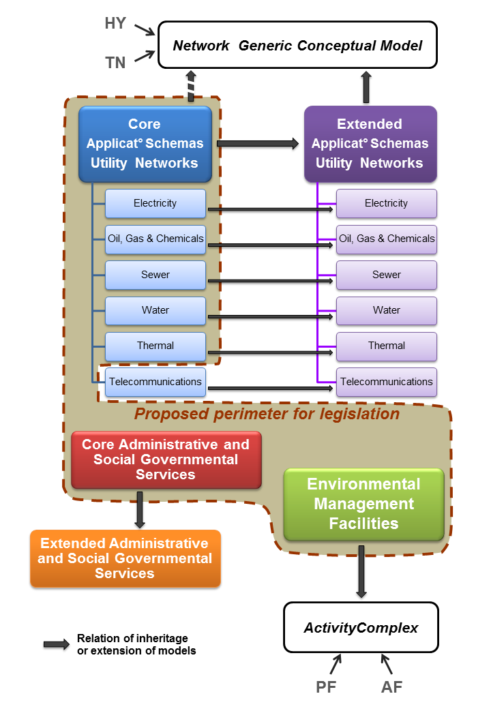
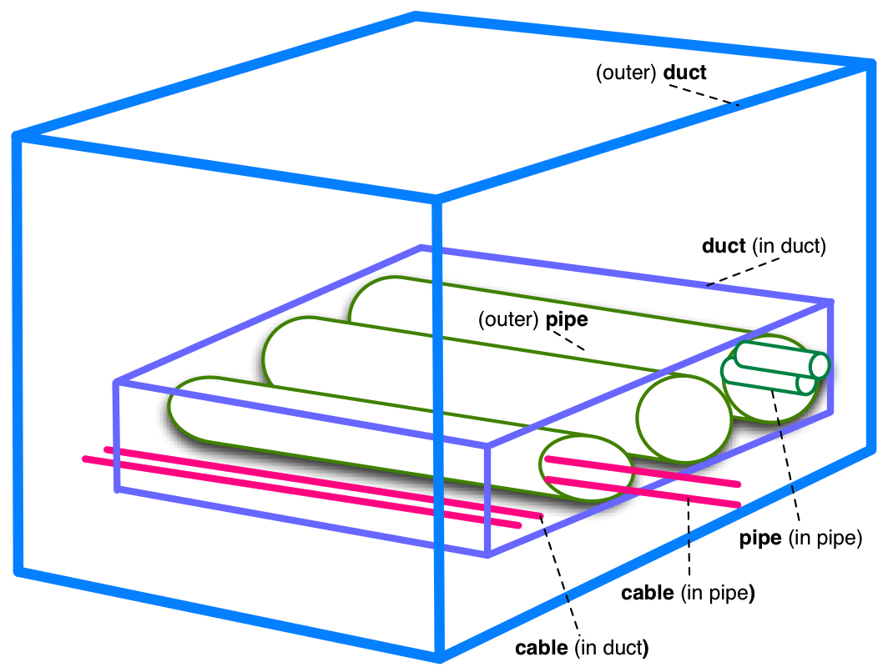
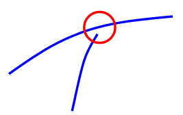
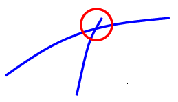
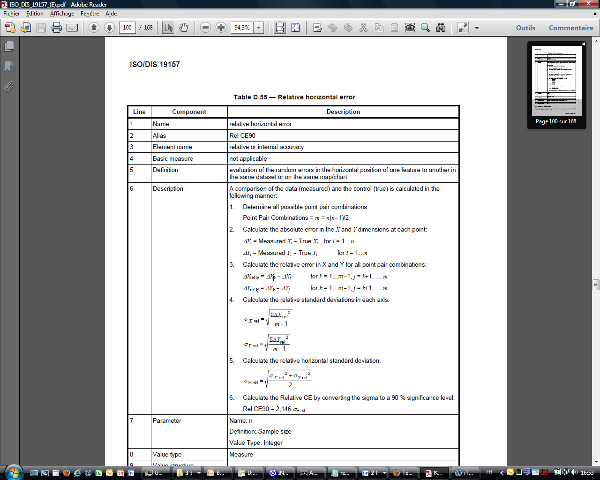
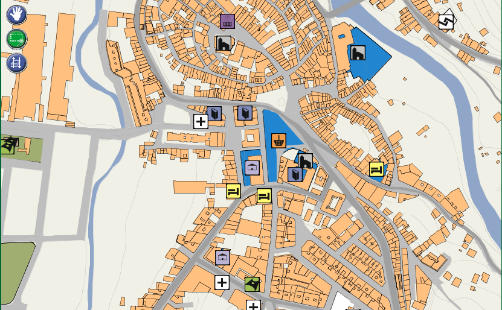
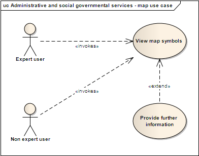
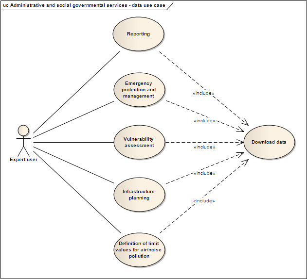
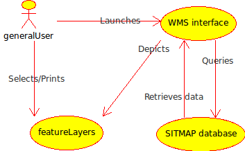
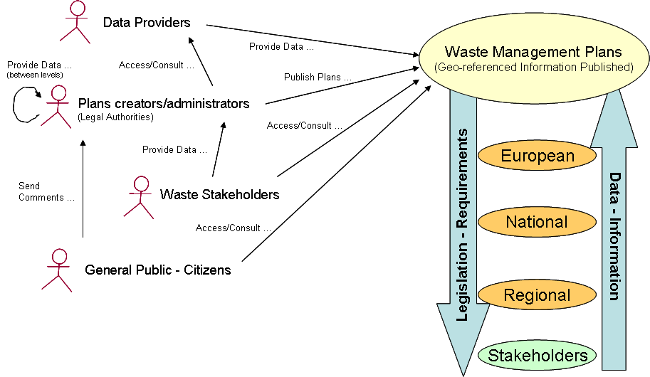

{width="1.3715277777777777in" height="0.9444444444444444in"}

{width="0.9770833333333333in" height="0.9708333333333333in"}

INSPIRE\
Infrastructure for Spatial Information in Europe

D2.8.III.6 Data Specification on *Utility and Government Services* -- Technical Guidelines

+-----------------+-------------------------------------------------------------------------------------------------------------------------------------------------------------------------------+
| **Title**       | D2.8.III.6 INSPIRE Data Specification on *Utility and Government Services* -- Technical Guidelines                                                                            |
+-----------------+-------------------------------------------------------------------------------------------------------------------------------------------------------------------------------+
| **Creator**     | INSPIRE Thematic Working Group *Utility and Government Services*                                                                                                              |
+-----------------+-------------------------------------------------------------------------------------------------------------------------------------------------------------------------------+
| **Date**        | 2013-12-10                                                                                                                                                                    |
+-----------------+-------------------------------------------------------------------------------------------------------------------------------------------------------------------------------+
| **Subject**     | INSPIRE Data Specification for the spatial data theme *Utility and Government Services*                                                                                       |
+-----------------+-------------------------------------------------------------------------------------------------------------------------------------------------------------------------------+
| **Publisher**   | European Commission Joint Research Centre                                                                                                                                     |
+-----------------+-------------------------------------------------------------------------------------------------------------------------------------------------------------------------------+
| **Type**        | Text                                                                                                                                                                          |
+-----------------+-------------------------------------------------------------------------------------------------------------------------------------------------------------------------------+
| **Description** | This document describes the INSPIRE Data Specification for the spatial data theme *Utility and Government Services*                                                           |
+-----------------+-------------------------------------------------------------------------------------------------------------------------------------------------------------------------------+
| **Contributor** | ::: {custom-style="header"}                                                                                                                                                   |
|                 | Members of the INSPIRE Thematic Working Group *Utility and Government Services*                                                                                               |
|                 | :::                                                                                                                                                                           |
+-----------------+-------------------------------------------------------------------------------------------------------------------------------------------------------------------------------+
| **Format**      | Portable Document Format (pdf)                                                                                                                                                |
+-----------------+-------------------------------------------------------------------------------------------------------------------------------------------------------------------------------+
| **Source**      |                                                                                                                                                                               |
+-----------------+-------------------------------------------------------------------------------------------------------------------------------------------------------------------------------+
| **Rights**      | Public                                                                                                                                                                        |
+-----------------+-------------------------------------------------------------------------------------------------------------------------------------------------------------------------------+
| **Identifier**  | D2.8.III.6_v3.0                                                                                                                                                               |
+-----------------+-------------------------------------------------------------------------------------------------------------------------------------------------------------------------------+
| **Language**    | En                                                                                                                                                                            |
+-----------------+-------------------------------------------------------------------------------------------------------------------------------------------------------------------------------+
| **Relation**    | Directive 2007/2/EC of the European Parliament and of the Council of 14 March 2007 establishing an Infrastructure for Spatial Information in the European Community (INSPIRE) |
+-----------------+-------------------------------------------------------------------------------------------------------------------------------------------------------------------------------+
| **Coverage**    | Project duration                                                                                                                                                              |
+-----------------+-------------------------------------------------------------------------------------------------------------------------------------------------------------------------------+

**Foreword**

**How to read the document?**

This document describes the *"INSPIRE data specification on Utility and Government Services -- Technical Guidelines"* version 3.0 as developed by the Thematic Working Group (TWG) *Utility and Government Services* using both natural and a conceptual schema language.

The data specification is based on a common template[^1] used for all data specifications, which has been harmonised using the experience from the development of the Annex I, II and III data specifications.

This document provides guidelines for the implementation of the provisions laid down in the Implementing Rule for spatial data sets and services of the INSPIRE Directive. It also includes additional requirements and recommendations that, although not included in the Implementing Rule, are relevant to guarantee or to increase data interoperability.

Two executive summaries provide a quick overview of the INSPIRE data specification process in general, and the content of the data specification on *Utility and Government Services* in particular. We highly recommend that managers, decision makers, and all those new to the INSPIRE process and/or information modelling should read these executive summaries first.

The UML diagrams (in Chapter 5) offer a rapid way to see the main elements of the specifications and their relationships. The definition of the spatial object types, attributes, and relationships are included in the Feature Catalogue (also in Chapter 5). People having thematic expertise but not familiar with UML can fully understand the content of the data model focusing on the Feature Catalogue. Users might also find the Feature Catalogue especially useful to check if it contains the data necessary for the applications that they run. The technical details are expected to be of prime interest to those organisations that are responsible for implementing INSPIRE within the field of *Utility and Government Services*, but also to other stakeholders and users of the spatial data infrastructure.

The technical provisions and the underlying concepts are often illustrated by examples. Smaller examples are within the text of the specification, while longer explanatory examples and descriptions of selected use cases are attached in the annexes.

In order to distinguish the INSPIRE spatial data themes from the spatial object types, the INSPIRE spatial data themes are written in *italics.*

  ----------------------------------------------------------------------------------------------------------------------------------------------------------------------------------------------------
  The document will be publicly available as a 'non-paper'. It does not represent an official position of the European Commission, and as such cannot be invoked in the context of legal procedures.
  ----------------------------------------------------------------------------------------------------------------------------------------------------------------------------------------------------

**Legal Notice**

Neither the European Commission nor any person acting on behalf of the Commission is responsible for the use which might be made of this publication.

**Interoperability of Spatial Data Sets and Services --\
General Executive Summary**

The challenges regarding the lack of availability, quality, organisation, accessibility, and sharing of spatial information are common to a large number of policies and activities and are experienced across the various levels of public authority in Europe. In order to solve these problems it is necessary to take measures of coordination between the users and providers of spatial information. The Directive 2007/2/EC of the European Parliament and of the Council adopted on 14 March 2007 aims at establishing an Infrastructure for Spatial Information in the European Community (INSPIRE) for environmental policies, or policies and activities that have an impact on the environment.

INSPIRE is based on the infrastructures for spatial information that are created and maintained by the Member States. To support the establishment of a European infrastructure, Implementing Rules addressing the following components of the infrastructure have been specified: metadata, interoperability of spatial data sets (as described in Annexes I, II, III of the Directive) and spatial data services, network services, data and service sharing, and monitoring and reporting procedures.

INSPIRE does not require collection of new data. However, after the period specified in the Directive[^2] Member States have to make their data available according to the Implementing Rules.

Interoperability in INSPIRE means the possibility to combine spatial data and services from different sources across the European Community in a consistent way without involving specific efforts of humans or machines. It is important to note that "interoperability" is understood as providing access to spatial data sets through network services, typically via Internet. Interoperability may be achieved by either changing (harmonising) and storing existing data sets or transforming them via services for publication in the INSPIRE infrastructure. It is expected that users will spend less time and efforts on understanding and integrating data when they build their applications based on data delivered in accordance with INSPIRE.

In order to benefit from the endeavours of international standardisation bodies and organisations established under international law their standards and technical means have been utilised and referenced, whenever possible.

To facilitate the implementation of INSPIRE, it is important that all stakeholders have the opportunity to participate in specification and development. For this reason, the Commission has put in place a consensus building process involving data users, and providers together with representatives of industry, research and government. These stakeholders, organised through Spatial Data Interest Communities (SDIC) and Legally Mandated Organisations (LMO)[^3], have provided reference materials, participated in the user requirement and technical[^4] surveys, proposed experts for the Data Specification Drafting Team[^5], the Thematic Working Groups[^6] and other ad-hoc cross-thematic technical groups and participated in the public stakeholder consultations on draft versions of the data specifications. These consultations covered expert reviews as well as feasibility and fitness-for-purpose testing of the data specifications[^7].

This open and participatory approach was successfully used during the development of the data specifications on Annex I, II and III data themes as well as during the preparation of the Implementing Rule on Interoperability of Spatial Data Sets and Services[^8] for Annex I spatial data themes and of its amendment regarding the themes of Annex II and III.

The development framework elaborated by the Data Specification Drafting Team aims at keeping the data specifications of the different themes coherent. It summarises the methodology to be used for the development of the data specifications, providing a coherent set of requirements and recommendations to achieve interoperability. The pillars of the framework are the following technical documents[^9]:

-   The *Definition of Annex Themes and Scope* describes in greater detail the spatial data themes defined in the Directive, and thus provides a sound starting point for the thematic aspects of the data specification development.

-   The *Generic Conceptual Model* defines the elements necessary for interoperability and data harmonisation including cross-theme issues. It specifies requirements and recommendations with regard to data specification elements of common use, like the spatial and temporal schema, unique identifier management, object referencing, some common code lists, etc. Those requirements of the Generic Conceptual Model that are directly implementable are included in the Implementing Rule on Interoperability of Spatial Data Sets and Services.

-   The *Methodology for the Development of Data Specifications* defines a repeatable methodology. It describes how to arrive from user requirements to a data specification through a number of steps including use-case development, initial specification development and analysis of analogies and gaps for further specification refinement.

-   The *Guidelines for the Encoding of Spatial Data* defines how geographic information can be encoded to enable transfer processes between the systems of the data providers in the Member States. Even though it does not specify a mandatory encoding rule it sets GML (ISO 19136) as the default encoding for INSPIRE.

-   The *Guidelines for the use of Observations & Measurements and Sensor Web Enablement-related standards in INSPIRE Annex II and III data specification development* provides guidelines on how the "Observations and Measurements" standard (ISO 19156) is to be used within INSPIRE.

-   The *Common data models* are a set of documents that specify data models that are referenced by a number of different data specifications. These documents include generic data models for networks, coverages and activity complexes.

The structure of the data specifications is based on the "ISO 19131 Geographic information - Data product specifications" standard. They include the technical documentation of the application schema, the spatial object types with their properties, and other specifics of the spatial data themes using natural language as well as a formal conceptual schema language[^10].

A consolidated model repository, feature concept dictionary, and glossary are being maintained to support the consistent specification development and potential further reuse of specification elements. The consolidated model consists of the harmonised models of the relevant standards from the ISO 19100 series, the INSPIRE Generic Conceptual Model, and the application schemas[^11] developed for each spatial data theme. The multilingual INSPIRE Feature Concept Dictionary contains the definition and description of the INSPIRE themes together with the definition of the spatial object types present in the specification. The INSPIRE Glossary defines all the terms (beyond the spatial object types) necessary for understanding the INSPIRE documentation including the terminology of other components (metadata, network services, data sharing, and monitoring).

By listing a number of requirements and making the necessary recommendations, the data specifications enable full system interoperability across the Member States, within the scope of the application areas targeted by the Directive. The data specifications (in their version 3.0) are published as technical guidelines and provide the basis for the content of the Implementing Rule on Interoperability of Spatial Data Sets and Services[^12]. The content of the Implementing Rule is extracted from the data specifications, considering short- and medium-term feasibility as well as cost-benefit considerations. The requirements included in the Implementing Rule are legally binding for the Member States according to the timeline specified in the INSPIRE Directive.

In addition to providing a basis for the interoperability of spatial data in INSPIRE, the data specification development framework and the thematic data specifications can be reused in other environments at local, regional, national and global level contributing to improvements in the coherence and interoperability of data in spatial data infrastructures.

***Utility and Government Services* -- Executive Summary**

The theme *"Utility and Government Services"* covers different feature types under its scope (i.e. miscellaneous energy networks, plentiful public services of different types and several environmental management facilities).

In order to develop data specifications, the list of geographical entities has been restricted to those features potentially linked with environmental issues (according to the INSPIRE directive fundamentals) and moreover dispatched in three main subthemes described below.

Nevertheless, the *"Utility and Government Services"* thematic approach consists in providing quite simple information describing such services, among which:

-   Feature location;

-   Party involved in the service (Administration or organization on behalf of an administrative mandate);

-   Basic technical characteristics, such as capacity or details on the type of service provided.

The use cases studied and taken into account in the data specifications development process are based on few European regulation processes (such as the Waste Framework Directive-- cf. Annexes B & C of the current document), but other non-legally referenced basic uses - as locating features and simply describing information - were also to be considered.

This statement is principally due to (i) various national and local uses -- impossible to be exhaustively considered -- and also (ii) the aim of simplicity underlying the data specifications development process.

Considering width of the scope, it has been decided to split the thematic into 3 different sub-domains:

1.  Utility networks;

2.  Administrative and social governmental services;

3.  Environmental management facilities.

Each of them has its own modelization, independent from one to another (though some elements may be linked between sub-domains).

The purpose of such an approach is permitting to any data provider and user to exchange its own data with as much flexibility as possible.

1\. The ***"Utility networks"*** sub-model is structured into 2 profiles:

-   **Utility Networks Profile:** derived from the Generic Network model[^13], this modelization is based on a node-arc-node structure and network concept. Especially designed for utility networks managers willing to describe their data into a structured modelization that allows its business use (estimation of propagation, calculation of capacities, etc.); the technical description of several network elements is limited to very simple information (type of material transported and basic characteristics). The use of this profile is also adapted for non-topological data, since the relation between nodes and arcs is optional;

-   **Extended Utility Networks Profile:** annexed proposals for richer models, detailing the Utility Networks Profile, i.e. same structure based on the Generic Network model and many other attributes and lists of values proposed to better describe the utility networks characteristics for a richer use.

In each profile, the information is detailed in several application schemas:

-   Electricity network

-   Oil, Gas & Chemicals network

-   Sewer network

-   Telecommunications network (only proposed in the technical guidance, out of legislation)

-   Thermal network

-   Water network

In addition to generic network information (utility link elements, connection with nodes and belonging to a network), each element (UtilityLinkSet, UtilityNode and UtilityNetwork) is detailed within its specific application schema through various attributes, developed through several codelists values or Measure types for most of them.

2\. The model of the ***"Administrative and social governmental services"*** sub-theme is based on one single central feature type, "GovernmentalService", that is basic in a core-defined profile (mainly location, contact and type of service information) and detailed in an extended one (including occupancy, resources and other description).

Its geometric reference can be an existing object (such as INSPIRE Annex I "Address", Annex III "Building" or abstract type "ActivityComplex" described below) or a created object (GM_Object, mostly GM_Point to be consistent with the well-used notion of POI = Point of Interest).

The GovernmentalService type value is selected from a codelist of more than 50 items, organized in a hierarchical structure, based on the "Classification of the functions of government" - abbreviated as COFOG, currently used by [EuroStat]{.smallcaps}, and developed within the respect of INSPIRE criteria (focused on public & environmental aspects).

3\. The ***"Environmental Management Facilites"*** application schema defines a single feature type called "EnvironmentalManagementFacility", with a generic geometric reference (GM_Object). "EnvironmentalManagementFacility" is a specialisation of the Generic Conceptual Model "ActivityComplex" feature type. This ensures close alignment (harmonisation) with other feature types derived from "ActivityComplex", especially those from the *Production and Industrial Facilities* (PF) and *Agricultural and Aquaculture Facilities* (AF) themes.

The "EnvironmentalManagementFacility" feature type is suitable for the representation of sites and installations. The "parentFacility"-association from "EnvironmentalManagementFacility" to "EnvironmentalManagementFacility" supports the representation of hierarchies among installations and sites.

Several aspects of environmental management facilities are represented in the model, most notably facility functions, permissions, capacities, related parties (owners, operators, authorities) and status information. Several established codelists are used for the representation of such aspects, including Eurostat's NACE list of economic activities, the Decision 2000/532 List of Wastes and the Waste Framework Directive (2008/98) list of disposal and recovery operations.

**Acknowledgements**

Many individuals and organisations have contributed to the development of these Guidelines.

The Thematic Working Group *Utility and governmental services* (TWG-US) included:

Frédéric Brönnimann (TWG Facilitator), Maksim Šestić (TWG Editor), Pedro A. González Pérez, Frank Haugan, Nadine Magdalinski, Katleen Miserez, Norbert Pfaffinger, Janine Ritschl, Frank Schwarzbach, Jef Vanbockryck, Angel López Alós (European Commission contact point).

Other contributors to the INSPIRE data specifications are the Drafting Team Data Specifications, the JRC Data Specifications Team and the INSPIRE stakeholders - Spatial Data Interested Communities (SDICs) and Legally Mandated Organisations (LMOs).

**Contact information**

Maria Vanda Nunes de Lima & Michael Lutz

European Commission Joint Research Centre (JRC)

Institute for Environment and Sustainability

Unit H06: Digital Earth and Reference Data

*http://inspire.ec.europa.eu/index.cfm/pageid/2*

**\
Table of contents**

::: {custom-style="toc 1"}
[1]{custom-style="Hyperlink"} [Scope]{custom-style="Hyperlink"} 1
:::

::: {custom-style="toc 1"}
[2]{custom-style="Hyperlink"} [Overview]{custom-style="Hyperlink"} 1
:::

::: {custom-style="toc 2"}
[2.1]{custom-style="Hyperlink"} [Name]{custom-style="Hyperlink"} 1
:::

::: {custom-style="toc 2"}
[2.2]{custom-style="Hyperlink"} [Informal description]{custom-style="Hyperlink"} 1
:::

::: {custom-style="toc 3"}
[2.2.1]{custom-style="Hyperlink"} [Utility networks]{custom-style="Hyperlink"} 1
:::

::: {custom-style="toc 3"}
[2.2.2]{custom-style="Hyperlink"} [Administrative and social governmental services]{custom-style="Hyperlink"} 2
:::

::: {custom-style="toc 3"}
[2.2.3]{custom-style="Hyperlink"} [Environmental management facilities]{custom-style="Hyperlink"} 4
:::

::: {custom-style="toc 2"}
[2.3]{custom-style="Hyperlink"} [Normative References]{custom-style="Hyperlink"} 6
:::

::: {custom-style="toc 2"}
[2.4]{custom-style="Hyperlink"} [Terms and definitions]{custom-style="Hyperlink"} 7
:::

::: {custom-style="toc 2"}
[2.5]{custom-style="Hyperlink"} [Symbols and abbreviations]{custom-style="Hyperlink"} 7
:::

::: {custom-style="toc 2"}
[2.6]{custom-style="Hyperlink"} [How the Technical Guidelines map to the Implementing Rules]{custom-style="Hyperlink"} 7
:::

::: {custom-style="toc 3"}
[2.6.1]{custom-style="Hyperlink"} [Requirements]{custom-style="Hyperlink"} 8
:::

::: {custom-style="toc 3"}
[2.6.2]{custom-style="Hyperlink"} [Recommendations]{custom-style="Hyperlink"} 9
:::

::: {custom-style="toc 3"}
[2.6.3]{custom-style="Hyperlink"} [Conformance]{custom-style="Hyperlink"} 9
:::

::: {custom-style="toc 1"}
[3]{custom-style="Hyperlink"} [Specification scopes]{custom-style="Hyperlink"} 9
:::

::: {custom-style="toc 1"}
[4]{custom-style="Hyperlink"} [Identification information]{custom-style="Hyperlink"} 9
:::

::: {custom-style="toc 1"}
[5]{custom-style="Hyperlink"} [Data content and structure]{custom-style="Hyperlink"} 10
:::

::: {custom-style="toc 2"}
[5.1]{custom-style="Hyperlink"} [Application schemas -- Overview]{custom-style="Hyperlink"} 14
:::

::: {custom-style="toc 3"}
[5.1.1]{custom-style="Hyperlink"} [Application schemas included in the IRs]{custom-style="Hyperlink"} 14
:::

::: {custom-style="toc 3"}
[5.1.2]{custom-style="Hyperlink"} [Additional recommended application schemas]{custom-style="Hyperlink"} 15
:::

::: {custom-style="toc 2"}
[5.2]{custom-style="Hyperlink"} [Basic notions]{custom-style="Hyperlink"} 16
:::

::: {custom-style="toc 3"}
[5.2.1]{custom-style="Hyperlink"} [Notation]{custom-style="Hyperlink"} 16
:::

::: {custom-style="toc 3"}
[5.2.2]{custom-style="Hyperlink"} [Voidable characteristics]{custom-style="Hyperlink"} 17
:::

::: {custom-style="toc 3"}
[5.2.3]{custom-style="Hyperlink"} [Enumerations]{custom-style="Hyperlink"} 18
:::

::: {custom-style="toc 3"}
[5.2.4]{custom-style="Hyperlink"} [Code lists]{custom-style="Hyperlink"} 18
:::

::: {custom-style="toc 3"}
[5.2.5]{custom-style="Hyperlink"} [Identifier management]{custom-style="Hyperlink"} 22
:::

::: {custom-style="toc 3"}
[5.2.6]{custom-style="Hyperlink"} [Geometry representation]{custom-style="Hyperlink"} 22
:::

::: {custom-style="toc 3"}
[5.2.7]{custom-style="Hyperlink"} [Temporality representation]{custom-style="Hyperlink"} 23
:::

::: {custom-style="toc 2"}
[5.3]{custom-style="Hyperlink"} [Application schema Administrative and Social Governmental Services]{custom-style="Hyperlink"} 25
:::

::: {custom-style="toc 3"}
[5.3.1]{custom-style="Hyperlink"} [Description]{custom-style="Hyperlink"} 25
:::

::: {custom-style="toc 3"}
[5.3.2]{custom-style="Hyperlink"} [Feature catalogue]{custom-style="Hyperlink"} 28
:::

::: {custom-style="toc 3"}
[5.3.3]{custom-style="Hyperlink"} [Externally governed code lists]{custom-style="Hyperlink"} 34
:::

::: {custom-style="toc 2"}
[5.4]{custom-style="Hyperlink"} [Application schema Extended Administrative and Social Governmental Services]{custom-style="Hyperlink"} 35
:::

::: {custom-style="toc 3"}
[5.4.2]{custom-style="Hyperlink"} [Feature catalogue]{custom-style="Hyperlink"} 36
:::

::: {custom-style="toc 3"}
[5.4.3]{custom-style="Hyperlink"} [Externally governed code lists]{custom-style="Hyperlink"} 37
:::

::: {custom-style="toc 2"}
[5.5]{custom-style="Hyperlink"} [Application schema Environmental Management Facilities]{custom-style="Hyperlink"} 38
:::

::: {custom-style="toc 3"}
[5.5.1]{custom-style="Hyperlink"} [Description]{custom-style="Hyperlink"} 38
:::

::: {custom-style="toc 3"}
[5.5.2]{custom-style="Hyperlink"} [Feature catalogue]{custom-style="Hyperlink"} 45
:::

::: {custom-style="toc 3"}
[5.5.3]{custom-style="Hyperlink"} [Externally governed code lists]{custom-style="Hyperlink"} 48
:::

::: {custom-style="toc 2"}
[5.6]{custom-style="Hyperlink"} [Application Schemas "Utility Networks"]{custom-style="Hyperlink"} 49
:::

::: {custom-style="toc 2"}
[5.7]{custom-style="Hyperlink"} ["Common Utility Networks Elements" application schema]{custom-style="Hyperlink"} 52
:::

::: {custom-style="toc 3"}
[5.7.1]{custom-style="Hyperlink"} [Description]{custom-style="Hyperlink"} 52
:::

::: {custom-style="toc 3"}
[5.7.2]{custom-style="Hyperlink"} [Feature catalogue]{custom-style="Hyperlink"} 57
:::

::: {custom-style="toc 3"}
[5.7.3]{custom-style="Hyperlink"} [Externally governed code lists]{custom-style="Hyperlink"} 70
:::

::: {custom-style="toc 2"}
[5.8]{custom-style="Hyperlink"} ["Electricity Network" application schema]{custom-style="Hyperlink"} 70
:::

::: {custom-style="toc 3"}
[5.8.1]{custom-style="Hyperlink"} [Description]{custom-style="Hyperlink"} 70
:::

::: {custom-style="toc 3"}
[5.8.2]{custom-style="Hyperlink"} [Feature catalogue]{custom-style="Hyperlink"} 71
:::

::: {custom-style="toc 3"}
[5.8.3]{custom-style="Hyperlink"} [Externally governed code lists]{custom-style="Hyperlink"} 73
:::

::: {custom-style="toc 2"}
[5.9]{custom-style="Hyperlink"} ["Oil-Gas-Chemicals Network" application schema]{custom-style="Hyperlink"} 73
:::

::: {custom-style="toc 3"}
[5.9.1]{custom-style="Hyperlink"} [Description]{custom-style="Hyperlink"} 73
:::

::: {custom-style="toc 3"}
[5.9.2]{custom-style="Hyperlink"} [Externally governed code lists]{custom-style="Hyperlink"} 75
:::

::: {custom-style="toc 2"}
[5.10]{custom-style="Hyperlink"} ["Sewer Network" application schema]{custom-style="Hyperlink"} 76
:::

::: {custom-style="toc 3"}
[5.10.1]{custom-style="Hyperlink"} [Description]{custom-style="Hyperlink"} 76
:::

::: {custom-style="toc 3"}
[5.10.2]{custom-style="Hyperlink"} [Feature catalogue]{custom-style="Hyperlink"} 77
:::

::: {custom-style="toc 3"}
[5.10.3]{custom-style="Hyperlink"} [Externally governed code lists]{custom-style="Hyperlink"} 78
:::

::: {custom-style="toc 2"}
[5.11]{custom-style="Hyperlink"} ["Thermal Network" application schema]{custom-style="Hyperlink"} 79
:::

::: {custom-style="toc 3"}
[5.11.1]{custom-style="Hyperlink"} [Description]{custom-style="Hyperlink"} 79
:::

::: {custom-style="toc 3"}
[5.11.2]{custom-style="Hyperlink"} [Feature catalogue]{custom-style="Hyperlink"} 80
:::

::: {custom-style="toc 3"}
[5.11.3]{custom-style="Hyperlink"} [Externally governed code lists]{custom-style="Hyperlink"} 81
:::

::: {custom-style="toc 2"}
[5.12]{custom-style="Hyperlink"} ["Water Network" application schema]{custom-style="Hyperlink"} 81
:::

::: {custom-style="toc 3"}
[5.12.1]{custom-style="Hyperlink"} [Description]{custom-style="Hyperlink"} 81
:::

::: {custom-style="toc 3"}
[5.12.2]{custom-style="Hyperlink"} [Feature catalogue]{custom-style="Hyperlink"} 82
:::

::: {custom-style="toc 3"}
[5.12.3]{custom-style="Hyperlink"} [Externally governed code lists]{custom-style="Hyperlink"} 84
:::

::: {custom-style="toc 1"}
[6]{custom-style="Hyperlink"} [Reference systems, units of measure and grids]{custom-style="Hyperlink"} 84
:::

::: {custom-style="toc 2"}
[6.1]{custom-style="Hyperlink"} [Default reference systems, units of measure and grid]{custom-style="Hyperlink"} 84
:::

::: {custom-style="toc 3"}
[6.1.1]{custom-style="Hyperlink"} [Coordinate reference systems]{custom-style="Hyperlink"} 84
:::

::: {custom-style="toc 3"}
[6.1.2]{custom-style="Hyperlink"} [Temporal reference system]{custom-style="Hyperlink"} 87
:::

::: {custom-style="toc 3"}
[6.1.3]{custom-style="Hyperlink"} [Units of measure]{custom-style="Hyperlink"} 87
:::

::: {custom-style="toc 2"}
[6.2]{custom-style="Hyperlink"} [Theme-specific requirements and recommendations]{custom-style="Hyperlink"} 87
:::

::: {custom-style="toc 1"}
[7]{custom-style="Hyperlink"} [Data quality]{custom-style="Hyperlink"} 87
:::

::: {custom-style="toc 2"}
[7.1]{custom-style="Hyperlink"} [Data quality elements]{custom-style="Hyperlink"} 88
:::

::: {custom-style="toc 3"}
[7.1.1]{custom-style="Hyperlink"} [Completeness -- Commission]{custom-style="Hyperlink"} 89
:::

::: {custom-style="toc 3"}
[7.1.2]{custom-style="Hyperlink"} [Completeness -- Omission]{custom-style="Hyperlink"} 89
:::

::: {custom-style="toc 3"}
[7.1.3]{custom-style="Hyperlink"} [Logical consistency -- Conceptual consistency]{custom-style="Hyperlink"} 90
:::

::: {custom-style="toc 3"}
[7.1.4]{custom-style="Hyperlink"} [Logical consistency -- Domain consistency]{custom-style="Hyperlink"} 90
:::

::: {custom-style="toc 3"}
[7.1.5]{custom-style="Hyperlink"} [Logical Consistency -- Format consistency]{custom-style="Hyperlink"} 91
:::

::: {custom-style="toc 3"}
[7.1.6]{custom-style="Hyperlink"} [Logical Consistency -- Topological consistency]{custom-style="Hyperlink"} 91
:::

::: {custom-style="toc 3"}
[7.1.7]{custom-style="Hyperlink"} [Positional accuracy -- Absolute or external accuracy]{custom-style="Hyperlink"} 94
:::

::: {custom-style="toc 3"}
[7.1.8]{custom-style="Hyperlink"} [Positional accuracy -- Relative or internal accuracy]{custom-style="Hyperlink"} 96
:::

::: {custom-style="toc 3"}
[7.1.9]{custom-style="Hyperlink"} [Thematic accuracy -- Classification correctness]{custom-style="Hyperlink"} 97
:::

::: {custom-style="toc 3"}
[7.1.10]{custom-style="Hyperlink"} [Thematic accuracy -- Non-quantitative attribute correctness]{custom-style="Hyperlink"} 97
:::

::: {custom-style="toc 3"}
[7.1.11]{custom-style="Hyperlink"} [Thematic accuracy -- Quantitative attribute accuracy]{custom-style="Hyperlink"} 98
:::

::: {custom-style="toc 3"}
[7.1.12]{custom-style="Hyperlink"} [Temporal quality -- Accuracy of a time measurement]{custom-style="Hyperlink"} 99
:::

::: {custom-style="toc 3"}
[7.1.13]{custom-style="Hyperlink"} [Temporal quality -- Temporal consistency]{custom-style="Hyperlink"} 100
:::

::: {custom-style="toc 2"}
[7.2]{custom-style="Hyperlink"} [Minimum data quality requirements]{custom-style="Hyperlink"} 101
:::

::: {custom-style="toc 2"}
[7.3]{custom-style="Hyperlink"} [Recommendation on data quality]{custom-style="Hyperlink"} 101
:::

::: {custom-style="toc 1"}
[8]{custom-style="Hyperlink"} [Dataset-level metadata]{custom-style="Hyperlink"} 101
:::

::: {custom-style="toc 2"}
[8.1]{custom-style="Hyperlink"} [Metadata elements defined in INSPIRE Metadata Regulation]{custom-style="Hyperlink"} 102
:::

::: {custom-style="toc 3"}
[8.1.1]{custom-style="Hyperlink"} [Conformity]{custom-style="Hyperlink"} 103
:::

::: {custom-style="toc 3"}
[8.1.2]{custom-style="Hyperlink"} [Lineage]{custom-style="Hyperlink"} 105
:::

::: {custom-style="toc 3"}
[8.1.3]{custom-style="Hyperlink"} [Temporal reference]{custom-style="Hyperlink"} 105
:::

::: {custom-style="toc 2"}
[8.2]{custom-style="Hyperlink"} [Metadata elements for interoperability]{custom-style="Hyperlink"} 106
:::

::: {custom-style="toc 3"}
[8.2.1]{custom-style="Hyperlink"} [Coordinate Reference System]{custom-style="Hyperlink"} 107
:::

::: {custom-style="toc 3"}
[8.2.2]{custom-style="Hyperlink"} [Temporal Reference System]{custom-style="Hyperlink"} 107
:::

::: {custom-style="toc 3"}
[8.2.3]{custom-style="Hyperlink"} [Encoding]{custom-style="Hyperlink"} 108
:::

::: {custom-style="toc 3"}
[8.2.4]{custom-style="Hyperlink"} [Character Encoding]{custom-style="Hyperlink"} 109
:::

::: {custom-style="toc 3"}
[8.2.5]{custom-style="Hyperlink"} [Spatial representation type]{custom-style="Hyperlink"} 109
:::

::: {custom-style="toc 3"}
[8.2.6]{custom-style="Hyperlink"} [Data Quality -- Logical Consistency -- Topological Consistency]{custom-style="Hyperlink"} 110
:::

::: {custom-style="toc 2"}
[8.3]{custom-style="Hyperlink"} [Recommended theme-specific metadata elements]{custom-style="Hyperlink"} 110
:::

::: {custom-style="toc 3"}
[8.3.1]{custom-style="Hyperlink"} [Maintenance Information]{custom-style="Hyperlink"} 110
:::

::: {custom-style="toc 3"}
[8.3.2]{custom-style="Hyperlink"} [Metadata elements for reporting data quality]{custom-style="Hyperlink"} 111
:::

::: {custom-style="toc 1"}
[9]{custom-style="Hyperlink"} [Delivery]{custom-style="Hyperlink"} 114
:::

::: {custom-style="toc 2"}
[9.1]{custom-style="Hyperlink"} [Updates]{custom-style="Hyperlink"} 114
:::

::: {custom-style="toc 2"}
[9.2]{custom-style="Hyperlink"} [Delivery medium]{custom-style="Hyperlink"} 114
:::

::: {custom-style="toc 2"}
[9.3]{custom-style="Hyperlink"} [Encodings]{custom-style="Hyperlink"} 115
:::

::: {custom-style="toc 3"}
[9.3.1]{custom-style="Hyperlink"} [Default Encoding(s)]{custom-style="Hyperlink"} 115
:::

::: {custom-style="toc 1"}
[10]{custom-style="Hyperlink"} [Data Capture]{custom-style="Hyperlink"} 117
:::

::: {custom-style="toc 1"}
[11]{custom-style="Hyperlink"} [Portrayal]{custom-style="Hyperlink"} 119
:::

::: {custom-style="toc 2"}
[11.1]{custom-style="Hyperlink"} [Layers to be provided by INSPIRE view services]{custom-style="Hyperlink"} 120
:::

::: {custom-style="toc 3"}
[11.1.1]{custom-style="Hyperlink"} [Layers organisation]{custom-style="Hyperlink"} 121
:::

::: {custom-style="toc 2"}
[11.2]{custom-style="Hyperlink"} [Styles required to be supported by INSPIRE view services]{custom-style="Hyperlink"} 122
:::

::: {custom-style="toc 3"}
[11.2.1]{custom-style="Hyperlink"} [Styles for the layer "Administrative and social governmental services]{custom-style="Hyperlink"} 122
:::

::: {custom-style="toc 3"}
[11.2.2]{custom-style="Hyperlink"} [Styles for the layer "Environmental Management Facilities"]{custom-style="Hyperlink"} 123
:::

::: {custom-style="toc 2"}
[11.3]{custom-style="Hyperlink"} [Other recommended styles]{custom-style="Hyperlink"} 124
:::

::: {custom-style="toc 1"}
[Bibliography]{custom-style="Hyperlink"} 125
:::

::: {custom-style="toc 1"}
[Annex A (normative) Abstract Test Suite]{custom-style="Hyperlink"} 126
:::

::: {custom-style="toc 2"}
[A.1]{custom-style="Hyperlink"} [Application Schema Conformance Class]{custom-style="Hyperlink"} 129
:::

::: {custom-style="toc 3"}
[A.1.1]{custom-style="Hyperlink"} [Schema element denomination test]{custom-style="Hyperlink"} 129
:::

::: {custom-style="toc 3"}
[A.1.2]{custom-style="Hyperlink"} [Value type test]{custom-style="Hyperlink"} 129
:::

::: {custom-style="toc 3"}
[A.1.3]{custom-style="Hyperlink"} [Value test]{custom-style="Hyperlink"} 130
:::

::: {custom-style="toc 3"}
[A.1.4]{custom-style="Hyperlink"} [Attributes/associations completeness test]{custom-style="Hyperlink"} 130
:::

::: {custom-style="toc 3"}
[A.1.5]{custom-style="Hyperlink"} [Abstract spatial object test]{custom-style="Hyperlink"} 130
:::

::: {custom-style="toc 3"}
[A.1.6]{custom-style="Hyperlink"} [Constraints test]{custom-style="Hyperlink"} 131
:::

::: {custom-style="toc 3"}
[A.1.7]{custom-style="Hyperlink"} [Geometry representation test]{custom-style="Hyperlink"} 131
:::

::: {custom-style="toc 2"}
[A.2]{custom-style="Hyperlink"} [Reference Systems Conformance Class]{custom-style="Hyperlink"} 131
:::

::: {custom-style="toc 3"}
[A.2.1]{custom-style="Hyperlink"} [Datum test]{custom-style="Hyperlink"} 131
:::

::: {custom-style="toc 3"}
[A.2.2]{custom-style="Hyperlink"} [Coordinate reference system test]{custom-style="Hyperlink"} 131
:::

::: {custom-style="toc 3"}
[A.2.3]{custom-style="Hyperlink"} [View service coordinate reference system test]{custom-style="Hyperlink"} 132
:::

::: {custom-style="toc 3"}
[A.2.4]{custom-style="Hyperlink"} [Temporal reference system test]{custom-style="Hyperlink"} 132
:::

::: {custom-style="toc 3"}
[A.2.5]{custom-style="Hyperlink"} [Units of measurements test]{custom-style="Hyperlink"} 133
:::

::: {custom-style="toc 2"}
[A.3]{custom-style="Hyperlink"} [Data Consistency Conformance Class]{custom-style="Hyperlink"} 133
:::

::: {custom-style="toc 3"}
[A.3.1]{custom-style="Hyperlink"} [Unique identifier persistency test]{custom-style="Hyperlink"} 133
:::

::: {custom-style="toc 3"}
[A.3.2]{custom-style="Hyperlink"} [Version consistency test]{custom-style="Hyperlink"} 133
:::

::: {custom-style="toc 3"}
[A.3.3]{custom-style="Hyperlink"} [Life cycle time sequence test]{custom-style="Hyperlink"} 134
:::

::: {custom-style="toc 3"}
[A.3.4]{custom-style="Hyperlink"} [Validity time sequence test]{custom-style="Hyperlink"} 134
:::

::: {custom-style="toc 3"}
[A.3.5]{custom-style="Hyperlink"} [Update frequency test]{custom-style="Hyperlink"} 134
:::

::: {custom-style="toc 2"}
[A.4]{custom-style="Hyperlink"} [Data Quality Conformance Class]{custom-style="Hyperlink"} 134
:::

::: {custom-style="toc 2"}
[A.5]{custom-style="Hyperlink"} [Metadata IR Conformance Class]{custom-style="Hyperlink"} 135
:::

::: {custom-style="toc 3"}
[A.5.1]{custom-style="Hyperlink"} [Metadata for interoperability test]{custom-style="Hyperlink"} 135
:::

::: {custom-style="toc 2"}
[A.6]{custom-style="Hyperlink"} [Information Accessibility Conformance Class]{custom-style="Hyperlink"} 135
:::

::: {custom-style="toc 3"}
[A.6.1]{custom-style="Hyperlink"} [Code list publication test]{custom-style="Hyperlink"} 135
:::

::: {custom-style="toc 3"}
[A.6.2]{custom-style="Hyperlink"} [CRS publication test]{custom-style="Hyperlink"} 135
:::

::: {custom-style="toc 3"}
[A.6.3]{custom-style="Hyperlink"} [CRS identification test]{custom-style="Hyperlink"} 136
:::

::: {custom-style="toc 2"}
[A.7]{custom-style="Hyperlink"} [Data Delivery Conformance Class]{custom-style="Hyperlink"} 136
:::

::: {custom-style="toc 3"}
[A.7.1]{custom-style="Hyperlink"} [Encoding compliance test]{custom-style="Hyperlink"} 136
:::

::: {custom-style="toc 2"}
[A.8]{custom-style="Hyperlink"} [Portrayal Conformance Class]{custom-style="Hyperlink"} 136
:::

::: {custom-style="toc 3"}
[A.8.1]{custom-style="Hyperlink"} [Layer designation test]{custom-style="Hyperlink"} 136
:::

::: {custom-style="toc 2"}
[A.9]{custom-style="Hyperlink"} [Technical Guideline Conformance Class]{custom-style="Hyperlink"} 138
:::

::: {custom-style="toc 3"}
[A.9.1]{custom-style="Hyperlink"} [Multiplicity test]{custom-style="Hyperlink"} 138
:::

::: {custom-style="toc 3"}
[A.9.1]{custom-style="Hyperlink"} [CRS http URI test]{custom-style="Hyperlink"} 138
:::

::: {custom-style="toc 3"}
[A.9.2]{custom-style="Hyperlink"} [Metadata encoding schema validation test]{custom-style="Hyperlink"} 138
:::

::: {custom-style="toc 3"}
[A.9.3]{custom-style="Hyperlink"} [Metadata occurrence test]{custom-style="Hyperlink"} 139
:::

::: {custom-style="toc 3"}
[A.9.4]{custom-style="Hyperlink"} [Metadata consistency test]{custom-style="Hyperlink"} 139
:::

::: {custom-style="toc 3"}
[A.9.5]{custom-style="Hyperlink"} [Encoding schema validation test]{custom-style="Hyperlink"} 139
:::

::: {custom-style="toc 3"}
[A.9.6]{custom-style="Hyperlink"} [Style test]{custom-style="Hyperlink"} 139
:::

::: {custom-style="toc 1"}
[Annex B (informative) Use cases]{custom-style="Hyperlink"} 141
:::

::: {custom-style="toc 2"}
[B.1]{custom-style="Hyperlink"} [Use case for "Utility networks"]{custom-style="Hyperlink"} 141
:::

::: {custom-style="toc 3"}
[B.1.1]{custom-style="Hyperlink"} [Introduction]{custom-style="Hyperlink"} 141
:::

::: {custom-style="toc 3"}
[B.1.2]{custom-style="Hyperlink"} [Use case description: Use case TWG_US_UN_KLIP]{custom-style="Hyperlink"} 142
:::

::: {custom-style="toc 2"}
[B.1]{custom-style="Hyperlink"} [Use case for "Administrative and social governmental services"]{custom-style="Hyperlink"} 144
:::

::: {custom-style="toc 3"}
[B.1.1]{custom-style="Hyperlink"} [Introduction]{custom-style="Hyperlink"} 144
:::

::: {custom-style="toc 3"}
[B.1.2]{custom-style="Hyperlink"} [Use case TWG_US_GS_Map_case]{custom-style="Hyperlink"} 145
:::

::: {custom-style="toc 3"}
[B.1.3]{custom-style="Hyperlink"} [Use case TWG_US_GS_Data_case]{custom-style="Hyperlink"} 146
:::

::: {custom-style="toc 3"}
[B.1.4]{custom-style="Hyperlink"} [Use Case: SITMAP -- Territorial Information System of Málaga Province (Spain)]{custom-style="Hyperlink"} 148
:::

::: {custom-style="toc 2"}
[B.2]{custom-style="Hyperlink"} [Use case for "Waste Management"]{custom-style="Hyperlink"} 150
:::

::: {custom-style="toc 3"}
[B.2.1]{custom-style="Hyperlink"} [Introduction]{custom-style="Hyperlink"} 150
:::

::: {custom-style="toc 3"}
[B.2.2]{custom-style="Hyperlink"} [Use case description: Use case Waste Management Plans and Waste Shipments.]{custom-style="Hyperlink"} 151
:::

::: {custom-style="toc 3"}
[B.2.3]{custom-style="Hyperlink"} [Cross Thematic Data requirements]{custom-style="Hyperlink"} 164
:::

::: {custom-style="toc 1"}
[Annex C (normative) Code list values]{custom-style="Hyperlink"} 167
:::

::: {custom-style="toc 2"}
[C.1]{custom-style="Hyperlink"} [INSPIRE Application Schema \'AdministrativeAndSocialGovernmentalServices\']{custom-style="Hyperlink"} 167
:::

::: {custom-style="toc 2"}
[C.2]{custom-style="Hyperlink"} [INSPIRE Application Schema \'Environmental Management Facilities\']{custom-style="Hyperlink"} 173
:::

::: {custom-style="toc 2"}
[C.3]{custom-style="Hyperlink"} [INSPIRE Application Schema \'Common Utility Network Elements\']{custom-style="Hyperlink"} 173
:::

::: {custom-style="toc 2"}
[C.4]{custom-style="Hyperlink"} [INSPIRE Application Schema \'Electricity Network\']{custom-style="Hyperlink"} 175
:::

::: {custom-style="toc 2"}
[C.5]{custom-style="Hyperlink"} [INSPIRE Application Schema \'Oil-Gas-Chemicals Network\']{custom-style="Hyperlink"} 179
:::

::: {custom-style="toc 2"}
[C.6]{custom-style="Hyperlink"} [INSPIRE Application Schema \'Sewer Network\']{custom-style="Hyperlink"} 183
:::

::: {custom-style="toc 2"}
[C.7]{custom-style="Hyperlink"} [INSPIRE Application Schema \'Thermal Network\']{custom-style="Hyperlink"} 185
:::

::: {custom-style="toc 2"}
[C.8]{custom-style="Hyperlink"} [INSPIRE Application Schema \'Water Network\']{custom-style="Hyperlink"} 185
:::

::: {custom-style="toc 1"}
[Annex D (informative) ServiceTypeValue codelist]{custom-style="Hyperlink"} 190
:::

::: {custom-style="toc 1"}
[Annex E (informative) Checklists for data interoperability]{custom-style="Hyperlink"} 192
:::

::: {custom-style="toc 1"}
[Annex F (informative) Portrayal analysis]{custom-style="Hyperlink"} 193
:::

::: {custom-style="toc 1"}
[Annex G (informative) Extended Utility Networks Application Schemas]{custom-style="Hyperlink"} 194
:::

::: {custom-style="toc 2"}
[G.1]{custom-style="Hyperlink"} ["Common Extended Utility Networks Elements" application schema]{custom-style="Hyperlink"} 194
:::

::: {custom-style="toc 3"}
[G.1.1]{custom-style="Hyperlink"} [UML Overview]{custom-style="Hyperlink"} 194
:::

::: {custom-style="toc 3"}
[G.1.2]{custom-style="Hyperlink"} [Feature catalogue]{custom-style="Hyperlink"} 195
:::

::: {custom-style="toc 2"}
[G.2]{custom-style="Hyperlink"} ["Extended Electricity Network" application schema]{custom-style="Hyperlink"} 204
:::

::: {custom-style="toc 3"}
[G.2.1]{custom-style="Hyperlink"} [UML Overview]{custom-style="Hyperlink"} 204
:::

::: {custom-style="toc 3"}
[G.2.2]{custom-style="Hyperlink"} [Feature catalogue]{custom-style="Hyperlink"} 205
:::

::: {custom-style="toc 2"}
[G.3]{custom-style="Hyperlink"} ["Extended Oil-Gas-Chemicals Network" application schema]{custom-style="Hyperlink"} 207
:::

::: {custom-style="toc 3"}
[G.3.1]{custom-style="Hyperlink"} [UML Overview]{custom-style="Hyperlink"} 207
:::

::: {custom-style="toc 3"}
[G.3.2]{custom-style="Hyperlink"} [Feature catalogue]{custom-style="Hyperlink"} 208
:::

::: {custom-style="toc 2"}
[G.4]{custom-style="Hyperlink"} ["Extended Thermal Network" application schema]{custom-style="Hyperlink"} 209
:::

::: {custom-style="toc 3"}
[G.4.1]{custom-style="Hyperlink"} [UML Overview]{custom-style="Hyperlink"} 209
:::

::: {custom-style="toc 3"}
[G.4.2]{custom-style="Hyperlink"} [Feature catalogue]{custom-style="Hyperlink"} 210
:::

::: {custom-style="toc 2"}
[G.5]{custom-style="Hyperlink"} ["Extended Water Network" application schema]{custom-style="Hyperlink"} 212
:::

::: {custom-style="toc 3"}
[G.5.1]{custom-style="Hyperlink"} [UML Overview]{custom-style="Hyperlink"} 212
:::

::: {custom-style="toc 3"}
[G.5.2]{custom-style="Hyperlink"} [Feature catalogue]{custom-style="Hyperlink"} 212
:::

::: {custom-style="toc 2"}
[G.6]{custom-style="Hyperlink"} ["Extended Sewer Network" application schema]{custom-style="Hyperlink"} 214
:::

::: {custom-style="toc 3"}
[G.6.1]{custom-style="Hyperlink"} [UML Overview]{custom-style="Hyperlink"} 214
:::

::: {custom-style="toc 3"}
[G.6.2]{custom-style="Hyperlink"} [Feature catalogue]{custom-style="Hyperlink"} 214
:::

::: {custom-style="toc 1"}
[Annex H (informative) "Telecommunications Network" Application Schema]{custom-style="Hyperlink"} 217
:::

::: {custom-style="toc 2"}
[H.1]{custom-style="Hyperlink"} [UML Overview]{custom-style="Hyperlink"} 217
:::

::: {custom-style="toc 2"}
[H.2]{custom-style="Hyperlink"} [Feature catalogue]{custom-style="Hyperlink"} 218
:::

::: {custom-style="toc 3"}
[H.2.1]{custom-style="Hyperlink"} [Spatial object types]{custom-style="Hyperlink"} 218
:::

::: {custom-style="toc 3"}
[H.2.2]{custom-style="Hyperlink"} [Code lists]{custom-style="Hyperlink"} 218
:::

::: {custom-style="toc 3"}
[H.2.3]{custom-style="Hyperlink"} [Imported types (informative)]{custom-style="Hyperlink"} 219
:::

::: {custom-style="toc 2"}
[H.3]{custom-style="Hyperlink"} [INSPIRE-governed code lists]{custom-style="Hyperlink"} 219
:::

::: {custom-style="toc 3"}
[H.3.1]{custom-style="Hyperlink"} [Values of code list TelecommunicationsAppurtenanceTypeValue]{custom-style="Hyperlink"} 219
:::

::: {custom-style="toc 3"}
[H.3.2]{custom-style="Hyperlink"} [Values of code list TelecommunicationsCableMaterialTypeValue]{custom-style="Hyperlink"} 221
:::

# 

# Scope

This document specifies a harmonised data specification for the spatial data theme *Utility and Government Services* as defined in Annex III of the INSPIRE Directive.

This data specification provides the basis for the drafting of Implementing Rules according to Article 7 (1) of the INSPIRE Directive \[Directive 2007/2/EC\]. The entire data specification is published as implementation guidelines accompanying these Implementing Rules.

# Overview

## Name

INSPIRE data specification for the theme *Utility and Government Services*.

## Informal description

**[Definition:]{.ul}**

"Includes utility facilities such as sewage, waste management, energy supply and water supply, administrative and social governmental services such as public administrations, civil protection sites, schools and hospitals." \[Directive 2007/2/EC\]

### Utility networks

**Comprehension of the scope**

Utility services and networks include the physical constructions for transport of defined utility products (namely pipelines for transport of oil, gas, chemicals, water, sewage and thermal products), transmission lines and cables (included those for transmission of electricity, phone and cable-TV signals) and other network elements for encasing pipes and cases (e.g. ducts, poles and towers).

::: {custom-style="header"}
All kinds of transmission utility systems have nodes (e.g. pump stations), and they are linked to facilities for production and treatment of different kinds of utility products. These major production and treatment sites are described in the theme production and industrial facilities (Annex.III -- PF).
:::

::: {custom-style="header"}
Six important types of utility networks are distinguished, namely Electricity Network, Oil, Gas & Chemicals Network, Sewer Network, Telecommunications Network, Thermal Network and Water Network.
:::

::: {custom-style="header"}
All these networks use the node-arc-node model, as defined in the Generic Network Model. Especially designed for a structured modelization of utility networks that allows its business use (estimation of propagation, calculation of capacities, etc.), the use of this node-arc-node model is also adapted for non-topological data, since the relation between nodes and arcs is optional.
:::

::: {custom-style="header"}
Different organizations have different responsibilities and this will influence the kind of data they collect, manage and use. Some organizations will use simple models while other will have more complex data models. This data specification is a basic framework that user can adopt and, if necessary, adapt and extend for themselves. The specification is focused on the core spatial objects required by networks, i.e. network centerlines etc.
:::

In the utility services and networks there are "ducts", which are utility links used to protect and guide cable and pipes via an encasing construction. A duct may contain other duct(s), pipes and cables. "Duct" contains information about the position and characteristics of ducts as seen from a manhole, vault, or a cross section of a trench and duct.

The nodes of the networks include poles. Poles represent node objects that support utility devices and cables. "Pole" is a container to other utility objects. Other important nodes are manholes, towers and cabinets. A "Manhole" is the top openings to an underground public utility or service. A "Tower" is a vertical tower object that carries utility cables or pipes. A "Cabinet" is container for utility node objects (e.g. appurtenances). Poles, manholes, towers and cabinets represent containers for other network elements belonging to one or more utility networks.

**Overlaps / links with other themes**

This sub-theme might overlap with themes:

-   Hydrography (A-I.8)

-   Buildings (A-III.2)

-   Land use (A-III.4)

-   Environmental monitoring facilities (like treatment plants/pumping stations) (A-III.7)

-   Production and industrial facilities (A-III.8)

-   Energy resources (A-III.20)

Current sub-theme holds potential dependencies with the following themes:

-   Annex I

    -   Coordinate reference systems (geo-referencing of the point)

    -   Geographical grid systems (geo-referencing of the point)

    -   Geographical names (Identification of the point and of the place where it is located)

    -   Administrative units (that contain the point)

    -   Addresses (referencing of the point)

    -   Cadastral parcels (that contain the given service and from which the service is provided)

    -   Transport networks (that provide access to/from the services)

    -   Protected sites (that may contain services or being potential receptors of these)

-   Annex II

    -   Elevation (referencing of the point)

-   Annex III

    -   Statistical units (that contain the point)

    -   Buildings (that contain the given service and from which the service is provided)

    -   Population distribution -- demography (potential service "clients")

    -   Utilities (that the service make use/depend on)

### Administrative and social governmental services

**Comprehension of the scope**

According to the INSPIRE Directive, the scope of the sub-theme comprises "... administrative and social governmental services such as public administrations, civil protection sites, schools and hospitals. \[Annex III\]."

On another hand, INSPIRE document "Definition of Annex Themes and Scope v3.0 (D 2.3)" details governmental services as those fitting the following description:

*"Administrative and social governmental services such as public administrations, civil protection sites, schools, hospitals. The kind of sites that are commonly presented in governmental and municipal portals and map systems as "points of interest"-data (POI), and may be point-based location of a variety of categories of municipal and governmental services and social infrastructure".*

Given this description and, very specially, the concrete mention to the use of this type of data as POI, a wide interpretation of what "administrative and social governmental services" should be done.

In this same sense, the following words from the manual of the Spanish EIEL (Spanish acronym for Enquiry on Local Infrastructures and Services) database, which does also contain information on public services, may be considered as highly relevant: "(\...)The variety of ways how public services are provided and the correspondent variety in facilities management, as well as the concurrent activity of different Public Administration bodies, do recommend having in mind a broad scope on what are the utilities and services that are collectively facing the same needs".

***Eligibility criteria***

To identify the relevant service types, legal requirements (mainly the wording of the INSPIRE directive itself) as well as requirements based on use cases have to be considered. In detail a list of relevant criteria has been defined. Thus service types are within the scope, when they are

-   explicitly mentioned in the INSPIRE directive Annex III ("such as public administrations, civil protection sites, schools and hospitals") or

-   in a common understanding covered by the general scope of the annex theme ("administrative and social governmental services") and which are similar to the explicitly mentioned ones (e.g. kindergarten) or

-   covered by the general scope of the annex theme (partly in a broader sense of "public" service) and which obviously address environmental issues (e.g. environmental education center) or

-   generally considered as "social governmental services" (e.g. specialized service for the disabled) or

-   in a common understanding covered by the general scope of the annex theme and whose main purpose is to provide services for environmental risk/disaster assessment/management (e.g. civil protection sites) or

-   in a common understanding covered by the general scope of the annex theme and which are the most important means of governments to manage (environmental) disaster events (e.g. police services).

Aside, there are a lot of public services (in a broader sense), whose main purpose is not to provide services in environmental disaster events but can be used in these situations, like sports halls or fair venues. For example, thousands of people took shelter in the New Orleans' Superdome during the hurricane Katrina. Despite this, these sites are neither seen first and foremost as "administrative and social governmental services" nor do they have an environmental context. Therefore, they are not considered to be within the scope of this data specification.

Furthermore, some "administrative and social governmental services" can be regarded as especially "vulnerable" to environmental disasters. This aspect is covered by the "Natural risk zones" theme and therefore out of scope of this data specification.

In opposite to the criteria listed above, the fact whether the service is provided by a Public Administration Body (PAB) or by private institutions is not a relevant criterion. Very often, administrative and social governmental services are not provided by the PAB itself but by a private institution as a matter of public interest. In many cases, this varies from Member State to Member State, from region to region and from municipality to municipality.

**Overlaps / links with other themes**

Overlaps: This sub-theme overlaps the following ones:

-   Buildings (A-III.2), e.g. use of buildings

-   Human health and safety (A-III.5), e.g. hospitals

-   Natural risk zones (A-III.12), e.g. a number of governmental services can be considered as vulnerable elements too (e.g. schools)

Links and dependencies: The sub-theme holds potential dependencies with the following themes, primarily in order to provide the spatial reference of the services respectively the (spatial) area of responsibility of the service

-   Annex I

> Coordinate reference systems
>
> Geographical names
>
> Administrative units
>
> Addresses

-   Annex III

> Buildings

### Environmental management facilities

**Comprehension of the scope**

The INSPIRE Directive "Definition of Annex Themes and Scope v3.0 (D 2.3)" states that this sub-theme comprises several categories in order to identify the environmental protection facilities. Categories such as waste treatment sites, waste treatment facilities, regulated and illegal areas for dumping, mining waste and sewage sludge are mentioned as categories to be included. The use cases also indicate the need for providing information on waste treatment, storage and disposal.

The sub-theme scope therefore includes all the facilities involved or/and requested by law to be registered on the management of all kind of wastes of the "European Waste Catalogue and Hazardous Waste List". Locations of the facilities are given by point or polygon. The waste management facilities are referred to either as installations or sites, where an installation is understood as a stationary unit where one or more waste management activities are carried out, or any other directly associated activities. The site is understood as a single location, in which certain infrastructure and facilities are shared, and where waste management activities take place.

All of the following is considered relevant for the scope: The function of the environmental facility, expressed as economic activity (typically as waste management activity), permissions, inputs and outputs. In addition, information on service hours and capacities are also linked to facility, as well as operators, owners, contacts, and competent authorities.

Waste management activities are distinguished by categories such as storage, recovery, and/or disposal of waste. Economic activities can be categorized by entries of the NACE catalogue (Classification of Economic Activities in the European Community), particularly those under the \`E´-Group "Water supply; sewerage; waste management and remediation activities". The Eurostat CPA list of products (Annex to Regulation (EC) n. 451/2008) is used for the classification of output products.

The Environmental Management Facilities Model is based on the Generic Activity Complex Model and in the Data Types described on it as potential extensions.

**Organization of information**

The following types of data are within the scope of the TWG-US sub-theme. They are provided with links to reference documents that illustrate which user requirements the type of data originate from.

-   Discharge \[9\] (of waste water)

-   Disposal \[1\] (of waste)

-   Dumping \[1\] (of waste at sea)

-   Facility \[3\] (of waste production, treatment, storage)

-   Hazardous waste \[1\]

-   Incineration \[8\] (of waste)

-   Installation \[3\]

-   Landfill \[13\] (of waste)

-   Non-hazardous waste \[1\]

-   Plant \[8\] (of waste production, treatment, storage)

-   Radioactive waste \[14\]

-   Recovery \[1\] (of waste)

-   Site \[3\] (of waste production, treatment, storage)

-   Storage \[8\] (of waste)

-   Treatment \[1\] (of waste or waste water)

-   Transfer \[3\],\[4\] (of waste)

-   Waste \[1\]

-   Waste water \[9\]

Data out of scope:

-   Emissions \[2\]

-   Exhaust gas \[8\]

-   Flooding

```{=html}
<!-- -->
```
-   Pollutants \[3\]

**Dependencies and Overlaps**

The following overlaps with other Feature Types have been identified:

-   ::: {custom-style="Paragraphe de liste"}
    Buildings: Certain environmental management facilities may be regarded as buildings (and vice versa).
    :::

-   ::: {custom-style="Paragraphe de liste"}
    Production and Industrial Facilities: A production facility may be an environmental management facility, for instance in cases where waste is used as fuel.
    :::

```{=html}
<!-- -->
```
-   Land use: Dumping of waste onto land and landfills may be seen as overlapping with land use

***Reference documents***

> \[1\] Directive 2008/98/EC of the European Parliament and of the Council of 19 November 2008 on waste
>
> \[2\] Directive 2008/1/EC of the European Parliament and of the Council of 15 January 2008 concerning integrated pollution prevention and control
>
> \[3\] Regulation (EC) No 166/2006 of the European Parliament and of the Council of 18 January 2006 concerning the establishment of a European Pollutant Release and Transfer Register
>
> \[4\] Regulation (EC) No 1013/2006 of the European Parliament and of the Council of 14 June 2006 on shipments of waste
>
> \[5\] Directive 2006/66/EC of the European Parliament and of the Council of 6 September 2006 on batteries and accumulators and waste batteries and accumulators
>
> \[6\] Directive 2006/21/EC of the European Parliament and of the Council of 15 March 2006 on the management of waste from extractive industries and amending Directive 2004/35/EC - Statement by the European Parliament, the Council and the Commission
>
> \[7\] Regulation (EC) No 2150/2002 of the European Parliament and of the Council of 25 November 2002 on waste statistics
>
> \[8\] Directive 2002/96/EC of the European Parliament and of the Council of 27 January 2003 on waste electrical and electronic equipment (WEEE)
>
> \[9\] 2000/532/EC: Commission Decision of 3 May 2000 replacing Decision 94/3/EC establishing a list of wastes pursuant to Article 1(a) of Council Directive 75/442/EEC on waste and Council Decision 94/904/EC establishing a list of hazardous waste pursuant to Article 1(4) of Council Directive 91/689/EEC on hazardous waste (notified under document number C(2000) 1147) (Text with EEA relevance)
>
> \[10\] Directive 2000/76/EC of the European Parliament and of the Council of 4 December 2000 on the incineration of waste
>
> \[11\] Directive 2000/60/EC of the European Parliament and of the Council of 23 October 2000 establishing a framework for Community action in the field of water policy
>
> \[12\] Directive 2000/53/EC of the European Parliament and of the Council of 18 September 2000 on end-of life vehicles
>
> \[13\] Council Regulation (EEC) No 696/93 of 15 March 1993 on the statistical units for the observation and analysis of the production system in the Community
>
> \[14\] European Parliament and Council Directive 94/62/EC of 20 December 1994 on packaging and packaging waste
>
> \[15\] Council Directive 1999/31/EC of 26 April 1999 on the landfill of waste
>
> \[16\] Council Directive 92/3/Euratom of 3 February 1992 on the supervision and control of shipments of radioactive waste between Member States and into and out of the Community
>
> \[17\] Council Directive 91/271/EEC of 21 May 1991 concerning urban waste-water treatment

**[Definition:]{.ul}**

"Includes utility facilities such as sewage, waste management, energy supply and water supply, administrative and social governmental services such as public administrations, civil protection sites, schools and hospitals." \[Directive 2007/2/EC\]

**[Description:]{.ul}**

The theme *Utility and Government Services* provides basic information (e.g. the location, basic technical characteristics or involved parties) on a wide range of administrative and social services of public interest.

The theme is split in the following subthemes:

-   Utility Networks: Node-link-node structured networks for collection, transmission and distribution, including electricity, oil/gas and chemicals, sewer, thermal, water or (not mandatory) telecommunications networks;

-   Administrative and social governmental services: Local and governmental services and social infrastructures, selected with respect to the INSPIRE scope (focused on public & environmental aspects), represented as \"points of interest";

-   Environmental management facilities: Generic facility descriptions for waste management sites, water treatment plants and regulated or illegal areas for dumping.

Entry in the INSPIRE registry: *http://inspire.ec.europa.eu/theme/us/*

## Normative References

\[Directive 2007/2/EC\] Directive 2007/2/EC of the European Parliament and of the Council of 14 March 2007 establishing an Infrastructure for Spatial Information in the European Community (INSPIRE)

\[Directive 2008/98/EC\] Directive 2008/98/EC of the European Parliament and of the Council of 19 November 2008 on waste and repealing certain Directives

\[ISO 19107\] EN ISO 19107:2005, Geographic Information -- Spatial Schema

\[ISO 19108\] EN ISO 19108:2005, Geographic Information -- Temporal Schema

\[ISO 19108-c\] ISO 19108:2002/Cor 1:2006, Geographic Information -- Temporal Schema, Technical Corrigendum 1

\[ISO 19111\] EN ISO 19111:2007 Geographic information - Spatial referencing by coordinates (ISO 19111:2007)

\[ISO 19113\] EN ISO 19113:2005, Geographic Information -- Quality principles

\[ISO 19115\] EN ISO 19115:2005, Geographic information -- Metadata (ISO 19115:2003)

\[ISO 19118\] EN ISO 19118:2006, Geographic information -- Encoding (ISO 19118:2005)

\[ISO 19123\] EN ISO 19123:2007, Geographic Information -- Schema for coverage geometry and functions

\[ISO 19125-1\] EN ISO 19125-1:2004, Geographic Information -- Simple feature access -- Part 1: Common architecture

\[ISO 19135\] EN ISO 19135:2007 Geographic information -- Procedures for item registration (ISO 19135:2005)

\[ISO 19138\] ISO/TS 19138:2006, Geographic Information -- Data quality measures

\[ISO 19139\] ISO/TS 19139:2007, Geographic information -- Metadata -- XML schema implementation

\[ISO 19157\] ISO/DIS 19157, Geographic information -- Data quality

\[OGC 06-103r4\] Implementation Specification for Geographic Information - Simple feature access -- Part 1: Common Architecture v1.2.1

NOTE This is an updated version of \"EN ISO 19125-1:2004, Geographic information -- Simple feature access -- Part 1: Common architecture\".

\[Regulation 1205/2008/EC\] Regulation 1205/2008/EC implementing Directive 2007/2/EC of the European Parliament and of the Council as regards metadata

\[Regulation 976/2009/EC\] Commission Regulation (EC) No 976/2009 of 19 October 2009 implementing Directive 2007/2/EC of the European Parliament and of the Council as regards the Network Services

\[Regulation 1089/2010/EC\] Commission Regulation (EU) No 1089/2010 of 23 November 2010 implementing Directive 2007/2/EC of the European Parliament and of the Council as regards interoperability of spatial data sets and services

\[Regulation 166/2006/EC\] Regulation (EC) No 166/2006 of the European Parliament and of the Council of 18 January 2006 concerning the establishment of a European Pollutant Release and Transfer Register and amending Council Directives 91/689/EEC and 96/61/EC

## Terms and definitions

General terms and definitions helpful for understanding the INSPIRE data specification documents are defined in the INSPIRE Glossary[^14].

## Symbols and abbreviations

## How the Technical Guidelines map to the Implementing Rules

The schematic diagram in Figure 1 gives an overview of the relationships between the INSPIRE legal acts (the INSPIRE Directive and Implementing Rules) and the INSPIRE Technical Guidelines. The INSPIRE Directive and Implementing Rules include legally binding requirements that describe, usually on an abstract level, *what* Member States must implement.

In contrast, the Technical Guidelines define *how* Member States might implement the requirements included in the INSPIRE Implementing Rules. As such, they may include non-binding technical requirements that must be satisfied if a Member State data provider chooses to conform to the Technical Guidelines. Implementing these Technical Guidelines will maximise the interoperability of INSPIRE spatial data sets.

{width="6.2875in" height="3.90625in"}

::: {custom-style="caption"}
Figure 1 - Relationship between INSPIRE Implementing Rules and Technical Guidelines
:::

### Requirements

The purpose of these Technical Guidelines (Data specifications on *Utility and Government Services*) is to provide practical guidance for implementation that is guided by, and satisfies, the (legally binding) requirements included for the spatial data theme *Utility and Government Services* in the Regulation (Implementing Rules) on interoperability of spatial data sets and services. These requirements are highlighted in this document as follows:

> **IR Requirement**
>
> *Article / Annex / Section no.*
>
> **Title / Heading**
>
> This style is used for requirements contained in the Implementing Rules on interoperability of spatial data sets and services (Commission Regulation (EU) No 1089/2010).

::: {custom-style="header"}
For each of these IR requirements, these Technical Guidelines contain additional explanations and examples.
:::

::: {custom-style="header"}
NOTE The Abstract Test Suite (ATS) in Annex A contains conformance tests that directly check conformance with these IR requirements.
:::

::: {custom-style="header"}
Furthermore, these Technical Guidelines may propose a specific technical implementation for satisfying an IR requirement. In such cases, these Technical Guidelines may contain additional technical requirements that need to be met in order to be conformant with the corresponding IR requirement *when using this proposed implementation*. These technical requirements are highlighted as follows:
:::

> **TG Requirement X** This style is used for requirements for a specific technical solution proposed in these Technical Guidelines for an IR requirement.

::: {custom-style="header"}
NOTE 1 Conformance of a data set with the TG requirement(s) included in the ATS implies conformance with the corresponding IR requirement(s).
:::

NOTE 2 In addition to the requirements included in the Implementing Rules on interoperability of spatial data sets and services, the INSPIRE Directive includes further legally binding obligations that put additional requirements on data providers. For example, Art. 10(2) requires that Member States shall, where appropriate, decide by mutual consent on the depiction and position of geographical features whose location spans the frontier between two or more Member States. General guidance for how to meet these obligations is provided in the INSPIRE framework documents.

### Recommendations

::: {custom-style="header"}
In addition to IR and TG requirements, these Technical Guidelines may also include a number of recommendations for facilitating implementation or for further and coherent development of an interoperable infrastructure.
:::

> **Recommendation X** Recommendations are shown using this style.

NOTE The implementation of recommendations is not mandatory. Compliance with these Technical Guidelines or the legal obligation does not depend on the fulfilment of the recommendations.

### Conformance

Annex A includes the abstract test suite for checking conformance with the requirements included in these Technical Guidelines and the corresponding parts of the Implementing Rules (Commission Regulation (EU) No 1089/2010).

# Specification scopes

This data specification does not distinguish different specification scopes, but just considers one general scope.

NOTE For more information on specification scopes, see \[ISO 19131:2007\], clause 8 and Annex D.

# Identification information

These Technical Guidelines are identified by the following URI:

http://inspire.ec.europa.eu/tg/us/3.0

NOTE ISO 19131 suggests further identification information to be included in this section, e.g. the title, abstract or spatial representation type. The proposed items are already described in the document metadata, executive summary, overview description (section 2) and descriptions of the application schemas (section 5). In order to avoid redundancy, they are not repeated here.

# Data content and structure

The INSPIRE theme *Utility and governmental services* has been split in 3 separate main packages, that are developed hereafter.

Though main features of the 3 sub-themes have common concepts related to the theme (such as localization, technical description and responsible party), they were treated separately with different modelization approaches within 3 nearly independent packages each containing specific applications schemas. This is principally due to the observation that data providers and data users for each sub-theme are almost different.

It has also been decided to not apply a coverage / grid modelization at this stage of the development of the data specification, due to the fact that such coverage, if existing, are more resulting of spatial analysis outputs (e.g. access to telecommunication networks -- GSM, 3G, etc.) than real spatial information (e.g. position of antennas).

{width="3.78125in" height="6.302083333333333in"}

::: {custom-style="caption"}
Figure 2 -- UML class diagram: Overview of the "Utility and governmental services" theme.
:::

This data specification defines the following application schemas:

**[For *Administrative and social governmental services*:]{.ul}**

-   The ***"Administrative and Social Governmental Services" application schema*** that provides information concerning the location and the type of administrative and social governmental services;

-   The ***"Extended Administrative and Social Governmental Services" application schema*** that provides more detailed information concerning administrative and social governmental services such as occupancy, resources and other specific descriptions;

**[For *Environmental Management Facilities*:]{.ul}**

-   The ***"Environmental Management Facilities" application schema*** that supports information about waste treatment and storage practices, plus other environmental activities.

**[For *Utility networks*:]{.ul}**

The *"Utility Networks Profile" application schemas* are based on a node-arc-node structure and network concept (derived from the Generic Network model). Especially designed to describe data into a structured model with only the most basic characteristics, but adhering to the node-arc-node concept (taken from the "Network" concept in the GCM), respectively for the six types of utility networks (electricity, oil-gas-chemicals, water, sewer, thermal and telecommunications). Topology is not required being possible to represent networks as single features not topologically interconnected ("spaghetti" representation). ***Utility Networks Profile contains the following application schemas:***

-   The **"Common Utility Network Elements" Application Schema** that contains the common elements to all thematic networks.

-   The **"Electricity Network" Application Schema** that extends the common elements for the electricity domain.

-   The **"Oil-Gas-Chemical Network" Application Schema** that extends the common elements for the Oil, Gas and Chemical domain.

-   *The **"Telecommunications Network" Application Schema*** that extends the common elements for the Telecommunications domain*.*

-   *The **"Thermal Network" Application Schema*** that extends the common elements for the Thermal domain*.*

-   *The **"Water network" Application Schema*** that extends the common elements for the Water domain.

The *"Extended Utility Networks" application schemas* cannot be considered as real application schemas, since their development is at its first step and they are proposed in the present document in Annex G only as leads for defining more-detailed standards later;

-   The **"Common Extended Utility Network Elements" Application Schema** that contains the common elements to all thematic networks.

-   The **"Extended Electricity" Application Schema** that extends the common elements for the electricity domain.

-   The **"Extended Oil-Gas-Chemical" Application Schema** that extends the common elements for the Oil, Gas and Chemical domain.

-   *The **"Extended Telecommunications" Application Schema*** that extends the common elements for the Telecommunications domain*.*

-   *The **"Extended Thermal" Application Schema*** that extends the common elements for the Thermal domain*.*

-   *The **"Extended Water" Application Schema*** that extends the common elements for the Water domain.

::: {custom-style="caption"}
{width="5.59375in" height="8.09375in"}
:::

::: {custom-style="caption"}
Figure 3 -- Overview of the "Utility and governmental services" criteria for Application Schemas.
:::

## Application schemas -- Overview 

### Application schemas included in the IRs

Articles 3, 4 and 5 of the Implementing Rules lay down the requirements for the content and structure of the data sets related to the INSPIRE Annex themes.

::: {custom-style="IR requirement grey"}
**IR Requirement**
:::

::: {custom-style="IR requirement grey"}
Article 4
:::

::: {custom-style="IR requirement grey"}
**Types for the Exchange and Classification of Spatial Objects**
:::

::: {custom-style="IR requirement grey"}
1\. For the exchange and classification of spatial objects from data sets meeting the conditions laid down in Article 4 of Directive 2007/2/EC, Member States shall use the spatial object types and associated data types, enumerations and code lists that are defined in Annexes II, III and IV for the themes the data sets relate to.
:::

::: {custom-style="IR requirement grey"}
2\. Spatial object types and data types shall comply with the definitions and constraints and include the attributes and association roles set out in the Annexes.
:::

::: {custom-style="IR requirement grey"}
3\. The enumerations and code lists used in attributes or association roles of spatial object types or data types shall comply with the definitions and include the values set out in Annex II. The enumeration and code list values are uniquely identified by language-neutral mnemonic codes for computers. The values may also include a language-specific name to be used for human interaction.
:::

The types to be used for the exchange and classification of spatial objects from data sets related to the spatial data theme *Utility and Government Services* are defined in the following application schemas (see sections 5.3 -- 5.5 -- 5.6.2 -- 5.6.3 -- 5.6.4 -- 5.6.5 -- 5.6.6 -- 5.6.7):

-   Common Utility Network Elements

-   Electricity Network

-   Oil-Gas-Chemical Network

-   Sewer Network

-   Thermal Network

-   Water Network

-   Administrative and Social Governmental Services

-   Environmental Management Facilities

The application schemas specify requirements on the properties of each spatial object including its multiplicity, domain of valid values, constraints, etc.

NOTE The application schemas presented in this section contain some additional information that is not included in the Implementing Rules, in particular multiplicities of attributes and association roles.

1.  ::: {custom-style="TG Requirement grey"}
    Spatial object types and data types shall comply with the multiplicities defined for the attributes and association roles in this section.
    :::

An application schema may include references (e.g. in attributes or inheritance relationships) to common types or types defined in other spatial data themes. These types can be found in a sub-section called "Imported Types" at the end of each application schema section. The common types referred to from application schemas included in the IRs are addressed in Article 3.

::: {custom-style="IR requirement grey"}
**IR Requirement**
:::

::: {custom-style="IR requirement grey"}
*Article 3*
:::

::: {custom-style="IR requirement grey"}
**Common Types**
:::

::: {custom-style="IR requirement grey"}
Types that are common to several of the themes listed in Annexes I, II and III to Directive 2007/2/EC shall conform to the definitions and constraints and include the attributes and association roles set out in Annex I.
:::

NOTE Since the IRs contain the types for all INSPIRE spatial data themes in one document, Article 3 does not explicitly refer to types defined in other spatial data themes, but only to types defined in external data models.

Common types are described in detail in the Generic Conceptual Model \[DS-D2.7\], in the relevant international standards (e.g. of the ISO 19100 series) or in the documents on the common INSPIRE models \[DS-D2.10.x\]. For detailed descriptions of types defined in other spatial data themes, see the corresponding Data Specification TG document \[DS-D2.8.x\].

### Additional recommended application schemas 

In addition to the application schemas listed above, the following additional application schemas have been defined for the theme *Utility and Government Services* (see sections Annex.G):

-   Common Extended Utility Network Elements

-   Extended Electricity

-   Extended Oil-Gas-Chemical

-   Extended Sewer

-   Extended Thermal

-   Extended Water

-   Extended Administrative and Social Governmental Services

These additional application schemas are not included in the IRs. They typically address requirements from specific (groups of) use cases and/or may be used to provide additional information. They are included in this specification in order to improve interoperability also for these additional aspects and to illustrate the extensibility of the application schemas included in the IRs.

1.  ::: {custom-style="Recommendation"}
    Additional and/or use case-specific information related to the theme *Utility and Government Services* should be made available using the spatial object types and data types specified in the following application schemas: Common Extended Utility Network Elements; Extended Electricity; Extended Oil-Gas-Chemical; Extended Sewer; Extended Thermal; Extended Water; Extended Administrative and Social Governmental Services.
    :::

    ::: {custom-style="Recommendation"}
    These spatial object types and data types should comply with the definitions and constraints and include the attributes and association roles defined in this section.
    :::

    ::: {custom-style="Recommendation"}
    The enumerations and code lists used in attributes or association roles of spatial object types or data types should comply with the definitions and include the values defined in this section.
    :::

## Basic notions

This section explains some of the basic notions used in the INSPIRE application schemas. These explanations are based on the GCM \[DS-D2.5\].

### Notation

#### Unified Modeling Language (UML)

The application schemas included in this section are specified in UML, version 2.1. The spatial object types, their properties and associated types are shown in UML class diagrams.

NOTE For an overview of the UML notation, see Annex D in \[ISO 19103\].

The use of a common conceptual schema language (i.e. UML) allows for an automated processing of application schemas and the encoding, querying and updating of data based on the application schema -- across different themes and different levels of detail.

The following important rules related to class inheritance and abstract classes are included in the IRs.

::: {custom-style="IR requirement grey"}
**IR Requirement**
:::

::: {custom-style="IR requirement grey"}
Article 5
:::

::: {custom-style="IR requirement grey"}
**Types**
:::

::: {custom-style="IR requirement grey"}
(...)
:::

::: {custom-style="IR requirement grey"}
2\. Types that are a sub-type of another type shall also include all this type's attributes and association roles.
:::

::: {custom-style="IR requirement grey"}
3\. Abstract types shall not be instantiated.
:::

The use of UML conforms to ISO 19109 8.3 and ISO/TS 19103 with the exception that UML 2.1 instead of ISO/IEC 19501 is being used. The use of UML also conforms to ISO 19136 E.2.1.1.1-E.2.1.1.4.

NOTE ISO/TS 19103 and ISO 19109 specify a profile of UML to be used in conjunction with the ISO 19100 series. This includes in particular a list of stereotypes and basic types to be used in application schemas. ISO 19136 specifies a more restricted UML profile that allows for a direct encoding in XML Schema for data transfer purposes.

To model constraints on the spatial object types and their properties, in particular to express data/data set consistency rules, OCL (Object Constraint Language) is used as described in ISO/TS 19103, whenever possible. In addition, all constraints are described in the feature catalogue in English, too.

NOTE Since "void" is not a concept supported by OCL, OCL constraints cannot include expressions to test whether a value is a *void* value. Such constraints may only be expressed in natural language.

#### Stereotypes

In the application schemas in this section several stereotypes are used that have been defined as part of a UML profile for use in INSPIRE \[DS-D2.5\]. These are explained in Table 1 below.

::: {custom-style="caption"}
Table 1 -- Stereotypes (adapted from \[DS-D2.5\])
:::

  ------------------- ----------------------------- ------------------------------------------------------------------------------------------------------------------------------------------------------------------------------------------------------------------------------------------------------------------------------------------------
  **Stereotype**      **Model element**             **Description**
  applicationSchema   Package                       An INSPIRE application schema according to ISO 19109 and the Generic Conceptual Model.
  leaf                Package                       A package that is not an application schema and contains no packages.
  featureType         Class                         A spatial object type.
  type                Class                         A type that is not directly instantiable, but is used as an abstract collection of operation, attribute and relation signatures. This stereotype should usually not be used in INSPIRE application schemas as these are on a different conceptual level than classifiers with this stereotype.
  dataType            Class                         A structured data type without identity.
  union               Class                         A structured data type without identity where exactly one of the properties of the type is present in any instance.
  enumeration         Class                         An enumeration.
  codeList            Class                         A code list.
  import              Dependency                    The model elements of the supplier package are imported.
  voidable            Attribute, association role   A voidable attribute or association role (see section 5.2.2).
  lifeCycleInfo       Attribute, association role   If in an application schema a property is considered to be part of the life-cycle information of a spatial object type, the property shall receive this stereotype.
  version             Association role              If in an application schema an association role ends at a spatial object type, this stereotype denotes that the value of the property is meant to be a specific version of the spatial object, not the spatial object in general.
  ------------------- ----------------------------- ------------------------------------------------------------------------------------------------------------------------------------------------------------------------------------------------------------------------------------------------------------------------------------------------

### Voidable characteristics

The «voidable» stereotype is used to characterise those properties of a spatial object that may not be present in some spatial data sets, even though they may be present or applicable in the real world. This does *not* mean that it is optional to provide a value for those properties.

For all properties defined for a spatial object, a value has to be provided -- either the corresponding value (if available in the data set maintained by the data provider) or the value of *void.* A *void* value shall imply that no corresponding value is contained in the source spatial data set maintained by the data provider or no corresponding value can be derived from existing values at reasonable costs.

2.  ::: {custom-style="Recommendation grey"}
    The reason for a *void* value should be provided where possible using a listed value from the VoidReasonValue code list to indicate the reason for the missing value.
    :::

The VoidReasonValue type is a code list, which includes the following pre-defined values:

-   *Unpopulated*: The property is not part of the dataset maintained by the data provider. However, the characteristic may exist in the real world. For example when the "elevation of the water body above the sea level" has not been included in a dataset containing lake spatial objects, then the reason for a void value of this property would be 'Unpopulated'. The property receives this value for all spatial objects in the spatial data set.

-   *Unknown*: The correct value for the specific spatial object is not known to, and not computable by the data provider. However, a correct value may exist. For example when the "elevation of the water body above the sea level" *of a certain lake* has not been measured, then the reason for a void value of this property would be 'Unknown'. This value is applied only to those spatial objects where the property in question is not known.

-   *Withheld*: The characteristic may exist, but is confidential and not divulged by the data provider.

NOTE It is possible that additional reasons will be identified in the future, in particular to support reasons / special values in coverage ranges.

The «voidable» stereotype does not give any information on whether or not a characteristic exists in the real world. This is expressed using the multiplicity:

-   If a characteristic may or may not exist in the real world, its minimum cardinality shall be defined as 0. For example, if an Address may or may not have a house number, the multiplicity of the corresponding property shall be 0..1.

-   If at least one value for a certain characteristic exists in the real world, the minimum cardinality shall be defined as 1. For example, if an Administrative Unit always has at least one name, the multiplicity of the corresponding property shall be 1..\*.

In both cases, the «voidable» stereotype can be applied. In cases where the minimum multiplicity is 0, the absence of a value indicates that it is known that no value exists, whereas a value of void indicates that it is not known whether a value exists or not.

EXAMPLE If an address does not have a house number, the corresponding Address object should not have any value for the «voidable» attribute house number. If the house number is simply not known or not populated in the data set, the Address object should receive a value of *void* (with the corresponding void reason) for the house number attribute.

### Enumerations

Enumerations are modelled as classes in the application schemas. Their values are modelled as attributes of the enumeration class using the following modelling style:

-   No initial value, but only the attribute name part, is used.

-   The attribute name conforms to the rules for attributes names, i.e. is a lowerCamelCase name. Exceptions are words that consist of all uppercase letters (acronyms).

    ::: {custom-style="IR requirement grey"}
    **IR Requirement**
    :::

    ::: {custom-style="IR requirement grey"}
    Article 6
    :::

    ::: {custom-style="IR requirement grey"}
    **Code Lists and Enumerations**
    :::

    ::: {custom-style="IR requirement grey"}
    (...)
    :::

    ::: {custom-style="IR requirement grey"}
    5\) Attributes or association roles of spatial object types or data types that have an enumeration type may only take values from the lists specified for the enumeration type."
    :::

### Code lists

Code lists are modelled as classes in the application schemas. Their values, however, are managed outside of the application schema.

#### Code list types

The IRs distinguish the following types of code lists.

::: {custom-style="IR requirement grey"}
**IR Requirement**
:::

::: {custom-style="IR requirement grey"}
Article 6
:::

::: {custom-style="IR requirement grey"}
**Code Lists and Enumerations**
:::

::: {custom-style="IR requirement grey"}
1\) Code lists shall be of one of the following types, as specified in the Annexes:
:::

::: {custom-style="IR requirement grey"}
a\) code lists whose allowed values comprise only the values specified in this Regulation;
:::

::: {custom-style="IR requirement grey"}
b\) code lists whose allowed values comprise the values specified in this Regulation and narrower values defined by data providers;
:::

::: {custom-style="IR requirement grey"}
c\) code lists whose allowed values comprise the values specified in this Regulation and additional values at any level defined by data providers;
:::

::: {custom-style="IR requirement grey"}
d\) code lists, whose allowed values comprise any values defined by data providers.
:::

::: {custom-style="IR requirement grey"}
For the purposes of points (b), (c) and (d), in addition to the allowed values, data providers may use the values specified in the relevant INSPIRE Technical Guidance document available on the INSPIRE web site of the Joint Research Centre.
:::

The type of code list is represented in the UML model through the tagged value *extensibility*, which can take the following values:

-   *none*, representing code lists whose allowed values comprise only the values specified in the IRs (type a);

-   *narrower*, representing code lists whose allowed values comprise the values specified in the IRs and narrower values defined by data providers (type b);

-   *open*, representing code lists whose allowed values comprise the values specified in the IRs and additional values at any level defined by data providers (type c); and

-   *any*, representing code lists, for which the IRs do not specify any allowed values, i.e. whose allowed values comprise any values defined by data providers (type d).

3.  ::: {custom-style="Recommendation grey"}
    Additional values defined by data providers should not replace or redefine any value already specified in the IRs.
    :::

NOTE This data specification may specify recommended values for some of the code lists of type (b), (c) and (d) (see section 5.2.4.3). These recommended values are specified in a dedicated Annex.

In addition, code lists can be hierarchical, as explained in Article 6(2) of the IRs.

::: {custom-style="IR requirement grey"}
**IR Requirement**
:::

::: {custom-style="IR requirement grey"}
Article 6
:::

::: {custom-style="IR requirement grey"}
**Code Lists and Enumerations**
:::

::: {custom-style="IR requirement grey"}
(...)
:::

::: {custom-style="IR requirement grey"}
2\) Code lists may be hierarchical. Values of hierarchical code lists may have a more generic parent value. Where the valid values of a hierarchical code list are specified in a table in this Regulation, the parent values are listed in the last column.
:::

The type of code list and whether it is hierarchical or not is also indicated in the feature catalogues.

#### Obligations on data providers

::: {custom-style="IR requirement grey"}
**IR Requirement**
:::

::: {custom-style="IR requirement grey"}
Article 6
:::

::: {custom-style="IR requirement grey"}
**Code Lists and Enumerations**
:::

::: {custom-style="IR requirement grey"}
(....)
:::

::: {custom-style="IR requirement grey"}
3\) Where, for an attribute whose type is a code list as referred to in points (b), (c) or (d) of paragraph 1, a data provider provides a value that is not specified in this Regulation, that value and its definition shall be made available in a register.
:::

::: {custom-style="IR requirement grey"}
4\) Attributes or association roles of spatial object types or data types whose type is a code list may only take values that are allowed according to the specification of the code list.
:::

Article 6(4) obliges data providers to use only values that are allowed according to the specification of the code list. The "allowed values according to the specification of the code list" are the values explicitly defined in the IRs plus (in the case of code lists of type (b), (c) and (d)) additional values defined by data providers.

For attributes whose type is a code list of type (b), (c) or (d) data providers may use additional values that are not defined in the IRs. Article 6(3) requires that such additional values and their definition be made available in a register. This enables users of the data to look up the meaning of the additional values used in a data set, and also facilitates the re-use of additional values by other data providers (potentially across Member States).

NOTE Guidelines for setting up registers for additional values and how to register additional values in these registers is still an open discussion point between Member States and the Commission.

#### Recommended code list values

For code lists of type (b), (c) and (d), this data specification may propose additional values as a recommendation (in a dedicated Annex). These values will be included in the INSPIRE code list register. This will facilitate and encourage the usage of the recommended values by data providers since the obligation to make additional values defined by data providers available in a register (see section 5.2.4.2) is already met.

4.  ::: {custom-style="Recommendation grey"}
    Where these Technical Guidelines recommend values for a code list in addition to those specified in the IRs, these values should be used.
    :::

NOTE For some code lists of type (d), no values may be specified in these Technical Guidelines. In these cases, any additional value defined by data providers may be used.

#### Governance

The following two types of code lists are distinguished in INSPIRE:

-   *Code lists that are governed by INSPIRE (INSPIRE-governed code lists).* These code lists will be managed centrally in the INSPIRE code list register. Change requests to these code lists (e.g. to add, deprecate or supersede values) are processed and decided upon using the INSPIRE code list register's maintenance workflows.

> INSPIRE-governed code lists will be made available in the INSPIRE code list register at *http://inspire.ec.europa.eu/codelist/\<CodeListName*\>. They will be available in SKOS/RDF, XML and HTML. The maintenance will follow the procedures defined in ISO 19135. This means that the only allowed changes to a code list are the addition, deprecation or supersession of values, i.e. no value will ever be deleted, but only receive different statuses (valid, deprecated, superseded). Identifiers for values of INSPIRE-governed code lists are constructed using the pattern *http://inspire.ec.europa.eu/codelist/\<CodeListName*\>/\<value\>.

-   *Code lists that are governed by an organisation outside of INSPIRE (externally governed code lists).* These code lists are managed by an organisation outside of INSPIRE, e.g. the World Meteorological Organization (WMO) or the World Health Organization (WHO). Change requests to these code lists follow the maintenance workflows defined by the maintaining organisations. Note that in some cases, no such workflows may be formally defined.

> Since the updates of externally governed code lists is outside the control of INSPIRE, the IRs and these Technical Guidelines reference a specific version for such code lists.
>
> The tables describing externally governed code lists in this section contain the following columns:

-   The *Governance* column describes the external organisation that is responsible for maintaining the code list.

-   The *Source* column specifies a citation for the authoritative source for the values of the code list. For code lists, whose values are mandated in the IRs, this citation should include the version of the code list used in INSPIRE. The version can be specified using a version number or the publication date. For code list values recommended in these Technical Guidelines, the citation may refer to the "latest available version".

-   In some cases, for INSPIRE only a subset of an externally governed code list is relevant. The subset is specified using the *Subset* column.

-   The *Availability* column specifies from where (e.g. URL) the values of the externally governed code list are available, and in which formats. Formats can include machine-readable (e.g. SKOS/RDF, XML) or human-readable (e.g. HTML, PDF) ones.

> Code list values are encoded using http URIs and labels. Rules for generating these URIs and labels are specified in a separate table.

5.  ::: {custom-style="Recommendation grey"}
    The http URIs and labels used for encoding code list values should be taken from the INSPIRE code list registry for INSPIRE-governed code lists and generated according to the relevant rules specified for externally governed code lists.
    :::

NOTE Where practicable, the INSPIRE code list register could also provide http URIs and labels for externally governed code lists.

#### Vocabulary

For each code list, a tagged value called "vocabulary" is specified to define a URI identifying the values of the code list. For INSPIRE-governed code lists and externally governed code lists that do not have a persistent identifier, the URI is constructed following the pattern *http://inspire.ec.europa.eu/codelist/\<UpperCamelCaseName\>*.

If the value is missing or empty, this indicates an empty code list. If no sub-classes are defined for this empty code list, this means that any code list may be used that meets the given definition.

An empty code list may also be used as a super-class for a number of specific code lists whose values may be used to specify the attribute value. If the sub-classes specified in the model represent all valid extensions to the empty code list, the subtyping relationship is qualified with the standard UML constraint \"{complete,disjoint}\".

### Identifier management

::: {custom-style="IR requirement grey"}
**IR Requirement**
:::

::: {custom-style="IR requirement grey"}
*Article 9*
:::

::: {custom-style="IR requirement grey"}
**Identifier Management**
:::

::: {custom-style="IR requirement grey"}
1\. The data type Identifier defined in Section 2.1 of Annex I shall be used as a type for the external object identifier of a spatial object.
:::

::: {custom-style="IR requirement grey"}
2\. The external object identifier for the unique identification of spatial objects shall not be changed during the life-cycle of a spatial object.
:::

NOTE 1 An external object identifier is a unique object identifier which is published by the responsible body, which may be used by external applications to reference the spatial object. \[DS-D2.5\]

NOTE 2 Article 9(1) is implemented in each application schema by including the attribute *inspireId* of type Identifier.

NOTE 3 Article 9(2) is ensured if the *namespace* and *localId* attributes of the Identifier remains the same for different versions of a spatial object; the *version* attribute can of course change.

### Geometry representation

::: {custom-style="IR requirement grey"}
**IR Requirement**
:::

::: {custom-style="IR requirement grey"}
*Article 12*
:::

::: {custom-style="IR requirement grey"}
**Other Requirements & Rules**
:::

::: {custom-style="IR requirement grey"}
1\. The value domain of spatial properties defined in this Regulation shall be restricted to the Simple Feature spatial schema as defined in Herring, John R. (ed.), OpenGIS® Implementation Standard for Geographic information -- Simple feature access -- Part 1: Common architecture, version 1.2.1, Open Geospatial Consortium, 2011, unless specified otherwise for a specific spatial data theme or type.
:::

NOTE 1 The specification restricts the spatial schema to 0-, 1-, 2-, and 2.5-dimensional geometries where all curve interpolations are linear and surface interpolations are performed by triangles.

NOTE 2 The topological relations of two spatial objects based on their specific geometry and topology properties can in principle be investigated by invoking the operations of the types defined in ISO 19107 (or the methods specified in EN ISO 19125-1).

The location of some *Utility and governmental services* features may be originally defined in the real world relative to administrative, cadastral or natural boundaries (roads, rivers, walls, etc.). These locations are initially similar to the position of a facility or a service (exact location of the networks elements, or of a zone where some public service is provided), which may be known to exist up to a natural or administrative feature. However, the INSPIRE *Utility and governmental services* data specification represents such facilities or services as absolute, not relative geometries. That is, they have their own, absolute geometries (as INSPIRE defined GM_Object or GM_MultiSurface) and their geographical location is not dependent on other features (other than during their original delineation). This is because many Member States do not update *Utility and governmental services* geometries if there are changes to administrative or natural boundaries, and in any case, the official definition of a *Utility and governmental services* remains fixed even if there are underlying changes to the administrative boundary or the location of natural features.

*For example, one can see that some underground networks can remain at the same position, even after some road works.*

On another hand, some other *Utility and governmental services* features do really share their existence with other datasets (buildings, facilities described in other themes, like *Production and industrial facilities*). For those elements, the location refers directly to the objects of those related themes, so that if an instantiation of these supportive objects are deleted from a database, the service object has to be deleted in cascade. That reflects the dependence in real world: if a governmental service is provided in a building that is destroyed, then no more service is provided, or if a service is provided for a certain aggregation of administrative units (such as intercommunality, or region), the perimeter of responsibility will evolve with the new geometry of such administrative area, if modified.

In such case, the model refers directly to the objects (among the proposed location or area in the union type, for example).

Since the data concerned by the INSPIRE theme *Utility and governmental services* can be also produced and used at a local level (according to many decentralization processes), the level of detail should be important. In fact, description of a utility network or of services provided by or for a specific Public Administrative Body will be rich in their geometries and attributes (large scale data, accurate distinction between several services provided at local level).

This seems opposite to one goal of the INSPIRE directive, which is to gather similar data from different producers and users, at a greater level (regional, national or European). Then, the level of details described in the former paragraph is less important than collecting exhaustively the same type of data for the whole territory analysed.

This *data collection* work is somehow developed by aggregating agencies (regional, national or pan-European) and therefore may include some generalization processes, whether geometric or semantic. Thus data can be simplified, as soon as they're used at a greater level, and the use of large scale data at such greater levels can prove to be counterproductive. Then, if certain datasets are inappropriate to be used at certain scales, it should be specified within its restrictions metadata.

On another hand, the different use cases (localization, management of services, spatial and semantic analysis or reporting) imply different approaches and treatments of the data related to *Utility and governmental services*.

Thus, the models proposed for the theme *Utility and governmental services* tend to be as simple as possible and should fit to the use of such data at any scale (whether local or global). Nevertheless, the level of detail (according to the scale and accuracy of the dataset) should be provided within the metadata and data quality information.

###  Temporality representation

The application schema(s) use(s) the derived attributes \"beginLifespanVersion\" and \"endLifespanVersion\" to record the lifespan of a spatial object.

The attributes \"beginLifespanVersion\" specifies the date and time at which this version of the spatial object was inserted or changed in the spatial data set. The attribute \"endLifespanVersion\" specifies the date and time at which this version of the spatial object was superseded or retired in the spatial data set.

NOTE 1 The attributes specify the beginning of the lifespan of the version in the spatial data set itself, which is different from the temporal characteristics of the real-world phenomenon described by the spatial object. This lifespan information, if available, supports mainly two requirements: First, knowledge about the spatial data set content at a specific time; second, knowledge about changes to a data set in a specific time frame. The lifespan information should be as detailed as in the data set (i.e., if the lifespan information in the data set includes seconds, the seconds should be represented in data published in INSPIRE) and include time zone information.

NOTE 2 Changes to the attribute \"endLifespanVersion\" does not trigger a change in the attribute \"beginLifespanVersion\".

::: {custom-style="IR requirement grey"}
**IR Requirement**
:::

::: {custom-style="IR requirement grey"}
*Article 10*
:::

::: {custom-style="IR requirement grey"}
**Life-cycle of Spatial Objects**
:::

::: {custom-style="IR requirement grey"}
(...)
:::

::: {custom-style="IR requirement grey"}
3\. Where the attributes beginLifespanVersion and endLifespanVersion are used, the value of endLifespanVersion shall not be before the value of beginLifespanVersion.
:::

NOTE The requirement expressed in the IR Requirement above will be included as constraints in the UML data models of all themes.

6.  ::: {custom-style="Recommendation"}
    If life-cycle information is not maintained as part of the spatial data set, all spatial objects belonging to this data set should provide a void value with a reason of \"unpopulated\".
    :::

#### Validity of the real-world phenomena

The application schema(s) use(s) the attributes \"validFrom\" and \"validTo\" to record the validity of the real-world phenomenon represented by a spatial object.

The attributes \"validFrom\" specifies the date and time at which the real-world phenomenon became valid in the real world. The attribute \"validTo\" specifies the date and time at which the real-world phenomenon is no longer valid in the real world.

Specific application schemas may give examples what "being valid" means for a specific real-world phenomenon represented by a spatial object.

::: {custom-style="IR requirement grey"}
IR Requirement
:::

::: {custom-style="IR requirement grey"}
*Article 12*
:::

::: {custom-style="IR requirement grey"}
Other Requirements & Rules
:::

::: {custom-style="IR requirement grey"}
(...)
:::

::: {custom-style="IR requirement grey"}
3\. Where the attributes validFrom and validTo are used, the value of validTo shall not be before the value of validFrom.
:::

NOTE The requirement expressed in the IR Requirement above will be included as constraints in the UML data models of all themes.

The beginLifespanVersion stores the date on which the data instance representing the features of the *Utility and Governmental Services* theme was first created, and the endLifespanVersion is populated when some attribute or geometry of that instance changes. At this point, an entirely new instance is created repeating all of the attributes of the instance that have not changed, and providing new values for the attributes or geometries that have changed. The new instance uses the same value for objectIdentifier.localId and objectIdentifier.nameSpace, but has a new value for objectIdentifier.version. Using this method for representing temporality, all of the versions of features of the *Utility and Governmental Services* theme can be established by looking for all the *Utility and Governmental Services* instances with the same value for objectIdentifier.localID and objectIdentifier.namespace.

The system dates can also be used for incremental updates. Instances that have been added since the last update can be determined by finding instances whose beginLifespanVersion is after the date of the last update. Instances that have been changed since the last update can be determined by finding instances whose endLifespanVersion is after the date of the last update.

## Application schema Administrative and Social Governmental Services

### Description

#### Narrative description

The *Administrative and social governmental services* application schema consists of the class *GovernmentalService*, the related data types, union classes plus a code list.

Non-voidable attributes of the class *GovernmentalService* are *InspireID*, the location where the service is provided (*serviceLocation*) and the type of the service (*serviceType*).

The location of the service (attribute serviceLocation) can be modelled variously, so data providers can choose the most appropriate alternative. Since the data type of these alternatives can vary, a union-class[^15] is used for that attribute[^16].

If services are located inside buildings or activity complexes, the service geometry should be provided as a reference to these features. Some service sites are located outside buildings or activity complexes, but they have an address (e.g. rescue helicopter landing site). Then the spatial reference should be allocated by the address.

In single cases the service location coincides with a network element which can also be used as spatial reference. The approach to use existing geometries avoids redundancy between the application schemas of different INSPIRE themes. Beyond that the service location can be provided by a geometry.

The type of the service is specified by a code list (*ServiceTypeValue*). Foundation is the COFOG classification by EUROSTAT \[COFOG 1999\][^17]. The acronym COFOG means "Classification of the Functions of Government". This classification covers a broad range of administrative and social governmental services but provides primarily a template for statistics regarding government expenditures. Therefore COFOG can't be used unmodified.

The list has been tailored and refined by types, which are based on requirements derived from legislation, use cases and interviews. The code list is organized hierarchically[^18]. In order to map the hierarchy inside the code list, parent value is mentioned in the codelist table (cf. § 5.4.3.1).

To be complete, the sub-part of the code list regarding the education domain, it has involved the recent evolution of the ISCED (International Standard Classification of Education) that occurred in 2011[^19].

In this context, it's important to note that the meaning of any item has to be taken not only from its name, definition or description, but also from its position within the hierarchy. The type "GovernmentalService" is the (fictive -- because not part of the list) root element of the tree. Both nodes (e.g. fire-protection service) and leafs (e.g. fire station) are useable as service types. The tree is intentionally unbalanced.

The further attributes of *GovernmentalService* are of stereotype \<\<voidable\>\>. Beside *begin/endLifespanVersion*, which refer to the lifecycle of a version of the (digital) spatial object, the feature type in its core version contains the attribute *pointOfContact* and *areaOfResponsibility*.

*PointOfContact* (data type *Contact* from GCM) provides contact information in order to get access to a service and/or initial information regarding a service.

The attribute *areaOfResponsibility* contains the spatial responsibility of a service instance, e.g. of an administration or a police station.

This information simplifies the identification of the appropriate service location for users. The spatial reference can be provided either by an *AdministrativeUnit*, a *NamedPlace*, an *ActivityComplex* or geometry (union-class).

In its extended version *GovernmentalService* includes a number of voidable attributes (see the feature catalog for further information):

-   *additionalLocationDescription* can be used to give an additional textual description of the service location. This is useful to find the service (e.g. an office) inside a large building complex.

-   *hoursOfService* refers to the time, when the service itself is available. The temporal availability of a service itself will often coincide with the availability of the dedicated point of contact, which is specified inside the *pointOfContact* attribute (e.g. in case of a medical practice). In other cases, there is a clear distinction. For example a rescue station is engaged only a limited time (shall be expressed by *hoursOfService)* but there is a central hotline which is available twenty-four-seven (shall be expressed by hoursOfService inside the contact data type of the core attribute *pointOfContact*).

-   *name* can be used to provide a common denotation for the service (e.g. "hôtel de ville")

-   *note* can be used to provide further information regarding the service. The inclusion of *note* considers the fact, that the scope of feature type inside the application schema is very broad and therefore not all information data providers want to publish can be covered by the given attributes.

-   *occupancy* states the type (as PTFreeText) and number of persons a service can handle in terms of a capacity (e.g. the capacity of a school).

-   *relatedParty* (see GCM for definition) contains the owner(s), the operator(s) or the authorit(y\|ies) of the service inclusive their contact information.The point of contact of a service (which is provided as *pointOfContact* inside the core) will coincide often with the contact information of one of the three mentioned party types, but not in always

-   *resources* is comparable to *occupancy* but describes the type and amount of technical resources a service provides (e.g. type and capacity of a hydrant).

-   *serviceLevel* allows data providers to classify services regarding the administrative level where the service is provided from (based on NUTS classification).

-   *validFrom* and *validTo* refer to the lifecycle of the real world object.

#### UML Overview

{width="6.302083333333333in" height="5.25in"}

::: {custom-style="caption"}
Figure 4 -- Class diagram: Overview of the "Administrative and Social Governmental Services" application schema
:::

#### Consistency between spatial data sets

Nothing more than what's previously referred

#### Identifier management

Nothing more than what's previously referred

#### Modelling of object references

#### Internal references: {#internal-references .list-paragraph}

The application schema describes single services. Several services can be offered at the same location or by the same authority. Such internal references aren't explicitly modelled but can be analysed by spatial or logical intersections.

**External references:**

This application schema provides a special view at real world objects. Very often the same real world object, which is modelled as a service in the application schema, can be seen as a building, an Activity Complex or a vulnerable element as well. Such external references are partly explicitly modelled in the application schema by using references to buildings or to activity complexes as data types for the spatial attribute serviceLocation. Beyond that external references can be analysed by spatial intersections.

#### Geometry representation

As depicted and explained in the UML model above, instances of feature type *GovernmentalService,* may be modelled by using several types of spatial references or any kind of geometry (geometry type: *GM_Geometry*) in order not to force any MS or data producer to introduce changes in the way how they model and store their original data sets.

Since this application schema is focussed on services (and not on the spatial objects where services are located), it is strongly recommended to provide no other geometries as points. The intention to use the data type *GM_Object* in the application schema is to ease the effort for data provides if the geometry is originally stored with other data types. Anyway, the usage of other geometry types than point should be an exception.

7.  ::: {custom-style="Recommendation"}
    When the spatial reference of an administrative and social governmental service is provided by an autonomous geometry, then the data should be modelled as point objects (geometry type: GM_Point).
    :::

[]{custom-style="Instruction"}

### Feature catalogue

::: {custom-style="Normal (Web)"}
**Feature catalogue metadata**
:::

  Application Schema   INSPIRE Application Schema AdministrativeAndSocialGovernmentalServices
  -------------------- ------------------------------------------------------------------------
  Version number       3.0

::: {custom-style="Normal (Web)"}
**Types defined in the feature catalogue**
:::

  **Type**                     **Package**                                   **Stereotypes**
  ---------------------------- --------------------------------------------- -----------------
  *AreaOfResponsibilityType*   AdministrativeAndSocialGovernmentalServices   «union»
  *GovernmentalService*        AdministrativeAndSocialGovernmentalServices   «featureType»
  *ServiceLocationType*        AdministrativeAndSocialGovernmentalServices   «union»
  *ServiceTypeValue*           AdministrativeAndSocialGovernmentalServices   «codeList»

#### Spatial object types

##### GovernmentalService

+-----------------------------------------------------------------------------------------------------------------------------------------------------------------------------------------------------------------------------------------------------------------------------------------------------------------------------------------------------------------------------------------------------------------------------------------------------------------------------+
| **GovernmentalService**                                                                                                                                                                                                                                                                                                                                                                                                                                                     |
+=============================================================================================================================================================================================================================================================================================================================================================================================================================================================================+
|       Name:          governmental service                                                                                                                                                                                                                                                                                                                                                                                                                                   |
|   --- -------------- ------------------------------------------------------------------------------------------------------------------------------------------------------------------------------------------------------------------------------------------------------------------------------------------------------------------------------------------------------------------------------------------------------------------------------------------------------ |
|       Definition:    Administrative and social governmental services such as public administrations, civil protection sites, schools and hospitals provided by Public Administrative Bodies or by private institutions as far as they are covered by the scope of the INSPIRE directive. This scope is mapped to the values of the corresponding code list serviceType Value.                                                                                               |
|       Description:   The accordant sites are commonly presented in governmental and municipal portals and map systems as \"point of interest\"-data, and may be point-based locations of a variety of categories of municipal and governmental services and social infrastructure. The spatial object type itself is generic in terms of the modelling approach, that the concrete type of a GovernmentalService is determined by the value of the attribute serviceType.   |
|       Stereotypes:   «featureType»                                                                                                                                                                                                                                                                                                                                                                                                                                          |
+-----------------------------------------------------------------------------------------------------------------------------------------------------------------------------------------------------------------------------------------------------------------------------------------------------------------------------------------------------------------------------------------------------------------------------------------------------------------------------+
| ::: {custom-style="Normal (Web)"}                                                                                                                                                                                                                                                                                                                                                                                                                                           |
| **Attribute: areaOfResponsibility**                                                                                                                                                                                                                                                                                                                                                                                                                                         |
| :::                                                                                                                                                                                                                                                                                                                                                                                                                                                                         |
|                                                                                                                                                                                                                                                                                                                                                                                                                                                                             |
|   --------------------------------------------------------------------------------------                                                                                                                                                                                                                                                                                                                                                                                    |
|       Name:           area of responsibility                                                                                                                                                                                                                                                                                                                                                                                                                                |
|   --- --------------- ------------------------------------------------------------------                                                                                                                                                                                                                                                                                                                                                                                    |
|       Value type:     AreaOfResponsibilityType                                                                                                                                                                                                                                                                                                                                                                                                                              |
|                                                                                                                                                                                                                                                                                                                                                                                                                                                                             |
|       Definition:     The spatial responsibility of a service instance.                                                                                                                                                                                                                                                                                                                                                                                                     |
|                                                                                                                                                                                                                                                                                                                                                                                                                                                                             |
|       Description:    EXAMPLE 1: An administration is responsible for a municipality;\                                                                                                                                                                                                                                                                                                                                                                                      |
|                       EXEMPLE 2: A specialized hospital is responsible for a region.                                                                                                                                                                                                                                                                                                                                                                                        |
|                                                                                                                                                                                                                                                                                                                                                                                                                                                                             |
|       Multiplicity:   0..1                                                                                                                                                                                                                                                                                                                                                                                                                                                  |
|                                                                                                                                                                                                                                                                                                                                                                                                                                                                             |
|       Stereotypes:    «voidable»                                                                                                                                                                                                                                                                                                                                                                                                                                            |
|   --------------------------------------------------------------------------------------                                                                                                                                                                                                                                                                                                                                                                                    |
+-----------------------------------------------------------------------------------------------------------------------------------------------------------------------------------------------------------------------------------------------------------------------------------------------------------------------------------------------------------------------------------------------------------------------------------------------------------------------------+
| ::: {custom-style="Normal (Web)"}                                                                                                                                                                                                                                                                                                                                                                                                                                           |
| **Attribute: beginLifespanVersion**                                                                                                                                                                                                                                                                                                                                                                                                                                         |
| :::                                                                                                                                                                                                                                                                                                                                                                                                                                                                         |
|                                                                                                                                                                                                                                                                                                                                                                                                                                                                             |
|       Name:           begin lifespan version                                                                                                                                                                                                                                                                                                                                                                                                                                |
|   --- --------------- ------------------------------------------------------------------------------------------------------------                                                                                                                                                                                                                                                                                                                                          |
|       Value type:     DateTime                                                                                                                                                                                                                                                                                                                                                                                                                                              |
|       Definition:     Date and time at which this version of the spatial object was inserted or changed in the spatial data set.                                                                                                                                                                                                                                                                                                                                            |
|       Description:    Related to the life-cycle of the spatial object in the data set.                                                                                                                                                                                                                                                                                                                                                                                      |
|       Multiplicity:   1                                                                                                                                                                                                                                                                                                                                                                                                                                                     |
|       Stereotypes:    «lifeCycleInfo,voidable»                                                                                                                                                                                                                                                                                                                                                                                                                              |
+-----------------------------------------------------------------------------------------------------------------------------------------------------------------------------------------------------------------------------------------------------------------------------------------------------------------------------------------------------------------------------------------------------------------------------------------------------------------------------+
| ::: {custom-style="Normal (Web)"}                                                                                                                                                                                                                                                                                                                                                                                                                                           |
| **Attribute: endLifespanVersion**                                                                                                                                                                                                                                                                                                                                                                                                                                           |
| :::                                                                                                                                                                                                                                                                                                                                                                                                                                                                         |
|                                                                                                                                                                                                                                                                                                                                                                                                                                                                             |
|       Name:           end lifespan version                                                                                                                                                                                                                                                                                                                                                                                                                                  |
|   --- --------------- --------------------------------------------------------------------------------------------------------------                                                                                                                                                                                                                                                                                                                                        |
|       Value type:     DateTime                                                                                                                                                                                                                                                                                                                                                                                                                                              |
|       Definition:     Date and time at which this version of the spatial object was superseded or retired in the spatial data set.                                                                                                                                                                                                                                                                                                                                          |
|       Description:    Related to the life-cycle of the spatial object in the data set.                                                                                                                                                                                                                                                                                                                                                                                      |
|       Multiplicity:   0..1                                                                                                                                                                                                                                                                                                                                                                                                                                                  |
|       Stereotypes:    «lifeCycleInfo,voidable»                                                                                                                                                                                                                                                                                                                                                                                                                              |
+-----------------------------------------------------------------------------------------------------------------------------------------------------------------------------------------------------------------------------------------------------------------------------------------------------------------------------------------------------------------------------------------------------------------------------------------------------------------------------+
| ::: {custom-style="Normal (Web)"}                                                                                                                                                                                                                                                                                                                                                                                                                                           |
| **Attribute: inspireId**                                                                                                                                                                                                                                                                                                                                                                                                                                                    |
| :::                                                                                                                                                                                                                                                                                                                                                                                                                                                                         |
|                                                                                                                                                                                                                                                                                                                                                                                                                                                                             |
|   -------------------------------------------------------------------------------------------------------------------------------------------------------------------------------------------------------                                                                                                                                                                                                                                                                   |
|       Name:           INSPIRE identifier                                                                                                                                                                                                                                                                                                                                                                                                                                    |
|   --- --------------- -----------------------------------------------------------------------------------------------------------------------------------------------------------------------------------                                                                                                                                                                                                                                                                   |
|       Value type:     Identifier                                                                                                                                                                                                                                                                                                                                                                                                                                            |
|                                                                                                                                                                                                                                                                                                                                                                                                                                                                             |
|       Definition:     External object identifier of the governmental service.                                                                                                                                                                                                                                                                                                                                                                                               |
|                                                                                                                                                                                                                                                                                                                                                                                                                                                                             |
|       Description:    NOTE: An external object identifier is a unique object identifier published by the responsible body, which may be used by external applications to reference the spatial object.\                                                                                                                                                                                                                                                                     |
|                       The identifier is an identifier of the spatial object, not an identifier of the real-world phenomenon.                                                                                                                                                                                                                                                                                                                                                |
|                                                                                                                                                                                                                                                                                                                                                                                                                                                                             |
|       Multiplicity:   1                                                                                                                                                                                                                                                                                                                                                                                                                                                     |
|   -------------------------------------------------------------------------------------------------------------------------------------------------------------------------------------------------------                                                                                                                                                                                                                                                                   |
+-----------------------------------------------------------------------------------------------------------------------------------------------------------------------------------------------------------------------------------------------------------------------------------------------------------------------------------------------------------------------------------------------------------------------------------------------------------------------------+
| ::: {custom-style="Normal (Web)"}                                                                                                                                                                                                                                                                                                                                                                                                                                           |
| **Attribute: pointOfContact**                                                                                                                                                                                                                                                                                                                                                                                                                                               |
| :::                                                                                                                                                                                                                                                                                                                                                                                                                                                                         |
|                                                                                                                                                                                                                                                                                                                                                                                                                                                                             |
|       Name:           point of contact                                                                                                                                                                                                                                                                                                                                                                                                                                      |
|   --- --------------- --------------------------------------------------------------------------------------------------------------------------------------------------------------------------------------------------------------------------------------------------------------------------------------                                                                                                                                                                |
|       Value type:     Contact                                                                                                                                                                                                                                                                                                                                                                                                                                               |
|       Definition:     Contains necessary information to get access to a service and/or initial information regarding a service.                                                                                                                                                                                                                                                                                                                                             |
|       Description:    In some cases this information will coincide with the contact information of the service authority, owner or operator (i.e. specific position or role of the responsible party, described in the relatedParty attribute of the GovernmentalServiceExtended in the extended profile).                                                                                                                                                                  |
|       Multiplicity:   1..\*                                                                                                                                                                                                                                                                                                                                                                                                                                                 |
|       Stereotypes:    «voidable»                                                                                                                                                                                                                                                                                                                                                                                                                                            |
+-----------------------------------------------------------------------------------------------------------------------------------------------------------------------------------------------------------------------------------------------------------------------------------------------------------------------------------------------------------------------------------------------------------------------------------------------------------------------------+
| ::: {custom-style="Normal (Web)"}                                                                                                                                                                                                                                                                                                                                                                                                                                           |
| **Attribute: serviceLocation**                                                                                                                                                                                                                                                                                                                                                                                                                                              |
| :::                                                                                                                                                                                                                                                                                                                                                                                                                                                                         |
|                                                                                                                                                                                                                                                                                                                                                                                                                                                                             |
|       Name:           service location                                                                                                                                                                                                                                                                                                                                                                                                                                      |
|   --- --------------- ----------------------------------------                                                                                                                                                                                                                                                                                                                                                                                                              |
|       Value type:     ServiceLocationType                                                                                                                                                                                                                                                                                                                                                                                                                                   |
|       Definition:     Location where the service is offered.                                                                                                                                                                                                                                                                                                                                                                                                                |
|       Multiplicity:   1                                                                                                                                                                                                                                                                                                                                                                                                                                                     |
+-----------------------------------------------------------------------------------------------------------------------------------------------------------------------------------------------------------------------------------------------------------------------------------------------------------------------------------------------------------------------------------------------------------------------------------------------------------------------------+
| ::: {custom-style="Normal (Web)"}                                                                                                                                                                                                                                                                                                                                                                                                                                           |
| **Attribute: serviceType**                                                                                                                                                                                                                                                                                                                                                                                                                                                  |
| :::                                                                                                                                                                                                                                                                                                                                                                                                                                                                         |
|                                                                                                                                                                                                                                                                                                                                                                                                                                                                             |
|       Name:           service type value                                                                                                                                                                                                                                                                                                                                                                                                                                    |
|   --- --------------- -----------------------------------------------------                                                                                                                                                                                                                                                                                                                                                                                                 |
|       Value type:     ServiceTypeValue                                                                                                                                                                                                                                                                                                                                                                                                                                      |
|       Definition:     Type of an administrative and governmental service.                                                                                                                                                                                                                                                                                                                                                                                                   |
|       Multiplicity:   1                                                                                                                                                                                                                                                                                                                                                                                                                                                     |
+-----------------------------------------------------------------------------------------------------------------------------------------------------------------------------------------------------------------------------------------------------------------------------------------------------------------------------------------------------------------------------------------------------------------------------------------------------------------------------+
| ::: {custom-style="Normal (Web)"}                                                                                                                                                                                                                                                                                                                                                                                                                                           |
| **Constraint: endLifespanVersion**                                                                                                                                                                                                                                                                                                                                                                                                                                          |
| :::                                                                                                                                                                                                                                                                                                                                                                                                                                                                         |
|                                                                                                                                                                                                                                                                                                                                                                                                                                                                             |
|       Natural language:   If set, the date endLifespanVersion shall be later than beginLifespanVersion.                                                                                                                                                                                                                                                                                                                                                                     |
|   --- ------------------- -------------------------------------------------------------------------------                                                                                                                                                                                                                                                                                                                                                                   |
|       OCL:                inv: self.endLifespanVersion .isAfter(self.beginLifespanVersion)                                                                                                                                                                                                                                                                                                                                                                                  |
+-----------------------------------------------------------------------------------------------------------------------------------------------------------------------------------------------------------------------------------------------------------------------------------------------------------------------------------------------------------------------------------------------------------------------------------------------------------------------------+

#### Data types

##### AreaOfResponsibilityType

+------------------------------------------------------------------------------------------------------------------+
| **AreaOfResponsibilityType**                                                                                     |
+==================================================================================================================+
|       Name:          area of responsibility type                                                                 |
|   --- -------------- -------------------------------------------------------------                               |
|       Definition:    Set of types for the description of spatial responsibility.                                 |
|       Stereotypes:   «union»                                                                                     |
+------------------------------------------------------------------------------------------------------------------+
| ::: {custom-style="Normal (Web)"}                                                                                |
| **Attribute: areaOfResponsibilityByAdministrativeUnit**                                                          |
| :::                                                                                                              |
|                                                                                                                  |
|       Name:           area of responsibility by administrative unit                                              |
|   --- --------------- ------------------------------------------------------------------------------------------ |
|       Value type:     AdministrativeUnit                                                                         |
|       Definition:     Administrative unit describing the geographic extent of the responsibility of a service.   |
|       Multiplicity:   1..\*                                                                                      |
+------------------------------------------------------------------------------------------------------------------+
| ::: {custom-style="Normal (Web)"}                                                                                |
| **Attribute: areaOfResponsibilityByNamedPlace**                                                                  |
| :::                                                                                                              |
|                                                                                                                  |
|       Name:           area of responsibility by named place                                                      |
|   --- --------------- ------------------------------------------------------------------------------------------ |
|       Value type:     NamedPlace                                                                                 |
|       Definition:     Geographical object describing the geographic extent of the responsibility of a service.   |
|       Multiplicity:   1..\*                                                                                      |
+------------------------------------------------------------------------------------------------------------------+
| ::: {custom-style="Normal (Web)"}                                                                                |
| **Attribute: areaOfResponsibilityByNetwork**                                                                     |
| :::                                                                                                              |
|                                                                                                                  |
|       Name:           area of responsibility by network                                                          |
|   --- --------------- ------------------------------------------------------------------------------------       |
|       Value type:     NetworkReference                                                                           |
|       Definition:     Part of a network describing the geographic extent of the competence of a service.         |
|       Multiplicity:   1..\*                                                                                      |
+------------------------------------------------------------------------------------------------------------------+
| ::: {custom-style="Normal (Web)"}                                                                                |
| **Attribute: areaOfResponsibilityByPolygon**                                                                     |
| :::                                                                                                              |
|                                                                                                                  |
|       Name:           area of responsibility by polygon                                                          |
|   --- --------------- ------------------------------------------------------------------------------             |
|       Value type:     GM_MultiSurface                                                                            |
|       Definition:     Polygon describing the geographic extent of the responsibility of a service.               |
|       Multiplicity:   1                                                                                          |
+------------------------------------------------------------------------------------------------------------------+

##### ServiceLocationType

+-----------------------------------------------------------------------------------------------------------------------------------------------------------------------------+
| **ServiceLocationType**                                                                                                                                                     |
+=============================================================================================================================================================================+
|       Name:          service location type                                                                                                                                  |
|   --- -------------- -------------------------------------------------                                                                                                      |
|       Definition:    Set of types of references to locate a service.                                                                                                        |
|       Stereotypes:   «union»                                                                                                                                                |
+-----------------------------------------------------------------------------------------------------------------------------------------------------------------------------+
| ::: {custom-style="Normal (Web)"}                                                                                                                                           |
| **Attribute: serviceLocationByAddress**                                                                                                                                     |
| :::                                                                                                                                                                         |
|                                                                                                                                                                             |
|       Name:           service location by address                                                                                                                           |
|   --- --------------- -----------------------------------------------------                                                                                                 |
|       Value type:     Address                                                                                                                                               |
|       Definition:     Location of the service by referring to an address.                                                                                                   |
|       Multiplicity:   1                                                                                                                                                     |
+-----------------------------------------------------------------------------------------------------------------------------------------------------------------------------+
| ::: {custom-style="Normal (Web)"}                                                                                                                                           |
| **Attribute: serviceLocationByBuilding**                                                                                                                                    |
| :::                                                                                                                                                                         |
|                                                                                                                                                                             |
|       Name:           service location by building                                                                                                                          |
|   --- --------------- -----------------------------------------------------                                                                                                 |
|       Value type:     Building                                                                                                                                              |
|       Definition:     Location of the service by referring to a building.                                                                                                   |
|       Multiplicity:   1..\*                                                                                                                                                 |
+-----------------------------------------------------------------------------------------------------------------------------------------------------------------------------+
| ::: {custom-style="Normal (Web)"}                                                                                                                                           |
| **Attribute: serviceLocationByActivityComplex**                                                                                                                             |
| :::                                                                                                                                                                         |
|                                                                                                                                                                             |
|       Name:           service location by activity complex                                                                                                                  |
|   --- --------------- --------------------------------------------------------------                                                                                        |
|       Value type:     ActivityComplex                                                                                                                                       |
|       Definition:     Location of the service by referring to an activity complex.                                                                                          |
|       Multiplicity:   1                                                                                                                                                     |
+-----------------------------------------------------------------------------------------------------------------------------------------------------------------------------+
| ::: {custom-style="Normal (Web)"}                                                                                                                                           |
| **Attribute: serviceLocationByGeometry**                                                                                                                                    |
| :::                                                                                                                                                                         |
|                                                                                                                                                                             |
|       Name:           service location by geometry                                                                                                                          |
|   --- --------------- -----------------------------------------------------                                                                                                 |
|       Value type:     GM_Object                                                                                                                                             |
|       Definition:     Location of the service by referring to a geometry.                                                                                                   |
|       Multiplicity:   1                                                                                                                                                     |
+-----------------------------------------------------------------------------------------------------------------------------------------------------------------------------+
| ::: {custom-style="Normal (Web)"}                                                                                                                                           |
| **Attribute: serviceLocationByUtilityNode**                                                                                                                                 |
| :::                                                                                                                                                                         |
|                                                                                                                                                                             |
|       Name:           location service by utility node                                                                                                                      |
|   --- --------------- ----------------------------------------------------------------------------------------------------------------------------------------------------- |
|       Value type:     UtilityNode                                                                                                                                           |
|       Definition:     Location of the service by referring to a node related to a utility network (water, telecommunication, etc.), e.g. hydrant or emergency call point.   |
|       Multiplicity:   1                                                                                                                                                     |
+-----------------------------------------------------------------------------------------------------------------------------------------------------------------------------+

#### Code lists

##### ServiceTypeValue

+----------------------------------------------------------------------------------------------------------------------------------------------------------+
| **ServiceTypeValue**                                                                                                                                     |
+==========================================================================================================================================================+
|       Name:            service type value                                                                                                                |
|   --- ---------------- --------------------------------------------------------------------------------------------------------------------------------- |
|       Definition:      Codelist containing a classification of governmental services.                                                                    |
|       Extensibility:   narrower                                                                                                                          |
|       Identifier:      http://inspire.ec.europa.eu/codelist/ServiceTypeValue                                                                             |
|       Values:          The allowed values for this code list comprise the values specified in *Annex C* and narrower values defined by data providers.   |
+----------------------------------------------------------------------------------------------------------------------------------------------------------+

#### Imported types (informative)

::: {custom-style="Normal (Web)"}
This section lists definitions for feature types, data types and enumerations and code lists that are defined in other application schemas. The section is purely informative and should help the reader understand the feature catalogue presented in the previous sections. For the normative documentation of these types, see the given references.
:::

##### ActivityComplex

+---------------------------------------------------------------------------------------------------------------------------------------------------------------------------------------------------------------------------------------------------------------------------------------------------------------------------------------------------------------------------------------------------------------------------------------+
| **ActivityComplex**                                                                                                                                                                                                                                                                                                                                                                                                                   |
+=======================================================================================================================================================================================================================================================================================================================================================================================================================================+
|   ----------------------------------------------------------------------------------------------------------------------------------------------------------------------------------------------------------------------------------------------------------------------------------------------------------------------------------------------------------------------------------------------------------------------------------- |
|       Package:       Activity Complex                                                                                                                                                                                                                                                                                                                                                                                                 |
|   --- -------------- ---------------------------------------------------------------------------------------------------------------------------------------------------------------------------------------------------------------------------------------------------------------------------------------------------------------------------------------------------------------------------------------------------------------- |
|       Reference:     INSPIRE Data Specifications -- Base Models -- Activity Complex, version 1.0 \[DS-D2.10.3\]                                                                                                                                                                                                                                                                                                                       |
|                                                                                                                                                                                                                                                                                                                                                                                                                                       |
|       Definition:    A \"single unit\", both technically and economically, under the management control of the same legal entity (operator), covering activities as those listed in the Eurostat NACE classification, products and services. Activity Complex includes all infrastructure, equipment and materials. It must represent the whole area, at the same or different geographical location, managed by a \"single unit\".   |
|                                                                                                                                                                                                                                                                                                                                                                                                                                       |
|       Description:   NOTE 1 This class describes the minimal set of elements necessary to describe and identify geographically a legal entity and the activities taken place on it under the context of a Environmental purposes.\                                                                                                                                                                                                    |
|                      \                                                                                                                                                                                                                                                                                                                                                                                                                |
|                      NOTE 2 \"Activity Complex\" could be assimilated to terms described on the legislation as Facility, Establishment, Plant, Holding, Organization ,Farm, Extractive Industries or Aquaculture Production Business among others\                                                                                                                                                                                    |
|                      \                                                                                                                                                                                                                                                                                                                                                                                                                |
|                      EXAMPLE i.e. an Agro-business that is legally registered under the Emissions Directive.                                                                                                                                                                                                                                                                                                                          |
|   ----------------------------------------------------------------------------------------------------------------------------------------------------------------------------------------------------------------------------------------------------------------------------------------------------------------------------------------------------------------------------------------------------------------------------------- |
+---------------------------------------------------------------------------------------------------------------------------------------------------------------------------------------------------------------------------------------------------------------------------------------------------------------------------------------------------------------------------------------------------------------------------------------+

##### Address

+----------------------------------------------------------------------------------------------------------------------------------------------------------------------------------------------------------------------------------------------------------------------------------------------------------------------------------------------------------------------------------------------------------------------------------------------------------------------------------------------+
| **Address**                                                                                                                                                                                                                                                                                                                                                                                                                                                                                  |
+==============================================================================================================================================================================================================================================================================================================================================================================================================================================================================================+
|   ------------------------------------------------------------------------------------------------------------------------------------------------------------------------------------------------------------------------------------------------------------------------------------------------------------------------------------------------------------------------------------------------------------------------------------------------------------------------------------------ |
|       Package:       Addresses                                                                                                                                                                                                                                                                                                                                                                                                                                                               |
|   --- -------------- ----------------------------------------------------------------------------------------------------------------------------------------------------------------------------------------------------------------------------------------------------------------------------------------------------------------------------------------------------------------------------------------------------------------------------------------------------------------------- |
|       Reference:     INSPIRE Data specification on Addresses \[DS-D2.8.I.5\]                                                                                                                                                                                                                                                                                                                                                                                                                 |
|                                                                                                                                                                                                                                                                                                                                                                                                                                                                                              |
|       Definition:    An identification of the fixed location of property by means of a structured composition of geographic names and identifiers.                                                                                                                                                                                                                                                                                                                                           |
|                                                                                                                                                                                                                                                                                                                                                                                                                                                                                              |
|       Description:   NOTE 1 The spatial object, referenced by the address, is defined as the \"addressable object\". The addressable object is not within the application schema, but it is possible to represent the address\' reference to a cadastral parcel or a building through associations. It should, however, be noted that in different countries and regions, different traditions and/or regulations determine which object types should be regarded as addressable objects.\   |
|                      \                                                                                                                                                                                                                                                                                                                                                                                                                                                                       |
|                      NOTE 2 In most situations the addressable objects are current, real world objects. However, addresses may also reference objects which are planned, under construction or even historical.\                                                                                                                                                                                                                                                                             |
|                      \                                                                                                                                                                                                                                                                                                                                                                                                                                                                       |
|                      NOTE 3 Apart from the identification of the addressable objects (like e.g. buildings), addresses are very often used by a large number of other applications to identify object types e.g. statistics of the citizens living in the building, for taxation of the business entities that occupy the building, and the utility installations.\                                                                                                                           |
|                      \                                                                                                                                                                                                                                                                                                                                                                                                                                                                       |
|                      NOTE 4 For different purposes, the identification of an address can be represented in different ways (see example 3).\                                                                                                                                                                                                                                                                                                                                                  |
|                      \                                                                                                                                                                                                                                                                                                                                                                                                                                                                       |
|                      EXAMPLE 1 A property can e.g., be a plot of land, building, part of building, way of access or other construction,\                                                                                                                                                                                                                                                                                                                                                     |
|                      \                                                                                                                                                                                                                                                                                                                                                                                                                                                                       |
|                      EXAMPLE 2 In the Netherlands the primary addressable objects are buildings and dwellings which may include parts of buildings, mooring places or places for the permanent placement of trailers (mobile homes), in the UK it is the lowest level of unit for the delivery of services, in the Czech Republic it is buildings and entrance doors.\                                                                                                                       |
|                      \                                                                                                                                                                                                                                                                                                                                                                                                                                                                       |
|                      EXAMPLE 3 Addresses can be represented differently. In a human readable form an address in Spain and an address in Denmark could be represented like this: \"Calle Mayor, 13, Cortijo del Marqués, 41037 Écija, Sevilla, España\" or \"Wildersgade 60A, st. th, 1408 Copenhagen K., Denmark\".                                                                                                                                                                          |
|   ------------------------------------------------------------------------------------------------------------------------------------------------------------------------------------------------------------------------------------------------------------------------------------------------------------------------------------------------------------------------------------------------------------------------------------------------------------------------------------------ |
+----------------------------------------------------------------------------------------------------------------------------------------------------------------------------------------------------------------------------------------------------------------------------------------------------------------------------------------------------------------------------------------------------------------------------------------------------------------------------------------------+

##### AdministrativeUnit

+------------------------------------------------------------------------------------------------------------------------------------------------------------+
| **AdministrativeUnit**                                                                                                                                     |
+============================================================================================================================================================+
|       Package:      AdministrativeUnits                                                                                                                    |
|   --- ------------- -------------------------------------------------------------------------------------------------------------------------------------- |
|       Reference:    INSPIRE Data specification on Administrative Units \[DS-D2.8.I.4\]                                                                     |
|       Definition:   Unit of administration where a Member State has and/or exercises jurisdictional rights, for local, regional and national governance.   |
+------------------------------------------------------------------------------------------------------------------------------------------------------------+

##### Building

+----------------------------------------------------------------------------------------------------------------------------------------------------------------------------------------------------------------------------------------------------------------------------------+
| **Building**                                                                                                                                                                                                                                                                     |
+==================================================================================================================================================================================================================================================================================+
|       Package:      BuildingsBase                                                                                                                                                                                                                                                |
|   --- ------------- ------------------------------------------------------------------------------------------------------------------------------------------------------------------------------------------------------------------------------------------------------------ |
|       Reference:    INSPIRE Data specification on Buildings \[DS-D2.8.III.2\]                                                                                                                                                                                                    |
|       Definition:   A Building is an enclosed construction above and/or underground, used or intended for the shelter of humans, animals or things or for the production of economic goods. A building refers to any structure permanently constructed or erected on its site.   |
+----------------------------------------------------------------------------------------------------------------------------------------------------------------------------------------------------------------------------------------------------------------------------------+

##### Contact

+--------------------------------------------------------------------------------------------------------------+
| **Contact**                                                                                                  |
+==============================================================================================================+
|       Package:      Base Types 2                                                                             |
|   --- ------------- ---------------------------------------------------------------------------------------- |
|       Reference:    INSPIRE Generic Conceptual Model, version 3.4 \[DS-D2.5\]                                |
|       Definition:   Communication channels by which it is possible to gain access to someone or something.   |
+--------------------------------------------------------------------------------------------------------------+

##### DateTime

+--------------------------------------------------------------------------------------------------+
| **DateTime**                                                                                     |
+==================================================================================================+
|       Package:     Date and Time                                                                 |
|   --- ------------ ----------------------------------------------------------------------------- |
|       Reference:   Geographic information \-- Conceptual schema language \[ISO/TS 19103:2005\]   |
+--------------------------------------------------------------------------------------------------+

##### GM_MultiSurface

+-----------------------------------------------------------------------------------+
| **GM_MultiSurface**                                                               |
+===================================================================================+
|       Package:     Geometric aggregates                                           |
|   --- ------------ -------------------------------------------------------------- |
|       Reference:   Geographic information \-- Spatial schema \[ISO 19107:2003\]   |
+-----------------------------------------------------------------------------------+

##### GM_Object

+-----------------------------------------------------------------------------------+
| **GM_Object (abstract)**                                                          |
+===================================================================================+
|       Package:     Geometry root                                                  |
|   --- ------------ -------------------------------------------------------------- |
|       Reference:   Geographic information \-- Spatial schema \[ISO 19107:2003\]   |
+-----------------------------------------------------------------------------------+

##### Identifier

+-----------------------------------------------------------------------------------------------------------------------------------------------------------------------------------------------------------+
| **Identifier**                                                                                                                                                                                            |
+===========================================================================================================================================================================================================+
|   ------------------------------------------------------------------------------------------------------------------------------------------------------------------------------------------------------- |
|       Package:       Base Types                                                                                                                                                                           |
|   --- -------------- ------------------------------------------------------------------------------------------------------------------------------------------------------------------------------------ |
|       Reference:     INSPIRE Generic Conceptual Model, version 3.4 \[DS-D2.5\]                                                                                                                            |
|                                                                                                                                                                                                           |
|       Definition:    External unique object identifier published by the responsible body, which may be used by external applications to reference the spatial object.                                     |
|                                                                                                                                                                                                           |
|       Description:   NOTE1 External object identifiers are distinct from thematic object identifiers.\                                                                                                    |
|                      \                                                                                                                                                                                    |
|                      NOTE 2 The voidable version identifier attribute is not part of the unique identifier of a spatial object and may be used to distinguish two versions of the same spatial object.\   |
|                      \                                                                                                                                                                                    |
|                      NOTE 3 The unique identifier will not change during the life-time of a spatial object.                                                                                               |
|   ------------------------------------------------------------------------------------------------------------------------------------------------------------------------------------------------------- |
+-----------------------------------------------------------------------------------------------------------------------------------------------------------------------------------------------------------+

##### NamedPlace

+-----------------------------------------------------------------------------------------+
| **NamedPlace**                                                                          |
+=========================================================================================+
|       Package:      Geographical Names                                                  |
|   --- ------------- ------------------------------------------------------------------- |
|       Reference:    INSPIRE Data specification on Geographical Names \[DS-D2.8.I.3\]    |
|       Definition:   Any real world entity referred to by one or several proper nouns.   |
+-----------------------------------------------------------------------------------------+

##### NetworkReference

+-----------------------------------------------------------------------------------------------------------------------+
| **NetworkReference**                                                                                                  |
+=======================================================================================================================+
|       Package:      Network                                                                                           |
|   --- ------------- ------------------------------------------------------------------------------------------------- |
|       Reference:    INSPIRE Data Specifications -- Base Models -- Generic Network Model, version 1.0 \[DS-D2.10.1\]   |
|       Definition:   A reference to a network element.                                                                 |
+-----------------------------------------------------------------------------------------------------------------------+

##### UtilityNode

+----------------------------------------------------------------------------------------------------------+
| **UtilityNode (abstract)**                                                                               |
+==========================================================================================================+
|       Package:       Common Utility Network Elements                                                     |
|   --- -------------- ----------------------------------------------------------------------------------- |
|       Reference:     INSPIRE Data specification on Utility and Governmental Services \[DS-D2.8.III.6\]   |
|       Definition:    A point spatial object which is used for connectivity.                              |
|       Description:   Nodes are found at both ends of the UtilityLink.                                    |
+----------------------------------------------------------------------------------------------------------+

### Externally governed code lists

There are not externally governed code list in this application schema.

##  Application schema Extended Administrative and Social Governmental Services 

#### Narrative description

Extended definition of the Governmental Services feature type.

#### UML Overview

{width="6.291666666666667in" height="4.4375in"}

::: {custom-style="caption"}
Figure 5 -- UML class diagram: Overview of the Extended Administrative and Social Government Services application schema
:::

#### Consistency between spatial data sets

Nothing more than what's previously defined for the *Administrative and Social Government Services* application schema.

#### Identifier management

Nothing more than what's previously defined for the *Administrative and Social Government Services* application schema.

### Feature catalogue

::: {custom-style="Normal (Web)"}
**Feature catalogue metadata**
:::

  Application Schema   INSPIRE Application Schema ExtensionAdministrativeAndSocialGovernmentalServices
  -------------------- ---------------------------------------------------------------------------------
  Version number       3.0

::: {custom-style="Normal (Web)"}
**Types defined in the feature catalogue**
:::

  **Type**          **Package**                                            **Stereotypes**
  ----------------- ------------------------------------------------------ -----------------
  *OccupancyType*   ExtensionAdministrativeAndSocialGovernmentalServices   «dataType»
  *ResourceType*    ExtensionAdministrativeAndSocialGovernmentalServices   «dataType»

#### Data types

##### OccupancyType

+--------------------------------------------------------------------------+
| **OccupancyType**                                                        |
+==========================================================================+
|       Name:          occupancy type                                      |
|   --- -------------- --------------------------------------              |
|       Definition:    Description of a group of occupants.                |
|       Stereotypes:   «dataType»                                          |
+--------------------------------------------------------------------------+
| ::: {custom-style="Normal (Web)"}                                        |
| **Attribute: numberOfOccupants**                                         |
| :::                                                                      |
|                                                                          |
|       Name:           number of occupants                                |
|   --- --------------- ----------------------                             |
|       Value type:     Integer                                            |
|       Definition:     Number of occupants.                               |
|       Multiplicity:   1                                                  |
|       Stereotypes:    «voidable»                                         |
+--------------------------------------------------------------------------+
| ::: {custom-style="Normal (Web)"}                                        |
| **Attribute: typeOfOccupant**                                            |
| :::                                                                      |
|                                                                          |
|       Name:           type of occupant                                   |
|   --- --------------- -------------------------------------------------- |
|       Value type:     PT_FreeText                                        |
|       Definition:     Qualitative description of a group of occupants.   |
|       Description:    EXAMPLE: Elderly people, partly immobile.          |
|       Multiplicity:   1                                                  |
+--------------------------------------------------------------------------+

##### ResourceType

+---------------------------------------------------------------------------+
| **ResourceType**                                                          |
+===========================================================================+
|       Name:          resource type                                        |
|   --- -------------- ----------------------------------------------       |
|       Definition:    Description of a single technical resource.          |
|       Description:   EXAMPLE: Capacity of a fire water reservoir.         |
|       Stereotypes:   «dataType»                                           |
+---------------------------------------------------------------------------+
| ::: {custom-style="Normal (Web)"}                                         |
| **Attribute: amount**                                                     |
| :::                                                                       |
|                                                                           |
|       Name:           amount                                              |
|   --- --------------- --------------------------------------------------- |
|       Value type:     Measure                                             |
|       Definition:     Quantitative description of a technical resource.   |
|       Multiplicity:   1                                                   |
|       Stereotypes:    «voidable»                                          |
+---------------------------------------------------------------------------+
| ::: {custom-style="Normal (Web)"}                                         |
| **Attribute: typeOfTechnicalMeans**                                       |
| :::                                                                       |
|                                                                           |
|       Name:           type of technical means                             |
|   --- --------------- --------------------------------------------------  |
|       Value type:     PT_FreeText                                         |
|       Definition:     Qualitative description of a technical resource.    |
|       Multiplicity:   1                                                   |
+---------------------------------------------------------------------------+

#### Enumerations

##### ServiceLevelValue

+----------------------------------------------------------------------------------------------------------------------------------+
| **ServiceLevelValue**                                                                                                            |
+==================================================================================================================================+
|       Name:         service level value                                                                                          |
|   --- ------------- ------------------------------------------------------------------------------------------------------------ |
|       Definition:   Classification of European territorial units, based on EUROSTAT values (extension to sub-national levels).   |
|       URI:                                                                                                                       |
+----------------------------------------------------------------------------------------------------------------------------------+
|       Value:        **GLB**                                                                                                      |
|   --- ------------- -------------------------------                                                                              |
|       Definition:   Global, supra-European level.                                                                                |
+----------------------------------------------------------------------------------------------------------------------------------+
|       Value:        **EUR**                                                                                                      |
|   --- ------------- ---------------------                                                                                        |
|       Definition:   Pan-European level.                                                                                          |
+----------------------------------------------------------------------------------------------------------------------------------+
|       Value:        **STA**                                                                                                      |
|   --- ------------- ---------------------------------                                                                            |
|       Definition:   Member State or national level.                                                                              |
+----------------------------------------------------------------------------------------------------------------------------------+
|       Value:        **NUTS1**                                                                                                    |
|   --- ------------- ------------------------------------                                                                         |
|       Definition:   Major socio-economic region level.                                                                           |
+----------------------------------------------------------------------------------------------------------------------------------+
|       Value:        **NUTS2**                                                                                                    |
|   --- ------------- ---------------------------------------------------------------                                              |
|       Definition:   Basic region level (for the aplication of regional policies).                                                |
+----------------------------------------------------------------------------------------------------------------------------------+
|       Value:        **NUTS3**                                                                                                    |
|   --- ------------- ----------------------------------------------                                                               |
|       Definition:   Small region level (for specific diagnoses).                                                                 |
+----------------------------------------------------------------------------------------------------------------------------------+
|       Value:        **LAU1**                                                                                                     |
|   --- ------------- ---------------------------------------------------------                                                    |
|       Definition:   Local administrative units at the supramunicipal level.                                                      |
+----------------------------------------------------------------------------------------------------------------------------------+
|       Value:        **LAU2**                                                                                                     |
|   --- ------------- ----------------------------------------------------                                                         |
|       Definition:   Local administrative units at the municipal level.                                                           |
+----------------------------------------------------------------------------------------------------------------------------------+

#### Imported types (informative)

::: {custom-style="Normal (Web)"}
This section lists definitions for feature types, data types and enumerations and code lists that are defined in other application schemas. The section is purely informative and should help the reader understand the feature catalogue presented in the previous sections. For the normative documentation of these types, see the given references.
:::

##### Integer

+--------------------------------------------------------------------------------------------------+
| **Integer**                                                                                      |
+==================================================================================================+
|       Package:     Numerics                                                                      |
|   --- ------------ ----------------------------------------------------------------------------- |
|       Reference:   Geographic information \-- Conceptual schema language \[ISO/TS 19103:2005\]   |
+--------------------------------------------------------------------------------------------------+

##### Measure

+------------------------------------------------------------------------------------------------------------+
| **Measure**                                                                                                |
+============================================================================================================+
|       Package:      ProductionAndIndustrialFacilitiesExtension                                             |
|   --- ------------- -------------------------------------------------------------------------------------- |
|       Reference:    INSPIRE Data specification on Production and Industrial Facilities \[DS-D2.8.III.8\]   |
|       Definition:   Declared or measured quantity of any kind of physical entity.                          |
+------------------------------------------------------------------------------------------------------------+

##### PT_FreeText

+--------------------------------------------------------------------------------------------------------------+
| **PT_FreeText**                                                                                              |
+==============================================================================================================+
|       Package:     Cultural and linguistic adapdability                                                      |
|   --- ------------ ----------------------------------------------------------------------------------------- |
|       Reference:   Geographic information \-- Metadata \-- XML schema implementation \[ISO/TS 19139:2007\]   |
+--------------------------------------------------------------------------------------------------------------+

### Externally governed code lists

There are not externally governed code list in this application schema.

## Application schema [Environmental Management Facilities]{custom-style="Style Heading 2chapterHeading 2h2sub-clause 2H2ü2H21l2Headi..."}

### Description

#### Narrative description

The Environmental Management Facilities application schema introduces a single Feature Type named *EnvironmentalManagementFacility,* which is defined as follows:

> *A physical structure designed, built or installed to serve specific functions in relation to environmental material flows, such as waste or waste water flows, or a delimited area of land or water used to serve such functions.*

*EnvironmentalManagementFacility* is modelled as specialisation of the INSPIRE Generic Conceptual Model Feature Type *ActivityComplex* and the extended *DataTypes* described on it.

The environmental management facility data as defined by the Environmental Management Facilities application schema can be categorised as follows:

-   Identification

-   Spatiality (extent or position, any type of geometry)

-   Temporality (start and potentially end of existence in the "real world")

-   Classification and basic information, consisting of the following details:

```{=html}
<!-- -->
```
-   Facility functions, i.e., activities and types of input/output the facility is designed or built for.

> *Example*: *incineration of residual waste*;

-   Facility capacities in relation to activities and types of input/output.

> *Example*: *physical capacity to incinerate 250000 tons of residual waste per year*;

-   Permissions granted in relation to the facility, especially permitted functions and/or capacities.

> *Example*: *permission to incinerate at most 100000 tons of residual waste per year*;

-   Classification of the type of facility.

> *Example: installation or site*;

-   Parties related to the facility, such as operators, owners or competent authorities;

-   Parties related to facility permissions, such as the authority granting a permission;

-   Facility service hours;

-   The link to parent facilities, i.e., other environmental management facilities of which the facility is a part.

> *Note: The link to parent facilities makes it possible to represent facility hierarchies, such as a number of installations on one site, or multiple installations that are parts of another installation.*

The objectives for the development of the Environmental Management Facilities application schema were as follows:

-   To cover the most essential use case requirements from environmental management, foremost waste management;

-   To harmonise with respect to identical or similar requirements from other themes, especially Production and Industrial Facilities (PF) and Agricultural Facilities (AF);

-   To support avoidance of redundancy in data instances;

-   To avoid redundancy in the application schema and the data specification.

In the field of waste management the concepts of *site* and *installation* are very common. These terms are used in legislation such as the EU directive on waste (2008/98) and the EU regulation on a Pollutant Release and Transfer Register (PRTR) (2006/166). In the Environmental Management Facilities application schema these concepts are covered with the single Feature Type *EnvironmentalManagementFacility* for the following reasons:

1.  While in the majority of cases there is clarity about whether something qualifies as a site or as an installation, there are also other cases where such a clear distinction may not be possible. For example, a landfill could qualify as both site and installation;

2.  The information relevant to sites, such as spatial extents or positions, permissions, operators, etc. is similar or corresponding to the information relevant to installations. Thus redundancy in the application schema is avoided by using a single Feature Type.

The vast majority of *EnvironmentalManagementFacility* content is derived from the Generic Conceptual Model *ActivityComplex* Feature Type and its recommended Data Types. This ensures close alignment with various related Annex III Feature Types, especially ones from Production and Industrial Facilities (PF) and Agricultural Facilities (AF). The *ActivityComplex* Feature Type includes a classification of activities according to the *Statistical Classification of Economic Activities in the European Community (NACE).* A description of the NACE codelist and of the other codelists in use in the application schema is given in the last paragraphs of this section. The functions considered for the *Environmental Management Facilities* Theme fall mainly under the NACE rev. 2 category E \"*Water supply; Sewerage; Waste management and remediation activities*\".

The *EnvironmentalManagementFacility* Feature Type includes the same basic temporality information that is common with all INSPIRE Feature Types, especially the date from which and optionally the date up to which the object exists or existed in the "real world". Additional temporality information can be provided in relation to permissions. For permissions, both the validity period as well as the date when the permission was granted is taken into account in the application schema.

There are associations with three of the Annex I Feature Types from *EnvironmentalManagementFacility.* These are:

1.  *Address* (facility address);

2.  *CadastralParcel* (cadastral parcels covered by the facility);

3.  *AbstractBuilding* (buildings wherein the facility is located or considered part of the facility);

The application schema makes use of several standardised codelists most of them inherited from the Activity Complex Model:

-   Statistical Classification of Economic Activities in the European Community (NACE)

> *http://ec.europa.eu/eurostat/ramon/nomenclatures/index.cfm?TargetUrl=LST_CLS_DLD&StrNom=NACE_REV2&StrLanguageCode=EN&StrLayoutCode=HIERARCHIC*
>
> Sample entries (out of a total number of 615 entries):

-   01.11 - Growing of cereals (except rice), leguminous crops and oil seeds

> \...

-   38.11 - Collection of non-hazardous waste

-   38.12 - Collection of hazardous waste

-   38.21 - Treatment and disposal of non-hazardous waste

-   38.22 - Treatment and disposal of hazardous waste

-   38.31 - Dismantling of wrecks

-   38.32 - Recovery of sorted materials

-   39.00 - Remediation activities and other waste management services

> \...

-   99.00 - Activities of extraterritorial organisations and bodies

```{=html}
<!-- -->
```
-   List of economic activities according to Annex I Section 8 of Regulation (EC) No 2150/2002 on waste statistics

> *http://eur-lex.europa.eu/LexUriServ/LexUriServ.do?uri=CELEX:32002R2150:EN:NOT*

::: {custom-style="Paragraphe de liste"}
Sample entries (out of a total number of 20 entries):
:::

-   1 -- Agriculture, hunting and forestry

> \...

-   17 -- Recycling

-   18 -- Wholesale of waste and scrap

-   19 -- Sewage and refuse disposal, sanitation and similar activities

-   20 -- Waste generated by households

```{=html}
<!-- -->
```
-   List of recovery and disposal operations according to Annex I and Annex II of Directive 2008/98/EC on waste

> *http://eur-lex.europa.eu/LexUriServ/LexUriServ.do?uri=CELEX:32008L0098:EN:NOT*

::: {custom-style="Paragraphe de liste"}
Sample entries (out of a total number of 28 entries):
:::

-   R1 - Use principally as a fuel or other means to generate energy

-   R2 - Solvent reclamation/regeneration

> \...

-   R10 - Land treatment resulting in benefit to agriculture or ecological improvement

-   R11 - Use of waste obtained from any of the operations numbered R 1 to R 10

-   R12 - Exchange of waste for submission to any of the operations numbered R 1 to R 11

-   R13 - Storage of waste pending any of the operations numbered R 1 to R 12 (excluding temporary storage, pending collection, on the site where the waste is produced)

-   D1 - Deposit into or on to land (e.g. landfill, etc.)

-   D2 - Land treatment (e.g. biodegradation of liquid or sludgy discards in soils, etc.)

-   D3 - Deep injection (e.g. injection of pumpable discards into wells, salt domes or naturally occurring repositories, etc.)

> \...

-   D11 - Incineration at sea

-   D12 - Permanent storage (e.g. emplacement of containers in a mine, etc.)

-   D13 - Blending or mixing prior to submission to any of the operations numbered D 1 to D 12

-   D14 - Repackaging prior to submission to any of the operations numbered D 1 to D 13

-   D15 - Storage pending any of the operations numbered D 1 to D 14 (excluding temporary storage, pending collection, on the site where the waste is produced)

```{=html}
<!-- -->
```
-   EU Decision 2000/532 List of Wastes

> *http://eur-lex.europa.eu/LexUriServ/LexUriServ.do?uri=CELEX:32000D0532:EN:NOT*
>
> *http://www5.umweltbundesamt.at/dataharmonisation/codelist/ev7jv8yw2ndj9awiygm7z5kee7qy.html*
>
> Sample entries (out of a total number of 839 entries):

-   01 01 01 - Wastes from mineral metalliferous excavation

-   01 01 02 - Wastes from mineral non-metalliferous excavation

> \...

-   20 03 06 - Waste from sewage cleaning

-   20 03 07 - Bulky waste

-   20 03 99 - Municipal wastes not otherwise specified

```{=html}
<!-- -->
```
-   Eurostat Statistical Classification of Products by Activity in the European Economic Community

> *http://ec.europa.eu/eurostat/ramon/nomenclatures/index.cfm?TargetUrl=LST_CLS_DLD&StrNom=CPA_2008&StrLanguageCode=EN&StrLayoutCode=HIERARCHIC*
>
> Sample entries (out of a total number of 3520 entries):

-   01.11.11 - Durum wheat

-   01.11.12 - Wheat, except durum wheat

> \...

-   38.11.11 - Collection services of non-hazardous recyclable waste, municipal

-   38.11.19 - Collection services of non-hazardous recyclable waste, other

> \...

-   38.11.51 - Glass waste

-   38.11.52 - Paper and paperboard waste

> \...

-   38.11.55 - Plastic waste  

> \...

-   99.00.10 - Services provided by extraterritorial organisations and bodies

#### UML Overview

{width="6.302083333333333in" height="4.947916666666667in"}

::: {custom-style="caption"}
Figure 6 -- UML class diagram: Overview of the Environmental Management Facilities application schema
:::

{width="6.291666666666667in" height="5.0in"}

::: {custom-style="caption"}
Figure 7 -- UML class diagram: US "Environmental Management Facilities" application schema, Data Types
:::

{width="6.291666666666667in" height="8.041666666666666in"}

::: {custom-style="caption"}
Figure 8 -- UML class diagram: US "Environmental Management Facilities" application schema, Code Lists
:::

#### Consistency between spatial data sets

Nothing more than what's written in the general introduction.

#### Identifier management

The *Environmental Management Facilities* application schema uses the Identifier dataType from the INSPIRE General Conceptual Model \[DS-D2.5\]. These identifiers include version number, so can be used to track changes to an object.

Identifiers may have been assigned to Environmental Facilities in multiple contexts and datasets (legal registration, registry based on legislation, etc.). In the thematicId attribute, which is of unbounded multiplicity, any such identifiers can be represented in application schema data instances.

8.  ::: {custom-style="Recommendation"}
    The identifier provided must be unique and representative for the Facility from the point of view of the geographical representation. Generic Identifiers not directly linked with geographical entities should be avoided (e.g. Company Name Identifier).
    :::

#### *Modelling of object references* 

References to data types are represented using attributes of the relevant data type.

#### Geometry representation 

Datasets relating to Environmental Facilities may be provided by different organizations, especially private and public administration related with waste and waste water management. Independently of the level of detail the geographical position of the facility should be represented at least as a "point".

According to the most generic legislation (waste, IPPC, E-PRTR) the geographical information is required in the form of geographical coordinates (X,Y). In certain cases the geographical position can be estimated by automatic processing of addresses provided at the facility's registration. Care has to be taken though to avoid that automatic processing yields incorrect geospatial positions, such as in cases where a legal address is provided instead of a facility address.

If a single facility is considered to be composed of separate geographical extents not connected to each other, then it is valid to provide just the one continuous extent which can be regarded as the main one. It is however not valid to provide the centroid of the separate extents as the facility's position.

References to addresses, cadastral parcels or buildings shall be provided in addition to geographical position or extent information, but not as the only spatiality information of environmental facilities.

In some cases related with activities which cover a representative extension of land, "Sites", this could be provided as the geographical representation of the facility, described as polygons (2D) in Local -- Regional Datasets. Based on this option, the model includes an extension for this particular case. In some cases "Sites" or Polygons in which the facility is placed could be linked with cadastral parcels but this relation seems to be quite complex from the ontological point of view.

Other kind of potential geo-referenced information is required under the legislation embedded on documents and descriptions requested without references to specific formats. This option only could be resolved with external elements (like URL's) or the inclusion of raster layers (out of scope).

The model is open to other kind of detailed elements included on the Facility (e.g. Installations, Technical Units). These elements should be represented by points topologically related with the "Site" or the Facility. In some cases, the geographical representation could be coincident and inherited from the higher hierarchical level to which they belong.

9.  ::: {custom-style="Recommendation"}
    Only tested geographical information should be provided in order to guarantee a minimum error respecting the real perimeter (real emplacement) of the Facility. Information is valid if the coordinates are inside the perimeter (It's not required to be the centroïd) or in a margin of 100 meters around it for State or European scale.
    :::

#### Temporality representation 

Nothing more than what's written in the general introduction.

### Feature catalogue

::: {custom-style="Normal (Web)"}
**Feature catalogue metadata**
:::

  Application Schema   INSPIRE Application Schema Environmental Management Facilities
  -------------------- ----------------------------------------------------------------
  Version number       3.0

::: {custom-style="Normal (Web)"}
**Types defined in the feature catalogue**
:::

  **Type**                                     **Package**                           **Stereotypes**
  -------------------------------------------- ------------------------------------- -----------------
  *EnvironmentalManagementFacility*            Environmental Management Facilities   «featureType»
  *EnvironmentalManagementFacilityTypeValue*   Environmental Management Facilities   «codeList»

#### Spatial object types

##### EnvironmentalManagementFacility

+-----------------------------------------------------------------------------------------------------------------------------------------------------------------------------------------------------------------------------------------------------------------------------------------------------------------------------------------------------------------------------------------------------------------------------------------------------------------------------------------------------------------------------------------------------------------------------------------------------------+
| **EnvironmentalManagementFacility**                                                                                                                                                                                                                                                                                                                                                                                                                                                                                                                                                                       |
+===========================================================================================================================================================================================================================================================================================================================================================================================================================================================================================================================================================================================================+
|   ---------------------------------------------------------------------------------------------------------------------------------------------------------------------------------------------------------------------------------------------------------------------------------------------------------------------------------------------------------------------------------------------------------------------------------------------------                                                                                                                                                     |
|       Name:          environmental management facility                                                                                                                                                                                                                                                                                                                                                                                                                                                                                                                                                    |
|   --- -------------- --------------------------------------------------------------------------------------------------------------------------------------------------------------------------------------------------------------------------------------------------------------------------------------------------------------------------------------------------------------------------------------------------------------------------------                                                                                                                                                     |
|       Subtype of:    ActivityComplex                                                                                                                                                                                                                                                                                                                                                                                                                                                                                                                                                                      |
|                                                                                                                                                                                                                                                                                                                                                                                                                                                                                                                                                                                                           |
|       Definition:    A physical structure designed, built or installed to serve specific functions in relation to environmental material flows, such as waste or waste water flows, or a delimitable area of land or water used to serve such functions.                                                                                                                                                                                                                                                                                                                                                  |
|                                                                                                                                                                                                                                                                                                                                                                                                                                                                                                                                                                                                           |
|       Description:   EXAMPLE In the context of waste management the \"specific function\" may be a waste recovery or disposal operation. Typically, waste management sites and waste management installations (such as incineration plants, landfills or storages) get distinguished. Multiple waste management installations may be found at the same site. Waste management installations can be a part of other waste management installations.\                                                                                                                                                       |
|                      \                                                                                                                                                                                                                                                                                                                                                                                                                                                                                                                                                                                    |
|                      The functions considered for the Environmental Facilities Theme fall mainly under the NACE rev. 2 category E \"Water supply; Sewerage; Waste management and remediation activities\".                                                                                                                                                                                                                                                                                                                                                                                                |
|                                                                                                                                                                                                                                                                                                                                                                                                                                                                                                                                                                                                           |
|       Stereotypes:   «featureType»                                                                                                                                                                                                                                                                                                                                                                                                                                                                                                                                                                        |
|   ---------------------------------------------------------------------------------------------------------------------------------------------------------------------------------------------------------------------------------------------------------------------------------------------------------------------------------------------------------------------------------------------------------------------------------------------------                                                                                                                                                     |
+-----------------------------------------------------------------------------------------------------------------------------------------------------------------------------------------------------------------------------------------------------------------------------------------------------------------------------------------------------------------------------------------------------------------------------------------------------------------------------------------------------------------------------------------------------------------------------------------------------------+
| ::: {custom-style="Normal (Web)"}                                                                                                                                                                                                                                                                                                                                                                                                                                                                                                                                                                         |
| **Attribute: type**                                                                                                                                                                                                                                                                                                                                                                                                                                                                                                                                                                                       |
| :::                                                                                                                                                                                                                                                                                                                                                                                                                                                                                                                                                                                                       |
|                                                                                                                                                                                                                                                                                                                                                                                                                                                                                                                                                                                                           |
|       Name:           type                                                                                                                                                                                                                                                                                                                                                                                                                                                                                                                                                                                |
|   --- --------------- -----------------------------------------------------                                                                                                                                                                                                                                                                                                                                                                                                                                                                                                                               |
|       Value type:     EnvironmentalManagementFacilityTypeValue                                                                                                                                                                                                                                                                                                                                                                                                                                                                                                                                            |
|       Definition:     The type of facility, such as installation or site.                                                                                                                                                                                                                                                                                                                                                                                                                                                                                                                                 |
|       Multiplicity:   0..\*                                                                                                                                                                                                                                                                                                                                                                                                                                                                                                                                                                               |
|       Stereotypes:    «voidable»                                                                                                                                                                                                                                                                                                                                                                                                                                                                                                                                                                          |
+-----------------------------------------------------------------------------------------------------------------------------------------------------------------------------------------------------------------------------------------------------------------------------------------------------------------------------------------------------------------------------------------------------------------------------------------------------------------------------------------------------------------------------------------------------------------------------------------------------------+
| ::: {custom-style="Normal (Web)"}                                                                                                                                                                                                                                                                                                                                                                                                                                                                                                                                                                         |
| **Attribute: serviceHours**                                                                                                                                                                                                                                                                                                                                                                                                                                                                                                                                                                               |
| :::                                                                                                                                                                                                                                                                                                                                                                                                                                                                                                                                                                                                       |
|                                                                                                                                                                                                                                                                                                                                                                                                                                                                                                                                                                                                           |
|       Name:           service hours                                                                                                                                                                                                                                                                                                                                                                                                                                                                                                                                                                       |
|   --- --------------- --------------------------------                                                                                                                                                                                                                                                                                                                                                                                                                                                                                                                                                    |
|       Value type:     PT_FreeText                                                                                                                                                                                                                                                                                                                                                                                                                                                                                                                                                                         |
|       Definition:     Service hours of the facility.                                                                                                                                                                                                                                                                                                                                                                                                                                                                                                                                                      |
|       Multiplicity:   0..1                                                                                                                                                                                                                                                                                                                                                                                                                                                                                                                                                                                |
|       Stereotypes:    «voidable»                                                                                                                                                                                                                                                                                                                                                                                                                                                                                                                                                                          |
+-----------------------------------------------------------------------------------------------------------------------------------------------------------------------------------------------------------------------------------------------------------------------------------------------------------------------------------------------------------------------------------------------------------------------------------------------------------------------------------------------------------------------------------------------------------------------------------------------------------+
| ::: {custom-style="Normal (Web)"}                                                                                                                                                                                                                                                                                                                                                                                                                                                                                                                                                                         |
| **Attribute: facilityDescription**                                                                                                                                                                                                                                                                                                                                                                                                                                                                                                                                                                        |
| :::                                                                                                                                                                                                                                                                                                                                                                                                                                                                                                                                                                                                       |
|                                                                                                                                                                                                                                                                                                                                                                                                                                                                                                                                                                                                           |
|       Name:           facility description                                                                                                                                                                                                                                                                                                                                                                                                                                                                                                                                                                |
|   --- --------------- ----------------------------------------------------------------------------------------------------------------------------------------------------------                                                                                                                                                                                                                                                                                                                                                                                                                          |
|       Value type:     ActivityComplexDescription                                                                                                                                                                                                                                                                                                                                                                                                                                                                                                                                                          |
|       Definition:     Additional information on an Environmental Management Facilities, including its address, a contact details, related parties and a free text description.                                                                                                                                                                                                                                                                                                                                                                                                                            |
|       Multiplicity:   0..1                                                                                                                                                                                                                                                                                                                                                                                                                                                                                                                                                                                |
|       Stereotypes:    «voidable»                                                                                                                                                                                                                                                                                                                                                                                                                                                                                                                                                                          |
+-----------------------------------------------------------------------------------------------------------------------------------------------------------------------------------------------------------------------------------------------------------------------------------------------------------------------------------------------------------------------------------------------------------------------------------------------------------------------------------------------------------------------------------------------------------------------------------------------------------+
| ::: {custom-style="Normal (Web)"}                                                                                                                                                                                                                                                                                                                                                                                                                                                                                                                                                                         |
| **Attribute: physicalCapacity**                                                                                                                                                                                                                                                                                                                                                                                                                                                                                                                                                                           |
| :::                                                                                                                                                                                                                                                                                                                                                                                                                                                                                                                                                                                                       |
|                                                                                                                                                                                                                                                                                                                                                                                                                                                                                                                                                                                                           |
|       Name:           physical capacity                                                                                                                                                                                                                                                                                                                                                                                                                                                                                                                                                                   |
|   --- --------------- -------------------------------------------------------------------------------------------------------------------------------------------------------------------------------------------------------------------------------------------------------------                                                                                                                                                                                                                                                                                                                       |
|       Value type:     Capacity                                                                                                                                                                                                                                                                                                                                                                                                                                                                                                                                                                            |
|       Definition:     A quantification of an actual or potential ability to perform an activity, that typically does not change, does not change often, or does not change to a significant degree.                                                                                                                                                                                                                                                                                                                                                                                                       |
|       Description:    NOTE Capacity could refer depending of the thematic scope to different concepts included on the legislation as "emission limits", "capacity incineration", "nominal capacity", "objective estimation data", "rate of desulphurization" or "recycling rate".                                                                                                                                                                                                                                                                                                                         |
|       Multiplicity:   0..\*                                                                                                                                                                                                                                                                                                                                                                                                                                                                                                                                                                               |
|       Stereotypes:    «voidable»                                                                                                                                                                                                                                                                                                                                                                                                                                                                                                                                                                          |
+-----------------------------------------------------------------------------------------------------------------------------------------------------------------------------------------------------------------------------------------------------------------------------------------------------------------------------------------------------------------------------------------------------------------------------------------------------------------------------------------------------------------------------------------------------------------------------------------------------------+
| ::: {custom-style="Normal (Web)"}                                                                                                                                                                                                                                                                                                                                                                                                                                                                                                                                                                         |
| **Attribute: permission**                                                                                                                                                                                                                                                                                                                                                                                                                                                                                                                                                                                 |
| :::                                                                                                                                                                                                                                                                                                                                                                                                                                                                                                                                                                                                       |
|                                                                                                                                                                                                                                                                                                                                                                                                                                                                                                                                                                                                           |
|   ------------------------------------------------------------------------------------------------------------------------------------------------------------------------------------------------------------------------------------------------------------------------------------------------------------------------------------------------------------------------------------------------------------------------------------------------------------------------------------------------------------------------------------------------------------------------------------------------------- |
|       Name:           permission                                                                                                                                                                                                                                                                                                                                                                                                                                                                                                                                                                          |
|   --- --------------- ----------------------------------------------------------------------------------------------------------------------------------------------------------------------------------------------------------------------------------------------------------------------------------------------------------------------------------------------------------------------------------------------------------------------------------------------------------------------------------------------------------------------------------------------------------------------------------- |
|       Value type:     Permission                                                                                                                                                                                                                                                                                                                                                                                                                                                                                                                                                                          |
|                                                                                                                                                                                                                                                                                                                                                                                                                                                                                                                                                                                                           |
|       Definition:     Official Decision (formal consent) granting authorization to operate all or part of an Environmental Management Facility , subject to certain conditions which guarantee that the installation or parts of installations on the same site operated by the same operator complies with the requirements fixed by the law or standards. A permit may cover one or more functions and fix parameters of capacity; The term may be extended to other kind of certificates or documents of special relevance depending of the scope (e.g. ISO, EMAS, National Quality Standards, etc).   |
|                                                                                                                                                                                                                                                                                                                                                                                                                                                                                                                                                                                                           |
|       Description:    NOTE This terms is referred in several legislative acts as "permit" , "authorization", "development consent" or "exploration permit" among others.\                                                                                                                                                                                                                                                                                                                                                                                                                                 |
|                       \                                                                                                                                                                                                                                                                                                                                                                                                                                                                                                                                                                                   |
|                       EXAMPLE 1 "...a \[written\] decision by which the competent authority grants permission to operate all or part of an installation" ;\                                                                                                                                                                                                                                                                                                                                                                                                                                               |
|                       EXAMPLE 2 ".. the decision of the competent authority or authorities which entitles the developer                                                                                                                                                                                                                                                                                                                                                                                                                                                                                   |
|                                                                                                                                                                                                                                                                                                                                                                                                                                                                                                                                                                                                           |
|       Multiplicity:   0..\*                                                                                                                                                                                                                                                                                                                                                                                                                                                                                                                                                                               |
|                                                                                                                                                                                                                                                                                                                                                                                                                                                                                                                                                                                                           |
|       Stereotypes:    «voidable»                                                                                                                                                                                                                                                                                                                                                                                                                                                                                                                                                                          |
|   ------------------------------------------------------------------------------------------------------------------------------------------------------------------------------------------------------------------------------------------------------------------------------------------------------------------------------------------------------------------------------------------------------------------------------------------------------------------------------------------------------------------------------------------------------------------------------------------------------- |
+-----------------------------------------------------------------------------------------------------------------------------------------------------------------------------------------------------------------------------------------------------------------------------------------------------------------------------------------------------------------------------------------------------------------------------------------------------------------------------------------------------------------------------------------------------------------------------------------------------------+
| ::: {custom-style="Normal (Web)"}                                                                                                                                                                                                                                                                                                                                                                                                                                                                                                                                                                         |
| **Attribute: status**                                                                                                                                                                                                                                                                                                                                                                                                                                                                                                                                                                                     |
| :::                                                                                                                                                                                                                                                                                                                                                                                                                                                                                                                                                                                                       |
|                                                                                                                                                                                                                                                                                                                                                                                                                                                                                                                                                                                                           |
|       Name:           status                                                                                                                                                                                                                                                                                                                                                                                                                                                                                                                                                                              |
|   --- --------------- ---------------------------------------------------------------------------------------------                                                                                                                                                                                                                                                                                                                                                                                                                                                                                       |
|       Value type:     ConditionOfFacilityValue                                                                                                                                                                                                                                                                                                                                                                                                                                                                                                                                                            |
|       Definition:     The status of the Environmental Management Facility, such as operational or decommissioned.                                                                                                                                                                                                                                                                                                                                                                                                                                                                                         |
|       Multiplicity:   1                                                                                                                                                                                                                                                                                                                                                                                                                                                                                                                                                                                   |
|       Stereotypes:    «voidable»                                                                                                                                                                                                                                                                                                                                                                                                                                                                                                                                                                          |
+-----------------------------------------------------------------------------------------------------------------------------------------------------------------------------------------------------------------------------------------------------------------------------------------------------------------------------------------------------------------------------------------------------------------------------------------------------------------------------------------------------------------------------------------------------------------------------------------------------------+
| ::: {custom-style="Normal (Web)"}                                                                                                                                                                                                                                                                                                                                                                                                                                                                                                                                                                         |
| **Association role: parentFacility**                                                                                                                                                                                                                                                                                                                                                                                                                                                                                                                                                                      |
| :::                                                                                                                                                                                                                                                                                                                                                                                                                                                                                                                                                                                                       |
|                                                                                                                                                                                                                                                                                                                                                                                                                                                                                                                                                                                                           |
|       Name:           parent facility                                                                                                                                                                                                                                                                                                                                                                                                                                                                                                                                                                     |
|   --- --------------- ---------------------------------------------------------------------                                                                                                                                                                                                                                                                                                                                                                                                                                                                                                               |
|       Value type:     EnvironmentalManagementFacility                                                                                                                                                                                                                                                                                                                                                                                                                                                                                                                                                     |
|       Definition:     A parent facility, i.e., a facility to which this facility belongs.                                                                                                                                                                                                                                                                                                                                                                                                                                                                                                                 |
|       Description:    A facility may belong to multiple other facilities.                                                                                                                                                                                                                                                                                                                                                                                                                                                                                                                                 |
|       Multiplicity:   0..\*                                                                                                                                                                                                                                                                                                                                                                                                                                                                                                                                                                               |
|       Stereotypes:    «voidable»                                                                                                                                                                                                                                                                                                                                                                                                                                                                                                                                                                          |
+-----------------------------------------------------------------------------------------------------------------------------------------------------------------------------------------------------------------------------------------------------------------------------------------------------------------------------------------------------------------------------------------------------------------------------------------------------------------------------------------------------------------------------------------------------------------------------------------------------------+

#### Code lists

##### EnvironmentalManagementFacilityTypeValue

+----------------------------------------------------------------------------------------------------------------------------------------------------------+
| **EnvironmentalManagementFacilityTypeValue**                                                                                                             |
+==========================================================================================================================================================+
|       Name:            environmental facility classification                                                                                             |
|   --- ---------------- --------------------------------------------------------------------------------------------------------------------------------- |
|       Definition:      Classification of environmental facilities, such as into sites and installations.                                                 |
|       Extensibility:   narrower                                                                                                                          |
|       Identifier:      http://inspire.ec.europa.eu/codelist/EnvironmentalManagementFacilityTypeValue                                                     |
|       Values:          The allowed values for this code list comprise the values specified in *Annex C* and narrower values defined by data providers.   |
+----------------------------------------------------------------------------------------------------------------------------------------------------------+

#### Imported types (informative)

::: {custom-style="Normal (Web)"}
This section lists definitions for feature types, data types and enumerations and code lists that are defined in other application schemas. The section is purely informative and should help the reader understand the feature catalogue presented in the previous sections. For the normative documentation of these types, see the given references.
:::

##### ActivityComplex

+---------------------------------------------------------------------------------------------------------------------------------------------------------------------------------------------------------------------------------------------------------------------------------------------------------------------------------------------------------------------------------------------------------------------------------------+
| **ActivityComplex**                                                                                                                                                                                                                                                                                                                                                                                                                   |
+=======================================================================================================================================================================================================================================================================================================================================================================================================================================+
|   ----------------------------------------------------------------------------------------------------------------------------------------------------------------------------------------------------------------------------------------------------------------------------------------------------------------------------------------------------------------------------------------------------------------------------------- |
|       Package:       Activity Complex                                                                                                                                                                                                                                                                                                                                                                                                 |
|   --- -------------- ---------------------------------------------------------------------------------------------------------------------------------------------------------------------------------------------------------------------------------------------------------------------------------------------------------------------------------------------------------------------------------------------------------------- |
|       Reference:     INSPIRE Data Specifications -- Base Models -- Activity Complex, version 1.0 \[DS-D2.10.3\]                                                                                                                                                                                                                                                                                                                       |
|                                                                                                                                                                                                                                                                                                                                                                                                                                       |
|       Definition:    A \"single unit\", both technically and economically, under the management control of the same legal entity (operator), covering activities as those listed in the Eurostat NACE classification, products and services. Activity Complex includes all infrastructure, equipment and materials. It must represent the whole area, at the same or different geographical location, managed by a \"single unit\".   |
|                                                                                                                                                                                                                                                                                                                                                                                                                                       |
|       Description:   NOTE 1 This class describes the minimal set of elements necessary to describe and identify geographically a legal entity and the activities taken place on it under the context of a Environmental purposes.\                                                                                                                                                                                                    |
|                      \                                                                                                                                                                                                                                                                                                                                                                                                                |
|                      NOTE 2 \"Activity Complex\" could be assimilated to terms described on the legislation as Facility, Establishment, Plant, Holding, Organization ,Farm, Extractive Industries or Aquaculture Production Business among others\                                                                                                                                                                                    |
|                      \                                                                                                                                                                                                                                                                                                                                                                                                                |
|                      EXAMPLE i.e. an Agro-business that is legally registered under the Emissions Directive.                                                                                                                                                                                                                                                                                                                          |
|   ----------------------------------------------------------------------------------------------------------------------------------------------------------------------------------------------------------------------------------------------------------------------------------------------------------------------------------------------------------------------------------------------------------------------------------- |
+---------------------------------------------------------------------------------------------------------------------------------------------------------------------------------------------------------------------------------------------------------------------------------------------------------------------------------------------------------------------------------------------------------------------------------------+

##### ActivityComplexDescription

+------------------------------------------------------------------------------------------------------------------------------------------+
| **ActivityComplexDescription**                                                                                                           |
+==========================================================================================================================================+
|       Package:      Activity Complex                                                                                                     |
|   --- ------------- -------------------------------------------------------------------------------------------------------------------- |
|       Reference:    INSPIRE Data Specifications -- Base Models -- Activity Complex, version 1.0 \[DS-D2.10.3\]                           |
|       Definition:   Additional information about an activity complex, including its description, address, contact and related parties.   |
+------------------------------------------------------------------------------------------------------------------------------------------+

##### Capacity

+-------------------------------------------------------------------------------------------------------------------------------------------------------------------------------------------------------------------------------------------------------------------------------------------------------+
| **Capacity**                                                                                                                                                                                                                                                                                          |
+=======================================================================================================================================================================================================================================================================================================+
|       Package:       Activity Complex                                                                                                                                                                                                                                                                 |
|   --- -------------- -------------------------------------------------------------------------------------------------------------------------------------------------------------------------------------------------------------------------------------------------------------------------------- |
|       Reference:     INSPIRE Data Specifications -- Base Models -- Activity Complex, version 1.0 \[DS-D2.10.3\]                                                                                                                                                                                       |
|       Definition:    A quantification of an actual or potential ability to perform an activity, that typically does not change, does not change often, or does not change to a significant degree.                                                                                                    |
|       Description:   NOTE Capacity could refer depending of the thematic scope to different concepts included on the legislation as "emission limits", "capacity incineration", "livestock units", "nominal capacity", "objective estimation data", "rate of desulphurization" or "recycling rate".   |
+-------------------------------------------------------------------------------------------------------------------------------------------------------------------------------------------------------------------------------------------------------------------------------------------------------+

##### ConditionOfFacilityValue

+----------------------------------------------------------------------------------------+
| **ConditionOfFacilityValue**                                                           |
+========================================================================================+
|       Package:      Base Types                                                         |
|   --- ------------- ------------------------------------------------------------------ |
|       Reference:    INSPIRE Generic Conceptual Model, version 3.4 \[DS-D2.5\]          |
|       Definition:   The status of a facility with regards to its completion and use.   |
+----------------------------------------------------------------------------------------+

##### PT_FreeText

+--------------------------------------------------------------------------------------------------------------+
| **PT_FreeText**                                                                                              |
+==============================================================================================================+
|       Package:     Cultural and linguistic adapdability                                                      |
|   --- ------------ ----------------------------------------------------------------------------------------- |
|       Reference:   Geographic information \-- Metadata \-- XML schema implementation \[ISO/TS 19139:2007\]   |
+--------------------------------------------------------------------------------------------------------------+

##### Permission

+-------------------------------------------------------------------------------------------------------------------------------------------------------------------------------------------------------------------------------------------------------------------------------------------------------------------------------------------------------------------------------------------------------------------------------------------------------------------------------------------------------------------------------------------------------------------------------------------------------------------------------------------------------------------------------------------------------------------------------------------------------------+
| **Permission**                                                                                                                                                                                                                                                                                                                                                                                                                                                                                                                                                                                                                                                                                                                                              |
+=============================================================================================================================================================================================================================================================================================================================================================================================================================================================================================================================================================================================================================================================================================================================================================+
|   --------------------------------------------------------------------------------------------------------------------------------------------------------------------------------------------------------------------------------------------------------------------------------------------------------------------------------------------------------------------------------------------------------------------------------------------------------------------------------------------------------------------------------------------------------------------------------------------------------------------------------------------------------------------------------------------------------------------------------------------------------- |
|       Package:       Activity Complex                                                                                                                                                                                                                                                                                                                                                                                                                                                                                                                                                                                                                                                                                                                       |
|   --- -------------- -------------------------------------------------------------------------------------------------------------------------------------------------------------------------------------------------------------------------------------------------------------------------------------------------------------------------------------------------------------------------------------------------------------------------------------------------------------------------------------------------------------------------------------------------------------------------------------------------------------------------------------------------------------------------------------------------------------------------------------- |
|       Reference:     INSPIRE Data Specifications -- Base Models -- Activity Complex, version 1.0 \[DS-D2.10.3\]                                                                                                                                                                                                                                                                                                                                                                                                                                                                                                                                                                                                                                             |
|                                                                                                                                                                                                                                                                                                                                                                                                                                                                                                                                                                                                                                                                                                                                                             |
|       Definition:    Official Decision (formal consent) granting authorization to operate all or part of an Activity Complex, subject to certain conditions which guarantee that the installations or parts of installations on the same site operated by the same operator comply with the requirements fixed by a competent authority. A permit may cover one or more functions and fix parameters of capacity. The term could be extended to other kind of certificates or documents of special relevance depending of the scope (e.g. ISO, EMAS, National Quality Standards, etc). The term may be extended to other kind of certificates or documents of special relevance depending of the scope (e.g. ISO, EMAS, National Quality Standards, etc).   |
|                                                                                                                                                                                                                                                                                                                                                                                                                                                                                                                                                                                                                                                                                                                                                             |
|       Description:   NOTE This terms is referred in several legislative acts as "permit" , "authorization", "development consent" or "exploration permit" among others.\                                                                                                                                                                                                                                                                                                                                                                                                                                                                                                                                                                                    |
|                      \                                                                                                                                                                                                                                                                                                                                                                                                                                                                                                                                                                                                                                                                                                                                      |
|                      EXAMPLE 1 "...a \[written\] decision by which the competent authority grants permission to operate all or part of an installation" ;\                                                                                                                                                                                                                                                                                                                                                                                                                                                                                                                                                                                                  |
|                      EXAMPLE 2 ".. the decision of the competent authority or authorities which entitles the developer to proceed with the project..".                                                                                                                                                                                                                                                                                                                                                                                                                                                                                                                                                                                                      |
|   --------------------------------------------------------------------------------------------------------------------------------------------------------------------------------------------------------------------------------------------------------------------------------------------------------------------------------------------------------------------------------------------------------------------------------------------------------------------------------------------------------------------------------------------------------------------------------------------------------------------------------------------------------------------------------------------------------------------------------------------------------- |
+-------------------------------------------------------------------------------------------------------------------------------------------------------------------------------------------------------------------------------------------------------------------------------------------------------------------------------------------------------------------------------------------------------------------------------------------------------------------------------------------------------------------------------------------------------------------------------------------------------------------------------------------------------------------------------------------------------------------------------------------------------------+

### Externally governed code lists

No externally governed code lists is included in the "[Environmental Management Activities]{custom-style="Style Heading 2chapterHeading 2h2sub-clause 2H2ü2H21l2Headi..."}" application schema apart for those described to Activity Complex.

##  Application Schemas "[Utility Networks"]{custom-style="Style Heading 2chapterHeading 2h2sub-clause 2H2ü2H21l2Headi..."}

***Definition***

Utility services and networks include the physical constructions for transport of utility products - namely pipelines for transport of oil, gas, chemicals, water, sewage and thermal products -- and cables for transmission of electricity, phone and cable-TV signals, etc.

All kinds of utility systems have nodes like e.g. pump stations, and they are linked to facilities for production and treatment of different kinds of utility products. These major production and treatment sites are treated in the theme production and industrial facilities.

***Description***

It is acknowledged that each organization has different responsibilities and this will influence the kind of data they collect, manage and use. Some organizations will use simple models while other will have more complex data models.

This data specification is a basic framework that user can adopt and, if necessary, adapt and extend for themselves. The specification is focused on the core spatial objects required by networks, i.e. network centrelines etc.

Not all the application-specific spatial objects (e.g. flow measurement sensors) are incorporated. Non-geographic data (e.g. information on flow in m3/s) is also out of scope of this specification.

***Abstract***

To support a consistent approach to all themes the European Commission, through the Data Specifications Drafting Team, developed the "Generic Conceptual Model" \[GCM\] which was reviewed and published prior to the commencement of work on the Annex II and III themes. This is the foundation model for every utility network -- with the intention that any additional network may be combined in future and used in a way that is predicable.

The scope of the INSPIRE Utility Networks Data Product Specification incorporates six distinct utility themes:

-   ::: {custom-style="List Paragraph"}
    Water Network
    :::

-   ::: {custom-style="List Paragraph"}
    Sewer Network
    :::

-   ::: {custom-style="List Paragraph"}
    Electricity Network
    :::

-   ::: {custom-style="List Paragraph"}
    Oil, Gas & Chemicals Network
    :::

-   ::: {custom-style="List Paragraph"}
    Thermal Network
    :::

-   ::: {custom-style="List Paragraph"}
    Telecommunications (Excluded from the IRs)
    :::

Understanding of the Generic Conceptual Model is essential and the GCM/GNM should be read in conjunction with this document. The GCM describes the basic form of real world abstraction. The GNM adapts this and describes the basic concepts that underpin and define the common Utility Networks Application Schema upon which all six themes are based. The GCM relies on ISO standards and the 19xxx series in particular.

***Purpose***

The purpose of this document is to specify a harmonized data specification for the spatial data theme Utility Networks, being a sub-scope of the Utility and Governmental Services, as defined in Annex III of the INSPIRE Directive.

This data specification is provided as basic framework that users can adopt and - if required -- extend for themselves. The model is structured to maximize reuse and the sharing of organizational data about a network. The specification is concerned only with the core spatial objects required by Utility Networks. This specification is mainly focused on the "widely reused -- widely referenced" segment of spatial objects (e.g. utility pipes‟ centerlines, or utility node objects).

***Associated "non-Geographic" data***

Any "non geographic data" (the majority of the data holdings in any organization) -- is also out of scope of this specification -- such records maybe "an asset condition report", "flow report", "images of assets", "statistics" and so on. Therefore much of the data used in the utility industry is classified as application-specific. While associated with the network, all these examples are closer to the application end of the spectrum than generic use by a wide community whether they represent a geographic entity or non- geographic data.

To maximize reuse, the linkage of such organizational data with the spatial objects should be "loose" in the sense that these are ideally defined as different data objects in a database. Configured correctly such data may then be reused in several different applications and any associated information shared and exchanged as desired.

***Applications and use cases***

The following use cases are highlighted to demonstrate the width and breadth of applications (the list is not exhaustive):

-   ::: {custom-style="Paragraphe de liste"}
    **Asset Management**
    :::

-   ::: {custom-style="Paragraphe de liste"}
    Capacity Planning
    :::

-   ::: {custom-style="Paragraphe de liste"}
    Construction
    :::

-   ::: {custom-style="Paragraphe de liste"}
    **Design & Planning**
    :::

-   ::: {custom-style="Paragraphe de liste"}
    Disaster management
    :::

-   ::: {custom-style="Paragraphe de liste"}
    Emergency response
    :::

-   ::: {custom-style="Paragraphe de liste"}
    Environmental Impact Assessments
    :::

-   ::: {custom-style="Paragraphe de liste"}
    Estate management
    :::

-   ::: {custom-style="Paragraphe de liste"}
    Flow modelling
    :::

-   ::: {custom-style="Paragraphe de liste"}
    Maintenance
    :::

The applications in bold above were used as use cases in the preparation of this specification. These represent applications at the European, national, local public sector levels and in the private sector. It is evident that the scope of the specification does not attempt to support all these applications. User extensibility is supported and encouraged. Future model extensions may incorporate further object types if it is felt that further standardization is necessary.

***Characteristics of the specification***

The key characteristics of the Utility Networks datasets are:

-   ::: {custom-style="Paragraphe de liste"}
    They contain information of specific interest for the public sector in its role to support economic growth through efficient utility networks (electricity, telecommunications, water, sewer, etc.)
    :::

-   ::: {custom-style="Paragraphe de liste"}
    The information is applicable from local to European levels of operation.
    :::

-   ::: {custom-style="Paragraphe de liste"}
    The data represents a structure or methods of operation that is stable over time (even if parts of the data content frequently changes, e.g. telecommunications).
    :::

-   ::: {custom-style="Paragraphe de liste"}
    Supports cross border (pan-European) applications.
    :::

-   ::: {custom-style="Paragraphe de liste"}
    Being a part of the European Spatial Data Infrastructure the data may be more easily used with other kinds of data themes, such as geographical names, administrative units, and addresses etc.
    :::

***Spatial resolution and Topology***

In the real world, objects are connected to each other: an optical cable is connected to a multiplexer that in turn is connected to copper cables connecting into our homes to provide cable TV, telephony and internet access. Using GIS to support network utility management typically involves many types of features that may have connectivity to each other.

Topology in GIS is generally defined as the spatial relationship between connecting or adjacent features, and is an essential prerequisite for many spatial operations such as network analysis. Utility networks can be described as NaN (Node-Arc-Node) network using two basic geometric types: points (aka nodes) and polylines (aka arcs). NaN topologies can be directed or un-directed, depending on specific type of network (i.e. water networks are directed, while telecommunications networks are not). Such topology structure provides an automated way to handle digitizing and editing errors, and enable advanced spatial analyses such as adjacency, connectivity and containment. Infrastructure networks rely on the Generic network model.

That being said, Utility Networks support single spatial resolution. Containment (e.g. equipment being installed in manholes or on poles) is not taken in account as a different Level of Detail (LOD).

The topology or spatial relationships between utility network features can be defined explicitly by referring nodes within links and vice versa. But this is an option and so is not mandatory.

According to the Generic Network Model, the relations between starting/ending nodes and links are voidable, therefore these relationships can be provided if the source data already contains this information, but if the source data doesn\'t contain this relationship information a data provider should not be forced to provide them. In the latter case, such topology could be implicit if the source data is sufficiently clean in which a users\' application could construct such topology automatically.

Furthermore, the cardinality of the links is mentioned to be \[0..1\] or \[0..\*\], so a dataset can be INSPIRE compliant, even if containing no relation between links and nodes.

***Color-coding used on model classes***

In order to facilitate easier reading of the Utility Networks UML model, color-coding on the UML model classes is used. This helps to visually recognize immediately the different kind of model classes.

With the color-coding we differentiate the abstract featureTypes, main and common featureTypes from the Utility Networks Profile, featureTypes from Extended Utility Networks, codelists from Core and from Extended Utility Networks. These are the assigned codes:

-   **default white (EA)** for abstract featureTypes

-   **green** for the common featureTypes

-   **red** for the main featureTypes from a particular utility network

-   **yellow** for the featureTypes of Extended

-   **grey** for the codelists of the Utility Networks Profile

-   **dark** grey for the codelist of Extended Utility Networks

***Organisation of the diagrams***

For the Utility Networks Profile there is on Common Application Schema that contains all the common elements shared among thematic packages and "applicationSchema" packages for each utility network type (Electricity, Oil-Gas-Chemicals, Sewer, Thermal and Water) with one diagram for each "applicationSchema"

The Abstract Types in the Utility Networks Profile inherit much from the generic Network model from the GCM. The Utility Networks Profile can be used if a data provider has data available based on a node-arc-node topological concept. The node-arc-node logic is represented in the GCM using Node and Link featureTypes which contain associations in both directions.

The Utility Networks Profile extends the Network LinkSet, Node and Network featureTypes with respectively *UtilityLinkSet*, *UtilityNode* and *UtilityNetwork* featureTypes.

The *UtilityNodeContainer* featureType has no counterpart in the generic Network model. This UtilityNodeContainer featureType has a part-relationship with UtilityNode, indicating a utility container object can contain many utility node objects.

The *UtilityNetworkElement* contains the properties that are common to all these abstract utility featureTypes.

UtilityNetworkElement has two special properties for referencing features of other themes that are related to the Utility Network (sub) theme. One is "utilityFacilityReference" which references an ActivityComplex featureType (from INSPIRE Base Models), which can be used to describe more complex objects that are utility facilities having a more complex geometry. The other one is "governmentalServiceReference" referencing a GovernmentalService feature (from Administrative and social governmental services (sub) theme of INSPIRE US), which can be used to refer to governmental service features that are conceptually related to utility network features.

The Utility Network Profile - Abstract Types further contain two codelists that are used by the two properties of the UtilityLinkSet featureType and two codelists from the INSPIRE Base Types.

## "Common Utility Networks Elements" application schema

### Description

#### Narrative description 

The Common Types of the Utility Networks Profile contain the *Cable*, *Pipe* and *Duct* featureTypes. These are link objects which can extend the UtilityLinkSet.

These three featureTypes have various associations that can be used to model their real-life relationships:

-   A Duct can contain multiple other Ducts, e.g. in case the outer duct is a larger construction containing multiple smaller ducts;

-   A Duct can contain multiple Pipes, e.g. in case the duct acts as a protecting layer or as a construction to keep the pipes together;

-   A Duct can contain multiple Cables, idem as with the Duct-Pipe relationship;

-   A Pipe can contain multiple other Pipes, e.g. in case the other pipe is used to keep a number of inner pipes together;

-   A Pipe can contain multiple Cables, idem as with the Pipe-Pipe relationship.

{width="4.40625in" height="3.3333333333333335in"}

::: {custom-style="caption"}
Figure 9 -- Physical relations between cables, pipes and ducts
:::

Cable is an abstract featureType and can be used in the various utility themes by concrete featureTypes (e.g. ElectricityCable).

Duct and Pipe on the other hand are not abstract, so this means that all utility themes can use the Duct and Pipe featureTypes as concrete featureTypes as part of their concrete utility network (e.g. ElectricityNetwork can have ElectricityCables and Ducts). Hence Duct and Pipe are here color-coded in green. Furthermore, Duct and Pipe can be used in utility networks that we call "crossTheme". This means that we can have a cross-theme utility networks with ducts and pipes that are used to encase cables and pipes from other utility network themes.

Cable, Pipe and Duct inherit from the abstract UtilityLinkSet featureType, but a constraint has been put on the Duct featureType indicating that the utilityDeliveryType property cannot be used in a Duct. This utilityDeliveryType property indicates that a link object is used in e.g. transport or distribution type of utility networks. But a Duct can contain link objects from more than one specific utility network them, it should not use this property, which is expressed by the constraint.

The UtilityNetwork featureType has a property "utilityNetworkType" with a codelist "UtilityNetworkTypeValue" that describe the kind of utility network. Note that there's also a "crossTheme" utility network type that can be used for ducts and pipes for encasing of cables and pipes from other utility networks.

The UtilityNetwork featureType has a reflexive association, meaning a utility network can contain other networks. A UtilityNetwork has a number of authorities with different roles, but these roles can be different for certain parts of a utility network. This reflexive association allows to model this case by having a main utility network with several sub networks, each having different organisations - modelled using the RelatedParty data type (from INSPIRE Basic Types 2) - fulfilling the authority roles.

The UtilityNetwork featureType also uses the "utilityFacilityReference" property to allow to conceptually include a utility facility in a utility network.

There are four utility node container objects, indicated as green color-coded featureTypes, meaning they are concrete and can be used in all utility networks: *Manhole*, *Tower*, *Pole* and *Cabinet*.

Finally there is the Appurtenance featureType which has the "appurtenanceType" property and a hierarchy of codelists that can be used for values. The lowest level of codelists are codelists with the base values we provide in this data specification, but these can be extended for application specific purposes.

#### UML Overview

{width="6.333333333333333in" height="6.25in"}

::: {custom-style="caption"}
Figure 10 -- UML class diagram: Overview of the "Utility Networks Profile - Abstract Types"
:::

{width="6.291666666666667in" height="5.291666666666667in"}

::: {custom-style="caption"}
Figure 11 -- UML class diagram: Overview of the "Utility Networks Profile - Common Types"
:::

#### Consistency between spatial data sets

Nothing more than what's written in the general paragraph.

#### Identifier management

Nothing more than what's written in the general paragraph.

#### Modelling of object references

Nothing more than what's written in the general paragraph.

#### Geometry representation

::: {custom-style="header"}
There are two types of geometry in the specification:
:::

a)  ::: {custom-style="header"}
    > Centreline objects in Utility Networks
    :::

b)  ::: {custom-style="header"}
    > Point objects in Utility Networks
    :::

Type (b) are network nodes, but can also be used to associate appurtenances with the network (e.g. antenna, pump, treatment plant etc).

Levels of detail: The specification addresses the highest resolution of data capture in Utility Networks and is also applicable to any derived lower resolution levels of detail where the number of coordinates is reduced and the geometry simplified to support viewing and reporting at regional, national and European levels.

This specification cannot advise on the form of representation at the highest resolution nor the accuracy since this will be driven by member state needs. Ideally, derived lower resolution datasets will use the approach outlined in D2.6 A.19 where all the objects are related from lowest to highest resolution and any user information collected about the network can be simply aggregated at the lower lever or disaggregated as the user increases the resolution.

::: {custom-style="header"}
*Local, Regional, National and European relevance of the specification*
:::

The datasets in scope are used extensively at the "local level" and extend to regional, national and European levels. Usage can change with levels of operation or within an organisation. The specification is mainly focused on establishing a more coherent approach to those datasets that are universally used, probably held at regional and local level and at the highest resolution within this context.

::: {custom-style="header"}
*Seamless resolution representations at the local and regional level*
:::

Lower resolution datasets would be derived from the local/high resolution data - outlined in the previous paragraph -- and referenced (no geographic) data could then be aggregated and disaggregated as desired.

::: {custom-style="header"}
*Multiple representations at regional, national and European levels.*
:::

Ideally the same data would be scalable dynamically from local to European level seamlessly. Since the current datasets and methods are insufficiently mature to support this - several "levels of detail" will usually be stored to represent the network at different operational levels.

Unfortunately today there is very little correspondence between each level. Ideally it would be easy to seamlessly move from the highest to the lowest resolution with corresponding scaling and aggregation and disaggregation of the associated organisational information (as we do on statistical datasets) e.g. for reporting purposes or trans-European analysis, real-time management (SCADA), planning and policy making.

In the meantime this specification applies to all levels of detail, although data providers are encouraged to introduce this specification at the local level as a priority.

10. ::: {custom-style="Recommendation"}
    [All Utility Networks spatial objects should be provided at the source resolution and accuracy where possible.]{custom-style="Instruction"}
    :::

11. ::: {custom-style="Recommendation"}
    [Lower order resolutions should be derived from the highest order representation of the utility network, and any user information should be captured once and referenced to each geometrical representation.]{custom-style="Instruction"}
    :::

#### Temporality representation

Nothing more than what's written in the general paragraph.

### Feature catalogue

::: {custom-style="Normal (Web)"}
**Feature catalogue metadata**
:::

  Application Schema   INSPIRE Application Schema Common Utility Network Elements
  -------------------- ------------------------------------------------------------
  Version number       3.0

::: {custom-style="Normal (Web)"}
**Types defined in the feature catalogue**
:::

  **Type**                          **Package**                       **Stereotypes**
  --------------------------------- --------------------------------- -----------------
  *Appurtenance*                    Common Utility Network Elements   «featureType»
  *AppurtenanceTypeValue*           Common Utility Network Elements   «codeList»
  *Cabinet*                         Common Utility Network Elements   «featureType»
  *Cable*                           Common Utility Network Elements   «featureType»
  *Duct*                            Common Utility Network Elements   «featureType»
  *Manhole*                         Common Utility Network Elements   «featureType»
  *Pipe*                            Common Utility Network Elements   «featureType»
  *Pole*                            Common Utility Network Elements   «featureType»
  *SpecificAppurtenanceTypeValue*   Common Utility Network Elements   «codeList»
  *Tower*                           Common Utility Network Elements   «featureType»
  *UtilityDeliveryTypeValue*        Common Utility Network Elements   «codeList»
  *UtilityLink*                     Common Utility Network Elements   «featureType»
  *UtilityLinkSequence*             Common Utility Network Elements   «featureType»
  *UtilityLinkSet*                  Common Utility Network Elements   «featureType»
  *UtilityNetwork*                  Common Utility Network Elements   «featureType»
  *UtilityNetworkElement*           Common Utility Network Elements   «featureType»
  *UtilityNetworkTypeValue*         Common Utility Network Elements   «codeList»
  *UtilityNode*                     Common Utility Network Elements   «featureType»
  *UtilityNodeContainer*            Common Utility Network Elements   «featureType»
  *WarningTypeValue*                Common Utility Network Elements   «codeList»

#### Spatial object types

##### Appurtenance

+------------------------------------------------------------------------------------------------------------------------------------------------------------------------------------------------------------------------------------------------------------+
| **Appurtenance**                                                                                                                                                                                                                                           |
+============================================================================================================================================================================================================================================================+
|   -------------------------------------------------------------------------------------------------------------------------------------------------------------------------------------------------------------------------------------------------------- |
|       Name:          appurtenance                                                                                                                                                                                                                          |
|   --- -------------- ------------------------------------------------------------------------------------------------------------------------------------------------------------------------------------------------------------------------------------- |
|       Subtype of:    UtilityNode                                                                                                                                                                                                                           |
|                                                                                                                                                                                                                                                            |
|       Definition:    An appurtenance is a node object that is described by its type (via the attribute \"appurtenanceType\").                                                                                                                              |
|                                                                                                                                                                                                                                                            |
|       Description:   The \"appurtenanceType\" attribute uses the \"AppurtenanceTypeValue\" codelist for its values. But this is an empty codelist that needs to be extended by a concrete codelist of appurtenance types for each utility network type.\   |
|                      So e.g. for the electricity network, the \"ElectricityAppurtenanceTypeValue\" codelist should be used.                                                                                                                                |
|                                                                                                                                                                                                                                                            |
|       Stereotypes:   «featureType»                                                                                                                                                                                                                         |
|   -------------------------------------------------------------------------------------------------------------------------------------------------------------------------------------------------------------------------------------------------------- |
+------------------------------------------------------------------------------------------------------------------------------------------------------------------------------------------------------------------------------------------------------------+
| ::: {custom-style="Normal (Web)"}                                                                                                                                                                                                                          |
| **Attribute: appurtenanceType**                                                                                                                                                                                                                            |
| :::                                                                                                                                                                                                                                                        |
|                                                                                                                                                                                                                                                            |
|       Name:           appurtenance type value                                                                                                                                                                                                              |
|   --- --------------- ----------------------------------------------------------------------------------------------------------------------------------------------------------------                                                                     |
|       Value type:     AppurtenanceTypeValue                                                                                                                                                                                                                |
|       Definition:     Type of appurtenance                                                                                                                                                                                                                 |
|       Description:    The \"AppurtenanceTypeValue\" codelist is an abstract codelist that can be replaced by the various appurtenance type value codelists for each utility network.                                                                       |
|       Multiplicity:   1                                                                                                                                                                                                                                    |
|       Stereotypes:    «voidable»                                                                                                                                                                                                                           |
+------------------------------------------------------------------------------------------------------------------------------------------------------------------------------------------------------------------------------------------------------------+
| ::: {custom-style="Normal (Web)"}                                                                                                                                                                                                                          |
| **Attribute: specificAppurtenanceType**                                                                                                                                                                                                                    |
| :::                                                                                                                                                                                                                                                        |
|                                                                                                                                                                                                                                                            |
|       Name:           specific appurtenance type                                                                                                                                                                                                           |
|   --- --------------- ---------------------------------------------------------------------                                                                                                                                                                |
|       Value type:     SpecificAppurtenanceTypeValue                                                                                                                                                                                                        |
|       Definition:     Type of appurtenance according to a domain-specific classification.                                                                                                                                                                  |
|       Multiplicity:   0..1                                                                                                                                                                                                                                 |
|       Stereotypes:    «voidable»                                                                                                                                                                                                                           |
+------------------------------------------------------------------------------------------------------------------------------------------------------------------------------------------------------------------------------------------------------------+
| ::: {custom-style="Normal (Web)"}                                                                                                                                                                                                                          |
| **Constraint: \"TelecommunicationsAppurtenanceTypeValue\" is not in IR**                                                                                                                                                                                   |
| :::                                                                                                                                                                                                                                                        |
|                                                                                                                                                                                                                                                            |
|       Natural language:                                                                                                                                                                                                                                    |
|   --- ------------------- --                                                                                                                                                                                                                               |
|       OCL:                                                                                                                                                                                                                                                 |
+------------------------------------------------------------------------------------------------------------------------------------------------------------------------------------------------------------------------------------------------------------+

##### Cabinet

+---------------------------------------------------------------------------------------------------------------------------------------+
| **Cabinet**                                                                                                                           |
+=======================================================================================================================================+
|       Name:          cabinet                                                                                                          |
|   --- -------------- ---------------------------------------------------------------------------------------------------------------- |
|       Subtype of:    UtilityNodeContainer                                                                                             |
|       Definition:    Simple cabinet object which may carry utility objects belonging to either single or multiple utility networks.   |
|       Description:   Cabinets represent mountable node objects that can contain smaller utility devices and cables.                   |
|       Stereotypes:   «featureType»                                                                                                    |
+---------------------------------------------------------------------------------------------------------------------------------------+

##### Cable

+-------------------------------------------------------------------------------------------------------------------------+
| **Cable (abstract)**                                                                                                    |
+=========================================================================================================================+
|       Name:          cable                                                                                              |
|   --- -------------- -------------------------------------------------------------------------------------------------- |
|       Subtype of:    UtilityLinkSet                                                                                     |
|       Definition:    A utility link or link sequence used to convey electricity or data from one location to another.   |
|       Stereotypes:   «featureType»                                                                                      |
+-------------------------------------------------------------------------------------------------------------------------+

##### Duct

+----------------------------------------------------------------------------------------------------------------------------------------------------------------------------------------------------------------------+
| **Duct**                                                                                                                                                                                                             |
+======================================================================================================================================================================================================================+
|   ------------------------------------------------------------------------------------------------------------------------------------------------------------------------------------------------------------------ |
|       Name:          duct                                                                                                                                                                                            |
|   --- -------------- ----------------------------------------------------------------------------------------------------------------------------------------------------------------------------------------------- |
|       Subtype of:    UtilityLinkSet                                                                                                                                                                                  |
|                                                                                                                                                                                                                      |
|       Definition:    A utility link or link sequence used to protect and guide cable and pipes via an encasing construction.                                                                                         |
|                                                                                                                                                                                                                      |
|       Description:   A Duct (or Conduit, or Duct-bank, or Wireway) is a linear object which belongs to the structural network. It is the outermost casing. A Duct may contain Pipe(s), Cable(s) or other Duct(s).\   |
|                      Duct is a concrete feature class that contains information about the position and characteristics of ducts as seen from a manhole, vault, or a cross section of a trench and duct.              |
|                                                                                                                                                                                                                      |
|       Stereotypes:   «featureType»                                                                                                                                                                                   |
|   ------------------------------------------------------------------------------------------------------------------------------------------------------------------------------------------------------------------ |
+----------------------------------------------------------------------------------------------------------------------------------------------------------------------------------------------------------------------+
| ::: {custom-style="Normal (Web)"}                                                                                                                                                                                    |
| **Attribute: ductWidth**                                                                                                                                                                                             |
| :::                                                                                                                                                                                                                  |
|                                                                                                                                                                                                                      |
|       Name:           duct width                                                                                                                                                                                     |
|   --- --------------- -----------------------------------------------------------------------------                                                                                                                  |
|       Value type:     Length                                                                                                                                                                                         |
|       Definition:     The width of the duct.                                                                                                                                                                         |
|       Description:    The measurement of the object - in this case, the duct - from side to side.                                                                                                                    |
|       Multiplicity:   1                                                                                                                                                                                              |
|       Stereotypes:    «voidable»                                                                                                                                                                                     |
+----------------------------------------------------------------------------------------------------------------------------------------------------------------------------------------------------------------------+
| ::: {custom-style="Normal (Web)"}                                                                                                                                                                                    |
| **Association role: ducts**                                                                                                                                                                                          |
| :::                                                                                                                                                                                                                  |
|                                                                                                                                                                                                                      |
|       Name:           ducts                                                                                                                                                                                          |
|   --- --------------- ---------------------------------------------------------------                                                                                                                                |
|       Value type:     Duct                                                                                                                                                                                           |
|       Definition:     A single duct or set of ducts that constitute the inner-duct.                                                                                                                                  |
|       Multiplicity:   0..\*                                                                                                                                                                                          |
|       Stereotypes:    «voidable»                                                                                                                                                                                     |
+----------------------------------------------------------------------------------------------------------------------------------------------------------------------------------------------------------------------+
| ::: {custom-style="Normal (Web)"}                                                                                                                                                                                    |
| **Association role: cables**                                                                                                                                                                                         |
| :::                                                                                                                                                                                                                  |
|                                                                                                                                                                                                                      |
|       Name:           cables                                                                                                                                                                                         |
|   --- --------------- ----------------------------------------                                                                                                                                                       |
|       Value type:     Cable                                                                                                                                                                                          |
|       Definition:     A duct may contain one or more cables.                                                                                                                                                         |
|       Multiplicity:   0..\*                                                                                                                                                                                          |
|       Stereotypes:    «voidable»                                                                                                                                                                                     |
+----------------------------------------------------------------------------------------------------------------------------------------------------------------------------------------------------------------------+
| ::: {custom-style="Normal (Web)"}                                                                                                                                                                                    |
| **Association role: pipes**                                                                                                                                                                                          |
| :::                                                                                                                                                                                                                  |
|                                                                                                                                                                                                                      |
|       Name:           pipes                                                                                                                                                                                          |
|   --- --------------- -------------------------------------------------                                                                                                                                              |
|       Value type:     Pipe                                                                                                                                                                                           |
|       Definition:     The set of pipes that constitute the duct bank.                                                                                                                                                |
|       Multiplicity:   0..\*                                                                                                                                                                                          |
|       Stereotypes:    «voidable»                                                                                                                                                                                     |
+----------------------------------------------------------------------------------------------------------------------------------------------------------------------------------------------------------------------+
| ::: {custom-style="Normal (Web)"}                                                                                                                                                                                    |
| **Constraint: \"Duct\" shall not have a \"utilityDeliveryType\"**                                                                                                                                                    |
| :::                                                                                                                                                                                                                  |
|                                                                                                                                                                                                                      |
|       Natural language:   The multiplicity of \"utilityDeliveryType\" shall be 0                                                                                                                                     |
|   --- ------------------- --------------------------------------------------------                                                                                                                                   |
|       OCL:                inv: utilityDeliveryType-\>size()=0                                                                                                                                                        |
+----------------------------------------------------------------------------------------------------------------------------------------------------------------------------------------------------------------------+

##### Manhole

+---------------------------------------------------------------------------------------------------------------------------------+
| **Manhole**                                                                                                                     |
+=================================================================================================================================+
| +---+--------------+----------------------------------------------------------------------------------------------------------+ |
| |   | Name:        | manhole                                                                                                  | |
| +===+==============+==========================================================================================================+ |
| |   | Subtype of:  | UtilityNodeContainer                                                                                     | |
| +---+--------------+----------------------------------------------------------------------------------------------------------+ |
| |   | Definition:  | Simple container object which may contain either single or multiple utility networks objects.            | |
| +---+--------------+----------------------------------------------------------------------------------------------------------+ |
| |   | Description: | Manholes perform following functions:                                                                    | |
| |   |              |                                                                                                          | |
| |   |              | -   Provide drainage for the conduit system so that freezing water does not damage the conduit or wires. | |
| |   |              |                                                                                                          | |
| |   |              | -   Provide a location for bending the conduit run without damaging the wires.                           | |
| |   |              |                                                                                                          | |
| |   |              | -   Provide a junction for conduits coming from different directions.                                    | |
| |   |              |                                                                                                          | |
| |   |              | -   Provide access to the system for maintenance.                                                        | |
| +---+--------------+----------------------------------------------------------------------------------------------------------+ |
| |   | Stereotypes: | «featureType»                                                                                            | |
| +---+--------------+----------------------------------------------------------------------------------------------------------+ |
+---------------------------------------------------------------------------------------------------------------------------------+

##### Pipe

+-------------------------------------------------------------------------------------------------------------------------------------------------------------------------------------------------------------------------------------------------------------+
| **Pipe**                                                                                                                                                                                                                                                    |
+=============================================================================================================================================================================================================================================================+
|       Name:          pipe                                                                                                                                                                                                                                   |
|   --- -------------- -------------------------------------------------------------------------------------------------------------------------------------------------------------------------------------------------------------------------------------- |
|       Subtype of:    UtilityLinkSet                                                                                                                                                                                                                         |
|       Definition:    A utility link or link sequence for the conveyance of solids, liquids, chemicals or gases from one location to another. A pipe can also be used as an object to encase several cables (a bundle of cables) or other (smaller) pipes.   |
|       Stereotypes:   «featureType»                                                                                                                                                                                                                          |
+-------------------------------------------------------------------------------------------------------------------------------------------------------------------------------------------------------------------------------------------------------------+
| ::: {custom-style="Normal (Web)"}                                                                                                                                                                                                                           |
| **Attribute: pipeDiameter**                                                                                                                                                                                                                                 |
| :::                                                                                                                                                                                                                                                         |
|                                                                                                                                                                                                                                                             |
|       Name:           pipe diameter                                                                                                                                                                                                                         |
|   --- --------------- ------------------------------------------------------------------------------------------------------------------------------------------------------------------------------                                                        |
|       Value type:     Measure                                                                                                                                                                                                                               |
|       Definition:     Pipe outer diameter.                                                                                                                                                                                                                  |
|       Description:    For convex shaped objects (e.g. a circle) the diameter is defined to be the largest distance that can be formed between two opposite parallel lines tangent to its boundery.                                                          |
|       Multiplicity:   1                                                                                                                                                                                                                                     |
|       Stereotypes:    «voidable»                                                                                                                                                                                                                            |
+-------------------------------------------------------------------------------------------------------------------------------------------------------------------------------------------------------------------------------------------------------------+
| ::: {custom-style="Normal (Web)"}                                                                                                                                                                                                                           |
| **Attribute: pressure**                                                                                                                                                                                                                                     |
| :::                                                                                                                                                                                                                                                         |
|                                                                                                                                                                                                                                                             |
|       Name:           pressure                                                                                                                                                                                                                              |
|   --- --------------- -----------------------------------------------------------------------------------------                                                                                                                                             |
|       Value type:     Measure                                                                                                                                                                                                                               |
|       Definition:     The maximum allowable operating pressure at which a product is conveyed through a pipe.                                                                                                                                               |
|       Description:    The unit of measure for pressure is commonly expressed in \"bar\".                                                                                                                                                                    |
|       Multiplicity:   0..1                                                                                                                                                                                                                                  |
|       Stereotypes:    «voidable»                                                                                                                                                                                                                            |
+-------------------------------------------------------------------------------------------------------------------------------------------------------------------------------------------------------------------------------------------------------------+
| ::: {custom-style="Normal (Web)"}                                                                                                                                                                                                                           |
| **Association role: cables**                                                                                                                                                                                                                                |
| :::                                                                                                                                                                                                                                                         |
|                                                                                                                                                                                                                                                             |
|       Name:           cables                                                                                                                                                                                                                                |
|   --- --------------- ----------------------------------------                                                                                                                                                                                              |
|       Value type:     Cable                                                                                                                                                                                                                                 |
|       Definition:     A pipe may contain one or more cables.                                                                                                                                                                                                |
|       Multiplicity:   0..\*                                                                                                                                                                                                                                 |
|       Stereotypes:    «voidable»                                                                                                                                                                                                                            |
+-------------------------------------------------------------------------------------------------------------------------------------------------------------------------------------------------------------------------------------------------------------+
| ::: {custom-style="Normal (Web)"}                                                                                                                                                                                                                           |
| **Association role: pipes**                                                                                                                                                                                                                                 |
| :::                                                                                                                                                                                                                                                         |
|                                                                                                                                                                                                                                                             |
|       Name:           pipes                                                                                                                                                                                                                                 |
|   --- --------------- ---------------------------------------                                                                                                                                                                                               |
|       Value type:     Pipe                                                                                                                                                                                                                                  |
|       Definition:     A pipe may contain one or more pipes.                                                                                                                                                                                                 |
|       Multiplicity:   0..\*                                                                                                                                                                                                                                 |
|       Stereotypes:    «voidable»                                                                                                                                                                                                                            |
+-------------------------------------------------------------------------------------------------------------------------------------------------------------------------------------------------------------------------------------------------------------+

##### Pole

+--------------------------------------------------------------------------------------------------------------------------------------------------+
| **Pole**                                                                                                                                         |
+==================================================================================================================================================+
|       Name:          pole                                                                                                                        |
|   --- -------------- --------------------------------------------------------------------------------------------------------------------        |
|       Subtype of:    UtilityNodeContainer                                                                                                        |
|       Definition:    Simple pole (mast) object which may carry utility objects belonging to either single or multiple utility networks.          |
|       Description:   Poles represent node objects that can support utility devices and cables.                                                   |
|       Stereotypes:   «featureType»                                                                                                               |
+--------------------------------------------------------------------------------------------------------------------------------------------------+
| ::: {custom-style="Normal (Web)"}                                                                                                                |
| **Attribute: poleHeight**                                                                                                                        |
| :::                                                                                                                                              |
|                                                                                                                                                  |
|       Name:           pole height                                                                                                                |
|   --- --------------- -------------------------------------------------------------------------------------------------------------------------- |
|       Value type:     Length                                                                                                                     |
|       Definition:     The height of the pole.                                                                                                    |
|       Description:    The height is the vertical extend measuring accross the object - in this case, the pole - at right angles to the lenght.   |
|       Multiplicity:   1                                                                                                                          |
|       Stereotypes:    «voidable»                                                                                                                 |
+--------------------------------------------------------------------------------------------------------------------------------------------------+

##### Tower

+---------------------------------------------------------------------------------------------------------------------------------------------------+
| **Tower**                                                                                                                                         |
+===================================================================================================================================================+
|       Name:          tower                                                                                                                        |
|   --- -------------- --------------------------------------------------------------------------------------------------------------               |
|       Subtype of:    UtilityNodeContainer                                                                                                         |
|       Definition:    Simple tower object which may carry utility objects belonging to either single or multiple utility networks.                 |
|       Description:   Towers represent node objects that support reservoirs, cables or antennas.                                                   |
|       Stereotypes:   «featureType»                                                                                                                |
+---------------------------------------------------------------------------------------------------------------------------------------------------+
| ::: {custom-style="Normal (Web)"}                                                                                                                 |
| **Attribute: towerHeight**                                                                                                                        |
| :::                                                                                                                                               |
|                                                                                                                                                   |
|       Name:           tower height                                                                                                                |
|   --- --------------- --------------------------------------------------------------------------------------------------------------------------- |
|       Value type:     Length                                                                                                                      |
|       Definition:     The height of the tower.                                                                                                    |
|       Description:    The height is the vertical extend measuring accross the object - in this case, the tower - at right angles to the lenght.   |
|       Multiplicity:   1                                                                                                                           |
|       Stereotypes:    «voidable»                                                                                                                  |
+---------------------------------------------------------------------------------------------------------------------------------------------------+

##### UtilityLink

+----------------------------------------------------------------------------------------------------------------------------------------------------------------------------------------------+
| **UtilityLink**                                                                                                                                                                              |
+==============================================================================================================================================================================================+
|       Name:          name \-- utility Link \-- definition \-- A linear spatial object that describes the geometry and connectivity of a utility network between two points in the network.   |
|   --- -------------- ----------------------------------------------------------------------------------------------------------------------------------------------------------------------- |
|       Subtype of:    LinkUtilityNetworkElement                                                                                                                                               |
|       Stereotypes:   «featureType»                                                                                                                                                           |
+----------------------------------------------------------------------------------------------------------------------------------------------------------------------------------------------+

##### UtilityLinkSequence

+-------------------------------------------------------------------------------------------------------------------------------------------------------------------------------------------------------------------------------------------------------------------------------------------------------------------------------------------------------------------------------+
| **UtilityLinkSequence**                                                                                                                                                                                                                                                                                                                                                       |
+===============================================================================================================================================================================================================================================================================================================================================================================+
|       Name:          name \-- utility Link Sequence \-- description \-- A linear spatial object, composed of an ordered collection of utility links, which represents a continuous path in the utility network without any branches. The element has a defined beginning and end and every position on the utility link sequence is identifiable with one single parameter.   |
|   --- -------------- -------------------------------------------------------------------------------------------------------------------------------------------------------------------------------------------------------------------------------------------------------------------------------------------------------------------------------------------------------- |
|       Subtype of:    UtilityNetworkElementLinkSequence                                                                                                                                                                                                                                                                                                                        |
|       Stereotypes:   «featureType»                                                                                                                                                                                                                                                                                                                                            |
+-------------------------------------------------------------------------------------------------------------------------------------------------------------------------------------------------------------------------------------------------------------------------------------------------------------------------------------------------------------------------------+

##### UtilityLinkSet

+-------------------------------------------------------------------------------------------------------------------------------------------------------------------------------------------------------------------------+
| **UtilityLinkSet (abstract)**                                                                                                                                                                                           |
+=========================================================================================================================================================================================================================+
|       Name:          utility linkset                                                                                                                                                                                    |
|   --- -------------- -------------------------------------------------------------------------------------------------------------------------------------------------------------------------------------------------- |
|       Subtype of:    LinkSetUtilityNetworkElement                                                                                                                                                                       |
|       Definition:    \<font color=\"\#1a1a1a\"\>An abstract utility network class which groups common properties of Cable, Pipe and Duct featureTypes.                                                                  |
|       Description:   \<font color=\"\#1a1a1a\"\>This class also extends the LinkSet featureType, which allows Cable, Pipe and Duct classes to use either the (more complex) LinkSequence or (more simple) Link class.   |
|       Stereotypes:   «featureType»                                                                                                                                                                                      |
+-------------------------------------------------------------------------------------------------------------------------------------------------------------------------------------------------------------------------+
| ::: {custom-style="Normal (Web)"}                                                                                                                                                                                       |
| **Attribute: utilityDeliveryType**                                                                                                                                                                                      |
| :::                                                                                                                                                                                                                     |
|                                                                                                                                                                                                                         |
|       Name:           utility delivery type                                                                                                                                                                             |
|   --- --------------- --------------------------------------------------------------------------------                                                                                                                  |
|       Value type:     UtilityDeliveryTypeValue                                                                                                                                                                          |
|       Definition:     Kind of utility delivery network e.g. transport, distribution, collection \...                                                                                                                    |
|       Multiplicity:   0..1                                                                                                                                                                                              |
|       Stereotypes:    «voidable»                                                                                                                                                                                        |
+-------------------------------------------------------------------------------------------------------------------------------------------------------------------------------------------------------------------------+
| ::: {custom-style="Normal (Web)"}                                                                                                                                                                                       |
| **Attribute: warningType**                                                                                                                                                                                              |
| :::                                                                                                                                                                                                                     |
|                                                                                                                                                                                                                         |
|       Name:           warning type                                                                                                                                                                                      |
|   --- --------------- -------------------------------------------------------------------------------------------------------                                                                                           |
|       Value type:     WarningTypeValue                                                                                                                                                                                  |
|       Definition:     Kind of overground visible warning mechanism used to indicate an underground utility network element.                                                                                             |
|       Multiplicity:   1                                                                                                                                                                                                 |
|       Stereotypes:    «voidable»                                                                                                                                                                                        |
+-------------------------------------------------------------------------------------------------------------------------------------------------------------------------------------------------------------------------+
| ::: {custom-style="Normal (Web)"}                                                                                                                                                                                       |
| **Constraint: All utility link objects have inspireId**                                                                                                                                                                 |
| :::                                                                                                                                                                                                                     |
|                                                                                                                                                                                                                         |
|       Natural language:   All utility link objects have an external object identifier.                                                                                                                                  |
|   --- ------------------- --------------------------------------------------------------                                                                                                                                |
|       OCL:                inv:inspireId-\>notEmpty()                                                                                                                                                                    |
+-------------------------------------------------------------------------------------------------------------------------------------------------------------------------------------------------------------------------+

##### UtilityNetwork

+--------------------------------------------------------------------------------------------------------------------------------------------------------------------------------------------------------------------------------------------------------------------------------------------------------------------------------------------------------------------------------------------------------------------------------------------------------------------------------------------------------------------------------------------------------------------------------------------------------------------------------------------------------------------------------------------------------------------------------------------------------------------------------------------------------------------------------------------------------------------------------------------------------------------------------------------------------------------------------------------------------------------------------------------------------------------------------------------------------------------------------------------------------------------------------------+
| **UtilityNetwork**                                                                                                                                                                                                                                                                                                                                                                                                                                                                                                                                                                                                                                                                                                                                                                                                                                                                                                                                                                                                                                                                                                                                                                   |
+======================================================================================================================================================================================================================================================================================================================================================================================================================================================================================================================================================================================================================================================================================================================================================================================================================================================================================================================================================================================================================================================================================================================================================================================+
|   ---------------------------------------------------------------------------------------------------------------------------------------------------------------------------------------------------------------------------------------------------------------------------------------------------------------------------------------------------------------------------------------------------------------------------------------------------------------------------------------------------------------------------------------------------------------------------------------------------------------------------------------------------------------------------------------------------------------------------------------------------------------------------------------------------------------------------------------------------------------------------------------------------------------------------------------------------------------------------------------------------------------------------------------------------------------------------------------------------------------------------------------------------------------------------------- |
|       Name:          utility network                                                                                                                                                                                                                                                                                                                                                                                                                                                                                                                                                                                                                                                                                                                                                                                                                                                                                                                                                                                                                                                                                                                                                 |
|   --- -------------- --------------------------------------------------------------------------------------------------------------------------------------------------------------------------------------------------------------------------------------------------------------------------------------------------------------------------------------------------------------------------------------------------------------------------------------------------------------------------------------------------------------------------------------------------------------------------------------------------------------------------------------------------------------------------------------------------------------------------------------------------------------------------------------------------------------------------------------------------------------------------------------------------------------------------------------------------------------------------------------------------------------------------------------------------------------------------------------------------------------------------------------------------------------- |
|       Subtype of:    Network                                                                                                                                                                                                                                                                                                                                                                                                                                                                                                                                                                                                                                                                                                                                                                                                                                                                                                                                                                                                                                                                                                                                                         |
|                                                                                                                                                                                                                                                                                                                                                                                                                                                                                                                                                                                                                                                                                                                                                                                                                                                                                                                                                                                                                                                                                                                                                                                      |
|       Definition:    Collection of network elements that belong to a single type of utility network.                                                                                                                                                                                                                                                                                                                                                                                                                                                                                                                                                                                                                                                                                                                                                                                                                                                                                                                                                                                                                                                                                 |
|                                                                                                                                                                                                                                                                                                                                                                                                                                                                                                                                                                                                                                                                                                                                                                                                                                                                                                                                                                                                                                                                                                                                                                                      |
|       Description:   In the real world, objects are connected to each other: an optical cable is connected to a multiplexer that in turn is connected to copper cables connecting into our homes to provide cable TV, telephony and internet access. Using GIS to support network utility management typically involves many types of features that may have connectivity to each other. Topology in GIS is generally defined as the spatial relationship between connecting or adjacent features, and is an essential prerequisite for many spatial operations such as network analysis. Utility networks can be described as NaN (Node-Arc-Node) network using two basic geometric types: points (aka *nodes*) and polylines (aka *arcs*). NaN topologies can be directed or un-directed, depending on specific type of network (i.e. water networks are directed, while telecommunications networks are not). Such topology structure provides an automated way to handle digitising and editing errors, and enable advanced spatial analyses such as adjacency, connectivity and containment. Infrastructure networks rely on Generic network model developed during Annex I.\   |
|                      \                                                                                                                                                                                                                                                                                                                                                                                                                                                                                                                                                                                                                                                                                                                                                                                                                                                                                                                                                                                                                                                                                                                                                               |
|                      Note:\                                                                                                                                                                                                                                                                                                                                                                                                                                                                                                                                                                                                                                                                                                                                                                                                                                                                                                                                                                                                                                                                                                                                                          |
|                      Via the attribute \"utilityNetworkType\", that uses the \"UtilityNetworkTypeValue\" codelist, the type of utility network can be defined. E.g. by selecting the \"sewer\" value, the utility network becomes a \"sewer utility network\".\                                                                                                                                                                                                                                                                                                                                                                                                                                                                                                                                                                                                                                                                                                                                                                                                                                                                                                                      |
|                      Using the \"crossTheme\" value, a utility network can be created that contains e.g. ducts, which can contain pipes and cables from various utility network types.                                                                                                                                                                                                                                                                                                                                                                                                                                                                                                                                                                                                                                                                                                                                                                                                                                                                                                                                                                                               |
|                                                                                                                                                                                                                                                                                                                                                                                                                                                                                                                                                                                                                                                                                                                                                                                                                                                                                                                                                                                                                                                                                                                                                                                      |
|       Stereotypes:   «featureType»                                                                                                                                                                                                                                                                                                                                                                                                                                                                                                                                                                                                                                                                                                                                                                                                                                                                                                                                                                                                                                                                                                                                                   |
|   ---------------------------------------------------------------------------------------------------------------------------------------------------------------------------------------------------------------------------------------------------------------------------------------------------------------------------------------------------------------------------------------------------------------------------------------------------------------------------------------------------------------------------------------------------------------------------------------------------------------------------------------------------------------------------------------------------------------------------------------------------------------------------------------------------------------------------------------------------------------------------------------------------------------------------------------------------------------------------------------------------------------------------------------------------------------------------------------------------------------------------------------------------------------------------------- |
+--------------------------------------------------------------------------------------------------------------------------------------------------------------------------------------------------------------------------------------------------------------------------------------------------------------------------------------------------------------------------------------------------------------------------------------------------------------------------------------------------------------------------------------------------------------------------------------------------------------------------------------------------------------------------------------------------------------------------------------------------------------------------------------------------------------------------------------------------------------------------------------------------------------------------------------------------------------------------------------------------------------------------------------------------------------------------------------------------------------------------------------------------------------------------------------+
| ::: {custom-style="Normal (Web)"}                                                                                                                                                                                                                                                                                                                                                                                                                                                                                                                                                                                                                                                                                                                                                                                                                                                                                                                                                                                                                                                                                                                                                    |
| **Attribute: utilityNetworkType**                                                                                                                                                                                                                                                                                                                                                                                                                                                                                                                                                                                                                                                                                                                                                                                                                                                                                                                                                                                                                                                                                                                                                    |
| :::                                                                                                                                                                                                                                                                                                                                                                                                                                                                                                                                                                                                                                                                                                                                                                                                                                                                                                                                                                                                                                                                                                                                                                                  |
|                                                                                                                                                                                                                                                                                                                                                                                                                                                                                                                                                                                                                                                                                                                                                                                                                                                                                                                                                                                                                                                                                                                                                                                      |
|       Name:           utility network type                                                                                                                                                                                                                                                                                                                                                                                                                                                                                                                                                                                                                                                                                                                                                                                                                                                                                                                                                                                                                                                                                                                                           |
|   --- --------------- --------------------------------------------------------------------------------------------------------------------------------------------------------------------------------------------------------------------------------------------------------------------------------------------                                                                                                                                                                                                                                                                                                                                                                                                                                                                                                                                                                                                                                                                                                                                                                                                                                                                   |
|       Value type:     UtilityNetworkTypeValue                                                                                                                                                                                                                                                                                                                                                                                                                                                                                                                                                                                                                                                                                                                                                                                                                                                                                                                                                                                                                                                                                                                                        |
|       Definition:     The type of utility network or the utilily network theme.                                                                                                                                                                                                                                                                                                                                                                                                                                                                                                                                                                                                                                                                                                                                                                                                                                                                                                                                                                                                                                                                                                      |
|       Description:    Uses the codelist \"UtilityNetworkTypeValue\" to describe the possible utility networks. This also contains the \"crossTheme\" value to be used for utility networks that can contain cables or pipes from various themes, typically used by utility network providers that provide ducts.                                                                                                                                                                                                                                                                                                                                                                                                                                                                                                                                                                                                                                                                                                                                                                                                                                                                     |
|       Multiplicity:   1                                                                                                                                                                                                                                                                                                                                                                                                                                                                                                                                                                                                                                                                                                                                                                                                                                                                                                                                                                                                                                                                                                                                                              |
+--------------------------------------------------------------------------------------------------------------------------------------------------------------------------------------------------------------------------------------------------------------------------------------------------------------------------------------------------------------------------------------------------------------------------------------------------------------------------------------------------------------------------------------------------------------------------------------------------------------------------------------------------------------------------------------------------------------------------------------------------------------------------------------------------------------------------------------------------------------------------------------------------------------------------------------------------------------------------------------------------------------------------------------------------------------------------------------------------------------------------------------------------------------------------------------+
| ::: {custom-style="Normal (Web)"}                                                                                                                                                                                                                                                                                                                                                                                                                                                                                                                                                                                                                                                                                                                                                                                                                                                                                                                                                                                                                                                                                                                                                    |
| **Attribute: authorityRole**                                                                                                                                                                                                                                                                                                                                                                                                                                                                                                                                                                                                                                                                                                                                                                                                                                                                                                                                                                                                                                                                                                                                                         |
| :::                                                                                                                                                                                                                                                                                                                                                                                                                                                                                                                                                                                                                                                                                                                                                                                                                                                                                                                                                                                                                                                                                                                                                                                  |
|                                                                                                                                                                                                                                                                                                                                                                                                                                                                                                                                                                                                                                                                                                                                                                                                                                                                                                                                                                                                                                                                                                                                                                                      |
|       Name:           authority role                                                                                                                                                                                                                                                                                                                                                                                                                                                                                                                                                                                                                                                                                                                                                                                                                                                                                                                                                                                                                                                                                                                                                 |
|   --- --------------- -------------------------------------------------------------------------------------------                                                                                                                                                                                                                                                                                                                                                                                                                                                                                                                                                                                                                                                                                                                                                                                                                                                                                                                                                                                                                                                                    |
|       Value type:     RelatedParty                                                                                                                                                                                                                                                                                                                                                                                                                                                                                                                                                                                                                                                                                                                                                                                                                                                                                                                                                                                                                                                                                                                                                   |
|       Definition:     Parties authorized to manage a utility network, such as maintainers, operators or owners.                                                                                                                                                                                                                                                                                                                                                                                                                                                                                                                                                                                                                                                                                                                                                                                                                                                                                                                                                                                                                                                                      |
|       Multiplicity:   1..\*                                                                                                                                                                                                                                                                                                                                                                                                                                                                                                                                                                                                                                                                                                                                                                                                                                                                                                                                                                                                                                                                                                                                                          |
+--------------------------------------------------------------------------------------------------------------------------------------------------------------------------------------------------------------------------------------------------------------------------------------------------------------------------------------------------------------------------------------------------------------------------------------------------------------------------------------------------------------------------------------------------------------------------------------------------------------------------------------------------------------------------------------------------------------------------------------------------------------------------------------------------------------------------------------------------------------------------------------------------------------------------------------------------------------------------------------------------------------------------------------------------------------------------------------------------------------------------------------------------------------------------------------+
| ::: {custom-style="Normal (Web)"}                                                                                                                                                                                                                                                                                                                                                                                                                                                                                                                                                                                                                                                                                                                                                                                                                                                                                                                                                                                                                                                                                                                                                    |
| **Attribute: utilityFacilityReference**                                                                                                                                                                                                                                                                                                                                                                                                                                                                                                                                                                                                                                                                                                                                                                                                                                                                                                                                                                                                                                                                                                                                              |
| :::                                                                                                                                                                                                                                                                                                                                                                                                                                                                                                                                                                                                                                                                                                                                                                                                                                                                                                                                                                                                                                                                                                                                                                                  |
|                                                                                                                                                                                                                                                                                                                                                                                                                                                                                                                                                                                                                                                                                                                                                                                                                                                                                                                                                                                                                                                                                                                                                                                      |
|       Name:           utility facility reference                                                                                                                                                                                                                                                                                                                                                                                                                                                                                                                                                                                                                                                                                                                                                                                                                                                                                                                                                                                                                                                                                                                                     |
|   --- --------------- ----------------------------------------------------------------------------------------------------------------                                                                                                                                                                                                                                                                                                                                                                                                                                                                                                                                                                                                                                                                                                                                                                                                                                                                                                                                                                                                                                               |
|       Value type:     ActivityComplex                                                                                                                                                                                                                                                                                                                                                                                                                                                                                                                                                                                                                                                                                                                                                                                                                                                                                                                                                                                                                                                                                                                                                |
|       Definition:     Reference to a facility activity complex that is linked to (e.g. part of) this utility network.                                                                                                                                                                                                                                                                                                                                                                                                                                                                                                                                                                                                                                                                                                                                                                                                                                                                                                                                                                                                                                                                |
|       Description:    This reference can be used to link utility facilities - having a more complex geometry - to a utility network.                                                                                                                                                                                                                                                                                                                                                                                                                                                                                                                                                                                                                                                                                                                                                                                                                                                                                                                                                                                                                                                 |
|       Multiplicity:   0..\*                                                                                                                                                                                                                                                                                                                                                                                                                                                                                                                                                                                                                                                                                                                                                                                                                                                                                                                                                                                                                                                                                                                                                          |
|       Stereotypes:    «voidable»                                                                                                                                                                                                                                                                                                                                                                                                                                                                                                                                                                                                                                                                                                                                                                                                                                                                                                                                                                                                                                                                                                                                                     |
+--------------------------------------------------------------------------------------------------------------------------------------------------------------------------------------------------------------------------------------------------------------------------------------------------------------------------------------------------------------------------------------------------------------------------------------------------------------------------------------------------------------------------------------------------------------------------------------------------------------------------------------------------------------------------------------------------------------------------------------------------------------------------------------------------------------------------------------------------------------------------------------------------------------------------------------------------------------------------------------------------------------------------------------------------------------------------------------------------------------------------------------------------------------------------------------+
| ::: {custom-style="Normal (Web)"}                                                                                                                                                                                                                                                                                                                                                                                                                                                                                                                                                                                                                                                                                                                                                                                                                                                                                                                                                                                                                                                                                                                                                    |
| **Attribute: disclaimer**                                                                                                                                                                                                                                                                                                                                                                                                                                                                                                                                                                                                                                                                                                                                                                                                                                                                                                                                                                                                                                                                                                                                                            |
| :::                                                                                                                                                                                                                                                                                                                                                                                                                                                                                                                                                                                                                                                                                                                                                                                                                                                                                                                                                                                                                                                                                                                                                                                  |
|                                                                                                                                                                                                                                                                                                                                                                                                                                                                                                                                                                                                                                                                                                                                                                                                                                                                                                                                                                                                                                                                                                                                                                                      |
|       Name:           disclaimer                                                                                                                                                                                                                                                                                                                                                                                                                                                                                                                                                                                                                                                                                                                                                                                                                                                                                                                                                                                                                                                                                                                                                     |
|   --- --------------- --------------------------------------------------------------------------------------------                                                                                                                                                                                                                                                                                                                                                                                                                                                                                                                                                                                                                                                                                                                                                                                                                                                                                                                                                                                                                                                                   |
|       Value type:     PT_FreeText                                                                                                                                                                                                                                                                                                                                                                                                                                                                                                                                                                                                                                                                                                                                                                                                                                                                                                                                                                                                                                                                                                                                                    |
|       Definition:     Legal text describing confidentiality clauses applying to the utility network information.                                                                                                                                                                                                                                                                                                                                                                                                                                                                                                                                                                                                                                                                                                                                                                                                                                                                                                                                                                                                                                                                     |
|       Multiplicity:   0..\*                                                                                                                                                                                                                                                                                                                                                                                                                                                                                                                                                                                                                                                                                                                                                                                                                                                                                                                                                                                                                                                                                                                                                          |
|       Stereotypes:    «voidable»                                                                                                                                                                                                                                                                                                                                                                                                                                                                                                                                                                                                                                                                                                                                                                                                                                                                                                                                                                                                                                                                                                                                                     |
+--------------------------------------------------------------------------------------------------------------------------------------------------------------------------------------------------------------------------------------------------------------------------------------------------------------------------------------------------------------------------------------------------------------------------------------------------------------------------------------------------------------------------------------------------------------------------------------------------------------------------------------------------------------------------------------------------------------------------------------------------------------------------------------------------------------------------------------------------------------------------------------------------------------------------------------------------------------------------------------------------------------------------------------------------------------------------------------------------------------------------------------------------------------------------------------+
| ::: {custom-style="Normal (Web)"}                                                                                                                                                                                                                                                                                                                                                                                                                                                                                                                                                                                                                                                                                                                                                                                                                                                                                                                                                                                                                                                                                                                                                    |
| **Association role: networks**                                                                                                                                                                                                                                                                                                                                                                                                                                                                                                                                                                                                                                                                                                                                                                                                                                                                                                                                                                                                                                                                                                                                                       |
| :::                                                                                                                                                                                                                                                                                                                                                                                                                                                                                                                                                                                                                                                                                                                                                                                                                                                                                                                                                                                                                                                                                                                                                                                  |
|                                                                                                                                                                                                                                                                                                                                                                                                                                                                                                                                                                                                                                                                                                                                                                                                                                                                                                                                                                                                                                                                                                                                                                                      |
|       Name:           networks                                                                                                                                                                                                                                                                                                                                                                                                                                                                                                                                                                                                                                                                                                                                                                                                                                                                                                                                                                                                                                                                                                                                                       |
|   --- --------------- ----------------------------------------------------------------------------------------                                                                                                                                                                                                                                                                                                                                                                                                                                                                                                                                                                                                                                                                                                                                                                                                                                                                                                                                                                                                                                                                       |
|       Value type:     UtilityNetwork                                                                                                                                                                                                                                                                                                                                                                                                                                                                                                                                                                                                                                                                                                                                                                                                                                                                                                                                                                                                                                                                                                                                                 |
|       Definition:     A single sub-network that can be considered as part of a higher-order utility network.                                                                                                                                                                                                                                                                                                                                                                                                                                                                                                                                                                                                                                                                                                                                                                                                                                                                                                                                                                                                                                                                         |
|       Multiplicity:   0..\*                                                                                                                                                                                                                                                                                                                                                                                                                                                                                                                                                                                                                                                                                                                                                                                                                                                                                                                                                                                                                                                                                                                                                          |
|       Stereotypes:    «voidable»                                                                                                                                                                                                                                                                                                                                                                                                                                                                                                                                                                                                                                                                                                                                                                                                                                                                                                                                                                                                                                                                                                                                                     |
+--------------------------------------------------------------------------------------------------------------------------------------------------------------------------------------------------------------------------------------------------------------------------------------------------------------------------------------------------------------------------------------------------------------------------------------------------------------------------------------------------------------------------------------------------------------------------------------------------------------------------------------------------------------------------------------------------------------------------------------------------------------------------------------------------------------------------------------------------------------------------------------------------------------------------------------------------------------------------------------------------------------------------------------------------------------------------------------------------------------------------------------------------------------------------------------+
| ::: {custom-style="Normal (Web)"}                                                                                                                                                                                                                                                                                                                                                                                                                                                                                                                                                                                                                                                                                                                                                                                                                                                                                                                                                                                                                                                                                                                                                    |
| **Constraint: \"telecommunications\" value of \"utilityNetworkType\" is not in IR**                                                                                                                                                                                                                                                                                                                                                                                                                                                                                                                                                                                                                                                                                                                                                                                                                                                                                                                                                                                                                                                                                                  |
| :::                                                                                                                                                                                                                                                                                                                                                                                                                                                                                                                                                                                                                                                                                                                                                                                                                                                                                                                                                                                                                                                                                                                                                                                  |
|                                                                                                                                                                                                                                                                                                                                                                                                                                                                                                                                                                                                                                                                                                                                                                                                                                                                                                                                                                                                                                                                                                                                                                                      |
|       Natural language:   The multiplicity of \"telecommunications\" shall be 0                                                                                                                                                                                                                                                                                                                                                                                                                                                                                                                                                                                                                                                                                                                                                                                                                                                                                                                                                                                                                                                                                                      |
|   --- ------------------- -------------------------------------------------------                                                                                                                                                                                                                                                                                                                                                                                                                                                                                                                                                                                                                                                                                                                                                                                                                                                                                                                                                                                                                                                                                                    |
|       OCL:                inv: telecommunications-\>size()=0                                                                                                                                                                                                                                                                                                                                                                                                                                                                                                                                                                                                                                                                                                                                                                                                                                                                                                                                                                                                                                                                                                                         |
+--------------------------------------------------------------------------------------------------------------------------------------------------------------------------------------------------------------------------------------------------------------------------------------------------------------------------------------------------------------------------------------------------------------------------------------------------------------------------------------------------------------------------------------------------------------------------------------------------------------------------------------------------------------------------------------------------------------------------------------------------------------------------------------------------------------------------------------------------------------------------------------------------------------------------------------------------------------------------------------------------------------------------------------------------------------------------------------------------------------------------------------------------------------------------------------+
| ::: {custom-style="Normal (Web)"}                                                                                                                                                                                                                                                                                                                                                                                                                                                                                                                                                                                                                                                                                                                                                                                                                                                                                                                                                                                                                                                                                                                                                    |
| **Constraint: All utility network objects have inspireId**                                                                                                                                                                                                                                                                                                                                                                                                                                                                                                                                                                                                                                                                                                                                                                                                                                                                                                                                                                                                                                                                                                                           |
| :::                                                                                                                                                                                                                                                                                                                                                                                                                                                                                                                                                                                                                                                                                                                                                                                                                                                                                                                                                                                                                                                                                                                                                                                  |
|                                                                                                                                                                                                                                                                                                                                                                                                                                                                                                                                                                                                                                                                                                                                                                                                                                                                                                                                                                                                                                                                                                                                                                                      |
|       Natural language:   All utility network objects have an external object identifier.                                                                                                                                                                                                                                                                                                                                                                                                                                                                                                                                                                                                                                                                                                                                                                                                                                                                                                                                                                                                                                                                                            |
|   --- ------------------- -----------------------------------------------------------------                                                                                                                                                                                                                                                                                                                                                                                                                                                                                                                                                                                                                                                                                                                                                                                                                                                                                                                                                                                                                                                                                          |
|       OCL:                inv:inspireId-\>notEmpty()                                                                                                                                                                                                                                                                                                                                                                                                                                                                                                                                                                                                                                                                                                                                                                                                                                                                                                                                                                                                                                                                                                                                 |
+--------------------------------------------------------------------------------------------------------------------------------------------------------------------------------------------------------------------------------------------------------------------------------------------------------------------------------------------------------------------------------------------------------------------------------------------------------------------------------------------------------------------------------------------------------------------------------------------------------------------------------------------------------------------------------------------------------------------------------------------------------------------------------------------------------------------------------------------------------------------------------------------------------------------------------------------------------------------------------------------------------------------------------------------------------------------------------------------------------------------------------------------------------------------------------------+

##### UtilityNetworkElement

+-------------------------------------------------------------------------------------------------------------------------------------------------------------------------------------------------------------------------------------+
| **UtilityNetworkElement (abstract)**                                                                                                                                                                                                |
+=====================================================================================================================================================================================================================================+
|       Name:          utility network element                                                                                                                                                                                        |
|   --- -------------- -------------------------------------------------------------------------------------------------------------------------------------------------------------------------------------------------------------- |
|       Definition:    Abstract base type representing an utility network element in an utility network. Every element in an utility network provides some function that is of interest in the utility network.                       |
|       Description:   NOTE Derived \'views\' of real-world utility objects are represented through specialisations in other application schemas; all representations of the same real-world object share a common geographic name.   |
|       Stereotypes:   «featureType»                                                                                                                                                                                                  |
+-------------------------------------------------------------------------------------------------------------------------------------------------------------------------------------------------------------------------------------+
| ::: {custom-style="Normal (Web)"}                                                                                                                                                                                                   |
| **Attribute: currentStatus**                                                                                                                                                                                                        |
| :::                                                                                                                                                                                                                                 |
|                                                                                                                                                                                                                                     |
|       Name:           current status                                                                                                                                                                                                |
|   --- --------------- -------------------------------------------------------------------------                                                                                                                                     |
|       Value type:     ConditionOfFacilityValue                                                                                                                                                                                      |
|       Definition:     The status of an utility object with regards to its completion and use.                                                                                                                                       |
|       Multiplicity:   1                                                                                                                                                                                                             |
|       Stereotypes:    «voidable»                                                                                                                                                                                                    |
+-------------------------------------------------------------------------------------------------------------------------------------------------------------------------------------------------------------------------------------+
| ::: {custom-style="Normal (Web)"}                                                                                                                                                                                                   |
| **Attribute: validFrom**                                                                                                                                                                                                            |
| :::                                                                                                                                                                                                                                 |
|                                                                                                                                                                                                                                     |
|       Name:           valid from                                                                                                                                                                                                    |
|   --- --------------- -------------------------------------------------------------------------------                                                                                                                               |
|       Value type:     DateTime                                                                                                                                                                                                      |
|       Definition:     The time when the utility network element started to exist in the real world.                                                                                                                                 |
|       Multiplicity:   1                                                                                                                                                                                                             |
|       Stereotypes:    «voidable»                                                                                                                                                                                                    |
+-------------------------------------------------------------------------------------------------------------------------------------------------------------------------------------------------------------------------------------+
| ::: {custom-style="Normal (Web)"}                                                                                                                                                                                                   |
| **Attribute: validTo**                                                                                                                                                                                                              |
| :::                                                                                                                                                                                                                                 |
|                                                                                                                                                                                                                                     |
|       Name:           valid to                                                                                                                                                                                                      |
|   --- --------------- -------------------------------------------------------------------------------------                                                                                                                         |
|       Value type:     DateTime                                                                                                                                                                                                      |
|       Definition:     The time from which the utility network element no longer exists in the real world.                                                                                                                           |
|       Multiplicity:   0..1                                                                                                                                                                                                          |
|       Stereotypes:    «voidable»                                                                                                                                                                                                    |
+-------------------------------------------------------------------------------------------------------------------------------------------------------------------------------------------------------------------------------------+
| ::: {custom-style="Normal (Web)"}                                                                                                                                                                                                   |
| **Attribute: verticalPosition**                                                                                                                                                                                                     |
| :::                                                                                                                                                                                                                                 |
|                                                                                                                                                                                                                                     |
|       Name:           vertical position                                                                                                                                                                                             |
|   --- --------------- -------------------------------------------------------------                                                                                                                                                 |
|       Value type:     VerticalPositionValue                                                                                                                                                                                         |
|       Definition:     Vertical position of the utility object relative to ground.                                                                                                                                                   |
|       Multiplicity:   1                                                                                                                                                                                                             |
|       Stereotypes:    «voidable»                                                                                                                                                                                                    |
+-------------------------------------------------------------------------------------------------------------------------------------------------------------------------------------------------------------------------------------+
| ::: {custom-style="Normal (Web)"}                                                                                                                                                                                                   |
| **Attribute: utilityFacilityReference**                                                                                                                                                                                             |
| :::                                                                                                                                                                                                                                 |
|                                                                                                                                                                                                                                     |
|       Name:           utility facility reference                                                                                                                                                                                    |
|   --- --------------- ------------------------------------------------------------------------------------------------------------------------                                                                                      |
|       Value type:     ActivityComplex                                                                                                                                                                                               |
|       Definition:     Reference to a facility activity complex that is linked (related) to this utility network element.                                                                                                            |
|       Description:    This reference can be used to link a utility facility - having a more complex geometry - to a utility network element.                                                                                        |
|       Multiplicity:   0..1                                                                                                                                                                                                          |
|       Stereotypes:    «voidable»                                                                                                                                                                                                    |
+-------------------------------------------------------------------------------------------------------------------------------------------------------------------------------------------------------------------------------------+
| ::: {custom-style="Normal (Web)"}                                                                                                                                                                                                   |
| **Attribute: governmentalServiceReference**                                                                                                                                                                                         |
| :::                                                                                                                                                                                                                                 |
|                                                                                                                                                                                                                                     |
|       Name:           governmental service reference                                                                                                                                                                                |
|   --- --------------- ------------------------------------------------------------------------------------------------------                                                                                                        |
|       Value type:     GovernmentalService                                                                                                                                                                                           |
|       Definition:     Reference to a governmental service object that is linked (related) to this utility network element.                                                                                                          |
|       Description:    This reference can be used to link a governmental service object to a utility network element.                                                                                                                |
|       Multiplicity:   0..1                                                                                                                                                                                                          |
|       Stereotypes:    «voidable»                                                                                                                                                                                                    |
+-------------------------------------------------------------------------------------------------------------------------------------------------------------------------------------------------------------------------------------+

##### UtilityNode

+------------------------------------------------------------------------------------------+
| **UtilityNode (abstract)**                                                               |
+==========================================================================================+
|       Name:          utility node                                                        |
|   --- -------------- --------------------------------------------------------            |
|       Subtype of:    NodeUtilityNetworkElement                                           |
|       Definition:    A point spatial object which is used for connectivity.              |
|       Description:   Nodes are found at both ends of the UtilityLink.                    |
|       Stereotypes:   «featureType»                                                       |
+------------------------------------------------------------------------------------------+
| ::: {custom-style="Normal (Web)"}                                                        |
| **Constraint: All utility node objects have inspireId**                                  |
| :::                                                                                      |
|                                                                                          |
|       Natural language:   All utility node objects have an external object identifier.   |
|   --- ------------------- -------------------------------------------------------------- |
|       OCL:                inv:inspireId-\>notEmpty()                                     |
+------------------------------------------------------------------------------------------+

##### UtilityNodeContainer

+------------------------------------------------------------------------------------------------------------------------------------------------------------------------------------+
| **UtilityNodeContainer (abstract)**                                                                                                                                                |
+====================================================================================================================================================================================+
|       Name:          utility node container                                                                                                                                        |
|   --- -------------- ------------------------------------------------------------------------------------------------------------------------------------------------------------- |
|       Subtype of:    UtilityNetworkElement                                                                                                                                         |
|       Definition:    A point spatial object which is used for connectivity, and also may contain other spatial objects (not neccessarily belonging to the same utility network).   |
|       Description:   Nodes are found at either end of the UtilityLink.                                                                                                             |
|       Stereotypes:   «featureType»                                                                                                                                                 |
+------------------------------------------------------------------------------------------------------------------------------------------------------------------------------------+
| ::: {custom-style="Normal (Web)"}                                                                                                                                                  |
| **Attribute: geometry**                                                                                                                                                            |
| :::                                                                                                                                                                                |
|                                                                                                                                                                                    |
|       Name:           geometry                                                                                                                                                     |
|   --- --------------- -----------------------------------------                                                                                                                    |
|       Value type:     GM_Point                                                                                                                                                     |
|       Definition:     Location of the utility node container.                                                                                                                      |
|       Multiplicity:   1                                                                                                                                                            |
+------------------------------------------------------------------------------------------------------------------------------------------------------------------------------------+
| ::: {custom-style="Normal (Web)"}                                                                                                                                                  |
| **Attribute: inspireId**                                                                                                                                                           |
| :::                                                                                                                                                                                |
|                                                                                                                                                                                    |
|       Value type:     Identifier                                                                                                                                                   |
|   --- --------------- ---------------------------------------------------                                                                                                          |
|       Definition:     External object identifier of the spatial object.                                                                                                            |
|       Multiplicity:   0..1                                                                                                                                                         |
+------------------------------------------------------------------------------------------------------------------------------------------------------------------------------------+
| ::: {custom-style="Normal (Web)"}                                                                                                                                                  |
| **Association role: nodes**                                                                                                                                                        |
| :::                                                                                                                                                                                |
|                                                                                                                                                                                    |
|       Name:           nodes                                                                                                                                                        |
|   --- --------------- --------------------------                                                                                                                                   |
|       Value type:     UtilityNode                                                                                                                                                  |
|       Definition:     Contained utility nodes.                                                                                                                                     |
|       Multiplicity:   0..\*                                                                                                                                                        |
|       Stereotypes:    «voidable»                                                                                                                                                   |
+------------------------------------------------------------------------------------------------------------------------------------------------------------------------------------+

#### Code lists

##### AppurtenanceTypeValue

+------------------------------------------------------------------------------------------------------------------------------------------------------------------------------+
| **AppurtenanceTypeValue**                                                                                                                                                    |
+==============================================================================================================================================================================+
| +---+----------------+-----------------------------------------------------------------------------------------------------------------------------------------------------+ |
| |   | Name:          | appurtenance type                                                                                                                                   | |
| +===+================+=====================================================================================================================================================+ |
| |   | Definition:    | Classification of appurtenances.                                                                                                                    | |
| +---+----------------+-----------------------------------------------------------------------------------------------------------------------------------------------------+ |
| |   | Extensibility: | open                                                                                                                                                | |
| +---+----------------+-----------------------------------------------------------------------------------------------------------------------------------------------------+ |
| |   | Identifier:    | http://inspire.ec.europa.eu/codelist/AppurtenanceTypeValue                                                                                          | |
| +---+----------------+-----------------------------------------------------------------------------------------------------------------------------------------------------+ |
| |   | Values:        | The allowed values for this code list comprise the values of the following code lists and additional values at any level defined by data providers: | |
| |   |                |                                                                                                                                                     | |
| |   |                | -   ElectricityAppurtenanceTypeValue (INSPIRE Data specification on Utility and Governmental Services \[DS-D2.8.III.6\])                            | |
| |   |                |                                                                                                                                                     | |
| |   |                | -   OilGasChemicalsAppurtenanceTypeValue (INSPIRE Data specification on Utility and Governmental Services \[DS-D2.8.III.6\])                        | |
| |   |                |                                                                                                                                                     | |
| |   |                | -   SewerAppurtenanceTypeValue (INSPIRE Data specification on Utility and Governmental Services \[DS-D2.8.III.6\])                                  | |
| |   |                |                                                                                                                                                     | |
| |   |                | -   ThermalAppurtenanceTypeValue (INSPIRE Data specification on Utility and Governmental Services \[DS-D2.8.III.6\])                                | |
| |   |                |                                                                                                                                                     | |
| |   |                | -   WaterAppurtenanceTypeValue (INSPIRE Data specification on Utility and Governmental Services \[DS-D2.8.III.6\])                                  | |
| +---+----------------+-----------------------------------------------------------------------------------------------------------------------------------------------------+ |
+------------------------------------------------------------------------------------------------------------------------------------------------------------------------------+

##### SpecificAppurtenanceTypeValue

+---------------------------------------------------------------------------------------------------------------+
| **SpecificAppurtenanceTypeValue**                                                                             |
+===============================================================================================================+
|       Name:            specific appurtenance type                                                             |
|   --- ---------------- -------------------------------------------------------------------------------------- |
|       Definition:      Domain-specific classification of appurtenances.                                       |
|       Extensibility:   any                                                                                    |
|       Identifier:      http://inspire.ec.europa.eu/codelist/SpecificAppurtenanceTypeValue                     |
|       Values:          The allowed values for this code list comprise any values defined by data providers.   |
+---------------------------------------------------------------------------------------------------------------+

##### UtilityDeliveryTypeValue

+-------------------------------------------------------------------------------------------------------------------------------------------------------------------------+
| **UtilityDeliveryTypeValue**                                                                                                                                            |
+=========================================================================================================================================================================+
|       Name:            utility delivery type                                                                                                                            |
|   --- ---------------- ------------------------------------------------------------------------------------------------------------------------------------------------ |
|       Definition:      Classification of utility delivery types.                                                                                                        |
|       Extensibility:   open                                                                                                                                             |
|       Identifier:      http://inspire.ec.europa.eu/codelist/UtilityDeliveryTypeValue                                                                                    |
|       Values:          The allowed values for this code list comprise the values specified in *Annex C* and additional values at any level defined by data providers.   |
+-------------------------------------------------------------------------------------------------------------------------------------------------------------------------+

##### UtilityNetworkTypeValue

+-------------------------------------------------------------------------------------------------------------------------------------------------------------------------+
| **UtilityNetworkTypeValue**                                                                                                                                             |
+=========================================================================================================================================================================+
|       Name:            utility network type                                                                                                                             |
|   --- ---------------- ------------------------------------------------------------------------------------------------------------------------------------------------ |
|       Definition:      Classification of utility network types.                                                                                                         |
|       Extensibility:   open                                                                                                                                             |
|       Identifier:      http://inspire.ec.europa.eu/codelist/UtilityNetworkTypeValue                                                                                     |
|       Values:          The allowed values for this code list comprise the values specified in *Annex C* and additional values at any level defined by data providers.   |
+-------------------------------------------------------------------------------------------------------------------------------------------------------------------------+

##### WarningTypeValue

+-------------------------------------------------------------------------------------------------------------------------------------------------------------------------+
| **WarningTypeValue**                                                                                                                                                    |
+=========================================================================================================================================================================+
|       Name:            warning type                                                                                                                                     |
|   --- ---------------- ------------------------------------------------------------------------------------------------------------------------------------------------ |
|       Definition:      Classification of warning types.                                                                                                                 |
|       Extensibility:   open                                                                                                                                             |
|       Identifier:      http://inspire.ec.europa.eu/codelist/WarningTypeValue                                                                                            |
|       Values:          The allowed values for this code list comprise the values specified in *Annex C* and additional values at any level defined by data providers.   |
+-------------------------------------------------------------------------------------------------------------------------------------------------------------------------+

#### Imported types (informative)

::: {custom-style="Normal (Web)"}
This section lists definitions for feature types, data types and enumerations and code lists that are defined in other application schemas. The section is purely informative and should help the reader understand the feature catalogue presented in the previous sections. For the normative documentation of these types, see the given references.
:::

##### ActivityComplex

+---------------------------------------------------------------------------------------------------------------------------------------------------------------------------------------------------------------------------------------------------------------------------------------------------------------------------------------------------------------------------------------------------------------------------------------+
| **ActivityComplex**                                                                                                                                                                                                                                                                                                                                                                                                                   |
+=======================================================================================================================================================================================================================================================================================================================================================================================================================================+
|   ----------------------------------------------------------------------------------------------------------------------------------------------------------------------------------------------------------------------------------------------------------------------------------------------------------------------------------------------------------------------------------------------------------------------------------- |
|       Package:       Activity Complex                                                                                                                                                                                                                                                                                                                                                                                                 |
|   --- -------------- ---------------------------------------------------------------------------------------------------------------------------------------------------------------------------------------------------------------------------------------------------------------------------------------------------------------------------------------------------------------------------------------------------------------- |
|       Reference:     INSPIRE Data Specifications -- Base Models -- Activity Complex, version 1.0 \[DS-D2.10.3\]                                                                                                                                                                                                                                                                                                                       |
|                                                                                                                                                                                                                                                                                                                                                                                                                                       |
|       Definition:    A \"single unit\", both technically and economically, under the management control of the same legal entity (operator), covering activities as those listed in the Eurostat NACE classification, products and services. Activity Complex includes all infrastructure, equipment and materials. It must represent the whole area, at the same or different geographical location, managed by a \"single unit\".   |
|                                                                                                                                                                                                                                                                                                                                                                                                                                       |
|       Description:   NOTE 1 This class describes the minimal set of elements necessary to describe and identify geographically a legal entity and the activities taken place on it under the context of a Environmental purposes.\                                                                                                                                                                                                    |
|                      \                                                                                                                                                                                                                                                                                                                                                                                                                |
|                      NOTE 2 \"Activity Complex\" could be assimilated to terms described on the legislation as Facility, Establishment, Plant, Holding, Organization ,Farm, Extractive Industries or Aquaculture Production Business among others\                                                                                                                                                                                    |
|                      \                                                                                                                                                                                                                                                                                                                                                                                                                |
|                      EXAMPLE i.e. an Agro-business that is legally registered under the Emissions Directive.                                                                                                                                                                                                                                                                                                                          |
|   ----------------------------------------------------------------------------------------------------------------------------------------------------------------------------------------------------------------------------------------------------------------------------------------------------------------------------------------------------------------------------------------------------------------------------------- |
+---------------------------------------------------------------------------------------------------------------------------------------------------------------------------------------------------------------------------------------------------------------------------------------------------------------------------------------------------------------------------------------------------------------------------------------+

##### ConditionOfFacilityValue

+----------------------------------------------------------------------------------------+
| **ConditionOfFacilityValue**                                                           |
+========================================================================================+
|       Package:      Base Types                                                         |
|   --- ------------- ------------------------------------------------------------------ |
|       Reference:    INSPIRE Generic Conceptual Model, version 3.4 \[DS-D2.5\]          |
|       Definition:   The status of a facility with regards to its completion and use.   |
+----------------------------------------------------------------------------------------+

##### DateTime

+--------------------------------------------------------------------------------------------------+
| **DateTime**                                                                                     |
+==================================================================================================+
|       Package:     Date and Time                                                                 |
|   --- ------------ ----------------------------------------------------------------------------- |
|       Reference:   Geographic information \-- Conceptual schema language \[ISO/TS 19103:2005\]   |
+--------------------------------------------------------------------------------------------------+

##### ElectricityAppurtenanceTypeValue

+---------------------------------------------------------------------------------------------------------+
| **ElectricityAppurtenanceTypeValue**                                                                    |
+=========================================================================================================+
|       Package:      Electricity Network                                                                 |
|   --- ------------- ----------------------------------------------------------------------------------- |
|       Reference:    INSPIRE Data specification on Utility and Governmental Services \[DS-D2.8.III.6\]   |
|       Definition:   Classification of electricity appurtenances.                                        |
+---------------------------------------------------------------------------------------------------------+

##### GM_Point

+-----------------------------------------------------------------------------------+
| **GM_Point**                                                                      |
+===================================================================================+
|       Package:     Geometric primitive                                            |
|   --- ------------ -------------------------------------------------------------- |
|       Reference:   Geographic information \-- Spatial schema \[ISO 19107:2003\]   |
+-----------------------------------------------------------------------------------+

##### GovernmentalService

+-----------------------------------------------------------------------------------------------------------------------------------------------------------------------------------------------------------------------------------------------------------------------------------------------------------------------------------------------------------------------------------------------------------------------------------------------------------------------------+
| **GovernmentalService**                                                                                                                                                                                                                                                                                                                                                                                                                                                     |
+=============================================================================================================================================================================================================================================================================================================================================================================================================================================================================+
|       Package:       ExtensionAdministrativeAndSocialGovernmentalServices                                                                                                                                                                                                                                                                                                                                                                                                   |
|   --- -------------- ------------------------------------------------------------------------------------------------------------------------------------------------------------------------------------------------------------------------------------------------------------------------------------------------------------------------------------------------------------------------------------------------------------------------------------------------------ |
|       Reference:     INSPIRE Data specification on Utility and Governmental Services \[DS-D2.8.III.6\]                                                                                                                                                                                                                                                                                                                                                                      |
|       Definition:    Administrative and social governmental services such as public administrations, civil protection sites, schools and hospitals provided by Public Administrative Bodies or by private institutions as far as they are covered by the scope of the INSPIRE directive. This scope is mapped to the values of the corresponding code list serviceType Value.                                                                                               |
|       Description:   The accordant sites are commonly presented in governmental and municipal portals and map systems as \"point of interest\"-data, and may be point-based locations of a variety of categories of municipal and governmental services and social infrastructure. The spatial object type itself is generic in terms of the modelling approach, that the concrete type of a GovernmentalService is determined by the value of the attribute serviceType.   |
+-----------------------------------------------------------------------------------------------------------------------------------------------------------------------------------------------------------------------------------------------------------------------------------------------------------------------------------------------------------------------------------------------------------------------------------------------------------------------------+

##### Identifier

+-----------------------------------------------------------------------------------------------------------------------------------------------------------------------------------------------------------+
| **Identifier**                                                                                                                                                                                            |
+===========================================================================================================================================================================================================+
|   ------------------------------------------------------------------------------------------------------------------------------------------------------------------------------------------------------- |
|       Package:       Base Types                                                                                                                                                                           |
|   --- -------------- ------------------------------------------------------------------------------------------------------------------------------------------------------------------------------------ |
|       Reference:     INSPIRE Generic Conceptual Model, version 3.4 \[DS-D2.5\]                                                                                                                            |
|                                                                                                                                                                                                           |
|       Definition:    External unique object identifier published by the responsible body, which may be used by external applications to reference the spatial object.                                     |
|                                                                                                                                                                                                           |
|       Description:   NOTE1 External object identifiers are distinct from thematic object identifiers.\                                                                                                    |
|                      \                                                                                                                                                                                    |
|                      NOTE 2 The voidable version identifier attribute is not part of the unique identifier of a spatial object and may be used to distinguish two versions of the same spatial object.\   |
|                      \                                                                                                                                                                                    |
|                      NOTE 3 The unique identifier will not change during the life-time of a spatial object.                                                                                               |
|   ------------------------------------------------------------------------------------------------------------------------------------------------------------------------------------------------------- |
+-----------------------------------------------------------------------------------------------------------------------------------------------------------------------------------------------------------+

##### Length

+--------------------------------------------------------------------------------------------------+
| **Length**                                                                                       |
+==================================================================================================+
|       Package:     Units of Measure                                                              |
|   --- ------------ ----------------------------------------------------------------------------- |
|       Reference:   Geographic information \-- Conceptual schema language \[ISO/TS 19103:2005\]   |
+--------------------------------------------------------------------------------------------------+

##### Link

+--------------------------------------------------------------------------------------------------------------------------------------------------------------------------------------+
| **Link (abstract)**                                                                                                                                                                  |
+======================================================================================================================================================================================+
|       Package:      Network                                                                                                                                                          |
|   --- ------------- ---------------------------------------------------------------------------------------------------------------------------------------------------------------- |
|       Reference:    INSPIRE Data Specifications -- Base Models -- Generic Network Model, version 1.0 \[DS-D2.10.1\]                                                                  |
|       Definition:   Curvilinear network element that connects two positions and represents a homogeneous path in the network. The connected positions may be represented as nodes.   |
+--------------------------------------------------------------------------------------------------------------------------------------------------------------------------------------+

##### LinkSequence

+----------------------------------------------------------------------------------------------------------------------------------------------------------------------------------------------------------------------------------------------------------------+
| **LinkSequence (abstract)**                                                                                                                                                                                                                                    |
+================================================================================================================================================================================================================================================================+
|       Package:       Network                                                                                                                                                                                                                                   |
|   --- -------------- ----------------------------------------------------------------------------------------------------------------------------------------------------------------------------------------------------------------------------------------- |
|       Reference:     INSPIRE Data Specifications -- Base Models -- Generic Network Model, version 1.0 \[DS-D2.10.1\]                                                                                                                                           |
|       Definition:    A network element which represents a continuous path in the network without any branches. The element has a defined beginning and end and every position on the link sequence is identifiable with one single parameter such as length.   |
|       Description:   EXAMPLE A link sequence may represent a route.                                                                                                                                                                                            |
+----------------------------------------------------------------------------------------------------------------------------------------------------------------------------------------------------------------------------------------------------------------+

##### LinkSet

+-----------------------------------------------------------------------------------------------------------------------------------------------------------------------+
| **LinkSet (abstract)**                                                                                                                                                |
+=======================================================================================================================================================================+
|   ------------------------------------------------------------------------------------------------------------------------------------------------------------------- |
|       Package:       Network                                                                                                                                          |
|   --- -------------- ------------------------------------------------------------------------------------------------------------------------------------------------ |
|       Reference:     INSPIRE Data Specifications -- Base Models -- Generic Network Model, version 1.0 \[DS-D2.10.1\]                                                  |
|                                                                                                                                                                       |
|       Definition:    A collection of link sequences and/or individual links that has a specific function or significance in a network.                                |
|                                                                                                                                                                       |
|       Description:   NOTE This spatial object type supports the aggregation of links to form objects with branches, loops, parallel sequences of links, gaps, etc.\   |
|                      \                                                                                                                                                |
|                      EXAMPLE A dual carriageway road, as a collection of the two link sequences that represent each carriageway.                                      |
|   ------------------------------------------------------------------------------------------------------------------------------------------------------------------- |
+-----------------------------------------------------------------------------------------------------------------------------------------------------------------------+

##### Measure

+------------------------------------------------------------------------------------------------------------+
| **Measure**                                                                                                |
+============================================================================================================+
|       Package:      ProductionAndIndustrialFacilitiesExtension                                             |
|   --- ------------- -------------------------------------------------------------------------------------- |
|       Reference:    INSPIRE Data specification on Production and Industrial Facilities \[DS-D2.8.III.8\]   |
|       Definition:   Declared or measured quantity of any kind of physical entity.                          |
+------------------------------------------------------------------------------------------------------------+

##### Network

+----------------------------------------------------------------------------------------------------------------------------------------+
| **Network**                                                                                                                            |
+========================================================================================================================================+
|       Package:     Assessment Methods                                                                                                  |
|   --- ------------ ------------------------------------------------------------------------------------------------------------------- |
|       Reference:   INSPIRE Data specification on Area Management Restriction Regulation Zones and Reporting units \[DS-D2.8.III.11\]   |
+----------------------------------------------------------------------------------------------------------------------------------------+

##### Node

+----------------------------------------------------------------------------------------------------------------------------------------------------------------------------------------------------------------------------------------------------------------------------------------------------------------------------------------------+
| **Node (abstract)**                                                                                                                                                                                                                                                                                                                          |
+==============================================================================================================================================================================================================================================================================================================================================+
|       Package:       Network                                                                                                                                                                                                                                                                                                                 |
|   --- -------------- ----------------------------------------------------------------------------------------------------------------------------------------------------------------------------------------------------------------------------------------------------------------------------------------------------------------------- |
|       Reference:     INSPIRE Data Specifications -- Base Models -- Generic Network Model, version 1.0 \[DS-D2.10.1\]                                                                                                                                                                                                                         |
|       Definition:    Represents a significant position in the network that always occurs at the beginning or the end of a link.                                                                                                                                                                                                              |
|       Description:   NOTE if a topological representation of the network is used the road node is either a topological connection between two or more links or the termination of a ink. If a geometric representation of the network is used road nodes are represented by points or alternatively another geometric shape. \[EuroRoadS\]   |
+----------------------------------------------------------------------------------------------------------------------------------------------------------------------------------------------------------------------------------------------------------------------------------------------------------------------------------------------+

##### OilGasChemicalsAppurtenanceTypeValue

+---------------------------------------------------------------------------------------------------------+
| **OilGasChemicalsAppurtenanceTypeValue**                                                                |
+=========================================================================================================+
|       Package:      Oil-Gas-Chemicals Network                                                           |
|   --- ------------- ----------------------------------------------------------------------------------- |
|       Reference:    INSPIRE Data specification on Utility and Governmental Services \[DS-D2.8.III.6\]   |
|       Definition:   Classification of oil, gas, chemicals appurtenances.                                |
+---------------------------------------------------------------------------------------------------------+

##### PT_FreeText

+--------------------------------------------------------------------------------------------------------------+
| **PT_FreeText**                                                                                              |
+==============================================================================================================+
|       Package:     Cultural and linguistic adapdability                                                      |
|   --- ------------ ----------------------------------------------------------------------------------------- |
|       Reference:   Geographic information \-- Metadata \-- XML schema implementation \[ISO/TS 19139:2007\]   |
+--------------------------------------------------------------------------------------------------------------+

##### RelatedParty

+------------------------------------------------------------------------------------------------------------------------------------------------------------------------------------+
| **RelatedParty**                                                                                                                                                                   |
+====================================================================================================================================================================================+
|       Package:       Base Types 2                                                                                                                                                  |
|   --- -------------- ------------------------------------------------------------------------------------------------------------------------------------------------------------- |
|       Reference:     INSPIRE Generic Conceptual Model, version 3.4 \[DS-D2.5\]                                                                                                     |
|       Definition:    An organisation or a person with a role related to a resource.                                                                                                |
|       Description:   NOTE 1 A party, typically an individual person, acting as a general point of contact for a resource can be specified without providing any particular role.   |
+------------------------------------------------------------------------------------------------------------------------------------------------------------------------------------+

##### SewerAppurtenanceTypeValue

+---------------------------------------------------------------------------------------------------------+
| **SewerAppurtenanceTypeValue**                                                                          |
+=========================================================================================================+
|       Package:      Sewer Network                                                                       |
|   --- ------------- ----------------------------------------------------------------------------------- |
|       Reference:    INSPIRE Data specification on Utility and Governmental Services \[DS-D2.8.III.6\]   |
|       Definition:   Classification of sewer appurtenances.                                              |
+---------------------------------------------------------------------------------------------------------+

##### ThermalAppurtenanceTypeValue

+---------------------------------------------------------------------------------------------------------+
| **ThermalAppurtenanceTypeValue**                                                                        |
+=========================================================================================================+
|       Package:      Thermal Network                                                                     |
|   --- ------------- ----------------------------------------------------------------------------------- |
|       Reference:    INSPIRE Data specification on Utility and Governmental Services \[DS-D2.8.III.6\]   |
|       Definition:   Classification of thermal appurtenances.                                            |
+---------------------------------------------------------------------------------------------------------+

##### VerticalPositionValue

+---------------------------------------------------------------------------------+
| **VerticalPositionValue**                                                       |
+=================================================================================+
|       Package:      Base Types                                                  |
|   --- ------------- ----------------------------------------------------------- |
|       Reference:    INSPIRE Generic Conceptual Model, version 3.4 \[DS-D2.5\]   |
|       Definition:   The relative vertical position of a spatial object.         |
+---------------------------------------------------------------------------------+

##### WaterAppurtenanceTypeValue

+---------------------------------------------------------------------------------------------------------+
| **WaterAppurtenanceTypeValue**                                                                          |
+=========================================================================================================+
|       Package:      Water Network                                                                       |
|   --- ------------- ----------------------------------------------------------------------------------- |
|       Reference:    INSPIRE Data specification on Utility and Governmental Services \[DS-D2.8.III.6\]   |
|       Definition:   Classification of water appurtenances.                                              |
+---------------------------------------------------------------------------------------------------------+

### Externally governed code lists

There are not externally governed code list in this application schema.

## "Electricity Network" application schema

### Description 

#### Narrative Description

Electricity Network application schema is structured containing:

-   One concrete link object extending from an abstract Cable or Pipe featureType (shown in red color);

-   One Appurtenance node object (green color) ;

-   One UtilityNetwork object (green color);

-   All codelists used by the featureType properties of this diagram (grey color):

    -   Those used by the abstract UtilityLinkSet featureType properties;

    -   Those used by the concrete cable or pipe and appurtenance featureType properties of the specific utility network;

    -   Those used by the "appurtenanceType" property of the Appurtenance object;

    -   The "UtilityNetworkTypeValue" used by the "utilityNetworkType" property of the UtilityNetwork object..

#### UML Overview

{width="6.291666666666667in" height="6.135416666666667in"}

::: {custom-style="caption"}
Figure 12 -- UML class diagram: Overview of the "Electricity Networks"
:::

### Feature catalogue

::: {custom-style="Normal (Web)"}
**Feature catalogue metadata**
:::

  Application Schema   INSPIRE Application Schema Electricity Network
  -------------------- ------------------------------------------------
  Version number       3.0

::: {custom-style="Normal (Web)"}
**Types defined in the feature catalogue**
:::

  **Type**                             **Package**           **Stereotypes**
  ------------------------------------ --------------------- -----------------
  *ElectricityAppurtenanceTypeValue*   Electricity Network   «codeList»
  *ElectricityCable*                   Electricity Network   «featureType»

#### Spatial object types

##### ElectricityCable

+-----------------------------------------------------------------------------------------------------------------+
| **ElectricityCable**                                                                                            |
+=================================================================================================================+
|       Name:          electricity cable                                                                          |
|   --- -------------- ------------------------------------------------------------------------------------------ |
|       Subtype of:    Cable                                                                                      |
|       Definition:    A utility link or link sequence used to convey electricity from one location to another.   |
|       Stereotypes:   «featureType»                                                                              |
+-----------------------------------------------------------------------------------------------------------------+
| ::: {custom-style="Normal (Web)"}                                                                               |
| **Attribute: operatingVoltage**                                                                                 |
| :::                                                                                                             |
|                                                                                                                 |
|       Name:           operating voltage                                                                         |
|   --- --------------- ------------------------------------------------------------------------------            |
|       Value type:     Measure                                                                                   |
|       Definition:     The utilization or operating voltage by the equipment using the electricity.              |
|       Multiplicity:   1                                                                                         |
|       Stereotypes:    «voidable»                                                                                |
+-----------------------------------------------------------------------------------------------------------------+
| ::: {custom-style="Normal (Web)"}                                                                               |
| **Attribute: nominalVoltage**                                                                                   |
| :::                                                                                                             |
|                                                                                                                 |
|       Name:           nominal voltage                                                                           |
|   --- --------------- ----------------------------------------------------                                      |
|       Value type:     Measure                                                                                   |
|       Definition:     The nominal system voltage at the point of supply.                                        |
|       Multiplicity:   1                                                                                         |
|       Stereotypes:    «voidable»                                                                                |
+-----------------------------------------------------------------------------------------------------------------+

#### Code lists

##### ElectricityAppurtenanceTypeValue

+-------------------------------------------------------------------------------------------------------------------------------------------------------------------------+
| **ElectricityAppurtenanceTypeValue**                                                                                                                                    |
+=========================================================================================================================================================================+
|       Name:            electricity appurtenance type                                                                                                                    |
|   --- ---------------- ------------------------------------------------------------------------------------------------------------------------------------------------ |
|       Definition:      Classification of electricity appurtenances.                                                                                                     |
|       Extensibility:   open                                                                                                                                             |
|       Identifier:      http://inspire.ec.europa.eu/codelist/ElectricityAppurtenanceTypeValue                                                                            |
|       Values:          The allowed values for this code list comprise the values specified in *Annex C* and additional values at any level defined by data providers.   |
+-------------------------------------------------------------------------------------------------------------------------------------------------------------------------+

#### Imported types (informative)

::: {custom-style="Normal (Web)"}
This section lists definitions for feature types, data types and enumerations and code lists that are defined in other application schemas. The section is purely informative and should help the reader understand the feature catalogue presented in the previous sections. For the normative documentation of these types, see the given references.
:::

##### Cable

+------------------------------------------------------------------------------------------------------------------------+
| **Cable (abstract)**                                                                                                   |
+========================================================================================================================+
|       Package:      Common Utility Network Elements                                                                    |
|   --- ------------- -------------------------------------------------------------------------------------------------- |
|       Reference:    INSPIRE Data specification on Utility and Governmental Services \[DS-D2.8.III.6\]                  |
|       Definition:   A utility link or link sequence used to convey electricity or data from one location to another.   |
+------------------------------------------------------------------------------------------------------------------------+

##### Measure

+------------------------------------------------------------------------------------------------------------+
| **Measure**                                                                                                |
+============================================================================================================+
|       Package:      ProductionAndIndustrialFacilitiesExtension                                             |
|   --- ------------- -------------------------------------------------------------------------------------- |
|       Reference:    INSPIRE Data specification on Production and Industrial Facilities \[DS-D2.8.III.8\]   |
|       Definition:   Declared or measured quantity of any kind of physical entity.                          |
+------------------------------------------------------------------------------------------------------------+

### Externally governed code lists

There are not externally governed code list in this application schema.

##  "Oil-Gas-Chemicals Network" application schema

### Description 

#### Narrative Description

Oil-Gas-Chemicals Network application schema is structured containing:

-   One concrete link object extending from an abstract Cable or Pipe featureType (shown in red color);

-   One Appurtenance node object (green color) ;

-   One UtilityNetwork object (green color);

-   All codelists used by the featureType properties of this diagram (grey color):

    -   Those used by the abstract UtilityLinkSet featureType properties;

    -   Those used by the concrete cable or pipe and appurtenance featureType properties of the specific utility network;

    -   Those used by the "appurtenanceType" property of the Appurtenance object;

    -   The "UtilityNetworkTypeValue" used by the "utilityNetworkType" property of the UtilityNetwork object..

#### UML Overview

{width="6.291666666666667in" height="6.28125in"}

::: {custom-style="caption"}
Figure 13 -- UML class diagram: Overview of the "Oil-Gas-Chemicals Networks
:::

### Feature catalogue

**Feature catalogue metadata**

  Application Schema   INSPIRE Application Schema Oil-Gas-Chemicals Network
  -------------------- ------------------------------------------------------
  Version number       3.0

::: {custom-style="Normal (Web)"}
**Types defined in the feature catalogue**
:::

  **Type**                                 **Package**                 **Stereotypes**
  ---------------------------------------- --------------------------- -----------------
  *OilGasChemicalsAppurtenanceTypeValue*   Oil-Gas-Chemicals Network   «codelist»
  *OilGasChemicalsPipe*                    Oil-Gas-Chemicals Network   «featureType»
  *OilGasChemicalsProductTypeValue*        Oil-Gas-Chemicals Network   «codelist»

#### Spatial object types

##### OilGasChemicalsPipe

+--------------------------------------------------------------------------------------------------------------------------+
| **OilGasChemicalsPipe**                                                                                                  |
+==========================================================================================================================+
|       Name:          oil, gas and chemicals pipe                                                                         |
|   --- -------------- ---------------------------------------------------------------------------                         |
|       Subtype of:    Pipe                                                                                                |
|       Definition:    A pipe used to convey oil, gas or chemicals from one location to another.                           |
|       Stereotypes:   «featureType»                                                                                       |
+--------------------------------------------------------------------------------------------------------------------------+
| ::: {custom-style="Normal (Web)"}                                                                                        |
| **Attribute: oilGasChemicalsProductType**                                                                                |
| :::                                                                                                                      |
|                                                                                                                          |
|       Name:           oil, gas and chemicals product type                                                                |
|   --- --------------- -------------------------------------------------------------------------------------------------- |
|       Value type:     OilGasChemicalsProductTypeValue                                                                    |
|       Definition:     The type of oil, gas or chemicals product that is conveyed through the oil, gas, chemicals pipe.   |
|       Multiplicity:   1..\*                                                                                              |
|       Stereotypes:    «voidable»                                                                                         |
+--------------------------------------------------------------------------------------------------------------------------+

#### Code lists

##### OilGasChemicalsAppurtenanceTypeValue

+-------------------------------------------------------------------------------------------------------------------------------------------------------------------------+
| **OilGasChemicalsAppurtenanceTypeValue**                                                                                                                                |
+=========================================================================================================================================================================+
|       Name:            oil, gas and chemicals appurtenance type                                                                                                         |
|   --- ---------------- ------------------------------------------------------------------------------------------------------------------------------------------------ |
|       Definition:      Classification of oil, gas, chemicals appurtenances.                                                                                             |
|       Extensibility:   open                                                                                                                                             |
|       Identifier:      http://inspire.ec.europa.eu/codelist/OilGasChemicalsAppurtenanceTypeValue                                                                        |
|       Values:          The allowed values for this code list comprise the values specified in *Annex C* and additional values at any level defined by data providers.   |
+-------------------------------------------------------------------------------------------------------------------------------------------------------------------------+

##### OilGasChemicalsProductTypeValue

+---------------------------------------------------------------------------------------------------------------------------------------------------------------------------------------------------------------------------------------------------+
| **OilGasChemicalsProductTypeValue**                                                                                                                                                                                                               |
+===================================================================================================================================================================================================================================================+
|       Name:            oil, gas and chemicals product type                                                                                                                                                                                        |
|   --- ---------------- -------------------------------------------------------------------------------------------------------------------------------------------------------------------------------------------------------------------------- |
|       Definition:      Classification of oil, gas and chemicals products.                                                                                                                                                                         |
|       Extensibility:   open                                                                                                                                                                                                                       |
|       Identifier:      http://inspire.ec.europa.eu/codelist/OilGasChemicalsProductTypeValue                                                                                                                                                       |
|       Values:          The allowed values for this code list comprise the values specified in *Annex C* and additional values at any level defined by data providers. *Annex C* includes recommended values that may be used by data providers.   |
+---------------------------------------------------------------------------------------------------------------------------------------------------------------------------------------------------------------------------------------------------+

#### Imported types (informative)

::: {custom-style="Normal (Web)"}
This section lists definitions for feature types, data types and enumerations and code lists that are defined in other application schemas. The section is purely informative and should help the reader understand the feature catalogue presented in the previous sections. For the normative documentation of these types, see the given references.
:::

##### Pipe

+------------------------------------------------------------------------------------------------------------------------------------------------------------------------------------------------------------------------------------------------------------+
| **Pipe**                                                                                                                                                                                                                                                   |
+============================================================================================================================================================================================================================================================+
|       Package:      Common Utility Network Elements                                                                                                                                                                                                        |
|   --- ------------- -------------------------------------------------------------------------------------------------------------------------------------------------------------------------------------------------------------------------------------- |
|       Reference:    INSPIRE Data specification on Utility and Governmental Services \[DS-D2.8.III.6\]                                                                                                                                                      |
|       Definition:   A utility link or link sequence for the conveyance of solids, liquids, chemicals or gases from one location to another. A pipe can also be used as an object to encase several cables (a bundle of cables) or other (smaller) pipes.   |
+------------------------------------------------------------------------------------------------------------------------------------------------------------------------------------------------------------------------------------------------------------+

### Externally governed code lists

There are not externally governed code list in this application schema.

## "Sewer Network" application schema

### Description 

#### Narrative Description

Sewer Network application schema is structured containing:

-   One concrete link object extending from an abstract Cable or Pipe featureType (shown in red color);

-   One Appurtenance node object (green color) ;

-   One UtilityNetwork object (green color);

-   All codelists used by the featureType properties of this diagram (grey color):

    -   Those used by the abstract UtilityLinkSet featureType properties;

    -   Those used by the concrete cable or pipe and appurtenance featureType properties of the specific utility network;

    -   Those used by the "appurtenanceType" property of the Appurtenance object;

    -   The "UtilityNetworkTypeValue" used by the "utilityNetworkType" property of the UtilityNetwork object..

#### UML Overview

{width="6.28125in" height="5.8125in"}

::: {custom-style="caption"}
Figure 14 -- UML class diagram: Overview of the "Sewer Networks"
:::

### Feature catalogue

::: {custom-style="Normal (Web)"}
**Feature catalogue metadata**
:::

  Application Schema   INSPIRE Application Schema Sewer Network
  -------------------- ------------------------------------------
  Version number       3.0

::: {custom-style="Normal (Web)"}
**Types defined in the feature catalogue**
:::

  **Type**                       **Package**     **Stereotypes**
  ------------------------------ --------------- -----------------
  *SewerAppurtenanceTypeValue*   Sewer Network   «codeList»
  *SewerPipe*                    Sewer Network   «featureType»
  *SewerWaterTypeValue*          Sewer Network   «codeList»

#### Spatial object types

##### SewerPipe

+-----------------------------------------------------------------------------------------------------+
| **SewerPipe**                                                                                       |
+=====================================================================================================+
|       Name:          sewer pipe                                                                     |
|   --- -------------- ------------------------------------------------------------------------------ |
|       Subtype of:    Pipe                                                                           |
|       Definition:    A sewer pipe used to convey wastewater (sewer) from one location to another.   |
|       Stereotypes:   «featureType»                                                                  |
+-----------------------------------------------------------------------------------------------------+
| ::: {custom-style="Normal (Web)"}                                                                   |
| **Attribute: sewerWaterType**                                                                       |
| :::                                                                                                 |
|                                                                                                     |
|       Name:           sewer water type                                                              |
|   --- --------------- ----------------------                                                        |
|       Value type:     SewerWaterTypeValue                                                           |
|       Definition:     Type of sewer water.                                                          |
|       Multiplicity:   1                                                                             |
|       Stereotypes:    «voidable»                                                                    |
+-----------------------------------------------------------------------------------------------------+

#### Code lists

##### SewerAppurtenanceTypeValue

+-------------------------------------------------------------------------------------------------------------------------------------------------------------------------+
| **SewerAppurtenanceTypeValue**                                                                                                                                          |
+=========================================================================================================================================================================+
|       Name:            sewer appurtenance type                                                                                                                          |
|   --- ---------------- ------------------------------------------------------------------------------------------------------------------------------------------------ |
|       Definition:      Classification of sewer appurtenances.                                                                                                           |
|       Extensibility:   open                                                                                                                                             |
|       Identifier:      http://inspire.ec.europa.eu/codelist/SewerAppurtenanceTypeValue                                                                                  |
|       Values:          The allowed values for this code list comprise the values specified in *Annex C* and additional values at any level defined by data providers.   |
+-------------------------------------------------------------------------------------------------------------------------------------------------------------------------+

##### SewerWaterTypeValue

+-------------------------------------------------------------------------------------------------------------------------------------------------------------------------+
| **SewerWaterTypeValue**                                                                                                                                                 |
+=========================================================================================================================================================================+
|       Name:            sewer water type                                                                                                                                 |
|   --- ---------------- ------------------------------------------------------------------------------------------------------------------------------------------------ |
|       Definition:      Classification of sewer water types.                                                                                                             |
|       Extensibility:   open                                                                                                                                             |
|       Identifier:      http://inspire.ec.europa.eu/codelist/SewerWaterTypeValue                                                                                         |
|       Values:          The allowed values for this code list comprise the values specified in *Annex C* and additional values at any level defined by data providers.   |
+-------------------------------------------------------------------------------------------------------------------------------------------------------------------------+

#### Imported types (informative)

::: {custom-style="Normal (Web)"}
This section lists definitions for feature types, data types and enumerations and code lists that are defined in other application schemas. The section is purely informative and should help the reader understand the feature catalogue presented in the previous sections. For the normative documentation of these types, see the given references.
:::

##### Pipe

+------------------------------------------------------------------------------------------------------------------------------------------------------------------------------------------------------------------------------------------------------------+
| **Pipe**                                                                                                                                                                                                                                                   |
+============================================================================================================================================================================================================================================================+
|       Package:      Common Utility Network Elements                                                                                                                                                                                                        |
|   --- ------------- -------------------------------------------------------------------------------------------------------------------------------------------------------------------------------------------------------------------------------------- |
|       Reference:    INSPIRE Data specification on Utility and Governmental Services \[DS-D2.8.III.6\]                                                                                                                                                      |
|       Definition:   A utility link or link sequence for the conveyance of solids, liquids, chemicals or gases from one location to another. A pipe can also be used as an object to encase several cables (a bundle of cables) or other (smaller) pipes.   |
+------------------------------------------------------------------------------------------------------------------------------------------------------------------------------------------------------------------------------------------------------------+

### Externally governed code lists

There are not externally governed code list in this application schema.

.

## "Thermal Network" application schema

### Description 

#### Narrative Description

Thermal Network application schema is structured containing:

-   One concrete link object extending from an abstract Cable or Pipe featureType (shown in red color);

-   One Appurtenance node object (green color) ;

-   One UtilityNetwork object (green color);

-   All codelists used by the featureType properties of this diagram (grey color):

    -   Those used by the abstract UtilityLinkSet featureType properties;

    -   Those used by the concrete cable or pipe and appurtenance featureType properties of the specific utility network;

    -   Those used by the "appurtenanceType" property of the Appurtenance object;

    -   The "UtilityNetworkTypeValue" used by the "utilityNetworkType" property of the UtilityNetwork object..

#### UML Overview

{width="6.302083333333333in" height="4.927083333333333in"}

::: {custom-style="caption"}
Figure 15 -- UML class diagram: Overview of the "Thermal Networks"
:::

### Feature catalogue

::: {custom-style="Normal (Web)"}
**Feature catalogue metadata**
:::

  Application Schema   INSPIRE Application Schema Thermal Network
  -------------------- --------------------------------------------
  Version number       3.0

::: {custom-style="Normal (Web)"}
**Types defined in the feature catalogue**
:::

  **Type**                         **Package**       **Stereotypes**
  -------------------------------- ----------------- -----------------
  *ThermalAppurtenanceTypeValue*   Thermal Network   «codeList»
  *ThermalPipe*                    Thermal Network   «featureType»

#### Spatial object types

##### ThermalPipe

+----------------------------------------------------------------------------------------------------+
| **ThermalPipe**                                                                                    |
+====================================================================================================+
|       Name:          thermal pipe                                                                  |
|   --- -------------- ----------------------------------------------------------------------------- |
|       Subtype of:    Pipe                                                                          |
|       Definition:    A pipe used to disseminate heating or cooling from one location to another.   |
|       Stereotypes:   «featureType»                                                                 |
+----------------------------------------------------------------------------------------------------+
| ::: {custom-style="Normal (Web)"}                                                                  |
| **Attribute: thermalProductType**                                                                  |
| :::                                                                                                |
|                                                                                                    |
|       Name:           thermal product type                                                         |
|   --- --------------- ------------------------------------------------------------------------     |
|       Value type:     ThermalProductTypeValue                                                      |
|       Definition:     The type of thermal product that is conveyed through the thermal pipe.       |
|       Multiplicity:   1                                                                            |
|       Stereotypes:    «voidable»                                                                   |
+----------------------------------------------------------------------------------------------------+

#### Code lists

##### ThermalAppurtenanceTypeValue

+---------------------------------------------------------------------------------------------------------------+
| **ThermalAppurtenanceTypeValue**                                                                              |
+===============================================================================================================+
|       Name:            thermal appurtenance type                                                              |
|   --- ---------------- -------------------------------------------------------------------------------------- |
|       Definition:      Classification of thermal appurtenances.                                               |
|       Extensibility:   any                                                                                    |
|       Identifier:      http://inspire.ec.europa.eu/codeList/ThermalAppurtenanceTypeValue                      |
|       Values:          The allowed values for this code list comprise any values defined by data providers.   |
+---------------------------------------------------------------------------------------------------------------+

#### Imported types (informative)

::: {custom-style="Normal (Web)"}
This section lists definitions for feature types, data types and enumerations and code lists that are defined in other application schemas. The section is purely informative and should help the reader understand the feature catalogue presented in the previous sections. For the normative documentation of these types, see the given references.
:::

##### Pipe

+------------------------------------------------------------------------------------------------------------------------------------------------------------------------------------------------------------------------------------------------------------+
| **Pipe**                                                                                                                                                                                                                                                   |
+============================================================================================================================================================================================================================================================+
|       Package:      Common Utility Network Elements                                                                                                                                                                                                        |
|   --- ------------- -------------------------------------------------------------------------------------------------------------------------------------------------------------------------------------------------------------------------------------- |
|       Reference:    INSPIRE Data specification on Utility and Governmental Services \[DS-D2.8.III.6\]                                                                                                                                                      |
|       Definition:   A utility link or link sequence for the conveyance of solids, liquids, chemicals or gases from one location to another. A pipe can also be used as an object to encase several cables (a bundle of cables) or other (smaller) pipes.   |
+------------------------------------------------------------------------------------------------------------------------------------------------------------------------------------------------------------------------------------------------------------+

##### ThermalProductTypeValue

+------------------------------------------------------+
| **ThermalProductTypeValue**                          |
+======================================================+
|   --- ---------- ----------------------------------- |
|       Package:   NOT FOUND ThermalProductTypeValue   |
|   --- ---------- ----------------------------------- |
+------------------------------------------------------+

### Externally governed code lists

There are not externally governed code list in this application schema.

##  "Water Network" application schema

### Description 

#### Narrative Description

Water Network application schema is structured containing:

-   One concrete link object extending from an abstract Cable or Pipe featureType (shown in red color);

-   One Appurtenance node object (green color) ;

-   One UtilityNetwork object (green color);

-   All codelists used by the featureType properties of this diagram (grey color):

    -   Those used by the abstract UtilityLinkSet featureType properties;

    -   Those used by the concrete cable or pipe and appurtenance featureType properties of the specific utility network;

    -   Those used by the "appurtenanceType" property of the Appurtenance object;

    -   The "UtilityNetworkTypeValue" used by the "utilityNetworkType" property of the UtilityNetwork object..

#### UML Overview

{width="6.28125in" height="6.177083333333333in"}

::: {custom-style="caption"}
Figure 16 -- UML class diagram: Overview of the "Water Networks"
:::

### Feature catalogue

::: {custom-style="Normal (Web)"}
**Feature catalogue metadata**
:::

  Application Schema   INSPIRE Application Schema Water Network
  -------------------- ------------------------------------------
  Version number       3.0

::: {custom-style="Normal (Web)"}
**Types defined in the feature catalogue**
:::

  **Type**                       **Package**     **Stereotypes**
  ------------------------------ --------------- -----------------
  *WaterAppurtenanceTypeValue*   Water Network   «codeList»
  *WaterPipe*                    Water Network   «featureType»
  *WaterTypeValue*               Water Network   «codeList»

#### Spatial object types

##### WaterPipe

+----------------------------------------------------------------------------------------+
| **WaterPipe**                                                                          |
+========================================================================================+
|       Name:          water pipe                                                        |
|   --- -------------- ----------------------------------------------------------------- |
|       Subtype of:    Pipe                                                              |
|       Definition:    A water pipe used to convey water from one location to another.   |
|       Stereotypes:   «featureType»                                                     |
+----------------------------------------------------------------------------------------+
| ::: {custom-style="Normal (Web)"}                                                      |
| **Attribute: waterType**                                                               |
| :::                                                                                    |
|                                                                                        |
|       Name:           water type                                                       |
|   --- --------------- ----------------                                                 |
|       Value type:     WaterTypeValue                                                   |
|       Definition:     Type of water.                                                   |
|       Multiplicity:   1                                                                |
|       Stereotypes:    «voidable»                                                       |
+----------------------------------------------------------------------------------------+

#### Code lists

##### WaterAppurtenanceTypeValue

+-------------------------------------------------------------------------------------------------------------------------------------------------------------------------+
| **WaterAppurtenanceTypeValue**                                                                                                                                          |
+=========================================================================================================================================================================+
|       Name:            water appurtenance type                                                                                                                          |
|   --- ---------------- ------------------------------------------------------------------------------------------------------------------------------------------------ |
|       Definition:      Classification of water appurtenances.                                                                                                           |
|       Extensibility:   open                                                                                                                                             |
|       Identifier:      http://inspire.ec.europa.eu/codelist/WaterAppurtenanceTypeValue                                                                                  |
|       Values:          The allowed values for this code list comprise the values specified in *Annex C* and additional values at any level defined by data providers.   |
+-------------------------------------------------------------------------------------------------------------------------------------------------------------------------+

##### WaterTypeValue

+-------------------------------------------------------------------------------------------------------------------------------------------------------------------------+
| **WaterTypeValue**                                                                                                                                                      |
+=========================================================================================================================================================================+
|       Name:            water type                                                                                                                                       |
|   --- ---------------- ------------------------------------------------------------------------------------------------------------------------------------------------ |
|       Definition:      Classification of water types.                                                                                                                   |
|       Extensibility:   open                                                                                                                                             |
|       Identifier:      http://inspire.ec.europa.eu/codelist/WaterTypeValue                                                                                              |
|       Values:          The allowed values for this code list comprise the values specified in *Annex C* and additional values at any level defined by data providers.   |
+-------------------------------------------------------------------------------------------------------------------------------------------------------------------------+

#### Imported types (informative)

::: {custom-style="Normal (Web)"}
This section lists definitions for feature types, data types and enumerations and code lists that are defined in other application schemas. The section is purely informative and should help the reader understand the feature catalogue presented in the previous sections. For the normative documentation of these types, see the given references.
:::

##### Pipe

+------------------------------------------------------------------------------------------------------------------------------------------------------------------------------------------------------------------------------------------------------------+
| **Pipe**                                                                                                                                                                                                                                                   |
+============================================================================================================================================================================================================================================================+
|       Package:      Common Utility Network Elements                                                                                                                                                                                                        |
|   --- ------------- -------------------------------------------------------------------------------------------------------------------------------------------------------------------------------------------------------------------------------------- |
|       Reference:    INSPIRE Data specification on Utility and Governmental Services \[DS-D2.8.III.6\]                                                                                                                                                      |
|       Definition:   A utility link or link sequence for the conveyance of solids, liquids, chemicals or gases from one location to another. A pipe can also be used as an object to encase several cables (a bundle of cables) or other (smaller) pipes.   |
+------------------------------------------------------------------------------------------------------------------------------------------------------------------------------------------------------------------------------------------------------------+

### Externally governed code lists

There are not externally governed code list in this application schema.

# Reference systems, units of measure and grids

## Default reference systems, units of measure and grid

The reference systems, units of measure and geographic grid systems included in this sub-section are the defaults to be used for all INSPIRE data sets, unless theme-specific exceptions and/or additional requirements are defined in section 6.2.

### Coordinate reference systems

#### Datum

::: {custom-style="IR requirement grey"}
**IR Requirement**
:::

::: {custom-style="IR requirement grey"}
*Annex II, Section 1.2*
:::

::: {custom-style="IR requirement grey"}
**Datum for three-dimensional and two-dimensional coordinate reference systems**
:::

::: {custom-style="IR requirement grey"}
For the three-dimensional and two-dimensional coordinate reference systems and the horizontal component of compound coordinate reference systems used for making spatial data sets available, the datum shall be the datum of the European Terrestrial Reference System 1989 (ETRS89) in areas within its geographical scope, or the datum of the International Terrestrial Reference System (ITRS) or other geodetic coordinate reference systems compliant with ITRS in areas that are outside the geographical scope of ETRS89. Compliant with the ITRS means that the system definition is based on the definition of the ITRS and there is a well documented relationship between both systems, according to EN ISO 19111.
:::

#### Coordinate reference systems

::: {custom-style="IR requirement grey"}
**IR Requirement**
:::

::: {custom-style="IR requirement grey"}
*Annex II, Section 1.3*
:::

::: {custom-style="IR requirement grey"}
**Coordinate Reference Systems**
:::

::: {custom-style="IR requirement grey"}
Spatial data sets shall be made available using at least one of the coordinate reference systems specified in sections 1.3.1, 1.3.2 and 1.3.3, unless one of the conditions specified in section 1.3.4 holds.
:::

::: {custom-style="IR requirement grey"}
**1.3.1. Three-dimensional Coordinate Reference Systems**
:::

-   ::: {custom-style="IR requirement grey"}
    > Three-dimensional Cartesian coordinates based on a datum specified in 1.2 and using the parameters of the Geodetic Reference System 1980 (GRS80) ellipsoid.
    :::

-   ::: {custom-style="IR requirement grey"}
    > Three-dimensional geodetic coordinates (latitude, longitude and ellipsoidal height) based on a datum specified in 1.2 and using the parameters of the GRS80 ellipsoid.
    :::

    ::: {custom-style="IR requirement grey"}
    **1.3.2. Two-dimensional Coordinate Reference Systems**
    :::

-   ::: {custom-style="IR requirement grey"}
    > Two-dimensional geodetic coordinates (latitude and longitude) based on a datum specified in 1.2 and using the parameters of the GRS80 ellipsoid.
    :::

-   ::: {custom-style="IR requirement grey"}
    > Plane coordinates using the ETRS89 Lambert Azimuthal Equal Area coordinate reference system.
    :::

-   ::: {custom-style="IR requirement grey"}
    > Plane coordinates using the ETRS89 Lambert Conformal Conic coordinate reference system.
    :::

-   ::: {custom-style="IR requirement grey"}
    > Plane coordinates using the ETRS89 Transverse Mercator coordinate reference system.
    :::

    ::: {custom-style="IR requirement grey"}
    **1.3.3. Compound Coordinate Reference Systems**
    :::

    ::: {custom-style="IR requirement grey"}
    1\. For the horizontal component of the compound coordinate reference system, one of the coordinate reference systems specified in section 1.3.2 shall be used.
    :::

    ::: {custom-style="IR requirement grey"}
    2\. For the vertical component, one of the following coordinate reference systems shall be used:
    :::

-   ::: {custom-style="IR requirement grey"}
    > For the vertical component on land, the European Vertical Reference System (EVRS) shall be used to express gravity-related heights within its geographical scope. Other vertical reference systems related to the Earth gravity field shall be used to express gravity-related heights in areas that are outside the geographical scope of EVRS.
    :::

-   ::: {custom-style="IR requirement grey"}
    > For the vertical component in the free atmosphere, barometric pressure, converted to height using ISO 2533:1975 International Standard Atmosphere, or other linear or parametric reference systems shall be used. Where other parametric reference systems are used, these shall be described in an accessible reference using EN ISO 19111-2:2012.
    :::

-   ::: {custom-style="IR requirement grey"}
    > For the vertical component in marine areas where there is an appreciable tidal range (tidal waters), the Lowest Astronomical Tide (LAT) shall be used as the reference surface.
    :::

-   ::: {custom-style="IR requirement grey"}
    > For the vertical component in marine areas without an appreciable tidal range, in open oceans and effectively in waters that are deeper than 200 meters, the Mean Sea Level (MSL) or a well-defined reference level close to the MSL shall be used as the reference surface.
    :::

    ::: {custom-style="IR requirement grey"}
    **1.3.4. Other Coordinate Reference Systems**
    :::

    ::: {custom-style="IR requirement grey"}
    Exceptions, where other coordinate reference systems than those listed in 1.3.1, 1.3.2 or 1.3.3 may be used, are:
    :::

    ::: {custom-style="IR requirement grey"}
    1\. Other coordinate reference systems may be specified for specific spatial data themes in this Annex.
    :::

    ::: {custom-style="IR requirement grey"}
    2\. For regions outside of continental Europe, Member States may define suitable coordinate reference systems.
    :::

    ::: {custom-style="IR requirement grey"}
    The geodetic codes and parameters needed to describe these coordinate reference systems and to allow conversion and transformation operations shall be documented and an identifier shall be created, according to EN ISO 19111 and ISO 19127.
    :::

#### Display

::: {custom-style="IR requirement grey"}
**IR Requirement**
:::

::: {custom-style="IR requirement grey"}
*Annex II, Section 1.4*
:::

::: {custom-style="IR requirement grey"}
**Coordinate Reference Systems used in the View Network Service**
:::

::: {custom-style="IR requirement grey"}
For the display of spatial data sets with the view network service as specified in Regulation No 976/2009, at least the coordinate reference systems for two-dimensional geodetic coordinates (latitude, longitude) shall be available.
:::

#### Identifiers for coordinate reference systems

::: {custom-style="IR requirement grey"}
**IR Requirement**
:::

::: {custom-style="IR requirement grey"}
*Annex II, Section 1.5*
:::

::: {custom-style="IR requirement grey"}
**Coordinate Reference System Identifiers**
:::

::: {custom-style="IR requirement grey"}
1\. Coordinate reference system parameters and identifiers shall be managed in one or several common registers for coordinate reference systems.
:::

::: {custom-style="IR requirement grey"}
2\. Only identifiers contained in a common register shall be used for referring to the coordinate reference systems listed in this Section.
:::

These Technical Guidelines propose to use the http URIs provided by the Open Geospatial Consortium as coordinate reference system identifiers (see identifiers for the default CRSs below). These are based on and redirect to the definition in the EPSG Geodetic Parameter Registry (*http://www.epsg-registry.org/*).

2.  ::: {custom-style="TG Requirement grey"}
    The identifiers listed in Table 2 shall be used for referring to the coordinate reference systems used in a data set.
    :::

NOTE CRS identifiers may be used e.g. in:

-   data encoding,

-   data set and service metadata, and

-   requests to INSPIRE network services.

::: {custom-style="caption"}
Table 2. http URIs for the default coordinate reference systems
:::

  **Coordinate reference system**                                **Short name**      **http URI identifier**
  -------------------------------------------------------------- ------------------- ----------------------------------------------
  3D Cartesian in ETRS89                                         ETRS89-XYZ          *http://www.opengis.net/def/crs/EPSG/0/4936*
  3D geodetic in ETRS89 on GRS80                                 ETRS89-GRS80h       *http://www.opengis.net/def/crs/EPSG/0/4937*
  2D geodetic in ETRS89 on GRS80                                 ETRS89-GRS80        *http://www.opengis.net/def/crs/EPSG/0/4258*
  2D LAEA projection in ETRS89 on GRS80                          ETRS89-LAEA         *http://www.opengis.net/def/crs/EPSG/0/3035*
  2D LCC projection in ETRS89 on GRS80                           ETRS89-LCC          *http://www.opengis.net/def/crs/EPSG/0/3034*
  2D TM projection in ETRS89 on GRS80, zone 26N (30°W to 24°W)   ETRS89-TM26N        *http://www.opengis.net/def/crs/EPSG/0/3038*
  2D TM projection in ETRS89 on GRS80, zone 27N (24°W to 18°W)   ETRS89-TM27N        *http://www.opengis.net/def/crs/EPSG/0/3039*
  2D TM projection in ETRS89 on GRS80, zone 28N (18°W to 12°W)   ETRS89-TM28N        *http://www.opengis.net/def/crs/EPSG/0/3040*
  2D TM projection in ETRS89 on GRS80, zone 29N (12°W to 6°W)    ETRS89-TM29N        *http://www.opengis.net/def/crs/EPSG/0/3041*
  2D TM projection in ETRS89 on GRS80, zone 30N (6°W to 0°)      ETRS89-TM30N        *http://www.opengis.net/def/crs/EPSG/0/3042*
  2D TM projection in ETRS89 on GRS80, zone 31N (0° to 6°E)      ETRS89-TM31N        *http://www.opengis.net/def/crs/EPSG/0/3043*
  2D TM projection in ETRS89 on GRS80, zone 32N (6°E to 12°E)    ETRS89-TM32N        *http://www.opengis.net/def/crs/EPSG/0/3044*
  2D TM projection in ETRS89 on GRS80, zone 33N (12°E to 18°E)   ETRS89-TM33N        *http://www.opengis.net/def/crs/EPSG/0/3045*
  2D TM projection in ETRS89 on GRS80, zone 34N (18°E to 24°E)   ETRS89-TM34N        *http://www.opengis.net/def/crs/EPSG/0/3046*
  2D TM projection in ETRS89 on GRS80, zone 35N (24°E to 30°E)   ETRS89-TM35N        *http://www.opengis.net/def/crs/EPSG/0/3047*
  2D TM projection in ETRS89 on GRS80, zone 36N (30°E to 36°E)   ETRS89-TM36N        *http://www.opengis.net/def/crs/EPSG/0/3048*
  2D TM projection in ETRS89 on GRS80, zone 37N (36°E to 42°E)   ETRS89-TM37N        *http://www.opengis.net/def/crs/EPSG/0/3049*
  2D TM projection in ETRS89 on GRS80, zone 38N (42°E to 48°E)   ETRS89-TM38N        *http://www.opengis.net/def/crs/EPSG/0/3050*
  2D TM projection in ETRS89 on GRS80, zone 39N (48°E to 54°E)   ETRS89-TM39N        *http://www.opengis.net/def/crs/EPSG/0/3051*
  Height in EVRS                                                 EVRS                *http://www.opengis.net/def/crs/EPSG/0/5730*
  3D compound: 2D geodetic in ETRS89 on GRS80, and EVRS height   ETRS89-GRS80-EVRS   *http://www.opengis.net/def/crs/EPSG/0/7409*

### Temporal reference system

::: {custom-style="IR requirement grey"}
**IR Requirement**
:::

::: {custom-style="IR requirement grey"}
*Article 11*
:::

::: {custom-style="IR requirement grey"}
**Temporal Reference Systems**
:::

::: {custom-style="IR requirement grey"}
1\. The default temporal reference system referred to in point 5 of part B of the Annex to Commission Regulation (EC) No 1205/2008 ([^20]) shall be used, unless other temporal reference systems are specified for a specific spatial data theme in Annex II.
:::

NOTE 1 Point 5 of part B of the Annex to Commission Regulation (EC) No 1205/2008 (the INSPIRE Metadata IRs) states that the default reference system shall be the Gregorian calendar, with dates expressed in accordance with ISO 8601.

NOTE 2 ISO 8601 *Data elements and interchange formats -- Information interchange -- Representation of dates and times* is an international standard covering the exchange of date and time-related data. The purpose of this standard is to provide an unambiguous and well-defined method of representing dates and times, so as to avoid misinterpretation of numeric representations of dates and times, particularly when data is transferred between countries with different conventions for writing numeric dates and times. The standard organizes the data so the largest temporal term (the year) appears first in the data string and progresses to the smallest term (the second). It also provides for a standardized method of communicating time-based information across time zones by attaching an offset to Coordinated Universal Time (UTC).

EXAMPLE 1997 (the year 1997), 1997-07-16 (16^th^ July 1997), 1997-07-16T19:20:30+01:00 (16^th^ July 1997, 19h 20' 30'', time zone: UTC+1)

### Units of measure

::: {custom-style="IR requirement grey"}
**IR Requirement**
:::

::: {custom-style="IR requirement grey"}
*Article 12*
:::

::: {custom-style="IR requirement grey"}
**Other Requirements & Rules**
:::

::: {custom-style="IR requirement grey"}
(...)
:::

::: {custom-style="IR requirement grey"}
2\. All measurement values shall be expressed using SI units or non-SI units accepted for use with the International System of Units, unless specified otherwise for a specific spatial data theme or type.
:::

## Theme-specific requirements and recommendations

There are no theme-specific requirements or recommendations on reference systems and grids.

# Data quality

This chapter includes a description of the data quality elements and sub-elements as well as the corresponding data quality measures that should be used to evaluate and document data quality for data sets related to the spatial data theme *Utility and Government Services* (section 7.1).

It may also define requirements or recommendations about the targeted data quality results applicable for data sets related to the spatial data theme *Utility and Government Services* (sections 7.2 and 7.3).

In particular, the data quality elements, sub-elements and measures specified in section 7.1 should be used for

-   evaluating and documenting data quality properties and constraints of spatial objects, where such properties or constraints are defined as part of the application schema(s) (see section 5);

-   evaluating and documenting data quality metadata elements of spatial data sets (see section 8); and/or

-   specifying requirements or recommendations about the targeted data quality results applicable for data sets related to the spatial data theme *Utility and Government Services* (see sections 7.2 and 7.3).

The descriptions of the elements and measures are based on Annex D of ISO/DIS 19157 Geographic information -- Data quality.

## Data quality elements

Table 3 lists all data quality elements and sub-elements that are being used in this specification. Data quality information can be evaluated at level of spatial object, spatial object type, dataset or dataset series. The level at which the evaluation is performed is given in the "Evaluation Scope" column.

The measures to be used for each of the listed data quality sub-elements are defined in the following sub-sections.

::: {custom-style="caption"}
:::

::: {custom-style="caption"}
Table 3 -- Data quality elements used in the spatial data theme *Utility and Government Services*
:::

  ------------- -------------------------- ---------------------------------------- ------------------------------------------------------------------------------------------------------------------------------- ----------------------------------------------
  **Section**   **Data quality element**   **Data quality sub-element**             **Definition**                                                                                                                  **Evaluation Scope**
  7.1.1         Completeness               Commission                               excess data present in the dataset, as described by the scope                                                                   dataset series; dataset; spatial object type
  7.1.2         Completeness               Omission                                 data absent from the dataset, as described by the scope                                                                         dataset series; dataset; spatial object type
  7.1.3         Logical consistency        Conceptual consistency                   adherence to rules of the conceptual schema                                                                                     dataset
  7.1.4         Logical consistency        Domain consistency                       adherence of values to the value domains                                                                                        dataset
  7.1.5         Logical consistency        Format consistency                       degree to which data is stored in accordance with the physical structure of the dataset, as described by the scope              dataset
  7.1.6         Logical consistency        Topological consistency                  correctness of the explicitly encoded topological characteristics of the dataset, as described by the scope                     spatial object
  7.1.7         Positional accuracy        Absolute or external accuracy            closeness of reported coordinate values to values accepted as or being true                                                     spatial object
  7.1.8         Positional accuracy        Relative or internal accuracy            closeness of the relative positions of features in the scope to their respective relative positions accepted as or being true   spatial object
  7.1.9         Thematic accuracy          Classification correctness               comparison of the classes assigned to features or their attributes to a universe of discourse                                   spatial object
  7.1.10        Thematic accuracy          Non-quantitative attribute correctness   correctness of non-quantitative attributes                                                                                      spatial object
  7.1.11        Thematic accuracy          Quantitative attribute accuracy          accuracy of quantitative attributes                                                                                             spatial object
  7.1.12        Temporal quality           Accuracy of a time measurement           correctness of the temporal references of an item (reporting of error in time measurement)                                      spatial object
  7.1.13        Temporal quality           Temporal consistency                     correctness of ordered events or sequences, if reported                                                                         spatial object
  ------------- -------------------------- ---------------------------------------- ------------------------------------------------------------------------------------------------------------------------------- ----------------------------------------------

12. ::: {custom-style="Recommendation grey"}
    Where it is impossible to express the evaluation of a data quality element in a quantitative way, the evaluation of the element should be expressed with a textual statement as a data quality descriptive result.
    :::

### Completeness -- Commission

13. ::: {custom-style="Recommendation"}
    Commission should be evaluated and documented using Rate of excess items as specified in the tables below.
    :::

+------------------------------+--------------------------------------------------------------------------------------------------------+
| **Name**                     | **Rate of excess items**                                                                               |
+------------------------------+--------------------------------------------------------------------------------------------------------+
| Alternative name             | --                                                                                                     |
+------------------------------+--------------------------------------------------------------------------------------------------------+
| Data quality element         | Completeness                                                                                           |
+------------------------------+--------------------------------------------------------------------------------------------------------+
| Data quality sub-element     | Commission                                                                                             |
+------------------------------+--------------------------------------------------------------------------------------------------------+
| Data quality basic measure   | Error rate                                                                                             |
+------------------------------+--------------------------------------------------------------------------------------------------------+
| Definition                   | Number of excess items in the dataset in relation to the number of items that should have been present |
+------------------------------+--------------------------------------------------------------------------------------------------------+
| Description                  | No specific description for version 2.9                                                                |
+------------------------------+--------------------------------------------------------------------------------------------------------+
| Evaluation scope             | spatial object type: all spatial object types                                                          |
|                              |                                                                                                        |
|                              | dataset                                                                                                |
|                              |                                                                                                        |
|                              | dataset series                                                                                         |
+------------------------------+--------------------------------------------------------------------------------------------------------+
| Reporting scope              | spatial object type: all spatial object types                                                          |
|                              |                                                                                                        |
|                              | dataset                                                                                                |
|                              |                                                                                                        |
|                              | dataset series                                                                                         |
+------------------------------+--------------------------------------------------------------------------------------------------------+
| Parameter                    | --                                                                                                     |
+------------------------------+--------------------------------------------------------------------------------------------------------+
| Data quality value type      | Real ; percentage ; ratio                                                                              |
+------------------------------+--------------------------------------------------------------------------------------------------------+
| Data quality value structure | Single value, Bag, Set, Sequence, Table, Matrix or Coverage                                            |
+------------------------------+--------------------------------------------------------------------------------------------------------+
| Source reference             | ISO/DIS 19157 Geographic information -- Data quality                                                   |
+------------------------------+--------------------------------------------------------------------------------------------------------+
| Example                      | 0.0189 ; 98.11% ; 11:582                                                                               |
+------------------------------+--------------------------------------------------------------------------------------------------------+
| Measure identifier           | 3 (ISO 19157)                                                                                          |
+------------------------------+--------------------------------------------------------------------------------------------------------+

### Completeness -- Omission

14. ::: {custom-style="Recommendation"}
    Omission should be evaluated and documented using Rate of missing items as specified in the tables below.
    :::

+------------------------------+---------------------------------------------------------------------------------------------------------+
| **Name**                     | **Rate of missing items**                                                                               |
+------------------------------+---------------------------------------------------------------------------------------------------------+
| Alternative name             | --                                                                                                      |
+------------------------------+---------------------------------------------------------------------------------------------------------+
| Data quality element         | Completeness                                                                                            |
+------------------------------+---------------------------------------------------------------------------------------------------------+
| Data quality sub-element     | Omission                                                                                                |
+------------------------------+---------------------------------------------------------------------------------------------------------+
| Data quality basic measure   | Error rate                                                                                              |
+------------------------------+---------------------------------------------------------------------------------------------------------+
| Definition                   | Number of missing items in the dataset in relation to the number of items that should have been present |
+------------------------------+---------------------------------------------------------------------------------------------------------+
| Description                  | No specific description for version 2.9                                                                 |
+------------------------------+---------------------------------------------------------------------------------------------------------+
| Evaluation scope             | spatial object type: all spatial object types                                                           |
|                              |                                                                                                         |
|                              | dataset                                                                                                 |
|                              |                                                                                                         |
|                              | dataset series                                                                                          |
+------------------------------+---------------------------------------------------------------------------------------------------------+
| Reporting scope              | spatial object type: all spatial object types                                                           |
|                              |                                                                                                         |
|                              | dataset                                                                                                 |
|                              |                                                                                                         |
|                              | dataset series                                                                                          |
+------------------------------+---------------------------------------------------------------------------------------------------------+
| Parameter                    | --                                                                                                      |
+------------------------------+---------------------------------------------------------------------------------------------------------+
| Data quality value type      | Real ; percentage ; ratio                                                                               |
+------------------------------+---------------------------------------------------------------------------------------------------------+
| Data quality value structure | Single value, Bag, Set, Sequence, Table, Matrix or Coverage                                             |
+------------------------------+---------------------------------------------------------------------------------------------------------+
| Source reference             | ISO/DIS 19157 Geographic information -- Data quality                                                    |
+------------------------------+---------------------------------------------------------------------------------------------------------+
| Example                      | 0.0189 ; 98.11% ; 11:582                                                                                |
+------------------------------+---------------------------------------------------------------------------------------------------------+
| Measure identifier           | 7 (ISO 19157)                                                                                           |
+------------------------------+---------------------------------------------------------------------------------------------------------+

### Logical consistency -- Conceptual consistency

The Application Schema conformance class of the Abstract Test Suite in Annex I defines a number of tests to evaluate the conceptual consistency (tests A.1.1, A.1.2 and A.1.4-A.1.7) of a data set.

15. ::: {custom-style="Recommendation"}
    For the tests on conceptual consistency, it is recommended to use the *Logical consistency -- Conceptual consistency* data quality sub-element and the measure *Number of items not compliant with the rules of the conceptual schema* as specified in the table below.
    :::

+------------------------------+-------------------------------------------------------------------------------------------------------------------------------------------------------------------------------------------------------------------------------------------------------------------------+
| **Name**                     |                                                                                                                                                                                                                                                                         |
+------------------------------+-------------------------------------------------------------------------------------------------------------------------------------------------------------------------------------------------------------------------------------------------------------------------+
| Alternative name             | \-                                                                                                                                                                                                                                                                      |
+------------------------------+-------------------------------------------------------------------------------------------------------------------------------------------------------------------------------------------------------------------------------------------------------------------------+
| Data quality element         | logical consistency                                                                                                                                                                                                                                                     |
+------------------------------+-------------------------------------------------------------------------------------------------------------------------------------------------------------------------------------------------------------------------------------------------------------------------+
| Data quality sub-element     | conceptual consistency                                                                                                                                                                                                                                                  |
+------------------------------+-------------------------------------------------------------------------------------------------------------------------------------------------------------------------------------------------------------------------------------------------------------------------+
| Data quality basic measure   | error count                                                                                                                                                                                                                                                             |
+------------------------------+-------------------------------------------------------------------------------------------------------------------------------------------------------------------------------------------------------------------------------------------------------------------------+
| Definition                   | count of all items in the dataset that are not compliant with the rules of the conceptual schema                                                                                                                                                                        |
+------------------------------+-------------------------------------------------------------------------------------------------------------------------------------------------------------------------------------------------------------------------------------------------------------------------+
| Description                  | If the conceptual schema explicitly or implicitly describes rules, these rules shall be followed. Violations against such rules can be, for example, invalid placement of features within a defined tolerance, duplication of features and invalid overlap of features. |
+------------------------------+-------------------------------------------------------------------------------------------------------------------------------------------------------------------------------------------------------------------------------------------------------------------------+
| Evaluation scope             | spatial object / spatial object type                                                                                                                                                                                                                                    |
+------------------------------+-------------------------------------------------------------------------------------------------------------------------------------------------------------------------------------------------------------------------------------------------------------------------+
| Reporting scope              | data set                                                                                                                                                                                                                                                                |
+------------------------------+-------------------------------------------------------------------------------------------------------------------------------------------------------------------------------------------------------------------------------------------------------------------------+
| Parameter                    | \-                                                                                                                                                                                                                                                                      |
+------------------------------+-------------------------------------------------------------------------------------------------------------------------------------------------------------------------------------------------------------------------------------------------------------------------+
| Data quality value type      | ::: {custom-style="Default"}                                                                                                                                                                                                                                            |
|                              | integer                                                                                                                                                                                                                                                                 |
|                              | :::                                                                                                                                                                                                                                                                     |
+------------------------------+-------------------------------------------------------------------------------------------------------------------------------------------------------------------------------------------------------------------------------------------------------------------------+
| Data quality value structure | \-                                                                                                                                                                                                                                                                      |
+------------------------------+-------------------------------------------------------------------------------------------------------------------------------------------------------------------------------------------------------------------------------------------------------------------------+
| Source reference             | ISO/DIS 19157 Geographic information -- Data quality                                                                                                                                                                                                                    |
+------------------------------+-------------------------------------------------------------------------------------------------------------------------------------------------------------------------------------------------------------------------------------------------------------------------+
| Example                      |                                                                                                                                                                                                                                                                         |
+------------------------------+-------------------------------------------------------------------------------------------------------------------------------------------------------------------------------------------------------------------------------------------------------------------------+
| Measure identifier           | 10                                                                                                                                                                                                                                                                      |
+------------------------------+-------------------------------------------------------------------------------------------------------------------------------------------------------------------------------------------------------------------------------------------------------------------------+

### Logical consistency -- Domain consistency

The Application Schema conformance class of the Abstract Test Suite in Annex I defines a number of tests to evaluate the domain consistency (test A.1.3) of a data set.

16. ::: {custom-style="Recommendation"}
    For the tests on domain consistency, it is recommended to use the *Logical consistency -- Domain consistency* data quality sub-element and the measure *Number of items not in conformance with their value domain* as specified in the table below.
    :::

+----------------------------+---------------------------------------------------------------------------------------+
| **Name**                   | **Number of items not in conformance with their value domain**                        |
+----------------------------+---------------------------------------------------------------------------------------+
| Alternative name           | \-                                                                                    |
+----------------------------+---------------------------------------------------------------------------------------+
| Data quality element       | logical consistency                                                                   |
+----------------------------+---------------------------------------------------------------------------------------+
| Data quality sub-element   | domain consistency                                                                    |
+----------------------------+---------------------------------------------------------------------------------------+
| Data quality basic measure | error count                                                                           |
+----------------------------+---------------------------------------------------------------------------------------+
| Definition                 | count of all items in the dataset that are not in conformance with their value domain |
+----------------------------+---------------------------------------------------------------------------------------+
| Description                |                                                                                       |
+----------------------------+---------------------------------------------------------------------------------------+
| Evaluation scope           | spatial object / spatial object type                                                  |
+----------------------------+---------------------------------------------------------------------------------------+
| Reporting scope            | data set                                                                              |
+----------------------------+---------------------------------------------------------------------------------------+
| Parameter                  | \-                                                                                    |
+----------------------------+---------------------------------------------------------------------------------------+
| Data quality value type    | ::: {custom-style="Default"}                                                          |
|                            | integer                                                                               |
|                            | :::                                                                                   |
+----------------------------+---------------------------------------------------------------------------------------+

### Logical Consistency -- Format consistency

17. ::: {custom-style="Recommendation"}
    Format consistency should be evaluated and documented using Physical structure conflict rate as specified in the tables below.
    :::

  ------------------------------ --------------------------------------------------------------------------------------------------------------------------------------------
  **Name**                       **Physical structure conflict rate**
  Alternative name               --
  Data quality element           Logical consistency
  Data quality sub-element       Format consistency
  Data quality basic measure     Error rate
  Definition                     Number of items in the dataset that are stored in conflict with the physical structure of the dataset divided by the total number of items
  Description                    No specific description for version 2.9
  Evaluation scope               dataset
  Reporting scope                dataset
  Parameter                      --
  Data quality value type        Real ; percentage ; ratio
  Data quality value structure   Single value, Bag, Set, Sequence, Table, Matrix or Coverage
  Source reference               ISO/DIS 19157 Geographic information -- Data quality
  Example                        0.0189 ; 98.11% ; 11:582
  Measure identifier             20 (ISO 19157)
  ------------------------------ --------------------------------------------------------------------------------------------------------------------------------------------

### Logical Consistency -- Topological consistency

The following topological consistency quality sub-elements are required in order to ensure building a "clean" and connected utility network while working with the Utility Networks Profile (or Extended Utility Networks).

18. ::: {custom-style="Recommendation"}
    Topological consistency should be evaluated and documented using Number of missing connections due to undershoots, Number of missing connections due to overshoots, Number of invalid self-overlap errors as specified in the tables below.
    :::

+------------------------------+----------------------------------------------------------------------------------------------------------------------------------------------------------------------------------------------------------------------+
| **Name**                     | **Number of missing connections due to undershoots**                                                                                                                                                                 |
+------------------------------+----------------------------------------------------------------------------------------------------------------------------------------------------------------------------------------------------------------------+
| Alternative name             | Undershoots                                                                                                                                                                                                          |
+------------------------------+----------------------------------------------------------------------------------------------------------------------------------------------------------------------------------------------------------------------+
| Data quality element         | Logical consistency                                                                                                                                                                                                  |
+------------------------------+----------------------------------------------------------------------------------------------------------------------------------------------------------------------------------------------------------------------+
| Data quality sub-element     | Topological consistency                                                                                                                                                                                              |
+------------------------------+----------------------------------------------------------------------------------------------------------------------------------------------------------------------------------------------------------------------+
| Data quality basic measure   | Error count                                                                                                                                                                                                          |
+------------------------------+----------------------------------------------------------------------------------------------------------------------------------------------------------------------------------------------------------------------+
| Definition                   | Count of items in the dataset that are mismatched due to undershoots, given the parameter *Connectivity tolerance*                                                                                                   |
+------------------------------+----------------------------------------------------------------------------------------------------------------------------------------------------------------------------------------------------------------------+
| Description                  | Lacks of connectivity exceeding the *Connectivity tolerance* are considered as errors if the real features are connected in the utility network                                                                      |
+------------------------------+----------------------------------------------------------------------------------------------------------------------------------------------------------------------------------------------------------------------+
| Evaluation scope             | dataset                                                                                                                                                                                                              |
+------------------------------+----------------------------------------------------------------------------------------------------------------------------------------------------------------------------------------------------------------------+
| Reporting scope              | dataset                                                                                                                                                                                                              |
+------------------------------+----------------------------------------------------------------------------------------------------------------------------------------------------------------------------------------------------------------------+
| Parameter                    | Name: *Connectivity tolerance*                                                                                                                                                                                       |
|                              |                                                                                                                                                                                                                      |
|                              | Definition: Search distance from the end of a dangling line.                                                                                                                                                         |
|                              |                                                                                                                                                                                                                      |
|                              | Description:                                                                                                                                                                                                         |
|                              |                                                                                                                                                                                                                      |
|                              | This parameter is specific for each data provider's dataset and must be reported as metadata in order to ensure automatic and unambiguous creation of centreline topology -- connectivity - for the utility network. |
|                              |                                                                                                                                                                                                                      |
|                              | Connectivity tolerance must be specified by the data provider using the following elements of the DQ_TopologicalConsistency metadata element for the current measure:                                                |
|                              |                                                                                                                                                                                                                      |
|                              | -   102\. measureDescription (type: free text):                                                                                                                                                                      |
|                              |                                                                                                                                                                                                                      |
|                              | Defined as "*Description of the measure*".                                                                                                                                                                           |
|                              |                                                                                                                                                                                                                      |
|                              | -   107\. Result (type DQ_Result):                                                                                                                                                                                   |
|                              |                                                                                                                                                                                                                      |
|                              | > Defined as "*Value (or set of values) obtained from applying a data quality measure or the outcome of evaluating the obtained value (or set of values) against a specified acceptable conformance quality level*". |
|                              | >                                                                                                                                                                                                                    |
|                              | > Specifically, the tolerance must be defined within the two elements:                                                                                                                                               |
|                              |                                                                                                                                                                                                                      |
|                              | -   130\. specification                                                                                                                                                                                              |
|                              |                                                                                                                                                                                                                      |
|                              | -   131\. Explanation                                                                                                                                                                                                |
|                              |                                                                                                                                                                                                                      |
|                              | > from DQ_Result class.                                                                                                                                                                                              |
|                              |                                                                                                                                                                                                                      |
|                              | Note: Metadata elements defined in ISO 19115                                                                                                                                                                         |
+------------------------------+----------------------------------------------------------------------------------------------------------------------------------------------------------------------------------------------------------------------+
| Data quality value type      | Integer                                                                                                                                                                                                              |
+------------------------------+----------------------------------------------------------------------------------------------------------------------------------------------------------------------------------------------------------------------+
| Data quality value structure | Single value, Bag, Set, Sequence, Table, Matrix or Coverage                                                                                                                                                          |
+------------------------------+----------------------------------------------------------------------------------------------------------------------------------------------------------------------------------------------------------------------+
| Source reference             | ISO/DIS 19157 Geographic information -- Data quality                                                                                                                                                                 |
+------------------------------+----------------------------------------------------------------------------------------------------------------------------------------------------------------------------------------------------------------------+
| Example                      | {width="2.78125in" height="1.75in"}                                                                                                                                                            |
|                              |                                                                                                                                                                                                                      |
|                              | **Key**                                                                                                                                                                                                              |
|                              |                                                                                                                                                                                                                      |
|                              | 1 Connectivity tolerance = 1:10 000 of the resolution of the dataset (cf. Metadata elements defined in ISO 19115)                                                                                                    |
+------------------------------+----------------------------------------------------------------------------------------------------------------------------------------------------------------------------------------------------------------------+
| Measure identifier           | 23 (ISO 19157)                                                                                                                                                                                                       |
+------------------------------+----------------------------------------------------------------------------------------------------------------------------------------------------------------------------------------------------------------------+

+------------------------------+----------------------------------------------------------------------------------------------------------------------------------------------------------------------------------------------------------------------+
| **Name**                     | **Number of missing connections due to overshoots**                                                                                                                                                                  |
+------------------------------+----------------------------------------------------------------------------------------------------------------------------------------------------------------------------------------------------------------------+
| Alternative name             | Overshoots                                                                                                                                                                                                           |
+------------------------------+----------------------------------------------------------------------------------------------------------------------------------------------------------------------------------------------------------------------+
| Data quality element         | Logical consistency                                                                                                                                                                                                  |
+------------------------------+----------------------------------------------------------------------------------------------------------------------------------------------------------------------------------------------------------------------+
| Data quality sub-element     | Topological consistency                                                                                                                                                                                              |
+------------------------------+----------------------------------------------------------------------------------------------------------------------------------------------------------------------------------------------------------------------+
| Data quality basic measure   | Error count                                                                                                                                                                                                          |
+------------------------------+----------------------------------------------------------------------------------------------------------------------------------------------------------------------------------------------------------------------+
| Definition                   | Count of items in the dataset that are mismatched due to overshoots, given the parameter *Connectivity tolerance*                                                                                                    |
+------------------------------+----------------------------------------------------------------------------------------------------------------------------------------------------------------------------------------------------------------------+
| Description                  | Lacks of connectivity exceeding the *Connectivity tolerance* are considered as errors if the real features are connected in the utility network                                                                      |
+------------------------------+----------------------------------------------------------------------------------------------------------------------------------------------------------------------------------------------------------------------+
| Evaluation scope             | dataset                                                                                                                                                                                                              |
+------------------------------+----------------------------------------------------------------------------------------------------------------------------------------------------------------------------------------------------------------------+
| Reporting scope              | dataset                                                                                                                                                                                                              |
+------------------------------+----------------------------------------------------------------------------------------------------------------------------------------------------------------------------------------------------------------------+
| Parameter                    | Name: *Connectivity tolerance*                                                                                                                                                                                       |
|                              |                                                                                                                                                                                                                      |
|                              | Definition: Search distance from the end of a dangling line.                                                                                                                                                         |
|                              |                                                                                                                                                                                                                      |
|                              | Description:                                                                                                                                                                                                         |
|                              |                                                                                                                                                                                                                      |
|                              | This parameter is specific for each data provider's dataset and must be reported as metadata in order to ensure automatic and unambiguous creation of centreline topology -- connectivity - for the utility network. |
|                              |                                                                                                                                                                                                                      |
|                              | Connectivity tolerance must be specified by the data provider using the following elements of the DQ_TopologicalConsistency metadata element for the current measure:                                                |
|                              |                                                                                                                                                                                                                      |
|                              | -   102\. measureDescription (type: free text):                                                                                                                                                                      |
|                              |                                                                                                                                                                                                                      |
|                              | Defined as "*Description of the measure*".                                                                                                                                                                           |
|                              |                                                                                                                                                                                                                      |
|                              | -   107\. Result (type DQ_Result):                                                                                                                                                                                   |
|                              |                                                                                                                                                                                                                      |
|                              | > Defined as "*Value (or set of values) obtained from applying a data quality measure or the outcome of evaluating the obtained value (or set of values) against a specified acceptable conformance quality level*". |
|                              | >                                                                                                                                                                                                                    |
|                              | > Specifically, the tolerance must be defined within the two elements:                                                                                                                                               |
|                              |                                                                                                                                                                                                                      |
|                              | -   130\. specification                                                                                                                                                                                              |
|                              |                                                                                                                                                                                                                      |
|                              | -   131\. Explanation                                                                                                                                                                                                |
|                              |                                                                                                                                                                                                                      |
|                              | > from DQ_Result class.                                                                                                                                                                                              |
|                              |                                                                                                                                                                                                                      |
|                              | Note: Metadata elements defined in ISO 19115                                                                                                                                                                         |
+------------------------------+----------------------------------------------------------------------------------------------------------------------------------------------------------------------------------------------------------------------+
| Data quality value type      | Integer                                                                                                                                                                                                              |
+------------------------------+----------------------------------------------------------------------------------------------------------------------------------------------------------------------------------------------------------------------+
| Data quality value structure | Single value, Bag, Set, Sequence, Table, Matrix or Coverage                                                                                                                                                          |
+------------------------------+----------------------------------------------------------------------------------------------------------------------------------------------------------------------------------------------------------------------+
| Source reference             | ISO/DIS 19157 Geographic information -- Data quality                                                                                                                                                                 |
+------------------------------+----------------------------------------------------------------------------------------------------------------------------------------------------------------------------------------------------------------------+
| Example                      | {width="2.6979166666666665in" height="1.5416666666666667in"}                                                                                                                                   |
|                              |                                                                                                                                                                                                                      |
|                              | **Key**                                                                                                                                                                                                              |
|                              |                                                                                                                                                                                                                      |
|                              | 1 Connectivity tolerance = 1:10 000 of the resolution of the dataset (cf. Metadata elements defined in ISO 19115)                                                                                                    |
+------------------------------+----------------------------------------------------------------------------------------------------------------------------------------------------------------------------------------------------------------------+
| Measure identifier           | 24 (ISO 19157)                                                                                                                                                                                                       |
+------------------------------+----------------------------------------------------------------------------------------------------------------------------------------------------------------------------------------------------------------------+

+------------------------------+-------------------------------------------------------------------------------------------+
| **Name**                     | **Number of invalid self-overlap errors**                                                 |
+------------------------------+-------------------------------------------------------------------------------------------+
| Alternative name             | Kickbacks                                                                                 |
+------------------------------+-------------------------------------------------------------------------------------------+
| Data quality element         | Logical consistency                                                                       |
+------------------------------+-------------------------------------------------------------------------------------------+
| Data quality sub-element     | Topological consistency                                                                   |
+------------------------------+-------------------------------------------------------------------------------------------+
| Data quality basic measure   | Error count                                                                               |
+------------------------------+-------------------------------------------------------------------------------------------+
| Definition                   | Count of all items in the data that illegally self overlap                                |
+------------------------------+-------------------------------------------------------------------------------------------+
| Description                  | No specific description for version 2.9                                                   |
+------------------------------+-------------------------------------------------------------------------------------------+
| Evaluation scope             | dataset                                                                                   |
+------------------------------+-------------------------------------------------------------------------------------------+
| Reporting scope              | dataset                                                                                   |
+------------------------------+-------------------------------------------------------------------------------------------+
| Parameter                    | --                                                                                        |
+------------------------------+-------------------------------------------------------------------------------------------+
| Data quality value type      | Integer                                                                                   |
+------------------------------+-------------------------------------------------------------------------------------------+
| Data quality value structure | Single value, Bag, Set, Sequence, Table, Matrix or Coverage                               |
+------------------------------+-------------------------------------------------------------------------------------------+
| Source reference             | ISO/DIS 19157 Geographic information -- Data quality                                      |
+------------------------------+-------------------------------------------------------------------------------------------+
| Example                      | {width="3.1145833333333335in" height="1.0729166666666667in"} |
|                              |                                                                                           |
|                              | **Key**                                                                                   |
|                              |                                                                                           |
|                              | ^a^ vertices                                                                              |
+------------------------------+-------------------------------------------------------------------------------------------+
| Measure identifier           | 27 (ISO 19157)                                                                            |
+------------------------------+-------------------------------------------------------------------------------------------+

### Positional accuracy -- Absolute or external accuracy

19. ::: {custom-style="Recommendation"}
    Absolute or external accuracy should be evaluated and documented using Mean value of positional uncertainties, Rate of positional errors above a given threshold as specified in the tables below.
    :::

The "mean value of positional uncertainties" sub-element shows the closeness of reported coordinate values to values accepted as or being true. **It is used for the features of the Utility networks sub-theme only.**

+------------------------------+--------------------------------------------------------------------------------------------------------------------------------------------------------------------------------------------------------------------------------------------------------------------------------------------------------------------------------------+
| **Name**                     | **Mean value of positional uncertainties**                                                                                                                                                                                                                                                                                           |
+------------------------------+--------------------------------------------------------------------------------------------------------------------------------------------------------------------------------------------------------------------------------------------------------------------------------------------------------------------------------------+
| Alternative name             | Mean value of positional uncertainties (1D, 2D and 3D)                                                                                                                                                                                                                                                                               |
+------------------------------+--------------------------------------------------------------------------------------------------------------------------------------------------------------------------------------------------------------------------------------------------------------------------------------------------------------------------------------+
| Data quality element         | Positional accuracy                                                                                                                                                                                                                                                                                                                  |
+------------------------------+--------------------------------------------------------------------------------------------------------------------------------------------------------------------------------------------------------------------------------------------------------------------------------------------------------------------------------------+
| Data quality sub-element     | Absolute or external accuracy                                                                                                                                                                                                                                                                                                        |
+------------------------------+--------------------------------------------------------------------------------------------------------------------------------------------------------------------------------------------------------------------------------------------------------------------------------------------------------------------------------------+
| Data quality basic measure   | Not applicable                                                                                                                                                                                                                                                                                                                       |
+------------------------------+--------------------------------------------------------------------------------------------------------------------------------------------------------------------------------------------------------------------------------------------------------------------------------------------------------------------------------------+
| Definition                   | Mean value of the positional uncertainties for a set of positions where the positional uncertainties are defined as the distance between a measured position and what is considered as the corresponding true position                                                                                                               |
+------------------------------+--------------------------------------------------------------------------------------------------------------------------------------------------------------------------------------------------------------------------------------------------------------------------------------------------------------------------------------+
| Description                  | For a number of points (*N*), the measured positions are given as *x~mi~*, *y~mi~* and *z~mi~* coordinates depending on the dimension in which the position of the point is measured. A corresponding set of coordinates, *x~ti~*, *y~ti~* and *z~ti~*, are considered to represent the true positions. The errors are calculated as |
|                              |                                                                                                                                                                                                                                                                                                                                      |
|                              | 1D: *e~i~*=\|*x~mi~*−*x~ti~*\|                                                                                                                                                                                                                                                                                                       |
|                              |                                                                                                                                                                                                                                                                                                                                      |
|                              | 2D: *e~i~*=√\[(*x~mi~*−*x~ti~*)^2^+(*y~mi~*−*y~ti~*)^2^\]                                                                                                                                                                                                                                                                            |
|                              |                                                                                                                                                                                                                                                                                                                                      |
|                              | 3D: *e~i~*=√\[(*x~mi~*−*x~ti~*)^2^+(*y~mi~*−*y~ti~*)^2^+(*z~mi~*−*z~ti~*)^2^\]                                                                                                                                                                                                                                                       |
|                              |                                                                                                                                                                                                                                                                                                                                      |
|                              | The mean positional uncertainties of the horizontal absolute or external                                                                                                                                                                                                                                                             |
|                              |                                                                                                                                                                                                                                                                                                                                      |
|                              | positions are then calculated as                                                                                                                                                                                                                                                                                                     |
|                              |                                                                                                                                                                                                                                                                                                                                      |
|                              | {width="0.625in" height="0.4375in"}                                                                                                                                                                                                                                                                            |
|                              |                                                                                                                                                                                                                                                                                                                                      |
|                              | A criterion for the establishing of correspondence should also be stated (e.g. allowing for correspondence to the closest position, correspondence on vertices or along lines). The criterion/criteria for finding the corresponding points shall be reported with the data quality evaluation result.                               |
|                              |                                                                                                                                                                                                                                                                                                                                      |
|                              | This data quality measure is different from the standard deviation.                                                                                                                                                                                                                                                                  |
+------------------------------+--------------------------------------------------------------------------------------------------------------------------------------------------------------------------------------------------------------------------------------------------------------------------------------------------------------------------------------+
| Evaluation scope             | dataset                                                                                                                                                                                                                                                                                                                              |
+------------------------------+--------------------------------------------------------------------------------------------------------------------------------------------------------------------------------------------------------------------------------------------------------------------------------------------------------------------------------------+
| Reporting scope              | dataset                                                                                                                                                                                                                                                                                                                              |
+------------------------------+--------------------------------------------------------------------------------------------------------------------------------------------------------------------------------------------------------------------------------------------------------------------------------------------------------------------------------------+
| Parameter                    | --                                                                                                                                                                                                                                                                                                                                   |
+------------------------------+--------------------------------------------------------------------------------------------------------------------------------------------------------------------------------------------------------------------------------------------------------------------------------------------------------------------------------------+
| Data quality value type      | Measure                                                                                                                                                                                                                                                                                                                              |
+------------------------------+--------------------------------------------------------------------------------------------------------------------------------------------------------------------------------------------------------------------------------------------------------------------------------------------------------------------------------------+
| Data quality value structure | Single value, Bag, Set, Sequence, Table, Matrix or Coverage                                                                                                                                                                                                                                                                          |
+------------------------------+--------------------------------------------------------------------------------------------------------------------------------------------------------------------------------------------------------------------------------------------------------------------------------------------------------------------------------------+
| Source reference             | ISO/DIS 19157 Geographic information -- Data quality                                                                                                                                                                                                                                                                                 |
+------------------------------+--------------------------------------------------------------------------------------------------------------------------------------------------------------------------------------------------------------------------------------------------------------------------------------------------------------------------------------+
| Example                      | No specific example for version 2.9                                                                                                                                                                                                                                                                                                  |
+------------------------------+--------------------------------------------------------------------------------------------------------------------------------------------------------------------------------------------------------------------------------------------------------------------------------------------------------------------------------------+
| Measure identifier           | 28 (ISO 19157)                                                                                                                                                                                                                                                                                                                       |
+------------------------------+--------------------------------------------------------------------------------------------------------------------------------------------------------------------------------------------------------------------------------------------------------------------------------------------------------------------------------------+

The "mean value of positional uncertainties" sub-element shows the closeness of reported coordinate values to values accepted as or being true. **It is used for the features of the Governmental services and Waste management sub-themes only.**

+------------------------------+-------------------------------------------------------------------------------------------------------------------------------------------------------------------------------------------------------------------------------------------------------------------------------------------------------------------------------------------------------------------------------------------------------------------------------------+
| **Name**                     | **Rate of positional errors above a given threshold**                                                                                                                                                                                                                                                                                                                                                                               |
+------------------------------+-------------------------------------------------------------------------------------------------------------------------------------------------------------------------------------------------------------------------------------------------------------------------------------------------------------------------------------------------------------------------------------------------------------------------------------+
| Alternative name             | --                                                                                                                                                                                                                                                                                                                                                                                                                                  |
+------------------------------+-------------------------------------------------------------------------------------------------------------------------------------------------------------------------------------------------------------------------------------------------------------------------------------------------------------------------------------------------------------------------------------------------------------------------------------+
| Data quality element         | Positional accuracy                                                                                                                                                                                                                                                                                                                                                                                                                 |
+------------------------------+-------------------------------------------------------------------------------------------------------------------------------------------------------------------------------------------------------------------------------------------------------------------------------------------------------------------------------------------------------------------------------------------------------------------------------------+
| Data quality sub-element     | Absolute or external accuracy                                                                                                                                                                                                                                                                                                                                                                                                       |
+------------------------------+-------------------------------------------------------------------------------------------------------------------------------------------------------------------------------------------------------------------------------------------------------------------------------------------------------------------------------------------------------------------------------------------------------------------------------------+
| Data quality basic measure   | Not applicable                                                                                                                                                                                                                                                                                                                                                                                                                      |
+------------------------------+-------------------------------------------------------------------------------------------------------------------------------------------------------------------------------------------------------------------------------------------------------------------------------------------------------------------------------------------------------------------------------------------------------------------------------------+
| Definition                   | ::: {custom-style="Default"}                                                                                                                                                                                                                                                                                                                                                                                                        |
|                              | Number of positional uncertainties above a given threshold for a set of positions in relation to the total number of measured positions.                                                                                                                                                                                                                                                                                            |
|                              | :::                                                                                                                                                                                                                                                                                                                                                                                                                                 |
|                              |                                                                                                                                                                                                                                                                                                                                                                                                                                     |
|                              | ::: {custom-style="Default"}                                                                                                                                                                                                                                                                                                                                                                                                        |
|                              | The errors are defined as the distance between a measured position and what is considered as the corresponding true position.                                                                                                                                                                                                                                                                                                       |
|                              | :::                                                                                                                                                                                                                                                                                                                                                                                                                                 |
+------------------------------+-------------------------------------------------------------------------------------------------------------------------------------------------------------------------------------------------------------------------------------------------------------------------------------------------------------------------------------------------------------------------------------------------------------------------------------+
| Description                  | ::: {custom-style="Default"}                                                                                                                                                                                                                                                                                                                                                                                                        |
|                              | For a number of points (*N*), the measured positions are given as *xmi*, *ymi* and *zmi* coordinates depending on the dimension in which the position of the point is measured. A corresponding set of coordinates, *xti*, *yti* and *zti*, are considered to represent the true positions. The calculation of *ei* is given by the data quality measure "mean value of positional uncertainties" in one, two and three dimensions. |
|                              | :::                                                                                                                                                                                                                                                                                                                                                                                                                                 |
|                              |                                                                                                                                                                                                                                                                                                                                                                                                                                     |
|                              | ::: {custom-style="Default"}                                                                                                                                                                                                                                                                                                                                                                                                        |
|                              | All positional uncertainties above a defined threshold *e*max (*ei*\>*e*max) are then counted as error. The number of errors is set in relation to the total number of measured points.                                                                                                                                                                                                                                             |
|                              | :::                                                                                                                                                                                                                                                                                                                                                                                                                                 |
|                              |                                                                                                                                                                                                                                                                                                                                                                                                                                     |
|                              | A criterion for the establishing of correspondence should also be stated (e.g. allowing for correspondence to the closest position, correspondence on vertices or along lines). The criterion/criteria for finding the corresponding points shall be reported with the data quality evaluation result.                                                                                                                              |
+------------------------------+-------------------------------------------------------------------------------------------------------------------------------------------------------------------------------------------------------------------------------------------------------------------------------------------------------------------------------------------------------------------------------------------------------------------------------------+
| Evaluation scope             | dataset                                                                                                                                                                                                                                                                                                                                                                                                                             |
+------------------------------+-------------------------------------------------------------------------------------------------------------------------------------------------------------------------------------------------------------------------------------------------------------------------------------------------------------------------------------------------------------------------------------------------------------------------------------+
| Reporting scope              | dataset                                                                                                                                                                                                                                                                                                                                                                                                                             |
+------------------------------+-------------------------------------------------------------------------------------------------------------------------------------------------------------------------------------------------------------------------------------------------------------------------------------------------------------------------------------------------------------------------------------------------------------------------------------+
| Parameter                    | ::: {custom-style="Default"}                                                                                                                                                                                                                                                                                                                                                                                                        |
|                              | Name: *e*max                                                                                                                                                                                                                                                                                                                                                                                                                        |
|                              | :::                                                                                                                                                                                                                                                                                                                                                                                                                                 |
|                              |                                                                                                                                                                                                                                                                                                                                                                                                                                     |
|                              | ::: {custom-style="Default"}                                                                                                                                                                                                                                                                                                                                                                                                        |
|                              | Definition: is the threshold above which the positional uncertainties are counted                                                                                                                                                                                                                                                                                                                                                   |
|                              | :::                                                                                                                                                                                                                                                                                                                                                                                                                                 |
|                              |                                                                                                                                                                                                                                                                                                                                                                                                                                     |
|                              | Value type: Number                                                                                                                                                                                                                                                                                                                                                                                                                  |
+------------------------------+-------------------------------------------------------------------------------------------------------------------------------------------------------------------------------------------------------------------------------------------------------------------------------------------------------------------------------------------------------------------------------------------------------------------------------------+
| Data quality value type      | Real ; percentage ; ratio                                                                                                                                                                                                                                                                                                                                                                                                           |
+------------------------------+-------------------------------------------------------------------------------------------------------------------------------------------------------------------------------------------------------------------------------------------------------------------------------------------------------------------------------------------------------------------------------------------------------------------------------------+
| Data quality value structure | Single value, Bag, Set, Sequence, Table, Matrix or Coverage                                                                                                                                                                                                                                                                                                                                                                         |
+------------------------------+-------------------------------------------------------------------------------------------------------------------------------------------------------------------------------------------------------------------------------------------------------------------------------------------------------------------------------------------------------------------------------------------------------------------------------------+
| Source reference             | ISO/DIS 19157 Geographic information -- Data quality                                                                                                                                                                                                                                                                                                                                                                                |
+------------------------------+-------------------------------------------------------------------------------------------------------------------------------------------------------------------------------------------------------------------------------------------------------------------------------------------------------------------------------------------------------------------------------------------------------------------------------------+
| Example                      | 25% of the nodes within the data quality scope have error distance greater than 1 metre                                                                                                                                                                                                                                                                                                                                             |
+------------------------------+-------------------------------------------------------------------------------------------------------------------------------------------------------------------------------------------------------------------------------------------------------------------------------------------------------------------------------------------------------------------------------------------------------------------------------------+
| Measure identifier           | 31 (ISO 19157)                                                                                                                                                                                                                                                                                                                                                                                                                      |
+------------------------------+-------------------------------------------------------------------------------------------------------------------------------------------------------------------------------------------------------------------------------------------------------------------------------------------------------------------------------------------------------------------------------------------------------------------------------------+

Once again, the POI nature of governmental services data and the needs expressed within the analyzed use cases have clear implications regarding their expected positional accuracy, in the sense that it can be stated that this parameter is not to be critical to assure their quality and their usability

### Positional accuracy -- Relative or internal accuracy

20. ::: {custom-style="Recommendation"}
    Relative or internal accuracy should be evaluated and documented using Relative horizontal error as specified in the tables below.
    :::

+------------------------------+----------------------------------------------------------------------------------------------------------------------------------------------------------------------------------------------------------------------------------------------------------------------------------+
| **Name**                     | **Relative horizontal error**                                                                                                                                                                                                                                                    |
+------------------------------+----------------------------------------------------------------------------------------------------------------------------------------------------------------------------------------------------------------------------------------------------------------------------------+
| Alternative name             | Rel CE90                                                                                                                                                                                                                                                                         |
+------------------------------+----------------------------------------------------------------------------------------------------------------------------------------------------------------------------------------------------------------------------------------------------------------------------------+
| Data quality element         | Positional accuracy                                                                                                                                                                                                                                                              |
+------------------------------+----------------------------------------------------------------------------------------------------------------------------------------------------------------------------------------------------------------------------------------------------------------------------------+
| Data quality sub-element     | Relative or internal accuracy                                                                                                                                                                                                                                                    |
+------------------------------+----------------------------------------------------------------------------------------------------------------------------------------------------------------------------------------------------------------------------------------------------------------------------------+
| Data quality basic measure   | Not applicable                                                                                                                                                                                                                                                                   |
+------------------------------+----------------------------------------------------------------------------------------------------------------------------------------------------------------------------------------------------------------------------------------------------------------------------------+
| Definition                   | Closeness of the relative positions of features in the scope to their respective relative positions accepted as or being true, especially the evaluation of the random errors in the horizontal position of one feature to another in the same dataset or on the same map/chart. |
+------------------------------+----------------------------------------------------------------------------------------------------------------------------------------------------------------------------------------------------------------------------------------------------------------------------------+
| Description                  | ::: {custom-style="Default"}                                                                                                                                                                                                                                                     |
|                              | A comparison of the data (measured) and the control (true) is calculated in the following manner:                                                                                                                                                                                |
|                              | :::                                                                                                                                                                                                                                                                              |
|                              |                                                                                                                                                                                                                                                                                  |
|                              | ::: {custom-style="Default"}                                                                                                                                                                                                                                                     |
|                              | 1\. Determine all possible point pair combinations:                                                                                                                                                                                                                              |
|                              | :::                                                                                                                                                                                                                                                                              |
|                              |                                                                                                                                                                                                                                                                                  |
|                              | ::: {custom-style="Default"}                                                                                                                                                                                                                                                     |
|                              | Point Pair Combinations = *m* = *n*(*n*-1)/2                                                                                                                                                                                                                                     |
|                              | :::                                                                                                                                                                                                                                                                              |
|                              |                                                                                                                                                                                                                                                                                  |
|                              | ::: {custom-style="Default"}                                                                                                                                                                                                                                                     |
|                              | 2\. Calculate the absolute error in the *X* and *Y* dimensions at each point:                                                                                                                                                                                                    |
|                              | :::                                                                                                                                                                                                                                                                              |
|                              |                                                                                                                                                                                                                                                                                  |
|                              | ::: {custom-style="Default"}                                                                                                                                                                                                                                                     |
|                              | Δ*Xi* = Measured *Xi* - True *Xi* for *i* = 1...*n*                                                                                                                                                                                                                              |
|                              | :::                                                                                                                                                                                                                                                                              |
|                              |                                                                                                                                                                                                                                                                                  |
|                              | ::: {custom-style="Default"}                                                                                                                                                                                                                                                     |
|                              | Δ*Yi* = Measured *Yi* - True *Yi* for *i* = 1...*n*                                                                                                                                                                                                                              |
|                              | :::                                                                                                                                                                                                                                                                              |
|                              |                                                                                                                                                                                                                                                                                  |
|                              | ::: {custom-style="Default"}                                                                                                                                                                                                                                                     |
|                              | 3\. Calculate the relative error in X and Y for all point pair combinations:                                                                                                                                                                                                     |
|                              | :::                                                                                                                                                                                                                                                                              |
|                              |                                                                                                                                                                                                                                                                                  |
|                              | ::: {custom-style="Default"}                                                                                                                                                                                                                                                     |
|                              | Δ*X*rel *kj* = Δ*Xk* - Δ*Xj* for *k* = 1...m-1, *j* = *k*+1, ... *m*                                                                                                                                                                                                             |
|                              | :::                                                                                                                                                                                                                                                                              |
|                              |                                                                                                                                                                                                                                                                                  |
|                              | ::: {custom-style="Default"}                                                                                                                                                                                                                                                     |
|                              | Δ*Y*rel *kj* = Δ*Yk* -- Δ*yj* for *k* = 1...m-1, *j* = *k*+1, ... *m*                                                                                                                                                                                                            |
|                              | :::                                                                                                                                                                                                                                                                              |
|                              |                                                                                                                                                                                                                                                                                  |
|                              | ::: {custom-style="Default"}                                                                                                                                                                                                                                                     |
|                              | 4\. Calculate the relative standard deviations in each axis:                                                                                                                                                                                                                     |
|                              | :::                                                                                                                                                                                                                                                                              |
|                              |                                                                                                                                                                                                                                                                                  |
|                              | ::: {custom-style="Default"}                                                                                                                                                                                                                                                     |
|                              | {width="1.8229166666666667in" height="0.9166666666666666in"}                                                                                                                                                                                               |
|                              | :::                                                                                                                                                                                                                                                                              |
|                              |                                                                                                                                                                                                                                                                                  |
|                              | ::: {custom-style="Default"}                                                                                                                                                                                                                                                     |
|                              | 5\. Calculate the relative horizontal standard deviation:                                                                                                                                                                                                                        |
|                              | :::                                                                                                                                                                                                                                                                              |
|                              |                                                                                                                                                                                                                                                                                  |
|                              | ::: {custom-style="Default"}                                                                                                                                                                                                                                                     |
|                              | {width="2.6770833333333335in" height="0.5416666666666666in"}                                                                                                                                                                                               |
|                              | :::                                                                                                                                                                                                                                                                              |
|                              |                                                                                                                                                                                                                                                                                  |
|                              | ::: {custom-style="Default"}                                                                                                                                                                                                                                                     |
|                              | 6\. Calculate the Relative CE by converting the sigma to a 90 % significance level:                                                                                                                                                                                              |
|                              | :::                                                                                                                                                                                                                                                                              |
|                              |                                                                                                                                                                                                                                                                                  |
|                              | Rel CE90 = 2,146 σH rel                                                                                                                                                                                                                                                          |
+------------------------------+----------------------------------------------------------------------------------------------------------------------------------------------------------------------------------------------------------------------------------------------------------------------------------+
| Evaluation scope             | dataset                                                                                                                                                                                                                                                                          |
+------------------------------+----------------------------------------------------------------------------------------------------------------------------------------------------------------------------------------------------------------------------------------------------------------------------------+
| Reporting scope              | dataset                                                                                                                                                                                                                                                                          |
+------------------------------+----------------------------------------------------------------------------------------------------------------------------------------------------------------------------------------------------------------------------------------------------------------------------------+
| Parameter                    | ::: {custom-style="Default"}                                                                                                                                                                                                                                                     |
|                              | Name: *n*                                                                                                                                                                                                                                                                        |
|                              | :::                                                                                                                                                                                                                                                                              |
|                              |                                                                                                                                                                                                                                                                                  |
|                              | ::: {custom-style="Default"}                                                                                                                                                                                                                                                     |
|                              | Definition: Sample size                                                                                                                                                                                                                                                          |
|                              | :::                                                                                                                                                                                                                                                                              |
|                              |                                                                                                                                                                                                                                                                                  |
|                              | Value type: Integer                                                                                                                                                                                                                                                              |
+------------------------------+----------------------------------------------------------------------------------------------------------------------------------------------------------------------------------------------------------------------------------------------------------------------------------+
| Data quality value type      | Measure                                                                                                                                                                                                                                                                          |
+------------------------------+----------------------------------------------------------------------------------------------------------------------------------------------------------------------------------------------------------------------------------------------------------------------------------+
| Data quality value structure | Single value, Bag, Set, Sequence, Table, Matrix or Coverage                                                                                                                                                                                                                      |
+------------------------------+----------------------------------------------------------------------------------------------------------------------------------------------------------------------------------------------------------------------------------------------------------------------------------+
| Source reference             | ISO/DIS 19157 Geographic information -- Data quality                                                                                                                                                                                                                             |
|                              |                                                                                                                                                                                                                                                                                  |
|                              | Mapping, Charting and Geodesy Accuracy *\[Department of Defense (US). Standard Practice: Mapping, Charting and Geodesy Accuracy. MIL STD 600001, 1990\]*                                                                                                                         |
+------------------------------+----------------------------------------------------------------------------------------------------------------------------------------------------------------------------------------------------------------------------------------------------------------------------------+
| Example                      | No specific example for version 2.9                                                                                                                                                                                                                                              |
+------------------------------+----------------------------------------------------------------------------------------------------------------------------------------------------------------------------------------------------------------------------------------------------------------------------------+
| Measure identifier           | 53 (ISO 19157)                                                                                                                                                                                                                                                                   |
+------------------------------+----------------------------------------------------------------------------------------------------------------------------------------------------------------------------------------------------------------------------------------------------------------------------------+

### Thematic accuracy -- Classification correctness

21. ::: {custom-style="Recommendation"}
    Classification correctness should be evaluated and documented using Misclassification rate as specified in the tables below.
    :::

  ------------------------------ ------------------------------------------------------------------------------------------------------------------------------------
  **Name**                       **Misclassification rate**
  Alternative name               --
  Data quality element           Thematic accuracy
  Data quality sub-element       Classification correctness
  Data quality basic measure     Error rate
  Definition                     Average number of incorrectly classified features in relation to the number of features that are supposed to be within the dataset
  Description                    To be provided globally as an average value for the whole dataset
  Evaluation scope               dataset
  Reporting scope                dataset
  Parameter                      --
  Data quality value type        Real, percentage, ratio
  Data quality value structure   Single value, Bag, Set, Sequence, Table, Matrix or Coverage
  Source reference               ISO/DIS 19157 Geographic information -- Data quality
  Example                        0.0189 ; 98.11% ; 11:582
  Measure identifier             61 (ISO 19157)
  ------------------------------ ------------------------------------------------------------------------------------------------------------------------------------

### Thematic accuracy -- Non-quantitative attribute correctness

22. ::: {custom-style="Recommendation"}
    Non-quantitative attribute correctness should be evaluated and documented using Rate of correct attribute values as specified in the tables below.
    :::

  ------------------------------ ----------------------------------------------------------------------------------------
  **Name**                       **Rate of correct attribute values**
  Alternative name               --
  Data quality element           Thematic accuracy
  Data quality sub-element       Non-quantitative attribute correctness
  Data quality basic measure     Correct items rate
  Definition                     Number of correct attribute values in relation to the total number of attribute values
  Description                    No specific description for version 2.9
  Evaluation scope               dataset
  Reporting scope                dataset
  Parameter                      --
  Data quality value type        Real, percentage, ratio
  Data quality value structure   Single value, Bag, Set, Sequence, Table, Matrix or Coverage
  Source reference               ISO/DIS 19157 Geographic information -- Data quality
  Example                        0.0189 ; 98.11% ; 11:582
  Measure identifier             66 (ISO 19157)
  ------------------------------ ----------------------------------------------------------------------------------------

### Thematic accuracy -- Quantitative attribute accuracy

23. ::: {custom-style="Recommendation"}
    Quantitative attribute accuracy should be evaluated and documented using Attribute value uncertainty at 50 % significance level, Attribute value uncertainty at 90 % significance level, Attribute value uncertainty at 99 % significance level as specified in the tables below.
    :::

  ------------------------------ ---------------------------------------------------------------------------------------------------------------------------------------------------------------------------------------------
  **Name**                       **Attribute value uncertainty at 50 % significance level**
  Alternative name               --
  Data quality element           Thematic accuracy
  Data quality sub-element       Quantitative attribute accuracy
  Data quality basic measure     LE50 or LE50(r), depending on the evaluation procedure
  Definition                     Half length of the interval defined by an upper and a lower limit, in which the true value for the quantitative attribute lies with probability 50 %
  Description                    Please, cf. Annex G § 3.2 "One-dimensional random variable, Ζ" of the chapter "Uncertainty-related data quality basic measures" of the ISO/DIS 19157 Geographic information -- Data quality
  Evaluation scope               dataset
  Reporting scope                dataset
  Parameter                      --
  Data quality value type        Measure
  Data quality value structure   Single value, Bag, Set, Sequence, Table, Matrix or Coverage
  Source reference               ISO/DIS 19157 Geographic information -- Data quality
  Example                        No specific example for version 2.9
  Measure identifier             69 (ISO 19157)
  ------------------------------ ---------------------------------------------------------------------------------------------------------------------------------------------------------------------------------------------

  ------------------------------ ---------------------------------------------------------------------------------------------------------------------------------------------------------------------------------------------
  **Name**                       **Attribute value uncertainty at 90 % significance level**
  Alternative name               --
  Data quality element           Thematic accuracy
  Data quality sub-element       Quantitative attribute accuracy
  Data quality basic measure     LE90 or LE90(r), depending on the evaluation procedure
  Definition                     Half length of the interval defined by an upper and a lower limit, in which the true value for the quantitative attribute lies with probability 90 %
  Description                    Please, cf. Annex G § 3.2 "One-dimensional random variable, Ζ" of the chapter "Uncertainty-related data quality basic measures" of the ISO/DIS 19157 Geographic information -- Data quality
  Evaluation scope               dataset
  Reporting scope                dataset
  Parameter                      --
  Data quality value type        Measure
  Data quality value structure   Single value, Bag, Set, Sequence, Table, Matrix or Coverage
  Source reference               ISO/DIS 19157 Geographic information -- Data quality
  Example                        No specific example for version 2.9
  Measure identifier             70 (ISO 19157)
  ------------------------------ ---------------------------------------------------------------------------------------------------------------------------------------------------------------------------------------------

  ------------------------------ ---------------------------------------------------------------------------------------------------------------------------------------------------------------------------------------------
  **Name**                       **Attribute value uncertainty at 99 % significance level**
  Alternative name               --
  Data quality element           Thematic accuracy
  Data quality sub-element       Quantitative attribute accuracy
  Data quality basic measure     LE99 or LE99(r), depending on the evaluation procedure
  Definition                     Half length of the interval defined by an upper and a lower limit, in which the true value for the quantitative attribute lies with probability 99 %
  Description                    Please, cf. Annex G § 3.2 "One-dimensional random variable, Ζ" of the chapter "Uncertainty-related data quality basic measures" of the ISO/DIS 19157 Geographic information -- Data quality
  Evaluation scope               dataset
  Reporting scope                dataset
  Parameter                      --
  Data quality value type        Measure
  Data quality value structure   Single value, Bag, Set, Sequence, Table, Matrix or Coverage
  Source reference               ISO/DIS 19157 Geographic information -- Data quality
  Example                        No specific example for version 2.9
  Measure identifier             72 (ISO 19157)
  ------------------------------ ---------------------------------------------------------------------------------------------------------------------------------------------------------------------------------------------

### Temporal quality -- Accuracy of a time measurement

Two different measuring elements are proposed:

-   Time accuracy at 50% significance level, for the use cases related to mapping and POI querying

-   Time accuracy at 95% significance level, for the use cases related to disaster management

24. ::: {custom-style="Recommendation"}
    Accuracy of a time measurement should be evaluated and documented using Time accuracy at 50 % significance level, Time accuracy at 95 % significance level as specified in the tables below.
    :::

  ------------------------------ ---------------------------------------------------------------------------------------------------------------------------------------------------------------------------------------------
  **Name**                       **Time accuracy at 50 % significance level**
  Alternative name               --
  Data quality element           Temporal quality
  Data quality sub-element       Accuracy of a time measurement
  Data quality basic measure     LE50 or LE50(r), depending on the evaluation procedure
  Definition                     Half length of the interval defined by an upper and a lower limit, in which the true value for the time instance lies with probability 50 %
  Description                    Please, cf. Annex G § 3.2 "One-dimensional random variable, Ζ" of the chapter "Uncertainty-related data quality basic measures" of the ISO/DIS 19157 Geographic information -- Data quality
  Evaluation scope               dataset
  Reporting scope                dataset
  Parameter                      --
  Data quality value type        Measure
  Data quality value structure   Single value, Bag, Set, Sequence, Table, Matrix or Coverage
  Source reference               ISO/DIS 19157 Geographic information -- Data quality
  Example                        No specific example for version 2.9
  Measure identifier             55 (ISO 19157)
  ------------------------------ ---------------------------------------------------------------------------------------------------------------------------------------------------------------------------------------------

  ------------------------------ ---------------------------------------------------------------------------------------------------------------------------------------------------------------------------------------------
  **Name**                       **Time accuracy at 95 % significance level**
  Alternative name               --
  Data quality element           Temporal quality
  Data quality sub-element       Accuracy of a time measurement
  Data quality basic measure     LE95 or LE95(r), depending on the evaluation procedure
  Definition                     Half length of the interval defined by an upper and a lower limit, in which the true value for the time instance lies with probability 95 %
  Description                    Please, cf. Annex G § 3.2 "One-dimensional random variable, Ζ" of the chapter "Uncertainty-related data quality basic measures" of the ISO/DIS 19157 Geographic information -- Data quality
  Evaluation scope               dataset
  Reporting scope                dataset
  Parameter                      --
  Data quality value type        Measure
  Data quality value structure   Single value, Bag, Set, Sequence, Table, Matrix or Coverage
  Source reference               ISO/DIS 19157 Geographic information -- Data quality
  Example                        No specific example for version 2.9
  Measure identifier             57 (ISO 19157)
  ------------------------------ ---------------------------------------------------------------------------------------------------------------------------------------------------------------------------------------------

### Temporal quality -- Temporal consistency

25. ::: {custom-style="Recommendation"}
    Temporal consistency should be evaluated and documented using Value domain conformance rate as specified in the tables below.
    :::

  ------------------------------ ----------------------------------------------------------------------------------------------------------------------------------------
  **Name**                       **Value domain conformance rate**
  Alternative name               --
  Data quality element           Temporal quality
  Data quality sub-element       Temporal consistency
  Data quality basic measure     Correct items rate
  Definition                     Number of items in the dataset that are in conformance with their value domain in relation to the total number of items in the dataset
  Description                    No specific description for version 2.9
  Evaluation scope               dataset
  Reporting scope                dataset
  Parameter                      --
  Data quality value type        Real, percentage, ratio
  Data quality value structure   Single value, Bag, Set, Sequence, Table, Matrix or Coverage
  Source reference               ISO/DIS 19157 Geographic information -- Data quality
  Example                        0.0189 ; 98.11% ; 11:582
  Measure identifier             17 (ISO 19157)
  ------------------------------ ----------------------------------------------------------------------------------------------------------------------------------------

## Minimum data quality requirements

No minimum data quality requirements are defined for the spatial data theme *Utility and Government Services*.

## Recommendation on data quality

No minimum data quality recommendations are defined.

# Dataset-level metadata

::: {custom-style="annotation text"}
This section specifies dataset-level metadata elements, which should be used for documenting metadata for a complete dataset or dataset series.
:::

::: {custom-style="annotation text"}
NOTE Metadata can also be reported for each individual spatial object (spatial object-level metadata). Spatial object-level metadata is fully described in the application schema(s) (section 5).
:::

For some dataset-level metadata elements, in particular those for reporting data quality and maintenance, a more specific scope can be specified. This allows the definition of metadata at sub-dataset level, e.g. separately for each spatial object type (see instructions for the relevant metadata element).

## Metadata elements defined in INSPIRE Metadata Regulation

Table 4 gives an overview of the metadata elements specified in Regulation 1205/2008/EC (implementing Directive 2007/2/EC of the European Parliament and of the Council as regards metadata).

::: {custom-style="annotation text"}
The table contains the following information:
:::

-   ::: {custom-style="annotation text"}
    The first column provides a reference to the relevant section in the Metadata Regulation, which contains a more detailed description.
    :::

-   ::: {custom-style="annotation text"}
    The second column specifies the name of the metadata element.
    :::

-   ::: {custom-style="annotation text"}
    The third column specifies the multiplicity.
    :::

-   ::: {custom-style="annotation text"}
    The fourth column specifies the condition, under which the given element becomes mandatory.
    :::

::: {custom-style="caption"}
Table 4 -- Metadata for spatial datasets and spatial dataset series specified in Regulation 1205/2008/EC
:::

  --------------------------------- ------------------------------- ------------------ ---------------------------------------------------------------------------------------------------------------
  **Metadata Regulation Section**   **Metadata element**            **Multiplicity**   **Condition**
  1.1                               Resource title                  1                  
  1.2                               Resource abstract               1                  
  1.3                               Resource type                   1                  
  1.4                               Resource locator                0..\*              Mandatory if a URL is available to obtain more information on the resource, and/or access related services.
  1.5                               Unique resource identifier      1..\*              
  1.7                               Resource language               0..\*              Mandatory if the resource includes textual information.
  2.1                               Topic category                  1..\*              
  3                                 Keyword                         1..\*              
  4.1                               Geographic bounding box         1..\*              
  5                                 Temporal reference              1..\*              
  6.1                               Lineage                         1                  
  6.2                               Spatial resolution              0..\*              Mandatory for data sets and data set series if an equivalent scale or a resolution distance can be specified.
  7                                 Conformity                      1..\*              
  8.1                               Conditions for access and use   1..\*              
  8.2                               Limitations on public access    1..\*              
  9                                 Responsible organisation        1..\*              
  10.1                              Metadata point of contact       1..\*              
  10.2                              Metadata date                   1                  
  10.3                              Metadata language               1                  
  --------------------------------- ------------------------------- ------------------ ---------------------------------------------------------------------------------------------------------------

Generic guidelines for implementing these elements using ISO 19115 and 19119 are available at *http://inspire.jrc.ec.europa.eu/index.cfm/pageid/101*. The following sections describe additional theme-specific recommendations and requirements for implementing these elements.

### Conformity

The *Conformity* metadata element defined in Regulation 1205/2008/EC requires to report the conformance with the Implementing Rule for interoperability of spatial data sets and services. In addition, it may be used also to document the conformance to another specification.

26. ::: {custom-style="Recommendation grey"}
    Dataset metadata should include a statement on the overall conformance of the dataset with this data specification (i.e. conformance with all requirements).
    :::

27. ::: {custom-style="Recommendation grey"}
    The *Conformity* metadata element should be used to document conformance with this data specification (as a whole), with a specific conformance class defined in the Abstract Test Suite in Annex A and/or with another specification.
    :::

The *Conformity* element includes two sub-elements, the *Specification* (a citation of the Implementing Rule for interoperability of spatial data sets and services or other specification), and the *Degree* of conformity. The *Degree* can be *Conformant* (if the dataset is fully conformant with the cited specification), *Not Conformant* (if the dataset does not conform to the cited specification) or *Not Evaluated* (if the conformance has not been evaluated).

28. ::: {custom-style="Recommendation grey"}
    If a dataset is not yet conformant with all requirements of this data specification, it is recommended to include information on the conformance with the individual conformance classes specified in the Abstract Test Suite in Annex A.
    :::

29. ::: {custom-style="Recommendation grey"}
    If a dataset is produced or transformed according to an external specification that includes specific quality assurance procedures, the conformity with this specification should be documented using the *Conformity* metadata element.
    :::

30. ::: {custom-style="Recommendation grey"}
    If minimum data quality recommendations are defined then the statement on the conformity with these requirements should be included using the *Conformity* metadata element and referring to the relevant data quality conformance class in the Abstract Test Suite.
    :::

NOTE Currently no minimum data quality requirements are included in the IRs. The recommendation above should be included as a requirement in the IRs if minimum data quality requirements are defined at some point in the future.

31. ::: {custom-style="Recommendation grey"}
    When documenting conformance with this data specification or one of the conformance classes defined in the Abstract Test Suite, the *Specification* sub-element should be given using the http URI identifier of the conformance class or using a citation including the following elements:
    :::

    ::: {custom-style="Recommendation grey"}
    \- title: "INSPIRE Data Specification on *Utility and Government Services* -- Technical Guidelines -- \<name of the conformance class\>"
    :::

    ::: {custom-style="Recommendation grey"}
    \- date:
    :::

    ::: {custom-style="Recommendation grey"}
    \- dateType: publication
    :::

    ::: {custom-style="Recommendation grey"}
    \- date: 2013-12-10
    :::

EXAMPLE 1: The XML snippets below show how to fill the *Specification* sub-element for documenting conformance with the whole data specification on Addresses v3.0.1.

\<gmd:DQ_ConformanceResult\>

**\<gmd:specification href=\"http://inspire.ec.europa.eu/conformanceClass/ad/3.0.1/tg\" /\>**

\<gmd:explanation\> (\...) \</gmd:explanation\>

\<gmd:pass\> (\...) \</gmd:pass\>

\</gmd:DQ_ConformanceResult\>

or (using a citation):

\<gmd:DQ_ConformanceResult\>

**\<gmd:specification\>**

\<gmd:CI_Citation\>

**\<gmd:title\>**

**\<gco:CharacterString\>INSPIRE Data Specification on Utility and Government Services -- Technical Guidelines\</gco:CharacterString\>**

**\</gmd:title\>**

\<gmd:date\>

\<gmd:date\>

**\<gco:Date\>2013-12-10\</gco:Date\>**

\</gmd:date\>

\<gmd:dateType\>

**\<gmd:CI_DateTypeCode codeList=\"http://standards.iso.org/ittf/PubliclyAvailableStandards/ISO_19139_Schemas/resou**

**rces/Codelist/ML_gmxCodelists.xml\#CI_DateTypeCode\" codeListValue=\"publication\"\>publication\</gmd:CI_DateTypeCode\>**

\</gmd:dateType\>

\</gmd:date\>

\</gmd:CI_Citation\>

**\</gmd:specification\>**

\<gmd:explanation\> (\...) \</gmd:explanation\>

\<gmd:pass\> (\...) \</gmd:pass\>

\</gmd:DQ_ConformanceResult\>

EXAMPLE 2: The XML snippets below show how to fill the *Specification* sub-element for documenting conformance with the CRS conformance class of the data specification on Addresses v3.0.1.

\<gmd:DQ_ConformanceResult\>

**\<gmd:specification href=\"http://inspire.ec.europa.eu/conformanceClass/ad/3.0.1/crs\" /\>**

\<gmd:explanation\> (\...) \</gmd:explanation\>

\<gmd:pass\> (\...) \</gmd:pass\>

\</gmd:DQ_ConformanceResult\>

or (using a citation):

\<gmd:DQ_ConformanceResult\>

**\<gmd:specification\>**

\<gmd:CI_Citation\>

**\<gmd:title\>**

**\<gco:CharacterString\>INSPIRE Data Specification on Utility and Government Services -- Technical Guidelines -- CRS\</gco:CharacterString\>**

**\</gmd:title\>**

\<gmd:date\>

\<gmd:date\>

**\<gco:Date\>2013-12-10\</gco:Date\>**

\</gmd:date\>

\<gmd:dateType\>

**\<gmd:CI_DateTypeCode codeList=\"http://standards.iso.org/ittf/PubliclyAvailableStandards/ISO_19139_Schemas/resou**

**rces/Codelist/ML_gmxCodelists.xml\#CI_DateTypeCode\" codeListValue=\"publication\"\>publication\</gmd:CI_DateTypeCode\>**

\</gmd:dateType\>

\</gmd:date\>

\</gmd:CI_Citation\>

**\</gmd:specification\>**

\<gmd:explanation\> (\...) \</gmd:explanation\>

\<gmd:pass\> (\...) \</gmd:pass\>

\</gmd:DQ_ConformanceResult\>

### Lineage

32. ::: {custom-style="Recommendation"}
    Following the ISO/DIS 19157 Quality principles, if a data provider has a procedure for the quality management of their spatial data sets then the appropriate data quality elements and measures defined in ISO/DIS 19157 should be used to evaluate and report (in the metadata) the results. If not, the *Lineage* metadata element (defined in Regulation 1205/2008/EC) should be used to describe the overall quality of a spatial data set.
    :::

According to Regulation 1205/2008/EC, lineage "is a statement on process history and/or overall quality of the spatial data set. Where appropriate it may include a statement whether the data set has been validated or quality assured, whether it is the official version (if multiple versions exist), and whether it has legal validity. The value domain of this metadata element is free text".

The Metadata Technical Guidelines based on EN ISO 19115 and EN ISO 19119 specifies that the statement sub-element of LI_Lineage (EN ISO 19115) should be used to implement the lineage metadata element.

33. ::: {custom-style="Recommendation"}
    To describe the transformation steps and related source data, it is recommended to use the following sub-elements of LI_Lineage:
    :::

    ::: {custom-style="Recommendation further paragraph"}
    \- For the description of the transformation process of the local to the common INSPIRE data structures, the LI_ProcessStep sub-element should be used.
    :::

    ::: {custom-style="Recommendation further paragraph"}
    \- For the description of the source data the LI_Source sub-element should be used.
    :::

NOTE 1 In order to improve the interoperability, domain templates and instructions for using these free text elements (descriptive statements) may be specified here and/or in an Annex of this data specification.

### Temporal reference

According to Regulation 1205/2008/EC, at least one of the following temporal reference metadata sub-elements shall be provided: temporal extent, date of publication, date of last revision, date of creation.

34. ::: {custom-style="Recommendation"}
    It is recommended that at least the date of the last revision of a spatial data set should be reported using the *Date of last revision* metadata sub-element.
    :::

## Metadata elements for interoperability

::: {custom-style="IR requirement grey"}
**IR Requirement**
:::

::: {custom-style="IR requirement grey"}
Article 13
:::

::: {custom-style="IR requirement grey"}
**Metadata required for Interoperability**
:::

::: {custom-style="IR requirement grey"}
The metadata describing a spatial data set shall include the following metadata elements required for interoperability:
:::

::: {custom-style="IR requirement grey"}
1\. Coordinate Reference System: Description of the coordinate reference system(s) used in the data set.
:::

::: {custom-style="IR requirement grey"}
2\. Temporal Reference System: Description of the temporal reference system(s) used in the data set.
:::

::: {custom-style="IR requirement grey"}
This element is mandatory only if the spatial data set contains temporal information that does not refer to the default temporal reference system.
:::

::: {custom-style="IR requirement grey"}
3\. Encoding: Description of the computer language construct(s) specifying the representation of data objects in a record, file, message, storage device or transmission channel.
:::

::: {custom-style="IR requirement grey"}
4\. Topological Consistency: Correctness of the explicitly encoded topological characteristics of the data set as described by the scope.
:::

::: {custom-style="IR requirement grey"}
This element is mandatory only if the data set includes types from the Generic Network Model and does not assure centreline topology (connectivity of centrelines) for the network.
:::

::: {custom-style="IR requirement grey"}
5\. Character Encoding: The character encoding used in the data set.
:::

::: {custom-style="IR requirement grey"}
This element is mandatory only if an encoding is used that is not based on UTF-8.
:::

::: {custom-style="IR requirement grey"}
6\. Spatial Representation Type: The method used to spatially represent geographic information.
:::

These Technical Guidelines propose to implement the required metadata elements based on ISO 19115 and ISO/TS 19139.

The following TG requirements need to be met in order to be conformant with the proposed encoding.

3.  ::: {custom-style="TG Requirement grey"}
    Metadata instance (XML) documents shall validate without error against the used ISO 19139 XML schema.
    :::

NOTE Section 2.1.2 of the Metadata Technical Guidelines discusses the different ISO 19139 XML schemas that are currently available.

4.  ::: {custom-style="TG Requirement grey"}
    Metadata instance (XML) documents shall contain the elements and meet the INSPIRE multiplicity specified in the sections below.
    :::

5.  ::: {custom-style="TG Requirement grey"}
    The elements specified below shall be available in the specified ISO/TS 19139 path.
    :::

```{=html}
<!-- -->
```
35. ::: {custom-style="Recommendation grey"}
    The metadata elements for interoperability should be made available together with the metadata elements defined in the Metadata Regulation through an INSPIRE discovery service.
    :::

NOTE While this not explicitly required by any of the INSPIRE Implementing Rules, making all metadata of a data set available together and through one service simplifies implementation and usability.

### Coordinate Reference System

+-----------------------------------------+----------------------------------------------------------------------------------------------------------------------------------------------------------------------------------------------------------------------------+
| ::: {custom-style="annotation subject"} | **Coordinate Reference System**                                                                                                                                                                                            |
| Metadata element name                   |                                                                                                                                                                                                                            |
| :::                                     |                                                                                                                                                                                                                            |
+=========================================+============================================================================================================================================================================================================================+
| Definition                              | Description of the coordinate reference system used in the dataset.                                                                                                                                                        |
+-----------------------------------------+----------------------------------------------------------------------------------------------------------------------------------------------------------------------------------------------------------------------------+
| ISO 19115 number and name               | 13\. referenceSystemInfo                                                                                                                                                                                                   |
+-----------------------------------------+----------------------------------------------------------------------------------------------------------------------------------------------------------------------------------------------------------------------------+
| ISO/TS 19139 path                       | referenceSystemInfo                                                                                                                                                                                                        |
+-----------------------------------------+----------------------------------------------------------------------------------------------------------------------------------------------------------------------------------------------------------------------------+
| INSPIRE obligation / condition          | mandatory                                                                                                                                                                                                                  |
+-----------------------------------------+----------------------------------------------------------------------------------------------------------------------------------------------------------------------------------------------------------------------------+
| INSPIRE multiplicity                    | 1..\*                                                                                                                                                                                                                      |
+-----------------------------------------+----------------------------------------------------------------------------------------------------------------------------------------------------------------------------------------------------------------------------+
| Data type(and ISO 19115 no.)            | 186\. MD_ReferenceSystem                                                                                                                                                                                                   |
+-----------------------------------------+----------------------------------------------------------------------------------------------------------------------------------------------------------------------------------------------------------------------------+
| Domain                                  | To identify the reference system, the referenceSystemIdentifier (RS_Identifier) shall be provided.                                                                                                                         |
|                                         |                                                                                                                                                                                                                            |
|                                         | NOTE More specific instructions, in particular on pre-defined values for filling the referenceSystemIdentifier attribute should be agreed among Member States during the implementation phase to support interoperability. |
+-----------------------------------------+----------------------------------------------------------------------------------------------------------------------------------------------------------------------------------------------------------------------------+
| Implementing instructions               |                                                                                                                                                                                                                            |
+-----------------------------------------+----------------------------------------------------------------------------------------------------------------------------------------------------------------------------------------------------------------------------+
| Example                                 | referenceSystemIdentifier:                                                                                                                                                                                                 |
|                                         |                                                                                                                                                                                                                            |
|                                         | code: ETRS_89                                                                                                                                                                                                              |
|                                         |                                                                                                                                                                                                                            |
|                                         | codeSpace: INSPIRE RS registry                                                                                                                                                                                             |
+-----------------------------------------+----------------------------------------------------------------------------------------------------------------------------------------------------------------------------------------------------------------------------+
| Example XML encoding                    | \<gmd:referenceSystemInfo\>                                                                                                                                                                                                |
|                                         |                                                                                                                                                                                                                            |
|                                         | \<gmd:MD_ReferenceSystem\>                                                                                                                                                                                                 |
|                                         |                                                                                                                                                                                                                            |
|                                         | \<gmd:referenceSystemIdentifier\>                                                                                                                                                                                          |
|                                         |                                                                                                                                                                                                                            |
|                                         | \<gmd:RS_Identifier\>                                                                                                                                                                                                      |
|                                         |                                                                                                                                                                                                                            |
|                                         | \<gmd:code\>                                                                                                                                                                                                               |
|                                         |                                                                                                                                                                                                                            |
|                                         | \<gco:CharacterString\>ETRS89 \</gco:CharacterString\>                                                                                                                                                                     |
|                                         |                                                                                                                                                                                                                            |
|                                         | \</gmd:code\>                                                                                                                                                                                                              |
|                                         |                                                                                                                                                                                                                            |
|                                         | \<gmd:codeSpace\>                                                                                                                                                                                                          |
|                                         |                                                                                                                                                                                                                            |
|                                         | \<gco:CharacterString\>INSPIRE RS registry\</gco:CharacterString\>                                                                                                                                                         |
|                                         |                                                                                                                                                                                                                            |
|                                         | \</gmd:codeSpace\>                                                                                                                                                                                                         |
|                                         |                                                                                                                                                                                                                            |
|                                         | \</gmd:RS_Identifier\>                                                                                                                                                                                                     |
|                                         |                                                                                                                                                                                                                            |
|                                         | \</gmd:referenceSystemIdentifier\>                                                                                                                                                                                         |
|                                         |                                                                                                                                                                                                                            |
|                                         | \</gmd:MD_ReferenceSystem\>                                                                                                                                                                                                |
|                                         |                                                                                                                                                                                                                            |
|                                         | \</gmd:referenceSystemInfo\>                                                                                                                                                                                               |
+-----------------------------------------+----------------------------------------------------------------------------------------------------------------------------------------------------------------------------------------------------------------------------+
| Comments                                |                                                                                                                                                                                                                            |
+-----------------------------------------+----------------------------------------------------------------------------------------------------------------------------------------------------------------------------------------------------------------------------+

### Temporal Reference System

+-----------------------------------------+----------------------------------------------------------------------------------------------------------------------------------------------------------------------------------------------------------------------------+
| ::: {custom-style="annotation subject"} | **Temporal Reference System**                                                                                                                                                                                              |
| Metadata element name                   |                                                                                                                                                                                                                            |
| :::                                     |                                                                                                                                                                                                                            |
+=========================================+============================================================================================================================================================================================================================+
| Definition                              | Description of the temporal reference systems used in the dataset.                                                                                                                                                         |
+-----------------------------------------+----------------------------------------------------------------------------------------------------------------------------------------------------------------------------------------------------------------------------+
| ISO 19115 number and name               | 13\. referenceSystemInfo                                                                                                                                                                                                   |
+-----------------------------------------+----------------------------------------------------------------------------------------------------------------------------------------------------------------------------------------------------------------------------+
| ISO/TS 19139 path                       | referenceSystemInfo                                                                                                                                                                                                        |
+-----------------------------------------+----------------------------------------------------------------------------------------------------------------------------------------------------------------------------------------------------------------------------+
| INSPIRE obligation / condition          | Mandatory, if the spatial data set or one of its feature types contains temporal information that does not refer to the Gregorian Calendar or the Coordinated Universal Time.                                              |
+-----------------------------------------+----------------------------------------------------------------------------------------------------------------------------------------------------------------------------------------------------------------------------+
| INSPIRE multiplicity                    | 0..\*                                                                                                                                                                                                                      |
+-----------------------------------------+----------------------------------------------------------------------------------------------------------------------------------------------------------------------------------------------------------------------------+
| Data type(and ISO 19115 no.)            | 186\. MD_ReferenceSystem                                                                                                                                                                                                   |
+-----------------------------------------+----------------------------------------------------------------------------------------------------------------------------------------------------------------------------------------------------------------------------+
| Domain                                  | No specific type is defined in ISO 19115 for temporal reference systems. Thus, the generic MD_ReferenceSystem element and its reference SystemIdentifier (RS_Identifier) property shall be provided.                       |
|                                         |                                                                                                                                                                                                                            |
|                                         | NOTE More specific instructions, in particular on pre-defined values for filling the referenceSystemIdentifier attribute should be agreed among Member States during the implementation phase to support interoperability. |
+-----------------------------------------+----------------------------------------------------------------------------------------------------------------------------------------------------------------------------------------------------------------------------+
| Implementing instructions               |                                                                                                                                                                                                                            |
+-----------------------------------------+----------------------------------------------------------------------------------------------------------------------------------------------------------------------------------------------------------------------------+
| Example                                 | referenceSystemIdentifier:                                                                                                                                                                                                 |
|                                         |                                                                                                                                                                                                                            |
|                                         | code: GregorianCalendar                                                                                                                                                                                                    |
|                                         |                                                                                                                                                                                                                            |
|                                         | codeSpace: INSPIRE RS registry                                                                                                                                                                                             |
+-----------------------------------------+----------------------------------------------------------------------------------------------------------------------------------------------------------------------------------------------------------------------------+
| Example XML encoding                    | \<gmd:referenceSystemInfo\>                                                                                                                                                                                                |
|                                         |                                                                                                                                                                                                                            |
|                                         | \<gmd:MD_ReferenceSystem\>                                                                                                                                                                                                 |
|                                         |                                                                                                                                                                                                                            |
|                                         | \<gmd:referenceSystemIdentifier\>                                                                                                                                                                                          |
|                                         |                                                                                                                                                                                                                            |
|                                         | \<gmd:RS_Identifier\>                                                                                                                                                                                                      |
|                                         |                                                                                                                                                                                                                            |
|                                         | \<gmd:code\>                                                                                                                                                                                                               |
|                                         |                                                                                                                                                                                                                            |
|                                         | \<gco:CharacterString\>GregorianCalendar \</gco:CharacterString\>                                                                                                                                                          |
|                                         |                                                                                                                                                                                                                            |
|                                         | \</gmd:code\>                                                                                                                                                                                                              |
|                                         |                                                                                                                                                                                                                            |
|                                         | \<gmd:codeSpace\>                                                                                                                                                                                                          |
|                                         |                                                                                                                                                                                                                            |
|                                         | \<gco:CharacterString\>INSPIRE RS registry\</gco:CharacterString\>                                                                                                                                                         |
|                                         |                                                                                                                                                                                                                            |
|                                         | \</gmd:codeSpace\>                                                                                                                                                                                                         |
|                                         |                                                                                                                                                                                                                            |
|                                         | \</gmd:RS_Identifier\>                                                                                                                                                                                                     |
|                                         |                                                                                                                                                                                                                            |
|                                         | \</gmd:referenceSystemIdentifier\>                                                                                                                                                                                         |
|                                         |                                                                                                                                                                                                                            |
|                                         | \</gmd:MD_ReferenceSystem\>                                                                                                                                                                                                |
|                                         |                                                                                                                                                                                                                            |
|                                         | \</gmd:referenceSystemInfo\>                                                                                                                                                                                               |
+-----------------------------------------+----------------------------------------------------------------------------------------------------------------------------------------------------------------------------------------------------------------------------+
| Comments                                |                                                                                                                                                                                                                            |
+-----------------------------------------+----------------------------------------------------------------------------------------------------------------------------------------------------------------------------------------------------------------------------+

### Encoding

+-----------------------------------------+---------------------------------------------------------------------------------------------------------------------------------------------------------------------+
| ::: {custom-style="annotation subject"} | **Encoding**                                                                                                                                                        |
| Metadata element name                   |                                                                                                                                                                     |
| :::                                     |                                                                                                                                                                     |
+=========================================+=====================================================================================================================================================================+
| Definition                              | Description of the computer language construct that specifies the representation of data objects in a record, file, message, storage device or transmission channel |
+-----------------------------------------+---------------------------------------------------------------------------------------------------------------------------------------------------------------------+
| ISO 19115 number and name               | 271\. distributionFormat                                                                                                                                            |
+-----------------------------------------+---------------------------------------------------------------------------------------------------------------------------------------------------------------------+
| ISO/TS 19139 path                       | distributionInfo/MD_Distribution/distributionFormat                                                                                                                 |
+-----------------------------------------+---------------------------------------------------------------------------------------------------------------------------------------------------------------------+
| INSPIRE obligation / condition          | mandatory                                                                                                                                                           |
+-----------------------------------------+---------------------------------------------------------------------------------------------------------------------------------------------------------------------+
| INSPIRE multiplicity                    | 1..\*                                                                                                                                                               |
+-----------------------------------------+---------------------------------------------------------------------------------------------------------------------------------------------------------------------+
| Data type (and ISO 19115 no.)           | 284\. MD_Format                                                                                                                                                     |
+-----------------------------------------+---------------------------------------------------------------------------------------------------------------------------------------------------------------------+
| Domain                                  | See B.2.10.4. The property values (name, version, specification) specified in section 5 shall be used to document the default and alternative encodings.            |
+-----------------------------------------+---------------------------------------------------------------------------------------------------------------------------------------------------------------------+
| Implementing instructions               |                                                                                                                                                                     |
+-----------------------------------------+---------------------------------------------------------------------------------------------------------------------------------------------------------------------+
| Example                                 | name: \<Application schema name\> GML application schema                                                                                                            |
|                                         |                                                                                                                                                                     |
|                                         | version: version 3.0                                                                                                                                                |
|                                         |                                                                                                                                                                     |
|                                         | specification: D2.8.III.6 Data Specification on *Utility and Government Services* -- Technical Guidelines                                                           |
+-----------------------------------------+---------------------------------------------------------------------------------------------------------------------------------------------------------------------+
| Example XML encoding                    | \<gmd:MD_Format\>                                                                                                                                                   |
|                                         |                                                                                                                                                                     |
|                                         | \<gmd:name\>                                                                                                                                                        |
|                                         |                                                                                                                                                                     |
|                                         | \<gco:CharacterString\>SomeApplicationSchema GML application schema\</gco:CharacterString\>                                                                         |
|                                         |                                                                                                                                                                     |
|                                         | \</gmd:name\>                                                                                                                                                       |
|                                         |                                                                                                                                                                     |
|                                         | \<gmd:version\>                                                                                                                                                     |
|                                         |                                                                                                                                                                     |
|                                         | \<gco:CharacterString\>3.0\</gco:CharacterString\>                                                                                                                  |
|                                         |                                                                                                                                                                     |
|                                         | \</gmd:version\>                                                                                                                                                    |
|                                         |                                                                                                                                                                     |
|                                         | \<gmd:specification\>                                                                                                                                               |
|                                         |                                                                                                                                                                     |
|                                         | \<gco:CharacterString\>D2.8.III.6 Data Specification on *Utility and Government Services* -- Technical Guidelines\</gco:CharacterString\>                           |
|                                         |                                                                                                                                                                     |
|                                         | \</gmd:specification\>                                                                                                                                              |
|                                         |                                                                                                                                                                     |
|                                         | \</gmd:MD_Format\>                                                                                                                                                  |
+-----------------------------------------+---------------------------------------------------------------------------------------------------------------------------------------------------------------------+
| Comments                                |                                                                                                                                                                     |
+-----------------------------------------+---------------------------------------------------------------------------------------------------------------------------------------------------------------------+

### Character Encoding

+-----------------------------------------+--------------------------------------------------------------------------------------------------------------------------------------------------------------------------------------------------------------------------------------------+
| ::: {custom-style="annotation subject"} | **Character Encoding**                                                                                                                                                                                                                     |
| Metadata element name                   |                                                                                                                                                                                                                                            |
| :::                                     |                                                                                                                                                                                                                                            |
+=========================================+============================================================================================================================================================================================================================================+
| Definition                              | The character encoding used in the data set.                                                                                                                                                                                               |
+-----------------------------------------+--------------------------------------------------------------------------------------------------------------------------------------------------------------------------------------------------------------------------------------------+
| ISO 19115 number and name               |                                                                                                                                                                                                                                            |
+-----------------------------------------+--------------------------------------------------------------------------------------------------------------------------------------------------------------------------------------------------------------------------------------------+
| ISO/TS 19139 path                       |                                                                                                                                                                                                                                            |
+-----------------------------------------+--------------------------------------------------------------------------------------------------------------------------------------------------------------------------------------------------------------------------------------------+
| INSPIRE obligation / condition          | Mandatory, if an encoding is used that is not based on UTF-8.                                                                                                                                                                              |
+-----------------------------------------+--------------------------------------------------------------------------------------------------------------------------------------------------------------------------------------------------------------------------------------------+
| INSPIRE multiplicity                    | 0..\*                                                                                                                                                                                                                                      |
+-----------------------------------------+--------------------------------------------------------------------------------------------------------------------------------------------------------------------------------------------------------------------------------------------+
| Data type (and ISO 19115 no.)           |                                                                                                                                                                                                                                            |
+-----------------------------------------+--------------------------------------------------------------------------------------------------------------------------------------------------------------------------------------------------------------------------------------------+
| Domain                                  |                                                                                                                                                                                                                                            |
+-----------------------------------------+--------------------------------------------------------------------------------------------------------------------------------------------------------------------------------------------------------------------------------------------+
| Implementing instructions               |                                                                                                                                                                                                                                            |
+-----------------------------------------+--------------------------------------------------------------------------------------------------------------------------------------------------------------------------------------------------------------------------------------------+
| Example                                 | \-                                                                                                                                                                                                                                         |
+-----------------------------------------+--------------------------------------------------------------------------------------------------------------------------------------------------------------------------------------------------------------------------------------------+
| Example XML encoding                    | \<gmd:characterSet\>                                                                                                                                                                                                                       |
|                                         |                                                                                                                                                                                                                                            |
|                                         | \<gmd:MD_CharacterSetCode codeListValue=\"8859part2\" codeList=\"http://standards.iso.org/ittf/PubliclyAvailableStandards/ISO_19139_Schemas/resources/Codelist/ML_gmxCodelists.xml\#CharacterSetCode\"\>8859-2\</gmd:MD_CharacterSetCode\> |
|                                         |                                                                                                                                                                                                                                            |
|                                         | \</gmd:characterSet\>                                                                                                                                                                                                                      |
+-----------------------------------------+--------------------------------------------------------------------------------------------------------------------------------------------------------------------------------------------------------------------------------------------+
| Comments                                |                                                                                                                                                                                                                                            |
+-----------------------------------------+--------------------------------------------------------------------------------------------------------------------------------------------------------------------------------------------------------------------------------------------+

### Spatial representation type

+-----------------------------------------+----------------------------------------------------------------------------------------------------------------------------------------------------+
| ::: {custom-style="annotation subject"} | **Spatial representation type**                                                                                                                    |
| Metadata element name                   |                                                                                                                                                    |
| :::                                     |                                                                                                                                                    |
+=========================================+====================================================================================================================================================+
| Definition                              | The method used to spatially represent geographic information.                                                                                     |
+-----------------------------------------+----------------------------------------------------------------------------------------------------------------------------------------------------+
| ISO 19115 number and name               | 37\. spatialRepresentationType                                                                                                                     |
+-----------------------------------------+----------------------------------------------------------------------------------------------------------------------------------------------------+
| ISO/TS 19139 path                       |                                                                                                                                                    |
+-----------------------------------------+----------------------------------------------------------------------------------------------------------------------------------------------------+
| INSPIRE obligation / condition          | Mandatory                                                                                                                                          |
+-----------------------------------------+----------------------------------------------------------------------------------------------------------------------------------------------------+
| INSPIRE multiplicity                    | 1..\*                                                                                                                                              |
+-----------------------------------------+----------------------------------------------------------------------------------------------------------------------------------------------------+
| Data type (and ISO 19115 no.)           | B.5.26 MD_SpatialRepresentationTypeCode                                                                                                            |
+-----------------------------------------+----------------------------------------------------------------------------------------------------------------------------------------------------+
| Domain                                  |                                                                                                                                                    |
+-----------------------------------------+----------------------------------------------------------------------------------------------------------------------------------------------------+
| Implementing instructions               | Of the values included in the code list in ISO 19115 (vector, grid, textTable, tin, stereoModel, video), only vector, grid and tin should be used. |
|                                         |                                                                                                                                                    |
|                                         | NOTE Additional code list values may be defined based on feedback from implementation.                                                             |
+-----------------------------------------+----------------------------------------------------------------------------------------------------------------------------------------------------+
| Example                                 | \-                                                                                                                                                 |
+-----------------------------------------+----------------------------------------------------------------------------------------------------------------------------------------------------+
| Example XML encoding                    |                                                                                                                                                    |
+-----------------------------------------+----------------------------------------------------------------------------------------------------------------------------------------------------+
| Comments                                |                                                                                                                                                    |
+-----------------------------------------+----------------------------------------------------------------------------------------------------------------------------------------------------+

### Data Quality -- Logical Consistency -- Topological Consistency

See section 8.3.2 for instructions on how to implement metadata elements for reporting data quality.

## Recommended theme-specific metadata elements

36. ::: {custom-style="Recommendation grey"}
    The metadata describing a spatial data set or a spatial data set series related to the theme *Utility and Government Services* should comprise the theme-specific metadata elements specified in Table 5.
    :::

::: {custom-style="annotation text"}
The table contains the following information:
:::

-   ::: {custom-style="annotation text"}
    The first column provides a reference to a more detailed description.
    :::

-   ::: {custom-style="annotation text"}
    The second column specifies the name of the metadata element.
    :::

-   ::: {custom-style="annotation text"}
    The third column specifies the multiplicity.
    :::

::: {custom-style="caption"}
Table 5 -- Optional theme-specific metadata elements for the theme *Utility and Government Services*
:::

  ------------- ----------------------------------------------- ------------------
  **Section**   **Metadata element**                            **Multiplicity**
  8.3.1         Maintenance Information                         0..1
  8.3.2         Logical Consistency -- Conceptual Consistency   0..\*
  8.3.2         Logical Consistency -- Domain Consistency       0..\*
  ------------- ----------------------------------------------- ------------------

37. ::: {custom-style="Recommendation grey"}
    For implementing the metadata elements included in this section using ISO 19115, ISO/DIS 19157 and ISO/TS 19139, the instructions included in the relevant sub-sections should be followed.
    :::

### Maintenance Information

+-----------------------------------------+---------------------------------------------------------------------------------------------------------------------------------------------------------------------------------------------------+
| ::: {custom-style="annotation subject"} | **Maintenance information**                                                                                                                                                                       |
| Metadata element name                   |                                                                                                                                                                                                   |
| :::                                     |                                                                                                                                                                                                   |
+=========================================+===================================================================================================================================================================================================+
| Definition                              | Information about the scope and frequency of updating                                                                                                                                             |
+-----------------------------------------+---------------------------------------------------------------------------------------------------------------------------------------------------------------------------------------------------+
| ISO 19115 number and name               | 30\. resourceMaintenance                                                                                                                                                                          |
+-----------------------------------------+---------------------------------------------------------------------------------------------------------------------------------------------------------------------------------------------------+
| ISO/TS 19139 path                       | identificationInfo/MD_Identification/resourceMaintenance                                                                                                                                          |
+-----------------------------------------+---------------------------------------------------------------------------------------------------------------------------------------------------------------------------------------------------+
| INSPIRE obligation / condition          | optional                                                                                                                                                                                          |
+-----------------------------------------+---------------------------------------------------------------------------------------------------------------------------------------------------------------------------------------------------+
| INSPIRE multiplicity                    | 0..1                                                                                                                                                                                              |
+-----------------------------------------+---------------------------------------------------------------------------------------------------------------------------------------------------------------------------------------------------+
| Data type(and ISO 19115 no.)            | 142\. MD_MaintenanceInformation                                                                                                                                                                   |
+-----------------------------------------+---------------------------------------------------------------------------------------------------------------------------------------------------------------------------------------------------+
| Domain                                  | This is a complex type (lines 143-148 from ISO 19115).                                                                                                                                            |
|                                         |                                                                                                                                                                                                   |
|                                         | At least the following elements should be used (the multiplicity according to ISO 19115 is shown in parentheses):                                                                                 |
|                                         |                                                                                                                                                                                                   |
|                                         | -   maintenanceAndUpdateFrequency \[1\]: frequency with which changes and additions are made to the resource after the initial resource is completed / domain value: MD_MaintenanceFrequencyCode: |
|                                         |                                                                                                                                                                                                   |
|                                         | -   updateScope \[0..\*\]: scope of data to which maintenance is applied / domain value: MD_ScopeCode                                                                                             |
|                                         |                                                                                                                                                                                                   |
|                                         | -   maintenanceNote \[0..\*\]: information regarding specific requirements for maintaining the resource / domain value: free text                                                                 |
+-----------------------------------------+---------------------------------------------------------------------------------------------------------------------------------------------------------------------------------------------------+
| Implementing instructions               |                                                                                                                                                                                                   |
+-----------------------------------------+---------------------------------------------------------------------------------------------------------------------------------------------------------------------------------------------------+
| Example                                 |                                                                                                                                                                                                   |
+-----------------------------------------+---------------------------------------------------------------------------------------------------------------------------------------------------------------------------------------------------+
| Example XML encoding                    |                                                                                                                                                                                                   |
+-----------------------------------------+---------------------------------------------------------------------------------------------------------------------------------------------------------------------------------------------------+
| Comments                                |                                                                                                                                                                                                   |
+-----------------------------------------+---------------------------------------------------------------------------------------------------------------------------------------------------------------------------------------------------+

### [Metadata elements for reporting data quality]{custom-style="Style Heading 3H3Subparagraafh3sub-clause 3hd3ü3 + Red"}

38. ::: {custom-style="Recommendation"}
    For reporting the results of the data quality evaluation, the data quality elements, sub-elements and (for quantitative evaluation) measures defined in chapter 7 should be used.
    :::

39. ::: {custom-style="Recommendation grey"}
    The metadata elements specified in the following sections should be used to report the results of the data quality evaluation. At least the information included in the row "Implementation instructions" should be provided.
    :::

The first section applies to reporting quantitative results (using the element DQ_QuantitativeResult), while the second section applies to reporting non-quantitative results (using the element DQ_DescriptiveResult).

40. ::: {custom-style="Recommendation"}
    If a dataset does not pass the tests of the Application schema conformance class (defined in Annex A), the results of each test should be reported using one of the options described in sections 8.3.2.1 and 8.3.2.2.
    :::

NOTE 1 If using non-quantitative description, the results of several tests do not have to be reported separately, but may be combined into one descriptive statement.

NOTE 2 The sections 8.3.2.1 and 8.3.2.2 may need to be updated once the XML schemas for ISO 19157 have been finalised.

The scope for reporting may be different from the scope for evaluating data quality (see section 7). If data quality is reported at the data set or spatial object type level, the results are usually derived or aggregated.

41. ::: {custom-style="Recommendation grey"}
    The scope element (of type DQ_Scope) of the DQ_DataQuality subtype should be used to encode the reporting scope.
    :::

    ::: {custom-style="Recommendation grey"}
    Only the following values should be used for the level element of DQ_Scope: Series, Dataset, featureType.
    :::

    ::: {custom-style="Recommendation grey"}
    If the level is featureType the levelDescription/MDScopeDescription/features element (of type Set\< GF_FeatureType\>) shall be used to list the feature type names.
    :::

NOTE In the level element of DQ_Scope, the value featureType is used to denote spatial object type.

#### Guidelines for reporting quantitative results of the data quality evaluation

+-----------------------------------------+---------------------------------------------------------------------------------------------------------------------------------------------------------------------------------------------------------------------+
| ::: {custom-style="annotation subject"} | **See chapter 7**                                                                                                                                                                                                   |
| Metadata element name                   |                                                                                                                                                                                                                     |
| :::                                     |                                                                                                                                                                                                                     |
+=========================================+=====================================================================================================================================================================================================================+
| Definition                              | See chapter 7                                                                                                                                                                                                       |
+-----------------------------------------+---------------------------------------------------------------------------------------------------------------------------------------------------------------------------------------------------------------------+
| ISO/DIS 19157 number and name           | 3\. report                                                                                                                                                                                                          |
+-----------------------------------------+---------------------------------------------------------------------------------------------------------------------------------------------------------------------------------------------------------------------+
| ISO/TS 19139 path                       | dataQualityInfo/\*/report                                                                                                                                                                                           |
+-----------------------------------------+---------------------------------------------------------------------------------------------------------------------------------------------------------------------------------------------------------------------+
| INSPIRE obligation / condition          | optional                                                                                                                                                                                                            |
+-----------------------------------------+---------------------------------------------------------------------------------------------------------------------------------------------------------------------------------------------------------------------+
| INSPIRE multiplicity                    | 0..\*                                                                                                                                                                                                               |
+-----------------------------------------+---------------------------------------------------------------------------------------------------------------------------------------------------------------------------------------------------------------------+
| Data type (and ISO/DIS 19157 no.)       | Corresponding DQ_xxx subelement from ISO/DIS 19157, e.g. 12. DQ_CompletenessCommission                                                                                                                              |
+-----------------------------------------+---------------------------------------------------------------------------------------------------------------------------------------------------------------------------------------------------------------------+
| Domain                                  | Lines 7-9 from ISO/DIS 19157                                                                                                                                                                                        |
|                                         |                                                                                                                                                                                                                     |
|                                         | ::: {custom-style="Default"}                                                                                                                                                                                        |
|                                         | 7\. DQ_MeasureReference (C.2.1.3)                                                                                                                                                                                   |
|                                         | :::                                                                                                                                                                                                                 |
|                                         |                                                                                                                                                                                                                     |
|                                         | ::: {custom-style="Default"}                                                                                                                                                                                        |
|                                         | 8\. DQ_EvaluationMethod (C.2.1.4.)                                                                                                                                                                                  |
|                                         | :::                                                                                                                                                                                                                 |
|                                         |                                                                                                                                                                                                                     |
|                                         | ::: {custom-style="Default"}                                                                                                                                                                                        |
|                                         | 9\. DQ_Result (C2.1.5.)                                                                                                                                                                                             |
|                                         | :::                                                                                                                                                                                                                 |
+-----------------------------------------+---------------------------------------------------------------------------------------------------------------------------------------------------------------------------------------------------------------------+
| Implementing instructions               | 39\. nameOfMeasure                                                                                                                                                                                                  |
|                                         |                                                                                                                                                                                                                     |
|                                         | NOTE This should be the name as defined in Chapter 7.                                                                                                                                                               |
|                                         |                                                                                                                                                                                                                     |
|                                         | 42\. evaluationMethodType                                                                                                                                                                                           |
|                                         |                                                                                                                                                                                                                     |
|                                         | 43\. evaluationMethodDescription                                                                                                                                                                                    |
|                                         |                                                                                                                                                                                                                     |
|                                         | NOTE If the reported data quality results are derived or aggregated (i.e. the scope levels for evaluation and reporting are different), the derivation or aggregation should also be specified using this property. |
|                                         |                                                                                                                                                                                                                     |
|                                         | 46\. dateTime                                                                                                                                                                                                       |
|                                         |                                                                                                                                                                                                                     |
|                                         | NOTE This should be data or range of dates on which the data quality measure was applied.                                                                                                                           |
|                                         |                                                                                                                                                                                                                     |
|                                         | 63\. DQ_QuantitativeResult / 64. value                                                                                                                                                                              |
|                                         |                                                                                                                                                                                                                     |
|                                         | NOTE The DQ_Result type should be DQ_QuantitativeResult and the value(s) represent(s) the application of the data quality measure (39.) using the specified evaluation method (42-43.)                              |
+-----------------------------------------+---------------------------------------------------------------------------------------------------------------------------------------------------------------------------------------------------------------------+
| Example                                 | See Table E.12 --- Reporting commission as metadata (ISO/DIS 19157)                                                                                                                                                 |
+-----------------------------------------+---------------------------------------------------------------------------------------------------------------------------------------------------------------------------------------------------------------------+
| Example XML encoding                    |                                                                                                                                                                                                                     |
+-----------------------------------------+---------------------------------------------------------------------------------------------------------------------------------------------------------------------------------------------------------------------+

#### Guidelines for reporting descriptive results of the Data Quality evaluation

+-----------------------------------------+-------------------------------------------------------------------------------------------------------------------------------------------------------------------------+
| ::: {custom-style="annotation subject"} | **See chapter 7**                                                                                                                                                       |
| Metadata element name                   |                                                                                                                                                                         |
| :::                                     |                                                                                                                                                                         |
+=========================================+=========================================================================================================================================================================+
| Definition                              | See chapter 7                                                                                                                                                           |
+-----------------------------------------+-------------------------------------------------------------------------------------------------------------------------------------------------------------------------+
| ISO/DIS 19157 number and name           | 3\. report                                                                                                                                                              |
+-----------------------------------------+-------------------------------------------------------------------------------------------------------------------------------------------------------------------------+
| ISO/TS 19139 path                       | dataQualityInfo/\*/report                                                                                                                                               |
+-----------------------------------------+-------------------------------------------------------------------------------------------------------------------------------------------------------------------------+
| INSPIRE obligation / condition          | optional                                                                                                                                                                |
+-----------------------------------------+-------------------------------------------------------------------------------------------------------------------------------------------------------------------------+
| INSPIRE multiplicity                    | 0..\*                                                                                                                                                                   |
+-----------------------------------------+-------------------------------------------------------------------------------------------------------------------------------------------------------------------------+
| Data type (and ISO/DIS 19157 no.)       | Corresponding DQ_xxx subelement from ISO/DIS 19157, e.g. 12. DQ_CompletenessCommission                                                                                  |
+-----------------------------------------+-------------------------------------------------------------------------------------------------------------------------------------------------------------------------+
| Domain                                  | Line 9 from ISO/DIS 19157                                                                                                                                               |
|                                         |                                                                                                                                                                         |
|                                         | ::: {custom-style="Default"}                                                                                                                                            |
|                                         | 9\. DQ_Result (C2.1.5.)                                                                                                                                                 |
|                                         | :::                                                                                                                                                                     |
+-----------------------------------------+-------------------------------------------------------------------------------------------------------------------------------------------------------------------------+
| Implementing instructions               | 67\. DQ_DescripitveResult / 68. statement                                                                                                                               |
|                                         |                                                                                                                                                                         |
|                                         | NOTE The DQ_Result type should be DQ_DescriptiveResult and in the statement (68.) the evaluation of the selected DQ sub-element should be expressed in a narrative way. |
+-----------------------------------------+-------------------------------------------------------------------------------------------------------------------------------------------------------------------------+
| Example                                 | See Table E.15 --- Reporting descriptive result as metadata (ISO/DIS 19157)                                                                                             |
+-----------------------------------------+-------------------------------------------------------------------------------------------------------------------------------------------------------------------------+
| Example XML encoding                    |                                                                                                                                                                         |
+-----------------------------------------+-------------------------------------------------------------------------------------------------------------------------------------------------------------------------+

# Delivery

## Updates

::: {custom-style="IR requirement"}
**IR Requirement**
:::

::: {custom-style="IR requirement"}
*Article 8*
:::

::: {custom-style="IR requirement"}
**Updates**
:::

::: {custom-style="IR requirement"}
1\. Member States shall make available updates of data on a regular basis.
:::

::: {custom-style="IR requirement"}
2\. All updates shall be made available at the latest 6 months after the change was applied in the source data set, unless a different period is specified for a specific spatial data theme in Annex II.
:::

NOTE In this data specification, no exception is specified, so all updates shall be made available at the latest 6 months after the change was applied in the source data set.

## Delivery medium

According to Article 11(1) of the INSPIRE Directive, Member States shall establish and operate a network of services for INSPIRE spatial data sets and services. The relevant network service types for making spatial data available are:

-   *view services* making it possible, as a minimum, to display, navigate, zoom in/out, pan, or overlay viewable spatial data sets and to display legend information and any relevant content of metadata;

-   *download services*, enabling copies of spatial data sets, or parts of such sets, to be downloaded and, where practicable, accessed directly;

-   *transformation services*, enabling spatial data sets to be transformed with a view to achieving interoperability.

NOTE For the relevant requirements and recommendations for network services, see the relevant Implementing Rules and Technical Guidelines[^21].

EXAMPLE 1 Through the Get Spatial Objects function, a download service can either download a pre-defined data set or pre-defined part of a data set (non-direct access download service), or give direct access to the spatial objects contained in the data set, and download selections of spatial objects based upon a query (direct access download service). To execute such a request, some of the following information might be required:

-   ::: {custom-style="Dash"}
    the list of spatial object types and/or predefined data sets that are offered by the download service (to be provided through the Get Download Service Metadata operation),
    :::

-   ::: {custom-style="Dash"}
    and the query capabilities section advertising the types of predicates that may be used to form a query expression (to be provided through the Get Download Service Metadata operation, where applicable),
    :::

-   ::: {custom-style="Dash"}
    a description of spatial object types offered by a download service instance (to be provided through the Describe Spatial Object Types operation).
    :::

EXAMPLE 2 Through the Transform function, a transformation service carries out data content transformations from native data forms to the INSPIRE-compliant form and vice versa. If this operation is directly called by an application to transform source data (e.g. obtained through a download service) that is not yet conformant with this data specification, the following parameters are required:

Input data (mandatory). The data set to be transformed.

-   ::: {custom-style="Dash"}
    Source model (mandatory, if cannot be determined from the input data). The model in which the input data is provided.
    :::

-   ::: {custom-style="Dash"}
    Target model (mandatory). The model in which the results are expected.
    :::

-   ::: {custom-style="Dash"}
    Model mapping (mandatory, unless a default exists). Detailed description of how the transformation is to be carried out.
    :::

## Encodings

The IRs contain the following two requirements for the encoding to be used to make data available.

::: {custom-style="IR requirement grey"}
**IR Requirement**
:::

::: {custom-style="IR requirement grey"}
*Article 7*
:::

::: {custom-style="IR requirement grey"}
**Encoding**
:::

::: {custom-style="IR requirement grey"}
1\. Every encoding rule used to encode spatial data shall conform to EN ISO 19118. In particular, it shall specify schema conversion rules for all spatial object types and all attributes and association roles and the output data structure used.
:::

::: {custom-style="IR requirement grey"}
2\. Every encoding rule used to encode spatial data shall be made available.
:::

NOTE ISO 19118:2011 specifies the requirements for defining encoding rules used for interchange of geographic data within the set of International Standards known as the "ISO 19100 series". An encoding rule allows geographic information defined by application schemas and standardized schemas to be coded into a system-independent data structure suitable for transport and storage. The encoding rule specifies the types of data being coded and the syntax, structure and coding schemes used in the resulting data structure. Specifically, ISO 19118:2011 includes

-   requirements for creating encoding rules based on UML schemas,

-   requirements for creating encoding services, and

-   requirements for XML-based encoding rules for neutral interchange of data.

While the IRs do not oblige the usage of a specific encoding, these Technical Guidelines propose to make data related to the spatial data theme *Utility and Government Services* available at least in the default encoding(s) specified in section 0. In this section, a number of TG requirements are listed that need to be met in order to be conformant with the default encoding(s).

The proposed default encoding(s) meet the requirements in Article 7 of the IRs, i.e. they are conformant with ISO 19118 and (since they are included in this specification) publicly available.

### Default Encoding(s)

#### Specific requirements for GML encoding

This data specification proposes the use of GML as the default encoding, as recommended in sections 7.2 and 7.3 of \[DS-D2.7\]. GML is an XML encoding in compliance with ISO 19118, as required in Article 7(1). For details, see \[ISO 19136\], and in particular Annex E (UML-to-GML application schema encoding rules).

The following TG requirements need to be met in order to be conformant with GML encodings.

6.  ::: {custom-style="TG Requirement grey"}
    Data instance (XML) documents shall validate without error against the provided XML schema.
    :::

NOTE 1 Not all constraints defined in the application schemas can be mapped to XML. Therefore, the following requirement is necessary.

NOTE 2 The obligation to use only the allowed code list values specified for attributes and most of the constraints defined in the application schemas [cannot]{.ul} be mapped to the XML sch. They can therefore [not]{.ul} be enforced through schema validation. It may be possible to express some of these constraints using other schema or rule languages (e.g. Schematron), in order to enable automatic validation.

#### Default encoding for application schema [AdministrativeAndSocialGovernmentalServices]{custom-style="Style Heading 3H3Subparagraafh3sub-clause 3hd3ü3 + Red"}

**Name: AdministrativeAndSocialGovernmentalServices GML Application Schema**

Version: 3.0

Specification: D2.8.III.6 Data Specification on Utility and Governmental Services -- Technical Guidelines

Character set: UTF-8

The xml schema document is available from *http://inspire.jrc.ec.europa.eu/schemas/us-govserv/3.0*

#### Default encoding for application schema Extension[AdministrativeAndSocialGovernmentalServices]{custom-style="Style Heading 3H3Subparagraafh3sub-clause 3hd3ü3 + Red"}

**Name: ExtensionAdministrativeAndSocialGovernmentalServices GML Application Schema**

Version: 3.0

Specification: D2.8.III.6 Data Specification on Utility and Governmental Services -- Technical Guidelines

Character set: UTF-8

The xml schema document is available from *http://inspire.jrc.ec.europa.eu/draft-schemas/us-govserv/3.0*

#### Default encoding for application schema EnvironmentalManagementFacilities

**Name: EnvironmentalManagementFacilities GML Application Schema**

Version: 3.0

Specification: D2.8.III.6 Data Specification on Utility and Governmental Services -- Technical Guidelines

Character set: UTF-8

The xml schema document is available from *http://inspire.jrc.ec.europa.eu/schemas/us-emf/3.0*

#### Default encoding for application schema CommonUtilityNetworkElements

**Name: CommonUtilityNetworkElements GML Application Schema**

Version: 3.0

Specification: D2.8.III.6 Data Specification on Utility and Governmental Services -- Technical Guidelines

Character set: UTF-8

The xml schema document is available from *http://inspire.jrc.ec.europa.eu/schemas/us-net-common/3.0*

#### Default encoding for application schema Electricity Network

**Name: ElectricityNetwork GML Application Schema**

Version: 3.0

Specification: D2.8.III.6 Data Specification on Utility and Governmental Services -- Technical Guidelines

Character set: UTF-8

The xml schema document is available from *http://inspire.jrc.ec.europa.eu/schemas/us-net-el/3.0*

#### Default encoding for application schema Oil-Gas-Chemicals Network

**Name: Oil-Gas-Chemicals Network GML Application Schema**

Version: 3.0

Specification: D2.8.III.6 Data Specification on Utility and Governmental Services -- Technical Guidelines

Character set: UTF-8

The xml schema document is available from *http://inspire.jrc.ec.europa.eu/schemas/us-net-ogc/3.0*

#### Default encoding for application schema Sewer Network

**Name: Sewer Network GML Application Schema**

Version: 3.0

Specification: D2.8.III.6 Data Specification on Utility and Governmental Services -- Technical Guidelines

Character set: UTF-8

The xml schema document is available from *http://inspire.jrc.ec.europa.eu/schemas/us-net-sw/3.0*

#### Default encoding for application schema Thermal Network

**Name: Thermal Network GML Application Schema**

Version: 3.0

Specification: D2.8.III.6 Data Specification on Utility and Governmental Services -- Technical Guidelines

Character set: UTF-8

The xml schema document is available from *http://inspire.jrc.ec.europa.eu/schemas/us-net-th/3.0*

#### Default encoding for application schema Water Network

**Name: Water Network GML Application Schema**

Version: 3.0

Specification: D2.8.III.6 Data Specification on Utility and Governmental Services -- Technical Guidelines

Character set: UTF-8

The xml schema document is available from *http://inspire.jrc.ec.europa.eu/schemas/us-net-wa/3.0*

# Data Capture

***For Utility networks***

The data capture for utility networks refers a lot to any other network.

Then, please have a look to what has been written in *Transport Networks* data specification document, regarding network data capture, this will be relevant for this sub-theme too.

***For Administrative and social governmental services***

42. ::: {custom-style="Recommendation"}
    All administrative and social governmental services data which fall under the INSPIRE scope shall be published
    :::

Administrative and social governmental services data, due to their nature, may be captured and provided by different producers at different levels of (mainly) Public Administration, from local to European, depending on what is the level and the administrative scope of the correspondent responsible party.

Due to this fact, it is expected that data are provided at very different scales/resolutions, covering different sub-sets of service types and following different modelling approaches, depending on the concrete needs of their producers and target users. This way, it can not be expected that a single set of requirements may be established in order to harmonize this theme\'s data sets. In consequence, just the recommendations that follow are proposed:

43. ::: {custom-style="Recommendation"}
    Data should be captured in such conditions that they may be classified into one or several of the service types listed within ServiceTypeValue codelist.
    :::

In order to fulfill the previous recommendation:

44. ::: {custom-style="Recommendation"}
    Datasets should be built by setting different sub-sets for each of the service types covered.
    :::

If the dataset fulfills only administrative and social governmental services model, each one of the resulting sub-sets shall correspond to one of the service types included in, at least, main level of ServiceTypeValue codelist.

When data about an instance of administrative and social governmental services is located by means of a point or an address:

45. ::: {custom-style="Recommendation"}
    Point or address locations should correspond to the main access point to the space where the service is provided from.
    :::

In the case that different services are provided from a single building/facility, they may be located by different points/addresses by following the previous recommendation to each of those points/addresses. I.e: a hospital may consist of different buildings. If hospital service is modelled as a whole, its location point or address should correspond to that of the main entrance to the hospital. In the opposite, if different services (e.g. General hospital service or Specialized hospital service) within the hospital building or facility are modelled separately, their location references should correspond, whenever possible, to the main access point to each of those services.

With regards to data referring to hydrants or emergency call points, which are nodes of, respectively, water supply networks and communication networks, whenever possible:

46. ::: {custom-style="Recommendation"}
    Data describing services provided from points within a facility network should be located, whenever possible, by referencing them to the correspondent network node elements.
    :::

***For Environmental Management Facilities***

47. ::: {custom-style="Recommendation"}
    Given that it is not expected that all of the available datasets are captured, produced and publicized by a single level of Public Administration Bodies and that it may happen that these bodies may be responsible for just one or several sub-sets of data, not necessarily categorizing the Activities following the NACE Code List, data should be transformed in such a way that at least the main class of the model (linked with Activity Complex) should be categorized by at least one of the Activities listed within the NACE Code List.
    :::

48. ::: {custom-style="Recommendation"}
    If the current thematic Legislative Act fix certain parameters for accuracy in the Geographical location of the entities (Geographical Coordinates), these should be considered as the minimum level of accuracy under INSPIRE (e.g. *Location of the Holding* under REGULATION (EC) No 1166/2008)
    :::

49. ::: {custom-style="Recommendation"}
    In order to minimize the risk of geometrical and positional incoherence between different datasets Economical Activities, when data about an instance is located by means of GM_Object, it is recommended to choose GM_Point as default.
    :::

50. ::: {custom-style="Recommendation"}
    When data about an instance of Economical Activities is located by means of a point or an address geo-location, this should correspond to the main access point to the space where the service is provided from. Only contrasted geo-located locations against the reality should be provided in order to avoid errors and misunderstandings.
    :::

# Portrayal

This clause defines the rules for layers and styles to be used for portrayal of the spatial object types defined for this theme. Portrayal is regulated in Article 14 of the IRs.

::: {custom-style="IR requirement grey"}
**IR Requirement**
:::

::: {custom-style="IR requirement grey"}
*Article 14*
:::

::: {custom-style="IR requirement grey"}
**Portrayal**
:::

::: {custom-style="IR requirement grey"}
1\. For the portrayal of spatial data sets using a view network service as specified in Commission Regulation No 976/2009 ([^22]), the following shall be available:
:::

::: {custom-style="IR requirement grey"}
\(a\) the layers specified in Annex II for the theme or themes the data set is related to;
:::

::: {custom-style="IR requirement grey"}
\(b\) for each layer at least a default portrayal style, with as a minimum an associated title and a unique identifier.
:::

::: {custom-style="IR requirement grey"}
2\. For each layer, Annex II defines the following:
:::

::: {custom-style="IR requirement grey"}
\(a\) a human readable title of the layer to be used for display in user interface;
:::

::: {custom-style="IR requirement grey"}
\(b\) the spatial object type(s), or sub-set thereof, that constitute(s) the content of the layer.
:::

In section 11.1, the *types* of layers are defined that are to be used for the portrayal of the spatial object types defined in this specification. A view service may offer several layers of the same type, one for each dataset that it offers data on a specific topic.

NOTE The layer specification in the IRs only contains the name, a human readable title and the (subset(s) of) spatial object type(s), that constitute(s) the content of the layer. In addition, these Technical Guidelines suggest keywords for describing the layer.

51. ::: {custom-style="Recommendation grey"}
    It is recommended to use the keywords specified in section 11.1 in the *Layers Metadata parameters* of the INSPIRE View service (see Annex III, Part A, section 2.2.4 in Commission Regulation (EC) No 976/2009).
    :::

Section 11.2 specifies one style for each of these layers. It is proposed that INSPIRE view services support this style as the default style required by Article 14(1b).

7.  ::: {custom-style="TG Requirement grey"}
    For each layer specified in this section, the styles defined in section 11.2 shall be available.
    :::

NOTE The default style should be used for portrayal by the view network service if no user-defined style is specified in a portrayal request for a specific layer.

In section 11.2, further styles can be specified that represent examples of styles typically used in a thematic domain. It is recommended that also these styles should be supported by INSPIRE view services, where applicable.

52. ::: {custom-style="Recommendation"}
    In addition, it is recommended that, where applicable, INSPIRE view services also support the styles defined in section 11.2.
    :::

Where XML fragments are used in the following sections, the following namespace prefixes apply:

-   sld=\"http://www.opengis.net/sld\" (WMS/SLD 1.1)

-   se=\"http://www.opengis.net/se\" (SE 1.1)

-   ogc=\"http://www.opengis.net/ogc\" (FE 1.1)

## Layers to be provided by INSPIRE view services

[]{custom-style="Instruction"}

+------------------------------------+------------------------------------+-------------------------------------------------------------------------------------+-----------------------------------------------------------------------------------+
| **Layer Name**                     | **Layer Title**                    | **Spatial object type(s)**                                                          | **Keywords**                                                                      |
+====================================+====================================+=====================================================================================+===================================================================================+
| US.UtilityNetwork                  | Utility Network                    | Appurtenance, Manhole, Tower, Pole, Cabinet, Duct, Pipe                             | Appurtenance, Manhole, Tower, Pole, Cabinet, Duct, Pipe                           |
+------------------------------------+------------------------------------+-------------------------------------------------------------------------------------+-----------------------------------------------------------------------------------+
| US.ElectricityNetwork              | Electricity Network                | Electricity Cable, Appurtenance (if included in an electricity network)             | Electricity Network                                                               |
+------------------------------------+------------------------------------+-------------------------------------------------------------------------------------+-----------------------------------------------------------------------------------+
| US. OilGasChemicalsNetwork         | Oil, Gas or Chemicals Network      | OilGasChemicalsPipe, Appurtenance (if included in an oil, gas or chemicals network) | Oil Pipe, Gas Pipe, Chemical Pipe.                                                |
+------------------------------------+------------------------------------+-------------------------------------------------------------------------------------+-----------------------------------------------------------------------------------+
| US.SewerNetwork                    | Sewer Network                      | SewerPipe, Appurtenance (if included in a sewer network)                            | Sewer Network                                                                     |
+------------------------------------+------------------------------------+-------------------------------------------------------------------------------------+-----------------------------------------------------------------------------------+
| US.ThermalNetwork                  | Thermal Network                    | ThermalPipe, Appurtenance (if included in a thermal network)                        | Thermal Network                                                                   |
+------------------------------------+------------------------------------+-------------------------------------------------------------------------------------+-----------------------------------------------------------------------------------+
| US.WaterNetwork                    | Water Network                      | WaterPipe, Appurtenance (if included in a water network)                            | Water Network                                                                     |
+------------------------------------+------------------------------------+-------------------------------------------------------------------------------------+-----------------------------------------------------------------------------------+
| US. \<CodeListValue\>[^23]         | \<human readable name\>            | GovernmentalService                                                                 | POI, Governmental Service, Administrative Service.                                |
|                                    |                                    |                                                                                     |                                                                                   |
| *Example: US.PoliceService*        | *Example: Police Service*          | *(serviceType: ServiceTypeValue)*                                                   |                                                                                   |
+------------------------------------+------------------------------------+-------------------------------------------------------------------------------------+-----------------------------------------------------------------------------------+
| US.EnvironmentalManagementFacility | Environemental Management Facility | EnvironmentalManagementFacility                                                     | Treatment Plant, Incineration Plant, Landfill, Biogas Plant, Classification Plant |
+------------------------------------+------------------------------------+-------------------------------------------------------------------------------------+-----------------------------------------------------------------------------------+

NOTE The table above contains several layers for the spatial object type GovernmentalService, which can be further classified using a code list-valued attribute. Such sets of layers are specified as described in Article 14(3) of the IRs.

::: {custom-style="IR requirement grey"}
**IR Requirement**
:::

::: {custom-style="IR requirement grey"}
*Article 14*
:::

::: {custom-style="IR requirement grey"}
**Portrayal**
:::

::: {custom-style="IR requirement grey"}
(...)
:::

::: {custom-style="IR requirement grey"}
3\. For spatial object types whose objects can be further classified using a code list-valued attribute, several layers may be defined. Each of these layers shall include the spatial objects corresponding to one specific code list value. In the definition of such sets of layers in Annexes II-IV,
:::

::: {custom-style="IR requirement grey"}
\(a\) the placeholder \<CodeListValue\> shall represent the values of the relevant code list, with the first letter in upper case,
:::

::: {custom-style="IR requirement grey"}
\(b\) the placeholder \<human-readable name\> shall represent the human-readable name of the code list values;
:::

::: {custom-style="IR requirement grey"}
\(c\) the spatial object type shall include the relevant attribute and code list, in parentheses;
:::

::: {custom-style="IR requirement grey"}
\(d\) one example of a layer shall be given.
:::

### Layers organisation

The layer "Utility and governmental services" could be comprised of:

-   Administrative and social governmental service;

-   Environmental management facility;

-   Utility network;

-   Electricity network

-   Oil, gas & Chemicals network

-   Water network

-   Sewer network

-   Thermal network

-   Telecommunications network

Best practices and specific recommendations for administrative and social governmental services:

53. ::: {custom-style="Recommendation"}
    The organisation of layers for administrative and social governmental services shall correspond to the structure of the serviceTypeValue code list.
    :::

"correspond to the structure of the serviceTypeValue code list" means, that the layer structure:

a)  contains only upper items (e.g. the main group items) or

b)  (partly) refines the structure of the code list (e.g. regarding types of specialized hospitals) or

c)  is a mixture of a) and b) or

d)  is identical to the structure of the code list.

This recommendation causes an extensive number of layers but is conform to the fact, that the majority of governmental geo-portals contain a very fine-grained layer structure and a large number of layers.

Without any specific mention below, all objects from the "Utility and governmental service" thematic will be represented with the default styles of the portrayal according to their type and geometry.

## Styles required to be supported by INSPIRE view services

### Styles for the layer "Administrative and social governmental services

Best practices and specific recommendations for administrative and social governmental services:

The spatial attribute, which can be used for portrayal of GovernmentalServices is serviceLocation.

The location of the service shall be portrayed as point symbols. Depending on the chosen data type for serviceLocation, the position of the symbol can either be taken directly from a point geometry or can be computed by GIS functionality (e.g. by functions like "centroid" or "pointOnSurface").

The usage of point symbols has some relevant advantages:

-   This visualisation suits the "POI-nature" of administrative and social governmental services best.

-   The visualisation as point separates the service (scope of INSPIRE theme US), which is provided e.g. inside a building from the building itself (which is under the scope of INSPIRE theme Buildings and is visualised as polygon). The simultaneous representation of the service as a polygon too would create some issues (e.g. interpretation conflicts, missing coherence due to different data sources).

-   When dealing with different services being provided from the same site/building (multi-purpose ones) or from neighbour ones, the point representation will make it easier to understand this multiplicity of services, whilst the representation of several overlapping polygons may also cause confusion to the user.

In the example below, the overlapping of different GS data sub-layers on a complex background consisting of a set of different base maps and thematic layers could be rather difficult to understand if all of those services where portrayed as polygons, overlapping with building, street and hydrography polygons.

{width="6.690972222222222in" height="4.1375in"}

54. ::: {custom-style="Recommendation"}
    Administrative and social governmental services shall be visualised by point symbols, even if their spatial reference is modelled different from GM_Point.
    :::

This specification doesn't provide default styles for the portrayal of spatial data sets corresponding to the sub-theme Administrative and social governmental services. This issue is discussed in Annex E.

To avoid misinterpretations by the users, it is proposed to have a fine-grained layer resolution (see clause 11.1) and layer structure (see clause 11.1.1). The GetFeatureInfo operation \[ISO 19128\] (see Recommendation 22) will additionally help users to interpret different symbols from different data providers.

### Styles for the layer "Environmental Management Facilities"

+------------------------------+----------------------------------------------------------------------------------------------------------------------------------------------------------+
| **Style Name**               | **US.EnvironmentalManagementInstallation.Default**                                                                                                       |
+==============================+==========================================================================================================================================================+
| **Default Style**            | yes                                                                                                                                                      |
+------------------------------+----------------------------------------------------------------------------------------------------------------------------------------------------------+
| **Style Title**              | Environmental Management Facility -- Installation Style                                                                                                  |
+------------------------------+----------------------------------------------------------------------------------------------------------------------------------------------------------+
| **Style Abstract**           | Point geometries are rendered as a triangle with a size of 5 pixels,                                                                                     |
|                              |                                                                                                                                                          |
|                              | with a 50% grey (\#808080) fill and a black outline                                                                                                      |
+------------------------------+----------------------------------------------------------------------------------------------------------------------------------------------------------+
| **Symbology**                | \<sld:NamedLayer\>                                                                                                                                       |
|                              |                                                                                                                                                          |
|                              | \<se:Name\>US.EnvironmentalManagementInstallation\</se:Name\>                                                                                            |
|                              |                                                                                                                                                          |
|                              | \<sld:UserStyle\>                                                                                                                                        |
|                              |                                                                                                                                                          |
|                              | \<se:Name\> US.EnvironmentalManagementInstallation \</se:Name\>                                                                                          |
|                              |                                                                                                                                                          |
|                              | \<sld:IsDefault\>1\</sld:IsDefault\>                                                                                                                     |
|                              |                                                                                                                                                          |
|                              | \<se:FeatureTypeStyle version=\"1.1.0\" xmlns:PS=\"urn:xinspire:                                                                                         |
|                              |                                                                                                                                                          |
|                              | specification:EnvironmentalManagementFacility:3.1\"\>                                                                                                    |
|                              |                                                                                                                                                          |
|                              | \<se:Description\>                                                                                                                                       |
|                              |                                                                                                                                                          |
|                              | \<se:Title\> Environmental Man-agement Facility -- Installation Style \</se:Title\>                                                                      |
|                              |                                                                                                                                                          |
|                              | \<se:Abstract\>Point geometries are rendered as a triangle with a size of 5 pixels, with a 50% grey (\#808080) fill and a black outline.\</se:Abstract\> |
|                              |                                                                                                                                                          |
|                              | \</se:Description\>                                                                                                                                      |
|                              |                                                                                                                                                          |
|                              | \<se:FeatureTypeName\>US:EnvironmentalManagementFacility\</se:FeatureTypeName\>                                                                          |
|                              |                                                                                                                                                          |
|                              | \<se:Rule\>US:EnvironmentalManagementFacility.type='installation'\</se:Rule\>                                                                            |
|                              |                                                                                                                                                          |
|                              | \<se:PointSymbolizer\>                                                                                                                                   |
|                              |                                                                                                                                                          |
|                              | \<se:Geometry\>                                                                                                                                          |
|                              |                                                                                                                                                          |
|                              | \<ogc:PropertyName\>US:geometry\</ogc:PropertyName\>                                                                                                     |
|                              |                                                                                                                                                          |
|                              | \</se:Geometry\>                                                                                                                                         |
|                              |                                                                                                                                                          |
|                              | \</se:PointSymbolizer\>                                                                                                                                  |
|                              |                                                                                                                                                          |
|                              | \</se:Rule\>                                                                                                                                             |
|                              |                                                                                                                                                          |
|                              | \</se:FeatureTypeStyle\>                                                                                                                                 |
|                              |                                                                                                                                                          |
|                              | \</sld:UserStyle\>                                                                                                                                       |
|                              |                                                                                                                                                          |
|                              | \</sld:NamedLayer\>                                                                                                                                      |
+------------------------------+----------------------------------------------------------------------------------------------------------------------------------------------------------+
| **Minimum & maximum scales** | 1:50 000 -- 1:20 000                                                                                                                                     |
+------------------------------+----------------------------------------------------------------------------------------------------------------------------------------------------------+
| **Style Name**               | **US.EnvironmentalManagementSite.Default**                                                                                                               |
+------------------------------+----------------------------------------------------------------------------------------------------------------------------------------------------------+
| **Default Style**            | yes                                                                                                                                                      |
+------------------------------+----------------------------------------------------------------------------------------------------------------------------------------------------------+
| **Style Title**              | Environmental Management Facility -- Site Style                                                                                                          |
+------------------------------+----------------------------------------------------------------------------------------------------------------------------------------------------------+
| **Style Abstract**           | Point geometries are rendered as a triangle with a size of 5 pixels,                                                                                     |
|                              |                                                                                                                                                          |
|                              | with a 50% grey (\#808080) fill and a black outline.                                                                                                     |
|                              |                                                                                                                                                          |
|                              | Line geometries are rendered as a solid black line with a stroke width of 1 pixel.                                                                       |
|                              |                                                                                                                                                          |
|                              | Polygon geometries are rendered using a 50% grey (\#808080) fill and                                                                                     |
|                              |                                                                                                                                                          |
|                              | a solid black outline with a stroke width of 1 pixel                                                                                                     |
+------------------------------+----------------------------------------------------------------------------------------------------------------------------------------------------------+
| **Symbology**                | \<sld:NamedLayer\>                                                                                                                                       |
|                              |                                                                                                                                                          |
|                              | \<se:Name\>US.EnvironmentalManagementInstallation\</se:Name\>                                                                                            |
|                              |                                                                                                                                                          |
|                              | \<sld:UserStyle\>                                                                                                                                        |
|                              |                                                                                                                                                          |
|                              | \<se:Name\> US.EnvironmentalManagementInstallation \</se:Name\>                                                                                          |
|                              |                                                                                                                                                          |
|                              | \<sld:IsDefault\>1\</sld:IsDefault\>                                                                                                                     |
|                              |                                                                                                                                                          |
|                              | \<se:FeatureTypeStyle version=\"1.1.0\" xmlns:PS=\"urn:xinspire:                                                                                         |
|                              |                                                                                                                                                          |
|                              | specification:EnvironmentalManagementFacility:3.1\"\>                                                                                                    |
|                              |                                                                                                                                                          |
|                              | \<se:Description\>                                                                                                                                       |
|                              |                                                                                                                                                          |
|                              | \<se:Title\> Environmental Man-agement Facility -- Installation Style \</se:Title\>                                                                      |
|                              |                                                                                                                                                          |
|                              | \<se:Abstract\>Point geometries are rendered as a circle with a size of 7 pixels, with a 50% grey (\#808080) fill and a black outline.                   |
|                              |                                                                                                                                                          |
|                              | Line geometries are rendered as a solid black line with a stroke width of 1 pixel.                                                                       |
|                              |                                                                                                                                                          |
|                              | Polygon geometries are rendered using a 50% grey (\#808080) fill and a solid black outline with a stroke width of 1pixel.\</se:Abstract\>                |
|                              |                                                                                                                                                          |
|                              | \</se:Description\>                                                                                                                                      |
|                              |                                                                                                                                                          |
|                              | \<se:FeatureTypeName\>US:EnvironmentalManagementFacility\</se:FeatureTypeName\>                                                                          |
|                              |                                                                                                                                                          |
|                              | \<se:Rule\>US:EnvironmentalManagementFacility.type='site'\</se:Rule\>                                                                                    |
|                              |                                                                                                                                                          |
|                              | \<se:PointSymbolizer\>                                                                                                                                   |
|                              |                                                                                                                                                          |
|                              | \<se:Geometry\>                                                                                                                                          |
|                              |                                                                                                                                                          |
|                              | \<ogc:PropertyName\>US:geometry\</ogc:PropertyName\>                                                                                                     |
|                              |                                                                                                                                                          |
|                              | \</se:Geometry\>                                                                                                                                         |
|                              |                                                                                                                                                          |
|                              | \</se:PointSymbolizer\>                                                                                                                                  |
|                              |                                                                                                                                                          |
|                              | \</se:Rule\>                                                                                                                                             |
|                              |                                                                                                                                                          |
|                              | \</se:FeatureTypeStyle\>                                                                                                                                 |
|                              |                                                                                                                                                          |
|                              | \</sld:UserStyle\>                                                                                                                                       |
|                              |                                                                                                                                                          |
|                              | \</sld:NamedLayer\>                                                                                                                                      |
+------------------------------+----------------------------------------------------------------------------------------------------------------------------------------------------------+
| **Minimum & maximum scales** | 1:50 000 -- 1:20 000                                                                                                                                     |
+------------------------------+----------------------------------------------------------------------------------------------------------------------------------------------------------+

## Other recommended styles 

No other well-defined styles are defined in this specification.

#  Bibliography {#bibliography .list-paragraph}

\[DS-D2.3\] INSPIRE DS-D2.3, Definition of Annex Themes and Scope, v3.0, http://inspire.jrc.ec.europa.eu/reports/ImplementingRules/DataSpecifications/D2.3_Definition_of_Annex_Themes_and_scope_v3.0.pdf

\[DS-D2.5\] INSPIRE DS-D2.5, Generic Conceptual Model, v3.4rc2, *http://inspire.jrc.ec.europa.eu/documents/Data_Specifications/D2.5_v3.4rc2.pdf*

\[DS-D2.6\] INSPIRE DS-D2.6, Methodology for the development of data specifications, v3.0, http://inspire.jrc.ec.europa.eu/reports/ImplementingRules/DataSpecifications/D2.6_v3.0.pdf

\[DS-D2.7\] INSPIRE DS-D2.7, Guidelines for the encoding of spatial data, v3.3rc2, *http://inspire.jrc.ec.europa.eu/documents/Data_Specifications/D2.7_v3.3rc2.pdf*

\[ISO 19101\] EN ISO 19101:2005 Geographic information -- Reference model (ISO 19101:2002)

\[ISO 19103\] ISO/TS 19103:2005, Geographic information -- Conceptual schema language

\[ISO 19107\] EN ISO 19107:2005, Geographic information -- Spatial schema (ISO 19107:2003)

\[ISO 19108\] EN ISO 19108:2005 Geographic information - Temporal schema (ISO 19108:2002)

\[ISO 19111\] EN ISO 19111:2007 Geographic information - Spatial referencing by coordinates (ISO 19111:2007)

\[ISO 19115\] EN ISO 19115:2005, Geographic information -- Metadata (ISO 19115:2003)

\[ISO 19118\] EN ISO 19118:2006, Geographic information -- Encoding (ISO 19118:2005)

\[ISO 19135\] EN ISO 19135:2007 Geographic information -- Procedures for item registration (ISO 19135:2005)

\[ISO 19139\] ISO/TS 19139:2007, Geographic information -- Metadata -- XML schema implementation

\[ISO 19157\] ISO/DIS 19157, Geographic information -- Data quality

\[OGC 06-103r3\] Implementation Specification for Geographic Information - Simple feature access -- Part 1: Common Architecture v1.2.0

A.  ::: {custom-style="ANNEX"}
    \
    (normative)\
    \
    Abstract Test Suite
    :::

> **Disclaimer**
>
> While this Annex refers to the Commission Regulation (EU) No 1089/2010 of 23 November 2010 implementing Directive 2007/2/EC of the European Parliament and of the Council as regards interoperability of spatial data sets and services, it does not replace the legal act or any part of it.

The objective of the Abstract Test Suite (ATS) included in this Annex is to help the conformance testing process. It includes a set of tests to be applied on a data set to evaluate whether it fulfils the requirements included in this data specification and the corresponding parts of Commission Regulation No 1089/2010 (implementing rule as regards interoperability of spatial datasets and services, further referred to as ISDSS Regulation). This is to help data providers in declaring the conformity of a data set to the "degree of conformity, with implementing rules adopted under Article 7(1) of Directive 2007/2/EC", which is required to be provided in the data set metadata according to Commission Regulation (EC) No 2008/1205 (the Metadata Regulation).

**Part 1** of this ATS includes tests that provide **input for assessing conformity with the ISDSS regulation.** In order to make visible which requirements are addressed by a specific test, references to the corresponding articles of the legal act are given. The way how the cited requirements apply to US specification is described under the testing method.

In addition to the requirements included in ISDSS Regulation this Technical guideline contains TG requirements too. TG requirements are technical provisions that need to be fulfilled in order to be conformant with the corresponding IR requirement when the specific technical implementation proposed in this document is used. Such requirements relate for example to the default encoding described in section 9. **Part 2** of the ATS presents tests necessary for assessing the **conformity with TG requirements**.

::: {custom-style="header"}
NOTE Conformance of a data set with the TG requirement(s) included in this ATS implies conformance with the corresponding IR requirement(s).
:::

The **ATS is applicable to the data sets that** **have been transformed** to be made available through INSPIRE download services (i.e. the data returned as a response to the mandatory "Get Spatial Dataset" operation) rather than the original "source" data sets.

The requirements to be tested are grouped in several *conformance classes*. Each of these classes covers a specific aspect: one conformance class contains tests reflecting the requirements on the application schema, another on the reference systems, etc. **Each conformance class is identified by a URI** (uniform resource identifier) according to the following pattern:

http://inspire.ec.europa.eu/conformance-class/ir/US/\<conformance class identifier\>

::: {custom-style="annotation text"}
EXAMPLE 1 The URI *http://inspire.ec.europa.eu/conformance-class/ir/ef/rs* identifies the Reference Systems ISDSS conformance class of the Environmental Monitoring Facilities (EF) data theme.
:::

The results of the tests should be published referring to the relevant conformance class (using its URI).

When an INSPIRE data specification contains **more than one application schema,** the requirements tested in a conformance class may differ depending on the application schema used as a target for the transformation of the data set. This will always be the case for the application schema conformance class. However, also other conformance classes could have different requirements for different application schemas. In such cases, a separate conformance class is defined for each application schema, and they are distinguished by specific URIs according to the following pattern:

http://inspire.ec.europa.eu/conformance-class/ir/US/\<conformance class identifier\>/\
\<application schema namespace prefix\>

EXAMPLE 2 The URI *http://inspire.ec.europa.eu/conformance-class/ir/el/as/el-vec* identifies the conformity with the application schema (*as*) conformance class for the Elevation Vector Elements (*el-vec*) application schema.

An overview of the conformance classes and the associated tests is given in the table below.

::: {custom-style="toc 2"}
[A.1]{custom-style="Hyperlink"} [Application Schema Conformance Class]{custom-style="Hyperlink"} 129
:::

::: {custom-style="toc 3"}
[A.1.1]{custom-style="Hyperlink"} [Schema element denomination test]{custom-style="Hyperlink"} 129
:::

::: {custom-style="toc 3"}
[A.1.2]{custom-style="Hyperlink"} [Value type test]{custom-style="Hyperlink"} 129
:::

::: {custom-style="toc 3"}
[A.1.3]{custom-style="Hyperlink"} [Value test]{custom-style="Hyperlink"} 130
:::

::: {custom-style="toc 3"}
[A.1.4]{custom-style="Hyperlink"} [Attributes/associations completeness test]{custom-style="Hyperlink"} 130
:::

::: {custom-style="toc 3"}
[A.1.5]{custom-style="Hyperlink"} [Abstract spatial object test]{custom-style="Hyperlink"} 130
:::

::: {custom-style="toc 3"}
[A.1.6]{custom-style="Hyperlink"} [Constraints test]{custom-style="Hyperlink"} 131
:::

::: {custom-style="toc 3"}
[A.1.7]{custom-style="Hyperlink"} [Geometry representation test]{custom-style="Hyperlink"} 131
:::

::: {custom-style="toc 2"}
[A.2]{custom-style="Hyperlink"} [Reference Systems Conformance Class]{custom-style="Hyperlink"} 131
:::

::: {custom-style="toc 3"}
[A.2.1]{custom-style="Hyperlink"} [Datum test]{custom-style="Hyperlink"} 131
:::

::: {custom-style="toc 3"}
[A.2.2]{custom-style="Hyperlink"} [Coordinate reference system test]{custom-style="Hyperlink"} 131
:::

::: {custom-style="toc 3"}
[A.2.3]{custom-style="Hyperlink"} [View service coordinate reference system test]{custom-style="Hyperlink"} 132
:::

::: {custom-style="toc 3"}
[A.2.4]{custom-style="Hyperlink"} [Temporal reference system test]{custom-style="Hyperlink"} 132
:::

::: {custom-style="toc 3"}
[A.2.5]{custom-style="Hyperlink"} [Units of measurements test]{custom-style="Hyperlink"} 133
:::

::: {custom-style="toc 2"}
[A.3]{custom-style="Hyperlink"} [Data Consistency Conformance Class]{custom-style="Hyperlink"} 133
:::

::: {custom-style="toc 3"}
[A.3.1]{custom-style="Hyperlink"} [Unique identifier persistency test]{custom-style="Hyperlink"} 133
:::

::: {custom-style="toc 3"}
[A.3.2]{custom-style="Hyperlink"} [Version consistency test]{custom-style="Hyperlink"} 133
:::

::: {custom-style="toc 3"}
[A.3.3]{custom-style="Hyperlink"} [Life cycle time sequence test]{custom-style="Hyperlink"} 134
:::

::: {custom-style="toc 3"}
[A.3.4]{custom-style="Hyperlink"} [Validity time sequence test]{custom-style="Hyperlink"} 134
:::

::: {custom-style="toc 3"}
[A.3.5]{custom-style="Hyperlink"} [Update frequency test]{custom-style="Hyperlink"} 134
:::

::: {custom-style="toc 2"}
[A.4]{custom-style="Hyperlink"} [Data Quality Conformance Class]{custom-style="Hyperlink"} 134
:::

::: {custom-style="toc 2"}
[A.5]{custom-style="Hyperlink"} [Metadata IR Conformance Class]{custom-style="Hyperlink"} 135
:::

::: {custom-style="toc 3"}
[A.5.1]{custom-style="Hyperlink"} [Metadata for interoperability test]{custom-style="Hyperlink"} 135
:::

::: {custom-style="toc 2"}
[A.6]{custom-style="Hyperlink"} [Information Accessibility Conformance Class]{custom-style="Hyperlink"} 135
:::

::: {custom-style="toc 3"}
[A.6.1]{custom-style="Hyperlink"} [Code list publication test]{custom-style="Hyperlink"} 135
:::

::: {custom-style="toc 3"}
[A.6.2]{custom-style="Hyperlink"} [CRS publication test]{custom-style="Hyperlink"} 135
:::

::: {custom-style="toc 3"}
[A.6.3]{custom-style="Hyperlink"} [CRS identification test]{custom-style="Hyperlink"} 136
:::

::: {custom-style="toc 2"}
[A.7]{custom-style="Hyperlink"} [Data Delivery Conformance Class]{custom-style="Hyperlink"} 136
:::

::: {custom-style="toc 3"}
[A.7.1]{custom-style="Hyperlink"} [Encoding compliance test]{custom-style="Hyperlink"} 136
:::

::: {custom-style="toc 2"}
[A.8]{custom-style="Hyperlink"} [Portrayal Conformance Class]{custom-style="Hyperlink"} 136
:::

::: {custom-style="toc 3"}
[A.8.1]{custom-style="Hyperlink"} [Layer designation test]{custom-style="Hyperlink"} 136
:::

::: {custom-style="toc 2"}
[A.9]{custom-style="Hyperlink"} [Technical Guideline Conformance Class]{custom-style="Hyperlink"} 138
:::

::: {custom-style="toc 3"}
[A.9.1]{custom-style="Hyperlink"} [Multiplicity test]{custom-style="Hyperlink"} 138
:::

::: {custom-style="toc 3"}
[A.9.1]{custom-style="Hyperlink"} [CRS http URI test]{custom-style="Hyperlink"} 138
:::

::: {custom-style="toc 3"}
[A.9.2]{custom-style="Hyperlink"} [Metadata encoding schema validation test]{custom-style="Hyperlink"} 138
:::

::: {custom-style="toc 3"}
[A.9.3]{custom-style="Hyperlink"} [Metadata occurrence test]{custom-style="Hyperlink"} 139
:::

::: {custom-style="toc 3"}
[A.9.4]{custom-style="Hyperlink"} [Metadata consistency test]{custom-style="Hyperlink"} 139
:::

::: {custom-style="toc 3"}
[A.9.5]{custom-style="Hyperlink"} [Encoding schema validation test]{custom-style="Hyperlink"} 139
:::

::: {custom-style="toc 3"}
[A.9.6]{custom-style="Hyperlink"} [Style test]{custom-style="Hyperlink"} 139
:::

In order to be conformant to a conformance class, a data set has to pass **all** tests defined for that conformance class.

In order to be conformant with the ISDSS regulation the inspected data set needs to be conformant to **all** conformance classes in Part 1. The conformance class for overall conformity with the ISDSS regulation is identified by the URI *http://inspire.ec.europa.eu/conformance-class/ir/US/.*

In order to be conformant with the Technical Guidelines, the dataset under inspection needs to be conformant to all conformance classes included both in Part 1 and 2. Chapter 8 describes in detail how to publish the result of testing regarding overall conformity and conformity with the conformance classes as metadata. The conformance class for overall conformity with the Technical Guidelines is identified by the URI *http://inspire.ec.europa.eu/conformance-class/tg/US/x.y.(z).*

It should be noted that data providers are not obliged to integrate / decompose the original structure of the source data sets when they deliver them for INSPIRE. It means that a conformant dataset can contain less or more spatial object / data types than specified in the ISDSS Regulation.

**A dataset that contains less spatial object and/or data types** can be regarded conformant when the corresponding types of the source datasets after the necessary transformations fulfil the requirements set out in the ISDSS Regulation.

A **dataset that contain more spatial object and/or data types** may be regarded as conformant when

-   all the spatial object / data types that have corresponding types in the source dataset after the necessary transformations fulfil the requirements set out in the ISDSS Regulation and

-   all additional elements of the source model (spatial object types, data types, attributes, constraints, code lists and enumerations together with their values) do not conflict with any rule defined in the interoperability target specifications defined for any theme within INSPIRE.

The ATS contains a detailed list of abstract tests. It should be noted that some tests in the Application schema conformance class can be automated by utilising xml **schema validation tools.** It should be noted that failing such validation test does not necessary reflect non-compliance to the application schema; it may be the results of erroneous encoding.

Each test in this suit follows the same structure:

-   Requirement: citation from the legal texts (ISDSS requirements) or the Technical Guidelines (TG requirements);

-   Purpose: definition of the scope of the test;

-   Reference: link to any material that may be useful during the test;

-   Test method: description of the testing procedure.

According to ISO 19105:2000 all tests in this ATS are basic tests. Therefore, this statement is not repeated each time.

**Part 1\
**(normative)

**\
Conformity with Commission Regulation No 1089/2010**

## Application Schema Conformance Class {#application-schema-conformance-class .a2}

**Conformance class:**

http://inspire.ec.europa.eu/conformance-class/ir/us/as/us-govserv

http://inspire.ec.europa.eu/conformance-class/ir/us/as/us-emf

http://inspire.ec.europa.eu/conformance-class/ir/us/as/us-net-common

http://inspire.ec.europa.eu/conformance-class/ir/us/as/us-net-el

http://inspire.ec.europa.eu/conformance-class/ir/us/as/us-net-ogc

http://inspire.ec.europa.eu/conformance-class/ir/us/as/us-net-sw

http://inspire.ec.europa.eu/conformance-class/ir/us/as/us-net-th

http://inspire.ec.europa.eu/conformance-class/ir/us/as/us-net-wa

### Schema element denomination test {#schema-element-denomination-test .a3}

a\) [Purpose]{.ul}: Verification whether each element of the dataset under inspection carries a name specified in the target application schema(s).

b\) [Reference]{.ul}: Art. 3 and Art.4 of Commission Regulation No 1089/2010

c\) [Test Method]{.ul}: Examine whether the corresponding elements of the source schema (spatial object types, data types, attributes, association roles, code lists, and enumerations) are mapped to the target schema with the correct designation of mnemonic names.

NOTE Further technical information is in the Feature catalogue and UML diagram of the application schema(s) in section 5.2.

### Value type test {#value-type-test .a3}

a\) [Purpose]{.ul}: Verification whether all attributes or association roles use the corresponding value types specified in the application schema(s).

b\) [Reference]{.ul}: Art. 3, Art.4, Art.6(1), Art.6(4), Art.6(5) and Art.9(1)of Commission Regulation No 1089/2010.

c\) [Test Method]{.ul}: Examine whether the value type of each provided attribute or association role adheres to the corresponding value type specified in the target specification.

NOTE 1 This test comprises testing the value types of INSPIRE identifiers, the value types of attributes and association roles that should be taken from enumeration and code lists, and the coverage domains.

NOTE 2 Further technical information is in the Feature catalogue and UML diagram of the application schema(s) in section 5.2.

### Value test {#value-test .a3}

a\) [Purpose]{.ul}: Verify whether all attributes or association roles whose value type is a code list or enumeration take the values set out therein.

b\) [Reference]{.ul}: Art.4 (3) of Commission Regulation No 1089/2010.

c\) [Test Method]{.ul}: When an attribute / association role has an enumeration or code list as its type, compare the values of each instance with those provided in the application schema. To pass this tests any instance of an attribute / association role

-   shall not take any other value than defined in the enumeration table when its type is an enumeration.

-   shall take only values explicitly specified in the code list when the code list's extensibility is "none".

-   shall take only a value explicitly specified in the code list or shall take a value that is narrower (i.e. more specific) than those explicitly specified in the application schema when the code list's extensibility is "narrower".

NOTE 1 This test is not applicable to code lists with extensibility "open" or "any".

NOTE 2 When a data provider only uses code lists with narrower (more specific values) this test can be fully performed based on internal information.

### Attributes/associations completeness test {#attributesassociations-completeness-test .a3}

a\) [Purpose]{.ul}: Verification whether each instance of spatial object type and data types include all attributes and association roles as defined in the target application schema.

b\) [Reference]{.ul}: Art. 3, Art.4(1), Art.4(2), and Art.5(2) of Commission Regulation No 1089/2010.

c\) [Test Method]{.ul}: Examine whether all attributes and association roles defined for a spatial object type or data type are present for each instance in the dataset.

NOTE 1 Further technical information is in the Feature catalogue and UML diagram of the application schema(s) in section 5.2.

NOTE 2 For all properties defined for a spatial object, a value has to be provided if it exists in or applies to the real world entity -- either the corresponding value (if available in the data set maintained by the data provider) or the value of *void.* If the characteristic described by the attribute or association role does not exist in or apply to the real world entity, the attribute or association role does not need to be present in the data set.

### Abstract spatial object test {#abstract-spatial-object-test .a3}

a\) [Purpose]{.ul}: Verification whether the dataset does NOT contain abstract spatial object / data types defined in the target application schema(s).

b\) [Reference]{.ul}: Art.5(3) of Commission Regulation No 1089/2010

c\) [Test Method]{.ul}: Examine that there are NO instances of abstract spatial object / data types in the dataset provided.

NOTE Further technical information is in the Feature catalogue and UML diagram of the application schema(s) in section 5.2.

### Constraints test {#constraints-test .a3}

a\) [Purpose]{.ul}: Verification whether the instances of spatial object and/or data types provided in the dataset adhere to the constraints specified in the target application schema(s).

b\) [Reference]{.ul}: Art. 3, Art.4(1), and Art.4(2) of Commission Regulation No 1089/2010.

c\) [Test Method]{.ul}: Examine all instances of data for the constraints specified for the corresponding spatial object / data type. Each instance shall adhere to all constraints specified in the target application schema(s).

NOTE Further technical information is in the Feature catalogue and UML diagram of the application schema(s) in section 5.2.

### Geometry representation test {#geometry-representation-test .a3}

a\) [Purpose]{.ul}: Verification whether the value domain of spatial properties is restricted as specified in the Commission Regulation No 1089/2010.

b\) [Reference]{.ul}: Art.12(1), Annex III Section 6 of Commission Regulation No 1089/2010

[c) Test Method]{.ul}: Check whether all spatial properties only use 0, 1 and 2-dimensional geometric objects that exist in the right 2-, 3- or 4-dimensional coordinate space, and where all curve interpolations respect the rules specified in the reference documents.

NOTE Further technical information is in OGC Simple Feature spatial schema v1.2.1 \[06-103r4\].

## [Reference Systems Conformance Class]{custom-style="Style Outline numbered 14 pt Bold"} {#reference-systems-conformance-class .a2}

**Conformance class:**

http://inspire.ec.europa.eu/conformanceClass/ir/us/rs

### Datum test {#datum-test .a3}

a\) [Purpose]{.ul}: Verify whether each instance of a spatial object type is given with reference to one of the (geodetic) datums specified in the target specification.

c\) [Reference]{.ul}: Annex II Section 1.2 of Commission Regulation No 1089/2010

b\) [Test Method]{.ul}: Check whether each instance of a spatial object type specified in the application schema(s) in section 5 has been expressed using:

-   the European Terrestrial Reference System 1989 (ETRS89) within its geographical scope; or

-   the International Terrestrial Reference System (ITRS) for areas beyond the ETRS89 geographical scope; or

-   other geodetic coordinate reference systems compliant with the ITRS. Compliant with the ITRS means that the system definition is based on the definition of ITRS and there is a well-established and described relationship between both systems, according to the EN ISO 19111.

NOTE Further technical information is given in Section 6 of this document.

### Coordinate reference system test {#coordinate-reference-system-test .a3}

a\) [Purpose]{.ul}: Verify whether the two- and three-dimensional coordinate reference systems are used as defined in section 6.

b\) [Reference]{.ul}: Section 6 of Commission Regulation 1089/2010.

c\) [Test Method]{.ul}: Inspect whether the horizontal and vertical components of coordinates one of the corresponding coordinate reference system has been:

-   Three-dimensional Cartesian coordinates based on a datum specified in 1.2 and using the parameters of the Geodetic Reference System 1980 (GRS80) ellipsoid.

-   Three-dimensional geodetic coordinates (latitude, longitude and ellipsoidal height) based on a datum specified in 1.2 and using the parameters of the GRS80 ellipsoid.

-   Two-dimensional geodetic coordinates (latitude and longitude) based on a datum specified in 1.2 and using the parameters of the GRS80 ellipsoid.

-   Plane coordinates using the ETRS89 Lambert Azimuthal Equal Area coordinate reference system.

-   Plane coordinates using the ETRS89 Lambert Conformal Conic coordinate reference system.

-   Plane coordinates using the ETRS89 Transverse Mercator coordinate reference system.

-   For the vertical component on land, the European Vertical Reference System (EVRS) shall be used to express gravity-related heights within its geographical scope. Other vertical reference systems related to the Earth gravity field shall be used to express gravity-related heights in areas that are outside the geographical scope of EVRS.

-   For the vertical component in marine areas where there is an appreciable tidal range (tidal waters), the Lowest Astronomical Tide (LAT) shall be used as the reference surface.

-   For the vertical component in marine areas without an appreciable tidal range, in open oceans and effectively in waters that are deeper than 200 meters, the Mean Sea Level (MSL) or a well-defined reference level close to the MSL shall be used as the reference surface."

-   For the vertical component in the free atmosphere, barometric pressure, converted to height using ISO 2533:1975 International Standard Atmosphere, or other linear or parametric reference systems shall be used. Where other parametric reference systems are used, these shall be described in an accessible reference using EN ISO 19111-2:2012.

NOTE Further technical information is given in Section 6 of this document.

### View service coordinate reference system test {#view-service-coordinate-reference-system-test .a3}

a\) [Purpose]{.ul}: Verify whether the spatial data set is available in the two dimensional geodetic coordinate system for their display with the INSPIRE View Service.

b\) [Reference]{.ul}: Annex II Section 1.4 of Commission Regulation 1089/2010

c\) [Test Method]{.ul}: Check that each instance of a spatial object types specified in the application schema(s) in section 5 is available in the two-dimensional geodetic coordinate system

NOTE Further technical information is given in Section 6 of this document.

### Temporal reference system test {#temporal-reference-system-test .a3}

a\) [Purpose]{.ul}: Verify whether date and time values are given as specified in Commission Regulation No 1089/2010.

b\) [Reference]{.ul}: Art.11(1) of Commission Regulation 1089/2010

c\) [Test Method]{.ul}: Check whether:

-   the Gregorian calendar is used as a reference system for date values;

-   the Universal Time Coordinated (UTC) or the local time including the time zone as an offset from UTC are used as a reference system for time values.

NOTE Further technical information is given in Section 6 of this document.

### Units of measurements test {#units-of-measurements-test .a3}

a\) [Purpose]{.ul}: Verify whether all measurements are expressed as specified in Commission Regulation No 1089/2010.

b\) [Reference]{.ul}: Art.12(2) of Commission Regulation 1089/2010

c\) [Test Method]{.ul}: Check whether all measurements are expressed in SI units or non-SI units accepted for use with the International System of Units.

NOTE 1 Further technical information is given in ISO 80000-1:2009.

NOTE 2 Degrees, minutes and seconds are non-SI units accepted for use with the International System of Units for expressing measurements of angles.

## [Data Consistency Conformance Class]{custom-style="Style Outline numbered 14 pt Bold"} {#data-consistency-conformance-class .a2}

http://inspire.ec.europa.eu/conformance-class/ir/us/dc/us-govserv

http://inspire.ec.europa.eu/conformance-class/ir/us/dc/us-emf

http://inspire.ec.europa.eu/conformance-class/ir/us/dc/us-net-common

http://inspire.ec.europa.eu/conformance-class/ir/us/dc/us-net-el

http://inspire.ec.europa.eu/conformance-class/ir/us/dc/us-net-ogc

http://inspire.ec.europa.eu/conformance-class/ir/us/dc/us-net-sw

http://inspire.ec.europa.eu/conformance-class/ir/us/dc/us-net-th

http://inspire.ec.europa.eu/conformance-class/ir/us/dc/us-net-wa

### Unique identifier persistency test {#unique-identifier-persistency-test .a3}

a\) [Purpose]{.ul}: Verify whether the namespace and localId attributes of the external object identifier remain the same for different versions of a spatial object.

b\) [Reference]{.ul}: Art. 9 of Commission Regulation 1089/2010.

c\) [Test Method]{.ul}: Compare the namespace and localId attributes of the external object identifiers in the previous version(s) of the dataset with the namespace and localId attributes of the external object identifiers of current version for the same instances of spatial object / data types; To pass the test, neither the namespace, nor the localId shall be changed during the life-cycle of a spatial object.

NOTE 1 This test can be performed exclusively on the basis of the information available in the database of the data providers.

NOTE 2 When using URI this test includes the verification whether no part of the construct has been changed during the life cycle of the instances of spatial object / data types.

NOTE 3 Further technical information is given in section 14.2 of the INSPIRE Generic Conceptual Model.

### Version consistency test {#version-consistency-test .a3}

a\) [Purpose]{.ul}: Verify whether different versions of the same spatial object / data type instance belong to the same type.

b\) [Reference]{.ul}: Art. 9 of Commission Regulation 1089/2010.

c\) [Test Method]{.ul}: Compare the types of different versions for each instance of spatial object / data type

NOTE 1 This test can be performed exclusively on the basis of the information available in the database of the data providers.

### Life cycle time sequence test {#life-cycle-time-sequence-test .a3}

a\) [Purpose]{.ul}: Verification whether the value of the attribute beginLifespanVersion refers to an earlier moment of time than the value of the attribute endLifespanVersion for every spatial object / object type where this property is specified.

b\) [Reference]{.ul}: Art.10(3) of Commission Regulation 1089/2010.

c\) [Test Method]{.ul}: Compare the value of the attribute beginLifespanVersion with attribute endLifespanVersion. The test is passed when the beginLifespanVersion value is before endLifespanVersion value for each instance of all spatial object/data types for which this attribute has been defined.

NOTE 1 This test can be performed exclusively on the basis of the information available in the database of the data providers.

### Validity time sequence test {#validity-time-sequence-test .a3}

a\) [Purpose]{.ul}: Verification whether the value of the attribute validFrom refers to an earlier moment of time than the value of the attribute validTo for every spatial object / object type where this property is specified.

b\) [Reference]{.ul}: Art.12(3) of Commission Regulation 1089/2010.

c\) [Test Method]{.ul}: Compare the value of the attribute validFrom with attribute validTo. The test is passed when the validFrom value is before validTo value for each instance of all spatial object/data types for which this attribute has been defined.

NOTE 1 This test can be performed exclusively on the basis of the information available in the database of the data providers.

### Update frequency test {#update-frequency-test .a3}

a\) [Purpose]{.ul}: Verify whether all the updates in the source dataset(s) have been transmitted to the dataset(s) which can be retrieved for the US using INSPIRE download services.

b\) [Reference]{.ul}: Art.8 (2) of Commission Regulation 1089/2010.

c\) [Test Method]{.ul}: Compare the values of beginning of life cycle information in the source and the target datasets for each instance of corresponding spatial object / object types. The test is passed when the difference between the corresponding values is less than 6 months.

NOTE 1 This test can be performed exclusively on the basis of the information available in the database of the data providers.

## [Data Quality Conformance Class]{custom-style="Style Outline numbered 14 pt Bold"}  {#data-quality-conformance-class .a2}

**Conformance class:**

http://inspire.ec.europa.eu/conformance-class/ir/us/dq

## [Metadata IR Conformance Class]{custom-style="Style Outline numbered 14 pt Bold"} {#metadata-ir-conformance-class .a2}

**Conformance class:**

http://inspire.ec.europa.eu/conformance-class/ir/us/md

### Metadata for interoperability test {#metadata-for-interoperability-test .a3}

a\) [Purpose]{.ul}: Verify whether the metadata for interoperability of spatial data sets and services described in 1089/2010 Commission Regulation have been created and published for each dataset related to the US data theme.

b\) [Reference]{.ul}: Art.13 of Commission Regulation 1089/2010

c\) Test Method: Inspect whether metadata describing the coordinate reference systems, encoding, [topological consistency]{custom-style="Instruction"} and spatial representation type have been created and published. If the spatial data set contains temporal information that does not refer to the default temporal reference system, inspect whether metadata describing the temporal reference system have been created and published. If an encoding is used that is not based on UTF-8, inspect whether metadata describing the character encoding have been created.

NOTE Further technical information is given in section 8 of this document.

## [Information Accessibility Conformance Class]{custom-style="Style Outline numbered 14 pt Bold"} {#information-accessibility-conformance-class .a2}

**Conformance class:**

http://inspire.ec.europa.eu/conformance-class/ir/us/ia

### Code list publication test {#code-list-publication-test .a3}

a\) [Purpose]{.ul}: Verify whether all additional values used in the data sets for attributes, for which narrower values or any other value than specified in Commission Regulation 1089/2010 are allowed, are published in a register.

b\) [Reference]{.ul}: Art.6(3)

b\) [Reference]{.ul}: Art.6(3) and Annex III Section 6

c\) Test method: For each additional value used in the data sets for code list-valued attributes, check whether it is published in a register.

NOTE Further technical information is given in section 5 of this document.

### CRS publication test {#crs-publication-test .a3}

a\) [Purpose]{.ul}: Verify whether the identifiers and the parameters of coordinate reference system are published in common registers.

> b\) [Reference]{.ul}: Annex II Section 1.5

c\) [Test method]{.ul}: Check whether the identifier and the parameter of the CRS used for the dataset are included in a register. .

NOTE Further technical information is given in section 6 of this document.

### CRS identification test {#crs-identification-test .a3}

a\) [Purpose]{.ul}: Verify whether identifiers for other coordinate reference systems than specified in Commission Regulation 1089/2010 have been created and their parameters have been described according to EN ISO 19111 and ISO 19127.

> b\) [Reference]{.ul}: Annex II Section 1.3.4

c\) [Test method]{.ul}: Check whether the register with the identifiers of the coordinate reference systems is accessible.

NOTE Further technical information is given in section 6 of this document.

## [Data Delivery Conformance Class]{custom-style="Style Outline numbered 14 pt Bold"} {#data-delivery-conformance-class .a2}

**Conformance class:**

http://inspire.ec.europa.eu/conformance-class/ir/us/de

### Encoding compliance test {#encoding-compliance-test .a3}

a\) [Purpose]{.ul}: Verify whether the encoding used to deliver the dataset comply with EN ISO 19118.

b\) [Reference]{.ul}: Art.7 (1) of Commission Regulation 1089/2010.

c\) [Test Method]{.ul}: Follow the steps of the Abstract Test Suit provided in EN ISO 19118.

NOTE 1 Datasets using the default encoding specified in Section 9 fulfil this requirement.

NOTE 2 Further technical information is given in Section 9 of this document.

## [Portrayal Conformance Class]{custom-style="Style Outline numbered 14 pt Bold"} {#portrayal-conformance-class .a2}

**Conformance class:**

http://inspire.ec.europa.eu/conformance-class/ir/us/po

### Layer designation test {#layer-designation-test .a3}

a\) [Purpose]{.ul}: verify whether each spatial object type has been assigned to the layer designated according to Commission Regulation 1089/2010.

b\) Reference: Art. 14(1), Art14(2) and Annex II Section 6.

c\) [Test Method]{.ul}: Check whether data is made available for the view network service using the specified layers respectively:

+------------------------------------+------------------------------------+-------------------------------------------------------------------------------------+
| **Layer Name**                     | **Layer Title**                    | **Spatial object type**                                                             |
+====================================+====================================+=====================================================================================+
| US.UtilityNetwork                  | Utility Network                    | Appurtenance, Manhole, Tower, Pole, Cabinet, Duct, Pipe                             |
+------------------------------------+------------------------------------+-------------------------------------------------------------------------------------+
| US.ElectricityNetwork              | Electricity Network                | Electricity Cable, Appurtenance (if included in an electricity network)             |
+------------------------------------+------------------------------------+-------------------------------------------------------------------------------------+
| US. OilGasChemicalsNetwork         | Oil, Gas or Chemicals Network      | OilGasChemicalsPipe, Appurtenance (if included in an oil, gas or chemicals network) |
+------------------------------------+------------------------------------+-------------------------------------------------------------------------------------+
| US.SewerNetwork                    | Sewer Network                      | SewerPipe, Appurtenance (if included in a sewer network)                            |
+------------------------------------+------------------------------------+-------------------------------------------------------------------------------------+
| US.ThermalNetwork                  | Thermal Network                    | ThermalPipe, Appurtenance (if included in a thermal network)                        |
+------------------------------------+------------------------------------+-------------------------------------------------------------------------------------+
| US.WaterNetwork                    | Water Network                      | WaterPipe, Appurtenance (if included in a water network)                            |
+------------------------------------+------------------------------------+-------------------------------------------------------------------------------------+
| US. \<CodeListValue\>[^24]         | \<human readable name\>            | GovernmentalService                                                                 |
|                                    |                                    |                                                                                     |
| *Example: US.PoliceService*        | *Example: Police Service*          | *(serviceType: ServiceTypeValue)*                                                   |
+------------------------------------+------------------------------------+-------------------------------------------------------------------------------------+
| US.EnvironmentalManagementFacility | Environemental Management Facility | EnvironmentalManagementFacility                                                     |
+------------------------------------+------------------------------------+-------------------------------------------------------------------------------------+

NOTE Further technical information is given in section 11 of this document.

**\
Part 2\
**(informative)

**Conformity with the technical guideline (TG) Requirements**

## [Technical Guideline Conformance Class]{custom-style="Style Outline numbered 14 pt Bold"} {#technical-guideline-conformance-class .a2}

**Conformance class:**

*http://inspire.ec.europa.eu/conformanceClass/tg/us/us-govserv*

*http://inspire.ec.europa.eu/conformanceClass/tg/us/us-emf*

*http://inspire.ec.europa.eu/conformanceClass/tg/us/us-net-common*

*http://inspire.ec.europa.eu/conformanceClass/tg/us/us-net-el*

*http://inspire.ec.europa.eu/conformanceClass/tg/us/us-net-ogc*

*http://inspire.ec.europa.eu/conformanceClass/tg/us/us-net-sw*

*http://inspire.ec.europa.eu/conformanceClass/tg/us/us-net-th*

*http://inspire.ec.europa.eu/conformanceClass/tg/us/us-net-wa*

### Multiplicity test {#multiplicity-test .a3}

a\) [Purpose]{.ul}: Verify whether each instance of an attribute or association role specified in the application schema(s) does not include fewer or more occurrences than specified in section 5.

c\) [Reference]{.ul}: Feature catalogue and UML diagram of the application schema(s) in section 5 of this guideline.

b\) [Test Method]{.ul}: Examine that the number of occurrences of each attribute and/or association role for each instance of a spatial object type or data type provided in the dataset corresponds to the number of occurrences of the attribute / association role that is specified in the application schema(s) in section 5.

### CRS http URI test {#crs-http-uri-test .a3}

a\) [Purpose]{.ul}: Verify whether the coordinate reference system used to deliver data for INSPIRE network services has been identified by URIs according to the EPSG register.

c\) [Reference]{.ul}: Table 2 in Section 6 of this technical guideline

b\) [Test Method]{.ul}: Compare the URI of the dataset with the URIs in the table.

NOTE 1 Passing this test implies the fulfilment of test A6.2

NOTE 2 Further reference please see *http://www.epsg.org/geodetic.html*

### Metadata encoding schema validation test {#metadata-encoding-schema-validation-test .a3}

a\) [Purpose]{.ul}: Verify whether the metadata follows an XML schema specified in ISO/TS 19139.

c\) [Reference]{.ul}: Section 8 of this technical guideline, ISO/TS 19139

b\) [Test Method]{.ul}: Inspect whether provided XML schema is conformant to the encoding specified in ISO 19139 for each metadata instance.

NOTE 1 Section 2.1.2 of the Metadata Technical Guidelines discusses the different ISO 19139 XML schemas that are currently available.

### Metadata occurrence test {#metadata-occurrence-test .a3}

a\) [Purpose]{.ul}: Verify whether the occurrence of each metadata element corresponds to those specified in section 8.

c\) [Reference]{.ul}: Section 8 of this technical guideline

b\) [Test Method]{.ul}: Examine the number of occurrences for each metadata element. The number of occurrences shall be compared with its occurrence specified in Section 8:

NOTE 1 Section 2.1.2 of the Metadata Technical Guidelines discusses the different ISO 19139 XML schema

### Metadata consistency test {#metadata-consistency-test .a3}

a\) [Purpose]{.ul}: Verify whether the metadata elements follow the path specified in ISO/TS 19139.

c\) [Reference]{.ul}: Section 8 of this technical guideline, ISO/TS 19139

b\) [Test Method]{.ul}: Compare the XML schema of each metadata element with the path provide in ISO/TS 19137.

NOTE 1 This test does not apply to the metadata elements that are not included in ISO/TS 19139.

### Encoding schema validation test {#encoding-schema-validation-test .a3}

a\) [Purpose]{.ul}: Verify whether the provided dataset follows the rules of default encoding specified in section 9 of this document

c\) [Reference]{.ul}: section 9 of this technical guideline

b\) [Test Method]{.ul}: Inspect whether provided encoding(s) is conformant to the encoding(s) for the relevant application schema(s) as defined in section 9:

NOTE 1 Applying this test to the default encoding schema described in section 9 facilitates testing conformity with the application schema specified in section 5. In such cases running this test with positive result may replace tests from A1.1 to A1.4 provided in this abstract test suite.

NOTE 2 Using Schematron or other schema validation tool may significantly improve the validation process, because some some complex constraints of the schema cannot be validated using the simple XSD validation process. On the contrary to XSDs Schematron rules are not delivered together with the INSPIRE data specifications. Automating the process of validation (e.g. creation of Schematron rules) is therefore a task and an opportunity for data providers.

### Style test {#style-test .a3}

a\) [Purpose]{.ul}: Verify whether the styles defined in section 11.2 have been made available for each specified layer.

b\) [Reference]{.ul}: section 11.2.

c\) [Test Method]{.ul}: Check whether the styles defined in section 11.2 have been made available for each specified layer.

B.  ::: {custom-style="ANNEX"}
    (informative)\
    Use cases
    :::

This annex describes the use cases that were used as a basis for the development of this data specification:

As mentioned in Annex E of the \""Data Specifications" Methodology for the development of data specifications\", the TWG-US identified several use cases for some sub-themes that are hereunder referenced, or detailed within the checklist framework presented in another Annex (i.e. Annex C Check Lists for Data Interoperability\").

1.  ## Use case for "Utility networks" {#use-case-for-utility-networks .a2}

    1.  ### *Introduction* {#introduction .a3}

This document provides a use case of the subtheme "Utility networks" within the INSPIRE theme "Utility and Government services" (US).

This subtheme is described in the INSPIRE Feature Concept Dictionary as follows:

::: {custom-style="Default"}
*"Utility services/networks: Physical construction for transport of defined products: These may include pipelines for transport of oil, gas, water, sewage or other pipelines. Transmission lines may include electrical, phone, cable-TV or other networks. Transmission lines for both land and at sea/water (bottom) is important. All kinds of transmission systems have nodes and are linked to facilities for production and treatment of different kinds of products. Despite being heavily interlinked, the themes in INSPIRE are treated separately -- the production and treatment facilties are treated mainly in the theme production and industrial facilities. Transmission systems may be of different kinds;*
:::

-   ::: {custom-style="Default"}
    *Oil and gas pipelines: Major lines from oil and gas fields/extraction areas and storage sites. Important production and treatment facilities of such resources is linked to a such a transport network, such as nuclear power stations, power stations, transformer stations and oil tanks. GISCO, Energy/ industry authorities, Companies*
    :::

-   ::: {custom-style="Default"}
    *Water pipelines: Location of water pipelines -- large and local network. Large transmission lines are of interest here. Linked to production facilities for water for consumption/processes. Irrigation lines treated separately under agricultural facilities. Water supply institutions, Utilities/ health*
    :::

-   ::: {custom-style="Default"}
    *Sewage pipelines: Sewage network, linked to sewerage facilities. Major lines of interest here. Utilities*
    :::

-   ::: {custom-style="Default"}
    *Transmission lines- electrical: Data set showing larger transmission lines for electricity, both at land and sea. The location of lines is important knowledge for the energy sector itself, land use planners, construction, fisheries for sea cables. Parts of the information important in low flight hindrance databases. Large: national energy/industry institutions. Local authorities, Companies*
    :::

-   ::: {custom-style="Default"}
    *Transmission lines-phone/ data/cable-TV: Location of phone/ data: Rough data needed in land planning. Important transmission nodes, e.g. antennas, may be seen as part of the network. The cables placement can conflict other natural resource utilization activities, e.g. fisheries. Technical data accuracy for local level Companies*
    :::

Rough pipeline and utility service databases exist at European level, e.g. GISCO database with scale 1:1.000.000. Data within countries is non-homogenous. There are examples of national portals warning on construction, distributing maps/data on location of pipelines. At local and regional level the responsibility of government offices or different operators/ firms. In some countries there are national portals for information about cables etc. in construction work."

### *Use case description: Use case TWG_US_UN_KLIP* {#use-case-description-use-case-twg_us_un_klip .a3}

**Part 1: UML use case diagram**

> {width="5.25in" height="1.8854166666666667in"}

**Part 2: Narrative explanation of the use case**

The cables and pipes information portal (called KLIP) has been designed to unlock the information concerning cables and pipelines. This information is available with the managing authorities of the cables and pipes. The purpose of the information portal is to avoid excavation damage. Excavation damage may occur when a contractor digs and hits a cable or pipe. When a contractor hits a cable or pipe, this can cause environmental problems. When a sewage pipeline is hit, wastewater can flow into the environment. Also damaging oil, gas and chemical pipelines can cause severe environmental problems. When a water pipeline is hit, drinking water can get contaminated. Damaging an electricity cable poses also a big health risk for the people in the direct neighborhood. Therefore this KLIP portal is very important.

When a contractor plans excavation works he/she sends a plan request to the cables and pipes information portal. The information portal checks which managing authorities of cables and pipes are present in this area, and forwards the request to the managing authorities that are present in the area. This can be managing authorities of oil, gas and chemicals pipelines, water pipelines, sewage pipelines, transmission cables -- electrical, telecommunication cables - phone/data/cable tv, etc. - and heating pipelines.

The cables and pipes information portal sends a confirmation to the contractor who asked for the plans. The managing authority checks if they have indeed cables and/or pipes in the defined area. The relevant plans in this area are selected. The managing authority sends the selected plans by mail. After the contractor has received the plans, he can start the works.

**Part 3: Detailed, structured description of the use case**

  --------------------------------------------------- ------------------------------------------------------------------------------------------------------------------------------------------------------------------------------------------------------------------------------------------------------------
  **Use Case Description**                            
  Name                                                Cables and pipes information portal
  Priority                                            \<high/medium/low\>
  Description                                         This information portal has been designed to unlock the information concerning cables and pipes. This information is available with the managing authorities of the cables and pipes. The purpose of the information portal is to avoid excavation damage.
  Pre-condition                                       The managing authorities of cables and pipes indicate the zones where they manage cables and pipes.
  **Flow of Events - Basic Path**                     
  Step 1                                              The contractor goes to the information portal and defines the area of work.
  Step 2                                              The information portal checks which managing authorities of cables and pipes are present in this area and sends a request to these managing authorities.
  Step 3                                              The information portal also sends a confirmation to the contractor.
  Step 4                                              The managing authority checks if they have indeed cables and/or pipes in the defined area. The relevant plans in this area are selected.
  Step 5                                              The managing authority sends the selected plans by mail. After the contractor has received the plans, he can start the works.
                                                       
  **Flow of Events - Alternative Paths**              
  Step 6                                               In future View Services will be provided instead of paper maps
                                                       
  Post-condition                                      The contractor can start working in the area of work.
  **Data source: Oil, gas and chemicals pipelines**   
  Description                                         Location of oil, gas and chemicals pipelines
  Data provider                                       Municipalities, private bodies managing the oil, gas and chemicals pipelines
  Geographic scope                                    Europe
  Thematic scope                                      See description
  Scale, resolution                                   Local
  Delivery                                            Map, View Services (map layer)
  Documentation                                        http://klip.agiv.be/Support/Default.aspx
  **Data source: Water pipelines**                    
  Description                                         Location of water pipelines
  Data provider                                       Municipalities, private bodies managing the water pipelines
  Geographic scope                                    Europe
  Thematic scope                                      See description
  Scale, resolution                                   Local
  Delivery                                            Map, View Services (map layer)
  Documentation                                        http://klip.agiv.be/Support/Default.aspx
  **Data source: Sewage pipelines**                   
  Description                                         Location of sewage pipelines
  Data provider                                       Municipalities, private bodies managing the sewage pipelines
  Geographic scope                                    Europe
  Thematic scope                                      See description
  Scale, resolution                                   Local
  Delivery                                            Map, View Services (map layer)
  Documentation                                        http://klip.agiv.be/Support/Default.aspx
  **Data source: Heating pipelines**                  
  Description                                         Location of heating pipelines
  Data provider                                       Municipalities, private bodies managing the heating pipelines
  Geographic scope                                    Europe
  Thematic scope                                      See description
  Scale, resolution                                   Local
  Delivery                                            Map, View Services (map layer)
  Documentation                                        http://klip.agiv.be/Support/Default.aspx
  **Data source: Electricity cables**                 
  Description                                         Location of electricity cables
  Data provider                                       Municipalities, private bodies managing the electrical transmission cables
  Geographic scope                                    Europe
  Thematic scope                                      See description
  Scale, resolution                                   Local
  Delivery                                            Map, View Services (map layer)
  Documentation                                        http://klip.agiv.be/Support/Default.aspx
  **Data source: Telecommunication cables**           
  Description                                         Location of phone/data/cable tv transmission cables
  Data provider                                       Municipalities, private bodies managing the phone/data/cable tv transmission cables
  Geographic scope                                    Europe
  Thematic scope                                      See description
  Scale, resolution                                   Local
  Delivery                                            Map, View Services (map layer)
  Documentation                                        http://klip.agiv.be/Support/Default.aspx
  --------------------------------------------------- ------------------------------------------------------------------------------------------------------------------------------------------------------------------------------------------------------------------------------------------------------------

## Use case for "Administrative and social governmental services" {#use-case-for-administrative-and-social-governmental-services .a2}

### Introduction {#introduction-1 .a3}

This documents provides two use cases of the subtheme "Government services" (GS) within the INSPIRE theme "Utility and Government services" (US).

According to (D 2.6, p. 79) the theme and the subtheme respectively is "A very broad INSPIRE theme including different kinds of objects ...".

The subtheme is defined as follows (D 2.6, p. 81):

"Administrative and social governmental services such as public administrations, civil protection, sites, schools, hospitals. The kinds of sites are commonly presented in governmental and municipal portals and map system as \"point of interest\"-data, and may be point-based location of a variety of categories of municipal and governmental services and social infrastructure.

> • police stations,
>
> • fire fighter stations
>
> • hospitals
>
> • health care centres
>
> • care centres for the elderly
>
> • schools and kindergartens
>
> • renovation/ waste delivery sites
>
> • government and municipal offices"

The given scope and use examples are (D 2.6, p. 82):

"Administrative and governmental service information is being used by the citizen and public information systems, in government and municipal management actions and in planning. The navigation databases used in cars commonly include such information."

Accordingly to this presetting, the spread of possible use cases is very wide, too. To capture this scope and to gain a basement for the next steps, the subgroup has decided to define first two generic, high level use cases. This two use cases may be refined in further work to fulfill special requirements. It should be mentioned, that the previous requirement survey by the JRC couldn't provide any use case for the subtheme.

### Use case TWG_US_GS_Map_case {#use-case-twg_us_gs_map_case .a3}

**Part 1: UML use case diagram**

{width="5.479166666666667in" height="4.3125in"}

**Part 2: Narrative explanation of the use case**

The data, which represent the scope, are usually used in governmental and municipal portals. The data are provided as map layers, optional supplemented by some thematic data (WMS GetFeatureInfo operation). The user (actor) searches for the layer using the functionality of a geoportal, selects the layer, navigates to a location and views ("consumes") the map. POI's are displayed as symbols. The actor can click at a symbol and gets some information to the POI (in case the layer is queryable).

In contrast to the majority of INSPIRE themes, the group of actors is as inhomogeneous as the interfaces they use. It varies from a GI-expert (PAB officer, private planning office staff, ...), who wants to add the layer in its GIS to a layman, who uses a map application on its mobile phone. This diversity is addressed by the functionality of the map clients mainly, but has some influence to the data, too:

-   The symbols for the POI's should be easy to understand.

-   The map layer metadata should provide a list of keywords, so that the clients are able to support search by laymen (in an emergency case search for "Doctor" should find "Hospital", too).

-   A minimum of thematic information is necessary for a lot of use cases in detail (e.g. kind of service, short explanation, contact information, service/office hours, URL, ...). Usually the map applications don't include rich WFS clients, so this information should be provided by the INSPIRE View Service. It has to be mentioned, that the GetFeatureInfo operation is optional in INSPIRE View Services.

The purposes of use are different, but the flows of events are comparable.

**Part 3: Detailed, structured description of the use case**

+----------------------------------------+-------------------------------------------------------------------------------------------------------------------------------------------------------------------------------------------------------------------------------------------------------------------------------------------------------------+
| **Use Case Description**               |                                                                                                                                                                                                                                                                                                             |
+----------------------------------------+-------------------------------------------------------------------------------------------------------------------------------------------------------------------------------------------------------------------------------------------------------------------------------------------------------------+
| Name                                   | TWG_US_GS_map_case                                                                                                                                                                                                                                                                                          |
+----------------------------------------+-------------------------------------------------------------------------------------------------------------------------------------------------------------------------------------------------------------------------------------------------------------------------------------------------------------+
| Priority                               | depending on the situation high, medium or low                                                                                                                                                                                                                                                              |
+----------------------------------------+-------------------------------------------------------------------------------------------------------------------------------------------------------------------------------------------------------------------------------------------------------------------------------------------------------------+
| Description                            | An actor is searching for a service (including government and municipal offices) for varying purposes and in different situations.                                                                                                                                                                          |
|                                        |                                                                                                                                                                                                                                                                                                             |
|                                        | The actor wants to get a map layer, wherein the location of the service is marked with a symbol.                                                                                                                                                                                                            |
|                                        |                                                                                                                                                                                                                                                                                                             |
|                                        | The actor wants to get some further information about the service.                                                                                                                                                                                                                                          |
+----------------------------------------+-------------------------------------------------------------------------------------------------------------------------------------------------------------------------------------------------------------------------------------------------------------------------------------------------------------+
| Pre-condition                          | The data have to exist and have to be provided by an INSPIRE View Service, preferably with the GetFeatureInfo Interface.\                                                                                                                                                                                   |
|                                        | The actor uses a map client with a base map.                                                                                                                                                                                                                                                                |
+----------------------------------------+-------------------------------------------------------------------------------------------------------------------------------------------------------------------------------------------------------------------------------------------------------------------------------------------------------------+
| **Flow of Events - Basic Path**        |                                                                                                                                                                                                                                                                                                             |
+----------------------------------------+-------------------------------------------------------------------------------------------------------------------------------------------------------------------------------------------------------------------------------------------------------------------------------------------------------------+
| Step 1                                 | The actor accesses to a geoportal.                                                                                                                                                                                                                                                                          |
+----------------------------------------+-------------------------------------------------------------------------------------------------------------------------------------------------------------------------------------------------------------------------------------------------------------------------------------------------------------+
| Step 2                                 | The actor opens a base map and selects a map window (by map navigation, by means of a gazetteer, with the built-in GPS, \...).                                                                                                                                                                              |
+----------------------------------------+-------------------------------------------------------------------------------------------------------------------------------------------------------------------------------------------------------------------------------------------------------------------------------------------------------------+
| Step 3                                 | The actor selects the map layer \"Government services\" and a subitem (e.g. \"Hospitals\").                                                                                                                                                                                                                 |
+----------------------------------------+-------------------------------------------------------------------------------------------------------------------------------------------------------------------------------------------------------------------------------------------------------------------------------------------------------------+
| Step 4                                 | The desired layer is added to the map.                                                                                                                                                                                                                                                                      |
+----------------------------------------+-------------------------------------------------------------------------------------------------------------------------------------------------------------------------------------------------------------------------------------------------------------------------------------------------------------+
| **Flow of Events - Alternative Paths** |                                                                                                                                                                                                                                                                                                             |
+----------------------------------------+-------------------------------------------------------------------------------------------------------------------------------------------------------------------------------------------------------------------------------------------------------------------------------------------------------------+
| Step 5                                 | By clicking at the symbol some further information about the service are displayed.                                                                                                                                                                                                                         |
+----------------------------------------+-------------------------------------------------------------------------------------------------------------------------------------------------------------------------------------------------------------------------------------------------------------------------------------------------------------+
| Post-condition                         | none                                                                                                                                                                                                                                                                                                        |
+----------------------------------------+-------------------------------------------------------------------------------------------------------------------------------------------------------------------------------------------------------------------------------------------------------------------------------------------------------------+
| **Data source: POI**                   |                                                                                                                                                                                                                                                                                                             |
+----------------------------------------+-------------------------------------------------------------------------------------------------------------------------------------------------------------------------------------------------------------------------------------------------------------------------------------------------------------+
| Description                            | Data about \"a variety of categories of municipal and governmental services and social infrastructure.\" (D 2.3.)\                                                                                                                                                                                          |
|                                        | This overall use case requires the type/subtype of the POI, its location (given as GM_Point), the core attributes (see above) and some other attributes, depending on the specific use case. A portrayal rule is needed. To support thin GPS devices, the CRS "WGS 84 / plate carrée" should be available.\ |
|                                        | Usually the POI\'s location originally is given as a reference to an address/building/cadastral parcel. In these cases the reference has to be mapped to coordinates.                                                                                                                                       |
+----------------------------------------+-------------------------------------------------------------------------------------------------------------------------------------------------------------------------------------------------------------------------------------------------------------------------------------------------------------+
| Data provider                          | regions, communes, municipalities, private bodies                                                                                                                                                                                                                                                           |
+----------------------------------------+-------------------------------------------------------------------------------------------------------------------------------------------------------------------------------------------------------------------------------------------------------------------------------------------------------------+
| Geographic scope                       | Europe                                                                                                                                                                                                                                                                                                      |
+----------------------------------------+-------------------------------------------------------------------------------------------------------------------------------------------------------------------------------------------------------------------------------------------------------------------------------------------------------------+
| Thematic scope                         | see description                                                                                                                                                                                                                                                                                             |
+----------------------------------------+-------------------------------------------------------------------------------------------------------------------------------------------------------------------------------------------------------------------------------------------------------------------------------------------------------------+
| Scale, resolution                      | local                                                                                                                                                                                                                                                                                                       |
+----------------------------------------+-------------------------------------------------------------------------------------------------------------------------------------------------------------------------------------------------------------------------------------------------------------------------------------------------------------+
| Delivery                               | INSPIRE View Service (map layer), INSPIRE Download Service (for additional information)                                                                                                                                                                                                                     |
+----------------------------------------+-------------------------------------------------------------------------------------------------------------------------------------------------------------------------------------------------------------------------------------------------------------------------------------------------------------+
| Documentation                          | Partly in the documentation of the national base maps.                                                                                                                                                                                                                                                      |
+----------------------------------------+-------------------------------------------------------------------------------------------------------------------------------------------------------------------------------------------------------------------------------------------------------------------------------------------------------------+

### Use case TWG_US_GS_Data_case {#use-case-twg_us_gs_data_case .a3}

**Part 1: UML use case diagram**

{width="6.208333333333333in" height="5.65625in"}

**Part 2: Narrative explanation of the use case**

Unlike TWG_US_GD_map_case, the actor in this use case is a GIS user. He needs information about a service for varying purposes and in different situations and he wants to import the data into a GIS. Examples are:

-   **planning** of governmental services (location allocation)

-   **definition of limit values for air pollution**

> Some government services (kindergartens, schools and hospitals) can be protected by stricter limit values.
>
> (DIRECTIVE 1999/30/EC of 22 April 1999 relating to limit values for sulphur dioxide, nitrogen dioxide and oxides of nitrogen, particulate matter and lead in ambient air (Article 4): \"Whereas the limit values laid down in this Directive are minimum requirements; whereas, in accordance with Article 130t of the Treaty, Member States may maintain or introduce more stringent protective measures; whereas, in particular, stricter limit values may be introduced to protect the health of particularly vulnerable categories of the population, such as children and hospital patients;\")
>
> (http://eur-lex.europa.eu/LexUriServ/LexUriServ.do?uri=CELEX:31999L0030:EN:NOT)

-   **emergency management**

> Use case: A hospital/kindergarten/home for the elderly has to be evacuated: Which other facility is adequately equipped to host the people?

-   **reporting**

> Some governmental services (schools and hospitals) have to be part of noise maps. (Directive 2002/49/EC of the European Parliament and of the Council of 25 June 2002 relating to the assessment and management of environmental noise (Annex IV)) (*http://eur-lex.europa.eu/LexUriServ/LexUriServ.do?uri=CELEX:32002L0049:EN:NOT*)

**Part 3: Detailed, structured description of the use case**

  ---------------------------------------- ---------------------------------------------------------------------------------------------------------------------------------------------------------------------------------------------------------------------------------------
  **Use Case Description**                 

  Name                                     TWG_US_GS_data_case

  Priority                                 depending on the situation high, medium or low

  Description                              An actor wants to import data about a governmental service into his GIS.

  Pre-condition                            The data have to exist and have to be provided by an INSPIRE Download Service.\
                                           The actor uses a GIS.

  **Flow of Events - Basic Path**          

  Step 1                                   Using a Metadata Information System (Catalog), the actor searches, finds and evaluates the data and the corresponding INSPIRE Download Service.

  Step 2                                   The actor uses the INSPIRE Download Service and imports the data in his GIS.

  **Flow of Events - Alternative Paths**   

                                           none

  Post-condition                           The actor is able to process the data for his purpose.

  **Data source: POI**                     

  Description                              Data about \"a variety of categories of municipal and governmental services and social infrastructure.\" (D 2.3.)\
                                           The use case requires the POI as feature data. Although a spatial reference by coordinates is preferable, the reference can be given by a geographic identifier as well. In this case the actor has to use a gazetteer service first.

  Data provider                            regions, communes, municipalities, private bodies

  Geographic scope                         Europe

  Thematic scope                           see description

  Scale, resolution                        local

  Delivery                                 INSPIRE Download Service

  Documentation                            Partly in the documentation of the national base maps.
  ---------------------------------------- ---------------------------------------------------------------------------------------------------------------------------------------------------------------------------------------------------------------------------------------

### Use Case: SITMAP -- Territorial Information System of Málaga Province (Spain) {#use-case-sitmap-territorial-information-system-of-málaga-province-spain .a3}

**Part 1: UML use case diagram**

::: {custom-style="Standard"}
{width="4.375in" height="2.6979166666666665in"}
:::

**Part 2: Narrative explanation of the use case**

::: {custom-style="Standard"}
SITMAP is the territorial information system that Diputación de Málaga (Málaga Province Council) has developed to both manage its territorial data, Málaga Province municipalities managing those same data and both of them, as well as general users, querying SITMAP database. This latter is the case that we are considering within this document, as it implies the use of web services and interfaces.
:::

::: {custom-style="Standard"}
Moreover topological data, SITMAP database contains a broad set of data referring to utilities and public services. The contents of that set are basically structured accordingly to EIEL[^25] requirements, as approved by the Spanish Ministry for Territorial Policies and Public Administrations (MPT). Nevertheless, SITMAP database contains also data regarding features which are currently not included within EIEL, but needed by Diputación de Málaga to manage different services. So SITMAP is broader in scope than EIEL.
:::

::: {custom-style="Standard"}
Thus use case can be considered as a paradigmatic example between all of those that make use of EIEL database as support for local and provincial governments activities managing, namely "BDT-EIEL" from Diputación de A Coruña or "SITMUN" from Diputación de Barcelona.
:::

**Part 3: Detailed, structured description of the use case**

+----------------------------------------+----------------------------------------------------------------------------------------------------------------------------------------------------------------------------------------------------------------------------------------------------------------------------------------------------------------------------------------------------------------------------------------------------------------------------------------+
| ::: {custom-style="Standard"}          |                                                                                                                                                                                                                                                                                                                                                                                                                                        |
| > **Use Case Description**             |                                                                                                                                                                                                                                                                                                                                                                                                                                        |
| :::                                    |                                                                                                                                                                                                                                                                                                                                                                                                                                        |
+----------------------------------------+----------------------------------------------------------------------------------------------------------------------------------------------------------------------------------------------------------------------------------------------------------------------------------------------------------------------------------------------------------------------------------------------------------------------------------------+
| ::: {custom-style="Standard"}          | ::: {custom-style="Standard"}                                                                                                                                                                                                                                                                                                                                                                                                          |
| Name                                   | TWG_US_GS_SITMAP                                                                                                                                                                                                                                                                                                                                                                                                                       |
| :::                                    | :::                                                                                                                                                                                                                                                                                                                                                                                                                                    |
+----------------------------------------+----------------------------------------------------------------------------------------------------------------------------------------------------------------------------------------------------------------------------------------------------------------------------------------------------------------------------------------------------------------------------------------------------------------------------------------+
| ::: {custom-style="Standard"}          | ::: {custom-style="Standard"}                                                                                                                                                                                                                                                                                                                                                                                                          |
| Priority                               | depending on the situation high, medium or low                                                                                                                                                                                                                                                                                                                                                                                         |
| :::                                    | :::                                                                                                                                                                                                                                                                                                                                                                                                                                    |
+----------------------------------------+----------------------------------------------------------------------------------------------------------------------------------------------------------------------------------------------------------------------------------------------------------------------------------------------------------------------------------------------------------------------------------------------------------------------------------------+
| ::: {custom-style="Standard"}          | ::: {custom-style="Standard"}                                                                                                                                                                                                                                                                                                                                                                                                          |
| Description                            | An actor (be her a Local Level Public Sector one, a citizen or an employee from a company) is searching for territorial data about utilities and services (including government and municipal offices) for different purposes.                                                                                                                                                                                                         |
| :::                                    | :::                                                                                                                                                                                                                                                                                                                                                                                                                                    |
|                                        |                                                                                                                                                                                                                                                                                                                                                                                                                                        |
|                                        | ::: {custom-style="Standard"}                                                                                                                                                                                                                                                                                                                                                                                                          |
|                                        | The actor wants to access the database, select a feature type (or a given instance of a feature type) and, through the appropriate interface, being able of getting some information about the existence or characteristics of instances location of the features in the database, or about the relationships between given features in different classes (e.g.: distance from schools to main roads, schools in a municipality, etc). |
|                                        | :::                                                                                                                                                                                                                                                                                                                                                                                                                                    |
+----------------------------------------+----------------------------------------------------------------------------------------------------------------------------------------------------------------------------------------------------------------------------------------------------------------------------------------------------------------------------------------------------------------------------------------------------------------------------------------+
| ::: {custom-style="Standard"}          | ::: {custom-style="Standard"}                                                                                                                                                                                                                                                                                                                                                                                                          |
| Pre-condition                          | The data have to exist and have to be provided by means of an OGC compliant Web Mapping Service.                                                                                                                                                                                                                                                                                                                                       |
| :::                                    | :::                                                                                                                                                                                                                                                                                                                                                                                                                                    |
|                                        |                                                                                                                                                                                                                                                                                                                                                                                                                                        |
|                                        | ::: {custom-style="Standard"}                                                                                                                                                                                                                                                                                                                                                                                                          |
|                                        | The data have to be referenced upon a standard System (WGS84, ED50, ETRS89)\                                                                                                                                                                                                                                                                                                                                                           |
|                                        | The actor uses a map client with a base map.                                                                                                                                                                                                                                                                                                                                                                                           |
|                                        | :::                                                                                                                                                                                                                                                                                                                                                                                                                                    |
+----------------------------------------+----------------------------------------------------------------------------------------------------------------------------------------------------------------------------------------------------------------------------------------------------------------------------------------------------------------------------------------------------------------------------------------------------------------------------------------+
| ::: {custom-style="Standard"}          |                                                                                                                                                                                                                                                                                                                                                                                                                                        |
| **Flow of Events - Basic Path**        |                                                                                                                                                                                                                                                                                                                                                                                                                                        |
| :::                                    |                                                                                                                                                                                                                                                                                                                                                                                                                                        |
+----------------------------------------+----------------------------------------------------------------------------------------------------------------------------------------------------------------------------------------------------------------------------------------------------------------------------------------------------------------------------------------------------------------------------------------------------------------------------------------+
| ::: {custom-style="Standard"}          | ::: {custom-style="Standard"}                                                                                                                                                                                                                                                                                                                                                                                                          |
| Step 1                                 | The actor accesses to a geoportal.                                                                                                                                                                                                                                                                                                                                                                                                     |
| :::                                    | :::                                                                                                                                                                                                                                                                                                                                                                                                                                    |
+----------------------------------------+----------------------------------------------------------------------------------------------------------------------------------------------------------------------------------------------------------------------------------------------------------------------------------------------------------------------------------------------------------------------------------------------------------------------------------------+
| ::: {custom-style="Standard"}          | ::: {custom-style="Standard"}                                                                                                                                                                                                                                                                                                                                                                                                          |
| Step 2                                 | The actor opens a base map and selects a map window (by map navigation, by meaning of a gazetteer, with the built-in GPS, \...).                                                                                                                                                                                                                                                                                                       |
| :::                                    | :::                                                                                                                                                                                                                                                                                                                                                                                                                                    |
+----------------------------------------+----------------------------------------------------------------------------------------------------------------------------------------------------------------------------------------------------------------------------------------------------------------------------------------------------------------------------------------------------------------------------------------------------------------------------------------+
| ::: {custom-style="Standard"}          | ::: {custom-style="Standard"}                                                                                                                                                                                                                                                                                                                                                                                                          |
| Step 3a                                | The actor selects one map layer (e.g. \"Utilities\") and a sub-item (e.g. \"water supply networks\").                                                                                                                                                                                                                                                                                                                                  |
| :::                                    | :::                                                                                                                                                                                                                                                                                                                                                                                                                                    |
+----------------------------------------+----------------------------------------------------------------------------------------------------------------------------------------------------------------------------------------------------------------------------------------------------------------------------------------------------------------------------------------------------------------------------------------------------------------------------------------+
| ::: {custom-style="Standard"}          | ::: {custom-style="Standard"}                                                                                                                                                                                                                                                                                                                                                                                                          |
| Step 4                                 | The desired layer is depicted on the map.                                                                                                                                                                                                                                                                                                                                                                                              |
| :::                                    | :::                                                                                                                                                                                                                                                                                                                                                                                                                                    |
+----------------------------------------+----------------------------------------------------------------------------------------------------------------------------------------------------------------------------------------------------------------------------------------------------------------------------------------------------------------------------------------------------------------------------------------------------------------------------------------+
| ::: {custom-style="Standard"}          | ::: {custom-style="Standard"}                                                                                                                                                                                                                                                                                                                                                                                                          |
| Step 5                                 | The actor clicks on a part of the layer and queries it about its attributes                                                                                                                                                                                                                                                                                                                                                            |
| :::                                    | :::                                                                                                                                                                                                                                                                                                                                                                                                                                    |
+----------------------------------------+----------------------------------------------------------------------------------------------------------------------------------------------------------------------------------------------------------------------------------------------------------------------------------------------------------------------------------------------------------------------------------------------------------------------------------------+
| ::: {custom-style="Standard"}          | ::: {custom-style="Standard"}                                                                                                                                                                                                                                                                                                                                                                                                          |
| Step 6                                 | The required attributes are shown in a data window                                                                                                                                                                                                                                                                                                                                                                                     |
| :::                                    | :::                                                                                                                                                                                                                                                                                                                                                                                                                                    |
+----------------------------------------+----------------------------------------------------------------------------------------------------------------------------------------------------------------------------------------------------------------------------------------------------------------------------------------------------------------------------------------------------------------------------------------------------------------------------------------+
| ::: {custom-style="Standard"}          | ::: {custom-style="Standard"}                                                                                                                                                                                                                                                                                                                                                                                                          |
| Step 7                                 | The actor prints the so built map, the contents of the data window or both of them                                                                                                                                                                                                                                                                                                                                                     |
| :::                                    | :::                                                                                                                                                                                                                                                                                                                                                                                                                                    |
+----------------------------------------+----------------------------------------------------------------------------------------------------------------------------------------------------------------------------------------------------------------------------------------------------------------------------------------------------------------------------------------------------------------------------------------------------------------------------------------+
| ::: {custom-style="Standard"}          |                                                                                                                                                                                                                                                                                                                                                                                                                                        |
| **Flow of Events - Alternative Paths** |                                                                                                                                                                                                                                                                                                                                                                                                                                        |
| :::                                    |                                                                                                                                                                                                                                                                                                                                                                                                                                        |
+----------------------------------------+----------------------------------------------------------------------------------------------------------------------------------------------------------------------------------------------------------------------------------------------------------------------------------------------------------------------------------------------------------------------------------------------------------------------------------------+
| ::: {custom-style="Standard"}          | ::: {custom-style="Standard"}                                                                                                                                                                                                                                                                                                                                                                                                          |
| Step 3b                                | The actor selects several map layers and sub-items. She may also select layers being provided by third parties (e.g.: Cadastral parcels or orthoimagery) to add them to the base map as reference information.                                                                                                                                                                                                                         |
| :::                                    | :::                                                                                                                                                                                                                                                                                                                                                                                                                                    |
+----------------------------------------+----------------------------------------------------------------------------------------------------------------------------------------------------------------------------------------------------------------------------------------------------------------------------------------------------------------------------------------------------------------------------------------------------------------------------------------+
| ::: {custom-style="Standard"}          | ::: {custom-style="Standard"}                                                                                                                                                                                                                                                                                                                                                                                                          |
| Step 4b                                | The desired set of layers are depicted on the map                                                                                                                                                                                                                                                                                                                                                                                      |
| :::                                    | :::                                                                                                                                                                                                                                                                                                                                                                                                                                    |
+----------------------------------------+----------------------------------------------------------------------------------------------------------------------------------------------------------------------------------------------------------------------------------------------------------------------------------------------------------------------------------------------------------------------------------------------------------------------------------------+
| ::: {custom-style="Standard"}          | ::: {custom-style="Standard"}                                                                                                                                                                                                                                                                                                                                                                                                          |
| Step 5b                                | The actor selects different objects from the active map layers and queries the database about their atributes                                                                                                                                                                                                                                                                                                                          |
| :::                                    | :::                                                                                                                                                                                                                                                                                                                                                                                                                                    |
+----------------------------------------+----------------------------------------------------------------------------------------------------------------------------------------------------------------------------------------------------------------------------------------------------------------------------------------------------------------------------------------------------------------------------------------------------------------------------------------+
| ::: {custom-style="Standard"}          | ::: {custom-style="Standard"}                                                                                                                                                                                                                                                                                                                                                                                                          |
| Step 6b                                | The required attributes and the relations between geographical objects are shown in a data window                                                                                                                                                                                                                                                                                                                                      |
| :::                                    | :::                                                                                                                                                                                                                                                                                                                                                                                                                                    |
+----------------------------------------+----------------------------------------------------------------------------------------------------------------------------------------------------------------------------------------------------------------------------------------------------------------------------------------------------------------------------------------------------------------------------------------------------------------------------------------+
| ::: {custom-style="Standard"}          | ::: {custom-style="Standard"}                                                                                                                                                                                                                                                                                                                                                                                                          |
| Step 7                                 | As above                                                                                                                                                                                                                                                                                                                                                                                                                               |
| :::                                    | :::                                                                                                                                                                                                                                                                                                                                                                                                                                    |
+----------------------------------------+----------------------------------------------------------------------------------------------------------------------------------------------------------------------------------------------------------------------------------------------------------------------------------------------------------------------------------------------------------------------------------------------------------------------------------------+
| ::: {custom-style="Standard"}          | ::: {custom-style="Standard"}                                                                                                                                                                                                                                                                                                                                                                                                          |
| Post-condition                         | none                                                                                                                                                                                                                                                                                                                                                                                                                                   |
| :::                                    | :::                                                                                                                                                                                                                                                                                                                                                                                                                                    |
+----------------------------------------+----------------------------------------------------------------------------------------------------------------------------------------------------------------------------------------------------------------------------------------------------------------------------------------------------------------------------------------------------------------------------------------------------------------------------------------+
| ::: {custom-style="Standard"}          |                                                                                                                                                                                                                                                                                                                                                                                                                                        |
| **Data source: Multi-geometry**        |                                                                                                                                                                                                                                                                                                                                                                                                                                        |
| :::                                    |                                                                                                                                                                                                                                                                                                                                                                                                                                        |
+----------------------------------------+----------------------------------------------------------------------------------------------------------------------------------------------------------------------------------------------------------------------------------------------------------------------------------------------------------------------------------------------------------------------------------------------------------------------------------------+
| ::: {custom-style="Standard"}          | ::: {custom-style="Standard"}                                                                                                                                                                                                                                                                                                                                                                                                          |
| Description                            | Data about \"a variety of categories of municipal and governmental services and social infrastructure.\" (D 2.3.)\                                                                                                                                                                                                                                                                                                                     |
| :::                                    | This use case, given that it refers to local scales/resolutions, requires different kinds of geometries to represent the different feature classes, as well as their location (by means of planar or geographic coordinates) and their descriptive attributes.                                                                                                                                                                         |
|                                        | :::                                                                                                                                                                                                                                                                                                                                                                                                                                    |
+----------------------------------------+----------------------------------------------------------------------------------------------------------------------------------------------------------------------------------------------------------------------------------------------------------------------------------------------------------------------------------------------------------------------------------------------------------------------------------------+
| ::: {custom-style="Standard"}          | ::: {custom-style="Standard"}                                                                                                                                                                                                                                                                                                                                                                                                          |
| Data provider                          | Province Council, municipalities, third parties.                                                                                                                                                                                                                                                                                                                                                                                       |
| :::                                    | :::                                                                                                                                                                                                                                                                                                                                                                                                                                    |
+----------------------------------------+----------------------------------------------------------------------------------------------------------------------------------------------------------------------------------------------------------------------------------------------------------------------------------------------------------------------------------------------------------------------------------------------------------------------------------------+
| ::: {custom-style="Standard"}          | ::: {custom-style="Standard"}                                                                                                                                                                                                                                                                                                                                                                                                          |
| Geographic scope                       | Province                                                                                                                                                                                                                                                                                                                                                                                                                               |
| :::                                    | :::                                                                                                                                                                                                                                                                                                                                                                                                                                    |
+----------------------------------------+----------------------------------------------------------------------------------------------------------------------------------------------------------------------------------------------------------------------------------------------------------------------------------------------------------------------------------------------------------------------------------------------------------------------------------------+
| ::: {custom-style="Standard"}          | ::: {custom-style="Standard"}                                                                                                                                                                                                                                                                                                                                                                                                          |
| Thematic scope                         | see description                                                                                                                                                                                                                                                                                                                                                                                                                        |
| :::                                    | :::                                                                                                                                                                                                                                                                                                                                                                                                                                    |
+----------------------------------------+----------------------------------------------------------------------------------------------------------------------------------------------------------------------------------------------------------------------------------------------------------------------------------------------------------------------------------------------------------------------------------------------------------------------------------------+
| ::: {custom-style="Standard"}          | ::: {custom-style="Standard"}                                                                                                                                                                                                                                                                                                                                                                                                          |
| Scale, resolution                      | local                                                                                                                                                                                                                                                                                                                                                                                                                                  |
| :::                                    | :::                                                                                                                                                                                                                                                                                                                                                                                                                                    |
+----------------------------------------+----------------------------------------------------------------------------------------------------------------------------------------------------------------------------------------------------------------------------------------------------------------------------------------------------------------------------------------------------------------------------------------------------------------------------------------+
| ::: {custom-style="Standard"}          | ::: {custom-style="Standard"}                                                                                                                                                                                                                                                                                                                                                                                                          |
| Delivery                               | INSPIRE View Service (map layer), INSPIRE Download Service (for additional information)                                                                                                                                                                                                                                                                                                                                                |
| :::                                    | :::                                                                                                                                                                                                                                                                                                                                                                                                                                    |
+----------------------------------------+----------------------------------------------------------------------------------------------------------------------------------------------------------------------------------------------------------------------------------------------------------------------------------------------------------------------------------------------------------------------------------------------------------------------------------------+
| ::: {custom-style="Standard"}          | ::: {custom-style="Standard"}                                                                                                                                                                                                                                                                                                                                                                                                          |
| Documentation                          | TWG US/US_Check-list_UserRequirements_Template_MálagaProvinceCouncil.doc at CIRCA Library/Drafting Team Folders/Data Specifications/Thematic Working Groups/Utility an\...ices (US)/TWG US Use cases                                                                                                                                                                                                                                   |
| :::                                    | :::                                                                                                                                                                                                                                                                                                                                                                                                                                    |
+----------------------------------------+----------------------------------------------------------------------------------------------------------------------------------------------------------------------------------------------------------------------------------------------------------------------------------------------------------------------------------------------------------------------------------------------------------------------------------------+

## Use case for "Waste Management" {#use-case-for-waste-management .a2}

### Introduction {#introduction-2 .a3}

Developing Use-Cases is a powerful method for creating information products, which has been adopted for INSPIRE data specification process. The INSPIRE Methodology for Data Specification Development (D2.6) foresees a user-driven specification method based on use-case development. This approach has been followed during the development of the Annex I Data themes and is now followed by the Annex II and III Thematic Working Groups (TWGs).

Development of common Use-Cases would not only show possible inter-linkages and dependencies among INSPIRE Data themes, they also serve as a real demonstrator of the interoperability of the INSPIRE data specifications.

This document is related with the development, monitoring and disclosure of waste plans developed by different Members States, directly or transferred to Regional Governments, following the requirements stablished by the Directive **2006/12/EC of the European Parliament and of the Council of 5 April 2006 on waste.** As resume, this establishes the legislative framework for the handling of waste in the Community and the obligation for the member states to draw up waste managements plans as part of it. A more general extract of the Directive and its potential implication

There are several initiatives already accessible that show Geo-referenced information, different thematic covertures linked, as result of the implementation of these plans. Geographical information is also attached to other kind of formats where this plans are described.

Some real examples can be acceded here:

*http://www.sepa.org.uk/waste/waste_infrastructure_maps.aspx*

*http://www.wicklow.ie/Apps/WicklowBeta/Publications/Environment/WasteManPlan/Final%202006-2011%20Waste%20Management%20Plan%20Volume%203.pdf*

*http://www.walesregionalwasteplans.gov.uk/south_west/regional_waste_plan_first_review.html*

*http://www.legislation.gov.uk/uksi/2008/314/regulation/6/made*

*http://www.devon.gov.uk/index/environment/planning-system/planning_minerals_and_waste/waste_planning/waste_local_plan-2.htm*

*http://www.epa.ie/whatwedo/resource/hazardous/*

There are different approaches to this Use Case (definition, management, publication) like is explained.

### Use case description: Use case Waste Management Plans and Waste Shipments. {#use-case-description-use-case-waste-management-plans-and-waste-shipments. .a3}

**Part 1: UML use case diagram**

{width="6.625in" height="3.84375in"}

**Part 2: Background Legislation**

::: {custom-style="Normal (Web)"}
*Directive 2008/98/EC* sets the basic concepts and definitions related to waste managament, such as definitions of waste, recycling, recovery. It explains when waste ceases to be waste and becomes a secondary raw material (so called end-of-waste criteria), and how to distinguish between waste and by-products. The Directive lays down some basic waste management principles: it requires that waste be managed without endangering human health and harming the environment, and in particular without risk to water, air, soil, plants or animals, without causing a nuisance through noise or odours, and without adversely affecting the countryside or places of special interest. Waste legislation and policy of the EU Member States shall apply as a priority order the following waste management hierarchy:
:::

> {width="2.625in" height="1.9895833333333333in"}

***Figure.1 Graphical representation of the Waste Hierarchy (not included on the legal document)***

::: {custom-style="Normal (Web)"}
Waste management planning is the cornerstone of any national, regional or local policy on waste management. Indeed, the establishment of a plan allows, taking stock of the existing situation, to define the objectives that need to be met in the future, to formulate appropriate strategies and identify the necessary implementation means.
:::

::: {custom-style="Normal (Web)"}
The drawing up of waste management plans is required by EU legislation on waste. The *Directive 2006/12/EC* on waste sets out the general requirement in Article 7, while specific provisions are laid down with regard to Hazardous waste in Article 6 of Directive *91/689/EEC* and Packaging and Packaging Waste in Article 6 of Directive *94/62/EC* .
:::

Economic growth and globalization have led to a worldwide increase of waste transports across borders, whether on the road, by railway or ship. These waste movements or \"shipments\" sometimes involve hazardous wastes and can pose potential risks to the human health and the environment: ***Regulation (EC) No 1013/2006 of the European Parliament and of the Council of 14 June 2006*** on shipments of waste - applicable since 12 July 2007.

55. ::: {custom-style="Recommendation"}
    This information about legal acts was extracted from the European Commission wed site. For more detailed information you could visit the original site: *http://ec.europa.eu/environment//waste/index.htm*
    :::

**Part 3: Main Geo-referenced Contents of Waste Plans**

Based on the analysis preformed, **o**nly have been referred the potential chapters or parts in which geographic information could be included and in consequence described as part of the Use Cases**:**

The most common administrative level of applicability is at National and Regional. Usually the National level set the guidelines to the Regional and it provides aggregated information of them, following the request of the directive, to be sent to the Commission (Art.35.2)

1.  **Regional Overview Description:** This is usually a common chapter for all the projects that take place over a delimited territory. In general is focus to describe the territory covered by the plan from different points of view (Environmental, Physical, Economic, demographic, ...). This involves links with different INSPIRE TWGs in three main ways:

    a.  As source of information for the definition of the plan (Art.1.37)

    b.  As base reference information to identify the Network over the territory (Art.31)

    c.  As reference for the publication of related indicators (Art.35.2)

Examples of information required and related with other TWG that could be included on this chapter is:

> Geology - Hydrogeology (Water Quality Management Plans)

-   Groundwater Vulnerability

-   Groundwater Protection Scheme

-   Groundwater Usage

> Hydrography
>
> Mineral Resources
>
> Transport Networks Infrastructure

-   Road Network

-   Rail Network

-   Ports

> Utilities and Governmental Services

-   Water Supply

-   Sewerage Treatment Plants

-   Health Care Services

> Population and Settlement

-   Population

```{=html}
<!-- -->
```
-   Household Numbers

> Economic Structure and Activities

-   Agriculture

-   Commercial Activity

-   Industrial Activity

> Statistical Units

-   Waste Production Indicators.

-   Waste Processing Indicators.

Production and Industrial Facilities.

Agricultural and Aquaculture Facilities.

> Land Use
>
> Land Cover
>
> Restriction Areas
>
> Risk Zones.

2\. **Waste Inventory**: This part of the Plan should be focus on the source's description and categories of waste that are managed on the areas included under the plan. Potentially should include at least:

**Data Sources:** following the legislation, information referred to producers of waste is not mandatory depending of the quantity and classification of the waste (Art. 1.15). Anyway some information about it could be provided at different levels of Geographical detail, from Installations (detailed geo-referenced information detailed by activities that generate waste) to Global (at regional level, agglomeration or NUT Region). Different TWG could be related as providers of information.

-   Household and Commercial Waste

-   Industrial Waste

-   Mining Waste

-   Agricultural Waste Arising

-   Ash and other incineration waste

-   Contaminated Soil

-   Construction and Demolition Waste

-   Healthcare Waste

-   Waste Electrical and Electronic Equipment (WEEE)

-   Batteries

-   Waste Oil

-   PCBs

-   Tyres

-   End of Life Vehicles (ELV's)

**Waste Movements**

-   Inter-Regional Waste Movement

-   Exports of waste

All this chapters and descriptions can be linked to geographical entities, from Facilities to Statistical or reporting Areas.

3\. **Management Plan:** Chapter focus on the actions to be proposed by the plan in order to improve the related indicators, based on the hierarchy (Infrastructure to be developed, Actions, Improvements...). The definition of these indicators could be related with geographical information from the Statistical point of view.

-   Prevention and Minimization

-   Recovery/Recycling/Reuse

-   Energy Recovery

-   Waste Disposal

-   Waste Collection

-   Sludge Management

-   Hazardous Waste

-   Waste Planning and Data Collection

4\. **Waste Management Arrangements (Network)**: Chapter focused on the Waste Collection Facilities and Existing Waste Management Facilities Inventory. It should include apart the geo-referenced location, detailed information about the specific indicators related with the operation and activities that take place on them.

-   Bring Sites.

-   Recycling Centres.

-   Transfer Stations.

-   Landfills

-   Operational EPA Licensed Waste Management Facilities

-   Waste Permitted Facilities

-   Licensing of Unauthorised Waste Disposal Site

-   Others.

**Part 4: Detailed, structured description of the use case**

**Use-Case: Waste Infrastructure Mapping**

+---------------------------------------------------------------------------------+-------------------------------------------------------------------------------------------------------------------------------------------------------------------------------------------------------------------------------------------------------------------------------------------------------------------------------------------------------------------------------------------+
| ::: {custom-style="TableCell (Header)"}                                         |                                                                                                                                                                                                                                                                                                                                                                                           |
| Use Case Description                                                            |                                                                                                                                                                                                                                                                                                                                                                                           |
| :::                                                                             |                                                                                                                                                                                                                                                                                                                                                                                           |
+---------------------------------------------------------------------------------+-------------------------------------------------------------------------------------------------------------------------------------------------------------------------------------------------------------------------------------------------------------------------------------------------------------------------------------------------------------------------------------------+
| Name                                                                            | ::: {custom-style="Normal Indent"}                                                                                                                                                                                                                                                                                                                                                        |
|                                                                                 | Generic Waste Infrastructure mapping could be accessible for many different actors from Citizens to European Institutions. It could be required from analytical or reporting purposes to general consultancy information.                                                                                                                                                                 |
|                                                                                 | :::                                                                                                                                                                                                                                                                                                                                                                                       |
|                                                                                 |                                                                                                                                                                                                                                                                                                                                                                                           |
|                                                                                 | ::: {custom-style="Normal Indent"}                                                                                                                                                                                                                                                                                                                                                        |
|                                                                                 | Actually, this is information is provided by several Public Administrations in different supporting formats, generally including some kind of geo-referenced information, and being used for many different purposes.                                                                                                                                                                     |
|                                                                                 | :::                                                                                                                                                                                                                                                                                                                                                                                       |
+---------------------------------------------------------------------------------+-------------------------------------------------------------------------------------------------------------------------------------------------------------------------------------------------------------------------------------------------------------------------------------------------------------------------------------------------------------------------------------------+
| Priority                                                                        | ::: {custom-style="Normal Indent"}                                                                                                                                                                                                                                                                                                                                                        |
|                                                                                 | High / Medium                                                                                                                                                                                                                                                                                                                                                                             |
|                                                                                 | :::                                                                                                                                                                                                                                                                                                                                                                                       |
+---------------------------------------------------------------------------------+-------------------------------------------------------------------------------------------------------------------------------------------------------------------------------------------------------------------------------------------------------------------------------------------------------------------------------------------------------------------------------------------+
| Description                                                                     | ::: {custom-style="Normal Indent"}                                                                                                                                                                                                                                                                                                                                                        |
|                                                                                 | A data provider (Generally Public Authority but not exclusively) or modeler will present information about the emplacement of Waste Infrastructures and their related information (Activities, Waste Capacities, Operations,..) in a spatial context to a wider community of potential interested stakeholders.                                                                           |
|                                                                                 | :::                                                                                                                                                                                                                                                                                                                                                                                       |
+---------------------------------------------------------------------------------+-------------------------------------------------------------------------------------------------------------------------------------------------------------------------------------------------------------------------------------------------------------------------------------------------------------------------------------------------------------------------------------------+
| ::: {custom-style="TableCell (Left)"}                                           | ::: {custom-style="Normal Indent"}                                                                                                                                                                                                                                                                                                                                                        |
| Pre-condition                                                                   | The representation of all main waste cycle related elements, from the Socioeconomic of the region to which the plan apply to the position of the Waste facilities (all typologies including landfills or valorization plants) included on the waste network is needed to provide a map for orientation and to understand spatial relationships.                                           |
| :::                                                                             | :::                                                                                                                                                                                                                                                                                                                                                                                       |
|                                                                                 |                                                                                                                                                                                                                                                                                                                                                                                           |
|                                                                                 | ::: {custom-style="Normal Indent"}                                                                                                                                                                                                                                                                                                                                                        |
|                                                                                 | Feature classification may be required as reference data or defined rules to choose reference elements (features, dimensions).                                                                                                                                                                                                                                                            |
|                                                                                 | :::                                                                                                                                                                                                                                                                                                                                                                                       |
|                                                                                 |                                                                                                                                                                                                                                                                                                                                                                                           |
|                                                                                 | ::: {custom-style="Normal Indent"}                                                                                                                                                                                                                                                                                                                                                        |
|                                                                                 | Portrayal: Generalization and symbols rules for reference data and waste facilities related information                                                                                                                                                                                                                                                                                   |
|                                                                                 | :::                                                                                                                                                                                                                                                                                                                                                                                       |
|                                                                                 |                                                                                                                                                                                                                                                                                                                                                                                           |
|                                                                                 | ::: {custom-style="Normal Indent"}                                                                                                                                                                                                                                                                                                                                                        |
|                                                                                 | Alternatively a set of pre-defined raster data. Reference maps could be specified as context.                                                                                                                                                                                                                                                                                             |
|                                                                                 | :::                                                                                                                                                                                                                                                                                                                                                                                       |
+---------------------------------------------------------------------------------+-------------------------------------------------------------------------------------------------------------------------------------------------------------------------------------------------------------------------------------------------------------------------------------------------------------------------------------------------------------------------------------------+
| ::: {custom-style="TableCell (Header)"}                                         |                                                                                                                                                                                                                                                                                                                                                                                           |
| Flow of Events -- Basic Path                                                    |                                                                                                                                                                                                                                                                                                                                                                                           |
| :::                                                                             |                                                                                                                                                                                                                                                                                                                                                                                           |
+---------------------------------------------------------------------------------+-------------------------------------------------------------------------------------------------------------------------------------------------------------------------------------------------------------------------------------------------------------------------------------------------------------------------------------------------------------------------------------------+
| ::: {custom-style="Table Bullet"}                                               | ::: {custom-style="Normal Indent"}                                                                                                                                                                                                                                                                                                                                                        |
| Step 1.                                                                         | Public Authority defines the purpose of the information to be provided and the Thematic covertures (Bring Sites, Recycling Facilities, Statistical Information, Landfill Locations, Waste Production, Statistical Information about Waste,... ).                                                                                                                                          |
| :::                                                                             | :::                                                                                                                                                                                                                                                                                                                                                                                       |
+---------------------------------------------------------------------------------+-------------------------------------------------------------------------------------------------------------------------------------------------------------------------------------------------------------------------------------------------------------------------------------------------------------------------------------------------------------------------------------------+
| ::: {custom-style="Table Bullet"}                                               | ::: {custom-style="Normal Indent"}                                                                                                                                                                                                                                                                                                                                                        |
| Step 2                                                                          | Complementary information: maps (SDI/ view service ...) and for Environmental, Physical and Human related information such as Agglomerations, Urban Planning, Statistical information, Protected Sites, Species Distribution, etc                                                                                                                                                         |
| :::                                                                             | :::                                                                                                                                                                                                                                                                                                                                                                                       |
+---------------------------------------------------------------------------------+-------------------------------------------------------------------------------------------------------------------------------------------------------------------------------------------------------------------------------------------------------------------------------------------------------------------------------------------------------------------------------------------+
| ::: {custom-style="Table Bullet"}                                               | ::: {custom-style="Normal Indent"}                                                                                                                                                                                                                                                                                                                                                        |
| Step 3                                                                          | Several objects and thematic covertures are requested by the Waste Plan Manager for reference data at specific resolutions (Name and position of the urban and environmental elements, Production Sites, GIS-layer with topographic elements etc.) and Waste Infrastructures emplaced over the territory. Complementary information and classification criteria are of special relevance. |
| :::                                                                             | :::                                                                                                                                                                                                                                                                                                                                                                                       |
+---------------------------------------------------------------------------------+-------------------------------------------------------------------------------------------------------------------------------------------------------------------------------------------------------------------------------------------------------------------------------------------------------------------------------------------------------------------------------------------+
| ::: {custom-style="Table Bullet"}                                               | ::: {custom-style="Normal Indent"}                                                                                                                                                                                                                                                                                                                                                        |
| Step 4                                                                          | Generalization and symbol assignment rules should be applied, suitability waste infrastructure related information for each purpose should be checked by a competent authority to avoid false statements with respect to conclusions.                                                                                                                                                     |
| :::                                                                             | :::                                                                                                                                                                                                                                                                                                                                                                                       |
+---------------------------------------------------------------------------------+-------------------------------------------------------------------------------------------------------------------------------------------------------------------------------------------------------------------------------------------------------------------------------------------------------------------------------------------------------------------------------------------+
| ::: {custom-style="Table Bullet"}                                               | ::: {custom-style="Normal Indent"}                                                                                                                                                                                                                                                                                                                                                        |
| Step 5                                                                          | Data provider delivers requested layers                                                                                                                                                                                                                                                                                                                                                   |
| :::                                                                             | :::                                                                                                                                                                                                                                                                                                                                                                                       |
+---------------------------------------------------------------------------------+-------------------------------------------------------------------------------------------------------------------------------------------------------------------------------------------------------------------------------------------------------------------------------------------------------------------------------------------------------------------------------------------+
| ::: {custom-style="Table Bullet"}                                               | ::: {custom-style="Normal Indent"}                                                                                                                                                                                                                                                                                                                                                        |
| Step 6                                                                          | When thematic layers containing the same information from different providers there may be a requirement to manipulate data before merging, analyzing etc. (e.g. recalculation of values, classes)                                                                                                                                                                                        |
| :::                                                                             | :::                                                                                                                                                                                                                                                                                                                                                                                       |
+---------------------------------------------------------------------------------+-------------------------------------------------------------------------------------------------------------------------------------------------------------------------------------------------------------------------------------------------------------------------------------------------------------------------------------------------------------------------------------------+
| ::: {custom-style="TableCell (Header)"}                                         |                                                                                                                                                                                                                                                                                                                                                                                           |
| Flow of Events -- Alternative Paths                                             |                                                                                                                                                                                                                                                                                                                                                                                           |
| :::                                                                             |                                                                                                                                                                                                                                                                                                                                                                                           |
+---------------------------------------------------------------------------------+-------------------------------------------------------------------------------------------------------------------------------------------------------------------------------------------------------------------------------------------------------------------------------------------------------------------------------------------------------------------------------------------+
| ::: {custom-style="Table Bullet"}                                               | ::: {custom-style="Normal Indent"}                                                                                                                                                                                                                                                                                                                                                        |
| Step 3                                                                          | Request, concurrent with delivery, a pre-defined target data model (e.g. features, values) to support merging, harmonization etc.                                                                                                                                                                                                                                                         |
| :::                                                                             | :::                                                                                                                                                                                                                                                                                                                                                                                       |
+---------------------------------------------------------------------------------+-------------------------------------------------------------------------------------------------------------------------------------------------------------------------------------------------------------------------------------------------------------------------------------------------------------------------------------------------------------------------------------------+
| ::: {custom-style="Table Bullet"}                                               | ::: {custom-style="Normal Indent"}                                                                                                                                                                                                                                                                                                                                                        |
| Step 4.                                                                         | Pre-defined reference map selection                                                                                                                                                                                                                                                                                                                                                       |
| :::                                                                             | :::                                                                                                                                                                                                                                                                                                                                                                                       |
+---------------------------------------------------------------------------------+-------------------------------------------------------------------------------------------------------------------------------------------------------------------------------------------------------------------------------------------------------------------------------------------------------------------------------------------------------------------------------------------+
| ::: {custom-style="Table Bullet"}                                               | ::: {custom-style="Normal Indent"}                                                                                                                                                                                                                                                                                                                                                        |
| Step 5                                                                          | Delivery of seamless and as far as possible harmonized requested layer                                                                                                                                                                                                                                                                                                                    |
| :::                                                                             | :::                                                                                                                                                                                                                                                                                                                                                                                       |
+---------------------------------------------------------------------------------+-------------------------------------------------------------------------------------------------------------------------------------------------------------------------------------------------------------------------------------------------------------------------------------------------------------------------------------------------------------------------------------------+
| ::: {custom-style="TableCell (Left)"}                                           | ::: {custom-style="Normal Indent"}                                                                                                                                                                                                                                                                                                                                                        |
| Post-condition                                                                  | Layers coming from different thematic databases should be merged to produce the reference map: e. g. Waste Infrastructures Network level information and verified by a competent authority.                                                                                                                                                                                               |
| :::                                                                             | :::                                                                                                                                                                                                                                                                                                                                                                                       |
+---------------------------------------------------------------------------------+-------------------------------------------------------------------------------------------------------------------------------------------------------------------------------------------------------------------------------------------------------------------------------------------------------------------------------------------------------------------------------------------+
| ::: {custom-style="TableCell (Header)"}                                         |                                                                                                                                                                                                                                                                                                                                                                                           |
| Data source: Thematic information for example relating to environmental aspects |                                                                                                                                                                                                                                                                                                                                                                                           |
| :::                                                                             |                                                                                                                                                                                                                                                                                                                                                                                           |
+---------------------------------------------------------------------------------+-------------------------------------------------------------------------------------------------------------------------------------------------------------------------------------------------------------------------------------------------------------------------------------------------------------------------------------------------------------------------------------------+
| ::: {custom-style="Table Bullet"}                                               | ::: {custom-style="Normal Indent"}                                                                                                                                                                                                                                                                                                                                                        |
| Description                                                                     | For example Restricted Areas, Soil, Species Distribution, Land Use.                                                                                                                                                                                                                                                                                                                       |
| :::                                                                             | :::                                                                                                                                                                                                                                                                                                                                                                                       |
+---------------------------------------------------------------------------------+-------------------------------------------------------------------------------------------------------------------------------------------------------------------------------------------------------------------------------------------------------------------------------------------------------------------------------------------------------------------------------------------+
| ::: {custom-style="Table Bullet"}                                               | ::: {custom-style="Normal Indent"}                                                                                                                                                                                                                                                                                                                                                        |
| Data provider                                                                   | Thematic Data Providers, geo-referenced information should be harmonized.                                                                                                                                                                                                                                                                                                                 |
| :::                                                                             | :::                                                                                                                                                                                                                                                                                                                                                                                       |
+---------------------------------------------------------------------------------+-------------------------------------------------------------------------------------------------------------------------------------------------------------------------------------------------------------------------------------------------------------------------------------------------------------------------------------------------------------------------------------------+
| ::: {custom-style="TableCell (Left)"}                                           | ::: {custom-style="Normal Indent"}                                                                                                                                                                                                                                                                                                                                                        |
| Geographic scope                                                                | Various (Pan-European, cross-border, national, regional, local)                                                                                                                                                                                                                                                                                                                           |
| :::                                                                             | :::                                                                                                                                                                                                                                                                                                                                                                                       |
+---------------------------------------------------------------------------------+-------------------------------------------------------------------------------------------------------------------------------------------------------------------------------------------------------------------------------------------------------------------------------------------------------------------------------------------------------------------------------------------+
| ::: {custom-style="TableCell (Left)"}                                           | ::: {custom-style="Normal Indent"}                                                                                                                                                                                                                                                                                                                                                        |
| Thematic scope                                                                  | Useful to answer waste question (related for example with capacity or the nearest places to transfer the waste). Urban Planning.                                                                                                                                                                                                                                                          |
| :::                                                                             | :::                                                                                                                                                                                                                                                                                                                                                                                       |
+---------------------------------------------------------------------------------+-------------------------------------------------------------------------------------------------------------------------------------------------------------------------------------------------------------------------------------------------------------------------------------------------------------------------------------------------------------------------------------------+
| ::: {custom-style="TableCell (Left)"}                                           | ::: {custom-style="Normal Indent"}                                                                                                                                                                                                                                                                                                                                                        |
| Scale, resolution                                                               | Various (depends on the purpose)                                                                                                                                                                                                                                                                                                                                                          |
| :::                                                                             | :::                                                                                                                                                                                                                                                                                                                                                                                       |
+---------------------------------------------------------------------------------+-------------------------------------------------------------------------------------------------------------------------------------------------------------------------------------------------------------------------------------------------------------------------------------------------------------------------------------------------------------------------------------------+
| ::: {custom-style="TableCell (Left)"}                                           | ::: {custom-style="Normal Indent"}                                                                                                                                                                                                                                                                                                                                                        |
| Delivery                                                                        | GIS-Raster files, GIS-Vector-files, GML-files, WFS                                                                                                                                                                                                                                                                                                                                        |
| :::                                                                             | :::                                                                                                                                                                                                                                                                                                                                                                                       |
+---------------------------------------------------------------------------------+-------------------------------------------------------------------------------------------------------------------------------------------------------------------------------------------------------------------------------------------------------------------------------------------------------------------------------------------------------------------------------------------+
| ::: {custom-style="TableCell (Left)"}                                           | ::: {custom-style="Normal Indent"}                                                                                                                                                                                                                                                                                                                                                        |
| Documentation                                                                   | Metadata, Model description                                                                                                                                                                                                                                                                                                                                                               |
| :::                                                                             | :::                                                                                                                                                                                                                                                                                                                                                                                       |
+---------------------------------------------------------------------------------+-------------------------------------------------------------------------------------------------------------------------------------------------------------------------------------------------------------------------------------------------------------------------------------------------------------------------------------------------------------------------------------------+

**Use Case: Waste Plan Definition**

+--------------------------------------------------------------------+---------------------------------------------------------------------------------------------------------------------------------------------------------------------------------------------------------------------------------------------------------------------------------------------------------------------------------------+
| Name                                                               | ::: {custom-style="Normal Indent"}                                                                                                                                                                                                                                                                                                    |
|                                                                    | Waste Plans as described in Directive 2006/12/EC.                                                                                                                                                                                                                                                                                     |
|                                                                    | :::                                                                                                                                                                                                                                                                                                                                   |
|                                                                    |                                                                                                                                                                                                                                                                                                                                       |
|                                                                    | ::: {custom-style="Normal Indent"}                                                                                                                                                                                                                                                                                                    |
|                                                                    | The different aspects to be described or having into account during the process could be:                                                                                                                                                                                                                                             |
|                                                                    | :::                                                                                                                                                                                                                                                                                                                                   |
|                                                                    |                                                                                                                                                                                                                                                                                                                                       |
|                                                                    | -   ::: {custom-style="Normal Indent"}                                                                                                                                                                                                                                                                                                |
|                                                                    |     Territory Description: Base information focus on describing the territory covered by the plan from different points of view (Environmental, Physical, Socio-Economic, Demographic, ...). This involves links with different INSPIRE TWGs in two main ways:                                                                        |
|                                                                    |     :::                                                                                                                                                                                                                                                                                                                               |
|                                                                    |                                                                                                                                                                                                                                                                                                                                       |
|                                                                    | ```{=html}                                                                                                                                                                                                                                                                                                                            |
|                                                                    | <!-- -->                                                                                                                                                                                                                                                                                                                              |
|                                                                    | ```                                                                                                                                                                                                                                                                                                                                   |
|                                                                    | -   As source of information for the definition of the plan (Art.1.37)                                                                                                                                                                                                                                                                |
|                                                                    |                                                                                                                                                                                                                                                                                                                                       |
|                                                                    | -   As base reference information to identify the Network over the territory (Art.31)                                                                                                                                                                                                                                                 |
|                                                                    |                                                                                                                                                                                                                                                                                                                                       |
|                                                                    | -   As reference for the publication of related indicators (Art.35.2)                                                                                                                                                                                                                                                                 |
|                                                                    |                                                                                                                                                                                                                                                                                                                                       |
|                                                                    | ```{=html}                                                                                                                                                                                                                                                                                                                            |
|                                                                    | <!-- -->                                                                                                                                                                                                                                                                                                                              |
|                                                                    | ```                                                                                                                                                                                                                                                                                                                                   |
|                                                                    | -   Waste Infrastructures Inventory: This part of the Plan should be focus on the source's description and categories of waste that are managed on the areas included under the plan.                                                                                                                                                 |
|                                                                    |                                                                                                                                                                                                                                                                                                                                       |
|                                                                    | -   Waste Management Arrangements (Network): Chapter focused on the Waste Collection Facilities and Existing Waste Management Facilities Inventory. It should include apart the geo-referenced location, detailed information about the specific indicators related with the activities, permissions and capacities for each of them: |
+--------------------------------------------------------------------+---------------------------------------------------------------------------------------------------------------------------------------------------------------------------------------------------------------------------------------------------------------------------------------------------------------------------------------+
| Priority                                                           | ::: {custom-style="Normal Indent"}                                                                                                                                                                                                                                                                                                    |
|                                                                    | High                                                                                                                                                                                                                                                                                                                                  |
|                                                                    | :::                                                                                                                                                                                                                                                                                                                                   |
+--------------------------------------------------------------------+---------------------------------------------------------------------------------------------------------------------------------------------------------------------------------------------------------------------------------------------------------------------------------------------------------------------------------------+
| Description                                                        | ::: {custom-style="Normal Indent"}                                                                                                                                                                                                                                                                                                    |
|                                                                    | For the purposes of the Waste Directive, Waste Plans maps must show the geographic area covered by the plan with the distribution of the Waste Infrastructure (Pass, Actual and Projected) and the potential description of their impact on the environment.                                                                          |
|                                                                    | :::                                                                                                                                                                                                                                                                                                                                   |
|                                                                    |                                                                                                                                                                                                                                                                                                                                       |
|                                                                    | ::: {custom-style="Normal Indent"}                                                                                                                                                                                                                                                                                                    |
|                                                                    | The rates of treatment capacity in relation with the amount of waste generated (potentially received) and the operational descriptions.                                                                                                                                                                                               |
|                                                                    | :::                                                                                                                                                                                                                                                                                                                                   |
|                                                                    |                                                                                                                                                                                                                                                                                                                                       |
|                                                                    | ::: {custom-style="Normal Indent"}                                                                                                                                                                                                                                                                                                    |
|                                                                    | Planning of future scenarios and improvements on the indicators.                                                                                                                                                                                                                                                                      |
|                                                                    | :::                                                                                                                                                                                                                                                                                                                                   |
|                                                                    |                                                                                                                                                                                                                                                                                                                                       |
|                                                                    | ::: {custom-style="Normal Indent"}                                                                                                                                                                                                                                                                                                    |
|                                                                    | Background information for spatial orientation is needed.                                                                                                                                                                                                                                                                             |
|                                                                    | :::                                                                                                                                                                                                                                                                                                                                   |
|                                                                    |                                                                                                                                                                                                                                                                                                                                       |
|                                                                    | ::: {custom-style="Normal Indent"}                                                                                                                                                                                                                                                                                                    |
|                                                                    | A land use planner may have to refer to these in the definition of an area for development of a certain type relating to Member State planning regulation.                                                                                                                                                                            |
|                                                                    | :::                                                                                                                                                                                                                                                                                                                                   |
+--------------------------------------------------------------------+---------------------------------------------------------------------------------------------------------------------------------------------------------------------------------------------------------------------------------------------------------------------------------------------------------------------------------------+
| ::: {custom-style="TableCell (Left)"}                              | ::: {custom-style="Normal Indent"}                                                                                                                                                                                                                                                                                                    |
| Pre-condition                                                      | Collection and composition of basic data (hydrological, environmental data, population, land use, etc); determination of modeling-software (1D, 2D or couplings, 3D)                                                                                                                                                                  |
| :::                                                                | :::                                                                                                                                                                                                                                                                                                                                   |
|                                                                    |                                                                                                                                                                                                                                                                                                                                       |
|                                                                    | ::: {custom-style="Normal Indent"}                                                                                                                                                                                                                                                                                                    |
|                                                                    | Feature classification as reference data or defined rules to choose reference elements (features, dimensions).                                                                                                                                                                                                                        |
|                                                                    | :::                                                                                                                                                                                                                                                                                                                                   |
|                                                                    |                                                                                                                                                                                                                                                                                                                                       |
|                                                                    | ::: {custom-style="Normal Indent"}                                                                                                                                                                                                                                                                                                    |
|                                                                    | Portrayal: Generalisation and symbol assignment rules for reference data and waste infraestructures related information                                                                                                                                                                                                               |
|                                                                    | :::                                                                                                                                                                                                                                                                                                                                   |
|                                                                    |                                                                                                                                                                                                                                                                                                                                       |
|                                                                    | ::: {custom-style="Normal Indent"}                                                                                                                                                                                                                                                                                                    |
|                                                                    | Another possibility could be to have a set of pre-defined reference maps as raster data.                                                                                                                                                                                                                                              |
|                                                                    | :::                                                                                                                                                                                                                                                                                                                                   |
+--------------------------------------------------------------------+---------------------------------------------------------------------------------------------------------------------------------------------------------------------------------------------------------------------------------------------------------------------------------------------------------------------------------------+
| ::: {custom-style="TableCell (Header)"}                            |                                                                                                                                                                                                                                                                                                                                       |
| Flow of Events -- Basic Path                                       |                                                                                                                                                                                                                                                                                                                                       |
| :::                                                                |                                                                                                                                                                                                                                                                                                                                       |
+--------------------------------------------------------------------+---------------------------------------------------------------------------------------------------------------------------------------------------------------------------------------------------------------------------------------------------------------------------------------------------------------------------------------+
| ::: {custom-style="Table Bullet"}                                  | ::: {custom-style="Normal Indent"}                                                                                                                                                                                                                                                                                                    |
| Step 1.                                                            | Screen, check and analyze existing material (analog and digital information)                                                                                                                                                                                                                                                          |
| :::                                                                | :::                                                                                                                                                                                                                                                                                                                                   |
+--------------------------------------------------------------------+---------------------------------------------------------------------------------------------------------------------------------------------------------------------------------------------------------------------------------------------------------------------------------------------------------------------------------------+
| ::: {custom-style="Table Bullet"}                                  | ::: {custom-style="Normal Indent"}                                                                                                                                                                                                                                                                                                    |
| Step 2                                                             | Describe the Area from different points of view.                                                                                                                                                                                                                                                                                      |
| :::                                                                | :::                                                                                                                                                                                                                                                                                                                                   |
|                                                                    |                                                                                                                                                                                                                                                                                                                                       |
|                                                                    | ::: {custom-style="Normal Indent"}                                                                                                                                                                                                                                                                                                    |
|                                                                    | General Description: Administrative (Socio-Economic) and Geophysical.                                                                                                                                                                                                                                                                 |
|                                                                    | :::                                                                                                                                                                                                                                                                                                                                   |
+--------------------------------------------------------------------+---------------------------------------------------------------------------------------------------------------------------------------------------------------------------------------------------------------------------------------------------------------------------------------------------------------------------------------+
| ::: {custom-style="Table Bullet"}                                  | ::: {custom-style="Normal Indent"}                                                                                                                                                                                                                                                                                                    |
| Step 3                                                             | > Preliminary Waste Facilities Network: identify databases of registers and unregistered activities that are related with the waste cycle of life. Geo-referenced or not.                                                                                                                                                             |
| :::                                                                | :::                                                                                                                                                                                                                                                                                                                                   |
|                                                                    |                                                                                                                                                                                                                                                                                                                                       |
|                                                                    | ::: {custom-style="Normal Indent"}                                                                                                                                                                                                                                                                                                    |
|                                                                    | Identify the Waste Facilities by categories of Waste, Capacity of Process and Technical Installations or Treatments.                                                                                                                                                                                                                  |
|                                                                    | :::                                                                                                                                                                                                                                                                                                                                   |
+--------------------------------------------------------------------+---------------------------------------------------------------------------------------------------------------------------------------------------------------------------------------------------------------------------------------------------------------------------------------------------------------------------------------+
| ::: {custom-style="Table Bullet"}                                  | ::: {custom-style="Normal Indent"}                                                                                                                                                                                                                                                                                                    |
| Step 4                                                             | Calculate the geographical area which could be covert under different scenarios of waste generation. Rates and Statistical information.                                                                                                                                                                                               |
| :::                                                                | :::                                                                                                                                                                                                                                                                                                                                   |
|                                                                    |                                                                                                                                                                                                                                                                                                                                       |
|                                                                    | ::: {custom-style="Normal Indent"}                                                                                                                                                                                                                                                                                                    |
|                                                                    | Evaluation of improvements by different periods based on the Hierarchy established as waste best practices.                                                                                                                                                                                                                           |
|                                                                    | :::                                                                                                                                                                                                                                                                                                                                   |
|                                                                    |                                                                                                                                                                                                                                                                                                                                       |
|                                                                    | ::: {custom-style="Normal Indent"}                                                                                                                                                                                                                                                                                                    |
|                                                                    | For each scenario: Prepare alternatives (projection of new Waste Infrastructures, Waste trans-border Movements estimations)                                                                                                                                                                                                           |
|                                                                    | :::                                                                                                                                                                                                                                                                                                                                   |
+--------------------------------------------------------------------+---------------------------------------------------------------------------------------------------------------------------------------------------------------------------------------------------------------------------------------------------------------------------------------------------------------------------------------+
| ::: {custom-style="Table Bullet"}                                  | ::: {custom-style="Normal Indent"}                                                                                                                                                                                                                                                                                                    |
| Step 5                                                             | Define most appropriate map scale(s), definition of colors, symbols                                                                                                                                                                                                                                                                   |
| :::                                                                | :::                                                                                                                                                                                                                                                                                                                                   |
+--------------------------------------------------------------------+---------------------------------------------------------------------------------------------------------------------------------------------------------------------------------------------------------------------------------------------------------------------------------------------------------------------------------------+
| ::: {custom-style="Table Bullet"}                                  | ::: {custom-style="Normal Indent"}                                                                                                                                                                                                                                                                                                    |
| Step 6                                                             | Combine relevant thematic information with topographic reference information to build-up Waste Infrastructures Maps.                                                                                                                                                                                                                  |
| :::                                                                | :::                                                                                                                                                                                                                                                                                                                                   |
+--------------------------------------------------------------------+---------------------------------------------------------------------------------------------------------------------------------------------------------------------------------------------------------------------------------------------------------------------------------------------------------------------------------------+
| ::: {custom-style="TableCell (Header)"}                            |                                                                                                                                                                                                                                                                                                                                       |
| Data sources: Legally Required information relating to Waste Plans |                                                                                                                                                                                                                                                                                                                                       |
| :::                                                                |                                                                                                                                                                                                                                                                                                                                       |
+--------------------------------------------------------------------+---------------------------------------------------------------------------------------------------------------------------------------------------------------------------------------------------------------------------------------------------------------------------------------------------------------------------------------+
| ::: {custom-style="Table Bullet"}                                  | ::: {custom-style="Normal Indent"}                                                                                                                                                                                                                                                                                                    |
| Description                                                        | Carried out for different scenarios:                                                                                                                                                                                                                                                                                                  |
| :::                                                                | :::                                                                                                                                                                                                                                                                                                                                   |
|                                                                    |                                                                                                                                                                                                                                                                                                                                       |
|                                                                    | ::: {custom-style="Normal Indent"}                                                                                                                                                                                                                                                                                                    |
|                                                                    | 1\. Authorized registration of actors related with Waste Treatment and transaction of movements derived from the legislation requirements.                                                                                                                                                                                            |
|                                                                    | :::                                                                                                                                                                                                                                                                                                                                   |
|                                                                    |                                                                                                                                                                                                                                                                                                                                       |
|                                                                    | ::: {custom-style="Normal Indent"}                                                                                                                                                                                                                                                                                                    |
|                                                                    | 2\. Statistical Information related with the waste generation capacity in relation with the human activity (industrial, particular consumption, agricultural, ...)                                                                                                                                                                    |
|                                                                    | :::                                                                                                                                                                                                                                                                                                                                   |
|                                                                    |                                                                                                                                                                                                                                                                                                                                       |
|                                                                    | ::: {custom-style="Normal Indent"}                                                                                                                                                                                                                                                                                                    |
|                                                                    | 2\. Described information in reference with potential entities damaged by the emplacement of this kind of activities.                                                                                                                                                                                                                 |
|                                                                    | :::                                                                                                                                                                                                                                                                                                                                   |
+--------------------------------------------------------------------+---------------------------------------------------------------------------------------------------------------------------------------------------------------------------------------------------------------------------------------------------------------------------------------------------------------------------------------+
| ::: {custom-style="Table Bullet"}                                  | ::: {custom-style="Normal Indent"}                                                                                                                                                                                                                                                                                                    |
| Data provider                                                      | Competent authorities (e.g. Regional Governments, Registered Establishments), Mapping agencies, Meteorological Services                                                                                                                                                                                                               |
| :::                                                                | :::                                                                                                                                                                                                                                                                                                                                   |
+--------------------------------------------------------------------+---------------------------------------------------------------------------------------------------------------------------------------------------------------------------------------------------------------------------------------------------------------------------------------------------------------------------------------+
| ::: {custom-style="TableCell (Left)"}                              | ::: {custom-style="Normal Indent"}                                                                                                                                                                                                                                                                                                    |
| Geographic scope                                                   | In terms of INSPIRE: Pan-European, cross-border, national, regional, local                                                                                                                                                                                                                                                            |
| :::                                                                | :::                                                                                                                                                                                                                                                                                                                                   |
+--------------------------------------------------------------------+---------------------------------------------------------------------------------------------------------------------------------------------------------------------------------------------------------------------------------------------------------------------------------------------------------------------------------------+
| ::: {custom-style="TableCell (Left)"}                              | ::: {custom-style="Normal Indent"}                                                                                                                                                                                                                                                                                                    |
| Thematic scope                                                     | Spatial information supporting Waste Plans developments                                                                                                                                                                                                                                                                               |
| :::                                                                | :::                                                                                                                                                                                                                                                                                                                                   |
+--------------------------------------------------------------------+---------------------------------------------------------------------------------------------------------------------------------------------------------------------------------------------------------------------------------------------------------------------------------------------------------------------------------------+
| ::: {custom-style="TableCell (Left)"}                              | ::: {custom-style="Normal Indent"}                                                                                                                                                                                                                                                                                                    |
| Scale, resolution                                                  | Generally 1:2.500 -- 1.10.000 for detailed maps provided by MS.                                                                                                                                                                                                                                                                       |
| :::                                                                | :::                                                                                                                                                                                                                                                                                                                                   |
+--------------------------------------------------------------------+---------------------------------------------------------------------------------------------------------------------------------------------------------------------------------------------------------------------------------------------------------------------------------------------------------------------------------------+
| ::: {custom-style="TableCell (Left)"}                              | ::: {custom-style="Normal Indent"}                                                                                                                                                                                                                                                                                                    |
| Delivery                                                           | GIS-Vector files or GML-files, WMS                                                                                                                                                                                                                                                                                                    |
| :::                                                                | :::                                                                                                                                                                                                                                                                                                                                   |
+--------------------------------------------------------------------+---------------------------------------------------------------------------------------------------------------------------------------------------------------------------------------------------------------------------------------------------------------------------------------------------------------------------------------+
| ::: {custom-style="TableCell (Left)"}                              | ::: {custom-style="Normal Indent"}                                                                                                                                                                                                                                                                                                    |
| Documentation                                                      | Metadata, model description (it is very important to describe precisely the specification that form the boundary of the simulation used for scenarios because in terms of locations, conditions in the treatment (installations) there are an infinite number of possibilities)                                                       |
| :::                                                                | :::                                                                                                                                                                                                                                                                                                                                   |
+--------------------------------------------------------------------+---------------------------------------------------------------------------------------------------------------------------------------------------------------------------------------------------------------------------------------------------------------------------------------------------------------------------------------+
| ::: {custom-style="TableCell (Header)"}                            |                                                                                                                                                                                                                                                                                                                                       |
| Data source: Topographic Reference Data                            |                                                                                                                                                                                                                                                                                                                                       |
| :::                                                                |                                                                                                                                                                                                                                                                                                                                       |
+--------------------------------------------------------------------+---------------------------------------------------------------------------------------------------------------------------------------------------------------------------------------------------------------------------------------------------------------------------------------------------------------------------------------+
| ::: {custom-style="Table Bullet"}                                  | ::: {custom-style="Normal Indent"}                                                                                                                                                                                                                                                                                                    |
| Description                                                        | For example Restricted Areas, Soil, Species Distribution, Land Use, Land Cover, Transport and Hydrographic Networks, Statistical Units and Population Distribution, Health and safety.                                                                                                                                                |
| :::                                                                | :::                                                                                                                                                                                                                                                                                                                                   |
+--------------------------------------------------------------------+---------------------------------------------------------------------------------------------------------------------------------------------------------------------------------------------------------------------------------------------------------------------------------------------------------------------------------------+
| ::: {custom-style="Table Bullet"}                                  | ::: {custom-style="Normal Indent"}                                                                                                                                                                                                                                                                                                    |
| Data provider                                                      | Thematic Data Providers, geo-referenced information should be harmonized.                                                                                                                                                                                                                                                             |
| :::                                                                | :::                                                                                                                                                                                                                                                                                                                                   |
+--------------------------------------------------------------------+---------------------------------------------------------------------------------------------------------------------------------------------------------------------------------------------------------------------------------------------------------------------------------------------------------------------------------------+
| ::: {custom-style="TableCell (Left)"}                              | ::: {custom-style="Normal Indent"}                                                                                                                                                                                                                                                                                                    |
| Geographic scope                                                   | Various (Pan-European, cross-border, national, regional, local)                                                                                                                                                                                                                                                                       |
| :::                                                                | :::                                                                                                                                                                                                                                                                                                                                   |
+--------------------------------------------------------------------+---------------------------------------------------------------------------------------------------------------------------------------------------------------------------------------------------------------------------------------------------------------------------------------------------------------------------------------+
| ::: {custom-style="TableCell (Left)"}                              | ::: {custom-style="Normal Indent"}                                                                                                                                                                                                                                                                                                    |
| Thematic scope                                                     | Useful to define (Public Administration or companies delegated on behalf of them) and communicate Waste Plans definition (Public Administration Web-portals, Documents).                                                                                                                                                              |
| :::                                                                | :::                                                                                                                                                                                                                                                                                                                                   |
+--------------------------------------------------------------------+---------------------------------------------------------------------------------------------------------------------------------------------------------------------------------------------------------------------------------------------------------------------------------------------------------------------------------------+
| ::: {custom-style="TableCell (Left)"}                              | ::: {custom-style="Normal Indent"}                                                                                                                                                                                                                                                                                                    |
| Scale, resolution                                                  | Various (depends on the purpose)                                                                                                                                                                                                                                                                                                      |
| :::                                                                | :::                                                                                                                                                                                                                                                                                                                                   |
+--------------------------------------------------------------------+---------------------------------------------------------------------------------------------------------------------------------------------------------------------------------------------------------------------------------------------------------------------------------------------------------------------------------------+
| ::: {custom-style="TableCell (Left)"}                              | ::: {custom-style="Normal Indent"}                                                                                                                                                                                                                                                                                                    |
| Delivery                                                           | GIS-Raster files, GIS-Vector-files, GML-files, WFS                                                                                                                                                                                                                                                                                    |
| :::                                                                | :::                                                                                                                                                                                                                                                                                                                                   |
+--------------------------------------------------------------------+---------------------------------------------------------------------------------------------------------------------------------------------------------------------------------------------------------------------------------------------------------------------------------------------------------------------------------------+
| ::: {custom-style="TableCell (Left)"}                              | ::: {custom-style="Normal Indent"}                                                                                                                                                                                                                                                                                                    |
| Documentation                                                      | Metadata, Model description                                                                                                                                                                                                                                                                                                           |
| :::                                                                | :::                                                                                                                                                                                                                                                                                                                                   |
+--------------------------------------------------------------------+---------------------------------------------------------------------------------------------------------------------------------------------------------------------------------------------------------------------------------------------------------------------------------------------------------------------------------------+

**Use Case: Waste Shipments**

+--------------------------------------------------------------------+--------------------------------------------------------------------------------------------------------------------------------------------------------------------------------------------------------------------------------------------------------------------------------------------------------------------------------------------------------------------------------------------------------------------------------------------------------------------------------------------------------------------------------------------------------+
| Name                                                               | Regulation (EC) No 1013/2006 of the European Parliament and of the Council of 14 June 2006 on shipments of waste - applicable since 12 July 2007.                                                                                                                                                                                                                                                                                                                                                                                                      |
|                                                                    |                                                                                                                                                                                                                                                                                                                                                                                                                                                                                                                                                        |
|                                                                    | This use case was proposed by the European Union Network for the Implementation and Enforcement of Environmental Law (IMPEL), an international non-profit association of the environmental authorities of the EU Member States.                                                                                                                                                                                                                                                                                                                        |
|                                                                    |                                                                                                                                                                                                                                                                                                                                                                                                                                                                                                                                                        |
|                                                                    | The purpose of the IMPEL-"Waste Sites" project was to exchange information and best practices on identification, inspection and compliance measures regarding upstream waste sites that are relevant for illegal waste exports, and by this to give input to the guidance tools (handbook and field manual) that are to be developed in the course of the project.                                                                                                                                                                                     |
|                                                                    |                                                                                                                                                                                                                                                                                                                                                                                                                                                                                                                                                        |
|                                                                    | Cartography information provided under INSPIRE was pointed out as a very useful tools during the different stages in the project.                                                                                                                                                                                                                                                                                                                                                                                                                      |
+--------------------------------------------------------------------+--------------------------------------------------------------------------------------------------------------------------------------------------------------------------------------------------------------------------------------------------------------------------------------------------------------------------------------------------------------------------------------------------------------------------------------------------------------------------------------------------------------------------------------------------------+
| Priority                                                           | ::: {custom-style="Normal Indent"}                                                                                                                                                                                                                                                                                                                                                                                                                                                                                                                     |
|                                                                    | Medium.                                                                                                                                                                                                                                                                                                                                                                                                                                                                                                                                                |
|                                                                    | :::                                                                                                                                                                                                                                                                                                                                                                                                                                                                                                                                                    |
+--------------------------------------------------------------------+--------------------------------------------------------------------------------------------------------------------------------------------------------------------------------------------------------------------------------------------------------------------------------------------------------------------------------------------------------------------------------------------------------------------------------------------------------------------------------------------------------------------------------------------------------+
| Description                                                        | The last years have seen an increase in problematic waste streams worldwide, notably of electronic waste, end-of-life vehicles and their components from Europe to Africa. Spot checks of waste shipments in transit ports and on motorways in the EU can often do no more than uncover the tip of an iceberg. This situation has prompted waste shipment experts to think more about targeting the sources of illegal waste streams and the "upstream" facilities where such waste is collected, stored and/or treated before its export from the EU. |
|                                                                    |                                                                                                                                                                                                                                                                                                                                                                                                                                                                                                                                                        |
|                                                                    | The main objective of the "Waste Sites" project is to identify good practices and develop a practical guidance tool for the inspection of upstream waste sites, and for the promotion of compliance with waste law on these sites, by competent authorities in the IMPEL member countries. More specifically this means:                                                                                                                                                                                                                               |
|                                                                    |                                                                                                                                                                                                                                                                                                                                                                                                                                                                                                                                                        |
|                                                                    | -   Better understanding of problematic waste streams (especially WEEE, ELVs and their components, plastic waste and a few others) and the role of upstream waste sites in them,                                                                                                                                                                                                                                                                                                                                                                       |
|                                                                    |                                                                                                                                                                                                                                                                                                                                                                                                                                                                                                                                                        |
|                                                                    | -   Exchange of best practices concerning such waste sites,                                                                                                                                                                                                                                                                                                                                                                                                                                                                                            |
|                                                                    |                                                                                                                                                                                                                                                                                                                                                                                                                                                                                                                                                        |
|                                                                    | -   Guidance on site identification, inspection and follow-up, in the form of a handbook and a field manual on inspections,                                                                                                                                                                                                                                                                                                                                                                                                                            |
|                                                                    |                                                                                                                                                                                                                                                                                                                                                                                                                                                                                                                                                        |
|                                                                    | -   Better collaboration between relevant agencies (environmental licensing and inspection, police, customs and others) at national and international level.                                                                                                                                                                                                                                                                                                                                                                                           |
|                                                                    |                                                                                                                                                                                                                                                                                                                                                                                                                                                                                                                                                        |
|                                                                    | ::: {custom-style="Normal Indent"}                                                                                                                                                                                                                                                                                                                                                                                                                                                                                                                     |
|                                                                    | Distributed access to information related to Waste Sites, could support all the objectives proposed by the project.                                                                                                                                                                                                                                                                                                                                                                                                                                    |
|                                                                    | :::                                                                                                                                                                                                                                                                                                                                                                                                                                                                                                                                                    |
+--------------------------------------------------------------------+--------------------------------------------------------------------------------------------------------------------------------------------------------------------------------------------------------------------------------------------------------------------------------------------------------------------------------------------------------------------------------------------------------------------------------------------------------------------------------------------------------------------------------------------------------+
| ::: {custom-style="TableCell (Left)"}                              | ::: {custom-style="Normal Indent"}                                                                                                                                                                                                                                                                                                                                                                                                                                                                                                                     |
| Pre-condition                                                      | Information should be accessible and detailed metadata information provided in order to guarantee its validity because of the sensible scope to which it would be applied.                                                                                                                                                                                                                                                                                                                                                                             |
| :::                                                                | :::                                                                                                                                                                                                                                                                                                                                                                                                                                                                                                                                                    |
+--------------------------------------------------------------------+--------------------------------------------------------------------------------------------------------------------------------------------------------------------------------------------------------------------------------------------------------------------------------------------------------------------------------------------------------------------------------------------------------------------------------------------------------------------------------------------------------------------------------------------------------+
| ::: {custom-style="TableCell (Header)"}                            |                                                                                                                                                                                                                                                                                                                                                                                                                                                                                                                                                        |
| Flow of Events -- Basic Path                                       |                                                                                                                                                                                                                                                                                                                                                                                                                                                                                                                                                        |
| :::                                                                |                                                                                                                                                                                                                                                                                                                                                                                                                                                                                                                                                        |
+--------------------------------------------------------------------+--------------------------------------------------------------------------------------------------------------------------------------------------------------------------------------------------------------------------------------------------------------------------------------------------------------------------------------------------------------------------------------------------------------------------------------------------------------------------------------------------------------------------------------------------------+
| ::: {custom-style="Table Bullet"}                                  | ::: {custom-style="Normal Indent"}                                                                                                                                                                                                                                                                                                                                                                                                                                                                                                                     |
| Step 1.                                                            | Information about Waste Sites (Emplacement, Treatment Permissions, Process Capacities,..) is collected and served under INSPIRE                                                                                                                                                                                                                                                                                                                                                                                                                        |
| :::                                                                | :::                                                                                                                                                                                                                                                                                                                                                                                                                                                                                                                                                    |
+--------------------------------------------------------------------+--------------------------------------------------------------------------------------------------------------------------------------------------------------------------------------------------------------------------------------------------------------------------------------------------------------------------------------------------------------------------------------------------------------------------------------------------------------------------------------------------------------------------------------------------------+
| ::: {custom-style="Table Bullet"}                                  | ::: {custom-style="Normal Indent"}                                                                                                                                                                                                                                                                                                                                                                                                                                                                                                                     |
| Step 2                                                             | Transport permissions in which information about origin and destination sites, waste categorizations are requested for waste transport. These documents must be provided by drivers if requested by public authorities on the way (police, border controls, portuary authorities).                                                                                                                                                                                                                                                                     |
| :::                                                                | :::                                                                                                                                                                                                                                                                                                                                                                                                                                                                                                                                                    |
+--------------------------------------------------------------------+--------------------------------------------------------------------------------------------------------------------------------------------------------------------------------------------------------------------------------------------------------------------------------------------------------------------------------------------------------------------------------------------------------------------------------------------------------------------------------------------------------------------------------------------------------+
| ::: {custom-style="Table Bullet"}                                  | ::: {custom-style="Normal Indent"}                                                                                                                                                                                                                                                                                                                                                                                                                                                                                                                     |
| Step 3                                                             | Based on the information contained on the transport documents, authorities should be able to verify the existence of the origin and destination sites and its correlation with the waste transported and the treatment -- management capacity and permission in possession of the Site.                                                                                                                                                                                                                                                                |
| :::                                                                | :::                                                                                                                                                                                                                                                                                                                                                                                                                                                                                                                                                    |
+--------------------------------------------------------------------+--------------------------------------------------------------------------------------------------------------------------------------------------------------------------------------------------------------------------------------------------------------------------------------------------------------------------------------------------------------------------------------------------------------------------------------------------------------------------------------------------------------------------------------------------------+
| ::: {custom-style="Table Bullet"}                                  | ::: {custom-style="Normal Indent"}                                                                                                                                                                                                                                                                                                                                                                                                                                                                                                                     |
| Step 4                                                             | Calculate the geographical area that could be covered by different scenarios of waste generation. Rates and Statistical information.                                                                                                                                                                                                                                                                                                                                                                                                                   |
| :::                                                                | :::                                                                                                                                                                                                                                                                                                                                                                                                                                                                                                                                                    |
|                                                                    |                                                                                                                                                                                                                                                                                                                                                                                                                                                                                                                                                        |
|                                                                    | ::: {custom-style="Normal Indent"}                                                                                                                                                                                                                                                                                                                                                                                                                                                                                                                     |
|                                                                    | Evaluation of improvements by different periods based on the Hierarchy established as waste best practices.                                                                                                                                                                                                                                                                                                                                                                                                                                            |
|                                                                    | :::                                                                                                                                                                                                                                                                                                                                                                                                                                                                                                                                                    |
|                                                                    |                                                                                                                                                                                                                                                                                                                                                                                                                                                                                                                                                        |
|                                                                    | ::: {custom-style="Normal Indent"}                                                                                                                                                                                                                                                                                                                                                                                                                                                                                                                     |
|                                                                    | For each scenario: Prepare alternatives (projection of new Waste Infrastructures, Waste trans-border Movements estimations)                                                                                                                                                                                                                                                                                                                                                                                                                            |
|                                                                    | :::                                                                                                                                                                                                                                                                                                                                                                                                                                                                                                                                                    |
+--------------------------------------------------------------------+--------------------------------------------------------------------------------------------------------------------------------------------------------------------------------------------------------------------------------------------------------------------------------------------------------------------------------------------------------------------------------------------------------------------------------------------------------------------------------------------------------------------------------------------------------+
| ::: {custom-style="TableCell (Header)"}                            | ::: {custom-style="Normal Indent"}                                                                                                                                                                                                                                                                                                                                                                                                                                                                                                                     |
| Data sources: Legally Required information relating to Waste Plans | In terms of INSPIRE: Pan-European, cross-border, national, regional, local                                                                                                                                                                                                                                                                                                                                                                                                                                                                             |
| :::                                                                | :::                                                                                                                                                                                                                                                                                                                                                                                                                                                                                                                                                    |
+--------------------------------------------------------------------+--------------------------------------------------------------------------------------------------------------------------------------------------------------------------------------------------------------------------------------------------------------------------------------------------------------------------------------------------------------------------------------------------------------------------------------------------------------------------------------------------------------------------------------------------------+
| ::: {custom-style="Table Bullet"}                                  | ::: {custom-style="Normal Indent"}                                                                                                                                                                                                                                                                                                                                                                                                                                                                                                                     |
| Description                                                        | Spatial information supporting Waste Sites                                                                                                                                                                                                                                                                                                                                                                                                                                                                                                             |
| :::                                                                | :::                                                                                                                                                                                                                                                                                                                                                                                                                                                                                                                                                    |
+--------------------------------------------------------------------+--------------------------------------------------------------------------------------------------------------------------------------------------------------------------------------------------------------------------------------------------------------------------------------------------------------------------------------------------------------------------------------------------------------------------------------------------------------------------------------------------------------------------------------------------------+
| ::: {custom-style="TableCell (Left)"}                              | ::: {custom-style="Normal Indent"}                                                                                                                                                                                                                                                                                                                                                                                                                                                                                                                     |
| Geographic scope                                                   | GIS-Vector files or GML-files, WMS                                                                                                                                                                                                                                                                                                                                                                                                                                                                                                                     |
| :::                                                                | :::                                                                                                                                                                                                                                                                                                                                                                                                                                                                                                                                                    |
+--------------------------------------------------------------------+--------------------------------------------------------------------------------------------------------------------------------------------------------------------------------------------------------------------------------------------------------------------------------------------------------------------------------------------------------------------------------------------------------------------------------------------------------------------------------------------------------------------------------------------------------+
| ::: {custom-style="Table Bullet"}                                  | ::: {custom-style="Normal Indent"}                                                                                                                                                                                                                                                                                                                                                                                                                                                                                                                     |
| Data provider                                                      | Generally 1:2.500 -- 1.10.000 for detailed maps provided by MS.                                                                                                                                                                                                                                                                                                                                                                                                                                                                                        |
| :::                                                                | :::                                                                                                                                                                                                                                                                                                                                                                                                                                                                                                                                                    |
+--------------------------------------------------------------------+--------------------------------------------------------------------------------------------------------------------------------------------------------------------------------------------------------------------------------------------------------------------------------------------------------------------------------------------------------------------------------------------------------------------------------------------------------------------------------------------------------------------------------------------------------+
| ::: {custom-style="TableCell (Left)"}                              | ::: {custom-style="Normal Indent"}                                                                                                                                                                                                                                                                                                                                                                                                                                                                                                                     |
| Thematic scope                                                     | Metadata, model description (it is very important to describe precisely the specification that form the boundary of the simulation used for scenarios because in terms of locations, conditions in the treatment (installations) there are an infinite number of possibilities)                                                                                                                                                                                                                                                                        |
| :::                                                                | :::                                                                                                                                                                                                                                                                                                                                                                                                                                                                                                                                                    |
+--------------------------------------------------------------------+--------------------------------------------------------------------------------------------------------------------------------------------------------------------------------------------------------------------------------------------------------------------------------------------------------------------------------------------------------------------------------------------------------------------------------------------------------------------------------------------------------------------------------------------------------+
| ::: {custom-style="TableCell (Left)"}                              | ::: {custom-style="Normal Indent"}                                                                                                                                                                                                                                                                                                                                                                                                                                                                                                                     |
| Scale, resolution                                                  | Generally 1:2.500 -- 1.25.000 for detailed maps provided by MS.                                                                                                                                                                                                                                                                                                                                                                                                                                                                                        |
| :::                                                                | :::                                                                                                                                                                                                                                                                                                                                                                                                                                                                                                                                                    |
+--------------------------------------------------------------------+--------------------------------------------------------------------------------------------------------------------------------------------------------------------------------------------------------------------------------------------------------------------------------------------------------------------------------------------------------------------------------------------------------------------------------------------------------------------------------------------------------------------------------------------------------+
| ::: {custom-style="TableCell (Left)"}                              | ::: {custom-style="Normal Indent"}                                                                                                                                                                                                                                                                                                                                                                                                                                                                                                                     |
| Delivery                                                           | In the directive there is no specification for Member States, WISE will use Google earth and other free available data                                                                                                                                                                                                                                                                                                                                                                                                                                 |
| :::                                                                | :::                                                                                                                                                                                                                                                                                                                                                                                                                                                                                                                                                    |
+--------------------------------------------------------------------+--------------------------------------------------------------------------------------------------------------------------------------------------------------------------------------------------------------------------------------------------------------------------------------------------------------------------------------------------------------------------------------------------------------------------------------------------------------------------------------------------------------------------------------------------------+
| ::: {custom-style="TableCell (Left)"}                              |                                                                                                                                                                                                                                                                                                                                                                                                                                                                                                                                                        |
| Documentation                                                      |                                                                                                                                                                                                                                                                                                                                                                                                                                                                                                                                                        |
| :::                                                                |                                                                                                                                                                                                                                                                                                                                                                                                                                                                                                                                                        |
+--------------------------------------------------------------------+--------------------------------------------------------------------------------------------------------------------------------------------------------------------------------------------------------------------------------------------------------------------------------------------------------------------------------------------------------------------------------------------------------------------------------------------------------------------------------------------------------------------------------------------------------+
| ::: {custom-style="TableCell (Header)"}                            |                                                                                                                                                                                                                                                                                                                                                                                                                                                                                                                                                        |
| Data source: Topographic Reference Data                            |                                                                                                                                                                                                                                                                                                                                                                                                                                                                                                                                                        |
| :::                                                                |                                                                                                                                                                                                                                                                                                                                                                                                                                                                                                                                                        |
+--------------------------------------------------------------------+--------------------------------------------------------------------------------------------------------------------------------------------------------------------------------------------------------------------------------------------------------------------------------------------------------------------------------------------------------------------------------------------------------------------------------------------------------------------------------------------------------------------------------------------------------+
| ::: {custom-style="Table Bullet"}                                  | ::: {custom-style="Normal Indent"}                                                                                                                                                                                                                                                                                                                                                                                                                                                                                                                     |
| Description                                                        | For example Restricted Areas, Soil, Species Distribution, Land Use, Land Cover, Transport and Hydrographic Networks, Statistical Units and Population Distribution, Health and safety.                                                                                                                                                                                                                                                                                                                                                                 |
| :::                                                                | :::                                                                                                                                                                                                                                                                                                                                                                                                                                                                                                                                                    |
+--------------------------------------------------------------------+--------------------------------------------------------------------------------------------------------------------------------------------------------------------------------------------------------------------------------------------------------------------------------------------------------------------------------------------------------------------------------------------------------------------------------------------------------------------------------------------------------------------------------------------------------+
| ::: {custom-style="TableCell (Left)"}                              | ::: {custom-style="Normal Indent"}                                                                                                                                                                                                                                                                                                                                                                                                                                                                                                                     |
| Geographic scope                                                   | Thematic Data Providers, geo-referenced information should be harmonized and periodically updated and mainteined.                                                                                                                                                                                                                                                                                                                                                                                                                                      |
| :::                                                                | :::                                                                                                                                                                                                                                                                                                                                                                                                                                                                                                                                                    |
+--------------------------------------------------------------------+--------------------------------------------------------------------------------------------------------------------------------------------------------------------------------------------------------------------------------------------------------------------------------------------------------------------------------------------------------------------------------------------------------------------------------------------------------------------------------------------------------------------------------------------------------+
| Data provider                                                      | ::: {custom-style="Normal Indent"}                                                                                                                                                                                                                                                                                                                                                                                                                                                                                                                     |
|                                                                    | Various (Pan-European, cross-border, national, regional, local)                                                                                                                                                                                                                                                                                                                                                                                                                                                                                        |
|                                                                    | :::                                                                                                                                                                                                                                                                                                                                                                                                                                                                                                                                                    |
+--------------------------------------------------------------------+--------------------------------------------------------------------------------------------------------------------------------------------------------------------------------------------------------------------------------------------------------------------------------------------------------------------------------------------------------------------------------------------------------------------------------------------------------------------------------------------------------------------------------------------------------+
| ::: {custom-style="TableCell (Left)"}                              | ::: {custom-style="Normal Indent"}                                                                                                                                                                                                                                                                                                                                                                                                                                                                                                                     |
| Thematic scope                                                     | Useful to answer waste question (related for example with capacity or the nearest places to transfer the waste). Urban Planning.                                                                                                                                                                                                                                                                                                                                                                                                                       |
| :::                                                                | :::                                                                                                                                                                                                                                                                                                                                                                                                                                                                                                                                                    |
+--------------------------------------------------------------------+--------------------------------------------------------------------------------------------------------------------------------------------------------------------------------------------------------------------------------------------------------------------------------------------------------------------------------------------------------------------------------------------------------------------------------------------------------------------------------------------------------------------------------------------------------+
| ::: {custom-style="TableCell (Left)"}                              | ::: {custom-style="Normal Indent"}                                                                                                                                                                                                                                                                                                                                                                                                                                                                                                                     |
| Scale, resolution                                                  | Various (depends on the purpose)                                                                                                                                                                                                                                                                                                                                                                                                                                                                                                                       |
| :::                                                                | :::                                                                                                                                                                                                                                                                                                                                                                                                                                                                                                                                                    |
+--------------------------------------------------------------------+--------------------------------------------------------------------------------------------------------------------------------------------------------------------------------------------------------------------------------------------------------------------------------------------------------------------------------------------------------------------------------------------------------------------------------------------------------------------------------------------------------------------------------------------------------+
| ::: {custom-style="TableCell (Left)"}                              | ::: {custom-style="Normal Indent"}                                                                                                                                                                                                                                                                                                                                                                                                                                                                                                                     |
| Delivery                                                           | GIS-Raster files, GIS-Vector-files, GML-files, WFS                                                                                                                                                                                                                                                                                                                                                                                                                                                                                                     |
| :::                                                                | :::                                                                                                                                                                                                                                                                                                                                                                                                                                                                                                                                                    |
+--------------------------------------------------------------------+--------------------------------------------------------------------------------------------------------------------------------------------------------------------------------------------------------------------------------------------------------------------------------------------------------------------------------------------------------------------------------------------------------------------------------------------------------------------------------------------------------------------------------------------------------+
| ::: {custom-style="TableCell (Left)"}                              | ::: {custom-style="Normal Indent"}                                                                                                                                                                                                                                                                                                                                                                                                                                                                                                                     |
| Documentation                                                      | Metadata, Model description                                                                                                                                                                                                                                                                                                                                                                                                                                                                                                                            |
| :::                                                                | :::                                                                                                                                                                                                                                                                                                                                                                                                                                                                                                                                                    |
+--------------------------------------------------------------------+--------------------------------------------------------------------------------------------------------------------------------------------------------------------------------------------------------------------------------------------------------------------------------------------------------------------------------------------------------------------------------------------------------------------------------------------------------------------------------------------------------------------------------------------------------+

### Cross Thematic Data requirements {#cross-thematic-data-requirements .a3}

+------------------------------------------------------------------------------------+-----------+------------------------------------------------------------------------------------------------------------------------------------------------------------------------------------------------------+
| TWG                                                                                | Affected? | Datasets affected                                                                                                                                                                                    |
+====================================================================================+===========+======================================================================================================================================================================================================+
| Administrative Units (AU)                                                          | Yes       | Boundaries of administrative units from the cities to regional and national borders, including toponyms.                                                                                             |
|                                                                                    |           |                                                                                                                                                                                                      |
|                                                                                    |           | Competent Authorities for waste infrastructures permissions and inspections.                                                                                                                         |
|                                                                                    |           |                                                                                                                                                                                                      |
|                                                                                    |           | Municipalities and Authorities affected by events                                                                                                                                                    |
+------------------------------------------------------------------------------------+-----------+------------------------------------------------------------------------------------------------------------------------------------------------------------------------------------------------------+
| Addresses (AD)                                                                     | Yes       | Address of competent authorities.                                                                                                                                                                    |
|                                                                                    |           |                                                                                                                                                                                                      |
|                                                                                    |           | Address of Waste Infrastructures.                                                                                                                                                                    |
|                                                                                    |           |                                                                                                                                                                                                      |
|                                                                                    |           | Addresses of register producers.                                                                                                                                                                     |
+------------------------------------------------------------------------------------+-----------+------------------------------------------------------------------------------------------------------------------------------------------------------------------------------------------------------+
| Agricultural and aquacultural facilities (AF)                                      | Yes       | Producers registered. Manure Producers, Plastic, Oils, Nitratus, ...                                                                                                                                 |
+------------------------------------------------------------------------------------+-----------+------------------------------------------------------------------------------------------------------------------------------------------------------------------------------------------------------+
| Area management/restriction/regulation zones and reporting units (AM)              | Yes       | River basin management                                                                                                                                                                               |
|                                                                                    |           |                                                                                                                                                                                                      |
|                                                                                    |           | Units of management, Landfills restrictions,                                                                                                                                                         |
+------------------------------------------------------------------------------------+-----------+------------------------------------------------------------------------------------------------------------------------------------------------------------------------------------------------------+
| Atmospheric conditions+Meteorological geographical features (AC-MF)                | Yes       | The design of Waste Water treatment plants and Storm ponds are closely connected with weather forecast systems (severe weather warnings)                                                             |
|                                                                                    |           |                                                                                                                                                                                                      |
|                                                                                    |           | Incineration Plants location depends of Atmospheric simulations.                                                                                                                                     |
|                                                                                    |           |                                                                                                                                                                                                      |
|                                                                                    |           | Landfills are quite susceptible of movements and lixiviation process.                                                                                                                                |
+------------------------------------------------------------------------------------+-----------+------------------------------------------------------------------------------------------------------------------------------------------------------------------------------------------------------+
| Bio-geographical regions + Habitats and biotopes + Species distribution (BR-HB-SD) | Yes       | with regards to adverse consequences for environment.                                                                                                                                                |
+------------------------------------------------------------------------------------+-----------+------------------------------------------------------------------------------------------------------------------------------------------------------------------------------------------------------+
| Buildings                                                                          | Yes       | Related/included on the Waste Treatment Facilities -- Stablishments, Installations.                                                                                                                  |
+------------------------------------------------------------------------------------+-----------+------------------------------------------------------------------------------------------------------------------------------------------------------------------------------------------------------+
| Cadastral Parcels (CP)                                                             | Yes       | Identification of Sites related with Facilities/Stablishments/Installations.                                                                                                                         |
+------------------------------------------------------------------------------------+-----------+------------------------------------------------------------------------------------------------------------------------------------------------------------------------------------------------------+
| Coordinate reference systems                                                       | Yes       | No specific related requirements. Only as geographical requirement.                                                                                                                                  |
+------------------------------------------------------------------------------------+-----------+------------------------------------------------------------------------------------------------------------------------------------------------------------------------------------------------------+
| Energy Resources                                                                   | Yes       | Reservoirs used for energy generation. Landfill as gas producers.                                                                                                                                    |
+------------------------------------------------------------------------------------+-----------+------------------------------------------------------------------------------------------------------------------------------------------------------------------------------------------------------+
| Environmental Monitoring Facilities (EMF)                                          | Yes       | Noise pollution, Points of Discharges,                                                                                                                                                               |
+------------------------------------------------------------------------------------+-----------+------------------------------------------------------------------------------------------------------------------------------------------------------------------------------------------------------+
| Geographical grid systems                                                          | ?         | Population density or similar coverage information                                                                                                                                                   |
+------------------------------------------------------------------------------------+-----------+------------------------------------------------------------------------------------------------------------------------------------------------------------------------------------------------------+
| Geographical names (GN)                                                            | Yes       | name of locations/regions included under the Waste Plan                                                                                                                                              |
+------------------------------------------------------------------------------------+-----------+------------------------------------------------------------------------------------------------------------------------------------------------------------------------------------------------------+
| Geology + Mineral resources (GE-MR)                                                | Yes       | Permeability                                                                                                                                                                                         |
|                                                                                    |           |                                                                                                                                                                                                      |
|                                                                                    |           | Landforms (geomorphology), Applicability to landfill emplacement.                                                                                                                                    |
|                                                                                    |           |                                                                                                                                                                                                      |
|                                                                                    |           | Mining Activity: Waste producers.                                                                                                                                                                    |
+------------------------------------------------------------------------------------+-----------+------------------------------------------------------------------------------------------------------------------------------------------------------------------------------------------------------+
| Human Health and Safety (HH)                                                       | Yes       | Location of potential detrimental health effects.                                                                                                                                                    |
+------------------------------------------------------------------------------------+-----------+------------------------------------------------------------------------------------------------------------------------------------------------------------------------------------------------------+
| Hydrography (HY)                                                                   | Yes       | watercourses, river basins                                                                                                                                                                           |
|                                                                                    |           |                                                                                                                                                                                                      |
|                                                                                    |           | pipelines                                                                                                                                                                                            |
|                                                                                    |           |                                                                                                                                                                                                      |
|                                                                                    |           | sewerage systems.                                                                                                                                                                                    |
+------------------------------------------------------------------------------------+-----------+------------------------------------------------------------------------------------------------------------------------------------------------------------------------------------------------------+
| LandCover (LC)                                                                     | Yes       | Small-scale comprehensive land-cover                                                                                                                                                                 |
+------------------------------------------------------------------------------------+-----------+------------------------------------------------------------------------------------------------------------------------------------------------------------------------------------------------------+
| LandUse (LU)                                                                       | Yes       | residential areas / zones/districts // rural communities                                                                                                                                             |
|                                                                                    |           |                                                                                                                                                                                                      |
|                                                                                    |           | asset maps                                                                                                                                                                                           |
|                                                                                    |           |                                                                                                                                                                                                      |
|                                                                                    |           | industrial areas                                                                                                                                                                                     |
|                                                                                    |           |                                                                                                                                                                                                      |
|                                                                                    |           | asset maps                                                                                                                                                                                           |
|                                                                                    |           |                                                                                                                                                                                                      |
|                                                                                    |           | agriculture                                                                                                                                                                                          |
|                                                                                    |           |                                                                                                                                                                                                      |
|                                                                                    |           | asset maps                                                                                                                                                                                           |
+------------------------------------------------------------------------------------+-----------+------------------------------------------------------------------------------------------------------------------------------------------------------------------------------------------------------+
| Natural Risk Zones                                                                 | Yes       | Prevention and Selection criteria for the establishment of infrastructures.                                                                                                                          |
+------------------------------------------------------------------------------------+-----------+------------------------------------------------------------------------------------------------------------------------------------------------------------------------------------------------------+
| Production and industrial facilities (PF)                                          | Yes       | Register of Producers and Activities that handled Specific categories of waste.                                                                                                                      |
|                                                                                    |           |                                                                                                                                                                                                      |
|                                                                                    |           | Very close related information because some activities related with the waste management and processing are included under their scope. (e.g. Recycling).                                            |
+------------------------------------------------------------------------------------+-----------+------------------------------------------------------------------------------------------------------------------------------------------------------------------------------------------------------+
| Protected Sites (PS)                                                               | Yes       | cultural heritage                                                                                                                                                                                    |
|                                                                                    |           |                                                                                                                                                                                                      |
|                                                                                    |           | protected areas as defined under article 6 and article 7 2000/60/EC respectively article 6 2007/60/EC:                                                                                               |
|                                                                                    |           |                                                                                                                                                                                                      |
|                                                                                    |           | -   ::: {custom-style="Normal Indent"}                                                                                                                                                               |
|                                                                                    |           |     > Bathing (= bodies of water designated as recreational waters, including areas designated as bathing waters under Directive 76/160/EEC)                                                         |
|                                                                                    |           |     :::                                                                                                                                                                                              |
|                                                                                    |           |                                                                                                                                                                                                      |
|                                                                                    |           | -   ::: {custom-style="Normal Indent"}                                                                                                                                                               |
|                                                                                    |           |     > Birds (= areas as designated for the protection of wild birds under Directive 2009/147/EC)                                                                                                     |
|                                                                                    |           |     :::                                                                                                                                                                                              |
|                                                                                    |           |                                                                                                                                                                                                      |
|                                                                                    |           | -   ::: {custom-style="Normal Indent"}                                                                                                                                                               |
|                                                                                    |           |     > Fish (= waterbodies as designated under 2006/44/EC )                                                                                                                                           |
|                                                                                    |           |     :::                                                                                                                                                                                              |
|                                                                                    |           |                                                                                                                                                                                                      |
|                                                                                    |           | -   ::: {custom-style="Normal Indent"}                                                                                                                                                               |
|                                                                                    |           |     > Shellfish (= areas as designated under Directive 2006/113/EC of the European Parliament and of the Council of 12 December 2006 on the quality required of shellfish waters (codified version)) |
|                                                                                    |           |     :::                                                                                                                                                                                              |
|                                                                                    |           |                                                                                                                                                                                                      |
|                                                                                    |           | -   ::: {custom-style="Normal Indent"}                                                                                                                                                               |
|                                                                                    |           |     > Habitats (= areas as designated for the protection of habitats under Directive 97/62/EC)                                                                                                       |
|                                                                                    |           |     :::                                                                                                                                                                                              |
|                                                                                    |           |                                                                                                                                                                                                      |
|                                                                                    |           | -   ::: {custom-style="Normal Indent"}                                                                                                                                                               |
|                                                                                    |           |     > Nitrates (=areas as designated under Directive 91/676//EC)                                                                                                                                     |
|                                                                                    |           |     :::                                                                                                                                                                                              |
|                                                                                    |           |                                                                                                                                                                                                      |
|                                                                                    |           | -   ::: {custom-style="Normal Indent"}                                                                                                                                                               |
|                                                                                    |           |     > UWWT (=sensitive areas which are subject to eutrophication as identified in Annex II.A(a) of 91/271/EEC)                                                                                       |
|                                                                                    |           |     :::                                                                                                                                                                                              |
|                                                                                    |           |                                                                                                                                                                                                      |
|                                                                                    |           | -   ::: {custom-style="Normal Indent"}                                                                                                                                                               |
|                                                                                    |           |     > WFD Art. 7 Abstraction for drinking water (                                                                                                                                                    |
|                                                                                    |           |     :::                                                                                                                                                                                              |
|                                                                                    |           |                                                                                                                                                                                                      |
|                                                                                    |           | -   ::: {custom-style="Normal Indent"}                                                                                                                                                               |
|                                                                                    |           |     > Other European                                                                                                                                                                                 |
|                                                                                    |           |     :::                                                                                                                                                                                              |
|                                                                                    |           |                                                                                                                                                                                                      |
|                                                                                    |           | -   ::: {custom-style="Normal Indent"}                                                                                                                                                               |
|                                                                                    |           |     > National                                                                                                                                                                                       |
|                                                                                    |           |     :::                                                                                                                                                                                              |
|                                                                                    |           |                                                                                                                                                                                                      |
|                                                                                    |           | -   ::: {custom-style="Normal Indent"}                                                                                                                                                               |
|                                                                                    |           |     > local                                                                                                                                                                                          |
|                                                                                    |           |     :::                                                                                                                                                                                              |
+------------------------------------------------------------------------------------+-----------+------------------------------------------------------------------------------------------------------------------------------------------------------------------------------------------------------+
| Soil (SO)                                                                          | Yes       | transmissibility, permeability,                                                                                                                                                                      |
|                                                                                    |           |                                                                                                                                                                                                      |
|                                                                                    |           | slack water, drainage. Quite important for Landfills.                                                                                                                                                |
+------------------------------------------------------------------------------------+-----------+------------------------------------------------------------------------------------------------------------------------------------------------------------------------------------------------------+
| Statistical Units + Population distribution, demography (SU-PD)                    | Yes       | Publication of global indicator related with Waste treatment. From the production by categories to ratios of processing.                                                                             |
+------------------------------------------------------------------------------------+-----------+------------------------------------------------------------------------------------------------------------------------------------------------------------------------------------------------------+
| TransportNetwork (TN)                                                              | Yes       | Transport network assets -- road, railroad, .                                                                                                                                                        |
|                                                                                    |           |                                                                                                                                                                                                      |
|                                                                                    |           | Valid in extension related with the waste transport.                                                                                                                                                 |
+------------------------------------------------------------------------------------+-----------+------------------------------------------------------------------------------------------------------------------------------------------------------------------------------------------------------+
| Utility and governmental services (US)                                             | Yes       | Water supply                                                                                                                                                                                         |
|                                                                                    |           |                                                                                                                                                                                                      |
|                                                                                    |           | Sewerage system                                                                                                                                                                                      |
|                                                                                    |           |                                                                                                                                                                                                      |
|                                                                                    |           | Waste Infrastructures and Facilities Managed by governments                                                                                                                                          |
+------------------------------------------------------------------------------------+-----------+------------------------------------------------------------------------------------------------------------------------------------------------------------------------------------------------------+

C.  ::: {custom-style="ANNEX"}
    (normative)\
    Code list values
    :::

## INSPIRE Application Schema \'AdministrativeAndSocialGovernmentalServices\' {#inspire-application-schema-administrativeandsocialgovernmentalservices .a2}

  **Code List**
  --------------------
  *ServiceTypeValue*

::: {custom-style="Normal (Web)"}
**ServiceTypeValue**
:::

+------------------------------------------------------------------------------------------------------------------------------------------------------------+
|   Name:            service type value                                                                                                                      |
|   ---------------- --------------------------------------------------------------------------------------------------------------------------------------- |
|   Definition:      Codelist containing a classification of governmental services.                                                                          |
|   Extensibility:   narrower                                                                                                                                |
|   Identifier:      http://inspire.ec.europa.eu/codelist/ServiceTypeValue                                                                                   |
|   Values:          The allowed values for this code list comprise the values specified in the table below and narrower values defined by data providers.   |
+------------------------------------------------------------------------------------------------------------------------------------------------------------+

+------------------------------------------------------------------------------------------------------------------------------------------------------------------------------------------------------------------------------------------------------------------------------------------------------------------------------------------------------------------------------------------------------------------------------------------------------------------------------------------------------------------------------------------------+
| **publicAdministrationOffice**                                                                                                                                                                                                                                                                                                                                                                                                                                                                                                                 |
|                                                                                                                                                                                                                                                                                                                                                                                                                                                                                                                                                |
|       Name:         public administration office                                                                                                                                                                                                                                                                                                                                                                                                                                                                                               |
|   --- ------------- -------------------------------------------------------------                                                                                                                                                                                                                                                                                                                                                                                                                                                              |
|       Definition:   Public administration offices (not further differentiated).                                                                                                                                                                                                                                                                                                                                                                                                                                                                |
+================================================================================================================================================================================================================================================================================================================================================================================================================================================================================================================================================+
| **generalAdministrationOffice**                                                                                                                                                                                                                                                                                                                                                                                                                                                                                                                |
|                                                                                                                                                                                                                                                                                                                                                                                                                                                                                                                                                |
|       Name:         general administration office                                                                                                                                                                                                                                                                                                                                                                                                                                                                                              |
|   --- ------------- --------------------------------------------------                                                                                                                                                                                                                                                                                                                                                                                                                                                                         |
|       Definition:   General administration offices, e.g. town halls.                                                                                                                                                                                                                                                                                                                                                                                                                                                                           |
|       Parent:       publicAdministrationOffice                                                                                                                                                                                                                                                                                                                                                                                                                                                                                                 |
+------------------------------------------------------------------------------------------------------------------------------------------------------------------------------------------------------------------------------------------------------------------------------------------------------------------------------------------------------------------------------------------------------------------------------------------------------------------------------------------------------------------------------------------------+
| **specializedAdministrationOffice**                                                                                                                                                                                                                                                                                                                                                                                                                                                                                                            |
|                                                                                                                                                                                                                                                                                                                                                                                                                                                                                                                                                |
|       Name:         specialized administration office                                                                                                                                                                                                                                                                                                                                                                                                                                                                                          |
|   --- ------------- --------------------------------------------------------------------------------------------------------------------------------------------------------------------------------------------------------------                                                                                                                                                                                                                                                                                                             |
|       Definition:   Specialized administration offices which can not be allocated to the following areas: social service, education, health, environmental protection, public order and safety (e. g. surveying administration).                                                                                                                                                                                                                                                                                                               |
|       Parent:       publicAdministrationOffice                                                                                                                                                                                                                                                                                                                                                                                                                                                                                                 |
+------------------------------------------------------------------------------------------------------------------------------------------------------------------------------------------------------------------------------------------------------------------------------------------------------------------------------------------------------------------------------------------------------------------------------------------------------------------------------------------------------------------------------------------------+
| **publicOrderAndSafety**                                                                                                                                                                                                                                                                                                                                                                                                                                                                                                                       |
|                                                                                                                                                                                                                                                                                                                                                                                                                                                                                                                                                |
|       Name:         public order and safety                                                                                                                                                                                                                                                                                                                                                                                                                                                                                                    |
|   --- ------------- --------------------------------------------------                                                                                                                                                                                                                                                                                                                                                                                                                                                                         |
|       Definition:   Services concerned with public order and safety.                                                                                                                                                                                                                                                                                                                                                                                                                                                                           |
+------------------------------------------------------------------------------------------------------------------------------------------------------------------------------------------------------------------------------------------------------------------------------------------------------------------------------------------------------------------------------------------------------------------------------------------------------------------------------------------------------------------------------------------------+
| **administrationForPublicOrderAndSafety**                                                                                                                                                                                                                                                                                                                                                                                                                                                                                                      |
|                                                                                                                                                                                                                                                                                                                                                                                                                                                                                                                                                |
|       Name:         administration for public order and safety                                                                                                                                                                                                                                                                                                                                                                                                                                                                                 |
|   --- ------------- ----------------------------------------------------------------                                                                                                                                                                                                                                                                                                                                                                                                                                                           |
|       Definition:   Administration offices concerned with public order and safety.                                                                                                                                                                                                                                                                                                                                                                                                                                                             |
|       Parent:       publicOrderAndSafety                                                                                                                                                                                                                                                                                                                                                                                                                                                                                                       |
+------------------------------------------------------------------------------------------------------------------------------------------------------------------------------------------------------------------------------------------------------------------------------------------------------------------------------------------------------------------------------------------------------------------------------------------------------------------------------------------------------------------------------------------------+
| **policeService**                                                                                                                                                                                                                                                                                                                                                                                                                                                                                                                              |
|                                                                                                                                                                                                                                                                                                                                                                                                                                                                                                                                                |
|       Name:         police service                                                                                                                                                                                                                                                                                                                                                                                                                                                                                                             |
|   --- ------------- -----------------------------------------                                                                                                                                                                                                                                                                                                                                                                                                                                                                                  |
|       Definition:   Services concerned with police affairs.                                                                                                                                                                                                                                                                                                                                                                                                                                                                                    |
|       Parent:       publicOrderAndSafety                                                                                                                                                                                                                                                                                                                                                                                                                                                                                                       |
+------------------------------------------------------------------------------------------------------------------------------------------------------------------------------------------------------------------------------------------------------------------------------------------------------------------------------------------------------------------------------------------------------------------------------------------------------------------------------------------------------------------------------------------------+
| **fireProtectionService**                                                                                                                                                                                                                                                                                                                                                                                                                                                                                                                      |
|                                                                                                                                                                                                                                                                                                                                                                                                                                                                                                                                                |
|       Name:         fire-protection service                                                                                                                                                                                                                                                                                                                                                                                                                                                                                                    |
|   --- ------------- ----------------------------------------------------------------------------------------------------------------------------------------------------------------------------------------------------------------------------------------------------------------------------------------------                                                                                                                                                                                                                             |
|       Definition:   Services concerned with fire-prevention and fire-fighting affairs; operation of regular and auxiliary fire brigades and of other fire-prevention and fire-fighting services maintained by public authorities; operation or support of fire-prevention and fire-fighting training programmes.                                                                                                                                                                                                                               |
|       Parent:       publicOrderAndSafety                                                                                                                                                                                                                                                                                                                                                                                                                                                                                                       |
+------------------------------------------------------------------------------------------------------------------------------------------------------------------------------------------------------------------------------------------------------------------------------------------------------------------------------------------------------------------------------------------------------------------------------------------------------------------------------------------------------------------------------------------------+
| **fireStation**                                                                                                                                                                                                                                                                                                                                                                                                                                                                                                                                |
|                                                                                                                                                                                                                                                                                                                                                                                                                                                                                                                                                |
|       Name:         fire station                                                                                                                                                                                                                                                                                                                                                                                                                                                                                                               |
|   --- ------------- ----------------------------------------------------------------------------------------                                                                                                                                                                                                                                                                                                                                                                                                                                   |
|       Definition:   Services concerned with a station housing fire fighters, their equipment and vehicles.                                                                                                                                                                                                                                                                                                                                                                                                                                     |
|       Parent:       fireProtectionService                                                                                                                                                                                                                                                                                                                                                                                                                                                                                                      |
+------------------------------------------------------------------------------------------------------------------------------------------------------------------------------------------------------------------------------------------------------------------------------------------------------------------------------------------------------------------------------------------------------------------------------------------------------------------------------------------------------------------------------------------------+
| **siren**                                                                                                                                                                                                                                                                                                                                                                                                                                                                                                                                      |
|                                                                                                                                                                                                                                                                                                                                                                                                                                                                                                                                                |
|       Name:         siren                                                                                                                                                                                                                                                                                                                                                                                                                                                                                                                      |
|   --- ------------- -----------------------------------------------------------------------------------------------------------                                                                                                                                                                                                                                                                                                                                                                                                                |
|       Definition:   Stationary device, often electrically operated, for producing a penetrating sound for warning the public.                                                                                                                                                                                                                                                                                                                                                                                                                  |
|       Parent:       fireProtectionService                                                                                                                                                                                                                                                                                                                                                                                                                                                                                                      |
+------------------------------------------------------------------------------------------------------------------------------------------------------------------------------------------------------------------------------------------------------------------------------------------------------------------------------------------------------------------------------------------------------------------------------------------------------------------------------------------------------------------------------------------------+
| **hydrant**                                                                                                                                                                                                                                                                                                                                                                                                                                                                                                                                    |
|                                                                                                                                                                                                                                                                                                                                                                                                                                                                                                                                                |
|       Name:         hydrant                                                                                                                                                                                                                                                                                                                                                                                                                                                                                                                    |
|   --- ------------- ---------------------------------------------------------------------------------------------------------------------------------------------------------------------------------                                                                                                                                                                                                                                                                                                                                          |
|       Definition:   Special water access points of water supply networks that are specifically designed and built to serve as on-site water sources for fire fighting and other emergency services.                                                                                                                                                                                                                                                                                                                                            |
|       Parent:       fireProtectionService                                                                                                                                                                                                                                                                                                                                                                                                                                                                                                      |
+------------------------------------------------------------------------------------------------------------------------------------------------------------------------------------------------------------------------------------------------------------------------------------------------------------------------------------------------------------------------------------------------------------------------------------------------------------------------------------------------------------------------------------------------+
| **antiFireWaterProvision**                                                                                                                                                                                                                                                                                                                                                                                                                                                                                                                     |
|                                                                                                                                                                                                                                                                                                                                                                                                                                                                                                                                                |
|       Name:         anti-fire water provision                                                                                                                                                                                                                                                                                                                                                                                                                                                                                                  |
|   --- ------------- -------------------------------------------------------------------------------------------                                                                                                                                                                                                                                                                                                                                                                                                                                |
|       Definition:   Location, installation or designated area from where water for fire-fighting is provided.                                                                                                                                                                                                                                                                                                                                                                                                                                  |
|       Parent:       fireProtectionService                                                                                                                                                                                                                                                                                                                                                                                                                                                                                                      |
+------------------------------------------------------------------------------------------------------------------------------------------------------------------------------------------------------------------------------------------------------------------------------------------------------------------------------------------------------------------------------------------------------------------------------------------------------------------------------------------------------------------------------------------------+
| **fireDetectionAndObservationSite**                                                                                                                                                                                                                                                                                                                                                                                                                                                                                                            |
|                                                                                                                                                                                                                                                                                                                                                                                                                                                                                                                                                |
|       Name:         fire detection and observation site                                                                                                                                                                                                                                                                                                                                                                                                                                                                                        |
|   --- ------------- ----------------------------------------------------------------------------------------                                                                                                                                                                                                                                                                                                                                                                                                                                   |
|       Definition:   Location, facility, construction or device for the detection and observation of fires.                                                                                                                                                                                                                                                                                                                                                                                                                                     |
|       Parent:       fireProtectionService                                                                                                                                                                                                                                                                                                                                                                                                                                                                                                      |
+------------------------------------------------------------------------------------------------------------------------------------------------------------------------------------------------------------------------------------------------------------------------------------------------------------------------------------------------------------------------------------------------------------------------------------------------------------------------------------------------------------------------------------------------+
| **rescueService**                                                                                                                                                                                                                                                                                                                                                                                                                                                                                                                              |
|                                                                                                                                                                                                                                                                                                                                                                                                                                                                                                                                                |
|       Name:         rescue service                                                                                                                                                                                                                                                                                                                                                                                                                                                                                                             |
|   --- ------------- ---------------------------------------------------------------------------------------------------                                                                                                                                                                                                                                                                                                                                                                                                                        |
|       Definition:   Services dedicated to the search-and-rescue of people, animals and goods in emergency situations.                                                                                                                                                                                                                                                                                                                                                                                                                          |
|       Parent:       publicOrderAndSafety                                                                                                                                                                                                                                                                                                                                                                                                                                                                                                       |
+------------------------------------------------------------------------------------------------------------------------------------------------------------------------------------------------------------------------------------------------------------------------------------------------------------------------------------------------------------------------------------------------------------------------------------------------------------------------------------------------------------------------------------------------+
| **rescueStation**                                                                                                                                                                                                                                                                                                                                                                                                                                                                                                                              |
|                                                                                                                                                                                                                                                                                                                                                                                                                                                                                                                                                |
|       Name:         rescue station                                                                                                                                                                                                                                                                                                                                                                                                                                                                                                             |
|   --- ------------- ----------------------------------------------------------------------------------------------------------------                                                                                                                                                                                                                                                                                                                                                                                                           |
|       Definition:   Services concerned with the housing of technical staff, equipment and auxiliary elements of land rescue teams.                                                                                                                                                                                                                                                                                                                                                                                                             |
|       Parent:       rescueService                                                                                                                                                                                                                                                                                                                                                                                                                                                                                                              |
+------------------------------------------------------------------------------------------------------------------------------------------------------------------------------------------------------------------------------------------------------------------------------------------------------------------------------------------------------------------------------------------------------------------------------------------------------------------------------------------------------------------------------------------------+
| **rescueHelicopterLandingSite**                                                                                                                                                                                                                                                                                                                                                                                                                                                                                                                |
|                                                                                                                                                                                                                                                                                                                                                                                                                                                                                                                                                |
|       Name:         Rescue helicopter landing site                                                                                                                                                                                                                                                                                                                                                                                                                                                                                             |
|   --- ------------- ------------------------------------------------------------------------                                                                                                                                                                                                                                                                                                                                                                                                                                                   |
|       Definition:   A designated area from which rescue helicopters can take off and land.                                                                                                                                                                                                                                                                                                                                                                                                                                                     |
|       Parent:       rescueService                                                                                                                                                                                                                                                                                                                                                                                                                                                                                                              |
+------------------------------------------------------------------------------------------------------------------------------------------------------------------------------------------------------------------------------------------------------------------------------------------------------------------------------------------------------------------------------------------------------------------------------------------------------------------------------------------------------------------------------------------------+
| **marineRescueStation**                                                                                                                                                                                                                                                                                                                                                                                                                                                                                                                        |
|                                                                                                                                                                                                                                                                                                                                                                                                                                                                                                                                                |
|       Name:         marine rescue station                                                                                                                                                                                                                                                                                                                                                                                                                                                                                                      |
|   --- ------------- ---------------------------------------------------------------------------------------------------------------------------------------------------                                                                                                                                                                                                                                                                                                                                                                        |
|       Definition:   Services on the coast providing buildings, mooring areas or piers to host marine rescue teams and their equipment, boats and other marine crafts.                                                                                                                                                                                                                                                                                                                                                                          |
|       Parent:       rescueService                                                                                                                                                                                                                                                                                                                                                                                                                                                                                                              |
+------------------------------------------------------------------------------------------------------------------------------------------------------------------------------------------------------------------------------------------------------------------------------------------------------------------------------------------------------------------------------------------------------------------------------------------------------------------------------------------------------------------------------------------------+
| **civilProtectionSite**                                                                                                                                                                                                                                                                                                                                                                                                                                                                                                                        |
|                                                                                                                                                                                                                                                                                                                                                                                                                                                                                                                                                |
|       Name:         civil protection site                                                                                                                                                                                                                                                                                                                                                                                                                                                                                                      |
|   --- ------------- ----------------------------------------------------------------------------------------------------------                                                                                                                                                                                                                                                                                                                                                                                                                 |
|       Definition:   Site offering protection and shelter from disasters and emergency situations to the civilian population.                                                                                                                                                                                                                                                                                                                                                                                                                   |
|       Parent:       publicOrderAndSafety                                                                                                                                                                                                                                                                                                                                                                                                                                                                                                       |
+------------------------------------------------------------------------------------------------------------------------------------------------------------------------------------------------------------------------------------------------------------------------------------------------------------------------------------------------------------------------------------------------------------------------------------------------------------------------------------------------------------------------------------------------+
| **emergencyCallPoint**                                                                                                                                                                                                                                                                                                                                                                                                                                                                                                                         |
|                                                                                                                                                                                                                                                                                                                                                                                                                                                                                                                                                |
|       Name:         emergency call point                                                                                                                                                                                                                                                                                                                                                                                                                                                                                                       |
|   --- ------------- ---------------------------------------------------------------------------------------------------------------                                                                                                                                                                                                                                                                                                                                                                                                            |
|       Definition:   Location of telephones in a box or on a post for the use of motorists in the event of an emergency situation.                                                                                                                                                                                                                                                                                                                                                                                                              |
|       Parent:       publicOrderAndSafety                                                                                                                                                                                                                                                                                                                                                                                                                                                                                                       |
+------------------------------------------------------------------------------------------------------------------------------------------------------------------------------------------------------------------------------------------------------------------------------------------------------------------------------------------------------------------------------------------------------------------------------------------------------------------------------------------------------------------------------------------------+
| **standaloneFirstAidEquipment**                                                                                                                                                                                                                                                                                                                                                                                                                                                                                                                |
|                                                                                                                                                                                                                                                                                                                                                                                                                                                                                                                                                |
|       Name:         standalone First Aid equipment                                                                                                                                                                                                                                                                                                                                                                                                                                                                                             |
|   --- ------------- ------------------------------------------------------------------------------------------------------------------------------------------------                                                                                                                                                                                                                                                                                                                                                                           |
|       Definition:   First Aid element or set of elements or equipment made available to anyone who may need them, located in highly visible and accessible places.                                                                                                                                                                                                                                                                                                                                                                             |
|       Parent:       publicOrderAndSafety                                                                                                                                                                                                                                                                                                                                                                                                                                                                                                       |
+------------------------------------------------------------------------------------------------------------------------------------------------------------------------------------------------------------------------------------------------------------------------------------------------------------------------------------------------------------------------------------------------------------------------------------------------------------------------------------------------------------------------------------------------+
| **defence**                                                                                                                                                                                                                                                                                                                                                                                                                                                                                                                                    |
|                                                                                                                                                                                                                                                                                                                                                                                                                                                                                                                                                |
|       Name:         defence                                                                                                                                                                                                                                                                                                                                                                                                                                                                                                                    |
|   --- ------------- -------------------------------------------                                                                                                                                                                                                                                                                                                                                                                                                                                                                                |
|       Definition:   Services concerned with military defence.                                                                                                                                                                                                                                                                                                                                                                                                                                                                                  |
|       Parent:       publicOrderAndSafety                                                                                                                                                                                                                                                                                                                                                                                                                                                                                                       |
+------------------------------------------------------------------------------------------------------------------------------------------------------------------------------------------------------------------------------------------------------------------------------------------------------------------------------------------------------------------------------------------------------------------------------------------------------------------------------------------------------------------------------------------------+
| **barrack**                                                                                                                                                                                                                                                                                                                                                                                                                                                                                                                                    |
|                                                                                                                                                                                                                                                                                                                                                                                                                                                                                                                                                |
|       Name:         barrack                                                                                                                                                                                                                                                                                                                                                                                                                                                                                                                    |
|   --- ------------- ------------------------------------------------------------------------------------------------------                                                                                                                                                                                                                                                                                                                                                                                                                     |
|       Definition:   Services concerned with the provision of buildings used especially for lodging soldiers in garrison.                                                                                                                                                                                                                                                                                                                                                                                                                       |
|       Parent:       defence                                                                                                                                                                                                                                                                                                                                                                                                                                                                                                                    |
+------------------------------------------------------------------------------------------------------------------------------------------------------------------------------------------------------------------------------------------------------------------------------------------------------------------------------------------------------------------------------------------------------------------------------------------------------------------------------------------------------------------------------------------------+
| **camp**                                                                                                                                                                                                                                                                                                                                                                                                                                                                                                                                       |
|                                                                                                                                                                                                                                                                                                                                                                                                                                                                                                                                                |
|       Name:         camp                                                                                                                                                                                                                                                                                                                                                                                                                                                                                                                       |
|   --- ------------- -----------------------------------------------------------------------------------------------------------------------------------------------------------------------                                                                                                                                                                                                                                                                                                                                                    |
|       Definition:   Place usually away from urban areas where tents or simple buildings (as cabins) are erected for shelter or for temporary residence or instruction of military forces.                                                                                                                                                                                                                                                                                                                                                      |
|       Parent:       defence                                                                                                                                                                                                                                                                                                                                                                                                                                                                                                                    |
+------------------------------------------------------------------------------------------------------------------------------------------------------------------------------------------------------------------------------------------------------------------------------------------------------------------------------------------------------------------------------------------------------------------------------------------------------------------------------------------------------------------------------------------------+
| **environmentalProtection**                                                                                                                                                                                                                                                                                                                                                                                                                                                                                                                    |
|                                                                                                                                                                                                                                                                                                                                                                                                                                                                                                                                                |
|       Name:         environmental protection                                                                                                                                                                                                                                                                                                                                                                                                                                                                                                   |
|   --- ------------- -------------------------------------------------------------------------------------------------------------------------------------------------------------------------                                                                                                                                                                                                                                                                                                                                                  |
|       Definition:   Services concerned with the administration, supervision, inspection, operation or support of activities relating to the protection and conservation of the environment.                                                                                                                                                                                                                                                                                                                                                    |
+------------------------------------------------------------------------------------------------------------------------------------------------------------------------------------------------------------------------------------------------------------------------------------------------------------------------------------------------------------------------------------------------------------------------------------------------------------------------------------------------------------------------------------------------+
| **administrationForEnvironmentalProtection**                                                                                                                                                                                                                                                                                                                                                                                                                                                                                                   |
|                                                                                                                                                                                                                                                                                                                                                                                                                                                                                                                                                |
|       Name:         administration for environmental protection                                                                                                                                                                                                                                                                                                                                                                                                                                                                                |
|   --- ------------- -----------------------------------------------------------------                                                                                                                                                                                                                                                                                                                                                                                                                                                          |
|       Definition:   Administration offices concerned with environmental protection.                                                                                                                                                                                                                                                                                                                                                                                                                                                            |
|       Parent:       environmentalProtection                                                                                                                                                                                                                                                                                                                                                                                                                                                                                                    |
+------------------------------------------------------------------------------------------------------------------------------------------------------------------------------------------------------------------------------------------------------------------------------------------------------------------------------------------------------------------------------------------------------------------------------------------------------------------------------------------------------------------------------------------------+
| **environmentalEducationCentre**                                                                                                                                                                                                                                                                                                                                                                                                                                                                                                               |
|                                                                                                                                                                                                                                                                                                                                                                                                                                                                                                                                                |
|       Name:         environmental education centre                                                                                                                                                                                                                                                                                                                                                                                                                                                                                             |
|   --- ------------- ----------------------------------------------------------------------------------------------------------------------------------                                                                                                                                                                                                                                                                                                                                                                                         |
|       Definition:   Institution engaged in developing programs and material to increase awareness about the environment and sustainable development.                                                                                                                                                                                                                                                                                                                                                                                           |
|       Parent:       environmentalProtection                                                                                                                                                                                                                                                                                                                                                                                                                                                                                                    |
+------------------------------------------------------------------------------------------------------------------------------------------------------------------------------------------------------------------------------------------------------------------------------------------------------------------------------------------------------------------------------------------------------------------------------------------------------------------------------------------------------------------------------------------------+
| **health**                                                                                                                                                                                                                                                                                                                                                                                                                                                                                                                                     |
|                                                                                                                                                                                                                                                                                                                                                                                                                                                                                                                                                |
|       Name:         health                                                                                                                                                                                                                                                                                                                                                                                                                                                                                                                     |
|   --- ------------- ----------------------------------------                                                                                                                                                                                                                                                                                                                                                                                                                                                                                   |
|       Definition:   Services concerned with health issues.                                                                                                                                                                                                                                                                                                                                                                                                                                                                                     |
+------------------------------------------------------------------------------------------------------------------------------------------------------------------------------------------------------------------------------------------------------------------------------------------------------------------------------------------------------------------------------------------------------------------------------------------------------------------------------------------------------------------------------------------------+
| **administrationForHealth**                                                                                                                                                                                                                                                                                                                                                                                                                                                                                                                    |
|                                                                                                                                                                                                                                                                                                                                                                                                                                                                                                                                                |
|       Name:         administration for health                                                                                                                                                                                                                                                                                                                                                                                                                                                                                                  |
|   --- ------------- ------------------------------------------------------------------------------------------------------------------------------------------------------------------------                                                                                                                                                                                                                                                                                                                                                   |
|       Definition:   This item comprises establishments primarily engaged in the regulation of activities of agencies that provide health care and overall administration of health policy.                                                                                                                                                                                                                                                                                                                                                     |
|       Parent:       health                                                                                                                                                                                                                                                                                                                                                                                                                                                                                                                     |
+------------------------------------------------------------------------------------------------------------------------------------------------------------------------------------------------------------------------------------------------------------------------------------------------------------------------------------------------------------------------------------------------------------------------------------------------------------------------------------------------------------------------------------------------+
| **medicalProductsAppliancesAndEquipment**                                                                                                                                                                                                                                                                                                                                                                                                                                                                                                      |
|                                                                                                                                                                                                                                                                                                                                                                                                                                                                                                                                                |
|       Name:         \"medical products, appliances and equipment\"                                                                                                                                                                                                                                                                                                                                                                                                                                                                             |
|   --- ------------- --------------------------------------------------------------------------------------------------------------------------------------------------------------------------------------------------------------------------------------------------------------------------------------------------------------------------------------------------------------------                                                                                                                                                       |
|       Definition:   Services concerned with medicaments, prostheses, medical appliances and equipment and other health-related products obtained by individuals or households, either with or without a prescription, usually from dispensing chemists, pharmacists or medical equipment suppliers. They are intended for consumption or use outside a health facility or institution.                                                                                                                                                         |
|       Parent:       health                                                                                                                                                                                                                                                                                                                                                                                                                                                                                                                     |
+------------------------------------------------------------------------------------------------------------------------------------------------------------------------------------------------------------------------------------------------------------------------------------------------------------------------------------------------------------------------------------------------------------------------------------------------------------------------------------------------------------------------------------------------+
| **outpatientService**                                                                                                                                                                                                                                                                                                                                                                                                                                                                                                                          |
|                                                                                                                                                                                                                                                                                                                                                                                                                                                                                                                                                |
|       Name:         outpatient service                                                                                                                                                                                                                                                                                                                                                                                                                                                                                                         |
|   --- ------------- -------------------------------------------------------------------------------------------------------------------------------------------------------------------------------------------------------------------------------------------------------------------------------------------------------------------------------------------------------------------------------------------------------------------------------------------------------------------------------------------------------------------------- |
|       Definition:   Medical, dental and paramedical services delivered to outpatients by medical, dental and paramedical practitioners and auxiliaries. The services may be delivered at home, in individual or group consulting facilities, dispensaries or the outpatient clinics of hospitals and the like.Outpatient services include the medicaments, prostheses, medical appliances and equipment and other health-related products supplied directly to outpatients by medical, dental and paramedical practitioners and auxiliaries.   |
|       Parent:       health                                                                                                                                                                                                                                                                                                                                                                                                                                                                                                                     |
+------------------------------------------------------------------------------------------------------------------------------------------------------------------------------------------------------------------------------------------------------------------------------------------------------------------------------------------------------------------------------------------------------------------------------------------------------------------------------------------------------------------------------------------------+
| **generalMedicalService**                                                                                                                                                                                                                                                                                                                                                                                                                                                                                                                      |
|                                                                                                                                                                                                                                                                                                                                                                                                                                                                                                                                                |
|       Name:         general medical service                                                                                                                                                                                                                                                                                                                                                                                                                                                                                                    |
|   --- ------------- --------------------------------------------------------------------------------------------------                                                                                                                                                                                                                                                                                                                                                                                                                         |
|       Definition:   General medical services delivered by general medical clinics and general medical practitioners.                                                                                                                                                                                                                                                                                                                                                                                                                           |
|       Parent:       outpatientService                                                                                                                                                                                                                                                                                                                                                                                                                                                                                                          |
+------------------------------------------------------------------------------------------------------------------------------------------------------------------------------------------------------------------------------------------------------------------------------------------------------------------------------------------------------------------------------------------------------------------------------------------------------------------------------------------------------------------------------------------------+
| **specializedMedicalServices**                                                                                                                                                                                                                                                                                                                                                                                                                                                                                                                 |
|                                                                                                                                                                                                                                                                                                                                                                                                                                                                                                                                                |
|       Name:         specialized medical services                                                                                                                                                                                                                                                                                                                                                                                                                                                                                               |
|   --- ------------- -------------------------------------------------------------------------------------------------------------------------------------------------------------------------------------------------------------------------------------------------------------------------------------------------------------------------------------------------------------------------------                                                                                                                                            |
|       Definition:   Specialized medical services delivered by specialized medical clinics and specialist medical practitioners. Specialized medical clinics and specialist medical practitioners differ from general medical clinics and general medical practitioners in that their services are limited to treatment of a particular condition, disease, medical procedure or class of patient.                                                                                                                                              |
|       Parent:       outpatientService                                                                                                                                                                                                                                                                                                                                                                                                                                                                                                          |
+------------------------------------------------------------------------------------------------------------------------------------------------------------------------------------------------------------------------------------------------------------------------------------------------------------------------------------------------------------------------------------------------------------------------------------------------------------------------------------------------------------------------------------------------+
| **paramedicalService**                                                                                                                                                                                                                                                                                                                                                                                                                                                                                                                         |
|                                                                                                                                                                                                                                                                                                                                                                                                                                                                                                                                                |
|       Name:         paramedical service                                                                                                                                                                                                                                                                                                                                                                                                                                                                                                        |
|   --- ------------- ----------------------------------------------------------------------------------------------------------------------------------------------------------------------------------------------------------------------------------------------------------------------------------------------------------------------------------------------------------------------------------------------------------------------------------------------                                                                             |
|       Definition:   Provision of paramedical health services to outpatients; Administration, inspection, operation or support of health services delivered by clinics supervised by nurses, midwives, physiotherapists, occupational therapists, speech therapists or other paramedical personnel and of health services delivered by nurses, midwives and paramedical personnel in non-consulting rooms, in patients\' homes or other non-medical institutions.                                                                               |
|       Parent:       outpatientService                                                                                                                                                                                                                                                                                                                                                                                                                                                                                                          |
+------------------------------------------------------------------------------------------------------------------------------------------------------------------------------------------------------------------------------------------------------------------------------------------------------------------------------------------------------------------------------------------------------------------------------------------------------------------------------------------------------------------------------------------------+
| **hospitalService**                                                                                                                                                                                                                                                                                                                                                                                                                                                                                                                            |
|                                                                                                                                                                                                                                                                                                                                                                                                                                                                                                                                                |
|       Name:         hospital service                                                                                                                                                                                                                                                                                                                                                                                                                                                                                                           |
|   --- ------------- --------------------------------------------------------------------------------------------------------------------------------------------------------------------------------------------------------------------------------------------------------------------------------                                                                                                                                                                                                                                           |
|       Definition:   Services concerned with hospitalization. Hospitalization is defined as occurring when a patient is accommodated in a hospital for the duration of the treatment. Hospital day-care and home-based hospital treatment are included, as are hospices for terminally ill persons.                                                                                                                                                                                                                                             |
|       Parent:       health                                                                                                                                                                                                                                                                                                                                                                                                                                                                                                                     |
+------------------------------------------------------------------------------------------------------------------------------------------------------------------------------------------------------------------------------------------------------------------------------------------------------------------------------------------------------------------------------------------------------------------------------------------------------------------------------------------------------------------------------------------------+
| **generalHospital**                                                                                                                                                                                                                                                                                                                                                                                                                                                                                                                            |
|                                                                                                                                                                                                                                                                                                                                                                                                                                                                                                                                                |
|       Name:         general hospital                                                                                                                                                                                                                                                                                                                                                                                                                                                                                                           |
|   --- ------------- ----------------------------------------------------------------------------------------                                                                                                                                                                                                                                                                                                                                                                                                                                   |
|       Definition:   Hospital services that do not limit their services to a particular medical speciality.                                                                                                                                                                                                                                                                                                                                                                                                                                     |
|       Parent:       hospitalService                                                                                                                                                                                                                                                                                                                                                                                                                                                                                                            |
+------------------------------------------------------------------------------------------------------------------------------------------------------------------------------------------------------------------------------------------------------------------------------------------------------------------------------------------------------------------------------------------------------------------------------------------------------------------------------------------------------------------------------------------------+
| **specializedHospital**                                                                                                                                                                                                                                                                                                                                                                                                                                                                                                                        |
|                                                                                                                                                                                                                                                                                                                                                                                                                                                                                                                                                |
|       Name:         specialized hospital                                                                                                                                                                                                                                                                                                                                                                                                                                                                                                       |
|   --- ------------- ---------------------------------------------------------------------------------                                                                                                                                                                                                                                                                                                                                                                                                                                          |
|       Definition:   Hospital services that limit their services to a particular medical speciality.                                                                                                                                                                                                                                                                                                                                                                                                                                            |
|       Parent:       hospitalService                                                                                                                                                                                                                                                                                                                                                                                                                                                                                                            |
+------------------------------------------------------------------------------------------------------------------------------------------------------------------------------------------------------------------------------------------------------------------------------------------------------------------------------------------------------------------------------------------------------------------------------------------------------------------------------------------------------------------------------------------------+
| **nursingAndConvalescentHomeService**                                                                                                                                                                                                                                                                                                                                                                                                                                                                                                          |
|                                                                                                                                                                                                                                                                                                                                                                                                                                                                                                                                                |
|       Name:         nursing and convalescent home service                                                                                                                                                                                                                                                                                                                                                                                                                                                                                      |
|   --- ------------- -----------------------------------------------------------------------------------------------------------------------------------------------------------------------------------------------------------------------------------------                                                                                                                                                                                                                                                                                  |
|       Definition:   In-patient services to persons recovering from surgery or a debilitating disease or condition that requires chiefly monitoring and administering of medicaments, physiotherapy and training to compensate for loss of function or rest.                                                                                                                                                                                                                                                                                    |
|       Parent:       hospitalService                                                                                                                                                                                                                                                                                                                                                                                                                                                                                                            |
+------------------------------------------------------------------------------------------------------------------------------------------------------------------------------------------------------------------------------------------------------------------------------------------------------------------------------------------------------------------------------------------------------------------------------------------------------------------------------------------------------------------------------------------------+
| **medicalAndDiagnosticLaboratory**                                                                                                                                                                                                                                                                                                                                                                                                                                                                                                             |
|                                                                                                                                                                                                                                                                                                                                                                                                                                                                                                                                                |
|       Name:         medical and diagnostic laboratory                                                                                                                                                                                                                                                                                                                                                                                                                                                                                          |
|   --- ------------- -----------------------------------------------------------------------------------------------------------------------------------------------------------------------------------------------------------------------------------------------------                                                                                                                                                                                                                                                                      |
|       Definition:   This item comprises establishments primarily engaged in providing analytic or diagnostic services, including body fluid analysis and diagnostic imaging, generally to the medical profession or the patient on referral from a health practitioner.                                                                                                                                                                                                                                                                        |
|       Parent:       health                                                                                                                                                                                                                                                                                                                                                                                                                                                                                                                     |
+------------------------------------------------------------------------------------------------------------------------------------------------------------------------------------------------------------------------------------------------------------------------------------------------------------------------------------------------------------------------------------------------------------------------------------------------------------------------------------------------------------------------------------------------+
| **education**                                                                                                                                                                                                                                                                                                                                                                                                                                                                                                                                  |
|                                                                                                                                                                                                                                                                                                                                                                                                                                                                                                                                                |
|       Name:         education                                                                                                                                                                                                                                                                                                                                                                                                                                                                                                                  |
|   --- ------------- ---------------------------------------------------------------------------------------------------------------------------------------------------------------------------------------------------------------------------------------                                                                                                                                                                                                                                                                                    |
|       Definition:   Services concerned with educational affairs. These services include military schools and colleges where curricula resemble those of civilian institutions, police colleges offering general education in addition to police training.                                                                                                                                                                                                                                                                                      |
+------------------------------------------------------------------------------------------------------------------------------------------------------------------------------------------------------------------------------------------------------------------------------------------------------------------------------------------------------------------------------------------------------------------------------------------------------------------------------------------------------------------------------------------------+
| **administrationForEducation**                                                                                                                                                                                                                                                                                                                                                                                                                                                                                                                 |
|                                                                                                                                                                                                                                                                                                                                                                                                                                                                                                                                                |
|       Name:         administration for education                                                                                                                                                                                                                                                                                                                                                                                                                                                                                               |
|   --- ------------- ------------------------------------------------------------                                                                                                                                                                                                                                                                                                                                                                                                                                                               |
|       Definition:   Administration offices concerned with educational matters.                                                                                                                                                                                                                                                                                                                                                                                                                                                                 |
|       Parent:       education                                                                                                                                                                                                                                                                                                                                                                                                                                                                                                                  |
+------------------------------------------------------------------------------------------------------------------------------------------------------------------------------------------------------------------------------------------------------------------------------------------------------------------------------------------------------------------------------------------------------------------------------------------------------------------------------------------------------------------------------------------------+
| **earlyChildhoodEducation**                                                                                                                                                                                                                                                                                                                                                                                                                                                                                                                    |
|                                                                                                                                                                                                                                                                                                                                                                                                                                                                                                                                                |
|       Name:         early childhood education                                                                                                                                                                                                                                                                                                                                                                                                                                                                                                  |
|   --- ------------- ------------------------------------------------------------------------------------------------------------------------------------------                                                                                                                                                                                                                                                                                                                                                                                 |
|       Definition:   Services concerned with pre-primary education at ISCED-2011 (International Standard Classification of Education, 2011 revision) level 0.                                                                                                                                                                                                                                                                                                                                                                                   |
|       Parent:       education                                                                                                                                                                                                                                                                                                                                                                                                                                                                                                                  |
+------------------------------------------------------------------------------------------------------------------------------------------------------------------------------------------------------------------------------------------------------------------------------------------------------------------------------------------------------------------------------------------------------------------------------------------------------------------------------------------------------------------------------------------------+
| **primaryEducation**                                                                                                                                                                                                                                                                                                                                                                                                                                                                                                                           |
|                                                                                                                                                                                                                                                                                                                                                                                                                                                                                                                                                |
|       Name:         primary education                                                                                                                                                                                                                                                                                                                                                                                                                                                                                                          |
|   --- ------------- --------------------------------------------------------------------------------------------------------------------------------------                                                                                                                                                                                                                                                                                                                                                                                     |
|       Definition:   Services concerned with primary education at ISCED-2011 (International Standard Classification of Education, 2011 revision) level 1.                                                                                                                                                                                                                                                                                                                                                                                       |
|       Parent:       education                                                                                                                                                                                                                                                                                                                                                                                                                                                                                                                  |
+------------------------------------------------------------------------------------------------------------------------------------------------------------------------------------------------------------------------------------------------------------------------------------------------------------------------------------------------------------------------------------------------------------------------------------------------------------------------------------------------------------------------------------------------+
| **lowerSecondaryEducation**                                                                                                                                                                                                                                                                                                                                                                                                                                                                                                                    |
|                                                                                                                                                                                                                                                                                                                                                                                                                                                                                                                                                |
|       Name:         lower secondary education                                                                                                                                                                                                                                                                                                                                                                                                                                                                                                  |
|   --- ------------- ----------------------------------------------------------------------------------------------------------------------------------------------                                                                                                                                                                                                                                                                                                                                                                             |
|       Definition:   Services concerned with lower secondary education at ISCED-2011 (International Standard Classification of Education, 2011 revision) level 2.                                                                                                                                                                                                                                                                                                                                                                               |
|       Parent:       education                                                                                                                                                                                                                                                                                                                                                                                                                                                                                                                  |
+------------------------------------------------------------------------------------------------------------------------------------------------------------------------------------------------------------------------------------------------------------------------------------------------------------------------------------------------------------------------------------------------------------------------------------------------------------------------------------------------------------------------------------------------+
| **upperSecondaryEducation**                                                                                                                                                                                                                                                                                                                                                                                                                                                                                                                    |
|                                                                                                                                                                                                                                                                                                                                                                                                                                                                                                                                                |
|       Name:         upper secondary education                                                                                                                                                                                                                                                                                                                                                                                                                                                                                                  |
|   --- ------------- ----------------------------------------------------------------------------------------------------------------------------------------------                                                                                                                                                                                                                                                                                                                                                                             |
|       Definition:   Services concerned with upper secondary education at ISCED-2011 (International Standard Classification of Education, 2011 revision) level 3.                                                                                                                                                                                                                                                                                                                                                                               |
|       Parent:       education                                                                                                                                                                                                                                                                                                                                                                                                                                                                                                                  |
+------------------------------------------------------------------------------------------------------------------------------------------------------------------------------------------------------------------------------------------------------------------------------------------------------------------------------------------------------------------------------------------------------------------------------------------------------------------------------------------------------------------------------------------------+
| **postSecondaryNonTertiaryEducation**                                                                                                                                                                                                                                                                                                                                                                                                                                                                                                          |
|                                                                                                                                                                                                                                                                                                                                                                                                                                                                                                                                                |
|       Name:         post-secondary non-tertiary education                                                                                                                                                                                                                                                                                                                                                                                                                                                                                      |
|   --- ------------- ----------------------------------------------------------------------------------------------------------------------------------------------------------                                                                                                                                                                                                                                                                                                                                                                 |
|       Definition:   Services concerned with post-secondary non-tertiary education at ISCED-2011 (International Standard Classification of Education, 2011 revision) level 4.                                                                                                                                                                                                                                                                                                                                                                   |
|       Parent:       education                                                                                                                                                                                                                                                                                                                                                                                                                                                                                                                  |
+------------------------------------------------------------------------------------------------------------------------------------------------------------------------------------------------------------------------------------------------------------------------------------------------------------------------------------------------------------------------------------------------------------------------------------------------------------------------------------------------------------------------------------------------+
| **shortCycleTertiaryEducation**                                                                                                                                                                                                                                                                                                                                                                                                                                                                                                                |
|                                                                                                                                                                                                                                                                                                                                                                                                                                                                                                                                                |
|       Name:         short-cycle tertiary education                                                                                                                                                                                                                                                                                                                                                                                                                                                                                             |
|   --- ------------- ---------------------------------------------------------------------------------------------------------------------------------------------------                                                                                                                                                                                                                                                                                                                                                                        |
|       Definition:   Services concerned with short-cycle tertiary education at ISCED-2011 (International Standard Classification of Education, 2011 revision) level 5.                                                                                                                                                                                                                                                                                                                                                                          |
|       Parent:       education                                                                                                                                                                                                                                                                                                                                                                                                                                                                                                                  |
+------------------------------------------------------------------------------------------------------------------------------------------------------------------------------------------------------------------------------------------------------------------------------------------------------------------------------------------------------------------------------------------------------------------------------------------------------------------------------------------------------------------------------------------------+
| **bachelorOrEquivalentEducation**                                                                                                                                                                                                                                                                                                                                                                                                                                                                                                              |
|                                                                                                                                                                                                                                                                                                                                                                                                                                                                                                                                                |
|       Name:         bachelor or equivalent education                                                                                                                                                                                                                                                                                                                                                                                                                                                                                           |
|   --- ------------- -----------------------------------------------------------------------------------------------------------------------------------------------------                                                                                                                                                                                                                                                                                                                                                                      |
|       Definition:   Services concerned with bachelor or equivalent education at ISCED-2011 (International Standard Classification of Education, 2011 revision) level 6.                                                                                                                                                                                                                                                                                                                                                                        |
|       Parent:       education                                                                                                                                                                                                                                                                                                                                                                                                                                                                                                                  |
+------------------------------------------------------------------------------------------------------------------------------------------------------------------------------------------------------------------------------------------------------------------------------------------------------------------------------------------------------------------------------------------------------------------------------------------------------------------------------------------------------------------------------------------------+
| **masterOrEquivalentEducation**                                                                                                                                                                                                                                                                                                                                                                                                                                                                                                                |
|                                                                                                                                                                                                                                                                                                                                                                                                                                                                                                                                                |
|       Name:         master or equivalent education                                                                                                                                                                                                                                                                                                                                                                                                                                                                                             |
|   --- ------------- ---------------------------------------------------------------------------------------------------------------------------------------------------                                                                                                                                                                                                                                                                                                                                                                        |
|       Definition:   Services concerned with master or equivalent education at ISCED-2011 (International Standard Classification of Education, 2011 revision) level 7.                                                                                                                                                                                                                                                                                                                                                                          |
|       Parent:       education                                                                                                                                                                                                                                                                                                                                                                                                                                                                                                                  |
+------------------------------------------------------------------------------------------------------------------------------------------------------------------------------------------------------------------------------------------------------------------------------------------------------------------------------------------------------------------------------------------------------------------------------------------------------------------------------------------------------------------------------------------------+
| **doctoralOrEquivalentEducation**                                                                                                                                                                                                                                                                                                                                                                                                                                                                                                              |
|                                                                                                                                                                                                                                                                                                                                                                                                                                                                                                                                                |
|       Name:         doctoral or equivalent education                                                                                                                                                                                                                                                                                                                                                                                                                                                                                           |
|   --- ------------- -----------------------------------------------------------------------------------------------------------------------------------------------------                                                                                                                                                                                                                                                                                                                                                                      |
|       Definition:   Services concerned with doctoral or equivalent education at ISCED-2011 (International Standard Classification of Education, 2011 revision) level 8.                                                                                                                                                                                                                                                                                                                                                                        |
|       Parent:       education                                                                                                                                                                                                                                                                                                                                                                                                                                                                                                                  |
+------------------------------------------------------------------------------------------------------------------------------------------------------------------------------------------------------------------------------------------------------------------------------------------------------------------------------------------------------------------------------------------------------------------------------------------------------------------------------------------------------------------------------------------------+
| **educationNotElsewhereClassified**                                                                                                                                                                                                                                                                                                                                                                                                                                                                                                            |
|                                                                                                                                                                                                                                                                                                                                                                                                                                                                                                                                                |
|       Name:         education not elsewhere classified                                                                                                                                                                                                                                                                                                                                                                                                                                                                                         |
|   --- ------------- ----------------------------------------------------------------------------------------------------------------------------------------------------------------------------------                                                                                                                                                                                                                                                                                                                                         |
|       Definition:   Services concerned with education not elsewhere classified in ISCED-2011 (International Standard Classification of Education, 2011 revision), referred to as ISCED-2011 level 9.                                                                                                                                                                                                                                                                                                                                           |
|       Parent:       education                                                                                                                                                                                                                                                                                                                                                                                                                                                                                                                  |
+------------------------------------------------------------------------------------------------------------------------------------------------------------------------------------------------------------------------------------------------------------------------------------------------------------------------------------------------------------------------------------------------------------------------------------------------------------------------------------------------------------------------------------------------+
| **subsidiaryServicesToEducation**                                                                                                                                                                                                                                                                                                                                                                                                                                                                                                              |
|                                                                                                                                                                                                                                                                                                                                                                                                                                                                                                                                                |
|       Name:         subsidiary services to education                                                                                                                                                                                                                                                                                                                                                                                                                                                                                           |
|   --- ------------- --------------------------------------------------------------------------------------------------------------------------------------------------------------------------------------------                                                                                                                                                                                                                                                                                                                               |
|       Definition:   Subsidiary services to education, services concerned with transportation, food, lodging, medical and dental care and related subsidiary services chiefly for students regardless of level.                                                                                                                                                                                                                                                                                                                                 |
|       Parent:       education                                                                                                                                                                                                                                                                                                                                                                                                                                                                                                                  |
+------------------------------------------------------------------------------------------------------------------------------------------------------------------------------------------------------------------------------------------------------------------------------------------------------------------------------------------------------------------------------------------------------------------------------------------------------------------------------------------------------------------------------------------------+
| **socialService**                                                                                                                                                                                                                                                                                                                                                                                                                                                                                                                              |
|                                                                                                                                                                                                                                                                                                                                                                                                                                                                                                                                                |
|       Name:         social service                                                                                                                                                                                                                                                                                                                                                                                                                                                                                                             |
|   --- ------------- --------------------------------------------                                                                                                                                                                                                                                                                                                                                                                                                                                                                               |
|       Definition:   Services concerned with social protection.                                                                                                                                                                                                                                                                                                                                                                                                                                                                                 |
+------------------------------------------------------------------------------------------------------------------------------------------------------------------------------------------------------------------------------------------------------------------------------------------------------------------------------------------------------------------------------------------------------------------------------------------------------------------------------------------------------------------------------------------------+
| **administrationForSocialProtection**                                                                                                                                                                                                                                                                                                                                                                                                                                                                                                          |
|                                                                                                                                                                                                                                                                                                                                                                                                                                                                                                                                                |
|       Name:         administration for social protection                                                                                                                                                                                                                                                                                                                                                                                                                                                                                       |
|   --- ------------- ---------------------------------------------------------------------                                                                                                                                                                                                                                                                                                                                                                                                                                                      |
|       Definition:   Administration offices concerned with matters of social protection.                                                                                                                                                                                                                                                                                                                                                                                                                                                        |
|       Parent:       socialService                                                                                                                                                                                                                                                                                                                                                                                                                                                                                                              |
+------------------------------------------------------------------------------------------------------------------------------------------------------------------------------------------------------------------------------------------------------------------------------------------------------------------------------------------------------------------------------------------------------------------------------------------------------------------------------------------------------------------------------------------------+
| **specializedServiceOfSocialProtection**                                                                                                                                                                                                                                                                                                                                                                                                                                                                                                       |
|                                                                                                                                                                                                                                                                                                                                                                                                                                                                                                                                                |
|       Name:         specialized service of social protection                                                                                                                                                                                                                                                                                                                                                                                                                                                                                   |
|   --- ------------- -----------------------------------------------------------------------------------------------------------------------------------------------------------------------------------------------------------------------------                                                                                                                                                                                                                                                                                              |
|       Definition:   Various specialized services concerned with transport, home-, day- and holiday-care for the disabled and people in need of care. Services specifically concerned with education and employment of people with disabilities.                                                                                                                                                                                                                                                                                                |
|       Parent:       socialService                                                                                                                                                                                                                                                                                                                                                                                                                                                                                                              |
+------------------------------------------------------------------------------------------------------------------------------------------------------------------------------------------------------------------------------------------------------------------------------------------------------------------------------------------------------------------------------------------------------------------------------------------------------------------------------------------------------------------------------------------------+
| **housing**                                                                                                                                                                                                                                                                                                                                                                                                                                                                                                                                    |
|                                                                                                                                                                                                                                                                                                                                                                                                                                                                                                                                                |
|       Name:         housing                                                                                                                                                                                                                                                                                                                                                                                                                                                                                                                    |
|   --- ------------- --------------------------------------------------------------------------------------------------------------------------------------------------------                                                                                                                                                                                                                                                                                                                                                                   |
|       Definition:   Services concerned with any home, residence, facility, or premises which provide temporary, interim or permanent housing to various groups of persons.                                                                                                                                                                                                                                                                                                                                                                     |
|       Parent:       socialService                                                                                                                                                                                                                                                                                                                                                                                                                                                                                                              |
+------------------------------------------------------------------------------------------------------------------------------------------------------------------------------------------------------------------------------------------------------------------------------------------------------------------------------------------------------------------------------------------------------------------------------------------------------------------------------------------------------------------------------------------------+
| **childCareService**                                                                                                                                                                                                                                                                                                                                                                                                                                                                                                                           |
|                                                                                                                                                                                                                                                                                                                                                                                                                                                                                                                                                |
|       Name:         child care service                                                                                                                                                                                                                                                                                                                                                                                                                                                                                                         |
|   --- ------------- ---------------------------------------------------                                                                                                                                                                                                                                                                                                                                                                                                                                                                        |
|       Definition:   Services concerned with the day care of children.                                                                                                                                                                                                                                                                                                                                                                                                                                                                          |
|       Parent:       socialService                                                                                                                                                                                                                                                                                                                                                                                                                                                                                                              |
+------------------------------------------------------------------------------------------------------------------------------------------------------------------------------------------------------------------------------------------------------------------------------------------------------------------------------------------------------------------------------------------------------------------------------------------------------------------------------------------------------------------------------------------------+
| **charityAndCounselling**                                                                                                                                                                                                                                                                                                                                                                                                                                                                                                                      |
|                                                                                                                                                                                                                                                                                                                                                                                                                                                                                                                                                |
|       Name:         charity and counselling                                                                                                                                                                                                                                                                                                                                                                                                                                                                                                    |
|   --- ------------- ------------------------------------------------------------------------------------------------------------------------------------------------------------------------------------------------------------------------                                                                                                                                                                                                                                                                                                   |
|       Definition:   Institutions and services providing benefits in kind and/or counselling for the needy, e.g. people who are unemployed, the socially deprived, disaster victims, victims of assault and abuse, potential suicides, etc.                                                                                                                                                                                                                                                                                                     |
|       Parent:       socialService                                                                                                                                                                                                                                                                                                                                                                                                                                                                                                              |
+------------------------------------------------------------------------------------------------------------------------------------------------------------------------------------------------------------------------------------------------------------------------------------------------------------------------------------------------------------------------------------------------------------------------------------------------------------------------------------------------------------------------------------------------+

## INSPIRE Application Schema \'Environmental Management Facilities\' {#inspire-application-schema-environmental-management-facilities .a2}

  **Code List**
  --------------------------------------------
  *EnvironmentalManagementFacilityTypeValue*

::: {custom-style="Normal (Web)"}
**EnvironmentalManagementFacilityTypeValue**
:::

+------------------------------------------------------------------------------------------------------------------------------------------------------------+
|   Name:            environmental facility classification                                                                                                   |
|   ---------------- --------------------------------------------------------------------------------------------------------------------------------------- |
|   Definition:      Classification of environmental facilities, such as into sites and installations.                                                       |
|   Extensibility:   narrower                                                                                                                                |
|   Identifier:      http://inspire.ec.europa.eu/codelist/EnvironmentalManagementFacilityTypeValue                                                           |
|   Values:          The allowed values for this code list comprise the values specified in the table below and narrower values defined by data providers.   |
+------------------------------------------------------------------------------------------------------------------------------------------------------------+

+-------------------------------------------------------------------------------------------------------------------------------------------------------------------------+
| **site**                                                                                                                                                                |
|                                                                                                                                                                         |
|       Name:         Site                                                                                                                                                |
|   --- ------------- ----------------------------------------------------------------------------------------------------------------------------------------            |
|       Definition:   All land at a distinct geographic location under the management control of an organisation covering activities, products and services.              |
+=========================================================================================================================================================================+
| **installation**                                                                                                                                                        |
|                                                                                                                                                                         |
|       Name:         Installation                                                                                                                                        |
|   --- ------------- --------------------------------------------------------------------------------------------------------------------------------------------------- |
|       Definition:   A technical unit, such as machinery, an apparatus, a device, a system installed, or a piece of equipment placed in position or connected for use.   |
+-------------------------------------------------------------------------------------------------------------------------------------------------------------------------+

## INSPIRE Application Schema \'Common Utility Network Elements\' {#inspire-application-schema-common-utility-network-elements .a2}

  **Code List**
  ----------------------------
  *UtilityDeliveryTypeValue*
  *UtilityNetworkTypeValue*
  *WarningTypeValue*

::: {custom-style="Normal (Web)"}
**UtilityDeliveryTypeValue**
:::

+---------------------------------------------------------------------------------------------------------------------------------------------------------------------------+
|   Name:            utility delivery type                                                                                                                                  |
|   ---------------- ------------------------------------------------------------------------------------------------------------------------------------------------------ |
|   Definition:      Classification of utility delivery types.                                                                                                              |
|   Extensibility:   open                                                                                                                                                   |
|   Identifier:      http://inspire.ec.europa.eu/codelist/UtilityDeliveryTypeValue                                                                                          |
|   Values:          The allowed values for this code list comprise the values specified in the table below and additional values at any level defined by data providers.   |
+---------------------------------------------------------------------------------------------------------------------------------------------------------------------------+

+--------------------------------------------------------------------------------------------------------------------------------------------------------------------------------------------------------+
| **collection**                                                                                                                                                                                         |
|                                                                                                                                                                                                        |
|       Name:         collection                                                                                                                                                                         |
|   --- ------------- -----------------------------------------------------------------------------------------------------------------------------------------------------------------                  |
|       Definition:   Description of a type of utility network delivering its utility product via collection (e.g. for sewer utility networks, collecting sewer water from customers)                    |
+========================================================================================================================================================================================================+
| **distribution**                                                                                                                                                                                       |
|                                                                                                                                                                                                        |
|       Name:         distribution                                                                                                                                                                       |
|   --- ------------- ---------------------------------------------------------------------------------------------------------------------------------------------------------------------------------- |
|       Definition:   Description of a type of utility network delivering its utility product via mainly local distribution (e.g. local distribution of electricity), connecting directly to consumers   |
+--------------------------------------------------------------------------------------------------------------------------------------------------------------------------------------------------------+
| **private**                                                                                                                                                                                            |
|                                                                                                                                                                                                        |
|       Name:         private                                                                                                                                                                            |
|   --- ------------- ---------------------------------------------------------------------------------------------------------------------------------------                                            |
|       Definition:   Description of a type of utility network delivering its utility product via a small private network (e.g. owned by a private company)                                              |
+--------------------------------------------------------------------------------------------------------------------------------------------------------------------------------------------------------+
| **transport**                                                                                                                                                                                          |
|                                                                                                                                                                                                        |
|       Name:         transport                                                                                                                                                                          |
|   --- ------------- -------------------------------------------------------------------------------------------------------------------------------------------------------------------------          |
|       Definition:   Description of a type of utility network delivering its utility product via a large transport network (e.g. to convey oil-gas-chemicals products over larger distances)            |
+--------------------------------------------------------------------------------------------------------------------------------------------------------------------------------------------------------+

::: {custom-style="Normal (Web)"}
**UtilityNetworkTypeValue**
:::

+---------------------------------------------------------------------------------------------------------------------------------------------------------------------------+
|   Name:            utility network type                                                                                                                                   |
|   ---------------- ------------------------------------------------------------------------------------------------------------------------------------------------------ |
|   Definition:      Classification of utility network types.                                                                                                               |
|   Extensibility:   open                                                                                                                                                   |
|   Identifier:      http://inspire.ec.europa.eu/codelist/UtilityNetworkTypeValue                                                                                           |
|   Values:          The allowed values for this code list comprise the values specified in the table below and additional values at any level defined by data providers.   |
+---------------------------------------------------------------------------------------------------------------------------------------------------------------------------+

+------------------------------------------------------+
| **electricity**                                      |
|                                                      |
|       Name:         electricity                      |
|   --- ------------- -----------------------          |
|       Definition:   Electricity networks.            |
+======================================================+
| **oilGasChemical**                                   |
|                                                      |
|       Name:         \"oil, gas or chemical\"         |
|   --- ------------- -------------------------------- |
|       Definition:   Oil, gas or chemical networks.   |
+------------------------------------------------------+
| **sewer**                                            |
|                                                      |
|       Name:         sewer                            |
|   --- ------------- -----------------                |
|       Definition:   Sewer networks.                  |
+------------------------------------------------------+
| **water**                                            |
|                                                      |
|       Name:         water                            |
|   --- ------------- -----------------                |
|       Definition:   Water networks.                  |
+------------------------------------------------------+
| **thermal**                                          |
|                                                      |
|       Name:         thermal                          |
|   --- ------------- -------------------              |
|       Definition:   Thermal networks.                |
+------------------------------------------------------+
| **telecommunications**                               |
|                                                      |
|       Name:         telecommunications               |
|   --- ------------- ------------------------------   |
|       Definition:   Telecommunications networks.     |
+------------------------------------------------------+

::: {custom-style="Normal (Web)"}
**WarningTypeValue**
:::

+---------------------------------------------------------------------------------------------------------------------------------------------------------------------------+
|   Name:            warning type                                                                                                                                           |
|   ---------------- ------------------------------------------------------------------------------------------------------------------------------------------------------ |
|   Definition:      Classification of warning types.                                                                                                                       |
|   Extensibility:   open                                                                                                                                                   |
|   Identifier:      http://inspire.ec.europa.eu/codelist/WarningTypeValue                                                                                                  |
|   Values:          The allowed values for this code list comprise the values specified in the table below and additional values at any level defined by data providers.   |
+---------------------------------------------------------------------------------------------------------------------------------------------------------------------------+

+----------------------------------------------------------------------------------------------------------------------------------------------------------------------------------------------+
| **net**                                                                                                                                                                                      |
|                                                                                                                                                                                              |
|       Name:         net                                                                                                                                                                      |
|   --- ------------- -------------------------------------------------                                                                                                                        |
|       Definition:   Warning netáfor protection of cables and pipes.                                                                                                                          |
+==============================================================================================================================================================================================+
| **tape**                                                                                                                                                                                     |
|                                                                                                                                                                                              |
|       Name:         tape                                                                                                                                                                     |
|   --- ------------- ------------------------------------------------------------------------------------------------------------------------------------------------------------------------ |
|       Definition:   Caution tapeá(also known asáwarning tape) is a resilient plastic tape of a signal colour or highly contrasting colour combination (such as yellow-black or red-white).   |
+----------------------------------------------------------------------------------------------------------------------------------------------------------------------------------------------+
| **concretePaving**                                                                                                                                                                           |
|                                                                                                                                                                                              |
|       Name:         concrete paving                                                                                                                                                          |
|   --- ------------- -----------------------------------------------------------------------------------                                                                                      |
|       Definition:   A set or paving of pavers or tiles in concrete material covering cables or pipes.                                                                                        |
+----------------------------------------------------------------------------------------------------------------------------------------------------------------------------------------------+

## INSPIRE Application Schema \'Electricity Network\' {#inspire-application-schema-electricity-network .a2}

  **Code List**
  ------------------------------------
  *ElectricityAppurtenanceTypeValue*

::: {custom-style="Normal (Web)"}
**ElectricityAppurtenanceTypeValue**
:::

+---------------------------------------------------------------------------------------------------------------------------------------------------------------------------+
|   Name:            electricity appurtenance type                                                                                                                          |
|   ---------------- ------------------------------------------------------------------------------------------------------------------------------------------------------ |
|   Definition:      Classification of electricity appurtenances.                                                                                                           |
|   Extensibility:   open                                                                                                                                                   |
|   Identifier:      http://inspire.ec.europa.eu/codelist/ElectricityAppurtenanceTypeValue                                                                                  |
|   Values:          The allowed values for this code list comprise the values specified in the table below and additional values at any level defined by data providers.   |
+---------------------------------------------------------------------------------------------------------------------------------------------------------------------------+

+-------------------------------------------------------------------------------------------------------------------------------------------------------------------------------------------------------------------------------------------------------------------------------------------------------------------------------------------------------------------------------------------------------------------------------------------------------------------------------------------------------------------------------------------------------------------------------------------------------+
| **capacitorControl**                                                                                                                                                                                                                                                                                                                                                                                                                                                                                                                                                                                  |
|                                                                                                                                                                                                                                                                                                                                                                                                                                                                                                                                                                                                       |
|       Name:          capacitor control                                                                                                                                                                                                                                                                                                                                                                                                                                                                                                                                                                |
|   --- -------------- ----------------------------------------------------------------------------------------------------------------------------------------------------------------------------------------------------------------------------------------------------------------------------------------------------------------------------------------------------------------                                                                                                                                                                                                                 |
|       Definition:    Capacitor control.                                                                                                                                                                                                                                                                                                                                                                                                                                                                                                                                                               |
|       Description:   \"Capacior control is usually done to achieve as many as possible of the following goals: reduce losses due to reactive load current, reduce kVA demand, decrease customer energy consumption, improve voltage profile, and increase revenue. Indirectly capacitor control also results in longer equipment lifetimes because of reduced equipment stresses.\"                                                                                                                                                                                                                   |
+=======================================================================================================================================================================================================================================================================================================================================================================================================================================================================================================================================================================================================+
| **connectionBox**                                                                                                                                                                                                                                                                                                                                                                                                                                                                                                                                                                                     |
|                                                                                                                                                                                                                                                                                                                                                                                                                                                                                                                                                                                                       |
|       Name:          connection box                                                                                                                                                                                                                                                                                                                                                                                                                                                                                                                                                                   |
|   --- -------------- ----------------------------------------------------------------------------------------                                                                                                                                                                                                                                                                                                                                                                                                                                                                                         |
|       Definition:    Connection box.                                                                                                                                                                                                                                                                                                                                                                                                                                                                                                                                                                  |
|       Description:   Connection box protects and/or encloses electric circuits and equipment on the ground.                                                                                                                                                                                                                                                                                                                                                                                                                                                                                           |
+-------------------------------------------------------------------------------------------------------------------------------------------------------------------------------------------------------------------------------------------------------------------------------------------------------------------------------------------------------------------------------------------------------------------------------------------------------------------------------------------------------------------------------------------------------------------------------------------------------+
| **correctingEquipment**                                                                                                                                                                                                                                                                                                                                                                                                                                                                                                                                                                               |
|                                                                                                                                                                                                                                                                                                                                                                                                                                                                                                                                                                                                       |
|       Name:          correcting equipment                                                                                                                                                                                                                                                                                                                                                                                                                                                                                                                                                             |
|   --- -------------- -----------------------------------------------------------------------------------------------------------------------------------------------------------------------------------------------------------------------------------------------------------------------------------------------------------------------------------------------------------------------------------------------------------------------------------------------------------                                                                                                                      |
|       Definition:    Power factor correcting equipment.                                                                                                                                                                                                                                                                                                                                                                                                                                                                                                                                               |
|       Description:   \"Power distribution is more efficient if operated when the power factor (PF) is unity. An alternating voltage and the current causing it to flow should rise and fall in value equally and reverse direction at the same instant. When this happens, the two waves are said to be in phase and the power factor is unity (1.0). However, various inductive effects, such as idle running induction motors or transformers, can lower the power factor.\"                                                                                                                        |
+-------------------------------------------------------------------------------------------------------------------------------------------------------------------------------------------------------------------------------------------------------------------------------------------------------------------------------------------------------------------------------------------------------------------------------------------------------------------------------------------------------------------------------------------------------------------------------------------------------+
| **deliveryPoint**                                                                                                                                                                                                                                                                                                                                                                                                                                                                                                                                                                                     |
|                                                                                                                                                                                                                                                                                                                                                                                                                                                                                                                                                                                                       |
|       Name:          delivery point                                                                                                                                                                                                                                                                                                                                                                                                                                                                                                                                                                   |
|   --- -------------- -------------------------------------------------                                                                                                                                                                                                                                                                                                                                                                                                                                                                                                                                |
|       Definition:    Delivery point.                                                                                                                                                                                                                                                                                                                                                                                                                                                                                                                                                                  |
|       Description:   Point the electric power is being delivered to.                                                                                                                                                                                                                                                                                                                                                                                                                                                                                                                                  |
+-------------------------------------------------------------------------------------------------------------------------------------------------------------------------------------------------------------------------------------------------------------------------------------------------------------------------------------------------------------------------------------------------------------------------------------------------------------------------------------------------------------------------------------------------------------------------------------------------------+
| **dynamicProtectiveDevice**                                                                                                                                                                                                                                                                                                                                                                                                                                                                                                                                                                           |
|                                                                                                                                                                                                                                                                                                                                                                                                                                                                                                                                                                                                       |
|   --------------------------------------------------------------------------------------------------------------------------------------------------------------------------------------------------------------------------------------------------------------------------------------------------------------------------------------                                                                                                                                                                                                                                                              |
|       Name:          dynamic protective device                                                                                                                                                                                                                                                                                                                                                                                                                                                                                                                                                        |
|   --- -------------- -------------------------------------------------------------------------------------------------------------------------------------------------------------------------------------------------------------------------------------------------------------------------------------------------------------------                                                                                                                                                                                                                                                              |
|       Definition:    Dynamic protective device.                                                                                                                                                                                                                                                                                                                                                                                                                                                                                                                                                       |
|                                                                                                                                                                                                                                                                                                                                                                                                                                                                                                                                                                                                       |
|       Description:   \"In addition to opening when a fault is detected, dynamic protective devices also reclose to attempt to re-establish service. If the fault remains after a prescribed number of reclosings, the device may lock open the circuit. Reclosing is designed to reduce or eliminate the effects of temporary faults.\                                                                                                                                                                                                                                                                |
|                      NOTE It may include following subtypes: Circuit Breakers,\                                                                                                                                                                                                                                                                                                                                                                                                                                                                                                                       |
|                      Fault Interrupter, Reclosers (Single Phase Hydraulic, etc.), and Sectionalizer\"                                                                                                                                                                                                                                                                                                                                                                                                                                                                                                 |
|   --------------------------------------------------------------------------------------------------------------------------------------------------------------------------------------------------------------------------------------------------------------------------------------------------------------------------------------                                                                                                                                                                                                                                                              |
+-------------------------------------------------------------------------------------------------------------------------------------------------------------------------------------------------------------------------------------------------------------------------------------------------------------------------------------------------------------------------------------------------------------------------------------------------------------------------------------------------------------------------------------------------------------------------------------------------------+
| **fuse**                                                                                                                                                                                                                                                                                                                                                                                                                                                                                                                                                                                              |
|                                                                                                                                                                                                                                                                                                                                                                                                                                                                                                                                                                                                       |
|       Name:          fuse                                                                                                                                                                                                                                                                                                                                                                                                                                                                                                                                                                             |
|   --- -------------- ---------------------------------------------------------------------------------------------------------------------------------------------------------------------------------------------------------------------------------------------------------------------------------------------------------------------------------------------------------------------------------------------------------------------------------------------------------                                                                                                                        |
|       Definition:    Fuse.                                                                                                                                                                                                                                                                                                                                                                                                                                                                                                                                                                            |
|       Description:   \"Fuses are used to protect distribution devices from damaging currents. A fuse is an intentionally weakened spot in the electric circuit that opens the circuit at a predetermined current that is maintained for a predetermined amount of time. Fuses are not dynamic in that they remain open and do not reclose. By automatically interrupting the flow of electricity, a fuse prevents or limits damage caused by an overload or short circuit.\"                                                                                                                          |
+-------------------------------------------------------------------------------------------------------------------------------------------------------------------------------------------------------------------------------------------------------------------------------------------------------------------------------------------------------------------------------------------------------------------------------------------------------------------------------------------------------------------------------------------------------------------------------------------------------+
| **generator**                                                                                                                                                                                                                                                                                                                                                                                                                                                                                                                                                                                         |
|                                                                                                                                                                                                                                                                                                                                                                                                                                                                                                                                                                                                       |
|       Name:          generator                                                                                                                                                                                                                                                                                                                                                                                                                                                                                                                                                                        |
|   --- -------------- ------------------------------------------------------------------------------------------------                                                                                                                                                                                                                                                                                                                                                                                                                                                                                 |
|       Definition:    Generator.                                                                                                                                                                                                                                                                                                                                                                                                                                                                                                                                                                       |
|       Description:   \"Generator is an alternative, third-party power source feeding into the electrical network.\"                                                                                                                                                                                                                                                                                                                                                                                                                                                                                   |
+-------------------------------------------------------------------------------------------------------------------------------------------------------------------------------------------------------------------------------------------------------------------------------------------------------------------------------------------------------------------------------------------------------------------------------------------------------------------------------------------------------------------------------------------------------------------------------------------------------+
| **loadTapChanger**                                                                                                                                                                                                                                                                                                                                                                                                                                                                                                                                                                                    |
|                                                                                                                                                                                                                                                                                                                                                                                                                                                                                                                                                                                                       |
|       Name:          load tap changer                                                                                                                                                                                                                                                                                                                                                                                                                                                                                                                                                                 |
|   --- -------------- --------------------------------------------------------------------------------------------------------------------------------------------------------------------------------------------------------------------------------------------------------------------------------------------------------------------------------------------------------------------------------------------------------------------------------------------------------------------------------------------------------------------------------------------------------                         |
|       Definition:    Load tap changer.                                                                                                                                                                                                                                                                                                                                                                                                                                                                                                                                                                |
|       Description:   Load tap changer represents power transformer controls that change the primary to-secondary turns ratio of a transformer winding while the transformer is under load to regulate the flow of current and minimize voltage drop. Automatic loadtap changers in the power transformer provides voltage control on the substation bus. Control systems of voltage regulators and tap changing equipment beyond the substation usually have a line-drop compensator to simulate voltage drop between the substation and points in the distribution system.                           |
+-------------------------------------------------------------------------------------------------------------------------------------------------------------------------------------------------------------------------------------------------------------------------------------------------------------------------------------------------------------------------------------------------------------------------------------------------------------------------------------------------------------------------------------------------------------------------------------------------------+
| **mainStation**                                                                                                                                                                                                                                                                                                                                                                                                                                                                                                                                                                                       |
|                                                                                                                                                                                                                                                                                                                                                                                                                                                                                                                                                                                                       |
|       Name:          main station                                                                                                                                                                                                                                                                                                                                                                                                                                                                                                                                                                     |
|   --- -------------- ------------------------------------------------------------------------------------------------------------------------------------------------------------------------------------------------------------------------------------------------------------------------------------------------------------------------------------------                                                                                                                                                                                                                                       |
|       Definition:    Main station.                                                                                                                                                                                                                                                                                                                                                                                                                                                                                                                                                                    |
|       Description:   \"Electric station represents a building or fenced-in enclosure that houses the equipment that switches and modifies the characteristics of energy from a generation source. Distribution systems include primary feeders (circuits), transformer banks, and secondary circuits (overhead or underground) that serve a specified area.\"                                                                                                                                                                                                                                         |
+-------------------------------------------------------------------------------------------------------------------------------------------------------------------------------------------------------------------------------------------------------------------------------------------------------------------------------------------------------------------------------------------------------------------------------------------------------------------------------------------------------------------------------------------------------------------------------------------------------+
| **netStation**                                                                                                                                                                                                                                                                                                                                                                                                                                                                                                                                                                                        |
|                                                                                                                                                                                                                                                                                                                                                                                                                                                                                                                                                                                                       |
|       Name:          net station                                                                                                                                                                                                                                                                                                                                                                                                                                                                                                                                                                      |
|   --- -------------- --------------                                                                                                                                                                                                                                                                                                                                                                                                                                                                                                                                                                   |
|       Definition:    Net station.                                                                                                                                                                                                                                                                                                                                                                                                                                                                                                                                                                     |
|       Description:   Net station.                                                                                                                                                                                                                                                                                                                                                                                                                                                                                                                                                                     |
+-------------------------------------------------------------------------------------------------------------------------------------------------------------------------------------------------------------------------------------------------------------------------------------------------------------------------------------------------------------------------------------------------------------------------------------------------------------------------------------------------------------------------------------------------------------------------------------------------------+
| **networkProtector**                                                                                                                                                                                                                                                                                                                                                                                                                                                                                                                                                                                  |
|                                                                                                                                                                                                                                                                                                                                                                                                                                                                                                                                                                                                       |
|       Name:          network protector                                                                                                                                                                                                                                                                                                                                                                                                                                                                                                                                                                |
|   --- -------------- -----------------------------------------------------------------------------------------------------------------------------------------------------------------------------------------------------------------------------------------------------------------------------------------------------------------------------------------------                                                                                                                                                                                                                                  |
|       Definition:    Network protector.                                                                                                                                                                                                                                                                                                                                                                                                                                                                                                                                                               |
|       Description:   \"Network transformers connect to the secondary network through a network protector. Network protector components may be the circuit breaker, relays, backup fuses and controls required for automatically disconnecting a transformer from the secondary network in response to predetermined conditions on primary feeder or transformer.\"                                                                                                                                                                                                                                    |
+-------------------------------------------------------------------------------------------------------------------------------------------------------------------------------------------------------------------------------------------------------------------------------------------------------------------------------------------------------------------------------------------------------------------------------------------------------------------------------------------------------------------------------------------------------------------------------------------------------+
| **openPoint**                                                                                                                                                                                                                                                                                                                                                                                                                                                                                                                                                                                         |
|                                                                                                                                                                                                                                                                                                                                                                                                                                                                                                                                                                                                       |
|       Name:          open point                                                                                                                                                                                                                                                                                                                                                                                                                                                                                                                                                                       |
|   --- -------------- ------------------------------------------------------------------------------------------------------------------------------------------------------------------------------------------------------------------------------------------------------------------------------------------------------------------------------------------                                                                                                                                                                                                                                       |
|       Definition:    Open point.                                                                                                                                                                                                                                                                                                                                                                                                                                                                                                                                                                      |
|       Description:   \"Open point contains information about a variety of insulated and shielded devices that connect high-voltage cables to apparatus, including transformers. Separable, load-break insulated connectors are used with primary bushings of submersible distribution transformers for safety. This is known as a dead-front configuration.\"                                                                                                                                                                                                                                         |
+-------------------------------------------------------------------------------------------------------------------------------------------------------------------------------------------------------------------------------------------------------------------------------------------------------------------------------------------------------------------------------------------------------------------------------------------------------------------------------------------------------------------------------------------------------------------------------------------------------+
| **primaryMeter**                                                                                                                                                                                                                                                                                                                                                                                                                                                                                                                                                                                      |
|                                                                                                                                                                                                                                                                                                                                                                                                                                                                                                                                                                                                       |
|       Name:          primary meter                                                                                                                                                                                                                                                                                                                                                                                                                                                                                                                                                                    |
|   --- -------------- -------------------------------------------------------------------------------------------------------------------------------------------------------------------------------------------------------------------------------------------------------------------------------------------------------------------------                                                                                                                                                                                                                                                        |
|       Definition:    Primary meter.                                                                                                                                                                                                                                                                                                                                                                                                                                                                                                                                                                   |
|       Description:   \"Primary meters are installed if commercial customers elect to have power delivered at distribution voltages, such as 12.5 kV. Residential customers are generally billed for kilowatt hours (kWH) used. Commercial and industrial customers may additionally be billed for demand charges and power factor charges.\"                                                                                                                                                                                                                                                          |
+-------------------------------------------------------------------------------------------------------------------------------------------------------------------------------------------------------------------------------------------------------------------------------------------------------------------------------------------------------------------------------------------------------------------------------------------------------------------------------------------------------------------------------------------------------------------------------------------------------+
| **recloserElectronicControl**                                                                                                                                                                                                                                                                                                                                                                                                                                                                                                                                                                         |
|                                                                                                                                                                                                                                                                                                                                                                                                                                                                                                                                                                                                       |
|       Name:          recloser electronic control                                                                                                                                                                                                                                                                                                                                                                                                                                                                                                                                                      |
|   --- -------------- ---------------------------------------------------------------------------------------------------------------------------------------------------------------------------------------------------------------------------------------------------------------------------------------------------------------------------------------------------------------------------------------------------------------------------                                                                                                                                                      |
|       Definition:    Recloser electronic control.                                                                                                                                                                                                                                                                                                                                                                                                                                                                                                                                                     |
|       Description:   \"Reclosers and sectionalizers isolate temporary and permanent faults in electric lines. Reclosers open circuits (trip) in case of a fault, and reclose after a predetermined time. The time-current characteristic, usually expressed in a curve, is based on temperature and fuse tolerances and is used to coordinate recloser operations. Reclosers allow (usually) four trip operations to clear temporary faults.\"                                                                                                                                                        |
+-------------------------------------------------------------------------------------------------------------------------------------------------------------------------------------------------------------------------------------------------------------------------------------------------------------------------------------------------------------------------------------------------------------------------------------------------------------------------------------------------------------------------------------------------------------------------------------------------------+
| **recloserHydraulicControl**                                                                                                                                                                                                                                                                                                                                                                                                                                                                                                                                                                          |
|                                                                                                                                                                                                                                                                                                                                                                                                                                                                                                                                                                                                       |
|       Name:          recloser hydraulic control                                                                                                                                                                                                                                                                                                                                                                                                                                                                                                                                                       |
|   --- -------------- ------------------------------------------------------------------------------------------------------------------------------------------------------------------------------------------------------------------------------                                                                                                                                                                                                                                                                                                                                                   |
|       Definition:    Recloser hydraulic control.                                                                                                                                                                                                                                                                                                                                                                                                                                                                                                                                                      |
|       Description:   Recloser hydraulic control is an intregral part of single-phase reclosers. A trip coil in series with the line is used to sense overcurrent and trip open the recloser contacts. The contacts close after a preset interval.                                                                                                                                                                                                                                                                                                                                                     |
+-------------------------------------------------------------------------------------------------------------------------------------------------------------------------------------------------------------------------------------------------------------------------------------------------------------------------------------------------------------------------------------------------------------------------------------------------------------------------------------------------------------------------------------------------------------------------------------------------------+
| **regulatorControl**                                                                                                                                                                                                                                                                                                                                                                                                                                                                                                                                                                                  |
|                                                                                                                                                                                                                                                                                                                                                                                                                                                                                                                                                                                                       |
|       Name:          regulator control                                                                                                                                                                                                                                                                                                                                                                                                                                                                                                                                                                |
|   --- -------------- -----------------------------------------------------------------------------------------------------------------------------------------------------------------------------------------------------------------------------------------------------------------------------------------------------------------------------------------------------------------                                                                                                                                                                                                                |
|       Definition:    Regulator control.                                                                                                                                                                                                                                                                                                                                                                                                                                                                                                                                                               |
|       Description:   Voltage provided by regulators is changed using a tap-changing switch to adjust the number of secondary windings. Line load can be regulated from 10 percent above to 10 percent below normal line voltage. Voltage regulators that control distribution system voltage are rated from 2.5 kV to 34.5 grd Y kV. Most feeder regulators have the 32-step design.                                                                                                                                                                                                                  |
+-------------------------------------------------------------------------------------------------------------------------------------------------------------------------------------------------------------------------------------------------------------------------------------------------------------------------------------------------------------------------------------------------------------------------------------------------------------------------------------------------------------------------------------------------------------------------------------------------------+
| **relayControl**                                                                                                                                                                                                                                                                                                                                                                                                                                                                                                                                                                                      |
|                                                                                                                                                                                                                                                                                                                                                                                                                                                                                                                                                                                                       |
|       Name:          relay control                                                                                                                                                                                                                                                                                                                                                                                                                                                                                                                                                                    |
|   --- -------------- -----------------------------------------------------------------------------------------------------------------------------------------------------------------------------------------------------------------------------------------------------------------------------------------------------------------------------------------------------------------------------------------------                                                                                                                                                                                  |
|       Definition:    Relay control.                                                                                                                                                                                                                                                                                                                                                                                                                                                                                                                                                                   |
|       Description:   Protective relay systems detect and isolate faults. Time-delayed phase and ground relays are coordinated with fuses and reclosers further out on the circuit. They are instantaneous units with inverse TCCs to coordinate with fuses and reclosers further downstream. Relays are usually set to trip feeder breakers and protect the fuse in the event of temporary faults beyond the fuse.                                                                                                                                                                                    |
+-------------------------------------------------------------------------------------------------------------------------------------------------------------------------------------------------------------------------------------------------------------------------------------------------------------------------------------------------------------------------------------------------------------------------------------------------------------------------------------------------------------------------------------------------------------------------------------------------------+
| **sectionalizerElectronicControl**                                                                                                                                                                                                                                                                                                                                                                                                                                                                                                                                                                    |
|                                                                                                                                                                                                                                                                                                                                                                                                                                                                                                                                                                                                       |
|   ------------------------------------------------------------------------------------------------------------------------------------------------------------------------------------------------------------------------------------------------------------------------                                                                                                                                                                                                                                                                                                                            |
|       Name:          sectionalizer electronic control                                                                                                                                                                                                                                                                                                                                                                                                                                                                                                                                                 |
|   --- -------------- -----------------------------------------------------------------------------------------------------------------------------------------------------------------------------------------------------------------------------------------------------                                                                                                                                                                                                                                                                                                                            |
|       Definition:    Sectionalizer electronic control.                                                                                                                                                                                                                                                                                                                                                                                                                                                                                                                                                |
|                                                                                                                                                                                                                                                                                                                                                                                                                                                                                                                                                                                                       |
|       Description:   \"Sectionalizers are automatic circuit opening devices that are installed on the load side of fault-interrupting devices and count its fault-trip operations. Sectionalizers can be set to open after one, two, or three counts have been detected\                                                                                                                                                                                                                                                                                                                              |
|                      with a predetermined time span. Sectionalizers are used in conjunction with fuses and reclosers and may have inrush current restraint features to prevent a false count when lines are re-energized.\"                                                                                                                                                                                                                                                                                                                                                                           |
|   ------------------------------------------------------------------------------------------------------------------------------------------------------------------------------------------------------------------------------------------------------------------------                                                                                                                                                                                                                                                                                                                            |
+-------------------------------------------------------------------------------------------------------------------------------------------------------------------------------------------------------------------------------------------------------------------------------------------------------------------------------------------------------------------------------------------------------------------------------------------------------------------------------------------------------------------------------------------------------------------------------------------------------+
| **sectionalizerHydraulicControl**                                                                                                                                                                                                                                                                                                                                                                                                                                                                                                                                                                     |
|                                                                                                                                                                                                                                                                                                                                                                                                                                                                                                                                                                                                       |
|       Name:          sectionalizer hydraulic control                                                                                                                                                                                                                                                                                                                                                                                                                                                                                                                                                  |
|   --- -------------- -----------------------------------------------------------------------------------------------------------------------------------------------------------------------------------------------------------------------------------------------------------------------------------------------------------------------------------------------------                                                                                                                                                                                                                            |
|       Definition:    Sectionalizer hydraulic control.                                                                                                                                                                                                                                                                                                                                                                                                                                                                                                                                                 |
|       Description:   Sectionalizer controls store a pulse counter when the minimum actuating current drops to zero because a fault is interrupted by the recloser (or other protective device). Sectionalizers operate in conjunction with breakers and reclosers to lock out fault current after a predetermined number (usually three) of recloser operations (trips).                                                                                                                                                                                                                              |
+-------------------------------------------------------------------------------------------------------------------------------------------------------------------------------------------------------------------------------------------------------------------------------------------------------------------------------------------------------------------------------------------------------------------------------------------------------------------------------------------------------------------------------------------------------------------------------------------------------+
| **streetLight**                                                                                                                                                                                                                                                                                                                                                                                                                                                                                                                                                                                       |
|                                                                                                                                                                                                                                                                                                                                                                                                                                                                                                                                                                                                       |
|       Name:          street light                                                                                                                                                                                                                                                                                                                                                                                                                                                                                                                                                                     |
|   --- -------------- ---------------------------------------------------------------------------------------------------------------------------------------------------------------------------------------------                                                                                                                                                                                                                                                                                                                                                                                    |
|       Definition:    Street light.                                                                                                                                                                                                                                                                                                                                                                                                                                                                                                                                                                    |
|       Description:   \"A street light (or lamppost, street lamp, light standard, or lamp standard) is a raised source of light on the edge of a road, which is turned on or lit at a certain time every night.\"                                                                                                                                                                                                                                                                                                                                                                                      |
+-------------------------------------------------------------------------------------------------------------------------------------------------------------------------------------------------------------------------------------------------------------------------------------------------------------------------------------------------------------------------------------------------------------------------------------------------------------------------------------------------------------------------------------------------------------------------------------------------------+
| **subStation**                                                                                                                                                                                                                                                                                                                                                                                                                                                                                                                                                                                        |
|                                                                                                                                                                                                                                                                                                                                                                                                                                                                                                                                                                                                       |
|       Name:          sub station                                                                                                                                                                                                                                                                                                                                                                                                                                                                                                                                                                      |
|   --- -------------- -------------------------------------------------------------------------------------------------------------------------------------------------------------------------------------------------------------------------------------------------------------------------------------------------------------------------------------------------------------------------------------------------------------------------------------------------------------------------------------------------------------------------------------------------------------------------------- |
|       Definition:    Sub station.                                                                                                                                                                                                                                                                                                                                                                                                                                                                                                                                                                     |
|       Description:   \"An electrical substation is a subsidiary station of an electricity generation, transmission and distribution system where voltage is transformed from high to low or the reverse using transformers. Electric power may flow through several substations between generating plant and consumer, and may be changed in voltage in several steps. A substation that has a step-up transformer increases the voltage while decreasing the current, while a step-down transformer decreases the voltage while increasing the current for domestic and commercial distribution.\"   |
+-------------------------------------------------------------------------------------------------------------------------------------------------------------------------------------------------------------------------------------------------------------------------------------------------------------------------------------------------------------------------------------------------------------------------------------------------------------------------------------------------------------------------------------------------------------------------------------------------------+
| **switch**                                                                                                                                                                                                                                                                                                                                                                                                                                                                                                                                                                                            |
|                                                                                                                                                                                                                                                                                                                                                                                                                                                                                                                                                                                                       |
|       Name:          switch                                                                                                                                                                                                                                                                                                                                                                                                                                                                                                                                                                           |
|   --- -------------- -------------------------------------------------------                                                                                                                                                                                                                                                                                                                                                                                                                                                                                                                          |
|       Definition:    Switch.                                                                                                                                                                                                                                                                                                                                                                                                                                                                                                                                                                          |
|       Description:   A switch disconnects circuits within the distribution                                                                                                                                                                                                                                                                                                                                                                                                                                                                                                                            |
+-------------------------------------------------------------------------------------------------------------------------------------------------------------------------------------------------------------------------------------------------------------------------------------------------------------------------------------------------------------------------------------------------------------------------------------------------------------------------------------------------------------------------------------------------------------------------------------------------------+
| **transformer**                                                                                                                                                                                                                                                                                                                                                                                                                                                                                                                                                                                       |
|                                                                                                                                                                                                                                                                                                                                                                                                                                                                                                                                                                                                       |
|       Name:          transformer                                                                                                                                                                                                                                                                                                                                                                                                                                                                                                                                                                      |
|   --- -------------- -----------------------------------------------------------------------------------------------------------------------------------------------------------------------------------------------------------------------------------------------------------------------------------------------------------------------------------------------------------------                                                                                                                                                                                                                |
|       Definition:    Transformer.                                                                                                                                                                                                                                                                                                                                                                                                                                                                                                                                                                     |
|       Description:   \"network and can be manually or power operated. Switches are either open or closed. Switches are critical to the electric distribution system to allow current interruption to allow system maintenance, redirecting current in case of emergency, or to isolate system failures. Switches may be automated and controlled remotely through SCADA operation.\"                                                                                                                                                                                                                  |
+-------------------------------------------------------------------------------------------------------------------------------------------------------------------------------------------------------------------------------------------------------------------------------------------------------------------------------------------------------------------------------------------------------------------------------------------------------------------------------------------------------------------------------------------------------------------------------------------------------+
| **voltageRegulator**                                                                                                                                                                                                                                                                                                                                                                                                                                                                                                                                                                                  |
|                                                                                                                                                                                                                                                                                                                                                                                                                                                                                                                                                                                                       |
|   -------------------------------------------------------------------------------------------------------------------------------------------------------------------------------------------                                                                                                                                                                                                                                                                                                                                                                                                         |
|       Name:          voltage regulator                                                                                                                                                                                                                                                                                                                                                                                                                                                                                                                                                                |
|   --- -------------- ------------------------------------------------------------------------------------------------------------------------------------------------------------------------                                                                                                                                                                                                                                                                                                                                                                                                         |
|       Definition:    Voltage regulator.                                                                                                                                                                                                                                                                                                                                                                                                                                                                                                                                                               |
|                                                                                                                                                                                                                                                                                                                                                                                                                                                                                                                                                                                                       |
|       Description:   \"Transformers transfer electrical energy from one circuit to another circuit usually with changed values of voltage and current in the process.\                                                                                                                                                                                                                                                                                                                                                                                                                                |
|                      NOTE Subtypes include: Network, Single Phase Overhead, Single Phase Underground, Two Phase Overhead, Three Phase Overhead, Three Phase Underground, Step, and Power.\"                                                                                                                                                                                                                                                                                                                                                                                                           |
|   -------------------------------------------------------------------------------------------------------------------------------------------------------------------------------------------                                                                                                                                                                                                                                                                                                                                                                                                         |
+-------------------------------------------------------------------------------------------------------------------------------------------------------------------------------------------------------------------------------------------------------------------------------------------------------------------------------------------------------------------------------------------------------------------------------------------------------------------------------------------------------------------------------------------------------------------------------------------------------+
| **detectionEquipment**                                                                                                                                                                                                                                                                                                                                                                                                                                                                                                                                                                                |
|                                                                                                                                                                                                                                                                                                                                                                                                                                                                                                                                                                                                       |
|   -----------------------------------------------------------------------------------------------------------------------------------------------------------------------------------------------------------------------------------------------------------------------------------------------------------------------------------------------------------------------------                                                                                                                                                                                                                       |
|       Name:          detection equipment                                                                                                                                                                                                                                                                                                                                                                                                                                                                                                                                                              |
|   --- -------------- ----------------------------------------------------------------------------------------------------------------------------------------------------------------------------------------------------------------------------------------------------------------------------------------------------------------------------------------------------------                                                                                                                                                                                                                       |
|       Definition:    Detection Equipment                                                                                                                                                                                                                                                                                                                                                                                                                                                                                                                                                              |
|                                                                                                                                                                                                                                                                                                                                                                                                                                                                                                                                                                                                       |
|       Description:   \"Voltage regulators vary the ac supply or source voltage to the customer to maintain the voltage within desired limits. Voltage provided by regulators is changed using a tap-changing switch to adjust the number of secondary windings. Bypass switches allow a regulator to be removed for normal service without interrupting the downstream load.\                                                                                                                                                                                                                         |
|                      NOTE Subtypes include: Single Phase Overhead, Two Phase Overhead, Three Phase Overhead, Three Phase Pad-Mounted.\"                                                                                                                                                                                                                                                                                                                                                                                                                                                               |
|   -----------------------------------------------------------------------------------------------------------------------------------------------------------------------------------------------------------------------------------------------------------------------------------------------------------------------------------------------------------------------------                                                                                                                                                                                                                       |
+-------------------------------------------------------------------------------------------------------------------------------------------------------------------------------------------------------------------------------------------------------------------------------------------------------------------------------------------------------------------------------------------------------------------------------------------------------------------------------------------------------------------------------------------------------------------------------------------------------+
| **monitoringAndControlEquipment**                                                                                                                                                                                                                                                                                                                                                                                                                                                                                                                                                                     |
|                                                                                                                                                                                                                                                                                                                                                                                                                                                                                                                                                                                                       |
|       Name:         monitoring and control equipment                                                                                                                                                                                                                                                                                                                                                                                                                                                                                                                                                  |
|   --- ------------- ----------------------------------                                                                                                                                                                                                                                                                                                                                                                                                                                                                                                                                                |
|       Definition:   Monitoring And Control Equipment                                                                                                                                                                                                                                                                                                                                                                                                                                                                                                                                                  |
+-------------------------------------------------------------------------------------------------------------------------------------------------------------------------------------------------------------------------------------------------------------------------------------------------------------------------------------------------------------------------------------------------------------------------------------------------------------------------------------------------------------------------------------------------------------------------------------------------------+

## INSPIRE Application Schema \'Oil-Gas-Chemicals Network\' {#inspire-application-schema-oil-gas-chemicals-network .a2}

  **Code List**
  ----------------------------------------
  *OilGasChemicalsAppurtenanceTypeValue*
  *OilGasChemicalsProductTypeValue*

::: {custom-style="Normal (Web)"}
**OilGasChemicalsAppurtenanceTypeValue**
:::

+---------------------------------------------------------------------------------------------------------------------------------------------------------------------------+
|   Name:            oil, gas and chemicals appurtenance type                                                                                                               |
|   ---------------- ------------------------------------------------------------------------------------------------------------------------------------------------------ |
|   Definition:      Classification of oil, gas, chemicals appurtenances.                                                                                                   |
|   Extensibility:   open                                                                                                                                                   |
|   Identifier:      http://inspire.ec.europa.eu/codelist/OilGasChemicalsAppurtenanceTypeValue                                                                              |
|   Values:          The allowed values for this code list comprise the values specified in the table below and additional values at any level defined by data providers.   |
+---------------------------------------------------------------------------------------------------------------------------------------------------------------------------+

+-----------------------------------------+
| **pump**                                |
|                                         |
|       Name:         Pump                |
|   --- ------------- ------              |
|       Definition:   Pump                |
+=========================================+
| **gasStation**                          |
|                                         |
|       Name:         Gas station         |
|   --- ------------- -------------       |
|       Definition:   Gas station         |
+-----------------------------------------+
| **node**                                |
|                                         |
|       Name:         Node                |
|   --- ------------- ------              |
|       Definition:   Node                |
+-----------------------------------------+
| **compression**                         |
|                                         |
|       Name:         Compression         |
|   --- ------------- -------------       |
|       Definition:   Compression         |
+-----------------------------------------+
| **terminal**                            |
|                                         |
|       Name:         Terminal            |
|   --- ------------- ----------          |
|       Definition:   Terminal            |
+-----------------------------------------+
| **deliveryPoint**                       |
|                                         |
|       Name:         Delivery point      |
|   --- ------------- ----------------    |
|       Definition:   Delivery point      |
+-----------------------------------------+
| **frontier**                            |
|                                         |
|       Name:         Frontier            |
|   --- ------------- ----------          |
|       Definition:   Frontier            |
+-----------------------------------------+
| **productionRegion**                    |
|                                         |
|       Name:         Production region   |
|   --- ------------- ------------------- |
|       Definition:   Production Region   |
+-----------------------------------------+
| **plant**                               |
|                                         |
|       Name:         Plant               |
|   --- ------------- -------             |
|       Definition:   Plant               |
+-----------------------------------------+
| **pumpingStation**                      |
|                                         |
|       Name:         Pumping station     |
|   --- ------------- -----------------   |
|       Definition:   Pumping Station     |
+-----------------------------------------+
| **storage**                             |
|                                         |
|       Name:         Storage             |
|   --- ------------- ---------           |
|       Definition:   Storage             |
+-----------------------------------------+
| **marker**                              |
|                                         |
|       Name:         Marker              |
|   --- ------------- --------            |
|       Definition:   Marker              |
+-----------------------------------------+

::: {custom-style="Normal (Web)"}
**OilGasChemicalsProductTypeValue**
:::

+-------------------------------------------------------------------------------------------+
|   Name:            oil, gas and chemicals product type                                    |
|   ---------------- ---------------------------------------------------------------------- |
|   Definition:      Classification of oil, gas and chemicals products.                     |
|   Extensibility:   open                                                                   |
|   Identifier:      http://inspire.ec.europa.eu/codelist/OilGasChemicalsProductTypeValue   |
|   Values:                                                                                 |
+-------------------------------------------------------------------------------------------+

The table below includes recommended values that may be used by data providers. Before creating new terms, please check if one of them can be used.

+-----------------------------------------------------------+
| **liquefiedNaturalGas**                                   |
|                                                           |
|       Name:         liquefied Natural Gas                 |
|   --- ------------- -----------------------               |
|       Definition:   liquefied Natural Gas                 |
+===========================================================+
| **methane**                                               |
|                                                           |
|       Name:         methane                               |
|   --- ------------- ---------                             |
|       Definition:   methane                               |
+-----------------------------------------------------------+
| **naturalGas**                                            |
|                                                           |
|       Name:         natural Gas                           |
|   --- ------------- -------------                         |
|       Definition:   natural Gas                           |
+-----------------------------------------------------------+
| **naturalGasAndTetrahydrothiophene**                      |
|                                                           |
|       Name:         natural Gas And Tetrahydrothiophene   |
|   --- ------------- ------------------------------------- |
|       Definition:   natural Gas And Tetrahydrothiophene   |
+-----------------------------------------------------------+
| **nitrogenGas**                                           |
|                                                           |
|       Name:         nitrogen Gas                          |
|   --- ------------- --------------                        |
|       Definition:   nitrogen Gas                          |
+-----------------------------------------------------------+
| **residualGas**                                           |
|                                                           |
|       Name:         residual Gas                          |
|   --- ------------- --------------                        |
|       Definition:   residual Gas                          |
+-----------------------------------------------------------+
| **accetone**                                              |
|                                                           |
|       Name:         accetone                              |
|   --- ------------- ----------                            |
|       Definition:   accetone                              |
+-----------------------------------------------------------+
| **air**                                                   |
|                                                           |
|       Name:         air                                   |
|   --- ------------- -----                                 |
|       Definition:   air                                   |
+-----------------------------------------------------------+
| **argon**                                                 |
|                                                           |
|       Name:         argon                                 |
|   --- ------------- -------                               |
|       Definition:   argon                                 |
+-----------------------------------------------------------+
| **butadiene**                                             |
|                                                           |
|       Name:         butadiene                             |
|   --- ------------- -----------                           |
|       Definition:   butadiene                             |
+-----------------------------------------------------------+
| **\"butadiene1,3\"**                                      |
|                                                           |
|       Name:         \"butadiene1,3\"                      |
|   --- ------------- ------------------                    |
|       Definition:   butadiene1,3                          |
+-----------------------------------------------------------+
| **butane**                                                |
|                                                           |
|       Name:         butane                                |
|   --- ------------- --------                              |
|       Definition:   butane                                |
+-----------------------------------------------------------+
| **c3**                                                    |
|                                                           |
|       Name:         c3                                    |
|   --- ------------- ----                                  |
|       Definition:   c3                                    |
+-----------------------------------------------------------+
| **carbonMonoxide**                                        |
|                                                           |
|       Name:         carbon Monoxide                       |
|   --- ------------- -----------------                     |
|       Definition:   carbon Monoxide                       |
+-----------------------------------------------------------+
| **chlorine**                                              |
|                                                           |
|       Name:         chlorine                              |
|   --- ------------- ----------                            |
|       Definition:   chlorine                              |
+-----------------------------------------------------------+
| **compressedAir**                                         |
|                                                           |
|       Name:         compressed Air                        |
|   --- ------------- ----------------                      |
|       Definition:   compressed Air                        |
+-----------------------------------------------------------+
| **crude**                                                 |
|                                                           |
|       Name:         crude                                 |
|   --- ------------- -------                               |
|       Definition:   crude                                 |
+-----------------------------------------------------------+
| **dichloroethane**                                        |
|                                                           |
|       Name:         dichloroethane                        |
|   --- ------------- ----------------                      |
|       Definition:   dichloroethane                        |
+-----------------------------------------------------------+
| **diesel**                                                |
|                                                           |
|       Name:         diesel                                |
|   --- ------------- --------                              |
|       Definition:   diesel                                |
+-----------------------------------------------------------+
| **ethylene**                                              |
|                                                           |
|       Name:         ethylene                              |
|   --- ------------- ----------                            |
|       Definition:   ethylene                              |
+-----------------------------------------------------------+
| **gasFabricationOfCocs**                                  |
|                                                           |
|       Name:         gas Fabrication Of Cocs               |
|   --- ------------- -------------------------             |
|       Definition:   gas Fabrication Of Cocs               |
+-----------------------------------------------------------+
| **gasHFx**                                                |
|                                                           |
|       Name:         gasH Fx                               |
|   --- ------------- ---------                             |
|       Definition:   gasH Fx                               |
+-----------------------------------------------------------+
| **gasoil**                                                |
|                                                           |
|       Name:         gasoil                                |
|   --- ------------- --------                              |
|       Definition:   gasoil                                |
+-----------------------------------------------------------+
| **hydrogen**                                              |
|                                                           |
|       Name:         hydrogen                              |
|   --- ------------- ----------                            |
|       Definition:   hydrogen                              |
+-----------------------------------------------------------+
| **isobutane**                                             |
|                                                           |
|       Name:         isobutane                             |
|   --- ------------- -----------                           |
|       Definition:   isobutane                             |
+-----------------------------------------------------------+
| **JET-A1**                                                |
|                                                           |
|       Name:         JET-A1                                |
|   --- ------------- --------                              |
|       Definition:   JET-A1                                |
+-----------------------------------------------------------+
| **kerosene**                                              |
|                                                           |
|       Name:         kerosene                              |
|   --- ------------- ----------                            |
|       Definition:   kerosene                              |
+-----------------------------------------------------------+
| **liquidAmmonia**                                         |
|                                                           |
|       Name:         liquid Ammonia                        |
|   --- ------------- ----------------                      |
|       Definition:   liquid Ammonia                        |
+-----------------------------------------------------------+
| **liquidHydrocarbon**                                     |
|                                                           |
|       Name:         liquid Hydrocarbon                    |
|   --- ------------- --------------------                  |
|       Definition:   liquid Hydrocarbon                    |
+-----------------------------------------------------------+
| **multiProduct**                                          |
|                                                           |
|       Name:         multi Product                         |
|   --- ------------- ---------------                       |
|       Definition:   multi Product                         |
+-----------------------------------------------------------+
| **MVC**                                                   |
|                                                           |
|       Name:         MVC                                   |
|   --- ------------- -----                                 |
|       Definition:   MVC                                   |
+-----------------------------------------------------------+
| **nitrogen**                                              |
|                                                           |
|       Name:         nitrogen                              |
|   --- ------------- ----------                            |
|       Definition:   nitrogen                              |
+-----------------------------------------------------------+
| **oxygen**                                                |
|                                                           |
|       Name:         oxygen                                |
|   --- ------------- --------                              |
|       Definition:   oxygen                                |
+-----------------------------------------------------------+
| **phenol**                                                |
|                                                           |
|       Name:         phenol                                |
|   --- ------------- --------                              |
|       Definition:   phenol                                |
+-----------------------------------------------------------+
| **propane**                                               |
|                                                           |
|       Name:         propane                               |
|   --- ------------- ---------                             |
|       Definition:   propane                               |
+-----------------------------------------------------------+
| **propyleen**                                             |
|                                                           |
|       Name:         propyleen                             |
|   --- ------------- -----------                           |
|       Definition:   propyleen                             |
+-----------------------------------------------------------+
| **propylene**                                             |
|                                                           |
|       Name:         propylene                             |
|   --- ------------- -----------                           |
|       Definition:   propylene                             |
+-----------------------------------------------------------+
| **raffinate**                                             |
|                                                           |
|       Name:         raffinate                             |
|   --- ------------- -----------                           |
|       Definition:   raffinate                             |
+-----------------------------------------------------------+
| **refineryProducts**                                      |
|                                                           |
|       Name:         refinery Products                     |
|   --- ------------- -------------------                   |
|       Definition:   refinery Products                     |
+-----------------------------------------------------------+
| **saltWater**                                             |
|                                                           |
|       Name:         salt Water                            |
|   --- ------------- ------------                          |
|       Definition:   salt Water                            |
+-----------------------------------------------------------+
| **saumur**                                                |
|                                                           |
|       Name:         saumur                                |
|   --- ------------- --------                              |
|       Definition:   saumur                                |
+-----------------------------------------------------------+
| **tetrachloroethane**                                     |
|                                                           |
|       Name:         tetrachloroethane                     |
|   --- ------------- -------------------                   |
|       Definition:   tetrachloroethane                     |
+-----------------------------------------------------------+
| **unknown**                                               |
|                                                           |
|       Name:         unknown                               |
|   --- ------------- ---------                             |
|       Definition:   unknown                               |
+-----------------------------------------------------------+

## INSPIRE Application Schema \'Sewer Network\' {#inspire-application-schema-sewer-network .a2}

  **Code List**
  ------------------------------
  *SewerAppurtenanceTypeValue*
  *SewerWaterTypeValue*

::: {custom-style="Normal (Web)"}
**SewerAppurtenanceTypeValue**
:::

+---------------------------------------------------------------------------------------------------------------------------------------------------------------------------+
|   Name:            sewer appurtenance type                                                                                                                                |
|   ---------------- ------------------------------------------------------------------------------------------------------------------------------------------------------ |
|   Definition:      Classification of sewer appurtenances.                                                                                                                 |
|   Extensibility:   open                                                                                                                                                   |
|   Identifier:      http://inspire.ec.europa.eu/codelist/SewerAppurtenanceTypeValue                                                                                        |
|   Values:          The allowed values for this code list comprise the values specified in the table below and additional values at any level defined by data providers.   |
+---------------------------------------------------------------------------------------------------------------------------------------------------------------------------+

+---------------------------------------------------------------+
| **anode**                                                     |
|                                                               |
|       Name:         anode                                     |
|   --- ------------- --------                                  |
|       Definition:   Anode.                                    |
+===============================================================+
| **barrel**                                                    |
|                                                               |
|       Name:         barrel                                    |
|   --- ------------- ---------                                 |
|       Definition:   Barrel.                                   |
+---------------------------------------------------------------+
| **barScreen**                                                 |
|                                                               |
|       Name:         bar screen                                |
|   --- ------------- -------------                             |
|       Definition:   Bar screen.                               |
+---------------------------------------------------------------+
| **catchBasin**                                                |
|                                                               |
|       Name:         catch basin                               |
|   --- ------------- --------------                            |
|       Definition:   Catch basin.                              |
+---------------------------------------------------------------+
| **cleanOut**                                                  |
|                                                               |
|       Name:         clean out                                 |
|   --- ------------- ------------                              |
|       Definition:   Clean out.                                |
+---------------------------------------------------------------+
| **dischargeStructure**                                        |
|                                                               |
|       Name:         discharge structure                       |
|   --- ------------- ----------------------                    |
|       Definition:   Discharge structure.                      |
+---------------------------------------------------------------+
| **meter**                                                     |
|                                                               |
|       Name:         meter                                     |
|   --- ------------- --------                                  |
|       Definition:   Meter.                                    |
+---------------------------------------------------------------+
| **pump**                                                      |
|                                                               |
|       Name:         pump                                      |
|   --- ------------- -------                                   |
|       Definition:   Pump.                                     |
+---------------------------------------------------------------+
| **regulator**                                                 |
|                                                               |
|       Name:         regulator                                 |
|   --- ------------- ------------                              |
|       Definition:   Regulator.                                |
+---------------------------------------------------------------+
| **scadaSensor**                                               |
|                                                               |
|       Name:         scada sensor                              |
|   --- ------------- ---------------                           |
|       Definition:   SCADA sensor.                             |
+---------------------------------------------------------------+
| **thrustProtection**                                          |
|                                                               |
|       Name:         thrust protection                         |
|   --- ------------- --------------------                      |
|       Definition:   Thrust protection.                        |
+---------------------------------------------------------------+
| **tideGate**                                                  |
|                                                               |
|       Name:         tide gate                                 |
|   --- ------------- ------------                              |
|       Definition:   Tide gate.                                |
+---------------------------------------------------------------+
| **node**                                                      |
|                                                               |
|       Name:         node                                      |
|   --- ------------- -------                                   |
|       Definition:   Node.                                     |
+---------------------------------------------------------------+
| **connection**                                                |
|                                                               |
|       Name:         connection                                |
|   --- ------------- -------------                             |
|       Definition:   Connection.                               |
+---------------------------------------------------------------+
| **specificStructure**                                         |
|                                                               |
|       Name:         specific structure                        |
|   --- ------------- ---------------------                     |
|       Definition:   Specific structure.                       |
+---------------------------------------------------------------+
| **mechanicAndElectromechanicEquipment**                       |
|                                                               |
|       Name:         mechanic and electromechanic equipment    |
|   --- ------------- ----------------------------------------- |
|       Definition:   Mechanic and electromechanic equipment.   |
+---------------------------------------------------------------+
| **rainwaterCollector**                                        |
|                                                               |
|       Name:         rainwater collector                       |
|   --- ------------- ----------------------                    |
|       Definition:   Rainwater collector.                      |
+---------------------------------------------------------------+
| **watertankOrChamber**                                        |
|                                                               |
|       Name:         watertank or chamber                      |
|   --- ------------- -----------------------                   |
|       Definition:   Watertank or chamber.                     |
+---------------------------------------------------------------+

::: {custom-style="Normal (Web)"}
**SewerWaterTypeValue**
:::

+---------------------------------------------------------------------------------------------------------------------------------------------------------------------------+
|   Name:            sewer water type                                                                                                                                       |
|   ---------------- ------------------------------------------------------------------------------------------------------------------------------------------------------ |
|   Definition:      Classification of sewer water types.                                                                                                                   |
|   Extensibility:   open                                                                                                                                                   |
|   Identifier:      http://inspire.ec.europa.eu/codelist/SewerWaterTypeValue                                                                                               |
|   Values:          The allowed values for this code list comprise the values specified in the table below and additional values at any level defined by data providers.   |
+---------------------------------------------------------------------------------------------------------------------------------------------------------------------------+

+----------------------------------------------+
| **combined**                                 |
|                                              |
|       Name:         combined                 |
|   --- ------------- -----------------------  |
|       Definition:   Combined sewer water.    |
+==============================================+
| **reclaimed**                                |
|                                              |
|       Name:         reclaimed                |
|   --- ------------- ------------------------ |
|       Definition:   Reclaimed sewer water.   |
+----------------------------------------------+
| **sanitary**                                 |
|                                              |
|       Name:         sanitary                 |
|   --- ------------- -----------------------  |
|       Definition:   Sanitary sewer water.    |
+----------------------------------------------+
| **storm**                                    |
|                                              |
|       Name:         storm                    |
|   --- ------------- --------------------     |
|       Definition:   Storm sewer water.       |
+----------------------------------------------+

## INSPIRE Application Schema \'Thermal Network\' {#inspire-application-schema-thermal-network .a2}

  **Code List**
  --------------------------------
  *ThermalAppurtenanceTypeValue*

::: {custom-style="Normal (Web)"}
**ThermalAppurtenanceTypeValue**
:::

+-------------------------------------------------------------------------------------------+
|   Name:            thermal appurtenance type value                                        |
|   ---------------- ---------------------------------------------------------------------- |
|   Definition:      Codelist containing a classification of thermal appurtenances.         |
|   Extensibility:   any                                                                    |
|   Identifier:      http://inspire.ec.europa.eu/codeList/US/ThermalAppurtenanceTypeValue   |
|   Parent:          AppurtenanceTypeValue                                                  |
|   Values:                                                                                 |
+-------------------------------------------------------------------------------------------+

## INSPIRE Application Schema \'Water Network\' {#inspire-application-schema-water-network .a2}

  **Code List**
  ------------------------------
  *WaterAppurtenanceTypeValue*
  *WaterTypeValue*

::: {custom-style="Normal (Web)"}
**WaterAppurtenanceTypeValue**
:::

+---------------------------------------------------------------------------------------------------------------------------------------------------------------------------+
|   Name:            water appurtenance type                                                                                                                                |
|   ---------------- ------------------------------------------------------------------------------------------------------------------------------------------------------ |
|   Definition:      Classification of water appurtenances.                                                                                                                 |
|   Extensibility:   open                                                                                                                                                   |
|   Identifier:      http://inspire.ec.europa.eu/codelist/WaterAppurtenanceTypeValue                                                                                        |
|   Values:          The allowed values for this code list comprise the values specified in the table below and additional values at any level defined by data providers.   |
+---------------------------------------------------------------------------------------------------------------------------------------------------------------------------+

+-----------------------------------------------------------------------------------------------------------------------------------------------------------------------------------------------------------------------------------------------------------------------------------------------------------------------------------------------------------------------------------------------------------------------------------------------------------------------------------------------------------------------------------------------------------------------------------------------------------------------------+
| **anode**                                                                                                                                                                                                                                                                                                                                                                                                                                                                                                                                                                                                                   |
|                                                                                                                                                                                                                                                                                                                                                                                                                                                                                                                                                                                                                             |
|       Name:          anode                                                                                                                                                                                                                                                                                                                                                                                                                                                                                                                                                                                                  |
|   --- -------------- ------------------------------------------------------------------------------------------------------------------------------------------------------------------------------------------------------------------------------------------------------------------------------------------------------------------------------------------------------------------------------------------------------------------------------------------------------------------------------------------------------------------------------------------------------------------------------------------------------ |
|       Definition:    Anode.                                                                                                                                                                                                                                                                                                                                                                                                                                                                                                                                                                                                 |
|       Description:   \"An anode is a feature (specifically, an electrical mechanism) that's applied to system components for the prevention of rust, pitting, and the corrosion of metal surfaces that are in contact with water or soil. A low-voltage current is applied to the water or soil in contact with the metal, such that the electromotive force renders the metal component cathodic. Corrosion is concentrated on the anodes instead of on the associated (and protected) water system components. This type of corrosion may occur in copper, steel, stainless steel, cast iron, and ductile iron pipes.\"   |
+=============================================================================================================================================================================================================================================================================================================================================================================================================================================================================================================================================================================================================================+
| **clearWell**                                                                                                                                                                                                                                                                                                                                                                                                                                                                                                                                                                                                               |
|                                                                                                                                                                                                                                                                                                                                                                                                                                                                                                                                                                                                                             |
|       Name:          clear well                                                                                                                                                                                                                                                                                                                                                                                                                                                                                                                                                                                             |
|   --- -------------- ------------------------------------------------------------------------------------------------------------------------------------------------------------------------------------------------------------------------------------------------------------------------------------------------------------------------------------------------------------------------------------------------------------------                                                                                                                                                                                     |
|       Definition:    Clear well.                                                                                                                                                                                                                                                                                                                                                                                                                                                                                                                                                                                            |
|       Description:   A clear well is an enclosed tank that is associated with a treatment plant. Clear wells are used to store filtered water of sufficient capacity to prevent the need to vary the filtration rate with variations in demand. Clear wells are also used to provide chlorine contact time for disinfection. Pumps are used to move the water from the clear well to the treatment plant or to a distribution system.                                                                                                                                                                                       |
+-----------------------------------------------------------------------------------------------------------------------------------------------------------------------------------------------------------------------------------------------------------------------------------------------------------------------------------------------------------------------------------------------------------------------------------------------------------------------------------------------------------------------------------------------------------------------------------------------------------------------------+
| **controlValve**                                                                                                                                                                                                                                                                                                                                                                                                                                                                                                                                                                                                            |
|                                                                                                                                                                                                                                                                                                                                                                                                                                                                                                                                                                                                                             |
|       Name:          control valve                                                                                                                                                                                                                                                                                                                                                                                                                                                                                                                                                                                          |
|   --- -------------- ----------------------------------------------------------------------------------------------------------------------------------------------------------------------------                                                                                                                                                                                                                                                                                                                                                                                                                           |
|       Definition:    Control valve.                                                                                                                                                                                                                                                                                                                                                                                                                                                                                                                                                                                         |
|       Description:   \"Control valves represent set of valves that operate in special ways. There are three fundamental types of control valves: backflow control, air control, and altitude.\"                                                                                                                                                                                                                                                                                                                                                                                                                             |
+-----------------------------------------------------------------------------------------------------------------------------------------------------------------------------------------------------------------------------------------------------------------------------------------------------------------------------------------------------------------------------------------------------------------------------------------------------------------------------------------------------------------------------------------------------------------------------------------------------------------------------+
| **fitting**                                                                                                                                                                                                                                                                                                                                                                                                                                                                                                                                                                                                                 |
|                                                                                                                                                                                                                                                                                                                                                                                                                                                                                                                                                                                                                             |
|       Name:          fitting                                                                                                                                                                                                                                                                                                                                                                                                                                                                                                                                                                                                |
|   --- -------------- ---------------------------------------------------------------------------------------------------------------------------------------------------------------------------------------------------------------------------------------------                                                                                                                                                                                                                                                                                                                                                          |
|       Definition:    Fitting.                                                                                                                                                                                                                                                                                                                                                                                                                                                                                                                                                                                               |
|       Description:   The fitting represents the facility found at the joint between two lines where a transition of some sort must occur. The basic connecting devices between pipes; fittings are rarely used to control the flow of water through the network.                                                                                                                                                                                                                                                                                                                                                            |
+-----------------------------------------------------------------------------------------------------------------------------------------------------------------------------------------------------------------------------------------------------------------------------------------------------------------------------------------------------------------------------------------------------------------------------------------------------------------------------------------------------------------------------------------------------------------------------------------------------------------------------+
| **hydrant**                                                                                                                                                                                                                                                                                                                                                                                                                                                                                                                                                                                                                 |
|                                                                                                                                                                                                                                                                                                                                                                                                                                                                                                                                                                                                                             |
|       Name:          hydrant                                                                                                                                                                                                                                                                                                                                                                                                                                                                                                                                                                                                |
|   --- -------------- -----------------------------------------------------------------------------------------------------------------------------------------------------------------------------------------------------------------------------------------------------------                                                                                                                                                                                                                                                                                                                                            |
|       Definition:    Hydrant.                                                                                                                                                                                                                                                                                                                                                                                                                                                                                                                                                                                               |
|       Description:   \"A hydrant enables fire fighters to attach fire hoses to the distribution network. Hydrants also have secondary uses that include flushing main lines and laterals, filling tank trucks, and providing a temporary water source for construction jobs.\"                                                                                                                                                                                                                                                                                                                                              |
+-----------------------------------------------------------------------------------------------------------------------------------------------------------------------------------------------------------------------------------------------------------------------------------------------------------------------------------------------------------------------------------------------------------------------------------------------------------------------------------------------------------------------------------------------------------------------------------------------------------------------------+
| **junction**                                                                                                                                                                                                                                                                                                                                                                                                                                                                                                                                                                                                                |
|                                                                                                                                                                                                                                                                                                                                                                                                                                                                                                                                                                                                                             |
|       Name:          junction                                                                                                                                                                                                                                                                                                                                                                                                                                                                                                                                                                                               |
|   --- -------------- --------------------------------------------------------------------------------------------------------------------------------------------------                                                                                                                                                                                                                                                                                                                                                                                                                                                     |
|       Definition:    Junction.                                                                                                                                                                                                                                                                                                                                                                                                                                                                                                                                                                                              |
|       Description:   \"The junction is a water network node where two or more pipes combine, or a point where water consumption is allocated and defined as demand.\"                                                                                                                                                                                                                                                                                                                                                                                                                                                       |
+-----------------------------------------------------------------------------------------------------------------------------------------------------------------------------------------------------------------------------------------------------------------------------------------------------------------------------------------------------------------------------------------------------------------------------------------------------------------------------------------------------------------------------------------------------------------------------------------------------------------------------+
| **lateralPoint**                                                                                                                                                                                                                                                                                                                                                                                                                                                                                                                                                                                                            |
|                                                                                                                                                                                                                                                                                                                                                                                                                                                                                                                                                                                                                             |
|       Name:          lateral point                                                                                                                                                                                                                                                                                                                                                                                                                                                                                                                                                                                          |
|   --- -------------- -------------------------------------------------------------------------------------------------------------                                                                                                                                                                                                                                                                                                                                                                                                                                                                                          |
|       Definition:    Lateral point.                                                                                                                                                                                                                                                                                                                                                                                                                                                                                                                                                                                         |
|       Description:   A lateral point represents the location of the connection between the customer and the distribution system.                                                                                                                                                                                                                                                                                                                                                                                                                                                                                            |
+-----------------------------------------------------------------------------------------------------------------------------------------------------------------------------------------------------------------------------------------------------------------------------------------------------------------------------------------------------------------------------------------------------------------------------------------------------------------------------------------------------------------------------------------------------------------------------------------------------------------------------+
| **meter**                                                                                                                                                                                                                                                                                                                                                                                                                                                                                                                                                                                                                   |
|                                                                                                                                                                                                                                                                                                                                                                                                                                                                                                                                                                                                                             |
|       Name:          meter                                                                                                                                                                                                                                                                                                                                                                                                                                                                                                                                                                                                  |
|   --- -------------- ---------------------------------------------------------------------------------------------------------------------------------------------------------------------------------------------------------------------------------------------------------------------------------                                                                                                                                                                                                                                                                                                                      |
|       Definition:    Meter.                                                                                                                                                                                                                                                                                                                                                                                                                                                                                                                                                                                                 |
|       Description:   \"A meter is a facility that is used to measure water consumption (volume). Being a facility, a meter plays the role of a junction on the active network. NOTE Meters are also much like hydrants as they also have an associated warehouse object, namely, a WarehouseMeter.\"                                                                                                                                                                                                                                                                                                                        |
+-----------------------------------------------------------------------------------------------------------------------------------------------------------------------------------------------------------------------------------------------------------------------------------------------------------------------------------------------------------------------------------------------------------------------------------------------------------------------------------------------------------------------------------------------------------------------------------------------------------------------------+
| **pump**                                                                                                                                                                                                                                                                                                                                                                                                                                                                                                                                                                                                                    |
|                                                                                                                                                                                                                                                                                                                                                                                                                                                                                                                                                                                                                             |
|       Name:          pump                                                                                                                                                                                                                                                                                                                                                                                                                                                                                                                                                                                                   |
|   --- -------------- -----------------------------------------------------------------------------------------------------------------------------------------------------------------------------------------------------------------------------------------------------------------------------                                                                                                                                                                                                                                                                                                                          |
|       Definition:    Pump.                                                                                                                                                                                                                                                                                                                                                                                                                                                                                                                                                                                                  |
|       Description:   \"A pump is a piece of equipment that moves, compresses, or alters the pressure of a fluid, such as water or air, being conveyed through a natural or artificial channel. NOTE Pump types include AxialFlow, Centrifugal, Jet, Reciprocating, Rotary, Screw, and Turbine.\"                                                                                                                                                                                                                                                                                                                            |
+-----------------------------------------------------------------------------------------------------------------------------------------------------------------------------------------------------------------------------------------------------------------------------------------------------------------------------------------------------------------------------------------------------------------------------------------------------------------------------------------------------------------------------------------------------------------------------------------------------------------------------+
| **pumpStation**                                                                                                                                                                                                                                                                                                                                                                                                                                                                                                                                                                                                             |
|                                                                                                                                                                                                                                                                                                                                                                                                                                                                                                                                                                                                                             |
|       Name:          pump station                                                                                                                                                                                                                                                                                                                                                                                                                                                                                                                                                                                           |
|   --- -------------- ------------------------------------------------------------------------------------------------------------------------                                                                                                                                                                                                                                                                                                                                                                                                                                                                               |
|       Definition:    Pump station.                                                                                                                                                                                                                                                                                                                                                                                                                                                                                                                                                                                          |
|       Description:   A pump station is a facility for pumping water on the network to transport to another part of the network (lift pump).                                                                                                                                                                                                                                                                                                                                                                                                                                                                                 |
+-----------------------------------------------------------------------------------------------------------------------------------------------------------------------------------------------------------------------------------------------------------------------------------------------------------------------------------------------------------------------------------------------------------------------------------------------------------------------------------------------------------------------------------------------------------------------------------------------------------------------------+
| **samplingStation**                                                                                                                                                                                                                                                                                                                                                                                                                                                                                                                                                                                                         |
|                                                                                                                                                                                                                                                                                                                                                                                                                                                                                                                                                                                                                             |
|       Name:          sampling station                                                                                                                                                                                                                                                                                                                                                                                                                                                                                                                                                                                       |
|   --- -------------- -----------------------------------------------------------------------------------------------------------------------------------------------------------------------------------------------------------------                                                                                                                                                                                                                                                                                                                                                                                      |
|       Definition:    Sampling station.                                                                                                                                                                                                                                                                                                                                                                                                                                                                                                                                                                                      |
|       Description:   \"A sampling station is a facility that is used for collecting water samples. Sampling stations may be dedicated sampling devices, or they may be other devices of the system where a sample may be obtained.\"                                                                                                                                                                                                                                                                                                                                                                                        |
+-----------------------------------------------------------------------------------------------------------------------------------------------------------------------------------------------------------------------------------------------------------------------------------------------------------------------------------------------------------------------------------------------------------------------------------------------------------------------------------------------------------------------------------------------------------------------------------------------------------------------------+
| **scadaSensor**                                                                                                                                                                                                                                                                                                                                                                                                                                                                                                                                                                                                             |
|                                                                                                                                                                                                                                                                                                                                                                                                                                                                                                                                                                                                                             |
|       Name:          scada sensor                                                                                                                                                                                                                                                                                                                                                                                                                                                                                                                                                                                           |
|   --- -------------- -------------------------------------------------------------------------------------------------------------------------------------------------------------------------------------------------------------------------------------------------------------------------------------------------------------------------------------------------------------------------                                                                                                                                                                                                                              |
|       Definition:    SCADA sensor.                                                                                                                                                                                                                                                                                                                                                                                                                                                                                                                                                                                          |
|       Description:   \"The SCADA sensor is a feature that's used to remotely measure the status of network components as part of a supervisory control and data acquisition (SCADA) system. SCADA systems provide alarms, responses, data acquisition, and control for collection and distribution systems. Operators use the SCADA system to monitor and adjust processes and facilities.\"                                                                                                                                                                                                                                |
+-----------------------------------------------------------------------------------------------------------------------------------------------------------------------------------------------------------------------------------------------------------------------------------------------------------------------------------------------------------------------------------------------------------------------------------------------------------------------------------------------------------------------------------------------------------------------------------------------------------------------------+
| **storageBasin**                                                                                                                                                                                                                                                                                                                                                                                                                                                                                                                                                                                                            |
|                                                                                                                                                                                                                                                                                                                                                                                                                                                                                                                                                                                                                             |
|       Name:          storage basin                                                                                                                                                                                                                                                                                                                                                                                                                                                                                                                                                                                          |
|   --- -------------- --------------------------------------------------------------------------------------------------------------------------------------------------                                                                                                                                                                                                                                                                                                                                                                                                                                                     |
|       Definition:    Storage basin.                                                                                                                                                                                                                                                                                                                                                                                                                                                                                                                                                                                         |
|       Description:   A storage basin represents artificially enclosed area of a river or harbor designed so that the water level remains unaffected by tidal changes.                                                                                                                                                                                                                                                                                                                                                                                                                                                       |
+-----------------------------------------------------------------------------------------------------------------------------------------------------------------------------------------------------------------------------------------------------------------------------------------------------------------------------------------------------------------------------------------------------------------------------------------------------------------------------------------------------------------------------------------------------------------------------------------------------------------------------+
| **storageFacility**                                                                                                                                                                                                                                                                                                                                                                                                                                                                                                                                                                                                         |
|                                                                                                                                                                                                                                                                                                                                                                                                                                                                                                                                                                                                                             |
|       Name:         storage facility                                                                                                                                                                                                                                                                                                                                                                                                                                                                                                                                                                                        |
|   --- ------------- ----------------------------                                                                                                                                                                                                                                                                                                                                                                                                                                                                                                                                                                            |
|       Definition:   Enclosed storage facility.                                                                                                                                                                                                                                                                                                                                                                                                                                                                                                                                                                              |
+-----------------------------------------------------------------------------------------------------------------------------------------------------------------------------------------------------------------------------------------------------------------------------------------------------------------------------------------------------------------------------------------------------------------------------------------------------------------------------------------------------------------------------------------------------------------------------------------------------------------------------+
| **surgeReliefTank**                                                                                                                                                                                                                                                                                                                                                                                                                                                                                                                                                                                                         |
|                                                                                                                                                                                                                                                                                                                                                                                                                                                                                                                                                                                                                             |
|       Name:          surge relief tank                                                                                                                                                                                                                                                                                                                                                                                                                                                                                                                                                                                      |
|   --- -------------- --------------------------------------------------------------------------------------------------------------------------------------------------------------------------------------------------------------------------------------                                                                                                                                                                                                                                                                                                                                                                 |
|       Definition:    Surge relief tank.                                                                                                                                                                                                                                                                                                                                                                                                                                                                                                                                                                                     |
|       Description:   A surge relief tank is a piece of equipment used to absorb pressure increases in the water system. Surge relief tanks provide a buffer against throttling within the system by accepting water into a tank through a pressure valve.                                                                                                                                                                                                                                                                                                                                                                   |
+-----------------------------------------------------------------------------------------------------------------------------------------------------------------------------------------------------------------------------------------------------------------------------------------------------------------------------------------------------------------------------------------------------------------------------------------------------------------------------------------------------------------------------------------------------------------------------------------------------------------------------+
| **systemValve**                                                                                                                                                                                                                                                                                                                                                                                                                                                                                                                                                                                                             |
|                                                                                                                                                                                                                                                                                                                                                                                                                                                                                                                                                                                                                             |
|       Name:          system valve                                                                                                                                                                                                                                                                                                                                                                                                                                                                                                                                                                                           |
|   --- -------------- -------------------------------------------------------------------------------------------------------------------------------------------------------------------------------------------------------------------------------------------------------------------------------------------------------------------------------------------------------------------------------------------------------------------------------------------------------------------                                                                                                                                    |
|       Definition:    System valve.                                                                                                                                                                                                                                                                                                                                                                                                                                                                                                                                                                                          |
|       Description:   \"A system valve is a facility that is fitted to a pipeline or orifice in which the closure member is either rotated or moved transversely or longitudinally in the waterway so as to control or stop the flow. System valves are used to regulate pressure, isolate, throttle flow, prevent backflow, and relieve pressure. NOTE System valve types include Gate, Plug, Ball, Cone, and Butterfly. These specific types may be classified as isolation valves.\"                                                                                                                                      |
+-----------------------------------------------------------------------------------------------------------------------------------------------------------------------------------------------------------------------------------------------------------------------------------------------------------------------------------------------------------------------------------------------------------------------------------------------------------------------------------------------------------------------------------------------------------------------------------------------------------------------------+
| **thrustProtection**                                                                                                                                                                                                                                                                                                                                                                                                                                                                                                                                                                                                        |
|                                                                                                                                                                                                                                                                                                                                                                                                                                                                                                                                                                                                                             |
|       Name:          thrust protection                                                                                                                                                                                                                                                                                                                                                                                                                                                                                                                                                                                      |
|   --- -------------- ---------------------------------------------------------------------------------------------------------------------------------------------------------------------------------------------------------------------------------------------------------------------------------------------------------------------------------------                                                                                                                                                                                                                                                                |
|       Definition:    Thrust protection.                                                                                                                                                                                                                                                                                                                                                                                                                                                                                                                                                                                     |
|       Description:   \"The thrust protection represents a type of line protector that's used to prevent pipe movement. Thrust protection is commonly implemented as thrust blocks (masses of concrete material) that are placed at bends and around valve structures. NOTE The types of thrust protection include Anchor, Blocking, Deadman, and Kicker.\"                                                                                                                                                                                                                                                                  |
+-----------------------------------------------------------------------------------------------------------------------------------------------------------------------------------------------------------------------------------------------------------------------------------------------------------------------------------------------------------------------------------------------------------------------------------------------------------------------------------------------------------------------------------------------------------------------------------------------------------------------------+
| **treatmentPlant**                                                                                                                                                                                                                                                                                                                                                                                                                                                                                                                                                                                                          |
|                                                                                                                                                                                                                                                                                                                                                                                                                                                                                                                                                                                                                             |
|       Name:          treatment plant                                                                                                                                                                                                                                                                                                                                                                                                                                                                                                                                                                                        |
|   --- -------------- ------------------                                                                                                                                                                                                                                                                                                                                                                                                                                                                                                                                                                                     |
|       Definition:    Treatment plant.                                                                                                                                                                                                                                                                                                                                                                                                                                                                                                                                                                                       |
|       Description:   Treatment plant.                                                                                                                                                                                                                                                                                                                                                                                                                                                                                                                                                                                       |
+-----------------------------------------------------------------------------------------------------------------------------------------------------------------------------------------------------------------------------------------------------------------------------------------------------------------------------------------------------------------------------------------------------------------------------------------------------------------------------------------------------------------------------------------------------------------------------------------------------------------------------+
| **well**                                                                                                                                                                                                                                                                                                                                                                                                                                                                                                                                                                                                                    |
|                                                                                                                                                                                                                                                                                                                                                                                                                                                                                                                                                                                                                             |
|       Name:          well                                                                                                                                                                                                                                                                                                                                                                                                                                                                                                                                                                                                   |
|   --- -------------- ------------------                                                                                                                                                                                                                                                                                                                                                                                                                                                                                                                                                                                     |
|       Definition:    Production well.                                                                                                                                                                                                                                                                                                                                                                                                                                                                                                                                                                                       |
|       Description:   Production well.                                                                                                                                                                                                                                                                                                                                                                                                                                                                                                                                                                                       |
+-----------------------------------------------------------------------------------------------------------------------------------------------------------------------------------------------------------------------------------------------------------------------------------------------------------------------------------------------------------------------------------------------------------------------------------------------------------------------------------------------------------------------------------------------------------------------------------------------------------------------------+
| **pressureRelieveValve**                                                                                                                                                                                                                                                                                                                                                                                                                                                                                                                                                                                                    |
|                                                                                                                                                                                                                                                                                                                                                                                                                                                                                                                                                                                                                             |
|       Name:          pressure relieve valve                                                                                                                                                                                                                                                                                                                                                                                                                                                                                                                                                                                 |
|   --- -------------- -------------------------                                                                                                                                                                                                                                                                                                                                                                                                                                                                                                                                                                              |
|       Definition:    Pressure relieve valve.                                                                                                                                                                                                                                                                                                                                                                                                                                                                                                                                                                                |
|       Description:   pressure Relieve Valve                                                                                                                                                                                                                                                                                                                                                                                                                                                                                                                                                                                 |
+-----------------------------------------------------------------------------------------------------------------------------------------------------------------------------------------------------------------------------------------------------------------------------------------------------------------------------------------------------------------------------------------------------------------------------------------------------------------------------------------------------------------------------------------------------------------------------------------------------------------------------+
| **airRelieveValve**                                                                                                                                                                                                                                                                                                                                                                                                                                                                                                                                                                                                         |
|                                                                                                                                                                                                                                                                                                                                                                                                                                                                                                                                                                                                                             |
|       Name:          air relieve valve                                                                                                                                                                                                                                                                                                                                                                                                                                                                                                                                                                                      |
|   --- -------------- --------------------                                                                                                                                                                                                                                                                                                                                                                                                                                                                                                                                                                                   |
|       Definition:    Air relieve valve.                                                                                                                                                                                                                                                                                                                                                                                                                                                                                                                                                                                     |
|       Description:   air Relieve Valve                                                                                                                                                                                                                                                                                                                                                                                                                                                                                                                                                                                      |
+-----------------------------------------------------------------------------------------------------------------------------------------------------------------------------------------------------------------------------------------------------------------------------------------------------------------------------------------------------------------------------------------------------------------------------------------------------------------------------------------------------------------------------------------------------------------------------------------------------------------------------+
| **checkValve**                                                                                                                                                                                                                                                                                                                                                                                                                                                                                                                                                                                                              |
|                                                                                                                                                                                                                                                                                                                                                                                                                                                                                                                                                                                                                             |
|       Name:          check valve                                                                                                                                                                                                                                                                                                                                                                                                                                                                                                                                                                                            |
|   --- -------------- --------------                                                                                                                                                                                                                                                                                                                                                                                                                                                                                                                                                                                         |
|       Definition:    Check valve.                                                                                                                                                                                                                                                                                                                                                                                                                                                                                                                                                                                           |
|       Description:   check Valve                                                                                                                                                                                                                                                                                                                                                                                                                                                                                                                                                                                            |
+-----------------------------------------------------------------------------------------------------------------------------------------------------------------------------------------------------------------------------------------------------------------------------------------------------------------------------------------------------------------------------------------------------------------------------------------------------------------------------------------------------------------------------------------------------------------------------------------------------------------------------+
| **waterExhaustPoint**                                                                                                                                                                                                                                                                                                                                                                                                                                                                                                                                                                                                       |
|                                                                                                                                                                                                                                                                                                                                                                                                                                                                                                                                                                                                                             |
|       Name:          water exhaust point                                                                                                                                                                                                                                                                                                                                                                                                                                                                                                                                                                                    |
|   --- -------------- ----------------------                                                                                                                                                                                                                                                                                                                                                                                                                                                                                                                                                                                 |
|       Definition:    Water exhaust point.                                                                                                                                                                                                                                                                                                                                                                                                                                                                                                                                                                                   |
|       Description:   water Exhaust Point                                                                                                                                                                                                                                                                                                                                                                                                                                                                                                                                                                                    |
+-----------------------------------------------------------------------------------------------------------------------------------------------------------------------------------------------------------------------------------------------------------------------------------------------------------------------------------------------------------------------------------------------------------------------------------------------------------------------------------------------------------------------------------------------------------------------------------------------------------------------------+
| **waterServicePoint**                                                                                                                                                                                                                                                                                                                                                                                                                                                                                                                                                                                                       |
|                                                                                                                                                                                                                                                                                                                                                                                                                                                                                                                                                                                                                             |
|       Name:          water service point                                                                                                                                                                                                                                                                                                                                                                                                                                                                                                                                                                                    |
|   --- -------------- ----------------------                                                                                                                                                                                                                                                                                                                                                                                                                                                                                                                                                                                 |
|       Definition:    Water service point.                                                                                                                                                                                                                                                                                                                                                                                                                                                                                                                                                                                   |
|       Description:   water Service Point                                                                                                                                                                                                                                                                                                                                                                                                                                                                                                                                                                                    |
+-----------------------------------------------------------------------------------------------------------------------------------------------------------------------------------------------------------------------------------------------------------------------------------------------------------------------------------------------------------------------------------------------------------------------------------------------------------------------------------------------------------------------------------------------------------------------------------------------------------------------------+
| **fountain**                                                                                                                                                                                                                                                                                                                                                                                                                                                                                                                                                                                                                |
|                                                                                                                                                                                                                                                                                                                                                                                                                                                                                                                                                                                                                             |
|       Name:          fountain                                                                                                                                                                                                                                                                                                                                                                                                                                                                                                                                                                                               |
|   --- -------------- -----------                                                                                                                                                                                                                                                                                                                                                                                                                                                                                                                                                                                            |
|       Definition:    Fountain.                                                                                                                                                                                                                                                                                                                                                                                                                                                                                                                                                                                              |
|       Description:   fountain                                                                                                                                                                                                                                                                                                                                                                                                                                                                                                                                                                                               |
+-----------------------------------------------------------------------------------------------------------------------------------------------------------------------------------------------------------------------------------------------------------------------------------------------------------------------------------------------------------------------------------------------------------------------------------------------------------------------------------------------------------------------------------------------------------------------------------------------------------------------------+
| **fireHydrant**                                                                                                                                                                                                                                                                                                                                                                                                                                                                                                                                                                                                             |
|                                                                                                                                                                                                                                                                                                                                                                                                                                                                                                                                                                                                                             |
|       Name:          fire hydrant                                                                                                                                                                                                                                                                                                                                                                                                                                                                                                                                                                                           |
|   --- -------------- ---------------                                                                                                                                                                                                                                                                                                                                                                                                                                                                                                                                                                                        |
|       Definition:    Fire hydrant.                                                                                                                                                                                                                                                                                                                                                                                                                                                                                                                                                                                          |
|       Description:   fire Hydrant                                                                                                                                                                                                                                                                                                                                                                                                                                                                                                                                                                                           |
+-----------------------------------------------------------------------------------------------------------------------------------------------------------------------------------------------------------------------------------------------------------------------------------------------------------------------------------------------------------------------------------------------------------------------------------------------------------------------------------------------------------------------------------------------------------------------------------------------------------------------------+
| **pressureController**                                                                                                                                                                                                                                                                                                                                                                                                                                                                                                                                                                                                      |
|                                                                                                                                                                                                                                                                                                                                                                                                                                                                                                                                                                                                                             |
|       Name:          pressure controller                                                                                                                                                                                                                                                                                                                                                                                                                                                                                                                                                                                    |
|   --- -------------- ----------------------                                                                                                                                                                                                                                                                                                                                                                                                                                                                                                                                                                                 |
|       Definition:    Pressure controller.                                                                                                                                                                                                                                                                                                                                                                                                                                                                                                                                                                                   |
|       Description:   pressure Controller                                                                                                                                                                                                                                                                                                                                                                                                                                                                                                                                                                                    |
+-----------------------------------------------------------------------------------------------------------------------------------------------------------------------------------------------------------------------------------------------------------------------------------------------------------------------------------------------------------------------------------------------------------------------------------------------------------------------------------------------------------------------------------------------------------------------------------------------------------------------------+
| **vent**                                                                                                                                                                                                                                                                                                                                                                                                                                                                                                                                                                                                                    |
|                                                                                                                                                                                                                                                                                                                                                                                                                                                                                                                                                                                                                             |
|       Name:          vent                                                                                                                                                                                                                                                                                                                                                                                                                                                                                                                                                                                                   |
|   --- -------------- -------                                                                                                                                                                                                                                                                                                                                                                                                                                                                                                                                                                                                |
|       Definition:    Vent.                                                                                                                                                                                                                                                                                                                                                                                                                                                                                                                                                                                                  |
|       Description:   vent                                                                                                                                                                                                                                                                                                                                                                                                                                                                                                                                                                                                   |
+-----------------------------------------------------------------------------------------------------------------------------------------------------------------------------------------------------------------------------------------------------------------------------------------------------------------------------------------------------------------------------------------------------------------------------------------------------------------------------------------------------------------------------------------------------------------------------------------------------------------------------+
| **recoilCheckValve**                                                                                                                                                                                                                                                                                                                                                                                                                                                                                                                                                                                                        |
|                                                                                                                                                                                                                                                                                                                                                                                                                                                                                                                                                                                                                             |
|       Name:          recoil check valve                                                                                                                                                                                                                                                                                                                                                                                                                                                                                                                                                                                     |
|   --- -------------- ---------------------                                                                                                                                                                                                                                                                                                                                                                                                                                                                                                                                                                                  |
|       Definition:    Recoil check valve.                                                                                                                                                                                                                                                                                                                                                                                                                                                                                                                                                                                    |
|       Description:   recoil Check Valve                                                                                                                                                                                                                                                                                                                                                                                                                                                                                                                                                                                     |
+-----------------------------------------------------------------------------------------------------------------------------------------------------------------------------------------------------------------------------------------------------------------------------------------------------------------------------------------------------------------------------------------------------------------------------------------------------------------------------------------------------------------------------------------------------------------------------------------------------------------------------+
| **waterDischargePoint**                                                                                                                                                                                                                                                                                                                                                                                                                                                                                                                                                                                                     |
|                                                                                                                                                                                                                                                                                                                                                                                                                                                                                                                                                                                                                             |
|       Name:          water discharge point                                                                                                                                                                                                                                                                                                                                                                                                                                                                                                                                                                                  |
|   --- -------------- ------------------------                                                                                                                                                                                                                                                                                                                                                                                                                                                                                                                                                                               |
|       Definition:    Water discharge point.                                                                                                                                                                                                                                                                                                                                                                                                                                                                                                                                                                                 |
|       Description:   water Discharge Point                                                                                                                                                                                                                                                                                                                                                                                                                                                                                                                                                                                  |
+-----------------------------------------------------------------------------------------------------------------------------------------------------------------------------------------------------------------------------------------------------------------------------------------------------------------------------------------------------------------------------------------------------------------------------------------------------------------------------------------------------------------------------------------------------------------------------------------------------------------------------+

::: {custom-style="Normal (Web)"}
**WaterTypeValue**
:::

+---------------------------------------------------------------------------------------------------------------------------------------------------------------------------+
|   Name:            water type                                                                                                                                             |
|   ---------------- ------------------------------------------------------------------------------------------------------------------------------------------------------ |
|   Definition:      Classification of water types.                                                                                                                         |
|   Extensibility:   open                                                                                                                                                   |
|   Identifier:      http://inspire.ec.europa.eu/codelist/WaterTypeValue                                                                                                    |
|   Values:          The allowed values for this code list comprise the values specified in the table below and additional values at any level defined by data providers.   |
+---------------------------------------------------------------------------------------------------------------------------------------------------------------------------+

+--------------------------------------+
| **potable**                          |
|                                      |
|       Name:         potable          |
|   --- ------------- ---------------- |
|       Definition:   Potable water.   |
+======================================+
| **raw**                              |
|                                      |
|       Name:         raw              |
|   --- ------------- ------------     |
|       Definition:   Raw water.       |
+--------------------------------------+
| **salt**                             |
|                                      |
|       Name:         salt             |
|   --- ------------- -------------    |
|       Definition:   Salt water.      |
+--------------------------------------+
| **treated**                          |
|                                      |
|       Name:         treated          |
|   --- ------------- ---------------- |
|       Definition:   Treated water.   |
+--------------------------------------+

D.  ::: {custom-style="ANNEX"}
    (informative)\
    ServiceTypeValue codelist
    :::

**Note:** Items in red originate directly from COFOG

  **Main group**                     **First level**                               **Second level**                        **COFOG**
  ---------------------------------- --------------------------------------------- --------------------------------------- -----------
                                                                                                                           
  **public administration office**                                                                                         
  ** **                              general administration office                                                         
  ** **                              specialized administration office                                                     
  ** **                                                                                                                    
  **public order and safety**                                                                                              GF03
  ** **                              administration for public order and safety                                            
  ** **                              police service                                                                        GF0301
  ** **                              fire-protection service                                                               GF0302
  ** **                                                                            fire station                            
  ** **                                                                            siren                                   
  ** **                                                                            hydrant                                 
  ** **                                                                            anti-fire water provision               
  ** **                                                                            fire detection and observation site     
  ** **                              rescue service                                                                        
  ** **                                                                            rescue station                          
  ** **                                                                            rescue helicopter landing site          
  ** **                                                                            marine rescue station                   
  ** **                              civil protection site                                                                 
  ** **                              emergency call point                                                                  
  ** **                              standalone First Aid equipment                                                        
  ** **                              defence                                                                               
  ** **                                                                            barrack                                 
  ** **                                                                            camp                                    
                                                                                                                           
  **environmental protection**                                                                                             GF05
  ** **                              administration for environmental protection                                           
  ** **                              environmental education centre                                                        
                                                                                                                           
  **health**                                                                                                               GF07
  ** **                              administration for health                                                             
  ** **                              medical products, appliances and equipment                                            GF0701
  ** **                              outpatient service                                                                    GF0702
  ** **                                                                            general medical service                 GF070201
  ** **                                                                            specialized medical services            GF070202
  ** **                                                                            paramedical service                     GF070204
  ** **                              hospital service                                                                      GF0703
  ** **                                                                            general hospital                        
  ** **                                                                            specialized hospital                    
  ** **                                                                            nursing and convalescent home service   GF070304
  ** **                              medical and diagnostic laboratory                                                     
                                                                                                                           
  **education**                                                                                                            GF09
  ** **                              administration for education                                                          
                                     early childhood education                                                             
  ** **                              primary education                                                                     
  ** **                              lower secondary education                                                             
  ** **                              upper secondary education                                                             
  ** **                              post-secondary non-tertiary education                                                 GF0903
  ** **                              short-cycle tertiary education                                                        
  ** **                              bachelor or equivalent education                                                      
  ** **                              master or equivalent education                                                        
  ** **                              doctoral or equivalent education                                                      
  ** **                              education not elsewhere classified                                                    
  ** **                              subsidiary services to education                                                      GF0906
                                                                                                                           
  **social service**                                                                                                       GF10
  ** **                              administration for social protection                                                  
  ** **                              specialized service of social protection      ** **                                   
  ** **                              housing                                                                               GF1006
  ** **                              child care service                                                                    
  ** **                              charity and counselling                                                               

E.  ::: {custom-style="ANNEX"}
    (informative)\
    Checklists for data interoperability
    :::

As mentioned in Annex F of the \""Data Specifications" Methodology for the development of data specifications\", the TWG-US identified several user requirements for some sub-themes that are listed hereunder:

**C.1 User requirements for "Utility Networks"**

C.1.1 Checklist for Flemish (Belgium) Environment Agency

**C.2 User requirements for "Administrative and social governmental services"**

C.2.1 Checklist for the Use case TWG_US_GD_map_case (ref. Annex B.1.2)

C.2.2 Checklist for Spanish EIEL Database

C.2.3 Checklist for Málaga (Spain) Province Council

C.2.4 Checklist for French Statistical Environmental Observatory

C.2.5 Checklist for German State's Administrations and Organizations concerned with security issues

**C.3 User requirements for "Waste Management"**

C.3.1 Checklist for Austrian Environmental Data Management System EDM

C.3.2 Checklist for Piemonte (Italy) Regional Waste Information System

*Several tables, based on Annex F of the \""Data Specifications" Methodology for the development of data specifications\" framework, have been developed, but due to the size of the current document, such requirement information will not be provided directly within the data specification.*

*Anyway, interested persons can contact the TWG members to get it if wanted.*

F.  ::: {custom-style="ANNEX"}
    (informative)\
    Portrayal analysis
    :::

Unfortunately no European-wide accepted standard for map symbolisation exists, which could be applied for the more than 50 different service types of the administrative and social governmental services application schema.

In a bachelor thesis \[Kaden 2011[^26]\] the great diversity of existing symbols in European geoportals and printed maps is shown. Figure E.1 contains some symbols, which are used for the portrayal of police stations:

+-------------------------------------------------------------------------------------------------------------+------------------------------------------------------------------------------------------------------+-------------------------------------------------------------------------------------------------------+------------------------------------------------------------------------------------------------------------+
| > {width="0.23958333333333334in" height="0.23958333333333334in"} | > {width="0.21875in" height="0.21875in"}             | > {width="0.3854166666666667in" height="0.3854166666666667in"} | > {width="0.375in" height="0.375in"}                                 |
+=============================================================================================================+======================================================================================================+=======================================================================================================+============================================================================================================+
| > {width="0.40625in" height="0.375in"}                              | > {width="0.3854166666666667in" height="0.3854166666666667in"} | > {width="0.6145833333333334in" height="0.17708333333333334in"}    | > {width="0.34375in" height="0.3958333333333333in"}                     |
+-------------------------------------------------------------------------------------------------------------+------------------------------------------------------------------------------------------------------+-------------------------------------------------------------------------------------------------------+------------------------------------------------------------------------------------------------------------+
| > {width="0.20833333333333334in" height="0.20833333333333334in"}     | > {width="0.2708333333333333in" height="0.2708333333333333in"}    | > {width="0.2916666666666667in" height="0.3333333333333333in"}   | > {width="0.3958333333333333in" height="0.3958333333333333in"} |
+-------------------------------------------------------------------------------------------------------------+------------------------------------------------------------------------------------------------------+-------------------------------------------------------------------------------------------------------+------------------------------------------------------------------------------------------------------------+
| > {width="0.4166666666666667in" height="0.4375in"}                | > {width="0.3020833333333333in" height="0.34375in"}           | > {width="0.3333333333333333in" height="0.3333333333333333in"}    | > {width="0.3229166666666667in" height="0.40625in"}                    |
+-------------------------------------------------------------------------------------------------------------+------------------------------------------------------------------------------------------------------+-------------------------------------------------------------------------------------------------------+------------------------------------------------------------------------------------------------------------+

::: {custom-style="caption"}
Figure F.1: Map symbols for police stations used in European geoportals and maps (sources see \[Kaden 2011\])
:::

Based on this survey, the TWG US has abstained from proposing a common style for the subtheme Governmental Services. The provision of a harmonized, widely accepted cartographic symbology of such a broad scope wasn\'t seen as a realistic aim. Instead of that a fine-grained layer structure according to the items of the ServiceTypeValue code list has been proposed (see chapter 11.1.1).

G.  ::: {custom-style="ANNEX"}
    (informative)\
    Extended [Utility Networks]{custom-style="Style Heading 2chapterHeading 2h2sub-clause 2H2ü2H21l2Headi..."} Application Schemas
    :::

##  "Common Extended Utility Networks Elements" application schema {#common-extended-utility-networks-elements-application-schema .a2}

### UML Overview {#uml-overview-9 .a3}

{width="5.84375in" height="6.385416666666667in"}

**Figure 1 -- UML class diagram: Overview of the "Extended Utility Networks - Extended Common Types"**

### Feature catalogue {#feature-catalogue-9 .a3}

::: {custom-style="Normal (Web)"}
**Feature catalogue metadata**
:::

  Application Schema   INSPIRE Application Schema Common Extended Utility Network Elements
  -------------------- ---------------------------------------------------------------------
  Version number       3.0

::: {custom-style="Normal (Web)"}
**Types defined in the feature catalogue**
:::

  **Type**                          **Package**                                **Stereotypes**
  --------------------------------- ------------------------------------------ -----------------
  *CabinetExtended*                 Common Extended Utility Network Elements   «featureType»
  *CableExtended*                   Common Extended Utility Network Elements   «featureType»
  *DuctExtended*                    Common Extended Utility Network Elements   «featureType»
  *DuctTypeValue*                   Common Extended Utility Network Elements   «codeList»
  *ManholeCoverOpeningTypeValue*    Common Extended Utility Network Elements   «codeList»
  *ManholeCoverShapeTypeValue*      Common Extended Utility Network Elements   «codeList»
  *ManholeExtended*                 Common Extended Utility Network Elements   «featureType»
  *ManholeShaftAccessTypeValue*     Common Extended Utility Network Elements   «codeList»
  *ManholeShaftMaterialTypeValue*   Common Extended Utility Network Elements   «codeList»
  *ManholeTypeValue*                Common Extended Utility Network Elements   «codeList»
  *PipeCoatingTypeValue*            Common Extended Utility Network Elements   «codeList»
  *PipeExtended*                    Common Extended Utility Network Elements   «featureType»
  *PipeMaterialTypeValue*           Common Extended Utility Network Elements   «codeList»
  *PipeShapeTypeValue*              Common Extended Utility Network Elements   «codeList»
  *PoleExtended*                    Common Extended Utility Network Elements   «featureType»
  *PoleFoundationTypeValue*         Common Extended Utility Network Elements   «codeList»
  *PoleMaterialTypeValue*           Common Extended Utility Network Elements   «codeList»
  *PoleTypeValue*                   Common Extended Utility Network Elements   «codeList»

#### Spatial object types {#spatial-object-types-8 .a4}

##### CabinetExtended {#cabinetextended .a5}

+-----------------------------------------------------------------------------------------------------------------------------------------------------+
| **CabinetExtended**                                                                                                                                 |
+=====================================================================================================================================================+
|       Name:          Cabinet (Extended)                                                                                                             |
|   --- -------------- ------------------------------------------------------------------                                                             |
|       Subtype of:    Cabinet                                                                                                                        |
|       Definition:    Extends the Cabinet feature in the Core Utility Network Profile.                                                               |
|       Stereotypes:   «featureType»                                                                                                                  |
+-----------------------------------------------------------------------------------------------------------------------------------------------------+
| ::: {custom-style="Normal (Web)"}                                                                                                                   |
| **Attribute: cabinetHeight**                                                                                                                        |
| :::                                                                                                                                                 |
|                                                                                                                                                     |
|       Value type:     Length                                                                                                                        |
|   --- --------------- ----------------------------------------------------------------------------------------------------------------------------- |
|       Definition:     The height of the cabinet.                                                                                                    |
|       Description:    The height is the vertical extend measuring accross the object - in this case, the cabinet - at right angles to the lenght.   |
|       Multiplicity:   1                                                                                                                             |
|       Stereotypes:    «voidable»                                                                                                                    |
+-----------------------------------------------------------------------------------------------------------------------------------------------------+
| ::: {custom-style="Normal (Web)"}                                                                                                                   |
| **Attribute: cabinetLength**                                                                                                                        |
| :::                                                                                                                                                 |
|                                                                                                                                                     |
|       Value type:     Length                                                                                                                        |
|   --- --------------- ----------------------------------------------------------------------------------                                            |
|       Definition:     The lenght of the cabinet.                                                                                                    |
|       Description:    Lenght refers to the longest dimension of an object - in this case, the cabinet.                                              |
|       Multiplicity:   1                                                                                                                             |
|       Stereotypes:    «voidable»                                                                                                                    |
+-----------------------------------------------------------------------------------------------------------------------------------------------------+
| ::: {custom-style="Normal (Web)"}                                                                                                                   |
| **Attribute: cabinetWidth**                                                                                                                         |
| :::                                                                                                                                                 |
|                                                                                                                                                     |
|       Value type:     Length                                                                                                                        |
|   --- --------------- --------------------------------------------------------------------------------                                              |
|       Definition:     The width of the cabinet.                                                                                                     |
|       Description:    The measurement of the object - in this case, the cabinet - from side to side.                                                |
|       Multiplicity:   1                                                                                                                             |
|       Stereotypes:    «voidable»                                                                                                                    |
+-----------------------------------------------------------------------------------------------------------------------------------------------------+

##### CableExtended {#cableextended .a5}

+---------------------------------------------------------------------------------------+
| **CableExtended**                                                                     |
+=======================================================================================+
|       Name:          Cable (Extended)                                                 |
|   --- -------------- ---------------------------------------------------------------- |
|       Subtype of:    Cable                                                            |
|       Definition:    Extends the Cable feature in the Core Utility Network Profile.   |
|       Stereotypes:   «featureType»                                                    |
+---------------------------------------------------------------------------------------+
| ::: {custom-style="Normal (Web)"}                                                     |
| **Attribute: capacity**                                                               |
| :::                                                                                   |
|                                                                                       |
|       Value type:     Measure                                                         |
|   --- --------------- ------------                                                    |
|       Multiplicity:   1                                                               |
|       Stereotypes:    «voidable»                                                      |
+---------------------------------------------------------------------------------------+

##### DuctExtended {#ductextended .a5}

+--------------------------------------------------------------------------------------+
| **DuctExtended**                                                                     |
+======================================================================================+
|       Name:          Duct (Extended)                                                 |
|   --- -------------- --------------------------------------------------------------- |
|       Subtype of:    Duct                                                            |
|       Definition:    Extends the Duct feature in the Core Utility Network Profile.   |
|       Stereotypes:   «featureType»                                                   |
+--------------------------------------------------------------------------------------+
| ::: {custom-style="Normal (Web)"}                                                    |
| **Attribute: ductCasingType**                                                        |
| :::                                                                                  |
|                                                                                      |
|       Value type:     DuctCasingTypeValue                                            |
|   --- --------------- --------------------------                                     |
|       Definition:     Type of the Duct casing.                                       |
|       Multiplicity:   1                                                              |
|       Stereotypes:    «voidable»                                                     |
+--------------------------------------------------------------------------------------+
| ::: {custom-style="Normal (Web)"}                                                    |
| **Attribute: ductType**                                                              |
| :::                                                                                  |
|                                                                                      |
|       Value type:     DuctTypeValue                                                  |
|   --- --------------- -------------------                                            |
|       Definition:     Type of the Duct.                                              |
|       Multiplicity:   1                                                              |
|       Stereotypes:    «voidable»                                                     |
+--------------------------------------------------------------------------------------+
| ::: {custom-style="Normal (Web)"}                                                    |
| **Attribute: columns**                                                               |
| :::                                                                                  |
|                                                                                      |
|       Value type:     Integer                                                        |
|   --- --------------- -------------------------                                      |
|       Definition:     Number of pipe columns.                                        |
|       Multiplicity:   1                                                              |
|       Stereotypes:    «voidable»                                                     |
+--------------------------------------------------------------------------------------+
| ::: {custom-style="Normal (Web)"}                                                    |
| **Attribute: rows**                                                                  |
| :::                                                                                  |
|                                                                                      |
|       Value type:     Integer                                                        |
|   --- --------------- ----------------------                                         |
|       Definition:     Number of pipe rows.                                           |
|       Multiplicity:   1                                                              |
|       Stereotypes:    «voidable»                                                     |
+--------------------------------------------------------------------------------------+
| ::: {custom-style="Normal (Web)"}                                                    |
| **Attribute: spacer**                                                                |
| :::                                                                                  |
|                                                                                      |
|       Value type:     Length                                                         |
|   --- --------------- -------------------------------------------------              |
|       Definition:     Spacer size, in case there\'s built-in spacers.                |
|       Multiplicity:   1                                                              |
|       Stereotypes:    «voidable»                                                     |
+--------------------------------------------------------------------------------------+

##### ManholeExtended {#manholeextended .a5}

+----------------------------------------------------------------------------------------------------------------+
| **ManholeExtended**                                                                                            |
+================================================================================================================+
|       Name:          Manhole (Extended)                                                                        |
|   --- -------------- ------------------------------------------------------------------                        |
|       Subtype of:    Manhole                                                                                   |
|       Definition:    Extends the Manhole feature in the Core Utility Network Profile.                          |
|       Stereotypes:   «featureType»                                                                             |
+----------------------------------------------------------------------------------------------------------------+
| ::: {custom-style="Normal (Web)"}                                                                              |
| **Attribute: manholeCoverLength**                                                                              |
| :::                                                                                                            |
|                                                                                                                |
|       Value type:     Length                                                                                   |
|   --- --------------- ---------------------------------------------------------------------------------------- |
|       Definition:     The lenght of the manhole cover.                                                         |
|       Description:    Lenght refers to the longest dimension of an object - in this case, the manhole cover.   |
|       Multiplicity:   1                                                                                        |
|       Stereotypes:    «voidable»                                                                               |
+----------------------------------------------------------------------------------------------------------------+
| ::: {custom-style="Normal (Web)"}                                                                              |
| **Attribute: manholeType**                                                                                     |
| :::                                                                                                            |
|                                                                                                                |
|       Value type:     ManholeTypeValue                                                                         |
|   --- --------------- ----------------------                                                                   |
|       Definition:     Type of the manhole.                                                                     |
|       Multiplicity:   1                                                                                        |
|       Stereotypes:    «voidable»                                                                               |
+----------------------------------------------------------------------------------------------------------------+
| ::: {custom-style="Normal (Web)"}                                                                              |
| **Attribute: manholeCoverOpeningType**                                                                         |
| :::                                                                                                            |
|                                                                                                                |
|       Value type:     ManholeCoverOpeningTypeValue                                                             |
|   --- --------------- ------------------------------                                                           |
|       Definition:     Manhole cover opening.                                                                   |
|       Multiplicity:   1                                                                                        |
|       Stereotypes:    «voidable»                                                                               |
+----------------------------------------------------------------------------------------------------------------+
| ::: {custom-style="Normal (Web)"}                                                                              |
| **Attribute: manholeCoverWidth**                                                                               |
| :::                                                                                                            |
|                                                                                                                |
|       Value type:     Length                                                                                   |
|   --- --------------- --------------------------------------------------------------------------------------   |
|       Definition:     The width of the manhole cover.                                                          |
|       Description:    The measurement of the object - in this case, the manhole cover - from side to side.     |
|       Multiplicity:   1                                                                                        |
|       Stereotypes:    «voidable»                                                                               |
+----------------------------------------------------------------------------------------------------------------+
| ::: {custom-style="Normal (Web)"}                                                                              |
| **Attribute: manholeCoverShapeType**                                                                           |
| :::                                                                                                            |
|                                                                                                                |
|       Value type:     ManholeCoverShapeTypeValue                                                               |
|   --- --------------- ----------------------------                                                             |
|       Definition:     Manhole cover shape.                                                                     |
|       Multiplicity:   1                                                                                        |
|       Stereotypes:    «voidable»                                                                               |
+----------------------------------------------------------------------------------------------------------------+
| ::: {custom-style="Normal (Web)"}                                                                              |
| **Attribute: manholeShaftAccessType**                                                                          |
| :::                                                                                                            |
|                                                                                                                |
|       Value type:     ManholeShaftAccessTypeValue                                                              |
|   --- --------------- -----------------------------                                                            |
|       Definition:     Manhole shaft access.                                                                    |
|       Multiplicity:   1                                                                                        |
|       Stereotypes:    «voidable»                                                                               |
+----------------------------------------------------------------------------------------------------------------+
| ::: {custom-style="Normal (Web)"}                                                                              |
| **Attribute: manholeShaftMaterialType**                                                                        |
| :::                                                                                                            |
|                                                                                                                |
|       Value type:     ManholeShaftMaterialTypeValue                                                            |
|   --- --------------- -------------------------------                                                          |
|       Definition:     Manhole shaft material.                                                                  |
|       Multiplicity:   1                                                                                        |
|       Stereotypes:    «voidable»                                                                               |
+----------------------------------------------------------------------------------------------------------------+
| ::: {custom-style="Normal (Web)"}                                                                              |
| **Attribute: manholeShaftHeight**                                                                              |
| :::                                                                                                            |
|                                                                                                                |
|       Value type:     Length                                                                                   |
|   --- --------------- -----------------------                                                                  |
|       Definition:     Manhole shaft height.                                                                    |
|       Multiplicity:   1                                                                                        |
|       Stereotypes:    «voidable»                                                                               |
+----------------------------------------------------------------------------------------------------------------+
| ::: {custom-style="Normal (Web)"}                                                                              |
| **Attribute: manholeShaftLength**                                                                              |
| :::                                                                                                            |
|                                                                                                                |
|       Value type:     Length                                                                                   |
|   --- --------------- -----------------------                                                                  |
|       Definition:     Manhole shaft length.                                                                    |
|       Multiplicity:   1                                                                                        |
|       Stereotypes:    «voidable»                                                                               |
+----------------------------------------------------------------------------------------------------------------+
| ::: {custom-style="Normal (Web)"}                                                                              |
| **Attribute: manholeShaftWidth**                                                                               |
| :::                                                                                                            |
|                                                                                                                |
|       Value type:     Length                                                                                   |
|   --- --------------- ----------------------                                                                   |
|       Definition:     Manhole shaft width.                                                                     |
|       Multiplicity:   1                                                                                        |
|       Stereotypes:    «voidable»                                                                               |
+----------------------------------------------------------------------------------------------------------------+

##### PipeExtended {#pipeextended .a5}

+--------------------------------------------------------------------------------------+
| **PipeExtended**                                                                     |
+======================================================================================+
|       Name:          Pipe (Extended)                                                 |
|   --- -------------- --------------------------------------------------------------- |
|       Subtype of:    Pipe                                                            |
|       Definition:    Extends the Pipe feature in the Core Utility Network Profile.   |
|       Stereotypes:   «featureType»                                                   |
+--------------------------------------------------------------------------------------+
| ::: {custom-style="Normal (Web)"}                                                    |
| **Attribute: pipeCoatingType**                                                       |
| :::                                                                                  |
|                                                                                      |
|       Value type:     PipeCoatingTypeValue                                           |
|   --- --------------- ----------------------                                         |
|       Definition:     Pipe coating.                                                  |
|       Multiplicity:   1                                                              |
|       Stereotypes:    «voidable»                                                     |
+--------------------------------------------------------------------------------------+
| ::: {custom-style="Normal (Web)"}                                                    |
| **Attribute: pipeMaterialType**                                                      |
| :::                                                                                  |
|                                                                                      |
|       Value type:     codevalue                                                      |
|   --- --------------- ----------------                                               |
|       Definition:     Pipe material.                                                 |
|       Multiplicity:   1                                                              |
|       Stereotypes:    «voidable»                                                     |
+--------------------------------------------------------------------------------------+
| ::: {custom-style="Normal (Web)"}                                                    |
| **Attribute: pipeShapeType**                                                         |
| :::                                                                                  |
|                                                                                      |
|       Value type:     PipeShapeTypeValue                                             |
|   --- --------------- --------------------                                           |
|       Definition:     Pipe shape.                                                    |
|       Multiplicity:   1                                                              |
|       Stereotypes:    «voidable»                                                     |
+--------------------------------------------------------------------------------------+

##### PoleExtended {#poleextended .a5}

+-------------------------------------------------------------------------------------------------------------------------------------------------------------------------------------------------------------------------------------------------------------------------------------------------------------------------------------------------------------------------------------------------------------------------------------------------------------------------------------------------------------------------------------------------------------------------+
| **PoleExtended**                                                                                                                                                                                                                                                                                                                                                                                                                                                                                                                                                        |
+=========================================================================================================================================================================================================================================================================================================================================================================================================================================================================================================================================================================+
|       Name:          Pole (Extended)                                                                                                                                                                                                                                                                                                                                                                                                                                                                                                                                    |
|   --- -------------- ---------------------------------------------------------------                                                                                                                                                                                                                                                                                                                                                                                                                                                                                    |
|       Subtype of:    PoleUtilityNodeContainer                                                                                                                                                                                                                                                                                                                                                                                                                                                                                                                           |
|       Definition:    Extends the Pole feature in the Core Utility Network Profile.                                                                                                                                                                                                                                                                                                                                                                                                                                                                                      |
|       Stereotypes:   «featureType»                                                                                                                                                                                                                                                                                                                                                                                                                                                                                                                                      |
+-------------------------------------------------------------------------------------------------------------------------------------------------------------------------------------------------------------------------------------------------------------------------------------------------------------------------------------------------------------------------------------------------------------------------------------------------------------------------------------------------------------------------------------------------------------------------+
| ::: {custom-style="Normal (Web)"}                                                                                                                                                                                                                                                                                                                                                                                                                                                                                                                                       |
| **Attribute: poleType**                                                                                                                                                                                                                                                                                                                                                                                                                                                                                                                                                 |
| :::                                                                                                                                                                                                                                                                                                                                                                                                                                                                                                                                                                     |
|                                                                                                                                                                                                                                                                                                                                                                                                                                                                                                                                                                         |
|       Value type:     PoleTypeValue                                                                                                                                                                                                                                                                                                                                                                                                                                                                                                                                     |
|   --- --------------- -------------------                                                                                                                                                                                                                                                                                                                                                                                                                                                                                                                               |
|       Definition:     Type of the pole.                                                                                                                                                                                                                                                                                                                                                                                                                                                                                                                                 |
|       Multiplicity:   1                                                                                                                                                                                                                                                                                                                                                                                                                                                                                                                                                 |
|       Stereotypes:    «voidable»                                                                                                                                                                                                                                                                                                                                                                                                                                                                                                                                        |
+-------------------------------------------------------------------------------------------------------------------------------------------------------------------------------------------------------------------------------------------------------------------------------------------------------------------------------------------------------------------------------------------------------------------------------------------------------------------------------------------------------------------------------------------------------------------------+
| ::: {custom-style="Normal (Web)"}                                                                                                                                                                                                                                                                                                                                                                                                                                                                                                                                       |
| **Attribute: poleMaterialType**                                                                                                                                                                                                                                                                                                                                                                                                                                                                                                                                         |
| :::                                                                                                                                                                                                                                                                                                                                                                                                                                                                                                                                                                     |
|                                                                                                                                                                                                                                                                                                                                                                                                                                                                                                                                                                         |
|       Value type:     PoleMaterialTypeValue                                                                                                                                                                                                                                                                                                                                                                                                                                                                                                                             |
|   --- --------------- -----------------------                                                                                                                                                                                                                                                                                                                                                                                                                                                                                                                           |
|       Definition:     Pole material.                                                                                                                                                                                                                                                                                                                                                                                                                                                                                                                                    |
|       Multiplicity:   1                                                                                                                                                                                                                                                                                                                                                                                                                                                                                                                                                 |
|       Stereotypes:    «voidable»                                                                                                                                                                                                                                                                                                                                                                                                                                                                                                                                        |
+-------------------------------------------------------------------------------------------------------------------------------------------------------------------------------------------------------------------------------------------------------------------------------------------------------------------------------------------------------------------------------------------------------------------------------------------------------------------------------------------------------------------------------------------------------------------------+
| ::: {custom-style="Normal (Web)"}                                                                                                                                                                                                                                                                                                                                                                                                                                                                                                                                       |
| **Attribute: poleFoundationType**                                                                                                                                                                                                                                                                                                                                                                                                                                                                                                                                       |
| :::                                                                                                                                                                                                                                                                                                                                                                                                                                                                                                                                                                     |
|                                                                                                                                                                                                                                                                                                                                                                                                                                                                                                                                                                         |
|       Value type:     PoleFoundationTypeValue                                                                                                                                                                                                                                                                                                                                                                                                                                                                                                                           |
|   --- --------------- -------------------------                                                                                                                                                                                                                                                                                                                                                                                                                                                                                                                         |
|       Definition:     Pole foundation type.                                                                                                                                                                                                                                                                                                                                                                                                                                                                                                                             |
|       Multiplicity:   1                                                                                                                                                                                                                                                                                                                                                                                                                                                                                                                                                 |
|       Stereotypes:    «voidable»                                                                                                                                                                                                                                                                                                                                                                                                                                                                                                                                        |
+-------------------------------------------------------------------------------------------------------------------------------------------------------------------------------------------------------------------------------------------------------------------------------------------------------------------------------------------------------------------------------------------------------------------------------------------------------------------------------------------------------------------------------------------------------------------------+
| ::: {custom-style="Normal (Web)"}                                                                                                                                                                                                                                                                                                                                                                                                                                                                                                                                       |
| **Attribute: poleDiameter**                                                                                                                                                                                                                                                                                                                                                                                                                                                                                                                                             |
| :::                                                                                                                                                                                                                                                                                                                                                                                                                                                                                                                                                                     |
|                                                                                                                                                                                                                                                                                                                                                                                                                                                                                                                                                                         |
|       Value type:     Length                                                                                                                                                                                                                                                                                                                                                                                                                                                                                                                                            |
|   --- --------------- -----------------------                                                                                                                                                                                                                                                                                                                                                                                                                                                                                                                           |
|       Definition:     Diameter of the pole.                                                                                                                                                                                                                                                                                                                                                                                                                                                                                                                             |
|       Multiplicity:   1                                                                                                                                                                                                                                                                                                                                                                                                                                                                                                                                                 |
|       Stereotypes:    «voidable»                                                                                                                                                                                                                                                                                                                                                                                                                                                                                                                                        |
+-------------------------------------------------------------------------------------------------------------------------------------------------------------------------------------------------------------------------------------------------------------------------------------------------------------------------------------------------------------------------------------------------------------------------------------------------------------------------------------------------------------------------------------------------------------------------+
| ::: {custom-style="Normal (Web)"}                                                                                                                                                                                                                                                                                                                                                                                                                                                                                                                                       |
| **Attribute: hasAnchorGuy**                                                                                                                                                                                                                                                                                                                                                                                                                                                                                                                                             |
| :::                                                                                                                                                                                                                                                                                                                                                                                                                                                                                                                                                                     |
|                                                                                                                                                                                                                                                                                                                                                                                                                                                                                                                                                                         |
|       Value type:     Boolean                                                                                                                                                                                                                                                                                                                                                                                                                                                                                                                                           |
|   --- --------------- ------------------------------------------------------------------------------------------------------------------------------------------------------------------------------------------------------------------------------------------------------------------------------------------------------------------------------------------------------------------------------------------------------------------------------------------------------------------------------------------------------------------------------------------------- |
|       Definition:     Indicates whether a pole has anchor guy.                                                                                                                                                                                                                                                                                                                                                                                                                                                                                                          |
|       Description:    An *anchor guy* is a wire or set of wires running from the top of the pole to an anchor installed in the ground and consists of wires, appropriate fastenings and the anchor. The anchor guy is usually installed at a distance from the pole that is 0.25 to 1.5 of the height of the attachment such that the slope is about 1:1. Sidewalk guys have a horizontal strut that is attached about halfway down the pole to provide pedestrian clearance. The guy runs from the top of the pole to the top of the strut, then down to the anchor.   |
|       Multiplicity:   1                                                                                                                                                                                                                                                                                                                                                                                                                                                                                                                                                 |
|       Stereotypes:    «voidable»                                                                                                                                                                                                                                                                                                                                                                                                                                                                                                                                        |
+-------------------------------------------------------------------------------------------------------------------------------------------------------------------------------------------------------------------------------------------------------------------------------------------------------------------------------------------------------------------------------------------------------------------------------------------------------------------------------------------------------------------------------------------------------------------------+
| ::: {custom-style="Normal (Web)"}                                                                                                                                                                                                                                                                                                                                                                                                                                                                                                                                       |
| **Attribute: hasPushBrace**                                                                                                                                                                                                                                                                                                                                                                                                                                                                                                                                             |
| :::                                                                                                                                                                                                                                                                                                                                                                                                                                                                                                                                                                     |
|                                                                                                                                                                                                                                                                                                                                                                                                                                                                                                                                                                         |
|       Value type:     Boolean                                                                                                                                                                                                                                                                                                                                                                                                                                                                                                                                           |
|   --- --------------- ---------------------------------------------------------------------------------------------------------------------------------------------------------------------------------------------------------------------------------------------------------------------------------------------------------------------------------------------------------------------------------                                                                                                                                                                 |
|       Definition:     Indicates whether a pole has push braces.                                                                                                                                                                                                                                                                                                                                                                                                                                                                                                         |
|       Description:    *Pushbraces* support or brace a pole when it is not feasible to use an anchor guy. A pushbrace is a pole or other member that is placed at an angle to help support the unbalanced pole and is often used on the inside curve of mountain roads. The poles that pushbraces support are grouped into classes based on their circumference 6 feet from the butt of the structure.                                                                                                                                                                   |
|       Multiplicity:   1                                                                                                                                                                                                                                                                                                                                                                                                                                                                                                                                                 |
|       Stereotypes:    «voidable»                                                                                                                                                                                                                                                                                                                                                                                                                                                                                                                                        |
+-------------------------------------------------------------------------------------------------------------------------------------------------------------------------------------------------------------------------------------------------------------------------------------------------------------------------------------------------------------------------------------------------------------------------------------------------------------------------------------------------------------------------------------------------------------------------+
| ::: {custom-style="Normal (Web)"}                                                                                                                                                                                                                                                                                                                                                                                                                                                                                                                                       |
| **Attribute: hasRiser**                                                                                                                                                                                                                                                                                                                                                                                                                                                                                                                                                 |
| :::                                                                                                                                                                                                                                                                                                                                                                                                                                                                                                                                                                     |
|                                                                                                                                                                                                                                                                                                                                                                                                                                                                                                                                                                         |
|       Value type:     Boolean                                                                                                                                                                                                                                                                                                                                                                                                                                                                                                                                           |
|   --- --------------- -------------------------------------------------------------------------------------------------------------------------------------------------------------------------------                                                                                                                                                                                                                                                                                                                                                                   |
|       Definition:     Indicates whether a pole has risers.                                                                                                                                                                                                                                                                                                                                                                                                                                                                                                              |
|       Description:    A *riser* is a cylindrical or channel enclosure attached to a pole or structure to provide protection for underground conduit as it transitions from overhead to underground.                                                                                                                                                                                                                                                                                                                                                                     |
|       Multiplicity:   1                                                                                                                                                                                                                                                                                                                                                                                                                                                                                                                                                 |
|       Stereotypes:    «voidable»                                                                                                                                                                                                                                                                                                                                                                                                                                                                                                                                        |
+-------------------------------------------------------------------------------------------------------------------------------------------------------------------------------------------------------------------------------------------------------------------------------------------------------------------------------------------------------------------------------------------------------------------------------------------------------------------------------------------------------------------------------------------------------------------------+

#### Code lists {#code-lists-9 .a4}

##### DuctTypeValue {#ducttypevalue .a5}

+---------------------------------------------------------------------------------------------------------------------------------------------------------------------------------------------------------------------------------------------------+
| **DuctTypeValue**                                                                                                                                                                                                                                 |
+===================================================================================================================================================================================================================================================+
|       Name:            Duct type value (Extended)                                                                                                                                                                                                 |
|   --- ---------------- -------------------------------------------------------------------------------------------------------------------------------------------------------------------------------------------------------------------------- |
|       Definition:      Codelist containing a classification of duct types.                                                                                                                                                                        |
|       Extensibility:   open                                                                                                                                                                                                                       |
|       Identifier:      http://inspire.ec.europa.eu/codelist/US/DuctTypeValue                                                                                                                                                                      |
|       Values:          The allowed values for this code list comprise the values specified in *Annex C* and additional values at any level defined by data providers. *Annex C* includes recommended values that may be used by data providers.   |
+---------------------------------------------------------------------------------------------------------------------------------------------------------------------------------------------------------------------------------------------------+

##### ManholeCoverOpeningTypeValue {#manholecoveropeningtypevalue .a5}

+-----------------------------------------------------------------------------------------------------------------------------------------------------------------------------------------+
| **ManholeCoverOpeningTypeValue**                                                                                                                                                        |
+=========================================================================================================================================================================================+
|       Name:            Manhole cover opening type value (Extended)                                                                                                                      |
|   --- ---------------- ---------------------------------------------------------------------------------------------------------------------------------------------------------------- |
|       Definition:      Codelist containing a classification of manhole cover opening types.                                                                                             |
|       Extensibility:   any                                                                                                                                                              |
|       Identifier:      http://inspire.ec.europa.eu/codelist/US/ManholeCoverOpeningTypeValue                                                                                             |
|       Values:          The allowed values for this code list comprise any values defined by data providers. *Annex C* includes recommended values that may be used by data providers.   |
+-----------------------------------------------------------------------------------------------------------------------------------------------------------------------------------------+

##### ManholeCoverShapeTypeValue {#manholecovershapetypevalue .a5}

+-----------------------------------------------------------------------------------------------------------------------------------------------------------------------------------------+
| **ManholeCoverShapeTypeValue**                                                                                                                                                          |
+=========================================================================================================================================================================================+
|       Name:            Manhole cover shape type value (Extended)                                                                                                                        |
|   --- ---------------- ---------------------------------------------------------------------------------------------------------------------------------------------------------------- |
|       Definition:      Codelist containing a classification of manhole cover shape types.                                                                                               |
|       Extensibility:   any                                                                                                                                                              |
|       Identifier:      http://inspire.ec.europa.eu/codelist/US/ManholeCoverShapeTypeValue                                                                                               |
|       Values:          The allowed values for this code list comprise any values defined by data providers. *Annex C* includes recommended values that may be used by data providers.   |
+-----------------------------------------------------------------------------------------------------------------------------------------------------------------------------------------+

##### ManholeShaftAccessTypeValue {#manholeshaftaccesstypevalue .a5}

+-----------------------------------------------------------------------------------------------------------------------------------------------------------------------------------------+
| **ManholeShaftAccessTypeValue**                                                                                                                                                         |
+=========================================================================================================================================================================================+
|       Name:            Manhole shaft access type value (Extended)                                                                                                                       |
|   --- ---------------- ---------------------------------------------------------------------------------------------------------------------------------------------------------------- |
|       Definition:      Codelist containing a classification of manhole shaft access types.                                                                                              |
|       Extensibility:   any                                                                                                                                                              |
|       Identifier:      http://inspire.ec.europa.eu/codelist/US/ManholeShaftAccessTypeValue                                                                                              |
|       Values:          The allowed values for this code list comprise any values defined by data providers. *Annex C* includes recommended values that may be used by data providers.   |
+-----------------------------------------------------------------------------------------------------------------------------------------------------------------------------------------+

##### ManholeShaftMaterialTypeValue {#manholeshaftmaterialtypevalue .a5}

+-----------------------------------------------------------------------------------------------------------------------------------------------------------------------------------------+
| **ManholeShaftMaterialTypeValue**                                                                                                                                                       |
+=========================================================================================================================================================================================+
|       Name:            Manhole shaft material type value (Extended)                                                                                                                     |
|   --- ---------------- ---------------------------------------------------------------------------------------------------------------------------------------------------------------- |
|       Definition:      Codelist containing a classification of manhole shaft material types.                                                                                            |
|       Extensibility:   any                                                                                                                                                              |
|       Identifier:      http://inspire.ec.europa.eu/codelist/US/ManholeShaftMaterialTypeValue                                                                                            |
|       Values:          The allowed values for this code list comprise any values defined by data providers. *Annex C* includes recommended values that may be used by data providers.   |
+-----------------------------------------------------------------------------------------------------------------------------------------------------------------------------------------+

##### ManholeTypeValue {#manholetypevalue .a5}

+-----------------------------------------------------------------------------------------------------------------------------------------------------------------------------------------+
| **ManholeTypeValue**                                                                                                                                                                    |
+=========================================================================================================================================================================================+
|       Name:            Manhole type value (Extended)                                                                                                                                    |
|   --- ---------------- ---------------------------------------------------------------------------------------------------------------------------------------------------------------- |
|       Definition:      Codelist containing a classification of manhole types.                                                                                                           |
|       Extensibility:   any                                                                                                                                                              |
|       Identifier:      http://inspire.ec.europa.eu/codelist/US/ManholeTypeValue                                                                                                         |
|       Values:          The allowed values for this code list comprise any values defined by data providers. *Annex C* includes recommended values that may be used by data providers.   |
+-----------------------------------------------------------------------------------------------------------------------------------------------------------------------------------------+

##### PipeCoatingTypeValue {#pipecoatingtypevalue .a5}

+-----------------------------------------------------------------------------------------------------------------------------------------------------------------------------------------+
| **PipeCoatingTypeValue**                                                                                                                                                                |
+=========================================================================================================================================================================================+
|       Name:            Pipe coating type value (Extended)                                                                                                                               |
|   --- ---------------- ---------------------------------------------------------------------------------------------------------------------------------------------------------------- |
|       Definition:      Codelist containing a classification of pipe coating types.                                                                                                      |
|       Extensibility:   any                                                                                                                                                              |
|       Identifier:      http://inspire.ec.europa.eu/codelist/US/PipeCoatingTypeValue                                                                                                     |
|       Values:          The allowed values for this code list comprise any values defined by data providers. *Annex C* includes recommended values that may be used by data providers.   |
+-----------------------------------------------------------------------------------------------------------------------------------------------------------------------------------------+

##### PipeMaterialTypeValue {#pipematerialtypevalue .a5}

+-----------------------------------------------------------------------------------------------------------------------------------------------------------------------------------------+
| **PipeMaterialTypeValue**                                                                                                                                                               |
+=========================================================================================================================================================================================+
|       Name:            Pipe material type value (Extended)                                                                                                                              |
|   --- ---------------- ---------------------------------------------------------------------------------------------------------------------------------------------------------------- |
|       Definition:      Codelist containing a classification of pipe material types.                                                                                                     |
|       Extensibility:   any                                                                                                                                                              |
|       Identifier:      http://inspire.ec.europa.eu/codelist/US/PipeMaterialTypeValue                                                                                                    |
|       Values:          The allowed values for this code list comprise any values defined by data providers. *Annex C* includes recommended values that may be used by data providers.   |
+-----------------------------------------------------------------------------------------------------------------------------------------------------------------------------------------+

##### PipeShapeTypeValue {#pipeshapetypevalue .a5}

+-----------------------------------------------------------------------------------------------------------------------------------------------------------------------------------------+
| **PipeShapeTypeValue**                                                                                                                                                                  |
+=========================================================================================================================================================================================+
|       Name:            Pipe shape type value (Extended)                                                                                                                                 |
|   --- ---------------- ---------------------------------------------------------------------------------------------------------------------------------------------------------------- |
|       Definition:      Codelist containing a classification of pipe shape types.                                                                                                        |
|       Extensibility:   any                                                                                                                                                              |
|       Identifier:      http://inspire.ec.europa.eu/codelist/US/PipeShapeTypeValue                                                                                                       |
|       Values:          The allowed values for this code list comprise any values defined by data providers. *Annex C* includes recommended values that may be used by data providers.   |
+-----------------------------------------------------------------------------------------------------------------------------------------------------------------------------------------+

##### PoleFoundationTypeValue {#polefoundationtypevalue .a5}

+-----------------------------------------------------------------------------------------------------------------------------------------------------------------------------------------+
| **PoleFoundationTypeValue**                                                                                                                                                             |
+=========================================================================================================================================================================================+
|       Name:            Pole foundation type value (Extended)                                                                                                                            |
|   --- ---------------- ---------------------------------------------------------------------------------------------------------------------------------------------------------------- |
|       Definition:      Codelist containing a classification of pole foundation types.                                                                                                   |
|       Extensibility:   any                                                                                                                                                              |
|       Identifier:      http://inspire.ec.europa.eu/codelist/US/PoleFoundationTypeValue                                                                                                  |
|       Values:          The allowed values for this code list comprise any values defined by data providers. *Annex C* includes recommended values that may be used by data providers.   |
+-----------------------------------------------------------------------------------------------------------------------------------------------------------------------------------------+

##### PoleMaterialTypeValue {#polematerialtypevalue .a5}

+-----------------------------------------------------------------------------------------------------------------------------------------------------------------------------------------+
| **PoleMaterialTypeValue**                                                                                                                                                               |
+=========================================================================================================================================================================================+
|       Name:            Pole material type value (Extended)                                                                                                                              |
|   --- ---------------- ---------------------------------------------------------------------------------------------------------------------------------------------------------------- |
|       Definition:      Codelist containing a classification of pole material types.                                                                                                     |
|       Extensibility:   any                                                                                                                                                              |
|       Identifier:      http://inspire.ec.europa.eu/codelist/US/PoleMaterialTypeValue                                                                                                    |
|       Values:          The allowed values for this code list comprise any values defined by data providers. *Annex C* includes recommended values that may be used by data providers.   |
+-----------------------------------------------------------------------------------------------------------------------------------------------------------------------------------------+

##### PoleTypeValue {#poletypevalue .a5}

+-----------------------------------------------------------------------------------------------------------------------------------------------------------------------------------------+
| **PoleTypeValue**                                                                                                                                                                       |
+=========================================================================================================================================================================================+
|       Name:            Pole type value (Extended)                                                                                                                                       |
|   --- ---------------- ---------------------------------------------------------------------------------------------------------------------------------------------------------------- |
|       Definition:      Codelist containing a classification of pole types.                                                                                                              |
|       Extensibility:   any                                                                                                                                                              |
|       Identifier:      http://inspire.ec.europa.eu/codelist/US/PoleTypeValue                                                                                                            |
|       Values:          The allowed values for this code list comprise any values defined by data providers. *Annex C* includes recommended values that may be used by data providers.   |
+-----------------------------------------------------------------------------------------------------------------------------------------------------------------------------------------+

#### Imported types (informative) {#imported-types-informative-9 .a4}

::: {custom-style="Normal (Web)"}
This section lists definitions for feature types, data types and enumerations and code lists that are defined in other application schemas. The section is purely informative and should help the reader understand the feature catalogue presented in the previous sections. For the normative documentation of these types, see the given references.
:::

##### Boolean {#boolean .a5}

+--------------------------------------------------------------------------------------------------+
| **Boolean**                                                                                      |
+==================================================================================================+
|       Package:     Truth                                                                         |
|   --- ------------ ----------------------------------------------------------------------------- |
|       Reference:   Geographic information \-- Conceptual schema language \[ISO/TS 19103:2005\]   |
+--------------------------------------------------------------------------------------------------+

##### Cabinet {#cabinet-1 .a5}

+---------------------------------------------------------------------------------------------------------------------------------------+
| **Cabinet**                                                                                                                           |
+=======================================================================================================================================+
|       Package:       Common Utility Network Elements                                                                                  |
|   --- -------------- ---------------------------------------------------------------------------------------------------------------- |
|       Reference:     INSPIRE Data specification on Utility and Governmental Services \[DS-D2.8.III.6\]                                |
|       Definition:    Simple cabinet object which may carry utility objects belonging to either single or multiple utility networks.   |
|       Description:   Cabinets represent mountable node objects that can contain smaller utility devices and cables.                   |
+---------------------------------------------------------------------------------------------------------------------------------------+

##### Cable {#cable-2 .a5}

+------------------------------------------------------------------------------------------------------------------------+
| **Cable (abstract)**                                                                                                   |
+========================================================================================================================+
|       Package:      Common Utility Network Elements                                                                    |
|   --- ------------- -------------------------------------------------------------------------------------------------- |
|       Reference:    INSPIRE Data specification on Utility and Governmental Services \[DS-D2.8.III.6\]                  |
|       Definition:   A utility link or link sequence used to convey electricity or data from one location to another.   |
+------------------------------------------------------------------------------------------------------------------------+

##### Duct {#duct-1 .a5}

+----------------------------------------------------------------------------------------------------------------------------------------------------------------------------------------------------------------------+
| **Duct**                                                                                                                                                                                                             |
+======================================================================================================================================================================================================================+
|   ------------------------------------------------------------------------------------------------------------------------------------------------------------------------------------------------------------------ |
|       Package:       Common Utility Network Elements                                                                                                                                                                 |
|   --- -------------- ----------------------------------------------------------------------------------------------------------------------------------------------------------------------------------------------- |
|       Reference:     INSPIRE Data specification on Utility and Governmental Services \[DS-D2.8.III.6\]                                                                                                               |
|                                                                                                                                                                                                                      |
|       Definition:    A utility link or link sequence used to protect and guide cable and pipes via an encasing construction.                                                                                         |
|                                                                                                                                                                                                                      |
|       Description:   A Duct (or Conduit, or Duct-bank, or Wireway) is a linear object which belongs to the structural network. It is the outermost casing. A Duct may contain Pipe(s), Cable(s) or other Duct(s).\   |
|                      Duct is a concrete feature class that contains information about the position and characteristics of ducts as seen from a manhole, vault, or a cross section of a trench and duct.              |
|   ------------------------------------------------------------------------------------------------------------------------------------------------------------------------------------------------------------------ |
+----------------------------------------------------------------------------------------------------------------------------------------------------------------------------------------------------------------------+

##### DuctCasingTypeValue {#ductcasingtypevalue .a5}

+---------------------------------------------------------------------------------------------------------+
| **DuctCasingTypeValue**                                                                                 |
+=========================================================================================================+
|       Package:      Extended Electricity                                                                |
|   --- ------------- ----------------------------------------------------------------------------------- |
|       Reference:    INSPIRE Data specification on Utility and Governmental Services \[DS-D2.8.III.6\]   |
|       Definition:   Type of duct casings.                                                               |
+---------------------------------------------------------------------------------------------------------+

##### Integer {#integer-1 .a5}

+--------------------------------------------------------------------------------------------------+
| **Integer**                                                                                      |
+==================================================================================================+
|       Package:     Numerics                                                                      |
|   --- ------------ ----------------------------------------------------------------------------- |
|       Reference:   Geographic information \-- Conceptual schema language \[ISO/TS 19103:2005\]   |
+--------------------------------------------------------------------------------------------------+

##### Length {#length-1 .a5}

+--------------------------------------------------------------------------------------------------+
| **Length**                                                                                       |
+==================================================================================================+
|       Package:     Units of Measure                                                              |
|   --- ------------ ----------------------------------------------------------------------------- |
|       Reference:   Geographic information \-- Conceptual schema language \[ISO/TS 19103:2005\]   |
+--------------------------------------------------------------------------------------------------+

##### Manhole {#manhole-1 .a5}

+---------------------------------------------------------------------------------------------------------------------------------+
| **Manhole**                                                                                                                     |
+=================================================================================================================================+
| +---+--------------+----------------------------------------------------------------------------------------------------------+ |
| |   | Package:     | Common Utility Network Elements                                                                          | |
| +===+==============+==========================================================================================================+ |
| |   | Reference:   | INSPIRE Data specification on Utility and Governmental Services \[DS-D2.8.III.6\]                        | |
| +---+--------------+----------------------------------------------------------------------------------------------------------+ |
| |   | Definition:  | Simple container object which may contain either single or multiple utility networks objects.            | |
| +---+--------------+----------------------------------------------------------------------------------------------------------+ |
| |   | Description: | Manholes perform following functions:                                                                    | |
| |   |              |                                                                                                          | |
| |   |              | -   Provide drainage for the conduit system so that freezing water does not damage the conduit or wires. | |
| |   |              |                                                                                                          | |
| |   |              | -   Provide a location for bending the conduit run without damaging the wires.                           | |
| |   |              |                                                                                                          | |
| |   |              | -   Provide a junction for conduits coming from different directions.                                    | |
| |   |              |                                                                                                          | |
| |   |              | -   Provide access to the system for maintenance.                                                        | |
| +---+--------------+----------------------------------------------------------------------------------------------------------+ |
+---------------------------------------------------------------------------------------------------------------------------------+

##### Measure {#measure-3 .a5}

+------------------------------------------------------------------------------------------------------------+
| **Measure**                                                                                                |
+============================================================================================================+
|       Package:      ProductionAndIndustrialFacilitiesExtension                                             |
|   --- ------------- -------------------------------------------------------------------------------------- |
|       Reference:    INSPIRE Data specification on Production and Industrial Facilities \[DS-D2.8.III.8\]   |
|       Definition:   Declared or measured quantity of any kind of physical entity.                          |
+------------------------------------------------------------------------------------------------------------+

##### Pipe {#pipe-5 .a5}

+------------------------------------------------------------------------------------------------------------------------------------------------------------------------------------------------------------------------------------------------------------+
| **Pipe**                                                                                                                                                                                                                                                   |
+============================================================================================================================================================================================================================================================+
|       Package:      Common Utility Network Elements                                                                                                                                                                                                        |
|   --- ------------- -------------------------------------------------------------------------------------------------------------------------------------------------------------------------------------------------------------------------------------- |
|       Reference:    INSPIRE Data specification on Utility and Governmental Services \[DS-D2.8.III.6\]                                                                                                                                                      |
|       Definition:   A utility link or link sequence for the conveyance of solids, liquids, chemicals or gases from one location to another. A pipe can also be used as an object to encase several cables (a bundle of cables) or other (smaller) pipes.   |
+------------------------------------------------------------------------------------------------------------------------------------------------------------------------------------------------------------------------------------------------------------+

##### Pole {#pole-1 .a5}

+-------------------------------------------------------------------------------------------------------------------------------------------+
| **Pole**                                                                                                                                  |
+===========================================================================================================================================+
|       Package:       Common Utility Network Elements                                                                                      |
|   --- -------------- -------------------------------------------------------------------------------------------------------------------- |
|       Reference:     INSPIRE Data specification on Utility and Governmental Services \[DS-D2.8.III.6\]                                    |
|       Definition:    Simple pole (mast) object which may carry utility objects belonging to either single or multiple utility networks.   |
|       Description:   Poles represent node objects that can support utility devices and cables.                                            |
+-------------------------------------------------------------------------------------------------------------------------------------------+

##### UtilityNodeContainer {#utilitynodecontainer-1 .a5}

+------------------------------------------------------------------------------------------------------------------------------------------------------------------------------------+
| **UtilityNodeContainer (abstract)**                                                                                                                                                |
+====================================================================================================================================================================================+
|       Package:       Common Utility Network Elements                                                                                                                               |
|   --- -------------- ------------------------------------------------------------------------------------------------------------------------------------------------------------- |
|       Reference:     INSPIRE Data specification on Utility and Governmental Services \[DS-D2.8.III.6\]                                                                             |
|       Definition:    A point spatial object which is used for connectivity, and also may contain other spatial objects (not neccessarily belonging to the same utility network).   |
|       Description:   Nodes are found at either end of the UtilityLink.                                                                                                             |
+------------------------------------------------------------------------------------------------------------------------------------------------------------------------------------+

##### codevalue {#codevalue .a5}

+-----------------------------------------------------------------------------+
| **codevalue**                                                               |
+=============================================================================+
|       Package:     EncodingRules                                            |
|   --- ------------ -------------------------------------------------------- |
|       Reference:   Geographic information \-- Encoding \[ISO 19118:2011\]   |
+-----------------------------------------------------------------------------+

## "Extended Electricity Network" application schema {#extended-electricity-network-application-schema .a2}

### UML Overview {#uml-overview-10 .a3}

{width="6.302083333333333in" height="3.7708333333333335in"}

**Figure 2 -- UML class diagram: Overview of the "Electricity Networks"**

### Feature catalogue {#feature-catalogue-10 .a3}

::: {custom-style="Normal (Web)"}
**Feature catalogue metadata**
:::

  Application Schema   INSPIRE Application Schema Extended Electricity
  -------------------- -------------------------------------------------
  Version number       3.0

::: {custom-style="Normal (Web)"}
**Types defined in the feature catalogue**
:::

  **Type**                                       **Package**            **Stereotypes**
  ---------------------------------------------- ---------------------- -----------------
  *ElectricityCableConductorMaterialTypeValue*   Extended Electricity   «codeList»
  *ElectricityCableExtended*                     Extended Electricity   «featureType»
  *ElectricityCableTypeValue*                    Extended Electricity   «codeList»

#### Spatial object types {#spatial-object-types-9 .a4}

##### ElectricityCableExtended {#electricitycableextended .a5}

+--------------------------------------------------------------------------------------------------+
| **ElectricityCableExtended**                                                                     |
+==================================================================================================+
|       Name:          Electricity cable (Extended)                                                |
|   --- -------------- --------------------------------------------------------------------------- |
|       Subtype of:    ElectricityCable                                                            |
|       Definition:    Extends the ElectricityCable feature in the Core Utility Network Profile.   |
|       Stereotypes:   «featureType»                                                               |
+--------------------------------------------------------------------------------------------------+
| ::: {custom-style="Normal (Web)"}                                                                |
| **Attribute: electricityCableType**                                                              |
| :::                                                                                              |
|                                                                                                  |
|       Value type:     ElectricityCableTypeValue                                                  |
|   --- --------------- ----------------------------                                               |
|       Definition:     Type of electricity cable.                                                 |
|       Multiplicity:   1                                                                          |
|       Stereotypes:    «voidable»                                                                 |
+--------------------------------------------------------------------------------------------------+
| ::: {custom-style="Normal (Web)"}                                                                |
| **Attribute: electricityCableConductorMaterialType**                                             |
| :::                                                                                              |
|                                                                                                  |
|       Value type:     ElectricityCableConductorMaterialTypeValue                                 |
|   --- --------------- --------------------------------------------                               |
|       Definition:     Cable conductor material type.                                             |
|       Multiplicity:   1                                                                          |
|       Stereotypes:    «voidable»                                                                 |
+--------------------------------------------------------------------------------------------------+
| ::: {custom-style="Normal (Web)"}                                                                |
| **Attribute: conductorSize**                                                                     |
| :::                                                                                              |
|                                                                                                  |
|       Value type:     Length                                                                     |
|   --- --------------- ------------------------                                                   |
|       Definition:     Size of the conductor.                                                     |
|       Multiplicity:   1                                                                          |
|       Stereotypes:    «voidable»                                                                 |
+--------------------------------------------------------------------------------------------------+

#### Code lists {#code-lists-10 .a4}

##### ElectricityCableConductorMaterialTypeValue {#electricitycableconductormaterialtypevalue .a5}

+-----------------------------------------------------------------------------------------------------------------------------------------------------------------------------------------+
| **ElectricityCableConductorMaterialTypeValue**                                                                                                                                          |
+=========================================================================================================================================================================================+
|       Name:            Electricity cable conductor material type value (Extended)                                                                                                       |
|   --- ---------------- ---------------------------------------------------------------------------------------------------------------------------------------------------------------- |
|       Definition:      Codelist containing a classification of electricity cable conductor material types.                                                                              |
|       Extensibility:   any                                                                                                                                                              |
|       Identifier:      http://inspire.ec.europa.eu/codelist/ElectricityCableConductorMaterialTypeValue                                                                                  |
|       Values:          The allowed values for this code list comprise any values defined by data providers. *Annex C* includes recommended values that may be used by data providers.   |
+-----------------------------------------------------------------------------------------------------------------------------------------------------------------------------------------+

##### ElectricityCableTypeValue {#electricitycabletypevalue .a5}

+-----------------------------------------------------------------------------------------------------------------------------------------------------------------------------------------+
| **ElectricityCableTypeValue**                                                                                                                                                           |
+=========================================================================================================================================================================================+
|       Name:            Electricity cable type value (Extended)                                                                                                                          |
|   --- ---------------- ---------------------------------------------------------------------------------------------------------------------------------------------------------------- |
|       Definition:      Codelist containing a classification of electricity cable types.                                                                                                 |
|       Extensibility:   any                                                                                                                                                              |
|       Identifier:      http://inspire.ec.europa.eu/codelist/ElectricityCableTypeValue                                                                                                   |
|       Values:          The allowed values for this code list comprise any values defined by data providers. *Annex C* includes recommended values that may be used by data providers.   |
+-----------------------------------------------------------------------------------------------------------------------------------------------------------------------------------------+

#### Imported types (informative) {#imported-types-informative-10 .a4}

::: {custom-style="Normal (Web)"}
This section lists definitions for feature types, data types and enumerations and code lists that are defined in other application schemas. The section is purely informative and should help the reader understand the feature catalogue presented in the previous sections. For the normative documentation of these types, see the given references.
:::

##### ElectricityCable {#electricitycable-1 .a5}

+----------------------------------------------------------------------------------------------------------------+
| **ElectricityCable**                                                                                           |
+================================================================================================================+
|       Package:      Electricity Network                                                                        |
|   --- ------------- ------------------------------------------------------------------------------------------ |
|       Reference:    INSPIRE Data specification on Utility and Governmental Services \[DS-D2.8.III.6\]          |
|       Definition:   A utility link or link sequence used to convey electricity from one location to another.   |
+----------------------------------------------------------------------------------------------------------------+

##### Length {#length-2 .a5}

+--------------------------------------------------------------------------------------------------+
| **Length**                                                                                       |
+==================================================================================================+
|       Package:     Units of Measure                                                              |
|   --- ------------ ----------------------------------------------------------------------------- |
|       Reference:   Geographic information \-- Conceptual schema language \[ISO/TS 19103:2005\]   |
+--------------------------------------------------------------------------------------------------+

##  "Extended Oil-Gas-Chemicals Network" application schema {#extended-oil-gas-chemicals-network-application-schema .a2}

### UML Overview {#uml-overview-11 .a3}

{width="3.59375in" height="7.833333333333333in"}

**Figure 3 -- UML class diagram: Overview of the "Oil-Gas-Chemicals Networks"**

### Feature catalogue {#feature-catalogue-11 .a3}

::: {custom-style="Normal (Web)"}
**Feature catalogue metadata**
:::

  Application Schema   INSPIRE Application Schema Extended Oil-Gas-Chemicals
  -------------------- -------------------------------------------------------
  Version number       3.0

::: {custom-style="Normal (Web)"}
**Types defined in the feature catalogue**
:::

  **Type**                         **Package**                  **Stereotypes**
  -------------------------------- ---------------------------- -----------------
  *OilGasChemicalsPipeExtended*    Extended Oil-Gas-Chemicals   «featureType»
  *OilGasChemicalsPipeTypeValue*   Extended Oil-Gas-Chemicals   «codeList»

#### Spatial object types {#spatial-object-types-10 .a4}

##### OilGasChemicalsPipeExtended {#oilgaschemicalspipeextended .a5}

+-----------------------------------------------------------------------------------------------------+
| **OilGasChemicalsPipeExtended**                                                                     |
+=====================================================================================================+
|       Name:          Oil, gas and chemicals pipe (Extended)                                         |
|   --- -------------- ------------------------------------------------------------------------------ |
|       Subtype of:    OilGasChemicalsPipe                                                            |
|       Definition:    Extends the OilGasChemicalsPipe feature in the Core Utility Network Profile.   |
|       Stereotypes:   «featureType»                                                                  |
+-----------------------------------------------------------------------------------------------------+
| ::: {custom-style="Normal (Web)"}                                                                   |
| **Attribute: oilGasChemicalsPipeType**                                                              |
| :::                                                                                                 |
|                                                                                                     |
|       Value type:     OilGasChemicalsPipeTypeValue                                                  |
|   --- --------------- ---------------------------------                                             |
|       Definition:     Type of oil/gas/chemicals pipe.                                               |
|       Multiplicity:   1                                                                             |
|       Stereotypes:    «voidable»                                                                    |
+-----------------------------------------------------------------------------------------------------+
| ::: {custom-style="Normal (Web)"}                                                                   |
| **Attribute: averageVolume**                                                                        |
| :::                                                                                                 |
|                                                                                                     |
|       Value type:     Volume                                                                        |
|   --- --------------- -----------------------------                                                 |
|       Definition:     Average volume of the pipe.                                                   |
|       Multiplicity:   1                                                                             |
|       Stereotypes:    «voidable»                                                                    |
+-----------------------------------------------------------------------------------------------------+
| ::: {custom-style="Normal (Web)"}                                                                   |
| **Attribute: maxCapacity**                                                                          |
| :::                                                                                                 |
|                                                                                                     |
|       Value type:     Measure                                                                       |
|   --- --------------- -------------------------------                                               |
|       Definition:     Maximum capacity of the pipe.                                                 |
|       Multiplicity:   1                                                                             |
|       Stereotypes:    «voidable»                                                                    |
+-----------------------------------------------------------------------------------------------------+

#### Code lists {#code-lists-11 .a4}

##### OilGasChemicalsPipeTypeValue {#oilgaschemicalspipetypevalue .a5}

+-----------------------------------------------------------------------------------------------------------------------------------------------------------------------------------------+
| **OilGasChemicalsPipeTypeValue**                                                                                                                                                        |
+=========================================================================================================================================================================================+
|       Name:            Oil, gas and chemicals pipe type value (Extended)                                                                                                                |
|   --- ---------------- ---------------------------------------------------------------------------------------------------------------------------------------------------------------- |
|       Definition:      Codelist containing a classification of oil, gas and chemical pipe types.                                                                                        |
|       Extensibility:   any                                                                                                                                                              |
|       Identifier:      http://inspire.ec.europa.eu/codelist/OilGasChemicalsPipeTypeValue                                                                                                |
|       Values:          The allowed values for this code list comprise any values defined by data providers. *Annex C* includes recommended values that may be used by data providers.   |
+-----------------------------------------------------------------------------------------------------------------------------------------------------------------------------------------+

#### Imported types (informative) {#imported-types-informative-11 .a4}

::: {custom-style="Normal (Web)"}
This section lists definitions for feature types, data types and enumerations and code lists that are defined in other application schemas. The section is purely informative and should help the reader understand the feature catalogue presented in the previous sections. For the normative documentation of these types, see the given references.
:::

##### Measure {#measure-4 .a5}

+------------------------------------------------------------------------------------------------------------+
| **Measure**                                                                                                |
+============================================================================================================+
|       Package:      ProductionAndIndustrialFacilitiesExtension                                             |
|   --- ------------- -------------------------------------------------------------------------------------- |
|       Reference:    INSPIRE Data specification on Production and Industrial Facilities \[DS-D2.8.III.8\]   |
|       Definition:   Declared or measured quantity of any kind of physical entity.                          |
+------------------------------------------------------------------------------------------------------------+

##### OilGasChemicalsPipe {#oilgaschemicalspipe-1 .a5}

+---------------------------------------------------------------------------------------------------------+
| **OilGasChemicalsPipe**                                                                                 |
+=========================================================================================================+
|       Package:      Oil-Gas-Chemicals Network                                                           |
|   --- ------------- ----------------------------------------------------------------------------------- |
|       Reference:    INSPIRE Data specification on Utility and Governmental Services \[DS-D2.8.III.6\]   |
|       Definition:   A pipe used to convey oil, gas or chemicals from one location to another.           |
+---------------------------------------------------------------------------------------------------------+

##### Volume {#volume .a5}

+--------------------------------------------------------------------------------------------------+
| **Volume**                                                                                       |
+==================================================================================================+
|       Package:     Units of Measure                                                              |
|   --- ------------ ----------------------------------------------------------------------------- |
|       Reference:   Geographic information \-- Conceptual schema language \[ISO/TS 19103:2005\]   |
+--------------------------------------------------------------------------------------------------+

## "Extended Thermal Network" application schema {#extended-thermal-network-application-schema .a2}

### UML Overview {#uml-overview-12 .a3}

{width="4.916666666666667in" height="5.5in"}

**Figure 5 -- UML class diagram: Overview of the "Extended Thermal Networks"**

### Feature catalogue {#feature-catalogue-12 .a3}

::: {custom-style="Normal (Web)"}
**Feature catalogue metadata**
:::

  Application Schema   INSPIRE Application Schema Extended Thermal
  -------------------- ---------------------------------------------
  Version number       3.0

::: {custom-style="Normal (Web)"}
**Types defined in the feature catalogue**
:::

  **Type**                                 **Package**        **Stereotypes**
  ---------------------------------------- ------------------ -----------------
  *ThermalAppurtenanceTypeExtendedValue*   Extended Thermal   «codeList»
  *ThermalPipeExtended*                    Extended Thermal   «featureType»
  *ThermalPipeTypeValue*                   Extended Thermal   «codeList»
  *ThermalProductTypeExtendedValue*        Extended Thermal   «codeList»

#### Spatial object types {#spatial-object-types-11 .a4}

##### ThermalPipeExtended {#thermalpipeextended .a5}

+---------------------------------------------------------------------------------------------+
| **ThermalPipeExtended**                                                                     |
+=============================================================================================+
|       Name:          Thermal pipe (Extended)                                                |
|   --- -------------- ---------------------------------------------------------------------- |
|       Subtype of:    ThermalPipe                                                            |
|       Definition:    Extends the ThermalPipe feature in the Core Utility Network Profile.   |
|       Stereotypes:   «featureType»                                                          |
+---------------------------------------------------------------------------------------------+
| ::: {custom-style="Normal (Web)"}                                                           |
| **Attribute: thermalPipeType**                                                              |
| :::                                                                                         |
|                                                                                             |
|       Value type:     ThermalPipeTypeValue                                                  |
|   --- --------------- -----------------------                                               |
|       Definition:     Type of thermal pipe.                                                 |
|       Multiplicity:   1                                                                     |
|       Stereotypes:    «voidable»                                                            |
+---------------------------------------------------------------------------------------------+

#### Code lists {#code-lists-12 .a4}

##### ThermalAppurtenanceTypeExtendedValue {#thermalappurtenancetypeextendedvalue .a5}

+---------------------------------------------------------------------------------------------------------------------------------------------------------------------------------------------------------------------------------------------------+
| **ThermalAppurtenanceTypeExtendedValue**                                                                                                                                                                                                          |
+===================================================================================================================================================================================================================================================+
|       Name:            Thermal appurtenance type value (Extended)                                                                                                                                                                                 |
|   --- ---------------- -------------------------------------------------------------------------------------------------------------------------------------------------------------------------------------------------------------------------- |
|       Definition:      Codelist containing a classification of the extension of thermal appurtenance types.                                                                                                                                       |
|       Extensibility:   open                                                                                                                                                                                                                       |
|       Identifier:      http://inspire.ec.europa.eu/codelist/ThermalAppurtenanceExtendedTypeValue                                                                                                                                                  |
|       Values:          The allowed values for this code list comprise the values specified in *Annex C* and additional values at any level defined by data providers. *Annex C* includes recommended values that may be used by data providers.   |
+---------------------------------------------------------------------------------------------------------------------------------------------------------------------------------------------------------------------------------------------------+

##### ThermalPipeTypeValue {#thermalpipetypevalue .a5}

+---------------------------------------------------------------------------------------------------------------------------------------------------------------------------------------------------------------------------------------------------+
| **ThermalPipeTypeValue**                                                                                                                                                                                                                          |
+===================================================================================================================================================================================================================================================+
|       Name:            Thermal pipe type value (Extended)                                                                                                                                                                                         |
|   --- ---------------- -------------------------------------------------------------------------------------------------------------------------------------------------------------------------------------------------------------------------- |
|       Definition:      Codelist containing a classification of thermal pipe types.                                                                                                                                                                |
|       Extensibility:   open                                                                                                                                                                                                                       |
|       Identifier:      http://inspire.ec.europa.eu/codelist/ThermalPipeTypeValue                                                                                                                                                                  |
|       Values:          The allowed values for this code list comprise the values specified in *Annex C* and additional values at any level defined by data providers. *Annex C* includes recommended values that may be used by data providers.   |
+---------------------------------------------------------------------------------------------------------------------------------------------------------------------------------------------------------------------------------------------------+

##### ThermalProductTypeExtendedValue {#thermalproducttypeextendedvalue .a5}

+-----------------------------------------------------------------------------------------------------------------------------------------------------------------------------------------+
| **ThermalProductTypeExtendedValue**                                                                                                                                                     |
+=========================================================================================================================================================================================+
|       Name:            Thermal product type value (Extended)                                                                                                                            |
|   --- ---------------- ---------------------------------------------------------------------------------------------------------------------------------------------------------------- |
|       Definition:      Codelist containing a classification of the extension of thermal product types.                                                                                  |
|       Extensibility:   any                                                                                                                                                              |
|       Identifier:      http://inspire.ec.europa.eu/codelist/ThermalProductTypeExtendedValue                                                                                             |
|       Values:          The allowed values for this code list comprise any values defined by data providers. *Annex C* includes recommended values that may be used by data providers.   |
+-----------------------------------------------------------------------------------------------------------------------------------------------------------------------------------------+

#### Imported types (informative) {#imported-types-informative-12 .a4}

::: {custom-style="Normal (Web)"}
This section lists definitions for feature types, data types and enumerations and code lists that are defined in other application schemas. The section is purely informative and should help the reader understand the feature catalogue presented in the previous sections. For the normative documentation of these types, see the given references.
:::

##### ThermalPipe {#thermalpipe-1 .a5}

+---------------------------------------------------------------------------------------------------------+
| **ThermalPipe**                                                                                         |
+=========================================================================================================+
|       Package:      Thermal Network                                                                     |
|   --- ------------- ----------------------------------------------------------------------------------- |
|       Reference:    INSPIRE Data specification on Utility and Governmental Services \[DS-D2.8.III.6\]   |
|       Definition:   A pipe used to disseminate heating or cooling from one location to another.         |
+---------------------------------------------------------------------------------------------------------+

## "Extended Water Network" application schema {#extended-water-network-application-schema .a2}

### UML Overview {#uml-overview-13 .a3}

{width="6.291666666666667in" height="5.375in"}

**Figure 6 -- UML class diagram: Overview of the "Extended Water Networks"**

### Feature catalogue {#feature-catalogue-13 .a3}

::: {custom-style="Normal (Web)"}
**Feature catalogue metadata**
:::

  Application Schema   INSPIRE Application Schema Extended Water
  -------------------- -------------------------------------------
  Version number       3.0

::: {custom-style="Normal (Web)"}
**Types defined in the feature catalogue**
:::

  **Type**               **Package**      **Stereotypes**
  ---------------------- ---------------- -----------------
  *WaterPipeExtended*    Extended Water   «featureType»
  *WaterPipeTypeValue*   Extended Water   «codeList»

#### Spatial object types {#spatial-object-types-12 .a4}

##### WaterPipeExtended {#waterpipeextended .a5}

+-------------------------------------------------------------------------------------------+
| **WaterPipeExtended**                                                                     |
+===========================================================================================+
|       Name:          Water pipe (Extended)                                                |
|   --- -------------- -------------------------------------------------------------------- |
|       Subtype of:    WaterPipe                                                            |
|       Definition:    Extends the WaterPipe feature in the Core Utility Network Profile.   |
|       Stereotypes:   «featureType»                                                        |
+-------------------------------------------------------------------------------------------+
| ::: {custom-style="Normal (Web)"}                                                         |
| **Attribute: waterPipeType**                                                              |
| :::                                                                                       |
|                                                                                           |
|       Value type:     WaterPipeTypeValue                                                  |
|   --- --------------- ---------------------                                               |
|       Definition:     Type of water pipe.                                                 |
|       Multiplicity:   1                                                                   |
|       Stereotypes:    «voidable»                                                          |
+-------------------------------------------------------------------------------------------+
| ::: {custom-style="Normal (Web)"}                                                         |
| **Attribute: averageVolume**                                                              |
| :::                                                                                       |
|                                                                                           |
|       Value type:     Volume                                                              |
|   --- --------------- -----------------------------                                       |
|       Definition:     Average volume of the pipe.                                         |
|       Multiplicity:   1                                                                   |
|       Stereotypes:    «voidable»                                                          |
+-------------------------------------------------------------------------------------------+
| ::: {custom-style="Normal (Web)"}                                                         |
| **Attribute: maxCapacity**                                                                |
| :::                                                                                       |
|                                                                                           |
|       Value type:     Measure                                                             |
|   --- --------------- -------------------------------                                     |
|       Definition:     Maximum capacity of the pipe.                                       |
|       Multiplicity:   1                                                                   |
|       Stereotypes:    «voidable»                                                          |
+-------------------------------------------------------------------------------------------+

#### Code lists {#code-lists-13 .a4}

##### WaterPipeTypeValue {#waterpipetypevalue .a5}

+-----------------------------------------------------------------------------------------------------------------------------------------------------------------------------------------+
| **WaterPipeTypeValue**                                                                                                                                                                  |
+=========================================================================================================================================================================================+
|       Name:            Water pipe type value (Extended)                                                                                                                                 |
|   --- ---------------- ---------------------------------------------------------------------------------------------------------------------------------------------------------------- |
|       Definition:      Codelist containing a classification of water pipe types.                                                                                                        |
|       Extensibility:   any                                                                                                                                                              |
|       Identifier:      http://inspire.ec.europa.eu/codelist/WaterPipeTypeValue                                                                                                          |
|       Values:          The allowed values for this code list comprise any values defined by data providers. *Annex C* includes recommended values that may be used by data providers.   |
+-----------------------------------------------------------------------------------------------------------------------------------------------------------------------------------------+

#### Imported types (informative) {#imported-types-informative-13 .a4}

::: {custom-style="Normal (Web)"}
This section lists definitions for feature types, data types and enumerations and code lists that are defined in other application schemas. The section is purely informative and should help the reader understand the feature catalogue presented in the previous sections. For the normative documentation of these types, see the given references.
:::

##### Measure {#measure-5 .a5}

+------------------------------------------------------------------------------------------------------------+
| **Measure**                                                                                                |
+============================================================================================================+
|       Package:      ProductionAndIndustrialFacilitiesExtension                                             |
|   --- ------------- -------------------------------------------------------------------------------------- |
|       Reference:    INSPIRE Data specification on Production and Industrial Facilities \[DS-D2.8.III.8\]   |
|       Definition:   Declared or measured quantity of any kind of physical entity.                          |
+------------------------------------------------------------------------------------------------------------+

##### Volume {#volume-1 .a5}

+--------------------------------------------------------------------------------------------------+
| **Volume**                                                                                       |
+==================================================================================================+
|       Package:     Units of Measure                                                              |
|   --- ------------ ----------------------------------------------------------------------------- |
|       Reference:   Geographic information \-- Conceptual schema language \[ISO/TS 19103:2005\]   |
+--------------------------------------------------------------------------------------------------+

##### WaterPipe {#waterpipe-1 .a5}

+---------------------------------------------------------------------------------------------------------+
| **WaterPipe**                                                                                           |
+=========================================================================================================+
|       Package:      Water Network                                                                       |
|   --- ------------- ----------------------------------------------------------------------------------- |
|       Reference:    INSPIRE Data specification on Utility and Governmental Services \[DS-D2.8.III.6\]   |
|       Definition:   A water pipe used to convey water from one location to another.                     |
+---------------------------------------------------------------------------------------------------------+

##  "Extended Sewer Network" application schema {#extended-sewer-network-application-schema .a2}

### UML Overview {#uml-overview-14 .a3}

{width="6.291666666666667in" height="5.239583333333333in"}

**Figure 6 -- UML class diagram: Overview of the "Extended Sewer Networks"**

### Feature catalogue {#feature-catalogue-14 .a3}

::: {custom-style="Normal (Web)"}
**Feature catalogue metadata**
:::

  Application Schema   INSPIRE Application Schema Extended Sewer
  -------------------- -------------------------------------------
  Version number       3.0

::: {custom-style="Normal (Web)"}
**Types defined in the feature catalogue**
:::

  **Type**               **Package**      **Stereotypes**
  ---------------------- ---------------- -----------------
  *SewerPipeExtended*    Extended Sewer   «featureType»
  *SewerPipeTypeValue*   Extended Sewer   «codeList»

#### Spatial object types {#spatial-object-types-13 .a4}

##### SewerPipeExtended {#sewerpipeextended .a5}

+-------------------------------------------------------------------------------------------+
| **SewerPipeExtended**                                                                     |
+===========================================================================================+
|       Name:          Sewer pipe (Extended)                                                |
|   --- -------------- -------------------------------------------------------------------- |
|       Subtype of:    SewerPipe                                                            |
|       Definition:    Extends the SewerPipe feature in the Core Utility Network Profile.   |
|       Stereotypes:   «featureType»                                                        |
+-------------------------------------------------------------------------------------------+
| ::: {custom-style="Normal (Web)"}                                                         |
| **Attribute: sewerPipeType**                                                              |
| :::                                                                                       |
|                                                                                           |
|       Value type:     SewerPipeTypeValue                                                  |
|   --- --------------- ---------------------                                               |
|       Definition:     Type of sewer pipe.                                                 |
|       Multiplicity:   1                                                                   |
|       Stereotypes:    «voidable»                                                          |
+-------------------------------------------------------------------------------------------+
| ::: {custom-style="Normal (Web)"}                                                         |
| **Attribute: averageVolume**                                                              |
| :::                                                                                       |
|                                                                                           |
|       Value type:     Volume                                                              |
|   --- --------------- -----------------------------                                       |
|       Definition:     Average volume of the pipe.                                         |
|       Multiplicity:   0..1                                                                |
|       Stereotypes:    «voidable»                                                          |
+-------------------------------------------------------------------------------------------+
| ::: {custom-style="Normal (Web)"}                                                         |
| **Attribute: maxCapacity**                                                                |
| :::                                                                                       |
|                                                                                           |
|       Value type:     Measure                                                             |
|   --- --------------- -------------------------------                                     |
|       Definition:     Maximum capacity of the pipe.                                       |
|       Multiplicity:   0..1                                                                |
|       Stereotypes:    «voidable»                                                          |
+-------------------------------------------------------------------------------------------+

#### Code lists {#code-lists-14 .a4}

##### SewerPipeTypeValue {#sewerpipetypevalue .a5}

+-----------------------------------------------------------------------------------------------------------------------------------------------------------------------------------------+
| **SewerPipeTypeValue**                                                                                                                                                                  |
+=========================================================================================================================================================================================+
|       Name:            Sewer pipe type value (Extended)                                                                                                                                 |
|   --- ---------------- ---------------------------------------------------------------------------------------------------------------------------------------------------------------- |
|       Definition:      Codelist containing a classification of sewer pipe types.                                                                                                        |
|       Extensibility:   any                                                                                                                                                              |
|       Identifier:      http://inspire.ec.europa.eu/codelist/SewerPipeTypeValue                                                                                                          |
|       Values:          The allowed values for this code list comprise any values defined by data providers. *Annex C* includes recommended values that may be used by data providers.   |
+-----------------------------------------------------------------------------------------------------------------------------------------------------------------------------------------+

#### Imported types (informative) {#imported-types-informative-14 .a4}

::: {custom-style="Normal (Web)"}
This section lists definitions for feature types, data types and enumerations and code lists that are defined in other application schemas. The section is purely informative and should help the reader understand the feature catalogue presented in the previous sections. For the normative documentation of these types, see the given references.
:::

##### Measure {#measure-6 .a5}

+------------------------------------------------------------------------------------------------------------+
| **Measure**                                                                                                |
+============================================================================================================+
|       Package:      ProductionAndIndustrialFacilitiesExtension                                             |
|   --- ------------- -------------------------------------------------------------------------------------- |
|       Reference:    INSPIRE Data specification on Production and Industrial Facilities \[DS-D2.8.III.8\]   |
|       Definition:   Declared or measured quantity of any kind of physical entity.                          |
+------------------------------------------------------------------------------------------------------------+

##### SewerPipe {#sewerpipe-1 .a5}

+---------------------------------------------------------------------------------------------------------+
| **SewerPipe**                                                                                           |
+=========================================================================================================+
|       Package:      Sewer Network                                                                       |
|   --- ------------- ----------------------------------------------------------------------------------- |
|       Reference:    INSPIRE Data specification on Utility and Governmental Services \[DS-D2.8.III.6\]   |
|       Definition:   A sewer pipe used to convey wastewater (sewer) from one location to another.        |
+---------------------------------------------------------------------------------------------------------+

##### Volume {#volume-2 .a5}

+--------------------------------------------------------------------------------------------------+
| **Volume**                                                                                       |
+==================================================================================================+
|       Package:     Units of Measure                                                              |
|   --- ------------ ----------------------------------------------------------------------------- |
|       Reference:   Geographic information \-- Conceptual schema language \[ISO/TS 19103:2005\]   |
+--------------------------------------------------------------------------------------------------+

H.  ::: {custom-style="ANNEX"}
    (informative)\
    \
    "Telecommunications Network" Application Schema
    :::

## UML Overview {#uml-overview-15 .a2}

{width="6.291666666666667in" height="5.822916666666667in"}

**Figure 1 -- UML class diagram: Overview of the "Telecommunications Network"**

##  Feature catalogue {#feature-catalogue-15 .a2}

::: {custom-style="Normal (Web)"}
**Feature catalogue metadata**
:::

  Application Schema   INSPIRE Application Schema Telecommunications Network
  -------------------- -------------------------------------------------------
  Version number       3.0

::: {custom-style="Normal (Web)"}
**Types defined in the feature catalogue**
:::

  **Type**                                     **Package**                  **Stereotypes**
  -------------------------------------------- ---------------------------- -----------------
  *TelecommunicationsAppurtenanceTypeValue*    Telecommunications Network   «codeList»
  *TelecommunicationsCable*                    Telecommunications Network   «featureType»
  *TelecommunicationsCableMaterialTypeValue*   Telecommunications Network   «codeList»

### Spatial object types {#spatial-object-types-14 .a3}

#### TelecommunicationsCable {#telecommunicationscable .a4}

+--------------------------------------------------------------------------------------------------------------------------------------------+
| **TelecommunicationsCable**                                                                                                                |
+============================================================================================================================================+
|       Name:          telecommunications cable                                                                                              |
|   --- -------------- --------------------------------------------------------------------------------------------------------------------- |
|       Subtype of:    Cable                                                                                                                 |
|       Definition:    A utility link or link sequence used to convey data signals (PSTN, radio or computer) from one location to another.   |
|       Stereotypes:   «featureType»                                                                                                         |
+--------------------------------------------------------------------------------------------------------------------------------------------+
| ::: {custom-style="Normal (Web)"}                                                                                                          |
| **Attribute: telecommunicationsCableMaterialType**                                                                                         |
| :::                                                                                                                                        |
|                                                                                                                                            |
|       Name:           telecommunications cable material type                                                                               |
|   --- --------------- ------------------------------------------                                                                           |
|       Value type:     TelecommunicationsCableMaterialTypeValue                                                                             |
|       Definition:     Type of cable material.                                                                                              |
|       Multiplicity:   1                                                                                                                    |
|       Stereotypes:    «voidable»                                                                                                           |
+--------------------------------------------------------------------------------------------------------------------------------------------+
| ::: {custom-style="Normal (Web)"}                                                                                                          |
| **Constraint: \"TelecommunicationsCable\" is not in IR**                                                                                   |
| :::                                                                                                                                        |
|                                                                                                                                            |
|       Natural language:                                                                                                                    |
|   --- ------------------- --                                                                                                               |
|       OCL:                                                                                                                                 |
+--------------------------------------------------------------------------------------------------------------------------------------------+

### Code lists {#code-lists-15 .a3}

#### TelecommunicationsAppurtenanceTypeValue {#telecommunicationsappurtenancetypevalue .a4}

+-----------------------------------------------------------------------------------------------------------------------------------------------------------------------------------------+
| **TelecommunicationsAppurtenanceTypeValue**                                                                                                                                             |
+=========================================================================================================================================================================================+
|       Name:            telecommunications appurtenance type                                                                                                                             |
|   --- ---------------- ---------------------------------------------------------------------------------------------------------------------------------------------------------------- |
|       Definition:      Classification of telecommunication appurtenances.                                                                                                               |
|       Extensibility:   any                                                                                                                                                              |
|       Identifier:      http://inspire.ec.europa.eu/codelist/TelecommunicationsAppurtenanceTypeValue                                                                                     |
|       Values:          The allowed values for this code list comprise any values defined by data providers. *Annex C* includes recommended values that may be used by data providers.   |
+-----------------------------------------------------------------------------------------------------------------------------------------------------------------------------------------+

#### TelecommunicationsCableMaterialTypeValue {#telecommunicationscablematerialtypevalue .a4}

+-----------------------------------------------------------------------------------------------------------------------------------------------------------------------------------------+
| **TelecommunicationsCableMaterialTypeValue**                                                                                                                                            |
+=========================================================================================================================================================================================+
|       Name:            telecommunications cable material type                                                                                                                           |
|   --- ---------------- ---------------------------------------------------------------------------------------------------------------------------------------------------------------- |
|       Definition:      Classification of telecommunications cable materials.                                                                                                            |
|       Extensibility:   any                                                                                                                                                              |
|       Identifier:      http://inspire.ec.europa.eu/codelist/TelecommunicationsCableMaterialTypeValue                                                                                    |
|       Values:          The allowed values for this code list comprise any values defined by data providers. *Annex C* includes recommended values that may be used by data providers.   |
+-----------------------------------------------------------------------------------------------------------------------------------------------------------------------------------------+

### Imported types (informative) {#imported-types-informative-15 .a3}

::: {custom-style="Normal (Web)"}
This section lists definitions for feature types, data types and enumerations and code lists that are defined in other application schemas. The section is purely informative and should help the reader understand the feature catalogue presented in the previous sections. For the normative documentation of these types, see the given references.
:::

#### Cable {#cable-3 .a4}

+------------------------------------------------------------------------------------------------------------------------+
| **Cable (abstract)**                                                                                                   |
+========================================================================================================================+
|       Package:      Common Utility Network Elements                                                                    |
|   --- ------------- -------------------------------------------------------------------------------------------------- |
|       Reference:    INSPIRE Data specification on Utility and Governmental Services \[DS-D2.8.III.6\]                  |
|       Definition:   A utility link or link sequence used to convey electricity or data from one location to another.   |
+------------------------------------------------------------------------------------------------------------------------+

## INSPIRE-governed code lists {#inspire-governed-code-lists .a2}

### Values of code list TelecommunicationsAppurtenanceTypeValue {#values-of-code-list-telecommunicationsappurtenancetypevalue .a3}

  **Value**                **Name**                   **Definition**                            **Description**                                                                                                                                                                                                                                                                                                                                                                                                                                                                                                                                                                                                                                                                                                                                                                                                                                                                     **Parent value**
  ------------------------ -------------------------- ----------------------------------------- ----------------------------------------------------------------------------------------------------------------------------------------------------------------------------------------------------------------------------------------------------------------------------------------------------------------------------------------------------------------------------------------------------------------------------------------------------------------------------------------------------------------------------------------------------------------------------------------------------------------------------------------------------------------------------------------------------------------------------------------------------------------------------------------------------------------------------------------------------------------------------------- ------------------
  antenna                  antenna                    Antenna.                                  An antenna (or aerial) is a transducer that transmits or receives electromagnetic waves. In other words, antennas convert electromagnetic radiation into electric current, or vice versa.                                                                                                                                                                                                                                                                                                                                                                                                                                                                                                                                                                                                                                                                                           
  copperMaintenanceLoop    copper Maintenance Loop    Copper (twisted-pair) maintenance loop.   A copper maintenance loop is a coil of slack copper cable that is used to support future joining or other maintenance activities.                                                                                                                                                                                                                                                                                                                                                                                                                                                                                                                                                                                                                                                                                                                                                   
  copperRepeater           copper Repeater            Copper repeater.                          A copper repeater is copper line conditioning equipment that amplifies the analog or digital input signal.                                                                                                                                                                                                                                                                                                                                                                                                                                                                                                                                                                                                                                                                                                                                                                          
  digitalCrossConnect      digital Cross Connect      Digital cross connect (DXC).              A digital cross connect is a patch panel for copper cables that are used to provide digital service. Fibers in cables are connected to signal ports in this equipment.                                                                                                                                                                                                                                                                                                                                                                                                                                                                                                                                                                                                                                                                                                              
  digitalLoopCarrier       digital Loop Carrier       Digital loop carrier (DLC).               A digital loop carrier is a device that multiplexes an optical signal in to multiple lower level digital signals. Fibers in cables are connected to signal ports in this equipment.                                                                                                                                                                                                                                                                                                                                                                                                                                                                                                                                                                                                                                                                                                 
  exchange                 exchange                   Exchange (switch).                        The exchange (central office) is the physical building used to house the inside plant equipment (distribution frames, lasers, switches etc).                                                                                                                                                                                                                                                                                                                                                                                                                                                                                                                                                                                                                                                                                                                                        
  fiberInterconnect        fiber Interconnect         Fiber interconnect (FIC).                 A fiber interconnect terminates individual fibers or establishes a connection between two or more fiber cables. Fibers in cables are connected to signal ports in the equipment.                                                                                                                                                                                                                                                                                                                                                                                                                                                                                                                                                                                                                                                                                                    
  jointClosure             joint Closure              Joint closure (copper of fiber).          A protective joint closure for either copper or fiber-optic cable joints. A cable joint consists of spliced conductors and a closure.                                                                                                                                                                                                                                                                                                                                                                                                                                                                                                                                                                                                                                                                                                                                               
  loadCoil                 load Coil                  Load coil.                                A load coil is a copper line conditioning equipment. Standard voice phone calls degrade noticeably when the copper portion of a phone line is greater than 18 kilofeet long. In order to restore call quality, load coils are inserted at specific intervals along the loop.                                                                                                                                                                                                                                                                                                                                                                                                                                                                                                                                                                                                        
  mainDistributionFrame    main Distribution Frame    Main distribution frame (MDF).            A main distribution frame is often found at the local exchange (Central Office) and is used to terminate the copper cables running from the customer\'s site. The frame allows these cables to be cross connected using patch cords to other equipment such as a concentrator or switch.                                                                                                                                                                                                                                                                                                                                                                                                                                                                                                                                                                                            
  multiplexer              multiplexer                Multiplexer (MUX).                        A multiplexer is a device that combines multiple inputs into an aggregate signal to be transported via a single transmission channel. Fibers in cables are connected to signal ports in this equipment.                                                                                                                                                                                                                                                                                                                                                                                                                                                                                                                                                                                                                                                                             
  opticalMaintenanceLoop   optical Maintenance Loop   Optical maintenance loop.                 An optical maintenance loop is a coil of slack fiber cable that is used to support future splicing or other maintenance activities.                                                                                                                                                                                                                                                                                                                                                                                                                                                                                                                                                                                                                                                                                                                                                 
  opticalRepeater          optical Repeater           Optical repeater.                         An optical repeater is a device that receives an optical signal, amplifies it (or, in the case of a digital signal, reshapes, retimes, or otherwise reconstructs it), and retransmits it as an optical signal. Fibers in cables are connected to signal ports in this equipment.                                                                                                                                                                                                                                                                                                                                                                                                                                                                                                                                                                                                    
  patchPanel               patch Panel                Patch panel.                              A patch panel is device where connections are made between incoming and outgoing fibers. Fibers in cables are connected to signal ports in this equipment.                                                                                                                                                                                                                                                                                                                                                                                                                                                                                                                                                                                                                                                                                                                          
  spliceClosure            splice Closure             Splice closure.                           A splice closure is usually a weatherproof encasement, commonly made of tough plastic, that envelops the exposed area between spliced cables, i.e., where the jackets have been removed to expose the individual transmission media, optical or metallic, to be joined. The closure usually contains some device or means to maintain continuity of the tensile strength members of the cables involved, and also may maintain electrical continuity of metallic armor, and/or provide external connectivity to such armor for electrical grounding. In the case of fiber optic cables, it also contains a splice organizer to facilitate the splicing process and protect the exposed fibers from mechanical damage. In addition to the seals at its seams and points of cable entry, the splice closure may be filled with an encapsulate to further retard the entry of water.   
  splitter                 splitter                   Splitter.                                 A splitter is a transmission coupling device for separately sampling (through a known coupling loss) either the forward (incident) or the backward (reflected) wave in a transmission line. Fibers in cables are connected to signal ports in this equipment.                                                                                                                                                                                                                                                                                                                                                                                                                                                                                                                                                                                                                       
  terminal                 terminal                   Terminal.                                 Terminals are in-loop plant hardware, specifically designed to facilitate connection and removal of distribution cable, drop or service wire to and from cable pairs at a particular location. Terminals are a class of equipment that establishes the end point of a section of the transmission network between the CO and the customer.                                                                                                                                                                                                                                                                                                                                                                                                                                                                                                                                          
  termination              termination                Termination.                              Terminations are a generic feature class for the end points of cables. These may be considered similar to service drops to buildings. They represent a point at which the telephone company network ends and connects with the wiring at the customer premises.                                                                                                                                                                                                                                                                                                                                                                                                                                                                                                                                                                                                                     
  noticeBoard              notice Board                                                                                                                                                                                                                                                                                                                                                                                                                                                                                                                                                                                                                                                                                                                                                                                                                                                                                                                                             

### Values of code list TelecommunicationsCableMaterialTypeValue {#values-of-code-list-telecommunicationscablematerialtypevalue .a3}

  **Value**      **Name**        **Definition**                 **Description**                                                                                                                                                                                                                                                                                                                                                    **Parent value**
  -------------- --------------- ------------------------------ ------------------------------------------------------------------------------------------------------------------------------------------------------------------------------------------------------------------------------------------------------------------------------------------------------------------------------------------------------------------ ------------------
  coaxial        coaxial         Coaxial cable.                 A coaxial cable, or coax, is an electrical cable with an inner conductor surrounded by a flexible, tubular insulating layer, surrounded by a tubular conducting shield.                                                                                                                                                                                            
  opticalFiber   optical Fiber   Fibre-optic cable.             A fiber optic cable is composed of thin filaments of glass through which light beams are transmitted to carry large amounts of data. The optical fibers are surrounded by buffers, strength members, and jackets for protection, stiffness, and strength. A fiber-optic cable may be an all-fiber cable, or contain both optical fibers and metallic conductors.   
  twistedPair    twisted Pair    Twisted pair (copper) cable.   A copper cable is a group of metallic conductors (copper wires) bundled together that are capable of carrying voice and data transmissions. The copper wires are bound together, usually with a protective sheath, a strength member, and insulation between individual conductors and the entire group.                                                           
  other          other           Other.                                                                                                                                                                                                                                                                                                                                                                                            

[^1]: ::: {custom-style="footnote text"}
    []{custom-style="footnote reference"} The common document template is available in the "Framework documents" section of the data specifications web page at [[http://inspire.jrc.ec.europa.eu/index.cfm/pageid/2]{custom-style="Hyperlink"}](http://inspire.jrc.ec.europa.eu/index.cfm/pageid/2)
    :::

[^2]: ::: {custom-style="footer"}
    []{custom-style="footnote reference"} For all 34 Annex I,II and III data themes: within two years of the adoption of the corresponding Implementing Rules for newly collected and extensively restructured data and within 5 years for other data in electronic format still in use
    :::

[^3]: ::: {custom-style="HTML Preformatted"}
    [ ]{custom-style="footnote reference"}The current status of registered SDICs/LMOs is available via INSPIRE website: [[http://inspire.jrc.ec.europa.eu/index.cfm/pageid/42]{custom-style="Hyperlink"}](http://inspire.jrc.ec.europa.eu/index.cfm/pageid/42)
    :::

[^4]: ::: {custom-style="footer"}
    [ ]{custom-style="footnote reference"}Surveys on unique identifiers and usage of the elements of the spatial and temporal schema,
    :::

[^5]: ::: {custom-style="footer"}
    [ ]{custom-style="footnote reference"}The Data Specification Drafting Team has been composed of experts from Austria, Belgium, Czech Republic, France, Germany, Greece, Italy, Netherlands, Norway, Poland, Switzerland, UK, and the European Environment Agency
    :::

[^6]: ::: {custom-style="footer"}
    []{custom-style="footnote reference"} The Thematic Working Groups have been composed of experts from Austria, Australia, Belgium, Bulgaria, Czech Republic, Denmark, Finland, France, Germany, Hungary, Ireland, Italy, Latvia, Netherlands, Norway, Poland, Romania, Slovakia, Spain, Slovenia, Sweden, Switzerland, Turkey, UK, the European Environment Agency and the European Commission.
    :::

[^7]: ::: {custom-style="footnote text"}
    []{custom-style="footnote reference"} For Annex II+III, the consultation and testing phase lasted from 20 June to 21 October 2011.
    :::

[^8]: ::: {custom-style="footnote text"}
    []{custom-style="footnote reference"} [Commission Regulation (EU) No 1089/2010]{custom-style="Strong"} [[implementing Directive 2007/2/EC of the European Parliament and of the Council as regards interoperability of spatial data sets and services,]{custom-style="Hyperlink"}](http://eur-lex.europa.eu/JOHtml.do?uri=OJ:L:2010:323:SOM:EN:HTML) [published in the Official Journal of the European Union on 8^th^ of December 2010.]{custom-style="Strong"}
    :::

[^9]: ::: {custom-style="footnote text"}
    []{custom-style="footnote reference"} The framework documents are available in the "Framework documents" section of the data specifications web page at [[http://inspire.jrc.ec.europa.eu/index.cfm/pageid/2]{custom-style="Hyperlink"}](http://inspire.jrc.ec.europa.eu/index.cfm/pageid/2)
    :::

[^10]: ::: {custom-style="footer"}
    [ ]{custom-style="footnote reference"}UML -- Unified Modelling Language
    :::

[^11]: ::: {custom-style="footer"}
    []{custom-style="footnote reference"} Conceptual models related to specific areas (e.g. INSPIRE themes)
    :::

[^12]: ::: {custom-style="footnote text"}
    []{custom-style="footnote reference"} In the case of the Annex II+III data specifications, the extracted requirements are used to formulate an amendment to the existing Implementing Rule.
    :::

[^13]: ::: {custom-style="footnote text"}
    []{custom-style="footnote reference"} *developed and used by Annex I "Transport networks" and "Hydrography" themes*
    :::

[^14]: ::: {custom-style="footnote text"}
    []{custom-style="footnote reference"} The INSPIRE Glossary is available from http://inspire-registry.jrc.ec.europa.eu/registers/GLOSSARY
    :::

[^15]: ::: {custom-style="footnote text"}
    []{custom-style="footnote reference"} See \[ISO 19103\]
    :::

[^16]: ::: {custom-style="footnote text"}
    []{custom-style="footnote reference"} *[Attention:]{.ul} The "union" type is not yet taken into account in the process "Extraction of feature catalogue". It is therefore not included in the § "5.4.2 Feature catalogue", but visible in the following figure "*UML class diagram: Overview of the US "*Administrative and social governmental services*" application schema"
    :::

[^17]: ::: {custom-style="footnote text"}
    []{custom-style="footnote reference"} http://ec.europa.eu/eurostat/ramon/nomenclatures/index.cfm?TargetUrl=LST_NOM_DTL&StrNom=CL_COFOG99 &StrLanguageCode=EN&IntPcKey=&StrLayoutCode=HIERARCHIC)
    :::

[^18]: ::: {custom-style="footnote text"}
    []{custom-style="footnote reference"} *For a better overview, the code list is provided within Annex D.*
    :::

[^19]: ::: {custom-style="footnote text"}
    []{custom-style="footnote reference"} http://www.uis.unesco.org/Education/Documents/UNESCO_GC_36C-19_ISCED_EN.pdf
    :::

[^20]: ::: {custom-style="footnote text"}
    []{custom-style="footnote reference"} OJ L 326, 4.12.2008, p. 12.
    :::

[^21]: ::: {custom-style="footnote text"}
    []{custom-style="footnote reference"}The Implementing Rules and Technical Guidelines on INSPIRE Network Services are available at http://inspire.jrc.ec.europa.eu/index.cfm/pageid/5
    :::

[^22]: ::: {custom-style="footnote text"}
    []{custom-style="footnote reference"} OJ L 274, 20.10.2009, p. 9.
    :::

[^23]: ::: {custom-style="footnote text"}
    []{custom-style="footnote reference"} One layer shall be made available for each code list value, in accordance with Art. 14(3).
    :::

[^24]: ::: {custom-style="footnote text"}
    []{custom-style="footnote reference"} One layer shall be made available for each code list value, in accordance with Art. 14(3).
    :::

[^25]: ::: {custom-style="Footnote"}
    []{custom-style="footnote reference"}EIEL: Spanish acronym for "Enquiry on Local Infrastructures and Services"
    :::

[^26]: []{custom-style="footnote reference"} \[Kaden 2011\]

    Nancy Kaden: "Spezifikation von Darstellungsregeln für das INSPIRE-Thema \"Versorgungswirtschaft und staatliche Dienste\" (Bachelor Thesis)

    ::: {custom-style="footnote text"}
    [[http://www2.htw-dresden.de/\~fegis/DA/DA_KADEN_2011/Bachelorarbeit.pdf]{custom-style="Hyperlink"}](http://www2.htw-dresden.de/~fegis/DA/DA_KADEN_2011/Bachelorarbeit.pdf)
    :::
